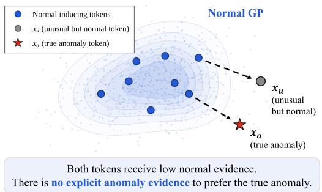
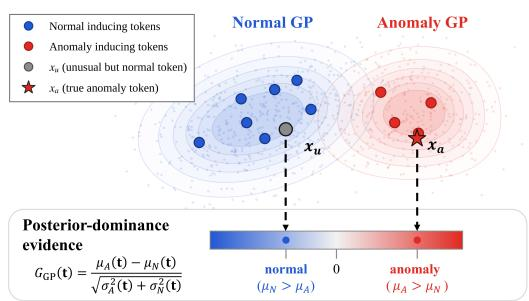
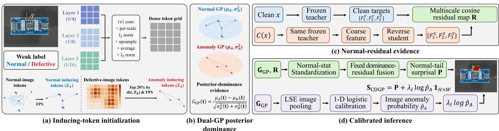
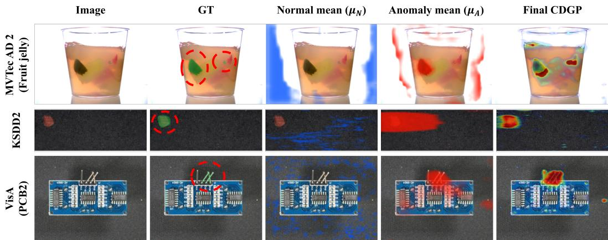
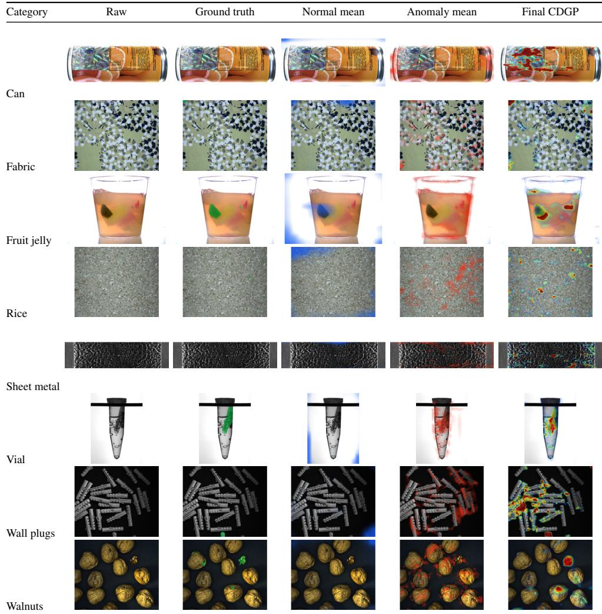
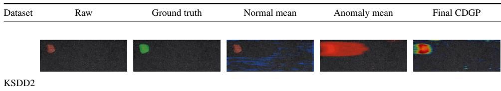
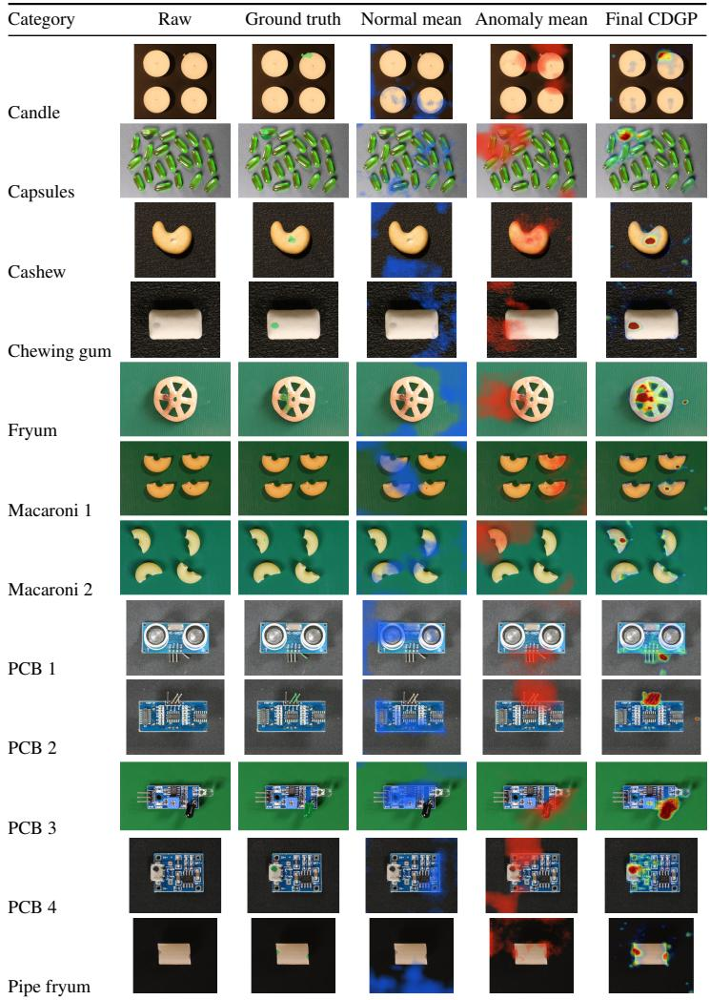
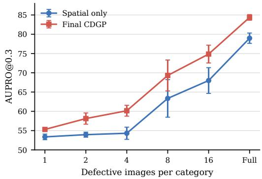
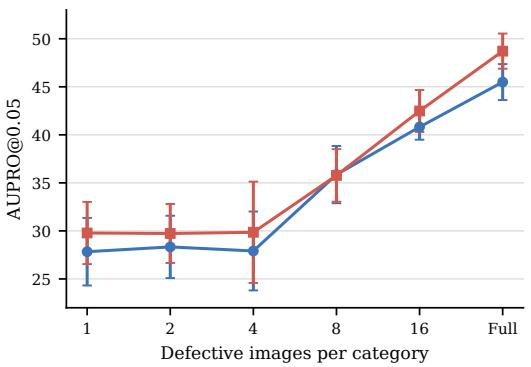

# CDGP: Contrastive Dual Gaussian Processes for Weakly Supervised Anomaly Segmentation

Seungjun Chu∗ Korea University

Mateusz Nowak Dartmouth College

Seokhee Han∗ Dartmouth College

Peter Chin Dartmouth College

## Abstract

Industrial visual inspection must both decide whether a product is defective and localize the defect, yet pixel-level masks are costly to collect at scale. Most anomalysegmentation methods learn only from defect-free images and score deviations from normality. A true defect and an unusual-but-normal region, however, can both deviate substantially and receive similarly high scores. We propose Contrastive Dual Gaussian Processes (CDGP), a weakly supervised framework that models normal and anomaly inducing-variable predictive distributions over dense tokens. Its posterior-dominance statistic standardizes their predictive-mean difference by the joint predictive uncertainty, providing both spatial evidence and image-level confidence. This evidence complements hierarchical normal-reconstruction residuals for fine localization. All calibration uses training data only, without human pixel annotations or test-time fitting. Across MVTec AD 2, KSDD2, and VisA, CDGP ranks first among the evaluated methods on all MVTec AD 2 localization metrics and is first-place or competitive on KSDD2 and VisA. Factorized and matched linear-head controls delimit the contribution and scope of the linear-kernel Gaussian process (GP) formulation.

## 1 Introduction

  
(a) One-sided normality scoring.

  
(b) Contrastive dual predictive evidence in CDGP.  
Figure 1: Conceptual motivation for CDGP. One-sided normality scoring can assign equally low normal evidence to an unusual-but-normal region and a true anomaly. CDGP instead models normal and anomaly predictive distributions and scores their posterior dominance at each token.

Industrial visual inspection must both decide whether a product is defective and localize the regions responsible for the failure. Accurate anomaly segmentation supports downstream tasks such as diagnosis, process control, and quality improvement. Yet collecting pixel-level defect masks is costly and time-consuming in real manufacturing environments [2, 18]. Even when defective images are available, defects can be heterogeneous, spatially sparse, or visually ambiguous, making dense annotation slow and inconsistent [2, 6, 20]. This annotation bottleneck has made industrial anomaly segmentation a natural testbed for learning with limited supervision.

Most existing industrial anomaly segmentation methods follow a normal-only learning paradigm, in which models are trained using defect-free images and anomalies are detected as deviations from normality. This paradigm has been highly successful because it avoids the need for pixel-level defect masks by leveraging the abundance of normal relative to defective samples. Representative methods model normal patch distributions, store nominal feature memories, reconstruct normal appearance, or distill normal representations for anomaly scoring [2, 4, 10, 18, 1]. Yet the normal-only assumption also hides an important practical requirement: the training set must be curated to exclude defective samples. Normal-only training is therefore not entirely free from supervision; it shifts the burden from pixel-level annotation to image-level screening or dataset curation.

In many inspection pipelines, the image-level normal/defective labels produced by such screening are naturally available, or at least cheaper to obtain than pixel-level masks. Once these labels exist, discarding defective images forfeits potentially useful information about how anomalies appear, even though exact pixel locations are unknown. This motivates weakly supervised anomaly segmentation, in which both normal and defective images, together with their image-level labels, are used during training without pixel-level annotations. Despite its practicality, weakly supervised anomaly segmentation has been studied less than normal-only anomaly detection on industria benchmarks such as MVTec AD 2 and VisA [6, 20].

However, leveraging defective images with only image-level labels introduces a fundamental localization challenge. Such images typically contain small anomalous regions embedded in largely normal backgrounds, while their labels indicate only the presence of a defect, not its location. Under such weak supervision, activation maps extracted from an image-level classifier may highlight discriminative context that is sufficient for image-level recognition but misaligned with the actual defect regions [19, 12]. This limitation is particularly severe in industrial anomaly segmentation, where defects do not form a coherent visual category and may vary widely in shape, texture, scale, and location. While weakly supervised semantic segmentation has developed increasingly sophisticated class-localization and pseudo-labeling strategies [16, 11], industrial anomaly segmentation requires localizing open-ended deviations rather than recurring semantic object categories.

This localization ambiguity calls for evidence defined at dense locations rather than localization derived only post hoc from an image classifier. We adopt a contrastive view: a token is anomalous when the anomaly predictive function is likely to exceed the normal function, not simply when a normality model explains it poorly. The resulting posterior-dominance statistic serves two coupled roles: it forms a spatial semantic map and, after pooling, estimates whether the image contains a defect. Multiscale normal-reconstruction residuals provide complementary fine spatial detail.

We propose Contrastive Dual Gaussian Processes (CDGP), a weakly supervised anomalysegmentation framework centered on sparse contrastive GP evidence. Figure 1 contrasts its dual predictive formulation with conventional one-sided normality scoring. CDGP represents each image as a grid of normalized multi-scale tokens and induces normal and anomaly predictive distributions from class-specific inducing sets. Sparse GPs provide compact kernel-based predictive functions over dense features [8, 13–15]. CDGP scores each token by posterior dominance between the two predictive distributions.

This direct comparison provides an explicit score at every dense location. To initialize the anomaly GP without masks, we form a noisy candidate pool from defective-image tokens least similar to selected normal tokens. It is only an initialization prior, not a pseudo-mask: an image-level objective subsequently learns both evidence functions despite normal background in defective images.

Token-level GP evidence alone can under-resolve thin defects. CDGP therefore adds a normalonly reverse student whose hierarchical reconstruction residuals supply fine-scale spatial precision. The Dual-GP dominance score supplies complementary spatial and image-level evidence. Normal calibration statistics standardize and fuse the two spatial branches, convert their score to normal-tail surprisal, and calibrate the pooled GP evidence at image level.

Our contributions are summarized as follows:

• We formulate weakly supervised industrial anomaly segmentation as posterior dominance between sparse normal and anomaly predictive functions over dense multi-scale tokens.

• We use a mask-free, defect-enriched initialization and train the Dual-GP core with a minimal three-loss objective: max-margin MIL, covariance-normalized normal compactness, and covariance-normalized anomaly attraction.

• We complement semantic GP contrast with hierarchical normal-reconstruction residuals and training-only calibration to obtain spatially precise predictions.

• Under our matched weak-supervision split, CDGP ranks first among the evaluated methods on all MVTec AD 2 localization metrics and achieves first-place or competitive localization on KSDD2 and VisA; controls separate the complete Dual-GP pathway from modest variance-only refinement and linear-head alternatives.

## 2 Related Work

## 2.1 Normal-Only Industrial Anomaly Segmentation

Industrial anomaly detection and segmentation have been extensively studied under the normalonly learning paradigm, in which models learn nominal appearance from anomaly-free images and identify defects as deviations from normal visual patterns. Representative methods differ in how they represent normality. DRAEM combines reconstruction with synthetically generated anomalies and discriminative segmentation training [18]. PaDiM models pretrained patch embeddings at each spatial location with a multivariate Gaussian distribution [4], whereas PatchCore stores a representative coreset of nominal patch features and performs nearest-neighbor anomaly scoring [10]. Distillationbased methods identify anomalies from discrepancies between teacher and student representations. This family includes reverse distillation [5] and EfficientAD, which emphasizes accurate and efficient inference [1]. These approaches avoid dense defect annotations but do not exploit defective training images when image-level normal/defective labels are available. CDGP instead learns its primary semantic evidence from both normal and defective image labels. It retains a normal-only reversestudent residual as complementary multiscale evidence, rather than treating deviation from normality as the sole anomaly signal.

## 2.2 Weakly Supervised Localization and Industrial Defect Segmentation

Weakly supervised semantic segmentation commonly learns dense localization from image-level class labels. A standard approach trains an image classifier, extracts class activation maps, and uses them directly or as pseudo labels for segmentation [19, 12]. Transformer-based methods improve localization through class-specific tokens or token-level contrast. MCTformer learns localization maps using multiple class tokens [16], while ToCo contrasts patch and class tokens to improve weakly supervised segmentation [11]. These methods generally assume recurring semantic categories with relatively stable visual structure. Industrial anomalies instead represent heterogeneous and open-ended deviations whose shape, appearance, scale, and location may vary substantially. Consequently, image level classifiers can rely on discriminative context that supports classification without accurately localizing the underlying defect.

Industrial inspection studies have also explored forms of supervision weaker than dense pixel-level annotation. Božic et al. study weak, mixed, and fully supervised surface-defect detection usingˇ annotations ranging from image-level labels to pixel-level masks [3]. WeakREST supports imagelevel or optional coarse spatial supervision and combines block-wise classification with synthetic false anomalies [7]. SuperSimpleNet provides a unified framework for normal-only, weakly supervised, and fully supervised surface-defect detection; its weak mode learns from image tags and feature-space synthetic anomalies without human masks [9]. CDGP likewise uses only binary image labels, but differs by explicitly contrasting probabilistic normal and anomaly evidence and complementing it with normal-only hierarchical reconstruction.

  
Figure 2: Overview of CDGP. (a) Multi-scale tokens initialize the normal and anomaly GP inducing sets through diverse normal sampling and hard-candidate mining. (b) Their joint predictive mean and variance define posterior-dominance evidence. (c) A frozen teacher and normal-only reverse student provide hierarchical residual evidence. (d) Training-only calibration fuses the two signals into the final anomaly map.

## 2.3 Probabilistic and Statistical Anomaly Scoring

Industrial anomaly scoring often relies on statistical or distance-based comparisons to nominal features. PaDiM estimates spatial Gaussian distributions and uses Mahalanobis distance for anomaly scoring, whereas PatchCore measures distance to a representative memory of nominal patch features [4, 10]. These approaches characterize abnormality primarily through deviation from normality.

GPs provide predictive distributions over latent functions through kernel-based modeling [8]. Sparse GP approximations use a finite set of inducing points to reduce prediction cost [13, 14]. Deep kernel learning combines learned neural representations with kernel-based predictors [15]. CDGP differs from one-sided statistical anomaly scoring by modeling both normal and anomalous evidence over a shared dense token space. It localizes defects through the standardized posterior dominance of two induced predictive functions, complements this semantic evidence with hierarchical normalreconstruction residuals, and calibrates both signals using only held-out training data. Each trained model operates independently at test time without dense ground truth or test-time fitting.

## 3 Method

Figure 2 summarizes CDGP. Normal and anomaly inducing tokens define two sparse GP evidence functions whose posterior-dominance score provides dense semantic evidence and, after pooling, image-level confidence. After training the Dual GP, we freeze it, learn a complementary normalresidual branch, and combine both signals using training-only calibration.

## 3.1 Dense Multi-Scale Token Representation

We use an ImageNet-pretrained WideResNet-50-2 as the backbone encoder [17]. Let $\mathbf { F } _ { 1 } , \mathbf { F } _ { 2 }$ , and $\mathbf { F } _ { 3 }$ denote feature maps from layer1, layer2, and layer3, respectively. We use these three stages to retain spatial detail while incorporating progressively higher-level representations.

Each feature map is projected to a shared latent dimension $D$ using a $1 \times 1$ convolution, normalized channel-wise, and aligned to the spatial resolution of the first stage:

$$
\mathbf { T } = \ell _ { 2 } \left( \frac { 1 } { 3 } \sum _ { \ell = 1 } ^ { 3 } \mathbf { U p } _ { \ell \to 1 } \left[ \ell _ { 2 } ( \phi _ { \ell } ( \mathbf { F } _ { \ell } ) ) \right] \right) \in \mathbb { R } ^ { D \times H ^ { \prime } \times W ^ { \prime } } ,\tag{1}
$$

where $\phi _ { \ell }$ denotes the stage-specific projection, $\mathrm { U p } _ { \ell \to 1 }$ bilinearly resizes a feature map to the layer1 resolution, and $H ^ { \prime } = H \breve { / } 4$ and $W ^ { \prime } = \breve { W } / 4$ . For $\ell = 1$ , the resizing operator is the identity.

We denote the unit-norm token at spatial location $( h , w )$ by $\mathbf { t } _ { h w } \in \mathbb { R } ^ { D }$ . The resulting dense token grid is shared by the normal GP and the anomaly GP. The three backbone stages and the projection layers are optimized during Dual-GP training, while the earlier encoder stem remains frozen.

## 3.2 Hard-Candidate Inducing Initialization

Figure 2(a) summarizes the inducing-token initialization procedure. The normal GP and anomaly GP require different initialization strategies because normal images contain only nominal regions, whereas defective images contain both anomalous regions and substantial normal background.

For the normal GP, we collect dense tokens from normal training images and select a diverse subset using greedy farthest-point sampling, following the standard coreset construction used for patch representations [10]. At each iteration, the procedure adds the candidate token whose maximum cosine similarity to the currently selected set is smallest. This produces a compact set of normal-GP inducing tokens $\mathbf { Z } _ { N }$ that covers diverse regions of the nominal token space.

Directly sampling anomaly-GP inducing tokens from all tokens in defective images would allow normal background tokens to dominate the inducing set. We therefore compute the cosine distance of each defective-image token from the normal-GP inducing set:

$$
d ( \mathbf { t } , \mathbf { Z } _ { N } ) = 1 - \operatorname* { m a x } _ { j } \mathbf { t } ^ { \top } \mathbf { Z } _ { N , j } .\tag{2}
$$

We retain the top 20% of defective-image tokens with the largest $d ( \mathbf { t } , \mathbf { Z } _ { N } )$ as the hard-candidate pool. The anomaly-GP inducing-token set $\mathbf { Z } _ { A }$ is then selected from this pool using greedy farthest-point sampling. The pool is noisy initial support rather than a defect pseudo-mask or a set of pure defect prototypes; GP values and the encoder are subsequently learned from image labels.

The inducing-token locations remain fixed throughout training. The inducing-value distribution parameters, multi-scale projection layers, and trainable backbone stages are optimized using imagelevel supervision. We use $\bar { M } _ { N } = 3 2 $ and $M _ { A } = 1 6$ for every dataset and do not tune these budgets by category. Candidate selection uses only binary image labels and never accesses training masks.

## 3.3 Contrastive Dual-GP Evidence

Induced predictive functions. CDGP models normal and anomalous evidence as two sparse Gaussian-process functions over the shared token space. Sparse inducing-point approximations provide scalable kernel-based prediction from compact inducing sets [8, 13, 14].

For each evidence type $c \in \{ N , A \}$ , let $\mathbf { Z } _ { c } \in \mathbb { R } ^ { M _ { c } \times D }$ denote the inducing-token set and $\mathbf { u } _ { c } \in \mathbb { R } ^ { M _ { c } }$ the corresponding inducing function values. We parameterize an independent learned Gaussian distribution over each set of inducing values:

$$
\begin{array} { r } { q ( \mathbf { u } _ { c } ) = \mathcal { N } ( \mathbf { m } _ { c } , \mathbf { S } _ { c } ) , \qquad \mathbf { S } _ { c } = \mathbf { L } _ { c } \mathbf { L } _ { c } ^ { \top } . } \end{array}\tag{3}
$$

Together with the sparse GP conditional, this distribution induces

$$
q _ { c } ( f _ { c } ) = \int p ( f _ { c } \mid \mathbf { u } _ { c } , \mathbf { Z } _ { c } ) q ( \mathbf { u } _ { c } ) d \mathbf { u } _ { c } .\tag{4}
$$

We call $q _ { c } ( f _ { c } )$ the induced predictive process and use its first two moments. The shorthand “posterior” below refers operationally to this learned $q _ { c } ,$ not to an exact Bayesian posterior.

We use a linear kernel over normalized tokens:

$$
k ( { \bf t } , { \bf t ^ { \prime } } ) = { \bf t } ^ { \top } { \bf t ^ { \prime } } .\tag{5}
$$

Let

$$
\mathbf { K } _ { c } = k ( \mathbf { Z } _ { c } , \mathbf { Z } _ { c } ) + \delta \mathbf { I } ,
$$

where $\delta = 1 0 ^ { - 3 }$ is a fixed diagonal jitter used for numerical stability. We denote by $\mathbf { k } _ { \mathbf { t } \mathbf { Z } _ { c } }$ the vector of kernel evaluations between a query token t and the inducing set. The resulting predictive mean is

$$
\begin{array} { r } { \mu _ { c } ( \mathbf t ) = \mathbf k _ { \mathbf t \mathbf Z _ { c } } \mathbf K _ { c } ^ { - 1 } \mathbf m _ { c } . } \end{array}\tag{6}
$$

For the linear kernel, the corresponding predictive variance is

$$
\boldsymbol { \sigma } _ { c } ^ { 2 } ( \mathbf { t } ) = \mathbf { t } ^ { \top } \left[ \mathbf { I } - \mathbf { Z } _ { c } ^ { \top } \mathbf { K } _ { c } ^ { - 1 } \mathbf { Z } _ { c } + \mathbf { Z } _ { c } ^ { \top } \mathbf { K } _ { c } ^ { - 1 } \mathbf { S } _ { c } \mathbf { K } _ { c } ^ { - 1 } \mathbf { Z } _ { c } \right] \mathbf { t } .\tag{7}
$$

Mean margin for weak training. The normal and anomaly GPs estimate evidence $\mu _ { N } ( \mathbf { t } )$ and $\mu _ { A } ( \mathbf { t } )$ . Their predictive-mean margin is

$$
s _ { \mu } ( \mathbf { t } ) = \mu _ { A } ( \mathbf { t } ) - \mu _ { N } ( \mathbf { t } ) .\tag{8}
$$

This signed margin supplies the weak training signal in Section 3.4; it is not the final inference score.

Posterior-dominance evidence. Because the two inducing distributions are parameterized independently, their difference $\Delta f ( \mathbf { t } ) = f _ { A } ( \mathbf { t } ) - f _ { N } ( \mathbf { t } )$ has induced marginal

$$
q ( \Delta f ( \mathbf { t } ) ) = \mathcal { N } \big ( s _ { \mu } ( \mathbf { t } ) , \sigma _ { A } ^ { 2 } ( \mathbf { t } ) + \sigma _ { N } ^ { 2 } ( \mathbf { t } ) \big ) .\tag{9}
$$

CDGP uses its standardized dominance statistic

$$
\begin{array} { c } { { \displaystyle g ( { \bf t } ) = \frac { \mu _ { A } ( { \bf t } ) - \mu _ { N } ( { \bf t } ) } { \sqrt { \sigma _ { A } ^ { 2 } ( { \bf t } ) + \sigma _ { N } ^ { 2 } ( { \bf t } ) } } , } } \\ { { \displaystyle \mathrm { P r } [ f _ { A } ( { \bf t } ) > f _ { N } ( { \bf t } ) ] = \Phi ( g ( { \bf t } ) ) . } } \end{array}\tag{10}
$$

where $\Phi$ is the standard-normal cumulative distribution function (CDF); in implementation the summed variance is lower-bounded by $1 0 ^ { - 6 }$ . We use $^ { g , }$ , rather than applying Φ, because they induce the same ordering while $g$ retains an unconstrained evidence scale. For dense prediction, $g _ { h w } = g ( \mathbf { t } _ { h w } )$

Scope of the linear-kernel GP formulation. Because dense token targets are unavailable, $q ( \mathbf { u } _ { c } )$ is learned discriminatively using the image-level objective in Eq. 13, rather than by optimizing a token-level likelihood or an evidence lower bound. The inducing locations $\mathbf { Z } _ { c }$ are fixed after initialization. We therefore do not claim that $q _ { c } ( f _ { c } )$ is the exact Bayesian posterior p( $\smash  f _ { c } \mid D \}$ or that our training procedure is Titsias-style variational sparse-GP inference with jointly optimized inducing locations.

With the linear kernel, each predictive mean is linear in the learned token space:

$$
\mu _ { c } ( \mathbf { t } ) = \mathbb { E } _ { q _ { c } } [ f _ { c } ( \mathbf { t } ) ] = \mathbf { t } ^ { \top } \boldsymbol { \beta } _ { c } , \qquad \boldsymbol { \beta } _ { c } = \mathbf { Z } _ { c } ^ { \top } \mathbf { K } _ { c } ^ { - 1 } \mathbf { m } _ { c } .\tag{11}
$$

Consequently, the training margin is linear in the token:

$$
\begin{array} { r } { s _ { \mu } ( \mathbf { t } ) = \mathbf { t } ^ { \top } ( \beta _ { A } - \beta _ { N } ) . } \end{array}\tag{12}
$$

We therefore do not attribute CDGP to nonlinear GP mean expressivity. Each $\beta _ { c }$ is restricted to the span of its class-specific inducing tokens. Unlike a homoscedastic linear head, however, the induced process ties this mean to a nonnegative, query-dependent predictive variance from the same $q ( \mathbf { u } _ { c } )$ . Consequently, Eq. 10 is not generally a fixed linear head even though its numerator is linear. In the zero-jitter limit, the first variance component measures token mass outside the inducing span; the practical jitter yields a ridge-regularized analogue. The same induced covariance shapes auxiliary training and final inference. An engineered heteroscedastic linear model with an equivalent quadratic variance could reproduce this form. Our GP claim is therefore a compact inducing-variable construction of mean and uncertainty, not universal superiority over equivalent reparameterizations; the matched direct-linear control bounds its benefit against simpler mean scoring.

## 3.4 Weakly Supervised Dual-GP Training

The Dual-GP core is trained end-to-end with three complementary image-supervised signals:

$$
\begin{array} { r } { \mathcal { L } = \mathcal { L } _ { \mathrm { M I L } } + \mathcal { L } _ { \mathrm { C M P } } + 4 \mathcal { L } _ { \mathrm { A B N } } . } \end{array}\tag{13}
$$

These weights are fixed for every dataset. The three terms respectively separate normal and defective bags, reinforce normal-GP evidence on nominal tokens, and concentrate anomaly-GP evidence within defective images. No opposite-anchor repulsion or inducing-mean norm penalty is used in the model.

Max-margin multiple-instance learning. A defective image should contain at least one highscoring token, whereas a normal image should contain no high-scoring token. For image i, let

$$
m _ { i } = \operatorname* { m a x } _ { h , w } s _ { \mu , i , h w } .\tag{14}
$$

The corresponding loss is

$$
\begin{array} { r } { \mathcal { L } _ { \mathrm { M I L } } ^ { ( i ) } = \mathbf { 1 } [ y _ { i } = 1 ] \operatorname* { m a x } ( 0 , \gamma - m _ { i } ) } \\ { + \mathbf { 1 } [ y _ { i } = 0 ] \operatorname* { m a x } ( 0 , m _ { i } ) , } \end{array}\tag{15}
$$

where $\gamma = 0 . 5$ is fixed in all experiments. The first term requires defective images to contain at least one token whose mean margin exceeds the threshold, while the second suppresses positive margins in normal images.

Covariance-normalized evidence losses. We use the predictive variance $\sigma _ { c } ^ { 2 } ( \mathbf { t } )$ from the standard sparse-GP expression to define normalized evidence

$$
\tilde { \mu } _ { c } ( { \bf t } ) = \frac { \mu _ { c } ( { \bf t } ) } { \sqrt { \sigma _ { c } ^ { 2 } ( { \bf t } ) } + \epsilon } , \qquad c \in \{ N , A \} .\tag{16}
$$

This per-function normalization is used only in ${ \mathcal { L } } _ { \mathrm { C M P } }$ and $\mathcal { L } _ { \mathrm { A B N } } ;$ ; final inference instead standardizes the difference distribution as in Eq. 10.

Let $\mathcal { T } _ { N }$ and $\mathcal { T } _ { A }$ index normal and defective images, respectively, and let j index spatial tokens. The normal compactness term is

$$
\begin{array} { r } { \mathcal { L } _ { \mathrm { C M P } } = - \mathbb { E } _ { i \in \mathcal { T } _ { N } , j } \left[ \widetilde { \mu } _ { N } \big ( \mathbf { t } _ { i j } \big ) \right] . } \end{array}\tag{17}
$$

It encourages high normalized normal-GP evidence over nominal images.

For each defective image, we form a detached spatial attention map from the current mean-margin score:

$$
a _ { i , j } = \mathrm { s o f t m a x } _ { j } \left[ \mathrm { s t o p g r a d } \left( \frac { s _ { \mu , i , j } - \overline { { s } } _ { \mu , i } } { \mathrm { s t d } _ { j } ( s _ { \mu , i , j } ) + \epsilon } \right) \right] .\tag{18}
$$

The anomaly-attraction loss then reinforces normalized anomaly-GP evidence at the attended locations:

$$
\mathcal { L } _ { \mathrm { A B N } } = - \mathbb { E } _ { i \in \mathcal { Z } _ { A } } \left[ \sum _ { j } a _ { i , j } \widetilde { \mu } _ { A } ( \mathbf { t } _ { i j } ) \right] .\tag{19}
$$

Unlike the MIL term, which acts on the most anomalous token in each bag, $\mathcal { L } _ { \mathrm { C M P } }$ and $\mathcal { L } _ { \mathrm { A B N } }$ shape the two class-specific evidence functions over dense locations. Their covariance normalization supplies a covariance-aware training signal, while Eq. 10 uses the joint predictive variance directly at inference.

## 3.5 Hierarchical Normal-Residual Evidence

The Dual GP provides semantic normal-versus-anomaly evidence, but its token grid can under-resolve thin defects. We therefore complement it with a normal-only reconstruction signal at three feature scales, following the reverse-distillation principle [5]. A frozen ImageNet-pretrained teacher produces features $\{ \mathbf { F } _ { \ell } ^ { T } ( \mathbf { x } ) \} _ { \ell = 1 } ^ { 3 }$ . A reverse student takes the teacher’s coarse representation of a corrupted normal image xe and reconstructs the clean teacher hierarchy:

$$
\{ \mathbf { F } _ { \ell } ^ { S } ( \widetilde { \mathbf { x } } ) \} _ { \ell = 1 } ^ { 3 } = \mathcal { S } _ { \psi } \left( \mathbf { F } _ { 3 } ^ { T } ( \widetilde { \mathbf { x } } ) \right) .\tag{20}
$$

The corruption combines weak additive noise, local averaging, and random erasing; its detailed probabilities are fixed across datasets and reported in the supplement. Only normal images from the second-stage fit subset are used to optimize the student. At scale ℓ, the cosine reconstruction residual is

$$
\begin{array} { r } { r _ { \ell , h w } ( \mathbf x ) = 1 - \left. \overline { { \mathbf F } } _ { \ell , h w } ^ { T } ( \mathbf x ) , \overline { { \mathbf F } } _ { \ell , h w } ^ { S } ( \mathbf x ) \right. , } \end{array}\tag{21}
$$

where the overline denotes channel-wise $\ell _ { 2 }$ normalization. The student is optimized using the mean reconstruction residual together with a hard-tail term over the largest residuals and a smooth feature-reconstruction term:

$$
\mathcal { L } _ { \mathrm { r e c } } = \frac { 1 } { 3 } \sum _ { \ell = 1 } ^ { 3 } \left[ \mathrm { M e a n } ( r _ { \ell } ) + \lambda _ { h } \mathrm { T o p M e a n } _ { q } ( r _ { \ell } ) \right.\tag{22}
$$

We set $q = 0 . 1 0 , \lambda _ { h } = 0 . 6 5$ , and $\lambda _ { s } = 0 . 1 0$ , where $\mathcal { L } _ { \mathrm { s m o o t h } } ^ { ( \ell ) }$ is the Smooth- $L _ { 1 }$ distance between the channel-normalized teacher and student features. At inference, corruption is disabled: the same clean test image is passed to the teacher, and the student reconstructs its hierarchy from the teacher’s clean coarse feature. After alignment to the Dual-GP grid, the default hierarchical residual map is the average of the three scale-wise residuals,

$$
\mathbf { R } ( \mathbf { x } ) = \frac { 1 } { 3 } \sum _ { \ell = 1 } ^ { 3 } \operatorname { U p } _ { \ell \to 1 } \left( \mathbf { r } _ { \ell } ( \mathbf { x } ) \right) .\tag{23}
$$

## 3.6 Calibrated Inference

For the second-stage student and calibration procedure, we partition the weak training set into a fit subset and a disjoint 20% calibration subset. The Dual GP is frozen before this stage. Normal calibration images are used for branch standardization and spatial tail estimation; binary labels from both normal and defective calibration images are used only for the image-level calibrator described below.

We evaluate Eq. 10 over the token grid to obtain the posterior-dominance map

$$
\mathbf { G } _ { \mathrm { G P } } ( \mathbf { x } ) = \{ g ( \mathbf { t } _ { h w } ) \} _ { h , w } .\tag{24}
$$

For each spatial branch $b \in \{ G _ { \mathrm { G P } } , R \}$ , scalar location and scale statistics $( m _ { b } , s _ { b } )$ are the mean and standard deviation estimated from normal calibration images, and $\mathcal { Z } _ { b } ( \mathbf B ) = ( \mathbf B - m _ { b } ) / ( s _ { b } + \epsilon )$ . The fused spatial evidence is

$$
{ \bf U } ( { \bf x } ) = w \mathcal { Z } _ { G _ { \mathrm { G P } } } ( { \bf G } _ { \mathrm { G P } } ) + \left( 1 - w \right) \mathcal { Z } _ { R } ( { \bf R } ) , \qquad w = 0 . 0 2 5 .\tag{25}
$$

Both maps are bilinearly upsampled to the input resolution before fusion.

Let $\{ u _ { d , n } ^ { ( N ) } \} _ { n = 1 } ^ { N _ { d } }$ be fused pixel scores collected from normal calibration images of dataset category d. For a query score $u ,$ we estimate its finite-sample upper-tail probability by

$$
\widehat { p } _ { N , d } ( u ) = \frac { 1 + \sum _ { n = 1 } ^ { N _ { d } } \mathbf { 1 } [ u _ { d , n } ^ { ( N ) } > u ] } { N _ { d } + 1 } .\tag{26}
$$

The calibrated spatial evidence is the corresponding normal-tail surprisal,

$$
P _ { h w } ( \mathbf { x } ) = - \log \operatorname* { m a x } \{ \widehat { p } _ { N , d } ( U _ { h w } ( \mathbf { x } ) ) , e ^ { - 1 6 } \}\tag{27}
$$

For image-level detection, the dominance scores are aggregated using smooth log-sum-exp pooling with fixed $r = 8 \colon$

$$
a ( \mathbf x ) = \frac 1 r \log \left( \frac 1 { H ^ { \prime } W ^ { \prime } } \sum _ { h , w } \exp ( r g _ { h w } ) \right) .\tag{28}
$$

A one-dimensional logistic calibrator maps $a ( \mathbf { x } )$ to an anomaly probability ${ \widehat { p } } _ { A } ( \mathbf { x } )$ . Before fitting, image scores are standardized using the median and IQR scale of normal calibration scores. We constrain the fitted slope to be non-negative so that calibration cannot reverse the predefined anomalyscore direction. The final CDGP score is

$$
\begin{array} { r } { \mathbf { S } _ { \mathrm { C D G P } } ( \mathbf { x } ) = \mathbf { P } ( \mathbf { x } ) + \lambda _ { I } \log \widehat { p } _ { A } ( \mathbf { x } ) \mathbf { 1 } _ { H \times W } , \qquad \lambda _ { I } = 1 / 3 . } \end{array}\tag{29}
$$

Here the scalar log ${ \widehat { p } } _ { A } ( \mathbf { x } )$ is broadcast uniformly over the $H \times W$ map. It therefore cannot change pixel ordering within an image; it suppresses all locations in images judged likely normal and changes only cross-image score comparisons. We use a fixed moderate $\lambda _ { I }$ so this global confidence remains subordinate to spatial evidence; the supplement reports its sensitivity. The image-level anomaly score is ${ \widehat { p } } _ { A } ( \mathbf { x } )$ . All calibration quantities are estimated independently for each trained model using only its training partition.

## 4 Experiments

## 4.1 Experimental Setup

Supervision protocol. CDGP uses only normal/defective image labels; spatial annotations are excluded from training, tuning, calibration, and checkpoint selection. Masks are loaded only for final evaluation of the fixed-budget last checkpoint. Here “weak” denotes label granularity, not a low-shot claim; all primary experiments use the declared matched or high-shot splits.

<table><tr><td rowspan="2">Method</td><td colspan="3">MVTec AD 2</td><td colspan="2">KSDD2</td><td colspan="2">VisA</td></tr><tr><td>AUROC-P AUPRO@.3 AUPRO@.05 AUROC-P AUPRO@.3 AUROC-P AUPRO@.3</td><td></td><td></td><td></td><td></td><td></td><td></td></tr><tr><td colspan="8">Normal-only supervision</td></tr><tr><td>PaDiM [4]</td><td> $8 5 . 0 { \scriptstyle \pm 1 . 2 }$ </td><td> $4 9 . 5 { \pm } 1 . 1$ </td><td> $1 8 . 2 { \scriptstyle \pm 1 . 3 }$ </td><td> $9 3 . 4 { \scriptstyle \pm 0 . 2 }$ </td><td> $8 7 . 1 { \pm } 1 . 2 $ </td><td> $9 7 . 2 { \scriptstyle \pm 0 . 2 }$ </td><td> $8 3 . 3 { \scriptstyle \pm 1 . 4 }$ </td></tr><tr><td>PatchCore [10]</td><td> $9 1 . 2 { \scriptstyle \pm 1 . 2 }$ </td><td> $6 3 . 0 { \scriptstyle \pm 1 . 3 }$ </td><td> $3 6 . 1 { \scriptstyle \pm 2 . 3 }$ </td><td> $9 1 . 6 { \scriptstyle \pm 0 . 0 }$ </td><td> $8 5 . 2 { \scriptstyle \pm 0 . 1 }$ </td><td> $9 7 . 6 { \scriptstyle \pm 0 . 0 }$ </td><td> $8 5 . 5 { \scriptstyle \pm 0 . 1 }$ </td></tr><tr><td>RD4AD [5]</td><td> $8 6 . 7 { \scriptstyle \pm 0 . 9 }$ </td><td> $5 9 . 2 { \scriptstyle \pm 0 . 6 }$ </td><td> $2 9 . 6 { \scriptstyle \pm 1 . 6 }$ </td><td> $9 5 . 0 { \scriptstyle \pm 0 . 1 }$ </td><td> $9 0 . 0 { \scriptstyle \pm 0 . 1 }$ </td><td> $9 9 . 0 { \scriptstyle \pm 0 . 0 }$ </td><td> $9 3 . 0 { \scriptstyle \pm 0 . 1 }$ </td></tr><tr><td>DRAEM [18]</td><td> $5 7 . 3 { \scriptstyle \pm 4 . 0 }$ </td><td> $2 3 . 9 { \scriptstyle \pm 5 . 4 }$ </td><td> $7 . 1 { \pm } 0 . 9$ </td><td> $5 1 . 5 { \scriptstyle \pm 7 . 4 }$ </td><td> $2 6 . 7 { \scriptstyle \pm 6 . 2 }$ </td><td> $5 3 . 8 { \scriptstyle \pm 4 . 8 }$ </td><td> $3 1 . 1 { \pm } 5 . 0$ </td></tr><tr><td>EfficientAD [1]</td><td> $8 6 . 5 { \scriptstyle \pm 2 . 4 }$ </td><td> $5 3 . 6 { \scriptstyle \pm 0 . 4 }$ </td><td> $3 6 . 8 { \scriptstyle \pm 0 . 5 }$ </td><td> $9 1 . 2 { \scriptstyle \pm 0 . 5 }$ </td><td> $8 1 . 2 { \scriptstyle \pm 1 . 2 }$ </td><td> $\mathbf { 9 9 . 4 } _ { \pm 0 . 0 }$ </td><td> ${ \bf 9 6 . 9 { \scriptstyle \pm 0 . 1 } }$ </td></tr><tr><td colspan="8">Image-level supervision</td></tr><tr><td>Classifier + Grad-CAM</td><td> $\underline { { 9 2 . 0 { \scriptstyle \pm 0 . 7 } } }$ </td><td> $\underline { { 7 1 . 7 } } \pm 1 . 9$ </td><td> $2 7 . 9 { \scriptstyle \pm 3 . 4 }$ </td><td> $9 3 . 1 { \pm } 0 . 4 $ </td><td> $8 7 . 3 { \pm } 1 . 1$ </td><td> $9 1 . 8 { \scriptstyle \pm 0 . 8 }$ </td><td> $7 9 . 5 { \scriptstyle \pm 0 . 9 }$ </td></tr><tr><td>MIL-TopK</td><td> $5 5 . 6 { \scriptstyle \pm 2 . 3 }$ </td><td> $1 9 . 5 { \scriptstyle \pm 5 . 1 }$ </td><td> $6 . 9 { \scriptstyle \pm 1 . 4 }$ </td><td> $9 1 . 6 _ { \pm 0 . 2 }$ </td><td> $8 7 . 1 _ { \pm 0 . 4 }$ </td><td> $4 7 . 1 _ { \pm 2 . 0 }$ </td><td> $2 2 . 2 _ { \pm 0 . 9 }$ </td></tr><tr><td>SuperSimpleNet (weak) [9]</td><td> $8 5 . 0 { \scriptstyle \pm 1 . 0 }$ </td><td> $4 8 . 1 { \pm } 3 . 9$ </td><td> $2 6 . 2 { \scriptstyle \pm 3 . 7 }$ </td><td> $9 3 . 2 { \scriptstyle \pm 1 . 0 }$ </td><td> ${ \bf 9 5 . 1 { \scriptstyle \pm 0 . 5 } }$ </td><td> $8 9 . 9 { \scriptstyle \pm 3 . 4 }$ </td><td> $8 0 . 1 { \scriptstyle \pm 5 . 7 }$ </td></tr><tr><td>WeakREST [7]</td><td> $8 4 . 4 { \scriptstyle \pm 1 . 2 }$ </td><td> $5 4 . 5 { \scriptstyle \pm 0 . 6 }$ </td><td> $2 8 . 5 { \scriptstyle \pm 2 . 3 }$ </td><td> $9 4 . 3 { \scriptstyle \pm 3 . 3 }$ </td><td> $8 8 . 0 { \scriptstyle \pm 4 . 0 }$ </td><td> $9 6 . 6 { \scriptstyle \pm 2 . 0 }$ </td><td> $8 6 . 2 { \scriptstyle \pm 2 . 1 }$ </td></tr><tr><td>Static max similarity</td><td> $9 0 . 3 { \scriptstyle \pm 1 . 1 }$ </td><td> $6 9 . 1 { \scriptstyle \pm 1 . 9 }$ </td><td> $1 0 . 4 { \pm } 1 . 7$ </td><td> $9 7 . 1 { \pm } 0 . 5 $ </td><td> $9 2 . 8 { \scriptstyle \pm 0 . 8 }$ </td><td> $8 5 . 5 { \scriptstyle \pm 1 . 7 }$ </td><td> $6 5 . 0 { \scriptstyle \pm 4 . 3 }$ </td></tr><tr><td>CDGP (Ours)</td><td> $\mathbf { 9 6 . 8 _ { \pm 0 . 7 } }$ </td><td> $\mathbf { 8 4 . 4 } _ { \pm 0 . 7 }$ </td><td> ${ \bf 4 8 . 7 \pm 1 . 8 }$ </td><td> $\mathbf { 9 8 . 0 2 } _ { \pm 0 . 6 }$ </td><td> $9 3 . 5 { \scriptstyle \pm 0 . 1 }$ </td><td> $\mathbf { 9 9 . 4 } _ { \pm 0 . 1 }$ </td><td> $9 6 . 1 { \scriptstyle \pm 0 . 7 }$ </td></tr></table>

(a) Localization performance
<table><tr><td>Method</td><td>MVTec AD 2 AUROC-I</td><td>KSDD2 AUROC-I</td><td>VisA AUROC-I</td></tr><tr><td>Normal-only supervision</td><td></td><td></td><td></td></tr><tr><td>PaDiM</td><td> $6 9 . 9 { \scriptstyle \pm 1 . 4 }$ </td><td> $8 6 . 7 \pm 1 . 3$ </td><td> $8 0 . 8 { \scriptstyle \pm 1 . 8 }$ </td></tr><tr><td>PatchCore</td><td> $8 2 . 8 { \scriptstyle \pm 1 . 5 }$ </td><td> $7 9 . 6 { \scriptstyle \pm 0 . 8 }$ </td><td> $8 6 . 6 { \scriptstyle \pm 0 . 4 }$ </td></tr><tr><td>RD4AD</td><td> $7 4 . 3 { \scriptstyle \pm 2 . 4 }$ </td><td> $9 0 . 4 { \scriptstyle \pm 1 . 4 }$ </td><td> $9 5 . 4 { \scriptstyle \pm 0 . 2 }$ </td></tr><tr><td>DRAEM</td><td> $5 4 . 2 { \scriptstyle \pm 5 . 3 }$ </td><td> $6 4 . 5 { \scriptstyle \pm 1 1 . 7 }$ </td><td> $5 6 . 2 { \scriptstyle \pm 2 . 4 }$ </td></tr><tr><td>EfficientAD</td><td> $8 5 . 6 { \scriptstyle \pm 0 . 7 }$ </td><td> $9 5 . 6 { \scriptstyle \pm 0 . 6 }$ </td><td> $9 7 . 7 { \scriptstyle \pm 0 . 0 }$ </td></tr><tr><td>Image-level supervision</td><td></td><td></td><td></td></tr><tr><td>Classifier + Grad-CAM</td><td> $\mathbf { 1 0 0 . 0 { \scriptstyle \pm 0 . 0 } }$ </td><td> $9 0 . 9 { \scriptstyle \pm 4 . 8 }$ </td><td> $9 7 . 8 { \scriptstyle \pm 0 . 7 }$ </td></tr><tr><td>MIL-TopK</td><td> $\underline { { 9 9 . 2 } } \pm 0 . 8$ </td><td> $9 5 . 3 { \scriptstyle \pm 0 . 4 }$ </td><td> $9 1 . 7 { \scriptstyle \pm 0 . 7 }$ </td></tr><tr><td>SuperSimpleNet (weak)</td><td> $9 7 . 5 { \scriptstyle \pm 0 . 6 }$ </td><td> $\mathbf { 9 9 . 5 \bot 0 . 1 }$ </td><td> $\mathbf { 9 9 . 3 _ { \pm 0 . 1 } }$ </td></tr><tr><td>WeakREST</td><td> $7 8 . 1 { \pm } 1 . 1$ </td><td> $9 1 . 6 { \scriptstyle \pm 4 . 2 }$ </td><td> $8 8 . 6 { \scriptstyle \pm 1 . 2 }$ </td></tr><tr><td>Static max similarity</td><td> $\mathbf { 1 0 0 . 0 { \scriptstyle \pm 0 . 0 } }$ </td><td> $9 5 . 9 { \scriptstyle \pm 0 . 7 }$ </td><td> $9 7 . 9 { \pm } 0 . 2 $ </td></tr><tr><td>CDGP (Ours)</td><td> $\mathbf { 1 0 0 . 0 { \scriptstyle \pm 0 . 0 } }$ </td><td> $9 7 . 4 { \pm } 0 . 2 $ </td><td> $9 8 . 4 { \pm } 0 . 3 $ </td></tr></table>

(b) Image-level detection performance

Table 1: Comparison with representative industrial anomaly segmentation baselines on MVTec AD 2, KSDD2, and VisA. Mean ± std (×100) over three seeds. MVTec AD 2 uses our matched weak-supervision 80/20 split, not the official normal-only leaderboard protocol. Best is bold and second best is underlined.

Evaluation metrics. We report image AUROC (AUROC-I), pixel AUROC (AUROC-P), and AUPRO at $\mathrm { F P R } _ { \mathrm { m a x } } = 0 . 3$ , plus AUPRO@0.05 for MVTec $\mathrm { A D } \bar { 2 } \left[ 6 \right]$ . Mean±std uses three seeds; multi-category datasets are averaged by category within seed and then across seeds.

## 4.2 Datasets

MVTec AD 2. MVTec AD 2 is our primary benchmark for comparisons and ablations [6]. Because its official training and validation sets are defect-free, we follow WeakREST [7] and construct category-wise stratified 80/20 splits from the publicly labeled normal and defective images. Each seed-specific disjoint split is shared by CDGP and all rerun baselines.

KSDD2. KSDD2 contains normal and defective images from an industrial surface inspection system [3]. We use its official high-shot train/test split and reduce each training annotation to a binary image-level label.

VisA. VisA comprises twelve industrial categories with diverse anomalies [20]. We use its official 2cls\_highshot train/test split, which provides both normal and anomalous training images, using only image-level labels for supervision.

<table><tr><td>Variant</td><td>AUROC-P</td><td>AUPRO@.3</td><td>AUPRO@.05</td></tr><tr><td>GP-free residual pipeline</td><td> $8 5 . 4 { \scriptstyle \pm 2 . 0 }$ </td><td> $5 3 . 3 { \scriptstyle \pm 0 . 8 }$ </td><td> $2 7 . 7 _ { \pm 3 . 6 }$ </td></tr><tr><td>Spatial GP only  $( + G _ { \mathrm { G P } } )$ </td><td> $9 5 . 2 { \scriptstyle \pm 1 . 3 }$ </td><td> $7 9 . 0 { \scriptstyle \pm 1 . 3 }$ </td><td> $4 5 . 5 { \pm } 1 . 9$ </td></tr><tr><td>Image GP only  $( + \widehat { \boldsymbol { p } } _ { A } )$ </td><td> $9 6 . 4 { \scriptstyle \pm 0 . 6 }$ </td><td> $8 2 . 7 { \scriptstyle \pm 0 . 3 }$ </td><td> $4 6 . 1 { \pm } 1 . 8$ </td></tr><tr><td>Full CDGP (both GP paths)</td><td> $\mathbf { 9 6 . 8 { \scriptstyle \pm 0 . 7 } }$ </td><td> $\mathbf { 8 4 . 4 } _ { \pm 0 . 7 }$ </td><td> ${ \bf 4 8 . 7 \pm 1 . 8 }$ </td></tr></table>

Table 2: Factorized GP contribution on MVTec AD 2 (mean±std, ×100). The middle rows each add exactly one GP path to the first row; the first row contains neither $G _ { \mathrm { G P } }$ nor $\widehat { p } _ { A }$ .

  
Figure 3: Input, ground truth, normal/anomaly predictive evidence, and final CDGP map.

## 4.3 Comparison with Representative Baselines

We compare five normal-only methods [4, 10, 5, 18, 1] with image-level Grad-CAM, MIL-TopK, SuperSimpleNet, WeakREST, and Static max [12, 9, 7]. Static max uses our initialization but direct token–anchor similarity. Reruns share manifests and evaluation; normal-only methods are complementary references.

Under the matched MVTec protocol, Table 1 ranks CDGP first on all three localization metrics, ahead by 4.8/12.7/11.9 points. Within image-level methods, it ranks first on both VisA metrics and first/second on KSDD2. Across both supervision groups, it ranks among the top two on all KSDD2 and VisA localization metrics.

## 4.4 Component Analysis on MVTec AD 2

With matched manifests and calibration, Table 2 factorizes dense posterior dominance $G _ { \mathrm { G P } }$ and its image calibration $\widehat { p } _ { A }$ . From the GP-free residual pipeline, spatial evidence alone adds $9 . 8 / 2 5 . 7 / 1 \breve { 7 } . 8 $ , image evidence alone adds $1 1 . 0 / 2 9 . 4 / 1 8 . 4 .$ and both add 11.4/31.1/21.0 AUROC-P/AUPRO@.3/AUPRO@.05 points. Because both paths share the same statistic, gains need not add. In particular, $w = 0$ retains ${ \widehat { p } } _ { A } ;$ hence the full-minus-image difference $( + 0 . 4 / \overset { - } { + } 1 . 7 / + 2 . 6 )$ is a conditional spatial refinement given GP image calibration, not the end-to-end effect of removing the Dual GP.

Changing only same-checkpoint mean-margin scoring to posterior dominance improves the three MVTec AD 2 localization metrics by $0 . 1 \bar { / } 0 . 3 / 0 . 3$ points. This controlled comparison isolates predictive variance at inference and shows that posterior standardization acts as a modest refinement rather than the primary source of the full-pipeline gain. A matched direct-linear control is reported in the supplement; its comparable performance bounds our claim to a coherent inducing-variable mean–variance construction rather than superior mean expressivity.

Figure 3 shows GP responses and final localization across all three datasets.

## 5 Conclusion

CDGP combines Dual-GP posterior dominance, hierarchical normal residuals, and training-only calibration for weakly supervised anomaly segmentation. It leads all MVTec AD 2 localization metrics and remains competitive on KSDD2 and VisA. Factorized ablations confirm complementary spatial and image-level roles. Matched linear-head controls delimit the formulation’s contribution relative to unconstrained linear scoring. Although the linear kernel makes the training margin linear, joint predictive variance yields a token-dependent dominance score. This supports inducing-variable prediction from image labels without pixel annotations.

## References

[1] Kilian Batzner, Lars Heckler, and Rebecca König. EfficientAD: Accurate visual anomaly detection at millisecond-level latencies. In Proceedings ofthe IEEE/CVF Winter Conference on Applications ofComputer Vision, pages 128–138, 2024.

[2] Paul Bergmann, Michael Fauser, David Sattlegger, and Carsten Steger. Mvtec ad — a comprehensive real-world dataset for unsupervised anomaly detection. In Proceedings of the IEEE/CVF Conference on Computer Vision and Pattern Recognition, pages 9584–9592, 2019.

[3] Jakob Božic, Domen Tabernik, and Danijel Skoˇ caj. Mixed supervision for surface-defectˇ detection: From weakly to fully supervised learning. Computers in Industry, 129:103459, 2021. doi: 10.1016/j.compind.2021.103459.

[4] Thomas Defard, Aleksandr Setkov, Angelique Loesch, and Romaric Audigier. PaDiM: A patch distribution modeling framework for anomaly detection and localization. In Pattern Recognition. ICPR International Workshops and Challenges, pages 475–489. Springer, 2021.

[5] Hanqiu Deng and Xingyu Li. Anomaly detection via reverse distillation from one-class embedding. In Proceedings of the IEEE/CVF Conference on Computer Vision and Pattern Recognition, pages 9737–9746, 2022.

[6] Lars Heckler-Kram, Jan-Hendrik Neudeck, Ulla Scheler, Rebecca König, and Carsten Steger. The MVTec AD 2 dataset: Advanced scenarios for unsupervised anomaly detection. International Journal ofComputer Vision, 134:175, 2026. doi: 10.1007/s11263-026-02743-0.

[7] Hanxi Li, Jingqi Wu, Deyin Liu, Lin Yuanbo Wu, Hao Chen, and Chunhua Shen. Accurate industrial anomaly detection and localization using weakly-supervised residual transformers. IEEE Transactions on Image Processing, 35:1551–1566, 2026. doi: 10.1109/TIP.2026.3659337.

[8] Carl Edward Rasmussen and Christopher K. I. Williams. Gaussian Processes for Machine Learning. MIT Press, 2006.

[9] Blaž Rolih, Matic Fucka, and Danijel Skoˇ caj. SuperSimpleNet: Unifying unsupervised andˇ supervised learning for fast and reliable surface defect detection. In Pattern Recognition, volume 15310 of Lecture Notes in Computer Science, pages 47–65. Springer, 2025. doi: 10.1007/978-3-031-78192-6\_4.

[10] Karsten Roth, Latha Pemula, Joaquin Zepeda, Bernhard Schölkopf, Thomas Brox, and Peter Gehler. Towards total recall in industrial anomaly detection. In Proceedings ofthe IEEE/CVF Conference on Computer Vision and Pattern Recognition, pages 14298–14308, 2022.

[11] Lixiang Ru, Heliang Zheng, Yibing Zhan, and Bo Du. Token contrast for weakly-supervised semantic segmentation. In Proceedings ofthe IEEE/CVF Conference on Computer Vision and Pattern Recognition, pages 3093–3102, 2023.

[12] Ramprasaath R. Selvaraju, Michael Cogswell, Abhishek Das, Ramakrishna Vedantam, Devi Parikh, and Dhruv Batra. Grad-CAM: Visual explanations from deep networks via gradientbased localization. In Proceedings ofthe IEEE International Conference on Computer Vision, pages 618–626, 2017.

[13] Edward Snelson and Zoubin Ghahramani. Sparse gaussian processes using pseudo-inputs. In Advances in Neural Information Processing Systems, volume 18, pages 1257–1264, 2005.

[14] Michalis K. Titsias. Variational learning of inducing variables in sparse gaussian processes. In Proceedings of the Twelfth International Conference on Artificial Intelligence and Statistics, volume 5 of Proceedings ofMachine Learning Research, pages 567–574, 2009.

[15] Andrew Gordon Wilson, Zhiting Hu, Ruslan Salakhutdinov, and Eric P. Xing. Deep kernel learning. In Proceedings of the 19th International Conference on Artificial Intelligence and Statistics, volume 51 of Proceedings ofMachine Learning Research, pages 370–378, 2016.

[16] Lian Xu, Wanli Ouyang, Mohammed Bennamoun, Farid Boussaid, and Dan Xu. Multiclass token transformer for weakly supervised semantic segmentation. In Proceedings of the IEEE/CVF Conference on Computer Vision and Pattern Recognition, pages 4300–4309, 2022.

[17] Sergey Zagoruyko and Nikos Komodakis. Wide residual networks. In Proceedings of the British Machine Vision Conference, pages 87.1–87.12, 2016.

[18] Vitjan Zavrtanik, Matej Kristan, and Danijel Skocaj. Draem - a discriminatively trained ˇ reconstruction embedding for surface anomaly detection. In Proceedings of the IEEE/CVF International Conference on Computer Vision, pages 8330–8339, 2021.

[19] Bolei Zhou, Aditya Khosla, Agata Lapedriza, Aude Oliva, and Antonio Torralba. Learning deep features for discriminative localization. In Proceedings of the IEEE Conference on Computer Vision and Pattern Recognition, pages 2921–2929, 2016.

[20] Yang Zou, Jongheon Jeong, Latha Pemula, Dongqing Zhang, and Onkar Dabeer. SPot-the-Difference self-supervised pre-training for anomaly detection and segmentation. In Proceedings of the European Conference on Computer Vision, pages 392–408. Springer, 2022.

## S1 Controlled Evidence on MVTec AD 2

The controlled analyses follow the primary MVTec AD 2 protocol used for the main-paper ablations. Every experiment uses the same three seed-specific manifests, fixed budgets, and final step-400 evaluation. Metrics are mean±std (×100).

## S1.1 Paired Evidence for the Factorized Contribution

Main-paper Table 2 separates the Gaussian process (GP)-free residual pipeline, spatial posterior dominance $G _ { \mathrm { G P } }$ , and pooled image evidence $\widehat { p } _ { A }$ . We strengthen that aggregate comparison by pairing the eight category results before inference. Table S1 shows that the complete GP path improves all three localization metrics with positive category-bootstrap intervals. Conditional on retaining $\widehat { p } _ { A }$ , the spatial statistic also adds 0.36/1.65/2.65 points. Posterior dominance is consistently positive relative to the same-model mean margin, while the direct-linear row serves as the stricter parameterization control.

<table><tr><td>Paired contrast / metric</td><td>Difference [95% CI] (p)</td></tr><tr><td>Full CDGP – GP-free / AUROC-P</td><td>+11.38 [7.22, 16.71] (.023)</td></tr><tr><td>/ AUPRO@.3</td><td>+31.02 [22.23, 40.32] (.023)</td></tr><tr><td>/ AUPRO@.05</td><td>+20.97 [14.98, 25.39] (.023)</td></tr><tr><td>Spatial  $G _ { \mathrm { G P } }$  (image fixed) / AUROC-P</td><td>+0.36 [0.17, 0.58] (.023)</td></tr><tr><td>/ AUPRO@.3</td><td>+1.65 [0.88, 2.50] (.023)</td></tr><tr><td>/ AUPRO@.05</td><td>+2.65 [1.55, 3.73] (.023)</td></tr><tr><td>Posterior – mean margin / AUROC-P</td><td>+0.05 [0.02, 0.10] (.031)</td></tr><tr><td>/ AUPRO@.3</td><td>+0.28 [0.12, 0.49] (.023)</td></tr><tr><td>/ AUPRO@.05</td><td>+0.30 [0.12, 0.51] (.031)</td></tr><tr><td>Posterior – direct linear / AUROC-P</td><td>+0.16 [0.03, 0.28] (.141)</td></tr><tr><td>/ AUPRO@.3</td><td>+0.52 [0.18, 0.86] (.141)</td></tr><tr><td>/ AUPRO@.05</td><td>+0.59 [−0.01, 1.13] (.141)</td></tr></table>

Table S1: Paired MVTec AD 2 category analysis (percentage points), reported as difference [95% category-bootstrap interval] after seed averaging. Intervals use 100,000 resamples; p uses an exact two-sided paired sign-flip test and is Holm-adjusted within each three-metric contrast.

## S1.2 Posterior Dominance and Functional-Form Controls

For the linear kernel, CDGP’s predictive-mean margin is linear in token space. Table S2 separates this numerator from the final posterior-dominance statistic. The two CDGP rows use the same trained models, residual maps, splits, and calibration; only the GP statistic entering inference changes. Posterior dominance improves the three localization metrics by $0 . 1 / 0 . 3 / 0 . 3$ points. A freely parameterized direct linear head further tests whether the inducing-variable construction adds beyond mean expressivity.

<table><tr><td>Variant</td><td>AUROC-P</td><td>AUPRO@.3</td><td>AUPRO@.05</td></tr><tr><td>Direct linear head</td><td> $9 6 . 6 { \scriptstyle \pm 0 . 7 }$ </td><td> $8 3 . 8 { \scriptstyle \pm 0 . 4 }$ </td><td> $4 8 . 0 { \pm } 1 . 9$ </td></tr><tr><td>CDGP mean margin  $s _ { \mu }$ </td><td> $9 6 . 7 { \scriptstyle \pm 0 . 7 }$ </td><td> $8 4 . 1 { \scriptstyle \pm 0 . 7 }$ </td><td> $4 8 . 4 { \scriptstyle \pm 2 . 0 }$ </td></tr><tr><td>CDGP posterior dominance  $G _ { \mathrm { G P } }$ </td><td> $9 6 . 8 { \scriptstyle \pm 0 . 7 }$ </td><td> $8 4 . 4 { \scriptstyle \pm 0 . 7 }$ </td><td> $4 8 . 7 { \scriptstyle \pm 1 . 8 }$ </td></tr></table>

Table S2: Matched scoring and parameterization controls on MVTec AD 2 (mean±std, ×100). The two CDGP rows use the same trained models and differ only in inference scoring.

We also equip a direct linear numerator with an engineered token-dependent quadratic denominator. For each class, the matched control learns

$$
\widetilde { \sigma } _ { c } ^ { 2 } ( \mathbf { t } ) = \mathbf { t } ^ { \top } \mathrm { d i a g } \big ( \mathrm { s o f t p l u s } ( \mathbf { a } _ { c } ) + 1 0 ^ { - 4 } \big ) \ \mathbf { t } + \| \mathbf { B } _ { c } ^ { \top } \mathbf { t } \| _ { 2 } ^ { 2 } + 1 0 ^ { - 6 } ,\tag{S1}
$$

with rank $( { \bf B } _ { N } ) ~ = ~ 3 2$ and rank $\mathbf { \nabla } ( \mathbf { B } _ { A } ) ~ = ~ 1 6$ , matching the inducing budgets. It uses $( \widetilde { \mu } _ { A } -$ $\widetilde { \mu } _ { N } ) / \sqrt { \widetilde { \sigma } _ { A } ^ { 2 } + \widetilde { \sigma } _ { N } ^ { 2 } }$ in the same three losses and inference pipeline. Thus the control matches the heteroscedastic linear functional form without GP conditioning, whereas CDGP couples its mean and quadratic normalization through $\mathbf { Z } _ { c } , \mathbf { K } _ { c } ,$ and $\mathbf { S } _ { c }$

<table><tr><td>Variant</td><td> $\mathbf { A U R O C { - } P }$ </td><td>AUPRO@.3</td><td>AUPRO@.05</td></tr><tr><td>Heteroscedastic linear</td><td> $9 6 . 6 _ { \pm 0 . 7 }$ </td><td> $8 3 . 5 { \scriptstyle \pm 0 . 5 }$ </td><td> $4 7 . 7 _ { \pm 2 . 3 }$ </td></tr><tr><td>CDGP</td><td> $9 6 . 8 { \scriptstyle \pm 0 . 7 }$ </td><td> $8 4 . 4 { \scriptstyle \pm 0 . 7 }$ </td><td> $4 8 . 7 { \pm } 1 . 8$ </td></tr></table>

Table S3: Strong functional-form control. The direct model learns two free linear means and two diagonal-plus-low-rank positive-semidefinite quadratic variances.

CDGP improves this matched heteroscedastic control by 0.2/0.9/1.0 points on AUROC-P/AUPRO@.3/AUPRO@.05.

## S1.3 Initialization, Inducing-Budget, and Kernel Sensitivity

We next test the fixed initialization and kernel choices in the complete CDGP pipeline. Table S4 varies the fraction of farthest defective-image tokens retained before farthest point sampling (FPS) and the inducing budgets. Moving the hard-pool fraction from 10% to 40% changes every metric by at most 0.1 point. Halving $( M _ { N } ^ { - } , M _ { A } )$ to (16, 8) produces a small reduction, whereas doubling it to (64, 32) provides no average gain and is less stable at low false positive rate (FPR). The default (32, 16) is therefore a compact operating point rather than a category-specific choice.
<table><tr><td>Factor</td><td>Setting</td><td>AUROC-P</td><td>AUPRO@.3</td><td>AUPRO@.05</td></tr><tr><td rowspan="3">Hard-pool fraction</td><td>10%</td><td> $9 6 . 8 { \scriptstyle \pm 0 . 7 }$ </td><td> $8 4 . 5 { \scriptstyle \pm 0 . 6 }$ </td><td> $4 8 . 8 { \scriptstyle \pm 1 . 6 }$ </td></tr><tr><td>20% (default)</td><td> $9 6 . 8 { \scriptstyle \pm 0 . 7 }$ </td><td> $8 4 . 4 { \scriptstyle \pm 0 . 7 }$ </td><td> $4 8 . 7 { \pm } 1 . 8$ </td></tr><tr><td>40%</td><td> $9 6 . 8 { \scriptstyle \pm 0 . 7 }$ </td><td> $8 4 . 4 { \scriptstyle \pm 0 . 6 }$ </td><td> $4 8 . 7 { \pm } 1 . 8$ </td></tr><tr><td rowspan="3">Inducing budgets  $( M _ { N } , M _ { A } )$ </td><td>(16, 8)</td><td> $9 6 . 6 { \scriptstyle \pm 0 . 8 }$ </td><td> $8 3 . 9 { \scriptstyle \pm 0 . 6 }$ </td><td> $4 8 . 3 { \scriptstyle \pm 2 . 2 }$ </td></tr><tr><td>(32, 16) (default)</td><td> $9 6 . 8 { \scriptstyle \pm 0 . 7 }$ </td><td> $8 4 . 4 { \scriptstyle \pm 0 . 7 }$ </td><td> $4 8 . 7 { \pm } 1 . 8$ </td></tr><tr><td>(64, 32)</td><td> $9 6 . 7 _ { \pm 0 . 5 }$ </td><td> $8 4 . 3 _ { \pm 0 . 3 }$ </td><td> $4 7 . 5 { \scriptstyle \pm 2 . 2 }$ </td></tr></table>

Table S4: One-factor sensitivity of the CDGP pipeline on MVTec AD 2. Hard-pool fraction changes only the farthest-token candidate percentile; inducing-budget rows change only $( M _ { N } , M _ { A } )$  
Table S5 compares the default linear kernel with spherical radial basis function (RBF) kernels on the same normalized tokens. The wider RBF settings $( \sigma = . 5$ and 1) closely match the linear kernel, while the narrow $\sigma = . 2 5$ kernel is substantially worse and more variable. Nonlinear kernelization therefore offers no consistent gain in this controlled sweep; we retain the parameter-free linear kernel for its simplicity and stability.
<table><tr><td>Setting</td><td>AUROC-P</td><td>AUPRO@.3</td><td>AUPRO@.05</td></tr><tr><td>Linear (default)</td><td> $9 6 . 8 { \scriptstyle \pm 0 . 7 }$ </td><td> $8 4 . 4 { \scriptstyle \pm 0 . 7 }$ </td><td> $4 8 . 7 { \pm } 1 . 8$ </td></tr><tr><td>Spherical  $\mathrm { R B F } , \sigma = . 2 5$ </td><td> $9 4 . 7 { \scriptstyle \pm 2 . 2 }$ </td><td> $7 6 . 6 { \scriptstyle \pm 7 . 3 }$ </td><td> $4 2 . 8 { \scriptstyle \pm 2 . 3 }$ </td></tr><tr><td>Spherical  $\mathrm { R B F } , \sigma = . 5$ </td><td> $9 6 . 7 { \scriptstyle \pm 0 . 7 }$ </td><td> $8 4 . 1 { \scriptstyle \pm 0 . 5 }$ </td><td> $4 8 . 3 { \pm } 1 . 9$ </td></tr><tr><td>Spherical  $\mathrm { R B F } , \sigma = 1$ </td><td> $9 6 . 7 { \scriptstyle \pm 0 . 8 }$ </td><td> $8 4 . 4 { \scriptstyle \pm 0 . 5 }$ </td><td> $4 8 . 5 { \scriptstyle \pm 2 . 1 }$ </td></tr></table>

Table S5: Kernel control for the CDGP pipeline on MVTec AD 2. RBF rows use $\overline { { k ( { \bf z } , { \bf z } ^ { \prime } ) } } =$ $\exp [ - ( 1 - \mathbf { z } ^ { \top } \mathbf { z } ^ { \prime } ) / \sigma ^ { 2 } ]$ on normalized tokens.

## S1.4 Inference-Weight Sensitivity

Table S6 evaluates inference-weight sensitivity without retraining or test-set fitting. The $w = 0$ row reports the image-only endpoint; for each positive w, the empirical normal tail is re-estimated from its training calibration partition. The default $w = . 0 2 5$ performs best among the reported local spatial settings, while $\lambda _ { I } = \bar { 1 } / 3 – 2 / 3$ forms a broad plateau. These results support a small but nonzero spatial GP weight and show that the image coefficient is not sharply tuned to a single value.

## S2 Per-Category Results

Table S7 reports the final CDGP pipeline for every category in all three benchmarks. Each entry summarizes three complete runs, and the dataset rows reproduce the aggregation used in the main

<table><tr><td>GP weight w</td><td>AUROC-P</td><td>AUPRO@.3</td><td>AUPRO@.05</td></tr><tr><td>0</td><td> $9 6 . 4 2 _ { \pm 0 . 6 2 }$ </td><td> $8 2 . 7 2 _ { \pm 0 . 3 1 }$ </td><td> $4 6 . 0 7 _ { \pm 1 . 7 6 }$ </td></tr><tr><td>0.01</td><td> $9 6 . 6 5 { \scriptstyle \pm 0 . 6 6 }$ </td><td> $8 3 . 6 4 { \scriptstyle \pm 0 . 4 1 }$ </td><td> $4 7 . 9 3 _ { \pm 1 . 8 7 }$ </td></tr><tr><td>0.025 (default)</td><td> $9 6 . 7 8 { \scriptstyle \pm 0 . 7 0 }$ </td><td> $8 4 . 3 6 { \scriptstyle \pm 0 . 7 4 }$ </td><td> $4 8 . 6 9 { \scriptstyle \pm 1 . 8 0 }$ </td></tr><tr><td>0.05</td><td> $9 6 . 2 2 { \scriptstyle \pm 0 . 6 4 }$ </td><td> $8 3 . 8 2 { \scriptstyle \pm 1 . 5 3 }$ </td><td> $4 5 . 2 8 { \scriptstyle \pm 1 . 1 0 }$ </td></tr></table>

(a) Spatial fusion weight

<table><tr><td>Image weight  $\lambda _ { I }$ </td><td>AUROC-P</td><td>AUPRO@.3</td><td>AUPRO@.05</td></tr><tr><td>0</td><td> $9 6 . 4 0 { \scriptstyle \pm 0 . 6 0 }$ </td><td> $8 2 . 7 0 { \scriptstyle \pm 0 . 3 0 }$ </td><td> $4 6 . 1 0 { \scriptstyle \pm 1 . 8 0 }$ </td></tr><tr><td> $1 / 6$ </td><td> $9 6 . 5 8 { \scriptstyle \pm 0 . 7 5 }$ </td><td> $8 3 . 5 2 { \scriptstyle \pm 0 . 7 8 }$ </td><td> $4 8 . 1 5 { \scriptstyle \pm 1 . 8 6 }$ </td></tr><tr><td> $1 / 3 ( \mathrm { d e f a u l t } )$ </td><td> $9 6 . 7 8 { \scriptstyle \pm 0 . 7 0 }$ </td><td> $8 4 . 3 6 { \scriptstyle \pm 0 . 7 3 }$ </td><td> $4 8 . 7 1 { \scriptstyle \pm 1 . 8 3 }$ </td></tr><tr><td> $1 / 2$ </td><td> $9 6 . 8 1 { \scriptstyle \pm 0 . 7 0 }$ </td><td> $8 4 . 5 2 { \scriptstyle \pm 0 . 7 3 }$ </td><td> $4 8 . 8 2 _ { \pm 1 . 8 1 }$ </td></tr><tr><td> $2 / 3$ </td><td> $9 6 . 8 2 { \scriptstyle \pm 0 . 6 9 }$ </td><td> $8 4 . 5 5 { \scriptstyle \pm 0 . 7 3 }$ </td><td> $4 8 . 8 6 _ { \pm 1 . 8 1 }$ </td></tr></table>

Table S6: Inference-weight sensitivity on MVTec $\mathrm { { A D } } 2 . \mathit { \Omega } ( \mathrm { { a } ) }$ varies the GP–residual weight. The $w = 0$ row reports the image-only endpoint; positive-w rows use separately fitted training-only normal tails. Every row retains ${ \widehat { p } } _ { A } , { \mathrm { s o } } \ w = 0$ is not the GP-free pipeline. (b) varies the broadcast image coefficient at fixed $w = . 0 2 5$

paper. This disaggregation shows that the reported averages are not driven by one isolated object type.
<table><tr><td>Dataset</td><td>Category</td><td>AUROC-I</td><td>AUROC-P</td><td>AUPRO@.3</td><td>AUPRO@.05</td></tr><tr><td>MVTec AD 2</td><td>can</td><td> $1 0 0 . 0 { \scriptstyle \pm 0 . 0 }$ </td><td> $9 7 . 5 { \scriptstyle \pm 0 . 3 }$ </td><td> $8 9 . 1 { \scriptstyle \pm 0 . 5 }$ </td><td> $4 2 . 1 { \pm } 3 . 4 $ </td></tr><tr><td></td><td>fabric</td><td> $1 0 0 . 0 { \scriptstyle \pm 0 . 0 }$ </td><td> $9 5 . 1 { \pm } 0 . 3 $ </td><td> $7 7 . 9 { \scriptstyle \pm 3 . 5 }$ </td><td> $2 5 . 3 { \scriptstyle \pm 3 . 6 }$ </td></tr><tr><td></td><td>fruit  $\mathrm { j e l l y }$ </td><td> $1 0 0 . 0 { \scriptstyle \pm 0 . 0 }$ </td><td> $9 8 . 5 { \scriptstyle \pm 0 . 4 }$ </td><td> $9 4 . 2 { \scriptstyle \pm 1 . 5 }$ </td><td> $6 7 . 3 { \scriptstyle \pm 9 . 8 }$ </td></tr><tr><td></td><td>rice</td><td> $1 0 0 . 0 { \scriptstyle \pm 0 . 0 }$ </td><td> $9 6 . 0 { \scriptstyle \pm 0 . 9 }$ </td><td> $8 7 . 2 { \scriptstyle \pm 2 . 5 }$ </td><td> $5 3 . 8 { \scriptstyle \pm 5 . 5 }$ </td></tr><tr><td></td><td>sheet_metal</td><td> $1 0 0 . 0 { \scriptstyle \pm 0 . 0 }$ </td><td> $9 2 . 5 { \scriptstyle \pm 3 . 9 }$ </td><td> $4 8 . 1 { \pm } 6 . 0$ </td><td> $1 0 . 5 { \scriptstyle \pm 1 . 3 }$ </td></tr><tr><td></td><td>vial</td><td> $1 0 0 . 0 { \scriptstyle \pm 0 . 0 }$ </td><td> $9 8 . 4 _ { \pm 0 . 1 }$ </td><td> $9 7 . 3 _ { \pm 0 . 3 }$ </td><td> $8 3 . 6 _ { \pm 1 . 8 }$ </td></tr><tr><td></td><td>wall_plugs</td><td> $1 0 0 . 0 { \scriptstyle \pm 0 . 0 }$ </td><td> $9 7 . 4 { \pm } 0 . 6 $ </td><td> $8 8 . 2 { \scriptstyle \pm 0 . 7 }$ </td><td> $4 3 . 5 { \scriptstyle \pm 3 . 6 }$ </td></tr><tr><td></td><td>walnuts</td><td> $1 0 0 . 0 { \scriptstyle \pm 0 . 0 }$ </td><td> $9 8 . 8 { \scriptstyle \pm 0 . 9 }$ </td><td> $9 3 . 1 { \pm } 1 . 1$ </td><td> $6 3 . 6 { \scriptstyle \pm 4 . 2 }$ </td></tr><tr><td></td><td>Mean</td><td> $\mathbf { 1 0 0 . 0 { \scriptstyle \pm 0 . 0 } }$ </td><td> $\mathbf { 9 6 . 8 _ { \pm 0 . 7 } }$ </td><td> ${ \bf 8 4 . 4 } _ { \pm 0 . 7 }$ </td><td> ${ \bf 4 8 . 7 \pm 1 . 8 }$ </td></tr><tr><td>KSDD2</td><td>KSDD2</td><td> $9 7 . 4 { \scriptstyle \pm 0 . 2 }$ </td><td> $9 8 . 0 { \scriptstyle \pm 0 . 6 }$ </td><td> $9 3 . 5 { \scriptstyle \pm 0 . 1 }$ </td><td></td></tr><tr><td></td><td>Mean</td><td> $\mathbf { 9 7 . 4 } _ { \pm 0 . 2 }$ </td><td> $\mathbf { 9 8 . 0 2 } _ { \pm 0 . 6 }$ </td><td> ${ \bf 9 3 . 5 { \scriptstyle \pm 0 . 1 } }$ </td><td></td></tr><tr><td>VisA</td><td>candle</td><td> $9 9 . 9 { \scriptstyle \pm 0 . 0 }$ </td><td> $9 9 . 5 { \scriptstyle \pm 0 . 3 }$ </td><td> $9 9 . 3 { \scriptstyle \pm 0 . 0 }$ </td><td></td></tr><tr><td></td><td>capsules</td><td> $9 3 . 6 _ { \pm 0 . 6 }$ </td><td> $9 9 . 2 _ { \pm 0 . 1 }$ </td><td> $8 8 . 7 _ { \pm 1 . 4 }$ </td><td></td></tr><tr><td></td><td>cashew</td><td> $9 7 . 3 { \scriptstyle \pm 0 . 1 }$ </td><td> $9 9 . 4 { \scriptstyle \pm 0 . 0 }$ </td><td> $9 7 . 9 { \pm } 0 . 1 $ </td><td></td></tr><tr><td></td><td>chewinggum</td><td> $9 9 . 6 { \scriptstyle \pm 0 . 4 }$ </td><td> $9 9 . 8 { \scriptstyle \pm 0 . 0 }$ </td><td> $9 4 . 6 { \scriptstyle \pm 0 . 6 }$ </td><td></td></tr><tr><td></td><td>fryum</td><td> $1 0 0 . 0 { \scriptstyle \pm 0 . 0 }$ </td><td> $9 8 . 7 { \scriptstyle \pm 0 . 2 }$ </td><td> $9 7 . 7 { \scriptstyle \pm 0 . 3 }$ </td><td></td></tr><tr><td></td><td>macaroni1</td><td> $9 9 . 5 { \scriptstyle \pm 0 . 0 }$ </td><td> $9 9 . 9 { \scriptstyle \pm 0 . 0 }$ </td><td> $9 8 . 9 { \scriptstyle \pm 0 . 3 }$ </td><td></td></tr><tr><td></td><td>macaroni2</td><td> $9 8 . 6 { \scriptstyle \pm 0 . 6 }$ </td><td> $9 9 . 7 { \scriptstyle \pm 0 . 1 }$ </td><td> $9 7 . 5 { \scriptstyle \pm 0 . 6 }$ </td><td></td></tr><tr><td></td><td>pcb1</td><td> $9 9 . 5 { \scriptstyle \pm 0 . 0 }$ </td><td> $9 9 . 6 { \scriptstyle \pm 0 . 0 }$ </td><td> $9 6 . 8 { \scriptstyle \pm 0 . 1 }$ </td><td></td></tr><tr><td></td><td>pcb2</td><td> $9 8 . 6 _ { \pm 0 . 9 }$ </td><td> $9 9 . 0 _ { \pm 0 . 2 }$ </td><td> $9 6 . 2 _ { \pm 1 . 3 }$ </td><td></td></tr><tr><td></td><td>pcb3</td><td> $9 5 . 2 { \scriptstyle \pm 3 . 5 }$ </td><td> $9 8 . 9 { \scriptstyle \pm 1 . 2 }$ </td><td> $9 2 . 4 { \scriptstyle \pm 8 . 6 }$ </td><td></td></tr><tr><td></td><td>pcb4</td><td> $9 9 . 9 { \scriptstyle \pm 0 . 0 }$ </td><td> $9 9 . 0 { \scriptstyle \pm 0 . 0 }$ </td><td> $9 5 . 7 { \pm } 0 . 2 $ </td><td></td></tr><tr><td></td><td>pipe_fryum</td><td> $9 9 . 5 { \scriptstyle \pm 0 . 4 }$ </td><td> $9 9 . 6 { \scriptstyle \pm 0 . 0 }$ </td><td> $9 8 . 1 { \pm } 0 . 3 $ </td><td></td></tr><tr><td></td><td>Mean</td><td> $\mathbf { 9 8 . 4 } _ { \pm 0 . 3 }$ </td><td> $\mathbf { 9 9 . 4 } _ { \pm 0 . 1 }$ </td><td> ${ \bf 9 6 . 1 { \scriptstyle \pm 0 . 7 } }$ </td><td></td></tr></table>

Table S7: CDGP results by dataset category. Entries are mean±std over three complete runs (×100). Dataset means are computed within each seed before the three-seed summary, matching the mainpaper aggregation. AUPRO@.05 is reported for the primary MVTec AD 2 benchmark.

## S3 Qualitative Results Across All Categories

Tables S8–S10 show one defective example from each of the 21 MVTec AD 2, KSDD2, and VisA categories using the final posterior-dominance models.

  
Table S8: MVTec AD 2 qualitative decomposition, one defective example per category.

  
Table S9: KSDD2 qualitative decomposition.

## S4 Additional Evaluation

## S4.1 Defective-Image Budget Sensitivity

We retain every normal training image and limit defective images to k ∈ {1, 2, 4, 8, 16} per category. A fixed path-seeded permutation makes the subsets nested within every category and seed. Calibration labels are drawn only from the same k labeled defective images; for k = 1, that image also defines the positive calibration endpoint.

Figure S1 and Table S11 quantify both spatial and complete-pipeline scaling. Final AUPRO@.3 rises from 55.3 with one defective image per category to 74.9 with 16 and 84.4 with the full weakly labeled split; the corresponding spatial-only values are 53.4, 68.0, and 79.0. Low-FPR AUPRO@.05 exhibits the same overall trend, while explicitly exposing the contribution of broadcast image evidence at each label budget. AUROC-I rises from 69.6 with one defective image to 95.6 with 16 and 100.0 with the full split.

  
Table S10: VisA qualitative decomposition, one defective example per category.

  
Figure S1: Spatial-only and final-CDGP localization versus defective-image budget on MVTec AD 2. Left: AUPRO@.3; right: low-FPR AUPRO@.05. Error bars are standard deviations over three seeds.

<table><tr><td></td><td></td><td colspan="2">AUPRO@.3</td><td colspan="2">AUPRO@.05</td></tr><tr><td>Defect images/category</td><td>AUROC-I</td><td>Spatial</td><td>Final</td><td>Spatial</td><td>Final</td></tr><tr><td>1</td><td> $6 9 . 6 { \scriptstyle \pm 4 . 3 }$ </td><td> $5 3 . 4 { \scriptstyle \pm 0 . 7 }$ </td><td> $5 5 . 3 { \scriptstyle \pm 0 . 3 }$ </td><td> $2 7 . 8 { \scriptstyle \pm 3 . 5 }$ </td><td> $2 9 . 8 { \scriptstyle \pm 3 . 2 }$ </td></tr><tr><td>2</td><td> $7 6 . 6 { \scriptstyle \pm 5 . 8 }$ </td><td> $5 3 . 9 { \scriptstyle \pm 0 . 7 }$ </td><td> $5 8 . 1 { \pm } 1 . 5$ </td><td> $2 8 . 3 { \scriptstyle \pm 3 . 2 }$ </td><td> $2 9 . 7 { \scriptstyle \pm 3 . 1 }$ </td></tr><tr><td>4</td><td> $8 5 . 2 { \scriptstyle \pm 3 . 4 }$ </td><td> $5 4 . 3 { \scriptstyle \pm 1 . 6 }$ </td><td> $6 0 . 2 { \scriptstyle \pm 1 . 4 }$ </td><td> $2 7 . 9 { \pm } 4 . 1$ </td><td> $2 9 . 9 { \scriptstyle \pm 5 . 3 }$ </td></tr><tr><td>8</td><td> $9 3 . 2 { \scriptstyle \pm 2 . 5 }$ </td><td> $6 3 . 3 { \scriptstyle \pm 4 . 9 }$ </td><td> $6 9 . 3 { \scriptstyle \pm 4 . 0 }$ </td><td> $3 5 . 9 { \scriptstyle \pm 3 . 0 }$ </td><td> $3 5 . 8 { \scriptstyle \pm 2 . 7 }$ </td></tr><tr><td>16</td><td> $9 5 . 6 { \scriptstyle \pm 0 . 2 }$ </td><td> $6 8 . 0 { \scriptstyle \pm 3 . 3 }$ </td><td> $7 4 . 9 { \scriptstyle \pm 2 . 3 }$ </td><td> $4 0 . 8 { \scriptstyle \pm 1 . 3 }$ </td><td> $4 2 . 5 { \scriptstyle \pm 2 . 2 }$ </td></tr><tr><td>Full</td><td> $1 0 0 . 0 { \scriptstyle \pm 0 . 0 }$ </td><td> $7 9 . 0 { \scriptstyle \pm 1 . 3 }$ </td><td> $8 4 . 4 { \scriptstyle \pm 0 . 7 }$ </td><td>45.5±1.9</td><td> $4 8 . 7 { \pm } 1 . 8$ </td></tr></table>

Table S11: Defective-image budget sensitivity on MVTec AD 2. AUROC-I evaluates image anomaly probability; Spatial retains the calibrated spatial map but omits broadcast image evidence; Final is complete CDGP.

## S4.2 Inference Complexity

Table S12 reports the complete batch-one pipeline at $2 5 6 \times 2 5 6 .$ . CDGP runs in $7 . 0 7$ ms per image (approximately 141 images/s) with 357.4 MiB peak memory on an RTX 6000 Ada.
<table><tr><td>Model</td><td>Params. (M)</td><td>Latency (ms)</td><td>Peak VRAM (MiB)</td></tr><tr><td>CDGP</td><td>63.8</td><td>7.07±0.32</td><td>357.4</td></tr></table>

Table S12: Inference complexity at $2 5 6 \times 2 5 6 .$ . Latency is measured with batch size one on an RTX 6000 Ada after 10 warm-up iterations and over 50 timed iterations.

## S5 Reproducibility Details

## S5.1 Final Configuration and Data Provenance

Table S13 lists all settings required to reproduce the final method. Table S14 gives the exact split construction. Seed/category manifests store resolved image paths and SHA-256 digests, and an automated audit verifies zero calibration–test overlap. Training datasets are rebuilt with mask paths set to None; the residual student receives only normal fit images, whereas the logistic calibrator receives only binary labels from the disjoint calibration subset.

<table><tr><td>Component</td><td>Final setting</td></tr><tr><td>Input and encoder</td><td>RGB bilinear resize to 256×256 (MVTec AD 2/VisA) or 256×704 (KSDD2); ImageNet mean/std normalization; ImageNet-1K V2 WideResNet-50-2 weights; layer1-3;  $D = 2 5 6 ;$  training-only color jitter  $( . 1 2 , . 1 \bar { 2 } , . 0 5 , . 0 2 ) .$ </td></tr><tr><td>Dual GP</td><td>Linear kernel;  $M _ { N } = 3 2 , M _ { A } =$  16; hard pool 20%; jitter  ${ 1 0 ^ { - 3 } } ;$  variance floor  $1 0 ^ { - 6 } ;$  batch 16; 400 steps; Adam  $\mathbf { W } ,$  base  $\mathrm { L R 1 0 ^ { - 4 } }$  , inducing-value  $\mathrm { L R 1 0 ^ { - 3 } }$  , weight decay  $1 0 ^ { - 4 }$  except zero on inducing values; cosine decay to 0.05 of the initial LR; margin  $\gamma = . 5 ; ( \mathcal { L } _ { \mathrm { M I L } } , \mathcal { L } _ { \mathrm { C M P } } , \mathcal { L } _ { \mathrm { A B N } } )$  weights (1, 1, 4).</td></tr><tr><td>Residual student</td><td>Normal fit images only; batch 5 (MVTec AD  $2 / \mathrm { V i s A } )$  or 3 (KSDD2); 360 steps; AdamW LR  $3 \times 1 0 ^ { - 4 }$  , weight decay  $1 0 ^ { - 4 }$  , cosine decay to  $1 0 ^ { - 6 }$  ; three scales; hard fraction  $q \ = \ . 1 0 ,$   $( \lambda _ { h } , \lambda _ { s } ) = ( . 6 5 , . 1 0 )$ </td></tr><tr><td>Normal corruption</td><td>Gaussian noise std .035; 3×3 local averaging with probability .70; zero rectangle with probability  $. 7 5 ,$  with each side sampled between approximately  $1 / 1 6$  and  $1 / 5$  of the corresponding image dimension.</td></tr><tr><td>Calibration/</td><td>Training fit/calibration split  $8 0 / 2 0 ; w = . 0 2 5 ;$  identity spatial operator (no Gaussian smoothing  $\dot { 1 0 } ^ { 6 }$   $e ^ { - 1 6 } ;$ </td></tr><tr><td>inference</td><td>or max blend); at most normal calibration pixels sampled deterministically; tail floor LSE  $r = 8 ;$  logistic  $C = 1 .$  , balanced classes, nonnegative slope;  $\lambda _ { I } = 1 / 3 .$ </td></tr><tr><td>Evaluation</td><td>Seeds  $\{ 0 , 1 , 2 \}$  ; final model at step 400; category mean within seed, then mean±std over seeds.</td></tr></table>

Table S13: Complete final CDGP configuration. Settings are shared across all categories and datasets unless a dataset-specific batch/input size is stated.

Randomness and repetitions. Python, NumPy, PyTorch, and all CUDA devices are seeded with $s \in \{ 0 , 1 , 2 \}$ . Metrics are first averaged over the eight categories within a seed and then summarized across seeds. The label-budget selector derives one category/seed-specific permutation from a SHA-256 path seed and takes nested prefixes of length 1, 2, 4, 8, and 16; its manifest records the selected paths, effective budget, calibration subset, and both manifest hashes.

<table><tr><td>Dataset</td><td>Partition and weak-label construction</td><td>Test overlap</td></tr><tr><td>MVTec AD 2</td><td>For each category and seed, pool the publicly labeled images, stratify by the binary normal/defective label, and assign 80%/20% to train/test. Split the resulting training partition again 80%/20% for fit/calibration using a fixed stratified partition for each seed. Remove mask paths before either training stage.</td><td>0 images</td></tr><tr><td>KSDD2</td><td>Official train/test split; reduce each training mask once to a binary image label; split 0 images official training images 80%/20% for fit/calibration.</td><td></td></tr><tr><td>VisA</td><td>Official 2cls_highshot train/test CSV; use its normal/anomaly training labels and 0 images split official training images 80%/20% for fit/calibration.</td><td></td></tr></table>

Table S14: Partition provenance. Absolute resolved paths are hashed in released seed/category manifests; all 24 MVTec AD 2 calibration–test audits report zero overlap. Pixel masks remain inaccessible until final metric computation.

Metric implementation. AUROC-I uses image labels and ${ \widehat { p } } _ { A } ;$ AUROC-P pools all pixels. AUPRO uses 8-connected ground-truth components, sorts all pixel scores (no threshold subsampling), linearly interpolates the PRO curve at the specified maximum FPR, and divides the trapezoidal integral by that maximum. We report $\mathrm { F P R } _ { \operatorname* { m a x } } = . 3$ and .05; the latter emphasizes the industrial low-false-alarm regime.

Hardware and software. Experiments ran on NVIDIA RTX 6000 Ada GPUs (48 GiB, driver 570.207), dual AMD EPYC 9124 CPUs (32 physical cores), and 1.5 TiB RAM under Ubuntu 24.04 and Linux 6.8. The environment uses Python 3.12.3, PyTorch 2.7.0, torchvision 0.22.0, CUDA 12.8, cuDNN 9.8, timm 1.0.26, NumPy 1.26.4, SciPy 1.11.4, scikit-learn 1.4.1.post1, pandas 2.1.4, and Pillow 10.2.0. Training/evaluation scripts, preprocessing code, manifests, exact metric code, configs, and analysis scripts will be released upon publication.