# CL4D: Contrastive Language–4D Pretraining for Vision-Language Reasoning in Dynamic Scenes

Kumal Hewagamage<sup>⋆1</sup> , Isuranga Senavirathne<sup>⋆1</sup> , Sasika Amarasinghe<sup>⋆1</sup> , Hasitha Gallella<sup>⋆1</sup> , Dulanga Weerakoon<sup>†2</sup> , Vigneshwaran Subbaraju<sup>†3,4</sup> , and Ranga Rodrigo<sup>†1</sup>

<sup>1</sup> University of Moratuwa, Sri Lanka {hewagamagekln.21, senavirathneiub.21, amarasingheywsp.21, gallellammhhb.21, ranga}@uom.lk

Singapore-MIT Alliance for Research & Technology (SMART) Centre, Singapore dulanga.weerakoon@smart.mit.edu

<sup>3</sup> Agency for Science, Technology and Research (A\*STAR), Singapore 4 CNRS@CREATE, Singapore Vigneshwaran\_Subbaraju@a-star.edu.sg

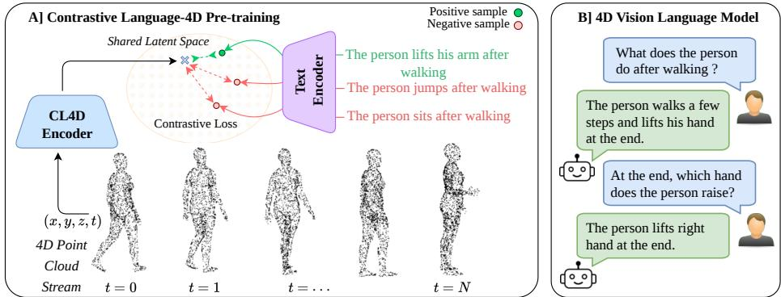  
Fig. 1: Overview of the Language–4D framework: We introduce CL4D, a contrastive pre-training paradigm that bridges the gap between 4D sequences and natural language. (A) Contrastive Language-4D Pre-training aligns 4D sequences with text in a shared latent space via a multi-modal contrastive loss. (B) 4D Vision-Language Model which uses the learned representations for VLM downstream reasoning tasks.

Abstract. 4D understanding and reasoning is a fundamental capability for embodied AI agents operating in dynamic physical environments. However, existing vision encoders are largely limited to static 2D images or 3D point clouds without temporal modeling, or to 2D videos that lack accurate geometric depth reasoning. Consequently, current approaches fail to jointly capture spatial structure and motion evolution in dynamic scenes. We present CL4D, the first foundational 4D vision encoder that directly operates on dynamic point clouds, trained with a contrastive learning objective to align spatio-temporal geometric representations with natural language descriptions. By learning a shared

embedding space between text and 4D scene dynamics, CL4D enables zero-shot motion-to-text and text-to-motion retrieval in dynamic environments and serves as a foundational 4D vision encoder for downstream 4D vision–language tasks. Building on this encoder, we introduce 4DVLM, a 4D vision–language model that conditions language generation on dynamic geometric representations. 4DVLM is the first VLM designed to operate directly on 4D point clouds without relying on 2D images, 2D videos, or static 3D point clouds. We train CL4D and subsequently 4DVLM on a newly constructed dataset termed DynAction4D capturing diverse human motions across varying object interactions and scene environments. Extensive experiments across multiple 4D human action benchmarks demonstrate that CL4D achieves state-ofthe-art performance, with improvements of approximately ∼16.75% over prior methods. Furthermore, 4DVLM outperforms frontier video VLMs such as Gemini and GPT-5 even when these models are provided with RGB video sequences corresponding to the same scenes represented as 4D point clouds for 4DVLM.

Keywords: 4D Scene Understanding · Vision, language, and reasoning · Scene analysis and understanding

## 1 Introduction

The physical world is inherently four-dimensional, consisting of three spatial dimensions and one temporal dimension. Consequently, understanding and reasoning over dynamic 4D environments is a fundamental capability for embodied artificial intelligence (EAI). Models designed for such settings must develop a unified representation that captures both geometric structure and temporal dynamics within the spatio-temporal space of the physical world.

Existing approaches for physical world perception and reasoning rely predominantly on Vision Language Models (VLMs). However, most VLMs are designed for static 2D imagery, extracting visual features from single images, as in Llama [36], or extending to video-based representations, as in VideoLLM [5]. While video VLMs incorporate temporal signals, they remain fundamentally grounded in 2D pixel observations and lack explicit 3D geometric reasoning. More recent works, such as Ges3ViG [27] and PointLLM [40], extend multi-modal reasoning to 3D point cloud representations captured via LiDAR. Nevertheless, these methods are restricted to static 3D scenes and do not model temporal dynamics, limiting their applicability in dynamic physical environments.

Developing efective 4D reasoning models requires, as a foundational step, a robust 4D vision encoder. In 2D, 3D, and 2D with temporal modeling settings, contrastive pretraining [32] has emerged as the dominant paradigm for learning vision encoders aligned with language representations. Such encoders are trained to project visual and textual features into a shared embedding space, enabling strong transfer to downstream vision language tasks including Visual Question Answering (VQA) [3], Visual Grounding (VG) [8], and image or video captioning [1]. Despite the success of contrastive alignment in these domains, no prior work has extended this paradigm to 4D representations that capture dynamic 3D scenes. In particular, existing approaches do not learn language aligned embeddings from temporally evolving point clouds that jointly encode both geometry and motion. To address this gap, we introduce Contrastive Language-4D (CL4D), the first foundational 4D vision encoder. CL4D is trained using a contrastive learning objective to align dynamic 4D point cloud sequences representing human actions with their corresponding natural language descriptions. By learning a shared embedding space between spatio-temporal geometric features and action semantics, CL4D enables zero-shot action-to-text retrieval and establishes a foundation for language-grounded reasoning over dynamic 4D environments.

Building upon the proposed CL4D 4D vision encoder, we further introduce 4D V ision Language Model (4DVLM), the first VLM designed to directly reason over dynamic 4D point clouds. Unlike prior VLMs that operate on 2D images, videos, or static 3D scenes, 4DVLM is grounded in temporally evolving 3D scenes, enabling joint spatial and temporal reasoning in dynamic physical environments.

In summary, we make the following key contributions:

1. CL4D: A Contrastively Aligned 4D Vision Encoder. We introduce CL4D, the first foundational 4D vision encoder trained to align dynamic 4D point cloud sequences with natural language using a contrastive learning objective. Unlike prior 4D encoders that rely on classification over a fixed set of action labels, CL4D learns a shared embedding space between spatiotemporal scene dynamics and textual descriptions. This enables zero-shot cross-modal retrieval between motion and text in dynamic environments and establishes a foundational representation for 4D vision–language tasks. Empirically, CL4D improves Recall@1 for text–motion retrieval by up to 16.75% compared to prior 4D encoders.

2. 4DVLM: The First 4D Vision–Language Model. Building upon CL4D, we propose 4DVLM, the first Vision–Language Model that directly reasons over temporally evolving 4D point clouds without relying on RGB images, videos, or static 3D scenes. By conditioning language generation on geometry-aware spatio-temporal embeddings, 4DVLM enables languagegrounded reasoning in dynamic physical environments. Remarkably, 4DVLM achieves state-of-the-art performance even compared to frontier videobased VLMs such as Gemini and GPT-5, despite those models operating on RGB video inputs.

3. DynAction4D: A Benchmark for Language–4D Alignment. To enable systematic evaluation and large-scale contrastive training of 4D vision models, we introduce DynAction4D, a benchmark dataset consisting of dynamic human actions represented as temporally evolving 4D point cloud sequences paired with natural language descriptions. The dataset spans diverse action categories and scene environments with varying object layouts, providing a structured benchmark for studying language–4D alignment and evaluating 4D VLMs.

## 2 Related Work

Contrastive Pretraining for Vision–Language Alignment: Early vision encoders were largely developed using supervised learning on large-scale datasets such as ImageNet [7], leading to architectures including AlexNet [20], VGGNet [35], and ResNet [17]. These models were trained using cross-entropy classification objectives and later reused as general visual feature extractors for downstream tasks. However, such representations are tied to predefined label spaces and are not inherently aligned with language.

Contrastive pretraining addressed this limitation by aligning visual and textual representations in a shared embedding space. CLIP [32] introduced largescale language–image contrastive learning, enabling strong zero-shot transfer across tasks. Subsequent works extended this paradigm to video and 3D representations. For videos, methods such as VideoCLIP [39], CLIP4Clip [26], and ActionCLIP [38] learn joint video–text embeddings by modeling temporal dynamics in RGB frame sequences. In the 3D domain, approaches including Point-CLIP [45], ULIP [41], and OpenShape [24] align static point clouds with language through multi-view projections or joint multimodal pretraining.

Despite these advances, existing methods largely operate on static images, RGB video frames, or static 3D geometry, and do not explicitly model temporally evolving 3D environments.

4D Vision Encoders: Modeling dynamic point cloud sequences introduces additional challenges due to the irregular and unordered nature of point clouds across time. Early approaches focused on extracting spatio-temporal features for action recognition rather than language alignment. For example, Motion PointNet [18] models temporal variations using a PointNet-style architecture with temporal aggregation, optimized using cross-entropy objectives for closedset action classification.

More recent works attempt to bridge motion understanding and language by learning cross-modal representations. Motion Patches [42] converts human motion sequences into grid-like patches compatible with Vision Transformers pretrained on images, enabling contrastive alignment between motion and language representations. While these approaches demonstrate promising zero-shot capabilities, they rely on structured skeleton representations rather than raw dynamic point clouds.

Consequently, existing methods either rely on classification-based objectives or structured motion representations, limiting their applicability for open-vocabulary reasoning over raw dynamic 4D environments.

Vision Language Models: Large vision–language models have recently achieved strong performance on multimodal reasoning tasks such as visual question answering, visual grounding, and captioning. Systems such as GPT-5 [28], Gemini [2], and LLaVA [23] integrate visual encoders with large language models to enable reasoning over images and videos. Dedicated video VLMs such as VideoLLM [5] and Video-LLaVA [21] further explore spatio-temporal reasoning using RGB video inputs.

Recent works have also explored grounding language models in 3D scenes. Approaches such as M3DRefCLIP [47] and Ges3ViG [27] study 3D visual grounding, while PointLLM [40], LL3DA [6], and OneLLM [16] extend instruction tuning to static point clouds.

However, existing methods operate either on 2D RGB data or static 3D geometry. None directly support language-based reasoning over dynamic 4D point cloud sequences. In contrast, 4DVLM enables vision–language reasoning directly on temporally evolving 4D point clouds, allowing joint understanding of geometry and motion dynamics.

## 3 Methodology

Our framework is designed to enable language-grounded reasoning over dynamic 4D point cloud sequences. We adopt a two-stage training strategy Fig. 4. In the first stage, we learn semantically aligned spatio-temporal representations through contrastive Language–4D pretraining (CL4D). In the second stage, we rely on the pretrained 4D encoder to construct a 4D Vision–Language Model (4DVLM) that supports instruction following and visual question answering over dynamic point clouds. To facilitate this two-stage learning process, we introduce the DynAction4D dataset.

## 3.1 DynAction4D Dataset

We first present our proposed benchmark dataset for Language–4D pretraining aimed at enabling vision–language reasoning in dynamic physical environments. The proposed dataset primarily consists of dynamic 4D point cloud sequences capturing various human actions across diverse scene environments, along with their corresponding textual descriptions. DynAction4D comprises four primary segments, each representing distinct dynamic scenarios. We now describe each dataset segment of the DynAction4D dataset.

1. HumanOnly Segment As shown in Figure 3a, HumanOnly segment, considers a variety of actions performed by a single human, derived from the HumanML3D dataset [15]. HumanML3D is a human motion–language dataset that covers a broad range of activities, including daily actions (e.g., walking, jumping), sports (e.g., swimming, playing golf), acrobatics (e.g., cartwheel), and artistic movements (e.g., dancing). This dataset provides SMPL parameters for each motion sequence along with corresponding natural language descriptions that explain the actions. The training split for HumanOnly contains 23k sequences, while the test split consists of 4k sequences.

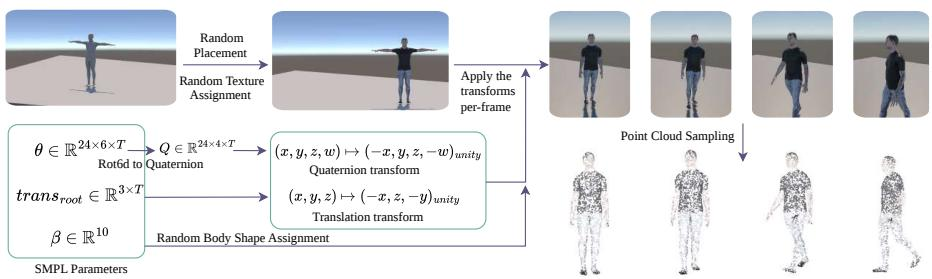  
Fig. 2: Overview of the DynAction4D generation pipeline. SMPL parameters are first converted to Unity-compatible animations, then augmented using various methods such as random body shape assignment and random texture variations from [37]. The resulting meshes are then uniformly sampled in Unity to generate human action point cloud sequences. This pipeline yields highly diverse, temporally evolving point cloud sequences suitable for training complex dynamic scene understanding models.

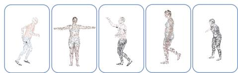  
(a) DynAction4D-HumanOnly

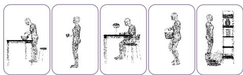  
(b) DynAction4D-ObjInteractions

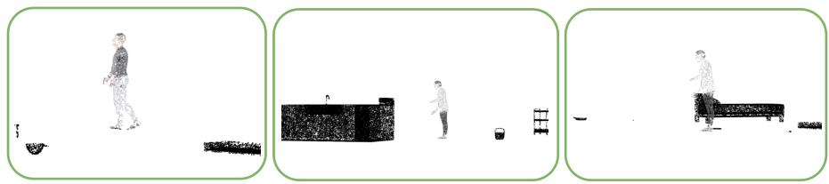  
(c) DynAction4D-Cluttered  
Fig. 3: Sample frames from point cloud sequences across the three dataset segments in DynAction4D. (a) HumanOnly: Five sequences, each depicting a distinct human body shape and action. (b) ObjInteractions: Five sequences, each featuring a human interacting with a diferent object. (c) Cluttered: Three sequences showing humans performing actions in cluttered environments.

2. ObjInteractions Segment: This segment considers human actions that involve interactions with objects. To support this, we construct 4D scenes using human–object interaction sequences from the Humoto dataset [25], which models diverse daily activities involving 72 objects comprising 735 distinct object interactions.The training split for ObjInteractions contains 510 sequences, while the test split consists of 219 sequences.

3. Cluttered Segment: This Cluttered segment considers a scenario where a human performs various actions in cluttered scene environments. To construct such a scenario, we place human action sequences taken from the HumanML3D dataset within scenes populated with Humoto objects at varying placements and clutter conditions. The training split for the Cluttered segment contains 23k sequences, while the test split consists of 4k sequences.

Textual Data Generation Text descriptions are inherited from the original action datasets, where each motion sequence is paired with a natural language annotation. These text–motion pairs are used for language-aligned contrastive pre-training.

4D-VQA Segment: For training the proposed 4DVLM, we create a novel 4D-VQA dataset. For this we employ videos rendered in Unity from existing human action sequences generated from the HumanML3D dataset. To synthesize this dataset segment, we prompt Gemini 3.0 Flash [2] with rendered Unity videos and HumanML3D text descriptions, generating structured queries designed to test spatial and temporal reasoning. The QA pairs span three distinct motionanalysis categories: (a) Action: Focuses on high-level semantic understanding and sequence classification. (b) Body-Spatial Qualities: Focuses on 3D spatial reasoning, geometric relationships, and limb positioning. (c) Temporal Qualities: Focuses on the dynamics and frame-to-frame state changes of the motion.

## 3.2 CL4D: Contrastive Language-4D Pre-training

In the first stage of training, we introduce a novel Spatio-temporal 4D Vision Encoder as illustrated in Fig. 4(A). This encoder learn semantically aligned spatiotemporal representations via contrastive language-4D pre-training (CL4D). Our objective is to learn language-aligned representations for dynamic point cloud sequences $( x , y , z , t )$ through large-scale contrastive pre-training.

Point Encoder (PE): Consider a 4D sequence with N point cloud frames. Each frame of the input sequence is first processed by a standard PointNet [31] encoder PE that operates on local point groups of each frame. We divide each frame into k number of groups, each containing g number of points. The encoder produces k embeddings of dimension $d _ { 1 }$ for each frame $p _ { t } \in X _ { v }$ point cloud stream. We prepend a learnable CLS token, resulting in $( k + 1 )$ embeddings per frame that form the feature tensor $f _ { t } \in \mathbb { R } ^ { ( k + 1 ) \times d _ { 1 } }$ for the input to the spatial encoder $V _ { s }$ , as defined in Eq. (1).

Spatio-Temporal Transformer Encoder $( V _ { s t } )$ : To jointly model the spatial structure and temporal dynamics of these $f _ { t }$ features from $P E$ , we introduce a transformer based encoder defined as $V _ { s t } .$ which is a combination of the spatial encoder $V _ { s }$ and the temporal encoder $V _ { t }$ . The processing order of this module is defined in Eqs. (2)–(4).

$$
\begin{array} { r } { f _ { t } = \mathrm { P E } ( p _ { t } ) \in \mathbb R ^ { ( k + 1 ) \times d _ { 1 } } , \quad p _ { t } = X _ { v } [ t ] , \quad t = 1 , \dots , N } \end{array}\tag{1}
$$

$$
\tilde { h } _ { t } = \{ \mathrm { M A X } ( h _ { t } ) , \mathrm { C L S } ( h _ { t } ) , \mathrm { M E A N } ( h _ { t } ) \} \in \mathbb { R } ^ { 3 \times d _ { 2 } } , \quad h _ { t } = V _ { s } ( f _ { t } ) \in \mathbb { R } ^ { d _ { 2 } }\tag{2}
$$

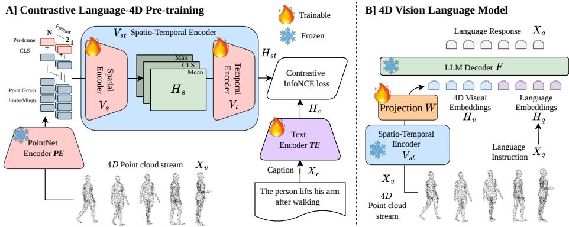  
Fig. 4: CL4D framework overview: (A) Contrastive Language-4D Pretraining (Sec. 3.1): A dynamic point cloud sequence $( x , y , z , t )$ is encoded by the PointNet-based PE and a spatio-temporal encoder $V _ { s t } ( V _ { s } , V _ { t } )$ to obtain 4D visual embeddings, which are aligned with text features from TE via a contrastive objective. (B) 4D Visual Question Answering (Sec. 3.2): The learned $V _ { s t }$ representations are fused with language embeddings in a LLaVA setup to enable reasoning over dynamic point clouds and generate action-aware responses.

$$
\begin{array} { r l } { H _ { s } = \{ \tilde { h } _ { 1 } , \tilde { h } _ { 2 } , \dots , \tilde { h } _ { N } \} \in \mathbb { R } ^ { 3 \times d _ { 2 } \times N } \quad f o r } & { t = 1 , \dots , N } \\ { H _ { s t } = V _ { t } ( H _ { s } ) \in \mathbb { R } ^ { d _ { 3 } } } & { } \end{array}\tag{3}
$$

(4)

The $V _ { s }$ captures global spatial relationships extracted to $f _ { t }$ for each frame by P E and $V _ { t }$ models the inter-frame temporal dependencies across all N frames. The embeddings inside $V _ { s t }$ transformer blocks are $d _ { 3 }$ dimensional.

The input $f _ { t }$ tensors will go through $V _ { s }$ individually and produce the $h _ { t }$ sequence of embeddings. From each $h _ { t }$ we compute means, max, and cls embeddings and stack up for a $h _ { t }$ per each frame as in Eq. (2). After processing all the N frames, we collect all the $\ddot { h } _ { t }$ in to a single $3 \times d _ { 2 } \times N$ dimensional 3D tensor $H _ { s }$ as defined in Eq. (3). Then the $H _ { s }$ 3D tensor will be patched up to $m \times m$ patches to follow similar to a standard vision transformer. It will create a new $( d _ { 2 } \times N ) / ( m \times m )$ ) length patch sequence. These patches will be encoded again into the $d _ { 3 }$ dimensional embeddings through a linear projection and fed to the $V _ { t }$ transformer blocks to model temporal relationships. At the end of $V _ { t }$ we get the mean embedding as $H _ { s t }$ of the output embedding sequence of the transformer (Defined in Eq. (4)).

In our best setup, we used embedding dimensions $d _ { 1 } = 5 1 2 , d _ { 2 } = 5 1 2$ and $d _ { 3 } = 7 6 8$ . Point Encoder PE produces with $k = 6 4$ embeddings per frame with $g = 3 2$ group size for the DynAction4D dataset. Both $V _ { s }$ and $V _ { t }$ transformers have 12 Attention Heads and MLP Ratio is 4 while transformer depth is $V _ { s }$ = 4 and $V _ { t } = 1 2$ for each. $V _ { s }$ is initialized from scratch and temporal encoder $V _ { t }$ is initialized from $V i T - B / 1 6$ weights prior to training, enabling stable optimization and improved motion modeling. $V _ { t }$ used with patch size $m = 1 6$ to process the $H _ { s } \in \mathbb { R } ^ { 3 \times 5 1 2 \times 3 2 }$ which created $3 2 \times 2$ patches.

Text Encoder $( T E )$ : Language descriptions $( X _ { c } )$ are encoded using distilbert− base − uncased [33]. We use the CLS token representation $\left( H _ { c } \right)$ as the global text embedding which has $d _ { 3 }$ dimensions.

Contrastive Alignment Objective: Let $\{ v _ { i } \} _ { i = 1 } ^ { B }$ denote visual embeddings $( H _ { s t } )$ obtained by mean pooling the output token sequences of $\mathrm { V } _ { s t }$ for the batch size $B ,$ and $\{ t _ { i } \} _ { i = 1 } ^ { B }$ denote the corresponding CLS embeddings (H $\left( H _ { c } \right)$ from the text encoder. We optimize a symmetric cross-entropy objective over the $B \times B$ similarity matrix using cosine similarity $s ( \cdot , \cdot )$ with temperature $\tau { : }$

$$
\mathcal { L } _ { m 2 t } = - \frac { 1 } { B } \sum _ { i = 1 } ^ { B } \log \frac { \exp ( s ( v _ { i } , t _ { i } ) / \tau ) } { \sum _ { j = 1 } ^ { B } \exp ( s ( v _ { i } , t _ { j } ) / \tau ) } ,\tag{5}
$$

$$
\mathcal { L } _ { t 2 m } = - \frac { 1 } { B } \sum _ { i = 1 } ^ { B } \log \frac { \exp ( s ( v _ { i } , t _ { i } ) / \tau ) } { \sum _ { j = 1 } ^ { B } \exp ( s ( v _ { j } , t _ { i } ) / \tau ) } ,\tag{6}
$$

$$
{ \mathcal { L } } = { \mathcal { L } } _ { m 2 t } + { \mathcal { L } } _ { t 2 m } .\tag{7}
$$

This objective encourages aligned visual-text pairs to have high similarity while pushing apart mismatched pairs within the batch B. This alignment enables semantically grounded 4D representations that jointly encode geometric structure and motion dynamics. Furthermore, CL4D can serve as a general 4D vision backbone for a range of 4D vision-language reasoning tasks, where language and dynamic point clouds are projected into a unified embedding space.

Training Details: Using the proposed contrastive alignment objective, CL4D is trained for 150 epochs with a batch size of $B = 7 2$ . Model parameters are optimized using AdamW optimizer with decoupled learning rates: $1 . 0 \times 1 0 ^ { - 4 }$ for the $V _ { s t }$ components and projection heads, and $1 . 0 \times 1 0 ^ { - 5 }$ for the text encoder.

## 3.3 4DVLM: 4D Vision Language Model

Building upon the contrastive pre-trained 4D vision encoder, we construct a 4D Vision-Language Model (Fig. 4(B)) capable of performing vision–language reasoning directly on 4D point clouds.

Visual Token Projection: We first take the spatio-temporal embeddings produced by $V _ { s t }$ , and linearly project them to a 4096-dimensional space to match the hidden dimension of LLaMA.

Language Backbone: We initialize the language model from Llava-v1.5-7b, which is based on the Vicuna 7B backbone. The projected visual tokens are injected into the language model following the standard LLaVA-style multi-modal conditioning mechanism [23].

Training Objective: The model is optimized using the standard auto-regressive language modeling loss employed in LLaVA. Given a visual sequence and a question $X _ { q } ,$ , the model generates an answer conditioned on projected 4D tokens:

$$
\mathcal { L } _ { \mathrm { V L M } } = - \sum _ { \mathbf { \mu } } \log p ( y _ { t } \mid y _ { < t } , X _ { q } , \operatorname { P r o j } ( \mathsf { V } _ { s t } ) ) .\tag{8}
$$

Training Setup: With the proposed training objective, we freeze the language encoder and the CL4D spatio-temporal 4D encoder, and train only the projection layer for 10 epochs using the VQA split of DynAction4D . Training is performed with a learning rate of $1 . 0 \times 1 0 ^ { - 3 }$ and the AdamW optimizer.

## 4 Results

## 4.1 Evaluation of CL4D

Table 1: Motion-text retrieval results on DynAction4D segments and RH20T dataset. The results show the Recall@1 for both Batch and Global settings under text-to-motion and motion-to-text retrieval using training batch size = 72 and test batch size = 32. CL4D and CL4D-mini outperforms the other 4D encoders in all the DynAction4D segments and RH20T dataset.
<table><tr><td rowspan="2">Dataset</td><td rowspan="2">Method</td><td colspan="4">Text-motion retrieval Motion-text retrieval</td></tr><tr><td>R@1↑ (Batch)</td><td>R@1↑ (Global)</td><td>R@1↑ (Batch)</td><td>R@1↑ (Global)</td></tr><tr><td rowspan="4">DynAction4D HumanOnly</td><td>P4Transformer [10]</td><td>53.57</td><td>3.66</td><td>58.05</td><td>5.33</td></tr><tr><td>PST-Transformer [11]</td><td>49.09</td><td>2.69</td><td>51.73</td><td>3.34</td></tr><tr><td>Motion PointNet [18]</td><td>51.91</td><td>2.34</td><td>55.78</td><td>3.13</td></tr><tr><td>CL4D (Ours)</td><td>70.32</td><td>8.07</td><td>68.62</td><td>8.02</td></tr><tr><td rowspan="4">DynAction4D</td><td>P4Transformer [10]</td><td>26.55</td><td>5.94</td><td>24.93</td><td>7.31</td></tr><tr><td>) PST-Transformer [11]</td><td>30.37</td><td>8.22</td><td>25.50</td><td>7.31</td></tr><tr><td>ObjInteractions Motion PointNet [18]</td><td>41.37</td><td>12.33</td><td>36.18</td><td>11.87</td></tr><tr><td>CL4D (Ours)</td><td>49.40</td><td>23.29</td><td>46.97</td><td>22.37</td></tr><tr><td rowspan="3">DynAction4D Cluttered</td><td>PST-Transformer [11]</td><td>30.86</td><td>0.90</td><td>33.29</td><td>0.93</td></tr><tr><td>Motion PointNet [18]</td><td>41.71</td><td>1.23</td><td>43.24</td><td>1.53</td></tr><tr><td>CL4D (Ours)</td><td>55.07</td><td>3.11</td><td>51.94</td><td>2.71</td></tr><tr><td rowspan="4">RH20T [12]</td><td>P4Transformer [10]</td><td>9.51</td><td>0.84</td><td>5.77</td><td>0.84</td></tr><tr><td>PST-Transformer [11]</td><td>54.76</td><td>20.17</td><td>39.61</td><td>15.13</td></tr><tr><td>Motion PointNet [18]</td><td>68.21</td><td>31.09</td><td>52.28</td><td>24.37</td></tr><tr><td>CL4D Mini (Ours)</td><td>77.24</td><td>37.82</td><td>57.10</td><td>27.73</td></tr></table>

Evaluation Setup: We evaluate CL4D on two primary retrieval tasks. (a) Text-to-motion retrieval, where a given text embedding is matched against a batch of 4D scene embeddings produced by CL4D , with only one embedding corresponding to the correct match. (b) Motion-to-text retrieval, where a given

4D scene embedding obtained from CL4D is matched against a batch of textual embeddings, with only one text embedding corresponding to the correct scene.

We adopt Recall@k (R@k) [30] as the primary evaluation metric. In the R@k (Batch) setting, retrieval is performed within a randomly sampled batch of embeddings. In contrast, R@k (Global) evaluates retrieval across the entire test dataset, where the query must retrieve the correct match from all available embeddings. DynAction4D is the primary benchmark for evaluation of CL4D.

Comparison with Prior 4D Encoders: CL4D represents the first 4D encoder trained with a contrastive learning objective that aligns scene and text embeddings within a unified representation space. In contrast, prior 4D encoders are typically trained using a standard cross-entropy objective to classify motion embeddings into a predefined and finite set of action labels. As a result, such encoders are not naturally suited for cross-modal retrieval tasks such as text-tomotion or motion-to-text retrieval when given a 4D point cloud as input.

To evaluate the efectiveness of CL4D against prior 4D encoders, we re-adapt these methods using the same contrastive alignment objective and train them on the proposed DynAction4D dataset. The comparison results are summarized in Table 1. Notably, CL4D achieves improvements of 16.75%, 8.1%, and 13.36% in R@1 under the batch setting for text-to-motion retrieval on the HumanOnly, ObjInteractions, and Cluttered segments of DynAction4D, respectively.

These results demonstrate that CL4D enables stronger zero-shot alignment between textual descriptions and dynamic 4D scene embeddings without relying on a predetermined and finite set of action labels, as required by prior classification-based approaches.

Generalizability of CL4D : To further demonstrate the generalizability of CL4D to real-world point cloud data involving actions performed by non-human agents, we evaluate CL4D on the robotic manipulator action dataset RH20T [12] in Table 1. RH20T comprises of manipulation sequences across diverse skills, contexts, robots, and camera viewpoints, all collected in the real world. CL4Dmini achieves state-of-the-art performance, surpassing all baseline methods by at least 9.03% in the batch setting for text-to-motion retrieval and 4.82% for motion-to-text retrieval for tested splits.

Ablation & Sensitivity Studies: In Table 2, we evaluate several architectural variations of CL4D . In particular, we vary the ViT backbone used in the temporal encoder of CL4D among the Tiny, Base, Small, and Large variants. Among these configurations, CL4D with the ViT-Small backbone achieves the highest recall accuracy for cross-modal retrieval under the batch evaluation setting.

When the text encoder is frozen (w. Frozen Text Enc.), retrieval accuracy decreases across all metrics, highlighting the importance of jointly optimizing both the 4D scene and textual embeddings for stronger contrastive alignment in the shared embedding space. When SigLIP loss is used (w. SigLIP loss) instead of the standard InfoNCE loss, performance across all metrics also decreases.

Across all ViT variants, we initialize the temporal encoder with pretrained ViT weights. In the w. Untrained ViT setting, we instead use an untrained ViT-Base model for the temporal encoder. This configuration leads to lower accuracy, indicating the importance of prior 2D-learned ViT features for efective temporal modeling. The CL4D-mini, a parameter-eficient version of CL4D yields only a marginal drop in Recall@1 while achieving an approximate 60% reduction in GFLOPs compared to CL4D with ViT-Tiny. CL4D-mini employs a reduced spatial encoder along with ViT-Tiny. Finally, in the w. Shufled Frames setting, we randomly shufle the order of the input point cloud frames to evaluate whether CL4D relies on the correct temporal ordering of motion sequences. In this case, we observe a significant drop of 11.44% in motion-to-text R@1 under the batch evaluation setting.

Furthermore, to evaluate the robustness of CL4D under real-world point cloud degradations prevalent in LiDAR sensors, we tested against partially captured point clouds obtained via single-viewpoint back-face culling [19] and under random reconstruction errors (normalised std.=0.01) in Table 2. CL4D-mini remains robust under both conditions, losing only a modest 0.37% and 1.33% in text-to-motion R@1 under the batch evaluation setting for partial point clouds and random reconstruction errors, respectively.

In Figure 5, we vary the training batch size used for contrastive pretraining from $B \ = \ 1 6$ to $B = 7 2$ . Across all configurations of CL4D , we observe a consistent improvement in R@1 as the batch size increases. This trend can be attributed to the larger number of negative samples available in each batch, which provides stronger contrastive supervision and leads to improved alignment between textual and 4D scene embeddings in the shared representation space.

In Figure 6, we vary the number of point cloud frames used as input to CL4D . For both motion-to-text and text-to-motion retrieval tasks, we observe a consistent increase in R@1 as the number of frames increases. This improvement can be attributed to the richer temporal information captured with a higher number of frames, indicating that CL4D is able to efectively model temporal dynamics for improved cross-modal retrieval performance.

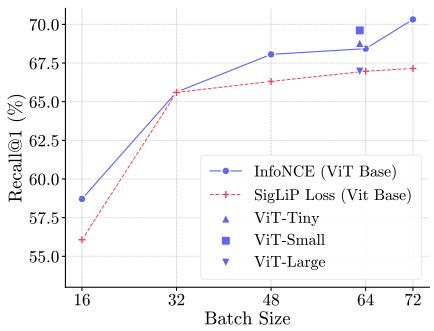  
Fig. 5: Training batch size vs. Batchwise Recall@1 on text-to-motion retrieval, with results referenced in Table 2. Eval. batch size = 32.

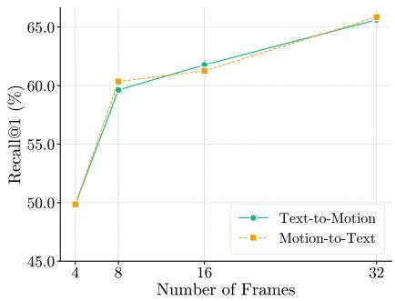  
Fig. 6: Efect of num. frames for textto-motion and motion-to-text retrieval evaluated using Batchwise Recall@1. Eval. Batch size = 32.

Table 2: Motion-text Retrieval results on the DynAction4D-HumanOnly dataset comparing our model (CL4D) and other experimental setups. The results show Recall@1 (R@1 %) for both Batch (eval. batch size 32) and Global settings under text-to-motion and motion-to-text retrieval with training batch size = 64. For other variations, we study the efect of freezing the text encoder, using a randomly initialized ViT encoder, shufling the frames in the point cloud sequence, and optimizing the spatial and temporal encoder, with ViT-Base used as the baseline for all experiments. Under P.Cloud variations, we evaluate CL4D-mini under real-world point cloud degradations prevalent in LiDAR sensors.
<table><tr><td rowspan="2"></td><td rowspan="2">Model Variation</td><td colspan="2">Text to Motion</td><td colspan="2">Motion to Text FLOPs↓</td><td rowspan="2">(10°)</td></tr><tr><td>R@1↑ (Batch)</td><td>R@1↑ (Global)</td><td>R@1↑ (Batch)</td><td>R@1↑ (Global)</td></tr><tr><td rowspan="4">ViT Variants</td><td>w. ViT-Tiny</td><td>68.79</td><td>5.15</td><td>68.09</td><td>4.24</td><td>176.20</td></tr><tr><td>w. ViT-Small</td><td>69.61</td><td>4.80</td><td>70.41</td><td>4.59</td><td>177.64</td></tr><tr><td>w. ViT-Base</td><td>68.43</td><td>4.45</td><td>67.96</td><td>4.68</td><td>183.28</td></tr><tr><td>w. ViT-Large</td><td>66.95</td><td>4.66</td><td>66.31</td><td>4.68</td><td>202.42</td></tr><tr><td rowspan="5">Other Model Variations</td><td>w. Frozen Text Enc.</td><td>56.63</td><td>2.76</td><td>57.39</td><td>2.78</td><td>183.28</td></tr><tr><td>w. SigLIP Loss</td><td>66.97</td><td>4.03</td><td>67.14</td><td>4.20</td><td>183.28</td></tr><tr><td>w. untrained ViT</td><td>63.32</td><td>3.52</td><td>62.79</td><td>3.36</td><td>183.28</td></tr><tr><td>w. Shuffled frames</td><td>60.97</td><td>3.08</td><td>58.97</td><td>2.97</td><td>183.28</td></tr><tr><td>CL4D-mini</td><td>67.18</td><td>4.24</td><td>66.02</td><td>4.78</td><td>70.22</td></tr><tr><td rowspan="2">(CL4D-mini)</td><td>P.Cloud Variations w. Partial P.Cloud</td><td>66.81</td><td>4.33</td><td>65.66</td><td>4.52</td><td>70.22</td></tr><tr><td>w. random recon. error</td><td>65.85</td><td>3.69</td><td>64.64</td><td>3.82</td><td>70.22</td></tr><tr><td></td><td colspan="3"></td><td colspan="3"></td></tr><tr><td></td><td colspan="3"></td><td></td><td></td><td></td></tr><tr><td></td><td colspan="3">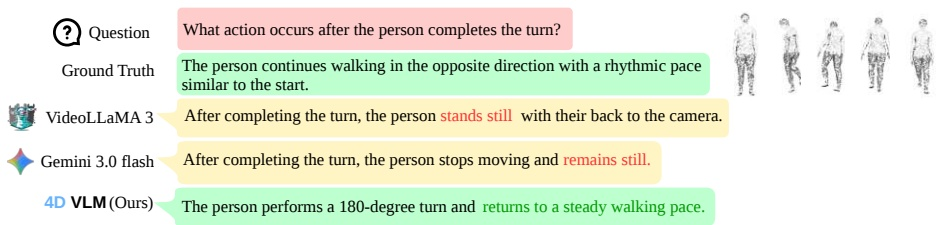</td><td></td><td></td><td></td></tr><tr><td></td><td colspan="3"></td><td></td><td></td><td></td></tr><tr><td></td><td colspan="3"></td><td></td><td></td><td></td></tr></table>

Fig. 7: Generated outputs of our 4DVLM on sample VQA instances from DynAction4D-VQA segment, depicting our model’s ability to answer questions about human action sequences with significantly higher accuracy and contextual awareness than existing video-based models.

## 4.2 Evaluation of 4DVLM

Evaluation Setup: We evaluate the performance of 4DVLM with the proposed benchmark dataset DynAction4D’s VQA segment. We primarily use standard VLM benchmark metrics; BLEU [29], ROUGE [22], METEOR [4], BERTScore [46] and SimCSE [13] on VQA with a 4D point cloud as an input.

Table 3: Visual Question Answering (VQA) results on DynAction4D-VQA, comparing our 4DVLM with existing video-based VLMs. Since video models cannot directly process point cloud sequences, we render the point clouds as mesh videos and feed them into the respective video models for a fair comparison. Our model outperforms all video-based baselines across the evaluated metrics.
<table><tr><td rowspan="2">Method</td><td rowspan="2">BLEU↑</td><td colspan="3">ROUGE</td><td rowspan="2">METEOR↑</td><td colspan="3">BERTScore</td><td rowspan="2">SimCSE↑</td></tr><tr><td>ROUGE-1(F1)↑ROUGE-2(F1)↑ROUGE-L(F1)↑</td><td></td><td></td><td></td><td>Precision↑ Recall↑</td><td>F1↑</td></tr><tr><td>VideoLLaMA 3 [44]</td><td>0.0437</td><td>0.3382</td><td>0.1174</td><td>0.2951</td><td>0.2481</td><td>0.4769</td><td>0.3870</td><td>0.4317</td><td>0.8158</td></tr><tr><td>Gemini-3.0 Flash [2]</td><td>0.0447</td><td>0.3389</td><td>0.1156</td><td>0.2812</td><td>0.2673</td><td>0.4240</td><td>0.3875</td><td>0.4057</td><td>0.8009</td></tr><tr><td>Gemini 3.1 Pro [2]</td><td>0.0300</td><td>0.2763</td><td>0.0923</td><td>0.2427</td><td>0.1933</td><td>0.4562</td><td>0.2938</td><td>0.3736</td><td>0.7690</td></tr><tr><td>Gemini 3.1 Pro [2](M.V)</td><td>0.0320</td><td>0.2885</td><td>0.0955</td><td>0.2500</td><td>0.2064</td><td>0.4482</td><td>0.3115</td><td>0.3788</td><td>0.7760</td></tr><tr><td>GPT 5 [28]</td><td>0.0184</td><td>0.1935</td><td>0.0403</td><td>0.1612</td><td>0.1347</td><td>0.4111</td><td>0.2309</td><td>0.3191</td><td>0.7432</td></tr><tr><td>4DVLM (Ours)</td><td>0.0729</td><td>0.3857</td><td>0.1563</td><td>0.3324</td><td>0.3152</td><td>0.4515</td><td>0.4396 0.4459</td><td></td><td>0.8189</td></tr></table>

Comparison with the State-of-the-art Video VLMs In Table 3, we compare 4DVLM against several frontier VLM models. Notably, none of the prior methods are capable of directly consuming 4D point clouds for vision–language reasoning. Therefore, for all baseline VLMs we render the point clouds as mesh videos and feed them into the respective video models for a fair comparison. To provide video baselines with some 3D geometric understanding, we additionally compare against Gemini 3.1 Pro provided with three-viewpoint renders of the same scene, denoted as Gemini 3.1 Pro (M.V) in Table 3.

Overall, our approach consistently outperforms these frontier VLM baselines across lexical, semantic, and embedding-based evaluation metrics. These results suggest that geometry-aware 4D representations provide stronger grounding for action-centric language generation compared to RGB-based video representations. In Figure 7, we showcase an example output from 4DVLM, when compared against frontier video-based VLMs.

Table 4: Visual Question Answering (VQA) results on DynAction4D-VQA, comparing the 4D encoder in our 4DVLM against baseline 4D encoders. We replace the CL4D encoder in 4DVLM with alternative 4D encoders while keeping the projection layer the same across all experimental setups. Our method shows consistent gains across all metrics, demonstrating the efectiveness of our pretraining approach.
<table><tr><td rowspan="2">Method</td><td rowspan="2">BLEU↑</td><td colspan="3">ROUGE</td><td rowspan="2">METEOR↑</td><td colspan="3">BERTScore</td><td rowspan="2">SimCSE↑</td></tr><tr><td>ROUGE-1(F1)↑ROUGE-2(F1) ↑ROUGE-L(F1)↑</td><td></td><td></td><td>Precision↑ Recall↑</td><td></td><td>F1↑</td></tr><tr><td>w. PST-Transformer</td><td>0.0394</td><td>0.2910</td><td>0.0938</td><td>0.2554</td><td>0.2272</td><td>0.3808</td><td>0.3300</td><td>0.3558</td><td>0.7551</td></tr><tr><td>w. Motion PointNet</td><td>0.0320</td><td>0.2932</td><td>0.0897</td><td>0.2417</td><td>0.2513</td><td>0.3378</td><td>0.3594 0.3488</td><td></td><td>0.7738</td></tr><tr><td>w. CL4D (Ours)</td><td>0.0729</td><td>0.3857</td><td>0.1563</td><td>0.3324</td><td>0.3152</td><td>0.4515</td><td>0.4396 0.4459</td><td></td><td>0.8189</td></tr></table>

Comparison with Prior 4D Encoders: Now, we compare the performance of 4DVLM when using prior 4D encoders to generate 4D scene tokens instead of the proposed CL4D , as shown in Table 4. Although these prior encoders were originally trained using a standard cross-entropy objective, we retrain them with the same contrastive alignment objective for a fair comparison. Even under this setting, 4DVLM with CL4D consistently achieves higher performance across all evaluation metrics. Among the evaluated 4D encoders, PST-Transformer attains the closest performance to CL4D . Nevertheless, 4DVLM equipped with CL4D achieves an 85.03% higher BLEU score compared to PST-Transformer.

## 5 Discussion

Rationale for Choosing 4D Pointclouds for Motion Representation: Prior work on human motion understanding has primarily relied on skeletonbased representations, which, while efective for human-only motion, cannot generalise to arbitrary objects or non-human agents. In our ObjInteractions segment, there is no well-defined skeletal representation for the 73 interacting object categories, making skeleton-based methods fundamentally inapplicable. Raw 4D point clouds instead provide a unified representation that naturally encodes the geometry and motion of any dynamic entity, as further evidenced by our results on robotic manipulation sequences. With CL4D, we aim for a general 4D encoder for motion understanding across both human and non-human agents, as demonstrated by the DynAction4D-ObjInteractions segment and RH20T dataset, with broader generalisation remaining an important direction for future work.

## 6 Conclusion

We present CL4D, a foundational 4D vision encoder that directly operates on temporally evolving 3D point clouds to generate spatio-temporal vision tokens capturing both geometric structure and motion dynamics. Unlike prior 4D encoders that rely on cross-entropy classification over a fixed set of action labels, CL4D employs a contrastive learning objective that aligns 4D scene representations with their corresponding language descriptions in a shared embedding space. This design enables semantically grounded 4D representations and significantly improves cross-modal retrieval performance. In particular, CL4D achieves improvements of 8.1–16.75% in batch Recall@1 for the text-to-motion retrieval task compared to prior 4D encoders. Building on this encoder, we further introduce 4DVLM, the first vision–language model designed to directly reason over dynamic 4D point clouds. By conditioning language generation on geometryaware spatio-temporal features, 4DVLM enables language-grounded understanding of dynamic scenes. Experiments demonstrate that 4DVLM achieves superior performance compared to frontier video-based VLMs, including GPT-5 and Gemini, even when these models are provided with corresponding RGB video.

## 7 Acknowledgments

A part of the computational resources were from the funding provided by Manoj Bandara. Also the research was supported by the Singapore National Research Foundation (NRF), Prime Minister’s Ofice, Singapore, under its Campus for Research Excellence and Technological Enterprise (CREATE) programme. The Mens, Manus, and Machina (M3S) is an interdisciplinary research group (IRG) of the Singapore-MIT Alliance for Research and Technology (SMART) centre.

## References

1. Abdar, M., Kollati, M., Kuraparthi, S., Pourpanah, F., McDuf, D., Ghavamzadeh, M., Yan, S., Mohamed, A., Khosravi, A., Cambria, E., et al.: A review of deep learning for video captioning. IEEE Transactions on Pattern Analysis and Machine Intelligence (2024)

2. Anil, R., Borgeaud, S., Alayrac, J.B., et al.: Gemini: A family of highly capable multimodal models (2025), https://arxiv.org/abs/2312.11805

3. Antol, S., Agrawal, A., Lu, J., Mitchell, M., Batra, D., Zitnick, C.L., Parikh, D.: Vqa: Visual question answering. In: Proceedings of the IEEE international conference on computer vision. pp. 2425–2433 (2015)

4. Banerjee, S., Lavie, A.: METEOR: An automatic metric for MT evaluation with improved correlation with human judgments. In: Goldstein, J., Lavie, A., Lin, C.Y., Voss, C. (eds.) Proceedings of the ACL Workshop on Intrinsic and Extrinsic Evaluation Measures for Machine Translation and/or Summarization. pp. 65– 72. Association for Computational Linguistics, Ann Arbor, Michigan (Jun 2005), https://aclanthology.org/W05-0909/

5. Chen, G., Zheng, Y.D., Wang, J., Xu, J., Huang, Y., Pan, J., Wang, Y., Wang, Y., Qiao, Y., Lu, T., et al.: Videollm: Modeling video sequence with large language models. arXiv preprint arXiv:2305.13292 (2023)

6. Chen, S., Chen, X., Zhang, C., Li, M., Yu, G., Fei, H., Zhu, H., Fan, J., Chen, T.: Ll3da: Visual interactive instruction tuning for omni-3d understanding reasoning and planning. In: Proceedings of the IEEE/CVF conference on computer vision and pattern recognition. pp. 26428–26438 (2024)

7. Deng, J., Dong, W., Socher, R., Li, L.J., Li, K., Fei-Fei, L.: Imagenet: A largescale hierarchical image database. In: 2009 IEEE conference on computer vision and pattern recognition. pp. 248–255. Ieee (2009)

8. Deng, J., Yang, Z., Chen, T., Zhou, W., Li, H.: Transvg: End-to-end visual grounding with transformers. In: Proceedings of the IEEE/CVF international conference on computer vision. pp. 1769–1779 (2021)

9. Dosovitskiy, A., Beyer, L., Kolesnikov, A., Weissenborn, D., Zhai, X., Unterthiner, T., Dehghani, M., Minderer, M., Heigold, G., Gelly, S., Uszkoreit, J., Houlsby, N.: An image is worth 16x16 words: Transformers for image recognition at scale. CoRR abs/2010.11929 (2020), https://arxiv.org/abs/2010.11929

10. Fan, H., Yang, Y., Kankanhalli, M.: Point 4d transformer networks for spatiotemporal modeling in point cloud videos. In: Proceedings of the IEEE/CVF conference on computer vision and pattern recognition. pp. 14204–14213 (2021)

11. Fan, H., Yang, Y., Kankanhalli, M.: Point spatio-temporal transformer networks for point cloud video modeling. IEEE Transactions on Pattern Analysis and Machine Intelligence 45(2), 2181–2192 (2022)

12. Fang, H.S., et al.: Rh20t: A comprehensive robotic dataset for learning diverse skills in one-shot. In: ICRA (2024)

13. Gao, T., Yao, X., Chen, D.: SimCSE: Simple contrastive learning of sentence embeddings. In: Moens, M.F., Huang, X., Specia, L., Yih, S.W.t. (eds.) Proceedings of the 2021 Conference on Empirical Methods in Natural Language Processing. pp. 6894–6910. Association for Computational Linguistics, Online and Punta Cana, Dominican Republic (Nov 2021). https://doi.org/10.18653/v1/2021.emnlpmain.552, https://aclanthology.org/2021.emnlp-main.552/

14. Gong, Y., Chung, Y., Glass, J.R.: PSLA: improving audio event classification with pretraining, sampling, labeling, and aggregation. CoRR abs/2102.01243 (2021), https://arxiv.org/abs/2102.01243

15. Guo, C., Zou, S., Zuo, X., Wang, S., Ji, W., Li, X., Cheng, L.: Generating diverse and natural 3d human motions from text. In: Proceedings of the IEEE/CVF Conference on Computer Vision and Pattern Recognition (CVPR). pp. 5152–5161 (June 2022)

16. Han, J., Gong, K., Zhang, Y., Wang, J., Zhang, K., Lin, D., Qiao, Y., Gao, P., Yue, X.: Onellm: One framework to align all modalities with language. In: Proceedings of the IEEE/CVF Conference on Computer Vision and Pattern Recognition. pp. 26584–26595 (2024)

17. He, K., Zhang, X., Ren, S., Sun, J.: Deep residual learning for image recognition. In: Proceedings of the IEEE conference on computer vision and pattern recognition. pp. 770–778 (2016)

18. Huang, Z., Fan, Z., Xu, T., Han, J.: On exploring pde modeling for point cloud video representation learning. arXiv preprint arXiv:2404.04720 (2024)

19. Jang, H., Kim, M., Bae, J., Kim, Y.M.: Dynamic mesh recovery from partial point cloud sequence. 2023 IEEE/CVF International Conference on Computer Vision (ICCV) pp. 15028–15038 (2023), https://api.semanticscholar.org/CorpusID: 265216067

20. Krizhevsky, A., Sutskever, I., Hinton, G.E.: Imagenet classification with deep convolutional neural networks. Advances in neural information processing systems 25 (2012)

21. Lin, B., Ye, Y., Zhu, B., Cui, J., Ning, M., Jin, P., Yuan, L.: Video-llava: Learning united visual representation by alignment before projection. In: Proceedings of the 2024 conference on empirical methods in natural language processing. pp. 5971– 5984 (2024)

22. Lin, C.Y.: ROUGE: A package for automatic evaluation of summaries. In: Text Summarization Branches Out. pp. 74–81. Association for Computational Linguistics, Barcelona, Spain (Jul 2004), https://aclanthology.org/W04-1013/

23. Liu, H., Li, C., Wu, Q., Lee, Y.J.: Visual instruction tuning. Advances in neural information processing systems 36, 34892–34916 (2023)

24. Liu, M., Shi, R., Kuang, K., Zhu, Y., Li, X., Han, S., Cai, H., Porikli, F., Su, H.: Openshape: Scaling up 3d shape representation towards open-world understanding. Advances in neural information processing systems 36, 44860–44879 (2023)

25. Lu, J., Huang, C.H.P., Bhattacharya, U., Huang, Q., Zhou, Y.: Humoto: A 4d dataset of mocap human object interactions. In: Proceedings of the IEEE/CVF International Conference on Computer Vision. pp. 10886–10897 (2025)

26. Luo, H., Ji, L., Zhong, M., Chen, Y., Lei, W., Duan, N., Li, T.: Clip4clip: An empirical study of clip for end to end video clip retrieval and captioning. Neurocomputing 508, 293–304 (2022)

27. Mane, A.M., Weerakoon, D., Subbaraju, V., Sen, S., Sarma, S.E., Misra, A.: Ges3vig: Incorporating pointing gestures into language-based 3d visual grounding for embodied reference understanding. In: Proceedings of the Computer Vision and Pattern Recognition Conference. pp. 9017–9026 (2025)

28. OpenAI: Introducing GPT-5. https://openai.com/index/introducing-gpt-5/ (2025), accessed: 2026-03-05

29. Papineni, K., Roukos, S., Ward, T., Zhu, W.J.: Bleu: a method for automatic evaluation of machine translation. In: Isabelle, P., Charniak, E., Lin, D. (eds.) Proceedings of the 40th Annual Meeting of the Association for Computational Linguistics. pp. 311–318. Association for Computational Linguistics, Philadelphia, Pennsylvania, USA (Jul 2002). https://doi.org/10.3115/1073083.1073135, https://aclanthology.org/P02-1040/

30. Petrovich, M., Black, M.J., Varol, G.: Tmr: Text-to-motion retrieval using contrastive 3d human motion synthesis. In: Proceedings of the IEEE/CVF International Conference on Computer Vision. pp. 9488–9497 (2023)

31. Qi, C.R., Su, H., Mo, K., Guibas, L.J.: Pointnet: Deep learning on point sets for 3d classification and segmentation. In: CVPR (July 2017)

32. Radford, A., Kim, J.W., Hallacy, C., Ramesh, A., Goh, G., Agarwal, S., Sastry, G., Askell, A., Mishkin, P., Clark, J., et al.: Learning transferable visual models from natural language supervision. In: International conference on machine learning. pp. 8748–8763. PmLR (2021)

33. Sanh, V., Debut, L., Chaumond, J., Wolf, T.: Distilbert, a distilled version of bert: smaller, faster, cheaper and lighter. arXiv preprint arXiv:1910.01108 (2019)

34. Shafir, Y., Tevet, G., Kapon, R., Bermano, A.H.: Human motion difusion as a generative prior. In: The Twelfth International Conference on Learning Representations (2024)

35. Simonyan, K., Zisserman, A.: Very deep convolutional networks for large-scale image recognition. arXiv preprint arXiv:1409.1556 (2014)

36. Touvron, H., Lavril, T., Izacard, G., Martinet, X., Lachaux, M.A., Lacroix, T., Rozière, B., Goyal, N., Hambro, E., Azhar, F., et al.: Llama: Open and eficient foundation language models. arXiv preprint arXiv:2302.13971 (2023)

37. Varol, G., Romero, J., Martin, X., Mahmood, N., Black, M.J., Laptev, I., Schmid, C.: Learning from synthetic humans. In: Proceedings of the IEEE conference on computer vision and pattern recognition. pp. 109–117 (2017)

38. Wang, M., Xing, J., Mei, J., Liu, Y., Jiang, Y.: Actionclip: Adapting languageimage pretrained models for video action recognition. IEEE transactions on neural networks and learning systems 36(1), 625–637 (2023)

39. Xu, H., Ghosh, G., Huang, P.Y., Okhonko, D., Aghajanyan, A., Metze, F., Zettlemoyer, L., Feichtenhofer, C.: Videoclip: Contrastive pre-training for zero-shot video-text understanding. In: Proceedings of the 2021 conference on empirical methods in natural language processing. pp. 6787–6800 (2021)

40. Xu, R., Wang, X., Wang, T., Chen, Y., Pang, J., Lin, D.: Pointllm: Empowering large language models to understand point clouds. In: European Conference on Computer Vision. pp. 131–147. Springer (2024)

41. Xue, L., Gao, M., Xing, C., Martín-Martín, R., Wu, J., Xiong, C., Xu, R., Niebles, J.C., Savarese, S.: Ulip: Learning a unified representation of language, images, and point clouds for 3d understanding. In: Proceedings of the IEEE/CVF conference on computer vision and pattern recognition. pp. 1179–1189 (2023)

42. Yu, Q., Tanaka, M., Fujiwara, K.: Exploring vision transformers for 3d human motion-language models with motion patches. In: Proceedings of the IEEE/CVF Conference on Computer Vision and Pattern Recognition. pp. 937–946 (2024)

43. Yu, Q., Tanaka, M., Fujiwara, K.: Exploring vision transformers for 3d human motion-language models with motion patches. In: Proceedings of the IEEE/CVF Conference on Computer Vision and Pattern Recognition. pp. 937–946 (2024)

44. Zhang, B., Li, K., Cheng, Z., Hu, Z., Yuan, Y., Chen, G., Leng, S., Jiang, Y., Zhang, H., Li, X., et al.: Videollama 3: Frontier multimodal foundation models for image and video understanding. arXiv preprint arXiv:2501.13106 (2025)

45. Zhang, R., Guo, Z., Zhang, W., Li, K., Miao, X., Cui, B., Qiao, Y., Gao, P., Li, H.: Pointclip: Point cloud understanding by clip. In: Proceedings of the IEEE/CVF conference on computer vision and pattern recognition. pp. 8552–8562 (2022)

46. Zhang, T., Kishore, V., Wu, F., Weinberger, K.Q., Artzi, Y.: Bertscore: Evaluating text generation with bert. arXiv preprint arXiv:1904.09675 (2019)

47. Zhang, Y., Gong, Z., Chang, A.X.: Multi3drefer: Grounding text description to multiple 3d objects. In: Proceedings of the IEEE/CVF International Conference on Computer Vision. pp. 15225–15236 (2023)

## 8 Appendix

## 8.1 Point Cloud Sequence generation

SMPL Parameter Conversion: Using the pose parameters from HumanML3D [15], we derive SMPL parameters using PriorMDM [34]. Using these SMPL parameters we generate dynamic human point cloud sequences to construct the 4D representations as explained in the following.

The original SMPL parameters are provided as:

– Joint rotations: $\pmb { \theta } \in \mathbb { R } ^ { 2 4 \times 6 \times T }$ (rotation-6D representation),

Root translation: $\mathbf { t } \in \mathbb { R } ^ { 3 \times T }$

Shape parameters: $\beta \in \mathbb { R } ^ { 1 0 }$

Since Unity requires quaternion-based rotations, we convert the $( 2 4 , 6 , T )$ rotation-6D representation into quaternion format $( 2 4 , 4 , T )$ . The original motion data follows a right-handed, Z-up coordinate system, whereas Unity uses a lefthanded, Y-up coordinate system. Therefore, we apply the following coordinate and rotation transformations to ensure consistency between the two systems:

– Translation: $( x , y , z ) \to ( - x , z , - y )$

– Quaternion: $( x , y , z , w ) \to ( - x , y , z , - w )$

The 24 SMPL joint names are mapped to indexed bone identifiers and loaded frame-by-frame into the SMPL mesh renderer within Unity.

Scene Placement and Augmentation: Each training animation is randomly placed within a $1 0 \times 1 0$ m area and assigned a random global rotation, serving as a form of spatial augmentation. In contrast, test sequences are positioned at the origin (0, 0, 0) without additional rotation.

For rendering diversity, each animation is randomly assigned either a male or female SMPL mesh, a random shape from a set of predetermined shape parameters and a texture which is sampled from the SURREAL dataset [37].

Point Cloud Rendering and Surface Sampling: Animations are rendered at 20 FPS. For each frame, surface points are uniformly sampled to obtain approximately 2048 points per human instance. Although the rendering process produces RGB point clouds $( r , g , b , x , y , z )$ , our model uses only the geometric coordinates $( x , y , z )$ during training and inference. This removes reliance on appearance cues and supports privacy-preserving deployment. We adopt area-weighted uniform surface sampling as follows:

Step 1: Surface Area Computation.

For each triangle in the mesh, we compute its surface area and store vertex coordinates. The total surface area $A _ { \mathrm { t o t a l } }$ is obtained by summation. The number of sampled points is computed as:

$$
N = \mathrm { r o u n d } ( A _ { \mathrm { t o t a l } } \times \mathrm { d e n s i t y } ) ,
$$

where the density is chosen to yield approximately 2048 points. A cumulative distribution function (CDF) is constructed from per-triangle areas.

Step 2: Triangle Selection. For each of the N points, we sample $r \sim \mathcal { U } ( 0 , A _ { \mathrm { { t o t a l } } } )$ and use binary search over the CDF to select a triangle proportional to its area.

Step 3: Barycentric Sampling. Given triangle vertices $A , B , C .$ , two random variables $u , v \sim \mathcal { U } ( 0 , 1 )$ are sampled. If $u + v > 1$ , we set $u = 1 - u$ and $v = 1 - v$ The surface point is then computed as:

$$
P = A + u ( B - A ) + v ( C - A ) ,
$$

producing uniformly distributed points across the mesh surface.

## 8.2 DynAction4D-Cluttered Environment Creation

Environment Generation and Clutter Synthesis To synthesize diverse and realistic cluttered scenes, we curated a collection of 61 common household objects sourced from the Humoto dataset. To ensure scale variation across scenes, these objects were systematically categorized into three groups based on their bounding volumes: large $( n = 1 6 )$ ), medium $( n = 2 1 )$ , and small $( n = 2 4 )$ . The specific objects comprising each category are detailed as follows:

– Large Objects: bed, dining chair, low chair, working chair, table, side table, kitchen counter, small kitchen counter, utility cart, clothes rack, drawer, shelf, floor lamp, vacuum flask body, trash can, wash tub.

– Medium Objects: basket, 90-degree basket, woven basket, medium organizer, small organizer, mango, orange, laptop, laptop top, laptop bottom, mixing bowl, serving bowl, plastic bowl, stacked plastic bowls, wok turner, frying pan, ukulele, guitar, vase, tray, step stool.

– Small Objects: spoon, fork, knife, peeler, pen, screwdriver, whisk, turner, soap dispenser, soap dispenser body, soap dispenser top, USB, phone, notebook, mug, deep plate, side plate, cutting board, lint roller, shower squeegee, tap, can, flower, hammer.

To rigorously evaluate model generalization to unseen geometries, the total object pool was randomly partitioned into mutually exclusive training (70%) and testing (30%) sets.

We procedurally generated 20 distinct training environments and 8 testing environments. To guarantee morphological diversity within each scene, the environment instantiation algorithm mandates the inclusion of at least one randomly sampled object from each of the three size categories (restricted to the respective train/test split). To further increase scene complexity and semantic richness, 1 to 3 additional objects were uniformly sampled from the split’s total available object pool and injected into the environment. Duplicate object instances within a single environment were filtered out, yielding unique, procedurally generated clutter compositions for every environment.

Motion Sequence Distribution To construct the Cluttered dataset segment, motion sequences from the HumanML3D dataset were mapped to the synthesized environments. To prevent temporal or stylistic bias during training, the motion sequences corresponding to each split were first randomly shufled.

The sequences were then uniformly partitioned across the generated environments. Formally, for a given split containing S total sequences and E generated environments, each environment was assigned approximately ⌊S/E⌋ unique sequences. Any residual sequences resulting from indivisibility were allocated to the final environment to ensure exhaustive assignment.

## 8.3 Additional Ablation Studies

Table 5: Motion-text Retrieval results on the DynAction4D - HumanOnly dataset comparing our model (CL4D) and other experimental setups. The results show Recall@1 (R@1 %) for both Batch (eval. batch size 32) and Global settings under text-to-motion and motion-to-text retrieval with training batch size = 64. For other variations, we study the efect of freezing the text encoder, using a randomly initialized ViT encoder, shufling the frames in the point cloud sequence, and optimizing the spatial and temporal encoder, with ViT-Base used as the baseline for all experiments.
<table><tr><td rowspan="3"></td><td colspan="8">Text-to-Motion Retrieval</td><td colspan="10">Motion-to-Text Retrieval</td></tr><tr><td colspan="4">Global</td><td colspan="4">Batchwise</td><td colspan="4"></td><td colspan="4"></td><td colspan="4">Batchwise</td></tr><tr><td>R@1↑</td><td>R@2↑</td><td>R@3↑</td><td>R@5↑</td><td></td><td>R@10↑ R@1↑</td><td>R@2↑</td><td>R@3↑ R@5↑</td><td>R@10↑</td><td></td><td>R@1↑ R@2↑</td><td></td><td>R@3↑</td><td>R@5↑</td><td>R@10↑</td><td>R@1↑</td><td>R@2↑</td><td>R@3↑ R@5↑</td><td>R@10↑</td></tr><tr><td>w. ViT-Tiny</td><td>5.15</td><td>9.25</td><td>12.52</td><td>18.78</td><td>29.72</td><td>68.79</td><td>82.79 88.37</td><td>93.43</td><td>96.78</td><td>4.24</td><td>8.88</td><td>12.45</td><td>18.59</td><td>28.98</td><td></td><td>68.09</td><td>83.23</td><td>88.84 93.36</td><td>97.01</td></tr><tr><td>w. ViT-Small</td><td>4.80</td><td>8.81</td><td>12.42</td><td>19.17</td><td>29.95</td><td>69.61 83.72</td><td>88.87</td><td>93.44</td><td>96.71</td><td>4.59</td><td>9.32</td><td>12.68</td><td>19.75</td><td>31.02</td><td>70.41</td><td>83.78</td><td>88.76</td><td>93.47</td><td>96.85</td></tr><tr><td>w. ViT-Base</td><td>4.45</td><td>9.20</td><td>12.40</td><td>17.18</td><td>28.67</td><td>68.43</td><td>81.42 86.77</td><td>91.83</td><td>96.04</td><td>4.68</td><td>9.11</td><td>12.47</td><td>18.20</td><td>28.58</td><td>67.96</td><td>82.10</td><td>87.62</td><td>92.03</td><td>96.16</td></tr><tr><td>W. ViT-Large</td><td>4.66</td><td>8.99</td><td>12.15</td><td>17.83</td><td>27.86</td><td>66.95</td><td>80.81 86.53</td><td>91.42</td><td>95.90</td><td>4.68</td><td>8.74</td><td>11.80</td><td>17.48</td><td>27.91</td><td>66.31</td><td>80.09</td><td>85.89</td><td>91.78</td><td>95.72</td></tr><tr><td>w. Frozen Text Enc.</td><td>2.76</td><td>5.19</td><td>7.05</td><td>11.17</td><td>18.73</td><td>56.63</td><td>73.17 80.19</td><td>87.72</td><td>94.81</td><td>2.78</td><td>5.15</td><td>7.53</td><td>11.50</td><td>19.84</td><td>57.39</td><td>73.71</td><td>81.19</td><td>87.79</td><td>94.93</td></tr><tr><td>w. untrained ViT</td><td>3.52</td><td>6.93</td><td>9.25</td><td>13.93</td><td>22.74</td><td>63.32</td><td>78.48 84.93</td><td>90.90</td><td>96.46</td><td>3.36</td><td>6.00</td><td>9.13</td><td>13.79</td><td>23.37</td><td>62.79</td><td>78.73</td><td>84.67</td><td>90.86</td><td>96.32</td></tr><tr><td>w. Shuffled frames</td><td>3.08</td><td>5.68</td><td>8.39</td><td>12.96</td><td>21.42</td><td>60.97</td><td>76.39 82.90</td><td>89.70</td><td>96.04</td><td>2.97</td><td>5.89</td><td>8.69</td><td>12.56</td><td>20.84</td><td>58.97</td><td>74.50</td><td>82.04</td><td>89.79</td><td>96.16</td></tr><tr><td>CL4D-mini</td><td>4.24</td><td>8.58</td><td>11.85</td><td>17.80</td><td>28.12</td><td>67.18</td><td>81.14 86.82</td><td>92.04</td><td>96.64</td><td>4.78</td><td>9.23</td><td>12.12</td><td>17.52</td><td>27.65</td><td>66.02</td><td>81.68</td><td>87.58</td><td>92.78</td><td>96.94</td></tr></table>

Table 6: Motion-text Retrieval results on the DynAction4D -HumanOnly dataset comparing diferent training batch sizes and diferent loss functions using Recall@1.
<table><tr><td rowspan="3">Loss fn.</td><td rowspan="3">Batch size</td><td colspan="10">Text-to-Motion Retrieval</td><td colspan="10">Motion-to-Text Retrieval</td></tr><tr><td colspan="5">Global</td><td colspan="5">Batchwise</td><td colspan="5">Global</td><td colspan="5">Batchwise</td></tr><tr><td></td><td>R@1↑ R@2↑</td><td></td><td>R@3↑</td><td>R@5↑ R@10↑</td><td></td><td>R@1↑ R@2↑</td><td></td><td>R@3↑ R@5↑</td><td></td><td></td><td></td><td></td><td></td><td>R@10↑ R@1↑ R@2↑ R@3↑ R@5↑ R@10↑</td><td></td><td>R@1↑</td><td>R@2↑</td><td>R@3↑</td><td>R@5↑</td><td>R@10↑</td></tr><tr><td rowspan="5">SigLIP-like 48</td><td>16</td><td>3.04</td><td>5.40</td><td>7.37</td><td>11.15</td><td>18.31</td><td>56.07</td><td>72.52</td><td>79.70</td><td>87.40</td><td>94.17</td><td>2.74</td><td>5.42</td><td>7.46</td><td>11.06</td><td>18.20</td><td>55.90</td><td>71.86</td><td>78.51</td><td>86.50</td><td>93.80</td></tr><tr><td>32</td><td>4.20</td><td>7.79</td><td>11.06</td><td>16.90</td><td>27.93</td><td>65.60</td><td>78.73</td><td>84.47</td><td>89.73</td><td>94.07</td><td>3.92</td><td>7.83</td><td>11.27</td><td>17.41</td><td>27.82</td><td>65.41</td><td>79.01</td><td>84.43</td><td>89.43</td><td>94.51</td></tr><tr><td></td><td>4.15</td><td>8.16</td><td>10.94</td><td>15.97</td><td>25.38</td><td>66.31</td><td>80.78</td><td>86.51</td><td>91.98</td><td>96.74</td><td>3.66</td><td>7.58</td><td>10.41</td><td>16.13</td><td>26.89</td><td>66.29</td><td>80.34</td><td>86.34</td><td>91.92</td><td>96.71</td></tr><tr><td>64</td><td>4.03</td><td>7.70</td><td>10.92</td><td>17.01</td><td>27.68</td><td>66.97</td><td>81.10</td><td>87.10</td><td>92.25</td><td>96.57</td><td>4.20</td><td>8.60</td><td>11.94</td><td>17.50</td><td>28.03</td><td>67.14</td><td>81.69</td><td>86.85</td><td>91.76</td><td>96.39</td></tr><tr><td>72</td><td>4.15</td><td>8.14</td><td>11.85</td><td>17.85</td><td>28.93</td><td>67.15</td><td>81.19</td><td>86.44</td><td>91.71</td><td>95.90</td><td>4.29</td><td>9.04</td><td>12.22</td><td>17.78</td><td>28.91</td><td>66.66</td><td>80.22</td><td>86.41</td><td>91.73</td><td>96.32</td></tr><tr><td rowspan="5">InfoNCE (Ours)</td><td>16</td><td>2.85</td><td>5.75</td><td>7.83</td><td>12.01</td><td>19.91</td><td>58.71</td><td>73.86</td><td>81.47</td><td>87.72</td><td>94.83</td><td>2.64</td><td>5.42</td><td>7.74</td><td>11.94</td><td>19.94</td><td>58.02</td><td>73.95</td><td>80.71</td><td>87.14</td><td>94.10</td></tr><tr><td>32</td><td>4.82</td><td>8.90</td><td>12.15</td><td>17.55</td><td>28.81</td><td>65.62</td><td>79.00</td><td>84.35</td><td>89.78</td><td>94.42</td><td>5.08</td><td>9.06</td><td>12.24</td><td>18.27</td><td>29.79</td><td>65.86</td><td>78.39</td><td>84.12</td><td>89.85</td><td>94.65</td></tr><tr><td>48</td><td>4.17</td><td>8.09</td><td>11.38</td><td>16.67</td><td>27.58</td><td>68.06</td><td>81.39</td><td>87.19</td><td>92.71</td><td>96.92</td><td>3.62</td><td>8.32</td><td>11.85</td><td>17.66</td><td>27.54</td><td>67.50</td><td>81.85</td><td>88.03</td><td>92.80</td><td>97.08</td></tr><tr><td>64</td><td>4.45</td><td>9.20</td><td>12.40</td><td>17.18</td><td>28.67</td><td>68.43</td><td>81.42</td><td>86.77</td><td>91.83</td><td>96.04</td><td>4.68</td><td>9.11</td><td>12.47</td><td>18.20</td><td>28.58</td><td>67.96</td><td>82.10</td><td>87.62</td><td>92.03</td><td>96.16</td></tr><tr><td>72</td><td>8.07</td><td></td><td>15.76 21.09 28.98</td><td></td><td>43.25</td><td></td><td></td><td>70.32 84.10 88.79 92.88</td><td></td><td>96.51</td><td>8.02</td><td></td><td></td><td>15.81 20.45 29.30</td><td>44.27</td><td>68.62</td><td>83.27</td><td></td><td>88.33 92.92</td><td>96.78</td></tr></table>

Table 7: Efect of num. frames for text-to-motion and motion-to-text retrieval evaluated using Batchwise Recall@1. Eval. Batch size = 32.
<table><tr><td rowspan="3">Number of Frames</td><td colspan="10">Text-to-Motion Retrieval</td><td colspan="10">Motion-to-Text Retrieval</td></tr><tr><td colspan="5"></td><td colspan="5">Batchwise</td><td colspan="5">Global</td><td colspan="5">Batchwise</td></tr><tr><td>R@1↑ R@2↑</td><td></td><td></td><td>R@3↑ R@5↑ 1</td><td></td><td>R@10↑</td><td>R@1↑</td><td>R@2↑</td><td>R@3↑ R@5↑</td><td>R@10↑</td><td>R@1↑ R@2↑ R@3↑</td><td></td><td></td><td></td><td>R@5↑ R@10↑</td><td></td><td>R@1↑</td><td>R@2↑</td><td>R@3↑</td><td>R@5↑ R@10↑</td></tr><tr><td>4</td><td>2.06</td><td>4.03</td><td>6.07</td><td>9.46</td><td></td><td>15.83</td><td>49.85 65.71</td><td>73.56</td><td>82.44</td><td>91.41</td><td>2.11</td><td>4.27</td><td>6.26</td><td>9.74</td><td></td><td>16.48</td><td>49.85</td><td>65.84</td><td>72.88</td><td>81.52 91.82</td></tr><tr><td>8</td><td>2.94</td><td>6.19</td><td>8.83</td><td>13.17</td><td></td><td>22.35</td><td>59.63 74.84</td><td>81.09</td><td>87.76</td><td>93.95</td><td>3.59</td><td>7.32</td><td>10.20</td><td>15.35</td><td>23.60</td><td></td><td>60.35 74.68</td><td>81.45</td><td></td><td>87.25 93.83</td></tr><tr><td>16</td><td>3.08</td><td>6.19</td><td></td><td>8.88</td><td>13.95</td><td>23.32</td><td>61.77</td><td>75.92 82.20</td><td>88.88</td><td>94.46</td><td>3.43</td><td>7.26</td><td>10.27</td><td>14.58</td><td>24.08</td><td></td><td>61.26 76.29</td><td>82.22</td><td></td><td>88.30 93.95</td></tr><tr><td>32</td><td>4.82</td><td>8.90</td><td></td><td>12.15 17.55</td><td></td><td>28.81</td><td></td><td>65.62 79.00 84.35 89.78</td><td></td><td>94.42</td><td>5.08</td><td>9.06</td><td>12.24 18.27</td><td></td><td>29.79</td><td></td><td></td><td></td><td>65.86 78.39 84.12 89.85</td><td>94.65</td></tr></table>

Table 8: Motion-text retrieval results on DynAction4D segments. The results show the Recall@1 for both Batch and Global settings under text-to-motion and motion-to-text retrieval using training batch size = 72 and eval. batch size = 32. CL4D outperforms the other 4D encoders in all the DynAction4D segments.
<table><tr><td rowspan="3">DynAction4D Segment</td><td rowspan="3">Method</td><td colspan="10">Text-to-Motion Retrieval</td><td colspan="8">Motion-to-Text Retrieval</td></tr><tr><td colspan="4">Global</td><td colspan="4"></td><td colspan="4"></td><td colspan="4">Global</td><td colspan="4">Batchwise</td></tr><tr><td></td><td>R@1↑ R@2↑</td><td></td><td></td><td>R@3↑ R@5↑ R@10↑</td><td></td><td></td><td>R@1↑ R@2↑ R@3↑</td><td></td><td>R@5↑ R@10↑</td><td></td><td></td><td></td><td></td><td>R@1↑ R@2↑ R@3↑ R@5↑ R@10↑</td><td></td><td></td><td>R@1↑ R@2↑ R@3↑</td><td>R@5↑ R@10↑</td></tr><tr><td rowspan="4">HumanOnly</td><td>P4 Transformer</td><td>3.66</td><td>7.23</td><td>10.25</td><td>15.39</td><td></td><td>26.15</td><td>53.57 69.79</td><td>78.17</td><td>86.86</td><td>93.93</td><td>5.33</td><td></td><td>10.25</td><td>14.60</td><td>20.54</td><td>30.09</td><td>58.05</td><td>73.14 80.82</td><td>89.34 95.31</td></tr><tr><td>Pst Transformer</td><td>2.69</td><td>5.61</td><td>7.70</td><td>11.22</td><td></td><td>19.43</td><td>49.09 65.65</td><td>75.12</td><td>84.12</td><td>94.07</td><td>3.34</td><td></td><td>7.83</td><td>10.34</td><td>14.51</td><td>24.01</td><td>51.73</td><td>68.32 77.21</td><td>85.75 93.70</td></tr><tr><td>MotionPointNet</td><td>2.34</td><td>4.31</td><td>6.31</td><td>9.16</td><td></td><td>15.51</td><td>51.91 69.11</td><td>77.25</td><td>85.90</td><td>94.12</td><td>3.13</td><td></td><td>6.37</td><td>8.51</td><td>12.87</td><td>20.96</td><td>55.78</td><td>72.61 79.39</td><td>87.11 94.48</td></tr><tr><td>CL4D (Ours)</td><td>8.07</td><td></td><td>15.76 21.09 28.98</td><td></td><td></td><td>43.25</td><td></td><td>70.32 84.10 88.79 92.88</td><td></td><td>96.51</td><td>8.02</td><td></td><td></td><td></td><td>15.81 20.45 29.30</td><td>44.27</td><td></td><td>68.62 83.27 88.33 92.92</td><td>96.78</td></tr><tr><td rowspan="4">ObjInteractions</td><td></td><td>5.94</td><td>10.05</td><td>16.44</td><td></td><td></td><td>41.10</td><td>26.55</td><td></td><td></td><td>86.00</td><td>7.31</td><td></td><td>10.50</td><td>15.98</td><td>23.29</td><td>42.47</td><td>24.93</td><td>56.32</td><td></td></tr><tr><td>P4 Transformer</td><td>8.22</td><td>14.61</td><td>20.09</td><td>23.74 28.31</td><td></td><td>44.75</td><td>38.49 30.37 47.39</td><td>50.35 56.04</td><td>64.88 69.68</td><td>88.59</td><td>7.31</td><td></td><td>12.79</td><td>18.72</td><td>30.59</td><td>47.49</td><td>25.50</td><td>41.78 47.06 63.62</td><td>73.69 88.59</td></tr><tr><td>Pst Transformer MotionPointNet</td><td>12.33</td><td>24.20</td><td>31.96</td><td>44.29</td><td></td><td>61.19</td><td>41.37 55.54</td><td>65.08</td><td>78.97</td><td>92.69</td><td>11.87</td><td></td><td>21.46</td><td>31.05</td><td>43.38</td><td>61.19</td><td>36.18</td><td>55.62 67.03</td><td>75.84 91.72 78.80 93.58</td></tr><tr><td>CL4D (Ours)</td><td></td><td>23.29 39.27 47.03 56.62</td><td></td><td></td><td></td><td>68.04</td><td></td><td>49.40 63.29 73.00 83.52</td><td></td><td>91.35</td><td></td><td></td><td></td><td></td><td>22.37 33.33 42.47 53.42</td><td>69.86</td><td></td><td>46.97 63.46 71.58 81.56</td><td>91.27</td></tr><tr><td rowspan="3">Cluttered</td><td></td><td>0.93</td><td>1.78</td><td>2.41</td><td>3.78</td><td></td><td>6.35</td><td>31.47 46.36</td><td>56.82</td><td>69.92</td><td>86.56</td><td>1.02</td><td>1.85</td><td></td><td>2.69</td><td>4.94</td><td>9.06</td><td>34.45</td><td>49.12 57.60</td><td>69.19</td></tr><tr><td>Pst Transformer MotionPointNet</td><td>1.23</td><td>2.41</td><td>3.52</td><td>5.77</td><td></td><td>9.81</td><td>41.71 57.93</td><td>67.27</td><td>78.75</td><td>90.93</td><td>1.53</td><td>2.97</td><td></td><td>4.06</td><td>6.28</td><td>11.68</td><td>43.24 59.65</td><td>69.07 78.87</td><td>84.32 91.18</td></tr><tr><td>CL4D (Ours)</td><td>3.11</td><td>6.00</td><td>8.48</td><td>12.49</td><td></td><td>20.63</td><td></td><td>55.07 69.94 77.53 84.58</td><td></td><td>92.87</td><td>2.71</td><td>5.54</td><td></td><td>7.58</td><td>11.82</td><td></td><td></td><td>18.94 51.94 67.43 75.77 83.34 91.31</td><td></td></tr></table>

Table 9: Model Parameters and Computational Complexity for diferent ViT Variants; Here we can observe the CL4D-mini has the lowest parameter count and computational cost.
<table><tr><td>Model</td><td>Training Params ↓ FLOPS (Gflops) ↓</td></tr><tr><td>w. ViT-Tiny</td><td>34.65 M 176.2</td></tr><tr><td>w. ViT-Small</td><td>50.82 M 177.64</td></tr><tr><td>w. ViT-Base</td><td>115.0 M 183.28</td></tr><tr><td>w. ViT-Large</td><td>332.53 M 202.42</td></tr><tr><td>CL4D-mini</td><td>8.93 M 70.22</td></tr></table>

## 8.4 Data Generation Prompt

We first use the following prompt to generate the detailed caption using both the video of the mesh of the point cloud sequence and the HumanML3D dataset caption. We do not consider texture and color information to generate question pairs. Listing 1.1 to Listing 1.4 shows the diferent prompt templates used for data generation and evaluations.

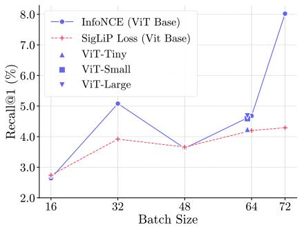

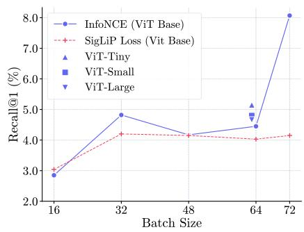  
Fig. 9: Training batch size vs. Global Recall@1 on text-to-motion retrieval. Eval. batch size = 32.

Fig. 8: Training batch size vs. Global Recall@1 on motion-to-text retrieval. Eval. batch size = 32.  
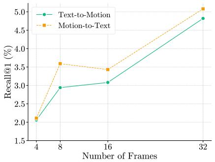  
Fig. 10: Efect of Num. of frames used in the point cloud sequences for Global Recall@1 text-motion retrieval tasks.

Listing 1.1: Prompt template for generating detailed captions  
```markdown
### CONTEXT
I am providing {n} consecutive frames from a video derived from the HumanML
dataset .
Reference Ground Truth : "{ humanML_groundtruth_caption }"
### TASK
Generate a single , detailed English caption that objectively narrates
the movement shown in the frames .
### GUIDELINES
1. ** Visual Priority :** Use the Reference Ground Truth ONLY as a high - level
guide for the context of the action . You must verify that the action
actually occurs in the specific frames provided . If the visual contradicts
the text , trust the text .
2. ** Subject Description :** Refer to the subject simply as " the person ". Do
not describe their body type , age , face , or clothing unless it is
mechanically relevant to the interaction (e. g., " holding a skirt ") .
3. ** Motion Focus :** Focus 90 percent of the caption on the mechanics of the
movement (limbs , posture , speed , trajectory ).
4. ** Chronology :** Describe the sequence of movements in strict chronological
order .
5. ** Constraints :**
- NO background description .
```

```markdown
CL4D
- NO symbolic interpretation (e. g., do not say " he looks sad ," say
" he walks with a slumped posture ") .
- NO distinct physical features ( hair , eyes , skin ) .
### OUTPUT
Provide only the caption text .
```

## Listing 1.2: Prompt template for generating QA pairs from detailed captions

```markdown
You are given a detailed caption describing a motion sequence from a dataset .
Your task is to generate generalised Question - Answer (QA) pairs derived
* strictly * from the information in the caption .
### CORE PRINCIPLES
1. ** One action per question .** Each question must ask about exactly ONE
action or movement, not a chain of actions.
2. ** Keep questions general .** Ask broad questions about what the person
does , not hyper - specific questions about minute details .
3. **No answer leakage.** The question must NOT contain or hint at the
answer . The reader should not be able to guess the answer from the
question alone .
### CATEGORIES
1. ** Action :** Ask what the person does during a particular phase .
- GOOD : " What does the person do at the start of the sequence ?"
- GOOD : " How does the person move after standing up ?"
- BAD : " Does the person raise their left arm ?" ( answer is leaked )
- BAD : " How does the person bend their knees while simultaneously
rotating their torso ?" ( too specific , multiple actions )
2. ** Sequence :** Ask about the order of events without revealing what happens
- GOOD : " What does the person do after the first action ?"
- GOOD : " What is the final movement in the sequence ?"
- BAD : " Does the person jump before walking ?" ( answer leaked )
3. ** Body Position :** Ask about body posture or positioning during a movement
- GOOD : " What is the position of the person ’s arms during the movement ?"
- GOOD : " How is the person ’s body oriented at the end ?"
- BAD : " Are the person ’s arms raised above the head ?" ( answer leaked )
### RULES
Generate 3 to 6 QA pairs per caption .
If the caption does not contain information for a category , omit that
category . Do NOT hallucinate .
The answer must stand alone without needing the question for context .
Refer to " the person " instead of pronouns .
Do not copy - paste the caption . Rephrase naturally .
Avoid yes / no questions . Prefer open - ended " What " / " How " questions .
### INPUT CAPTION
’{ generated_caption }’
### OUTPUT FORMAT
Provide the output in valid JSON format only . Do not add markdown backticks .
{
’qa_pairs ’: [
{
’type ’: ’Action ’,
’question ’: ’...’,
’answer ’: ’...
},
{
’type ’: ’ Sequence ’,
’ question ’: ’... ’
’answer ’: ’... ’
},<sub>{</sub>
```

’type ’: ’Body Position ’,   
’ question ’: ’... ’   
’answer ’: ’... ’   
}   
]   
}

Listing 1.3: Prompt Template for video evaluation.
<table><tr><td rowspan="2"></td><td rowspan="2"></td><td colspan="2"></td><td colspan="2"></td><td colspan="2"></td><td colspan="2"></td><td colspan="2"></td><td></td><td>You are a helpful assistant that analyzes videos. Answer the user&#x27;s questions</td></tr><tr><td></td><td></td><td></td><td></td><td></td><td></td><td>based on the video content directly and concisely.</td><td></td><td></td><td></td><td></td></tr></table>

Listing 1.4: Prompt Template for point cloud sequence evaluation

## 8.5 Use of Pre-Trained ViT weights for Temporal Encoder initialization

The use of a pre-trained Vision Transformer (ViT) [9] weight initialization for our temporal encoder is motivated by its capacity to leverage high-level “visual knowledge” and global receptive fields acquired from large-scale image datasets like ImageNet [7]. In domains like 3D human motion, where high quality annotated data is significantly scarcer than natural images, transfer learning can be used to overcome the data scale problem [43]. By stacking spatial features into a grid-like representation, we efectively transform temporal dynamics into a “motion spectrogram” or motion image, where complex physical actions transformed as visual textures. This approach follows established methodologies in audio tagging and motion retrieval [14], [43], which treat time-series sequences as 2D visual inputs to exploit the feature extraction capabilities of pre-trained image models. Unlike traditional recurrent architectures, the ViT’s self-attention mechanism captures global spatial-temporal dependencies and long-range relationships in a single pass.

## 8.6 Data Statistics

DynAction Dataset Statistics The composition of our DynAction dataset segments of DynAction4D-HumanOnly, DynAction4D-ObjInteractions and DynAction4D-Cluttered were shown in the plots Fig. 11 to Fig. 13 respectively. Here we analyzed the compositions in terms of human actors’ total distance traveled, Net displacement, average velocity, number of frames per each sequence and the composition of the objects.

DynAction-VQA Dataset training Split Statistics The training split contains 22,965 QA files with a total of 134,070 question–answer pairs. On average, each sequence contains 5.84 QA pairs (min = 3, max = 9). The average number of QA pairs per category per sequence is: Action: 1.94, Temporal: 1.82, and Body-Spatial: 2.08.

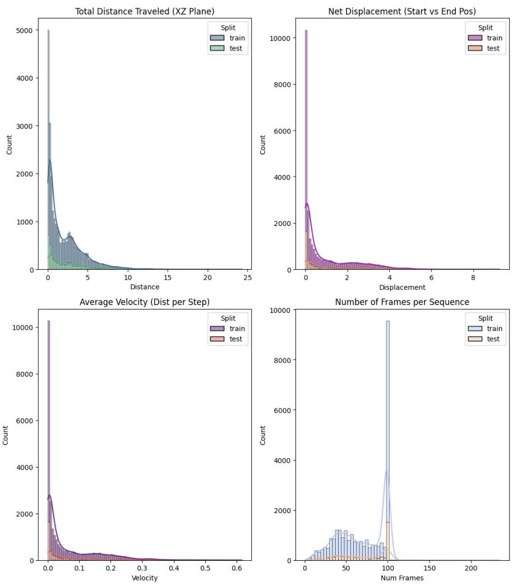  
Fig. 11: Statistics of the DynAction4D-HumanOnly dataset segment.

Table 10: Word count statistics for questions (q\_len) and answers (a\_len) in the DynAction-VQA training split.
<table><tr><td rowspan="2">Type</td><td colspan="2">q_len</td><td colspan="3">a_len</td></tr><tr><td></td><td></td><td></td><td></td><td>Min Max Mean Min Max Mean</td></tr><tr><td>Action</td><td>5</td><td>36 11.66</td><td>7</td><td>55</td><td>21.66</td></tr><tr><td>Body-Spatial</td><td>5</td><td>23</td><td>12.82</td><td>7</td><td>43 18.67</td></tr><tr><td>Temporal</td><td>5</td><td>23</td><td>12.43</td><td>7</td><td>45 19.76</td></tr></table>

DynAction-VQA Dataset test Split Statistics The test split contains 4,314 QA files with a total of 25,117 QA pairs. Each sequence contains on average 5.82 QA pairs (min = 3, max = 8). The average number of QA pairs per category per sequence is: Action: 1.94, Temporal: 1.81, and Body-Spatial: 2.06.

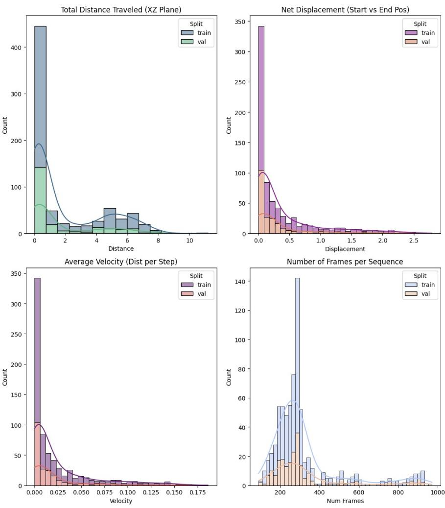  
Fig. 12: Statistics of the DynAction4D-ObjInteractions dataset segment.

Overall DynAction-VQA Dataset Statistics Across the full dataset, DynAction-VQA contains 27,279 QA files and 159,187 QA pairs. Each sequence contains on average 5.84 QA pairs (min = 3, max = 9). The average QA distribution per sequence is: Action: 1.94, Temporal: 1.82, and Body-Spatial: 2.07.

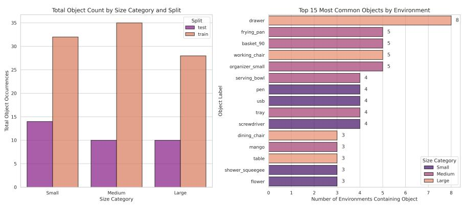  
Fig. 13: Statistics of the DynAction4D-Cluttered dataset segment.

Table 11: Word count statistics for questions (q\_len) and answers $( a \_ l e n )$ in the DynAction-VQA test split.
<table><tr><td rowspan="2">Type</td><td colspan="2">q_len</td><td colspan="2">a len</td></tr><tr><td>Min Max Mean Min Max Mean</td><td></td><td></td><td></td></tr><tr><td>Action</td><td>5</td><td>26 11.68</td><td>7</td><td>52 21.75</td></tr><tr><td>Body-Spatial</td><td>6 23</td><td>12.82</td><td>7</td><td>54 18.68</td></tr><tr><td>Temporal</td><td>5 23</td><td>12.45</td><td>7</td><td>41 19.76</td></tr></table>

Table 12: Word count statistics for questions $( q \_ l e n )$ and answers $( a \_ l e n )$ in combined DynAction-VQA dataset.
<table><tr><td>Type</td><td>q_len Min Max Mean Min Max Mean</td><td></td><td>a_len</td></tr><tr><td>Action</td><td>5 36</td><td>11.67 7</td><td>55 21.67</td></tr><tr><td>Body-Spatial</td><td>5 23</td><td>12.82 7</td><td>54 18.68</td></tr><tr><td>Temporal</td><td>5 23 12.43</td><td>7</td><td>45 19.76</td></tr></table>

## 8.7 Samples from the DynAction4D-VQA segment and the 4DVLM Predictions

Here we provide some figures of our DynAction4D-VQA segment samples in Fig. 14 to Fig. 17. Each sample includes VQA samples, a point cloud sequence with rendered video sequence used for evaluations with video-LLM models.

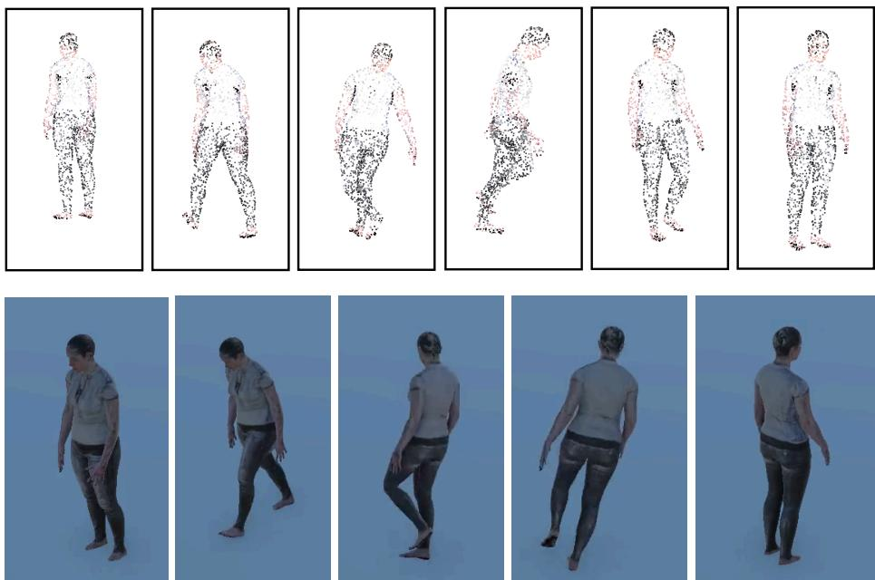

– Q: What does the person do at the very beginning of the motion sequence? GT: The person walks forward with a balanced posture and coordinated arm movements.

4DVLM: The person starts from a standing position and begins to walk forward.

– Q: What action occurs after the person completes the turn?

GT: The person continues walking in the opposite direction with a rhythmic pace similar to the start.

4DVLM: The person performs a 180-degree turn to the right and returns to a steady walking pace.

– Q: How does the entire sequence conclude?

GT: The person gradually decreases speed until coming to a complete stop with both feet aligned together.

4DVLM: The person returns to a neutral standing position and remains still for a few moments.

– Q: How does the person change direction during the sequence?

GT: The person slows down and performs a 180-degree clockwise turn by pivoting on the balls of the feet.

4DVLM: The person performs a 180-degree turn to the right while maintaining a steady pace.

Fig. 14: Qualitative results for sequence\_000022. The top row visualizes the point cloud sequence, while the bottom row displays the corresponding rendered video. The corresponding question-answering pairs, ground truth (GT), and model predictions (4DVLM) are provided below.

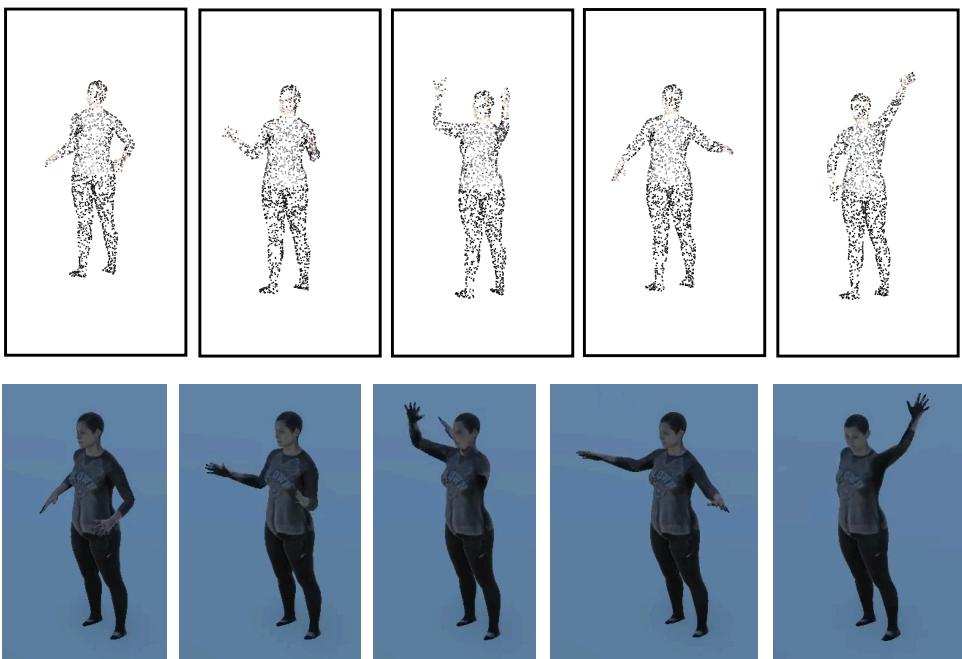

– Q: What occurs immediately after the person forms a V-shape with their arms? GT: The person moves the arms downward, resting the left hand on the hip while stretching the right arm out to the side.

4DVLM: The person performs a rapid, alternating arm swing to the right side.

– Q: How are the person’s hands and arms positioned after the initial shoulder-height lift?

GT: The person raises the arms into a broad V-shape with the palms of the hands directed forward.

4DVLM: The person’s hands are held together in front of the chest with the palms facing upward.

– Q: What is the position of the person’s lower body throughout the activity?

GT: The person remains standing in a single spot with the feet firmly planted and the lower body completely still.

4DVLM: The person maintains a stable and stationary stance with their feet planted firmly on the ground.

– Q: What does the person do with their left arm after extending it out to the side? GT: The person pulls the left arm in toward the chest area and then moves it upward toward the face.

4DVLM: The person brings the left arm back toward the body and down toward the waist.

Fig. 15: Qualitative results for sequence\_000048. The top row visualizes the point cloud sequence, while the bottom row displays the corresponding rendered video. The corresponding question-answering pairs, ground truth (GT), and our model’s predictions (4DVLM) are provided below.

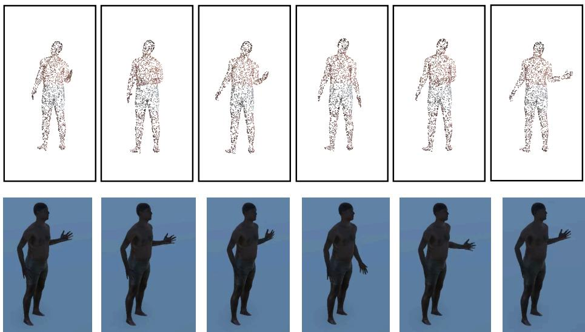

– Q: What is the configuration of the right hand during the upward motion? GT: The person keeps the right hand open with the fingers extended during the ascent.

4DVLM: The person keeps the right hand in a neutral position with the palm facing forward.

– Q: How is the person’s lower body positioned during the sequence?

GT: The person stands with straight legs placed about shoulder-width apart to maintain a stable and still base.

4DVLM: The person maintains a stable and upright posture with their feet planted firmly on the ground.

– Q: What happens after the person raises their hand to mid-chest height?

GT: The person lowers the arm back down toward the hip before beginning the next repetition.

4DVLM: The person lowers their hand back down to their side.

– Q: What movement does the person perform with their right arm?

GT: The person repeatedly lifts and lowers the right forearm by pivoting at the elbow in a rhythmic flexion and extension motion.

4DVLM: The person raises the right arm to a vertical position and then brings it down toward the left side of the body.

Fig. 16: Qualitative results for sequence\_000055. The top row visualizes the point cloud sequence, while the bottom row displays the corresponding rendered video. The corresponding question-answering pairs, ground truth (GT), and our model’s predictions (4DVLM) are provided below.

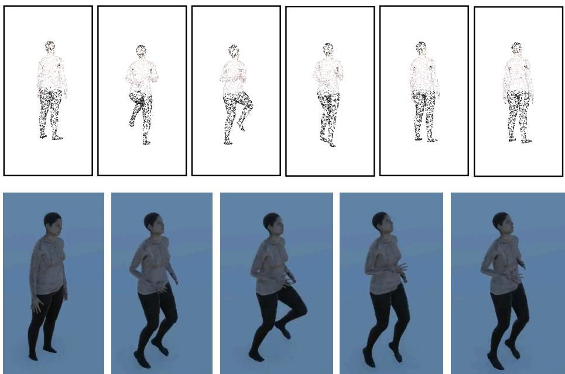

– Q: What is the posture of the person’s upper body during the jogging motion? GT: The person maintains an upright torso throughout the duration of the stationary jog.

4DVLM: The person maintains a slight forward lean with the torso tilted slightly forward.

– Q: How are the person’s arms positioned throughout the main activity?

GT: The person keeps the elbows bent and swings the arms forward and backward in coordination with the opposite leg movements.

4DVLM: The person keeps their arms hanging loosely at their sides with the elbows bent.

– Q: What is the final action performed in the sequence?

GT: The person slows their pace until both feet are lowered back to the ground and they return to a relaxed standing posture.

4DVLM: The person returns to a neutral standing position with both feet placed together.

– Q: What does the person do once the initial movement is established?

GT: The person performs a rhythmic, alternating jogging motion in place, driving their knees upward while the arms swing in opposition to the legs.

4DVLM: The person performs a series of repetitive, rhythmic, and synchronized arm movements.

Fig. 17: Qualitative results for sequence\_000099. The top row visualizes the point cloud sequence, while the bottom row displays the corresponding rendered video. The corresponding question-answering pairs, ground truth (GT), and our model’s predictions (4DVLM) are provided below.