# CamWorldQA: Perceptual Quality Assessment of Camera-Controlled World Video Generation

Yunhe Li, Likun Wu, Sijing Wu, Xinyu Tian, Huiyu Duan, Yixuan Gao, Yunhao Li, Guangtao Zhai Shanghai Jiao Tong University, Eindhoven University of Technology

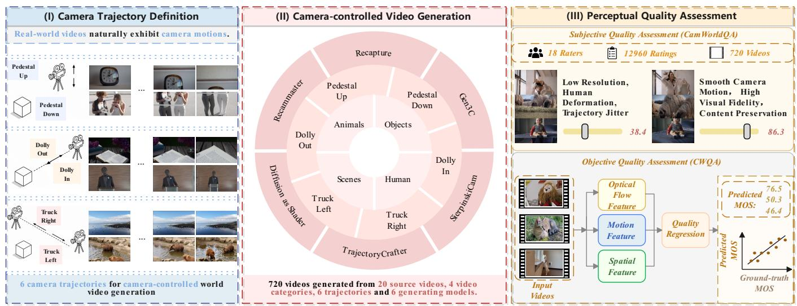  
Figure 1: Overview of camera-controlled world video quality assessment, including camera trajectory definition, CamWorldQA dataset construction, and the proposed CWQA model.

## Abstract

Recent advances in generative video models have enabled cameracontrolled world video generation, allowing models to synthesize videos under user-defined camera trajectories. However, existing video quality assessment (VQA) methods are mainly developed for natural videos and fail to capture the unique perceptual characteristics of camera-controlled generation, such as viewpoint consistency, motion coherence, and content preservation. In this work, we introduce CamWorldQA, the first benchmark for perceptual quality assessment of camera-controlled world video generation. CamWorldQA contains 720 generated videos produced by 6 representative generation methods from 20 diverse source videos under 6 camera trajectories, where each video is annotated with a humanrated perceptual quality score through subjective experiments. Furthermore, we propose CWQA, a no-reference quality assessment network with three complementary branches that extract spatial features, temporal motion features and optical flow features to jointly predict quality scores. Extensive experiments demonstrate that CWQA achieves superior performance over existing quality assessment methods on the CamWorldQA dataset.

## CCS Concepts

• Computing methodologies → Computer vision.

## Keywords

Video quality assessment; video generation; dataset and benchmark

## ACM Reference Format:

Yunhe Li, Likun Wu, Sijing Wu, Xinyu Tian, Huiyu Duan, Yixuan Gao, Yunhao Li, Guangtao Zhai and Shanghai Jiao Tong University, Eindhoven University of Technology. 2018. CamWorldQA: Perceptual Quality Assessment of Camera-Controlled World Video Generation. In Proceedings of Make sure to enter the correct conference title from your rights confirmation email (Conference acronym ’XX). ACM, New York, NY, USA, 10 pages. https://doi.org/XXXXXXX.XXXXXXX

## 1 Introduction

Recent advances in video generation have enabled camera-controlled video synthesis [1, 19, 21, 41], which takes a source video and a new camera trajectory as inputs to generate a new video following the new trajectory. It has numerous applications including film production, virtual reality, embodied intelligence, and interactive world simulation. However, camera-controlled generation requires both visual realism and consistent viewpoint transitions. Current methods may still sufer from inaccurate trajectory following, viewpoint inconsistency, temporal flickering, and unintended content changes, making reliable perceptual quality assessment essential for evaluating and improving these methods.

Existing video quality assessment (VQA) methods have been primarily developed for natural or user-generated videos, focusing on distortions such as compression artifacts, blur, noise, and motion distortions [33, 34]. Although recent approaches incorporate spatialtemporal representations and motion-aware features, they are not specifically designed to capture generation-specific quality factors in camera-controlled videos, including viewpoint inconsistency, incoherent camera motion, and unintended content deformation. Furthermore, the absence of a dedicated subjective benchmark limits the systematic evaluation and comparison of quality assessment methods for generated camera-controlled videos.

In light of these facts, we introduce CamWorldQA, a benchmark specifically designed for perceptual quality assessment of cameracontrolled video generation. CamWorldQA contains 720 generated videos constructed from 20 diverse real-world source videos using 6 representative generation methods and 6 camera trajectories, covering 4 content categories and diverse generation qualities. We conduct a subjective study to collect human perceptual quality annotations, where participants evaluate the generated videos by considering viewpoint consistency, motion coherence and content preservation, with the mean opinion scores (MOSs) for quality assessment methods.

Based on this benchmark, we further propose CWQA, a noreference quality assessment framework for camera-controlled generated videos. Specifically, we employ a spatial branch to extract multi-level appearance features and a temporal branch to capture high-level video dynamics. Moreover, an optical flow branch is intro duced to explicitly characterize motion changes between consecu tive frames. The three representations are projected into a common feature space and integrated through a lightweight branch-wise gating network that adaptively weights their contributions. Finally, the weighted features are concatenated and fed into a quality regression head to predict the perceptual quality score.

Our main contributions are summarized as follows:

• We construct CamWorldQA, the first quality assessment dataset for camera-controlled video generation, including 720 generated videos from 20 source videos, 6 camera trajectories and 6 models with perceptual quality scores.

• Based on CamWorldQA, we systematically benchmark current camera-controlled video generation methods and representative video quality assessment methods and large multimodal models.

• We propose CWQA, a three-branch no-reference quality assessment framework that incorporates spatial, temporal and optical flow features with a branch-wise gating network to predict quality scores. The experimental results demonstrate the efectiveness of our method.

## 2 Related Work

Camera-Controlled Video Generation. Recent advances in video generation based on difusion have enabled increasingly controllable synthesis through camera conditioning. Existing studies control camera motion using explicit poses, predefined motion patterns, trajectory conditions, and geometric representations [10, 20, 31, 39,

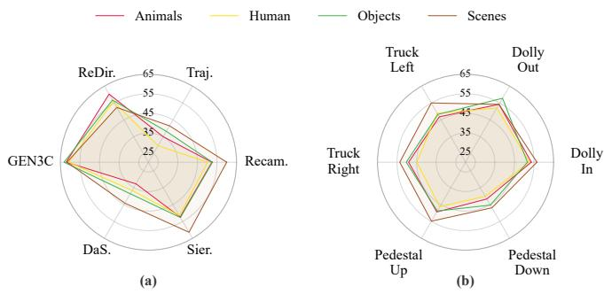  
Figure 2: MOS variations across (a) generation methods and (b) camera trajectories.

45]. More recent works extend camera control to existing monocular videos, enabling video re-rendering and novel-view synthesis under specified camera trajectories while preserving the original scene content and dynamics [1, 3, 9, 19, 27, 41, 43]. Other approaches incorporate geometric and 3D-aware priors, such as depth and reconstructed scene representations, to improve camera controllability and scene consistency [12, 21, 28]. Despite these advances, camera-controlled videos can still sufer from inconsistent viewpoints, geometric deformation, temporal artifacts, and unintended content changes, motivating reliable perceptual quality assessment for this emerging type of generated video.

Video Quality Assessment. Video quality assessment (VQA) aims to predict perceptual video quality in accordance with human judgments. Previous VQA studies have primarily focused on natural and user-generated content (UGC), covering both synthetic and authentic distortions [11, 17, 23, 30, 37, 40]. Accordingly, no-reference VQA methods have evolved from handcrafted and hybrid quality representations [13, 25, 26] to deep spatial-temporal quality modeling [4, 5, 24], with recent approaches further exploring eficient sampling, motion-aware representations, and complementary quality modeling [14, 33, 34]. With the rapid development of gen erative models, perceptual quality assessment has recently been extended from UGC to AI-generated content (AIGC) [8, 15, 16, 35]. Existing studies [6, 18, 36, 38, 44] investigate generation-specific degradations from diferent perspectives, including visual fidelity, spatial-temporal quality, motion naturalness, aesthetics, and semantic consistency. However, camera-controlled video generation introduces unique quality challenges associated with viewpoint transitions, camera-induced motion, geometric consistency, and content preservation. Existing studies are not specifically designed to assess these camera-related degradations, motivating perceptual quality assessment tailored to camera-controlled video generation.

## 3 Datasets

## 3.1 Data Preparation

Video source: We collected 20 high-quality real-world videos with nearly static cameras. These videos are evenly divided into four categories: Animals, Human, Objects, and Scenes. Specifically, the Animals category includes domestic and wild animals. The Human category contains people in everyday activities. The Objects category covers both static and dynamic subjects. The Scenes category consists of natural and urban environments.

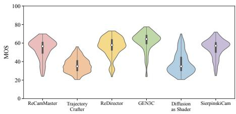  
(a) Generation Methods

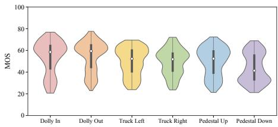  
(b) Camera Trajectories

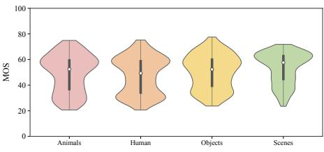  
(c) Content Categories

Figure 3: MOS distributions across (a) generation methods, (b) camera trajectories, and (c) video content categories.  
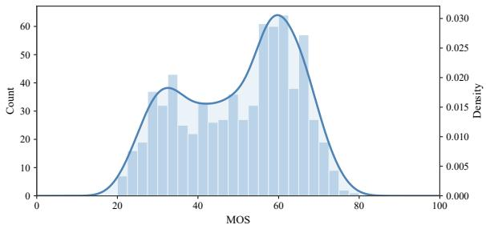  
Figure 4: MOS distribution of CamWorldQA.

Table 1: MOS statistics of videos generated by the six video generation methods in CamWorldQA.
<table><tr><td>Method</td><td>Mean MOS ↑</td><td>Std.</td><td>Min</td><td>Max</td><td>Rank</td></tr><tr><td>GEN3C [21]</td><td>61.88</td><td>10.49</td><td>23.73</td><td>77.59</td><td>1</td></tr><tr><td>ReDirector [19]</td><td>56.31</td><td>10.59</td><td>23.63</td><td>73.09</td><td>2</td></tr><tr><td>SierpinskiCam [32]</td><td>54.49</td><td>9.92</td><td>24.83</td><td>71.86</td><td>3</td></tr><tr><td>ReCamMaster [1]</td><td>53.84</td><td>10.74</td><td>24.08</td><td>69.90</td><td>4</td></tr><tr><td>Diffusion as Shader [9]</td><td>38.07</td><td>11.40</td><td>20.59</td><td>69.90</td><td>5</td></tr><tr><td>TrajectoryCrafter [41]</td><td>36.15</td><td>7.87</td><td>20.58</td><td>55.99</td><td>6</td></tr></table>

Trajectories: Based on frequency of use, we carefully designed six camera trajectories for generation: dolly in, dolly out, truck left, truck right, pedestal up, and pedestal down. We used trajectoryspecific prompts to convert the six camera motions into the input format required by each generation model with AI assistants.

## 3.2 Video Collection

Based on these source videos and trajectories, we generated 720 camera-moving world videos using six video-generating models, including ReCamMaster [1], TrajectoryCrafter [41], ReDirector [19], GEN3C [21], Difusion as Shader [9], and SierpinskiCam [32]. We utilized default settings and weights for these open-source models to generate the videos. All the videos were preprocessed to a resolution of 832 × 480, a frame rate of 15 fps, and a total of 81 frames per clip before generation.

## 3.3 Subjective Study

To obtain reliable human perceptual quality annotations, we conducted a laboratory-based subjective study following ITU-R BT.500 [22]. The study involved 18 human subjects with a balanced gender distribution. Videos were organized by content category and camera trajectory, and were presented in random order to reduce method-ordering bias. Each video was rated with an overall quality score from 1 to 5, with one decimal place allowed. Participants were allowed to replay the video before submitting their scores. During rating, participants jointly considered Viewpoint Consistency, Motion Coherence, and Content Preservation. These three aspects evaluate plausible and stable viewpoints, smooth motions without jitter or flickering, and complete main subjects without unintended changes or severe deformation, respectively.

## 3.4 Data processing

Following ITU-R BT.500 [22], we detected stimulus-level outliers based on the mean, standard deviation, and Pearson kurtosis ofeach stimulus’s scores. Subjects with excessive outlier counts were rejected. The remaining scores were normalized subject-wise, and the MOS of each stimulus was computed as the mean of its normalized valid ratings:

$$
z _ { i j } = \frac { r _ { i j } - \mu _ { i } } { \sigma _ { i } } , \quad z _ { i j } ^ { \prime } = \frac { 1 0 0 ( z _ { i j } + 3 ) } { 6 } , \quad \mathrm { M O S } _ { j } = \frac { 1 } { | \mathcal { V } _ { j } | } \sum _ { i \in \mathcal { V } _ { j } } z _ { i j } ^ { \prime } ,\tag{1}
$$

where $\mu _ { i }$ and $\sigma _ { i }$ are the mean and standard deviation of subject $i ^ { \prime } s$ raw scores, and $\mathcal { V } _ { j }$ denotes the valid ratings for stimulus $j .$ In total, 18 subjects rated all 720 stimuli. One subject was excluded based on the quality control criteria, and the final MOS for each stimulus was computed from the remaining valid ratings.

## 3.5 Data Analysis

To better illustrate CamWorldQA, we analyze the MOS distributions across diferent dimensions, as shown in Table 1 and Figure 3 and Figure 4. Overall, the MOS distribution presents two peaks at high and low quality levels and is largely concentrated within the range of 20 to 80. This wide coverage allows CamWorldQA to diferentiate clearly degraded outputs from highly realistic ones and provides a solid basis for evaluating quality assessment methods. From the method-wise perspective, the six generation methods form two distinct quality tiers: GEN3C, ReDirector, SierpinskiCam, and Re-CamMaster consistently achieve higher average MOS, while Difusion as Shader and TrajectoryCrafter fall clearly behind, leaving a marked gap between the two groups. From the trajectory-wise perspective, the six camera trajectories show only modest quality diferences. Dolly-based movements are rated slightly higher and pedestal-down movements slightly lower, yet no trajectory yields a systematic advantage. From the content-wise perspective, the four content categories obtain similar average MOS, suggesting that the observed quality characteristics are not tied to any single content type and that our dataset generalizes well across diverse video contents.

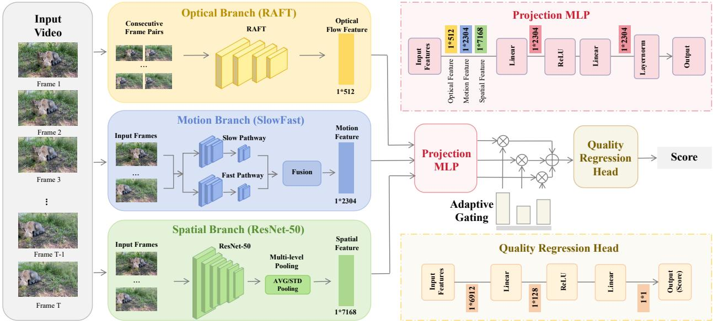  
Figure 5: Overview of the proposed CWQA method.

## 4 Method

## 4.1 Overview

As illustrated in Fig. 5, CWQA takes a camera-controlled generated video as input and predicts its perceptual quality score. The framework consists of three feature representation branches, an adaptive feature fusion module, and a quality regression module.

Specifically, the spatial branch extracts appearance features, while the temporal branch captures high-level video dynamics and the optical flow branch is designed to characterize motion in formation. After mapping them into a common feature space, the projected features are then jointly fed into a branch-wise gating module, adaptively adjusting the contribution of each representa tion. Finally, the weighted features are concatenated to predict the final video quality score.

## 4.2 Feature Representation

Camera-controlled generated videos exhibit quality degradations in spatial appearance, temporal dynamics, and camera-induced motion. Accordingly, we extract three complementary representations to adaptively characterize these quality variations.

Spatial Branch. Camera-controlled generation may introduce appearance-related degradations, such as local distortions and structural deformation. To characterize these spatial quality variations, we extract multi-level appearance features from sampled RGB frames [24]. Features from diferent stages are aggregated using average and standard deviation pooling to capture global appearance information and local feature variations. The resulting spatial representation is denoted as $F _ { s }$

Temporal Branch. In addition to spatial distortions, camera-controlled videos may exhibit temporal degradations, such as flickering and unstable content across frames. To capture these temporal quality variations, we extract high-level video dynamics using SlowFast features [7] across sampled frames. The resulting temporal representation is denoted as $F _ { t }$

Optical Flow Branch. Camera manipulation introduces explicit motion patterns across consecutive frames, making motion consistency an important factor in perceptual quality. Generated videos may exhibit irregular camera-induced motion or unstable viewpoint transitions that are not fully characterized by appearance and high-level temporal features. To explicitly capture such motion variations, we extract optical flow between consecutive frames and encode it into motion representations [14]. The resulting optical flow representation is denoted as $F _ { f }$

Since the three representations have diferent feature dimensions, we employ separate projection modules to map them into a common feature space:

$$
\tilde { F } _ { s } = P _ { s } ( F _ { s } ) , \quad \tilde { F } _ { t } = P _ { t } ( F _ { t } ) , \quad \tilde { F } _ { f } = P _ { f } ( F _ { f } ) ,\tag{2}
$$

where $P _ { s } ( \cdot ) , P _ { t } ( \cdot )$ , and $P _ { f } ( \cdot )$ denote the corresponding feature projection modules. The projected representations are subsequently used for adaptive feature fusion.

## 4.3 Adaptive Branch-wise Feature Fusion

Since the contributions of spatial, temporal, and optical flow representations may vary across videos, we introduce adaptive branch wise fusion to dynamically weight the three representations. Given $\tilde { F } _ { s } , \tilde { F } _ { t } ,$ , and $\tilde { F } _ { f }$ , their concatenation is fed into a lightweight gating network:

$$
[ g _ { s } , g _ { t } , g _ { f } ] = \sigma \left( G ( [ \tilde { F } _ { s } ; \tilde { F } _ { t } ; \tilde { F } _ { f } ] ) \right) ,\tag{3}
$$

where $G ( \cdot )$ denotes the learnable gating network, $\sigma ( \cdot )$ is the sigmoid activation function, and $g _ { s } , g _ { t }$ , and $g _ { f }$ denote the weights

assigned to the spatial, temporal, and optical flow branches, respectively. The weights are applied as:

$$
F _ { s } ^ { w } = g _ { s } \tilde { F } _ { s } , \quad F _ { t } ^ { w } = g _ { t } \tilde { F } _ { t } , \quad F _ { f } ^ { w } = g _ { f } \tilde { F } _ { f } .\tag{4}
$$

The weighted representations are subsequently combined for quality prediction.

## 4.4 Quality Regression

The weighted representations are concatenated to form the final quality-aware representation:

$$
F _ { q } = [ F _ { s } ^ { w } ; F _ { t } ^ { w } ; F _ { f } ^ { w } ] .\tag{5}
$$

A quality regression head then predicts the perceptual quality score:

$$
q _ { t } = R ( F _ { q } ) ,\tag{6}
$$

where $R ( \cdot )$ denotes the quality regression function and $q _ { t }$ represents the predicted quality score for the sampled frame position. Predictions from all sampled positions are averaged to obtain the video-level quality score [24]:

$$
Q = \frac { 1 } { T } \sum _ { t = 1 } ^ { T } q _ { t } ,\tag{7}
$$

where � denotes the number of sampled positions and � is the final predicted perceptual quality score.

## 5 Experiments

## 5.1 Experimental Setup

Dataset and Split. We conduct experiments on CamWorldQA, which contains 720 camera-controlled generated videos with subjective MOS annotations. The videos are generated from 20 real-world source videos covering four content categories using 6 generation methods and 6 representative camera trajectories. The dataset is divided into training and testing sets with a ratio of 8:2 using a fixed random seed. The split is performed at the generated-video level, ensuring that each generated video appears in only one subset.

Training Details. CWQA is initialized from a SimpleVQA [24] checkpoint that has been previously fine-tuned on the CamWorldQA training set. During training, the original feature extraction backbones are frozen, while the spatial, temporal, and optical flow projection modules, the adaptive branch-wise gating module, and the quality regression head are optimized. We employ the Adam optimizer with the L1 ranking loss. The learning rate is set to $1 \times 1 0 ^ { - 4 }$ for the three feature projection modules and the branch-wise gating module, and $1 \times 1 0 ^ { - 5 }$ for the quality regression head, with a weight decay of $1 \times 1 0 ^ { - 7 } .$ . A StepLR scheduler is adopted to decay the learning rate by a factor of 0.95 every two epochs. The model is trained for 20 epochs with a batch size of 4. For data preprocessing, input frames are resized to 520 pixels and randomly cropped to 448 × 448 during training, while center cropping is used during testing. ImageNet normalization is applied to the RGB frames.

Compared Methods. We compare our method with representative quality assessment approaches under diferent evaluation settings. Conventional no-reference VQA models, including DOVER [34],

Table 2: Overall performance comparison on the Cam-WorldQA dataset. ♦, ♣, and ♥ denote traditional VQA methods, learning-based VQA methods, and multimodal large language models, respectively. † indicates models trained on the CamWorldQA dataset. The best and runner-up performances are bold and underlined, respectively.
<table><tr><td>Method</td><td>SRCC↑</td><td>PLCC↑</td><td>KRCC↑</td></tr><tr><td rowspan="5">RAPIQUE [26] VIDEVAL [25] SimpleVQA [24] FastVQA [33]</td><td>0.6592</td><td>0.6545</td><td>0.4722</td></tr><tr><td>0.3491</td><td>0.3677</td><td>0.2386</td></tr><tr><td>0.1816</td><td>0.1906</td><td>0.1212</td></tr><tr><td>0.4662</td><td>0.4615</td><td>0.3112</td></tr><tr><td>0.2098</td><td>0.2590</td><td>0.1428</td></tr><tr><td> Qwen3-VL (4B) [2]</td><td>0.2342</td><td>0.2526</td><td>0.1852</td></tr><tr><td> VideoLLaMA3 (7B) [42]</td><td>0.3460</td><td>0.3843</td><td>0.2710</td></tr><tr><td> Qwen3-VL (8B) [2]</td><td>0.2640</td><td>0.2819</td><td>0.2139</td></tr><tr><td> InternVL3.5 (8B) [29]</td><td>0.1147</td><td>0.1557</td><td>0.0935</td></tr><tr><td> $\pm \mathrm { S i m p l e V Q A } \left[ 2 4 \right] ^ { \dag }$ </td><td>0.6263</td><td>0.6260</td><td>0.4478</td></tr><tr><td> $\pm \mathrm { F a s t V Q A } \left[ 3 3 \right] ^ { \dagger }$ </td><td>0.5006</td><td>0.4948</td><td>0.3405</td></tr><tr><td> $\bullet \mathrm { D O V E R } \ [ 3 4 ] \ ^ { \dagger }$ </td><td>0.4236</td><td>0.4265</td><td>0.2925</td></tr><tr><td> $\mathbf { C W Q A } \left( \mathbf { O u r s } \right) ^ { \dag }$ </td><td>0.7804</td><td>0.7848</td><td>0.5739</td></tr><tr><td></td><td></td><td></td><td></td></tr></table>

SimpleVQA [24], and FastVQA [33], are evaluated under both zeroshot and fine-tuned settings. We additionally include VIDEVAL [25] and RAPIQUE [26] for zero-shot evaluation . We further include recent video multimodal large language models, including the Qwen3 series [2], InternVL3.5 series [29], and VideoLLaMA3 [42], to provide a broader comparison with general-purpose video understanding models. The zero-shot setting evaluates direct transferability to camera-controlled generated videos, whereas the fine-tuned setting evaluates adaptation using the subjective annotations of CamWorldQA.

Evaluation Metrics. Following previous VQA studies, we employ three commonly used correlation metrics: Pearson Linear Correlation Coeficient (PLCC), Spearman Rank Correlation Coeficient (SRCC), and Kendall Rank Correlation Coeficient (KRCC). PLCC measures the linear correlation between predicted quality scores and subjective ratings, while SRCC and KRCC measure ranking consistency. Before calculating PLCC, nonlinear logistic mapping is applied following the adopted VQA evaluation protocol.

## 5.2 Ablation Study

We conduct ablation experiments to investigate the contribution of each feature branch and the adaptive fusion strategy. All variants are trained and evaluated under the same experimental settings, with the results reported in Table 4.

As shown in Table 4, removing the spatial branch leads to a moderate performance degradation, indicating that multi-level appearance features provide useful information for capturing spatial distortions and structural deformation. A more noticeable degradation is observed without the temporal branch, demonstrating the importance of high-level temporal features in characterizing temporal variations and cross-frame instability. Among the three feature branches, removing the optical flow branch causes the most significant performance drop, highlighting the role of explicit motion information in capturing irregular camera-induced motion and unstable viewpoint transitions. The adaptive gating module further improves the overall performance, indicating that dynamically weighting the three representations is more efective than directly combining them. The complete CWQA achieves the best performance, demonstrating the complementarity of the three feature branches and the efectiveness of adaptive feature fusion.

Table 3: Category-wise performance comparison on the CamWorldQA dataset. $\diamond , \ast ,$ and ♥ denote traditional VQA methods, learning-based VQA methods, and multimodal large language models, respectively. † indicates models trained on the Cam WorldQA dataset. The best and runner-up performances are bold and underlined, respectively.
<table><tr><td></td><td colspan="3">Animals</td><td colspan="3">Human</td><td colspan="3">Objects</td><td colspan="3">Scene</td></tr><tr><td>Method</td><td>SRCC↑</td><td>PLCC↑</td><td>KRCC↑</td><td>SRCC↑</td><td>PLCC↑</td><td>KRCC↑</td><td>SRCC↑</td><td>PLCC↑</td><td>KRCC↑</td><td>SRCC↑</td><td>PLCC↑</td><td>KRCC↑</td></tr><tr><td> RAPIQUE [26]</td><td>0.7051</td><td>0.7430</td><td>0.5352</td><td>0.7096</td><td>0.7780</td><td>0.4970</td><td>0.5003</td><td>0.7114</td><td>0.3492</td><td>0.7156</td><td>0.6880</td><td>0.5116</td></tr><tr><td> VIDEVAL [25]</td><td>0.2948</td><td>0.2662</td><td>0.2135</td><td>0.3206</td><td>0.4011</td><td>0.2182</td><td>0.1970</td><td>0.5798</td><td>0.1429</td><td>0.5184</td><td>0.5230</td><td>0.3693</td></tr><tr><td>DOVER [34]</td><td>0.1844</td><td>0.2516</td><td>0.1380</td><td>0.0392</td><td>0.0237</td><td>0.0242</td><td>0.3689</td><td>0.6359</td><td>0.2751</td><td>0.4226</td><td>0.3792</td><td>0.3063</td></tr><tr><td> SimpleVQA [24]</td><td>0.2836</td><td>0.3574</td><td>0.2164</td><td>0.0460</td><td>0.3703</td><td>0.0364</td><td>0.0317</td><td>0.0480</td><td>0.0159</td><td>0.3968</td><td>0.4080</td><td>0.3171</td></tr><tr><td> FastVQA [33]</td><td>0.3117</td><td>0.3893</td><td>0.2006</td><td>0.3138</td><td>0.3723</td><td>0.1855</td><td>0.4165</td><td>0.5740</td><td>0.2698</td><td>0.7097</td><td>0.8089</td><td>0.4957</td></tr><tr><td> Qwen3-VL (4B) [2]</td><td>0.2137</td><td>0.2899</td><td>0.1792</td><td>0.1389</td><td>0.2927</td><td>0.1104</td><td>0.1648</td><td>0.2728</td><td>0.1440</td><td>0.4262</td><td>0.3715</td><td>0.3484</td></tr><tr><td>VideoLLaMA3 (7B) [42]</td><td>0.4475</td><td>0.4431</td><td>0.3659</td><td>0.2303</td><td>0.3479</td><td>0.1909</td><td>0.3232</td><td>0.3316</td><td>0.2833</td><td>0.4964</td><td>0.6185</td><td>0.4028</td></tr><tr><td> Qwen3-VL (8B) [2]</td><td>0.2090</td><td>0.1969</td><td>0.1729</td><td>0.4578</td><td>0.4567</td><td>0.3796</td><td>0.1514</td><td>0.1197</td><td>0.1257</td><td>0.4162</td><td>0.4107</td><td>0.3493</td></tr><tr><td> InternVL3.5 (8B) [29]</td><td>0.0796</td><td>0.1021</td><td>0.0659</td><td>0.5159</td><td>0.5266</td><td>0.4277</td><td>0.0210</td><td>0.2890</td><td>0.0244</td><td>0.1509</td><td>0.1139</td><td>0.1246</td></tr><tr><td>DOVER [34] †</td><td>0.5404</td><td>0.6007</td><td>0.3855</td><td>0.5561</td><td>0.5975</td><td>0.3831</td><td>0.4444</td><td>0.4655</td><td>0.3492</td><td>0.4187</td><td>0.2336</td><td>0.2812</td></tr><tr><td> SimpleVQA [24] †</td><td>0.7426</td><td>0.7318</td><td>0.5352</td><td>0.6330</td><td>0.7196</td><td>0.4525</td><td>0.7061</td><td>0.7220</td><td>0.5026</td><td>0.5578</td><td>0.5500</td><td>0.3809</td></tr><tr><td>•FastVQA [33] †</td><td>0.3812</td><td>0.4686</td><td>0.2875</td><td>0.2700</td><td>0.3868</td><td>0.1756</td><td>0.5012</td><td>0.7382</td><td>0.3364</td><td>0.7189</td><td>0.8207</td><td>0.5039</td></tr><tr><td>CWQA (Ours)</td><td>0.8601</td><td>0.8490</td><td>0.6776</td><td>0.7115</td><td>0.7345</td><td>0.5131</td><td>0.8380</td><td>0.8828</td><td>0.6402</td><td>0.7239</td><td>0.7659</td><td>0.5085</td></tr></table>

Table 4: Ablation study of CWQA on CamWorldQA.
<table><tr><td>Method</td><td>SRCC↑</td><td>PLCC↑</td><td>KRCC↑</td></tr><tr><td>w/o Spatial Branch</td><td>0.7572</td><td>0.7553</td><td>0.5712</td></tr><tr><td>w/o Temporal Branch</td><td>0.7248</td><td>0.7099</td><td>0.5308</td></tr><tr><td>w/o Optical Flow</td><td>0.6263</td><td>0.6260</td><td>0.4478</td></tr><tr><td>w/o Adaptive Gating</td><td>0.7315</td><td>0.6636</td><td>0.5374</td></tr><tr><td>Full CWQA (Ours)</td><td>0.7804</td><td>0.7848</td><td>0.5739</td></tr></table>

## 5.3 Results Analysis

As shown in Table 2, existing VQA and multimodal models show limited performance when directly applied to CamWorldQA, indicating a domain gap between conventional quality representations and camera-controlled generated videos. Fine-tuning on CamWorldQA generally improves the performance of conventional VQA methods, demonstrating the benefit of task-specific quality annotations. Among the compared methods, CWQA achieves the best performance across all three correlation metrics and clearly outperforms the fine-tuned baselines. This improvement demonstrates the effectiveness of jointly modeling spatial, temporal, and optical flow information for perceptual quality assessment of camera-controlled generated videos.

To examine the robustness of diferent methods across diverse video contents, we further report category-wise results in Table 3. The compared methods exhibit noticeable performance variations across diferent content categories. In particular, several zero-shot VQA and multimodal models perform well on specific categories but show limited generalization to others, suggesting that their quality representations do not transfer uniformly to camera-controlled gen erated videos. Fine-tuning on CamWorldQA generally improves the performance of conventional VQA models, highlighting the importance of task-specific adaptation. CWQA achieves consistently strong correlations with subjective scores across the four categories. It achieves the best SRCC across all four categories and the best PLCC on animals and objects, while remaining competitive with the strongest baselines on human and scene videos. These results indicate that jointly modeling spatial, temporal, and optical flow representations provides a more robust quality representation across diferent types of generated content.

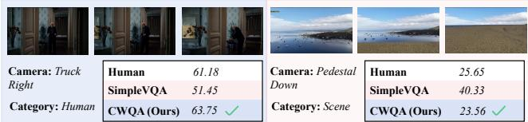  
Figure 6: Qualitative results of the proposed CWQA method.

As illustrated in Fig. 6, CWQA produces quality predictions that are more consistent with human MOS than the compared methods across representative cases with diferent perceptual degradations. This qualitative comparison further demonstrates the efectiveness of CWQA in capturing quality variations in camera-controlled generated videos.

## 6 Conclusion

In this work, we present CamWorldQA, the first benchmark for perceptual quality assessment of camera-controlled world video generation. CamWorldQA contains 720 generated videos produced by 6 representative generation methods from 20 diverse source videos under 6 camera trajectories, where each video is annotated with a human-rated perceptual quality score through subjective experiments. Furthermore, we propose CWQA, a no-reference quality assessment network with three complementary branches that extract spatial features, temporal motion features and optical flow features to jointly predict quality scores. Extensive experiments demonstrate that CWQA achieves superior performance over existing quality assessment methods on the CamWorldQA dataset. We hope CamWorldQA can facilitate future research on the evaluation and improvement of camera-controlled video generation.

## Supplementary Material

Table A: Canonical camera motions and their corresponding camera parameters.
<table><tr><td>Canonical Motion</td><td> $t _ { x }$ </td><td> $t _ { y }$ </td><td> $t _ { z }$ </td></tr><tr><td>Truck Left</td><td>-0.25</td><td>0</td><td>0</td></tr><tr><td>Truck Right</td><td>+0.25</td><td>0</td><td>0</td></tr><tr><td>Pedestal Up</td><td>0</td><td>+0.25</td><td>0</td></tr><tr><td>Pedestal Down</td><td>0</td><td>-0.25</td><td>0</td></tr><tr><td>Dolly In</td><td>0</td><td>0</td><td>-0.30</td></tr><tr><td>Dolly Out</td><td>0</td><td>0</td><td>+0.30</td></tr></table>

## A Trajectory Control

We define a canonical camera-motion space to unify diferent trajectory settings, as shown in Table A. Each trajectory is represented by three camera parameters: $t _ { x } , t _ { y } ,$ and $t _ { z } .$

The parameters $t _ { x } , t _ { y } ,$ and $t _ { z }$ denote the camera’s translational displacements along the three principal axes of the canonical coordinate system: $t _ { x }$ for horizontal shift (positive = right, negative = left), $t _ { y }$ for vertical shift (positive = up, negative = down), and $t _ { z }$ for depth shift along the viewing direction (positive = moving away from the scene, negative = moving toward the scene). These values are expressed in normalized units relative to the scene scale, ensuring consistency across diferent datasets and rendering settings. The chosen magnitudes (e.g., ±0.25 for lateral/vertical, ±0.30 for depth) are empirically selected to produce noticeable but nonextreme motion efects, facilitating robust learning ofmotion-aware representations.

## B Camera-controlled Video Generation Methods

ReCamMaster [1] : A camera-controlled generative rendering method that synthesizes novel viewpoints of a single video under user-specified camera trajectories. It learns a camera-conditioned difusion model built on a Flux DiT backbone with a CogVAE, in jecting camera parameters as conditioning to control viewpoint changes. It employs 3D-consistent rendering with view-dependent appearance modeling, trained on 81-frame 1280×1280 15 fps videos. It supports diverse camera trajectories (e.g., dolly, truck, and pedestal movements), making it suitable for film production and interactive applications.

TrajectoryCrafter [41] : Redirects the camera trajectory of monocular videos through difusion-based re-rendering. It first estimates dense depth with DepthCrafter, warps the scene along the target trajectory, and fills disoccluded regions via a spatio-temporal U-Net for temporal consistency. It generates 49-frame clips at 10 fps, using the depth prior as an explicit camera-control signal. Its depthguided re-rendering enables seamless camera retargeting on casual monocular videos.

ReDirector [19] : Creates any-length video retakes with a rotary camera encoding mechanism. It embeds camera motion as rotary positional embeddings into a Wan 2.1-Fun 1.3B backbone, enabling dense camera control without explicit depth estimation or 3D reconstruction, and supports arbitrary-length retakes at 832×480 resolution. $\operatorname { B y }$ separating camera control from content, it allows flexible retakes of existing videos with any desired camera motion and duration.

Table B: Overview of the six camera-controlled video generation methods.
<table><tr><td>Method</td><td>Year</td><td>Resolution</td><td>Frames (FPS)</td><td>Type</td></tr><tr><td>ReCamMaster</td><td>2025</td><td>1280×1280÷</td><td>81÷/15÷</td><td>Diff. (3D)</td></tr><tr><td>TrajectoryCrafter</td><td>2025</td><td>Inherited*</td><td>49†/10†</td><td>Diffusion</td></tr><tr><td>ReDirector</td><td>2025</td><td>832×480†</td><td>81†/30†</td><td>Diffusion</td></tr><tr><td>GEN3C</td><td>2025</td><td>704×1280÷</td><td>121≠/24†</td><td>3D world</td></tr><tr><td>Diffusion as Shader</td><td>2025</td><td>720×480÷</td><td> $4 9 ^ { * } / 8 \dagger$ </td><td>3D-aware</td></tr><tr><td>SierpinskiCam</td><td>2026</td><td>832×480†</td><td>81†/12†</td><td>Diffusion</td></tr></table>

† default; ∗ maximum; ‡ example/training-recommended.

GEN3C [21] : A 3D-informed world-consistent video generation method with precise camera control. It maintains an explicit 3D cache of the scene, renders it from the target viewpoint, and feeds the renderings into an NVIDIA Cosmos autoregressive model with a 7B difusion decoder. It supports long 121-frame generations at 24 fps, ensuring geometric consistency under large camera motions. It operates on a single image or video seed and generates very long sequences autoregressively.

Difusion as Shader [9] : Treats the video difusion model as a shader that re-renders an input 3D mesh under novel camera motion. Built on CogVideoX-5B, it re-projects rendered geometry back into the difusion pipeline, providing interpretable 3D-aware control over camera pan, zoom, and object motion, while generating 49 frames at 8 fps. Leveraging explicit mesh rendering and point tracking, it ofers precise, user-controllable 3D-aware motion editing.

SierpinskiCam [32] : Camera-controlled video retaking using Sierpinski-triangle pattern cues. It encodes camera trajectories as Sierpinski pattern signals injected into a Wan 2.1 14B difusion model, enabling arbitrary camera paths for retaking at 832×480 and 81 frames, without requiring per-frame camera parameters at inference. Its pattern-based camera cues support 14 predefined camera paths and avoid explicit camera parameter estimation.

The overview of six camera-controlled video generation models is shown in Table B

## C Details of the Subjective Study GUI

We developed a browser-based GUI for perceptual quality assessment of camera-controlled video generation as shown in Figure A. After entering a user ID, the interface starts or resumes the participant’s progress with an individually randomized playback order. The rating screen shows the sample ID, trajectory name, a cameramotion diagram, and a progress bar. Videos are displayed in a card grid: a highlighted "Original Reference" on the left serves as the baseline, while three blind-labeled candidate videos are arranged on the right and bottom, with method names hidden and order randomized. Each candidate is rated via a 1.0–5.0 (0.1-step) slider, enabled only after the participant has fully watched the reference and all candidates. The bottom toolbar ofers replay-all, play/pause, and submit shortcuts; the results are saved to an Excel workbook, and a completion screen shows the result file path.

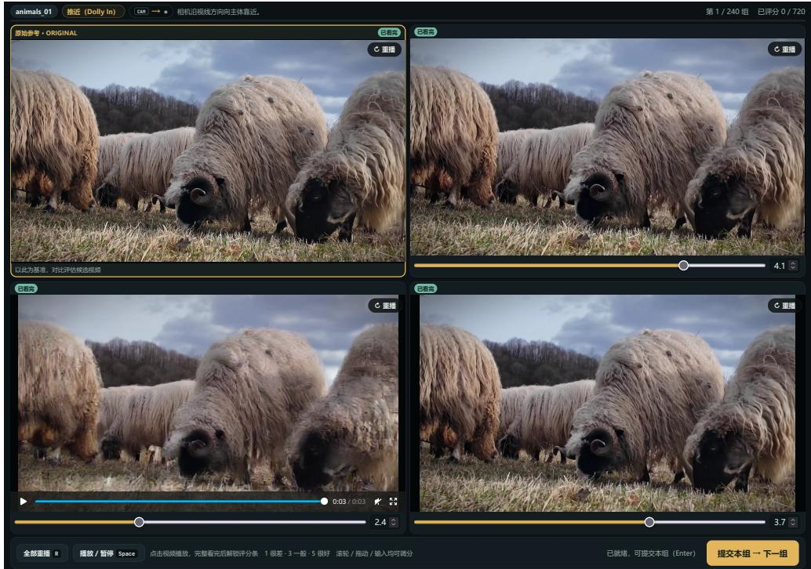  
Figure A: Illustration of the GUI used in the subjective study

## D Demos for Videos of Diferent Mean Opinion Scores

To qualitatively illustrate how perceptual quality varies across different levels, we select five representative generated videos ranging from low to high MOS shown in Figure B. (1) The lowest-quality example depicts a ticking clock, whose distorted clock hands appear geometrically implausible under the camera motion, indicating severe deformation of the moving object and a violation of physical realism. (2) The second example shows a dancer; however, in the generated video the person becomes static and the wall is truncated, reflecting a failure to preserve motion dynamics and scene completeness. (3) The third example contains two brown bears playing in a stream, which is semantically plausible and natural in motion but blurry, noticeably lowering the perceived clarity. (4) The fourth example is a toy doll, overall clear and consistent with the real world but with slight blur and noise, representing only a mild quality degradation. (5) The best example shows a person giving a speech, where both the human motion and the surrounding environment are faithfully reproduced, appearing clear and vivid and yielding the highest perceptual quality among the five examples. These observations indicate that the perceptual quality of camera-controlled generated videos is jointly determined by geometric fidelity, motion plausibility, content preservation, and visual clarity, and the diverse artifacts across these examples highlight the limitations of conventional quality assessment models in capturing generation-specific distortions.

## References

[1] Jianhong Bai, Menghan Xia, Xiao Fu, Xintao Wang, Lianrui Mu, Jinwen Cao, Zuozhu Liu, Haoji Hu, Xiang Bai, Pengfei Wan, et al. 2025. Recammaster: Cameracontrolled generative rendering from a single video. In 2025 IEEE/CVF International Conference on Computer Vision (ICCV). IEEE, 14834–14844.

[2] Shuai Bai, Yuxuan Cai, Ruizhe Chen, Keqin Chen, Xionghui Chen, Zesen Cheng, Lianghao Deng, Wei Ding, Chang Gao, Chunjiang Ge, et al. 2025. Qwen3-vl technical report. arXiv preprint arXiv:2511.21631 (2025).

[3] Weikang Bian, Zhaoyang Huang, Xiaoyu Shi, Yijin Li, Fu-Yun Wang, and Hongsheng Li. 2025. Gs-dit: Advancing video generation with pseudo 4d gaussian fields through eficient dense 3d point tracking. arXiv preprint arXiv:2501.02690 (2025).

[4] Baoliang Chen, Lingyu Zhu, Guo Li, Fangbo Lu, Hongfei Fan, and Shiqi Wang. 2021. Learning generalized spatial-temporal deep feature representation for no-reference video quality assessment. IEEE Transactions on Circuits and Systems for Video Technology 32, 4 (2021), 1903–1916.

[5] Huiyu Duan, Qiang Hu, Jiarui Wang, Liu Yang, Zitong Xu, Lu Liu, Xiongkuo Min, Chunlei Cai, Tianxiao Ye, Xiaoyun Zhang, et al. 2025. Finevq: Fine-grained user generated content video quality assessment. In 2025 IEEE/CVF Conference on Computer Vision and Pattern Recognition (CVPR). IEEE, 3206–3217.

[6] Yusu Fang, Tiange Xiang, Tian Tan, Narayan Schuetz, Scott Delp, Li Fei-Fei, and Ehsan Adeli. 2026. HumanScore: Benchmarking Human Motions in Generated Videos. arXiv preprint arXiv:2604.20157 (2026).

[7] Christoph Feichtenhofer, Haoqi Fan, Jitendra Malik, and Kaiming He. 2019. Slowfast networks for video recognition. In 2019 IEEE/CVF international conference on computer vision (ICCV). IEEE, 6201–6210

[8] Yixuan Gao, Xiongkuo Min, Jinliang Han, Yuqin Cao, Sijing Wu, Yunze Dou, and Guangtao Zhai. 2025. Multi-dimensional text-to-face image quality assessment using LLM: Database and method. In Proceedings of the 33rd ACM International Conference on Multimedia. 6948–6957.

[9] Zekai Gu, Rui Yan, Jiahao Lu, Peng Li, Zhiyang Dou, Chenyang Si, Zhen Dong, Qifeng Liu, Cheng Lin, Ziwei Liu, et al. 2025. Difusion as shader: 3d-aware video difusion for versatile video generation control. In Proceedings of the Special Interest Group on Computer Graphics and Interactive Techniques Conference Conference Papers. 1–12.

Animals | Truck Right | 50.0

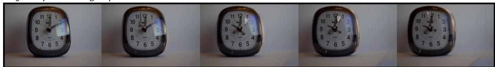  
Objects | Truck Right | 27.5  
Human | Dolly Out | 40.0

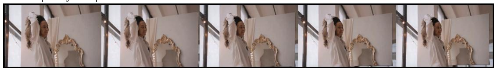

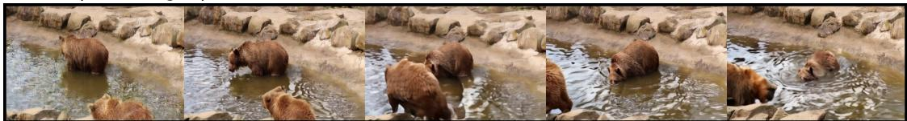  
Objects | Pedestal Up | 59.9

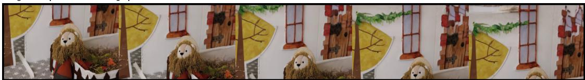

Human | Pedestal Up | 72.4

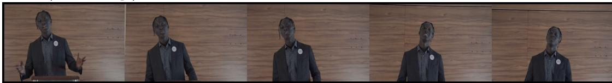  
Figure B: Demo videos of diferent mean opinion scores. For each video, its content category, camera trajectory, and MOS are annotated above the frames.

[10] Hao He, Yinghao Xu, Yuwei Guo, Gordon Wetzstein, Bo Dai, Hongsheng Li, and Ceyuan Yang. 2024. Cameractrl: Enabling camera control for text-to-video generation. arXiv preprint arXiv:2404.02101 (2024).

[11] Vlad Hosu, Franz Hahn, Mohsen Jenadeleh, Hanhe Lin, Hui Men, Tamás Szirányi, Shujun Li, and Dietmar Saupe. 2017. The Konstanz natural video database (KoNViD-1k). In 2017 Ninth international conference on quality of multimedia experience (QoMEX). IEEE, 1–6.

[12] Chen Hou and Zhibo Chen. 2024. Training-free camera control for video generation. arXiv preprint arXiv:2406.10126 (2024).

[13] Jari Korhonen. 2019. Two-level approach for no-reference consumer video quality assessment. IEEE Transactions on Image Processing 28, 12 (2019), 5923–5938.

[14] Tengchuan Kou, Xiaohong Liu, Wei Sun, Jun Jia, Xiongkuo Min, Guangtao Zhai, and Ning Liu. 2023. Stablevqa: A deep no-reference quality assessment model for video stability. In Proceedings ofthe 31st ACM International Conference on Multimedia. 1066–1076.

[15] Tengchuan Kou, Xiaohong Liu, Zicheng Zhang, Chunyi Li, Haoning Wu, Xiongkuo Min, Guangtao Zhai, and Ning Liu. 2024. Subjective-aligned dataset and metric for text-to-video quality assessment. In Proceedings ofthe 32nd ACM International Conference on Multimedia. 7793–7802.

[16] Yunhao Li, Sijing Wu, Wei Sun, Zhichao Zhang, Yucheng Zhu, Zicheng Zhang, Huiyu Duan, Xiongkuo Min, and Guangtao Zhai. 2025. Aghi-qa: A subjective aligned dataset and metric for ai-generated human images. IEEE Transactions on Circuits and Systems for Video Technology (2025).

[17] Yunhao Li, Sijing Wu, Yucheng Zhu, Huiyu Duan, Zicheng Zhang, Wei Sun, Xiongkuo Min, and Guangtao Zhai. 2026. DHQA-4D: A large-scale dataset and

LMM-based metric for dynamic 4D digital human quality assessment. Pattern Recognition (2026), 114567.

[18] Yiting Lu, Xin Li, Bingchen Li, Zihao Yu, Fengbin Guan, Xinrui Wang, Ruling Liao, Yan Ye, and Zhibo Chen. 2024. Aigc-vqa: A holistic perception metric for aigc video quality assessment. In 2024 IEEE/CVF Conference on Computer Vision and Pattern Recognition Workshops (CVPRW). IEEE, 6384–6394.

[19] Byeongjun Park, Byung-Hoon Kim, Hyungjin Chung, and Jong Chul Ye. 2026. Redirector: Creating any-length video retakes with rotary camera encoding. In Proceedings ofthe IEEE/CVFConference on ComputerVision andPattern Recognition. 11163–11173.

[20] Stefan Popov, Amit Raj, Michael Krainin, Yuanzhen Li, William T Freeman, and Michael Rubinstein. 2025. Camctrl3d: Single-image scene exploration with precise 3d camera control. In 2025 International Conference on 3D Vision (3DV). IEEE, 649–658.

[21] Xuanchi Ren, Tianchang Shen, Jiahui Huang, Huan Ling, Yifan Lu, Merlin Nimier-David, Thomas Müller, Alexander Keller, Sanja Fidler, and Jun Gao. 2025. Gen3c: 3d-informed world-consistent video generation with precise camera control. In 2025 IEEE/CVF Conference on Computer Vision and Pattern Recognition (CVPR). IEEE, 6121–6132.

[22] B Series. 2012. Methodologyfor the subjective assessment ofthe quality oftelevision pictures. Recommendation ITU-R BT 500, 13. (2012).

[23] Zeina Sinno and Alan Conrad Bovik. 2018. Large-scale study of perceptual video quality. IEEE Transactions on Image Processing 28, 2 (2018), 612–627.

[24] Wei Sun, Xiongkuo Min, Wei Lu, and Guangtao Zhai. 2022. A deep learning based no-reference quality assessment model for ugc videos. In Proceedings of

the 30th ACM International Conference on Multimedia. 856–865.

[25] Zhengzhong Tu, Yilin Wang, Neil Birkbeck, Balu Adsumilli, and Alan C Bovik. 2021. UGC-VQA: Benchmarking blind video quality assessment for user generated content. IEEE Transactions on Image Processing 30 (2021), 4449–4464.

[26] Zhengzhong Tu, Xiangxu Yu, Yilin Wang, Neil Birkbeck, Balu Adsumilli, and Alan C Bovik. 2021. RAPIQUE: Rapid and accurate video quality prediction of user generated content. IEEE Open Journal ofSignal Processing 2 (2021), 425–440.

[27] Basile Van Hoorick, Rundi Wu, Ege Ozguroglu, Kyle Sargent, Ruoshi Liu, Pavel Tokmakov, Achal Dave, Changxi Zheng, and Carl Vondrick. 2024. Generative camera dolly: Extreme monocular dynamic novel view synthesis. In European Conference on Computer Vision. Springer, 313–331.

[28] Qinghe Wang, Yawen Luo, Xiaoyu Shi, Xu Jia, Huchuan Lu, Tianfan Xue, Xintao Wang, Pengfei Wan, Di Zhang, and Kun Gai. 2025. Cinemaster: A 3d-aware and controllable framework for cinematic text-to-video generation. In Proceedings ofthe Special Interest Group on Computer Graphics and Interactive Techniques Conference Conference Papers. 1–10.

[29] Weiyun Wang, Zhangwei Gao, Lixin Gu, Hengjun Pu, Long Cui, Xingguang Wei, Zhaoyang Liu, Linglin Jing, Shenglong Ye, Jie Shao, et al. 2025. Internvl3. 5: Advancing open-source multimodal models in versatility, reasoning, and eficiency. arXiv preprint arXiv:2508.18265 (2025).

[30] Yilin Wang, Sasi Inguva, and Balu Adsumilli. 2019. YouTube UGC dataset for video compression research. In 2019 IEEE 21st international workshop on multimedia signal processing (MMSP). IEEE, 1–5.

[31] Zhouxia Wang, Ziyang Yuan, Xintao Wang, Yaowei Li, Tianshui Chen, Menghan Xia, Ping Luo, and Ying Shan. 2024. Motionctrl: A unified and flexible motion controller for video generation. In ACM SIGGRAPH 2024 Conference Papers. 1–11.

[32] Suttisak Wizadwongsa, Hyelin Nam, Supasorn Suwajanakorn, and Jeong Joon Park. 2026. SierpinskiCam: Camera-Controlled Video Retaking with Sierpinski Triangle Pattern Cues. arXiv preprint arXiv:2606.17310 (2026).

[33] Haoning Wu, Chaofeng Chen, Jingwen Hou, Liang Liao, Annan Wang, Wenxiu Sun, Qiong Yan, and Weisi Lin. 2022. Fast-vqa: Eficient end-to-end video quality assessment with fragment sampling. In European conference on computer vision. Springer, 538–554.

[34] Haoning Wu, Erli Zhang, Liang Liao, Chaofeng Chen, Jingwen Hou, Annan Wang, Wenxiu Sun, Qiong Yan, and Weisi Lin. 2023. Exploring video quality assessment on user generated contents from aesthetic and technical perspectives. In 2023 IEEE/CVFInternational Conference on ComputerVision (ICCV). IEEE, 20087–20097.

[35] Sijing Wu, Yunhao Li, Huiyu Duan, Yanwei Jiang, Yucheng Zhu, and Guangtao Zhai. 2025. Hveval: Towards unified evaluation of human-centric video genera tion and understanding. In Proceedings of the 33rd ACM International Conference

on Multimedia. 13376–13383.

[36] Sijing Wu, Yunhao Li, Huiyu Duan, Yucheng Zhu, Xiongkuo Min, Patrick Le Callet, and Guangtao Zhai. 2026. Multi-Dimensional Quality Assessment for AI-Generated Human-Centric Videos: Dataset and Model. IEEE Transactions on Circuits and Systems for Video Technology (2026).

[37] Sijing Wu, Yunhao Li, Ziwen Xu, Yixuan Gao, Huiyu Duan, Wei Sun, and Guangtao Zhai. 2025. Fvq: A large-scale dataset and an lmm-based method for face video quality assessment. In Proceedings ofthe 33rd ACM International Conference on Multimedia. 6928–6937.

[38] Sijing Wu, Yunhao Li, Weitian Zhang, Jun Jia, Yucheng Zhu, Yichao Yan, Guangtao Zhai, and Xiaokang Yang. 2025. Singinghead: A large-scale 4d dataset for singing head animation. IEEE Transactions on Multimedia (2025).

[39] Dejia Xu, Weili Nie, Chao Liu, Sifei Liu, Jan Kautz, Zhangyang Wang, and Arash Vahdat. 2024. Camco: Camera-controllable 3d-consistent image-to-video generation. arXiv preprint arXiv:2406.02509 (2024).

[40] Zhenqiang Ying, Maniratnam Mandal, Deepti Ghadiyaram, and Alan Bovik. 2021. Patch-VQ:‘Patching up’the video quality problem. In 2021 IEEE/CVF Conference on Computer Vision and Pattern Recognition (CVPR). IEEE, 14014–14024.

[41] Mark Yu, Wenbo Hu, Jinbo Xing, and Ying Shan. 2025. Trajectorycrafter: Redirecting camera trajectory for monocular videos via difusion models. In 2025 IEEE/CVF International Conference on Computer Vision (ICCV). IEEE, 100–111.

[42] Boqiang Zhang, Kehan Li, Zesen Cheng, Zhiqiang Hu, Yuqian Yuan, Guanzheng Chen, Sicong Leng, Yuming Jiang, Hang Zhang, Xin Li, et al. 2025. Videollama 3: Frontier multimodal foundation models for image and video understanding. arXiv preprint arXiv:2501.13106 (2025).

[43] David Junhao Zhang, Roni Paiss, Shiran Zada, Nikhil Karnad, David E Jacobs, Yael Pritch, Inbar Mosseri, Mike Zheng Shou, Neal Wadhwa, and Nataniel Ruiz. 2025. Recapture: Generative video camera controls for user-provided videos using masked video fine-tuning. In 2025 IEEE/CVF Conference on Computer Vision and Pattern Recognition (CVPR). IEEE, 2050–2062.

[44] Zhichao Zhang, Wei Sun, Xinyue Li, Yunhao Li, Qihang Ge, Jun Jia, Zicheng Zhang, Zhongpeng Ji, Fengyu Sun, Shangling Jui, et al. 2025. Human-activity agv quality assessment: A benchmark dataset and an objective evaluation metric. In Proceedings ofthe 33rd ACM International Conference on Multimedia. 6771–6780.

[45] Guangcong Zheng, Teng Li, Rui Jiang, Yehao Lu, Tao Wu, and Xi Li. 2024. Cami2v: Camera-controlled image-to-video difusion model. arXiv preprint arXiv:2410.15957 (2024).