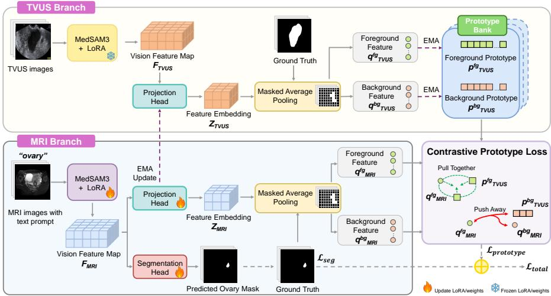
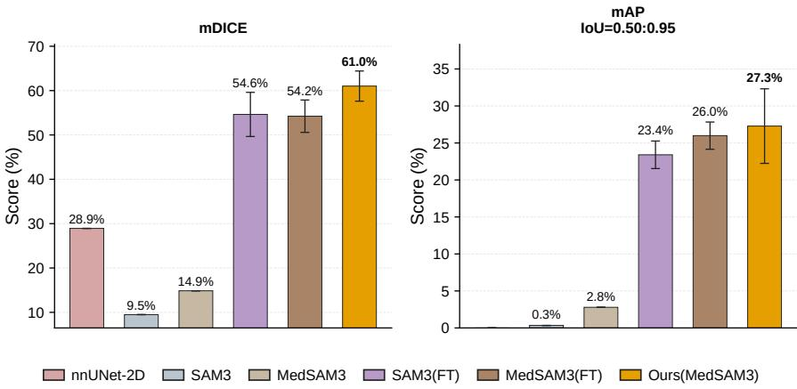
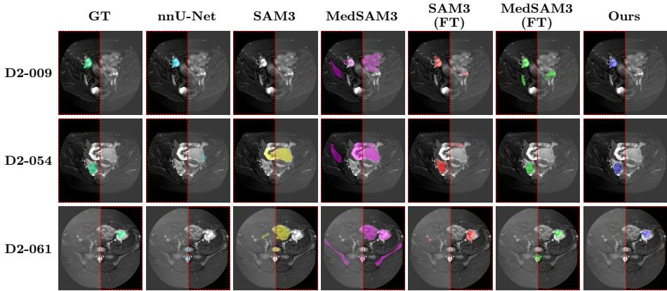

# Cross-Modal MRI Ovary Segmentation in Endometriosis Using Unpaired TVUS Prototype Priors

Xingjian Kang1,†, Lina Felsner2, Dominik Perrin1, Daiqi Liu3, Jasmin Arjomandi4, Franziska Mathis-Ullrich4, Alexandra Stoll1,4, and Katharina Breininger1

1 Center for AI and Data Science (CAIDAS), Julius-Maximilians-Universität Würzburg, Würzburg, Germany

2 Institute for Computational Imaging and AI in Medicine (CompAI), Technical University of Munich, Munich, Germany

3 Pattern Recognition Lab, Friedrich-Alexander Universität Erlangen-Nürnberg, Erlangen, Germany

4 Department Artificial Intelligence in Biomedical Engineering (AIBE), Friedrich-Alexander-Universität Erlangen-Nürnberg, Erlangen, Germany xingjian.kang@uni-wuerzburg.de

Abstract. Transvaginal ultrasound (TVUS) and magnetic resonance imaging (MRI) provide complementary information for endometriosis image analysis, yet existing studies mainly focus on single-modality analysis or disease classification, leaving cross-modal ovarian segmentation largely unexplored. In this work, to tackle the increased dificulty of ovary segmentation in MRI due to ovaries’ small target size and ambiguous boundaries with surrounding pelvic structures, we propose a dual branch framework for ovary segmentation across TVUS and MRI. More specifically, by adapting MedSAM3 with TVUS-derived prototype bank, we aim to align anatomically consistent feature representations across both modalities. Extensive experiments are conducted on endometriosisrelated TVUS and MRI datasets. We observe quantitative and qualitative improvements of over 5 percentage points for the proposed dualbranch approach compared with multiple state-of-the-art methods. Furthermore, our ablation study shows the contribution of individual components such as the prototype bank and the importance of warm-up pretraining in the source TVUS domain.

Keywords: Ovary Segmentation · Cross Modal Learning · Contrastive Learning · Pelvic Imaging · Endometriosis.

## 1 Introduction

Endometriosis is a chronic gynecological disease characterized by the presence of endometrial-like tissue outside the uterus [14]. Among its manifestations, ovarian endometriomas (commonly known as chocolate cysts) can develop within or adjacent to the ovaries [7]. Transvaginal ultrasound (TVUS) and Magnetic Resonance Imaging (MRI) are two widely-used complementary non-invasive imaging modalities to detect and assess such lesions in patients with endometriosis [5, 18]. To support lesion localization across both modalities, accurate ovarian segmentation is important, as it provides crucial anatomical context [13].

Recent studies have advanced Deep Learning for female pelvic image analysis, including modality-specific segmentation in TVUS and MRI [1, 2, 6, 12, 16, 17] and multi-modal learning for endometriosis classification [3, 19, 20]. Nevertheless, ovary segmentation in pelvic MRI remains particularly challenging, as ovaries are small and visually ambiguous among surrounding organs or lesions [10]. While TVUS often captures more distinctive ovary-specific features, obtaining paired TVUS–MRI examinations for supervised cross-modal learning is dificult in clinical practice [21]. Consequently, methods that can efectively transfer anatomical knowledge from TVUS to MRI without requiring paired data are still scarce.

To address this challenge, we propose a cross-modal framework that leverages unpaired TVUS ovary masks to learn a population-level ovarian prior from unpaired TVUS ovary masks and transfers this knowledge to improve MRI ovary segmentation without paired TVUS–MRI data. We incorporate this prior into a dual-branch framework, where a prototype-based contrastive objective regularizes MRI feature representations toward anatomically meaningful ovarian features. Specifically, our contributions are threefold: (i) We propose a dual-branch framework for MRI ovary segmentation built upon MedSAM3 [11], a promptable concept segmentation foundation model with strong generalization across anatomical structures and imaging modalities. (ii) We introduce a populationlevel ovarian prior constructed from unpaired TVUS ovary masks in form of a prototype bank, providing anatomical guidance for MRI representation learning. (iii) We propose prototype contrastive learning to enforce cross-modal anatomical consistency and improve MRI ovary segmentation.

We systematically evaluate and ablate the proposed framework on public endometriosis-related TVUS and MRI datasets [10, 22].

## 2 Methods

To inject anatomical knowledge from TVUS into MRI segmentation, we construct a population-level ovarian foreground prior from unpaired TVUS ovary masks. This prior is incorporated into a dual-branch framework as shown in Fig. 1, where a prototype-based contrastive loss regularizes MRI feature representations towards anatomically consistent ovarian features. Section 2.1 describes the proposed dual-branch architecture and its MedSAM3 [11] backbone, while Section 2.2 presents the construction of the population-level ovarian prior from unpaired TVUS ovary masks. Finally, Section 2.3 introduces the proposed prototypeprior contrastive learning strategy.

  
Fig. 1. Overview of our cross-modal prototype-contrastive learning framework. Unpaired TVUS and MRI images are encoded in a shared representation space, where prototype contrastive learning promotes cross-modal anatomical consistency.

## 2.1 Dual-branch Framework and MedSAM3 Backbone

In the proposed dual-branch framework, MedSAM3 [11] serves as the backbone model for both branches. The MRI and TVUS branches process their respective inputs independently while sharing a common architecture, enabling the learning of modality-specific features and cross-modal anatomical representations.

We adapt MedSAM3 to ovary segmentation using Parameter-Eficient Fine-Tuning (PEFT) [8]. Building on the pretrained SAM3 [4], MedSAM3 utilized Low-rank Adaptation (LoRA) to finetune the original model on a set of medical terminologies and images. Therefore, for a given input image, MedSAM3’s Vision Transformer (ViT)-based vision backbone produces LoRA-adapted visual representations that better capture medical image semantics. Specifically, the vision backbone generates a multi-scale feature representation through a Feature Pyramid Network (FPN).

In our framework, for each modality branch and input batch of size B, we use the final FPN output as the visual feature representation $F \in \mathbb { R } ^ { B \times C \times H _ { f } \times W _ { f } }$ , as it captures high-level semantic information that facilitates subsequent prototype alignment. In the TVUS branch, the backbone and LoRA modules are frozen after warm up, while the projection head is updated via an exponential moving average (EMA) from the MRI branch. In the MRI branch, the LoRA modules and projection head are trainable. During inference, the projection heads are removed, and segmentation is performed using MedSAM3 with the learned MRI LoRA modules.

## 2.2 Prototype Bank

We further employ a lightweight two-layer 1 × 1 convolutional projection head with GroupNorm, ReLU, and channel-wise L2 normalization to map the backbone features F into a normalized embedding $Z \in \mathbb { R } ^ { B \times C _ { \mathrm { p r o j } } \times H _ { f } \times W _ { f } }$ . The ovary mask is then resized to the corresponding feature resolution and used to extract the foreground features $q ^ { f g } \in \mathbb { R } ^ { B \times C _ { p r o j } }$ and background features $q ^ { b g } \in \mathbb { R } ^ { B \times C _ { p r o j } }$ from $Z$ via masked average pooling. Hence, each input image is represented by a pooled foreground feature vector and a pooled background feature vector. To reduce batch-wise noise in the ovary representation, we propose to create a prototype memory bank using a stable prototype prior $p$ in the TVUS branch. The prototype memory bank stores $B$ foreground prototypes $p _ { \mathrm { T V U S } } ^ { f g }$ and B background prototypes $p _ { \mathrm { T V U S } } ^ { b g }$ , where $B$ corresponds to the batch size. During training, the prototypes are updated using an Exponential Moving Average (EMA) of the foreground and background features extracted from the TVUS inputs. Each prototype is updated according to

$$
p _ { \mathrm { T V U S } } ^ { f g } ( t ) = \alpha p _ { \mathrm { T V U S } } ^ { f g } ( t - 1 ) + ( 1 - \alpha ) q _ { \mathrm { T V U S } } ^ { f g } ( t ) ,\tag{1}
$$

with an analogous update applied to the background prototypes. Here, α denotes the momentum coeficient and t the training step. The prototype bank is initialized as $p _ { \mathrm { T V U S } } ^ { f g } ( 0 ) = q _ { \mathrm { T V U S } } ^ { f g } ( 0 )$ at the first step.

## 2.3 Prototype Contrastive Learning

In the proposed framework, the TVUS foreground and background prototypes are introduced to regularize the MRI branch’s feature learning. Since the TVUS and MRI datasets are unpaired, we do not enforce spatial correspondence between the two modalities. Instead, based on the shared anatomical semantics in both modalities, we encourage the MRI ovary foreground features to move closer to the TVUS ovary foreground prototypes, while being pushed away from the TVUS background prototypes and MRI background features. This is achieved by using the InfoNCE contrastive loss [15] defined as:

$$
\begin{array} { r l } & { \mathcal { L } _ { p r o t o } = } \\ & { - \log \frac { \exp \left( \sin \left( q _ { \mathrm { M R I } } ^ { f g } , p _ { \mathrm { T V U S } } ^ { f g } \right) / \tau \right) } { \exp \left( \sin \left( q _ { \mathrm { M R I } } ^ { f g } , p _ { \mathrm { T V U S } } ^ { f g } \right) / \tau \right) + \sum _ { z \in \left\{ p _ { \mathrm { T V U S } } ^ { b g } , q _ { \mathrm { M R I } } ^ { b g } \right\} } \exp \left( \sin \left( q _ { \mathrm { M R I } } ^ { f g } , z \right) / \tau \right) } , } \end{array}\tag{2}
$$

where $s i m ( \cdot , \cdot )$ denotes cosine similarity of two embeddings and $\tau$ is the temperature parameter, $p _ { \mathrm { T V U S } } ^ { f g }$ is the positive anchor and $z \in \{ p _ { \mathrm { T V U S } } ^ { b g } , q _ { \mathrm { M R I } } ^ { b g } \}$ is the negative anchor. The contrastive loss is weighted by λ and combined with the segmentation loss $\mathcal { L } _ { s e g }$ to form the total loss:

$$
\mathcal { L } _ { \mathrm { t o t a l } } = \mathcal { L } _ { s e g } + \lambda \mathcal { L } _ { p r o t o } ~ .\tag{3}
$$

## 3 Experiments and Results

We evaluate the proposed framework for ovary segmentation in female pelvic MRI. Section 3.1 describes the datasets, Section 3.2 the implementation details, and Section 3.3 the comparison with state-of-the-art methods. Quantitative and qualitative results are presented in Section 3.4, followed by ablation studies in Section 3.5.

## 3.1 Datasets

To train and evaluate the proposed method, we used two publicly accessible female pelvic imaging datasets. For the TVUS branch, we used the OTU-2D dataset [22], which originally contains ultrasound images from 247 patients from eight diferent categories with corresponding ovary segmentation masks. To align with the endometriosis task, we selected images labeled as endometriomas (chocolate cysts) and normal ovaries. For the MRI branch, we used the UT-EndoMRI [10] dataset, consisting of multi-contrast MRI images and ovary segmentation masks from 81 female patients with endometriosis. We used the T2-weighted fat-saturation (T2FS) volumes with the corresponding ovarian annotations from one obstetrician-gynecologist assistant supervised by an experienced gynecologist. Of note, only a single ovary label was provided per volume. Volumes and masks were resampled to 1.0×1.0×1.0 mm, and sliced into 2D axial frames. 2D slices containing ovary annotations were selected. Both MRI and ultrasound images were resampled and bilinear interpolated to 1008×1008 px, and min-max normalized prior to training and inference of SAM3 [4].

Overall, the TVUS and MRI datasets comprise 669 TVUS images and 285 MRI slices, respectively. Both datasets were independently divided into training, validation, and test sets with a $6 0 \% / 1 0 \% / 3 0 \%$ split. To prevent data leakage and ensure unbiased evaluation, all splits were performed at the patient level.

## 3.2 Implementation Details

Since MedSAM3 was not originally fine-tuned on ovary-specific data and exhibited limited segmentation performance on TVUS ovary images, we first pretrained the TVUS branch’s LoRA weights independently for three warm-up epochs. This initialization stage stabilized the feature space and enabled the extraction of more reliable prototypes for subsequent cross-modal learning. The TVUS model was then frozen, and the MRI branch, including its projection layers, was trained for 10 epochs on MRI data using TVUS-derived prototypes. For both training phases we used AdamW $( \mathrm { l r } { = } 1 0 ^ { - 5 } )$ , a batch size of 8 per modality, $\lambda = 0 . 0 1 5$ , and EMA momentum $\alpha = 0 . 9 5$ . LoRA (rank 16) was applied to all backbones.

For evaluation, we used the mean Dice coeficient (mDICE) over all images for segmentation and mean Average Precision (mAP, IoU thresholds from 0.50 to 0.95) over all images for organ bounding box detection as metrics. To enable MedSAM3 and SAM3’s text-prompt-based segmentation capability [11, 4], we used a fixed text prompt ("ovary") for all image samples. During inference, the default SAM3 non-maximum suppression (NMS) and IoU threshold settings were used [4]. To address the issue that only a single (one-sided) ovary label was provided per volume, loss computation and quantitative evaluation were restricted to the side for which a reference annotation was available. This allowed to feed the entire image to the model to provide global anatomical context but avoided penalizing models that correctly predicted bilateral ovary structures.

  
Fig. 2. Performance comparison between proposed methods and baselines on MRI ovary segmentation. The best performance is bold. “FT” refers to the fully supervised LoRA finetuning on the MRI dataset. “Ours” denotes the proposed dual-branch approach with a MedSAM3 backbone.

All training and evaluation runs were executed on 2 NVIDIA A100 40GB GPUs with Python 3.12 and PyTorch 2.11.

## 3.3 Baselines

We compare the proposed prototype-regularized framework with several baseline methods, including foundation models and conventional supervised approaches. First, we evaluate the naive SAM3 [4] and MedSAM3 [11] models in a zeroshot setting, where the pretrained models are directly applied to the MRI test set without further training. Second, we conduct full LoRA fine-tuning (FT) for both SAM3 and MedSAM3 using only MRI segmentation supervision. In addition, we trained an nnU-Net [9] with its 2D configuration on the same MRI dataset as a fully supervised segmentation baseline.

## 3.4 Quantitative and Qualitative Results

Figure 2 presents the quantitative comparison between the proposed cross-modality prototype-contrastive learning framework and baseline models for MRI ovary segmentation. The zero-shot SAM3 and MedSAM3 models show limited generalization ability on the MRI test set, indicating that direct transfer from naturalimage or medical-image foundation models remains insuficient for this challenging segmentation task. The 2D nnU-Net baseline achieves an mDICE of 28.9%, but its performance is still clearly lower than that of the SAM3-based finetuning approaches. Full LoRA fine-tuning substantially improves the segmentation performance of both SAM3 and MedSAM3 models. Notably, our proposed dual-branch approach consistently outperforms the LORA-finetuned MedSAM3 baseline, demonstrating the benefit of incorporating TVUS-based prototype priors. Specifically, compared with full fine-tuning, MedSAM3 equipped with the prototype prior obtains the best segmentation performance and object detection ability, reaching the highest mDICE of 61.0% and the best mAP score of 27.3%.

  
Fig. 3. Qualitative comparison of ovary segmentation results on MRI. Each row corresponds to one testing case, and the columns show the ground truth (GT) and segmentation results from diferent methods. "FT" denotes fine-tuning. The red dashed box indicates the valid evaluation region, with predictions outside it ignored during training and evaluation.

Figure 3 shows qualitative segmentation results for three representative MRI test cases. The nnU-Net baseline struggles to identify the expected ovarian region in the given MRI image, while the zero-shot SAM3 and MedSAM3 models tend to produce large false-negative regions in the pelvic area and show poor capability in localizing small ovarian structures. Fine-tuning improves the overall localization ability, while incorporating the prototype prior further refines the predicted boundary of the ovary regions. Nevertheless, the proposed model still struggles to accurately segment the entire ovarian region.

## 3.5 Ablation Study

We further investigate the contributions of the prototype bank and warm-up strategy through the ablation study in Table 1. Removing the prototype bank and directly using TVUS features in the contrastive loss reduces mDICE from

Table 1. Performance comparison about diferent prototype bank and warmup setting. First 2 columns indicate which branch has been activated in the warm-up phase. All of the experiments use MedSAM3 as backbone model. The best performance of each metric is in bold, second best underlined.
<table><tr><td colspan="3">Warm-up phase</td><td colspan="3">With</td></tr><tr><td>TVUS</td><td>MRI</td><td>Epoch(s)</td><td>Bank</td><td>mDice</td><td>mAP</td></tr><tr><td>√</td><td></td><td>3</td><td>√</td><td> $\mathbf { 6 1 . 0 2 \pm 3 . 4 0 }$ </td><td> $2 7 . 2 8 { \pm } 0 . 9 8 $ </td></tr><tr><td>√</td><td></td><td>3</td><td></td><td> $5 7 . 7 4 { \pm } 4 . 1 9 $ </td><td> $\mathbf { 2 8 . 3 7 \pm 1 . 5 2 }$ </td></tr><tr><td>√</td><td>√</td><td>3</td><td>√</td><td> $1 7 . 9 2 { \pm } 2 . 4 6$ </td><td> $6 . 4 5 { \pm } 2 . 2 5 $ </td></tr><tr><td></td><td></td><td>0</td><td>√</td><td> $4 5 . 9 6 { \pm } 5 . 4 9$ </td><td> $2 4 . 9 2 { \pm } 1 . 5 8 $ </td></tr><tr><td>√</td><td></td><td>5</td><td>√</td><td> $5 0 . 8 6 { \pm } 6 . 7 0 $ </td><td> $2 7 . 6 3 { \pm } 0 . 5 3 $ </td></tr><tr><td>√</td><td></td><td>10</td><td>√</td><td> $5 5 . 1 1 \pm 5 . 1 8$ </td><td> $\underline { { 2 8 . 1 2 \pm 0 . 7 1 } }$ </td></tr></table>

Table 2. Sensitivity analysis about key parameters. λ indicates the contrastive loss weight, while α denotes the EMA momentum for updating the TVUS prototype. The best performance of each metric is in bold.
<table><tr><td colspan="3">λ</td><td colspan="3">α</td></tr><tr><td>Value</td><td>mDICE</td><td> $\mathrm { m A P }$ </td><td>Value</td><td>mDICE</td><td>mAP</td></tr><tr><td>0.005</td><td> $5 8 . 8 2 \pm 5 . 2 2$ </td><td> $2 7 . 1 9 \pm 0 . 8 4$ </td><td>0.75</td><td> $5 7 . 9 6 \pm 1 1 . 1 4$ </td><td> $2 6 . 6 1 \pm 1 . 6 4$ </td></tr><tr><td>0.010</td><td> $5 7 . 2 3 \pm 7 . 9 9$ </td><td> $2 6 . 0 9 \pm 1 . 3 1$ </td><td>0.80</td><td> $5 9 . 4 2 \pm 5 . 3 6$ </td><td> $2 7 . 7 7 \pm 0 . 8 1$ </td></tr><tr><td>0.015</td><td> ${ \bf 6 1 . 0 2 \pm 3 . 4 0 }$ </td><td> ${ \bf 2 7 . 2 8 \pm 0 . 9 8 }$ </td><td>0.85</td><td> $5 9 . 5 6 \pm 9 . 0 3$ </td><td> $2 5 . 1 3 \pm 1 . 4 3$ </td></tr><tr><td>0.020</td><td> $5 9 . 0 7 \pm 5 . 2 4$ </td><td> $2 6 . 7 0 \pm 1 . 7 7$ </td><td>0.90</td><td> $5 9 . 3 1 \pm 7 . 2 1$ </td><td> ${ \bf 2 8 . 0 4 \pm 1 . 2 7 }$ </td></tr><tr><td>0.025</td><td> $5 6 . 5 1 \pm 1 0 . 3 7$ </td><td> $2 6 . 3 5 \pm 2 . 8 6$ </td><td>0.95</td><td> ${ \bf 6 1 . 0 2 \pm 3 . 4 0 }$ </td><td> $2 7 . 2 8 \pm 0 . 9 8$ </td></tr></table>

61.02% to 57.74%. In contrast, mAP slightly increases from 27.28% to 28.37%, suggesting that the prototype bank primarily improves segmentation quality rather than object localization. Surprisingly, performance drops when both branches are jointly warmed up or when no warm up is used. Moreover, longer TVUS warm-up schedules (5 or 10 epochs) do not yield further improvements and instead reduce segmentation accuracy. Overall, warming up only the TVUS branch for 3 epochs achieves the best performance. In addition, we conducted sensitivity analysis on the contrastive loss weight λ and EMA momentum α as shown in Table 2, indicating the selected parameter settings achieve the best performance in segmenting ovaries, while the proposed framework shows a robust performance against parameter changes in general.

## 4 Discussion and Conclusion

This study explores whether unpaired TVUS ovary data can provide a useful cross-modal prototype prior for text-promptable MRI ovary segmentation. By leveraging unpaired TVUS ovary masks, the proposed prototype contrastive learning framework constructs a population-level ovary foreground prior without requiring patient-level correspondence or cross-modal registration. Quantitatively, the prototype prior improves mDICE and overall mAP. Qualitatively, the proposed method produces more compact predictions and reduces false-positive responses in surrounding pelvic regions.

Our results show that zero-shot SAM3 and MedSAM3 have limited performance on female pelvic MRI, highlighting the need for target-domain adaptation. While the proposed dual-branch framework consistently outperforms the fully fine-tuned MedSAM3 baseline in both quantitative metrics and qualitative segmentation quality, the overall performance on MRI ovary segmentation remains modest. A potential reason could be the limited availability of ovary annotations from the original dataset. Furthermore, the current background prototypes are extracted from the entire non-ovary region rather than the near-foreground region around the ovary. As a result, the background prototype may be dominated by easy background pixels and fail to adequately represent anatomically similar structures adjacent to the ovary, limiting their ability to provide informative negative supervision during contrastive learning. The ablation study shows that a three-epoch TVUS-only warm-up achieves the best performance, balancing prototype stability and cross-modal feature alignment. However, modality-specific LoRA adaptation may still cause feature drift and weaken the tied projector’s ability to learn a coherent joint space.

Future work will focus on constructing near-background prototypes using dilated ovary masks. Another direction is to explore the prototype-based selfsupervised pretraining to improve the feature alignment between TVUS and MRI branch. We also plan to extend the framework to 3D volumetric segmentation and evaluate its generalizability to other modalities and downstream tasks, such as laparoscopic video analysis, uterus segmentation, and cyst detection.

Acknowledgments. This study was supported by the Bavarian State Ministry of Health, Care and Prevention in the context of the project EndoKI. The authors gratefully acknowledge the scientific support and HPC resources provided by the Erlangen National High Performance Computing Center (NHR@FAU) of the Friedrich-Alexander-Universität Erlangen-Nürnberg (FAU). The hardware is partially funded by the German Research Foundation (DFG).

Disclosure of Interests. The authors have no competing interests to declare that are relevant to the content of this article.

## References

1. Arjomandi, J., Neubig, L., Mathis-Ullrich, F., Kist, A.M., et al.: From prompts to pipelines: Evaluating LLM-generated medical image segmentation baselines. Machine Learning for Biomedical Imaging 2026(MELBA–BVM 2025 Special Issue), 159–183 (2026)

2. Boneš, E., Gergolet, M., Bohak, C., Lesar, Ž., Marolt, M.: Automatic segmentation and alignment of uterine shapes from 3D ultrasound data. Computers in Biology and Medicine 178, 108794 (2024)

3. Butler, D., Wang, H., Zhang, Y., To, M.S., Condous, G., Leonardi, M., Knox, S., Avery, J., Hull, M.L., Carneiro, G.: The efectiveness of self-supervised pre-training for multi-modal endometriosis classification. In: 2023 45th Annual International Conference of the IEEE Engineering in Medicine & Biology Society (EMBC). pp. 1– 5. IEEE (2023)

4. Carion, N., Gustafson, L., Hu, Y.T., Debnath, S., Hu, R., Suris, D., Ryali, C., Alwala, K.V., Khedr, H., Huang, A., et al.: SAM 3: Segment anything with concepts. arXiv preprint arXiv:2511.16719 (2025)

5. Daniilidis, A., Grigoriadis, G., Dalakoura, D., D’Alterio, M.N., Angioni, S., Roman, H.: Transvaginal ultrasound in the diagnosis and assessment of endometriosis — An overview: How, why, and when. Diagnostics 12(12), 2912 (2022)

6. Figueredo, W.K.R., Silva, A.C., de Paiva, A.C., Diniz, J.O.B., Brandao, A., Oliveira, M.A.P.: Automatic segmentation of deep endometriosis in the rectosigmoid using deep learning. Image and Vision Computing 151, 105261 (2024)

7. Gałczyński, K., Jóźwik, M., Lewkowicz, D., Semczuk-Sikora, A., Semczuk, A.: Ovarian endometrioma - A possible finding in adolescent girls and young women: A mini-review. Journal of Ovarian Research 12(1), 104 (2019)

8. Han, Z., Gao, C., Liu, J., Zhang, J., Zhang, S.Q.: Parameter-eficient fine-tuning for large models: A comprehensive survey. arXiv preprint arXiv:2403.14608 (2024)

9. Isensee, F., Jaeger, P.F., Kohl, S.A., Petersen, J., Maier-Hein, K.H.: nnU-Net: A self-configuring method for deep learning-based biomedical image segmentation. Nature Methods 18(2), 203–211 (2021)

10. Liang, X., Alpuing Radilla, L.A., Khalaj, K., Dawoodally, H., Mokashi, C., Guan, X., Roberts, K.E., Sheth, S.A., Tammisetti, V.S., Giancardo, L.: A multi-modal pelvic MRI dataset for deep learning-based pelvic organ segmentation in endometriosis. Scientific Data 12(1), 1292 (2025)

11. Liu, A., Xue, R., Cao, X.R., Shen, Y., Lu, Y., Li, X., Chen, Q., Chen, J.: Med-SAM3: Delving into segment anything with medical concepts. arXiv preprint arXiv:2511.19046 (2025)

12. Lyu, S., Zhao, Q., Bai, W., Cai, L., Cheng, G., Cui, G., Yang, M., Chen, L., Zhou, H.: Unsupervised cross-domain semantic segmentation on multi-modality ovarian tumor ultrasound data. Pattern Recognition p. 112311 (2025)

13. Mittal, S., Tong, A., Young, S., Jha, P.: Artificial intelligence applications in endometriosis imaging. Abdominal Radiology 50(10), 4901–4913 (2025)

14. Olive, D.L., Pritts, E.A.: Treatment of endometriosis. New England Journal of Medicine 345(4), 266–275 (2001)

15. Oord, A.v.d., Li, Y., Vinyals, O.: Representation learning with contrastive predictive coding. arXiv preprint arXiv:1807.03748 (2018)

16. Saleem, T.J., Yaqub, M.: Deep learning-based automated segmentation of uterine myomas. arXiv preprint arXiv:2508.11010 (2025)

17. Tank, D., Schor, B.G., Trommelen, L.M., Huirne, J.A., Calixto, I., de Leeuw, R.A.: Automatic uterus segmentation in transvaginal ultrasound using U-Net and nnU-Net. PLoS One 20(11), e0336237 (2025)

18. Thomassin-Naggara, I., Dolciami, M., Chamie, L.P., Guerra, A., Bharwani, N., Freeman, S., Rousset, P., Manganaro, L.: ESUR consensus MRI for endometriosis: Indications, reporting, and classifications. European Radiology 35(11), 7260–7268 (2025)

19. Wang, H., Butler, D., Zhang, Y., Avery, J., Knox, S., Ma, C., Hull, L., Carneiro, G.: Human–AI collaborative multi-modal multi-rater learning for endometriosis diagnosis. Physics in Medicine & Biology 70(1), 015008 (2025)

20. Zhang, Y., Wang, H., Butler, D., Smart, B., Xie, Y., To, M.S., Knox, S., Condous, G., Leonardi, M., Avery, J.C., et al.: Unpaired multi-modal training and singlemodal testing for detecting signs of endometriosis. Computerized Medical Imaging and Graphics 124, 102575 (2025)

21. Zhang, Y., Wang, H., Butler, D., To, M.S., Avery, J., Hull, M.L., Carneiro, G.: Distilling missing modality knowledge from ultrasound for endometriosis diagnosis with magnetic resonance images. In: 2023 IEEE 20th International Symposium on Biomedical Imaging (ISBI). pp. 1–5. IEEE (2023)

22. Zhao, Q., Lyu, S., Bai, W., Cai, L., Liu, B., Cheng, G., Wu, M., Sang, X., Yang, M., Chen, L.: MMOTU: A multi-modality ovarian tumor ultrasound image dataset for unsupervised cross-domain semantic segmentation. arXiv preprint arXiv:2207.06799 (2022)