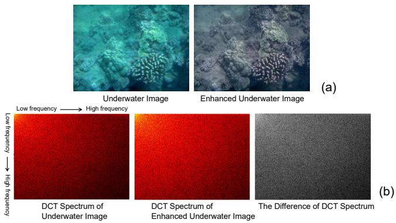
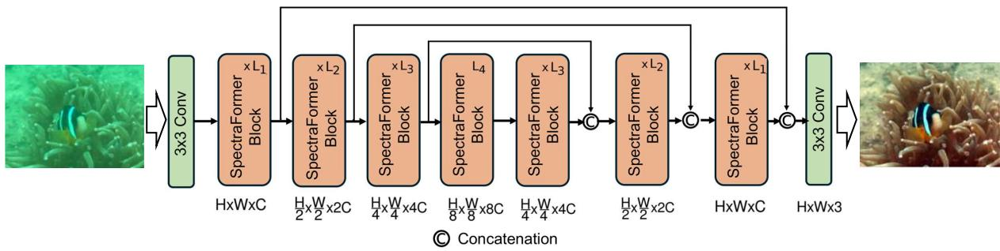
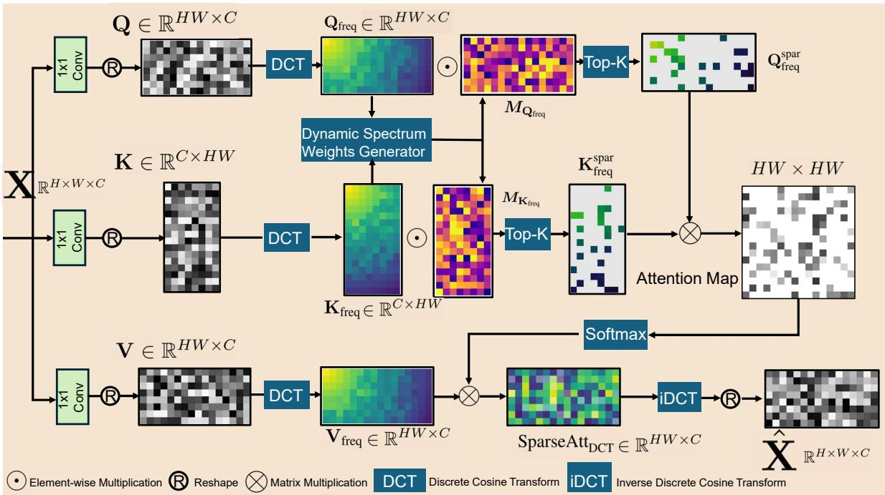
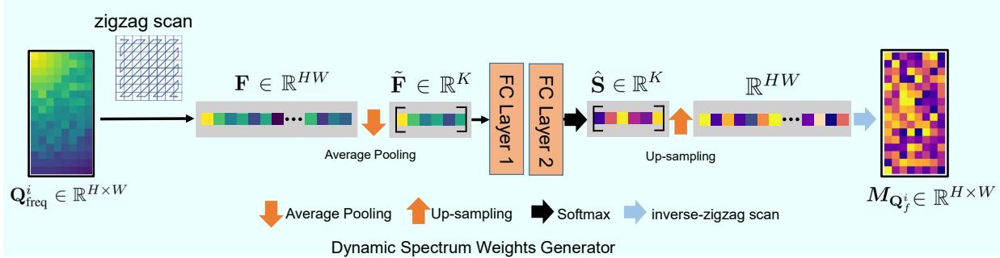
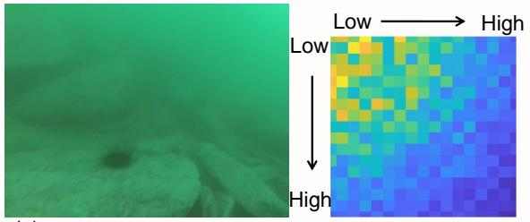
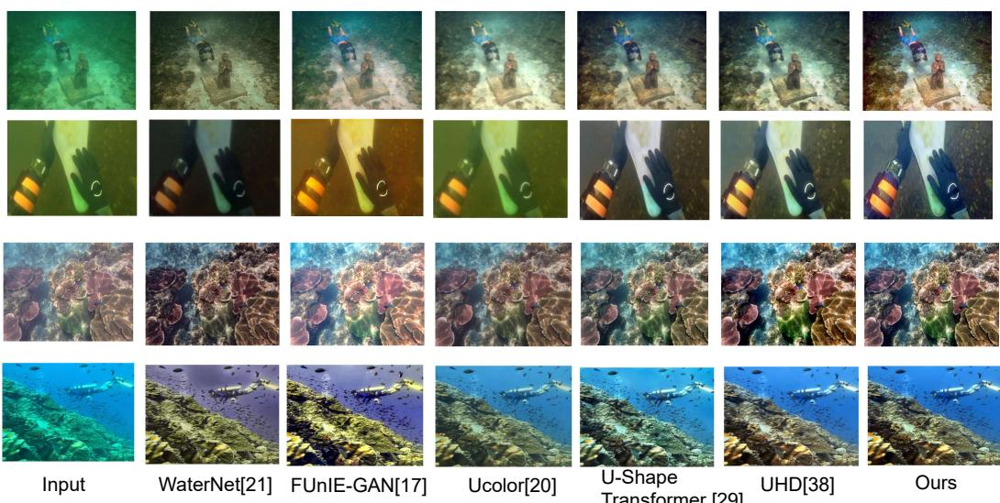
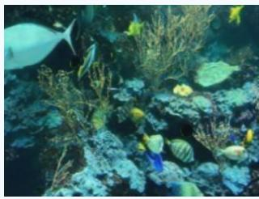
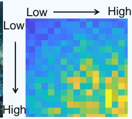
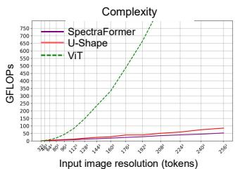
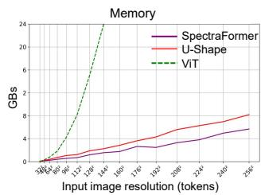

# Dynamic SpectraFormer for Ultra-High-Definition Underwater Image Enhancement

Zhiqiang HU1, Tao YU2, Shouren HUANG1 and Masatoshi ISHIKAWA1

Abstract— Underwater images suffer from color distortion, haze, and poor visibility due to light refraction and absorption in water. These challenges significantly impact the utilization of Autonomous Underwater Vehicles (AUVs) or marine robots. Typically, color and brightness distortions manifest at lower frequencies, while edge and texture distortions are prevalent at higher frequencies. Traditional methods struggle to concurrently rectify these mixed distortions as they primarily concentrate on the spatial domain. To address these issues, we introduce the Dynamic SpectraFormer, which enhances underwater images through a frequency domain transformer. The Dynamic SpectraFormer introduces an ultra-high-resolution sparse spectrum attention module, which could capture the long-term dependency without losing the universal approximating power. Additionally, we have developed a dynamic spectrum weight generation layer that serves as an adaptive spectrum band selector, accentuating critical frequency bands and suppressing less relevant ones. Consequently, this method significantly improves underwater image quality by addressing both high- and low-frequency distortions. Our extensive ablation studies and comparative evaluations consolidate the Dynamic SpectraFormer’s efficacy across multiple underwater image enhancement benchmarks. The source code is available at https://github.com/arifence2024/DynamicSpectraFormer.git.

## I. INTRODUCTION

The degradation in underwater image quality hampers the visual sensing capabilities of marine robots, despite that they are equipped with high-end cameras. Thus, algorithms for Underwater Image Enhancement (UIE) play a critical role in advancing aquatic exploration, with widespread applications in domains like Autonomous Underwater Vehicles (AUVs) and Remotely Operated Vehicles (ROVs). This degradation in image quality is primarily due to the wavelengthdependent scattering and attenuation of light as it travels through water. For instance, red light, having the longest wavelength, is absorbed first, followed by green and then blue light. The enhancement of Ultra High Definition (UHD) underwater imagery faces challenges from two primary aspects: Initially, underwater images often contain spatially variable hybrid degradations, predominantly at high frequencies, such as blurred textures. Additionally, varied water types manifest unique distortion characteristics primarily at low frequencies, such as color distortion, haze, etc. Moreover, enhancing UHD images is also a computationally intensive task, which hinders its application on devices with limited resources. To tackle these challenges, studies [18], [34], [39] focus on enhancing underwater image quality through the frequency domain. Typically, these approaches leverage Fourier or wavelet transforms to extract frequency domain coefficients from images that have deteriorated. Following this, various techniques like thresholding, filtering, or deep learning are employed to minimize the differences between the degraded and clear images. However, these approaches have an inherent limitation: they treat the spectrum uniformly across all frequency bands without considering the unique characteristics of the input. We argue that the image-agnostic global filter is not the optimal choice. This disadvantage limits their ability to adjust to diverse content types and often results in inadequate performance, especially in handling complex image distortions in underwater circumstances.

  
Fig. 1. The difference of the DCT spectrum between a pair of underwater image and its enhanced image in LSUI [29] dataset. Where (a) are the image pairs, (b) the corresponding DCT spectrum and the difference. The enhanced image contains more high frequencies compared with the original image.

On the other hand, deep learning approaches [13], [14], [17], [22], [24], [41] have shown outstanding effectiveness in the domain of visual perception and enhancement. Recent studies, including those by [29], [32], and [18], have shifted focus to employing Vision Transformers (ViTs) [4] for enhancing underwater images. ViTs are known for their effective handling of complex patterns over large image areas. However, for the image of W ×H pixels, the time and memory complexity of the key-query dot-product interaction increase quadratically with the spatial resolution of input, that is, $\bar { \mathcal { O } ( [ W ^ { 2 } H ^ { 2 } ) }$ . Consequently, applying pixel-level selfattention to restore the high-resolution images is not possible. To mitigate this, the self-attention with local-window techniques [29], [32] is proposed to enhance the image quality, however, such methods can hardly capture extensive spatial information of the whole image and introduce noticeable defects in the restored images. This limitation inherently restricts its application in UHD UIE tasks.

  
Fig. 2. Dynamic SpectraFormer is configured with a multi-scale U-shape architecture for restoring high-definition underwater images.

Fig. 1 illustrates the DCT spectrum of an underwater image before and after enhancement. The enhanced image, with its restored details, demonstrates an increased presence of high-frequency components. This observation leads us to naturally raise a question: Can we enhance the underwater image in the frequency domain in an efficient way? In this paper, we attempt to answer this question and address the issues mentioned above by proposing a Dynamic SpectraFormer, which could dynamically enhance the underwater image in the frequency domain. Our proposed method could manipulate spectrum bands concerning their contents and focus on these key frequencies, and efficiently capture the essential details necessary for image enhancement while discarding redundant information.

The core module of Dynamic SpectraFormer involves applying DCT to convert the query (Q), key (K), and value (V) matrices into the frequency domain. After computing the attention across these refined frequency components, we employ the inverse DCT (iDCT) to transform the attended feature back to the spatial domain. Overall, our contributions can be summarized as follows:

• We developed an efficient spectrum band attention module named Dynamic SpectraFormer with global attention capability, which could balance computational efficiency and the ability to capture long-term dependencies.

• To adaptively amplify the useful frequency bands while downplaying others, we designed a Dynamic Spectrum Weight Generator (DSWG). The DSWG, with a simple architecture, could empower the backbone with the ability to reweight high-frequency and low-frequency elements concerning the underwater image content.

• The Dynamic SpectraFormer achieved unparalleled performance across widely recognized underwater image datasets.

## II. RELATED WORKS

## A. Underwater Image Enhancement

Non Learning-based Methods: In this section, we delve into the existing methodologies for enhancing underwater images, broadly classifying them into two fundamental categories: approaches that do not rely on physical models and those that are grounded in physical modeling. Model-free approaches focus on enhancing image clarity by directly adjusting pixel values, methods like multi-scale fusion [1], [2], and pixel distribution modification [7]. While these techniques are straightforward, they may neglect essential underwater imaging dynamics, possibly introducing artifacts into complex aquatic environments. In contrast, model-based methods [10], [23] treat enhancement as a complex inverse problem, inferring parameters through well-defined priors, red channel attenuation [10], and minimum information loss [23]. However, their effectiveness may be compromised in extreme conditions, and struggle to ensure consistent and reliable image enhancement across various scenarios. Deep Learning-dependent Methods: Advancements in deep learning have significantly influenced underwater image enhancement. Pritish et al. [37] applied adversarial learning to improve underwater image quality. In addition, Li et al. [22] introduced a network that utilizes a gated fusion module, integrating gamma-corrected, contrast-enhanced, and whitebalanced inputs for enhanced image quality. Jiang et al. [17] designed a cutting-edge perceptual adversarial network, optimized for underwater imagery, which adaptively combines latent features to mitigate image degradation. Li et al. [24] proposed WaterGAN, which generates synthetic underwaterstyle images from terrestrial scenes and depth data. Yang et al. [41] developed a conditional generative adversarial network (cGAN) aimed at enhancing the visual clarity of underwater images.

## B. Vision Transformer and Frequency Domain Learning

Vision Transformer (ViT) [4] is the pioneering work that crops the entire image into 16 × 16 patches and treats each patch as a token as the input for the transformer. By utilizing an extremely large-scale dataset, JFT-300M [36], ViT achieved promising performance comparable to CNN-based backbones. To further lower the computational complexity, Swin Transformer [26] proposed a new local attention paradigm that employs patch-level multi-head attention equipped with a hierarchical fusion design. It has been demonstrated that the Fourier transforms might replace the multi-headed attention layers in transformers and produce equivalent performance. The Fourier transform-based approaches, FNet [5], GFN [31], and AFNO [9], proposed to mix the tokens by utilizing Fast Fourier Transform (FFT) in the frequency domain and achieved remarkable accuracy in visual recognition tasks. However, since the GFN uses static global filters, which are unchanged for different input images, to exploit the long-term interaction information of spectrum tokens, we argue that the image-agnostic global filter is not the optimal choice. These Fourier transformbased methods are thought to be inefficient at capturing high frequencies that primarily carry local information, as they treat all the spectrum equally.

Fig. 3. Dynamic SpectraFormer Block with sparse spectrum attention. We first convert the query (Q), key (K), and value (V) matrices into the frequency domain by using the Discrete Cosine Transform (DCT). Next, a Dynamic Spectrum Weight Generator (DSWG) adaptively selects K frequency bands based on the input underwater image’s features. Thirdly, we use the sparsified Q and K matrices to compute the attention. Finally, we use the inverse DCT (iDCT) to transform the value matrix (V) to the spatial domain. Using sparse attention in the DCT domain, the Dynamic SpectraFormer with global attention capability could capture long-term dependency without sacrificing its universal approximation power.  
  
Fig. 4. The Dynamic Spectrum Weights Generator. Our DSWG module aims to produce dynamic spectrum weights M to modify the frequency band of the transformed DCT, and plays a role as a frequency band enhancer.

Frequency Domain Learning CNN-empowered Frequency domain learning has been successfully applied in multiple vision tasks, including low-level vision such as JPEG image compression [8], and image super-resolution [27], as well as high-level vision, such as frequency domain attention FcaNet [30], which enhances the representability of ResNet [11] on the image classification task. Specifically, the work proposed by Xu et al. in [40] finds that the down-sampling in the frequency domain can better preserve image information than spatially resizing the images. This motivated us to derive frequency token interaction information in the down-sampled frequency domain.

## III. APPROACH

In this section, we present the proposed Dynamic SpectraFormer in detail. After briefly introducing the overall architecture as shown in Fig. 2, we present the Dynamic SpectraFormer block. Our work aims to harness the power of DCT to boost the performance of Transformer models for high-definition underwater image enhancement tasks.

## A. Preliminaries: Discrete Cosine Transform

In comparison to the Discrete Fourier Transform (DFT), the DCT is a real-valued transform that also breaks down a given signal or picture into its frequency components. Therefore, in terms of computational cost, DCT is more suited for deep neural networks. Mathematically, the twodimensional (2D) DCT is formatted as follows:

$$
B _ { h , w } ^ { i , j } = \cos \left( \frac { \pi h } { H } \left( i + \frac { 1 } { 2 } \right) \right) \cos \left( \frac { \pi w } { W } \left( j + \frac { 1 } { 2 } \right) \right) .\tag{1}
$$

Then the 2D DCT for the input image with width W and height H is written by:

$$
\begin{array} { c } { { f _ { h , w } ^ { 2 d } = \displaystyle \sum _ { i = 0 } ^ { H - 1 } \sum _ { j = 0 } ^ { W - 1 } I _ { i , j } ^ { 2 d } B _ { h , w } ^ { i , j } } } \\ { { \mathrm { s . t . ~ } h \in \{ 0 , 1 , \cdots , H - 1 \} , w \in \{ 0 , 1 , \cdots , W - 1 \} , } } \end{array}\tag{2}
$$

where $f ^ { 2 d } \in \mathbb { R } ^ { H \times W }$ is the 2D DCT frequency spectrum, $I ^ { 2 d } \in \mathbb { R } ^ { \check { H } \times W }$ is the input image, Accordingly, the inverse 2D DCT for the image is formulated as:

$$
\begin{array} { c } { { \displaystyle I _ { i , j } ^ { 2 d } = \sum _ { h = 0 } ^ { H - 1 } \sum _ { w = 0 } ^ { W - 1 } f _ { h , w } ^ { 2 d } B _ { h , w } ^ { i , j } } } \\ { { \mathrm { s . t . ~ } i \in \{ 0 , 1 , \cdots , H - 1 \} , j \in \{ 0 , 1 , \cdots , W - 1 \} . } } \end{array}\tag{3}
$$

The fast algorithm in [28] can be utilized to reduce the complexity of 1D-DCT from $\mathcal { O } \left( N ^ { 2 } \right)$ to O(N log N).

## B. Revisit Scaled Dot-Product Attention

In transformer architectures, an input sequence is represented by a set of vectors $( x _ { 1 } , \ldots , x _ { N } )$ , or more formally, $\mathbf { X } \in \mathbb { R } ^ { \tilde { N } \times C }$ . Within these models, self-attention operates by mapping each vector $x _ { i }$ to a trio of vectors known as query (Q), key (K), and value (V), through unique linear transformations $\mathbf { W } ^ { Q } , \ \mathbf { W } ^ { K }$ , and $\mathbf { W } ^ { V }$ , respectively, each with a shape of $\mathbb { R } ^ { C \times C }$ . This transformation process yields matrices Q, K, and V in $\mathbb { R } ^ { N \times C }$ . In the original Transformer framework, the concept of scaled dot-product attention is formulated as follows:

$$
\operatorname { A t t } ( \mathbf { X } ) = \operatorname { s o f t m a x } \left( { \frac { \mathbf { Q } \mathbf { K } ^ { T } } { \sqrt { C } } } \right) \mathbf { V } .\tag{4}
$$

For vision transformers, the input is a concatenation of vectorized feature maps $\mathbf { X } ^ { \prime } \in \mathbb { R } ^ { \mathbf { \bar { H } } \times W \times C }$ , flattened into a sequence of vectors $x _ { 1 } , \dotsc , x _ { H W }$ , and the sequence length becomes $N = H W$ . In high-resolution scenarios, where N is substantially larger than C, the computational load of the softmax operation in Eq. 4 becomes intractable, yielding a computational complexity of $\mathcal { O } ( ( H W ) ^ { 2 } C )$ . Although the sequence length can be curtailed and thus computational demands can be decreased with the use of local-window techniques [29], [32], the power of capturing long-term dependencies, is weakened. To address this issue, we introduce Dynamic SpectraFormer with global attention capability, which could capture the long-term dependency via sparse attention in the DCT domain without losing the universal approximating power.

## C. Sparse Spectrum Attention

Given the input feature-map X with dimensions $H \times W \times$ C, our Sparse Spectrum Attention Block first generates query (Q), key (K) and value (V) projections, with encode local image features. To accomplish this, $1 \times 1$ convolution is applied to the aggregate pixel-wise cross-channel context. This results in the following: $\mathbf { Q } = \mathbf { W } _ { d } ^ { Q } \mathbf { X } , \mathbf { K } = \mathbf { W } _ { d } ^ { K } \mathbf { X }$ and $\mathbf { V } = \mathbf { W } _ { d } ^ { V } \mathbf { X }$ . Where $\mathbf { W } _ { d } ( \cdot )$ is $1 \times 1$ point-wise convolution. Then, we reshape the projections into $\mathbf { Q } \in \mathbb { R } ^ { H W \times C }$ $\mathbf { K \in }$ $\mathbb { R } ^ { C \times H W }$ , and $\dot { \mathbf { V } } \in \mathbb { R } ^ { \hat { H W } \times C }$ matrix.

After this we transform Q, K, and V into the frequency domain via DCT denoted as:

$$
\mathbf { Q } _ { \mathrm { f r e q } } = \mathbf { D } \mathbf { C } \mathbf { T } ( \mathbf { Q } ) \in \mathbb { R } ^ { H W \times C } ,
$$

$$
\mathbf { K } _ { \mathrm { f r e q } } = \mathbf { D C T } ( \mathbf { K } ) \in \mathbb { R } ^ { C \times H W } ,\tag{5}
$$

(6)

$$
\mathbf { V } _ { \mathrm { f r e q } } = \mathrm { D C T } ( \mathbf { V } ) \in \mathbb { R } ^ { H W \times C } ,\tag{7}
$$

To avoid the $\mathcal { O } ( W ^ { 2 } H ^ { 2 } )$ level computation complexity, we employ Dynamic Spectrum Weights Generator (DSWG) to re-weight the $\mathbf { Q } _ { \mathrm { f r e q } } , \mathbf { K } _ { \mathrm { f r e q } }$ and select top-K $( K \ll H \times W )$ informative spectrum bands for calculating the attention map. The sparse attention is formulated as follows.

$$
\mathbf { A } _ { \mathrm { s p a r } } \in \mathbb { R } ^ { H W \times H W } = \frac { T _ { K } ( \mathbf { Q } _ { \mathrm { f r e q } } ) T _ { K } ( \mathbf { K } _ { \mathrm { f r e q } } ) ^ { \top } } { \lambda } ,\tag{8}
$$

$$
\mathrm { S p a r s e A t t } _ { \mathrm { D C T } } ( \mathbf { Q } _ { \mathrm { f r e q } } , \mathbf { K } _ { \mathrm { f r e q } } , \mathbf { V } _ { \mathrm { f r e q } } ) = \mathrm { s o f t m a x } ( \mathbf { A } _ { s p a r } ) \mathbf { V } _ { \mathrm { f r e q } } .\tag{9}
$$

where $\tau _ { K } ( \cdot )$ indicates the DSWG followed by top-K operation, and it promotes sparsity and focuses attention on significant features. $\mathbf { A } _ { \mathrm { s p a r } } \overset { \cdot } { \in } \mathbb { R } ^ { \mathbf { \tilde { \cal H } } W \times H W }$ is the sparse attention map. The computational complexity for the sparse attention module is $\mathcal { O } ( H W K C )$ , where $K \ll H W$ is the number of key frequency bands that have been chosen. In contrast, pixel-level attention has complexity of $\mathcal { O } ( H ^ { 2 } W ^ { 2 } C )$

After Sparse Spectrum Attention in the frequency domain, we transform the enhanced features back into the spatial domain. This step is performed via the Inverse Discrete Cosine Transform (IDCT):

$$
\hat { \bf X } = \mathrm { I D C T } \left( \mathrm { S p a r s e A t t } _ { \mathrm { D C T } } ( { \bf Q } _ { \mathrm { f r e q } } , { \bf K } _ { \mathrm { f r e q } } , { \bf V } _ { \mathrm { f r e q } } ) \right) ,\tag{10}
$$

where $\hat { \bf X }$ is the enhanced spacial features. Finally, the outputs across all attention heads are concatenated and transformed via a linear normalization layer. The architecture of the Dynamic SpectraFormer block is detailed in Fig. 3. Note that the linear normalization layer is not drawn in the figure.

## D. Dynamic Spectrum Weights Generator (DSWG)

According to the property of DCT, a single output element from DCT has a component of each of the input pixels in the spatial domain. To this end, the goal of our DSWG module is to generate dynamic spectrum weights M to modulate the transformed DCT frequency bands and act as a frequency band enhancer. The process of dynamic spectrum weight generation regarding the Query in frequency $\mathbf { \bar { Q } } _ { \mathrm { f r e q } } ^ { i } \in \mathbb { R } ^ { H \times \mathbf { \breve { W } } }$ where i is the channel index, is shown in Fig. 4. Because the spectrum bands of DCT have clear physical meaning and are arranged from left to right and top to bottom in a strictly increasing order of frequencies, we can flatten all the spectrum in $\mathbf { \bar { Q } } _ { \mathrm { f r e q } } ^ { i } \in \mathbb { R } ^ { H \times W }$ in to $\mathbf { F } \in \mathbb { R } ^ { H W }$ by using a zigzag scan, and obtain the one-dimensional embedding.

TABLE I  
QUANTITATIVE COMPARISON ON THE UIEB, LSUI, AND EUVP UNDERWATER DATASETS. NOTE THAT THE FLOPS IS CALCULATED WITH IMAGE SIZE 256 × 256 PIXELS. THE BEST RESULTS ARE SHOWN IN BOLD TEXT.
<table><tr><td rowspan="2">Method</td><td colspan="3">PSNR</td><td colspan="3">SSIM</td><td rowspan="2">Params (M)</td><td rowspan="2">FLOPs (GFLOPs)</td></tr><tr><td>(UIEB</td><td>一 - LSUI</td><td>— EUVP)</td><td>(UIEB</td><td>LSUI _</td><td>- EUVP)</td></tr><tr><td>Ucolor [20]</td><td>20.78</td><td>22.91</td><td></td><td>0.8713</td><td>0.8902</td><td></td><td>157M</td><td>443.85G</td></tr><tr><td>WaterNet [21]</td><td>19.81</td><td>17.73</td><td>20.14</td><td>0.8612</td><td>0.8223</td><td>0.68</td><td>25M</td><td>193.7 G</td></tr><tr><td>UGAN [6]</td><td>20.68</td><td>19.79</td><td>23.49</td><td>0.8430</td><td>0.7843</td><td>0.7802</td><td>57M</td><td>38.97G</td></tr><tr><td>FUnIE-GAN [16]</td><td>19.45</td><td>19.37</td><td>23.40</td><td>0.8602</td><td>0.8401</td><td>0.8420</td><td>7M</td><td>10.23G</td></tr><tr><td>Deep SESR [15]]</td><td></td><td></td><td>24.21</td><td></td><td></td><td>0.8401</td><td>3M</td><td>29.32G</td></tr><tr><td>U-Shape Transformer [29]</td><td>22.91</td><td>24.16</td><td></td><td>0.9100</td><td>0.9322</td><td></td><td>65.6M</td><td>70.2 G</td></tr><tr><td>UHD Underwater Enhancement [39]</td><td>25.04</td><td></td><td></td><td>0.9158</td><td></td><td></td><td>157M</td><td>70.23G</td></tr><tr><td>Ours</td><td>25.98</td><td>26.33</td><td>29.78</td><td>0.9341</td><td>0.9327</td><td>0.8848</td><td>64.2M</td><td>50.2 G</td></tr></table>

Intuitively, we can employ multiple fully connected layers to capture the full spectrum band interaction information. However, the computation complexity will be raised significantly to $\mathcal { O } ( H ^ { 2 } W ^ { 2 } )$ ). Sparsification is one approach to solve this problem, as we argue that not all information in the frequency range contributes to perceptual ability of the transformer. Many DCT-based methods introduce sparsity to DCT blocks through quantization [25]. Following this, we propose to only utilize the average-pooling operation over the spectrum embedding F. We down-sample the frequency band $\mathbf { F } \in \mathbb { R } ^ { H W }$ to $\tilde { \mathbf { F } } \in \mathbb { R } ^ { K }$ . Then, a two-layer FC design is used to obtain the spectrum band attention weight. The process addressed above can be formulated as follows:

$$
\tilde { \mathbf { F } } \in \mathbb { R } ^ { K } = \mathbf { D o w n S a m p l i n g } ( \mathbf { z i g z a g } ( \mathbf { Q } _ { \mathrm { f r e q } } ^ { i } ) ) ,\tag{11}
$$

$$
\mathbf { S } \in \mathbb { R } ^ { K } = \mathrm { r e s h a p e } ( \mathbf { W } _ { 2 } \sigma \left[ \mathbf { W } _ { 1 } \mathrm { L a y e r N o r m } ( \tilde { \mathbf { F } } ) \right] )\tag{12}
$$

where, DownSampling and zigzag are averagepooling and zigzag scan operation, respectively. σ is the activation function implemented by Gaussian Error Linear Units (GELU) [12], LayerNorm (·) represents the layer normalization [3]. $\mathbf { \bar { W } } _ { 1 } \ \in \ \mathbb { R } ^ { K \times V }$ denote the weights of a fully-connected layer, increasing the feature dimension from K to V where V is a fixed value. ${ \bf W } _ { 2 } \in \mathbb { R } ^ { V \times K }$ refers to the weights of a fully-connected layer reshaping the feature from V back to the original dimension K.

Finally, the S is further processed by softmax function and followed by an inverse zigzag scanning mapping $\mathbb { R } ^ { H W } \mapsto$ $\mathbb { R } ^ { H \times W }$ that reshape the embedding Fˆ back to get the dynamic spectrum weights $M _ { \mathbf { Q } _ { f r e q } ^ { i } }$ as follows:

$$
\hat { \mathbf { S } } = \mathrm { s o f t m a x } ( \mathbf { S } )\tag{13}
$$

$$
M _ { \mathbf { Q } _ { f r e q } ^ { i } } = \operatorname { i n v e r s e - z i g z a g } ( \mathbf { U p S a m p l i n g } ( \hat { \mathbf { S } } ) )\tag{14}
$$

UpSampling and inverse − zigzag are up-pooling and inverse zigzag scan operation, respectively.

## E. In-Depth View of Dynamic SpectraFormer’s Design

The Dynamic SpectraFormer’s overall architecture is illustrated in Fig. 2, incorporating an encoder-decoder structure. For a given low-quality image, denoted as $\mathbf { I } _ { \mathrm { d e g r a d e d } } \in$ $\mathbb { R } ^ { H \times W \times 3 }$ , our approach initiates with $3 \times 3$ convolutions to extract the enriched low-level feature. Next, these lowlevel features go through a 4-level symmetric encoderdecoder. The encoder-decoder network is equipped with a sequence of Dynamic SpectraFormer blocks. The encoder increases channel numbers while hierarchically reducing spatial dimension. The decoder gradually recovers the highresolution representations from the low-resolution latent features $\mathbf { D } \in \mathbb { R } ^ { \frac { 1 } { 8 } \times \frac { W } { 8 } \times 8 C }$ . We use the pixel-unshuffle and pixelshuffle operations [35] for feature downsampling and upsampling, respectively. The encoder features and the decoder features are concatenated via skip connections [33] to aid the recovery procedure. In the final step, a convolutional layer processes these polished features to construct the final restored image $\mathbf { R } \in \dot { \mathbb { R } } ^ { H \times W \times 3 }$

We utilize a hybrid loss function, which balances pixel accuracy and structural integrity to guide the network to enhance the degraded image:

$$
\begin{array} { r } { \mathcal { L } _ { \mathrm { t o t a l } } = w _ { 1 } \mathcal { L } _ { \mathrm { p i x e l } } + w _ { 2 } \mathcal { L } _ { \mathrm { M S - S S I M } } , } \end{array}\tag{15}
$$

$$
\mathcal { L } _ { \mathrm { p i x e l } } = \left\| \boldsymbol { I } _ { \mathrm { d e g r a d e d } } - \boldsymbol { I } _ { \mathrm { g t } } \right\| _ { 1 }\tag{16}
$$

where $I _ { \mathrm { g t } }$ is the ground truth, and the L1 norm $\left\| \cdot \right\| _ { 1 }$ aims to reduce the absolute differences between the degraded image and the true image. LMS-SSIM represents the Multiscale Structural Similarity Index (MS-SSIM) [38]. $w _ { 1 }$ and w2 are weights that were empirically set through experimental validation to ensure an optimal trade-off between global coherence and local texture fidelity. In our evaluation, the $w _ { 1 }$ and $w _ { 2 }$ were set to be 0.6 and 0.4, respectively.

## F. Complexity Analysis

The sparse attention module exhibits a computational complexity of $\mathcal { O } ( H W K C )$ , where $K \ll H W$ denotes the number of selected key frequency bands, significantly reduced from full pixel-level attention complexity: $\mathcal { O } ( H ^ { 2 } W ^ { 2 } C )$

For the DCT and inverse DCT layers, applied per channel, the complexity is dictated by the fast DCT algorithm, yielding a complexity of $\mathcal { O } ( H W C \lceil \log _ { 2 } ( H W ) \rceil )$ for both forward and inverse transformations.

Transformer [29]  
  
Fig. 5. Visual comparison on the underwater dataset.

The DSWG module, given the input size represented by $M _ { \mathbf { Q } _ { \mathrm { f r e a } } ^ { i } }$ and weight matrices $\mathbf { W } _ { 1 } ~ \in ~ \mathbb { R } ^ { K \times V }$ and ${ \bf W } _ { 2 } \in { \bf \Sigma }$ $\mathbb { R } ^ { V \times \check { K } }$ , the DSWG’s computational complexity is calculated as $\mathcal { O } ( K V ^ { 2 } C + K ^ { 2 } V C )$ . To this end, the overall complexity is: $\mathcal { O } ( H W K C + H W C \lceil \log _ { 2 } ( H W ) \rceil + K V ^ { 2 } C + \bar { K ^ { 2 } } V C )$ See Fig. 7 for detailed comparison results.

(a)  
  
(b)  
Input Image

  
Dynamic Spectrum Weight  
Fig. 6. The images from LSUI data set [29] with corresponding dynamic spectrum weights. For the images containing rich details, as shown in (b), the generated dynamic spectrum weight mostly focuses on the high-frequency bands, while for the plain images (a), dynamic spectrum weight emphasizes the low-frequency bands on the contrary. To this end, our Dynamic Spectrum Weights Generator could adaptively reweight the high-frequency and lowfrequency components concerning the image content and facilitate the token mixing operation. Note that the lighter the color, the larger the spectrum weight.  
TABLE II

## IV. EXPERIMENTAL RESULTS

## A. Experimental Setting

To facilitate a comprehensive comparative analysis, we integrate three underwater datasets for our experimental

EFFECTIVENESS OF THE DYNAMIC SPECTRUM WEIGHTS GENERATOR IN DYNAMIC SPECTRAFORMER ON THREE DATASETS.

<table><tr><td rowspan="2">Modules</td><td colspan="2">UIEB</td><td colspan="2">LSUI</td><td colspan="2">EUVP</td></tr><tr><td>PSNR</td><td>SSIM</td><td>PSNR</td><td>SSIM</td><td>PSNR</td><td>SSIM</td></tr><tr><td>Random spectrum band</td><td>21.01</td><td>0.8402</td><td>24.19</td><td>0.8105</td><td>27.20</td><td>0.8321</td></tr><tr><td>All-pass filter</td><td>23.72</td><td>0.8461</td><td>25.20</td><td>0.8753</td><td>28.09</td><td>0.8654</td></tr><tr><td>Dynamic Spectrum Weight Generator</td><td>25.98</td><td>0.9341</td><td>26.33</td><td>0.9327</td><td>29.78</td><td>0.8848</td></tr></table>

TABLE III

EFFECTIVENESS OF THE SPARSITY OF SPARSE SPECTRUM ATTENTION.
<table><tr><td rowspan="2">Spectrum length (top-K)</td><td colspan="2">UIEB</td><td colspan="2">LSUI</td><td colspan="2">EUVP</td></tr><tr><td>PSNR</td><td>SSIM</td><td>PSNR</td><td>SSIM</td><td>PSNR</td><td>SSIM</td></tr><tr><td>8</td><td>19.45</td><td>0.8657</td><td>19.71</td><td>0.7812</td><td>19.32</td><td>0.7782</td></tr><tr><td>16</td><td>22.19</td><td>0.9038</td><td>23.74</td><td>0.8462</td><td>26.22</td><td>0.8578</td></tr><tr><td>32</td><td>24.23</td><td>0.9212</td><td>24.82</td><td>0.8570</td><td>28.01</td><td>0.8721</td></tr><tr><td>64</td><td>25.98</td><td>0.9341</td><td>26.33</td><td>0.9327</td><td>29.78</td><td>0.8848</td></tr><tr><td>128</td><td>26.00</td><td>0.9340</td><td>26.33</td><td>0.9329</td><td>29.82</td><td>0.8810</td></tr><tr><td>256</td><td>25.97</td><td>0.9341</td><td>26.19</td><td>0.9218</td><td>29.64</td><td>0.8801</td></tr></table>

evaluation, described as follows:

For the dataset preparation, the setting approach in [29] was employed. The LSUI [29] dataset was segmented into 4500, and 404 images for training and testing, respectively. In the evaluation stage, we also conducted assessments using the underwater image sets from UIEB (90 pairs) [21], LSUI (504 pairs) [29], and EUVP (515 pairs) [16], respectively. Evaluation metrics include Peak Signal Noise Ratio (PSNR) and Structural Similarity Index (SSIM), measuring the color and structural fidelity between enhanced images and ground truths.

## B. Training Process Details

For the generation of images in our training set, we employed data augmentation techniques including horizontal and vertical flipping, noise addition, and contrast variation. All input images were resized to dimensions of $5 1 2 \times 5 1 2$ pixels for consistency. During the training process, we utilized the Adam optimizer [19] with an initial learning rate of

  
Fig. 7. Comparisons among ViT [4], U-Shape Transformer [29] and our Dynamic SpectraFormer in (a) FLOPs (b) memory consumption concerning different image resolutions. The time and memory complexity of the ViT increase quadratically with the spatial resolution of input $\overset { \cdot } { \mathcal { O } } ( W ^ { 2 } H ^ { 2 } )$ , while our method significantly lowers the computational complexity, as shown in the figure.

$3 \times 1 0 ^ { - 4 }$ , adjusting it via the cosine annealing strategy. Our network was implemented using PyTorch and trained on 4 × NVIDIA Tesla A100s.

## C. Comparisons with State-of-the-Art Methods

Quantitative Evaluation To consolidate our performance superiority, we compare our SpectraFormer with multiple UIE methods, including Ucolor [20], WaterNet [21], UGAN [6], FUnIE-GAN [16], Deep SESR [15], U-Shape Transformer [29], and UHD Underwater image enhancement [39]. The experimental results are detailed in Tab. I and demonstrate a significant numerical superiority of our approach over most current techniques. In particular, our method demonstrates the best performance, achieving a 0.94 dB improvement in PSNR on the UIEB benchmark compared to the recently proposed UHD Underwater Enhancement [39]. It is noteworthy that our proposed Dynamic SpectraFormer achieves the best performance for all three databases. Furthermore, we achieve an increment of 3.07 dB in UIEB over the latest transformer-based approach Ushape [29] with fewer FLOPs (50.2 GFLOPs vs. 70.2 GFLOPs).

Qualitative Evaluation Fig. 5 illustrates the results of our method applied to UHD image enhancement for the UIEB dataset, along with results from other approaches. We notice that some conventional methods, such as Ucolor [20], tend to overdo the enhancement and lead to color distortions. Methods based on GANs, as seen in UGAN [6] and FUnIE-GAN [16], struggle to revive the full-color spectrum and are prone to introducing unnatural patterns. Even recent deep-learning solutions such as U-Shape Transformer [29] display issues like mixed-up details and inaccurate hues due to their limited ability to capture complex image features. Furthermore, UHD UIE relies on an extensive network of convolution layers to improve performance as introduced in [39], making them less suited for handling UHD images on devices (e.g. AUVs) with limited computing power. In contrast, our approach demonstrates proficiency in processing UHD images, effectively restoring synthetic colors and clear definitions. As depicted in Fig. 5, images enhanced by our method exhibit a fidelity that is much closer to their true, unblemished state, underlining the practical effectiveness of our method.

## D. Ablation Studies and Analysis

To demonstrate the efficacy of the proposed components, we undertake the subsequent ablation studies on the UIEB dataset [21].

1) Effectiveness of the Dynamic Spectrum Weights Generator in Dynamic SpectraFormer: To evaluate the effectiveness of the proposed DSWG module, we designed three versions of experiments. (1) Randomly select the spectrum bands after DCT for all Q, K, and V. (2) All-pass filter, i.e., set all the weights to 1, leaving the spectrum untouched. In other words, in the frequency domain representation, the frequency components in $X _ { \mathrm { f r e q } }$ are sorted according to the energy of each frequency component (i.e., the absolute value of the DCT coefficients), and then the top K frequency components with the highest energy are selected. (3) Our DSWG with top-K. The comparison results are listed in Tab. II. We can see that the random weight leads to significant performance degradation (UIEB PSNR drops from 25.98 to 21.01 dB), while the all-pass filter achieves much better accuracy than the random one. Among all the weight generation mechanisms, our DSWG demonstrates the best performance. Fig. 6 shows instances of the Dynamic Spectrum Weight for the LSUI test set. This result verifies that the dynamically generated spectrum weight empowers the transformer with improved representation ability.

2) Effectiveness of the Sparsity of Sparse Spectrum Attention: To evaluate the influence of spectrum length (top-K) K on the performance, we compare the performance of several settings in Tab. III. We set a customized interval range for K to avoid an exhaustive search. Intuitively, the longer spectrum length is beneficial to fine-grained modeling details of the input tokens and tends to achieve higher image quality. Surprisingly, as shown in Tab. III, even employing only 32 spectrum bands can achieve 24.23 dB in UIEB. As the length grows from 64 to 256, the accuracy almost remains unchanged. So we finally set the K to 64 in our experiments, which achieved the best performance and complexity tradeoff. This result confirms that compressed DCT spectrums can reduce the computation cost for the proposed Dynamic SpectraFormer without sacrificing accuracy.

## V. CONCLUSION

In this paper, we proposed Dynamic SpectraFormer, a highly efficient frequency domain transformer that could enhance the UHD underwater image in the frequency domain and empower it with adaptability to the contents. Extensive analysis conducted on real-world datasets, along with comprehensive ablation studies, validates the efficacy of the proposed method for UHD underwater image enhancement tasks. Furthermore, the Dynamic SpectraFormer has applicability to other widely used image restoration tasks, such as motion deblurring, image de-rain, etc.

## REFERENCES

[1] Cosmin Ancuti, Codruta Orniana Ancuti, Tom Haber, and Philippe Bekaert. Enhancing underwater images and videos by fusion. In 2012 IEEE Conference on Computer Vision and Pattern Recognition, pages 81–88, 2012.

[2] Codruta O. Ancuti, Cosmin Ancuti, Christophe De Vleeschouwer, and Philippe Bekaert. Color balance and fusion for underwater image enhancement. IEEE Transactions on Image Processing, 27(1):379– 393, 2018.

[3] Jimmy Lei Ba, Jamie Ryan Kiros, and Geoffrey E Hinton. Layer normalization. arXiv preprint arXiv:1607.06450, 2016.

[4] Alexey Dosovitskiy, Lucas Beyer, Alexander Kolesnikov, Dirk Weissenborn, Xiaohua Zhai, Thomas Unterthiner, Mostafa Dehghani, Matthias Minderer, Georg Heigold, Sylvain Gelly, et al. An image is worth 16x16 words: Transformers for image recognition at scale. arXiv preprint arXiv:2010.11929, 2020.

[5] Ilya Eckstein, James Patrick Lee-Thorp, Joshua Ainslie, and Santiago Ontanon. Fnet: Mixing tokens with fourier transforms. 2022.

[6] C. Fabbri, M. J. Islam, and J. Sattar. Enhancing underwater imagery using generative adversarial networks. In Proceedings of the IEEE International Conference on Robotics and Automation, pages 7159– 7165. IEEE, 2018.

[7] Ahmad Shahrizan Abdul Ghani and Nor Ashidi Mat Isa. Underwater image quality enhancement through integrated color model with rayleigh distribution. Applied soft computing, 27:219–230, 2015.

[8] Lionel Gueguen, Alex Sergeev, Ben Kadlec, Rosanne Liu, and Jason Yosinski. Faster neural networks straight from jpeg. Advances in Neural Information Processing Systems, 31, 2018.

[9] John Guibas, Morteza Mardani, Zongyi Li, Andrew Tao, Anima Anandkumar, and Bryan Catanzaro. Adaptive fourier neural operators: Efficient token mixers for transformers. arXiv preprint arXiv:2111.13587, 2021.

[10] Kaiming He, Jian Sun, and Xiaoou Tang. Single image haze removal using dark channel prior. IEEE transactions on pattern analysis and machine intelligence, 33(12):2341–2353, 2010.

[11] Kaiming He, Xiangyu Zhang, Shaoqing Ren, and Jian Sun. Deep residual learning for image recognition. In Proceedings of the IEEE conference on computer vision and pattern recognition, pages 770– 778, 2016.

[12] Dan Hendrycks and Kevin Gimpel. Gaussian error linear units (gelus). arXiv preprint arXiv:1606.08415, 2016.

[13] Zhiqiang Hu, Yoshitaka Mikuni, and Koji Arata. Data uncertainty learning for single image camera calibration. In 2022 IEEE 18th International Conference on Automation Science and Engineering (CASE), pages 2140–2147. IEEE, 2022.

[14] Zhiqiang Hu and Tao Yu. Learning to predict decomposed dynamic filters for single image motion deblurring. In Proceedings of the Asian Conference on Computer Vision (ACCV), pages 4225–4242, December 2022.

[15] M.J. Islam, P. Luo, and J. Sattar. Simultaneous enhancement and superresolution of underwater imagery for improved visual perception. arXiv preprint arXiv:2002.01155, 2020.

[16] Md Jahidul Islam, Youya Xia, and Junaed Sattar. Fast underwater image enhancement for improved visual perception. IEEE Robotics and Automation Letters, 5(2):3227–3234, 2020.

[17] Zhiying Jiang, Zhuoxiao Li, Shuzhou Yang, Xin Fan, and Risheng Liu. Target oriented perceptual adversarial fusion network for underwater image enhancement. IEEE Transactions on Circuits and Systems for Video Technology, 32(10):6584–6598, 2022

[18] Raqib Khan, Priyanka Mishra, Nancy Mehta, Shruti S. Phutke, Santosh Kumar Vipparthi, Sukumar Nandi, and Subrahmanyam Murala. Spectroformer: Multi-domain query cascaded transformer network for underwater image enhancement. In Proceedings of the IEEE/CVF Winter Conference on Applications of Computer Vision (WACV), pages 1454–1463, January 2024.

[19] Diederik P Kingma and Jimmy Ba. Adam: A method for stochastic optimization. arXiv preprint arXiv:1412.6980, 2014.

[20] Chongyi Li, Saeed Anwar, Junhui Hou, Runmin Cong, Chunle Guo, and Wenqi Ren. Underwater image enhancement via medium transmission-guided multi-color space embedding. IEEE Transactions on Image Processing, 30:4985–5000, 2021.

[21] Chongyi Li, Chunle Guo, Wenqi Ren, Runmin Cong, Junhui Hou, Sam Kwong, and Dacheng Tao. An underwater image enhancement benchmark dataset and beyond. In IEEE Transactions on Image Processing, volume 29, pages 4376–4389. IEEE, 2019.

[22] Chongyi Li, Chunle Guo, Wenqi Ren, Runmin Cong, Junhui Hou, Sam Kwong, and Dacheng Tao. Waternet: A gated fusion network for underwater image enhancement. IEEE Transactions on Image Processing, 29:4376–4389, 2019.

[23] Chong-Yi Li, Ji-Chang Guo, Run-Min Cong, Yan-Wei Pang, and Bo Wang. Underwater image enhancement by dehazing with minimum information loss and histogram distribution prior. IEEE Transactions on Image Processing, 25(12):5664–5677, 2016.

[24] Jie Li, Katherine A. Skinner, Ryan M. Eustice, and Matthew Johnson-Roberson. Watergan: Unsupervised generative network to enable realtime color correction of monocular underwater images. IEEE Robotics and Automation Letters, 3(1):387–394, 2017.

[25] Hao Liu, Xinghua Jiang, Xin Li, Zhimin Bao, Deqiang Jiang, and Bo Ren. Nommer: Nominate synergistic context in vision transformer for visual recognition. In Proceedings of the IEEE/CVF Conference on Computer Vision and Pattern Recognition, pages 12073–12082, 2022.

[26] Ze Liu, Yutong Lin, Yue Cao, Han Hu, Yixuan Wei, Zheng Zhang, Stephen Lin, and Baining Guo. Swin transformer: Hierarchical vision transformer using shifted windows. In Proceedings of the IEEE/CVF International Conference on Computer Vision, pages 10012–10022, 2021.

[27] Salma Abdel Magid, Yulun Zhang, Donglai Wei, Won-Dong Jang, Zudi Lin, Yun Fu, and Hanspeter Pfister. Dynamic high-pass filtering and multi-spectral attention for image super-resolution. In Proceedings of the IEEE/CVF International Conference on Computer Vision, pages 4288–4297, 2021.

[28] John Makhoul. A fast cosine transform in one and two dimensions. IEEE Transactions on Acoustics, Speech, and Signal Processing, 28(1):27–34, 1980.

[29] Lintao Peng, Chunli Zhu, and Liheng Bian. U-shape transformer for underwater image enhancement. IEEE Transactions on Image Processing, 2023.

[30] Zequn Qin, Pengyi Zhang, Fei Wu, and Xi Li. Fcanet: Frequency channel attention networks. In Proceedings of the IEEE/CVF international conference on computer vision, pages 783–792, 2021.

[31] Yongming Rao, Wenliang Zhao, Zheng Zhu, Jiwen Lu, and Jie Zhou. Global filter networks for image classification. Advances in Neural Information Processing Systems, 34:980–993, 2021.

[32] Tingdi Ren, Haiyong Xu, Gangyi Jiang, Mei Yu, and Ting Luo. Reinforced swin-convs transformer for underwater image enhancement. arXiv preprint arXiv:2205.00434, 2022.

[33] Olaf Ronneberger, Philipp Fischer, and Thomas Brox. U-net: Convolutional networks for biomedical image segmentation. In Medical image computing and computer-assisted intervention–MICCAI 2015: 18th international conference, Munich, Germany, October 5-9, 2015, proceedings, part III 18, pages 234–241. Springer, 2015.

[34] Prasen Sharma, Ira Bisht, and Arijit Sur. Wavelength-based attributed deep neural network for underwater image restoration. ACM Transactions on Multimedia Computing, Communications and Applications, 19(1):1–23, 2023.

[35] Wenzhe Shi, Jose Caballero, Ferenc Huszar, Johannes Totz, Andrew P Aitken, Rob Bishop, Daniel Rueckert, and Zehan Wang. Real-time single image and video super-resolution using an efficient sub-pixel convolutional neural network. In Proceedings of the IEEE conference on computer vision and pattern recognition, pages 1874–1883, 2016.

[36] Chen Sun, Abhinav Shrivastava, Saurabh Singh, and Abhinav Gupta. Revisiting unreasonable effectiveness of data in deep learning era. In Proceedings of the IEEE international conference on computer vision, pages 843–852, 2017.

[37] Pritish M. Uplavikar, Zhenyu Wu, and Zhangyang Wang. All-in-one underwater image enhancement using domain-adversarial learning. In CVPR Workshops, 2019.

[38] Zhou Wang, Eero P Simoncelli, and Alan C Bovik. Multiscale structural similarity for image quality assessment. In The Thirty-Seventh Asilomar Conference on Signals, Systems & Computers, 2003, volume 2, pages 1398–1402. Ieee, 2003.

[39] Yiwen Wei, Zhuoran Zheng, and Xiuyi Jia. Uhd underwater image enhancement via frequency-spatial domain aware network. In Proceedings of the Asian Conference on Computer Vision, pages 299–314, 2022.

[40] Kai Xu, Minghai Qin, Fei Sun, Yuhao Wang, Yen-Kuang Chen, and Fengbo Ren. Learning in the frequency domain. In Proceedings of the IEEE/CVF Conference on Computer Vision and Pattern Recognition, pages 1740–1749, 2020.

[41] Miao Yang, Ke Hu, Yixiang Du, Zhiqiang Wei, Zhibin Sheng, and Jintong Hu. Underwater image enhancement based on conditional generative adversarial network. Signal Processing: Image Communication, 81:115723, 2020.