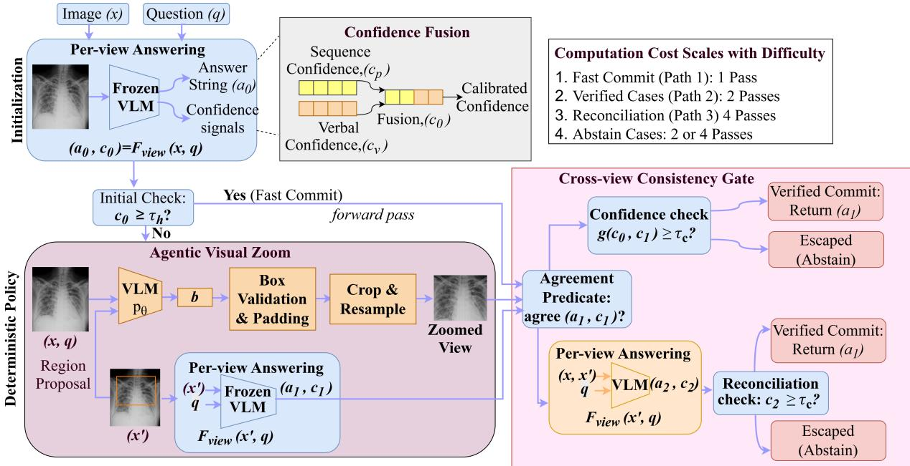
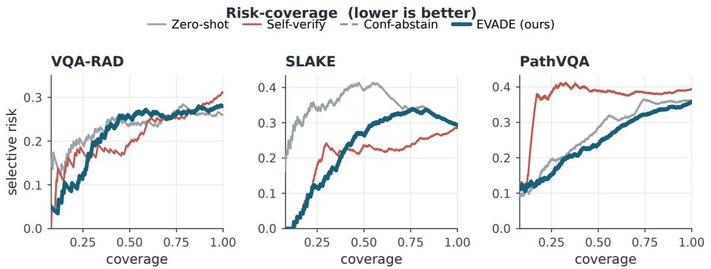
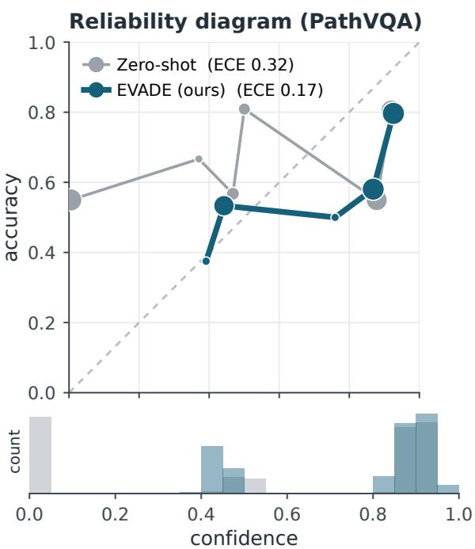
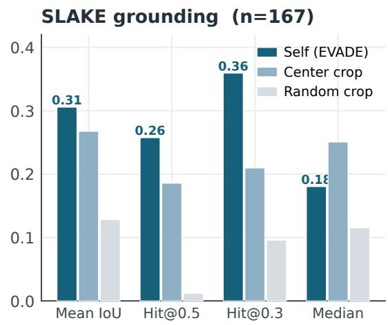
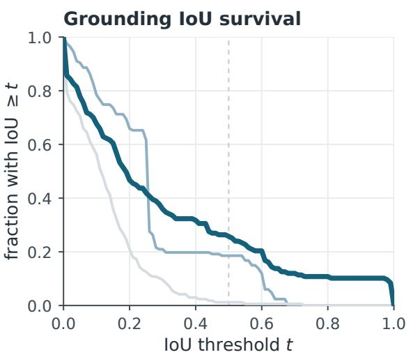

# EVADE: Evidence-Verified Agentic Diagnosis with Escape

Mohaimenul Azam Khan Raiaan∗

Department of Data Science and Artificial Intelligence, Monash University, Clayton, VIC, 3800, Australia

Nur Mohammad Fahad∗

School of Engineering and Energy, Murdoch University, Murdoch, WA 6150, Australia

## Abstract

Medical vision-language models (VLMs) can achieve high accuracy, but remain unreliable: they are systematically overconfident, benefit little from test-time reasoning, and lack the ability to reliably calibrate trust in their own responses. We introduce EVADE (Evidence-Verified Agentic Diagnosis with Escape), an inferential, non-training method that enhances the safety of deploying a single frozen VLM. EVADE responds and, when uncertain, localises the region most diagnostically relevant, re-answers on a zoomed view, and commits only when both the entire image and the zoomed view responses agree; otherwise, it ab stains. To directly address the verification hallucination in single-model self-checking, our main idea is to verify gate consistency across diferent image views rather than re-reading the model’s own text. Experimental evaluation in VQA-RAD, SLAKE, and PathVQA using Qwen2.5-VL-7B reports that EVADE is the only method that simultaneously improves both calibration and selective risk while maintaining accuracy, educing expected calibration error (ECE) by up to 45% compared to zero-shot, while chain-of-thought, self-consistency, and self-verification all fail at least one axis. A grounding analysis reports that self-proposed regions perform better at diagnostic structure localisation than centres or random crops. However, a 7B VLM cannot use this localisation to revise answers. Therefore, reliability gains come from the consistency gate and calibrated abstention.

Keywords: Medical VQA; Vision-Language Models; Selective Prediction; Calibration;

## 1. Introduction

Vision-language models (VLMs) are increasingly being proposed as assistants for medical image interpretation, answering free-form questions about radiology and pathology images (Lau et al., 2018; Liu et al., 2021; Sellergren et al., 2025). However, clinical use imposes the requirement that accuracy alone does not capture: a deployable system must signal when its answer is unreliable; thus, uncertain cases are deferred to the clinician rather than acted upon (Li et al., 2025). Recent evidence indicates that this reliability, not raw accuracy, is the binding constraint for medical VLMs and that standard remedies do not address it.

In VLM-based diagnosis, three failure modes recur more often (Dutta et al., 2025; Meddeb et al., 2025). First, medical VLMs are systematically overconfident and poorly calibrated, and a study spanning three model variants with scales from 2B to 38B parameters finds that this overconfidence is not removed by scaling the model or by prompting strategies such as chain-of-thought or verbalised confidence (Byun et al., 2026). Second, the remedy of additional test-time reasoning transfers poorly to medical imaging, for instance, chain-ofthought can reduce the accuracy of medical VQA because domain-specific warnings weaken the visual analysis, and the grounding chain causes early perception errors(Wu et al., 2026), and it has also been shown to induce overconfidence in VLMs (Welch et al., 2026). Third, the common safety strategy of asking a model to verify its own answer is unreliable. Because the verifier and the generator are the same capacity-coupled model, the verifier over-agrees with the generator and under-attends to the image, a lazy verifier produces a verification mirage in which apparent agreement masks a high rate of false acceptance; in multi-turn loops, this locks in initially wrong answers (Jin et al., 2026b).

Existing agentic approaches to medical imaging do not close this gap. Tool-augmented agents such as MedRAX orchestrate external specialist models through a reasoning loop and achieve strong accuracy, but they depend on a suite of trained tools rather than a single selfcontained VLM, and are not organised around calibration or abstention (Fallahpour et al., 2025). Uncertainty-aware triage agents add an abstain-or-defer policy for chest radiograph classification (Li et al., 2025), and other methods improve VLMs through training, for example, reinforcement learning with verifiable rewards (Huang et al., 2026). The question of how to make a single pretrained VLM reliable purely at inference, without tools or training, remains underexplored.

We address this question with EVADE (Evidence-Verified Agentic Diagnosis with Escape), a training-free procedure that runs entirely at inference on a pretrained VLM. EVADE progresses in three stages. It first answers the full image and estimates its confidence; if it is confident, it commits. If uncertain, it asks the model to localise the single most diagnostically relevant region, crops, and upscales that region so that small findings become legible, and re-answers on this new view. It then commits only when the wholeimage answer and the zoomed-view answer agree with suficient confidence, reconciles using both views when they disagree, and abstains when uncertainty remains.

The central design choice is that verification is gated on agreement between two views of the image, the global view and a self-proposed zoomed view, rather than on the model re-reading its own text. This directly targets the verification mirage: because the second answer is conditioned on fresh visual evidence that the model itself requested, the verifier cannot authorise the generator without consulting the image, which is precisely the failure that self-checking is only text (Jin et al., 2026b). The use of a region-of-interest (ROI) view is further motivated by evidence that training-free regions improve medical visual grounding and can reverse chain-of-thought degradation (Wu et al., 2026), and abstention prevents the error compounding that multi-turn self-verification produces.

We make the following contributions.

• We propose EVADE, a training-free, inference-only agentic loop that makes a single pretrained medical VLM more reliable by coupling an uncertainty-triggered evidence zoom, cross-view consistency verification, and calibrated abstention.

• We identify cross-view evidence agreements as verification signals that address the verification illusions of single-model self-verification and instantiate them without additional training or external tools.

• We design reproducible evaluations of open VLM (Qwen2.5-VL-7B-Instruct) and three public standards (VQA-RAD, SLAKE, PathVQA), which measure reliability, including expected calibration errors, selective prediction risk, and ground overlaps, with full calibration isolation for each component.

• EVADE is the only method to improve calibration and selective risk while maintaining accuracy, reducing the expected calibration error by up to 45% compared to zero-shot in three benchmarks of 7B VLM, and the chain of thought, self-consistency, and selfverification fail on at least one axis. An independent analysis also shows that the proposed regions localise diagnostic structures better than centre or random crops.

## 2. Related Work

## 2.1. Medical visual question answering

Medical VQA benchmarks pair clinical images with natural-language questions (Lin et al., 2023; Zhang et al., 2024). VQA-RAD provides clinician-generated questions on radiology images (Lau et al., 2018), SLAKE adds semantic annotations, including segmentation masks and bounding boxes, together with bilingual questions (Liu et al., 2021), and PathVQA targets pathology images (He et al., 2020). Strong accuracy in these benchmarks has come largely from models that are fine-tuned in them, including joint vision-language pretraining and reinforcement learning with verifiable rewards (Huang et al., 2026). Medical foundation VLMs such as MedGemma further improve in-domain performance (Sellergren et al., 2025), while general open VLMs such as Qwen2.5-VL provide capable zero-shot baselines with native visual grounding (Bai et al., 2025). Our work difers in setting: we do not fine-tune these datasets and instead study the inference-time reliability of pretrained models.

## 2.2. Agentic and tool-augmented medical reasoning

A growing number of studies equip medical systems with agent control (Wang et al., 2025; Xia et al., 2025). MedRAX integrates specialist chest radiographic tools with multimodal LLMs in an independent logic loop for training and reports state-of-the-art results in complex chest radiographic benchmark (Fallahpour et al., 2025). AT-CXR introduces an uncertainty-sensitive prioritisation agent that estimates confidence and distribution in each case, develops a step-by-step policy for the issuance, expansion, or delay of decisions, and improves the selective prediction risk in chest radiograph classification (Li et al., 2025). Other systems improve medical VLMs through training, such as data synthesis with a generator-verifier and strengthening learning (Huang et al., 2026). Our method, EVADE, difers in two ways: it uses a single pre-trained VLM without external tools or training, and its agent’s actions are organised around calibration and abstention rather than tool selection or answer maximisation.

## 2.3. Test-time reasoning and its limits in medicine

Chain-of-thought prompting (Wei et al., 2022) and self-consistency (Wang et al., 2023) methods improve reasoning in general settings, and test-time scales usually become a common layer for precision. However, in medical imaging, these methods do not transfer well. Naive token budget scaling can yield limited benefits for most medical VLMs (Oh et al., 2025). Chain-of-thought reduces the accuracy of medical VQA by compounding perceptual uncertainty (Wu et al., 2026), and can cause overconfidence(Welch et al., 2026). In particular, training-free interference that improves perception, such as indications of region-ofinterest, can reverse this degradation (Wu et al., 2026), which motivates us to use evidencezoom rather than a longer text argument.

## 2.4. Calibration, selective prediction, and self-verification

Confidence calibration is widely used (Du et al., 2025), and post-hoc methods, such as temperature scaling, have been shown to reduce calibration errors in deep networks (Guo et al., 2017). Selective predictions formalise the option of abstention and are evaluated through risk cover curves and the area below them (Geifman and El-Yaniv, 2017). Specifically for medical VLMs, overconfidence persists and is not fixed by prompting, although post-hoc scales help. Self-verification has been proposed as a safety layer, but recent literature has shown that single-model self-verification is unreliable, exhibits a lazy checker efect and verification hallucination, and that cross-checking across image views or models is more reliable (Jin et al., 2026b). The nearest training-free checker, V-Loop, detects hallucinations by visual logic loops and attention coherence (Jin et al., 2026a); it cheques by re-querying with text and checking attention, while EVADE cheques by re-answering on a self-proposed zoomed crop and cross-view agreement gating, coupled with an explicit abstention decision.

## 2.5. Gap Analysis

Previous work (Fallahpour et al., 2025; Li et al., 2025; Huang et al., 2026; Wei et al., 2022; Wu et al., 2026; Welch et al., 2026; Jin et al., $^ { 2 0 2 6 \mathrm { b } , \mathrm { a } ) }$ on reliable medical VQA progressed by strengthening models through scaling, pre-training, or synthetic data curation, which increased precision, yet left frozen models over confident and unable to abstain. The addition of inference-time strategy, whether tool-based agents, uncertainty testing, or text-level self-consistency, all control a single view and, therefore, endorsing confident errors. No method evaluates its reliability using new visual evidence collected by the model. EVADE addresses these gaps using an inference loop with no-training establishing a commitment or abstention on the agreement between the whole image and the self-proposed zoom, and turning cross-view consistency into a calibrated selective prediction.

## 3. Method

## 3.1. Overview and problem setup

We study selective medical VQA, in which a model can respond or abstain. Let $f _ { \theta }$ be a frozen preprained VLM. Given an image $x \in \mathbb { R } ^ { H \times W \times 3 }$ and a question $q ,$ autoregressive decoding produces a token sequence $y = ( y _ { 1 } , \dotsc , y _ { T } )$ with per-token distributions $p _ { \theta } ( y _ { t } \mid$ $y _ { < t } , x , q )$ , from which we read an answer string $a = \mathrm { p a r s e } ( y )$ . We write a single query as $( a , \pi ) \ = \ f _ { \theta } ( x , q )$ , where $\pi = \{ y , \log p _ { \theta } ( \cdot ) \}$ carries the decoded answer and its token log-probabilities. A selective predictor is a pair $( h , g )$ of a classifier h and a binary gate $g \colon$ on input $( x , q )$ it returns $h ( x , q )$ when $g ( x , q ) = 1$ and abstains, denoted ⊥, otherwise (Geifman and El-Yaniv, 2017). Its quality is summarised by the risk-coverage trade-of, where coverage is the fraction of answered cases, and selective risk is the error rate of the selected cases.

EVADE manifested $( h , g )$ as a single deterministic policy on $f _ { \theta }$ that requires no finetuning and no auxiliary networks. Three designs follow from the failure modes in Section 1: the confidence used to gate must not rely on a single overconfident signal; verification must consult visual evidence rather than re-read text; and the system must be able to abstain rather than commit a conflicted answer. EVADE meets these through (i) a calibrated first answer, (ii) an agentic visual zoom that re-observes a self-selected region, and (iii) a crossview consistency gate that commits, reconciles, or abstains. The Algorithm 1 gives the full procedure. In addition, Figure 1 presents the methodology diagram of EVADE, highlighting the execution flow and conditions.

  
Figure 1: Proposed methodology diagram of EVADE, showing the three steps, with model, and conditions

## 3.2. Per-view answering and confidence

Each stage queries $f _ { \theta }$ on one view, resulting in an answer and a scalar confidence $c \in [ 0 , 1 ]$ We combine two complementary signals. The sequence confidence is the geometric mean of the answer-token probabilities,

$$
c _ { p } \ = \ \exp \biggl ( \frac { 1 } { | \mathcal { A } | } \sum _ { t \in \mathcal { A } } \log p _ { \theta } \bigl ( y _ { t } \ | \ y _ { < t } , x , q \bigr ) \biggr ) ,\tag{1}
$$

In Eq. (1), A indexes the answer span tokens; $c _ { p }$ is the internal probability of the model and is sensitive to verbal uncertainty. Verbalised confidence $c _ { v } \in [ 0 , 1 ]$ is evoked by instructing the model to add a confidence value to its answer, capturing self-assessment that probability alone could miss. However, verbalised confidence can itself be systematically overconfident in medical VLMs (Senoglu et al., 2026), therefore, it is not trustworthy in isolation, but the fusion of the two signals expressed in Eq. (2),

$$
c = \lambda c _ { v } + ( 1 - \lambda ) c _ { p } , \qquad \lambda \in [ 0 , 1 ] ,\tag{2}
$$

with λ selected from the delayed (development) data. (Section 3.8)We denote the per-view outputs $( a , c ) = \mathcal { F } _ { \mathrm { v i e w } } ( x , q )$ , folding Eqs. (1)–(2) into $\mathcal { F } _ { \mathrm { v i e w } }$

## 3.3. Agentic visual zoom

The first answer is computed on the full image $( a _ { 0 } , c _ { 0 } ) = \mathcal { F } _ { \mathrm { v i e w } } ( x , q )$ . When $c _ { 0 } \geq \tau _ { h }$ , the case is easy, then EVADE commits immediately; otherwise, it goes to the next step, and takes a perceptual action. It asks the model to localise the most diagnostically relevant region for the question, using VLM’s native grounding ability, obtained using Eq.(3)

$$
\tilde { b } = \rho _ { \theta } ( x , q ) , \qquad \tilde { b } = ( u _ { 1 } , v _ { 1 } , u _ { 2 } , v _ { 2 } ) .\tag{3}
$$

Then, the bounding box is validated and projected onto the image domain, returning to a fixed central window $b _ { c }$ that covers a fraction $\gamma$ of each side when the output is degenerate using Eq. (4),

$$
\begin{array} { r } { b = \left\{ \begin{array} { l l } { \Pi _ { [ 0 , W ] \times [ 0 , H ] } ( \tilde { b } ) } & { \mathrm { i f ~ } \tilde { b } \mathrm { ~ i s ~ v a l i d ~ a n d ~ a r e a } ( \tilde { b } ) \geq a _ { \operatorname* { m i n } } , } \\ { b _ { c } } & { \mathrm { o t h e r w i s e } . } \end{array} \right. } \end{array}\tag{4}
$$

By dilating the box by a p margin to maintain the surrounding lesional context, and by upsampling, we resample crops to a fixed central window of S,

$$
x ^ { \prime } = \mathcal { R } _ { S } \big ( \mathrm { c r o p } ( x , \mathrm { p a d } ( b , p ) ) \big ) , \qquad S \geq \mathrm { m a x } ( H , W ) ,\tag{5}
$$

After cropping in Eq. (5), the area of interest occupies more input tokens and fine structures beyond the model’s efective resolution threshold. This is the mechanism by which EVADE counteracts bottlenecks in medical perception that restrict chain-of-thought reasoning (Wu et al., 2026). Instead of adding text reasoning on the same pixel, it increases visual evidence for decisions. The second answer is obtained on a zoom view, $( a _ { 1 } , c _ { 1 } ) =$ $\mathcal { F } _ { \mathrm { v i e w } } ( x ^ { \prime } , q )$ . By construction, $a _ { 1 }$ is based on another observation than $a _ { 0 }$ , so the next gate becomes a test of evidence, not of text.

## 3.4. Cross-view consistency as an evidence-grounded verifier

Agreement predicate. Let $n ( \cdot )$ normalise an answer by punctuation and article removal, casefolding, and canonicalisation of polarity terms. For closed questions, the agreement is exact, agree $\begin{array} { r } { \dot { \mathbf { \rho } } ( a _ { 0 } , a _ { 1 } ) = \mathbf { 1 } [ n ( a _ { 0 } ) = n ( a _ { 1 } ) ] \dot { \mathbf { \rho } } } \end{array}$ ; for open questions, we threshold the token-overlap $F _ { 1 } , \operatorname { a g r e e } ( a _ { 0 } , a _ { 1 } ) = \mathbf { 1 } \left[ F _ { 1 } ( n ( a _ { 0 } ) , n ( a _ { 1 } ) ) \geq \theta \right]$

Why cross-view rather than self-rereading Naive self-verification re-queries $f _ { \theta }$ in the same $( x , q )$ . The checked answer and the original are both samples of $p _ { \theta } ( \cdot \textit { | } x , q )$ sharing the same input and model, and tend to agree even when wrong. This is called agreement bias, and the lazy-verification efect produces verification illusions (Jin et al., 2026b). It is conditional on identical images and does not provide new proof of correctness.

EVADE, in contrast, measures the stability of the answers under controlled visual intervention $x ^ { \prime } = \mathcal { R } _ { S } ( \mathrm { c r o p } ( x , \rho _ { \theta } ( x , q ) ) )$ , a self-generated counterfactual view that zooms in on the model’s ROI and discards the surrounding context. Agreement over views demonstrates that the prediction is invariant to changes in the model’s evidence as a whole, a property that cannot be verified by resampling the text on the fixed image. Subsequently, disagreements are diagnostic; they isolate answers that depend on low-resolution shortcuts or globa context rather than the diagnostic region, and EVADE routes them to abstention. In fact, the verification is re-modelled from the text self-consistency problem, which requires the collection of reasoning chains from an image, to the view-consistency problem, which requires the collection of visual views, which is the natural axis of change for a perception-bound task.

Decision policy. The aggregated confidence of two agreeing views is $g ( c _ { 0 } , c _ { 1 } ) = \operatorname* { m a x } ( c _ { 0 } , c _ { 1 } )$ EVADE commits the agreed answer when the most confident of the two views clears $\tau _ { c }$ . We used the maximum in all reported experiments; the arithmetic and harmonic means are more conservative alternatives. In commitment, the stored confidence is the same max $\left( c _ { 0 } , c _ { 1 } \right)$ , so the calibration and selective-risk metrics are calculated against it. The policy is denoted in Eq. (6):

$$
\begin{array} { r } { \mathrm { E V A D E } ( x , q ) = \left\{ \begin{array} { l l } { a _ { 0 } , } & { c _ { 0 } \geq \tau _ { h } , } \\ { a _ { 1 } , } & { c _ { 0 } < \tau _ { h } , \mathrm { ~ a g r e e } ( a _ { 0 } , a _ { 1 } ) , g ( c _ { 0 } , c _ { 1 } ) \geq \tau _ { c } , } \\ { a _ { 2 } , } & { c _ { 0 } < \tau _ { h } , \ \lnot \mathrm { a g r e e } ( a _ { 0 } , a _ { 1 } ) , c _ { 2 } \geq \tau _ { c } , } \\ { \perp , } & { \mathrm { o t h e r w i s e } , } \end{array} \right. } \end{array}\tag{6}
$$

where, in disagreement, $( a _ { 2 } , c _ { 2 } ) = \mathcal { F } _ { \mathrm { v i e w } } ( \{ x , x ^ { \prime } \} , q )$ , there is a reconciliation pass that takes into account both points of view to enable the model to settle the issue using all the information at hand. The abstention branch, which prevents conflicting cases from accumulating into confident errors, is reached when opinions only marginally agree or disagree without a confident resolve (Jin et al., 2026b).

## 3.5. Selective behaviour and operating point

Eq. (6) expresses a selective predictor whose coverage is controlled by the threshold pair ${ \boldsymbol \tau } = ( \tau _ { h } , \tau _ { c } )$ . Increasing $\tau _ { h }$ sends more cases through verification, while increasing $\tau _ { c }$ tightens the level of commitment and increases abstention. Sweeping $\tau$ traces an operational curve in the risk-coverage space. We choose a single τ, as well as the fusion weight λ, by shrinking the area under the risk-coverage curve of the development-set. The test distribution is not used for tuning. EVADE difers from post-hoc calibration, which rescales confidences but maintains the decision boundary. Inject newly generated visual evidence before making the decision, afecting the response to which is returned.

## 3.6. Computational cost

EVADE uses computation only when necessary. A scenario that clears $\tau _ { h }$ makes a single forward pass. In an ambiguous instance, only four options are used: the initial answer, the region proposal, the zoomed answer, and reconciliation if there is disagreement. The cost

Algorithm 1: EVADE: evidence-verified agentic diagnosis with escape   
Input: frozen VLM fθ, image x, question q; thresholds $\tau _ { h } , \tau _ { c } ;$ fusion weight λ   
1 $( a _ { 0 } , c _ { 0 } ) \gets f _ { \theta } ( x , q )$ // answer full image; Eqs. (1)--(2)   
2 if $c _ { 0 } \geq \tau _ { h }$ then   
3 return a0 ; // fast commit, one forward pass   
4 $b \gets \rho _ { \theta } ( x , q )$ ; // self-proposed region; Eq. (4)   
5 $x ^ { \prime }  \mathcal { R } _ { S } ( \mathrm { c r o p } ( x , \mathrm { p a d } ( b , p ) ) )$ // zoom to fresh pixels; Eq. (5)   
6 $( a _ { 1 } , c _ { 1 } ) \gets f _ { \theta } ( x ^ { \prime } , q )$   
7 if agree $( a _ { 0 } , a _ { 1 } )$ then   
8 if $g ( c _ { 0 } , c _ { 1 } ) \ge \tau _ { c }$ then   
9 return $a _ { 1 }$ // verified commit   
10 else   
11 return ⊥ ; // weak agreement: abstain   
12 else   
13 $( a _ { 2 } , c _ { 2 } ) \gets f _ { \theta } ( \{ x , x ^ { \prime } \} , q )$ // reconcile on both views   
14 if $c _ { 2 } \geq \tau _ { c }$ then   
15 return $_ { a _ { 2 } ; }$   
16 else   
17 return ⊥;

increases with the dificulty of the case rather than evenly. The fast-commit proportion is controlled by $\tau _ { h }$

## 3.7. Component ablations

To understand EVADE’s behaviour, we examine lesion policies that remove a single mechanism from Eq. (6). (a) No-zoom replaces the zoomed view with another read of the full image, reducing the gate to text-based self-verification. (b) No-gate commits the zoomed response when the model zooms, eliminating the consistency test. (c) No-abstain requires a commit in all branches, eliminating the escape. (d) Fixed-region substitutes $\rho _ { \theta }$ with a centre or random crop, eliminating agentic region selection. The contrast in (d) with the whole model isolates the value of where the model looks, while (a) isolates the value of looking at fresh pixels.

## 3.8. Experimental setup

Datasets. Three public medical VQA benchmarks are used for our evaluation: PathVQA (He et al., 2020), SLAKE (English) (Liu et al., 2021), and VQA-RAD (Lau et al., 2018). We measure grounding overlap using the region annotations that SLAKE additionally provides. Both results of both closed-ended and open-ended questions are reported in the following sections.

Model. We assess using Qwen2.5-VL-7B-Instruct (Bai et al., 2025), a standard open VLM that is used without any fine-tuning and provides token log-probabilities and native visual grounding. Any VLM that can report a region and confidence can use EVADE, which is model-agnostic. Future research will expand the study to include more and larger VLMs.

Baselines. We compare against zero-shot direct answering, chain-of-thought prompting (Wei et al., 2022), self-consistency (Wang et al., 2023), naive self-verification that asks the same image, and confidence-threshold abstention.

Metrics. Beyond the accuracy of the answers to the questions, we measure reliability. We report expected calibration error (ECE) (Guo et al., 2017), calculated by dividing predictions by confidence and averaging the gap between accuracy and confidence. We report selective-prediction performance through the risk-coverage curve and the area under it (AURC) (Geifman and El-Yaniv, 2017), together with risk at fixed coverage. On SLAKE we measure grounding overlap as the intersection-over-union between the self-proposed region and the annotated region.

Implementation details. Committal answers use greedy decoding, while self-consistency uses temperature sampling. The thresholds $\tau _ { h }$ and $\tau _ { c }$ and the fusion weight λ are selected by grid search in a holdout development split, minimising development-set AURC; no test data is used for tuning. Statistical significance is assessed with paired bootstrap 95% confidence intervals and McNemar tests (Pembury Smith and Ruxton, 2020) across datasets. All runs use a single NVIDIA GB10 accelerator (DGX Spark); we report the mean number of forward passes per item (Sec. 4.5) as a hardware-independent cost measure rather than wall-clock time.

  
Figure 2: Risk-coverage curves on the three benchmarks (Qwen2.5-VL-7B); lower is better. EVADE attains the lowest selective risk at high coverage. On SLAKE, confidence-thresholded abstention (Conf-abstain) degrades below zero-shot because raw confidence is anti-correlated with correctness there; EVADE’s crossview gate recovers a usable selective signal.

  
Figure 3: Reliability diagram on PathVQA (10 equal-width confidence bins; marker area is proportional to bin population, and the lower panel shows the confidence histogram). Zero-shot is severely overconfident (ECE 0.32); EVADE tracks the diagonal far more closely (ECE 0.17).

## 4. Results and Analysis

Experimental evaluation is conducted on Qwen2.5-VL-7B-Instruct across VQA-RAD, SLAKE, and PathVQA datasets. All decision thresholds are tuned in the development split (Sec. 3.8); however, the test sets are not tuned. For each method, we compute selective accuracy (accuracy in the answers), coverage, expected calibration error (ECE), the area under the risk-coverage curve (AURC), and the average number of forward passes per item. Moreover, statistical significance is assessed with paired bootstrap 95% confidence intervals and McNemar tests across datasets.

Our main finding is that reliability is a combination of three requirements, improved selective risk, improved calibration, and preserved accuracy, and EVADE is the lone method that satisfies all three simultaneously. Each baseline fails at least one axis; for example, chain-of-thought and self-consistency collapse in accuracy, self-verification fails in calibration, and confidence-threshold abstention can be inversely correlated with accuracy.

## 4.1. Calibration and selective prediction

Table 1 presents that EVADE reduces ECE in zero-shot testing on all datasets, by 23% in VQA-RAD (0.241→0.184), 28% in SLAKE (0.393→0.282) and 45% in PathVQA (0.317→ 0.173), and consistently achieves lower AURC on every dataset (Fig. 2). In addition, these calibration gains are statistically significant as the paired bootstrap 95% CI on ∆ECE against zero-shot in all three datasets are $( [ - 0 . 1 0 , - 0 . 0 1 ]$ in VQA-RAD, [−0.17, −0.05] in SLAKE, [−0.17, −0.12] in PathVQA), and McNemar tests show no substantial changes in accuracy on any dataset, therefore, the improved calibration has no quantifiable accuracy cost. The reduction in AURC in zero-shot setting is (95% CI [−0.15, −0.08]) in SLAKE and directionally consistent; however, it is not statistically significant in VQA-RAD and PathVQA. The reliability diagram (Fig. (3) shows that zero-shot is considerably overconfident, accurate well below its declared confidence, both in the mid-range and above it at the top, while EVADE tracks the diagonal much more closely. Both chain-of-thought and self-consistency methods appear to be well-calibrated in isolation; however, due to their frequent uncertainty, overall accuracy falls to 0.30 and 0.32 on PathVQA from a zero-shot 0.64, and the corresponding AURC is also poor. In contrast, EVADE improves the calibration while preserving the accuracy.

  
Figure 4: SLAKE grounding (n=167 zoomed items with a region annotation). Left: selfproposed regions achieve the highest mean IoU and tight-overlap hit-rates; centre crop attains a higher median but far fewer tight hits. Right: IoU survival; EVADE matches center crop at loose thresholds and dominates for $\mathrm { I o U } \geq 0 . 4$ indicating it more often localises tightly. No self-proposal falls back to the centre window.

Table 1: Main results on Qwen2.5-VL-7B. Acc is selective accuracy (on answered items) at the listed coverage (Cov). Bold: best among the reliability-oriented methods (zero-shot, self-verify, conf-abstain, EVADE). CoT and self-consistency (gray) attain low ECE only by collapsing accuracy, and are shown for reference. EVADE is the only method that lowers ECE on all three datasets while preserving accuracy; self-verify lowers AURC but at a large calibration cost.
<table><tr><td></td><td colspan="4">VQA-RAD</td><td colspan="4">SLAKE</td><td colspan="4">PathVQA</td></tr><tr><td>Method</td><td>ECE↓</td><td>AURC↓</td><td>Acc↑</td><td> $\operatorname { C o v }$ </td><td>ECE↓</td><td>AURC↓</td><td>Acc↑</td><td> $\operatorname { C o v }$ </td><td>ECE↓</td><td>AURC↓</td><td>Acc↑</td><td>Cov</td></tr><tr><td>Zero-shot</td><td>0.241</td><td>0.225</td><td>0.741</td><td>1.00</td><td>0.393</td><td>0.327</td><td>0.707</td><td>1.00</td><td>0.317</td><td>0.255</td><td>0.639</td><td>1.00</td></tr><tr><td>CoT</td><td>0.196</td><td>0.400</td><td>0.554</td><td>1.00</td><td>0.189</td><td>0.396</td><td>0.543</td><td>1.00</td><td>0.155</td><td>0.554</td><td>0.302</td><td>1.00</td></tr><tr><td>Self-consist.</td><td>0.149</td><td>0.311</td><td>0.562</td><td>1.00</td><td>0.164</td><td>0.246</td><td>0.560</td><td>1.00</td><td>0.300</td><td>0.595</td><td>0.317</td><td>1.00</td></tr><tr><td>Self-verify</td><td>0.519</td><td>0.195</td><td>0.689</td><td>1.00</td><td>0.456</td><td>0.187</td><td>0.714</td><td>1.00</td><td>0.493</td><td>0.352</td><td>0.606</td><td>1.00</td></tr><tr><td>Conf-abstain</td><td>0.241</td><td>0.225</td><td>0.716</td><td>0.785</td><td>0.393</td><td>0.327</td><td>0.596</td><td>0.464</td><td>0.317</td><td>0.255</td><td>0.680</td><td>0.557</td></tr><tr><td>EVADE (ours)</td><td>0.184</td><td>0.202</td><td>0.720</td><td>0.968</td><td>0.282</td><td>0.216</td><td>0.669</td><td>0.849</td><td>0.173</td><td>0.242</td><td>0.689</td><td>0.705</td></tr></table>

Table 2: SLAKE grounding (n=167 zoomed items with a region annotation). Self-proposed regions achieve the highest mean IoU and tight-overlap hit-rates; no self-proposal fell back to the centre window (0%). Centre crop has a higher median but far fewer tight hits, reflecting reliable moderate overlap without precise localisation.
<table><tr><td>Region</td><td>Mean IoU</td><td>Med. IoU</td><td>Hit @.5</td><td>Hit @.3</td><td>Hit @.1</td><td>IoU| cor.</td><td>IoU| wr.</td></tr><tr><td>Self (EVADE)</td><td>0.306</td><td>0.180</td><td>0.257</td><td>0.359</td><td>0.677</td><td>0.319</td><td>0.277</td></tr><tr><td>Center crop</td><td>0.267</td><td>0.250</td><td>0.186</td><td>0.210</td><td>0.784</td><td>0.259</td><td>0.288</td></tr><tr><td>Random crop</td><td>0.128</td><td>0.115</td><td>0.012</td><td>0.096</td><td>0.563</td><td>0.129</td><td>0.124</td></tr></table>

## 4.2. Self-verification and confidence abstention are insuficient

Both reliability baselines fail in instructive, contradictory ways. Self-verification improves answer rankings by achieving the lowest AURC on VQA-RAD and SLAKE, but its calibration fails, and ECE increases to 0.52, 0.46, and 0.49. The distance to EVADE in ∆ECE is large and significant across all datasets (up to −0.34, all 95% CIs excluding zero), and on the PathVQA dataset, EVADE is remarkably more accurate (McNemar $p < 0 . 0 0 1 )$ . This is the sign of verification-mirage, a confident verifier that governs the generator without re-examining the image (Jin et al., 2026b). Besides, confidence-thresholded abstention fails disparately where selective accuracy (0.596) drops below the full-coverage accuracy (0.707) at coverage 0.46, hence, raw confidence is inversely correlated with accuracy and abstaining discards accurate answers, and the rising Conf-abstain curve in Fig. 2 (SLAKE), clearly indicates this. The Cross-view consistency gate of EVADE avoids both pathologies and produces a useful, selectively calibrated confidence signal.

## 4.3. Does the agentic zoom localise?

In the 167 SLAKE samples that triggered the zoom and executed a region annotation, the self-proposed regions achieve a mean (mIoU) of 0.306, which is above the centre crops (0.267) and far above the random crops (0.128), and it can be mathematically expressed as self > centre > random holds throughout (Table 2, Fig. 4). The distinction broadens at hard thresholds where EVADE reaches IoU≥0.5 on 25.7% of items versus 1.2% at random, with a 21× margin, and the IoU curve displays that EVADE dominates everywhere and outperforms the centre crop beyond IoU= 0.4. The centre crop has a comparatively higher median IoU (0.250 vs. 0.180) and fewer tight hits, securing moderate overlap without precise localisation, while our self-proposal EVADE more often positions exactly on the diagnostic region. Moreover, no self-proposal fell back to the centre window, and the IoU region is marginally higher on correctly answered items (0.319 vs. 0.277). Consequently, the model localises the relevant region without prior supervision.

Table 3: Component ablations on Qwen2.5-VL-7B. Removing the gate degrades ECE and AURC on VQA-RAD and SLAKE, identifying it as the main source of the reliability gains. Removing abstention leaves ECE/AURC unchanged (these are computed over the full confidence ranking) but forces coverage to 1.0. Removing the zoom or swapping the self-proposed region for a centre or random crop barely moves the downstream metrics, despite the large grounding diferences in Table 2.
<table><tr><td></td><td colspan="2">VQA-RAD</td><td colspan="2">SLAKE</td><td colspan="2">PathVQA</td><td></td></tr><tr><td>Variant</td><td>ECE↓</td><td>AURC↓</td><td>ECE↓</td><td>AURC↓</td><td>ECE↓</td><td>AURC↓</td><td>Calls</td></tr><tr><td>EVADE (full)</td><td>0.184</td><td>0.202</td><td>0.282</td><td>0.216</td><td>0.173</td><td>0.242</td><td>2.10-2.39</td></tr><tr><td>– zoom (text re-read)</td><td>0.186</td><td>0.206</td><td>0.290</td><td>0.215</td><td>0.182</td><td>0.249</td><td>1.50-1.77</td></tr><tr><td>- gate</td><td>0.197</td><td>0.218</td><td>0.320</td><td>0.237</td><td>0.168</td><td>0.242</td><td>1.87-2.32</td></tr><tr><td>- abstain</td><td>0.184</td><td>0.202</td><td>0.282</td><td>0.216</td><td>0.173</td><td>0.242</td><td>2.10-2.39</td></tr><tr><td>center crop</td><td>0.184</td><td>0.198</td><td>0.279</td><td>0.205</td><td>0.188</td><td>0.247</td><td>1.51-1.76</td></tr><tr><td>random crop</td><td>0.187</td><td>0.199</td><td>0.275</td><td>0.207</td><td>0.188</td><td>0.244</td><td>1.53-1.78</td></tr></table>

## 4.4. Ablations: where the gains originate

Table 3 outlines the contribution of each sub-component. The worst performance is observed after removing the consistency gate for both ECE and AURC in SLAKE, and VQA-RAD (SLAKE ECE 0.282 → 0.320, AURC 0.216 → 0.237), determining the gate as an influential driver of the reliability gains. On the other hand, removing abstention keeps ECE and AURC unchanged, and was quite expected since they are computed over the full confidence ranking, but forces coverage to 1.0 and removes the selective-accuracy advantages, confirming that abstention drives the operating point rather than the calibration. However, the most critical part is that removing the zoom or replacing the self-proposed region with a random or centre crop hardly changes the metrics (SLAKE ECE 0.282, 0.279, 0.275 for self, centre and random), despite their grounding quality difers sharply (Table 2). Together with Sec. 4.3, this outlines our key analysis result that the agentic zoom precisely localises the diagnostic region, yet a 7B VLM does not interpret that localisation into changed answers; therefore, the measured reliability gains arise from the consistency gate and calibrated abstention instead of the zoomed evidence itself.

## 4.5. Eficiency

EVADE computes on hard cases where the zoom triggers on 44% of SLAKE items (181/416) while the rest of the samples are committed in a single pass. In addition, mean forward passes per item are 2.10, 1.98, and 2.39 across three datasets, against 5.0 for self-consistency, making EVADE cheaper than sampling-based test-time scaling while being substantially better calibrated. (Table 1).

## 4.6. Discussion and limitations

Our analysis investigates a precise gap in current open VLMs as they can be guided to find diagnostic evidence during test time, yet cannot exploit those evidences to revise an answer; consequently, practical advantages of an agentic zoom currently accumulate through calibration and abstention instead of changed predictions. Three cautions bound the claims. First, base analysis includes n = 167 elements in a single dataset and a single 7B model. The results of localisation are clear trends, not broad guarantees, and extending to other larger VLMs will test their generality. Secondly, since SLAKE masks are organ or regionlevel segmentations, IoU measures whether the model aligns with the annotation structure, a reasonable but imperfect proxy for the answer-related lesion. Thirdly, in VQA-RAD, the zero-shot accuracy is already high, and the multi-step pipeline trades a small amount of accuracy for improved calibration. The proposed methodology, EVADE, is aimed at selective prediction regimes in which knowing when to defer objectives is important.

## 5. Conclusion

We introduce EVADE, a training-free agent loop that improves the reliability of frozen medical VLMs by sequentially integrating an uncertainty-triggered evidence zooming, followed by cross-view consistency verification and, finally, calibrated abstention. Extensive evaluation across three benchmarks indicates that EVADE is the only method that simultaneously improves calibration and selective risk without compromising accuracy, with about 2 forward passes per case, requiring significantly less computation than sample-based test time scales. Moreover, our analysis yields intuitive diagnostic findings: current 7B VLMs can locate diagnostic evidence at test time, but cannot exploit it to review answers. Therefore, the advantages are achieved through verification and abstention, rather than zooming. The next steps include closing the gap between localisation and answer revision and extending EVADE to larger and multiple VLMs.

## References

Shuai Bai et al. Qwen2.5-VL technical report. 2025. doi: https://doi.org/10.48550/arXiv. 2502.13923.

Ji Young Byun, Young-Jin Park, Jean-Philippe Corbeil, and Asma Ben Abacha. Overconfidence and calibration in medical vqa: Empirical findings and hallucination-aware mitigation. arXiv, 2026. doi: https://doi.org/10.48550/arXiv.2604.02543.

Yuetian Du, Yucheng Wang, Ming Kong, Tian Liang, Qiang Long, Bingdi Chen, and Qiang Zhu. Confidence calibration for multimodal llms: An empirical study through medical vqa. In International Conference on Medical Image Computing and Computer-Assisted Intervention, pages 89–99. Springer, 2025. doi: https://doi.org/10.1007/ 978-3-032-04978-0 9.

Niharika Dutta, Kartik Bose, Emir Syailendra, Linda Chu, and Pankaj Gupta. Visionlanguage models in diagnostic imaging: review of technical advances, clinical validation,

and practical deployment. International Journal of Medical Informatics, page 106227, 2025. doi: https://doi.org/10.1016/j.ijmedinf.2025.106227.

Adibvafa Fallahpour, Jun Ma, Abdullah Munim, Hongyu Lyu, and Bo Wang. MedRAX: Medical reasoning agent for chest x-ray. In International Conference on Machine Learning (ICML), 2025. doi: https://doi.org/10.48550/arXiv.2502.02673. arXiv:2502.02673.

Yonatan Geifman and Ran El-Yaniv. Selective classification for deep neural networks. In Advances in Neural Information Processing Systems (NeurIPS), 2017. doi: https: //doi.org/10.48550/arXiv.1705.08500.

Chuan Guo, Geof Pleiss, Yu Sun, and Kilian Q. Weinberger. On calibration of modern neural networks. In International Conference on Machine Learning (ICML), 2017. doi: https://doi.org/10.48550/arXiv.1706.04599.

Xuehai He, Yichen Zhang, Luntian Mou, Eric Xing, and Pengtao Xie. PathVQA: 30000+ questions for medical visual question answering. 2020. doi: https://doi.org/10.48550/ arXiv.2003.10286.

Xiaoke Huang, Ningsen Wang, Hui Liu, Xianfeng Tang, and Yuyin Zhou. Synthesizing high-quality visual question answering from medical documents with generator-verifier lmms. In The Fourteenth International Conference on Learning Representations, 2026. doi: https://doi.org/10.48550/arXiv.2510.25867.

Mengyuan Jin, Zehui Liao, and Yong Xia. V-Loop: Visual logical loop verification for hallucination detection in medical visual question answering. 2026a. doi: https://doi. org/10.48550/arXiv.2601.18240.

Ruinan Jin, Beidi Zhao, Myeongkyun Kang, Qiong Zhang, and Xiaoxiao Li. Verification mirage: Mapping the reliability boundary of self-verification in medical vqa. arXiv preprint arXiv:2605.10850, 2026b. doi: https://doi.org/10.48550/arXiv.2605.10850.

Jason J. Lau, Soumya Gayen, Asma Ben Abacha, and Dina Demner-Fushman. A dataset of clinically generated visual questions and answers about radiology images. Scientific Data, 5:180251, 2018. doi: https://doi.org/10.1038/sdata.2018.251.

Xueyang Li, Mingze Jiang, Gelei Xu, Jun Xia, Mengzhao Jia, Danny Chen, and Yiyu Shi. AT-CXR: Uncertainty-aware agentic triage for chest x-rays. 2025. doi: https: //doi.org/10.48550/arXiv.2508.19322.

Zhihong Lin, Donghao Zhang, Qingyi Tao, Danli Shi, Gholamreza Hafari, Qi Wu, Mingguang He, and Zongyuan Ge. Medical visual question answering: A survey. Artificial Intelligence in Medicine, 143:102611, 2023. doi: https://doi.org/10.1016/j.artmed.2023. 102611.

Bo Liu, Li-Ming Zhan, Li Xu, Lin Ma, Yan Yang, and Xiao-Ming Wu. SLAKE: A semantically-labeled knowledge-enhanced dataset for medical visual question answering. In IEEE International Symposium on Biomedical Imaging (ISBI), 2021. doi: https://doi.org/10.1109/ISBI48211.2021.9434010. arXiv:2102.09542.

Aymen Meddeb, Ida Rangus, Paolo Pagano, Insaf Dkhil, Soumaya Jelassi, Keno Bressem, Michael Scheel, Mike P Wattjes, Sonia Nagi, Laurent Pierot, et al. Evaluating the diagnostic accuracy of vision language models for neuroradiological image interpretation. npj Digital Medicine, 8(1):666, 2025. doi: https://doi.org/10.1038/s41746-025-02047-6.

Gyutaek Oh, Seoyeon Kim, Sangjoon Park, and Byung-Hoon Kim. Rethinking test-time scaling for medical ai: Model and task-aware strategies for llms and vlms. arXiv preprint arXiv:2506.13102, 2025. doi: https://doi.org/10.48550/arXiv.2506.13102.

Matilda QR Pembury Smith and Graeme D Ruxton. Efective use of the mcnemar test. Behavioral Ecology and Sociobiology, 74(11):133, 2020. doi: https://doi.org/10.1007/ s00265-020-02916-y.

Andrew Sellergren et al. MedGemma technical report. 2025. doi: https://doi.org/10.48550/ arXiv.2507.05201.

Eren Senoglu, Federico Toschi, Nicolo Brunello, Andrea Sassella, and Mark James Carman. Just how sure are you? improving verbalized uncertainty calibration in medical vqa. arXiv preprint arXiv:2606.27023, 2026. doi: https://doi.org/10.48550/arXiv.2606.27023.

Xuezhi Wang, Jason Wei, Dale Schuurmans, Quoc V. Le, Ed H. Chi, Sharan Narang, Aakanksha Chowdhery, and Denny Zhou. Self-consistency improves chain of thought reasoning in language models. In International Conference on Learning Representations (ICLR), 2023. doi: https://doi.org/10.48550/arXiv.2203.11171.

Ziyue Wang, Junde Wu, Linghan Cai, Chang Han Low, Xihong Yang, Qiaxuan Li, and Yueming Jin. Medagent-pro: Towards evidence-based multi-modal medical diagnosis via reasoning agentic workflow. arXiv preprint arXiv:2503.18968, 2025. doi: https: //doi.org/10.48550/arXiv.2503.18968.

Jason Wei, Xuezhi Wang, Dale Schuurmans, Maarten Bosma, Brian Ichter, Fei Xia, Ed H. Chi, Quoc V. Le, and Denny Zhou. Chain-of-thought prompting elicits reasoning in large language models. In Advances in Neural Information Processing Systems (NeurIPS), 2022. doi: https://doi.org/10.48550/arXiv.2201.11903.

Robert Welch, Emir Konuk, and Kevin Smith. The cost of reasoning: Chain-of-thought induces overconfidence in vision-language models. arXiv preprint arXiv:2603.16728, 2026. doi: https://doi.org/10.48550/arXiv.2603.16728.

Yuan Wu, Zongxian Yang, Jiayu Qian, Songpan Gao, Guanxing Chen, Qiankun Li, Yu-An Huang, and Zhi-An Huang. Better eyes, better thoughts: Why vision chain-of-thought fails in medicine. arXiv preprint arXiv:2603.06665, 2026. doi: https://doi.org/10.48550/ arXiv.2603.06665.

Peng Xia, Jinglu Wang, Yibo Peng, Kaide Zeng, Zihan Dong, Xian Wu, Xiangru Tang, Hongtu Zhu, Yun Li, Linjun Zhang, et al. Mmedagent-rl: Optimizing multi-agent collaboration for multimodal medical reasoning. arXiv preprint arXiv:2506.00555, 2025. doi: https://doi.org/10.48550/arXiv.2506.00555.

Xiaoman Zhang, Chaoyi Wu, Ziheng Zhao, Weixiong Lin, Ya Zhang, Yanfeng Wang, and Weidi Xie. Development of a large-scale medical visual question-answering dataset. Communications Medicine, 4(1):277, 2024. doi: https://doi.org/10.1038/s43856-024-00709-2.