# Falcon Perception-HD: High Density Perception via Reinforcement Learning

Sofian Chaybouti<sup>1,2</sup> Yasser Dahou<sup>1</sup> Ngoc Dung Huynh<sup>1</sup> Reda Alami<sup>1</sup> Hilde Kuehne<sup>2,3</sup>

<sup>1</sup>Technology Innovation Institute, Abu Dhabi, UAE

<sup>2</sup>Tubingen AI Center / University of T ¨ ubingen ¨ <sup>3</sup>MIT-IBM Watson AI Lab

## Abstract

Autoregressive perception models trained to localize visual entities under the openvocabulary setting are mostly trained using Supervised fine-tuning (SFT) with maximum likelihood, yet it optimizes a proxy objective (per-token cross-entropy) that is fundamentally misaligned with perception metrics such as precision and recall. In this paper, we explore post-training reinforcement learning (RL), specifically GRPO, to directly align these models with their evaluation metrics. Building up on the recently introduced Falcon Perception, we design an RL framework that addresses perception-specific challenges: reward design for set-structured outputs and multi-head sampling control. We discover multiple benefits from RL for perception: first, RL unlocks state-of-the-art performance in very dense scenes (up to 500 objects per scene), a regime where most existing systems degrade sharply or collapse; furthermore it fixes common issues in autoregressive perception models like mask repetitions and removes almost entirely the need for NMS and coordinate deduplication, which improve both performance and efficiency and remove the need for hyperparameters tuning; overall, we notice improvements on all levels of difficulties in referring expression segmentation (on PBench and SACO-Gold), and we find an elegant way to preserve the knowledge of whether an object exists or not (as evaluated by MCC) without training on negative samples. We show that a simple reward that penalizes false negatives and positives is sufficient. We develop two hybrid self-annotation pipelines, respectively tailored for difficult referring expressions and very dense scenes, and show their benefits on RL-training. Model weights are released as a Falcon Perception revision <sup>1</sup>. Datasets will be published.

## 1 Introduction

Reinforcement learning (RL) post-training has become indispensable for large language models (LLMs), aligning outputs with human preferences [32] and unlocking advanced reasoning via testtime scaling [11]. Yet, its application to computer vision, particularly dense perception (detecting, localizing, and segmenting objects), remains largely unexplored.

Simultaneously, autoregressive perception models [9, 3] have gained traction, offering the theoretical capability to emit an unbounded number of instances. However, these models are traditionally trained via maximum likelihood estimation (MLE), optimizing per-token cross-entropy with respect to a fixed-order reference sequence (e.g., a raster scan). This creates a fundamental misalignment: perception is evaluated on order-invariant set-matching metrics (precision, recall, and F<sub>1</sub>). MLE optimizes a proxy [34] and restricts the policy to ground-truth trajectories, leaving the model blind to the consequences of its own errors. Consequently, MLE-trained models often assign high likelihood to degenerate sequences, leading to duplicated predictions, overlapping masks, and catastrophic sequence collapse in dense scenes [34].

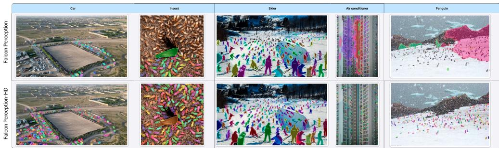  
<sup>erson</sup> <sup>standing</sup> <sup>eind</sup> <sup>oters</sup> <sup>toe</sup> <sup>ket</sup> <sup>out</sup> <sup>o</sup> <sup>ate</sup> <sup>saer</sup> <sup>si</sup> <sup>near</sup> <sup>arge</sup> <sup>si</sup> <sup>Person</sup> <sup>standing</sup> <sup>in</sup> <sup>ront</sup> <sup>o</sup> <sup>ueu</sup> <sup>se</sup>Figure 1: Falcon Perception-HD on very dense scenes. The most impressive effect of RL on top of n Falcon Perception is the ability to solve high-density perception at a scale where prior systems degrade ce<sup>p</sup>or collapse. Top: predictions of the SFT-only baseline (Falcon Perception). Bottom: predictions of <sub>o</sub>n <sup>P</sup>Falcon Perception-HD after RL post-training. The base model suffers from low recall and collapse; <sup>F</sup>RL fixes both.

<sub>-</sub>H<sup>D</sup>In contrast, RL algorithms like GRPO [42, 25, 45] enable models to explore their own predictions p<sup>t</sup>iand directly optimize set-matching rewards, raising a central question: can RL bridge the gap between P<sup>e</sup>autoregressive generation and spatial evaluation? To investigate whether RL can overcome MLE Fal<sup>c</sup>failure modes such as sequence collapse or the reliance on post-hoc heuristics like NMS, we adopt Falcon Perception [3], an early-fusion perception model [7], as our base model. Its autoregressive “chain-of-perception” architecture is well-suited for this study: it supports unbounded instance generation in extreme-density scenarios (unlike constrained query-based models such as SAM 3 [6]) and generates high-resolution masks via a parallel head, avoiding the severe rollout latency of fully tokenizing dense outputs [9]. Operating with a compact 0.6B parameter count and a robust SFT baseline, Falcon Perception provides an ideal, tractable testbed. Leveraging this hybrid design, we sample from the discrete language, center, and size heads during training while holding the continuous segmentation head fixed, thereby cleanly isolating the impact of RL on visual perception.

<sup>P</sup>POur investigation uncovers several non-trivial dynamics of RL post-training for visual perception. First, we observe a powerful cascading optimization effect: restricting RL action sampling exclusively to the discrete coordinate head is sufficient to drive holistic improvements in bounding box and mask quality. Because the chain-of-perception explicitly conditions subsequent heads on prior spatial predictions, learning to accurately point to object centers naturally forces the deterministic downstream heads to yield higher-quality masks. This effectively bypasses the need to sample a complex continuous action space. Second, the post-trained model structurally internalizes spatial suppression. It inherently learns to avoid duplicate coordinates and mask repetitions, effectively eliminating the need for post hoc heuristics such as NMS and center-deduplication thresholds. Removing these fragile hyperparameters not only accelerates inference but also resolves fundamental NMS failure modes, such as the incorrect suppression of depth-distributed or heavily overlapping objects.

Most notably, RL unlocks robust autoregressive generation in extreme-density regimes (100–600 instances per image). While standard MLE-trained models (including the strong Falcon Perception baseline) suffer from sequence collapse or severe recall degradation in crowded scenes, RL fundamentally stabilizes long-horizon spatial generation. By explicitly penalizing early termination and rewarding sustained recall, our post-training framework prevents sequence collapse and establishes state-of-the-art performance on dense benchmarks (e.g., the PBench dense split) using only 2.5k training samples.

## 2 Related Work

Autoregressive perception. Casting perception as conditional sequence generation was pioneered by Pix2Seq [9] and scaled in unified models such as Unified-IO [27, 28], OFA [46], and Florence-2 [51]. Multimodal LLMs subsequently expose detection and segmentation through grounding tokens, including LISA [19], GLaMM [37], PixelLM [40], VisionLLM-v2 [50], the Qwen-VL family [1, 47, 35], and Moondream [18]. In parallel, query-based open-vocabulary detectors [22, 30, 39, 43] and the Segment Anything family [16, 38, 6] deliver strong results but do not have a sampling capability. Falcon Perception [3], on which we build, is natively multimodal with a chain-of-perception factorization (centers, sizes, masks) and emits an unbounded number of objects. All these models, however, are trained with maximum likelihood on a fixed-order target sequence; we are, to our knowledge, the first to apply RL post-training directly to such a backbone and to show that the resulting output-format issues (mask repetition, collapse on dense scenes, dependence on NMS) are addressable with a tiny dataset compared to the pretraining and SFT corpus.

RL post-training for language models. RLHF on a learned preference model [32, 2] optimized with PPO [41], and later DPO [36], established the main LLM post-training recipes. The shift to verifiable rewards (RLVR) [20] was popularized by DeepSeek-R1 [11] via GRPO [42], spawning a wave of refinements that target entropy collapse, length bias, and credit assignment, including DAPO [52], CISPO [31], Dr.GRPO [25], and REINFORCE++ [12]. We adopt GRPO with the dualclip stabilization of VeRL [44]. However, our setting differs fundamentally from LLM post-training in two critical dimensions. First, the reward is a spatial order-invariant set-matching function (IoU and precision/recall) evaluated over continuous outputs. Second, we must apply this machinery to a heterogeneous, multi-head action space rather than a homogeneous text policy.

RL for vision language models. RL has only recently been applied to vision-language tasks. Visual-RFT [26] and Vision-R1 [13] use GRPO with rule-based rewards (IoU, accuracy) for grounding and VQA; R1-V [8], LMM-R1 [33], and VisionReasoner [24] extend the recipe to multimodal reasoning, and Seg-Zero [23] targets referring expression segmentation. Closest to our setting, the concurrent Rex-Omni [14] casts detection as next-point prediction in a 3B VLM and reaches a similar finding: teacher forcing produces duplicate predictions, which they mitigate with a GRPO stage using geometry-aware $\mathrm { F _ { 1 } }$ rewards. We go further on several fronts. Their rewards rely on ground-truth-guided greedy matching and require calling SAM to score points against masks, whereas our count reward uses a one-to-one Hungarian assignment, charges every duplicate as an explicit false positive, and requires no auxiliary model; this completely removes the need for NMS rather than merely mitigating it. Their outputs stop at points and boxes, whereas our chain-of-perception cascades from pointing to segmentation through detection. Finally, with 5× fewer parameters, Falcon Perception-HD largely outperforms Rex-Omni on PBench, especially on very dense scenes (box $\mathrm { F _ { 1 } }$ 73.9 vs 37.4 on the dense split, Appendix F). Pinto et al. [34] argued more broadly for aligning vision models with set-matching metrics rather than per-token likelihood, an observation aligning with our results. Earlier RL-for-localization work [4, 29] cast bounding-box prediction as a sequential decision process but predates autoregressive models and was confined to single-object regimes. The most conceptually aligned predecessor to our work is Pinto et al. [34], who demonstrated that autoregressive vision models (e.g., UViM [17]) can be aligned with non-differentiable set-matching metrics using REINFORCE [49], directly addressing the limitations of per-token maximum likelihood. While their findings motivate our approach, their methodology relies on fully tokenized outputs and standard policy gradients, limiting scalability. Furthermore, none of these recent or foundational works address extreme dense perception (hundreds of instances per image), the complexities of a heterogeneous, multi-head action space, or the interaction between positive and existence calibration in the openvocabulary setting. To resolve the mismatch between autoregressive generation and order-invariant evaluation, our reward design (§3.2) inherits the structural insight of DETR [5, 54, 53]. By treating detection as a set-to-set matching problem, we use the Hungarian assignment algorithm to obtain a tractable, order-invariant alignment that explicitly trades off precision for recall, thereby closing the gap left by MLE.

## 3 Method

We build our reinforcement learning framework upon Falcon Perception [3], an autoregressive multimodal model designed for open-vocabulary segmentation. For RL post-training, the critical architectural feature of this model is its structured, multi-head decoding interface. To detect and segment objects, the model emits a repeating sequence, referred to as the chain-of-perception. For each detected instance, the model predicts the fixed sub-sequence:

$$
\underbrace { w _ { 1 } , \ldots , w _ { k } } _  \mathrm { ~ \tiny ~ ( ~ N ~ t ~ o ~ k ~ e ~ n s ; ~ \ldots ~ } ; \underbrace { ( x , y ) } _ { \mathrm { ~ \tiny ~ ( ~ x ~ , ~ \underline { ~ } { ~ } t ~ e ~ n t e r ; ~ } }  ; \underbrace { ( h , w ) } _ { \mathrm { ~ \tiny ~ ( ~ b ~ o ~ x ~ s i z e ; ~ } }  ; \underbrace { m } _ { \mathrm { ~ \tiny ~ ( ~ n ~ a s k ; ~ } }  ; \cdot \cdot \cdot .\tag{1}
$$

Crucially, the tokens in this sequence are generated by different specialized heads operating over different vocabularies. Standard textual tokens such as the referring expression are sampled from a standard LM head. However, the center coordinates $( x , y )$ and bounding box dimensions $( h , w )$ are generated as categorical samples over discretized spatial bins by two independent, lightweight heads. Finally, the segmentation mask is generated deterministically by a parallel continuous head that computes the sigmoid of the inner product between the dense image features and the emitted token.

The action space of the policy $\pi _ { \theta }$ is therefore heterogeneous. Depending on the sequence position in Eq. 1, an action step requires a categorical sample over text tokens, coordinate bins, or size bins. This structural separation dictates how we must aggregate log-probabilities across distinct heads and decide which heads to explore during sampling.

## 3.1 RL objective for multi-head autoregressive perception

The objective is to maximize the expected reward

$$
\operatorname* { m a x } _ { \theta } \mathbb { E } _ { o \sim \pi _ { \theta } ( \cdot | I , q ) } \big [ r \big ( \mathrm { S e t } ( \hat { \mathcal { B } } ( o ) ) , \mathrm { S e t } ( \mathcal { B } ^ { * } ) \big ) \big ] ,\tag{2}
$$

where each rollout $o = a _ { 1 : T }$ is a complete response sampled from $\pi _ { \boldsymbol { \theta } } , \hat { B } ( o ) = \{ ( x _ { i } , y _ { i } , h _ { i } , w _ { i } , m _ { i } ) \}$ i is the set of object instances decoded from o via the chain-of-perception of Eq. 1, $B ^ { * }$ is the corresponding ground-truth set, and $r ( \cdot )$ is a single scalar set-matching reward (§3.2).

Group-relative advantages. For each prompt $( I , q )$ we sample $G = 8$ rollouts $\{ o _ { i } \} _ { i = 1 } ^ { G } \sim \pi _ { \theta }$ compute their rewards $\{ r _ { i } \}$ , and standardize within the group:

$$
\hat { A } _ { i } = \frac { r _ { i } - \mu _ { G } } { \sigma _ { G } + \epsilon } , \qquad \mu _ { G } = \textstyle { \frac { 1 } { G } } \sum _ { j } r _ { j } , \quad \sigma _ { G } ^ { 2 } = \frac { 1 } { G } \sum _ { j } ( r _ { j } - \mu _ { G } ) ^ { 2 } .\tag{3}
$$

The advantage ${ \hat { A } } _ { i }$ measures the relative reward of rollout i against its siblings on the same prompt.   
The group means serve as a learned baseline, reducing variance without a separate value function.

Multi-head log-probability. The policy gradient is weighted by the score function $\nabla _ { \theta }$ log $\pi _ { \theta } ( a _ { t } \mid$ $s _ { t } )$ , which decomposes across heads because the action space is heterogeneous:

$$
\begin{array} { r l } & { \log \pi _ { \boldsymbol { \theta } } ( a _ { t } \mid s _ { t } ) = \log \pi _ { \mathrm { L M } } ( w _ { t } \mid h _ { t } ) } \\ & { ~ + ~ { \bf 1 } [ w _ { t } = < \mathrm { c o o r d } > ] ~ \log \pi _ { \mathrm { c o o r d } } ( x _ { t } , y _ { t } \mid h _ { t } ) } \\ & { ~ + ~ { \bf 1 } [ w _ { t } = < \mathrm { s i } z \mathrm { e } > ] ~ \log \pi _ { \mathrm { s i z e } } ( h _ { t } ^ { b } , w _ { t } ^ { b } \mid h _ { t } ) . } \end{array}\tag{4}
$$

The segmentation head is deterministic and does not contribute a REINFORCE term; it is therefore frozen during RL post-training. Of the three remaining heads (LM, coord, size), we sample only the LM and coordinate heads at training temperature, and decode the size head greedily. The size head was trained by SFT to predict box dimensions conditional on a correct center via teacher-forcing; once RL improves the coordinate head, the size head receives better conditioning at inference time and produces better boxes without a direct reward signal. We refer to this as the cascade effect and validate it in §5.5, where sampling the size head also yields no additional gain.

On-policy updates with engine-mismatch importance sampling. We perform a single gradient update per rollout group, so the rollout and training policies share the same parameter checkpoint. Rollouts are nevertheless not generated by the same code path as the training-time forward pass: sampling uses a paged-attention inference engine optimized for long autoregressive decoding, while gradients are computed by torchtitan [21] training engine forward pass over packed sequences. The two engines use different attention kernels and accumulate floating-point error differently, which produces a small but nonzero discrepancy between the rollout-time log-probability log $\pi _ { \theta _ { \mathrm { r o l l o u t } } }$ and the training-time recomputation log $\pi _ { \theta }$ evaluated at the same parameters. Following the VeRL [44] implementation, we absorb this discrepancy with a detached importance sampling ratio

$$
w _ { t } ^ { ( i ) } = \mathrm { s g } \left( \frac { \pi _ { \theta } ( a _ { t } ^ { ( i ) } \mid s _ { t } ^ { ( i ) } ) } { \pi _ { \theta _ { \mathrm { r o l l o u t } } } ( a _ { t } ^ { ( i ) } \mid s _ { t } ^ { ( i ) } ) } \right) ,\tag{5}
$$

where $\operatorname { s g } ( \cdot )$ denotes stop-gradient. The per-token loss is then

$$
\ell _ { t } ^ { ( i ) } = - w _ { t } ^ { ( i ) } \cdot \hat { A } _ { i } \cdot \log \pi _ { \theta } ( a _ { t } ^ { ( i ) } \mid s _ { t } ^ { ( i ) } ) ,\tag{6}
$$

which corrects the expectation in $\operatorname { E q . 2 }$ for the engine mismatch without contributing additional gradient through the ratio itself. We tested PPO-style clipping of $w _ { t } ^ { ( i ) }$ and observed no improvement.

Length-unbiased loss aggregation (Dr. GRPO). We retain GRPO’s [42] group-standardized advantages (Eq. 3) and only modify how per-token losses are aggregated into a scalar. Standard GRPO normalizes each rollout’s contribution by its own response length, $\begin{array} { r } { \frac { 1 } { G } \sum _ { i } \frac { 1 } { T _ { i } } \sum _ { t } \ell _ { t } ^ { ( i ) } } \end{array}$ . Under this aggregation, a token in a short rollout receives $T _ { \mathrm { l o n g } } / T _ { \mathrm { s h o r t } }$ times as much gradient as a token in a long rollout at equal advantage, which biases the policy towards shorter responses. In our setting, a single positive rollout can exceed $3 \times 1 0 ^ { 4 }$ tokens, whereas a less complete one is an order of magnitude shorter, so the bias systematically discourages predicting more objects. We therefore replace the per-rollout $1 / T _ { i }$ factor with the Dr. GRPO [25] aggregation, which divides by a fixed constant $B \cdot T _ { \mathrm { m a x } }$ independent of the realized rollout lengths:

$$
\mathcal { L } _ { \mathrm { P G } } ( \boldsymbol { \theta } ) = \mathbb { E } _ { q , I } \left[ \frac { 1 } { \boldsymbol { B } \cdot \boldsymbol { T } _ { \mathrm { m a x } } } \sum _ { i = 1 } ^ { G } \sum _ { t = 1 } ^ { T _ { i } } \boldsymbol { \ell } _ { t } ^ { ( i ) } \right] .\tag{7}
$$

Each token’s gradient contribution is now independent of the length of the rollout it belongs to.

Regularization. We tested KL regularization against the SFT reference policy and per-head entropy bonuses, neither of which produced consistent reward improvements in our setting. To preserve exploration without explicit entropy bonuses, we instead use Clip-Cov [10], which zeroes the policygradient contribution of the small fraction of tokens whose log-probability and advantage are most strongly correlated. These tokens are the ones most aggressively reinforced by the standard objective and the main drivers of premature distribution sharpening; suppressing them at a small selection ratio (we use 0.0002) keeps entropy from collapsing while leaving the rest of the gradient untouched. We apply Clip-Cov per head with separate covariance bounds, [1, 5] for the LM head and [10, 50] for the coordinate head, chosen by inspecting the range of the maximum log-probability/advantage covariance for each head over early training.

## 3.2 Reward Function

The reward measures how well the predicted set of objects matches the ground-truth set. Let $\hat { B }$ and $B ^ { \star }$ denote the predicted and ground-truth instances, each represented in normalized $( x , y , h , w )$ center format with $n _ { \mathrm { p r e d } }$ and $n _ { \mathrm { g t } }$ elements, respectively. We pair predictions to ground truth by Hungarian assignment on the IoU matrix and accept only pairs whose IoU exceeds $\tau = 0 . 5$ . The number of accepted pairs is $\mathrm { T P } ;$ unmatched predictions are false positives $( \mathrm { F P } = n _ { \mathrm { p r e d } } - \mathrm { T P } )$ ), unmatched ground-truth instances are false negatives $( \mathrm { F N } = n _ { \mathrm { g t } } - \mathrm { \bar { T P } } )$ . We define

$$
r _ { \mathrm { c o u n t } } = - \big ( \mathrm { F N } + \alpha \cdot \mathrm { F P } \big ) ,\tag{8}
$$

with $\alpha = 0 . 3$ . The reward counts how many ground-truth instances are missed and weights spurious predictions by $\alpha ,$ , with no further dependence on the localization quality of accepted matches: above the IoU threshold, all matched pairs contribute equally. The asymmetry between FN (weight one) and FP (weight α) reflects that recall is the harder failure mode in the dense regime, where the model tends to under-predict; we found stronger penalties on FP not to work as well. We also experimented with finer-grained rewards that score localization quality within the matched set, e.g., the F1 score, which combines precision and recall, and the panoptic-quality reward of [34], which weights each true positive by its IoU. Neither produced consistent improvements over Eq. 8.

## 3.3 Stop-gradient on existence tokens

After the last token of the input prompt, the LM head emits one of two markers that announce whether the referred concept is present in the scene: <object\_found> or <no\_object\_found>. The remainder of the response is then either a sequence of detected objects (positive case) or the end-of-sequence token (negative case). We exclude the log-probability of these two existence markers from the policy gradient by applying a stop-gradient at those positions.

The reason is that we run RL only on positive queries: negative queries carry no useful gradient signal beyond the binary existence decision, which RL cannot improve through sampling. On every positive rollout, the existence token is by construction <object\_found>, so keeping its log-probability in the policy gradient simply reinforces this token at every step, regardless of whether the rollout earned a high or low reward. The model gradually loses the ability inherited from SFT to discriminate scenes where the referred object is absent, and MCC collapses. Stopping the gradient at these two tokens prevents this drift while allowing the rest of the LM gradient to continue refining the features that feed into the existence head. We show in §5.6 that this preserves, and in fact improves, MCC even though the policy never sees a negative query during RL. Further details in App. I.3.

## 4 Data Annotation Pipeline

We carefully design our data annotation pipeline to yield high-quality, informative training signals for both dense scenes and referring expression segmentation. Specifically, we use the base model’s own predictions, which aligns with the idea of having the model reflect on its predictions during training.

Dense scenes: To evaluate and train on highly crowded environments, our objective is to curate scenes containing upwards of 200 instances. We initially generate pseudo-labels using Falcon Perception across 2.5k curated dense images. Although Falcon Perception surpasses the strict 200-instance limit of SAM3, the raw outputs still exhibit typical failure modes: duplicated masks, fragmented predictions for a single entity, aggregated masks spanning multiple distinct instances, and entirely overlooked regions. Some of these can be observed in the top rows of Fig. 1 and supplementary Figs. 4 and 5. Consequently, we employ human annotators to refine and bootstrap these initial predictions to guarantee high fidelity.

Hard referring expression samples: To construct a dataset that provides a robust learning signal for our RL pipeline, we exploit the sampling capabilities of Falcon Perception. We perform inference on 200k image-expression pairs, generating one greedy prediction and a sampled set at pass@8 for each pair. By measuring the agreement across these rollouts, we observe two primary regimes: 1. When all predictions match, the model is highly confident; 2. when there is high variance among the rollouts, the model is uncertain. To provide a meaningful learning signal during RL post-training, we must retain only the high-variance predictions: RL relies on the ability to rank predictions within a group; indeed, if there is no reward variance, the advantages collapse to zero, and there is no gradient signal. Hence, we only focus on these high-variance samples. We provide some samples of these automatically annotated images in Fig. 2’s top row.

In the high-variance regime, we utilize GPT-5 as a judge to evaluate the correctness of the generated candidates. We deliberately discard samples where the greedy prediction is correct. Instead, we isolate instances where the greedy prediction fails, but at least one sampled rollout succeeds. This filtering strategy yields a curated dataset with 11k samples, each with guaranteed high entropy, providing an optimal and challenging learning signal for RL training.

## 5 Experiments

We use Muon ([15]) for 600 steps at a learning rate $1 0 ^ { - 5 }$ with linear decay towards $1 0 ^ { - 6 }$ . Training is done on 64 A100 GPUs, with a global batch size of 64. All the training and implementation details are provided in the supplementary.

We evaluate on two benchmarks: PBench [3], a referring expression segmentation benchmark with five difficulty levels (level-0 to level-4, ranging from short noun phrases to long compositional expressions) and a dedicated dense split where each image contains up to 500 instances of the queried category; and SACO [6], a seven-split benchmark (attributes, crowded, food, metaclip, sa1b, sport, wiki\_common). PBench is evaluated using COCO-style macro-F1, averaging over thresholds from 0.5 to 0.95, except on the dense split, where we use 0.5. For SACO, which contains negative queries, we report macro-F1, pmF1, and MCC between −1 and 1, measuring the model’s ability to determine whether the concept exists in the scene.

## 5.1 Main Results

Table 1 reports a state-of-the-art comparison on PBench. We observe improvements across all levels of difficulty; for instance, on level 4 (the most difficult relational expressions), Falcon Perception-HD improves by 2.7 F<sub>1</sub> points, surpassing generalist VLMs like Qwen3-VL-8B that are more than 10× larger. In Fig. 3, we show image-query pairs demonstrating how RL resolves these hard referring expressions (additional qualitative examples across levels 0–4 are provided in Figs. 6 and 7 of the appendix). Overall, the model improves by an average of 2.6 points, establishing Falcon Perception-HD as the new state-of-the-art on this benchmark. Additional comparisons on external dense benchmarks (COCO-dense, LVIS-dense, and Dense200) are provided in Appendix F.

Table 3 presents results on SACO. Falcon Perception-HD improves upon the base model by 1.7 points in macro-F1 and pmF1, and by 2% in MCC. As described below, the main source of performance on this benchmark is MCC, because if we sample queries correctly as positives more often, macro-F1 and pmF1 will naturally increase. MCC is not a metric that can be improved via RL, as it is a classification problem; we still observe improvements in this metric after RL, which we believe is due to improved numerical stability from entropy reduction. Overall, Falcon Perception-HD sets a new state-of-the-art in macro-F1 and closes the gap with SAM3 in pmF1, while improving the base model’s good object discrimination capabilities.

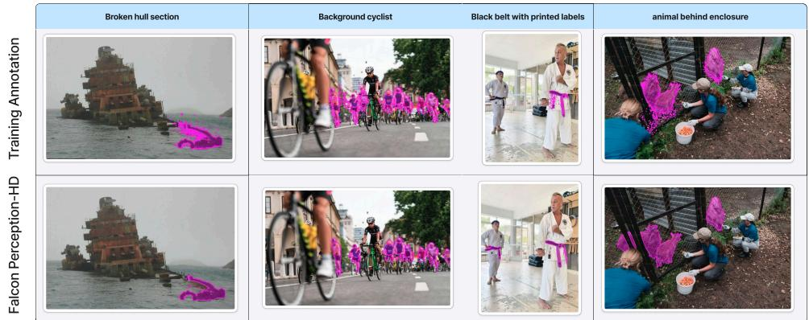  
Figure 2: Predictions exceed the annotations. Original training annotations (top) vs. Falcon Perception-HD predictions (bottom).

<sup>ar</sup> Table 1: PBench results (mask $\mathbf { F } _ { 1 } ) .$ <sup>nsect</sup> . COCO-style macro-F averaged over IoU thresholds 0.5:0.95 on levels 0–4, and $\mathrm { F _ { 1 } } @ 0 . 5$ on the dense ti<sup>o</sup>split; all models are evaluated with their default post-processing. Avg <sub>r</sub>c<sup>e</sup>is the unweighted mean over the six splits. <sup>∗</sup> Reproduced results. Fal-<sup>P</sup>con Perception-HD outperforms all baselines on average, primarily lcdriven by massive gains on the Dense split.  
<sup>kier</sup> Table 2: Cascade-effect ablation. Avg $\mathrm { F _ { 1 } }$ on PBench in a reduced-compute setting. Sampling only LM+coord matches LM+coord+size, proving improvements naturally cascade to the size head.  
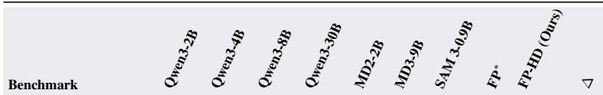

<table><tr><td colspan="10">PBench</td></tr><tr><td>L0: Simple objects</td><td>54.1</td><td>67.3</td><td>65.6</td><td>69.2</td><td>68.0</td><td>63.2</td><td>64.3</td><td>63.7</td><td>64.9</td><td>+1.1</td></tr><tr><td>L1: Attribute</td><td>50.1</td><td>63.9</td><td>65.6</td><td>68.8</td><td>58.4</td><td>59.6</td><td>54.4</td><td>63.8</td><td>64.2</td><td>+0.5</td></tr><tr><td>L2: OCR guided</td><td>41.2</td><td>58.2</td><td>58.2</td><td>61.2</td><td>46.6</td><td>41.8</td><td>24.6</td><td>38.3</td><td>40.4</td><td>+2.1</td></tr><tr><td>L3: Spatial understand.</td><td>35.1</td><td>49.0</td><td>49.1</td><td>52.9</td><td>43.8</td><td>45.4</td><td>31.6</td><td>53.4</td><td>54.7</td><td>+1.3</td></tr><tr><td>L4: Relation binding</td><td>36.7</td><td>48.3</td><td>50.9</td><td>55.2</td><td>36.9</td><td>42.3</td><td>33.3</td><td>49.1</td><td>51.8</td><td>+2.7</td></tr><tr><td>Dense</td><td>4.6</td><td>8.4</td><td>4.7</td><td>8.9</td><td>14.2</td><td>12.9</td><td>58.4</td><td>72.3</td><td>80.5</td><td>+8.2</td></tr><tr><td>Average</td><td>37.0</td><td>49.2</td><td>49.0</td><td>52.7</td><td>44.7</td><td>50.5</td><td>44.4</td><td>56.8</td><td>59.4</td><td>+2.6</td></tr></table>

<table><tr><td>Sampled heads</td><td>Avg F1</td></tr><tr><td>Falcon Perc. (pre-RL)</td><td>56.8</td></tr><tr><td>+ RL, center only</td><td>57.8</td></tr><tr><td>+ RL, LM+center+size</td><td>58.1</td></tr><tr><td>+ RL, LM+center (Ours)</td><td>58.2</td></tr></table>

## p<sup>t</sup>5.2 Unlocking High-Density Perception

<sub>P</sub><sup>e</sup>The most significant effect of RL post-training occurs in very dense scenes, where most perception omodels either degrade sharply or collapse. While the base Falcon Perception is already the best model F<sup>a</sup>on the PBench dense split, it still misses objects and occasionally collapses. Falcon Perception-HD essentially eliminates these failure modes, improving macro-F1 by 8.2 points and achieving a scale of dense perception unmatched by prior systems (see Fig. 1 and Figs. 4 and 5 of the appendix). As Hshown in Table 4, the RL gain grows monotonically with scene density, scaling from +1.5 (0–2 ioobjects) to +21.5 (300+ objects). Note that Table 4 and Table 1 report the same predictions under <sub>c</sub>etwo aggregation schemes, by ground-truth object count and by PBench split respectively, which is P<sup>e</sup>why the two averages differ. This is driven by the policy gradient naturally suppressing rollouts that <sub>c</sub><sup>o</sup>under-cover the scene (via negative within-group advantages), directly penalizing premature sequence Ftermination without explicit heuristics (see Fig. 8).

## 5.3 Learned NMS: RL removes the need for inference-time deduplication

Falcon-Perception relies on two post-processing steps to produce clean detection sets: a centerdeduplication pass that drops predicted objects whose coordinates fall within a tunable bin distance of an earlier prediction, and non-maximum suppression (NMS) that removes duplicate masks above an IoU threshold (usually 0.5). Both are heuristics with thresholds that have to be tuned, and both can destroy genuine detections, e.g., NMS suppresses true overlapping instances such as objects close in the image plane or aligned in depth. We show that RL post-training removes the need for both by producing a policy whose output distribution is already deduplicated. The mechanism is visible at the rollout level: some rollouts emit near-duplicate predictions at slightly perturbed coordinates, each duplicate is matched as a Hungarian false positive, and the policy gradient suppresses these rollouts via a negative within-group advantage. We illustrate this in Fig. 8 of the appendix. We measure the resulting behavior using the mask redundancy rate (MRR), defined as the fraction of predicted masks suppressed by greedy NMS at an IoU threshold of $\tau = 0 . 5$

Table 3: SA-Co Benchmark Results. Comparison of Falcon Perception against state-of-the-art openvocabulary segmentation models. We report Macro $\mathrm { F _ { 1 } } .$ , Positive Micro $\mathrm { F _ { 1 } }$ (pmF<sub>1</sub>), and Image-Level MCC across all splits. <sup>∗</sup> reproduced results.
<table><tr><td rowspan="2">Model</td><td rowspan="2">F1</td><td colspan="2">Average</td><td colspan="2">Metaclip F1</td><td colspan="2"></td><td colspan="2">SA-1B</td><td colspan="2">Crowded</td><td colspan="2"></td><td colspan="2">Food&amp;Drink</td><td colspan="2">Sports Equip.</td><td colspan="2">Attributes</td><td colspan="2"></td><td colspan="2">Wiki-Common</td></tr><tr><td>pmF1</td><td></td><td>MCC</td><td>pmF1</td><td>MCC</td><td>F1</td><td>pmF1</td><td>MCC</td><td>F1</td><td>pmF1</td><td>MCC</td><td>F1</td><td>pmF1</td><td>MCC</td><td>F1</td><td>pmF1</td><td>MCC</td><td>F1</td><td>pmF1</td><td>MCC</td><td>F1</td><td>pmF1 MCC</td></tr><tr><td>SAM 3 [6]</td><td>62.3 66.1</td><td>0.81</td><td>56.0</td><td>58.6</td><td>0.81</td><td>68.3</td><td>62.6</td><td>0.86</td><td>62.7</td><td>67.7</td><td>0.90</td><td>58.1</td><td>67.3</td><td>0.79</td><td>71.2</td><td>73.8</td><td>0.89</td><td>71.1</td><td>72.0</td><td>0.76</td><td>49.0</td><td>60.9 0.66</td></tr><tr><td>Falcon Perception*</td><td>67.0</td><td>62.2</td><td>0.60</td><td>57.4 51.3</td><td>0.59</td><td>62.5</td><td>50.2</td><td>0.72</td><td>59.3</td><td>58.8</td><td>0.64</td><td>70.3</td><td>68.4</td><td>0.58</td><td>75.1 73.0</td><td>0.71</td><td>79.3</td><td>70.9</td><td>0.58</td><td>64.8</td><td>63.0</td><td>0.35</td></tr><tr><td>Falcon Perception-HD (Ours)</td><td>68.7</td><td>63.9</td><td>0.62</td><td>64.8</td><td>56.3</td><td>0.66 63.4</td><td>52.4</td><td>0.72</td><td>59.7</td><td>59.3</td><td>0.67</td><td>72.8</td><td>71.8</td><td>0.59</td><td>75.0 72.9</td><td>0.74</td><td>79.9</td><td>71.2</td><td>0.60</td><td>65.0</td><td>63.2</td><td>0.37</td></tr></table>

Table 4: PBench segmentation $\mathbf { F } _ { 1 }$ by ground-truth object count. The improvement from RL post-training grows monotonically with scene density.
<table><tr><td>Model</td><td>0-2</td><td>2-5</td><td>5-10</td><td>10-20</td><td>20-50</td><td>50-100</td><td>100-200</td><td>200-300</td><td>300+</td><td>Avg</td></tr><tr><td>Falcon Perception</td><td>54.9</td><td>54.6</td><td>60.2</td><td>61.4</td><td>63.5</td><td>78.7</td><td>76.5</td><td>67.4</td><td>55.9</td><td>63.7</td></tr><tr><td>Falcon Perception-HD</td><td>56.4</td><td>55.8</td><td>60.9</td><td>63.8</td><td>65.6</td><td>81.2</td><td>81.7</td><td>79.5</td><td>77.3</td><td>69.1</td></tr><tr><td>Δ</td><td>+1.5</td><td>+1.2</td><td>+0.6</td><td>+2.4</td><td>+2.1</td><td>+2.5</td><td>+5.2</td><td>+12.2</td><td>+21.5</td><td>+5.5</td></tr></table>

We provide two ablations: Table 5 strips coordinate deduplication on PBench: Falcon Perception loses 7.5 F on the dense split (and 1.4 on average) because the base model genuinely relies on the coord-dedup heuristic to clean up its outputs, while Falcon Perception-HD is essentially constant (−0.2 on dense); Table 6 is the corresponding test on SACO, with both post-processing steps toggled. The MRR is the clearest evidence: with NMS active, the base model already has 5.7% redundant masks, while Falcon Perception-HD has 0.7%; removing coord dedup pushes the base model to 39.2%, while Falcon Perception-HD only drifts to 2.1%. The collapse propagates to pmF1: removing both post-processing steps drops Falcon Perception by 12.0 points (from 62.6 to 50.7), while Falcon Perception-HD loses only 0.4 points (from 63.9 to 63.5). In Appendix G, we contrast this with DETR-style models, which solve repetition natively via bipartite matching but, as we show with a pass@k study on SAM 3, do not benefit from RL post-training.

## 5.4 Disentangling RL from the curated data

Our RL data is partly bootstrapped from Falcon Perception itself (§4), so we disentangle the contribution of the curated data from that of the RL objective. We run one epoch of SFT on the exact same curated data and compare it against RL, on PBench (Table 7) and SACO (Table 8). SFT on this heavily dense data improves the dense split but degrades levels 1 and 2, and, more importantly, worsens over-generation: masks per image go from 182 to 248, MRR without deduplication jumps from 35.1% to 46.4%, and stripping NMS and deduplication now costs 14.8 dense $\mathrm { F _ { 1 } }$ points against 7.0 for the base model. Post-training this SFT model with GRPO (SFT → RL) not only improves all levels but entirely fixes the repetition issues that SFT worsened. Duplicate detections also translate into latency: the SFT model takes 55.8s per dense image, compared to 33.6s for Falcon Perception-HD. Hence, the curated data alone does not explain our results: RL post-trained models are the only ones unaffected by mask repetition, whether initialized from the base model or from the curated-data SFT.

## 5.5 The cascade effect

Here, we verify our decision to sample rollouts and compute policy gradients only over text tokens and center coordinates, while greedily selecting bounding box sizes. In Table 2 we compare three configurations: (i) center only, where the LM head is decoded greedily and only the coordinate head is sampled; (ii) LM + center (our default), where both the LM and the center heads are sampled, and the size head is greedy; and (iii) LM + center + size, where all three discrete heads are sampled. To keep the comparison tractable, this ablation is run in a reduced-compute setting.

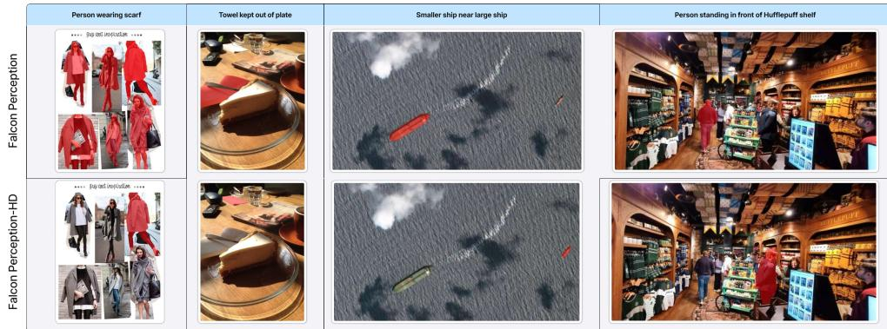  
Figure 3: PBench level 4 (relation binding) qualitative results. Falcon Perception (top) vs. Falcon Perception-HD (bottom). RL improves on the hardest compositional referring expressions, where the SFT-only model tends to under/over-segment, miss the correct relational referent, or hallucinate.

Table 5: $\mathbf { F } _ { 1 }$ scores with/without coordinate deduplication. Stripping coord dedup costs the SFT baseline 7.5 $\mathrm { F _ { 1 } }$ points on the dense split, as it predicts redundant, overlapping centers for the same object. However, Falcon Perception-HD is essentially un-Purple o o <sub>Purple</sub> <sub>o</sub> <sub>o</sub>changed (−0.2); RL has naturally internalized the spatial suppression that the base model offloaded to postprocessing heuristics.  
Table 6: SACO post-processing ablation. pmF1 and mask redundancy rate (MRR, %). RL post-training removes the dependence on both post-processing steps: stripping them drops Falcon Perception by 12 pmF1 points ottle on the right o with leaf figure <sub>ottle</sub> <sub>on</sub> <sub>the</sub> <sub>right o</sub> <sub>with</sub> <sub>leaf</sub> <sub>figure</sub>(yielding 36.2% redundancy), but barely affects Falcon Perception-HD (−0.4 pmF1, 2.1% MRR).
<table><tr><td>Model</td><td>Dedup</td><td>L0</td><td>L1</td><td>L2</td><td>L3</td><td>L4</td><td>Dense</td><td>Avg</td></tr><tr><td>Falcon Perc.</td><td>√</td><td>63.7</td><td>63.8</td><td>38.3</td><td>53.4</td><td>49.1</td><td>72.3</td><td>56.8</td></tr><tr><td>Falcon Perc.</td><td>X</td><td>63.6</td><td>63.5</td><td>38.3</td><td>53.4</td><td>49.0</td><td>64.8</td><td>55.4</td></tr><tr><td>∆ Falcon Perc.</td><td></td><td>-0.2</td><td>-0.3</td><td>0.0</td><td>0.0</td><td>-0.1</td><td>–7.5</td><td>-1.4</td></tr><tr><td>FP-HD (Ours)</td><td>√</td><td>64.9</td><td>64.2</td><td>40.4</td><td>54.7</td><td>51.8</td><td>80.5</td><td>59.4</td></tr><tr><td>FP-HD (Ours)</td><td>X</td><td>64.8</td><td>64.3</td><td>40.4</td><td>54.7</td><td>51.8</td><td>80.2</td><td>59.4</td></tr><tr><td>∆ FP-HD</td><td></td><td>-0.1</td><td>+0.1</td><td>0.0</td><td>0.0</td><td>0.0</td><td>-0.2</td><td>0.0</td></tr></table>

<table><tr><td>Setting</td><td colspan="2">Falcon Perc.</td><td colspan="2">FP-HD (Ours)</td></tr><tr><td></td><td>pmF1↑</td><td>MRR↓</td><td>pmF1 ↑</td><td>MRR↓</td></tr><tr><td>Dedup + NMS</td><td>62.2</td><td>5.7%</td><td>63.9</td><td>0.7%</td></tr><tr><td>No NMS</td><td>61.2</td><td></td><td>63.7</td><td></td></tr><tr><td>No dedup</td><td>62.6</td><td>36.2%</td><td>63.9</td><td>2.1%</td></tr><tr><td>No post-proc</td><td>50.7</td><td></td><td>63.5</td><td></td></tr><tr><td>∆ default → none</td><td>-12.0</td><td></td><td>-0.4</td><td></td></tr></table>

First, while sampling only the coordinate head provides a strong baseline by improving localization, jointly sampling the LM head yields further gains. This is because the LM head explicitly controls sequence termination; exploring its action space allows the policy to learn better stopping criteria and improve recall in dense scenes. Second, extending sampling to the size head yields no additional benefit: LM + coord + size performs identically to LM + coord. This confirms the cascading optimization effect discussed in §3.1. Because the architecture conditions subsequent heads on prior spatial predictions, improved center localization tightens the hidden state read by the downstream heads. This dynamic is visible during training: the size-head entropy decays in tandem with the LM and coordinate heads despite receiving no direct policy-gradient updates (Fig. 11).

Table 9 quantifies this effect. RL reduces the coordinate-head entropy by 63% and, although the size head is frozen and decoded greedily, its entropy drops by 21% as well, even though it never receives gradients. The SFT row is a controlled comparison: same initialization, same curated data, only the objective differs. Entropy barely moves on the coordinate head (−4%) and goes the wrong way on the size head (+8%), so the convergence observed in Fig. 11 is attributable to the RL objective and not to the data. While entropy collapse is a failure mode to be mitigated in the reasoning and RLHF literature [10], since it forecloses the exploration and output diversity desired for math or coding, we argue it is a desirable property in dense perception: the set-level reward under on-policy sampling concentrates the policy on a single correct layout, and this reduction in uncertainty is precisely the mechanism that resolves duplication and premature termination.

Table 7: Disentangling RL from the curated data, PBench. $\mathrm { F _ { 1 } }$ per split, MRR with and without coordinate deduplication (IoU τ=0.5), dense $\mathrm { F _ { 1 } }$ without NMS or deduplication and its gap $\Delta$ to the default setting, average predicted masks per image and per-image latency on the dense split. SFT on the curated data amplifies over-generation and the dependence on post-processing; only RL removes both.
<table><tr><td>Run</td><td>Data</td><td>Objective</td><td>L0</td><td>L1</td><td>L2</td><td>L3</td><td>L4</td><td>Dense</td><td>Avg</td><td>MRR</td><td>MRR (no dedup)</td><td>Dense F1 (no post-proc)</td><td> $\Delta$ </td><td>Masks /img</td><td>Lat.</td></tr><tr><td>SFT init (pre-RL)</td><td>original</td><td>MLE</td><td>63.8</td><td>63.8</td><td>38.3</td><td>53.4</td><td>49.1</td><td>71.9</td><td>56.7</td><td>1.58%</td><td>35.1%</td><td>64.9</td><td>-7.0</td><td>182</td><td>39.6s</td></tr><tr><td>SFT, 1 epoch</td><td>curated</td><td>MLE</td><td>63.9</td><td>62.7</td><td>37.6</td><td>54.2</td><td>48.9</td><td>77.3</td><td>57.4</td><td>2.52%</td><td>46.4%</td><td>62.5</td><td>-14.8</td><td>248</td><td>55.8s</td></tr><tr><td>SFT → RL</td><td>curated</td><td>GRPO</td><td>64.2</td><td>63.5</td><td>39.1</td><td>54.6</td><td>50.4</td><td>80.9</td><td>58.8</td><td>0.61%</td><td>5.13%</td><td>80.4</td><td>-0.5</td><td>165</td><td>38.2s</td></tr><tr><td>FP-HD (Ours)</td><td>curated</td><td>GRPO</td><td>64.9</td><td>64.2</td><td>40.4</td><td>54.7</td><td>51.8</td><td>80.5</td><td>59.4</td><td>0.22%</td><td>3.19%</td><td>78.8</td><td>-1.7</td><td>156</td><td>33.6s</td></tr></table>

Table 8: Disentangling RL from the curated data, SACO. SFT on the curated data raises redundancy without deduplication from 34.3% to 42.6%, while both RL post-trained models reduce it.
<table><tr><td>Run</td><td>Objective</td><td> $\mathbf { A v g } \mathbf { F } _ { 1 }$ </td><td>MRR</td><td>MRR (no dedup)</td><td> $\mathbf { F } _ { 1 }$  (no post-proc)</td><td> $\Delta$ </td><td>MCC</td></tr><tr><td>SFT init (pre-RL)</td><td>MLE</td><td>67.0</td><td>5.73%</td><td>34.3%</td><td>65.5</td><td>-1.5</td><td>59.6</td></tr><tr><td>SFT, 1 epoch</td><td>MLE</td><td>67.5</td><td>9.57%</td><td>42.6%</td><td>67.1</td><td>-0.4</td><td>58.2</td></tr><tr><td>SFT → RL</td><td>GRPO</td><td>68.3</td><td>0.74%</td><td>11.4%</td><td>68.1</td><td>-0.2</td><td>58.9</td></tr><tr><td>FP-HD (Ours)</td><td>GRPO</td><td>68.7</td><td>0.76%</td><td>1.7%</td><td>68.6</td><td>-0.1</td><td>62.0</td></tr></table>

Crucially, this cascade effect also improves the frozen continuous segmentation head. As shown in Fig. 2, Falcon Perception-HD generates higher-quality, contiguous masks than those present in its own rollout annotations, effectively filtering out the "salt and pepper" noise found in the ground truth. This demonstrates that reducing uncertainty at the start of the chain-of-perception (the object center) fundamentally stabilizes the entire spatial pipeline.

## 5.6 Preserving existence calibration via gradient detachment

In Table 10, we present the ablation on detaching the existence-token logprobs from the policy gradient to preserve the SFT-learned existence boundary. We observe that without stop-gradient, RL collapses MCC across all SACO splits: the average drops from 59.6 (pre-RL) to 38.8. The collapse leads to a misleading rise in pmF1 (62.2 → 66.0) and macro $\mathrm { F _ { 1 } } ( 6 7 . 0  7 3 . 3 )$ because the policy learns to emit “object found” indiscriminately, inflating positive-class scores and destroying the existence calibration that MCC actually measures. This is because the model becomes overoptimistic: it only sees positive samples during RL, and the existence token is consistently reinforced at the expense of the non-existence token. As a byproduct, pmF1 is artificially inflated because the model predicts masks on more samples. Detaching the existence-token logprobs removes this perturbation and even yields better MCC performance than the base model. Detachment reverses both effects simultaneously: MCC recovers and even improves above pre-RL on every split (average 59.6 → 62.2), while pmF1 and macro $\mathrm { F _ { 1 } }$ also rise but more modestly. This also highlights, as noted previously, that MCC is the main driver of performance on SACO: in this setting the base model is already good enough when it decides to predict masks.

## 6 Conclusion

In this paper, we presented Falcon Perception-HD, demonstrating that reinforcement learning can fundamentally align autoregressive perception models with order-invariant spatial metrics. Rather than treating RL simply as a minor post-processing step, we showed that it resolves structural flaws inherent in Maximum Likelihood training. By efficiently restricting action sampling to the discrete spatial heads and applying a set-matching reward, we showed that an autoregressive policy can internalize spatial suppression, thereby replacing fragile heuristics such as NMS and center deduplication. Most importantly, our framework unlocks robustness in extreme-density regimes (up to 500 instances), solving the sequence collapse typical for long-horizon spatial generation. Ultimately, Falcon Perception-HD suggests that post-training is not just for language reasoning; it is a critical, scalable pathway for building robust perception models that no longer rely on inference-time heuristics.

Table 9: Mean policy entropy of the coordinate and size heads. The size head is frozen and decoded greedily, yet RL reduces its entropy through the cascade effect. One epoch of SFT on the same data leaves both entropies essentially unchanged.
<table><tr><td>Model</td><td>Coord head</td><td>Size head</td></tr><tr><td>SFT init (pre-RL)</td><td>1.431</td><td>2.197</td></tr><tr><td>SFT, 1 epoch, same data</td><td>1.370 (−4%)</td><td>2.365 (+8%)</td></tr><tr><td>FP-HD (RL)</td><td>0.526 (-63%)</td><td>1.729 (-21%)</td></tr></table>

Table 10: Impact of existence-token detachment on MCC. Without the stop-gradient on the “object found”/“no object found” tokens, RL collapses MCC across every split (the policy emits “found” indiscriminately, which inflates pmF1/macro-F but destroys the existence calibration MCC measures). With detachment, MCC improves above the pre-RL baseline on every split.
<table><tr><td>Model</td><td>Attributes</td><td>Crowded</td><td>Food</td><td>MetaCLIP</td><td>SA-1B</td><td>Sport</td><td>Wiki</td><td>Avg MCC</td><td>Avg pmF1</td></tr><tr><td>Falcon Perception (pre-RL)</td><td>57.8</td><td>63.9</td><td>58.3</td><td>59.0</td><td>71.5</td><td>71.5</td><td>35.2</td><td>59.6</td><td>62.2</td></tr><tr><td>+ RL, no detach</td><td>38.5</td><td>37.3</td><td>31.8</td><td>39.6</td><td>56.8</td><td>49.2</td><td>18.6</td><td>38.8</td><td>66.0</td></tr><tr><td>+ RL, with detach (ours)</td><td>60.1</td><td>66.7</td><td>59.5</td><td>66.1</td><td>72.3</td><td>73.6</td><td>37.4</td><td>62.2</td><td>63.9</td></tr></table>

## References

[1] Jinze Bai, Shuai Bai, Shusheng Yang, Shijie Wang, Sinan Tan, Peng Wang, Junyang Lin, Chang Zhou, and Jingren Zhou. Qwen-VL: A versatile vision-language model for understanding, localization, text reading, and beyond. arXiv preprint arXiv:2308.12966, 2023.

[2] Yuntao Bai, Andy Jones, Kamal Ndousse, Amanda Askell, Anna Chen, Nova DasSarma, Dawn Drain, Stanislav Fort, Deep Ganguli, Tom Henighan, et al. Training a helpful and harmless assistant with reinforcement learning from human feedback. arXiv preprint arXiv:2204.05862, 2022.

[3] Aviraj Bevli, Sofian Chaybouti, Yasser Dahou, Hakim Hacid, Ngoc Dung Huynh, Phuc H. Le Khac, Sanath Narayan, Wamiq Reyaz Para, and Ankit Singh. Falcon perception. arXiv preprint arXiv:2603.27365, 2026. https://huggingface.co/tiiuae/ Falcon-Perception.

[4] Juan C. Caicedo and Svetlana Lazebnik. Active object localization with deep reinforcement learning. In International Conference on Computer Vision (ICCV), 2015.

[5] Nicolas Carion, Francisco Massa, Gabriel Synnaeve, Nicolas Usunier, Alexander Kirillov, and Sergey Zagoruyko. End-to-end object detection with transformers. In European Conference on Computer Vision (ECCV), 2020.

[6] Nicolas Carion, Laura Gustafson, Yuan-Ting Hu, Shoubhik Debnath, Ronghang Hu, Didac Suris, Chaitanya Ryali, Kalyan Vasudev Alwala, Haitham Khedr, Andrew Huang, et al. Sam 3: Segment anything with concepts. arXiv preprint arXiv:2511.16719, 2025.

[7] Sofian Chaybouti, Sanath Narayan, Yasser Dahou, Phúc H Lê Khac, Ankit Singh, Ngoc Dung Huynh, Wamiq Reyaz Para, Hilde Kuehne, and Hakim Hacid. Siglino: Efficient multi-teacher distillation for agglomerative vision foundation models. arXiv preprint arXiv:2512.20157, 2025.

[8] Liang Chen, Lei Li, Haozhe Zhao, Yifan Song, and Vinci. R1-V: Reinforcing super generalization ability in vision-language models with less than \$3. https://github.com/Deep-Agent/ R1-V, 2025.

[9] Ting Chen, Saurabh Saxena, Lala Li, David J Fleet, and Geoffrey Hinton. Pix2seq: A language modeling framework for object detection. International Conference on Learning Representations, 2022.

[10] Ganqu Cui, Yuchen Zhang, Jiacheng Chen, Lifan Yuan, Zhi Wang, Yuxin Zuo, Haozhan Li, Yuchen Fan, Huayu Chen, Weize Chen, et al. The entropy mechanism of reinforcement learning for reasoning language models. arXiv preprint arXiv:2505.22617, 2025.

[11] Daya Guo, Dejian Yang, Haowei Zhang, Junxiao Song, Peiyi Wang, Qihao Zhu, Runxin Xu, Ruoyu Zhang, Shirong Ma, Xiao Bi, et al. Deepseek-r1: Incentivizing reasoning capability in llms via reinforcement learning. arXiv preprint arXiv:2501.12948, 2025.

[12] Jian Hu. REINFORCE++: A simple and efficient approach for aligning large language models. arXiv preprint arXiv:2501.03262, 2025.

[13] Wenxuan Huang, Bohan Jia, Zijie Zhai, Shaosheng Cao, Zoey Ye, Fei Zhao, Yaoyao Hu, and Shaohui Lin. Vision-R1: Incentivizing reasoning capability in multimodal large language models. arXiv preprint arXiv:2503.06749, 2025.

[14] Qing Jiang, Junan Huo, Xingyu Chen, Yuda Xiong, Zhaoyang Zeng, Yihao Chen, Tianhe Ren, Junzhi Yu, and Lei Zhang. Detect anything via next point prediction. In Proceedings of the IEEE/CVF Conference on Computer Vision and Pattern Recognition, pages 25472–25483, 2026.

[15] Keller Jordan, Yuchen Jin, Vlado Boza, You Jiacheng, Franz Cesista, Laker Newhouse, and Jeremy Bernstein. Muon: An optimizer for hidden layers in neural networks, 2024. URL https://kellerjordan. github. io/posts/muon, 6(3):4, 2024.

[16] Alexander Kirillov, Eric Mintun, Nikhila Ravi, Hanzi Mao, Chloe Rolland, Laura Gustafson, Tete Xiao, Spencer Whitehead, Alexander C. Berg, Wan-Yen Lo, Piotr Dollár, and Ross Girshick. Segment anything. In International Conference on Computer Vision (ICCV), 2023.

[17] Alexander Kolesnikov, André Susano Pinto, Lucas Beyer, Xiaohua Zhai, Jeremiah Harmsen, and Neil Houlsby. Uvim: A unified modeling approach for vision with learned guiding codes. Advances in Neural Information Processing Systems, 35:26295–26308, 2022.

[18] Vikhyat Korrapati. Moondream: A tiny vision language model. https://moondream.ai, 2024.

[19] Xin Lai, Zhuotao Tian, Yukang Chen, Yanwei Li, Yuhui Yuan, Shu Liu, and Jiaya Jia. LISA: Reasoning segmentation via large language model. In Conference on Computer Vision and Pattern Recognition (CVPR), 2024.

[20] Nathan Lambert, Jacob Morrison, Valentina Pyatkin, Shengyi Huang, Hamish Ivison, Faeze Brahman, Lester James V. Miranda, Alisa Liu, Nouha Dziri, Shane Lyu, Yuling Gu, Saumya Malik, Victoria Graf, Jena D. Hwang, Jiangjiang Yang, Ronan Le Bras, Oyvind Tafjord, Chris Wilhelm, Luca Soldaini, Noah A. Smith, Yizhong Wang, Pradeep Dasigi, and Hannaneh Hajishirzi. Tulu 3: Pushing frontiers in open language model post-training.¨ arXiv preprint arXiv:2411.15124, 2024.

[21] Wanchao Liang, Tianyu Liu, Less Wright, Will Constable, Andrew Gu, Chien-Chin Huang, Iris Zhang, Wei Feng, Howard Huang, Junjie Wang, et al. Torchtitan: One-stop pytorch native solution for production ready llm pre-training. In International Conference on Learning Representations (ICLR), 2025.

[22] Shilong Liu, Zhaoyang Zeng, Tianhe Ren, Feng Li, Hao Zhang, Jie Yang, Chunyuan Li, Jianwei Yang, Hang Su, Jun Zhu, and Lei Zhang. Grounding DINO: Marrying DINO with grounded pre-training for open-set object detection. In European Conference on Computer Vision (ECCV), 2024.

[23] Yuqi Liu, Bohao Peng, Zhisheng Zhong, Zihao Yue, Fanbin Lu, Bei Yu, and Jiaya Jia. Seg-Zero: Reasoning-chain guided segmentation via cognitive reinforcement. arXiv preprint arXiv:2503.06520, 2025.

[24] Yuqi Liu, Tianyuan Qu, Zhisheng Zhong, Bohao Peng, Shu Liu, Bei Yu, and Jiaya Jia. Vision-Reasoner: Unified visual perception and reasoning via reinforcement learning. arXiv preprint arXiv:2505.12081, 2025.

[25] Zichen Liu, Changyu Chen, Wenjun Li, Penghui Qi, Tianyu Pang, Chao Du, Wee Sun Lee, and Min Lin. Understanding R1-Zero-like training: A critical perspective. arXiv preprint arXiv:2503.20783, 2025.

[26] Ziyu Liu, Zeyi Sun, Yuhang Zang, Xiaoyi Dong, Yuhang Cao, Haodong Duan, Dahua Lin, and Jiaqi Wang. Visual-RFT: Visual reinforcement fine-tuning. arXiv preprint arXiv:2503.01785, 2025.

[27] Jiasen Lu, Christopher Clark, Rowan Zellers, Roozbeh Mottaghi, and Aniruddha Kembhavi. Unified-IO: A unified model for vision, language, and multi-modal tasks. In International Conference on Learning Representations (ICLR), 2023.

[28] Jiasen Lu, Christopher Clark, Sangho Lee, Zichen Zhang, Savya Khosla, Ryan Marten, Derek Hoiem, and Aniruddha Kembhavi. Unified-IO 2: Scaling autoregressive multimodal models with vision, language, audio, and action. In Conference on Computer Vision and Pattern Recognition (CVPR), 2024.

[29] Stefan Mathe, Aleksis Pirinen, and Cristian Sminchisescu. Reinforcement learning for visual object detection. Conference on Computer Vision and Pattern Recognition (CVPR), 2016.

[30] Matthias Minderer, Alexey Gritsenko, and Neil Houlsby. Scaling open-vocabulary object detection. In Advances in Neural Information Processing Systems (NeurIPS), 2024.

[31] MiniMax. MiniMax-M1: Scaling test-time compute efficiently with lightning attention. arXiv preprint arXiv:2506.13585, 2025.

[32] Long Ouyang, Jeffrey Wu, Xu Jiang, Diogo Almeida, Carroll L. Wainwright, Pamela Mishkin, Chong Zhang, Sandhini Agarwal, Katarina Slama, Alex Ray, et al. Training language models to follow instructions with human feedback. In Advances in Neural Information Processing Systems (NeurIPS), 2022.

[33] Yingzhe Peng, Gongrui Zhang, Miaosen Zhang, Zhiyuan You, Jie Liu, Qipeng Zhu, Kai Yang, Xingzhong Xu, Xin Geng, and Xu Yang. LMM-R1: Empowering 3b LMMs with strong reasoning abilities through two-stage rule-based RL. arXiv preprint arXiv:2503.07536, 2025.

[34] André Susano Pinto, Alexander Kolesnikov, Yuge Shi, Lucas Beyer, and Xiaohua Zhai. Tuning computer vision models with task rewards. In International Conference on Machine Learning, pages 33229–33239. PMLR, 2023.

[35] Qwen Team. Qwen3-VL technical report. https://qwenlm.github.io/blog/qwen3-vl/, 2025.

[36] Rafael Rafailov, Archit Sharma, Eric Mitchell, Stefano Ermon, Christopher D. Manning, and Chelsea Finn. Direct preference optimization: Your language model is secretly a reward model. In Advances in Neural Information Processing Systems (NeurIPS), 2023.

[37] Hanoona Rasheed, Muhammad Maaz, Sahal Shaji, Abdelrahman Shaker, Salman Khan, Hisham Cholakkal, Rao M. Anwer, Eric Xing, Ming-Hsuan Yang, and Fahad S. Khan. GLaMM: Pixel grounding large multimodal model. In Conference on Computer Vision and Pattern Recognition (CVPR), 2024.

[38] Nikhila Ravi, Valentin Gabeur, Yuan-Ting Hu, Ronghang Hu, Chaitanya Ryali, Tengyu Ma, Haitham Khedr, Roman Radle, Chloe Rolland, Laura Gustafson, Eric Mintun, Junting Pan,¨ Kalyan Vasudev Alwala, Nicolas Carion, Chao-Yuan Wu, Ross Girshick, Piotr Dollár, and Christoph Feichtenhofer. SAM 2: Segment anything in images and videos. arXiv preprint arXiv:2408.00714, 2024.

[39] Tianhe Ren, Yihao Chen, Qing Jiang, Zhaoyang Zeng, Yuda Xiong, Wenlong Liu, Zhengyu Ma, Junyi Shen, Yuan Gao, Xiaoke Jiang, Xingyu Chen, Zhuheng Song, Yuhong Zhang, Hongjie Huang, Han Gao, Shilong Liu, Hao Zhang, Feng Li, Kent Yu, and Lei Zhang. DINO-X: A unified vision model for open-world object detection and understanding. arXiv preprint arXiv:2411.14347, 2024.

[40] Zhongwei Ren, Zhicheng Huang, Yunchao Wei, Yao Zhao, Dongmei Fu, Jiashi Feng, and Xiaojie Jin. PixelLM: Pixel reasoning with large multimodal model. In Conference on Computer Vision and Pattern Recognition (CVPR), 2024.

[41] John Schulman, Filip Wolski, Prafulla Dhariwal, Alec Radford, and Oleg Klimov. Proximal policy optimization algorithms. arXiv preprint arXiv:1707.06347, 2017.

[42] Zhihong Shao, Peiyi Wang, Qihao Zhu, Runxin Xu, Junxiao Song, Mingchuan Zhang, Y. K. Li, Y. Wu, and Daya Guo. DeepSeekMath: Pushing the limits of mathematical reasoning in open language models. arXiv preprint arXiv:2402.03300, 2024.

[43] Yunhang Shen, Chaoyou Fu, Peixian Chen, Mengdan Zhang, Ke Li, Xing Sun, Yunsheng Wu, Shaohui Lin, and Rongrong Ji. Aligning and prompting everything all at once for universal visual perception. In Conference on Computer Vision and Pattern Recognition (CVPR), 2024.

[44] Guangming Sheng, Chi Zhang, Zilingfeng Ye, Xibin Wu, Wang Zhang, Ru Zhang, Yanghua Peng, Haibin Lin, and Chuan Wu. Hybridflow: A flexible and efficient rlhf framework. arXiv preprint arXiv: 2409.19256, 2024.

[45] Marco Simoni Wang et al. GTPO: Trajectory-based policy optimization in large language models. arXiv preprint arXiv:2508.03772, 2025.

[46] Peng Wang, An Yang, Rui Men, Junyang Lin, Shuai Bai, Zhikang Li, Jianxin Ma, Chang Zhou, Jingren Zhou, and Hongxia Yang. OFA: Unifying architectures, tasks, and modalities through a simple sequence-to-sequence learning framework. In International Conference on Machine Learning (ICML), 2022.

[47] Peng Wang, Shuai Bai, Sinan Tan, Shijie Wang, Zhihao Fan, Jinze Bai, Keqin Chen, Xuejing Liu, Jialin Wang, Wenbin Ge, Yang Fan, Kai Dang, Mengfei Du, Xuancheng Ren, Rui Men, Dayiheng Liu, Chang Zhou, Jingren Zhou, and Junyang Lin. Qwen2-VL: Enhancing visionlanguage model’s perception of the world at any resolution. arXiv preprint arXiv:2409.12191, 2024.

[48] Shihao Wang, Shilong Liu, Yuanguo Kuang, Xinyu Wei, Yangzhou Liu, Zhiqi Li, Yunze Man, Guo Chen, Andrew Tao, Guilin Liu, et al. Locateanything: Fast and high-quality vision-language grounding with parallel box decoding. arXiv preprint arXiv:2605.27365, 2026.

[49] Ronald J Williams. Simple statistical gradient-following algorithms for connectionist reinforcement learning. Machine learning, 8(3):229–256, 1992.

[50] Jiannan Wu, Muyan Zhong, Sen Xing, Zeqiang Lai, Zhaoyang Liu, Wenhai Wang, Zhe Chen, Xizhou Zhu, Lewei Lu, Tong Lu, Ping Luo, Hongsheng Li, and Jifeng Dai. VisionLLM v2: An end-to-end generalist multimodal large language model for hundreds of vision-language tasks. In Advances in Neural Information Processing Systems (NeurIPS), 2024.

[51] Bin Xiao, Haiping Wu, Weijian Xu, Xiyang Dai, Houdong Hu, Yumao Lu, Michael Zeng, Ce Liu, and Lu Yuan. Florence-2: Advancing a unified representation for a variety of vision tasks. In Conference on Computer Vision and Pattern Recognition (CVPR), 2024.

[52] Qiying Yu, Zheng Zhang, Ruofei Zhu, Yufeng Yuan, Xiaochen Zuo, Yu Yue, Tiantian Fan, Gaohong Liu, Lingjun Liu, Xin Liu, Haibin Lin, Zhiqi Lin, Bole Ma, Guangming Sheng, Yuxuan Tong, Chi Zhang, Mofan Zhang, Wang Zhang, Hang Zhu, Jinhua Zhu, Jiaze Chen, Jiangjie Chen, Chengyi Wang, Hongli Yu, Weinan Dai, Yuxuan Song, Xiangpeng Wei, Hao Zhou, Jingjing Liu, Wei-Ying Ma, Ya-Qin Zhang, Lin Yan, Mu Qiao, Yonghui Wu, and Mingxuan Wang. DAPO: An open-source LLM reinforcement learning system at scale. arXiv preprint arXiv:2503.14476, 2025.

[53] Hao Zhang, Feng Li, Shilong Liu, Lei Zhang, Hang Su, Jun Zhu, Lionel M. Ni, and Heung-Yeung Shum. DINO: DETR with improved denoising anchor boxes for end-to-end object detection. In International Conference on Learning Representations (ICLR), 2023.

[54] Xizhou Zhu, Weijie Su, Lewei Lu, Bin Li, Xiaogang Wang, and Jifeng Dai. Deformable DETR: Deformable transformers for end-to-end object detection. In International Conference on Learning Representations (ICLR), 2021.

## A Additional qualitative results

## A.1 Dense scenes

We show two batches of additional dense-scene predictions in Figures 4 and 5, complementing the teaser of Fig. 1. In each pair, the top row is the SFT-only baseline (Falcon Perception) and the bottom row is Falcon Perception-HD. The improvement is consistent: the post-trained model reaches recall on scenes containing several hundred instances of the queried category, where the baseline either drops a large fraction of objects or stops decoding prematurely.

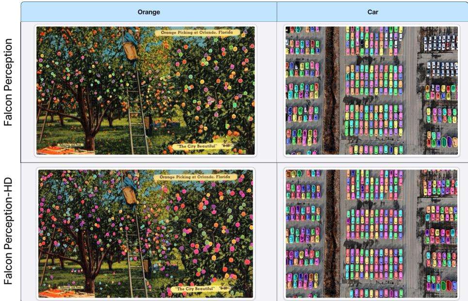  
Figure 4: Dense scenes, additional examples (1/2). Top: Falcon Perception. Bottom: Falcon <sub>i</sub><sup>o</sup> Perception-HD.

## eA.2 Level 4 (compositional referring expressions)

lcFigure 6 shows additional level-4 examples illustrating compositional and relation-binding referring <sup>F</sup>expressions, complementing Fig. 3.

## A.3 Mixed-difficulty PBench predictions

<sup>D</sup>Figure 7 shows examples sampled across PBench levels 0–4 (excluding the dense split). The postntrained model produces tighter boundaries and recovers objects missed by the baseline across difficulty t<sup>i</sup>levels, even though the segmentation head itself is frozen during RL: this is a direct manifestation of c<sup>e</sup>the cascade effect of §3.1.

## oA.4 Rollouts and the mechanism of RL

Figure 8 provides a window into why RL works on autoregressive perception. For a small set of training prompts we display several rollouts sampled from the same intermediate policy. The rollouts show two recurring failure modes that GRPO naturally penalises:

• Indefinite or overlapping predictions. Some rollouts emit near-duplicate detections at slightly perturbed coordinates, the policy-level analogue of the redundancy that NMS and coordinate deduplication are usually deployed to clean up after the fact (§5.3). Each duplicate is a Hungarian-matched false positive, so its rollout receives a strictly negative advantage relative to its siblings, and the policy gradient suppresses the corresponding token sequences.

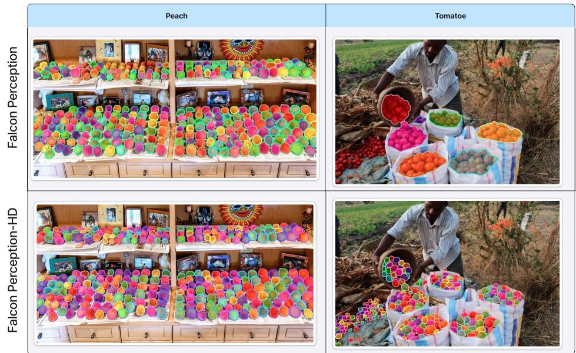

Figure 5: Dense scenes, additional examples (2/2). Top: Falcon Perception. Bottom: Falcon Perception-HD.  
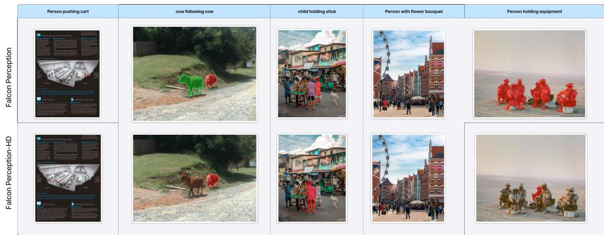  
Figure 6: Level 4 referring expressions, additional examples. Top: Falcon Perception. Bottom: <sup>arcelo</sup> <sup>air</sup> <sup>bal on</sup> <sup>leel</sup> Falcon Perception-HD.

• Low-recall rollouts. Other rollouts terminate early or skip large regions of the scene, scoring poorly on the count reward (Eq. 8) compared to siblings that decode further. The negative advantage on these rollouts pushes the policy away from the early-EOS and regionalomission failure modes that drive the under-counting in dense scenes (§5.1).

<sup>F</sup>Both effects are direct consequences of the group-relative advantage estimator: any failure mode that some siblings avoid will receive a within-group negative advantage and be suppressed, even though no rule explicitly forbids it.

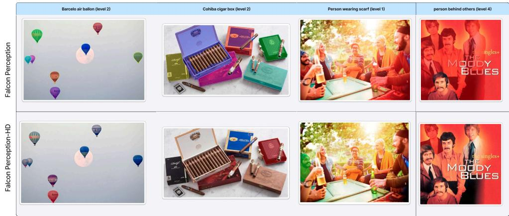  
Figure 7: Mixed PBench levels (non-dense), additional examples. Top: Falcon Perception. Bottom: Falcon Perception-HD.

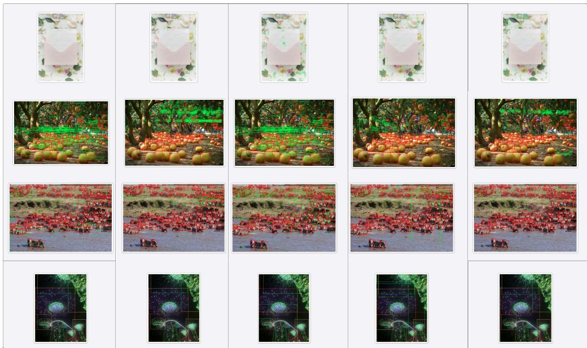  
Figure 8: Rollout samples from intermediate training checkpoints. Each row shows several GRPO rollouts for the same prompt. Rollouts that emit near-duplicate predictions or that under-cover the scene receive negative within-group advantages and are suppressed by the policy gradient; this is the mechanism by which RL eliminates mask repetition (§5.3) and improves dense-scene recall (§5.1) without any explicit rule against either failure mode.

## B Self-annotation pipelines

We illustrate here the final outputs of the two self-annotation pipelines described in §4. We display only the post-pipeline annotations actually used for RL training (i.e., the human-verified outputs of the dense pipeline and the GPT-5-selected rollouts of the hard-refexp pipeline); intermediate stages of each pipeline are not shown.

## B.1 Dense scene annotations

Figure 9 shows examples of the final annotations used for the dense split. Each image in this set contains up to several hundred instances of the queried category. The annotations are produced by running Falcon Perception over a curated set of dense images and then handing the predictions to human annotators for correction (removal of duplicate or fragmented masks, addition of missed instances, splitting of merged instances). The final masks form the supervised target on which the count reward of Eq. 8 is evaluated during RL.

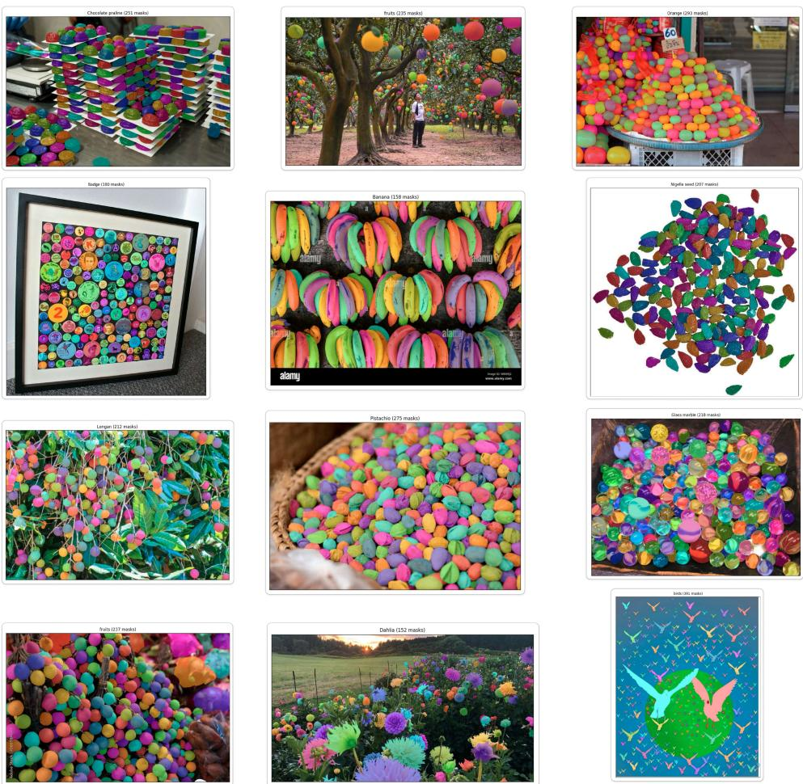  
Figure 9: Final dense-scene annotations. Examples of the human-verified dense annotations used as ground truth during RL post-training.

## B.2 Hard referring-expression annotations

Figure 10 shows examples of the final annotations used for the hard referring-expression set. Candidate annotations are produced by running pass@8 sampling on Falcon Perception over 200k image-expression pairs and keeping only those prompts where the greedy prediction is wrong but at least one sampled rollout is correct. The retained rollout, scored by GPT-5 as the most plausible candidate, is then used as the ground-truth mask for that prompt during RL. This restricts training to prompts that carry a useful policy-gradient signal (the greedy mode is wrong) while remaining within the support of the current policy (some rollout is right).

GPT-5 selection prompt. The exact prompt used to score each (image, query, deterministic prediction, {rollout}) tuple is reproduced verbatim below. The judge is shown the raw image, the

query: thin antenna mast above buildings right of cerrter

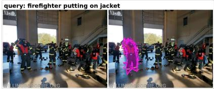

  
query: group of canoes moving in procession


  
query: small electronic device on red cords

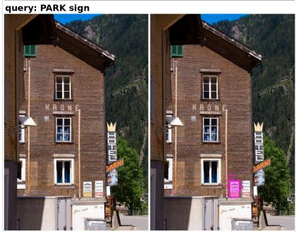

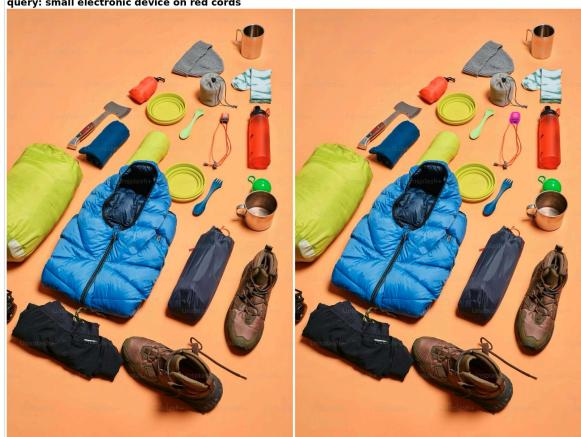  
Figure 10: Final hard-referring-expression annotations. Each example shows the rollout selected by the GPT-5 judge as the ground-truth target for a prompt where the greedy prediction of Falcon Perception failed.

temperature-0 greedy prediction, and N stochastic rollouts (each with a magenta-overlay mask), and applies three criteria: (A) the greedy prediction is wrong, (B) at least one rollout is clearly correct, (C) there is meaningful intra-group variance. Only tuples that satisfy all three are kept.

You are helping curate data for reinforcement-learning training of a referring-segmentation model.

\# What you are looking at

You will receive, in this exact order:

1. original – the raw input image with no overlay. Use this to understand the scene and judge what the query is actually asking about.

2. deterministic – the model’s greedy (temperature=0) prediction. The selected pixels are highlighted with a translucent magenta fill and a solid magenta border. The magenta color is an arbitrary annotation we add – it is not a property of any object.

3. rollout\_00, rollout\_01, ...– N stochastic samples from the same model for the same image+query, drawn the same way (magenta fill + magenta border).

The referring query and other metadata are provided as JSON in the next message (field expression).

```markdown
# Your task
For the given query, decide whether this sample is a good RL training example.
Evaluate each image independently:
• For deterministic and every rollout_XX, look at the magenta-highlighted region and
decide whether it correctly corresponds to the query. Note any wrong selections (wrong
object, wrong part, spurious, missing). Give a short verdict: correct, partially
correct, or wrong.
Then apply the selection criteria (ALL must hold to keep the sample):
(A) The deterministic prediction is wrong (or at best partially correct – not a clean
solution).
(B) At least one rollout_XX is clearly correct.
(C) There is meaningful intra-group variance across rollouts – they are not all
highlighting the same region.
# Output format
Respond in this exact structure:
## Query
<restate the query>
## Per-image judgment
- deterministic: <correct|partially correct|wrong> – <one-line reason>
- rollout_00: <correct|partially correct|wrong> – <one-line reason>
- rollout_01:
(one line per image)
## Criteria check
- (A) deterministic wrong: <yes|no> – <why>
- (B) at least one rollout correct: <yes|no> – <which ones>
- (C) intra-rollout variance: <yes|no> – <why>
## Decision
KEEP or REJECT – <one sentence justification>
```

## C Implementation Details

## C.1 Optimizer and schedule

We use the Muon optimizer for all ≥2D weight tensors, with Lion for 1D parameters (biases, RMSNorms), embeddings, and the LM/coord/size heads. Hyperparameters: learning rate $5 { \cdot } 1 0 ^ { - 6 }$ $\beta _ { 1 } \mathrm { = } 0 . 9 , \beta _ { 2 } \mathrm { = } 0 . 9 9 9 , \varepsilon \mathrm { = } 1 \bar { 0 } ^ { - 8 }$ , weight decay 0.01, Muon momentum µ=0.95, RMS-norm-based LR adjustment, cautious weight decay, head LR scaled by $1 / { \sqrt { d } } .$ . The schedule is a 50-step linear warmup followed by linear decay over 80% of training to a floor of 0.1× peak LR. The gradient is clipped at global norm 1.0.

## C.2 Distributed setup and precision

Training runs on 64 GPUs with data-parallel replication and bf16 compute on top of the torchtitan runtime. The local per-GPU batch size is 1 prompt; with the group size G=8 used by GRPO, this expands to 8 rollouts per GPU per optimizer step, i.e. 512 rollouts globally. Each prompt has 6,144 maximum context (with up to 1024×1024 images) and we generate at most max\_new\_tokens=1856 new tokens per rollout. We implement and use group packing: all sequences within the same group are packed together and share the same prompt (Image+query). This is possible thanks to FlexAttention, which allows masking out self-attention between tokens from different rollouts.

## C.3 Rollout engine

Rollouts are produced by a custom paged-attention inference engine built on FlexAttention.

## D Additional ablations

## D.1 Loss aggregation: Dr. GRPO vs. standard GRPO

We argue in §3.1 that the standard GRPO loss aggregation, which divides each rollout’s contribution by its own length $1 / T _ { i }$ , biases the policy towards shorter responses, and that the Dr. GRPO denominator $1 / ( B { \cdot } T _ { \mathrm { m a x } } )$ removes this bias. Table 11 verifies this on the high-density buckets of PBench, where the bias is expected to bite hardest because the desired rollouts can exceed $\mathrm { 3 { \cdot } 1 0 ^ { 4 } }$ tokens. We compare two runs trained with the same recipe but different aggregation, both selected at their best checkpoint by overall average $\mathrm { F _ { 1 } }$ , and report $\mathrm { F _ { 1 } }$ on the four highest-density buckets $( \geq 5 0$ instances per scene). Both schemes improve substantially over the pre-RL baseline on the moderate-density buckets, and standard GRPO is in fact slightly ahead on 50−300 objects per scene; the picture inverts on the most extreme density bucket (300+), where Dr. GRPO dominates by $+ 8 . 5 \mathrm { F _ { 1 } }$ . This is consistent with the analysis: standard GRPO’s per-token weighting under-counts the very long rollouts needed for hyper-dense scenes, so the policy never gets pushed to sustain 1000-token decoding to completion. Dr. GRPO, whose per-token gradient is independent of $T _ { i } .$ , retains the high-density gain.

Table 11: Loss aggregation ablation, PBench segmentation $\mathbf { F } _ { 1 }$ on high-density buckets $( \geq 5 0$ instances per scene). Standard GRPO performs comparably on moderate density but loses ground in the extreme-density regime (300+), where its per-token weighting under-counts very long rollouts. Dr. GRPO removes this length bias and retains the high-density gain.
<table><tr><td>Aggregation</td><td>50-100</td><td>100-200</td><td>200-300</td><td>300+</td><td>Avg (≥ 50)</td></tr><tr><td>Falcon Perception (pre-RL)</td><td>78.7</td><td>76.5</td><td>67.4</td><td>55.9</td><td>69.6</td></tr><tr><td>+ RL, standard GRPO (1/Ti)</td><td>80.6</td><td>81.4</td><td>78.7</td><td>61.2</td><td>75.5</td></tr><tr><td>+ RL, Dr. GRPO (ours)</td><td>80.2</td><td>80.4</td><td>74.5</td><td>69.8</td><td>76.2</td></tr></table>

## D.2 Clip-Cov on/off

Table 12 compares the main recipe (Clip-Cov enabled, with the per-head bounds reported in §3.1) against an otherwise identical run with Clip-Cov disabled. We report the best checkpoint of each run on PBench, selected by average $\mathrm { F _ { 1 } }$ across the six splits; both runs peak at step 550 of training.

Clip-Cov yields a small but consistent improvement on every PBench level except L0, with the largest absolute gain on $\mathrm { L } 2 \ : ( + 0 . 5 \ : \mathrm { F } _ { 1 } )$ . This is consistent with the hypothesis that Clip-Cov mitigates over-reinforcement of confidently-wrong rollouts: L2 (OCR in natural scenes) is the level on which the reward signal is most contaminated by annotation noise, since dense-text scenes have boundary and identity ambiguities that propagate directly into the count reward. By zeroing the gradient contribution of tokens with the highest log-probability/advantage covariance, Clip-Cov prevents the policy from sharpening on rollouts whose high reward comes from a noisy ground truth rather than from a correct prediction.

Table 12: Clip-Cov on/off, PBench segmentation $\mathbf { F } _ { 1 }$ . Disabling Clip-Cov costs $0 . 3 \mathrm { F _ { 1 } }$ on average and is most visible on L2 (OCR in natural scenes), where annotation noise dominates and overreinforcement of confidently-wrong rollouts is most costly.
<table><tr><td>Setting</td><td>L0</td><td>L1</td><td>L2</td><td>L3</td><td>L4</td><td>Dense</td><td>Avg</td></tr><tr><td>Falcon Perception (pre-RL)</td><td>63.7</td><td>63.8</td><td>38.3</td><td>53.4</td><td>49.1</td><td>72.3</td><td>56.8</td></tr><tr><td>+ RL, no Clip-Cov</td><td>64.9</td><td>63.8</td><td>39.9</td><td>54.7</td><td>51.4</td><td>80.1</td><td>59.1</td></tr><tr><td>+ RL, with Clip-Cov (ours)</td><td>64.9</td><td>64.2</td><td>40.4</td><td>54.7</td><td>51.8</td><td>80.5</td><td>59.4</td></tr><tr><td>∆ Clip-Cov</td><td>+0.0</td><td>+0.4</td><td>+0.5</td><td>+0.0</td><td>+0.4</td><td>+0.4</td><td>+0.3</td></tr></table>

## D.3 Finer-grained rewards and locality metrics

Our count reward scores detection only, so one may ask whether a finer-grained reward that scores localization quality improves locality metrics. We train an otherwise identical model with the panoptic reward of Pinto et al. [34], which favors better IoU, and report mean matched-mask IoU and macro- $\mathrm { F _ { 1 } }$ per PBench level in Table 13. We see no significant difference between the two rewards: both improve over the pre-RL baseline, on locality metrics as well. This is a consequence of the chain-of-perception and the cascade effect, where good pointing implies good segmentation, so the simpler count reward is sufficient.

Table 13: Count vs. panoptic reward, PBench. Mean matched-mask IoU and macro-F per level. The finer-grained panoptic reward does not improve locality metrics over the count reward: through the cascade effect, good pointing already implies good segmentation.
<table><tr><td>Reward</td><td>L0</td><td>L1</td><td>L2</td><td>L3</td><td>L4</td><td>Dense</td><td>Avg</td></tr><tr><td>Mean matched-mask IoU</td><td></td><td></td><td></td><td></td><td></td><td></td><td></td></tr><tr><td>pre-RL baseline</td><td>78.2</td><td>77.0</td><td>52.0</td><td>63.9</td><td>64.6</td><td>68.7</td><td>67.4</td></tr><tr><td>count</td><td>79.1</td><td>76.5</td><td>51.2</td><td>64.1</td><td>64.9</td><td>72.4</td><td>68.0</td></tr><tr><td>panoptic</td><td>79.0</td><td>76.0</td><td>50.9</td><td>63.8</td><td>64.6</td><td>72.0</td><td>67.7</td></tr><tr><td>Macro  ${ \bf \nabla } \cdot F _ { 1 }$ </td><td></td><td></td><td></td><td></td><td></td><td></td><td></td></tr><tr><td>pre-RL baseline</td><td>63.8</td><td>63.8</td><td>38.3</td><td>53.4</td><td>49.1</td><td>71.9</td><td>56.7</td></tr><tr><td>count</td><td>64.2</td><td>63.2</td><td>39.4</td><td>54.2</td><td>50.5</td><td>80.9</td><td>58.7</td></tr><tr><td>panoptic</td><td>64.3</td><td>63.1</td><td>39.5</td><td>54.3</td><td>50.6</td><td>80.2</td><td>58.7</td></tr></table>

## E Extension to other autoregressive models: Pix2Seq

We verify that our two central conclusions, dense perception and the removal of NMS, i.e., RL serving as a surrogate for Hungarian matching in autoregressive models, generalize to a standard autoregressive model independent of Falcon Perception and of our data pipeline. We take the pioneering work in this area, Pix2Seq [9], and build a simple 70M-parameter model (a vision encoder and a 6-layer autoregressive decoder) trained from scratch for closed-vocabulary detection on the open-source VisDrone and COCO datasets. The task is to list and detect all the objects present in the image in the format [y<sub>min</sub>, x<sub>min</sub>, y<sub>max</sub>, x<sub>max</sub>, class, . . . ]; there is no detection-specific head, and positions are encoded as 500 discrete bins that are part of the full vocabulary (classes and positions). We train the model with maximum likelihood for ∼50k steps at batch size 128, then RL post-train it for 500 steps with our Hungarian count reward aggregated over all objects in the image, irrespective of the class.

Table 14 reports $\mathrm { F _ { 1 } }$ @0.5 on the validation sets, with and without NMS. The conclusions are the same as for Falcon Perception: SFT does not fix the overprediction of boxes (removing NMS costs the base model 23.1 and 10.9 points), while RL alone, with a much lower budget, entirely removes the need for NMS and translates into large performance improvements. Qualitatively, the base model, while properly detecting existing objects, repeats itself, predicts degenerate boxes at random places in the image, and does not know how to terminate the sequence (the EOS token is never emitted). RL quickly fixes all three behaviors by penalizing them during training. Pix2Seq reported the same termination issue and addressed it by preventing EOS emission and learning a noise token [9]; a fundamental limitation of this heuristic is that the token budget does not adapt to scene density. We conclude that RL post-training impacts autoregressive perception models the way Hungarian matching and DETR impacted classical detection models: it removes the need for these heuristics entirely.

Table 14: Pix2Seq-style model, F<sub>1</sub>@0.5 on the VisDrone and COCO validation sets. 500 steps of RL entirely remove the raw→NMS gap and yield large absolute gains, replicating our Falcon Perception findings on an independent architecture, data, and codebase.
<table><tr><td colspan="4">VisDrone</td><td colspan="3">COCO</td></tr><tr><td>Model</td><td>raw</td><td>NMS</td><td>raw→NMS gap</td><td>raw</td><td>NMS</td><td>raw→NMS gap</td></tr><tr><td>Base (SFT)</td><td>21.2</td><td>44.3</td><td>+23.1</td><td>14.3</td><td>25.2</td><td>+10.9</td></tr><tr><td>RL</td><td>60.6</td><td>60.8</td><td>+0.2</td><td>59.6</td><td>59.8</td><td>+0.2</td></tr></table>

## F External dense benchmarks

To reinforce our claims beyond the benchmarks tied to the Falcon Perception ecosystem, we evaluate on external dense benchmarks. COCO-dense uses COCO val2017 in a category-as-query setting restricted to queries with at least 5 instances (1,974 queries); LVIS-dense keeps the 882 LVIS queries with more than 25 instances; Dense200 [14] is a recently introduced dense detection benchmark (box $\mathrm { F } _ { 1 } @ 0 . 5 )$ . We also evaluate two recent strong detection models, LocateAnything-3B [48] and Rex-Omni-3B [14], on the PBench dense split. These models emit boxes only, so this comparison uses box $\mathrm { F _ { 1 } }$ at IoU 0.5, with ground-truth boxes derived from the PBench dense masks, applied identically to all models.

Tables 15 and 16 report the results. On every benchmark, the gains of the RL post-trained model over the baseline are considerable. On Dense200, Falcon Perception-HD is competitive with the best specialized models, Rex-Omni and LocateAnything (detection only), despite being 5× smaller. In contrast, these models perform comparatively poorly on the PBench dense split and exhibit heavily redundant predictions (28.5% MRR for LocateAnything), again requiring NMS.

Table 15: External dense benchmarks. Left: mask $\mathrm { F _ { 1 } }$ on COCO-dense (category-as-query, $\geq 5$ instances, 1,974 queries) and LVIS-dense (882 queries, $> 2 5$ instances). Right: box $\bar { \mathrm { F } _ { 1 } } @ \bar { 0 } . 5$ on Dense200.
<table><tr><td>Model</td><td>COCO-dense</td><td>LVIS-dense</td></tr><tr><td>SAM 3</td><td>43.5</td><td>31.5</td></tr><tr><td>Baseline FP</td><td>55.1</td><td>33.6</td></tr><tr><td>FP-HD (Ours)</td><td>58.1</td><td>40.5</td></tr></table>

<table><tr><td>Model Dense200 F1 @0.5</td></tr><tr><td>SAM 3 63.3</td></tr><tr><td>LocateAnything-3B 74.0</td></tr><tr><td>Rex-Omni-3B 78.4</td></tr><tr><td>Baseline FP 72.0</td></tr><tr><td>FP-HD (Ours) 78.1</td></tr></table>

Table 16: Box $\mathbf { F } _ { 1 }$ @0.5 on the PBench dense split. Ground-truth boxes are derived from the PBench dense masks; the protocol is identical for all models. NMS yields only marginal improvements on the redundant baselines, while Falcon Perception-HD does not need it.
<table><tr><td>Model</td><td>no NMS</td><td>with NMS</td><td>MRR</td></tr><tr><td>LocateAnything-3B [48]</td><td>35.9</td><td>36.6</td><td>28.5%</td></tr><tr><td>Rex-Omni-3B [14]</td><td></td><td>37.4</td><td></td></tr><tr><td>Falcon Perception (pre-RL)</td><td>67.9</td><td>68.0</td><td>2.1%</td></tr><tr><td>FP-HD (Ours)</td><td>73.9</td><td>73.9</td><td>0.4%</td></tr></table>

## G Autoregressive vs. DETR-style models

Our RL framework targets autoregressive models. DETR-style models like SAM 3 already solve the repetition problem natively during base training via bipartite matching, and we verify empirically that RL post-training is unlikely to help them. Since these models do not sample, we formulate a stochastic policy for SAM 3 as follows: a well-defined stochastic choice is which of its 200 decoder queries to emit. Each query carries a per-slot probability $p _ { i } = \sigma ( \mathrm { c l s } _ { i } )$ , and we treat the selection as a product of independent Bernoullis, $\begin{array} { r } { \dot { a } \sim \prod _ { i } ^ { \cdot } \mathrm { B e r n o u l l i } \dot { ( p _ { i } ) } , a \dot { \in } \{ 0 , 1 \} ^ { 2 0 0 } } \end{array}$ . Table 17 reports pass@k on the PBench dense split under this policy: pass@8 is worse than the deterministic prediction (−3.4), while Falcon Perception gains +6.9. The core premise of RL post-training, that some rollouts beat the deterministic prediction, does not hold for SAM 3.

This native robustness comes at a cost: DETR models are strictly limited by their fixed number of object queries (SAM 3 is capped at 200), whereas autoregressive models can dynamically generate as many objects as required; Falcon Perception-HD successfully detects up to 600 objects in a single generation. We further benchmarked widely used autoregressive VLMs, Moondream3 [18] and Qwen3.5 (4B/8B) [35], on the PBench dense split and found their box redundancy rate exceeds 30%, also requiring NMS. This suggests that duplicate prediction is an algorithmic flaw of token-level MLE training, not a data issue, and a short RL stage fixes it entirely. We conclude that RL post-training for autoregressive perception models acts as the equivalent of DETR’s Hungarian matching.

Table 17: pass@k on the PBench dense split. Stochastic sampling improves over the deterministic prediction for the autoregressive model, which motivates RL post-training, but degrades the DETRstyle SAM 3 under the per-query Bernoulli policy.
<table><tr><td>k</td><td>Falcon Perception (AR)</td><td>SAM 3 (DETR)</td></tr><tr><td>deterministic</td><td>72.1</td><td>58.4</td></tr><tr><td>pass@2</td><td>72.7</td><td>54.5</td></tr><tr><td>pass@4</td><td>76.8</td><td>55.7</td></tr><tr><td>pass@8</td><td>79.0</td><td>56.8</td></tr><tr><td>∆ (pass@8 — deterministic)</td><td>+6.9</td><td>-3.4</td></tr></table>

## H Training curves

Figure 11 reports the training-time dynamics of our main run over the full 600-step horizon. The top row tracks the reward signals: total reward, mean precision and recall under Hungarian matching, mean matched IoU, and the resulting F all move monotonically and saturate by step ∼550, which i the checkpoint reported in the main results. The bottom row reports per-head policy entropies (LM, coordinate, size) and the standard deviation of within-group advantages. The LM and coordinate heads, which are the only heads on which the policy gradient is propagated, see their entropy decrease as the policy concentrates on high-reward modes; the advantage standard deviation decays accordingly, indicating that within-group disagreement shrinks as the rollouts of the same prompt converge towards similar high-reward layouts.

Crucially, the size-head entropy, although the size head is held frozen and sampled at τ=0 throughout training, follows the same decreasing trajectory as the two heads that do receive gradients. Since no gradient ever flows through the size head, the only mechanism by which its entropy can change is the cascade effect of the chain-of-perception decoder: improving the LM and coordinate predictions sharpens the hidden-state input to the size head, which in turn reduces its sampling entropy. This is the in-training counterpart of the cascade effect we identify in §3.1 and quantify in the main tables, observed here as a clean signature on a head that is never directly optimized.

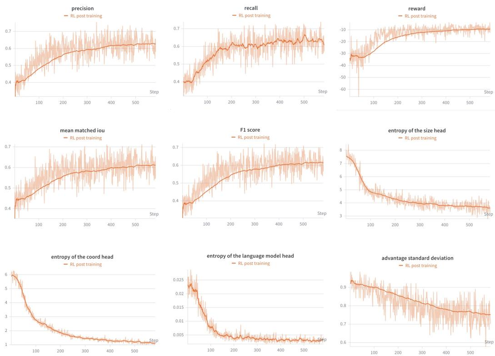  
Figure 11: Training curves. Top: total reward, precision, recall, mean matched IoU, and $\mathrm { F _ { 1 } }$ . Bottom: per-head policy entropy (LM, coordinate, size) and within-group advantage standard deviation. The size head is frozen and sampled greedily, yet its entropy decreases in lockstep with the two trainable heads, an in-training manifestation of the cascade effect of §3.1.

## I Mathematical Derivations

This appendix section contains the three derivations that justify non-obvious design choices of $\ S 3 \colon ( \mathrm { i } )$ why the detached importance-sampling ratio of Eq. 5 yields an unbiased on-policy estimator under engine mismatch (§I.1); (ii) why standard GRPO loss aggregation systematically biases the policy toward shorter rollouts and how Dr. GRPO (Eq. (7)) removes the bias (§I.2); and (iii) the explicit gradient bias on existence tokens under positive-only RL that motivates the stop-gradient of §3.4 (§I.3).

Notation. A rollout is $o = ( a _ { 1 } , \dots , a _ { T } ) \sim \pi _ { \theta } ( \cdot \mid I , q )$ with state $s _ { t }$ at step t and reward $r ( o )$ from Eq. 8. Group-relative advantage $\hat { A } _ { i } = ( r _ { i } - \mu _ { G } ) / ( \sigma _ { G } + \epsilon )$ is computed over $G$ rollouts from the same prompt. We write $\theta _ { \mathrm { r o l l o u t } }$ for the parameter snapshot used by the inference engine and θ for the parameter at gradient-computation time; in single-update GRPO the two are bit-identical, but the engines differ.

## I.1 Engine-mismatch importance sampling

Let p˜(a $\mid s ) : = \pi _ { \theta _ { \mathrm { r o l l o u t } } } ( a \mid s )$ be the distribution sampled by the inference engine and $p ( a \mid s ) : =$ $\pi _ { \boldsymbol { \theta } } ( \boldsymbol { a } \mid \boldsymbol { s } )$ the distribution evaluated by the training engine. Even at identical parameters $\theta _ { \mathrm { r o l l o u t } } = \theta _ { \mathrm { : } }$ the two engines use different attention kernels and accumulate floating-point error differently, so $\tilde { p } \neq p$ in general. We want the on-policy gradient under p:

$$
\nabla _ { \theta } J ( \theta ) ~ = ~ \mathbb { E } _ { o \sim p } \left[ r ( o ) \sum _ { t } \nabla _ { \theta } \log p ( a _ { t } \mid s _ { t } ) \right] ,
$$

but our samples come from ${ \tilde { p } } .$ Importance sampling rewrites this as an expectation under $\tilde { p } ,$ with per-token ratio $w _ { t } : = \smash { p ( a _ { t } \mid s _ { t } ) \bar { / } \tilde { p } ( a _ { t } \mid s _ { t } ) }$ . The VeRL implementation we follow applies the per-token ratio multiplicatively with stop-gradient:

$$
\ell _ { t } ^ { ( i ) } = - \mathrm { s g } \left( w _ { t } ^ { ( i ) } \right) \cdot \hat { A } _ { i } \cdot \log p \left( a _ { t } ^ { ( i ) } \mid s _ { t } ^ { ( i ) } \right) ,\tag{9}
$$

which corresponds to Eq. 6.

Unbiasedness with stop-gradient. Under stop-gradient on $w _ { t }$ , the per-token loss (9) satisfies $- \mathbb { E } _ { o \sim \tilde { p } } \Big [ \nabla _ { \theta } \ell _ { t } ^ { ( i ) } \Big ] = \mathbb { E } _ { o \sim p } \Big [ \hat { A } _ { i } \cdot \nabla _ { \theta } \log p ( a _ { t } ^ { ( i ) } \mid s _ { t } ^ { ( i ) } ) \Big ]$ , i.e., the gradient estimator is unbiased for the on-policy gradient under $p .$ To see this, note that stop-gradient makes $w _ { t }$ a constant w.r.t. $\theta ,$ so $\nabla _ { \boldsymbol { \theta } } \dot { \ell } _ { t } ^ { ( i ) } = - w _ { t } ^ { ( i ) } \cdot \hat { A } _ { i } \cdot \nabla _ { \boldsymbol { \theta } } \log p ( a _ { t } ^ { ( i ) } \mid s _ { t } ^ { ( i ) } )$ . Taking expectation under $\tilde { p }$ and using $w _ { t } = p / \tilde { p } .$

$$
\begin{array} { r } { \mathbb { E } _ { o \sim \tilde { p } } \Big [ \frac { p ( a _ { t } | s _ { t } ) } { \tilde { p } ( a _ { t } | s _ { t } ) } \cdot \hat { A } \cdot \nabla _ { \theta } \log p ( a _ { t } \mid s _ { t } ) \Big ] \ = \ \mathbb { E } _ { o \sim p } \Big [ \hat { A } \cdot \nabla _ { \theta } \log p ( a _ { t } \mid s _ { t } ) \Big ] , } \end{array}
$$

which is the on-policy gradient.

Why the stop-gradient is necessary. Without stop-gradient, $w _ { t } = p ( a _ { t } \mid s _ { t } ) / \tilde { p } ( a _ { t } \mid s _ { t } )$ would also depend on $\theta$ (since $\tilde { p }$ is held fixed at the rollout-time snapshot). The product $\boldsymbol { w } _ { t } \log { p ( \boldsymbol { a } _ { t } \mid \boldsymbol { s } _ { t } ) }$ would then contribute two score-function-like terms when differentiated, double-counting the gradient and producing a biased estimator. Stop-gradient on $w _ { t }$ restores the standard importance-sampling identity.

Why clipping has no effect in our setting. PPO-style clipping of $w _ { t }$ acts as a trust-region mechanism for cases where $\theta _ { \mathrm { r o l l o u t } } \neq \theta , \mathrm { e . g . }$ , multiple gradient steps per rollout group. We perform a single update per group, so the only source of $w _ { t } \neq 1$ is engine-level numerical noise; in practice $w _ { t }$ concentrates tightly around 1 and the clip range is never active. The IS correction therefore acts as a numerical-stability fix rather than as a trust region.

## I.2 Length bias in standard GRPO loss aggregation

Standard GRPO aggregates per-token losses by averaging within each rollout and then across rollouts:

$$
\mathcal { L } _ { \mathrm { s t d } } ( \theta ) = \mathbb { E } _ { q , I } \left[ \frac { 1 } { G } \sum _ { i = 1 } ^ { G } \frac { 1 } { T _ { i } } \sum _ { t = 1 } ^ { T _ { i } } \ell _ { t } ^ { ( i ) } \right] .\tag{10}
$$

Dr. GRPO replaces the per-rollout factor $1 / T _ { i }$ with a fixed constant $1 / ( B \cdot T _ { \mathrm { m a x } } )$ that does not depend on the realized length:

$$
\mathcal { L } _ { \mathrm { d r G R P O } } ( \theta ) = \mathbb { E } _ { q , I } \left[ \frac { 1 } { B \cdot T _ { \mathrm { m a x } } } \sum _ { i = 1 } ^ { G } \sum _ { t = 1 } ^ { T _ { i } } \ell _ { t } ^ { ( i ) } \right] .\tag{11}
$$

Per-token gradient mismatch under $\mathcal { L } _ { \mathrm { s t d } }$ . Consider two rollouts $o _ { i } , o _ { j }$ in the same group with the same advantage ${ \hat { A } } _ { i } = { \hat { A } } _ { i } = { \hat { A } }$ and the same per-token score function $g$ (in expectation). The contribution of a single token to the gradient of $\mathcal { L } _ { \mathrm { s t d } }$ is

$$
\frac { \partial \mathcal { L } _ { \mathrm { s t d } } } { \partial \theta } \supset \frac { 1 } { G \cdot T _ { i } } w _ { t } \hat { A } g , \qquad \mathrm { v s . } \qquad \frac { \partial \mathcal { L } _ { \mathrm { d r G R P O } } } { \partial \theta } \supset \frac { 1 } { B \cdot T _ { \mathrm { m a x } } } w _ { t } \hat { A } g ,
$$

so a token in $o _ { i }$ receives a per-token gradient larger by a factor $T _ { j } / T _ { i }$ relative to a token in $o _ { j }$ under $\mathcal { L } _ { \mathrm { s t d } }$ , while both receive equal per-token gradient under $\mathcal { L } _ { \mathrm { d r G R P O } }$

Direction of the bias in our setting. In dense detection, a high-reward rollout that successfully detects ∼ 500 objects can exceed $\bar { 3 } \times 1 0 ^ { 4 }$ tokens, while a low-reward rollout that gives up early may be an order of magnitude shorter. Under $\mathcal { L } _ { \mathrm { s t d } }$ , tokens in the short rollout are up-weighted by a factor of order 10. Combined with positive advantage being more likely on shorter rollouts at the start of training, the per-token gradient systematically pushes the policy toward producing fewer objects. $\mathcal { L } _ { \mathrm { d r G R P O } }$ removes the per-token coefficient’s dependence on $T _ { i }$ and eliminates this bias by construction, which is precisely what the dense regime requires.

## I.3 Existence-token gradient under positive-only RL

We train RL on positive queries only, so every rollout emits the existence token $\begin{array} { r l } { w _ { t _ { e } } } & { { } = } \end{array}$ <object\_found> at the position immediately following [REF\_SEG]. Let $\theta _ { e }$ denote the parameters of the LM-head logit projection that decide between <object\_found> and <no\_object\_found>.

Bias of the existence-token gradient. Without stop-gradient on the existence token, the contribution of the existence-token logprob to the policy gradient is

$$
g _ { e } : = \mathbb { E } _ { o \sim \pi _ { \theta } } \Big [ \hat { A } ( o ) \cdot \nabla _ { \theta _ { e } } \log \pi _ { \mathrm { L M } } ( < \mathrm { o b j e c t \_ f o u n d } > | s _ { t _ { e } } ) \Big ] ,\tag{12}
$$

which equals $\mathrm { C o v } _ { o } \Big ( \hat { A } ( o ) , \boldsymbol { \nabla } _ { \theta _ { e } } \log \pi _ { \mathrm { L M } } ( < \circ \mathsf { b j e c t \_ f o u n d } > | s _ { t _ { e } } ) \Big )$ because $\mathbb { E } _ { o } [ \hat { A } ( o ) ] = 0$ by group standardization (which makes $\hat { A }$ mean-zero across rollouts of the same prompt, and $\mathbb { E } [ \hat { A } ( o ) \cdot X ( o ) ] =$ $\operatorname { C o v } ( \hat { A } ( o ) , X ( o ) )$ for any $X )$ .

Sign and consequence. The score function $\nabla _ { \theta _ { e } } \log \pi _ { \mathrm { L M } } ( < \mathsf { o b j e c t \_ f o u n d } > \mid s _ { t _ { e } } )$ points in the direction that increases the probability of <object\_found>. The covariance in (12) is positive in practice: rollouts with higher reward also tend to have more confident existence-token logits (the existence head shares features with the rest of the LM, so well-localized rollouts come from confident upstream features). The gradient $g _ { e }$ therefore systematically pushes the policy toward emitting <object\_found>. Crucially, because RL only samples positive queries, this drift is never balanced by a corresponding push toward $< \mathtt { n o \_ o b j e c t \_ f o u n d } >$ , and the SFT-learned discrimination boundary collapses, explaining the MCC collapse observed in Table 10.

Why stop-gradient is the minimal fix. Setting log $\pi _ { \mathrm { L M } } ( w _ { t } \mid s _ { t } ) \to \operatorname { s g } ( \log \pi _ { \mathrm { L M } } ( w _ { t } \mid s _ { t } ) )$ for $w _ { t } \in \{ < \mathsf { o b j e c t \_ f o u n d } > , < \mathsf { n o \_ o b j e c t \_ f o u n d } > \}$ zeroes the per-token gradient of these two tokens, which is exactly the term $g _ { e }$ above. The features that feed into the existence head still receive gradient via the rest of the trajectory, so the existence-head representations continue to improve under $\mathbf { R I }$ , consistent with the small MCC improvement (above the pre-RL baseline) observed in Table 10.

## J Limitations

Our gains are bounded by the pretrained backbone. For instance, PBench Level 2 (OCR in natural scenes) requires knowledge beyond generic detection; RL cannot teach the model to read what the backbone has not learned to see. The coordinate and size heads factorize $x / y$ and $h / w$ into independent categoricals, which precludes meaningful joint exploration and likely explains why sampling the size head yields no gain. Relatedly, keeping the size and segmentation heads frozen, while convenient for the cascade, forecloses end-to-end training under richer rewards. Finally, SACO performance is dominated by MCC: when the existence is correctly decided, the mask usually follows. Existence calibration is a knowledge problem inherited from pretraining and is not, in itself, addressable by post-training RL.

## K Broader Impacts

Falcon Perception-HD substantially improves open-vocabulary segmentation in dense, real-world scenes, which has positive applications in domains where reliable instance counting and localization are bottlenecks, such as ecological monitoring and agricultural inventory. The same capability could also be repurposed for surveillance and tracking at scale, raising concerns around privacy and consent in public-space deployments; we view clear deployment policies as the appropriate mitigations.