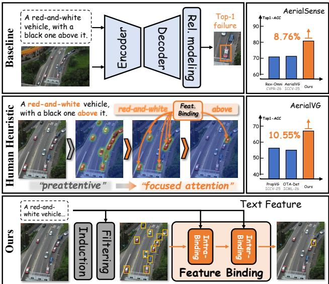
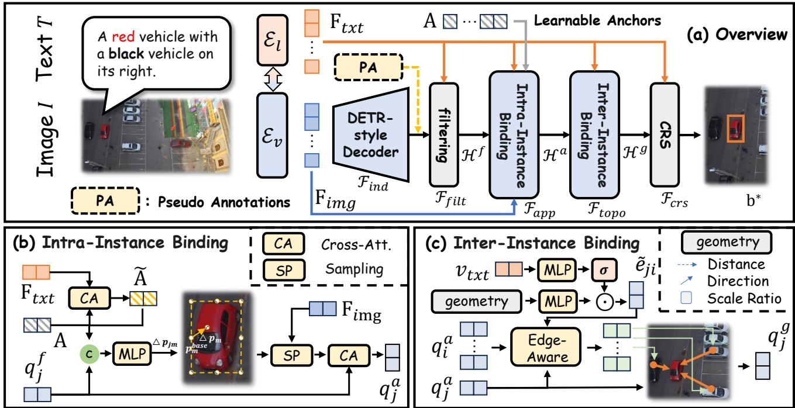
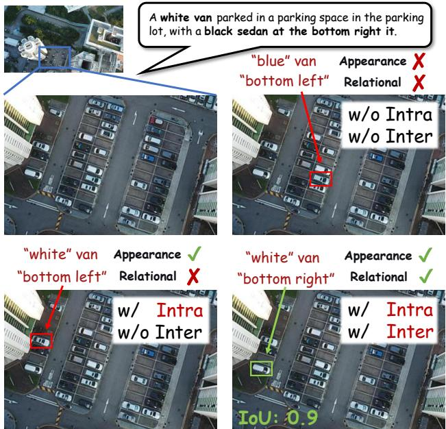
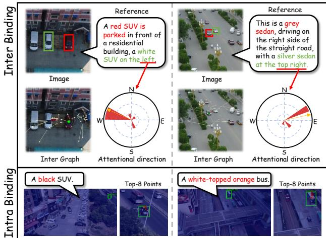

# GrabVG: Graph-Attentive Binding for Visual Grounding in UAV Imagery

Chaowei Wang1,\* Yan Di2,\* Jingjun Sun1 Baozhe Liu3 Jiaxu Tian1 Yuheng Li1 Guangqian Guo1 Shan Gao1,†

1Northwestern Polytechnical University 2Harbin Institute of Technology 3The Hong Kong Polytechnic University

chaowei wang@mail.nwpu.edu.cn diyan@hit.edu.cn gaoshan@nwpu.edu.cn

\*Equal contribution. †Corresponding author.

## Abstract

Visual grounding in Unmanned Aerial Vehicle (UAV) imagery aims to localize a target object in complex bird’seye-view scenes according to a natural language description. However, the abundance ofsmall, densely distributed, and visually similar objects creates high visual redundancy, while repetitive local configurations give rise to strong topological ambiguity. Existing approaches mainly focus on visual–language feature alignment or dense contextual interaction, yet they struggle to distinguish subtle interinstance differences and effectively exploit spatial topological structures, leading to inaccurate grounding in highly crowded scenarios. To address these challenges, we propose GrabVG, a novel visual grounding framework inspired by human visual search. GrabVG explicitly decomposes grounding into two sequential stages: preattentive hypothesis search and graph-attentive feature binding. Specifically, we first generate a compact set of reliable object hypotheses through distillation-guided proposal induction and text-aware hypothesis filtering, substantially reducing background distractions and semantic mismatches. These hypotheses are then organized into a sparse graph, where language-guided intra-instance visual cues and inter-instance topological relationships arejointly bound and propagated via graph attention, enabling efficient spatial reasoning and accurate target localization. Extensive experiments on AerialVG and AerialSense show that GrabVG achieves a favorable accuracy–speed tradeoff, reaching 67.31% and 80.34% Acc@0.5 and outperforming the corresponding baselines by 10.55 and 8.76percentage points, respectively.

## 1. Introduction

Visual grounding in Unmanned Aerial Vehicle (UAV) imagery aims to localize a target object in a bird’s-eye-view scene according to a natural-language expression [4, 9, 15, 19]. Compared with conventional ground-level imagery, UAV scenes typically contain numerous small and densely distributed objects, many of which exhibit highly similar appearances [19, 31, 42, 46]. The limited visual distinctions among these instances create high visual redundancy, making appearance cues alone insufficient for distinguishing the referred object from nearby distractors [19]. Moreover, the elevated viewpoint weakens perspective and depth cues while bringing a larger number of objects into view simultaneously. As a result, objects are often compressed into dense and repetitive two-dimensional arrangements, causing different target hypotheses to share similar local neighborhoods and relative spatial configurations. Such structurally similar neighborhoods make topological cues alone insufficient to uniquely identify the referent, giving rise to strong topological ambiguity.

  
Figure 1. Comparison of visual grounding paradigms. Baseline [19]: Existing methods rely on global decoding or dense relational modeling, often leaving visually similar hypotheses insufficiently distinguished. Human Visual Search [25, 30]: Preattentive guidance first narrows the search, followed by focused binding of discriminative evidence. Ours: GrabVG follows this progressive process through hypothesis induction, hypothesis filtering, and graph-attentive feature binding.

Existing visual grounding approaches address these challenges primarily through stronger vision–language alignment and contextual relation modeling. Vision– language alignment methods enhance expressionconditioned visual representations [7, 29], while relationbased approaches incorporate spatial configurations among instances [19]. However, cross-modal alignment is often performed across numerous intermediate queries, which may insufficiently encode subtle candidate-level differences. Meanwhile, dense relation modeling captures extensive pairwise interactions, potentially allowing distant or weakly relevant relations to interfere with informative local context. Consequently, existing approaches may still struggle to obtain discriminative candidate representations and reliable contextual evidence in crowded UAV scenes. These limitations arise from both the modeled evidence and the organization of the grounding process.

Human visual search offers a useful principle for organizing this process. Guided Search suggests that preattentive feature signals bias visual attention toward a restricted set of likely target locations [30], while Feature Integration Theory posits that focused attention is required to bind distributed visual features into coherent object representations [25]. Inspired by this progressive process, we formulate UAV visual grounding as preattentive hypothesis search followed by graph-attentive feature binding: the former constrains the search space to plausible target hypotheses, whereas the latter associates each surviving hypothesis with discriminative evidence.

As illustrated in Fig. 1, we instantiate this formulation as GrabVG, which separates candidate-space construction from evidence-based referent selection. During Preattentive Hypothesis Search, Distillation-Guided Proposal Induction transfers expression-aligned object proposals from an external teacher pipeline, while Text-Aware Hypothesis Filtering filters out likely background queries and retains foreground candidates aligned with the referring expression. During Graph-Attentive Feature Binding, the remaining hypotheses are organized as a sparse geometric graph. Intra-Instance Appearance Binding supplements each graph node with language-guided visual details sampled from the corresponding region and its immediate surroundings, whereas Inter-Instance Topological Binding exchanges edge-conditioned spatial information among neighboring nodes. This separation allows GrabVG to preserve subtle instance-level appearance cues while limiting relational reasoning to geometrically meaningful neighborhoods, thereby reducing interference from dense all-pairs interactions.

Extensive experiments on AerialVG and AerialSense demonstrate the effectiveness and efficiency of GrabVG. It achieves 67.31% Acc@0.5 on AerialVG and 80.34% Acc@0.5 on AerialSense, outperforming the corresponding baselines by 10.55 and 8.76 percentage points, respectively, while maintaining competitive inference speed. Our main contributions are summarized as follows:

• We reformulate crowded UAV visual grounding as a search-before-binding problem, separating the construction of plausible object candidates from the comparison of appearance and relational evidence. This formulation provides an explicit alternative to directly decoding the referent from dense visual tokens or unrestricted object interactions.

• We develop two complementary mechanisms for this formulation. Distillation-guided proposal induction and text-aware filtering establish a well-constrained, expression-aligned candidate space, while languageguided adaptive sampling and edge-aware graph attention enhance node appearance and model local geometric relations, respectively.

• Comprehensive experiments on AerialVG and AerialSense demonstrate the effectiveness and efficiency of GrabVG. Ablation studies further examine the contributions of proposal supervision, candidate filtering, adaptive appearance sampling, graph topology, and different pseudo-annotation sources.

## 2. Related Work

Visual Grounding. Visual grounding localizes an image region according to a natural-language expression. Early proposal-based methods rank detected regions using appearance, location, and contextual cues [38, 39], while onestage and transformer-based approaches directly regress the referred region from cross-modal representations [7, 13, 18, 36, 45]. Subsequent studies improve visual–language correspondence through language-guided feature refinement [23, 37], dynamic visual sampling [22], language-irrelevant token removal [24], and decoupled multimodal fusion [5]. Grounded pre-training further unifies language-conditioned localization with open-vocabulary detection [17, 20], while PropVG revisits proposal-driven grounding [6] and recent work explores progressive refinement for small-object REC [8]. However, most of these methods either operate on dense multimodal features or rank generic region proposals, without explicitly separating candidate screening from instance-level relational reasoning.

UAV and Remote-Sensing Visual Grounding. Remotesensing visual grounding is challenged by scale variation, cluttered backgrounds, high-resolution imagery, and small targets. Existing studies improve cross-modal alignment [14, 29, 40], relational reasoning [19, 44], and semantic–geometric modeling [3, 41]. ProVG further adopts a progressive survey–locate–verify strategy that sequentially injects global, relational, and attribute cues into dense visual features [16]. In contrast, GrabVG first screens explicit object candidates and then reasons over their local visual attributes and geometric neighborhoods.

Reasoning-Centric Remote-Sensing Grounding. Recent methods such as RSGround-R1 and Geo-R1 improve grounding through supervised reasoning traces and reinforcement fine-tuning [11, 43]. These approaches offer explicit textual rationales and improved low-shot reasoning, but require additional reasoning supervision or rolloutbased optimization and incur autoregressive inference overhead. GrabVG instead performs fixed-depth differentiable reasoning over sparse candidate graphs, offering directly inspectable node–edge interactions without generating textual reasoning trajectories.

Relation Modeling for Visual Grounding. Relational context is commonly used to distinguish visually similar candidates. Early methods compare target proposals with surrounding objects or decompose expressions into subject, location, and relation components [38, 39]. Later graph-based methods employ language-guided node and edge attention [27], cross-modal relation graphs [33], dynamic multi-step reasoning [34], or aligned language and visual scene graphs [35]. However, these relations are typically modeled over generic proposals or broad semantic structures. AerialVG explicitly captures positional relations among aerial objects [19], but dense interaction may introduce context from distant or weakly relevant instances. GrabVG instead applies language-conditioned graph attention to filtered candidates connected by local geometric proximity, thereby limiting message passing from distant or weakly relevant instances.

## 3. Method

## 3.1. Overview

Given a UAV image $\mathbf { I } \in \mathbb { R } ^ { H \times W \times 3 }$ and a referring expression $\mathbf { T } = \{ w _ { l } \} _ { l = 1 } ^ { L }$ , visual grounding aims to localize the unique instance described by T with a normalized bounding box $\mathbf { b } ^ { * } \in [ 0 , 1 ] ^ { 4 }$ . As illustrated in Fig. 2, GrabVG resolves the referent through explicit candidate construction and graph-based comparison rather than direct decoding from an unconstrained set of visual tokens.

The vision and language encoders first produce multiscale image features and token-level text features:

$$
\begin{array} { r l } & { \mathbf { F } _ { i m g } = \{ \mathbf { F } _ { i m g } ^ { s } \} _ { s = 1 } ^ { S } = \mathcal { E } _ { v } ( \mathbf { I } ) , } \\ & { \mathbf { F } _ { t x t } = \mathcal { E } _ { l } ( \mathbf { T } ) . } \end{array}\tag{1}
$$

A DETR-style proposal generator ${ \mathcal { F } } _ { i n d }$ [1, 47] first maps the multi-scale visual features $\mathbf { F } _ { i m g }$ to N initial hypotheses, $\mathcal { H } ^ { 0 } = \mathcal { F } _ { i n d } ( \mathbf { F } _ { i m g } ) = \{ ( \mathbf { q } _ { i } ^ { 0 } , \mathbf { b } _ { i } ^ { 0 } ) \} _ { i = 1 } ^ { \tilde { N } }$ , where each hypothesis consists of a decoder representation and its normalized bounding box. GrabVG then progressively filters and binds these hypotheses through four consecutive states:

$$
{ \mathcal { H } } ^ { 0 } { \xrightarrow { \mathcal { F } _ { f i l t } } } { \mathcal { H } } ^ { f } { \xrightarrow { \mathcal { F } _ { a p p } } } { \mathcal { H } } ^ { a } { \xrightarrow { \mathcal { F } _ { t o p o } } } { \mathcal { H } } ^ { g } .\tag{2}
$$

Here, Text-Aware Hypothesis Filtering $\mathcal { F } _ { f i l t }$ scores the initial hypotheses using $\mathbf { F } _ { t x t }$ and retains K foreground candidates, forming $\mathcal { H } ^ { f }$ Intra-Instance Appearance Binding $\mathcal { F } _ { a p p }$ updates their representations with sampled local image features to obtain ${ \mathcal { H } } ^ { a }$ Inter-Instance Topological Binding $\mathcal { F } _ { t o p o }$ subsequently exchanges languageconditioned messages over neighboring candidates, yielding Hg. The bounding boxes remain unchanged throughout the two binding modules.

Let $\mathcal { H } ^ { g } \ = \ \{ ( \mathbf { q } _ { j } ^ { g } , \mathbf { b } _ { j } ) \} _ { j = 1 } ^ { K }$ We adopt the Contrastivebased Refer Scoring (CRS) module from PropVG [6] for final referent selection. CRS evaluates the compatibility between each graph-aware hypothesis and the referring expression to produce a referring score, while leaving the associated box unchanged:

$$
\begin{array} { r l } & { s _ { j } ^ { r e f } = \mathscr { F } _ { c r s } ( \mathbf { q } _ { j } ^ { g } , \mathbf { F } _ { t x t } ) , } \\ & { ~ \mathbf { b } ^ { * } = \mathbf { b } _ { j ^ { * } } , \qquad j ^ { * } = \arg \operatorname* { m a x } _ { j } s _ { j } ^ { r e f } . } \end{array}\tag{3}
$$

## 3.2. Preattentive Hypothesis Search

Grounding annotations identify only the referred instance and provide little supervision for representing other plausible foreground objects. Consequently, proposal queries trained solely with the final referring objective may receive insufficient supervision to form well-constrained object hypotheses in crowded scenes. Preattentive Hypothesis Search addresses this issue in two steps: proposal induction transfers expression-aligned supervision from offline pseudo annotations, and text-aware filtering removes background queries before the more costly binding operations.

Distillation-Guided Proposal Induction. To supplement this sparse supervision, we follow the principle of teacher– student knowledge transfer [10] and employ an external teacher pipeline $\mathcal { F } _ { t e a }$ [19, 20] to generate an expressionaligned pseudo-annotation set offline:

$$
\begin{array} { c } { \mathcal { Y } _ { t e a } = ( \{ \mathbf { \overline { { b } } } _ { r } \} _ { r = 1 } ^ { R } , r ^ { * } ) } \\ { = \mathcal { F } _ { t e a } ( \mathbf { I } , \mathbf { T } ) , } \end{array}\tag{4}
$$

  
Figure 2. Overall architecture of GrabVG. (a) Given a UAV image and a referring expression, Distillation-Guided Proposal Induction first produces an initial hypothesis set $\mathcal { H } ^ { 0 }$ . Text-Aware Hypothesis Filtering then removes background queries and retains an expression aligned candidate subset. The resulting hypotheses $\mathcal { H } ^ { f }$ are processed by Intra-Instance Appearance Binding and Inter-Instance Topological Binding, followed by CRS for final target selection. (b) Intra-Instance Appearance Binding samples language-guided visual features from each hypothesis region and its immediate surroundings to obtain appearance-aware representations $\mathbf { Q } ^ { a }$ . (c) Inter-Instance Topological Binding exchanges relational information over a sparse geometric graph using language-conditioned edge features, producing graph-aware representations $\mathbf { Q } ^ { g }$

where $\overline { { \mathbf { b } } } _ { r }$ denotes a pseudo foreground box and $r ^ { * }$ identifies the pseudo annotation corresponding to the referred instance. These annotations are generated only for the training split and are not used during validation or inference. To guarantee positive referent supervision during training, the ground-truth referent box is appended when no retained teacher prediction satisfies the predefined matching criterion.

Using $\mathbf { F } _ { i m g }$ as the visual memory, the proposal generator ${ \mathcal { F } } _ { i n d }$ employs N learnable queries and stacked query selfattention and multi-scale deformable cross-attention layers to produce the initial hypothesis set $\mathcal { H } ^ { 0 }$ defined in the Overview. A foreground classification head and a box regression head are attached to each decoder query. Their predictions are assigned to $\{ \overline { { \mathbf { b } } } _ { r } \} _ { r = 1 } ^ { R }$ through one-to-one bipartite matching and optimized using the standard DETR classification, $\ell _ { 1 }$ regression, and generalized IoU losses. This supervision encourages the decoder queries to cover multiple expression-aligned foreground hypotheses with accurate boxes, rather than concentrating only on the annotated referent.

Text-Aware Hypothesis Filtering. Although distillation improves proposal coverage, $\mathcal { H } ^ { 0 }$ may still contain background regions and hypotheses that are weakly aligned with the referring expression. We therefore employ a lightweight text-aware filter to perform coarse candidate screening before the more expensive binding operations. Its goal is to retain foreground hypotheses aligned with the referring expression, while fine-grained attribute and relational disambiguation is delegated to the subsequent binding and selection modules.

Let $\begin{array} { r c l } { \mathbf { Q } ^ { 0 } } & { = } & { \bigl [ \mathbf { q } _ { 1 } ^ { 0 } , \dots , \mathbf { q } _ { N } ^ { 0 } \bigr ] , } \end{array}$ . A single cross-attention block [26] injects linguistic context into the proposal features for relevance estimation:

$$
\begin{array} { r l } & { \mathbf { U } = \mathrm { L N } \big ( \mathbf { Q } ^ { 0 } + \mathrm { M H A } ( \mathbf { Q } ^ { 0 } , \mathbf { F } _ { t x t } , \mathbf { F } _ { t x t } ) \big ) , } \\ & { \overline { { \mathbf { Q } } } = \mathrm { L N } ( \mathbf { U } + \mathrm { F F N } ( \mathbf { U } ) ) , \qquad \mathbf { s } ^ { f } = \sigma ( \mathbf { W } _ { f } \overline { { \mathbf { Q } } } ) . } \end{array}\tag{5}
$$

Here, MH $\operatorname { A } ( \mathbf { Q } , \mathbf { K } , \mathbf { V } )$ denotes a multi-head attention block. The top-K scoring hypotheses are retained:

$$
\begin{array} { r l } & { \Omega = \mathrm { T o p K } ( \mathbf { s } ^ { f } , K ) = \{ \omega _ { 1 } , \dots , \omega _ { K } \} , } \\ & { \mathcal { H } ^ { f } = \{ ( \mathbf { q } _ { \omega _ { j } } ^ { 0 } , \mathbf { b } _ { \omega _ { j } } ^ { 0 } ) \} _ { j = 1 } ^ { K } \triangleq \{ ( \mathbf { q } _ { j } ^ { f } , \mathbf { b } _ { j } ) \} _ { j = 1 } ^ { K } . } \end{array}\tag{6}
$$

The auxiliary features $\overline { { \mathbf { Q } } }$ are used only to estimate filtering scores, while the selected original decoder features $\{ \mathbf { q } _ { \omega _ { j } } ^ { 0 } \} _ { j = \hat { \cdot } } ^ { K }$ are forwarded to the binding stage. This separates language-guided hypothesis selection from subsequent feature binding, with the filtering scores supervised by $\mathcal { L } _ { f i l t }$

## 3.3. Graph-Attentive Feature Binding

Graph-Attentive Feature Binding updates the graph through node-level visual sampling and edge-conditioned message passing. Intra-Instance Appearance Binding enriches each node using features sampled around its associated box, whereas Inter-Instance Topological Binding exchanges spatial information among geometrically neighboring candidates.

Intra-Instance Appearance Binding. Within the hypothesis graph, each node initially contains a decoder feature $\mathbf { q } _ { j } ^ { f }$ and its associated box $\mathbf b _ { j } = ( \mathbf c _ { j } , \pmb { \rho } _ { j } )$ , where $\mathbf { c } _ { j }$ and $\rho _ { j }$ denote the normalized box center and size, respectively. To supplement the decoder feature with candidate-specific visual evidence, we associate each hypothesis with M boxrelative anchors $\{ ( \mathbf { a } _ { m } , \mathbf { p } _ { m } ^ { b a s e } ) \} _ { m = 1 } ^ { M }$ , where $\mathbf { a } _ { m }$ is a learnable query embedding and $\mathbf { p } _ { m } ^ { b a s e }$ denotes its predefined base location relative to the hypothesis box. These query embeddings are first conditioned on the referring expression, after which candidate-specific offsets are jointly predicted from the hypothesis representation and the resulting languageaware anchor embeddings:

$$
\begin{array} { r l } & { \quad \mathbf { A } ^ { t } = \mathrm { M H A } \left( \mathbf { A } , \mathbf { F } _ { t x t } , \mathbf { F } _ { t x t } \right) , } \\ & { \Delta \mathbf { p } _ { j m } = \mathrm { M L P } _ { o f f } \left( [ \mathbf { q } _ { j } ^ { f } ; \mathbf { a } _ { m } ; \mathbf { a } _ { m } ^ { t } ] \right) , } \\ & { \quad \mathbf { p } _ { j m } = \mathrm { c l i p } _ { [ 0 , 1 ] ^ { 2 } } \left( \mathbf { c } _ { j } + \left( \mathbf { p } _ { m } ^ { b a s e } + \Delta \mathbf { p } _ { j m } \right) \odot \pmb { \rho } _ { j } \right) . } \end{array}\tag{7}
$$

Here, $\mathbf { A } = [ \mathbf { a } _ { 1 } , \dots , \mathbf { a } _ { M } ]$ and $\mathbf { A } ^ { t } = [ \mathbf { a } _ { 1 } ^ { t } , \dots , \mathbf { a } _ { M } ^ { t } ]$ denote the original and language-aware anchor embeddings, respectively. The predicted locations therefore adapt to both the candidate representation and the linguistic context while remaining relative to the candidate box. We then sample multi-scale visual features at these locations and aggregate them to update the corresponding hypothesis:

$$
\begin{array} { r } { \mathbf { F } _ { j } ^ { l o c } = \mathrm { S a m p l e } \left( \mathbf { F } _ { i m g } , \{ \mathbf { p } _ { j m } \} _ { m = 1 } ^ { M } \right) , \ ~ } \\ { \mathbf { q } _ { j } ^ { a } = \mathrm { M H A } \left( \mathbf { q } _ { j } ^ { f } , [ \mathbf { q } _ { j } ^ { f } ; \mathbf { F } _ { j } ^ { l o c } ] , [ \mathbf { q } _ { j } ^ { f } ; \mathbf { F } _ { j } ^ { l o c } ] \right) . \ } \end{array}\tag{8}
$$

Here, Sample denotes differentiable bilinear sampling from all visual feature levels followed by cross-scale feature fusion. The resulting appearance-aware hypothesis set is $\mathcal { H } ^ { a } = \{ ( \mathbf { q } _ { j } ^ { a } , \mathbf { b } _ { j } ) \} _ { j = 1 } ^ { K }$

Inter-Instance Topological Binding. After appearance refinement, the hypothesis boxes remain unchanged while the node attributes are replaced by $\{ \mathbf { q } _ { j } ^ { a } \} _ { j = 1 } ^ { K }$ . To capture local spatial configurations without introducing distracting all-pairs interactions, we construct a symmetric k-nearestneighbor graph from the detached normalized hypothesis centers and include a self-loop for every node:

$$
\begin{array} { r } { \mathcal { N } ( j ) = \mathrm { S y m K N N } _ { k } ( \mathbf { c } _ { j } ) \cup \{ j \} . } \end{array}\tag{9}
$$

The self-loop allows each node to directly balance its own appearance evidence against messages from neighboring hypotheses during attention aggregation. The graph connectivity is shared across all graph-attention layers. For each directed edge $j  i ,$ we construct a geometric descriptor ${ \bf { r } } _ { j i }$ from the relative center displacement, distance, direction, and log-scale difference between the two boxes. $\mathbf { A }$ pooled sentence representation $\mathbf { v } _ { t x t }$ then modulates the projected geometric descriptor:

$$
\begin{array} { r } { \widetilde { \mathbf { e } } _ { j i } = \mathrm { M L P } _ { g e o } ( \mathbf { r } _ { j i } ) \odot \sigma ( \mathrm { M L P } _ { t x t } ( \mathbf { v } _ { t x t } ) ) . } \end{array}\tag{10}
$$

Starting from $\mathbf { z } _ { i } ^ { ( 0 ) } = \mathbf { q } _ { i } ^ { a }$ , we perform edge-aware graph attention over the local neighborhood. For clarity, the attention-head index is omitted:

$$
\begin{array} { r l } & { a _ { j i } ^ { \ell } = \cfrac { 1 } { \sqrt { d } } \left( \mathbf { W } _ { q } ^ { \ell } \mathbf { z } _ { j } ^ { ( \ell - 1 ) } \right) ^ { \top } \left( \mathbf { W } _ { k } ^ { \ell } \mathbf { z } _ { i } ^ { ( \ell - 1 ) } + \mathbf { W } _ { e k } ^ { \ell } \widetilde { \mathbf { e } } _ { j i } \right) } \\ & { \qquad + \left( \mathbf { w } _ { e b } ^ { \ell } \right) ^ { \top } \widetilde { \mathbf { e } } _ { j i } , } \\ & { \alpha _ { j i } ^ { \ell } = \mathrm { S o f t m a x } _ { i \in N ( j ) } \left( a _ { j i } ^ { \ell } \right) , } \\ & { \mathbf { m } _ { j } ^ { \ell } = \displaystyle \sum _ { i \in N ( j ) } \alpha _ { j i } ^ { \ell } \left( \mathbf { W } _ { v } ^ { \ell } \mathbf { z } _ { i } ^ { ( \ell - 1 ) } + \mathbf { W } _ { e v } ^ { \ell } \widetilde { \mathbf { e } } _ { j i } \right) , } \\ & { \mathbf { z } _ { j } ^ { ( \ell ) } = \mathrm { G r a p h B l o c k } ^ { \ell } \left( \mathbf { z } _ { j } ^ { ( \ell - 1 ) } , \mathbf { m } _ { j } ^ { \ell } \right) . } \end{array}\tag{11}
$$

The edge-conditioned key and bias terms determine the attention allocated to neighboring hypotheses, while the edge-conditioned value injects relational information into the aggregated message $\mathbf { m } _ { j } ^ { \ell } .$ . The graph block then combines this message with the previous node state through residual and feed-forward updates. After $L _ { g }$ graphattention layers, a learned sigmoid gate adaptively blends the graph-propagated state $\mathbf { z } _ { j } ^ { ( \bar { L } _ { g } ) }$ with the appearance-aware representation $\mathbf { q } _ { j } ^ { a }$ to produce $\mathbf { q } _ { j } ^ { g }$ . The resulting graph-aware hypothesis set is $\mathcal { H } ^ { g } = \{ ( \mathbf { q } _ { j } ^ { g } , \bar { \mathbf { b } _ { j } } ) \} _ { j = 1 } ^ { K }$

## 3.4. Training Objective

GrabVG is jointly optimized with proposal-induction, hypothesis-filtering, grounding, and auxiliary segmentation objectives:

$$
\begin{array} { r l } & { \mathcal { L } = \lambda _ { d e t } \mathcal { L } _ { d e t } + \lambda _ { f i l t } \mathcal { L } _ { f i l t } } \\ & { ~ + \lambda _ { r e f } \mathcal { L } _ { r e f } + \lambda _ { m a s k } \mathcal { L } _ { m a s k } . } \end{array}\tag{12}
$$

The proposal-induction loss $\mathcal { L } _ { d e t }$ follows DETR [1] and combines foreground classification, $\ell _ { 1 }$ box regression, and generalized IoU losses [21]. The grounding loss $\mathcal { L } _ { \boldsymbol { r e f } }$ and auxiliary segmentation loss $\mathcal { L } _ { m a s k }$ follow PropVG [6].

For hypothesis filtering, let M denote the bipartite matching between induced hypotheses and pseudo annotations. A hypothesis is treated as a positive filtering target if it is matched to any pseudo box. Let $i ^ { r }$ denote the hypothesis matched to the referred pseudo annotation and Ω the retained index set. We combine binary relevance supervision with a retention penalty that discourages pruning the referred hypothesis:

$$
\begin{array} { r l } & { \quad y _ { i } ^ { f } = \mathbb { I } \left[ \exists r , ( i , r ) \in \mathcal { M } \right] , } \\ & { \mathcal { L } _ { f i l t } = \lambda _ { b c e } \mathrm { B C E } ( \mathbf { s } ^ { f } , \mathbf { y } ^ { f } ) } \\ & { \quad \quad \quad \quad \quad + \lambda _ { k e e p } \mathbb { I } \left[ i ^ { r } \notin \Omega \right] \left[ - \log ( s _ { i ^ { r } } ^ { f } + \epsilon ) \right] . } \end{array}\tag{13}
$$

The filtering objective performs coarse foreground screening, while final referent discrimination is supervised by $\mathcal { L } _ { \boldsymbol { r e f } }$ over the retained hypotheses.

## 4. Experiments

## 4.1. Setup

Datasets. We evaluate GrabVG on AerialVG [19] and the visual-grounding subset of AerialSense [9]. AerialVG contains 5,000 high-resolution images, 50,000 referring expressions, and 103,000 bounding boxes, and we follow its official train–test split. AerialSense covers diverse resolutions, illumination conditions, and UAV scenes; as no official split is available, we use the first 75% of samples for training and the remaining 25% for testing.

Metrics. We report Acc@0.5 (Top1), Top-5 Acc@0.5 (Top5), and mIoU. Top1 and Top5 measure whether the top-1 prediction or any of the five highest-scoring boxes has IoU above 0.5, respectively, while mIoU is the mean IoU of the top-1 predictions.

Baselines. Our comparisons cover general visual grounding methods [6], UAV-specific visual grounding methods [19, 29], and zero-shot grounding methods [12].

Implementation Details. Following PropVG [6], we adopt the BEiT-3 Base [28] backbone and a three-layer deformable proposal decoder. Images are resized with the aspect ratio preserved and padded to 586 × 586, and the maximum text length is 64. We initialize $N \mathrm { ~ = ~ } 2 5 6$ hypotheses for AerialVG and N = 128 for AerialSense, of which the top-scoring 50% are retained. Appearance binding uses 48 adaptive anchors, while topological binding employs four graph-attention layers over a symmetrized 6-NN graph. The models are trained using Adam for 36 epochs on AerialVG and 45 epochs on AerialSense, with learning rates of $1 . 5 \times 1 0 ^ { - 4 }$ for the newly introduced modules and $1 . 5 \times 1 0 ^ { - 5 }$ for the backbone. Unless otherwise stated, we use AerialVG-derived pseudo annotations for AerialVG and Grounding-DINO-derived pseudo annotations for AerialSense. The filtering layer uses eight attention heads. Training uses a batch size of 3 per GPU, gradient clipping at 0.15, and two epochs of linear warm-up. The learning rate is subsequently reduced by a factor of 0.1; for AerialVG, the decay is applied at epochs 24 and 32.

<table><tr><td>Method</td><td>Top1 (%)</td><td>Top5 (%)</td><td>mIoU (%)</td></tr><tr><td>Zero-Shot Methods ReX-Omni [12]</td><td>28.37</td><td>30.09</td><td></td></tr><tr><td>Supervised Methods</td><td></td><td></td><td></td></tr><tr><td>TransVG [7]</td><td>11.53</td><td>13.68</td><td></td></tr><tr><td>D-MDETR [22]</td><td>19.87</td><td>29.87</td><td></td></tr><tr><td>G-DINO [20]</td><td>29.36</td><td>78.87</td><td></td></tr><tr><td>AerialVG [19]</td><td>50.03</td><td>87.00</td><td></td></tr><tr><td>PropVG [6]</td><td>49.40</td><td></td><td>49.38</td></tr><tr><td>PropVG* [6]</td><td>56.76</td><td>74.05</td><td>46.76</td></tr><tr><td>OTA-Det [29]</td><td>54.90</td><td></td><td></td></tr><tr><td>GrabVG (Ours)</td><td>67.31</td><td>89.43</td><td>53.34</td></tr></table>

Table 1. Comparison with state-of-the-art methods on the AerialVG test set. “\*” indicates results obtained with hyperparameter optimization. Best results are in bold. Top1 and Top5 denote Acc@0.5 and Top-5 Acc@0.5, respectively.

## 4.2. Comparison with State of the Art

Results on AerialVG. As shown in Table 1, we compare the proposed GrabVG with recent methods, including both zero-shot multimodal approaches and fully supervised aerial-specific models. GrabVG achieves state-ofthe-art performance on the AerialVG test set, with 67.31% Top1, 89.43% Top5, and 53.34% mIoU. Compared with the strongest one-stage baseline, OTA-Det (54.90%), and the dense-relation model AerialVG (50.03%), GrabVG improves Top1 by 12.41 and 17.28 percentage points, respectively. Furthermore, GrabVG outperforms the hyperparameter-optimized two-stage baseline PropVG\* by 10.55 percentage points in Top1. These results suggest that expression-aligned proposal supervision, local visual sampling, and neighborhood-restricted graph reasoning provide complementary benefits in crowded UAV scenes.

Results on AerialSense. To evaluate the generalization capability of GrabVG across diverse UAV scenarios, we report results on AerialSense in Table 2. GrabVG achieves the best performance, reaching 80.34% Top1 and 72.00% mIoU. It surpasses the zero-shot ReX-Omni and the supervised AerialVG baseline by 8.87 and 8.76 percentage points in Top1, respectively. These results demonstrate that the proposed candidate construction and graph-attentive binding framework generalizes effectively beyond AerialVG.

<table><tr><td>Method</td><td>Type</td><td>Top1 (%)</td><td>mIoU (%)</td></tr><tr><td>Large Multimodal Models (Zero-Shot)</td><td></td><td></td><td></td></tr><tr><td>ReX-Omni [12]</td><td>Zero-shot</td><td>71.47</td><td></td></tr><tr><td>Domain-Specific Models</td><td></td><td></td><td></td></tr><tr><td>AerialVG [19]</td><td>Supervised</td><td>71.58</td><td></td></tr><tr><td>PropVG* [6]</td><td>Supervised</td><td>61.30</td><td>67.76</td></tr><tr><td>GrabVG (Ours)</td><td>Supervised</td><td>80.34</td><td>72.00</td></tr></table>

Table 2. Performance on the AerialSense benchmark. We compare GrabVG with a recent zero-shot multimodal model and aerial-specific supervised baselines.

## 4.3. Comprehensive Ablation Study

Component-wise Contribution. Table 3 incrementally evaluates each component from the optimized PropVG baseline, which is trained on the original ground-truth annotations and achieves 56.76% Top1. Introducing Distillation-Guided Proposal Induction with expressionaligned pseudo annotations improves Top1 to 62.84%, indicating that denser foreground supervision produces a more reliable and better-covered hypothesis space. Adding Intra-Instance Appearance Binding further improves Top1 by 2.75 points to 65.59%, demonstrating the benefit of recovering candidate-specific local cues for distinguishing visually similar objects. In comparison, Inter-Instance Topological Binding alone yields a 2.26-point gain to 65.10%, showing that local geometric relations among neighboring hypotheses provide effective contextual evidence. Combining both binding modules reaches 67.01%, confirming that finegrained appearance cues and inter-instance relational information are complementary. Finally, Text-Aware Hypothesis Filtering achieves the best Top1 of 67.31% by suppressing weakly relevant hypotheses before feature binding.

## 4.4. Further Experimental Analysis

Filtering Strategy. Table 4 examines where and how often hypotheses should be screened. All variants use the same AerialVG-derived pseudo annotations for proposal induction. Replacing the learned filter with non-maximum suppression (NMS) produces a similar Top1 result (67.25% versus 67.31%) and a higher Top5 result, but NMS does not exploit the referring expression. Applying the learned filter both before and after appearance binding reduces Top1 to 66.75%. Repeated pruning can therefore discard ambiguous but correct hypotheses before topological evidence becomes available. A single early text-aware filter provides the best Top1 while keeping the subsequent binding stages focused on a compact candidate set.

<table><tr><td rowspan="2">Baseline</td><td colspan="4">GrabVG Components</td><td colspan="2">Test</td><td colspan="2">Val</td></tr><tr><td> $\boldsymbol { \ y } _ { t e a }$ </td><td> $\mathcal { F } _ { a p p }$ </td><td> $\mathcal { F } _ { t o p o }$ </td><td> $\mathcal { F } _ { f i l t }$ </td><td>Top1</td><td>Top5</td><td>Top1</td><td>Top5</td></tr><tr><td>√</td><td></td><td></td><td></td><td></td><td>56.76</td><td>74.05</td><td>55.96</td><td>72.28</td></tr><tr><td>√</td><td>√</td><td></td><td></td><td></td><td>62.84</td><td>85.54</td><td>61.82</td><td>85.04</td></tr><tr><td>√</td><td>√</td><td>√</td><td></td><td></td><td>65.59</td><td>87.89</td><td>65.42</td><td>87.13</td></tr><tr><td>√</td><td>√</td><td></td><td>√</td><td></td><td>65.10</td><td>88.02</td><td>64.15</td><td>87.86</td></tr><tr><td>√</td><td>√</td><td>√</td><td>√</td><td></td><td>67.01</td><td>89.52</td><td>67.13</td><td>88.96</td></tr><tr><td>√</td><td>√</td><td>√</td><td>√</td><td>√</td><td>67.31</td><td>89.43</td><td>67.41</td><td>88.78</td></tr></table>

Table 3. Component-wise Ablation on AerialVG. The baseline is a hyperparameter-optimized PropVG model trained with the original ground-truth annotations. $\mathcal { V } _ { t e a }$ denotes fixed expressionaligned pseudo annotations generated offline by a trained AerialVG teacher; $\mathcal { F } _ { a p p } , \mathcal { F } _ { t o p o } ,$ and $\mathcal { F } _ { f i l t }$ denote appearance binding, topological binding, and text-aware filtering, respectively. $\mathcal { F } _ { t o p o }$ uses a symmetric k-NN graph.

<table><tr><td>Pipeline Strategy</td><td>Top1 (%)</td><td>Top5 (%)</td></tr><tr><td> $\mathcal { F } _ { i n d } + \mathcal { F } _ { t o p o }$  (no appearance binding)</td><td>65.10</td><td>88.02</td></tr><tr><td> $\mathcal { F } _ { i n d } + \bar { \mathcal { F } } _ { a p p } ^ { \mathrm { ~ ~ } } + \mathcal { F } _ { t o p o } + \mathrm { N M S }$ </td><td>67.25</td><td>90.03</td></tr><tr><td> $\mathcal { F } _ { i n d } + \mathcal { F } _ { f i l t } + \mathcal { F } _ { a p p } + \mathcal { F } _ { f i l t } + \mathcal { F } _ { t o p o }$ </td><td>66.75</td><td>89.46</td></tr><tr><td> $\mathcal { F } _ { i n d } + \mathcal { F } _ { f i l t } + \mathcal { F } _ { a p p } + \mathcal { F } _ { t o p o }$ </td><td>67.31</td><td>89.43</td></tr></table>

Table 4. Pipeline design choices on AerialVG. Only the post induction candidate-processing strategy is changed.

<table><tr><td>Anchor Topology</td><td>Scales</td><td>Top1 (%)</td><td>Top5 (%)</td></tr><tr><td>Single Ring</td><td>[1.0]</td><td>64.59</td><td>87.15</td></tr><tr><td>Double Ring</td><td>[0.5, 1.0]</td><td>64.57</td><td>87.51</td></tr><tr><td>Double Ring</td><td>[1.0, 1.2]</td><td>64.36</td><td>87.56</td></tr><tr><td>Triple Ring (Ours)</td><td>[0.5, 1.0, 1.2]</td><td>65.59</td><td>87.89</td></tr></table>

Table 5. Ablation of Intra-Instance Appearance Binding on AerialVG. All variants use proposal induction followed by appearance binding; filtering and topological binding are disabled.

Appearance-Binding Design. Table 5 studies the spatial layout of the adaptive sampling anchors. These experiments isolate appearance binding by disabling filtering and topological binding. Single- and double-ring layouts achieve Top1 values between 64.36% and 64.59%. The triple-ring layout with scales [0.5, 1.0, 1.2] improves Top1 to 65.59% and Top5 to 87.89%. Covering the hypothesis interior, boundary, and immediate surroundings therefore provides more discriminative evidence than concentrating all sampling points at one or two scales.

Topology and Propagation Depth. Table 6 compares dense interaction, Delaunay triangulation, and the default KNN graph while keeping the remaining pipeline fixed. Dense all-pairs interaction reaches only 63.98% Top1, consistent with the hypothesis that distant or weakly relevant candidates introduce distracting context. Delaunay triangulation improves Top1 to 66.21%, whereas the 6-NN graph reaches 67.31%. Sparse local connectivity is therefore more effective than unrestricted interaction in crowded UAV scenes. The depth comparison reveals a complementary trade-off. Increasing the graph from two to four layers improves Top1 by 2.97 percentage points and produces the highest Top5 value. Six layers obtain the highest Top1 (67.96%) but reduce Top5, while eight layers degrade both metrics. We use four layers because they provide the most balanced localization and candidate-recall performance without excessive feature propagation.

<table><tr><td>Relational Topology</td><td>Layers</td><td>Top1 (%)</td><td>Top5 (%)</td></tr><tr><td>Topology Strategy</td><td></td><td></td><td></td></tr><tr><td>Dense (AerialVG-style)</td><td>4</td><td>63.98</td><td>87.07</td></tr><tr><td>KNN (k = 6)</td><td>4</td><td>67.31</td><td>89.43</td></tr><tr><td>Delaunay Triangulation</td><td>4</td><td>66.21</td><td>88.65</td></tr><tr><td>Graph Depth with KNN (k = 6)</td><td></td><td></td><td></td></tr><tr><td>KNN</td><td>2</td><td>64.34</td><td>88.32</td></tr><tr><td>KNN</td><td>4</td><td>67.31</td><td>89.43</td></tr><tr><td>KNN</td><td>6</td><td>67.96</td><td>88.51</td></tr><tr><td>KNN</td><td>8</td><td>63.79</td><td>87.58</td></tr></table>

Table 6. Ablation of Inter-Instance Topological Binding on AerialVG. The upper block changes the graph structure; the lower block changes only the depth of the default KNN graph.

<table><tr><td>Prior Source</td><td>Source Baseline</td><td>With GrabVG</td><td>Gain (pp)</td></tr><tr><td>Training GT Boxes</td><td>56.76</td><td>58.94</td><td>+2.18</td></tr><tr><td>LLM + Grounding-DINO [20]</td><td>56.83</td><td>60.06</td><td>+3.23</td></tr><tr><td>LLM + SAM3 [2]</td><td>56.97</td><td>60.36</td><td>+3.39</td></tr><tr><td>AerialVG-Derived [19]</td><td>62.84</td><td>67.31</td><td>+4.47</td></tr><tr><td>Oracle (All GT Boxes)*</td><td>69.62</td><td>74.23</td><td>+4.61</td></tr></table>

Table 7. Robustness to hypothesis priors on the AerialVG test set. All values are Top1 (Acc@0.5). LLM denotes Qwen3 [32]. ∗The oracle setting supplies all ground-truth boxes and omits $\mathcal { F } _ { f i l t }$

Robustness to Hypothesis Priors. GrabVG can be trained with proposal supervision from different sources. Table 7 compares original training boxes, two openvocabulary pseudo-annotation pipelines, AerialVG-derived pseudo annotations, and an oracle setting containing all ground-truth boxes. Relative to the corresponding source baseline, the complete refinement stack improves Top1 by 2.18–4.47 percentage points for all non-oracle sources. With perfect oracle hypotheses, appearance and topological binding still yield a 4.61-point gain even though filtering is omitted. These consistent improvements indicate that the binding modules are not tied to one teacher or proposal distribution; they remain useful under both imperfect and ideal candidate coverage.

Inference Efficiency. Table 8 reports inference speed under the same evaluation setup. AerialVG runs at 13.65 FPS, whereas GrabVG reaches 28.51 FPS and approaches the 32.00 FPS of OTA-Det. Without hypothesis filtering, $\mathcal { F } _ { a p p }$ and $\mathcal { F } _ { t o p o }$ run at 25.09 FPS. Introducing $\mathcal { F } _ { f i l t }$ reduces the number of candidates processed by the two binding modules and increases the speed to 28.51 FPS. These results show that early candidate screening recovers part of the computational overhead introduced by graph-attentive binding.

<table><tr><td>Method</td><td>FPS (img/s)</td></tr><tr><td>Existing Baselines</td><td></td></tr><tr><td>AerialVG [19]</td><td>13.65</td></tr><tr><td>OTA-Det [29]</td><td>32.00</td></tr><tr><td>GrabVG Variants</td><td></td></tr><tr><td> ${ \mathcal { F } } _ { i n d }$ </td><td>30.32</td></tr><tr><td> $+ \mathcal { F } _ { a p p }$  (Intra-binding)</td><td>30.03</td></tr><tr><td> $+ \mathcal { F } _ { a p p } + \mathcal { F } _ { t o p o }$  (Inter-binding)</td><td>25.09</td></tr><tr><td> $+ \mathcal { F } _ { f i l t } + \mathcal { F } _ { a p p } + \mathcal { F } _ { t o p o }$  (Full GrabVG)</td><td>28.51</td></tr></table>

Table 8. Inference-speed comparison. FPS results for GrabVG, its component variants, and existing baselines under the same evaluation setup. All FPS results are measured on a single NVIDIA RTX 4090 GPU.

## 4.5. Qualitative Results

Progressive Disambiguation. Figure 3 illustrates how the two binding modules progressively resolve appearance and relational ambiguity. Without either module, the model selects a blue vehicle whose appearance and relative position are both inconsistent with the expression. After introducing Intra-Instance Appearance Binding, the prediction shifts to a white van, indicating that language-guided local visual sampling captures the referred appearance attribute; however, the selected instance still violates the specified “bottom-right” relation. With Inter-Instance Topological Binding further incorporated, the model propagates spatial evidence from neighboring hypotheses and identifies the white van whose surrounding configuration satisfies the expression.

Binding Mechanism Visualization. Figure 4 illustrates how GrabVG binds topological and appearance evidence. In the upper part, thin yellow arrows denote sparse graph edges, the thick red arrow marks the highest-attended edge, and the polar plots summarize the directions of highly weighted edges. For “a white SUV on the left” and “a silver sedan at the top right,” the dominant directions point west and northeast, respectively, showing that Inter-Instance Topological Binding emphasizes neighboring hypotheses consistent with the described spatial relations. In the lower part, the top-8 sampling points from Intra-Instance Appearance Binding concentrate on the referred objects and discriminative regions, such as the dark body of the black SUV and the white roof and orange body of the bus. Together, these visualizations show that the two modules capture expression-relevant relational directions and finegrained local appearance evidence, respectively.

  
Figure 3. Qualitative ablation of progressive feature binding. Appearance binding corrects the target attribute, while topological binding resolves the remaining spatial ambiguity.

  
Figure 4. Visualization of Graph-Attentive Feature Binding. Top: sparse graph edges and directional attention distributions, where thick red arrows indicate the highest-attended edges. Bottom: top-8 adaptive sampling points highlighting appearancerelevant regions.

## 5. Conclusion

We presented GrabVG for visual grounding in crowded UAV imagery. The central idea is to separate candidatespace construction from evidence-based referent selection: expression-aligned pseudo-annotation supervision and textaware filtering first establish a manageable candidate pool, after which adaptive visual sampling and sparse graph attention compare local appearance and geometric neighborhood information. This design limits the influence of background queries and distant candidate interactions while retaining cues needed to distinguish nearby, appearance-similar objects. GrabVG achieves 67.31% Top1 on AerialVG and 80.34% on AerialSense, exceeding the corresponding baselines by 10.55 and 8.76 percentage points. The ablation results further show that proposal supervision, appearance sampling, local graph propagation, and early filtering provide complementary improvements across the evaluated settings. Future work will explore scene-adaptive retention and neighborhood settings.

## References

[1] Nicolas Carion, Francisco Massa, Gabriel Synnaeve, Nicolas Usunier, Alexander Kirillov, and Sergey Zagoruyko. End-toend object detection with transformers. In European confer ence on computer vision, pages 213–229. Springer, 2020.

[2] Nicolas Carion, Laura Gustafson, Yuan-Ting Hu, Shoub hik Debnath, Ronghang Hu, Didac Suris, Chaitanya Ryali, Kalyan Vasudev Alwala, Haitham Khedr, Andrew Huang, et al. Sam 3: Segment anything with concepts. arXiv preprint arXiv:2511.16719, 2025.

[3] Jinming Chai, Lingling Li, Licheng Jiao, Xiaoqiang Lu, Long Sun, Xu Liu, Wenping Ma, and Weibin Li. Recs4r: Bridging semantics and geometry for referring remote sensing interpretation. In Proceedings of the IEEE/CVF Conference on Computer Vision and Pattern Recognition, pages 42213–42224, 2026.

[4] Chenglizhao Chen, Shaofeng Liang, Runwei Guan, Xiaolou Sun, Haocheng Zhao, Haiyun Jiang, Tao Huang, Henghui Ding, and Qing-Long Han. Aerialmind: Towards referring multi-object tracking in uav scenarios. In Proceedings of the AAAI Conference on Artificial Intelligence, pages 2805– 2813, 2026.

[5] Ming Dai, Lingfeng Yang, Yihao Xu, Zhenhua Feng, and Wankou Yang. Simvg: A simple framework for visual grounding with decoupled multi-modal fusion. Advances in neural information processing systems, 37:121670–121698, 2024.

[6] Ming Dai, Wenxuan Cheng, Jiedong Zhuang, Jiang-jiang Liu, Hongshen Zhao, Zhenhua Feng, and Wankou Yang. Propvg: End-to-end proposal-driven visual grounding with multi-granularity discrimination. In Proceedings of the IEEE/CVF International Conference on Computer Vision, pages 7058–7068, 2025.

[7] Jiajun Deng, Zhengyuan Yang, Tianlang Chen, Wengang Zhou, and Houqiang Li. Transvg: End-to-end visual ground-

ing with transformers. In Proceedings of the IEEE/CVF international conference on computer vision, pages 1769– 1779, 2021.

[8] Kanoko Goto, Takumi Hirose, Mahiro Ukai, Shuhei Kurita, and Nakamasa Inoue. Referring expression comprehension for small objects. In Proceedings of the IEEE/CVF International Conference on Computer Vision, pages 21231–21242, 2025.

[9] Mingning Guo, Mengwei Wu, Shaoxian Li, Haifeng Li, and Chao Tao. Towards accurate uav image perception: Guiding vision-language models with stronger task prompts. arXiv preprint arXiv:2512.07302, 2025.

[10] Geoffrey Hinton, Oriol Vinyals, and Jeff Dean. Distilling the knowledge in a neural network. arXiv preprint arXiv:1503.02531, 2015.

[11] Shiqi Huang, Shuting He, and Bihan Wen. Rsground-r1: Rethinking remote sensing visual grounding through spatial reasoning. arXiv preprint arXiv:2601.21634, 2026.

[12] Qing Jiang, Junan Huo, Xingyu Chen, Yuda Xiong, Zhaoyang Zeng, Yihao Chen, Tianhe Ren, Junzhi Yu, and Lei Zhang. Detect anything via next point prediction. In Proceedings of the IEEE/CVF Conference on Computer Vision and Pattern Recognition, pages 25472–25483, 2026.

[13] Aishwarya Kamath, Mannat Singh, Yann LeCun, Gabriel Synnaeve, Ishan Misra, and Nicolas Carion. Mdetrmodulated detection for end-to-end multi-modal understanding. In Proceedings of the IEEE/CVF international conference on computer vision, pages 1780–1790, 2021.

[14] Kartik Kuckreja, Muhammad Sohail Danish, Muzammal Naseer, Abhijit Das, Salman Khan, and Fahad Shahbaz Khan. Geochat: Grounded large vision-language model for remote sensing. In Proceedings ofthe IEEE/CVF conference on computer vision and pattern recognition, pages 27831– 27840, 2024.

[15] Hengyou Li, Xinyan Liu, and Guorong Li. A benchmark for uav-view natural language-guided tracking. Electronics, 13 (9):1706, 2024.

[16] Ke Li, Ting Wang, Di Wang, Yongshan Zhu, Yiming Zhang, Tao Lei, and Quan Wang. Provg: Progressive visual grounding via language decoupling for remote sensing imagery. arXiv preprint arXiv:2604.01893, 2026.

[17] Liunian Harold Li, Pengchuan Zhang, Haotian Zhang, Jianwei Yang, Chunyuan Li, Yiwu Zhong, Lijuan Wang, Lu Yuan, Lei Zhang, Jenq-Neng Hwang, et al. Grounded language-image pre-training. In Proceedings of the IEEE/CVF conference on computer vision and pattern recognition, pages 10965–10975, 2022.

[18] Yue Liao, Si Liu, Guanbin Li, Fei Wang, Yanjie Chen, Chen Qian, and Bo Li. A real-time cross-modality correlation filtering method for referring expression comprehension. In proceedings of the IEEE/CVF conference on computer vision and pattern recognition, pages 10880–10889, 2020.

[19] Junli Liu, Qizhi Chen, Zhigang Wang, Yiwen Tang, Yiting Zhang, Chi Yan, Dong Wang, Xuelong Li, and Bin Zhao. Aerialvg: A challenging benchmark for aerial visual grounding by exploring positional relations. In Proceedings of the IEEE/CVF International Conference on Computer Vision, pages 5177–5187, 2025.

[20] Shilong Liu, Zhaoyang Zeng, Tianhe Ren, Feng Li, Hao Zhang, Jie Yang, Qing Jiang, Chunyuan Li, Jianwei Yang, Hang Su, et al. Grounding dino: Marrying dino with grounded pre-training for open-set object detection. In European conference on computer vision, pages 38–55. Springer, 2024.

[21] Hamid Rezatofighi, Nathan Tsoi, JunYoung Gwak, Amir Sadeghian, Ian Reid, and Silvio Savarese. Generalized in tersection over union: A metric and a loss for bounding box regression. In Proceedings ofthe IEEE/CVF conference on computer vision and pattern recognition, pages 658–666, 2019.

[22] Fengyuan Shi, Ruopeng Gao, Weilin Huang, and Limin Wang. Dynamic mdetr: A dynamic multimodal transformer decoder for visual grounding. IEEE Transactions on Pattern Analysis and Machine Intelligence, 46(2):1181–1198, 2024.

[23] Wei Su, Peihan Miao, Huanzhang Dou, Gaoang Wang, Liang Qiao, Zheyang Li, and Xi Li. Language adaptive weight generation for multi-task visual grounding. In Proceedings of the IEEE/CVF conference on computer vision and pattern recognition, pages 10857–10866, 2023.

[24] Wei Su, Peihan Miao, Huanzhang Dou, and Xi Li. Scanformer: Referring expression comprehension by iteratively scanning. In Proceedings of the IEEE/CVF conference on computer vision and pattern recognition, pages 13449– 13458, 2024.

[25] Anne M Treisman and Garry Gelade. A feature-integration theory of attention. Cognitive psychology, 12(1):97–136, 1980.

[26] Ashish Vaswani, Noam Shazeer, Niki Parmar, Jakob Uszkoreit, Llion Jones, Aidan N Gomez, Łukasz Kaiser, and Illia Polosukhin. Attention is all you need. Advances in neural information processing systems, 30, 2017.

[27] Peng Wang, Qi Wu, Jiewei Cao, Chunhua Shen, Lianli Gao, and Anton van den Hengel. Neighbourhood watch: Referring expression comprehension via language-guided graph attention networks. In proceedings of the IEEE/CVF conference on computer vision and pattern recognition, pages 1960–1968, 2019.

[28] Wenhui Wang, Hangbo Bao, Li Dong, Johan Bjorck, Zhil iang Peng, Qiang Liu, Kriti Aggarwal, Owais Khan Mohammed, Saksham Singhal, Subhojit Som, et al. Image as a foreign language: Beit pretraining for vision and visionlanguage tasks. In Proceedings of the IEEE/CVF Conference on Computer Vision and Pattern Recognition, pages 19175– 19186, 2023.

[29] Guoting Wei, Xia Yuan, Yang Zhou, Haizhao Jing, Yu Liu, Xianbiao Qi, Chunxia Zhao, Haokui Zhang, and Rong Xiao. Open-text aerial detection: A unified framework for aerial visual grounding and detection. arXiv preprint arXiv:2602.07827, 2026.

[30] Jeremy M Wolfe. Guided search 2.0 a revised model of visual search. Psychonomic bulletin & review, 1(2):202–238, 1994.

[31] Gui-Song Xia, Xiang Bai, Jian Ding, Zhen Zhu, Serge Belongie, Jiebo Luo, Mihai Datcu, Marcello Pelillo, and Liangpei Zhang. Dota: A large-scale dataset for object detection

in aerial images. In Proceedings of the IEEE conference on computer vision and pattern recognition, pages 3974–3983, 2018.

[32] An Yang, Anfeng Li, Baosong Yang, Beichen Zhang, Binyuan Hui, Bo Zheng, Bowen Yu, Chang Gao, Chengen Huang, Chenxu Lv, et al. Qwen3 technical report. arXiv preprint arXiv:2505.09388, 2025.

[33] Sibei Yang, Guanbin Li, and Yizhou Yu. Cross-modal relationship inference for grounding referring expressions. In Proceedings of the IEEE/CVF conference on computer vision and pattern recognition, pages 4145–4154, 2019.

[34] Sibei Yang, Guanbin Li, and Yizhou Yu. Dynamic graph attention for referring expression comprehension. In Proceedings of the IEEE/CVF international conference on computer vision, pages 4644–4653, 2019.

[35] Sibei Yang, Guanbin Li, and Yizhou Yu. Graph-structured referring expression reasoning in the wild. In Proceedings of the IEEE/CVF conference on computer vision and pattern recognition, pages 9952–9961, 2020.

[36] Zhengyuan Yang, Boqing Gong, Liwei Wang, Wenbing Huang, Dong Yu, and Jiebo Luo. A fast and accurate one-stage approach to visual grounding. In Proceedings of the IEEE/CVF international conference on computer vision, pages 4683–4693, 2019.

[37] Jiabo Ye, Junfeng Tian, Ming Yan, Xiaoshan Yang, Xuwu Wang, Ji Zhang, Liang He, and Xin Lin. Shifting more attention to visual backbone: Query-modulated refinement networks for end-to-end visual grounding. In proceedings ofthe IEEE/CVF conference on computer vision and pattern recognition, pages 15502–15512, 2022.

[38] Licheng Yu, Patrick Poirson, Shan Yang, Alexander C Berg, and Tamara L Berg. Modeling context in referring expressions. In European conference on computer vision, pages 69–85. Springer, 2016.

[39] Licheng Yu, Zhe Lin, Xiaohui Shen, Jimei Yang, Xin Lu, Mohit Bansal, and Tamara L Berg. Mattnet: Modular attention network for referring expression comprehension. In Proceedings of the IEEE conference on computer vision and pattern recognition, pages 1307–1315, 2018.

[40] Yang Zhan, Zhitong Xiong, and Yuan Yuan. Rsvg: Exploring data and models for visual grounding on remote sensing data. IEEE transactions on geoscience and remote sensing, 61:1– 13, 2023.

[41] Peirong Zhang, Yidan Zhang, Luxiao Xu, Jinliang Lin, Zonghao Guo, Fengxiang Wang, Xue Yang, Kaiwen Wei, and Lei Wang. Geovis: Geospatially rewarded visual search for remote sensing visual grounding. In Proceedings of the IEEE/CVF Conference on Computer Vision and Pattern Recognition, pages 14335–14345, 2026.

[42] Xindi Zhang, Ebroul Izquierdo, and Krishna Chandramouli. Dense and small object detection in uav vision based on cascade network. In Proceedings ofthe IEEE/CVF international conference on computer vision workshops, pages 0–0, 2019.

[43] Zilun Zhang, Zian Guan, Tiancheng Zhao, Haozhan Shen, Yuxiang Cai, Zhonggen Su, Yongheng Shang, Zhaojun Liu, Jianwei Yin, and Xiang Li. Geo-r1: Improving fewshot geospatial referring expression understanding with re-

inforcement fine-tuning. ISPRS Journal of Photogrammetry and Remote Sensing, 237:113–129, 2026.

[44] Yue Zhou, Jue Chen, Zilun Zhang, Penghui Huang, Ran Ding, Zhentao Zou, PengFei Gao, Yuchen Wei, Ke Li, Xue Yang, et al. Dvgbench: Implicit-to-explicit visual grounding benchmark in uav imagery with large vision–language models. ISPRS Journal ofPhotogrammetry and Remote Sensing, 232:831–847, 2026.

[45] Chaoyang Zhu, Yiyi Zhou, Yunhang Shen, Gen Luo, Xingjia Pan, Mingbao Lin, Chao Chen, Liujuan Cao, Xiaoshuai Sun, and Rongrong Ji. Seqtr: A simple yet universal network for visual grounding. In European Conference on Computer Vi sion, pages 598–615. Springer, 2022.

[46] Pengfei Zhu, Longyin Wen, Xiao Bian, Haibin Ling, and Qinghua Hu. Vision meets drones: A challenge. arXiv preprint arXiv:1804.07437, 2018.

[47] Xizhou Zhu, Weijie Su, Lewei Lu, Bin Li, Xiaogang Wang, and Jifeng Dai. Deformable detr: Deformable trans formers for end-to-end object detection. arXiv preprint arXiv:2010.04159, 2020.