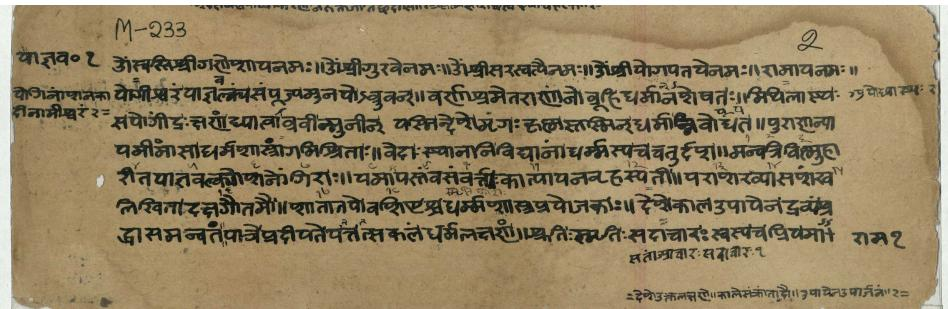
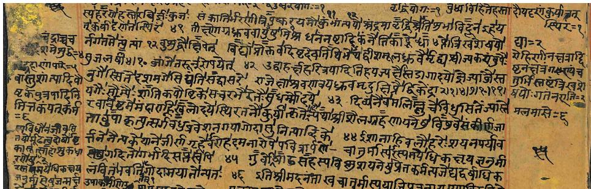
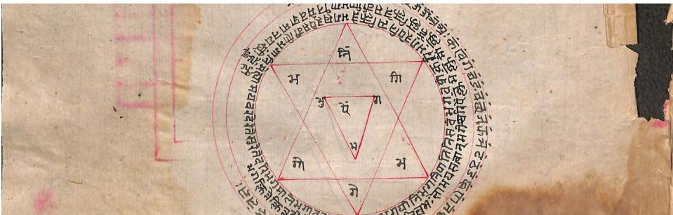
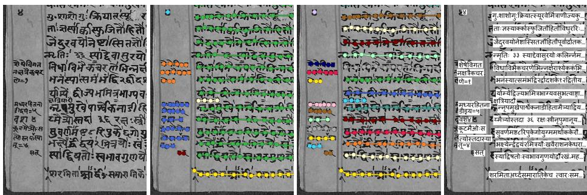
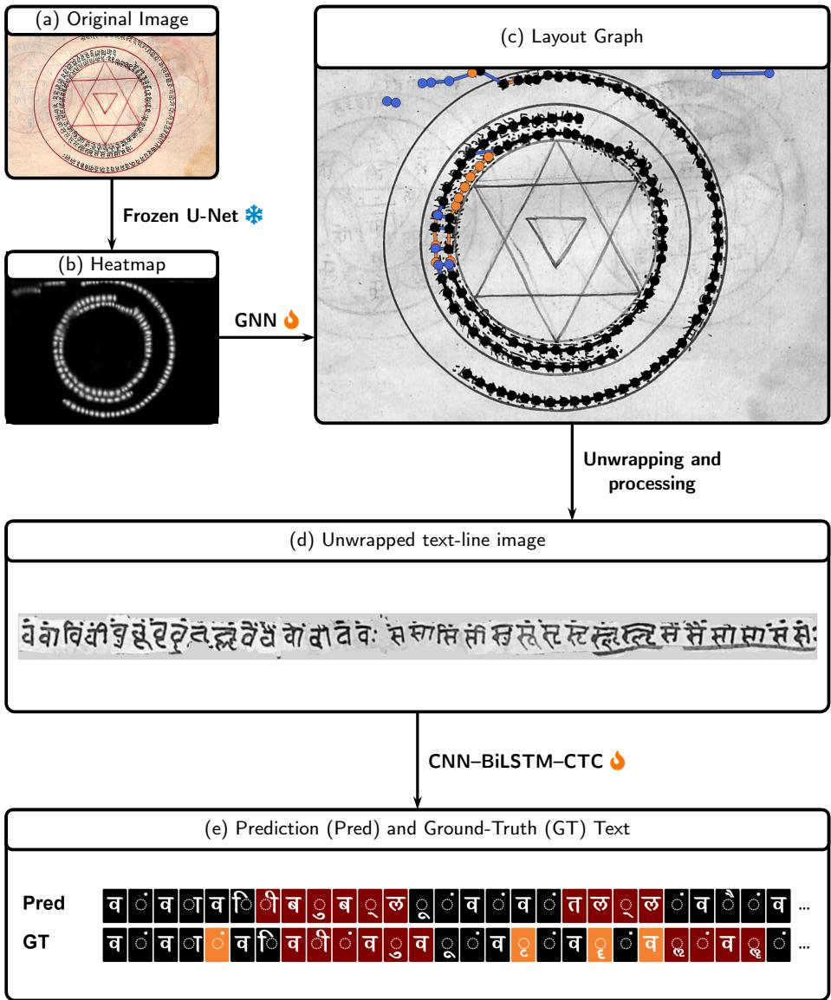
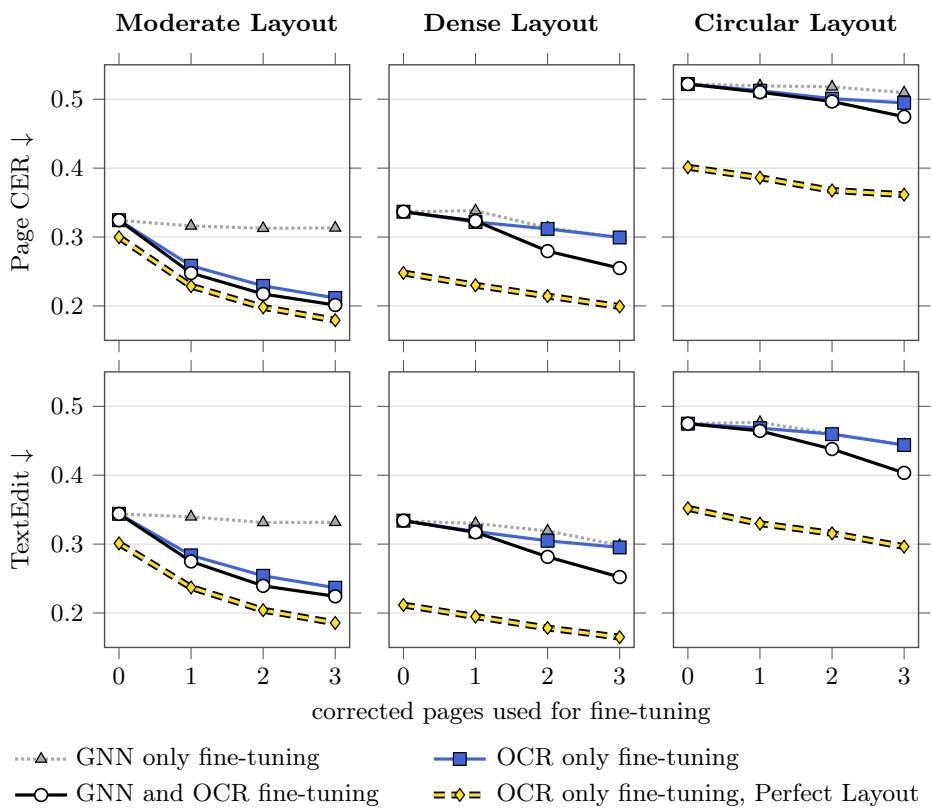

# Impact of Iterative Fine-Tuning on Transcription Accuracy in Complex Historical Sanskrit Manuscripts

Kartik Chincholikar , Kaushik Gopalan , and Mihir Hasabnis

Centre for Inter-disciplinary Artificial Intelligence (CAI),

FLAME University, Pune, India

{kartik.chincholikar,kaushik.gopalan}@flame.edu.in mihir.hasabnis@flame.edu.in

Abstract. Digitizing the text from handwritten historical manuscripts is required to make them easily accessible, preservable, and to enable historical scholars to study them in new ways. Historical manuscripts, however, often exhibit complex heterogeneous layouts and non-standard appearance due to period-specific writing styles, page textures, camera noise, and other nuisance factors, making them dificult to perform OCR on. To tackle this challenge, we introduce a local traditional OCR pipeline, which can be iteratively fine-tuned on the target manuscript at the layout-level and the appearance-level. By adapting to the target manuscript distribution, the proposed Traditional OCR pipeline makes better predictions on subsequent pages, causing iterative reduction in human annotation efort, which is expensive and time-consuming as it requires historical domain expertise. Using this pipeline, we digitize text from three complex historical Sanskrit manuscripts and introduce a dataset with granular layout-level annotations, along with Unicode annotations in the standard PAGE-XML format. We demonstrate quantitative gains due to iterative fine-tuning of the proposed traditional OCR pipeline, and also benchmark the performance of leading Multi-Modal Large Language Models on the introduced Dataset. Code and dataset are available at: https://github.com/flame-cai/gnn-synthetic-layouthistorical/.

Keywords: OCR · Handwritten Text Recognition · Obscure Domains

## 1 Introduction

Digitization of historical manuscripts in Unicode Format makes them easily accessible to researchers and scholars in a digital format, avoiding the risk of damaging the original manuscripts, which are often in a fragile condition. Such digitization also allows historical scholars to search through the manuscripts more quickly, study changes in word usage over time, and track the frequency with which certain ideas appear.

Digitization eforts of historical manuscripts often require specialized historical language and script expertise and are thus expensive and time-consuming to collect, causing the scarcity of annotated data. Furthermore, historical manuscript pages difer from modern digital or printed documents at the Layout-level and at the Appearance-level. Layout-level distribution shifts arise from high heterogeneity in historical page layouts—including marginalia, interlinear glosses, footnotes, and irregular, curved text-lines. Appearance-level distribution shifts occur due to variation in scribal styles, period-specific writing conventions, physical degradation artifacts (e.g., ink bleed-through, fading, staining) and nuisance factors (e.g., camera noise, image compression, paper or palm-leaf textures, uneven illumination, darkened scans).

In this work, we thus digitize three historical Sanskrit manuscripts with complex layouts and non-standard appearances, as illustrated in Fig. 1, using a traditional two-step OCR pipeline: first, we perform layout analysis and segment individual text-line images from manuscript pages, and second, we transcribe those text-line images into machine-readable Unicode text. The proposed traditional pipeline allows us to iteratively fine-tune and adapt the pipeline to the target manuscript - at the layout-level and at the appearance-level, thus progressively reducing the burden of human annotation on subsequent pages. This is important, as historical data is scarce, time-consuming, and expensive to annotate. With this context, our work makes two primary contributions:

1) Fine-tunable Traditional OCR pipeline. We introduce an open-source digitization pipeline, which can be iteratively fine-tuned from human supervision at the layout-level and the appearance-level, allowing progressive reduction in the burden of human annotation of subsequent pages.

2) Curated Dataset. We introduce a high-quality dataset, which is richly annotated at the layout-level and the appearance-level, and is available in the standard PAGE-XML format [53] <sup>1</sup>.

## 2 Literature Review

Modern Multi-Modal LLMs have made significant progress in their OCR capabilities [21,45,54,67,69,70]. However, the benchmark datasets [47,50,65] mostly consider documents in a printed format or in a standard digital format. Therefore, at the date of writing, performing OCR on historical documents with complex, dense layouts with non-standard appearance using Modern Multi-Modal LLMs remains inconsistent [19,20,31], because of a distribution shift of the target distribution from the pre-training distribution, and due to scarcity of annotated data from the target distribution.

To eficiently learn from scarce data, traditional OCR pipelines are hence employed to digitize historical manuscripts [1, 18, 22, 33, 36, 38, 46, 51, 52, 55, 56, 61, 66, 68]. Traditional pipelines broadly consist of two steps: (a) Text-line Segmentation, where the layout of the page is analyzed and individual text-line images are segmented from manuscript pages and (b) text recognition OCR, where the text-line images are transcribed into machine-readable Unicode text.

  
(a) Moderate Layout Manuscript: Yajnavalakyasmritih (Acharadhyayah) [7]

  
(b) Dense Layout Manuscript: Muhurta Martanda [5]

  
(c) Circular Layout Manuscript:Tantra Raj With Yantra And Mantra Uddhara [6]  
Fig. 1: The manuscripts. Samples of pages from the three manuscripts digitized in this case study. The manuscripts exhibit non-standard layout variations, including dense marginalia, circular text, interlinear commentary, irregular text-line orientation, as well as non-standard appearance variations such as ink bleed-through, faded ink, paper degradation, scribe-specific handwriting styles, and period-specific orthographic conventions.

Early text-line segmentation methods follow a projection profile approach successfully; however, they are limited to applications where the manuscript layouts are known a-priori [12, 15, 48]. More recent methods perform end-to-end text-line segmentation (sometimes with subsequent algorithmic post-processing) by predicting bounding polygons or by predicting pixel level masks [9,10,27,30, 35, 39, 49, 58, 63, 63]. Performing such dense end-to-end pixel-level predictions is, however, not robust to distribution shifts commonly encountered in historical manuscripts [3, 4, 16, 22, 34]. To alleviate this, instead of performing dense endto-end pixel-level prediction, recent methods LineTR [2] and CurT [40] use deep learning to extract information from the manuscript images and use it to predict the parameters defining the geometry of piecewise line segments or cubic Bézier curves representing the text lines, thus making efective use of inductive priors and the geometric structure of text-lines. To handle complex unconstrained historical layouts, systems like Kodym and Hradiš [42] jointly estimate baselines, line heights, and pixel-wise text orientations to extract clean line regions. Challenges in text-line segmentation motivated the FEST Competition 2025 (Few-Shot Text-Line Segmentation) [71], with the aim of stimulating research in the design of methods that generalize to target manuscripts when trained on scarce data.

Once the text-line images are segmented, the text content from the textline images can be recognized in a Unicode format using methods which use a Convolutional Neural Network(CNN) for extracting images features, followed by a BiLSTM or an RNN for sequential modelling, with a CTC loss and decoder [23, 29, 37, 57, 60]. More recent methods use the Transformer architecture [64], where an image Transformer extracts the visual features and a text Transformer performs the language modeling and decoding [44]. Beyond architectural designs, recent line recognition methods address domain-specific challenges in historical HTR: AT-ST [41] introduces self-training adaptation to train line recognizers when target domain transcripts are scarce, while TS-Net [43] enables a single recognizer to switch dynamically between diferent transcription styles (e.g., diplomatic versus modernized output).

In traditional pipelines, layout analysis and text-line segmentation are thus prerequisites for performing line level text recognition OCR, and errors in layout analysis and text-line segmentation can negatively impact the downstream text recognition OCR task. Hence, manual work and human supervision might still be required at the layout analysis stage [26]. For manuscripts with non-standard layouts and unconventional reading order, character segmentation (instead of text-line segmentation) is a promising task decomposition [17, 59], ofering increased flexibility to perform layout analysis.

## 3 Dataset

The dataset consists of three historical Sanskrit manuscripts: Yajnavalakyasmritih (Acharadhyayah), Muhurta Martanda, and Tantra Raj With Yantra And Mantra Uddhara. We will henceforth refer to the manuscripts as Moderate Layout Manuscript, Dense Layout Manuscript, and Circular Layout Manuscript respectively, based on their page layouts as illustrated in Fig. 1. Tab. 1 shows the number of pages, the number of text-lines, and grapheme clusters [24,62] in each manuscript. A grapheme cluster corresponds to a visually identifiable unit in the script, but it is made up of two or more Unicode points.

Table 1: Dataset statistics
<table><tr><td rowspan="2">Manuscript</td><td rowspan="2">Pages</td><td colspan="3">Text-lines per page</td><td colspan="3">Grapheme clusters per page</td></tr><tr><td>Min.</td><td>Max.</td><td>Mean</td><td>Min.</td><td>Max.</td><td>Mean</td></tr><tr><td>Moderate Layout</td><td>15</td><td>12</td><td>28</td><td>21.07</td><td>285</td><td>525</td><td>392.27</td></tr><tr><td>Dense Layout</td><td>7</td><td>15</td><td>78</td><td>44.43</td><td>285</td><td>1098</td><td>691.86</td></tr><tr><td>Circular Layout</td><td>9</td><td>10</td><td>65</td><td>28.33</td><td>164</td><td>434</td><td>258.89</td></tr></table>

Annotation Methodology. As illustrated in Figure Fig. 2, we annotate the manuscripts at the Layout-level and Appearance-level. For layout-level annotations, we consider each character (or grapheme cluster) of the manuscript page as a node, with edges connecting nodes with their neighbours in the text-line together. Thus, all nodes belonging to the same text-line have the same label, as shown in Fig. 2(c). Similarly, all nodes belonging to the same text-region have the same label, as shown in Fig. 2(b). The user can hover over the predicted graph while pressing and holding keys "a" or "d" to add or delete edges, respectively. A "right-click" or "left-click" adds or deletes nodes, respectively. Similarly, text-regions can be annotated by pressing and holding "e" and hovering over the text-lines in the text-region. Each graph-based text-line is explicitly linked to it’s corresponding Unicode text content, as illustrated in Fig. 2(d).

While annotating the dataset, we made the following assumptions: (a) We annotate text-regions, such that the reading order of the text-lines inside the text-region must be unambiguous. (b) Given the nature of the marginalia and commentary, the reading order of the text-regions is ambiguous. (c) The reference annotation symbols and numbers that link the main text to the commentary are not annotated. (d) When a watermark overlaps with the handwritten textcontent, we give precedence to the handwritten text-content. (e) If the text-line segmentation incorrectly excludes a diacritic mark in the segmentation, we still annotate it in the Ground-Truth Unicode annotation. (f) If a character or a grapheme cluster is scratched out, causing the character to be illegible, we do not annotate it.

Selection Criteria. The proposed Traditional Pipeline can be used to digitize rare historical manuscripts that fit the following selection criteria: (a) The frozen character segmentation model CRAFT [8] should perform satisfactorily, and (b) A pre-trained text recognition OCR model is available for the manuscript’s script. We believe that these selection criteria should apply to most of the Sanskrit manuscript images archived in culture preservation projects like the eGangotri project<sup>2</sup>, and GyanBharatam<sup>3</sup>.

  
(a) Original image  
(b) Text-region annota- (c) Text-line annotation (d) Unicode annotation tion  
Fig. 2: Rich granular annotations at the Layout-level and Appearance-level. The dataset is also exported in the standard PAGE-XML format.

## 4 Method

Historical manuscripts can vary at the Layout-level, concerning where text is placed: dense pages, marginalia, interlinear text, and curved or circular textlines, and at the Appearance-level, concerning how text looks: handwriting style, period-specific writing conventions, paper texture, and uneven scans. Fig. 3 shows the traditional pipeline, which allows fine-tuning at the Layout-level and at the Appearance-level.

## 4.1 Layout-Level Fine-Tuning

Layout Annotation. The first step of the pipeline is to detect character (or grapheme cluster) locations. The character detector is a frozen pre-trained U-Net, CRAFT [8]. It produces the heatmap in Fig. 3(b). Next, the 2D character locations we get from the heatmap in Fig. 3(b) are used by a Graph Neural Network based layout analysis backbone [16] to perform text-line segmentation. This graph-based problem formulation considers each character (or grapheme cluster) of the manuscript as a node, with edges connecting nodes of the same text-line to their neighbours in the same text-line. First, a preprocessing step is performed to get information-rich node and edge features using geometric inductive priors, after which the GNN performs binary edge classification to predict whether an edge exists between two nodes, giving us the predicted graph seen in Fig. 3(c). This problem formulation decomposes the text-line detection problem into two sub-problems: (i) character detection, and (ii) binary edge classification (connecting characters belonging to the same text-line together). This task decomposition enables the GNN to be pre-trained on large scale, diverse, synthetic layout data in the geometric domain (only consisting of node locations and edge connections), while the character detection task is delegated to the pre-trained frozen CRAFT model [8]. (As illustrated in Fig. 3 (b) to (c)).

  
Fig. 3: Iterative Fine-tuning Pipeline. The frozen  U-Net CRAFT [8] detects character locations in the original image (a) as a heatmap (b). Next, the GNN predicts the layout graph (c) where characters (or grapheme clusters) belonging to the same text-line are connected. In the next step, text-line images are prepared using the GNN predictions, and curved text (if any) is unwrapped and straightened (d). Finally, the CNN–BiLSTM–CTC takes in the text-line images as input, and predicts its text contents as Unicode text (e). In both (c) and (e), the colors denote diferences between the predictions and the ground-truth, and hence illustrate the scope of improvement from iterative fine-tuning of the \ GNN and \ CNN–BiLSTM–CTC. Orange denotes missing nodes, edges, or Unicode characters. Blue denotes extra nodes, edges, or Unicode characters. Maroon denotes modified text, and Black denotes correct nodes, edges, and unicode text.

Iterative GNN Fine-tuning. The predictions of the GNN can be (optionally) corrected manually by the human user for two reasons: (a) to create a supervised training data point which is used to fine-tune the GNN, and (b) for manual correction at inference time. Using the annotated training data points of the target manuscript, we fine-tune a Graph Neural Network with the SplineCNN architecture [25], which is pre-trained on diverse synthetic layouts in the geometric domain to perform a binary edge classification task, where an edge between two nodes is classified as 1 if the nodes are neighbours in the same text-line, and 0 otherwise. If doing manual correction at inference time, the user can also manually add/delete incorrect nodes (in addition to adding/deleting incorrect edges) to account for mistakes in character detection by CRAFT; however, these node manual corrections are not currently used to fine-tune the GNN, as it currently performs only a binary edge classification task. Text-Region annotations, as shown in Fig. 2(b) are also currently done manually.

## 4.2 Appearance-Level Fine-Tuning

Once the layout graph has been corrected, the pipeline prepares one text-line image per text-line, as shown in Fig. 3(d).

Curved Text Unwrapping. In this step, if the detected text is curved, we unwrap it and convert the text from the graph-based format into a rectangular text-line image format, which the downstream text recognition OCR model (CNN–BiLSTM–CTC) requires. For each node along the text-line, we construct a local coordinate system: the tangent direction becomes the horizontal direction of the crop, and the normal direction becomes its vertical direction. Using information from the heatmap, we then sample the manuscript image in these local coordinates to form the rectangular image in Fig. 3(d). In this sense, we consider a circular text-line as a straight line locally; walking along its circular baseline unwraps it into a conventional left-to-right strip for OCR. This step is heuristic, as the circular text is cut at the topmost point in the global page coordinate system to define the start and end of the unwrapped line. It must also prevent diacritics from adjacent text-lines from entering the crop, and choose a reading direction.

OCR Fine-tuning. The text recognition OCR model CNN–BiLSTM–CTC takes the (optionally unwrapped) and processed text-line image as input and predicts its text content as Unicode text, as shown in Fig. 3(e). The predictions can then be corrected by human experts to get ground-truth input-label pairs(text-line image, corrected Unicode text). These input-label pairs are used to fine-tune the CNN–BiLSTM–CTC to adapt to the appearance-level distribution shift of the target manuscript, such as the scribe’s writing style, period-specific writing conventions, page texture, and other nuisance factors. This adaption when done iteratively, allows the CNN–BiLSTM–CTC to make better predictions on subsequent pages and thus also reduces the burden of human annotation iteratively.

## 4.3 Fine-tuning Configuration

System Requirements. All inference, annotation, and fine-tuning were done locally on a laptop with an NVIDIA GeForce RTX 4050 Laptop GPU, an AMD Ryzen processor, and 16 GB RAM. The setup comprises a ${ \mathrm { V u e . j s } }$ front end and connects with the traditional pipeline Flask back end, which orchestrates the iterative fine-tuning and inference. After the user corrects a new page, the layout-level GNN and the appearance-level CNN–BiLSTM–CTC text recognizer are both fine-tuned sequentially using the newly corrected data. The resulting adapted checkpoints are then used to predict the subsequent pages of the same manuscript. On average, adapting the annotation tool to each newly annotated page required 41.10 s for GNN fine-tuning and 27.51 s for CNN–BiLSTM–CTC fine-tuning.

Layout-level GNN fine-tuning. We fine-tune the pre-trained GNN using the human-corrected layout graph of the target manuscript page. As the layoutlevel data is in the 2D geometric domain, where each page is represented by character-node locations and candidate edges rather than manuscript pixels, we can easily augment the corrected page layout 50 times using transformations such as warping, skewing, node drop-out, and node jitter [16]. We fine-tune all GNN parameters for 10 epochs using Adam with a learning rate of $1 0 ^ { - 3 }$ and a batch size of 4. To address the imbalance between positive and negative candidate edges, we use focal loss with $\alpha = 0 . 9$ and $\gamma = 2 . 0$ . The learning rate is linearly warmed up during the first five epochs. Checkpoint selection maximises text-line F1 $\mathrm { ( I o U \ge 0 . 5 ) }$ on the unaugmented fine-tuning pages themselves rather than a held-out split; the fold’s test pages are reserved exclusively for the reported metrics.

Appearance-level text recognition OCR fine-tuning. The pre-trained CNN–BiLSTM–CTC recognizer [15], which is based on the code provided by Clova AI’s deep-text-recognition-benchmark repository<sup>4</sup> and the EasyOCR python package, is fine-tuned on the corrected input-label pairs (text-line image, corrected Unicode text) from the newly annotated page. We use Adadelta with learning rate 0.2, $\rho = 0 . 9 5$ , and $\epsilon = \mathrm { i } 0 ^ { - 8 }$ for 60 iterations, with batch size 1 and gradient clipping at 5. Text-line images are resized to a height of 50 pixels and padded to the maximum width within each batch. Checkpoint selection is in-sample: the accuracy and edit-distance snapshots are scored on unaugmented text-line image–label pairs from the training data, and the two are decided between by page CER on the fine-tuning pages; the fold’s test pages are reserved for the reported metrics.

Annotation Cost. The GNN and the OCR Recognition model are not supervised by the same annotations. The GNN learns from the corrected graph alone and never reads text, whereas the CNN–BiLSTM–CTC needs its input text-line images cut from an already corrected layout, which are then transcribed to get it’s (text-line image, corrected Unicode text) input-label training pairs.

Hence, the annotation cost of fine-tuning the OCR Recognition model on one page subsumes that of fine-tuning the GNN on one page.

## 5 Experiment Setup

Data Splits. For each manuscript, we create five folds using a fixed random seed. In each fold, three pages are reserved for fine-tuning the GNN and the CNN–BiLSTM–CTC, and all remaining pages form the held-out test set. We quantify the gains due to this fine-tuning on 1, 2, and 3 pages by using the heldout test data pages of the respective target manuscript, across 5 folds. Pages may reappear across folds, but the fine-tuning and test sets are disjoint within each fold. Each fine-tuned pipeline checkpoint is evaluated on the same test pages.

Multi-modal large language model pipeline. We also evaluate four ofthe-shelf multi-modal OCR systems: Gemini-3.5-Flash, OpenAI GPT-5.6-Terra, Claude-Sonnet-5, and Sarvam Vision Document Digitization. Gemini, OpenAI, and Claude receive the same resized manuscript-page image and the same endto-end prompt (see Supplementary Material), which requests a diplomatic Unicode Devanagari transcription together with one polygon per visual text-line in a normalized 0–1000 coordinate system following the conventions established in Pix2Seq [13] and PaLI [14], which may favour Gemini 3.5 Flash, as the respective research which set the convention, was done by researchers associated with Google. The JSON outputs are parsed into the standard PAGE-XML representation containing locations of the text-lines in a bounding polygon format, and the corresponding Unicode text content. As Sarvam uses its own Sanskrit documentdigitization API and returns HTML without bounding polygons at the text-line level, we parse the HTML into the same PAGE-XML text-line representation, preserving their emitted order and Unicode text but leaving the geometric information of the text-line location empty. Due to this, Sarvam’s Page-CER metric is evaluated by treating the emitted HTML text-line order as reading order. In the event that API failures or parsing failures occur, we retry 3 more times before considering the prediction of the page as a full failure. Multi-modal large language model predictions are evaluated for the exact same held-out test pages, across the exact five folds used for the traditional pipeline evaluation. The exact MMLLM model identifier requested and the HTTP endpoint it is requested from can be accessed in the Supplementary Material. The raw model responses are provided with the dataset released.

Metrics. We quantify the transcription accuracy using standard metrics TextEdit [50] and Page-CER [11, 28, 32]. The TextEdit metric ignores line order and geometry, as it pairs each ground-truth line with at most one predicted line and counts unmatched lines as missing or extra text. To calculate TextEdit we use the exact same OmniDocBench simple\_match score<sup>5</sup>. Each non-empty PAGE-XML

TextLine is parsed as an atomic item using its direct TextEquiv/Unicode transcription and supplied as an individual text block to the matcher. TextRegion membership is ignored. To calculate Page,-CER we sort the ground-truth and predicted lines from top to bottom and left to right, join the text strings in that order, and then calculate the Character Edit Distance(CER).

## 6 Results

Of-the-Shelf Multi-modal LLMs. Tab. 2 reports the end-to-end performance of the four of-the-shelf multi-modal LLMs on the held-out test pages, aggregated over five folds as described in Sec. 5. Gemini 3.5 Flash performs best on every manuscript and on both metrics, with Sarvam Vision being the second in every case. Every multi-modal LLM ranks the dificulty of the three manuscripts in the same order: Moderate < Dense < Circular on both metrics. The Page-CER of Sarvam Vision on the Circular Layout Manuscript reaches 1.44 [0.57, 2.69], which is caused due to "runaway generation" type of hallucinations in which the model over-generates random tokens, and thus causes the character edit distance to exceed the number of ground-truth characters.

Of-the-Shelf Traditional Pipeline. The traditional pipeline, when used of-the-shelf (with no fine-tuning on the target manuscript and no manual layout correction), performs comparably with Gemini 3.5 Flash as seen the 0-page fine-tuned rows of the "Iterative Fine-tuning (Fully Automatic)" subcolumns of Tab. 3, and the Gemini 3.5 Flash rows in Tab. 2. For the PAGE-CER metric, the of-the-shelf traditional pipeline outperforms Gemini 3.5 Flash on Moderate and Dense Layout Manuscripts but underperforms on the Circular Layout Manuscript. For the TextEdit metric, the traditional pipeline performs worse than Gemini on Moderate and Dense Layout Manuscripts but better on the Circular Layout Manuscript.

Iteratively Fine-tuned Traditional Pipeline (Fully Automatic). While of-the-shelf results are important when performing OCR in bulk quantities, the benefits of iterative fine-tuning become more apparent when performing Historical OCR, where the traditional pipeline needs to adapt to target manuscript heterogeneity. In this setting, fine-tuning the GNN and the CNN–BiLSTM–CTC of the traditional pipeline on pages of the target manuscript helps it adapt to the distribution of the target manuscript at the layout-level and appearance-level, respectively, and improves prediction quality monotonically with each new page fine-tuned, as seen in "Iterative Fine-tuning (Fully Automatic)" subcolumns of Tab. 3. Fine-tuning both models on three pages reduces TextEdit by 34.1% on the Moderate Layout Manuscript, 22.9% on the Dense Layout Manuscript, and 15.5% on the Circular Layout Manuscript. The corresponding Page-CER reductions are 37.5%, 22.9%, and 8.1%. Once fine-tuned on 3 pages of each target manuscript, the traditional pipeline performs substantially better than Gemini 3.5 Flash on all three manuscripts on both metrics.

Table 2: Benchmarking the performance of Multi-Modal Large Language Models using the metrics TextEdit and Page-CER. For Sarvam Vision, <sup>\*</sup> marks Page-CER computed by treating the model’s emitted HTML text-line order as reading order, as Sarvam does not provide text-line level bounding polygons. Each entry reports the metric value followed by its 95% confidence interval. Lower values are better.
<table><tr><td>Manuscript</td><td>Multi-Modal LLM</td><td>TextEdit↓</td><td>Page-CER↓</td></tr><tr><td rowspan="3">Moderate Layout</td><td>Claude Sonnet 5</td><td>0.60 [0.45, 0.76]</td><td>0.64 [0.50, 0.80]</td></tr><tr><td>Gemini 3.5 Flash</td><td>0.26 [0.18, 0.37]</td><td>0.35 [0.29, 0.44]</td></tr><tr><td>GPT 5.6 Terra Sarvam Vision</td><td>0.71 [0.70, 0.73] 0.33 [0.31, 0.36]</td><td>0.74 [0.73, 0.76] 0.39 [0.36, 0.41] *</td></tr><tr><td rowspan="3">Dense Layout</td><td>Claude Sonnet 5</td><td>0.80 [0.60, 1.00]</td><td>0.85 [0.65, 1.00]</td></tr><tr><td>Gemini 3.5 Flash</td><td>0.30 [0.27, 0.34]</td><td>0.44 [0.38, 0.47]</td></tr><tr><td>GPT 5.6 Terra Sarvam Vision</td><td>0.79 [0.77, 0.80] 0.43 [0.25, 0.66]</td><td>0.79 [0.78, 0.79] 0.64 [0.47, 0.79] 光</td></tr><tr><td rowspan="3">Circular Layout</td><td>Claude Sonnet 5</td><td>0.94 [0.83, 1.00]</td><td>0.97 [0.90, 1.00]</td></tr><tr><td>Gemini 3.5 Flash</td><td>0.51 [0.43, 0.59]</td><td>0.51 [0.44, 0.58]</td></tr><tr><td></td><td></td><td></td></tr><tr><td rowspan="3"></td><td>GPT 5.6 Terra</td><td>0.81 [0.78, 0.85]</td><td>0.79 [0.76, 0.82]</td></tr><tr><td>Sarvam Vision</td><td>0.63 [0.49, 0.77]</td><td>1.44 [0.57, 2.69]</td></tr><tr><td></td><td></td><td></td></tr></table>

Table 3: Quantifying the gains due to fine-tuning the Traditional OCR pipeline across manuscripts using the metrics TextEdit and Page-CER. For each metric, Iterative Fine-tuning (Fully Automatic) runs the fine-tuned pipeline inference fully automatically on the pages in the test data, whereas Iterative Fine-tuning (With Manual Layout Correction) denotes performing manual correction of predicted layouts before the downstream text recognition OCR. Metric values are followed by their 95% confidence intervals. Lower values are better.
<table><tr><td rowspan="2">Manuscript</td><td rowspan="2">Pages Fine-tuned</td><td colspan="2">TextEdit ↓</td><td colspan="2">Page-CER↓</td></tr><tr><td>Iterative Fine-tuning (Fully Automatic)</td><td>Iterative Fine-tuning (With Manual Layout Correction)</td><td>Iterative Fine-tuning (Fully Automatic)</td><td>Iterative Fine-tuning (With Manual Layout Correction)</td></tr><tr><td rowspan="4">Moderate Layout</td><td>0</td><td>0.34 [0.32, 0.38]</td><td>0.30 [0.28, 0.32]</td><td>0.32 [0.30, 0.36]</td><td>0.30 [0.28, 0.32]</td></tr><tr><td>1</td><td>0.28 [0.26, 0.30]</td><td>0.24 [0.22, 0.25]</td><td>0.25 [0.24, 0.26]</td><td>0.23 [0.22, 0.24]</td></tr><tr><td>2</td><td>0.24 [0.22, 0.26]</td><td>0.20 [0.19, 0.21]</td><td>0.22 [0.20, 0.23]</td><td>0.20 [0.19, 0.21]</td></tr><tr><td>3</td><td>0.23 [0.21, 0.24]</td><td>0.19 [0.17, 0.20]</td><td>0.20 [0.19, 0.22]</td><td>0.18 [0.17, 0.19]</td></tr><tr><td rowspan="4">Dense Layout</td><td>0</td><td>0.33 [0.29, 0.38]</td><td>0.21 [0.20, 0.23]</td><td>0.34 [0.30, 0.36]</td><td>0.25 [0.23, 0.27]</td></tr><tr><td>1</td><td>0.32 [0.27, 0.37]</td><td>0.19 [0.19, 0.21]</td><td>0.33 [0.30, 0.36]</td><td>0.23 [0.22, 0.24]</td></tr><tr><td>2</td><td>0.28 [0.24, 0.34]</td><td>0.18 [0.17, 0.19]</td><td>0.29 [0.27, 0.30]</td><td>0.22 [0.21, 0.23]</td></tr><tr><td>3</td><td>0.26 [0.21, 0.32]</td><td>0.16 [0.16, 0.17]</td><td>0.26 [0.25, 0.27]</td><td>0.20 [0.19, 0.21]</td></tr><tr><td rowspan="4">Circular Layout</td><td>0</td><td>0.48 [0.44, 0.52]</td><td>0.35 [0.33, 0.38]</td><td>0.52 [0.48, 0.56]</td><td>0.40 [0.37, 0.44]</td></tr><tr><td>1</td><td>0.46 [0.40, 0.51]</td><td>0.33 [0.30, 0.36]</td><td>0.51 [0.47, 0.55]</td><td>0.38 [0.35, 0.42]</td></tr><tr><td>2</td><td>0.44 [0.39, 0.49]</td><td>0.32 [0.29, 0.35]</td><td>0.50 [0.45, 0.54]</td><td>0.37 [0.33, 0.40]</td></tr><tr><td>3</td><td>0.40 [0.35, 0.45]</td><td>0.30 [0.27, 0.33]</td><td>0.48 [0.43, 0.53]</td><td>0.36 [0.33, 0.40]</td></tr></table>

Iteratively Fine-tuned Traditional Pipeline (with Manual Layout Correction). In the above Iterative Fine-tuning (Fully Automatic) setting, the fine-tuned pipeline does inference fully automatically, without any manual layout correction. However, enabling historians and scholars to perform Manual layout correction at inference time (on the test set in this experiment) can ensure that there are no costly layout analysis mistakes that can cause disastrous consequences for the downstream line level text recognition OCR task [26]. In other words, for the "Iterative Fine-tuning (Fully Automatic)" subcolumn, both the GNN and the CNN–BiLSTM–CTC perform inference automatically when fine-tuned on up to three pages. In comparison, in the "Iterative Fine-tuning (With Manual Layout Correction)" setting, the GNN’s predictions are manually corrected at inference time, providing error-free text-line detection, on which the fine-tuned CNN–BiLSTM–CTC performs inference automatically. The performance gap between the columns "Iterative Fine-tuning (Fully Automatic)" and "Iterative Fine-tuning (With Manual Layout Correction)" quantifies the efects of object-level layout-detection errors—and, equivalently, quantifies the benefits of correcting them. We observe that the benefit of manual layout correction is minimal for Moderate Layout Manuscript (12.6% TextEdit and 17.8% Page-CER), and is the greatest for Dense Layout Manuscript (36.2% TextEdit and 36.9% Page-CER). Across all three manuscripts, the traditional pipeline achieves the best performance when fine-tuned on three pages with manual layout corrections enabled. In this experiment, 38.0, 165.5, and 109.0 seconds per page were required on average to perform manual layout correction on the Moderate, Dense, and Circular Layout Manuscripts, respectively.

Fine-tuning Ablations. Fig. 4 compares the gains in downstream OCR accuracy due to GNN-only fine-tuning, OCR-only fine-tuning, and combined finetuning. For the Moderate Layout manuscript, we observe that GNN-only layoutlevel fine-tuning does not help as much as the OCR-only fine-tuning because the pre-trained GNN’s layout predictions are already close to ground-truth, whereas fine-tuning the OCR Recognition model displays rapid adaptation to the target manuscript at the appearance-level. For Dense Layout and Circular Layout manuscripts, GNN-only and OCR-only gains due to fine-tuning are comparable on the TextEdit metric. The combined fine-tuning of GNN and OCR gives compounded improvement. On Circular, fine-tuning both models beats the sum of the two single-model gains by 19% (TextEdit). Considering the annotation cost in terms of annotation time, this compounding is free: a page supervising the OCR recognition model must have its layout corrected before its text-line images can be cut, so the GNN and OCR combined fine-tuning (black, open circles) costs no more than OCR-only fine-tuning (blue, filled squares), while GNN-only fine-tuning (grey dotted, triangles) requires manual layout correction alone.

  
Fig. 4: We fine-tune the traditional pipeline up to three pages (across the same 5-fold train-test split as described in Sec. 5) using three ablations: one where only the GNN is fine-tuned at layout-level, one where only the CNN-BiLSTM-CTC OCR recognition model is fine-tuned at the appearance-level, and one where both are fine-tuned. We also report a fourth ablation where a human annotator manually corrects the layout of the test set pages at inference time, and an iteratively fine-tuned CNN-BiLSTM-CTC OCR recognition model is used to predict the text content from the text-line images. This fourth ablation is meant to mimic the expected working conditions of the Traditional Pipeline Annotation Tool, where manual layout correction takes a few minutes at most.

## 7 Discussion

When used without adaptation to the target manuscript, the traditional pipeline achieves comparable accuracy with the best-performing Multi-Modal LLM Gemini 3.5 Flash.

However, fine-tuning the GNN and the CNN–BiLSTM–CTC of the Traditional pipeline on three corrected pages reduces TextEdit by up to 34.1% and Page-CER by up to 37.5%, thus achieving better results than Gemini 3.5 Flash on all three manuscripts on both metrics. Fine-tuning on each new page thus efectively reduces the human annotation efort required for the next page. This is desirable especially when the data is scarce, and annotation is costly and time-consuming.

In addition to fine-tuning, performing manual layout correction at inference time removes the pipeline’s object-level layout-detection errors, such as incorrectly merged or split text-lines by the GNN, or incorrectly predicted missing or extra nodes by CRAFT. The errors that remain are attributable to the textline unwrapping and processing, and the fine-tuned iterations of the text-line image recognition model CNN–BiLSTM–CTC. When combined with iterative fine-tuning, inference time Manual layout correction further reduced the TextEdit by up to 51.3%, and roughly required tens of seconds to a few minutes per page.

We thus conclude that the specialized Traditional pipeline, which leverages domain knowledge in various ways, is well suited to digitize Sanskrit manuscripts where the data is scarce, and annotation is time-consuming and expensive. However, a limitation of the pipeline is that it is brittle [32], because of it’s step by step nature, use of heuristics in unwrapping and processing the text-line images, and it’s dependence on the frozen pre-trained character detector CRAFT.

We use this brittle but task-specific and locally fine-tunable traditional pipeline to bootstrap the creation of a richly annotated dataset containing layout-level annotations and downstream Unicode transcriptions, represented in both a graphbased format and the standard PAGE-XML format. Notably, the final outputs of the digitization task—namely, text-line locations and Unicode text content—can be externally verified, making them suitable for post-training and fine-tuning modern multimodal large language models. This direction is promising because multimodal large language models are less susceptible to the brittleness of taskspecific traditional pipelines. However, they are more data-intensive and require an initial curated dataset, which the proposed traditional pipeline can efectively bootstrap.

## Acknowledgements

The authors wish to express their thanks to Lalchand Research Library, DAV College, Chandigarh, India, the eGangotri Project, and the Gyan Bharatam Project, for making manuscript data publicly available for educational and research purposes. The authors also wish to express their gratitude to the anonymous reviewers, Dr. Petar Veličković, Dr. Dhaval Patel, Dr. Oliver Hellwig and Dr. Tarinee Awasthi for their invaluable support and feedback. The authors also wish to thank their colleagues Shagun Dwivedi, Janhavi Vaishampayan and Ansh Kushwaha for reviewing this work, and for their insightful suggestions.

## References

1. Adiga, D., Saluja, R., Agrawal, V., Ramakrishnan, G., Chaudhuri, P., Ramasubramanian, K., Kulkarni, M.: Improving the learnability of classifiers for Sanskrit OCR corrections. In: The 17th World Sanskrit Conference, Vancouver, Canada. IASS. pp. 143–161 (2018)

2. Agrawal, V., Vadlamudi, N., Waseem, M., Joseph, A., Chitluri, S., Sarvadevabhatla, R.K.: Linetr:unified text line segmentation for challenging palm leaf manuscripts. ICPR (2024)

3. Agrawal, V., Vadlamudi, N., Waseem, M., Joseph, A., Chitluri, S., Sarvadevabhatla, R.K.: Linetr: Unified text line segmentation for challenging palm leaf manuscripts. In: International Conference on Pattern Recognition. pp. 217–233. Springer (2025)

4. Aubreville, M., Bertram, C., Veta, M., Klopfleisch, R., Stathonikos, N., Breininger, K., ter Hoeve, N., Ciompi, F., Maier, A.: Quantifying the scanner-induced domain gap in mitosis detection. arXiv preprint arXiv:2103.16515 (2021)

5. Author, U.: Muhurta Martanda (841 Gha Alm 4 Shlf 5 Devanagari Jyotish). eGangotri Digital Preservation Trust. Accessed online at: https : / / archive . org / details / MuhurtaMartanda841GhaAlm4Shlf5DevanagariJyotish / mode / 2up (Unknown Year), accessed 16-Aug-2026

6. Author, U.: Tantra Raj With Yantra And Mantra Uddhara 5890 1430 Ka Almira 26 Shlf 3 Devanagari Stotr. eGangotri Digital Preservation Trust. Accessed online at: https : / / archive . org / details / TantraRajWithYantraAndMantraUddhara58901430KaAlmira26Shlf3DevanagariStotr/ mode/2up (Unknown Year), accessed 16-Aug-2026

7. Author, U.: Yajnavalakyasmritih (Acharadhyayah). Lalchand Research Library, DAV College, Chandigarh, India. Accessed online at: https : / / dav . splrarebooks . com / collection / view / yajnavalakyasmritih-acharadhyayah (Unknown Year), accessed: 16-Aug-2026

8. Baek, Y., Lee, B., Han, D., Yun, S., Lee, H.: Character region awareness for text detection. In: Proceedings of the IEEE/CVF conference on computer vision and pattern recognition. pp. 9365–9374 (2019). https://doi.org/10.1109/CVPR.2019. 00959

9. Boillet, M., Kermorvant, C., Paquet, T.: Multiple document datasets pre-training improves text line detection with deep neural networks. In: 2020 25th International Conference on Pattern Recognition (ICPR). pp. 2134–2141. IEEE (2021)

10. Boillet, M., Kermorvant, C., Paquet, T.: Multiple document datasets pre-training improves text line detection with deep neural networks. In: 2020 25th International Conference on Pattern Recognition (ICPR). p. 2134–2141. IEEE (Jan 2021). https://doi.org/10.1109/icpr48806.2021.9412447, http://dx.doi.org/10. 1109/ICPR48806.2021.9412447

11. Boillet, M., Kermorvant, C., Paquet, T.: Robust text line detection in historical documents: learning and evaluation methods. International Journal on Document Analysis and Recognition (IJDAR) 25(2), 95–114 (2022)

12. Chamchong, R., Fung, C.C.: Text Line Extraction Using Adaptive Partial Projection for Palm Leaf Manuscripts from Thailand. In: 2012 International Conference on Frontiers in Handwriting Recognition. pp. 588–593. IEEE, Bari, Italy (Sep 2012). https://doi.org/10.1109/ICFHR.2012.280, http://ieeexplore.ieee. org/document/6424460/

13. Chen, T., Saxena, S., Li, L., Fleet, D.J., Hinton, G.: Pix2seq: A language modeling framework for object detection. arXiv preprint arXiv:2109.10852 (2021)

14. Chen, X., Djolonga, J., Padlewski, P., Mustafa, B., Changpinyo, S., Wu, J., Ruiz, C.R., Goodman, S., Wang, X., Tay, Y., et al.: Pali-x: On scaling up a multilingual vision and language model. arXiv preprint arXiv:2305.18565 (2023)

15. Chincholikar, K., Dwivedi, S., Gopalan, K., Awasthi, T.: A case study of handwritten text recognition from pre-colonial era sanskrit manuscripts. In: Computational Sanskrit and Digital Humanities-World Sanskrit Conference 2025. pp. 52–69 (2025)

16. Chincholikar, K., Gopalan, K., Hasabnis, M.: Towards text-line segmentation of historical documents using graph neural networks. In: ICLR 2026 Workshop on Geometry-grounded Representation Learning and Generative Modeling (2026), https://openreview.net/forum?id=0GoutqIh3l

17. Clanuwat, T., Lamb, A., Kitamoto, A.: Kuronet: Pre-modern japanese kuzushiji character recognition with deep learning. In: 2019 International Conference on Document Analysis and Recognition (ICDAR). pp. 607–614. IEEE (2019)

18. Community, P.: Paddleocr. https://paddlepaddle.github.io/PaddleOCR/main/ en/index.html (nd), accessed: 23-Nov-2024

19. Coquenet, D., Chatelain, C., Paquet, T.: Dan: a segmentation-free document attention network for handwritten document recognition. IEEE transactions on pattern analysis and machine intelligence 45(7), 8227–8243 (2023)

20. Crosilla, G., Klic, L., Colavizza, G.: Benchmarking large language models for handwritten text recognition. Journal of Documentation 81(7), 334–354 (2025)

21. Cui, C., Sun, T., Liang, S., Gao, T., Zhang, Z., Liu, J., Wang, X., Zhou, C., Liu, H., Lin, M., et al.: Paddleocr-vl: Boosting multilingual document parsing via a 0.9 b ultra-compact vision-language model. arXiv preprint arXiv:2510.14528 (2025)

22. Das, D.: Enhancing OCR Performance with Low Supervision. Ph.D. thesis, International Institute of Information Technology Hyderabad (2021)

23. Dwivedi, A., Saluja, R., Sarvadevabhatla, R.K.: An ocr for classical indic documents containing arbitrarily long words. In: Proceedings of the IEEE/CVF Conference on Computer Vision and Pattern Recognition Workshops. pp. 560–561 (2020)

24. Dwivedi, S., Gopalan, K.: Comparative analysis of the intrinsic metrics for tokenizers and their efect on downstream tasks for Hindi and Marathi. In: Liakata, M., Moreira, V.P., Zhang, J., Jurgens, D. (eds.) Proceedings of the 64th Annual Meeting of the Association for Computational Linguistics (Volume 1: Long Papers). pp. 22652–22663. Association for Computational Linguistics, San Diego, California, United States (Jul 2026). https://doi.org/10.18653/v1/2026.acl-long.1037, https://aclanthology.org/2026.acl-long.1037/

25. Fey, M., Lenssen, J.E., Weichert, F., Müller, H.: Splinecnn: Fast geometric deep learning with continuous b-spline kernels. In: Proceedings of the IEEE conference on computer vision and pattern recognition. pp. 869–877 (2018)

26. Fischer, N., Hartelt, A., Puppe, F.: Line-level layout recognition of historical documents with background knowledge. Algorithms 16(3) (2023). https://doi.org/ 10.3390/a16030136, https://www.mdpi.com/1999-4893/16/3/136

27. Fizaine, F.C., Bard, P., Paindavoine, M., Robin, C., Bouyé, E., Lefèvre, R., Vinter, A.: Historical text line segmentation using deep learning algorithms: Mask-rcnn against u-net networks. Journal of Imaging 10(3), 65 (2024)

28. Fizaine, F.C., Bard, P., Paindavoine, M., Robin, C., Bouyé, E., Lefèvre, R., Vinter, A.: Historical text line segmentation using deep learning algorithms: Mask-rcnn against u-net networks. Journal of Imaging 10(3) (2024). https://doi.org/10. 3390/jimaging10030065, https://www.mdpi.com/2313-433X/10/3/65

29. Graves, A., Fernández, S., Schmidhuber, J.: Multi-dimensional recurrent neural networks. In: International conference on artificial neural networks. pp. 549–558. Springer (2007)

30. Grüning, T., Labahn, R., Diem, M., Kleber, F., Fiel, S.: Read-bad: A new dataset and evaluation scheme for baseline detection in archival documents. In: 2018 13th IAPR International Workshop on Document Analysis Systems (DAS). pp. 351–356. IEEE (2018)

31. He, Z., Zhang, C., Wu, Z., Chen, Z., Zhan, Y., Li, Y., Zhang, Z., Wang, X., Qiu, M.: Seeing is believing? mitigating OCR hallucinations in multimodal large language models. In: The Thirty-ninth Annual Conference on Neural Information Processing Systems (2025), https://openreview.net/forum?id=bjoHB7IN6b

32. Heidenreich, H., Elliott, B., Dinica, O., Getachew, Y.: Gutenocr: A grounded vision-language front-end for documents. arXiv preprint arXiv:2601.14490 (2026)

33. Hellwig, O.: Ocr and digitization software for hindi and sanskrit - ind.senz, https: //www.indsenz.com/int/index.php, accessed 16-Aug-2026

34. Hendrycks, D., Zhao, K., Basart, S., Steinhardt, J., Song, D.: Natural adversarial examples. In: Proceedings of the IEEE/CVF conference on computer vision and pattern recognition. pp. 15262–15271 (2021)

35. Jindal, A., Ghosh, R.: Text line segmentation in indian ancient handwritten documents using faster r-cnn. Multimedia Tools and Applications 82(7), 10703–10722 (2023). https://doi.org/10.1007/s11042-022-13709-y

36. Kahle, P., Colutto, S., Hackl, G., Mühlberger, G.: Transkribus-a service platform for transcription, recognition and retrieval of historical documents. In: 2017 14th IAPR International Conference on Document Analysis and Recognition (ICDAR). vol. 4, pp. 19–24. IEEE (2017)

37. Karayil, T., Ul-Hasan, A., Breuel, T.M.: A segmentation-free approach for printed devanagari script recognition. In: 2015 13th International Conference on Document Analysis and Recognition (ICDAR). pp. 946–950. IEEE (2015)

38. Kiessling, B.: Kraken-an universal text recognizer for the humanities. In: ADHO, Éd., Actes de Digital Humanities Conference (2019)

39. Kiessling, B.: A Modular Region and Text Line Layout Analysis System. In: 2020 17th International Conference on Frontiers in Handwriting Recognition (ICFHR). pp. 313–318. IEEE, Dortmund, Germany (Sep 2020). https://doi.org/10.1109/ ICFHR2020.2020.00064, https://ieeexplore.ieee.org/document/9257770/

40. Kiessling, B.: Curt: end-to-end text line detection in historical documents with transformers. In: International Conference on Frontiers in Handwriting Recognition. pp. 34–48. Springer (2022)

41. Kišš, M., Beneš, K., Hradiš, M.: AT-ST: Self-training Adaptation Strategy for OCR in Domains with Limited Transcriptions, p. 463–477. Springer International Publishing (2021). https://doi.org/10.1007/978-3-030-86337-1\_31, http: //dx.doi.org/10.1007/978-3-030-86337-1\_31

42. Kodym, O., Hradiš, M.: Page layout analysis system for unconstrained historic documents (2021), https://arxiv.org/abs/2102.11838

43. Kohút, J., Hradiš, M.: TS-Net: OCR Trained to Switch Between Text Transcription Styles, p. 478–493. Springer International Publishing (2021). https: //doi.org/10.1007/978-3-030-86337-1\_32, http://dx.doi.org/10.1007/978- 3-030-86337-1\_32

44. Li, M., Lv, T., Chen, J., Cui, L., Lu, Y., Florencio, D., Zhang, C., Li, Z., Wei, F.: Trocr: Transformer-based optical character recognition with pre-trained models (2022), https://arxiv.org/abs/2109.10282

45. Liao, H., RoyChowdhury, A., Li, W., Bansal, A., Zhang, Y., Tu, Z., Satzoda, R.K., Manmatha, R., Mahadevan, V.: Doctr: Document transformer for structured information extraction in documents. In: Proceedings of the IEEE/CVF International Conference on Computer Vision. pp. 19584–19594 (2023)

46. Liwicki, M.: 3.8 divadia & hisdoc 2.0 approaches at the university of fribourg to digital paleography. Digital Palaeography: New Machines and Old Texts p. 123 (2014)

47. Nath, O., Kukkala, S., Khapra, M., Sarvadevabhatla, R.K.: Indicdlp: A foundational dataset for multi-lingual and multi-domain document layout parsing. In: Yin, X.C., Karatzas, D., Lopresti, D. (eds.) Document Analysis and Recognition – ICDAR 2025. pp. 23–39. Springer Nature Switzerland, Cham (2026)

48. Nguyen, T.N., Burie, J.C., Le, T.L., Schweyer, A.V.: An efective method for text line segmentation in historical document images. In: 2022 26th International Conference on Pattern Recognition (ICPR). pp. 1593–1599. IEEE (2022)

49. Oliveira, S.A., Seguin, B., Kaplan, F.: dhsegment: A generic deep-learning approach for document segmentation. In: 2018 16th International Conference on Frontiers in Handwriting Recognition (ICFHR). pp. 7–12. IEEE (2018)

50. Ouyang, L., Qu, Y., Zhou, H., Zhu, J., Zhang, R., Lin, Q., Wang, B., Zhao, Z., Jiang, M., Zhao, X., Shi, J., Wu, F., Chu, P., Liu, M., Li, Z., Xu, C., Zhang, B., Shi, B., Tu, Z., He, C.: Omnidocbench: Benchmarking diverse pdf document parsing with comprehensive annotations (2025), https://arxiv.org/abs/2412.07626

51. Papadopoulos, C., Pletschacher, S., Clausner, C., Antonacopoulos, A.: The impact dataset of historical document images. In: Proceedings of the 2Nd international workshop on historical document imaging and processing. pp. 123–130 (2013)

52. Paruchuri, V.: Surya: A Sanskrit OCR tool. https://github.com/VikParuchuri/ surya (nd), accessed: 23-Nov-2024

53. Pletschacher, S., Antonacopoulos, A.: The page (page analysis and ground-truth elements) format framework. In: 2010 20th International Conference on Pattern Recognition. pp. 257–260. IEEE (2010)

54. Poznanski, J., Rangapur, A., Borchardt, J., Dunkelberger, J., Huf, R., Lin, D., Wilhelm, C., Lo, K., Soldaini, L.: olmocr: Unlocking trillions of tokens in pdfs with vision language models. arXiv preprint arXiv:2502.18443 (2025)

55. Saluja, R., Adiga, D., Chaudhuri, P., Ramakrishnan, G., Carman, M.: Error Detection and Corrections in Indic OCR using LSTMs. In: 2017 14th IAPR International Conference on Document Analysis and Recognition (ICDAR). vol. 1, pp. 17–22. IEEE (2017). https://doi.org/10.1109/ICDAR.2017.13

56. Saluja, R., Adiga, D., Ramakrishnan, G., Chaudhuri, P., Carman, M.: A framework for document specific error detection and corrections in indic ocr. In: 2017 14th IAPR International Conference on Document Analysis and Recognition (ICDAR). vol. 4, pp. 25–30. IEEE (2017). https://doi.org/10.1109/ICDAR.2017.308

57. Sankaran, N., Neelappa, A., Jawahar, C.: Devanagari text recognition: A transcription based formulation. In: 2013 12th International Conference on Document Analysis and Recognition. pp. 678–682. IEEE (2013)

58. Sharan, S., Aitha, S., Kumar, A., Trivedi, A., Augustine, A., Sarvadevabhatla, R.K.: Palmira: a deep deformable network for instance segmentation of dense and uneven layouts in handwritten manuscripts. In: International Conference on Document Analysis and Recognition. pp. 477–491. Springer (2021). https: //doi.org/10.1007/978-3-030-86331-9\_31

59. Sharma, A., Jena, P., Joseph, A., Sarvadevabhatla, R.K.: Episam: Character segmentation in challenging stone inscriptions (2026), https://arxiv.org/abs/2606. 28859

60. Shi, B., Bai, X., Yao, C.: An end-to-end trainable neural network for image-based sequence recognition and its application to scene text recognition. IEEE transactions on pattern analysis and machine intelligence 39(11), 2298–2304 (2016)

61. Trivedi, A., Sarvadevabhatla, R.K.: Hindola: a unified cloud-based platform for annotation, visualization and machine learning-based layout analysis of historical manuscripts. In: 2019 International Conference on Document Analysis and Recognition Workshops (ICDARW). vol. 2, pp. 31–35. IEEE (2019). https: //doi.org/10.1109/ICDARW.2019.10035

62. Unicode Consortium: Unicode text segmentation. Unicode Standard Annex 29, Unicode Consortium (Aug 2025), https://www.unicode.org/reports/tr29/ tr29-47.html, revision 47, Unicode 17.0.0; edited by Josh Hadley

63. Vadlamudi, N., Krishna, R., Sarvadevabhatla, R.K.: Seamformer: High precision text line segmentation for handwritten documents. In: International Conference on Document Analysis and Recognition. pp. 313–331. Springer (2023). https: //doi.org/10.1007/978-3-031-41685-9\_20

64. Vaswani, A.: Attention is all you need. Advances in Neural Information Processing Systems (2017)

65. Venna, V.K., Gunda, S.M., Jinka, J.S., Rachakonda, H.S., Srinivasan, A., Sarvadevabhatla, R.K.: M3grounder: Mask-based multi-span and multi-granular grounding for document qa. In: Proceedings of the IEEE/CVF Conference on Computer Vision and Pattern Recognition (CVPR). pp. 23685–23695 (June 2026)

66. Vinitha, V., Jawahar, C.: Error detection in indic ocrs. In: 2016 12th IAPR Workshop on Document Analysis Systems (DAS). pp. 180–185. IEEE (2016). https://doi.org/10.1109/DAS.2016.31

67. Wei, H., Sun, Y., Li, Y.: Deepseek-ocr: Contexts optical compression. arXiv preprint arXiv:2510.18234 (2025)

68. Weil, S., Smith, R., Podobny, Z.: Tesseract. https://github.com/tesseractocr/tesseract (nd), accessed: 23-Nov-2024

69. Xu, Y., Li, M., Cui, L., Huang, S., Wei, F., Zhou, M.: Layoutlm: Pre-training of text and layout for document image understanding. In: Proceedings of the 26th ACM SIGKDD international conference on knowledge discovery & data mining. pp. 1192–1200 (2020)

70. Yin, Y., Liu, H., YY, Xie, Q., Liu, C., Yang, S., Wang, S., Liu, Z., Zou, H., Chen, J., Wei, S., Wu, J., Huang, M., Wu, Z., Wang, G., Du, T., Jia, L.: Unlimited ocr works (2026), https://arxiv.org/abs/2606.23050

71. Zottin, S., De Nardin, A., Branca, G., Piciarelli, C., Foresti, G.L.: Icdar 2025 competition on few-shot text line segmentation of ancient handwritten documents (fest). In: International Conference on Document Analysis and Recognition. pp. 586–602. Springer (2025)

## 8 Supplementary Material

## 8.1 Transcription using Of-the-shelf Multi-Modal LLMs

Gemini-3.5-Flash, OpenAI GPT-5.6-Terra, Claude-Sonnet-5 received the exact same manuscript-page image and the same end-to-end prompt shown in Sec. 8.1 below, which requests a diplomatic Unicode Devanagari transcription together with one polygon per visual text-line in a normalized 0–1000 coordinate system following the conventions established in Pix2Seq [13] and PaLI [14]. This convention might favour Gemini 3.5 Flash, as the research papers which set the convention were authored by researchers associated with Google.

```python
prompt_text = """
You are an expert Indologist and Paleographer specializing in
handwritten Sanskrit manuscripts.
Your Task: Perform a diplomatic transcription (OCR) of the manuscript
image and provide text-line geometry.
CRITICAL INSTRUCTIONS:
1. Output Format: Output ONLY raw valid JSON. No Markdown.
2. Coordinates: Coordinates are normalized from 0 to 1000, where [0,0]
is top-left and [1000,1000] is bottom-right.
3. Geometry: For every visual text-line, output polygon_2d as [[y,x],
...]. Use a tight polygon following the visible line. If the line is
straight and rectangular, box_2d [ymin,xmin,ymax,xmax] is also
acceptable. For curved or circular lines, polygon_2d is mandatory.
4. Granularity: Transcribe at the visual text-line level.
5. Script: Unicode Devanagari.
JSON SCHEMA:
{
"status": "success",
"regions": [
{
"id": "region_0",
"type": "main_text",
"polygon_2d": [[y,x], [y,x], [y,x]],
"box_2d": [ymin, xmin, ymax, xmax],
"lines": [
{
"id": "line_0",
"polygon_2d": [[y,x], [y,x], [y,x]],
"box_2d": [ymin, xmin, ymax, xmax],
"text": "Transcribed text here"
}
]
}
]
}
"""
```

Table 4: The four end-to-end VLM baselines: the exact model identifier requested and the HTTP endpoint it is requested from. Gemini, OpenAI, and Claude receive the resized page image followed by the same VLM\_END\_TO\_END\_PROMPT and return JSON; Sarvam receives the image alone and returns HTML, hence its diferent call shape.
<table><tr><td>Method</td><td>Model</td><td>API endpoint</td></tr><tr><td></td><td>gemini_e2e gemini-3.5-flash</td><td>POST https://generativelanguage.googleapis. com/v1beta/models/gemini-3.5-flash: generateContent</td></tr><tr><td></td><td>openai_e2e gpt-5.6-terra</td><td>POST https://api.openai.com/v1/responses</td></tr><tr><td></td><td>claude_e2e claude-sonnet-5</td><td>POST https://api.anthropic.com/v1/messages</td></tr><tr><td></td><td>sarvam_e2e sarvam-vision†</td><td>POST https://api.sarvam.ai/doc- digitization/job/v1 ‡</td></tr><tr><td></td><td></td><td></td></tr><tr><td></td><td></td><td>and, relative to that base:</td></tr><tr><td></td><td></td><td>POST /upload-files</td></tr><tr><td></td><td></td><td>POST /{job_id}/start</td></tr><tr><td></td><td></td><td>GET /{job_id}/status</td></tr><tr><td></td><td></td><td>POST /{job_id}/download-files</td></tr></table>

<sup>†</sup> Sarvam Vision Document Digitization API accepts no model parameter: the request body carries only language=sa-IN and output\_format=html. sarvam-vision is the identifier recorded in VLM\_PROVIDER\_SPECS and pinned into the cache fingerprint, not a value sent over the wire.  
<sup>‡</sup> Sarvam Vision is asynchronous and job-based: one page is one job, so a single page costs five calls in the order shown (create, upload, start, poll status until terminal, download). upload-files and download-files return presigned object-storage URLs; the page image and the result ZIP transfer over those, not over api.sarvam.ai.

## 8.2 Multi-Modal LLM Provider Information

The exact MMLLM model identifier requested, and the HTTP endpoint it is requested from is shown in Tab. 4. The exact model responses are documented in the dataset released with this paper.