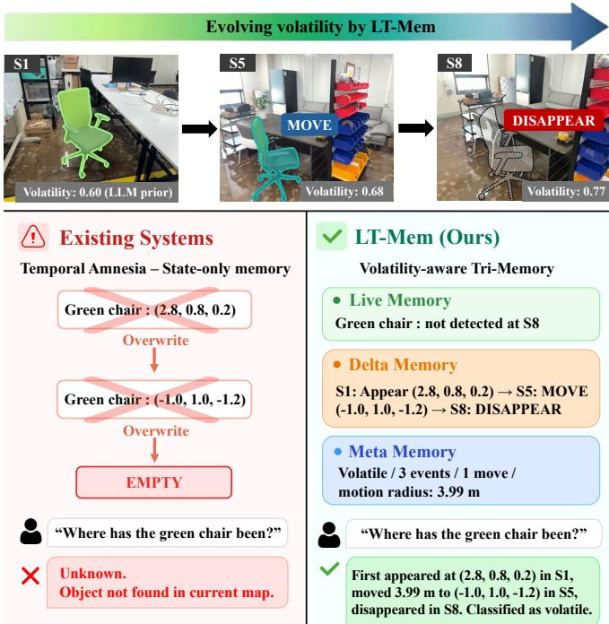
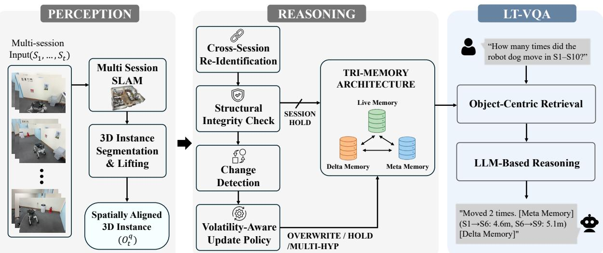
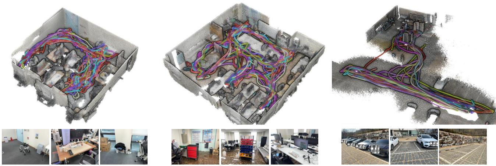
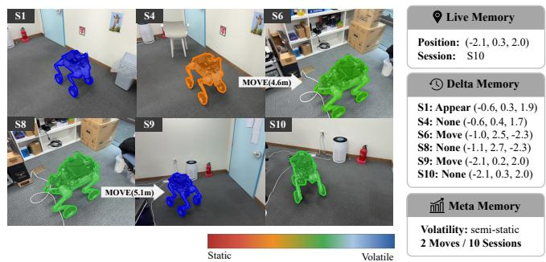
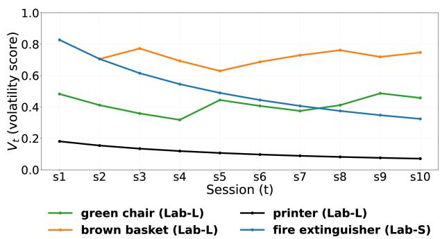
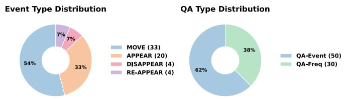
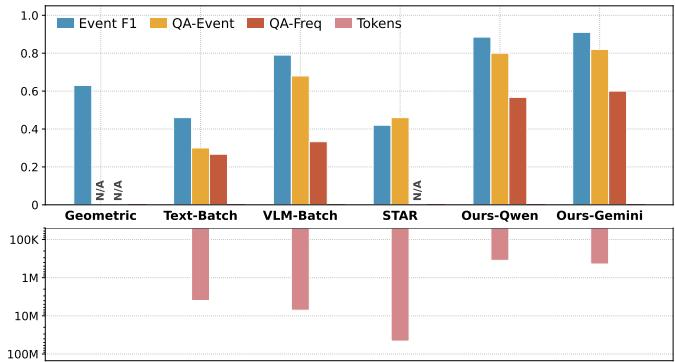
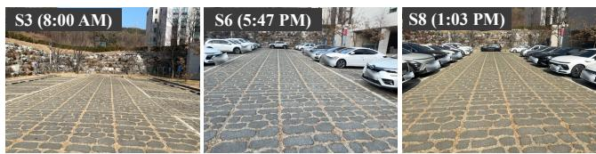

# LT-Mem: Volatility-Aware Spatio-Temporal Memory for Lifelong Scene Understanding

Yumin Lee1, Hyoseok Ju1, and Giseop Kim1∗

Abstract— Long-term robot operation in evolving environments requires object-level understanding that persists across repeated revisits. Existing systems either overwrite history to maintain an up-to-date map or store semantic snapshots without consistent cross-session object identity, resulting in temporal amnesia: the systematic loss of object history that prevents answering queries such as “Where has the green chair been across all sessions?” We propose LT-Mem, a volatilityaware memory evolution framework that unifies spatially aligned instance-level 3D perception with volatility-conditioned temporal reasoning. First, a multi-session SLAM backbone provides spatially aligned per-object observations across sessions. Second, a reasoning layer governs how object memory evolves: deterministic evidence scoring preserves cross-session identity, and a volatility-aware policy selects among overwrite, hold, and multi-hypothesis actions based on each object’s dynamics. Third, the resulting Tri-Memory structure (Live, Delta, Meta) preserves both current states and event histories, enabling longitudinal object-centric reasoning. We further introduce LT-VQA, a dataset and evaluation suite comprising multi-session recordings, persistent identity annotations, and temporal QA pairs. Experiments show that LT-Mem consistently outperforms baselines across all metrics while consuming an order of magnitude fewer tokens, and ablations confirm that gains are driven by the structured memory architecture rather than LLM capacity.

## I. INTRODUCTION

Robots repeatedly revisit evolving environments [1–3]. Across sessions, objects may move, disappear, or be inconsistently observed due to occlusion and alignment noise [4]. Multi-session mapping provides a shared spatial frame [5, 6], but spatial consistency alone does not guarantee that object memory remains valid over time. Lifelong operation requires reasoning about when and how object states should be updated, preserving trajectories of change rather than collapsing them into a single overwritten state. For example, answering a session-indexed query such as: “At Session 3, the robot dog was near the white desk. Where is it at Session 9?” requires persistent cross-session identity and explicit modeling of state transitions. Current systems are not designed for this form of spatio-temporal object-centric reasoning.

  
Fig. 1: Overview of the proposed volatility-aware Tri-Memory framework for multi-session environments. Object observations across revisits are interpreted as events and integrated into Live, Delta, and Meta memories. The frame work adapts update decisions to object volatility, enabling longitudinal object-centric reasoning and visual question answering.

Existing lifelong scene understanding approaches follow two directions: geometry-centric mapping and semantic memory. Geometry-centric systems [4–6] maintain global consistency under change, but reduce object transitions to deletion and re-creation, losing temporal history. Semantic memory approaches [7–9] construct rich representations via view-level embeddings, open-vocabulary 3D scene graphs, or structured exploration memories. However, they typically rely on the latest observation or treat sessions independently, without enforcing persistent cross-session identity. Even when long-horizon context is incorporated, reprocessing accumulated historical video streams becomes computationally demanding and does not scale with prolonged deployment. Consequently, object histories cannot be coherently composed, and session-indexed temporal queries are not directly supported.

To bridge these directions, we first analyze the taxonomy of cross-session object state transitions and the longitudinal queries they entail, as summarized in Table I. This taxonomy clarifies the types of memory evolution required for sustained long-term operation. Building upon this analysis, we propose LT-Mem, a volatility-aware memory evolution framework with two layers: a perception layer for spatially aligned object observations, and a reasoning layer that governs memory updates.

TABLE I: Taxonomy of object-level events and corresponding longitudinal queries supported by LT-Mem. The upper section defines event types with representative queries; the lower section lists compound query types that require reasoning across multiple sessions.
<table><tr><td>Event</td><td>Description</td><td>Example Query</td><td>Required Memory</td></tr><tr><td>APPEAR</td><td>Object first observed in session  $S _ { t }$ </td><td>“When did the scissors first appear?&quot;</td><td>Delta</td></tr><tr><td>DISAPPEAR</td><td>Object no longer detected after St</td><td>&quot;Was the vacuum in the room at Session  $9 ? ^ { \prime }$ </td><td>Delta</td></tr><tr><td>MOVE</td><td>Centroid displacement beyond threshold</td><td>&quot;Did the brown basket move at Session  $6 ? ^ { \dag }$ </td><td>Delta</td></tr><tr><td>NONE</td><td>No state change detected in session St</td><td>&quot;Did the fridge stay in place at Session  $4 ? ^ { \ast }$ </td><td>Delta</td></tr><tr><td>RE-APPEAR</td><td>Object returns after prior disappearance</td><td>“Did the green chair come back at Session  $9 ? ^ { \prime }$ </td><td>Delta</td></tr><tr><td colspan="4">Compound (multi-session reasoning)</td></tr><tr><td>Trajectory</td><td>Sequence of transitions across all sessions</td><td>&quot;Where has the blue tote bag been across all sessions?&quot;</td><td>Delta, Meta, Live</td></tr><tr><td>Volatility</td><td>Frequency and magnitude of changes</td><td>&quot;Which object moved most frequently?&quot;</td><td>Meta</td></tr><tr><td>Temporal localization</td><td>Identifying when a change occurred</td><td>“&quot;When was the last time the white board moved?&quot;</td><td>Delta</td></tr><tr><td>Counterfactual</td><td>Comparing states at two specific sessions</td><td>&quot;Was the robot dog in the same location in  $S _ { 1 }$  and  $S _ { 1 0 } ? ^ { \prime }$ </td><td>Delta, Live</td></tr></table>

• Perception layer. We extend MASt3R-SLAM [10] for multi-session alignment and apply instance-level 3D segmentation [11] to extract per-object centroids, volumes, and semantic embeddings.

• Reasoning layer. Cross-session identity is resolved through deterministic evidence scoring (E1–E5 in Table II), including appearance and spatio-temporal consistency, with a constrained LLM used only for ambiguous cases. A volatility-aware policy then selects among overwrite, hold, and multi-hypothesis updates based on object dynamics and alignment quality.

The reasoning outputs are organized into a Tri-Memory structure: Live Memory stores current states, Delta Memory records timestamped events, and Meta Memory accumulates long-term statistics such as volatility. This preserves both present states and historical trajectories, enabling longhorizon temporal queries. Because the reasoning layer operates over compact structured representations rather than raw visual streams, LT-Mem achieves strong temporal reasoning with per-session token cost independent of frame count, enabling scalable lifelong operation.

To evaluate this capability, we introduce the LT-VQA dataset1, which provides multi-session recordings with aligned poses, per-object annotations, and temporal QA pairs. Unlike single-session QA datasets such as NaVQA [7], LT-VQA targets long-term map management across sessions, evaluating whether the system correctly identifies what changed, when, and across which sessions.

In summary, this work makes the following contributions:

• We propose LT-Mem, a volatility-aware memory evolution framework in which update decisions are governed by a volatility-conditioned reasoning layer, optionally assisted by a constrained LLM, producing a Tri-Memory structure (Live, Delta, Meta) that preserves both current and historical object states.

• We construct LT-VQA, a dataset and evaluation suite requiring persistent object identity and structured temporal reasoning across multi-session revisits.

• We demonstrate that volatility-aware evolution improves long-horizon object-centric reasoning over overwrite and accumulation baselines, while reducing token consumption by up to an order of magnitude compared to vision-based approaches.

## II. RELATED WORK

## A. Lifelong Spatial Mapping

Long-term autonomy requires maintaining spatial consistency across repeated revisits while accommodating environmental change. Classical systems such as LT-mapper [6] and Pomerleau et al. [5] detect map–observation discrepancies and resolve them by removing or correcting outdated elements. More recently, Khronos [4] constructs dense spatiotemporal metric-semantic maps that unify short-term dynamics and long-term scene changes, but does not maintain an identity-preserving event log for individual objects. Even probabilistic approaches that track per-object stationarity scores [12] ultimately discard past object states to refresh the map rather than retaining state histories. When an object relocates from position A to B, the prior state is overwritten or removed rather than recorded as part of a temporal trajectory. We refer to this systematic loss of object state history as temporal amnesia, a limitation that prevents answering longitudinal queries such as “How many times has the robot dog moved?”

## B. Semantic Scene Memory

A complementary direction constructs a robot’s longterm memory around semantic representations. View-based systems such as ReMEmbR [7] accumulate observationlevel embeddings for retrieval-augmented reasoning, while object-level approaches embed foundation model features into 3D representations such as point clouds [8] or scene memory [9]. A recent approach [13] further extends this to a hierarchical 4D scene graph with detailed spatio-temporal descriptions. However, view-level memory does not enforce explicit cross-session data association; two observations of a “chair” may or may not correspond to the same physical instance. Object-centric semantic maps operate within a single session and typically commit to the most recent state without modeling transitions, exhibiting the same temporal amnesia as geometry-centric systems. Even retrieval agents that recall raw observations on demand [14] keep only raw records, so neither family maintains the structured, identityresolved temporal histories required for longitudinal objectcentric reasoning.

  
Fig. 2: System pipeline. (Left) The Perception layer aligns multi-session observations and extracts object instances via 3D segmentation. The Reasoning layer performs integrity-checked memory evolution, including identity matching, change detection, and volatility-aware update selection. (Right) Updated states are organized in the Tri-Memory (Live, Delta, Meta) and retrieved through object-centric retrieval to support long-term visual question answering.

## C. 3D Foundation Models and the Perception–Reasoning Gap

Dense reconstruction methods such as DUSt3R [15] and MASt3R [10] enable metrically accurate multi-view geometry without task-specific training, while universal segmentation models such as SAM3 [11] provide instance-level object extraction across diverse environments. Yet enhanced perceptual accuracy alone does not resolve the long-standing update dilemma: whether to overwrite or accumulate conflicting observations. LT-Mem bridges this gap by coupling spatially grounded object instances with a volatility-conditioned reasoning layer that governs identity and update logic, producing the Tri-Memory structure as a natural organization of its heterogeneous outputs.

## III. METHOD

## A. Problem Formulation

We consider an environment observed across T sessions (i.e., independent mapping runs conducted at different times) $S _ { 1 } , \ldots , S _ { T }$ , where objects may move, appear, disappear, or be temporarily occluded. For each object $q$ in session $S _ { t }$ , the perception layer produces a 3D observation

$$
o _ { t } ^ { q } = \left( \mathbf { c } _ { t } ^ { q } , \nu _ { t } ^ { q } , \mathbf { f } _ { t } ^ { q } \right) ,\tag{1}
$$

where $\mathbf { c } _ { t } ^ { q } \in \mathbb { R } ^ { 3 }$ is the centroid, $\nu _ { t } ^ { q }$ denotes volume, and $\mathbf { f } _ { t } ^ { q }$ is a visual embedding extracted from the segmented region. The system maintains a persistent memory $\mathcal { M } ^ { q }$ that is updated after each session to support long-term temporal queries such as “Where is the white chair now?” and “How often does the robot dog move?”

## B. Perception Layer

1) Multi-Session Simultaneous Localization and Mapping (SLAM): We build on MASt3R-SLAM [10], which estimates camera poses and dense point maps from monocular video using 3D reconstruction priors. To align observations across sessions into a shared global frame, we build on MR.ScaleMaster [16], which estimates per-session scale via Sim(3) anchor nodes [17]. Each session $S _ { t }$ maintains keyframe poses $X _ { i } ^ { t } \in \mathrm { S i m } ( 3 )$ in a session-local frame, and an anchor node $A ^ { t } \in \mathrm { S i m } ( 3 )$ maps this local frame to the global frame, so that the world-frame pose of keyframe i is $T _ { i } ^ { t } = A ^ { t }$ $X _ { i } ^ { t }$ . Inter-session loop closures are established by matching keyframe images across sessions using MASt3R [18] and computing relative Sim(3) constraints via ray-based geometric optimization. The resulting factor graph, containing intra-session odometry edges and inter-session loop-closure edges, is optimized jointly using g2o [19], yielding globally consistent trajectories across all sessions. This multi-session alignment provides the spatial backbone for LT-Mem. Because all per-session object observations are expressed in the same global coordinate frame, the reasoning layer can directly compare object centroids across sessions and detect state transitions such as displacement or disappearance.

2) Instance Segmentation and 3D Lifting: For each keyframe in session $S _ { t } .$ , we apply SAM3 [11] with text prompts to obtain 2D instance masks. Given globally consistent poses and dense pointmaps from the SLAM backend, each mask region is projected into the global frame to obtain per-instance 3D points, from which centroid $\mathbf { c } _ { t } ^ { q } .$ , volume $\nu _ { t } ^ { q }$ and visual embedding $\mathbf { f } _ { t } ^ { q }$ are computed. Within a session, fragmented detections of the same instance are merged using spatial consistency and point-cloud clustering, yielding one consolidated observation $o _ { t } ^ { q }$ per object per session.

TABLE II: Evidence scores for cross-session reidentification.
<table><tr><td>Score</td><td>Cue</td><td>Role</td></tr><tr><td> $E _ { 1 }$ </td><td>Spatial proximity</td><td>Weak prior; avoids penalizing displacement</td></tr><tr><td> $E _ { 2 }$ </td><td>Temporal continuity</td><td>Stabilizing cue across consecutive sessions</td></tr><tr><td> $\bar { E _ { 3 } } \bar { }$ </td><td>Feature similarity</td><td>Primary signal; robust to viewpoint change</td></tr><tr><td> $E _ { 4 }$ </td><td>Motion consistency</td><td>Conditioned on volatility estimate</td></tr><tr><td> $E _ { 5 }$ </td><td>Occlusion handling</td><td>Suppresses false disappearance</td></tr></table>

## C. Reasoning Layer

1) Cross-Session Re-Identification: When revisiting an environment, geometric proximity alone is insufficient for identity preservation. Given a session-level observation and candidate tracks from previous sessions, we compute five normalized evidence scores (Table II). The re-identification confidence is their weighted combination, where each $E _ { i } \in$ [0, 1] and $\textstyle \sum _ { i } w _ { i } = 1$

To reduce the search space, candidate tracks are prefiltered via embedding-based retrieval over a persistent vector store. Top-k (k=5 in all experiments) candidates are retrieved based on cosine similarity. If retrieval yields no confident candidates, all cross-session tracks with compatible semantic labels are considered. Final association follows a hybrid strategy. Simple cases are resolved by deterministic hard rules (e.g., first observation, class mismatch). Ambiguous cross-session cases are delegated to a constrained LLM judge that outputs one of MATCH, NEW-TRACK, or HOLD under a strictly constrained output space. Thus, structured evidence governs most associations; the LLM is invoked only for final disambiguation and does not modify evidence scores, operating strictly over pre-computed structured inputs.

2) Structural Integrity Check: Before updating memory, we verify global alignment quality using structural anchors. For each session, anchor centroids observed in the current session are compared against their registered positions in Live Memory. We compute the mean anchor displacement $\bar { d } _ { \mathrm { a n c h o r } }$ across all matched anchors. If $\bar { d } _ { \mathrm { a n c h o r } } > \tau _ { \mathrm { a l i g n } }$ SESSION HOLD is triggered: all updates for that session are skipped and an alignment-failure event is recorded. This mechanism prevents corrupted observations from propagating into memory under global misalignment.

3) Change Detection: We compute the inter-session displacement $d = \| \mathbf { c } _ { t } ^ { q } - \mathbf { c } _ { t - 1 } ^ { q } \|$ . Rather than relying on a single threshold, we apply a priority-ordered deterministic rule set that considers: (i) alignment quality, (ii) missing-evidence signals (disappearance from the old location), and (iii) volatility-conditioned motion tolerance.

4) Volatility-Aware Memory Update: The volatility score $V _ { t } \in [ 0 , 1 ]$ is updated using a normalized evidence accumulation rule:

$$
V _ { t } = { \frac { P ( E _ { t } \mid V _ { t - 1 } ) V _ { t - 1 } } { P ( E _ { t } \mid V _ { t - 1 } ) V _ { t - 1 } + P ( E _ { t } \mid 1 - V _ { t - 1 } ) ( 1 - V _ { t - 1 } ) } } ,\tag{2}
$$

where $E _ { t } ~ \in ~ \{ \mathrm { N O N E }$ MOVE, APPEAR, DISAPPEAR, RE-APPEAR} is modeled as a fixed monotonic function of V (e.g., $P ( \operatorname { M O V E } \mid V )$ increases with V), serving as a lightweight temporal evidence accumulator, and is not learned. The initial prior $V _ { 0 }$ is obtained via a one-time LLM query conditioned on the object’s semantic label. Fig. 5 illustrates how LT-Mem updates $V _ { t }$ across sessions for objects with different dynamics; the empirical behavior is discussed in Sec. IV.

Given the change decision and volatility estimate, a deterministic update policy selects one of three actions:

• HOLD: preserve the previous state under low confidence or occlusion,

• OVERWRITE: commit the new state,

• MULTI-HYPOTHESIS: retain competing location hypotheses.

Under MULTI-HYPOTHESIS, a small set of candidate states is maintained with confidence scores. A hypothesis is promoted when its confidence exceeds competing hypotheses by a margin ∆ over consecutive sessions. As consistent evidence accumulates for a dominant location, competing hypotheses are consolidated. The highest-confidence hypothesis is used for present-state queries.

## D. Tri-Memory Architecture

The update actions described above produce three distinct types of outputs: a current state estimate, a timestamped event record, and long-term statistics. To organize these heterogeneous outputs, memory Mq is structured into three complementary components (Fig. 1). We emphasize that the Tri-Memory design is not proposed as an independent architectural contribution; rather, it is a direct consequence of the volatility-aware reasoning layer, which produces distinct outputs—state estimates, event records, and long-term statistics—that cannot be collapsed into a single map representation without reintroducing the temporal amnesia described in Sec. II. We note that the terminology of delta and meta maps has precedent in lifelong mapping literature [6], where they denote geometric point-cloud differences and map-level statistics used to detect and remove outdated spatial elements. In contrast, LT-Mem’s Delta and Meta Memories operate at the object-semantic level: Delta Memory records identitypreserving state transitions (e.g., a specific chair moved from A to B at session $S _ { 5 } )$ , while Meta Memory accumulates perobject behavioral statistics such as volatility scores that feed back into the update policy. This shift from point-level map differencing to object-level event logging is what enables structured temporal queries that purely geometric delta maps cannot support.

Live Memory stores the current confirmed state of each object. When the update policy selects OVERWRITE, the previous state is replaced; under MULTI-HYPOTHESIS, a small set of competing location hypotheses is maintained alongside their confidence scores. Present-state queries (e.g., “Where is the white chair now?”) are resolved directly from this component.

Delta Memory records a timestamped, per-object event log. Each update action appends a structured entry: MOVE, APPEAR, DISAPPEAR, RE-APPEAR, or NONE, along with session index and metric context (e.g., displacement magnitude).

  
Fig. 3: Overview of the three LT-VQA environments and dataset. Each column shows a globally aligned 3D point-cloud map with multi-session trajectories overlaid (top) and representative RGB frames (bottom). (Left) Lab-S: a compact indoor room with 10 tracked objects. (Middle) Lab-L: a larger indoor space with more complex layout. (Right) Parking Lot: an outdoor scene for spatial statistics evaluation. Trajectory colors distinguish individual sessions; object configurations change across sessions due to relocation and temporary disappearance.

TABLE III: LT-VQA dataset overview. (Top) Task types and target environments. (Bottom) Recording statistics per environment.
<table><tr><td>Task Type</td><td>Environment</td><td colspan="3">Description</td></tr><tr><td>Instance History</td><td>Lab-S, Lab-L</td><td colspan="3">Per-object state transitions across sessions</td></tr><tr><td>Spatial Statistics</td><td>Parking Lot</td><td colspan="3">Aggregate occupancy and count patterns</td></tr><tr><td>Env.</td><td>Task Type</td><td>#Sess</td><td>Frames/Sess</td><td>Duration/Sess</td></tr><tr><td>Lab-S</td><td>Instance History</td><td>10</td><td>116-159</td><td>1.6–2.1 min</td></tr><tr><td>Lab-L</td><td>Instance History</td><td>10</td><td>115-183</td><td>2.6–3.3 min</td></tr><tr><td>Parking Lot</td><td>Spatial Statistics</td><td>10</td><td>124-195</td><td>2.2–3.2 min</td></tr></table>

Alignment-failure events from the Structural Integrity Check are also logged, preserving an auditable record even when updates are suppressed. Event-history queries (e.g., “When did the scissors first appear?”) and counterfactual queries (e.g., “Was the robot dog in the same place in S1 and S10?”) are answered by traversing this log.

Meta Memory accumulates long-term statistics derived from the event log, including the volatility score Vt and perobject change frequency. These statistics feed back into the reasoning layer: Vt conditions the motion tolerance in subsequent sessions, closing the loop between observation and update policy. Aggregate queries (e.g., “Which object moved most frequently?”) are answered from this component.

At query time, an object-centric retrieval module routes each question to the relevant memory component(s) based on query type (Table I). Metric queries such as displacement or frequency are answered via deterministic computations over the event log, ensuring numerically grounded responses independent of LLM hallucination.

## IV. EXPERIMENTS

## A. Dataset

We construct LT-VQA, a controlled multi-session dataset for evaluating long-term object-centric scene understanding. It jointly provides globally aligned multi-session geometry, persistent object-instance identity, event-level state transition annotations, and session-indexed temporal QA pairs. While 3RScan [20] provides instance-level correspondence across rescans, it lacks event-level annotations and temporal QA supervision. To our knowledge, no existing multi-session dataset jointly provides these components; unlike singlesession VQA, cross-session event annotation requires meticulous multi-temporal alignment per object, making dense labeling inherently resource-intensive.

Two indoor environments, Lab-S and Lab-L, each track 10 objects over 10 sessions with evolving object configurations across sessions (Table III), ranging from highly volatile instances (e.g., brown basket, scissors) to fully stationary ones (e.g., fridge, sofa). Representative queries for each event type are listed in Table I. Ground-truth annotations provide per-session event labels (APPEAR, DISAPPEAR, MOVE, RE-APPEAR, NONE); annotation statistics are shown in Fig. 6. The Parking Lot sequence extends evaluation to an outdoor setting with 10 sessions recorded across different days and times of day, targeting aggregate spatio-temporal patterns.

## B. Experimental Setup

Data Collection. All sequences are captured as monocular RGB video (Lab-L and Parking Lot with iPhone 15 Pro; Lab-S with iPhone 17 Pro) and processed through our multisession SLAM pipeline.

Implementation Details. All experiments are conducted on an NVIDIA RTX 5070 Ti GPU with 64 GB of RAM. For LLM-dependent components, both LT-Mem and applicable baselines use Gemini 2.5 Pro to ensure consistent comparison. Object-centric retrieval uses BGE-smallen-v1.5 with ChromaDB, without invoking the LLM during retrieval. For cross-session re-identification (Table II), the evidence weights are w1=0.05, w2=0.20, w3=0.45, w4=0.15, $w 5 { = } 0 . 1 5$ . The alignment gating threshold (Sec. III-C.2) is $\tau _ { \mathrm { a l i g n } } { = } 0 . 3 \mathrm { m }$

  
Fig. 4: Tri-Memory example for the robot dog in Lab-S over 10 sessions. The color overlay encodes the evolving volatility score V (red: static, blue: volatile). Two MOVE events are recorded in Delta Memory with metric context; Live Memory reflects the final confirmed position at S10, Meta Memory classifies the object as semi-static.

  
Fig. 5: Evolution of $V _ { t }$ across sessions (t = 0: LLM-initialized prior). Four representative dynamics are shown: persistent high volatility (brown basket); progressive correction of an initially overestimated prior (fire extinguisher); mid-range fluctuation with partial recovery (green chair); and near-zero convergence throughout (printer).

## C. Evaluation Protocol

We report three metrics for Instance History Tracking. An event denotes an object-level state transition between consecutive sessions—one of MOVE, APPEAR, DISAPPEAR, RE-APPEAR, or NONE. Event F1 treats each ground-truth event as a positive instance, measuring detection precision and recall. QA-Event measures exact-match accuracy on natural-language queries about object event histories (e.g., “What happened to the robot dog at Session 6?”). QA-Freq evaluates frequency queries (e.g., “How many times did the robot dog move?”) against ground-truth statistics accumulated in Meta Memory. QA-Event and QA-Freq are evaluated automatically by matching structured JSON outputs against ground-truth annotations.

For Instance History Tracking, we compare against four baselines that represent distinct paradigms for multi-session object reasoning. Existing systems such as Khronos [4], ConceptGraphs [8], and ReMEmbR [7] do not produce object-level event logs or support temporal QA, and augmenting each to do so would require modules outside their original design scope. Our baselines instead isolate core reasoning paradigms to enable controlled evaluation.

  
Fig. 6: LT-VQA annotation statistics. (Left) Ground-truth event type distribution across Lab-S and Lab-L (61 statechange events; NONE events omitted). (Right) QA pair distribution by query type (80 pairs total).

TABLE IV: Representative QA outputs from LT-Mem, grouped by the memory component used for retrieval.
<table><tr><td rowspan=1 colspan=1>Delta Memory</td></tr><tr><td rowspan=1 colspan=1>Q: &quot;When did the scissors first appear?&quot;A: The scissors first appeared in Session 3.Q: &quot;What happened to the robot dog at Session $6 ? ^ { \dag }$ A: At Session 6, the robot dog moved from (–0.81, 0.43, 1.77) to(−0.97, 2.52, −2.27).</td></tr><tr><td rowspan=1 colspan=1>Live Memory</td></tr><tr><td rowspan=1 colspan=1>Q: &quot;Where did the trash bin end up after all sessions?&quot;A: At the end (S10), the trash bin was at (−0.65, 0.52, 1.49).Q: &quot;Where is the green chair now?&quot;A: At (2.95, 0.89, 0.25) as of Session 10.</td></tr><tr><td rowspan=1 colspan=1>Meta Memory</td></tr><tr><td rowspan=1 colspan=1>Q: &quot;Can I use the printer as a navigation landmark?&quot;A: Yes. Volatility 0.02, highly stable. Use its position at(−1.75, 0.28, 0.50) from S1 as reference.Q: &quot;Which object moved most frequently?&quot;A: The brown basket (4 moves).</td></tr></table>

Geometric Only. Following the geometry-centric lifelong mapping paradigm [6], we construct a baseline that detects object-level changes via distance thresholding over session observations. Because this approach maintains only the current map state without an event log, event-history and frequency queries are structurally unanswerable, reported as N/A.

Text-Batch. Each keyframe is independently captioned and aggregated into a session-level summary. Object-level events are inferred by comparing consecutive session summaries. Without explicit cross-session object identity or spatial grounding, this approach cannot reliably detect spatially grounded transitions such as MOVE and RE-APPEAR; only coarse presence changes (APPEAR, DISAPPEAR) are partially captured.

VLM-Batch. For each object, all keyframes across all sessions are provided as a single batch query for direct statetransition judgment. This baseline has full temporal visual context but relies entirely on the VLM’s implicit reasoning without structured memory or volatility-aware update logic. STAR. We evaluate STAR [14], a recent agentic memory– action retrieval system, directly on LT-VQA, disabling only its embodied navigation actions—inapplicable in our passive setting—so the agent answers each query by iteratively retrieving captioned and raw visual records from its non-

TABLE V: Main results on LT-VQA (Lab-S and Lab-L combined). LT-Mem outperforms baselines across all metrics with high token efficiency.
<table><tr><td>Method</td><td>Event F1 ↑</td><td>QA-Event ↑</td><td>QA-Freq ↑</td><td>Tokens ↓</td></tr><tr><td>Geometric Only</td><td>0.630</td><td>N/A</td><td>N/A</td><td></td></tr><tr><td>Text-Batch</td><td>0.460</td><td>0.300</td><td>0.267</td><td>3,973K</td></tr><tr><td>VLM-Batch</td><td>0.790</td><td>0.680</td><td>0.333</td><td>7,114K</td></tr><tr><td>STAR† [14]</td><td>0.420</td><td>0.460</td><td>N/A</td><td>45,859K</td></tr><tr><td>Ours (Qwen2.5)</td><td>0.885</td><td>0.800</td><td>0.567</td><td>352K</td></tr><tr><td>Ours (Gemini 2.5)</td><td>0.910</td><td>0.820</td><td>0.600</td><td>438K</td></tr></table>

†STAR emits free-form text, so its QA-Event is scored by keyword match; all other methods use strict exact-match.

  
Fig. 7: Visualization of the quantitative results. (Top) Scores across three evaluation metrics. (Bottom) Cumulative LLM/VLM API tokens over the evaluation set (log scale). LT-Mem achieves the highest scores across all metrics while consuming far fewer tokens than vision-based baselines.

## parametric memory.

Spatial Statistics targets aggregate scene-level patterns rather than per-object tracking; we evaluate this capability qualitatively with occupancy analysis across sessions.

## D. Result Overview and Tri-Memory Examples

We illustrate LT-Mem’s behavior through qualitative examples across the three memory components. Fig. 4 illustrates the volatility-aware update process for the robot dog in Lab-S. The volatility score Vt increases as MOVE events accumulate and decreases during stationary periods. Two relocations at S6 and S9 are committed as MOVE events, while small displacements at S4, S8, and S10 fall below the volatility-conditioned motion tolerance and are recorded as NONE events in Delta Memory. Fig. 5 illustrates how V adapts across sessions for objects with different dynamics. Even when the LLM-initialized prior (t = 0) deviates from an object’s actual dynamics, $V _ { t }$ converges within a few sessions through the Bayesian update (Eq. 2), removing the need for per-object tuning. This is important because an object’s volatility is not a fixed class-level property—the same object type may exhibit different dynamics depending on the environment and usage context. Table IV presents representative QA outputs grouped by memory component. The examples show that different temporal queries require access to different aspects of object history, and that collapsing any memory component would make the corresponding query type unanswerable.

  
Q: When should I go if I want to find a parking spot? A: Come around 8:00AM to find a parking spot (Session 3, 0 cars at that time).  
Q: When is it hardest to find a place to park? A: It's hardest to find a spot around 1:03PM (Session 8, 34 cars). Avoid that time if you want an empty spot.  
Fig. 8: Spatial Statistics on the Parking Lot sequence. Three sessions captured on different days at varying times show varying occupancy levels. Meta Memory aggregates per-session vehicle counts, enabling deterministic answers to temporal occupancy queries without additional inference.

## E. Instance History Tracking

Table V reports results on Lab-S and Lab-L combined. The geometry-only baseline achieves reasonable Event F1 through distance thresholding, but cannot answer any temporal query without an event log (N/A)—a direct consequence of temporal amnesia. Text-Batch achieves low scores across all metrics, confirming that frame-level captioning without spatial grounding or cross-session identity is insufficient for temporal reasoning. VLM-Batch achieves competitive scores with full visual context per object, but at substantially higher token cost. STAR achieves the lowest Event F1 despite the highest token consumption: without persistent identity or an event log, its per-query retrieval over raw records cannot compose coherent object histories, and frequency queries requiring structured counts are unanswerable (N/A).

Token counts in Table V reflect cumulative runtime token usage over the evaluation set; perception (segmentation, feature extraction) is a one-time offline cost amortized over all subsequent queries. Counts for Gemini 2.5 Pro and Qwen2.5- 3B reflect each model’s native tokenizer; despite different absolute values, both remain well below the vision-based baselines, which consume far more tokens by repeatedly feeding raw frames or visual records to the model. LT-Mem requires far fewer tokens by converting visual observations into structured representations during perception, so that the reasoning layer receives only compact textual inputs. Because LT-Mem’s per-session token budget is independent of frame count, this gap widens as sessions grow—a key advantage for lifelong operation.

LT-Mem (Full) consistently improves over all baselines across applicable metrics, even when using Qwen2.5-3B as a lightweight local LLM, indicating that the gain stems from the structured memory architecture rather than LLM capacity.

## F. Spatial Statistics

The Parking Lot sequence evaluates Spatial Statistics, a task type structurally distinct from Instance History Tracking: rather than tracking specific instances, the system summarizes session-level occupancy patterns through Meta Memory. Fig. 8 shows occupancy trends across sessions alongside example queries such as “When should I go if I want to find a parking spot?” and “When is it hardest to find a place to park?” By aggregating per-session object counts in Meta Memory, LT-Mem answers these queries through deterministic lookup over stored statistics without additional inference.

TABLE VI: Ablation study on LT-VQA (Lab-S and Lab-L combined).
<table><tr><td>Method</td><td>Ⅱ Event F1 ↑|</td><td>QA-Event ↑|</td><td>QA-Freq ↑</td></tr><tr><td>w/o Re-ID</td><td>0.140</td><td>0.120</td><td>0.070</td></tr><tr><td>w/o Volatility</td><td>0.615</td><td>0.640</td><td>0.130</td></tr><tr><td>Ours (Full)</td><td>0.910</td><td>0.820</td><td>0.600</td></tr></table>

## G. Ablation Study

Table VI presents component-level ablation results on Lab-S and Lab-L combined. Structural Integrity Check: Mean anchor displacement remained below the gating threshold throughout all experiments; no session was rejected. This confirms that the multi-session SLAM alignment (Sec. III-B) provides sufficiently accurate global registration for downstream reasoning. Effect of Re-Identification: Removing cross-session identity matching and assigning each observation as an independent track (w/o Re-ID) causes nearcomplete collapse across all metrics. This confirms that persistent identity is the foundational prerequisite for all downstream temporal reasoning—without it, Delta Memory cannot record identity-preserving transitions and Meta Memory loses the continuity required for meaningful statistics.

Effect of Volatility-Aware Update: Replacing volatilityconditioned updates with a fixed threshold (w/o Volatility) degrades all metrics, as the fixed threshold cannot adapt to per-object dynamics, producing false events that corrupt Meta Memory statistics.

## V. CONCLUSION

We introduced LT-Mem, a volatility-aware memory evolution framework that unifies multi-session spatial alignment with volatility-conditioned update logic for lifelong robot operation. The resulting Tri-Memory structure (Live, Delta, Meta) preserves both current states and event histories, enabling longitudinal object-centric reasoning that cannot be achieved by maintaining only a single current map state. Experiments on LT-VQA validate the effectiveness of structured memory evolution for preserving object histories and supporting temporal queries across multi-session revisits with practical token efficiency that scales to longer deployments. While LT-VQA currently comprises two indoor and one outdoor environment over 10 sessions, broader validation would further assess generalization. Cross-session re-identification also remains challenging when multiple objects share similar appearance and spatial context, reflecting a fundamental difficulty in identity preservation under ambiguity. Scaling to longer deployment horizons and more diverse environments, with the goal of establishing LT-VQA as a public benchmark for longitudinal object-centric reasoning, is a promising direction for future work.

## REFERENCES

[1] Luca Carlone, Ayoung Kim, Timothy Barfoot, Daniel Cremers, and Frank Dellaert. SLAM Handbook: From Localization and Mapping to Spatial Intelligence. Cambridge University Press, 2025.

[2] Peng Yin, Jianhao Jiao, Shiqi Zhao, Lingyun Xu, Guoquan Huang, Howie Choset, Sebastian Scherer, and Jianda Han. General place recognition survey: Towards real-world autonomy. IEEE Trans. Robot., 2025.

[3] Cesar Cadena, Luca Carlone, Henry Carrillo, Yasir Latif, Davide Scaramuzza, Jose Neira, Ian Reid, and John J Leonard. Past, present,´ and future of simultaneous localization and mapping: Toward the robust-perception age. IEEE Trans. Robot., 32(6):1309–1332, 2016.

[4] Lukas Schmid, Marcus Abate, Yun Chang, and Luca Carlone. Khronos: A unified approach for spatio-temporal metric-semantic SLAM in dynamic environments. In Proc. Robot. Sci. Syst., 2024.

[5] Franc¸ois Pomerleau, Philipp Krusi, Francis Colas, Paul Furgale, and ¨ Roland Siegwart. Long-term 3D map maintenance in dynamic environments. In Proc. IEEE Int. Conf. Robot. Autom., pages 3712–3719, 2014.

[6] Giseop Kim and Ayoung Kim. Lt-mapper: A modular framework for LiDAR-based lifelong mapping. In Proc. IEEE Int. Conf. Robot. Autom., pages 7995–8002, 2022.

[7] Abrar Anwar, John Welsh, Joydeep Biswas, Soha Pouya, and Yan Chang. Remembr: Building and reasoning over long-horizon spatiotemporal memory for robot navigation. In Proc. IEEE Int. Conf. Robot. Autom., pages 2838–2845, 2025.

[8] Qiao Gu, Ali Kuwajerwala, Sacha Morin, Krishna Murthy Jatavallabhula, Bipasha Sen, Aditya Agarwal, Corban Rivera, William Paul, Kirsty Ellis, Rama Chellappa, et al. Conceptgraphs: Open-vocabulary 3D scene graphs for perception and planning. In Proc. IEEE Int. Conf. Robot. Autom., pages 5021–5028, 2024.

[9] Yuncong Yang, Han Yang, Jiachen Zhou, Peihao Chen, Hongxin Zhang, Yilun Du, and Chuang Gan. 3D-Mem: 3D scene memory for embodied exploration and reasoning. In Proc. IEEE/CVF Conf. Comput. Vis. Pattern Recognit., pages 17294–17303, 2025.

[10] Riku Murai, Eric Dexheimer, and Andrew J Davison. MASt3R-SLAM: Real-time dense SLAM with 3D reconstruction priors. In Proc. IEEE/CVF Conf. Comput. Vis. Pattern Recognit., pages 16695– 16705, 2025.

[11] Nicolas Carion, Laura Gustafson, Yuan-Ting Hu, Shoubhik Debnath, Ronghang Hu, Didac Suris, Chaitanya Ryali, Kalyan Vasudev Alwala, Haitham Khedr, Andrew Huang, et al. SAM 3: Segment anything with concepts. arXiv preprint arXiv:2511.16719, 2025.

[12] Jingxing Qian, Veronica Chatrath, Jun Yang, James Servos, Angela P Schoellig, and Steven L Waslander. POCD: Probabilistic object-level change detection and volumetric mapping in semi-static scenes. arXiv preprint arXiv:2205.01202, 2022.

[13] Nicolas Gorlo, Lukas Schmid, and Luca Carlone. Describe anything anywhere at any moment. arXiv preprint arXiv:2512.00565, 2025.

[14] Taijing Chen, Sateesh Kumar, Junhong Xu, Georgios Pavlakos, Joydeep Biswas, and Roberto Mart´ın-Mart´ın. Searching in space and time: Unified memory-action loops for open-world object retrieval. In Proc. IEEE Int. Conf. Robot. Autom., 2026.

[15] Shuzhe Wang, Vincent Leroy, Yohann Cabon, Boris Chidlovskii, and Jerome Revaud. DUSt3R: Geometric 3D vision made easy. In Proc. IEEE/CVF Conf. Comput. Vis. Pattern Recognit., pages 20697–20709, 2024.

[16] Hyoseok Ju and Giseop Kim. MR.ScaleMaster: Scale-consistent collaborative mapping from crowd-sourced monocular videos. arXiv preprint arXiv:2604.11372, 2026.

[17] Been Kim, Michael Kaess, Luke Fletcher, John Leonard, Abraham Bachrach, Nicholas Roy, and Seth Teller. Multiple relative pose graphs for robust cooperative mapping. In Proc. IEEE Int. Conf. Robot. Autom., pages 3185–3192, 2010.

[18] Vincent Leroy, Yohann Cabon, and Jer´ ome Revaud. Grounding imageˆ matching in 3D with MASt3R. In Proc. Eur. Conf. Comput. Vis., pages 71–91, 2024.

[19] Rainer Kummerle, Giorgio Grisetti, Hauke Strasdat, Kurt Konolige,¨ and Wolfram Burgard. g2o: A general framework for graph optimization. In Proc. IEEE Int. Conf. Robot. Autom., pages 3607–3613, 2011.

[20] Johanna Wald, Armen Avetisyan, Nassir Navab, Federico Tombari, and Matthias Nießner. RIO: 3D object instance re-localization in changing indoor environments. In Proc. IEEE/CVF Int. Conf. Comput. Vis., pages 7658–7667, 2019.