# MR-IQA-2: Faithful Image Quality Reflection via Fine-Grained Credit Assignment

Yuan Li, Youyuan Lin, Chenhui Chu, Shin’ya Nishida

Graduate School of Informatics, Kyoto University

MR-IQA-2

## Abstract

Multimodal large language models (MLLMs) have shown great potential to improve image quality assessment (IQA) by making predictions more explainable through increased consistency between quality ratings and their underlying reasoning. However, most existing approaches supervise reasoning only to align it with human-provided quality ratings, paying little attention to whether the reasoning faithfully reflects the image’s actual quality content. Since higher rating accuracy alone does not guarantee faithful reasoning, using a shared reward for both rating and reasoning obscures the source of supervision and may reinforce unfaithful reasoning when a correct rating is obtained by chance. To improve the faithfulness and reliability of blind IQA, we propose to (1) decouple credit assignment for reasoning and rating, and (2) provide verifiable supervision signals for faithful reasoning. To this end, we introduce MR-IQA-2, an actor-editor-judge framework for faithful IQA that operationalizes reasoning-editing-reflection. The actor first generates quality reasoning for an input image. Conditioned on this reasoning, the editor revises the image to provide a verifiable visual signal for the identified quality factors. A frozen judge then compares the original and edited images, producing reflective supervision that improves the actor’s quality reasoning. MR-IQA-2 uses fine-grained credit assignment to decouple reasoning and rating supervision. Judge feedback supervises reasoning, whereas human ratings supervise the predicted rating. Masked token-specific updates distinguish these signals while preserving the causal relation from reasoning to rating. Across IQA benchmarks, MR-IQA-2 achieves competitive rating alignment with humans. Additionally, visual reflection enables the framework to acquire richer and more faithful visual understanding beyond rating. This faithful visual understanding may inform imagequality optimization and related downstream tasks. Code is available at MR-IQA-2.

## 1 Introduction

Image quality assessment (IQA) aims to understand how humans perceive visual quality and to model the relationship between an image and its perceived quality rating. Prior IQA work has undergone a series of framework transitions as visual content and degradation patterns have become increasingly complex. The goal of IQA is no longer limited to producing a numerical rating. A more important question is whether a model can develop a faithful understanding of image quality. Such understanding should go beyond specific degradations and cover both low-level visual attributes and semantic-level perception.

Early blind image quality assessment (BIQA) methods were largely driven by degradation-centered assumptions. In this setting, image quality was often associated with the strength of synthetic distortions, and the learning objective was commonly formulated as degradation-scale estimation. Methods such as ARNIQA (Agnolucci et al. 2024), TOPIQ (Chen et al. 2024), and LIQE (Zhang et al. 2023) represent important attempts to learn quality-aware representations under this paradigm.

With the emergence of practical IQA benchmarks such as KonIQ-10k (Hosu et al. 2020) and SPAQ (Fang et al. 2020), the focus of BIQA has gradually shifted. Real-world images contain diverse content, complex capture conditions, aesthetic factors, and semantic preferences. These factors cannot be fully described by synthetic distortion types. As a result, BIQA has moved from estimating degradation intensity toward understanding the image itself.

Recent multimodal approaches further extend this trend. Works such as Q-Instruct (Wu et al. 2024), Q-Insight (Li et al. 2025a), and VisualQuality-R1 (Wu et al. 2025) introduce language, criteria, and human-like reasoning into BIQA. These methods allow models to evaluate images through quality dimensions, ranking preferences, and explanatory outputs. This transition improves interpretability and generalization via criteria closer to human perception. But it also raises a deeper question: does the generated reasoning faithfully reflect the actual factors that determine image quality?

This question is critical for BIQA based on multimodal large language models (MLLMs). MLLMs can produce fluent and plausible quality explanations, but plausible language does not guarantee faithful visual reasoning. A model may attribute low quality to reasonable-sounding factors while failing to identify the true visual limitations. Causal reasoning collapse, unverifiable explanations, and deviations from human perception can therefore appear in quality assessment. Previous studies, including BRIQA (Li et al. 2025b) and H-IQA (Li et al. 2025c), have attempted to analyze reasoning failures, improve reasoning consistency, and align IQA with human perception. However, the reasoning process itself remains dificult to verify.

Recent methods, including Zoom-IQA (Liang et al. 2026) and Tool-IQA (Qin et al. 2026), move BIQA toward tool-augmented reasoning through region-aware inspection. These methods show that additional visual observations help models inspect image details more reliably. Nevertheless, they focus on observation and grounding rather than verifying whether the proposed factors actually limit image quality. It therefore remains unclear whether a model has identified the factors that genuinely constrain overall image quality.

Another persistent issue in reinforcement learning (RL)- based BIQA methods, including Q-Insight (Li et al. 2025a), VisualQuality-R1 (Wu et al. 2025), MR-IQA (Li et al. 2026), Zoom-IQA (Liang et al. 2026), and Tool-IQA (Qin et al. 2026), is that reasoning supervision is often determined by rating performance. Consequently, incorrect reasoning may still receive high rewards when the rating is accurate, potentially undermining reasoning faithfulness.

In this work, we decompose the learning of faithful quality reasoning into two tasks: (1) decoupling reasoning and rating supervision and (2) constructing an independent supervision signal for reasoning. For the first task, we propose fine-grained credit assignment. We use masked tokenspecific updates so that better reasoning or a more accurate rating is rewarded accordingly within its corresponding output while preserving causality. The second task is therefore to construct a reliable supervision signal for reasoning. We use visual reflection to estimate this signal from observed quality changes. A reasoning proposal receives higher credit when its corresponding edit alleviates the identified qualitylimiting factors. Finally, we integrate these two mechanisms into an actor-editor-judge framework termed MR-IQA-2.

Prior work primarily pursues stronger rating performance, as exemplified by MR-IQA (Li et al. 2026), or richer reasoning processes, as in Zoom-IQA (Liang et al. 2026) and Tool-IQA (Qin et al. 2026). In contrast, MR-IQA-2 investigates whether the generated reasoning faithfully identifies quality-limiting factors and yields visual understanding that can inform broader downstream tasks, including image editing and visual recognition.

The main contributions are summarized as follows:

• We introduce fine-grained credit assignment for the reasoning–rating structure in BIQA. Masked tokenspecific updates decouple reasoning and rating supervision, assigning signal to its corresponding output while preserving the causal relation from reasoning to rating.

• We construct a verifiable supervision signal for faithful quality reasoning through visual reflection. Reasoningconditioned editing serves as a visual intervention, while a frozen judge evaluates the observed quality change and assigns credit to the corresponding reasoning.

• We integrate these two mechanisms into MR-IQA-2, a modular actor-editor-judge framework that operationalizes reasoning-editing-reflection. The actor, editor, and judge can be independently instantiated or replaced for diferent models and downstream settings.

## 2 Related Work

## 2.1 Faithful Quality Reasoning with MLLMs.

The adoption of MLLMs has improved the interpretability of BIQA by enabling language-based image understanding and quality explanations. However, faithful quality reasoning remains a key challenge. Early methods such as DepictQA (You et al. 2024) and Q-Instruct (Wu et al. 2024) mainly rely on supervised fine-tuning (SFT), which encourages plausible explanation patterns. Constrained by their training data, these models may overfit templated responses and exhibit limited logical coherence. Later RL-based frameworks, including Q-Insight (Li et al. 2025a), VisualQuality-R1 (Wu et al. 2025), H-IQA (Li et al. 2025c), and MR-IQA (Li et al. 2026), optimize generated reasoning using rating supervision. By strengthening the model’s underlying perceptual capabilities, these methods mitigate template overfitting, produce richer and more consistent reasoning, and improve rating alignment. Nevertheless, the reasoning itself is generated by the MLLM backbone without a reliable reasoning-specific supervision signal, making its faithfulness dificult to verify. Our framework instead evaluates reasoning faithfulness through visual intervention by verifying whether edits derived from the identified reasoning factors lead to observable improvements in image quality.

## 2.2 Tool-Augmented IQA Methods

Before MLLM-based BIQA, degradation modeling and taskspecific image processing were already used to derive quality cues. ARNIQA (Agnolucci et al. 2024) applies predefined degradation operators to construct contrastive views and learn distortion-aware representations. More recently, Zoom-IQA (Liang et al. 2026) introduces region-aware zooming for detail inspection. Tool-IQA (Qin et al. 2026) further employs a magnifier and a gamma corrector to provide additional visual evidence for quality rating. Although these tools enable richer and more localized inspection, the resulting reasoning is still evaluated mainly through rating performance. Rather than enriching the visual evidence during reasoning for rating optimization, our design provides direct supervision for the faithfulness of quality reasoning.

## 3 Methods

## 3.1 MR-IQA-2 Framework Overview

In this work, we propose MR-IQA-2 (Figure 1), an actoreditor-judge framework for faithful IQA. MR-IQA-2 makes quality reasoning verifiable rather than assessing it solely through rating performance. The actor is a general MLLMbased BIQA model that produces interpretable quality reasoning and a rating. A frozen editor, initialized from an image-editing difusion model, applies edits conditioned on the reasoning. A frozen MLLM judge then evaluates the quality change between the original and edited images. The observed change provides a reasoning-specific supervision signal for the actor. The following sections introduce (1) the interaction among the actor, editor, and judge, (2) finegrained credit assignment, and (3) the training optimization procedure.

## 3.2 Actor-Editor-Judge Trajectory

This section describes the interaction flow among the Actor, Editor, and Judge. For a local batch of N images, $i \in \{ 1 , \ldots , N \}$ indexes an image, $K$ denotes the number of Actor samples per image, and $k \in \{ 1 , \ldots , K \}$ indexes one sample. Within each training trajectory, superscript $b \in \{ 0 , 1 \}$ denotes the original-image and post-editing stages, respectively.

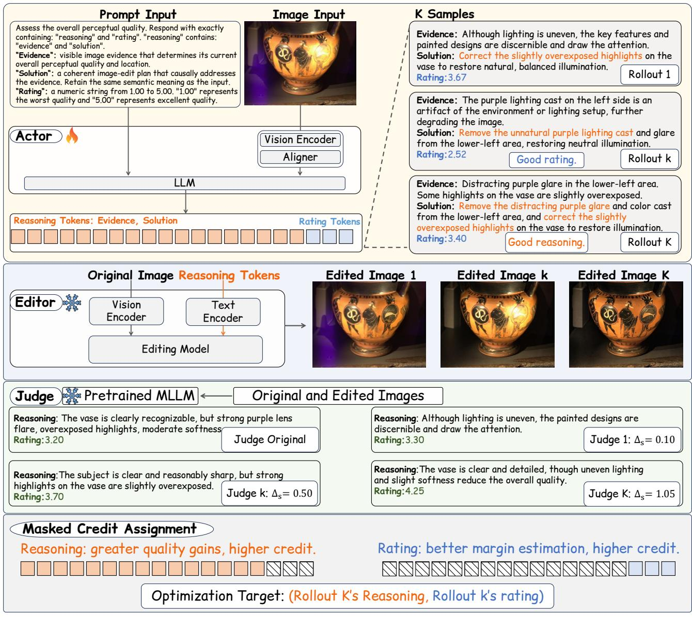  
Figure 1: Overview of MR-IQA-2. Prior MLLM-based IQA produces an explanation and a rating without visually verifying the explanation. Our actor converts a quality hypothesis into multiple targeted low-level edits. The independent judge compares the resulting quality changes and returns evidence-based feedback. Only visually supported interventions reinforce the actor, yielding faithful reasoning and a deeper understanding of causal quality-limiting factors. Here, $\Delta s$ denotes the Judge-score change between an edited image and the original image, as defined in Eq. (5).

Actor receives an original image $I _ { i } ^ { 0 }$ and uses a prompt $P _ { A }$ to generate quality reasoning and a rating:

$$
a _ { i , k } ^ { 0 } = \left( r _ { i , k } ^ { 0 } , q _ { i , k } ^ { 0 } \right) \sim \pi _ { \mathrm { o l d } } \left( \cdot \mid I _ { i } ^ { 0 } , P _ { A } \right) ,\tag{1}
$$

where $\pi _ { \mathrm { o l d } }$ denotes the original Actor policy used to generate the rollouts, and $r _ { i , k } ^ { 0 }$ and $\mathbf { \bar { \mathbf { q } } } _ { i , k } ^ { 0 }$ denote reasoning and rating.

Editor corrects the quality factors identified by the Actor:

$$
I _ { i , k } ^ { 1 } = E _ { \phi _ { E } } \left( I _ { i } ^ { 0 } , r _ { i , k } ^ { 0 } ; P _ { E } \right) , \qquad \phi _ { E } \mathrm { ~ f i x e d . }\tag{2}
$$

where $P _ { E }$ is a fixed editing prompt template and $I _ { i , k } ^ { 1 }$ is the edited output.

Judge independently rates the original and edited images:

$$
s _ { i } ^ { 0 } = J _ { \phi _ { J } } \left( I _ { i } ^ { 0 } \right) , \qquad s _ { i , k } ^ { 1 } = J _ { \phi _ { J } } \left( I _ { i , k } ^ { 1 } \right) .\tag{3}
$$

The resulting trajectory is

$$
\mathcal { T } _ { i , k } = \left( I _ { i } ^ { 0 } , a _ { i , k } ^ { 0 } , I _ { i , k } ^ { 1 } , s _ { i } ^ { 0 } , s _ { i , k } ^ { 1 } \right) .\tag{4}
$$

The Judge-observed quality change is

$$
\Delta s _ { i , k } = s _ { i , k } ^ { 1 } - s _ { i } ^ { 0 } .\tag{5}
$$

## 3.3 Fine-Grained Credit Assignment

Motivation. As discussed in the Introduction, higher rating accuracy alone does not guarantee faithful reasoning. Moreover, assigning a shared reward to reasoning and rating obscures the source of supervision. We therefore define separate rewards for reasoning, rating, and format, and use each reward to update its corresponding output tokens.

Reasoning reward. For each image, the Actor samples K reasoning–rating outputs indexed by k. Each reasoning proposal is evaluated with the frozen Editor and Judge. The editing prompt restricts interventions to low-level quality attributes while preserving image content. We measure reasoning faithfulness by the resulting Judge-score improvement:

$$
R _ { i , k } ^ { \mathrm { r e a s o n i n g } } = \Delta s _ { i , k } .\tag{6}
$$

Under these controlled conditions, reasoning that produces a larger quality improvement receives a higher reward.

Rating reward. Following MR-IQA (Li et al. 2026), we supervise rating through relative quality margins. Let $y _ { i }$ be the human mean opinion score (MOS). For another image $j \neq \imath$ in the same batch, the scale-controlled margin error is

$$
z _ { i , k , j } ^ { \mathrm { r a t i n g } } = \frac { \left( q _ { i , k } ^ { 0 } - \frac { 1 } { K } \sum _ { k ^ { \prime } = 1 } ^ { K } q _ { j , k ^ { \prime } } ^ { 0 } \right) - \left( y _ { i } - y _ { j } \right) } { \tau _ { i j } } ,\tag{7}
$$

where $\tau _ { i j } > 0$ controls the margin-error scale. Using the L2 estimator, we average the N − 1 pairwise rewards:

$$
R _ { i , k } ^ { \mathrm { r a t i n g } } = \frac { 1 } { N - 1 } \sum _ { \stackrel { j = 1 } { j \neq i } } ^ { N } \mathrm { e } ^ { - \frac { 1 } { 2 } \left( z _ { i , k , j } ^ { \mathrm { r a t i n g } } \right) ^ { 2 } } .\tag{8}
$$

Format reward. The Actor output must be a valid JSON object containing the ordered fields reasoning and rating. Let $\mathcal { F }$ denote this output contract. The format reward is

$$
R _ { i , k } ^ { \mathrm { f o r m a t } } = \mathbf { 1 } \left[ a _ { i , k } ^ { 0 } \in \mathcal { F } \right] .\tag{9}
$$

Masked credit assignment. Let c index a supervision type. For token $t , \chi _ { i , k , t } ^ { c }$ is its binary mask, and $\Omega _ { i , k } ^ { c }$ is the selected token set:

$$
\begin{array} { r l r } & { } & { \mathcal { C } = \{ \mathrm { r e a s o n i n g } , \mathrm { r a t i n g } , \mathrm { f o r m a t } \} , } \\ & { } & { \Omega _ { i , k } ^ { c } = \left\{ t \big | \chi _ { i , k , t } ^ { c } = 1 \right\} , \qquad c \in \mathcal { C } . } \end{array}\tag{10}
$$

Each reward is normalized independently within the K samples of image i:

$$
A _ { i , k } ^ { c } = \frac { R _ { i , k } ^ { c } - \mu _ { i } ^ { c } } { \sigma _ { i } ^ { c } + \epsilon _ { A } } .\tag{11}
$$

Here, $\mu _ { i } ^ { c }$ and $\boldsymbol { \sigma } _ { i } ^ { c }$ denote the corresponding group mean and sample standard deviation. The masked advantage for each supervision type is

$$
\widetilde { A } _ { i , k , t } ^ { c } = \chi _ { i , k , t } ^ { c } A _ { i , k } ^ { c } .\tag{12}
$$

Thus, reasoning and rating rewards update only their corresponding fields, whereas the format reward applies to the complete output.

## 3.4 Masked Credit with GRPO

We optimize the Actor with Group Relative Policy Optimization (GRPO) (Shao et al. 2024). Let $\mathcal { T } _ { c }$ contain the valid sampled outputs for supervision type c. Using the masked advantage in Eq. (12), the masked GRPO loss is

$$
\begin{array} { r l } {  { \mathcal { L } _ { \mathrm { G R P O } } ( \theta ) = - \sum _ { c \in \mathcal { C } } \frac { 1 } { | \mathbb { Z } _ { c } | } \sum _ { ( i , k ) \in \mathcal { Z } _ { c } } \frac { 1 } { | \Omega _ { i , k } ^ { c } | } \sum _ { t \in \Omega _ { i , k } ^ { c } } \omega _ { i , k , t } } } \\ & { \times \operatorname* { m i n } ( \rho _ { i , k , t } \widetilde { A } _ { i , k , t } ^ { c } , \rho _ { i , k , t } ^ { \mathrm { c l i p } } \widetilde { A } _ { i , k , t } ^ { c } ) . } \end{array}\tag{13}
$$

Here, $\rho _ { i , k , t }$ is the likelihood ratio between the current ${ \mathrm { A c } } -$ tor $\pi _ { \theta }$ and the rollout policy $\pi _ { \mathrm { o l d } } . ~ \rho _ { i , k , t } ^ { \mathrm { c l i p } }$ clips this ratio to $[ 1 - \epsilon _ { \mathrm { l o w } } , 1 + \epsilon _ { \mathrm { h i g h } } ] . \omega _ { i , k , t }$ corrects the token-level mismatch between the rollout distribution and $\pi _ { \mathrm { o l d } }$ and is capped by $\omega _ { \mathrm { m a x } } .$

## 4 Experiments

## 4.1 Experimental Settings

Datasets. We train all controlled models on the training subset of the KonIQ-10k split (Hosu et al. 2020), which contains 7,046 in-the-wild images at 512×384 resolution. We evaluate on the KonIQ-10k test split (2,010 images) as the in-distribution authentic benchmark. For out-of-distribution (OOD) evaluation, we use the authentic distortion datasets SPAQ (11,125 images) (Fang et al. 2020) and LIVE In the Wild (LIVE-W; 1,162 images) (Ghadiyaram and Bovik 2015), as well as the AI-generated image quality dataset AGIQA-3K (2,982 images) (Li et al. 2024). We further include the synthetic distortion datasets KADID-10k (10,125 images) (Lin, Hosu, and Saupe 2019) and CSIQ (866 images) (Larson and Chandler 2010).

Model Backbones. The Actor is initialized from Qwen3.5-4B (Qwen Team 2026), selected for its balance of visual reasoning and eficiency. The Editor uses FLUX.2 [klein] 4B (Black Forest Labs 2025) with a four-step LoRA for fast and eficient editing. It runs in BF16 with classifierfree guidance 1.0 and sigma schedule [1.0, 0.75, 0.5, 0.25]. The Judge uses a Qwen3.5-4B checkpoint trained for 5 epochs on KonIQ-7k with rating supervision, selected for the same balance of visual reasoning and eficiency. On a single NVIDIA RTX A6000, the Editor’s mean inference time is 0.902 s per image, while Judge inference takes 0.800 s per image. During GRPO optimization, only the Actor is updated; the frozen Editor and Judge provide ofline supervision and receive no gradients.

Implementation Details. We train Qwen3.5-4B (Qwen Team 2026) for five epochs on eight 48-GB NVIDIA RTX A6000 GPUs. Each rank processes $N = 6$ images and samples $K = 6$ completions per image. The maximum completion length is 192 tokens. We use AdamW (Loshchilov and Hutter 2019) with $( \beta _ { 1 } , \beta _ { 2 } ) = ( 0 . 9 , 0 . 9 5 ) , \epsilon _ { \mathrm { A d a m } } = 1 0 ^ { - 8 } $ , a learning rate of $1 0 ^ { - 6 }$ , weight decay of 0.1, cosine scheduling without warmup, and gradient-norm clipping at 1.0. We use symmetric policy clipping with $( \epsilon _ { \mathrm { l o w } } , \epsilon _ { \mathrm { h i g h } } ) = ( 0 . 2 0 , 0 . 2 0 )$ , no hard clipping of advantages, and token-level importanceratio truncation at $\omega _ { \mathrm { m a x } } = 2$ . Rollouts use temperature 0.7, top-p 1.0, top-k 20, and a presence penalty of 1.5. Actoronly training takes approximately 2 hours per epoch. For the full MR-IQA-2 framework, four GPUs are allocated to Actor training and four to Editor–Judge inference, increasing the per-epoch time to approximately 12 hours.

<table><tr><td></td><td colspan="5">Authentic</td><td colspan="2">AI-generated</td><td colspan="3">Synthetic</td><td colspan="2">Average</td></tr><tr><td></td><td colspan="2">KonIQ</td><td colspan="2">SPAQ</td><td colspan="2">LIVE-W</td><td colspan="2">AGIQA-3K</td><td colspan="2">KADID-10k</td><td colspan="2">CSIQ</td></tr><tr><td>Method</td><td>PLCC</td><td>SRCC</td><td>PLCC</td><td>SRCC</td><td>PLCC</td><td>SRCC</td><td>PLCC SRCC</td><td>PLCC</td><td>SRCC</td><td>PLCC</td><td>SRCC</td><td>PLCC SRCC</td></tr><tr><td>Hand-crafted</td><td></td><td></td><td></td><td></td><td></td><td></td><td></td><td></td><td></td><td></td><td></td><td></td></tr><tr><td>NIQE (2012)</td><td>0.533</td><td>0.530</td><td>0.679</td><td>0.664</td><td>0.493</td><td>0.449</td><td>0.560 0.533</td><td>0.468</td><td>0.405</td><td>0.718</td><td>0.628</td><td>0.575 0.535</td></tr><tr><td>BRISQUE (2012)</td><td>0.225</td><td>0.226</td><td>0.490</td><td>0.406</td><td>0.361</td><td>0.313</td><td>0.541 0.497</td><td>0.429</td><td>0.356</td><td>0.740</td><td>0.556</td><td>0.464 0.392</td></tr><tr><td colspan="9">Deep-learning-based</td><td></td><td></td><td></td><td></td></tr><tr><td>NIMA (2018)</td><td>0.896</td><td>0.859</td><td>0.838</td><td>0.856</td><td>0.814</td><td>0.771 0.715</td><td>0.654</td><td>0.532</td><td>0.535</td><td>0.695</td><td>0.649</td><td>0.748 0.721</td></tr><tr><td>DBCNN (2020)</td><td>0.884</td><td>0.875</td><td>0.812</td><td>0.806</td><td>0.773</td><td>0.730 0.641</td><td>0.648</td><td>0.497</td><td>0.484</td><td>0.586</td><td>0.572</td><td>0.699 0.686</td></tr><tr><td>MUSIQ (2021)</td><td>0.924</td><td>0.929</td><td>0.868</td><td>0.863</td><td>0.789</td><td>0.830 0.722</td><td>0.630</td><td>0.575</td><td>0.556</td><td>0.771</td><td>0.710</td><td>0.775 0.753</td></tr><tr><td>MANIQA (2022)</td><td>0.849</td><td>0.834</td><td>0.768</td><td>0.758</td><td>0.849</td><td>0.832 0.723</td><td>0.636</td><td>0.499</td><td>0.465</td><td>0.623</td><td>0.627</td><td>0.719 0.692</td></tr><tr><td>CLIP-IQA+ (2023)</td><td>0.909</td><td>0.895</td><td>0.866</td><td>0.864</td><td>0.832</td><td>0.805 0.736</td><td>0.685</td><td>0.653</td><td>0.654</td><td>0.772</td><td>0.719 0.795</td><td>0.770</td></tr><tr><td colspan="9">MLLM-based: SFT training</td><td></td><td></td><td></td><td></td></tr><tr><td>C2Score (2024)</td><td>0.923</td><td>0.910</td><td>0.867</td><td>0.860</td><td>0.786 0.772</td><td>0.777</td><td>0.671</td><td>0.500</td><td>0.453</td><td>0.735</td><td>0.705</td><td>0.729</td></tr><tr><td>Q-Align (2023)</td><td>0.941</td><td>0.940</td><td>0.886</td><td>0.887</td><td>0.853 0.860</td><td>0.772</td><td>0.735</td><td>0.674</td><td>0.684</td><td>0.671</td><td>0.765 0.737 0.800</td><td>0.807</td></tr><tr><td>DeQA (2025)</td><td>0.953</td><td>0.941</td><td>0.895</td><td>0.896</td><td>0.892 0.879</td><td>0.809</td><td>0.729</td><td>0.694</td><td>0.687</td><td>0.787</td><td>0.744 0.838</td><td>0.813</td></tr><tr><td colspan="9">MLLM-based: RL training</td><td></td><td></td><td></td><td></td></tr><tr><td>Q-Insight (2025a)</td><td>0.918</td><td>0.895</td><td>0.903</td><td>0.903</td><td>0.870 0.839</td><td>0.816</td><td>0.766</td><td>0.702</td><td>0.702</td><td>0.685</td><td></td><td></td></tr><tr><td>VQ-R1 (2025)</td><td>0.886</td><td>0.919</td><td>0.867</td><td>0.887</td><td>0.817 0.869</td><td>0.744</td><td>0.718</td><td>0.635</td><td>0.640</td><td>0.709</td><td>0.640 0.721 0.776</td><td>0.816 0.791 0.792</td></tr><tr><td>MR-IQA (2026)</td><td>0.949</td><td>0.931</td><td>0.892</td><td>0.897</td><td>0.899 0.883</td><td>0.804</td><td>0.732</td><td>0.672</td><td>0.683</td><td>0.767</td><td>0.732 0.831</td><td>0.810</td></tr><tr><td colspan="9">MLLM-based: Tool-augmented training</td><td></td><td></td><td></td><td></td></tr><tr><td>Zoom-IQA† (2026)</td><td>0.938</td><td>0.922</td><td>0.902</td><td>0.900</td><td>0.887 0.870</td><td>0.816</td><td>0.765</td><td>0.701</td><td>0.700</td><td>0.797</td><td>0.754</td><td>0.840 0.819</td></tr><tr><td>MR-IQA-2 (Ours)</td><td>0.937</td><td>0.917</td><td>0.900</td><td>0.899</td><td>0.893 0.863</td><td>0.809</td><td>0.739</td><td>0.667</td><td>0.669</td><td>0.824</td><td>0.785</td><td>0.838 0.812</td></tr><tr><td>MR-IQA-2* (Ours)</td><td>0.925</td><td>0.904</td><td>0.901</td><td>0.900</td><td>0.881</td><td>0.847 0.826</td><td>0.768</td><td>0.665</td><td>0.676</td><td>0.840</td><td>0.801 0.840</td><td>0.816</td></tr></table>

Table 1: Rating performance comparison. Each dataset reports PLCC↑ and SRCC↑ between predicted and ground-truth ratings. Red and blue denote the best and second-best results, respectively. Baseline entries use reported results, except that VQ-R1 is reproduced with Qwen3-VL-2B (Bai et al. 2025a) because its original results were obtained under a diferent training protocol. Both MR-IQA-2 variants use Qwen3.5-4B; the unstarred row uses the final E5 credit-mask checkpoint, while MR-IQA-2∗ freezes the vision encoder and aligner during training. Zoom-IQA† uses additional annotations and combines SFT with RL; all other trainable methods use the same KonIQ training split.
<table><tr><td></td><td colspan="2">Pretrained Judge</td><td colspan="2">Q-Insight as Judge</td><td>GPT-5.6 Sol as Judge (%)</td></tr><tr><td>Editor Actor</td><td>FLUX.2 [klein]</td><td>Mage-Flow</td><td>FLUX.2 [klein]</td><td>Mage-Flow</td><td>FLUX.2 [klein]</td></tr><tr><td>Qwen3.5-4B (Baseline)</td><td>-0.137</td><td>-0.144</td><td>-0.130</td><td>-0.080</td><td>4.19%</td></tr><tr><td>Q-Insight</td><td>+0.213</td><td>+0.142</td><td>+0.138</td><td>+0.139</td><td>14.41%</td></tr><tr><td>MR-IQA-2 (Ours)</td><td>+0.789</td><td>+0.468</td><td>+0.561</td><td>+0.376</td><td>81.40%</td></tr></table>

Table 2: Reasoning performance validation. The first four columns report mean quality gain ∆s (higher is better; Eq. (5)); GPT-5.6 Sol uses 3-Alternative Forced Choice (3AFC). We compare the Qwen3.5-4B baseline (Qwen Team 2026), Q-Insight (Li et al. 2025a), and MR-IQA-2 (ours). The 4B four-step LoRA Editors are FLUX.2 [klein] (Black Forest Labs 2025) and Mage-Flow (Zhang et al. 2026). Judges are our pretrained Qwen3.5-4B Judge (Qwen Team 2026), Q-Insight (Li et al. 2025a), and GPT-5.6 Sol (OpenAI 2026). Evaluation uses a fixed 5,866-image subset formed by randomly selecting 1,000 images from each test set, except CSIQ, for which all 866 images are used.

## 4.2 Rating Performance

Compared methods. Table 1 compares MR-IQA-2 with representative BIQA methods across six benchmarks. The hand-crafted group includes NIQE (Mittal, Soundararajan, and Bovik 2012) and BRISQUE (Mittal, Moorthy, and Bovik 2012). Deep-learning-based methods include NIMA (Talebi and Milanfar 2018), DBCNN (Zhang et al. 2020), MUSIQ (Ke et al. 2021), MANIQA (Yang et al. 2022), and CLIP-IQA+ (Wang, Chan, and Loy 2023). Among MLLM-based methods, SFT approaches include C2Score (Zhu et al. 2024), Q-Align (Wu et al. 2023), and DeQA (You et al. 2025), while RL approaches include Q-Insight (Li et al. 2025a), VQ-R1 (Wu et al. 2025), and MR-IQA (Li et al. 2026). We further compare with the tool-augmented RL method Zoom-IQA (Liang et al. 2026). For MR-IQA-2, we report an active-vision checkpoint and a frozen-vision variant, denoted by ∗.

Eficiency and performance. MR-IQA-2 is designed primarily to improve reasoning faithfulness rather than maximize rating. Nevertheless, it achieves competitive rating performance. (1) Zoom-IQA (Liang et al. 2026) uses a twostage SFT–RL pipeline with additional annotations, whereas MR-IQA-2 uses only RL training without additional data. The frozen-vision variant reaches an average PLCC/SRCC of 0.840/0.816, comparable to Zoom-IQA’s 0.840/0.819. (2) Freezing the vision encoder and aligner is particularly effective on AI-generated and synthetic datasets. The frozen variant achieves the best CSIQ PLCC/SRCC of 0.840/0.801, whereas active visual training yields its main gains on the authentic datasets.

## 4.3 Faithful Reasoning Performance

Quality Gain as a Proxy for Reasoning Faithfulness. Prior work, including Q-Insight (Li et al. 2025a) and VisualQuality-R1 (Wu et al. 2025), typically evaluates reasoning through human inspection of a small number of examples or indirectly through improvements in rating performance. These practices lack a unified evaluation criterion. In this work, we instead use the image-quality gain produced by reasoning-guided editing as the evaluation criterion (Eq. (6)), rather than rating performance. We assume that faithful reasoning should identify quality-limiting factors whose correction improves the given image.

Cross-editor/judge stability. Table 2 examines whether the Actor overfits to the frozen Editor–Judge during training. We first replace the FLUX.2 [klein] Editor (Black Forest Labs 2025) with Mage-Flow (Zhang et al. 2026). MR-IQA-2 retains larger quality gains than the competing Actors, indicating that its reasoning is not specific to a single Editor. We then replace the pretrained Judge with Q-Insight (Li et al. 2025a) and GPT-5.6 Sol (OpenAI 2026). These alternative Judges preserve the direction of the measured gains. These results indicate that the Actor learns generalizable quality knowledge rather than exploiting idiosyncrasies of the training-time Editor or Judge.

Quality and behavior analysis. Additional analyses (in Appendix Figure 4) provide four observations. (a) Across all datasets, lower-quality images obtain larger quality gains. (b) Changes in sharpness are strongly associated with Judge preference. (c) Higher-quality images tend to remain closer to their originals after editing. (d) Training shifts the Actor toward quality-relevant reasoning tokens.

## 4.4 Ablation Study

Evaluation. Table 3 reports ablations on rating alignment and reasoning-guided quality improvement. Ratingonly training already achieves competitive rating alignment, with an average PLCC/SRCC of 0.836/0.815. However, its mean quality gain is −0.260, below the baseline result of −0.136. Rating performance alone therefore does not guarantee faithful reasoning. At E5, the variants without and with the credit mask reach average PLCC/SRCC values of 0.834/0.812 and 0.838/0.812, respectively. Both produce positive quality gains. The variant without the mask reaches a larger raw gain of +1.442, but collapses to one normalized solution. The credit-mask variant retains 23,457 normalized solutions while achieving a gain of +1.079. Therefore, raw gain alone can favor a universal edit and does not establish image-conditioned reasoning. The final E5 comparison is diagnostic because the two variants also difer in KL scope; controlled E1 results are reported in Appendix E.

The credit mask is more beneficial early in training. At step 30 on the 200-image validation set, it reaches a PLCC/S-RCC of 0.745/0.772, compared with 0.667/0.617 without the credit mask and 0.616/0.610 for the baseline. Its quality gain is lower at this stage, at 0.255 versus 0.387 without the credit mask. This suggests that the credit mask accelerates rating convergence but may temporarily limit reasoning improvement. Once rating alignment stabilizes, its benefit becomes smaller. This behavior warrants further study of the imbalance between rating and reasoning rewards.

## 4.5 Case Study

Figure 2 compares reasoning-guided edits before and after training. After training, all three edits receive higher Judge ratings, and the Actor proposes more specific interventions. In the dog example, it recommends cropping the distracting foot near the image boundary to improve visual appeal. The examples also expose a semantic-preservation problem: an edited image may no longer retain the meaning of the original. In the first row, the Editor changes a night sky into a blue daytime sky. The boundary between quality enhancement and semantic alteration therefore requires further study.

## 5 Discussion

Good Evidence, Bad Solution? In this work, we jointly treat evidence and solution as reasoning. However, as with human perception, a model may correctly identify why an image has poor quality yet fail to propose an efective correction. Our training necessarily encourages the model to discover efective solutions through exploration, raising the question of whether this process also improves its evidence. Maybe the evidence capability does not improve. But we argue that a solution that improves image quality through relevant visual changes indicates an improved understanding of the underlying quality factors. Explicitly modeling the causal relation between evidence and solution may provide a more reliable direction for future work.

## 6 Limitations and Future Work

This work has two main limitations. First, the current framework does not yet realize fully closed-loop visual reflection. The edited image is evaluated by the Judge but is not returned to the Actor for further visual reasoning. Second, using separate Actor, Editor, and Judge models introduces computational and parameter redundancy. Future work will close the reflection loop by feeding the edited image back to the Actor, enabling direct comparison between the original and edited images. We will also explore smaller models and parameter sharing across modules to improve eficiency.

<table><tr><td>Rating alignment</td><td colspan="5">Authentic</td><td colspan="2">AI-generated</td><td colspan="4">Synthetic Average</td></tr><tr><td></td><td>KonIQ</td><td></td><td>SPAQ</td><td></td><td>LIVE-W</td><td>AGIQA-3K</td><td></td><td>KADID-10k</td><td>CSIQ</td><td></td></tr><tr><td>Method</td><td>PLCC</td><td>SRCC</td><td>PLCC SRCC</td><td>PLCC</td><td>SRCC</td><td>PLCC SRCC</td><td>PLCC</td><td>SRCC</td><td>PLCC SRCC</td><td>Avg. PLCC SRCC</td></tr><tr><td>Baseline</td><td>0.553</td><td>0.583 0.750</td><td>0.743</td><td>0.592 0.564</td><td>0.679</td><td>0.655</td><td>0.660 0.669</td><td>0.681</td><td>0.657</td><td>0.652 0.645</td></tr><tr><td>Rating-only</td><td>0.952</td><td>0.938</td><td>0.901 0.899</td><td>0.896 0.875</td><td>0.808</td><td>0.740</td><td>0.669 0.676</td><td>0.789</td><td>0.764</td><td>0.836 0.815</td></tr><tr><td>Without credit mask (E5)</td><td>0.932</td><td>0.914</td><td>0.896 0.897</td><td>0.878</td><td>0.857 0.809</td><td>0.736</td><td>0.676</td><td>0.684 0.815</td><td>0.786</td><td>0.834 0.812</td></tr><tr><td>Credit mask (E5)</td><td>0.937</td><td>0.917 0.900</td><td>0.899</td><td>0.893</td><td>0.863 0.809</td><td>0.739</td><td>0.667 0.669</td><td>0.824</td><td>0.785</td><td>0.838 0.812</td></tr><tr><td>Subset quality gains</td><td colspan="4"></td><td colspan="4"></td><td colspan="2"></td></tr><tr><td>Method</td><td colspan="2">Original mean</td><td colspan="2">Edited mean</td><td colspan="2"></td><td>Mean gain</td><td colspan="2">Positive gain (%)</td><td></td></tr><tr><td>Baseline</td><td colspan="2">2.844</td><td colspan="2">2.708</td><td colspan="2"></td><td>-0.136</td><td colspan="2">40.664%</td><td></td></tr><tr><td>Rating-only</td><td colspan="2">2.844</td><td colspan="2">2.584</td><td colspan="2"></td><td colspan="2">-0.260 +1.442</td><td colspan="2">30.686% 99.997%</td></tr><tr><td>Without credit mask (E5)</td><td colspan="2">2.844</td><td colspan="2">4.286</td><td colspan="2">+1.079</td><td colspan="2"></td><td colspan="2">98.813%</td></tr><tr><td>Credit mask (E5)</td><td colspan="2">2.844</td><td colspan="2">3.923</td><td colspan="2"></td><td colspan="2"></td><td colspan="2"></td></tr></table>

Table 3: Rating and quality-gain ablations. The upper panel reports PLCC/SRCC on the complete test sets and their six-dataset average. The lower panel reports Judge scores before and after reasoning-guided editing. Baseline and Rating-only use 5,843 common images; the E5 rows use their full successful audits (28,270 without the mask and 28,044 with the mask). Bold marks the best scalar result before rounding. The higher unmasked gain coincides with single-solution collapse and is not interpreted as improved reasoning.

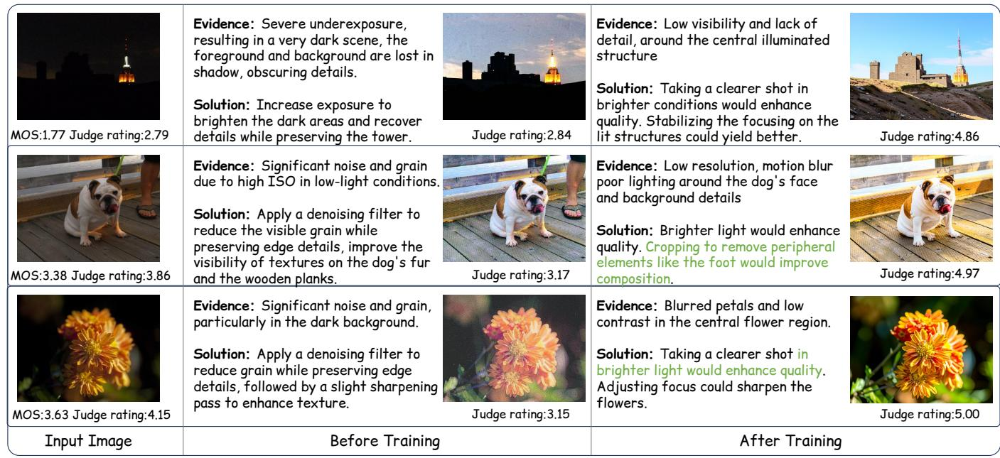  
Figure 2: Qualitative comparison before and after training. Each row shows the input image and the Actor’s reasoning-guided edits before and after training. Post-training reasoning yields more efective interventions and larger Judge-rated quality gains. Green text highlights additional quality factors identified after training.

## 7 Conclusion

In this work, we aim to supervise the faithfulness of imagequality reasoning, moving BIQA beyond plausible explanations toward visually verifiable understanding. We use quality gain as an operational measure of reasoning faithfulness and propose MR-IQA-2, an Actor–Editor–Judge framework. The

Actor’s reasoning guides the Editor, while the Judge evaluates the resulting quality change to test whether the identified factors are supported. Fine-grained credit assignment further decouples reasoning and rating supervision to reduce reward ambiguity. MR-IQA-2 retains competitive rating alignment while producing more reliable and actionable quality reasoning. More broadly, our framework provides a new perspective on evaluating reasoning faithfulness, links blind assessment to reference-based verification through interventiongenerated image pairs, and suggests a path toward modeling human visual preferences and aesthetic judgments.

## References

Agnolucci, L.; Galteri, L.; Bertini, M.; and Del Bimbo, A. 2024. ARNIQA: Learning Distortion Manifold for Image Quality Assessment. In Proceedings of the IEEE/CVF Winter Conference on Applications of Computer Vision, 189–198.

Bai, S.; Cai, Y.; Chen, R.; Chen, K.; Chen, X.; Cheng, Z.; Deng, L.; Ding, W.; Gao, C.; Ge, C.; et al. 2025a. Qwen3-vl technical report. arXiv preprint arXiv:2511.21631.

Bai, S.; Chen, K.; Liu, X.; Wang, J.; Ge, W.; Song, S.; Dang, K.; Wang, P.; Wang, S.; Tang, J.; et al. 2025b. Qwen2.5-VL Technical Report. arXiv preprint arXiv:2502.13923.

Black Forest Labs. 2025. FLUX.2: Frontier Visual Intelligence. https://bfl.ai/blog/flux-2.

Chen, C.; Mo, J.; Hou, J.; Wu, H.; Liao, L.; Sun, W.; Yan, Q.; and Lin, W. 2024. TOPIQ: A Top-Down Approach from Semantics to Distortions for Image Quality Assessment. IEEE Transactions on Image Processing, 33: 2404–2418.

Fang, Y.; Zhu, H.; Zeng, Y.; Ma, K.; and Wang, Z. 2020. Perceptual quality assessment of smartphone photography. In Proceedings of the IEEE/CVF conference on computer vision and pattern recognition, 3677–3686.

Ghadiyaram, D.; and Bovik, A. C. 2015. Live in the wild image quality challenge database. Online: http://live. ece. utexas. edu/research/ChallengeDB/index. html [Mar, 2017].

Hosu, V.; Lin, H.; Sziranyi, T.; and Saupe, D. 2020. KonIQ-10k: An Ecologically Valid Database for Deep Learning of Blind Image Quality Assessment. IEEE Transactions on Image Processing, 29: 4041–4056.

Ke, J.; Wang, Q.; Wang, Y.; Milanfar, P.; and Yang, F. 2021. MUSIQ: Multi-scale Image Quality Transformer. In Proceedings of the IEEE/CVF International Conference on Computer Vision, 5148–5157.

Larson, E. C.; and Chandler, D. M. 2010. Most apparent distortion: full-reference image quality assessment and the role of strategy. Journal of electronic imaging, 19(1): 011006– 011006.

Li, C.; Zhang, Z.; Wu, H.; Sun, W.; Min, X.; Liu, X.; Zhai, G.; and Lin, W. 2024. AGIQA-3K: An Open Database for AI-Generated Image Quality Assessment. IEEE Transactions on Circuits and Systems for Video Technology, 34(8): 6833– 6846.

Li, W.; Zhang, X.; Zhao, S.; Zhang, Y.; Li, J.; Zhang, L.; and Zhang, J. 2025a. Q-Insight: Understanding Image Quality via Visual Reinforcement Learning. arXiv preprint arXiv:2503.22679.

Li, Y.; Lin, Y.; Sun, Z.; Yang, Y.-H.; Miyoshi, K.; Chu, C.; and Nishida, S. 2026. MR-IQA: A Unified Margin View of Regression and Ranking for Blind Image Quality Assessment. arXiv:2606.29760.

Li, Y.; Sun, Z.; Chen, Y.-j.; and Nishida, S. 2025b. Building Reasonable Inference for Vision-Language Models in Blind Image Quality Assessment. In International Conference on Neural Information Processing, 283–295. Springer.

Li, Y.; Yu, Y.; Lin, Y.; Yang, Y.-H.; Chu, C.; and Nishida, S. 2025c. Guiding Perception-Reasoning Closer to Human in Blind Image Quality Assessment. arXiv preprint arXiv:2512.16484.

Liang, G.; Wang, J.; Wu, Z.; Zhou, S.; and Loy, C. C. 2026. Zoom-IQA: Image Quality Assessment with Reliable Region-Aware Reasoning. arXivpreprint arXiv:2601.02918.

Lin, H.; Hosu, V.; and Saupe, D. 2019. KADID-10k: A largescale artificially distorted IQA database. In 2019 Eleventh International Conference on Quality of Multimedia Experience (QoMEX), 1–3. IEEE.

Loshchilov, I.; and Hutter, F. 2019. Decoupled Weight Decay Regularization. In International Conference on Learning Representations.

Mittal, A.; Moorthy, A. K.; and Bovik, A. C. 2012. Noreference image quality assessment in the spatial domain. IEEE Transactions on imageprocessing, 21(12): 4695–4708.

Mittal, A.; Soundararajan, R.; and Bovik, A. C. 2012. Making a “completely blind” image quality analyzer. IEEE Signal processing letters, 20(3): 209–212.

OpenAI. 2026. GPT-5.6 Sol Model. https://developers. openai.com/api/docs/models/gpt-5.6-sol.

Qin, G.; Zhang, J.; He, C.; Fu, Y.; Liang, J.; Wu, T.; and Zhang, L. 2026. Tool-IQA: Augmenting Image Quality Assessment with Simple Tools. arXiv preprint arXiv:2606.16082.

Qwen Team. 2026. Qwen3.5: Towards Native Multimodal Agents.

Shao, Z.; Wang, P.; Zhu, Q.; Xu, R.; Song, J.; Bi, X.; Zhang, H.; Zhang, M.; Li, Y.; Wu, Y.; et al. 2024. Deepseekmath: Pushing the limits of mathematical reasoning in open language models. arXiv preprint arXiv:2402.03300.

Székely, G. J.; Rizzo, M. L.; and Bakirov, N. K. 2007. Measuring and Testing Dependence by Correlation of Distances. The Annals ofStatistics, 35(6): 2769–2794.

Talebi, H.; and Milanfar, P. 2018. NIMA: Neural image assessment. IEEE transactions on image processing, 27(8): 3998–4011.

Wang, J.; Chan, K. C.; and Loy, C. C. 2023. Exploring clip for assessing the look and feel of images. In Proceedings ofthe AAAI conference on artificial intelligence, volume 37, 2555–2563.

Wang, Z.; Simoncelli, E. P.; and Bovik, A. C. 2003. Multi-Scale Structural Similarity for Image Quality Assessment. In Proceedings ofthe 37th Asilomar Conference on Signals, Systems and Computers, volume 2, 1398–1402.

Wu, H.; Zhang, Z.; Zhang, E.; Chen, C.; Liao, L.; Wang, A.; Xu, K.; Li, C.; Hou, J.; Zhai, G.; et al. 2024. Q-Instruct: Improving Low-Level Visual Abilities for Multi-Modality Foundation Models. In Proceedings of the IEEE/CVF conference on computer vision and pattern recognition, 25490– 25500.

Wu, H.; Zhang, Z.; Zhang, W.; Chen, C.; Liao, L.; Li, C.; Gao, Y.; Wang, A.; Zhang, E.; Sun, W.; et al. 2023. Q-align: Teaching lmms for visual scoring via discrete text-defined levels. arXiv preprint arXiv:2312.17090.

Wu, T.; Zou, J.; Liang, J.; Zhang, L.; and Ma, K. 2025. VisualQuality-R1: Reasoning-Induced Image Quality Assessment via Reinforcement Learning to Rank. Advances in Neural Information Processing Systems, 38: 88167–88190.

Yang, S.; Wu, T.; Shi, S.; Lao, S.; Gong, Y.; Cao, M.; Wang, J.; and Yang, Y. 2022. Maniqa: Multi-dimension attention network for no-reference image quality assessment. In Proceedings of the IEEE/CVF conference on computer vision and pattern recognition, 1191–1200.

You, Z.; Cai, X.; Gu, J.; Xue, T.; and Dong, C. 2025. Teaching large language models to regress accurate image quality scores using score distribution. In Proceedings of the Computer Vision and Pattern Recognition Conference, 14483– 14494.

You, Z.; Li, Z.; Gu, J.; Yin, Z.; Xue, T.; and Dong, C. 2024. Depicting beyond scores: Advancing image quality assessment through multi-modal language models. In European Conference on Computer Vision, 259–276. Springer.

Yu, Q.; Zhang, Z.; Zhu, R.; Yuan, Y.; Zuo, X.; et al. 2025. DAPO: An Open-Source LLM Reinforcement Learning System at Scale. In Advances in Neural Information Processing Systems, volume 38.

Zhang, R.; Isola, P.; Efros, A. A.; Shechtman, E.; and Wang, O. 2018. The Unreasonable Efectiveness ofDeep Features as a Perceptual Metric. In Proceedings ofthe IEEE Conference on Computer Vision and Pattern Recognition, 586–595.

Zhang, W.; Ma, K.; Yan, J.; Deng, D.; and Wang, Z. 2020. Blind Image Quality Assessment Using A Deep Bilinear Convolutional Neural Network. IEEE Transactions on Circuits and Systemsfor Video Technology, 30(1): 36–47.

Zhang, W.; Zhai, G.; Wei, Y.; Yang, X.; and Ma, K. 2023. Blind image quality assessment via vision-language correspondence: A multitask learning perspective. In Proceedings of the IEEE/CVF conference on computer vision and pattern recognition, 14071–14081.

Zhang, X.; Zhang, P.; Zheng, S.; Guo, J.; Jia, Z.; Shen, Y.; Guo, X.; Luo, Y.; Li, J.; Xie, W.; Pu, F.; Zhang, X.; Zhang, K.; Guo, Z.; Bi, T.; Gui, D.; Liu, Z.; Wen, Z.; Zheng, Z.; Yang, S.; Li, X.; Wang, J.; Li, B.; and Lu, Y. 2026. Mage-Flow: An Eficient Native-Resolution Foundation Model for Image Generation and Editing. arXiv preprint arXiv:2607.19064.

Zhu, H.; Wu, H.; Li, Y.; Zhang, Z.; Chen, B.; Zhu, L.; Fang, Y.; Zhai, G.; Lin, W.; and Wang, S. 2024. Adaptive image quality assessment via teaching large multimodal model to compare. Advances in Neural Information Processing Systems, 37: 32611–32629.

In this appendix, we provide technical details and more comprehensive analyses of our proposed method. It comprises Section A, Backbone, Algorithm and Hyperparameters; Section B, Visual Quality Feature Analysis; Section C, Discussion on the Editor Proxy; Section D, Joint Rating, Reasoning, and Diversity Analysis; and Section E, Detailed Credit-Mask Audit.

## A Backbone, Algorithm and Hyperparameters

## A.1 Dataset Protocol.

Our training and evaluation settings follow the same configuration as the main paper. We train on the KonIQ-10k training subset (Hosu et al. 2020) and use a fixed set of 200 images randomly sampled from the KonIQ-10k test split to monitor early-stage convergence. Final testing is conducted on the KonIQ-10k test split, SPAQ (Fang et al. 2020), LIVE-W (Ghadiyaram and Bovik 2015), AGIQA-3K (Li et al. 2024), KADID-10k (Lin, Hosu, and Saupe 2019), and CSIQ (Larson and Chandler 2010).

At the time of manuscript completion, we did not have access to Zoom-IQA (Liang et al. 2026) and therefore could not reproduce it under our protocol. Tool-IQA (Qin et al. 2026) follows a diferent training–testing configuration; consequently, we cannot report directly comparable Tool-IQA results for some experiments.

For the cross Actor–Judge–Editor evaluation reported in Table 2 of the main paper, we use a fixed 5,866-image subset, randomly sampling 1,000 images from each test set except CSIQ, for which all 866 images are used. This subsampling is necessary for computational eficiency: evaluating the full test sets would involve approximately 23,000 images, each requiring four editing operations and three Judge evaluations, resulting in a prohibitively heavy inference cost.

## A.2 Candidate Backbones.

The Qwen series has been widely adopted in recent BIQA studies due to its open-source availability, strong multimodal capability, and computational eficiency. For example, existing methods such as Q-Insight (Li et al. 2025a), VQ-R1 (Wu et al. 2025), and Zoom-IQA (Liang et al. 2026) employ Qwen2.5-VL-7B (Bai et al. 2025b) as their backbone model. However, despite its strong performance, the 7B-scale model still introduces considerable computational overhead, which limits its practical deployment and training eficiency.

Therefore, in this work, we investigate more lightweight backbone configurations with 2B and 4B parameters. Considering future scalability and the continuous evolution of multimodal large language models, we further evaluate the latest Qwen3-VL and Qwen3.5-VL architectures. We conduct comprehensive backbone comparisons among 2B/4B variants of Qwen3 and Qwen3.5 to identify an optimal tradeof between training eficiency and performance.

Qwen3-VL versus Qwen3.5. The T1–T2 comparison in Table 4 shows that, under matched frozen-vision DAPO settings, Qwen3.5-2B outperforms Qwen3-VL-2B on five of six datasets for both PLCC and SRCC, and on all six in MAE. It also requires only 0.81× the training time per epoch.

2B versus 4B. The T6–T7 comparison in Table 4 shows that the 4B model converges faster in rating performance. By Epoch 2, T7 reaches a validation PLCC/SRCC/MAE of 0.929/0.919/0.566, compared with 0.915/0.904/0.744 for the 2B T6; by Epoch 3, T7 further improves to 0.935/0.924/0.228. The 4B model also produces more diverse outputs, with 83 distinct ratings, 200 unique completions, and a 41.5% U-score, compared with a 39.0% U-score for T6. We further observe that its response lengths are better aligned with our objective of eliciting detailed quality reasoning.

## A.3 Optimization Algorithms: GRPO or DAPO?

Compared with GRPO (Shao et al. 2024), DAPO (Yu et al. 2025) dynamically resamples low-variance groups, thereby increasing within-group reward diversity and preventing policy advantages from vanishing prematurely. We therefore adopted DAPO in most of our early experiments.

Across three epochs, 3,282 of 20,832 GRPO learner groups (15.75%) have zero within-group reward variance and therefore zero policy advantage. DAPO resampling reduces the proportion of zero-advantage learner groups to 0%. Comparing T2 and T4 in Table 4, DAPO improves the six-dataset average PLCC/SRCC by 0.006/0.008 and reduces MAE by 0.138 at Epoch 3, with improvements on five, six, and six datasets, respectively.

Despite its better performance, DAPO requires 1.866× more sampled trajectories and increases the training time per epoch from 0.81 to 1.13 hours (approximately 39.5%). This additional training-time cost is not afordable in our training environment, especially when scaling the model to 4B parameters or beyond. Therefore, we use GRPO as the default optimization algorithm in the final framework.

## A.4 Hyper-Parameter Settings.

Group Size: 6 versus 48. MR-IQA (Li et al. 2026) reports its best performance with local groups of six, where rewards are computed by comparing samples only within each six-image group. Table 4 compares this local-6 setting (T6) with a larger group of 48 (T5). The large group achieves better in-domain validation PLCC/S-RCC/MAE (0.929/0.921/0.261 versus 0.917/0.906/0.587), whereas local-6 achieves higher six-dataset average PLCC/S-RCC (0.835/0.813 versus 0.828/0.809). Because the local-6 setting provides stronger cross-dataset correlation, we adopt a group size of six.

Vision Modules: Frozen versus Active. The T2–T5 comparison in Table 4 shows that active visual training performs better on authentic datasets, achieving PLCC/S-RCC values of 0.952/0.938 on KonIQ and 0.897/0.877 on LIVE-W, compared with 0.925/0.904 and 0.881/0.847 for the frozen variant. In contrast, freezing the vision encoder and aligner performs better on AGIQA-3K and the synthetic datasets: it achieves 0.826/0.768 on AGIQA-3K, 0.665/0.676 on KADID-10k, and 0.840/0.801 on CSIQ, compared with 0.816/0.747, 0.661/0.668, and 0.771/0.746 under active visual training. Consequently, the frozen variant yields

<table><tr><td>Variant</td><td>Iter.</td><td>Time (h/ep.)</td><td>Val. P/S/M</td><td>U-score (%)</td><td>Gen. P/S/M</td></tr><tr><td>(a) Qwen3-VL-2B</td><td></td><td></td><td></td><td></td><td></td></tr><tr><td>T1: DAPO i1, frozen, global (b) Qwen3.5-2B</td><td>1</td><td>1.38</td><td>0.831/0.817/0.868</td><td>12.0</td><td>0.809/0.787/0.936</td></tr><tr><td>T2: DAPO i1, frozen, global</td><td>1</td><td>1.13</td><td>0.890/0.881/0.691</td><td>36.0</td><td>0.835/0.808/0.740</td></tr><tr><td>T3: DAPO i4, frozen, global</td><td>4</td><td>2.47</td><td>0.910/0.904/0.265</td><td>21.5</td><td>0.834/0.809/0.541</td></tr><tr><td>T4: GRPO i1, frozen</td><td>1</td><td>0.81</td><td>0.886/0.883/0.845</td><td>34.0</td><td>0.829/0.800/0.878</td></tr><tr><td>T5: DAPO i1, visual, global</td><td>1</td><td>1.30</td><td>0.929/0.921/0.261</td><td>35.0</td><td>0.828/0.809/0.513</td></tr><tr><td>T6: DAPO i1, visual, local-six</td><td>1</td><td>1.54</td><td>0.917/0.906/0.587</td><td>39.0</td><td>0.835/0.813/0.684</td></tr><tr><td>(c) Qwen3.5-4B, local-six</td><td></td><td></td><td></td><td></td><td></td></tr><tr><td>T7: DAPO i1, visual, local-six</td><td>1</td><td>2.56</td><td>0.935/0.924/0.228</td><td>41.5</td><td></td></tr></table>

Table 4: Actor-only ablations at their reported endpoints. P/S/M denotes PLCC/SRCC/MAE; Val. is the aligned 200-image set, and Gen. is the six-dataset average. U-score measures distinct validation ratings, and Time is the mean wall-clock time per epoch. Bold marks the best alignment result among the controlled Qwen3.5-2B variants; higher PLCC/SRCC and lower MAE are better. All variants use E3.

$$
\begin{array}{c} \begin{array} { r l } { - \bullet \mathrm { - } \mathrm { T } 1 \colon \mathrm { 3 } \mathrm { V } \mathrm { L } \mathrm { - } 2 \mathrm { B } \mathrm { ~ D } \mathrm { A } \mathrm { P } 0 } & { { } - \mathrm { q } \colon \mathrm { - } \mathrm { 2 } \colon \mathrm { 2 } \mathrm { B } \mathrm { ~ D } \mathrm { A } \mathrm { P } 0 \mathrm { ~ i } 1 } \\ { - \mathrm { v } \cdots \mathrm { T } \ H \cdot \mathrm { 2 } \mathrm { B } \mathrm { ~ v i s u a l } \mathrm { - } \mathrm { g } \mathrm { l o b a l } } & { { } - \ast \cdots \mathrm { ~ T } 6 \colon \mathrm { 2 } \mathrm { B } \mathrm { ~ v i s u a l } \mathrm { - } \mathrm { l o c a l } } \\ { - \mathrm { v } \cdots \mathrm { ~ T } 5 \colon \mathrm { 2 } \mathrm { B } \mathrm { ~ v i s u a l } \mathrm { - } \mathrm { g } \mathrm { l o b a l } } & { { } - \ast \mathrm { 2 } \mathrm { ~ B } \mathrm { ~ v i s u a l } \mathrm { - } \mathrm { l o c a l } } \end{array} \quad \xrightarrow [ \cdots \mathrm { ~ v } \cdots \mathrm { ~ T } \gamma ; 4 \mathrm { B } \mathrm { ~ l o c a l } \mathrm { - } \mathrm { s i x } ]  \end{array}
$$

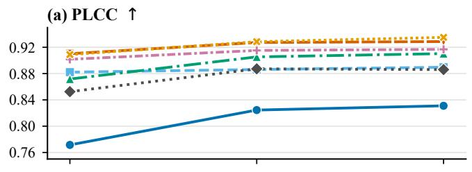

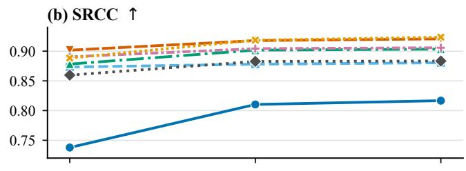

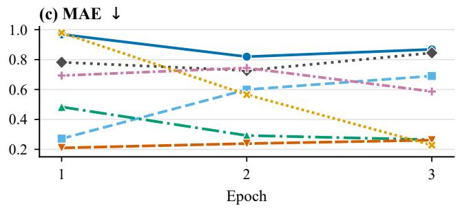

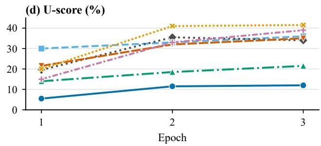  
Figure 3: Validation trajectories through E3 on the common 200-image set. T7 denotes the 4B local-six run. Curves are single fixed-seed runs, so no error bands are shown. Higher PLCC/SRCC and lower MAE are better, while U-score diagnoses rating diversity. Color, marker, and line style consistently identify T1–T7.

higher six-dataset average PLCC/SRCC (0.840/0.816 versus 0.833/0.812), indicating stronger overall generalization.

Rating Diversity. Zoom-IQA (Liang et al. 2026) reports score-space collapse when using a ranking reward, with only a 2.04% unique-score ratio. Across T1–T7 in Table 4, the E3 U-scores remain between 12.0% and 41.5%, corresponding to 24–83 distinct ratings on the 200-image validation set. Thus, we do not observe rating-diversity collapse under our current settings.

Repeated Sampling Updates. MR-IQA (Li et al. 2026) reuses each rollout sample for four policy updates. We evaluate whether these repeated updates remain efective by comparing T2 and T3 in Table 4. Four updates improve validation PLCC/SRCC/MAE from 0.890/0.881/0.691 to 0.910/0.904/0.265. However, the six-dataset average PLC-C/SRCC remain nearly unchanged (0.835/0.808 versus 0.834/0.809), while training time increases from 1.13 to 2.47 hours per epoch. Therefore, one policy update per rollout is suficient under our current settings.

## B Visual Quality Feature Analysis

In our framework, the FLUX.2 [klein] Editor (Black Forest Labs 2025) produces an edited image conditioned on the quality reasoning for each input. The resulting original– edited pair bridges single-image quality assessment with reference-based quality assessment, enabling us to analyze how the visual intervention relates to the predicted quality improvement. In this section, we investigate three questions: (1) whether larger visual changes lead to greater quality gains; (2) how the distributions of low-level visual features change after editing; and (3) what behavioral preferences emerge from the overall framework.

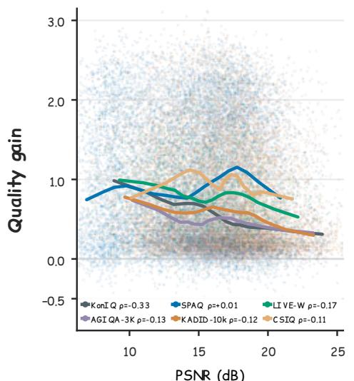  
PSNR (dB)

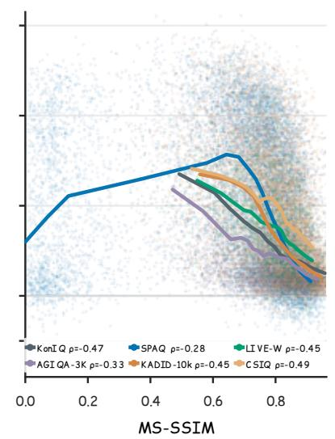

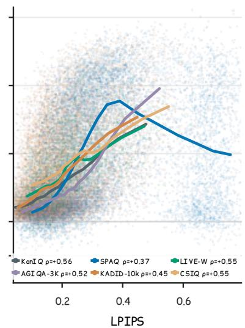  
Figure 4: Quality gain versus visual change scale. The panels relate the Judge-observed quality gain $\Delta s$ to PSNR, MS-SSIM (Wang, Simoncelli, and Bovik 2003), and LPIPS (Zhang et al. 2018) between the original and edited images. Colors denote datasets, curves show smoothed trends, and ρ denotes Spearman correlation.

## B.1 Visual Change and Quality Gains

Visual change and quality improvement. Figure 4 relates the Judge-observed quality gain to three referencebased measures of the visual change between the original and edited images. Quality gain is generally negatively correlated with PSNR $( \rho = - 0 . 3 3 \ \mathrm { t o } \ + 0 . 0 1 )$ and MS-SSIM $\left( \rho = - 0 . 4 9 \mathrm { t o } - 0 . 2 8 \right)$ , and positively correlated with LPIPS $( \rho ~ = ~ 0 . 3 7 ~ 1 0 ~ 0 . 5 6 )$ . Because larger changes correspond to lower PSNR/MS-SSIM and higher LPIPS, these consistent directions indicate that larger editing changes are generally associated with greater image-quality improvements. SPAQ deviates from the other datasets across multiple measures. Its quality-gain correlation is nearly zero for PSNR $( \rho = + 0 . 0 1 )$ and is the weakest in magnitude for both MS-SSIM $( \rho = - 0 . 2 8 )$ and LPIPS $( \rho = + 0 . 3 7 )$ . A similar pattern appears in rating performance: while the rating correlations on the other datasets change during training, the SPAQ correlation remains close to 0.90 with only minor variation. This stability suggests that SPAQ is less sensitive to the training-induced changes observed on the other benchmarks.

## B.2 Low-Level Visual Feature Patterns

Human-like Judge feedback. Figure 5 shows that the feature-dependent curves produced by the original-image Judge broadly follow the corresponding human-MOS curves across the six datasets. Their similar shapes and directions, particularly for sharpness and contrast, indicate that the Judge captures human-like quality preferences over low-level visual attributes. This agreement supports its use as a qualified source of human-like feedback for the original–edited image pairs.

Cross-dataset feature patterns. Among luminance, contrast, saturation, sharpness, colorfulness, and entropy, sharpness exhibits the clearest cross-dataset trend. Both human MOS and Judge scores generally increase with sharpness, whereas the other attributes show weaker, nonlinear, or dataset-dependent patterns. This result suggests that sharpness is a broadly shared quality cue, while no single low-level attribute fully explains perceptual quality across all datasets.

Edited-feature distributions. After editing, the images retain broad distributions across all six low-level attributes rather than collapsing to fixed feature values. The framework therefore does not appear to overfit a single low-level pattern when improving image quality. Nevertheless, Figure 5 examines each attribute marginally. The joint distribution of low-level attributes, and its relation to the human visual system and learned perceptual representations such as CLIP-IQA (Wang, Chan, and Loy 2023), warrants further investigation.

## B.3 Framework Behavior Preference

Source quality, visual change, and quality gain. Figure 6(a) shows that lower-MOS images generally receive larger Judge-rated quality gains. Panel (c) further shows that lower-MOS images tend to have lower similarity between the original and edited images, indicating larger visual changes. Together with the observation in Section B.1 that larger visual changes are associated with higher quality gains, these results suggest a plausible behavior: for lower-quality inputs, the model tends to modify more visual attributes, which in turn leads to greater quality improvements. This behavior aligns with the intuition that lower-quality images provide more room for correction and supports the intended operation of our framework, although the observed associations do not by themselves establish causality.

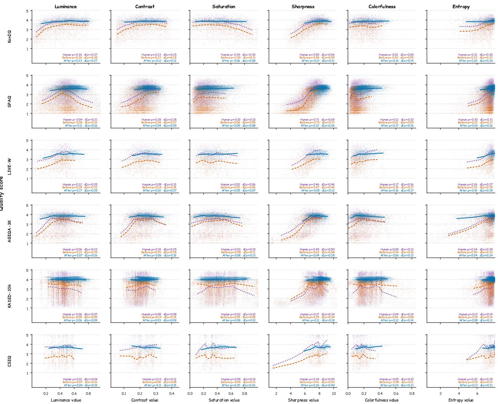  
Figure 5: Quality scores versus low-level image features. Rows denote datasets and columns denote luminance, contrast, saturation, sharpness, colorfulness, and entropy. Purple and orange show human MOS and Judge scores for original images, while blue shows Judge scores for edited images. Curves show smoothed trends; ρ and dCor denote Spearman and distance correlations (Székely, Rizzo, and Bakirov 2007).

Preferences over feature changes. Unlike Section B.2, which examines the absolute values of low-level attributes, Figure 6(b) relates their changes after editing to the resulting quality gain. Changes in sharpness retain the strongest and most consistent relationship with quality improvement. For entropy and saturation, the authentic and synthetic datasets form diferent response patterns, indicating that the preferred corrections depend on the degradation domain. SPAQ again exhibits signals that are less consistent with the other datasets, in agreement with the dataset-specific behavior observed in Section B.1.

Behavioral adaptation and concentration. Figure 6(d) reflects how the model adjusts its reasoning vocabulary in response to Judge feedback. After training, terms such as natural and realistic become prominent, revealing a learned preference for perceptually plausible corrections. At the same time, restore alone accounts for 20.6% of the displayed token frequency, and the top-10 token share rises to 44.1%. This concentration suggests an emerging tendency to overfit a small set of solution patterns, despite the broader behavioral alignment induced by the framework.

## C Discussion on the Editor Proxy

This work does not disentangle the Editor’s instructionfollowing capability from semantic preservation, creating

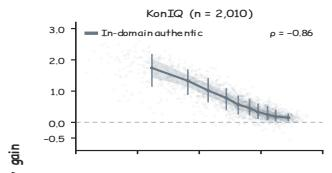

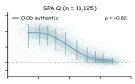

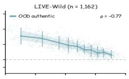

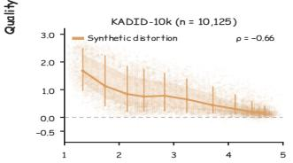

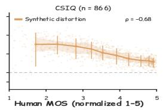

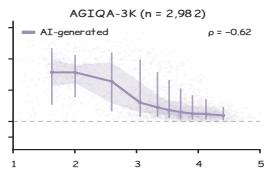

(a). Quality Gains vs. MOS  
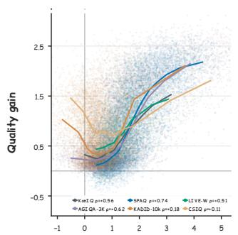  
∆ sharpness

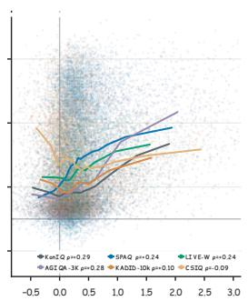  
∆ ent ropy

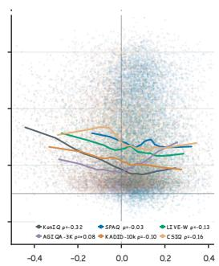

(b). Quality Gains vs. Low-level feature  
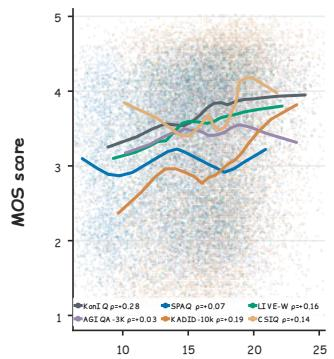  
PSNR (dB)

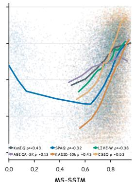

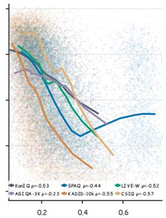  
LPIPS

(c). MOS vs. Reference Metrics  
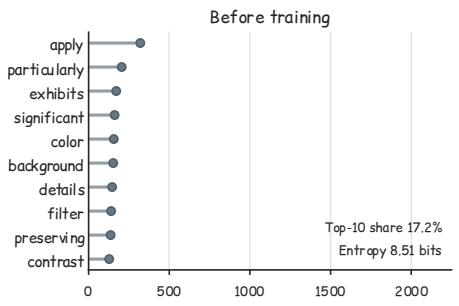

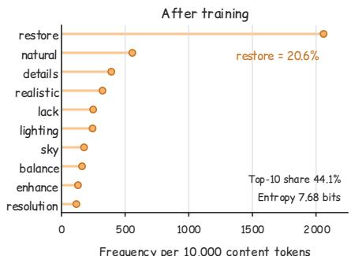  
(d). Token Frequency Change

Figure 6: Behavioral analysis of reasoning-guided editing. (a) Judge-rated quality gain versus human MOS across six benchmarks. (b) Quality gain versus changes in low-level image features. (c) Human MOS versus reference-based similarity metrics between the original and edited images. (d) Frequent reasoning tokens before and after training.

two attribution risks. First, quality may degrade because of Editor limitations rather than an incorrect Actor instruction. Second, the edited image may become semantically inconsistent with the input, weakening quality change as a proxy for reasoning faithfulness. Future work should use independent human or human-like evaluation to assess instruction following, semantic consistency, and perceptual quality separately, yielding more reliable feedback and a more faithful framework.

## D Joint Rating, Reasoning, and Diversity Analysis

Evaluation protocol. We jointly examine rating generalization, functional reasoning, and language diversity. Rating results are six-dataset averages over 28,270 test images. Functional reasoning is measured by the Judge-score gain ∆s on the same 5,843 image keys for every Actor, using a fixed FLUX Editor and E5 Judge. This common-case evaluation excludes 23 Mask generations that reached the length limit. Language diversity is evaluated on 23,599 common successful inputs. Evidence and solution uniqueness are exact-string statistics, with the top-1 share measuring the concentration of the most frequent output. Results should therefore be compared within each metric and its stated sample scope.

Dataset-level rating performance. Table 5 provides the complete cross-dataset results. In the controlled E1 comparison, Without Mask performs best on KonIQ, SPAQ, and AGIQA-3K and has the lowest average MAE. Mask, no KL has lower average correlation. Adding KL to Mask recovers most of this gap and gives the strongest LIVE-W result. At E5, Without Mask is stronger on KADID-10k and slightly higher in CSIQ SRCC, whereas Mask has the best average PLCC and is stronger on most authentic and AI-generated benchmarks. Despite their similar average correlation, Without Mask has a substantially higher MAE (1.054 versus 0.543), exposing a calibration failure that PLCC and SRCC alone do not capture.

Rating and functional reasoning. Table 6 extends the main ablation in Table 3 with output-level diagnostics. The rating-only Actor attains strong rating alignment but produces edits that reduce quality on average. Among the controlled E1 variants, Without Mask has the strongest rating correlation, whereas Mask gives the largest quality gain. Mask + KL recovers most of the rating gap while retaining a positive mean gain. These results separate rating accuracy from the functional usefulness of reasoning.

Evidence and solution diversity. Without Mask produces only three distinct evidence strings, with one string accounting for 99.992% of the matched outputs. Its evidence has therefore collapsed even though its solutions remain more varied. Mask increases the number of unique evidence strings to 291 and yields the highest solution uniqueness. Adding KL further raises evidence uniqueness to 5,668 and lowers its top-1 share to 13.191%, at the cost of some solution diversity and edit gain. Evaluating evidence and solution separately is thus necessary: rating correlation, full-output validity, or solution diversity alone can conceal a collapsed reasoning field. Exact uniqueness remains a lexical proxy and does not by itself establish semantic diversity or faithfulness. At E5, Without Mask retains diverse evidence (74.719% unique; 0.556% top-1), while its solution uniqueness falls to 0.004% and its solution top-1 share reaches 100%. This field-wise mismatch shows why evidence and solution must be audited separately.

Final E5 balance. The E5 rows in Table 6 reinforce this multi-objective interpretation. Without Mask E5 reaches a raw gain of+1.431 but maps all 28,270 inputs to one normalized solution in the same template family despite retaining diverse evidence. Mask E5 obtains an average PLCC/SRCC of 0.838/0.812, a mean quality gain of +1.071, and 19,618 unique evidence strings on the matched audit. It also produces 23,457 normalized solutions among 28,044 successful full-audit cases, with no detected house-template outputs. The higher Without Mask reward therefore reflects a universal edit rather than image-conditioned solution reasoning. Because the final runs change both credit routing and KL topology and use one seed per setting, this comparison is diagnostic rather than a pure causal estimate of the credit mask. Section E provides the corresponding training and validation dynamics.

## E Detailed Credit-Mask Audit E.1 Audit Scope and Protocol

We audit two complete five-epoch runs with the same Actor, data, prompt, and GRPO settings. Mask routes each reward to its supervised output with output-specific KL regularization; Without Mask broadcasts rewards over the complete output with one global KL term. Both use a KL coeficient of 0.02. The diagnostic reasoning reward bounds the raw Judge-score change:

$$
R _ { i , k } ^ { \mathrm { d i a g } } = \mathrm { s g n } ( \Delta s _ { i , k } ) \left( 1 - \mathrm { e } ^ { - \Delta s _ { i , k } ^ { 2 } / 2 } \right) .\tag{14}
$$

The Editor consumes only the solution without an explicit semantic guardrail. Both runs use six samples per image, 160- token completions, and frozen vision encoder and aligner. Each contains 1,455 steps with 144 trajectories per step (209,520 per run; 419,040 total). No step or record is missing, duplicated, invalid, or non-finite. At Without Mask steps 711 and 713, all samples are Actor-ineligible, so absent Judge changes reflect eligibility rather than numerical or service failure. Because credit and KL routing change jointly and each setting has one seed, this audit is descriptive rather than causal.

## E.2 Training Dynamics

Figure 7 reports exact four-rank means at the retained checkpoints. Both configurations improve rating reward. Without Mask produces larger reasoning reward and Judge gain, but also shorter outputs and solution collapse. Mask changes more gradually: its reasoning reward rises from 0.207 to 0.307 and Judge gain from 0.586 to 0.840. Rating rewards converge by E5. KL losses are not directly comparable because their token scopes difer. For Without Mask, mean reasoning reward and Judge gain increase from 0.463 and

Table 5: Dataset-level rating performance of the credit-routing variants. Dataset and Average entries report PLCC/SRCC, where Average is the unweighted average over the six datasets. The three E1 variants share the same source checkpoint; the two E5 runs are trained from the native parent for five epochs. The first two E1 variants use no KL. Bold marks the best result before rounding in each column.
<table><tr><td>Method</td><td>KonIQ</td><td>SPAQ</td><td>LIVE-W</td><td>AGIQA-3K</td><td>KADID-10k</td><td>CSIQ</td><td>Average</td><td>MAE↓</td></tr><tr><td>Without Mask (E1) Mask, no KL (E1)</td><td>0.952 /0.938 0.945 /0.931</td><td>0.901/0.898 0.894/0.892</td><td>0.897/0.877 0.892/0.867</td><td>0.816/0.747 0.805/0.719</td><td>0.661/0.668 0.641/0.650</td><td>0.771 /0.746 0.758/0.727</td><td>0.833 /0.812</td><td>0.492</td></tr><tr><td>Mask + KL (E1)</td><td>0.951/0.938</td><td>0.896/0.895</td><td>0.903/0.880</td><td>0.801/0.731</td><td>0.653/0.664</td><td>0.784/0.758</td><td>0.822 /0.798 0.831/0.811</td><td>0.706 0.676</td></tr><tr><td>Without Mask (E5) Mask (E5)</td><td>0.932/0.914 0.937/0.917</td><td>0.896/0.897 0.900/0.899</td><td>0.878/0.857 0.893/0.863</td><td>0.809/0.736 0.809/0.739</td><td>0.676/0.684 0.667/0.669</td><td>0.815/ /0.786 0.824/0.7850.838/0.812</td><td>0.834/ /0.812</td><td>1.054 0.543</td></tr></table>

Table 6: Joint rating, functional reasoning, and diversity analysis. P/S is the six-dataset average PLCC/SRCC. ∆s and Pos. are measured on 5,843 common images. Diversity columns report percentages; lower top-1 means less concentration. Unmarked diversity values use 23,599 matched inputs. † marks full E5 audits (28,270 Without Mask; 28,044 Mask).
<table><tr><td rowspan="3"></td><td>Rating</td><td colspan="2">Functional reasoning</td><td colspan="4">Language diversity</td></tr><tr><td>P/S ↑</td><td>Mean ∆s ↑</td><td>Pos. (%) ↑</td><td>Evidence unique Evidence top-1 Solution unique Solution top-1 (%) ↑</td><td>(%) ↓</td><td>(%) ↑</td><td>(%) ↓</td></tr><tr><td>Baseline</td><td>0.652/0.645</td><td>-0.136</td><td>40.664</td><td>一</td><td></td><td>一</td><td></td></tr><tr><td>Rating-only</td><td>0.836/0.815</td><td>-0.260</td><td>30.686</td><td></td><td></td><td></td><td></td></tr><tr><td>Without Mask (E1)</td><td>0.833/0.812</td><td>+0.837</td><td>96.954</td><td>0.013</td><td>99.992</td><td>50.621</td><td>0.822</td></tr><tr><td>Mask, no KL (E1)</td><td>0.822/0.798</td><td>+0.917</td><td>97.707</td><td>1.233</td><td>21.196</td><td>94.508</td><td>0.085</td></tr><tr><td>Mask + KL (E1)</td><td>0.831/0.811</td><td>+0.788</td><td>95.054</td><td>24.018</td><td>13.191</td><td>75.228</td><td>0.191</td></tr><tr><td>Without Mask (E5)</td><td>0.834/0.812</td><td>+1.431</td><td>99.997</td><td>74.719†</td><td>0.556†</td><td>0.004†</td><td>100.000†</td></tr><tr><td>Mask (E5)</td><td>0.838/0.812</td><td>+1.071</td><td>98.813</td><td>83.131</td><td>0.407</td><td>83.644†</td><td>0.182†</td></tr></table>

1.189 over steps 1256–1355 to 0.478 and 1.232 over steps 1356–1455. Yet their final-window slopes are −0.0108 and −0.0246; the rating-reward slope is −0.0006. The endpoint therefore masks a plateau and slight decline.

## E.3 Checkpoint Validation

Figure 8 evaluates the retained checkpoints on the same 200 images. PLCC and SRCC improve for both runs. Without Mask keeps a Judge gain near 1.18, while normalizedsolution uniqueness falls from 91.88% at E1 to about 0.5% at E2. The audit further shows that the semantic dwellingtemplate rate reaches 100% at E1. Semantic collapse therefore precedes near-exact lexical collapse.

## E.4 Cross-Dataset Outcomes

At E5, Without Mask obtains a larger pooled quality gain than Mask (1.431 versus 1.071), although their six-dataset PLCC/SRCC averages remain close (0.834/0.812 versus 0.838/0.812). Larger gain alone therefore does not establish healthier reasoning. All 28,270 Without Mask outputs share one normalized solution; Mask retains 23,457 among 28,044 successful outputs.

## E.5 Collapse Milestones

Table 7 distinguishes semantic, phrase-level, and near-exact collapse. Under Without Mask, the semantic dwelling family exceeds 90% at step 265, whereas one normalized sentence does not exceed 90% until step 551. Duplicate matching

would detect the failure 286 steps late. Mask avoids dwelling collapse, although its super-resolution and smoothing phrase backbone remains above 90% from step 407 onward.
<table><tr><td>Routing and detector</td><td>≥ 50%</td><td></td><td>≥ 90% Sustained</td></tr><tr><td>Without Mask: semantic dwelling</td><td>236</td><td>265</td><td>948-E5</td></tr><tr><td>Without Mask: strict target phrase</td><td>356</td><td>475</td><td></td></tr><tr><td>Without Mask: modal normalized solu- tion</td><td>520</td><td></td><td>551 973-E5</td></tr><tr><td>Without Mask: canonical sentence</td><td>1,133</td><td>1,146 -</td><td></td></tr><tr><td>Mask: super-resolution + smoothing</td><td>214</td><td></td><td>260407-E5</td></tr></table>

Table 7: Collapse milestones in global optimizer steps. Semantic detectors identify shared concepts before normalized near-duplicate matching identifies one sentence.

## E.6 Output-Length Evolution

Panel (d) of Figure 7 shows that the mean training completion decreases from 89.39 to 85.26 tokens under Without Mask but rises from 100.57 to 109.00 under Mask. On validation outputs, the corresponding solution lengths change from 32.56 to 18.00 and from 37.85 to 50.94. The former contraction is consistent with convergence to one reusable instruction.

## E.7 Rating and Diversity Diagnostics

Without Mask retains a KonIQ PLCC/SRCC of 0.932/0.914   
despite solution collapse. Ratings still vary: 2,009 of 2,010

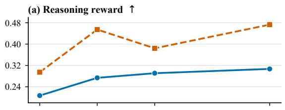

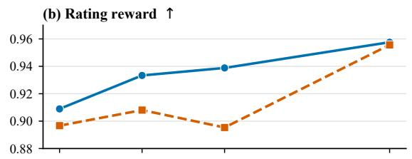

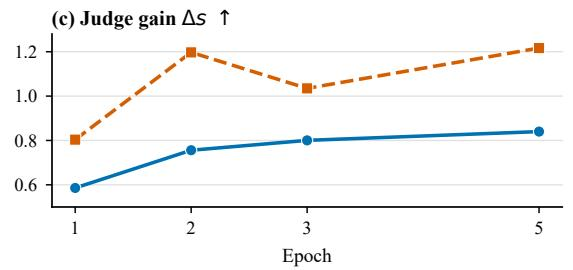

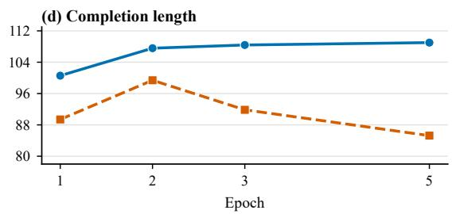  
Figure 7: Training dynamics at the retained checkpoints. Each point is the exact four-rank mean for E1, E2, E3, or E5. Without Mask produces larger reasoning reward and Judge gain, whereas rating reward converges similarly. Its concurrent reduction in completion length is consistent with convergence toward a high-reward solution template.

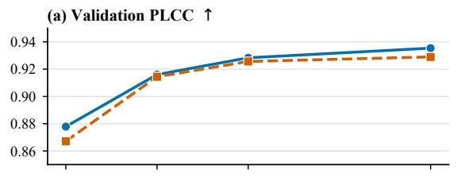

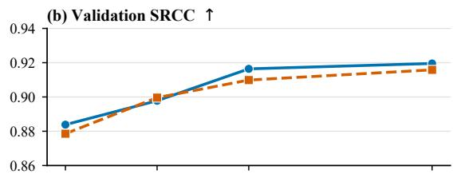

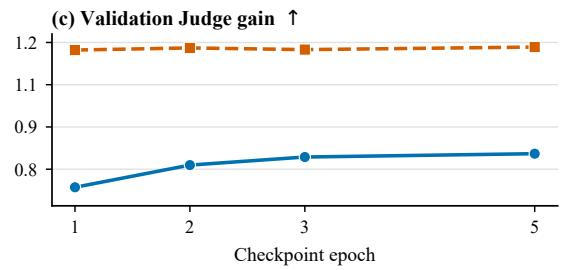

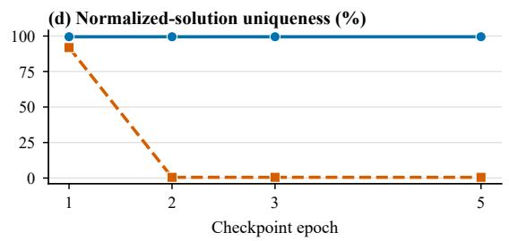  
Figure 8: Checkpoint validation dynamics. Panels (a)–(c) report PLCC, SRCC, and Judge gain on the complete 200-image validation set. Panel (d) reports normalized-solution uniqueness. Without Mask maintains rating alignment and high Judge gain while its solutions collapse.

complete JSON outputs are unique, although all 2,010 solutions are identical after normalization. Rating correlation and full-output uniqueness therefore miss solution collapse. Evaluation must inspect the supervised output alongside image– solution relevance and semantic preservation.

## E.8 Representative Validation Outputs

The Without Mask E5 Actor produces diferent evidence and ratings for the three examples, but all solutions normalize to one dwelling instruction. Sample 1 still receives 0.865 reward because the fixed intervention raises the Judge score from 2.37 to 4.37. Thus, the reward measures edited-image quality without establishing source-image faithfulness.

<table><tr><td>Sample</td><td>Rating</td><td>J0</td><td>J1</td><td>∆s</td><td>R</td></tr><tr><td>1</td><td>1.68</td><td>2.37</td><td>4.37</td><td>2.00</td><td>0.865</td></tr><tr><td>2</td><td>3.32</td><td>3.84</td><td>4.32</td><td>0.48</td><td>0.109</td></tr><tr><td>3</td><td>2.65</td><td>3.02</td><td>4.36</td><td>1.34</td><td>0.593</td></tr></table>

Table 8: Representative Without Mask validation outputs. Diferent evidence and ratings lead to the same normalized solution.

## E.9 Causal Scope

The comparison changes credit and KL routing jointly with one seed per setting. It establishes a reproducible failure mode for Without Mask/global KL, but not the responsible change. Causal attribution requires a 2×2 grid of Without Mask versus Mask and global versus component KL, with multiple seeds.