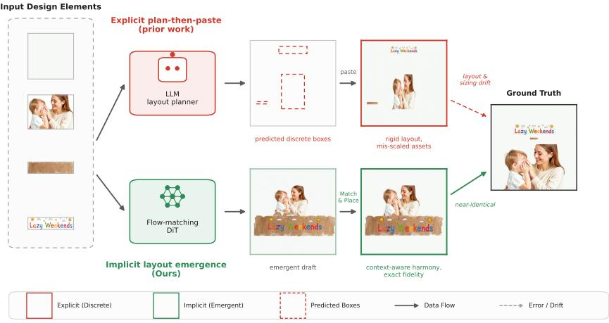
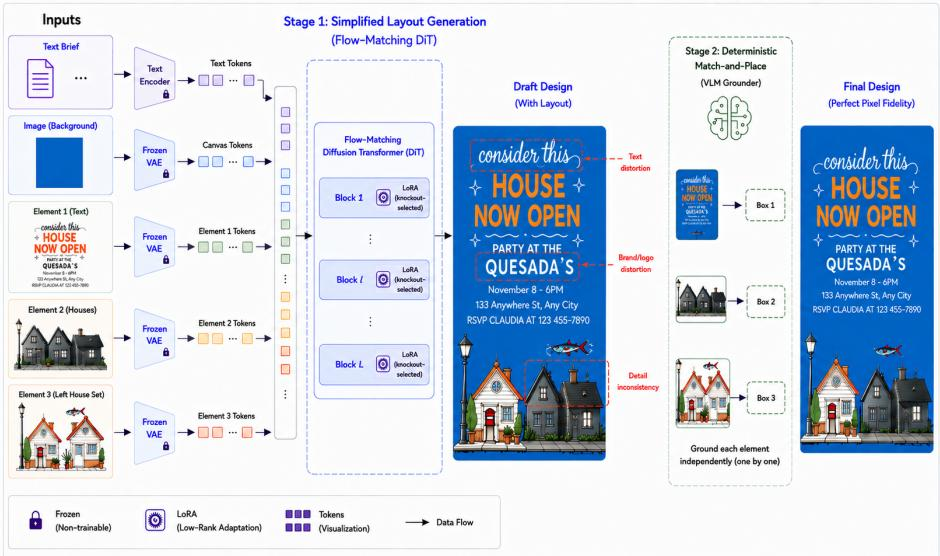
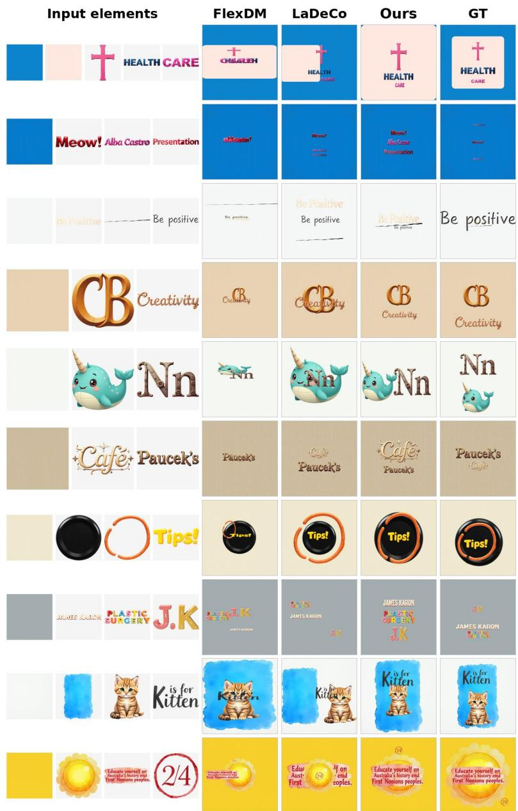
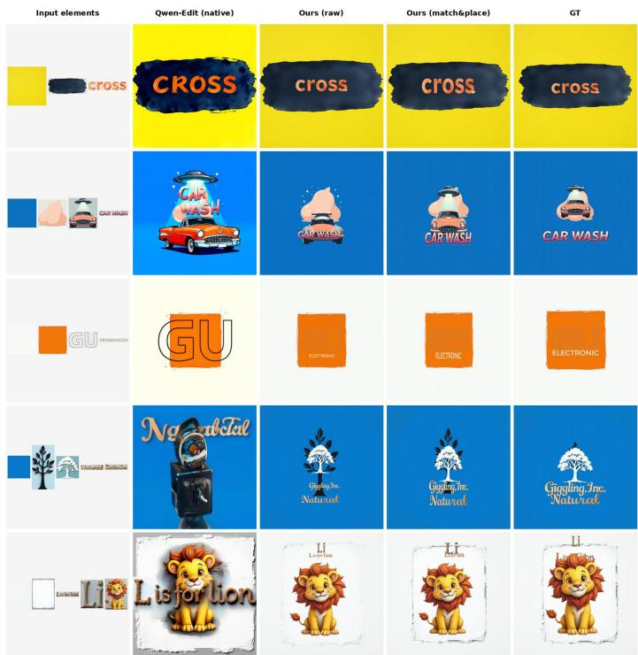

# Mise-en-Scène: Implicit Layout Emergence in Difusion Transformers for Human-AI Design Co-Creation

Zipeng Xu, Ryan Murdock, and Umberto Michieli

Canva Research

{zipeng,ryanmurdock,umbe}@canva.com

Abstract. Automating graphic design synthesis from user-provided elements requires both a coherent overall composition and the exact preservation of each asset. Existing methods predict a layout as explicit bounding box coordinates with a language model and then paste the assets into it, which separates spatial planning from visual synthesis and tends to produce rigid, mis-scaled compositions. We instead ask whether the layout can emerge implicitly inside a pretrained image-editing difusion transformer. We present Mise-en-Scène, a two-stage framework. In the first stage, a difusion transformer adapted with a small, knockout-selected LoRA drafts a complete design in which the arrangement of the elements emerges jointly with the rendered canvas. In the second stage, a deterministic match-and-place step moves the original high-resolution assets to the drafted positions, which guarantees exact asset fidelity and yields an editable, layered design that a designer can keep refining rather than a flat image. Notably, a minimal adaptation of the pretrained transformer already sufices, without the specialized conditioning machinery commonly introduced for multi-element generation. On the large-scale PrismLayersPlus benchmark, the designs produced by Mise-en-Scène are the closest to the ground truth in perceived quality among all compared methods, by a wide margin over both an LLM layout planner and a specialized layout transformer, while our match-and-place stage bridges the remaining fidelity gap to the ground-truth composites.

Keywords: Graphic Design Generation · Difusion Transformers · Layout Generation

## 1 Introduction

Visual design is fundamentally a collaborative process between creative intent and aesthetic execution [5, 7, 8, 11, 18, 19, 32, 33, 37, 46, 50, 52]. In practical scenarios, designers rarely start from a blank canvas; rather, they are driven by a predefined set of unstructured visual elements—such as product cutouts, brand assets (e.g., logos), and specific textual slogans—which must be composed into a coherent and visually compelling design. Transforming these isolated assets into an aesthetically balanced layout demands a profound understanding of spatial hierarchy and visual harmony. Traditionally, this task has been carried out manually by professional designers using tools such as Canva or Photoshop. Providing designers with automatically generated candidates that they can adopt or refine has the potential to significantly improve creative eficiency and accessibility, particularly for non-expert users. This motivates the task of design image generation conditioned on given visual elements, which aims to synthesize complete designs guided by structured visual inputs [8, 11, 37, 50].

  
Fig. 1: Two paradigms for element-conditioned design. Given the same design elements provided without spatial context (left), the explicit plan-then-paste pipeline (top) has an LLM predict discrete bounding boxes and pastes the assets into them, which often mis-scales elements and yields rigid layouts. Our Mise-en-Scène (bottom) lets the layout emerge implicitly inside a flow-matching difusion transformer and then restores exact pixels with a deterministic match-and-place step, producing a composition close to the ground truth. The boxes in the top row are the planner’s real predictions, and every image is a real output on the same sample.

Existing approaches to element-based design generation predominantly rely on decoupled, multi-stage pipelines. A common paradigm, exemplified by recent state-of-the-art frameworks, leverages Large Language Models (LLMs) to explicitly predict spatial bounding boxes as discrete coordinates, followed by image synthesis or post-hoc compositing [28, 30, 41]. However, this LLM "planthen-paste" approach sufers from fundamental limitations. LLMs, inherently biased toward 1D sequential text reasoning, often lack a native understanding of dense 2D spatial relationships and fine-grained visual aesthetics [34]. Forcing a continuous visual composition task into discrete coordinate tokens introduces quantization errors and creates a severe modality gap. In addition, the planner never observes the renderer, so it cannot account for how the elements will actually be drawn, and placement errors propagate to the final design, leading to suboptimal visual harmony. Figure 1 contrasts this explicit plan-then-paste pipeline with the implicit alternative we pursue.

In this work, we propose a paradigm shift by posing a fundamental scientific question: Can we bypass explicit LLM-based layout prediction and directly unlock the implicit layout expertise and aesthetic composition capabilities natively embedded within large-scale pre-trained difusion models? Generative foundation models, through training on billions of image-text pairs, have already internalized rich continuous priors regarding structural balance, text-background contrast, and contextual object placement. To validate this, we introduce Mise-en-Scène, which turns a pretrained image-editing difusion transformer into an elementconditioned design generator using only a small, knockout-selected LoRA. The elements enter the joint attention stream of the model as ordinary visual tokens, and their spatial arrangement emerges jointly with the rendered canvas, with no explicit coordinate predictor. In our experiments, the extra conditioning components introduced by prior multi-element work bring no benefit, and the simplest adaptation works best; our final model is therefore deliberately minimal.

While the DiT backbone excels at establishing a globally coherent layout and aesthetic harmony, stochastic difusion sampling inherently struggles to guarantee the pixel-perfect reconstruction required for strict brand asset fidelity. To address this, our framework adopts a compositional post-processing strategy. We append a deterministic, non-learned Match-and-Place refinement module to the generation pipeline. A vision-language model grounds each input element in the generated draft, returning the box where the model placed it, and we paste the original asset layer at that box. This reads out the layout that the difusion model produced and re-renders it from the original pixels, so the final design preserves every asset exactly and remains an editable, layered document rather than a flat image. Because the output stays editable, the generated design is a starting point the designer can refine rather than a fixed result, supporting a human-AI co-creation workflow.

Our contributions can be summarized as follows:

We introduce a generative paradigm for element-conditioned design synthesis that shifts from explicit LLM-based layout planning to implicit layout emergence within a pretrained difusion transformer that we adapt with only a small LoRA.

– We introduce a deterministic Match-and-Place scheme that reinstates the original assets as separate layers, ensuring 100% visual identity preservation and returning a fully editable layered design rather than a flat image.

– Extensive experiments on the large-scale PrismLayersPlus [5] benchmark show that our designs are the closest to the ground truth in perceived quality among all compared methods, substantially ahead of both an LLM layout planner and a specialized layout transformer.

## 2 Related Work

## 2.1 Graphic Design Synthesis and Composition

Automating graphic design has evolved rapidly, moving from early latent modeling of vector graphic documents [46] to multi-stage, multi-modal pipelines. A dominant line of work decomposes a design into hierarchical layers and renders text, foreground, and background sequentially [18,19], a paradigm subsequently specialized for infographics [32] and high-quality, editable poster synthesis [7,52]. The maturation of large-scale transparent multi-layer datasets [5] and dedicated layered generators [33] has further fueled this direction. A parallel thread leverages large multimodal models to evaluate, critique, and iteratively refine designs [8, 11], and to unify multi-conditional generation within a single difusion transformer [37, 50].

Most relevant to us is element-conditioned composition, where a fixed set of user-provided assets must be assembled into a finished design. LaDeCo [29], the current state of the art for element-conditioned design composition, casts this as a layered, sequential rendering problem driven by an LLM layout planner, while GIST [30] operates as a post-hoc compositor that harmonizes already-placed elements. We argue these methods share a common structural limitation: they enforce a decoupled plan-then-paste (or plan-then-composite) pipeline that severs spatial planning from visual synthesis. Because the planner never observes the generative manifold of the renderer, errors compound across stages and global aesthetic harmony is sacrificed for local placement. In contrast, Mise-en-Scène treats element-conditioned composition as a single-pass generative process in which layout emerges implicitly and jointly with visual harmonization, and invokes explicit coordinates only at the very end to guarantee pixel fidelity.

## 2.2 Generative Layout Modeling

Predicting where elements belong is a long-standing sub-problem of design synthesis. Early approaches modeled bounding-box distributions with GANs [13, 24, 25, 53], after which difusion models were adapted to the discrete-continuous nature of layout [2,3,15,16,23]. More recently, the field has reframed layout as a sequence-modeling task solved by LLMs and LMMs [4,12,28,36,41,48], with some works ingesting full multimodal markup documents [20]. While such models excel at sequential reasoning, we contend they are structurally mismatched to dense 2D layout: serializing continuous spatial relations into 1D discrete coordinate tokens imposes an unnatural quantization and opens a modality gap between a text-biased planner and a pixel-level synthesizer. A complementary family of grounded generators—e.g. GLIGEN [26]—instead injects bounding boxes as explicit conditioning, but still presupposes that coordinates are given rather than discovered. Mise-en-Scène departs from both paradigms: rather than predicting or consuming discrete boxes, it resolves spatial configurations natively within the continuous latent space of a difusion transformer, and recovers explicit coordinates only a posteriori for evaluation and fidelity-preserving recomposition.

## 2.3 Image-Conditioned Generation and Visual In-Context Learning

Injecting specific visual elements into difusion models has been explored extensively. Adapter- and attention-based methods such as IP-Composer [10] and part-based concepting frameworks [35] fuse image embeddings through decoupled cross-attention. With the shift to Difusion Transformers [31], a powerful line of visual in-context approaches now treats reference assets as additional tokens within the joint attention stream, unlocking controllability directly from visual prompts via token concatenation, flow matching, and lightweight finetuning [14,22,27,44]. Of particular relevance, OminiControl [39,40] and UNO [44] report that shifting the Rotary Position Embedding (RoPE) of conditioning tokens to non-overlapping index ranges helps disambiguate multiple references and stabilize training. We build on the same design-oriented backbone (Qwen-Image-Edit [43]) and evaluate such an ofset in our multi-element setting, but find it unnecessary in our experiments: the pretrained backbone already separates the concatenated elements without an explicit positional ofset.

A second challenge in multi-element conditioning is concept bleeding—the architectural tendency of attention to leak features between subjects [9]. UNetera solutions localize cross-attention either by training-time supervision against segmentation masks [45] or layout boxes [42], or by training-free attention manipulation at inference [6, 9]. We revisit this idea in the DiT joint-attention regime and experiment with analogous attention-grounded supervision, namely a boxalignment term that steers each element toward its region and a separation term that discourages overlap between elements’ attention maps. In our setting this supervision leaves quality essentially unchanged: the joint-attention backbone does not show the concept bleeding that motivated these losses in the UNet era, so we omit them in our final model.

To ensure perfect identity preservation of image elements, our framework recovers an explicit layer composition as a post-process. This connects to the rich literature on layer decomposition and transparent-layer generation, from latent-transparency difusion [51] and region transformers [33] to recent raster-tolayer decomposers [38,47,49]. Rather than learning a decomposition network, we exploit the zero-shot visual grounding ability of modern VLMs [1] to localize each generated element and deterministically substitute the original high-resolution asset, combining the difusion model’s emergent aesthetics with lossless identity preservation.

## 3 Problem Formulation

We formulate element-conditioned design generation as a unified spatial arrangement and visual compositing task. A training sample is formalized as an ordered tuple:

$$
( c _ { 0 } , c _ { 1 } , \ldots , c _ { N } , y , \tau , \{ b _ { k } \} _ { k = 1 } ^ { N } ) ,\tag{1}
$$

where $c _ { 0 }$ represents the base background canvas, $c _ { 1 } , \ldots , c _ { N }$ are the transparent foreground element layers (RGBA images), y is the finalized composite design, τ is a structured text brief, and $b _ { k } = [ x ^ { \operatorname* { m i n } } , y ^ { \operatorname* { m i n } } , x ^ { \operatorname* { m a x } } , y ^ { \operatorname* { m a x } } ]$ denotes the groundtruth bounding box of element k within the coordinate space of $y .$

Crucially, the input visual elements $c _ { 0 : N }$ are provided out of spatial context. The generative model must independently infer their optimal joint arrangement to learn the conditional distribution $p _ { \theta } ( y \mid c _ { 0 : N } , \tau )$ . The ground-truth boxes $\left\{ b _ { k } \right\}$ are not used during training; they serve only to evaluate the extracted layout at test time. During inference, the model implicitly resolves spatial relationships, allowing us to subsequently extract precise per-element placements $\hat { b } _ { k }$ to drive the post-processing renderer.

  
Fig. 2: Overview of Mise-en-Scène. The method runs in two stages. In Stage 1 (simplified layout generation), a text brief, a background canvas, and the visual elements are mapped by frozen encoders into a joint token sequence and processed by a flow-matching Difusion Transformer adapted only through a knockout-selected LoRA, which produces a layout-aware draft design. Because the draft comes from stochastic sampling, it still contains rendering artifacts such as distorted text and warped logos. In Stage 2 (deterministic match-and-place), a VLM grounder locates each original element in the draft independently, and the original high-resolution layers are alphacomposited at the grounded boxes to yield the final design, which keeps the emergent layout while restoring exact, pixel-faithful, editable assets.

## 4 Method

Existing components-to-design frameworks typically formulate layout generation as a discrete coordinate prediction problem [29]. This decoupled paradigm severs the intrinsic connection between structural planning and pixel-level harmonization. Building upon the problem formulation in Section 3, our framework, Mise-en-Scène, operates as a unified two-stage pipeline. First, we achieve implicit layout emergence with a flow-matching Difusion Transformer (DiT) adapted by a knockout-selected LoRA. Second, we deploy a deterministic match-and-place post-processing stage that guarantees exact pixel fidelity and returns an editable, layered design.

As illustrated in Figure 2, the generative stage denoises the target canvas y while attending jointly to the text brief and the VAE-encoded visual elements. To adapt the model without eroding its pretrained rendering prior, we rely on resolution-agnostic conditioning and a task-specific knockout-guided LoRA, which we detail in the following subsections.

## 4.1 Implicit Layout Generation via Flow-Matching DiT

We build on a large-scale pretrained image-editing DiT. Below we describe how the elements enter its joint attention sequence, which projections we adapt, and the training objective.

Joint Sequence Modeling and Resolution-Agnostic Conditioning. The network denoises the target canvas y while processing all cross-modal information via a fully connected joint self-attention mechanism. Let $c _ { k } \in \mathbb { R } ^ { H _ { k } \times W _ { k } }$ ×4 denote the k-th visual asset (an RGBA image with four channels). To prevent token explosion from high-resolution inputs and handle elements of varying aspect ratios, each element is dynamically resized to a fixed pixel budget A (where $H _ { k } ^ { \prime } \times W _ { k } ^ { \prime } \approx A )$ prior to being processed by the frozen VAE encoder $\mathcal { E } _ { \mathrm { v a e } }$ . This yields a flattened latent token sequence $\mathbf { z } _ { k } \in \mathbb { R } ^ { L _ { k } \times D }$ , where $L _ { k } = ( H _ { k } ^ { \prime } / v ) \times ( W _ { k } ^ { \prime } / v )$ and v is the patch size. Concurrently, the text brief τ is encoded by a text encoder $\mathcal { E } _ { \mathrm { t e x t } }$ into language tokens $\mathbf { E } _ { \tau } \in \mathbb { R } ^ { L _ { \tau } \times D }$ . The generative process operates on the concatenated multi-modal joint sequence:

$$
\mathbf { Z } = \left[ \mathbf { E } _ { \tau } , \mathbf { z } _ { 0 } , \mathbf { z } _ { 1 } , \ldots , \mathbf { z } _ { N } , \mathbf { z } _ { y } \right] \in \mathbb { R } ^ { L \times D } ,\tag{2}
$$

where $\mathbf { z } _ { 0 }$ represents the base background canvas, $\mathbf { z } _ { y } ~ \in ~ \mathbb { R } ^ { L _ { y } \times D }$ represents the noisy target latent, and $\begin{array} { r } { L = L _ { \tau } + \sum _ { k = 0 } ^ { N } L _ { k } + L _ { y } } \end{array}$ is the total sequence length. Placeholders in τ act as semantic anchors, binding the encoded textual intent directly with the corresponding visual token spans.

LoRA Adaptation. Rather than adapt the full model, we apply LoRA to a small set of target projections chosen by a causal knockout procedure: starting from adapters on all candidate projections, we disable each in turn, measure the resulting change in the task metric on a held-out set, and keep the K=9 families whose adaptation matters most, leaving the rest of the backbone frozen. Adapting all LoRA-able projections instead performs comparably (Table 2), so we prefer this smaller set for its lower parameter count and faster training. This choice follows the spirit of parameter-eficient concept customization [21].

Flow-Matching Objective. The draft is learned with a standard flowmatching objective. We parameterize the vector field $v _ { \theta }$ to follow the optimaltransport path between the noise distribution $x _ { 0 } \sim \mathcal { N } ( 0 , I )$ and the data distribution $x _ { 1 }$ (the clean target latent), sampling intermediate states on the linear path $x _ { t } = \left( 1 - t \right) x _ { 0 } + t x _ { 1 }$ under a shifted timestep schedule $t \in [ 0 , 1 ]$ . Writing ${ \bf Z } _ { < y } = [ { \bf E } _ { \tau } , { \bf z } _ { 0 } , . . . , { \bf z } _ { N } ]$ for the conditioning tokens (the joint sequence Z without its target block $\mathbf { z } _ { y } = x _ { t } )$ , the objective is:

$$
\mathcal { L } _ { \mathrm { f m } } = \mathbb { E } _ { t , x _ { 1 } , x _ { 0 } } \Big [ \big \| v _ { \theta } \big ( x _ { t } , t , \mathbf { Z } _ { < y } \big ) - \big ( x _ { 1 } - x _ { 0 } \big ) \big \| _ { 2 } ^ { 2 } \Big ] .\tag{3}
$$

We use no auxiliary layout losses; the placement is learned end to end from the flow-matching signal alone.

## 4.2 Deterministic Match-and-Place

The draft $\hat { y }$ settles the layout, but stochastic sampling does not reconstruct high-frequency content such as small typography and vector logos exactly. We therefore separate layout from final rendering: the draft supplies the arrangement, and a deterministic match-and-place step re-renders the design from the original assets.

Grounding by visual matching. We use a vision-language model (VLM) as a visual grounder. For each element $c _ { k } .$ , the VLM is given the draft $\hat { y }$ together with the original element image and returns the tightest box in $\hat { y }$ whose content matches $c _ { k } \mathrm { : }$

$$
\hat { b } _ { k } = \mathrm { V L M } ( \hat { y } , c _ { k } ) .\tag{4}
$$

Each element is grounded independently, so the VLM does not plan a layout; it reads out the layout that the DiT has already produced. This is the essential diference from plan-then-paste baselines, whose boxes come from a planner that never observes the rendered design.

Placement. Every element is grounded in this way, including the base canvas $c _ { 0 }$ , which the VLM localizes just like the foreground layers. Starting from a transparent RGBA canvas $\mathbf { C } ^ { ( - 1 ) }$ , we composite the elements back-to-front: for $k = 0 , 1 , \ldots , N$ we resize the original element to its grounded box $\hat { b } _ { k }$ and alphacomposite it onto the running canvas:

$$
{ \bf C } ^ { ( k ) } ( p ) = \alpha _ { k } ( p ) \tilde { c } _ { k } ( p ) + \left( 1 - \alpha _ { k } ( p ) \right) { \bf C } ^ { ( k - 1 ) } ( p ) ,\tag{5}
$$

where $\tilde { c } _ { k }$ is the resized element and $\alpha _ { k }$ its alpha channel, and the final design is ${ \mathbf { C } } ^ { ( N ) }$ . Because every element is reinstated as its own layer at a grounded position, the output preserves the exact appearance of each asset (100% identity preservation) and remains a fully editable, re-arrangeable layered design rather than a flat raster.

## 5 Experimental

## 5.1 Experimental Setup

Dataset. We evaluate on PrismLayersPlus [5], containing approximately 97K commercial designs across 21 styles. Each sample provides a base canvas, N layer assets, the final composite, and layer-specific bounding boxes. The dataset is split into 78,299 / 9,787 / 9,785 for training, validation, and testing. Our main evaluation uses a stratified test set of 1,000 designs (TEST1000; 50 per style, up to 4 foreground layers), and the qualitative figures draw from the same test pool. Prior layout work is often evaluated on Crello [46], but a typical Crello design is built from many small vector and text elements, whereas our task composes a few user-provided image elements (photographs, logos, illustrations); we therefore evaluate on PrismLayersPlus.

Text brief. Each design is paired with a structured brief τ that describes what the design contains rather than where its elements go: a background description, one short phrase per foreground element, and an overall style tag, assembled into a fixed template, “Background: [bg]. Elements - Picture 1: [element 1]; ...; Picture N: [element N]. Style: [style].” The label Picture k corresponds to the k-th foreground element, so each text span binds to the matching visual tokens in the joint sequence. We generate the perelement phrases by prompting a large vision-language model (Qwen3.5-VL) on each element in isolation; our prompt ablation (Table 2) replaces these phrases with the dataset’s original captions placed in the same template.

Implementation Details. We build on the Qwen-Image-Edit DiT and inject LoRA (rank 512) into the 9 knockout-selected target projections: the query, key, value, and output projections of the image-stream self-attention (to\_q, to\_k, to\_v, to\_out), the query and output projections of the text stream (add\_q\_proj, to\_add\_out), the image and text feed-forward output projections (img\_mlp, txt\_mlp), and the image modulation projection (img\_mod); the knockout drops the remaining families, notably the text-stream key/value and modulation projections. Each conditioning element is resized to a pixel budget of 262,144 $( \approx 5 1 2 ^ { 2 } )$ before the frozen VAE encoder, and we keep up to five conditioning images per sample: the base canvas c0 plus up to $N = 4$ foreground elements $c _ { 1 } , \ldots , c _ { N }$ . Training uses a learning rate of $5 \times 1 0 ^ { - 5 }$ with cosine decay, 500 warmup steps, and an efective batch size of 48 (distributed across 8×H200 GPUs). We use Classifier-Free Guidance with a 10% condition-dropout probability and zero the timestep conditioning. In inference we sample for 40 steps with a guidance scale of 3.0 and generate at ≈ $1 0 2 4 ^ { 2 }$ to match the ground-truth resolution. For match-and-place, the Qwen3-VL-8B grounder locates each element independently and returns a box in a normalized [0, 1000] space; we denormalize it, resize the original RGBA asset to that box by Lanczos resampling, and alpha-composite the elements back-to-front in their layer order. An element that the grounder fails to locate is left out of the composite.

Evaluation Protocol & Metrics. For fairness, we align all generation resolutions to the target ground truth (≈ 10242) and evaluate box geometry in a scale-independent space. Following LaDeCo [29], we report two families of metrics. Geometry (Val, Olap, Align) measures the validity, element overlap, and global alignment of the extracted layout boxes, each read as closeness to the ground-truth statistics. Aesthetics (LVM) measures design quality with a large multimodal judge (Qwen3-VL-8B) across five criteria, reported as the absolute deviation from the ground truth (|∆GT|).

Baselines. We compare against two baselines that we reproduce and retrain on PrismLayersPlus using the authors’ oficial open-source code: LaDeCo [29], the strongest prior approach to this task and a recent LLM-based layout planner, and FlexDM [17], a masked multi-modal layout transformer. Both predict a layout and render it by pasting the original assets, so we pass every method through the same VLM grounder and rendering pipeline, ensuring all methods operate under the same evaluation ceiling.

Table 1: Comparison of aesthetic quality and layout geometry on the PrismLayersPlus TEST1000 split. Aesthetic dimensions are rated by Qwen3-VL-8B: Design (i), Content (ii), Typography (iii), Graphics (iv), and Innovation (v). $\mathrm { O v e } _ { \mathrm { a e s } }$ is the overall aesthetic score and |∆GT| its absolute deviation from the ground truth (lower is better). Geometric metrics report layout Validity (Val), Overlap (Olap), and Alignment (Align) on the extracted boxes. Our method is closest to the ground truth in overall aesthetic score and on every criterion, while all methods reach comparable geometric validity.
<table><tr><td rowspan="2">Methods</td><td colspan="4">Qwen3-VL Aesthetic Scores (↑)</td><td colspan="2">Geometric Metrics</td></tr><tr><td>(i)</td><td>(ii)</td><td>(iii) (iv) (v)</td><td> $\mathrm { O v e } _ { \mathrm { a e s } }$ </td><td>|∆GT| (↓)</td><td>Val Olap Align</td></tr><tr><td>FlexDM [17]</td><td></td><td>6.71</td><td>7.04 6.64 6.88</td><td>6.04 6.66</td><td>0.371</td><td>0.996 0.170 0.0057</td></tr><tr><td>LaDeCo [29]</td><td></td><td>6.91 7.21</td><td>6.74 7.01 6.08</td><td>6.79</td><td>0.240</td><td>0.999 0.106 0.0057</td></tr><tr><td>Ours</td><td></td><td>7.06 7.36</td><td>6.91 7.25 6.35</td><td>6.99</td><td>0.046</td><td>0.997 0.112 0.0047</td></tr><tr><td>GT</td><td></td><td>7.12 7.53</td><td>6.96 7.26 6.29</td><td>7.03</td><td>0.000</td><td>0.999 0.091 0.0068</td></tr></table>

## 5.2 Quantitative Results

Aesthetic quality. Table 1 shows that Mise-en-Scène produces the most groundtruth-like designs among all methods. Its overall aesthetic score (6.99) is the highest of the three methods, ahead of the prior state of the art, LaDeCo (6.79), and of FlexDM (6.66), and the same ordering holds on every individual criterion. Its deviation from the ground truth is only 0.046, five to eight times smaller than LaDeCo (0.240) and FlexDM (0.371). Resolving the layout inside the continuous difusion latent space thus yields more design-realistic compositions than pasting assets at coordinates emitted by a language planner.

Geometric layout properties. All methods produce almost entirely valid layouts $( \mathrm { V a l } \ge 0 . 9 9 6 )$ . Our alignment error (0.0047) is the lowest of the three methods, and our overlap (0.112) is close to LaDeCo (0.106) and to the groundtruth level (0.091), indicating well-formed arrangements rather than degenerate stacking. Our aim is not the most precise box placement but the most designrealistic composition, and the geometric metrics confirm that this realism does not come at the cost of malformed layouts.

Cross-judge consistency. We adopt Qwen3-VL-8B as our primary judge, and additionally report LLaVA-OneVision-7B, the judge used by LaDeCo [29], which we retain only for comparability as it is a somewhat older model. The ranking by distance to the ground truth is nonetheless stable across both: on LLaVA-OneVision our designs deviate from the ground truth by only 0.003 in overall aesthetic score, versus 0.047 for LaDeCo and 0.093 for FlexDM, mirroring the Qwen3-VL ordering in Table 1. Both judges therefore place our results closest to the ground truth by a clear margin, which makes the comparison less dependent on any single evaluator.

  
Fig. 3: Qualitative comparison on the PrismLayersPlus test set. Each row shows, from left to right, the input design elements provided without spatial context, followed by the composites from FlexDM, LaDeCo, our Mise-en-Scène, and the ground truth. Every method is rendered from its own predicted layout; our column is the match-and-place output. Our designs follow the ground-truth arrangement most closely; see text for a per-row discussion.

## 5.3 Qualitative Results

Figure 3 compares our designs with FlexDM and LaDeCo on the test split. FlexDM predicts all element positions jointly and tends to overlap and misscale assets: it paints the title over the subject in the Kitten and Health Care rows and shrinks the narwhal to a fraction of its size in the Nn row, so its compositions look cluttered and lose text legibility. LaDeCo places the elements more conservatively, but its arrangements are frequently less harmonious than ours: in the Tips! row it leaves the orange ring floating beside the button rather than around it, and in the Nn row it oversizes the narwhal so that it crowds the letters. Our results integrate the same elements more coherently and follow the ground-truth composition most closely, sizing each asset in proportion and keeping text in uncluttered space, as in the Tips!, Nn, and CB Creativity rows.

Two properties of our pipeline stand out. First, because the layout emerges together with the rendered canvas rather than from pre-committed coordinates, foreground subjects are sized in proportion to the design and titles remain in open space for readability. Second, the match-and-place stage replaces each drafted element with its original asset, so logos and typography are reproduced exactly in the final composite.

## 5.4 Comparison with the Base Model

To isolate what Mise-en-Scène contributes, we run the pretrained Qwen-Image-Edit backbone zero-shot on the same task, giving it the same base canvas, element layers, and text prompt as our model and the same inference settings, but without our LoRA. Figure 4 shows its native output alongside our raw draft, our match-and-place result, and the ground truth. With only a few elements the backbone composes a plausible layout but re-renders the assets in its own style instead of preserving them: in the top row it redraws the “cross” wordmark as heavier all-caps type, and for the “GU” logo it changes the color while dropping the “ELECTRONIC” wordmark. As the number of elements grows it degrades sharply, losing element identity and omitting elements: for the tree-and-text logo it replaces the tree with an unrelated object and renders illegible text, and for the car-wash poster it redraws the car as a diferent vehicle. Our fine-tuned model composes the same elements reliably, and match-and-place then restores each asset exactly.

## 5.5 Ablation Study

We ablate the design choices of our final model on the PrismLayersPlus TEST1000 split (Table 2).

VLM prompt rewrite. Replacing the VLM-rewritten prompts with the dataset’s raw captions leaves placement and geometry essentially unchanged (Val/Olap/Align within noise), but moves the design further from the ground truth in aesthetic score (Qwen3-VL |∆GT| from 0.046 to 0.090). The rewrite

  
Fig. 4: Comparison with the zero-shot backbone, and the efect of matchand-place. For each sample, from left to right: the input elements, the pretrained Qwen-Image-Edit applied zero-shot, our raw difusion draft, our match-and-place result, and the ground truth. The zero-shot backbone distorts assets with few elements and loses element identity with more, whereas our raw draft fixes the layout and matchand-place restores the original assets for exact fidelity; see text for details.

Table 2: Ablation study on the PrismLayersPlus TEST1000 split. We ablate the design choices of our final model: knockout-based selection of the LoRA target modules (vs adapting all target projections, “Full LoRA”), the VLM prompt rewrite (vs the dataset’s raw captions), and the match-and-place stage (vs scoring the raw difusion draft). Metrics follow Table 1.
<table><tr><td rowspan="2">Model Variants</td><td colspan="5">Qwen3-VL Aesthetic Scores (↑)</td><td colspan="3">Geometric Metrics</td></tr><tr><td>(i)</td><td>(ii)</td><td>(iii)</td><td>(iv) (v)</td><td> $\mathrm { O v e } _ { \mathrm { a e s } }$ </td><td>|∆GT| (↓)</td><td>Val</td><td>Olap Align</td></tr><tr><td>Full LoRA</td><td>7.02</td><td>7.28</td><td>6.88</td><td>7.25 6.30</td><td>6.95</td><td>0.084</td><td>0.999 0.116</td><td>0.0053</td></tr><tr><td>w/o rewrite</td><td>7.02</td><td>7.29</td><td>6.89</td><td>7.22 6.28</td><td>6.94</td><td>0.090</td><td>0.9980.123</td><td>0.0049</td></tr><tr><td>w/o M&amp;P</td><td>6.80</td><td>6.95</td><td>6.66</td><td>7.11 6.40</td><td>6.78</td><td>0.248</td><td></td><td>一</td></tr><tr><td>Ours</td><td></td><td></td><td></td><td>7.06 7.36 6.91 7.25 6.35</td><td>6.99</td><td>0.046</td><td>0.997 0.112 0.0047</td><td></td></tr></table>

phrases the elements and style in a way that yields a more ground-truth-like design.

LoRA target selection. Adapting all LoRA-able projection families (Full LoRA) performs on par with our 9-family knockout selection, with all diferences within noise on the 1000-sample test. We therefore keep the smaller set, which matches full adaptation while training far fewer parameters and at lower cost.

Match-and-Place. Scoring the raw difusion draft instead of the matchand-place composite lowers aesthetic fidelity sharply, moving |∆GT| from 0.046 to 0.248 on Qwen3-VL, while placement and geometry are unafected because the boxes are read from the same draft. The Ours (raw) and Ours (match&place) columns of Figure 4 show this step: the drafted elements are replaced by their original pixels, most visibly for small text and logos. This shows the division of labor: the difusion stage sets the layout while match-and-place supplies most of the final aesthetic score, not a cosmetic touch-up.

## 5.6 Limitations

Our approach has some limitations. First, the difusion draft itself does not yet reach the quality of real designs: match-and-place repairs the high-frequency assets, but the raw generation still trails the ground truth in global styling, and the final result inherits this gap. Second, the final placement depends on the VLM grounder; when it mislocalizes an element the error carries into the composite, and coverage is bounded by the grounder’s accuracy, which we use of-the-shelf— fine-tuning it on our task would likely raise this ceiling. Third, the human-AI co-creation setting is realized through the editable, layered output but is not yet validated in an interactive study with designers, and our evaluation focuses on the PrismLayersPlus domain rather than a broad range of design styles. Finally, following common multi-concept and multi-subject generation setups [21, 42], each design is conditioned on at most five elements (a base canvas and up to four foreground layers); designs with substantially more elements are outside our current scope. We view these as natural directions for future work.

## 6 Conclusion

We presented Mise-en-Scène, a two-stage framework for element-conditioned design that replaces explicit layout planning with implicit layout emergence inside a pretrained difusion transformer. A small knockout-selected LoRA is enough to elicit this behavior, and a deterministic match-and-place stage then restores the original assets at the emergent positions, yielding an exact-fidelity, editable design. On PrismLayersPlus, our designs are the closest to the ground truth in perceived quality among all compared methods, favoring design realism over exact coordinate prediction. We further find that a minimal adaptation is enough, without the extra conditioning mechanisms usually added for multi-element generation. Because its output is an editable, layered design rather than a fixed image, the framework keeps the designer in the loop, supplying the elements and refining the result, which fits a human-AI co-creation workflow. We hope that implicit layout emergence provides a simple and strong basis for future design co-creation tools.

## References

1. Bai, S., Chen, K., Liu, X., Wang, J., Ge, W., Song, S., Dang, K., Wang, P., Wang, S., Tang, J., et al.: Qwen2.5-vl technical report (2025), https://arxiv.org/abs/ 2502.13923

2. Chai, S., Zhuang, L., Yan, F.: Layoutdm: Transformer-based difusion model for layout generation. In: Proceedings of the IEEE/CVF Conference on Computer Vision and Pattern Recognition. pp. 18349–18358 (2023)

3. Chen, J., Zhang, R., Zhou, Y., Chen, C.: Towards aligned layout generation via difusion model with aesthetic constraints. In: The Twelfth International Conference on Learning Representations (2024), https://openreview.net/forum?id= kJ0qp9Xdsh

4. Chen, J., Zhang, R., Zhou, Y., Healey, J., Gu, J., Xu, Z., Chen, C.: TextLap: Customizing language models for text-to-layout planning. In: Findings of the Association for Computational Linguistics: EMNLP 2024. pp. 14275–14289. Association for Computational Linguistics, Miami, Florida, USA (Nov 2024). https: //doi.org/10.18653/v1/2024.findings- emnlp.833, https://aclanthology. org/2024.findings-emnlp.833/

5. Chen, J., Jiang, H., Wang, Y., Wu, K., Li, J., Zhang, C., Yanai, K., Chen, D., Yuan, Y.: Prismlayers: Open data for high-quality multi-layer transparent image generative models. arXiv preprint arXiv:2505.22523 (2025)

6. Chen, M., Laina, I., Vedaldi, A.: Training-free layout control with cross-attention guidance. In: Proceedings of the IEEE/CVF Winter Conference on Applications of Computer Vision (WACV) (2024)

7. Chen, S., Lai, J., Gao, J., Ye, T., Chen, H., Shi, H., Shao, S., Lin, Y., Fei, S., Xing, Z., Jin, Y., Luo, J., Wei, X., Zhu, L.: Postercraft: Rethinking high-quality aesthetic poster generation in a unified framework. arXiv preprint arXiv:2506.10741 (2025)

8. Cheng, Y., Zhang, Z., Yang, M., Nie, H., Li, C., Wu, X., Shao, J.: Graphic design with large multimodal model. In: Proceedings of the AAAI Conference on Artificial Intelligence. vol. 39, pp. 2473–2481 (2025)

9. Dahary, O., Patashnik, O., Aberman, K., Cohen-Or, D.: Be yourself: Bounded attention for multi-subject text-to-image generation. In: European Conference on Computer Vision (2024)

10. Dorfman, S., Cohen-Bar, D., Gal, R., Cohen-Or, D.: Ip-composer: Semantic composition of visual concepts. arXiv preprint arXiv:2502.13951 (2025)

11. Goyal, S., Mahajan, A., Mishra, S., Udhayanan, P., Shukla, T., Joseph, K., Srinivasan, B.V.: Design-o-meter: Towards evaluating and refining graphic designs. In: 2025 IEEE/CVF Winter Conference on Applications of Computer Vision (WACV). pp. 5676–5686. IEEE (2025)

12. Horita, D., Inoue, N., Kikuchi, K., Yamaguchi, K., Aizawa, K.: Retrieval-Augmented Layout Transformer for Content-Aware Layout Generation. In: CVPR (2024)

13. Hsu, H.Y., He, X., Peng, Y., Kong, H., Zhang, Q.: Posterlayout: A new benchmark and approach for content-aware visual-textual presentation layout. In: Proceedings of the IEEE/CVF Conference on Computer Vision and Pattern Recognition. pp. 6018–6026 (2023)

14. Huang, L., Wang, W., Wu, Z.F., Shi, Y., Dou, H., Liang, C., Feng, Y., Liu, Y., Zhou, J.: In-context lora for difusion transformers (2024)

15. Hui, M., Zhang, Z., Zhang, X., Xie, W., Wang, Y., Lu, Y.: Unifying layout generation with a decoupled difusion model. In: Proceedings of the IEEE/CVF Conference on Computer Vision and Pattern Recognition. pp. 1942–1951 (2023)

16. Inoue, N., Kikuchi, K., Simo-Serra, E., Otani, M., Yamaguchi, K.: Layoutdm: Discrete difusion model for controllable layout generation. In: Proceedings of the IEEE/CVF Conference on Computer Vision and Pattern Recognition. pp. 10167– 10176 (2023)

17. Inoue, N., Kikuchi, K., Simo-Serra, E., Otani, M., Yamaguchi, K.: Towards flexible multi-modal document models. In: Proceedings of the IEEE/CVF Conference on Computer Vision and Pattern Recognition. pp. 14287–14296 (2023)

18. Inoue, N., Masui, K., Shimoda, W., Yamaguchi, K.: Opencole: Towards reproducible automatic graphic design generation. In: Proceedings of the IEEE/CVF Conference on Computer Vision and Pattern Recognition. pp. 8131–8135 (2024)

19. Jia, P., Li, C., Yuan, Y., Liu, Z., Shen, Y., Chen, B., Chen, X., Zheng, Y., Chen, D., Li, J., et al.: Cole: A hierarchical generation framework for multi-layered and editable graphic design. arXiv preprint arXiv:2311.16974 (2023)

20. Kikuchi, K., Inoue, N., Otani, M., Simo-Serra, E., Yamaguchi, K.: Multimodal markup document models for graphic design completion (2024), https://arxiv. org/abs/2409.19051

21. Kumari, N., Zhang, B., Zhang, R., Shechtman, E., Zhu, J.Y.: Multi-concept customization of text-to-image difusion. In: Proceedings of the IEEE/CVF Conference on Computer Vision and Pattern Recognition. pp. 1931–1941 (2023)

22. Labs, B.F., Batifol, S., Blattmann, A., Boesel, F., Consul, S., Diagne, C., Dockhorn, T., English, J., English, Z., Esser, P., Kulal, S., Lacey, K., Levi, Y., Li, C., Lorenz, D., Müller, J., Podell, D., Rombach, R., Saini, H., Sauer, A., Smith, L.: Flux.1 kontext: Flow matching for in-context image generation and editing in latent space (2025), https://arxiv.org/abs/2506.15742

23. Levi, E., Brosh, E., Mykhailych, M., Perez, M.: Dlt: Conditioned layout generation with joint discrete-continuous difusion layout transformer. In: Proceedings of the IEEE/CVF International Conference on Computer Vision. pp. 2106–2115 (2023)

24. Li, J., Yang, J., Hertzmann, A., Zhang, J., Xu, T.: Layoutgan: Generating graphic layouts with wireframe discriminators. arXiv preprint arXiv:1901.06767 (2019)

25. Li, J., Yang, J., Zhang, J., Liu, C., Wang, C., Xu, T.: Attribute-conditioned layout gan for automatic graphic design. IEEE Transactions on Visualization and Computer Graphics 27(10), 4039–4048 (2020)

26. Li, Y., Liu, H., Wu, Q., Mu, F., Yang, J., Gao, J., Li, C., Lee, Y.J.: Gligen: Open-set grounded text-to-image generation. In: Proceedings of the IEEE/CVF Conference on Computer Vision and Pattern Recognition. pp. 22511–22521 (2023)

27. Li, Z.Y., Du, R., Yan, J., Zhuo, L., Li, Z., Gao, P., Ma, Z., Cheng, M.M.: Visualcloze: A universal image generation framework via visual in-context learning. arXiv preprint arXiv:2504.07960 (2025)

28. Lin, J., Guo, J., Sun, S., Yang, Z., Lou, J.G., Zhang, D.: Layoutprompter: awaken the design ability of large language models. Advances in Neural Information Processing Systems 36, 43852–43879 (2023)

29. Lin, J., Sun, S., Huang, D., Liu, T., Li, J., Bian, J.: From elements to design: A layered approach for automatic graphic design composition. In: CVPR (2025)

30. Mahajan, A., Tripathy, A., Pala, S.R., Methi, V., Joseph, K., Srinivasan, B.V.: Towards design compositing. In: Proceedings of the IEEE/CVF Conference on Computer Vision and Pattern Recognition. pp. 6041–6051 (2026)

31. Peebles, W., Xie, S.: Scalable difusion models with transformers. In: Proceedings of the IEEE/CVF International Conference on Computer Vision. pp. 4195–4205 (2023)

32. Peng, Y., Xiao, S., Wu, K., Liao, Q., Chen, B., Lin, K., Huang, D., Li, J., Yuan, Y.: Bizgen: Advancing article-level visual text rendering for infographics generation. arXiv preprint arXiv:2503.20672 (2025)

33. Pu, Y., Zhao, Y., Tang, Z., Yin, R., Ye, H., Yuan, Y., Chen, D., Bao, J., Zhang, S., Wang, Y., et al.: Art: Anonymous region transformer for variable multi-layer transparent image generation. arXiv preprint arXiv:2502.18364 (2025)

34. Rahmanzadehgervi, P., Bolton, L., Taesiri, M.R., Nguyen, A.T.: Vision language models are blind: Failing to translate detailed visual features into words (2025), https://arxiv.org/abs/2407.06581

35. Richardson, E., Goldberg, K., Alaluf, Y., Cohen-Or, D.: Piece it together: Partbased concepting with ip-priors (2025), https://arxiv.org/abs/2503.10365

36. Seol, J., Kim, S., Yoo, J.: Posterllama: Bridging design ability of langauge model to contents-aware layout generation. ECCV (2024)

37. Shabani, M.A., Wang, Z., Liu, D., Zhao, N., Yang, J., Furukawa, Y.: Visual layout composer: Image-vector dual difusion model for design layout generation. In: Proceedings of the IEEE/CVF Conference on Computer Vision and Pattern Recognition (CVPR). pp. 9222–9231 (June 2024)

38. Suzuki, T., Liu, K.J., Inoue, N., Yamaguchi, K.: Layerd: Decomposing raster graphic designs into layers (2025), https://arxiv.org/abs/2509.25134

39. Tan, Z., Liu, S., Yang, X., Xue, Q., Wang, X.: Ominicontrol: Minimal and universal control for difusion transformer (2024), https://arxiv.org/abs/2411.15098

40. Tan, Z., Xue, Q., Yang, X., Liu, S., Wang, X.: Ominicontrol2: Eficient conditioning for difusion transformers (2025), https://arxiv.org/abs/2503.08280

41. Tang, Z., Wu, C., Li, J., Duan, N.: LayoutNUWA: Revealing the hidden layout expertise of large language models. In: The Twelfth International Conference on Learning Representations (2024), https://openreview.net/forum?id= qCUWVT0Ayy

42. Wang, X., Fu, S., Huang, Q., He, W., Jiang, H.: Ms-difusion: Multi-subject zeroshot image personalization with layout guidance. In: The Thirteenth International Conference on Learning Representations (2025)

43. Wu, C., Li, J., Zhou, J., Lin, J., Gao, K., Yan, K., Yin, S.m., Bai, S., Xu, X., Chen, Y., et al.: Qwen-image technical report. arXiv preprint arXiv:2508.02324 (2025)

44. Wu, S., Huang, M., Wu, W., Cheng, Y., Ding, F., He, Q.: Less-to-more generalization: Unlocking more controllability by in-context generation. arXiv preprint arXiv:2504.02160 (2025)

45. Xiao, G., Yin, T., Freeman, W.T., Durand, F., Han, S.: Fastcomposer: Tuning-free multi-subject image generation with localized attention. Springer (2024)

46. Yamaguchi, K.: Canvasvae: Learning to generate vector graphic documents. In: Proceedings of the IEEE/CVF International Conference on Computer Vision. pp. 5481–5489 (2021)

47. Yang, J., Liu, Q., Li, Y., Kim, S.Y., Pakhomov, D., Ren, M., Zhang, J., Lin, Z., Xie, C., Zhou, Y.: Generative image layer decomposition with visual efects. In: Proceedings of the IEEE/CVF Conference on Computer Vision and Pattern Recognition (2025)

48. Yang, T., Luo, Y., Qi, Z., Wu, Y., Shan, Y., Chen, C.W.: Posterllava: Constructing a unified multi-modal layout generator with llm. arXiv preprint arXiv:2406.02884 (2024)

49. Yin, S., Zhang, Z., Tang, Z., Gao, K., Xu, X., Yan, K., Li, J., Chen, Y., Chen, Y., Shum, H.Y., et al.: Qwen-image-layered: Towards inherent editability via layer decomposition. arXiv preprint arXiv:2512.15603 (2025)

50. Zhang, H., Hong, D., Yang, M., Chen, Y., Zhang, Z., Shao, J., Wu, X., Wu, Z., Jiang, Y.G.: Creatidesign: A unified multi-conditional difusion transformer for creative graphic design. arXiv preprint arXiv:2505.19114 (2025)

51. Zhang, L., Agrawala, M.: Transparent image layer difusion using latent transparency. ACM Transactions on Graphics (TOG) (2024)

52. Zhang, Z., Cheng, Y., Hong, D., Yang, M., Shi, G., Ma, L., Zhang, H., Shao, J., Wu, X.: Creatiposter: Towards editable and controllable multi-layer graphic design generation (2025), https://arxiv.org/abs/2506.10890

53. Zhou, M., Xu, C., Ma, Y., Ge, T., Jiang, Y., Xu, W.: Composition-aware graphic layout gan for visual-textual presentation designs. IJCAI (2022)