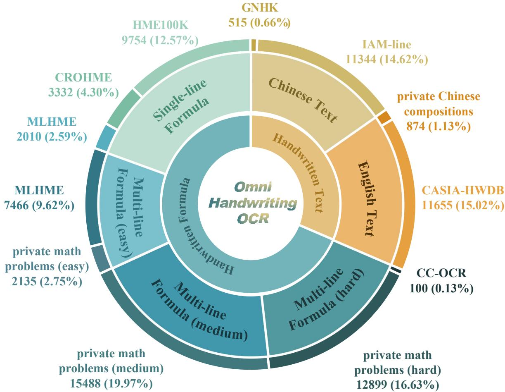
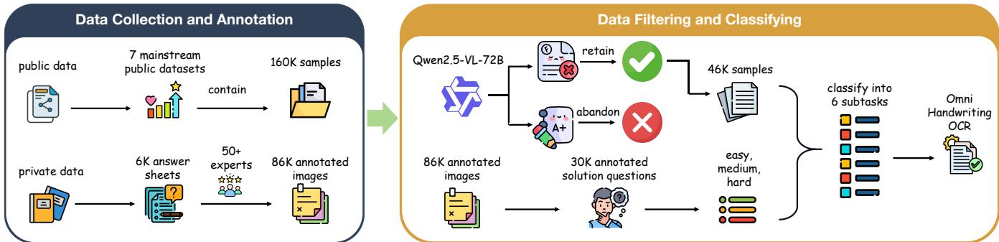
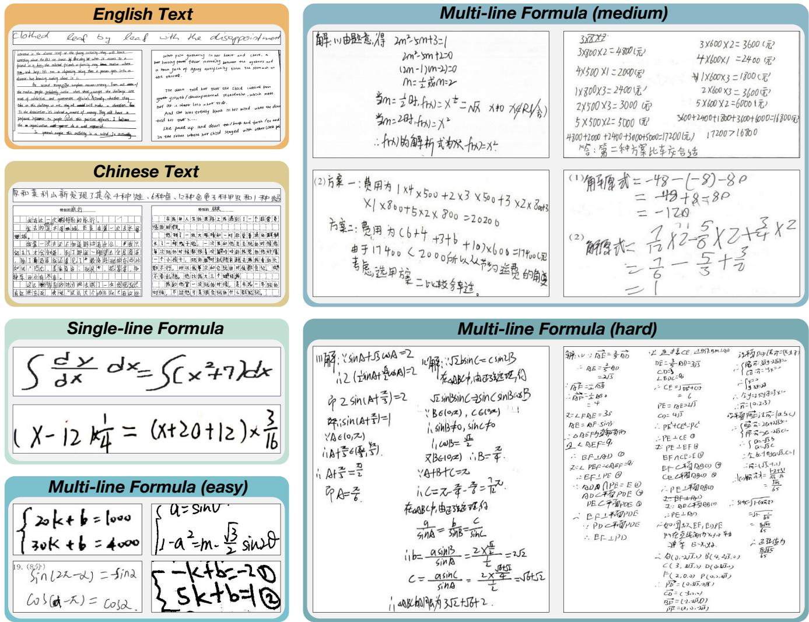
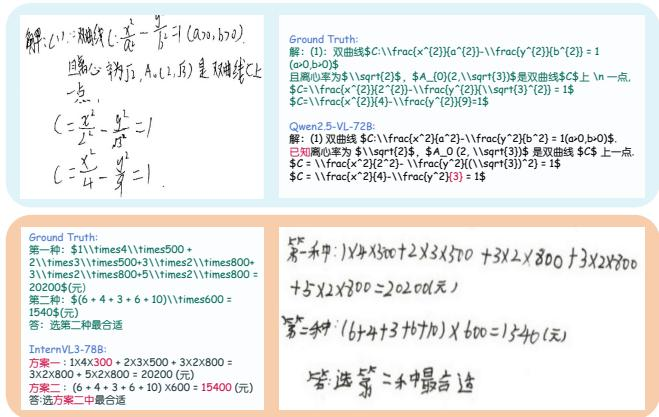
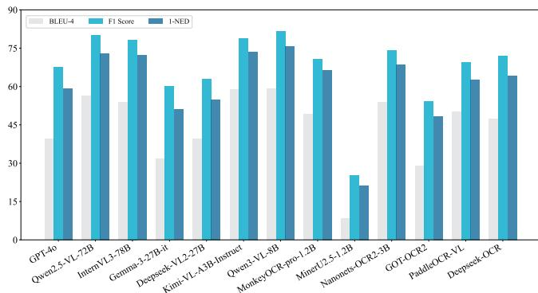
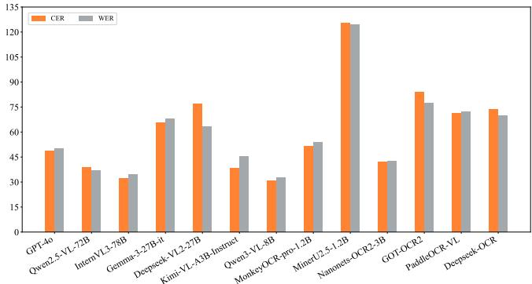

# OmniHandwritingOCR: A Diagnostic Benchmark for Evaluating Multimodal LLMs in Handwriten OCR Scenarios

Zinuo Guo   
51275901001@stu.ecnu.edu.cn   
East China Normal University Shanghai, China

Min Zhang∗ mzhang@cs.ecnu.edu.cn East China Normal University Shanghai, China

Bo Jiang bjiang@deit.ecnu.edu.cn East China Normal University Shanghai, China

Figure 1: Overview of OmniHandwritingOCR. The benchmark focuses on two core tasks, handwritten text recognition (HTR) and handwritten mathematical expression recognition (HMER), covers six subtasks and twelve subsets with 77.57K images.

∗Corresponding author & Project leader.

## Abstract

Multimodal large language models (MLLMs) are increasingly used as OCR systems in document and knowledge-processing pipelines, but their ability to faithfully read real handwriting remains underexplored. Existing OCR benchmarks focus largely on printed text or clean single-line inputs, leaving limited coverage of realistic handwritten OCR scenarios such as multilingual handwriting, writer errors, and structurally complex mathematical expressions. We introduce OmniHandwritingOCR, a diagnostic benchmark for evaluating MLLMs and OCR systems on handwritten OCR. It

Permission to make digital or hard copies of all or part of this work for personal or classroom use is granted without fee provided that copies are not made or distributed for profit or commercial advantage and that copies bear this notice and the full citation on the first page. Copyrights for components of this work owned by others than the author(s) must be honored. Abstracting with credit is permitted. To copy otherwise, or republish, to post on servers or to redistribute to lists, requires prior specific permission and/or a fee. Request permissions from permissions@acm.org.   
CIKM ’26, Rome, ITALY   
© 2026 Copyright held by the owner/author(s). Publication rights licensed to ACM. ACM ISBN 978-x-xxxx-xxxx-x/YYYY/MM   
https://doi.org/10.1145/nnnnnnn.nnnnnnn

covers handwritten text recognition and handwritten mathematical expression recognition across six subtasks and twelve subsets, totaling 77.57K labeled images from public datasets and newly collected student writings. A key component is a dificulty-stratified multi-line formula corpus designed to test robustness under increasing structural complexity. We evaluate thirteen open- and closed-source systems with five complementary metrics under a unified protocol. Results show that current systems remain far from faithful transcription: performance drops sharply on complex multi-line formulas, model rankings vary across language and formula settings, and several generative models hallucinate plausi ble but visually unsupported corrections. OmniHandwritingOCR provides a challenging testbed for diagnosing language, content, structural, and visual-grounding failure modes of multimodal models in handwritten OCR scenarios. The code is available at https: //github.com/ECNU-RAIL/OmniHandwritingOCR-CIKM2026.

## CCS Concepts

• General and reference → Evaluation.

## Keywords

handwritten OCR, benchmark, multimodal large language models, evaluation, formula recognition, hallucination

ACM Reference Format:

Zinuo Guo, Min Zhang, and Bo Jiang. 2026. OmniHandwritingOCR: A Diagnostic Benchmark for Evaluating Multimodal LLMs in Handwritten OCR Scenarios. In Proceedings of 35th International ACM Conference on Information and Knowledge Management (CIKM ’26). ACM, New York, NY, USA, 12 pages. https://doi.org/10.1145/nnnnnnn.nnnnnnn

## 1 Introduction

Optical character recognition (OCR) is a basic component of information acquisition and knowledge processing pipelines. In information and knowledge management settings, OCR outputs often become the input to indexing, search, retrieval-augmented generation, educational analytics, and document-level knowledge extraction systems. Modern systems are no longer limited to specialized OCR engines: multimodal large language models (MLLMs) [4, 23, 24, 27] are now used to read documents, extract knowledge from images, and convert visual content into structured text. While these models have achieved strong performance on printed documents, their reliability on handwriting remains unclear. Real handwritten content contains blurred strokes, corrections, irregular layouts, writerspecific styles, and incomplete or erroneous expressions. These properties are exactly where a generative model may stop recognizing visual evidence and start producing plausible but unsupported text.

Handwriting recognition is commonly studied through two related tasks: handwritten text recognition (HTR) [11, 15, 17], which transcribes natural-language handwriting, and handwritten mathematical expression recognition (HMER) [1, 2, 48], which converts two-dimensional formula structures into markup such as LAT X. Existing resources have advanced both directions, but they leave important evaluation gaps for current MLLM/OCR systems. Classical HTR datasets such as IAM [25] and RIMES [12] are largely monolin gual and often cleaner than real educational writing. HMER datasets such as CROHME [42] and MathWriting [10] have driven progress on mathematical transcription, but are dominated by single-line expressions. As a result, existing evaluations do not suficiently test multilingual handwriting, real student work, fact-preserving transcription, or complex multi-line formula structures.

This limitation is not only a dataset coverage issue; it is an evaluation issue. For LLM-based OCR systems, a useful benchmark should expose where models fail, how performance changes with structural complexity, and when outputs drift from visual evidence into plausible correction. Aggregate OCR scores can hide these failures, especially when a model appears fluent while omitting symbols, repairing student mistakes, or fabricating content that is not present in the image. Such errors directly afect downstream information and knowledge management applications, where faithful transcription is often more important than plausible reconstruction.

To address these needs, we introduce OmniHandwritingOCR, a diagnostic benchmark for evaluating handwritten OCR in MLLM/- OCR systems. It covers English text, Chinese text, single-line formulas, and multi-line formulas stratified into easy, medium, and hard subsets, totaling 77.57K image-label pairs from public and newly collected sources. Its diagnostic design supports analysis along four axes: language, content type, structural complexity, and visual grounding. This allows the benchmark to report not only which system ranks highest overall, but also where and why a model fails under multilingual, long-context, and structurally complex handwritten inputs.

Our contributions are as follows:

• We construct a large-scale handwritten OCR benchmark that integrates HTR and HMER, covering six subtasks and twelve subsets with 77.57K labeled images.

• We introduce a dificulty-stratified multi-line formula eval uation setting that targets complex real student work and enables analysis of model degradation as structural complexity increases.

• We define a unified evaluation setting with task-specific normalization and tokenization rules, enabling fair comparison across general-purpose MLLMs and specialized OCR models.

• We benchmark thirteen open- and closed-source systems and identify diagnostic failure modes, including languagespecific performance shifts, sensitivity to formula structure, and hallucinated corrections on ambiguous handwriting.

## 2 Related Work

We review prior work from the perspective of handwritten recognition and benchmark coverage, focusing on handwritten text recognition (HTR), handwritten mathematical expression recognition (HMER), and the gap between existing resources and realistic handwritten OCR scenarios for current MLLM/OCR systems.

## 2.1 Handwritten Text Recognition

Handwritten text recognition (HTR) has long been studied as a core document analysis problem. Earlier systems relied on statistical sequence modeling, including HMM-based recognizers [6], while modern systems commonly use CNN-RNN-CTC architectures [33], multidimensional recurrent models [11], attention-based recognizers [3], and Transformer-based models such as TrOCR [20]. These methods have substantially improved line-level and document-level transcription, and they remain important baselines for understanding how visual encoders and sequence decoders handle handwritten variation. However, real handwritten text still poses challenges beyond isolated character recognition, including inconsistent spacing, writer-specific abbreviations, touching strokes, insertions, deletions, and layout changes across lines.

  
Figure 2: Construction pipeline of OmniHandwritingOCR, including data collection, filtering, dificulty stratification, annota tion, and expert verification.

Progress in HTR has been driven by public benchmarks such as IAM [25], RIMES [12], READ-BAD [13], GNHK [19], CASIA-HWDB [22], and SCUT-HCCDoc [45]. These datasets cover important scenarios including English handwriting, French mail, histori cal documents, in-the-wild handwriting, and Chinese handwritten text. However, they are often organized around specific languages, sources, or document types, and many samples are cleaner than real educational handwriting. They also do not directly evaluate how general-purpose MLLMs behave when handwriting contains writer errors, corrections, irregular layouts, or mixed textual and mathematical content.

Recent OCR and document benchmarks for MLLMs, such as OmniDocBench [29], OCRBenchv2 [9], and CC-OCR [43], broaden evaluation to layout-rich, multilingual, and document-level tasks. Nevertheless, handwriting remains only one component within these broader resources. OmniHandwritingOCR follows the HTR tradition but extends it toward MLLM-era evaluation by combining English and Chinese handwriting with fact-based annotations and unified scoring, enabling direct diagnosis of faithful transcription under realistic handwritten conditions.

## 2.2 Handwritten Mathematical Expression Recognition

Handwritten mathematical expression recognition (HMER) is more structurally demanding than ordinary text recognition because a system must identify symbols and recover two-dimensional relations. Classical and neural approaches have explored grammarbased parsing [1], online trajectory modeling [2], sequence decoders [46], tree-structured decoders [47], graph modeling [32], and structure-aware Transformers such as TAMER [50]. These methods show that formula recognition requires explicit or implicit modeling of spatial relations, not only character-level transcription. In this setting, small recognition errors such as missing braces, misplaced superscripts, or incorrect fraction scopes can substantially change the recovered expression, making structural fidelity as important as symbol accuracy.

Benchmarks such as CROHME [42], HME100K [44], MathWriting [10], UniMER [37], and MLHME [34] are central to HMER research. They provide standardized evaluation data and have enabled progress on symbol recognition, LATEX sequence generation, and expression-level parsing. However, much of the existing evaluation is still dominated by single-line expressions or relatively controlled formula layouts. Even when multi-line formulas are included, they usually do not fully capture the long, noisy, and correction-heavy derivations found in real student answer sheets.

This gap is important for current MLLM/OCR systems. A model may recognize isolated symbols or short formulas while failing to preserve alignment, multi-step dependencies, cases, fractions, superscripts, or crossed-out content in longer handwritten derivations. OmniHandwritingOCR therefore integrates HTR and HMER in a single benchmark and places special emphasis on dificultystratified multi-line formulas. By combining public formula datasets with newly collected student answer sheets, it evaluates not only formula transcription accuracy, but also robustness to the structural complexity that appears in realistic handwritten mathematical work.

Compared with prior HTR or HMER resources, our focus is not to replace task-specific benchmarks, but to provide a unified stress test for systems that are increasingly deployed as general handwritten OCR engines. This is particularly relevant for MLLMs, whose outputs may be influenced by language priors, mathematical priors, and instruction-following behavior. Evaluating text and formula handwriting under the same protocol makes these crosstask efects visible and helps distinguish genuine visual recognition from plausible reconstruction.

## 3 OmniHandwritingOCR

To evaluate handwriting recognition capabilities beyond aggregate OCR scores, we design OmniHandwritingOCR around three requirements: broad task coverage, dificulty-aware diagnosis, and standardized scoring. The benchmark contains more than 77K samples, spans English text, Chinese text, and mathematical formulas, and systematically stratifies multi-line formula content by dificulty. This dual focus on breadth and depth enables fine-grained analysis of model generalization across languages, layouts, and structural complexity.

  
Figure 3: Representative examples from each subtask, showing the diversity of handwriting styles and the progressive dificulty of formula structures.

## 3.1 Design Principles

OmniHandwritingOCR is designed to support diagnostic evaluation rather than only leaderboard ranking. The first principle is task diversity. Real handwritten OCR applications rarely involve a single clean text line. They may contain English notes, Chinese compositions, mathematical expressions, long derivations, corrections, and mixed natural-language/formula content. We therefore combine HTR and HMER in one benchmark so that models can be compared under a shared protocol while still exposing task-specific strengths and weaknesses.

The second principle is dificulty-aware structure. For formula recognition, the central challenge is not only identifying symbols, but also preserving two-dimensional relations such as fractions, superscripts, cases, and aligned multi-step derivations. A benchmark dominated by single-line expressions can overestimate model readiness for real educational or scientific handwriting. OmniHand writingOCR therefore separates single-line formulas from multiline formulas and further stratifies multi-line samples by dificulty, enabling controlled analysis of how models degrade as visual and symbolic structure becomes more complex.

The third principle is faithful transcription. In many knowledgeprocessing pipelines, OCR output is treated as evidence for indexing, retrieval, or downstream reasoning. A model that corrects a student’s mistake or fills in a missing derivation may produce a plausible answer, but it is no longer faithfully transcribing the image. Our fact-based annotation policy and unified scoring protocol are designed to penalize such visually unsupported corrections. This makes the benchmark especially suited to evaluating generative OCR systems, where hallucinated correction can be hidden by fluent output.

  
Figure 4: Examples of fact-based annotations. Ground-truth labels preserve visible writer mistakes, while Qwen2.5-VL-72B and InternVL3-78B incorrectly produce corrected but visually unsupported transcriptions.

Table 1: Detailed composition of the dataset.
<table><tr><td>Subtask</td><td>Source</td><td>Samples</td><td>Total</td></tr><tr><td rowspan="2">English Text</td><td>GNHK</td><td>515</td><td rowspan="2">11,859</td></tr><tr><td>IAM-line</td><td>11,344</td></tr><tr><td rowspan="2">Chinese Text</td><td>private</td><td>874</td><td rowspan="2">12,529</td></tr><tr><td>CASIA-HWDB</td><td>11,655</td></tr><tr><td rowspan="2">Single-line Formula</td><td>CROHME</td><td>3,332</td><td rowspan="2">15,096</td></tr><tr><td>HME100K</td><td>9,754</td></tr><tr><td rowspan="2">Multi-line Formula (easy)</td><td>MLHME</td><td>2,010</td><td rowspan="2">9,601</td></tr><tr><td>MLHME private</td><td>7,466 2,135</td></tr><tr><td>Multi-line Formula (medium)</td><td>private</td><td>15,488</td><td>15,488</td></tr><tr><td>Multi-line</td><td>CC-OCR</td><td>100</td><td>12,999</td></tr><tr><td>Formula (hard)</td><td>private</td><td>12,899</td><td></td></tr><tr><td></td><td></td><td></td><td>77,572</td></tr><tr><td></td><td></td><td></td><td></td></tr><tr><td></td><td></td><td></td><td></td></tr><tr><td></td><td></td><td></td><td></td></tr><tr><td></td><td></td><td></td><td></td></tr><tr><td>Total</td><td></td><td></td><td></td></tr></table>

## 3.2 Benchmark Construction

In this section, we provide a detailed overview of our construction pipeline for OmniHandwritingOCR, as shown in Figure 2. The pipeline includes dataset collection to ensure breadth and novelty, data filtering and dificulty stratification to ensure evaluative rigor, and finally, expert annotation to ensure ground-truth accuracy.

3.2.1 Dataset Collection. Our data collection strategy employs a two-pronged approach. First, we aggregated key public datasets to establish a broad foundation. We then supplemented this with a substantial, newly collected private dataset to target specific and challenging domains.

Public Data Aggregation. To establish a comprehensive foundation, we gathered samples from influential public datasets, including IAM-line [25] and GNHK [19] for English text, CASIA-HWDB [22] for Chinese text, and CROHME [42], HME100K [44], MLHME38K [34], and CC-OCR [43] for mathematical formulas. This initial step provided a diverse pool of approximately 160K samples, covering a wide range of established tasks.

Private Data Collection. Our private data is collected specif ically to address the most critical gaps in existing resources. We sourced it from two key areas: (1) 874 authentic student Chinese language compositions, which fill a crucial void by providing complex, real-world multi-line samples, and (2) our primary contribution: a first-of-its-kind dataset derived from over 6,000 authentic student mathematics answer sheets. From these, we segmented and annotated 86K images. This unique corpus captures the natural, often chaotic, and structurally complex nature of handwritten problemsolving, a scenario largely absent from existing datasets that are dominated by clean, single-line expressions.

3.2.2 Data Filtering and Dificulty Stratification. A primary goal was to create a benchmark that actively challenges state-of-the-art models, rather than just measuring performance on solved problems. To this end, we implemented a rigorous, two-part filtering and stratification process.

First, for the public data, we performed a challenge-oriented filtering to increase dificulty. We leveraged a powerful visionlanguage model, Qwen2.5-VL-72B, to recognize the initial 160K samples. By calculating the normalized edit distance (NED) between the model’s prediction and the ground truth, we were able to systematically identify and discard samples that the model found easy. This deliberate selection of poorly performing samples allowed us to distill a final set of 46K high-quality, challenging samples that push the boundaries of current model capabilities.

Second, for the private math data, we first focused the dataset by filtering the 86K segmented images to retain only the core solution sections, resulting in 30K high-quality samples of multi-line and dificult formulas. Furthermore, to enable detailed model evaluation, we designed a quantitative dificulty scoring system. This system scores each sample with three factors: the length of the ground truth (weight 0.2, representing information volume), the number of complex LAT X commands (weight 0.3, representing structural complexity), and the recognition NED from GPT-4o (weight 0.5, representing perceptual dificulty for a strong vision-language model). We use this score only to stratify evaluation subsets, not as a training signal or as an additional metric. Because one component is model-informed, we validate the resulting split with model-agnostic structural statistics below. Based on this composite score, we classify the samples into easy, medium, and hard categories, forming the hierarchical structure that supports the diagnostic experiments in Section 4.

To reduce the risk that the dificulty split is merely tied to one model’s behavior, we also inspect model-agnostic label statistics. As shown in Table 2, the three private multi-line formula subsets exhibit monotonic increases in ground-truth length, LAT X command density, and number of non-empty lines. This validates that the split reflects observable structural complexity in addition to model recognition dificulty.

3.2.3 Expert Annotation and Verification. Precise and high-quality annotation is critical for a fair and research-worthy benchmark. Our annotation strategy was tailored to the data’s origin to ensure consistency and accuracy. For all public data, we retained their original, widely-used annotations to maintain consistency for comparison with existing research and also honor the significant community efort invested in creating these established ground truths.

Table 2: Model-agnostic statistics of private multi-line formula subsets. Len. denotes average ground-truth characters, Cmd. denotes average LATEX commands, and Lines denotes average non-empty text lines.
<table><tr><td>Subset</td><td>Len.</td><td>Cmd.</td><td>Lines</td></tr><tr><td>ml-easy</td><td>156.9</td><td>4.1</td><td>3.7</td></tr><tr><td>ml-medium</td><td>213.0</td><td>7.6</td><td>7.1</td></tr><tr><td>ml-hard</td><td>488.8</td><td>25.7</td><td>13.0</td></tr></table>

The annotation of our private data, however, demanded a substantial efort. We assembled a dedicated team of over 50 domain experts for an intensive two-month project. The final benchmark contains 31,396 private samples, including 874 Chinese composi tion samples and 30,522 private mathematical-expression samples. The private mathematical-expression data were derived from over 6,000 authentic student answer sheets, and each original answer sheet underwent two rounds of human checking before its seg mented samples were finalized. In the first round, a human expert verified and corrected the model-generated pre-annotations. The human-refined results then served as higher-quality baselines for a second round of expert review and refinement. Ambiguous cases were resolved by additional inspection rather than majority voting, because many errors involve fine visual details such as superscripts, omitted strokes, or crossed-out content. This iterative process was designed to systematically minimize errors and ensure the final ground truth achieved the highest possible level of accuracy.

A cornerstone of this process was our fact-based annotation principle: maintaining strict fidelity to the writer’s original handwriting. We intentionally retained common writer errors, such as misspellings or miscopied numbers, rather than correcting them. Furthermore, any content crossed out by the writer was omitted entirely. This philosophy is crucial because it forces models to learn robust visual pattern recognition instead of relying on contextual guessing or hallucinating corrections, as shown in Figure 4. By creating a ground truth that reflects what is visually present, our benchmark provides a more accurate tool for pinpointing specific model weaknesses and driving future improvements in genuine recognition capabilities.

Privacy and ethical handling. The private portion consists of educational handwriting samples. Before benchmark construction, personally identifying metadata was removed, and images were segmented to retain only task-relevant handwritten content. The released benchmark uses anonymized identifiers and excludes information that is not needed for recognition evaluation.

## 3.3 Dataset Statistics

OmniHandwritingOCR is a large-scale collection totaling 77,572 image-label pairs across 6 diferent subtasks. The detailed composition, as shown in Table 1, is balanced to cover a wide range of handwritten recognition tasks, from simple text lines to complex, multi-line mathematical expressions.

To elaborate, the English text (en-text) combines 515 images from GNHK and 11,344 from IAM-line. The Chinese text (zh-text) includes 11,655 images from CASIA-HWDB, significantly supplemented by our 874 privately collected multi-line Chinese compositions. A core contribution of our work lies in the mathematical formula portion. The benchmark includes 15,096 single-line (sl) formulas sourced from CROHME (3,332), HME100K (9,754), and MLHME (2,010). More critically, it features our large, unique corpus of multi-line (ml) formulas, which are stratified by our dificulty scoring system into 9,601 ml-easy, 15,488 ml-medium, and 12,999 ml-hard samples.

As shown in Table 3, OmniHandwritingOCR demonstrates clear advantages in both task comprehensiveness and structural complexity. It uniquely combines handwritten text with handwritten mathematical expressions, allowing it to more closely simulate real-world scenarios involving mixed content. Furthermore, our benchmark contains a substantial number ofhandwritten multi-line formula samples, 38,088 in total, which is significantly more than the other benchmarks compared. This provides a more challenging platform for evaluating a model’s ability to process complex spatial layouts.

## 4 Experiments

In this section, we evaluate state-of-the-art methods on OmniHandwritingOCR under a unified ofline protocol. The goal is not only to rank models, but also to diagnose how their behavior changes across language, handwriting type, and formula complexity.

## 4.1 Evaluation Protocol

Baselines. We evaluate 13 methods in total, including 7 generalpurpose MLLMs and 6 specialized OCR models. To reflect current practice, the benchmark includes both closed-source systems and newly released open-source models. The MLLMs are GPT-4o [28], Qwen2.5-VL-72B [5], InternVL3-78B [49], Gemma-3-27B-it [35], DeepSeek-VL2-27B [41], Kimi-VL-A3B-Instruct [36], and Qwen3- VL-8B [31]. The OCR models are MonkeyOCR-pro-1.2B [21], MinerU2.5- 1.2B [38], Nanonets-OCR2-3B [26], GOT-OCR2 [39], PaddleOCR-VL [8], and DeepSeek-OCR [40].

Task format. All models are evaluated in a zero-shot transcription setting. Each input consists of a single image and a task-neutral instruction equivalent to: “convert the text and formulas in the image into Markdown, and do not include any other content.” This prompt is intentionally short so that the evaluation measures visual transcription rather than task-specific reasoning or prompt engineering. No retrieval, task-specific demonstrations, or datasetspecific context is provided. Open-source models are served through OpenAI-compatible local inference services when possible, while closed-source models are evaluated through their oficial APIs. We use deterministic decoding settings when supported by the model interface.

Normalization and tokenization. We apply the same postprocessing to every model output, following the released evaluation script. Markdown code fences and explicit format wrappers such as plaintext, markdown, and latex are removed before scoring. To prevent runaway generations from dominating edit-distance metrics, single-line formula outputs are capped at 128 characters and other outputs are capped at 1024 characters before metric computation. For English text, line breaks are normalized to spaces and outputs are tokenized at the word level. For Chinese text, line breaks are removed and Jieba tokenization is used for token-level metrics. For public formula subsets, LATEX delimiters and non-semantic whitespace are normalized and tokens are extracted with a commandaware regular expression. For private mixed Chinese-formula subsets, we use a hybrid tokenizer that separates Chinese spans from LAT X-style commands, numbers, operators, and punctuation. No model-specific correction, manual cleanup, or outlier removal is applied during final scoring.

Table 3: Comparison of diferent handwriting-related benchmarks, where HTR denotes Handwritten Text Recognition, HMER denotes Handwritten Mathematical Expression Recognition, and MLF denotes Handwritten Multi-Line Formula.
<table><tr><td rowspan="2">Benchmark</td><td rowspan="2">Type</td><td rowspan="2">Tasks</td><td rowspan="2">Structure</td><td colspan="2">Num</td></tr><tr><td>All</td><td>MLF</td></tr><tr><td>RIMES-2011-line [12]</td><td>HTR</td><td>1</td><td>single-line only</td><td>12,104</td><td>一</td></tr><tr><td>READ-2016 [14]</td><td>HTR</td><td>1</td><td>multi-line only</td><td>30,000</td><td>=</td></tr><tr><td>SCUT-HCCDoc [45]</td><td>HTR</td><td>5</td><td>single-line &amp; multi-line</td><td>12,253</td><td>-</td></tr><tr><td>CROHME2023 [42]</td><td>HMER</td><td>1</td><td>single-line only</td><td>13,279</td><td>0</td></tr><tr><td>MLHME-38K [34]</td><td>HMER</td><td>2</td><td>single-line &amp; multi-line</td><td>38,000</td><td>9,931</td></tr><tr><td>Mathwriting [10]</td><td>HMER</td><td>1</td><td>single-line only</td><td>649,000</td><td>0</td></tr><tr><td>UniMER [37]</td><td>HMER</td><td>4</td><td>single-line &amp; multi-line</td><td>1,085,548</td><td>0</td></tr><tr><td>Ours</td><td>HTR+HMER</td><td>6</td><td>single-line &amp; multi-line</td><td>77,572</td><td>38,088</td></tr></table>

Table 4: Experiments (%) on the entire OmniHandwritingOCR. The highest is bold, and the second highest is underlined.
<table><tr><td>Methods</td><td>BLEU-4 ↑</td><td>F1 Score ↑</td><td>1-NED ↑</td><td>Overall ↑</td><td>CER↓</td><td>WER↓</td><td>Overall ↓</td></tr><tr><td colspan="8">Multimodal large language models (MLLMs)</td></tr><tr><td>GPT-40</td><td>39.53</td><td>67.66</td><td>59.32</td><td>55.50</td><td>48.53</td><td>50.03</td><td>49.28</td></tr><tr><td>Qwen2.5-VL-72B</td><td>56.40</td><td>79.98</td><td>72.91</td><td>69.76</td><td>38.88</td><td>36.91</td><td>37.90</td></tr><tr><td>InternVL3-78B</td><td>53.76</td><td>78.21</td><td>72.16</td><td>68.04</td><td>32.19</td><td>34.72</td><td>33.46</td></tr><tr><td>Gemma-3-27B-it</td><td>31.84</td><td>60.08</td><td>50.97</td><td>47.63</td><td>65.82</td><td>67.83</td><td>66.83</td></tr><tr><td>DeepSeek-VL2-27B</td><td>39.57</td><td>63.06</td><td>54.90</td><td>52.51</td><td>76.91</td><td>63.49</td><td>70.20</td></tr><tr><td>Kimi-VL-A3B-Instruct</td><td>58.75</td><td>78.90</td><td>73.58</td><td>70.41</td><td>38.20</td><td>45.28</td><td>41.74</td></tr><tr><td>Qwen3-VL-8B</td><td>59.24</td><td>81.60</td><td>75.63</td><td>72.16</td><td>30.94</td><td>32.94</td><td>31.94</td></tr><tr><td colspan="8">Optical character recognition (OCR) models</td></tr><tr><td>MonkeyOCR-pro-1.2B</td><td>49.37</td><td>70.60</td><td>66.52</td><td>62.16</td><td>51.54</td><td>54.11</td><td>52.83</td></tr><tr><td>MinerU2.5-1.2B</td><td>8.48</td><td>25.12</td><td>21.33</td><td>18.31</td><td>125.59</td><td>124.65</td><td>125.12</td></tr><tr><td>Nanonets-OCR2-3B</td><td>53.84</td><td>74.13</td><td>68.42</td><td>65.46</td><td>42.27</td><td>42.77</td><td>42.52</td></tr><tr><td>GOT-OCR2</td><td>29.03</td><td>54.19</td><td>48.32</td><td>43.85</td><td>84.19</td><td>77.65</td><td>80.92</td></tr><tr><td>PaddleOCR-VL</td><td>50.21</td><td>69.61</td><td>62.73</td><td>60.85</td><td>71.14</td><td>72.38</td><td>71.76</td></tr><tr><td>DeepSeek-OCR</td><td>47.51</td><td>71.96</td><td>64.27</td><td>61.25</td><td>73.84</td><td>69.94</td><td>71.89</td></tr></table>

Evaluation safeguards. The protocol is intentionally conservative. We use a single task-neutral instruction for all systems to avoid tuning prompts for particular model families or subsets. We also avoid semantic correction during scoring: an output that repairs a writer error, changes an incorrect formula into a correct one, or adds a missing reasoning step is penalized if the content is not visually supported by the image. The output-length caps do not change ordinary transcriptions, but they prevent pathological generations from overwhelming edit-distance metrics and making a small number of failures dominate aggregate scores. These safeguards make the evaluation closer to an ofline benchmark of visual transcription than to a test of problem-solving or answer reconstruction.

## 4.2 Metrics

We employ five complementary metrics and report all values as percentages. BLEU-4 [30] measures 4-gram overlap between the model output and the ground truth. Token-level F1 [7] balances precision and recall, rewarding outputs that include the correct tokens without excessive insertion. CER and WER [16] measure character-level and token-level edit rates, respectively, so lower values indicate fewer transcription errors. Finally, 1-NED [18] converts normalized Levenshtein distance into an accuracy-style score, with 1 indicating an exact match. We treat 1-NED as the primary metric because it is robust across text and formula settings while still penalizing substitutions, deletions, and hallucinated insertions. In tables with aggregate columns, Overall ↑ is the arithmetic mean of BLEU-4, F1, and 1-NED, while Overall ↓ is the arithmetic mean of CER and WER.

Table 5: Experiments (%) on the English (en-text) and Chinese text (zh-text). The highest is bold, and the second highest is underlined.
<table><tr><td rowspan="2">Methods</td><td colspan="2">BLEU-4 ↑</td><td colspan="2">F1 Score ↑</td><td colspan="2">1-NED ↑</td><td colspan="2">CER↓</td><td colspan="2">WER↓</td></tr><tr><td>en-text</td><td>zh-text</td><td>en-text</td><td>zh-text</td><td>en-text</td><td>zh-text</td><td>en-text</td><td>zh-text</td><td>en-text</td><td>zh-text</td></tr><tr><td colspan="10">Multimodal large language models (MLLMs)</td></tr><tr><td>GPT-40</td><td>54.03</td><td>33.51</td><td>77.44</td><td>58.48</td><td>81.29</td><td>60.66</td><td>20.05</td><td>43.90</td><td>31.93</td><td>51.84</td></tr><tr><td>Qwen2.5-VL-72B</td><td>58.57</td><td>71.51</td><td>81.84</td><td>88.39</td><td>84.63</td><td>90.71</td><td>16.01</td><td>10.42</td><td>28.21</td><td>15.16</td></tr><tr><td>InternVL3-78B</td><td>51.26</td><td>56.59</td><td>76.98</td><td>77.42</td><td>81.14</td><td>79.91</td><td>20.36</td><td>22.53</td><td>34.69</td><td>29.08</td></tr><tr><td>Gemma-3-27B-it</td><td>40.07</td><td>13.93</td><td>69.36</td><td>33.06</td><td>74.86</td><td>29.28</td><td>26.12</td><td>95.18</td><td>42.70</td><td>101.30</td></tr><tr><td>DeepSeek-VL2-27B</td><td>47.83</td><td>22.99</td><td>72.22</td><td>43.72</td><td>76.72</td><td>40.71</td><td>27.89</td><td>133.85</td><td>42.74</td><td>89.61</td></tr><tr><td>Kimi-VL-A3B-Instruct</td><td>43.65</td><td>57.53</td><td>70.77</td><td>76.73</td><td>70.77</td><td>76.15</td><td>37.96</td><td>40.34</td><td>63.22</td><td>60.03</td></tr><tr><td>Qwen3-VL-8B</td><td>58.37</td><td>72.24</td><td>81.78</td><td>88.72</td><td>84.76</td><td>90.85</td><td>16.44</td><td>11.89</td><td>28.43</td><td>17.94</td></tr><tr><td colspan="9">Optical character recognition (OCR) models</td></tr><tr><td></td><td>53.46</td><td>68.09</td><td>77.82</td><td>81.83</td><td>82.41</td><td>79.66</td><td>23.64</td><td>78.67</td><td></td><td></td></tr><tr><td>MonkeyOCR-pro-1.2B MinerU2.5-1.2B</td><td>11.62</td><td>14.46</td><td>25.13</td><td>26.65</td><td>32.23</td><td>25.87</td><td>93.43</td><td>150.71</td><td>41.78 134.46</td><td>69.15 112.94</td></tr><tr><td>Nanonets-OCR2-3B</td><td>59.76</td><td>78.17</td><td>81.45</td><td>89.60</td><td>84.96</td><td>88.25</td><td>19.41</td><td>22.73</td><td>36.79</td><td>23.62</td></tr><tr><td>GOT-OCR2</td><td>21.05</td><td>24.43</td><td>47.47</td><td>48.05</td><td>59.88</td><td>50.45</td><td>43.17</td><td>62.40</td><td>70.26</td><td>69.07</td></tr><tr><td>PaddleOCR-VL</td><td>46.65</td><td>81.39</td><td>68.98</td><td>91.65</td><td>73.66</td><td>89.05</td><td>47.48</td><td>32.5</td><td>72.05</td><td>39.64</td></tr><tr><td>DeepSeek-OCR</td><td>45.75</td><td>66.77</td><td>70.14</td><td>79.48</td><td>77.33</td><td>76.95</td><td>39.83</td><td>76.06</td><td>64.09</td><td>59.14</td></tr></table>

Table 6: Experiments (%) on single-line (sl) and easy multi-line (ml-easy). The highest is bold, and the second highest is underlined.
<table><tr><td rowspan="2">Methods</td><td colspan="2">BLEU-4 ↑</td><td colspan="2">F1 Score ↑</td><td colspan="2">1-NED ↑</td><td colspan="2">CER↓</td><td colspan="2">WER↓</td></tr><tr><td>sl</td><td>ml-easy</td><td>sl</td><td>ml-easy</td><td>sl</td><td>ml-easy</td><td>sl</td><td>ml-easy</td><td>sl</td><td>ml-easy</td></tr><tr><td colspan="9">Multimodal large language models (MLLMs)</td><td></td></tr><tr><td>GPT-40</td><td>24.51</td><td>61.08</td><td>62.26</td><td>81.68</td><td>51.98</td><td>71.17</td><td>79.24</td><td>29.37</td><td>74.50</td><td>26.35</td></tr><tr><td>Qwen2.5-VL-72B</td><td>40.09</td><td>64.24</td><td>72.98</td><td>82.84</td><td>63.13</td><td>71.73</td><td>67.07</td><td>35.53</td><td>57.53</td><td>30.13</td></tr><tr><td>InternVL3-78B</td><td>56.67</td><td>67.00</td><td>84.08</td><td>85.13</td><td>80.70</td><td>75.81</td><td>27.04</td><td>26.04</td><td>30.34</td><td>23.49</td></tr><tr><td>Gemma-3-27B-it</td><td>19.36</td><td>52.03</td><td>53.74</td><td>75.96</td><td>45.83</td><td>64.16</td><td>104.31</td><td>40.00</td><td>108.95</td><td>35.03</td></tr><tr><td>DeepSeek-VL2-27B</td><td>67.64</td><td>42.96</td><td>87.80</td><td>66.20</td><td>86.06</td><td>49.72</td><td>18.50</td><td>78.31</td><td>19.74</td><td>61.00</td></tr><tr><td>Kimi-VL-A3B-Instruct</td><td>78.40</td><td>84.98</td><td>93.33</td><td>91.99</td><td>93.60</td><td>88.82</td><td>10.91</td><td>21.93</td><td>14.20</td><td>21.07</td></tr><tr><td>Qwen3-VL-8B</td><td>52.77</td><td>70.63</td><td>79.88</td><td>86.92</td><td>74.20</td><td>79.57</td><td>40.27</td><td>24.95</td><td>38.74</td><td>23.53</td></tr><tr><td colspan="10">Optical character recognition (OCR) models</td></tr><tr><td>MonkeyOCR-pro-1.2B</td><td>69.09</td><td>56.58</td><td>88.90</td><td>71.18</td><td>87.56</td><td>74.66</td><td>16.06</td><td>30.39</td><td>16.94</td><td>45.17</td></tr><tr><td>MinerU2.5-1.2B</td><td>5.65</td><td>2.63</td><td>24.62</td><td>16.23</td><td>24.42</td><td>11.63</td><td>132.67</td><td>123.10</td><td>107.29</td><td>108.87</td></tr><tr><td>Nanonets-OCR2-3B</td><td>48.26</td><td>57.56</td><td>73.73</td><td>74.49</td><td>68.80</td><td>64.80</td><td>47.08</td><td>42.12</td><td>48.64</td><td>39.13</td></tr><tr><td>GOT-OCR2</td><td>56.25</td><td>28.51</td><td>78.51</td><td>56.46</td><td>74.40</td><td>39.95</td><td>57.25</td><td>83.02</td><td>52.41</td><td>70.45</td></tr><tr><td>PaddleOCR-VL</td><td>38.75</td><td>49.39</td><td>53.46</td><td>65.77</td><td>50.00</td><td>55.88</td><td>116.77</td><td>74.30</td><td>108.57</td><td>65.87</td></tr><tr><td>DeepSeek-OCR</td><td>36.97</td><td>58.88</td><td>66.01</td><td>79.65</td><td>55.54</td><td>68.59</td><td>154.81</td><td>38.13</td><td>118.08</td><td>35.50</td></tr></table>

## 4.3 Main results

Table 4 and Figure 5 summarize overall performance. Qwen3-VL-8B obtains the strongest aggregate score among all evaluated systems, with 59.24 BLEU-4, 81.60 F1, 75.63 1-NED, and the lowest average error rate among the MLLMs. However, the aggregate ranking also shows that handwritten OCR is far from solved: even the best model leaves a large gap to exact transcription, and several specialized OCR systems remain competitive on particular metrics. Among OCR models, Nanonets-OCR2-3B achieves the best overall OCR-model score and lower CER/WER than other specialized

Table 7: Experiments (%) on the medium multi-line formula (ml-medium) and hard multi-line formula (ml-hard).
<table><tr><td rowspan="2">Methods</td><td colspan="2">BLEU-4 ↑</td><td colspan="2">F1 Score ↑</td><td colspan="2">1-NED ↑</td><td colspan="2">CER↓</td><td colspan="2">WER↓</td></tr><tr><td>ml-medium</td><td>ml-hard</td><td>ml-medium ml-hard</td><td></td><td>ml-medium</td><td>ml-hard</td><td>ml-medium</td><td>ml-hard</td><td>ml-medium</td><td>ml-hard</td></tr><tr><td colspan="9">Multimodal large language models (MLLMs)</td><td></td></tr><tr><td>GPT-40</td><td>46.84</td><td>17.18</td><td>73.43</td><td>52.68</td><td>61.20</td><td>29.60</td><td>43.05</td><td>75.58</td><td>43.06</td><td>72.52</td></tr><tr><td>Qwen2.5-VL-72B</td><td>59.98</td><td>43.98</td><td>80.42</td><td>73.39</td><td>71.47</td><td>55.81</td><td>49.32</td><td>54.91</td><td>42.00</td><td>48.42</td></tr><tr><td>InternVL3-78B</td><td>57.53</td><td>33.52</td><td>79.35</td><td>66.32</td><td>69.81</td><td>45.59</td><td>36.39</td><td>60.80</td><td>34.83</td><td>55.89</td></tr><tr><td>Gemma-3-27B-it</td><td>43.61</td><td>22.03</td><td>70.32</td><td>58.05</td><td>57.32</td><td>34.38</td><td>56.11</td><td>73.21</td><td>49.95</td><td>69.05</td></tr><tr><td>DeepSeek-VL2-27B</td><td>37.95</td><td>18.07</td><td>62.45</td><td>45.99</td><td>48.25</td><td>27.94</td><td>109.04</td><td>93.87</td><td>81.91</td><td>85.92</td></tr><tr><td>Kimi-VL-A3B-Instruct</td><td>56.29</td><td>31.63</td><td>78.14</td><td>62.46</td><td>68.67</td><td>43.48</td><td>48.86</td><td>69.20</td><td>46.70</td><td>66.47</td></tr><tr><td>Qwen3-VL-8B</td><td>61.65</td><td>39.77</td><td>81.82</td><td>70.45</td><td>73.83</td><td>50.54</td><td>34.98</td><td>57.08</td><td>34.45</td><td>54.52</td></tr><tr><td colspan="9">Optical character recognition (OCR) models</td><td></td></tr><tr><td>MonkeyOCR-pro-1.2B</td><td>26.78</td><td>22.33</td><td>51.89</td><td>53.84</td><td>40.59</td><td>33.23</td><td>83.59</td><td>76.91</td><td>77.78</td><td>73.81</td></tr><tr><td>MinerU2.5-1.2B</td><td>9.98</td><td>6.53</td><td>29.28</td><td>28.83</td><td>17.82</td><td>16.23</td><td>122.57</td><td>131.06</td><td>163.02</td><td>120.28</td></tr><tr><td>Nanonets-OCR2-3B</td><td>48.53</td><td>30.88</td><td>72.68</td><td>62.80</td><td>62.04</td><td>41.67</td><td>54.71</td><td>67.51</td><td>46.44</td><td>62.44</td></tr><tr><td>GOT-OCR2</td><td>29.15</td><td>14.90</td><td>55.13</td><td>39.53</td><td>41.17</td><td>24.26</td><td>145.46</td><td>113.82</td><td>110.58</td><td>103.14</td></tr><tr><td>PaddleOCR-VL</td><td>49.68</td><td>35.01</td><td>69.71</td><td>62.51</td><td>58.22</td><td>41.78</td><td>94.16</td><td>83.51</td><td>72.58</td><td>76.52</td></tr><tr><td>DeepSeek-OCR</td><td>52.94</td><td>30.21</td><td>75.91</td><td>61.58</td><td>64.96</td><td>42.24</td><td>53.49</td><td>70.71</td><td>48.91</td><td>65.91</td></tr></table>

  
Figure 5: Overall benchmark performance (%) under BLEU-4, F1, 1-NED, CER, and WER.

OCR baselines, indicating that domain-specific OCR training still provides advantages for precise transcription.

A closer comparison across model groups shows that overall handwritten OCR performance is not determined by model size alone. Qwen3-VL-8B outperforms larger MLLMs such as Qwen2.5- VL-72B and InternVL3-78B in the aggregate table, while Kimi-VL-A3B-Instruct later becomes strongest on several formula subsets. The OCR baselines also show substantial variation: Nanonets-OCR2- 3B and MonkeyOCR-pro-1.2B remain competitive, whereas some document-oriented OCR models degrade sharply on handwritten formula content. These results suggest that training data, visual resolution handling, and formula-aware generation matter as much as general multimodal capacity for handwritten OCR.

The per-language results in Table 5 show that model behavior is strongly language dependent. The Qwen series is consistently strong on Chinese handwriting, with Qwen2.5-VL-72B reaching 10.42 CER and 15.16 WER on zh-text. In contrast, Nanonets-OCR2- 3B leads most English-text metrics among OCR models, while PaddleOCR-VL achieves the highest F1 and 1-NED on Chinese text within the OCR group. These results indicate that a single overall handwritten OCR score can obscure language-specific strengths and weaknesses.

Formula recognition further changes the ranking, as shown in Tables 6 and 7. Kimi-VL-A3B-Instruct is the strongest model on single-line and easy multi-line formulas, reaching 93.33 F1 and 10.91 CER on single-line formulas. As the multi-line formula subset becomes harder, the leading model changes: Qwen3-VL-8B leads on ml-medium, while Qwen2.5-VL-72B is more robust on ml-hard. This rank instability confirms that OmniHandwritingOCR evaluates more than generic OCR ability; it exposes task-specific robustness under changing layout and structural complexity.

## 4.4 Analysis and Findings

Structural complexity is the dominant stressor. All model families degrade as the benchmark moves from easy to hard multiline formulas. For example, Qwen3-VL-8B drops from 86.92 F1 on ml-easy to 70.45 F1 on ml-hard, while its CER worsens from 24.95 to 57.08. This trend is consistent with the model-agnostic statistics in Table 2: average label length increases from 156.9 to 488.8 characters, average LAT X command count increases from 4.1 to 25.7, and average non-empty lines increase from 3.7 to 13.0. The degradation therefore cannot be explained only by harder handwriting styles. Hard samples require models to maintain long symbolic dependencies and preserve two-dimensional relationships such as fractions, superscripts, cases, and aligned derivations. The results suggest that current MLLM/OCR systems still struggle to convert complex handwritten spatial structures into faithful linear markup.

Model rankings are task-conditioned. The strongest overall model is not uniformly strongest across all handwritten OCR scenarios. Qwen3-VL-8B leads the aggregate score, but Qwen2.5- VL-72B achieves the best Chinese-text CER/WER, Kimi-VL-A3B-Instruct dominates single-line and easy multi-line formulas, and Nanonets-OCR2-3B is highly competitive on English handwriting and OCR-model aggregates. This rank instability is important for evaluation: a single leaderboard score can hide whether a model is robust to language changes, formula structure, or long multi-line derivations. OmniHandwritingOCR is therefore designed to report both aggregate and task-conditioned performance.

General-purpose and specialized models fail diferently. General-purpose MLLMs tend to be stronger on broad cross-task aggregation, while specialized OCR models show sharper strengths on particular data regimes. Specialized OCR systems often produce more compact transcriptions, but may fail on mixed natural language and formula content or on long reasoning-style derivations. Conversely, MLLMs can leverage language priors and broad visual understanding, but those same priors can introduce unsupported corrections when the image is ambiguous. This contrast suggests that handwritten OCR evaluation should measure not only recognition accuracy, but also whether the output remains visually grounded.

Generative recognition introduces hallucinated correction. The fact-based labels allow us to observe a failure mode that is difficult to measure in ordinary OCR datasets: models may correct, complete, or fabricate content rather than transcribe what is visually present. We observe four recurring error patterns: correcting writer mistakes, inserting plausible intermediate steps, dropping visually present but hard-to-read symbols, and drifting into Markdown or explanatory formatting. This behavior is reflected quantitatively by error rates above 100 in some settings, such as DeepSeek-VL2-27B’s 133.85 CER on Chinese handwriting and DeepSeek-OCR’s 154.81 CER on single-line formulas. Such values mean that insertions dom inate the edit distance, which is consistent with over-generation or hallucinated transcription. Figure 4 further illustrates cases where models correct students’ original mistakes, producing semantically plausible outputs that are wrong under a faithful-recognition criterion.

Implications for knowledge processing. These findings are important beyond OCR accuracy itself. In retrieval, indexing, educational analytics, and document understanding systems, recognized text is often stored and reused as if it were a faithful representation of the source image. Deletions can remove searchable evidence, substitutions can corrupt formulas or named entities, and hallucinated corrections can introduce facts that were never written. The benchmark therefore highlights a practical requirement for handwritten OCR in knowledge pipelines: systems should preserve visual evidence even when the image contains mistakes or incomplete reasoning. This also explains why aggregate scores are insuficient. A model that performs well on clean text may still be unreliable for long mathematical derivations or mixed handwriting, where downstream systems need traceable transcription rather than fluent reconstruction.

## 5 Data Release, Ethics, and Limitations

Data release and reproducibility. OmniHandwritingOCR is designed as an ofline benchmark with deterministic scoring once model outputs are generated. We will publicly release the benchmark images, labels, and split manifests, with anonymized identifiers for newly collected educational data. We will also release the evaluation scripts that implement the normalization, tokenization, output-length caps, and metric computation described above. Public-source subsets follow their original dataset licenses, and all released private samples are anonymized to remove personally identifying information.

Ethics. The private handwriting samples come from educational scenarios and are used only for recognition evaluation. Personally identifying metadata is removed, and the benchmark does not require demographic labels. Our fact-based annotation policy intentionally preserves visible writer errors; this design is important for evaluating faithful transcription, but it should not be interpreted as judging the writer’s ability or correctness.

Limitations. The benchmark focuses on ofline image-based handwriting and does not include online pen trajectories. Its formula scoring is based on LATEX-style textual comparison, which can penalize semantically equivalent expressions written in diferent markup forms. The dificulty score includes a model-performance component, so it should be viewed as an evaluation stratification tool rather than an intrinsic human dificulty measure; the modelagnostic statistics in Table 2 are included to show that the splits also reflect observable structural complexity. In addition, some public subsets may have appeared in the pretraining data of large multimodal models, which is a common concern for public benchmark evaluation. The newly collected private educational samples therefore provide a less exposed stress test for current systems. Future extensions can add human-only dificulty annotations and structure-aware formula equivalence metrics.

## 6 Conclusion

We introduced OmniHandwritingOCR, a diagnostic benchmark and unified evaluation protocol for handwritten OCR in MLLM/OCR systems. By integrating multilingual handwritten text with singleline and dificulty-stratified multi-line formulas, the benchmark tests capabilities that are underrepresented in existing OCR evaluations. Our evaluation of thirteen systems shows that aggregate performance remains limited, model rankings vary across language and formula settings, and structural complexity causes substantial degradation even for the strongest models. The fact-based annotation policy further exposes hallucinated correction, a failure mode that is especially important for generative OCR systems. These findings suggest that robust handwritten OCR for knowledge extraction requires evaluation protocols that are task-conditioned, structure-aware, and grounded in faithful transcription rather than plausible correction.

## GenAI Usage Disclosure

Generative AI tools were used in this research in two roles. First, vision-language models were used for pre-annotation as described in Section 3. Second, GenAI-based coding assistants were used to assist with code development for conducting the experiments.

## References

[1] Robert H. Anderson. 1967. Syntax-directed recognition of hand-printed twodimensional mathematics. In Symposium on Interactive Systems for Experimental Applied Mathematics: Proceedings of the Association for Computing Machinery Inc. Symposium (Washington, D.C.). Association for Computing Machinery, New York, NY, USA, 436–459. doi:10.1145/2402536.2402585

[2] Ahmad-Montaser Awal, Harold Mouchre, and Christian Viard-Gaudin. 2014. A global learning approach for an online handwritten mathematical expression recognition system. Pattern Recogn. Lett. 35, C (Jan. 2014), 68–77.

[3] Dzmitry Bahdanau, Kyunghyun Cho, and Yoshua Bengio. 2016. Neural Machine Translation by Jointly Learning to Align and Translate. doi:10.48550/arXiv.1409. 0473 arXiv:1409.0473 [cs].

[4] Jinze Bai, Shuai Bai, Shusheng Yang, Shijie Wang, Sinan Tan, Peng Wang, Junyang Lin, Chang Zhou, andJingren Zhou. 2023. Qwen-VL: A Versatile Vision-Language Model for Understanding, Localization, Text Reading, and Beyond. doi:10.48550/ arXiv.2308.12966 arXiv:2308.12966 [cs].

[5] Shuai Bai, Keqin Chen, Xuejing Liu, Jialin Wang, Wenbin Ge, Sibo Song, Kai Dang, Peng Wang, Shijie Wang, Jun Tang, Humen Zhong, Yuanzhi Zhu, Mingkun Yang, Zhaohai Li, Jianqiang Wan, Pengfei Wang, Wei Ding, Zheren Fu, Yiheng Xu, Jiabo Ye, Xi Zhang, Tianbao Xie, Zesen Cheng, Hang Zhang, Zhibo Yang, Haiyang Xu, and Junyang Lin. 2025. Qwen2.5-VL Technical Report. arXiv:2502.13923 [cs.CV] https://arxiv.org/abs/2502.13923

[6] Leonard E Baum and Ted Petrie. 1966. Statistical inference for probabilistic functions of finite state Markov chains. The annals ofmathematical statistics 37, 6 (1966), 1554–1563.

[7] Nancy Chinchor. 1992. MUC-4 evaluation metrics. In Proceedings of the 4th Conference on Message Understanding (McLean, Virginia) (MUC4 ’92). Association for Computational Linguistics, USA, 22–29. doi:10.3115/1072064.1072067

[8] Cheng Cui, Ting Sun, Suyin Liang, Tingquan Gao, Zelun Zhang, Jiaxuan Liu, Xueqing Wang, Changda Zhou, Hongen Liu, Manhui Lin, Yue Zhang, Yubo Zhang, Handong Zheng, Jing Zhang, Jun Zhang, Yi Liu, Dianhai Yu, and Yanjun Ma. 2025. PaddleOCR-VL: Boosting Multilingual Document Parsing via a 0.9B Ultra-Compact Vision-Language Model. doi:10.48550/arXiv.2510.14528 arXiv:2510.14528 [cs].

[9] Ling Fu, Zhebin Kuang, Jiajun Song, Mingxin Huang, Biao Yang, Yuzhe Li, Linghao Zhu, Qidi Luo, Xinyu Wang, Hao Lu, Zhang Li, Guozhi Tang, Bin Shan, Chunhu Lin, Qi Liu, Binghong Wu, Hao Feng, Hao Liu, Can Huang, Jingqun Tang, Wei Chen, Lianwen Jin, Yuliang Liu, and Xiang Bai. 2025. OCRBench v2: An Improved Benchmark for Evaluating Large Multimodal Models on Visual Text Localization and Reasoning. doi:10.48550/arXiv.2501.00321 arXiv:2501.00321 [cs].

[10] Philippe Gervais, Anastasiia Fadeeva, and Andrii Maksai. 2025. MathWriting: A Dataset For Handwritten Mathematical Expression Recognition. doi:10.48550/ arXiv.2404.10690 arXiv:2404.10690 [cs].

[11] Alex Graves and Jürgen Schmidhuber. 2008. Ofline handwriting recognition with multidimensional recurrent neural networks. In Proceedings ofthe 22nd International Conference on Neural Information Processing Systems (Vancouver, British Columbia, Canada) (NIPS’08). Curran Associates Inc., Red Hook, NY, USA, 545–552.

[12] Emmanuèle Grosicki, Matthieu Carré, Jean-Marie Brodin, and Edouard Geofrois. 2009. Results of the RIMES Evaluation Campaign for Handwritten Mail Process ing. In 2009 10th International Conference on Document Analysis and Recognition. 941–945. doi:10.1109/ICDAR.2009.224 ISSN: 2379-2140.

[13] Tobias Grüning, Roger Labahn, Markus Diem, Florian Kleber, and Stefan Fiel. 2017. READ-BAD: A New Dataset and Evaluation Scheme for Baseline Detection in Archival Documents. arXiv:1705.03311 [cs.CV] https://arxiv.org/abs/1705.03311

[14] Tobias Grüning, Roger Labahn, Markus Diem, Florian Kleber, and Stefan Fiel. 2017. READ-BAD: A New Dataset and Evaluation Scheme for Baseline Detection in Archival Documents. arXiv:1705.03311 [cs.CV] https://arxiv.org/abs/1705.03311

[15] Sepp Hochreiter and Jürgen Schmidhuber. 1997. Long Short-Term Memory. Neural Computation 9, 8 (1997), 1735–1780. doi:10.1162/neco.1997.9.8.1735

[16] M. J. Hunt. 1990. The Word Error Rate: A Measure of Performance for Automatic Speech Recognition. In Proceedings of the DARPA Workshop on Speech and Natural Language. Morgan Kaufmann, Hidden Valley, Pennsylvania, USA, 20–25. https: //aclanthology.org/H90-1001/

[17] RP Ram Kumar, A Chandra Prasad, K Vishnuvardhan, K Bhuvanesh, and Sanjeev Dhama. 2023. Automated Handwritten Text Recognition. In E3S Web of Conferences, Vol. 430. EDP Sciences, 01022.

[18] VI Lcvenshtcin. 1966. Binary coors capable or ‘correcting deletions, insertions, and reversals. In Soviet physics-doklady, Vol. 10.

[19] Alex W. C. Lee, Jonathan Chung, and Marco Lee. 2021. GNHK: A Dataset for English Handwriting in the Wild. In Document Analysis and Recognition – ICDAR 2021: 16th International Conference, Lausanne, Switzerland, September 5–10, 2021, Proceedings, Part IV (Lausanne, Switzerland). Springer-Verlag, Berlin, Heidelberg, 399–412. doi:10.1007/978-3-030-86337-1\_27

[20] Minghao Li, Tengchao Lv, Jingye Chen, Lei Cui, Yijuan Lu, Dinei Florencio, Cha Zhang, Zhoujun Li, and Furu Wei. 2022. TrOCR: Transformer-based Optical Character Recognition with Pre-trained Models. doi:10.48550/arXiv.2109.10282

arXiv:2109.10282 [cs].

[21] Zhang Li, Yuliang Liu, Qiang Liu, Zhiyin Ma, Ziyang Zhang, Shuo Zhang, Zidun Guo, Jiarui Zhang, Xinyu Wang, and Xiang Bai. 2025. MonkeyOCR: Document Parsing with a Structure-Recognition-Relation Triplet Paradigm. doi:10.48550/ arXiv.2506.05218 arXiv:2506.05218 [cs].

[22] Cheng-Lin Liu, Fei Yin, Da-Han Wang, and Qiu-Feng Wang. 2011. CASIA Online and Ofline Chinese Handwriting Databases. In 2011 International Conference on Document Analysis and Recognition. IEEE, Beijing, China, 37–41. doi:10.1109/ ICDAR.2011.17

[23] Haotian Liu, Chunyuan Li, Qingyang Wu, and Yong Jae Lee. 2023. Visual Instruction Tuning. arXiv:2304.08485 [cs.CV] https://arxiv.org/abs/2304.08485

[24] Haoyu Lu, Wen Liu, Bo Zhang, Bingxuan Wang, Kai Dong, Bo Liu, Jingxiang Sun, Tongzheng Ren, Zhuoshu Li, Hao Yang, Yaofeng Sun, Chengqi Deng, Hanwei Xu, Zhenda Xie, and Chong Ruan. 2024. DeepSeek-VL: Towards Real-World Vision-Language Understanding. arXiv:2403.05525 [cs.AI] https://arxiv.org/abs/ 2403.05525

[25] U.-V. Marti and H. Bunke. 2002. The IAM-database: an English sentence database for ofline handwriting recognition. International Journal on Document Analysis and Recognition 5, 1 (Nov. 2002), 39–46. doi:10.1007/s100320200071

[26] Nanonets Research Team. 2025. Nanonets-OCR2: A model for transforming documents into structured markdown with intelligent content recognition and semantic tagging. Technical Report. Nanonets. https://nanonets.com/research/nanonetsocr-2/

[27] OpenAI. 2023. GPT-4V(ision) System Card. Technical Report. OpenAI. https: //cdn.openai.com/papers/GPTV\_System\_Card.pdf

[28] OpenAI. 2024. GPT-4o System Card. Technical Report. OpenAI. https://cdn. openai.com/gpt-4o-system-card.pdf

[29] Linke Ouyang, Yuan Qu, Hongbin Zhou, Jiawei Zhu, Rui Zhang, Qunshu Lin, Bin Wang, Zhiyuan Zhao, Man Jiang, Xiaomeng Zhao, Jin Shi, Fan Wu, Pei Chu, Minghao Liu, Zhenxiang Li, Chao Xu, Bo Zhang, Botian Shi, Zhongying Tu, and Conghui He. 2025. OmniDocBench: Benchmarking Diverse PDF Docu ment Parsing with Comprehensive Annotations. doi:10.48550/arXiv.2412.07626 arXiv:2412.07626 [cs].

[30] Kishore Papineni, Salim Roukos, Todd Ward, and Wei-Jing Zhu. 2001. BLEU: a method for automatic evaluation of machine translation. In Proceedings of the 40th Annual Meeting on Association for Computational Linguistics - ACL ’02. Association for Computational Linguistics, Philadelphia, Pennsylvania, 311. doi:10.3115/1073083.1073135

[31] QwenTeam. 2025. Qwen3-VL: Sharper Vision, Deeper Thought, Broader Action. Web page. https://qwen.ai/blog?id= 99f0335c4ad9f6153e517418d48535ab6d8afef&from=research.latestadvancements-list

[32] Franco Scarselli, Marco Gori, Ah Chung Tsoi, Markus Hagenbuchner, and Gabriele Monfardini. 2009. The Graph Neural Network Model. IEEE Transactions on Neural Networks 20, 1 (2009), 61–80. doi:10.1109/TNN.2008.2005605

[33] Baoguang Shi, Xiang Bai, and Cong Yao. 2015. An End-to-End Trainable Neural Network for Image-based Sequence Recognition and Its Application to Scene Text Recognition. doi:10.48550/arXiv.1507.05717 arXiv:1507.05717 [cs].

[34] TAL Education Group. 2023. ICDAR 2023 Competition on Recognition of Multi line Handwritten Mathematical Expressions. Web page. https://ai.100tal.com/ icdar Accessed on 2025-11-12.

[35] Gemma Team, Aishwarya Kamath, Johan Ferret, Shreya Pathak, Nino Vieillard, Ramona Merhej, Sarah Perrin, Tatiana Matejovicova, Alexandre Ramé, Morgane Rivière, Louis Rouillard, Thomas Mesnard, Geofrey Cideron, Jeanbastien Grill, Sabela Ramos, Edouard Yvinec, Michelle Casbon, Etienne Pot, Ivo Penchev, Gaël Liu, Francesco Visin, Kathleen Kenealy, Lucas Beyer, Xiaohai Zhai, Anton Tsitsulin, Robert Busa-Fekete, Alex Feng, Noveen Sachdeva, Benjamin Coleman, Yi Gao, Basil Mustafa, Iain Barr, Emilio Parisotto, David Tian, Matan Eyal, Colin Cherry, Jan-Thorsten Peter, Danila Sinopalnikov, Surya Bhupatiraju, Rishabh Agarwal, Mehran Kazemi, Dan Malkin, Ravin Kumar, David Vilar, Idan Brusilovsky, Jiaming Luo, Andreas Steiner, Abe Friesen, Abhanshu Sharma, Ab heesht Sharma, Adi Mayrav Gilady, Adrian Goedeckemeyer, Alaa Saade, Alex Feng, Alexander Kolesnikov, Alexei Bendebury, Alvin Abdagic, Amit Vadi, András György, André Susano Pinto, Anil Das, Ankur Bapna, Antoine Miech, Antoine Yang, Antonia Paterson, Ashish Shenoy, Ayan Chakrabarti, Bilal Piot, Bo Wu, Bobak Shahriari, Bryce Petrini, Charlie Chen, Charline Le Lan, Christopher A. Choquette-Choo, C. J. Carey, Cormac Brick, Daniel Deutsch, Danielle Eisenbud, Dee Cattle, Derek Cheng, Dimitris Paparas, Divyashree Shivakumar Sreepathi halli, Doug Reid, Dustin Tran, Dustin Zelle, Eric Noland, Erwin Huizenga, Eugene Kharitonov, Frederick Liu, Gagik Amirkhanyan, Glenn Cameron, Hadi Hashemi, Hanna Klimczak-Plucińska, Harman Singh, Harsh Mehta, Harshal Tushar Lehri, Hussein Hazimeh, Ian Ballantyne, Idan Szpektor, Ivan Nardini, Jean Pouget Abadie, Jetha Chan, Joe Stanton, John Wieting, Jonathan Lai, Jordi Orbay, Joseph Fernandez, Josh Newlan, Ju-yeong Ji, Jyotinder Singh, Kat Black, Kathy Yu, Kevin Hui, Kiran Vodrahalli, Klaus Gref, Linhai Qiu, Marcella Valentine, Marina Coelho, Marvin Ritter, Matt Hofman, Matthew Watson, Mayank Chaturvedi, Michael Moynihan, Min Ma, Nabila Babar, Natasha Noy, Nathan Byrd, Nick Roy, Nikola Momchev, Nilay Chauhan, Noveen Sachdeva, Oskar Bunyan, Pankil Botarda,

Paul Caron, Paul Kishan Rubenstein, Phil Culliton, Philipp Schmid, Pier Giuseppe Sessa, Pingmei Xu, Piotr Stanczyk, Pouya Tafti, Rakesh Shivanna, Renjie Wu, Renke Pan, Reza Rokni, Rob Willoughby, Rohith Vallu, Ryan Mullins, Sammy Jerome, Sara Smoot, Sertan Girgin, Shariq Iqbal, Shashir Reddy, Shruti Sheth, Siim Põder, Sijal Bhatnagar, Sindhu Raghuram Panyam, Sivan Eiger, Susan Zhang, Tianqi Liu, Trevor Yacovone, Tyler Liechty, Uday Kalra, Utku Evci, Vedant Misra, Vincent Roseberry, Vlad Feinberg, Vlad Kolesnikov, Woohyun Han, Woosuk Kwon, Xi Chen, Yinlam Chow, Yuvein Zhu, Zichuan Wei, Zoltan Egyed, Victor Cotruta, Minh Giang, Phoebe Kirk, Anand Rao, Kat Black, Nabila Babar, Jes sica Lo, Erica Moreira, Luiz Gustavo Martins, Omar Sanseviero, Lucas Gonzalez, Zach Gleicher, Tris Warkentin, Vahab Mirrokni, Evan Senter, Eli Collins, Joelle Barral, Zoubin Ghahramani, Raia Hadsell, Yossi Matias, D. Sculley, Slav Petrov, Noah Fiedel, Noam Shazeer, Oriol Vinyals, Jef Dean, Demis Hassabis, Koray Kavukcuoglu, Clement Farabet, Elena Buchatskaya, Jean-Baptiste Alayrac, Rohan Anil, Dmitry, Lepikhin, Sebastian Borgeaud, Olivier Bachem, Armand Joulin, Alek Andreev, Cassidy Hardin, Robert Dadashi, and Léonard Hussenot. 2025. Gemma 3 Technical Report. doi:10.48550/arXiv.2503.19786 arXiv:2503.19786 [cs].

[36] Kimi Team, Angang Du, Bohong Yin, Bowei Xing, Bowen Qu, Bowen Wang, Cheng Chen, Chenlin Zhang, Chenzhuang Du, Chu Wei, Congcong Wang, Dehao Zhang, Dikang Du, Dongliang Wang, Enming Yuan, Enzhe Lu, Fang Li, Flood Sung, Guangda Wei, Guokun Lai, Han Zhu, Hao Ding, Hao Hu, Hao Yang, Hao Zhang, Haoning Wu, Haotian Yao, Haoyu Lu, Heng Wang, Hongcheng Gao, Huabin Zheng, Jiaming Li, Jianlin Su, Jianzhou Wang, Jiaqi Deng, Jiezhong Qiu, Jin Xie,Jinhong Wang,Jingyuan Liu,Junjie Yan, Kun Ouyang, Liang Chen, Lin Sui, Longhui Yu, Mengfan Dong, Mengnan Dong, Nuo Xu, Pengyu Cheng, Qizheng Gu, Runjie Zhou, Shaowei Liu, Sihan Cao, Tao Yu, Tianhui Song, Tongtong Bai, Wei Song, Weiran He, Weixiao Huang, Weixin Xu, Xiaokun Yuan, Xingcheng Yao, Xingzhe Wu, Xinxing Zu, Xinyu Zhou, Xinyuan Wang, Y. Charles, Yan Zhong, Yang Li, Yangyang Hu, Yanru Chen, Yejie Wang, Yibo Liu, Yibo Miao, Yidao Qin, Yimin Chen, Yiping Bao, Yiqin Wang, Yongsheng Kang, Yuanxin Liu, Yulun Du, Yuxin Wu, Yuzhi Wang, Yuzi Yan, Zaida Zhou, Zhaowei Li, Zhejun Jiang, Zheng Zhang, Zhilin Yang, Zhiqi Huang, Zihao Huang, Zijia Zhao, and Ziwei Chen. 2025. Kimi-VL Technical Report. doi:10.48550/arXiv.2504.07491 arXiv:2504.07491 [cs] version: 1.

[37] Bin Wang, Zhuangcheng Gu, Guang Liang, Chao Xu, Bo Zhang, Botian Shi, and Conghui He. 2024. UniMERNet: A Universal Network for Real-World Mathemati cal Expression Recognition. arXiv:2404.15254 [cs.CV] https://arxiv.org/abs/2404. 15254

[38] Bin Wang, Chao Xu, Xiaomeng Zhao, Linke Ouyang, Fan Wu, Zhiyuan Zhao, Rui Xu, Kaiwen Liu, Yuan Qu, Fukai Shang, Bo Zhang, Liqun Wei, Zhihao Sui, Wei Li, Botian Shi, Yu Qiao, Dahua Lin, and Conghui He. 2024. MinerU: An Open-Source Solution for Precise Document Content Extraction. doi:10.48550/arXiv.2409.18839 arXiv:2409.18839 [cs].

[39] Haoran Wei, Chenglong Liu, Jinyue Chen, Jia Wang, Lingyu Kong, Yanming Xu, Zheng Ge, Liang Zhao, Jianjian Sun, Yuang Peng, Chunrui Han, and Xiangyu Zhang. 2024. General OCR Theory: Towards OCR-2.0 via a Unified End-to-end Model. doi:10.48550/arXiv.2409.01704 arXiv:2409.01704 [cs].

[40] Haoran Wei, Yaofeng Sun, and Yukun Li. 2025. DeepSeek-OCR: Contexts Optical Compression. doi:10.48550/arXiv.2510.18234 arXiv:2510.18234 [cs].

[41] Zhiyu Wu, Xiaokang Chen, Zizheng Pan, Xingchao Liu, Wen Liu, Damai Dai, Huazuo Gao, Yiyang Ma, Chengyue Wu, Bingxuan Wang, Zhenda Xie, Yu Wu, Kai Hu, Jiawei Wang, Yaofeng Sun, Yukun Li, Yishi Piao, Kang Guan, Aixin Liu, Xin Xie, Yuxiang You, Kai Dong, Xingkai Yu, Haowei Zhang, Liang Zhao, Yisong Wang, and Chong Ruan. 2024. DeepSeek-VL2: Mixture-of-Experts Vision-Language Models for Advanced Multimodal Understanding. doi:10.48550/arXiv.2412.10302 arXiv:2412.10302 [cs].

[42] Yejing Xie, Harold Mouchère, Foteini Simistira Liwicki, Sumit Rakesh, Rajkumar Saini, Masaki Nakagawa, Cuong Tuan Nguyen, and Thanh-Nghia Truong. 2023. ICDAR 2023 CROHME: Competition on Recognition of Handwritten Mathemati cal Expressions. In Document Analysis and Recognition - ICDAR 2023, Gernot A. Fink, Rajiv Jain, Koichi Kise, and Richard Zanibbi (Eds.). Vol. 14188. Springer Nature Switzerland, Cham, 553–565. doi:10.1007/978-3-031-41679-8\_33 Series Title: Lecture Notes in Computer Science.

[43] Zhibo Yang, Jun Tang, Zhaohai Li, Pengfei Wang, Jianqiang Wan, Humen Zhong, Xuejing Liu, Mingkun Yang, Peng Wang, Shuai Bai, LianWen Jin, and Junyang Lin. 2024. CC-OCR: A Comprehensive and Challenging OCR Benchmark for Evaluating Large Multimodal Models in Literacy. doi:10.48550/arXiv.2412.02210 arXiv:2412.02210 [cs].

[44] Ye Yuan, Xiao Liu, Wondimu Dikubab, Hui Liu, Zhilong Ji, Zhongqin Wu, and Xiang Bai. 2022. Syntax-Aware Network for Handwritten Mathematical Expression Recognition. doi:10.48550/arXiv.2203.01601 arXiv:2203.01601 [cs].

[45] Hesuo Zhang, Lingyu Liang, and Lianwen Jin. 2020. SCUT-HCCDoc: A new benchmark dataset of handwritten Chinese text in unconstrained camera captured documents. Pattern Recognition 108, Article 107559 (Dec. 2020), 107559 pages. doi:10.1016/j.patcog.2020.107559

[46] Jianshu Zhang, Jun Du, and Lirong Dai. 2017. A GRU-based Encoder-Decoder Approach with Attention for Online Handwritten Mathematical Expression Recognition. doi:10.48550/arXiv.1712.03991 arXiv:1712.03991 [cs]

[47] Jianshu Zhang, Jun Du, Yongxin Yang, Yi-Zhe Song, Si Wei, and Lirong Dai. 2020. A tree-structured decoder for image-to-markup generation. In Proceedings ofthe 37th International Conference on Machine Learning (ICML’20, Vol. 119). JMLR.org, 11076–11085.

[48] Wenqi Zhao, Liangcai Gao, Zuoyu Yan, Shuai Peng, Lin Du, and Ziyin Zhang. 2021. Handwritten Mathematical Expression Recognition with Bidirectionally Trained Transformer. arXiv:2105.02412 [cs.CV] https://arxiv.org/abs/2105.02412

[49] Jinguo Zhu, Weiyun Wang, Zhe Chen, Zhaoyang Liu, Shenglong Ye, Lixin Gu, Hao Tian, Yuchen Duan, Weijie Su, Jie Shao, Zhangwei Gao, Erfei Cui, Xuehui Wang, Yue Cao, Yangzhou Liu, Xingguang Wei, Hongjie Zhang, Haomin Wang, Weiye Xu, Hao Li, Jiahao Wang, Nianchen Deng, Songze Li, Yinan He, Tan Jiang, Jiapeng Luo, Yi Wang, Conghui He, Botian Shi, Xingcheng Zhang, Wenqi Shao, Junjun He, Yingtong Xiong, Wenwen Qu, Peng Sun, Penglong Jiao, Han Lv, Lijun Wu, Kaipeng Zhang, Huipeng Deng, Jiaye Ge, Kai Chen, Limin Wang, Min Dou, Lewei Lu, Xizhou Zhu, Tong Lu, Dahua Lin, Yu Qiao, Jifeng Dai, and Wenhai Wang. 2025. InternVL3: Exploring Advanced Training and Test-Time Recipes for Open-Source Multimodal Models. doi:10.48550/arXiv.2504.10479 arXiv:2504.10479 [cs].

[50] Jianhua Zhu, Wenqi Zhao, Yu Li, Xingjian Hu, and Liangcai Gao. 2024. TAMER: Tree-Aware Transformer for Handwritten Mathematical Expression Recognition. doi:10.48550/arXiv.2408.08578 arXiv:2408.08578 [cs].