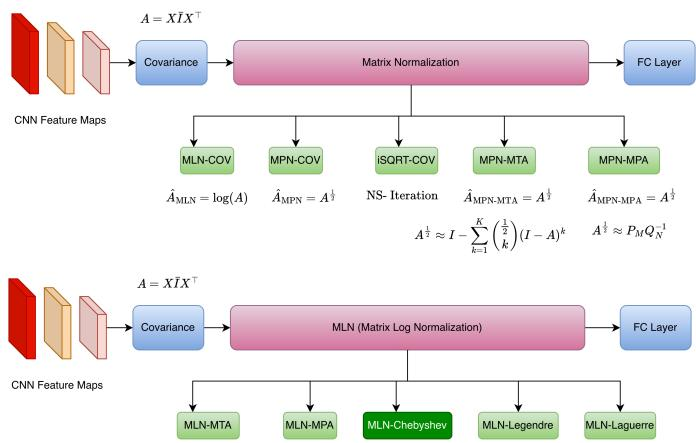
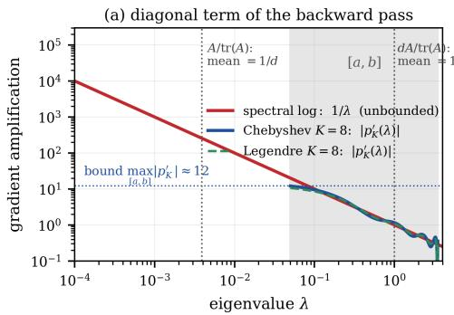
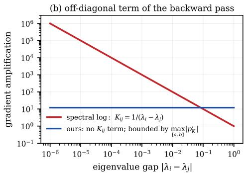
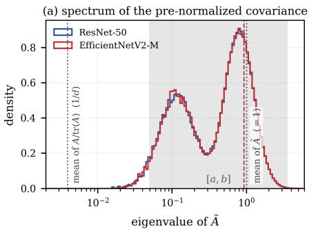
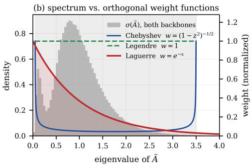

# Orthogonal Polynomial Approximation for Matrix Log Normalization in Global Covariance Pooling

Md Rifat Ur Rahman1 61806033@eee.buet.ac.bd 02Md Raihan Khan1 2khan2403558@stud.kuet.ac.bd

gMd Sakib Hossain Shovon1   
usakib@kaist.ac.kr   
APietro Liò2   
9pl219at@cam.ac.uk   
1Mohammad Ali Moni1   
mmoni@csu.edu.au

1 NeuronAITree 2 Cambridge University

## Abstract

Global Covariance Pooling (GCP) improves deep networks by capturing secondorder feature statistics, and is especially effective for fine-grained recognition. Because covariance matrices live on the Symmetric Positive Definite (SPD) manifold, a normalization step is required before the Euclidean classifier. The faithful choice is the matrix logarithm (MLN-COV), which maps the SPD manifold to its tangent space; in practice it was abandoned in favour of the matrix square root because its eigendecomposition-based gradient is numerically unstable. We show that this instability is an artifact of computing the logarithm spectrally, not of the logarithm itself. Approximating the logarithm with finite polynomials in the covariance matrix removes the eigendecomposition from both passes: every operation becomes a General Matrix Multiplication (GEMM), the gradient stays bounded on the spectral support of the pre-normalized covariance, and the unstable $1 / ( \lambda _ { i } - \lambda _ { j } )$ term never appears. The key ingredient is a mean-eigenvalue prenormalization that centres the spectrum near 1, away from the singularity of log, with a scalar post-compensation that returns the singular part of log(A) in closed form. Our recommended normalizer is a degree-8 Chebyshev expansion evaluated by a three-term matrix recurrence, with a matching reverse recurrence for the backward pass; Legendre, Laguerre, Taylor and Padé expansions are studied as controls that isolate the roles of the basis and of the target function. On three fine-grained benchmarks and ImageNet-1k the decomposition-free logarithm is both faster and more accurate than the spectral logarithm and than the square-root approximations it replaces, and at matched basis and degree the log target beats the square-root target, confirming that the gain comes from the faithful Riemannian map rather than from a better polynomial family. Code: https: //github.com/RifatRahmanRimon/GCP\_Orthogonal\_Polynomial.

## 1 Introduction

Global Covariance Pooling (GCP) was introduced as a second-order alternative to global average pooling [11]. Proposed first for fine-grained visual classification (FGVC) [22, 23, 26, 33], it has since been used in facial expression recognition [1], histopathology [14], hyperspectral imaging [35], SAR classification [3, 17] and object detection [38]: by modelling channel-wise correlations, covariance representations are more discriminative than first-order statistics. Given final-layer activations $X \in \mathbb { R } ^ { d \times N }$ , GCP computes the covariance $A = X \bar { I } X ^ { \top }$ with $\begin{array} { r } { \bar { I } = \frac { 1 } { N } ( I - \frac { 1 } { N } \mathbf { 1 } \mathbf { 1 } ^ { \top } ) } \end{array}$ centring the features. The result A lies on the Symmetric Positive Definite (SPD) manifold, whereas the classifier operates in Euclidean space, so a normalization step is required; these normalizers can be read as implicit Riemannian classifiers [5].

The faithful map and why it was abandoned. The faithful normalization is the matrix logarithm (MLN-COV),

$$
\begin{array} { r } { \hat { A } _ { \mathrm { M L N } } = \log ( A ) = U \log ( \Lambda ) U ^ { \top } , \qquad A = U \Lambda U ^ { \top } , } \end{array}\tag{1}
$$

which maps the SPD manifold onto its tangent space at the identity. It is rarely used, because Eq. (1) requires an eigendecomposition (EIG/SVD) and its gradient is fragile. MPN-COV [15] therefore replaced the logarithm with the gentler square root $A ^ { 1 / 2 }$ ; iSQRT-COV [16] removed the decomposition from the square root using coupled Newton–Schulz iterations, and Taylor (MTA) and Padé (MPA) approximations [27] pushed efficiency further while keeping the computation GEMM-only.

Approximation is not a compromise: it removes an instability. A recurring observation in this line of work is that the approximate square root consistently outperforms the exact SVD square root [16, 25]. The reason is about gradients: backpropagating through a spectral matrix function produces off-diagonal terms $K _ { i j } = 1 / ( \lambda _ { i } - \lambda _ { j } )$ [10, 11, 25], which explode for the heavy-tailed, near-degenerate spectra of deep features. Decomposition-free iterations avoid $K _ { i j }$ entirely, so the “approximation” trains better than the exact operator it approximates. This carries over to the logarithm, which is the more singular operator: its spectral gradient carries diag $( 1 / \lambda _ { i } )$ , which diverges faster than diag $( 1 / ( 2 \sqrt { \lambda _ { i } } ) )$ as $\lambda _ { i } \to 0$ (Fig. 2). The logarithm was abandoned not because it is the wrong map, but because computing it spectrally is the worst case for gradient stability, so a decomposition-free logarithm should inherit the “approximation beats exact” benefit more strongly than the square root does. The obstacle is that a finite polynomial cannot approximate log(x) uniformly on an interval touching the singularity at $\scriptstyle x = 0$ , so the construction must also re-engineer the pre-normalization. Prior trace-based GCP pre-normalization, $A / \operatorname { t r } ( A )$ , does the opposite: it drives the mean eigenvalue to $1 / d$ . Every existing polynomial normalizer targets the square root, where the singularity is milder and trace normalization suffices; the faithful logarithm has never been made decomposition-free.

## Contributions.

• A decomposition-free logarithmic normalizer. We approximate log(A) by a finite polynomial in A, reducing both passes to GEMM and eliminating the unstable spectral gradient term. To our knowledge this is the first polynomial, EIG/SVD-free formulation of MLN-COV; our recommended instance is a degree-8 Chebyshev expansion on the spectral support of the pre-normalized covariance.

• Mean-eigenvalue pre-normalization, and the matching backward. We replace $A / \operatorname { t r } ( A )$ with $\tilde { A } = d A / \operatorname { t r } ( A )$ , which pins $\bar { \lambda } ( \tilde { A } ) = 1$ exactly for any data, model or task, and restore log(A) through a scalar log $( \operatorname { t r } ( A ) / d ) I$ compensation. We give the chain rule (Sec. 3.2) and a unified reverse three-term recurrence that produces the backward pass of every orthogonal family from the basis matrices cached in the forward pass.

• A controlled empirical study. Taylor, Padé, Legendre and Laguerre serve as controls rather than competing proposals: Taylor and Padé are the exact log counterparts of MPN-MTA/MPN-MPA, and Laguerre is a deliberate negative control whose weight is mismatched to the GCP spectrum. We add Legendre- and Chebyshev-based squareroot approximations, so the log target can be compared with the square-root target at matched basis and degree.

## 2 Related Work

Spectral and decomposition-free normalizers. DeepO2P [11] introduced the matrix logarithm for GCP; MPN-COV [15] and $\mathrm { \bf G } ^ { 2 } \mathrm { \bf D e N e t }$ [32] established the square root as the dominant choice. Both rely on EIG/SVD, which is poorly supported on GPUs and whose backward pass is numerically delicate [10, 25]. iSQRT-COV [16] computes $A ^ { 1 / 2 }$ with Newton– Schulz iterations, and MTA/MPA-Lya [27] replace the iteration with Taylor and Padé approximations and a Lyapunov-based backward. These are GEMM-only but all approximate the square root; ours is the logarithm counterpart of this family. Polynomial approximation of the matrix logarithm is itself well studied in numerical linear algebra [2, 10, 12]; what is new is its use as a trainable normalization layer, with the pre-normalization and adjoint recurrence that make it viable on GCP spectra.

Recent GCP advances. iSICE [24] learns a partial-correlation representation to remove confounding between channels, and Halley-SVD [8] revisits SVD-based normalization with higher-order iterations to counter the over-flattening of large eigenvalues. These target the statistic or the accuracy ofthe spectral computation; all still require a normalization step, for which ours is a drop-in replacement, so the contribution compounds with these lines rather than competing. Second-order pooling in a transformer head [34] is likewise orthogonal, and a natural further setting (Sec. 5).

## 3 Method

We approximate log(A) by a finite polynomial (or rational polynomial) in A. The design principle is that coefficients, forward evaluation and gradient all stay inside the algebra of matrix multiplications, so no eigendecomposition is ever formed (Fig. 1).

## 3.1 Forward Pass via Polynomial and Rational Approximations

One normalizer, four controls. For deployment a single family suffices, and we recommend Chebyshev at degree K=8 (Sec. 4.5). The other four are not an exhaustive search but controls answering specific questions. Taylor and Padé are the exact log counterparts of MPN-MTA and MPN-MPA [27], required if the logarithm and the square root are to be compared at a matched target and degree. Legendre varies the orthogonal weight from $( 1 - z ^ { 2 } ) ^ { - 1 / 2 }$ to 1 with everything else fixed. Laguerre is a deliberate negative control: its weight $e ^ { - x } x ^ { \nu }$ is a poor fit to the GCP spectrum, and its failure (Sec. 4.3) shows the gain requires a basis matched to the spectral support rather than being a generic “any polynomial beats spectral” effect. A general expansion has the form log $\textstyle ( A ) \approx \sum _ { k = 0 } ^ { K } c _ { k } P _ { k } ( A )$ , where $\{ P _ { k } ( \cdot ) \}$ is the basis and $\left\{ c _ { k } \right\}$ are obtained by projecting log(·) onto it. Because A is symmetric, every $P _ { k } ( A )$ is symmetric and all commute with A and with each other, a fact used in Sec. 3.2. Table 1 summarizes all five families.

  
Figure 1: Top: the GCP meta-layer as it exists today; every normalizer it can host targets either the logarithm computed spectrally (MLN-COV [11], needing EIG/SVD) or the square root (MPN-COV [15], iSQRT-COV [16], MPN-MTA/MPN-MPA [27]). Bottom: the meta-layer proposed here, where the target is the faithful logarithm and the computation is decomposition-free. MLN-Chebyshev (highlighted) is the recommended setting; MLN-MTA/MLN-MPA are the exact log counterparts of MPN-MTA/MPN-MPA, and MLN-Legendre/MLN-Laguerre vary the orthogonal weight. The contrast between the rows is the contribution: the same box, with the target changed from $A ^ { 1 / 2 }$ to log(A) and the implementation from EIG/SVD to GEMM.

Pre-normalization and post-compensation. A finite polynomial cannot approximate log(x) uniformly on an interval reaching the singularity at 0, so any practical polynomial log normalizer must shift the spectrum away from 0 first. The standard choice in prior GCP work, trace normalization $A / \operatorname { t r } ( A )$ , is exactly the wrong move for the logarithm: it forces the eigenvalues to sum to 1, crushing their mean to $1 / d$ and pushing nearly every eigenvalue into the singularity. We instead pre-normalize by the average eigenvalue,

$$
\tilde { A } = \frac { d } { \operatorname { t r } ( A ) } A , \qquad \operatorname { t r } ( \tilde { A } ) = d , \qquad \bar { \lambda } ( \tilde { A } ) = 1 ,\tag{2}
$$

Table 1: Polynomial and rational families used to approximate log $( \tilde { A } )$ , with the meaneigenvalue normalization $\tilde { A } = d A / \operatorname { t r } ( A )$ (Eq. (2)). The scalar log $( \operatorname { t r } ( A ) / d ) I$ term is restored via Eq. (3); $\begin{array} { r } { M ( \tilde { A } ) = \frac { 2 } { b - a } \tilde { A } - \frac { a + b } { b - a } \tilde { I } } \end{array}$ is the affine map onto [−1,1], γ is the Euler–Mascheroni constant and ν is the Laguerre weight parameter (we use $\nu = 0 )$ . The leading terms shown for Legendre use the legacy interval $[ a , b ] = [ 0 , 1 ]$ ; the implementation uses $[ a , b ] = [ 0 . 0 5 , 3 . 5 ]$ and quadrature. The Padé column gives the $[ 1 / 1 ]$ and $[ 2 / 2 ]$ approximants of log(1 +x) evaluated at $x = \tilde { A } - I$
<table><tr><td rowspan=1 colspan=1>Polynomial</td><td rowspan=1 colspan=1>Coefficients</td><td rowspan=1 colspan=1>Recurrence Relation</td><td rowspan=1 colspan=1>Expression (first 3 terms)</td></tr><tr><td rowspan=1 colspan=1>Chebyshev</td><td rowspan=1 colspan=1> $c _ { k }$ via quadrature on [a, b], Eq. (4)</td><td rowspan=1 colspan=1> $T _ { k + 1 } = 2 M ( \tilde { A } ) T _ { k } - T _ { k - 1 }$ </td><td rowspan=1 colspan=1> $c _ { 0 } I + c _ { 1 } T _ { 1 } ( \tilde { A } ) + c _ { 2 } T _ { 2 } ( \tilde { A } ) + \cdot \cdot \cdot$ </td></tr><tr><td rowspan=1 colspan=1>Legendre</td><td rowspan=1 colspan=1> $c _ { k }$ via quadrature on [a, b], Eq. (6)</td><td rowspan=1 colspan=1> $( k + 1 ) P _ { k + 1 } = ( 2 k + 1 )$  $M ( \tilde { A } ) P _ { k } - k P _ { k - 1 }$ </td><td rowspan=1 colspan=1> $\begin{array} { r } { - I + \frac { 3 } { 2 } ( 2 \tilde { A } - I ) - \frac { 5 } { 6 } ( 6 \tilde { A } ^ { 2 } - 6 \tilde { A } + I ) + \cdots } \end{array}$ </td></tr><tr><td rowspan=1 colspan=1>Taylor</td><td rowspan=1 colspan=1> $\overline { { c _ { k } = \frac { ( - 1 ) ^ { k + 1 } } { k } } }$ </td><td rowspan=1 colspan=1>N/A</td><td rowspan=1 colspan=1> $( \tilde { A } - I ) - { \textstyle \frac { 1 } { 2 } } ( \tilde { A } - I ) ^ { 2 } + { \textstyle \frac { 1 } { 3 } } ( \tilde { A } - I ) ^ { 3 } + \cdots$ </td></tr><tr><td rowspan=1 colspan=1>Padé</td><td rowspan=1 colspan=1>Matching Taylor up to m + n</td><td rowspan=1 colspan=1>N/A</td><td rowspan=1 colspan=1> $\begin{array} { r } { \frac { 2 ( \tilde { A } - I ) } { \tilde { A } + I } , \frac { 6 ( \tilde { A } - I ) + 3 ( \tilde { A } - I ) ^ { 2 } } { 6 I + 6 ( \tilde { A } - I ) + ( \tilde { A } - I ) ^ { 2 } } } \end{array}$ </td></tr><tr><td rowspan=1 colspan=1>Laguerre</td><td rowspan=1 colspan=1> $\begin{array} { r } { c _ { 0 } = - \gamma , \ c _ { k } = - \frac { 1 } { k } \ \left( k \geq 1 \right) } \end{array}$ </td><td rowspan=1 colspan=1> $( k + 1 ) L _ { k + 1 } ^ { ( \nu ) } = ( 2 k + \nu + 1$  $- \tilde { A } ) L _ { k } ^ { ( \nu ) } - ( k + \nu ) L _ { k - 1 } ^ { ( \nu ) }$ </td><td rowspan=1 colspan=1> $\begin{array} { r } { - \gamma I + ( \tilde { A } - I ) - \frac { 1 } { 2 } L _ { 2 } ( \tilde { A } ) + \cdot \cdot \cdot } \end{array}$ </td></tr></table>

so the spectrum is centred at 1 rather than $1 / d .$ , and recover the original logarithm through the exact scalar identity

$$
\begin{array} { r } { \log ( A ) = \log \Bigl ( \frac { \operatorname { t r } ( A ) } { d } \tilde { A } \Bigr ) = \log \Bigl ( \frac { \operatorname { t r } ( A ) } { d } \Bigr ) I + \log ( \tilde { A } ) . } \end{array}\tag{3}
$$

Eq. (3) folds the singular part of log into a single GPU-trivial scalar, leaving $\log ( \tilde { A } )$ , the only approximated term, as a well-behaved operator on a spectrum near 1. Note how much of this is empirical: Eq. (2) pins $\bar { \lambda } ( \tilde { A } ) = 1$ exactly for any data, model or task, so only the spread around 1 is measured, and that spread was stable across two very different backbones (Sec. 4.1). Coefficients are precomputed offline; for orthogonal polynomials the basis matrices $P _ { k } ( \tilde { A } )$ are evaluated in the forward pass through their three-term recurrence, while Taylor and Padé operate on matrix monomials directly. Sec. B of the supplement gives one forward algorithm per family.

Chebyshev expansion (recommended). Chebyshev polynomials of the first kind are orthogonal on $[ - 1 , 1 ]$ with weight $w ( z ) = ( 1 - z ^ { 2 } ) ^ { - 1 / 2 }$ and satisfy $T _ { 0 } ( z ) = 1 , T _ { 1 } ( z ) = z , T _ { k + 1 } ( z ) =$ $2 z T _ { k } ( z ) - T _ { k - 1 } ( z )$ [21, 30]. We work on a fixed interval $[ a , b ] \supset \sigma ( { \tilde { A } } )$ , taken as [0.05, 3.5] and justified in Sec. 4.1, where $\sigma ( \cdot )$ denotes the spectrum. With $\begin{array} { r } { M ( \tilde { A } ) : = \frac { 2 } { b - a } \tilde { A } - \frac { a + b } { b - a } I } \end{array}$ the affine map onto $[ - 1 , 1 ]$ , the matrix recurrence and the coefficients are

$$
T _ { k + 1 } ( \tilde { A } ) = 2 M ( \tilde { A } ) T _ { k } ( \tilde { A } ) - T _ { k - 1 } ( \tilde { A } ) , \qquad c _ { k } = \frac { 2 - [ k = 0 ] } { \pi } \int _ { 0 } ^ { \pi } \log \Bigl ( \frac { a + b } { 2 } + \frac { b - a } { 2 } \cos \theta \Bigr ) \cos ( k \theta ) d \theta ,\tag{4}
$$

with $T _ { 0 } = I , T _ { 1 } = M ( \tilde { A } )$ , and $[ k = 0 ]$ the Iverson bracket; the coefficient integral follows by substituting $\begin{array} { r } { x = \frac { a + b } { 2 } + \frac { b - a } { 2 } } \end{array}$ cosθ. The integrand is bounded on $[ a , b ]$ for $a > 0$ , so the integrals are finite and evaluated once, offline, by a one-dimensional quadrature taking under a second: the interval can be re-fitted per architecture from a few hundred logged mini-batches.

We state the approximation-theoretic property carefully, since the truncated series is not itself the minimax polynomial. Let $p _ { K } ^ { \star }$ be the true degree-K minimax approximation of log on $[ a , b ]$ , obtainable only through an exchange procedure such as the Remez algorithm, and $p _ { K }$ the truncated Chebyshev series. Then $p _ { K }$ is near-minimax: its uniform error exceeds the optimum by at most the Lebesgue constant of Chebyshev projection,

$$
\begin{array} { r } { \| \log - p _ { K } \| _ { \infty } \leq \left( 1 + \Lambda _ { K } \right) \| \log - p _ { K } ^ { \star } \| _ { \infty } , \qquad \Lambda _ { K } \sim \frac { 4 } { \pi ^ { 2 } } \log K , } \end{array}\tag{5}
$$

so the penalty grows only logarithmically and is below 2 at $K { = } 8 \ [ \mathbb { S } \mathbb { I } ]$ . (The larger constant $\textstyle { \frac { 2 } { \pi } } \log K$ often quoted alongside it belongs to Chebyshev interpolation, not to the projection used here.) This near-minimax behaviour, not an exact minimax guarantee, is what gives Chebyshev its fast and uniform convergence over the GCP spectral support.

Legendre expansion. Legendre polynomials are orthogonal on $[ - 1 , 1 ]$ with weight $w ( z ) =$ 1 and satisfy $( k + 1 ) P _ { k + 1 } ( z ) = ( 2 k + 1 ) z P _ { k } ( z ) - k P _ { k - 1 } ( z ) , P _ { 0 } = 1 , P _ { 1 } = z \left[ \mathbb { E } \right]$ . Under the same affine map, $( k + 1 ) P _ { k + 1 } ( \tilde { A } ) = ( 2 k + 1 ) M ( \tilde { A } ) P _ { k } ( \tilde { A } ) - k P _ { k - 1 } ( \tilde { A } )$ , with coefficients obtained offline by quadrature,

$$
c _ { k } = { \frac { 2 k + 1 } { 2 } } \int _ { - 1 } ^ { 1 } \log \left( { \frac { a + b } { 2 } } + { \frac { b - a } { 2 } } z \right) P _ { k } ( z ) d z .\tag{6}
$$

Legendre differs from Chebyshev only in the weight, so the Legendre–Chebyshev comparison in Sec. 4.3 isolates the effect of the weight function alone.

Taylor and Padé controls. The scalar series log $\begin{array} { r } { ( 1 + x ) = \sum _ { k > 1 } ( - 1 ) ^ { k + 1 } x ^ { k } / k } \end{array}$ converges absolutely for $| x | < 1$ , so the matrix series log $\textstyle ( \tilde { A } ) \approx \sum _ { k = 1 } ^ { K } ( - 1 ) ^ { k + 1 } ( \tilde { A } - I ) ^ { k } / k$ converges only when $\rho ( \tilde { A } - I ) < 1$ , that is $\sigma ( { \tilde { A } } ) \subset ( 0 , 2 )$ , with $\rho ( \cdot )$ the spectral radius. This is not met by the GCP spectra we measure: the empirical support of $\tilde { A }$ reaches $\approx 3 . 8$ (Sec. 4.1), so a small high-eigenvalue tail lies outside the disk of convergence. We state this explicitly because it is why Taylor is retained only as a control, the exact log counterpart of MPN-MTA [27], and never recommended, even though it remains usable at $K { = } 8$ (Table 5). Padé approximants [4, 10] instead use ${ \cal R } _ { [ m / n ] } ( \tilde { A } ) = \bar { { \cal P } _ { m } } ( \tilde { A } ) { \cal Q } _ { n } ( \tilde { A } ) ^ { - 1 }$ , with $P _ { m } , Q _ { n }$ constructed so the scalar expansion matches log to order $m + n ;$ the inverse is never formed, and $Q _ { n }$ is applied through a single Cholesky factorization reused in the backward pass. Rational forms enlarge the region of accuracy, which is why MLN-MPA is the stronger of the two controls.

Laguerre expansion (negative control). Laguerre polynomials are orthogonal on $[ 0 , \infty )$ with weight $w ( x ) = e ^ { - x } x ^ { \nu }$ and satisfy $L _ { 0 } ^ { ( \nu ) } = I , L _ { 1 } ^ { ( \nu ) } ( \tilde { A } ) = ( \nu + 1 ) I - \tilde { A }$ and $( k + 1 ) L _ { k + 1 } ^ { ( \nu ) } =$ $( 2 k + \nu + 1 - \tilde { A } ) L _ { k } ^ { ( \nu ) } - ( k + \nu ) L _ { k - 1 } ^ { ( \nu ) }$ . For $\nu = 0$ the projection of log has the closed form $c _ { 0 } =$ $\begin{array} { r } { \int _ { 0 } ^ { \infty } \log ( x ) e ^ { - x } d x = - \gamma } \end{array}$ and $\begin{array} { r } { c _ { k } = \bar { \int _ { 0 } ^ { \infty } } \log ( x ) L _ { k } ( x ) e ^ { - x } d x = - 1 / k } \end{array}$ for $k \geq 1$ , with $\gamma$ the Euler– Mascheroni constant, so log $\begin{array} { r } { ( \tilde { A } ) \approx - \gamma I + ( \tilde { A } - I ) - \frac 1 2 L _ { 2 } ( \tilde { A } ) - \cdot \cdot \cdot } \end{array}$ . Because ${ e } ^ { - x }$ concentrates the approximation near $\scriptstyle x = 0$ while the mass of $\sigma ( \tilde { A } )$ sits near 1, the fit is the poorest of the five, by construction.

Out-of-range eigenvalues: a smooth shrinkage. Eq. (4) is defined on $[ a , b ]$ , but roughly $1 \%$ of the spectrum falls outside it. We pull the spectrum towards the identity with a convex shrinkage,

$$
\tilde { A } ^ { \prime } = ( 1 - \delta ) \tilde { A } + \delta I , \qquad \delta = 0 . 0 2 ,\tag{7}
$$

which is GEMM-free and exactly differentiable with $\partial \tilde { A } ^ { \prime } / \partial \tilde { A } = ( 1 - \delta ) \mathcal { Z }$ . On eigenvalues it is the affine map $\lambda \mapsto ( 1 - \delta ) \lambda + \delta$ , so it bounds the spectrum below by $\lambda \geq \delta$ , contracts the upper tail towards 1, and moves bulk eigenvalues near 1 by at most 2%. We emphasise what it does not do: a $2 \%$ contraction is not enough to bring every eigenvalue inside $[ a , b ]$ , so the residual mass reported in Sec. 4.1 is evaluated by extrapolating $p _ { K }$ slightly beyond $[ a , b ]$ Extrapolation error grows quickly outside the fitting interval, which is why $[ a , b ]$ is set with margin around the bulk rather than tightly around it, and why widening it further changes accuracy very little (Sec. 4.1). To keep the notation light we write $\tilde { A }$ for ${ \tilde { A } } ^ { \prime }$ below; the only place the distinction matters is the factor $( 1 - \delta )$ in Eq. (11).

  
Figure 2: Why the spectral logarithm is the worst case for gradient stability, and why the polynomial route is not. (a) The diagonal term of the backward pass: $1 / \lambda$ for the exact logarithm, unbounded as $\lambda \to 0 .$ , against $| p _ { K } ^ { \prime } ( \lambda ) |$ for a degree-8 expansion on $[ a , b ]$ , bounded by $\approx 1 2$ . The two coincide over the bulk and separate exactly where the exact operator becomes unstable. Trace normalization places the mean eigenvalue at $1 / d ,$ deep inside the unstable region; Eq. (2) places it at 1. (b) The off-diagonal term $K _ { i j }$ of Eq. (8), which diverges as the eigenvalue gap closes and which the polynomial formulation never forms. Both panels are closed-form properties of log and of the degree-8 expansions on $[ a , b ] = [ 0 . 0 5 , 3 . 5 ]$ ; no training data is involved.

## 3.2 Backward Pass: Decomposition-Free by Construction

This section establishes one property: the gradient of every normalizer above is computed by GEMM-only operations on the same basis matrices used in theforward pass, neverforms an eigendecomposition, and is bounded on the spectral support of ${ \tilde { A } }$ . This is exactly what the spectral logarithm lacks.

Contrast with the spectral logarithm. Differentiating Eq. (1) gives the standard matrixbackpropagation expression [10, 11]

$$
\frac { \partial \ell } { \partial A } = U \Big ( K ^ { \top } \circ \big ( U ^ { \top } \frac { \partial \ell } { \partial U } \big ) + \mathrm { d i a g } \big ( \frac { 1 } { \lambda _ { 1 } } , \ldots , \frac { 1 } { \lambda _ { d } } \big ) \frac { \partial \ell } { \partial \Lambda } \Big ) U ^ { \top } , \qquad K _ { i j } = \frac { 1 } { \lambda _ { i } - \lambda _ { j } } ,\tag{8}
$$

which requires U,Λ and contains the $1 / ( \lambda _ { i } - \lambda _ { j } )$ and $1 / \lambda _ { i }$ terms that blow up for heavytailed covariance spectra (Fig. 2). Our approximations have neither: every $P _ { k } ( \tilde { A } )$ is a polynomial, so the Fréchet derivative $\mathcal { D } P _ { k } [ \tilde { A } ] ( H )$ is a sum of products of H sandwiched between basis matrices already computed in the forward pass [10, Ch. 3], with norm controlled by max $_ { [ a , b ] } | p _ { K } ^ { \prime } |$

Orthogonal families: a unified adjoint recurrence. The three orthogonal families share the structure

$$
P _ { k + 1 } ( \tilde { A } ) = \bigl ( \alpha _ { k } M ( \tilde { A } ) + \gamma _ { k } I \bigr ) P _ { k } ( \tilde { A } ) - \beta _ { k } P _ { k - 1 } ( \tilde { A } ) , \qquad M ( \tilde { A } ) = \tau \tilde { A } + \mu I ,\tag{9}
$$

with family-specific scalars: Chebyshev $\alpha _ { k } { = } 2 , \beta _ { k } { = } 1 , \gamma _ { k } { = } 0$ ; Legendre $\begin{array} { r } { \alpha _ { k } = \frac { 2 k + 1 } { k + 1 } , \beta _ { k } = \frac { k } { k + 1 } , \gamma _ { k } = 0 } \end{array}$ Laguerre $\begin{array} { r } { \alpha _ { k } = \frac { 1 } { k + 1 } , \beta _ { k } = \frac { k + \nu } { k + 1 } , \gamma _ { k } = \frac { 2 k + \nu + 1 } { k + 1 } , } \end{array}$ ; and $\begin{array} { r } { ( \tau , \mu ) = \big ( \frac { 2 } { b - a } , - \frac { a + b } { b - a } \big ) } \end{array}$ for Chebyshev/Legendre, $( - 1 , 0 )$ for Laguerre. Let $\begin{array} { r } { S = \sum _ { k } c _ { k } P _ { k } ( \tilde { A } ) } \end{array}$ be the forward output and $G = \partial \ell / \partial S$ the incoming cotangent. Differentiating Eq. (9) in a symmetric direction H gives ${ \mathcal { D } } P _ { k + 1 } [ H ] =$ $\alpha _ { k } \tau H P _ { k } + ( \alpha _ { k } M + \gamma _ { k } I ) \mathcal { D } P _ { k } [ H ] - \beta _ { k } \mathcal { D } P _ { k - 1 } [ H ]$ , and reversing this linear recursion yields the adjoint we run: initialize $\bar { P } _ { k } = c _ { k } G$ for all k, then for $k = K - 1 , \ldots , 1$ accumulate $\bar { P } _ { k } + =$ $( \alpha _ { k } M ( \tilde { A } ) + \gamma _ { k } I ) \bar { P } _ { k + 1 }$ and $\bar { P } _ { k - 1 } -- = \beta _ { k } \bar { P } _ { k + 1 }$ . Collecting the terms that flow through M,

$$
\begin{array} { r } { \displaystyle \frac { \partial \ell } { \partial \tilde { A } ^ { \prime } } = \tau \operatorname { s y m } \Bigl ( \bar { P } _ { 1 } + \sum _ { k = 1 } ^ { K - 1 } \alpha _ { k } \bar { P } _ { k + 1 } P _ { k } ( \tilde { A } ) \Bigr ) , \qquad \operatorname { s y m } ( X ) = \frac { 1 } { 2 } \bigl ( X + X ^ { \top } \bigr ) . } \end{array}\tag{10}
$$

Two features matter. First, $M ( { \tilde { A } } )$ and every $P _ { k } ( \tilde { A } )$ are symmetric, so no transposes survive in the accumulation; the non-commutativity needing care is between the cotangent $\bar { P } _ { k + 1 }$ and the basis matrix $P _ { k } ( \tilde { A } )$ , resolved by the sym(·) in Eq. (10), which is the correct projection of the Fréchet adjoint of $M P _ { k }$ onto the symmetric subspace $\tilde { A }$ lives in. Second, each step costs two GEMMs, so the backward pass is $O ( K )$ GEMMs, matches the forward in cost, and reuses the cached $\{ P _ { k } ( \tilde { A } ) \}$ rather than an autograd graph, which at $K = 8 , d = 2 5 6$ and batch 32 cuts activation memory by $\sim 6 \times$ on our hardware. Specializing to Chebyshev gives $\begin{array} { r } { \partial \ell / \partial \tilde { A } ^ { \prime } = \frac { 2 } { b - a } \operatorname { s y m } ( \bar { P } _ { 1 } + 2 \sum _ { k } \bar { P } _ { k + 1 } \bar { T } _ { k } ( \tilde { A } ) ) } \end{array}$ , the form used in our implementation. Taylor and Padé are $O ( K ^ { 2 } )$ , because the Fréchet derivative of a monomial is a non-commutative double sum; their derivations are in Sec. C of the supplement.

Mapping from $\tilde { A }$ back to A. Let $s = \operatorname { t r } ( A ) / d$ , so ${ \tilde { A } } = A / s .$ , and let $\bar { G } : = \partial \ell / \partial \log ( A )$ Undoing Eq. (7) contributes a scalar factor, so

$$
B : = \frac { \partial \ell } { \partial \tilde { A } } = \left( 1 - \delta \right) \frac { \partial \ell } { \partial \tilde { A } ^ { \prime } } ,\tag{11}
$$

with $\partial \ell / \partial \tilde { A } ^ { \prime }$ from Eq. (10). Differentiating Eq. (3) term by term gives $\mathrm { d } s = \mathrm { t r } ( \mathrm { d } A ) / d ;$ the first branch contributes $\langle B , \mathrm { d } \tilde { A } \rangle = \langle B , \mathrm { d } A \rangle / s - \langle B , \tilde { A } \rangle _ { F } \mathrm { d } s / s ;$ and the scalar branch contributes $\mathrm { t r } ( \bar { G } ) \mathrm { d } \log ( s ) = \mathrm { t r } ( \bar { G } ) \mathrm { t r } ( \mathrm { d } A ) / ( d s )$ . Collecting the three,

$$
\frac { \partial \ell } { \partial A } = \frac { 1 } { s } B - \frac { \langle B , \tilde { A } \rangle _ { F } } { d s } I + \frac { \mathrm { t r } ( \bar { G } ) } { d s } I .\tag{12}
$$

Numerical verification and the decomposition-free guarantee. Every formula above is checked numerically, not only derived symbolically. Eqs. (10), (11) and (12), together with the Taylor and Padé adjoints, pass a double-precision finite-difference gradcheck, and Eq. (12) agrees with autograd through Eq. (3) to $1 0 ^ { - 6 }$ relative error in float64; forward accuracy is measured against a high-precision Schur–Padé reference [2] in Table 5, and the verification scripts ship with the code. All of these expressions are polynomials in ${ \tilde { A } } , G$ and the cached basis matrices, with at most one Cholesky solve in the Padé case, and none involves U, Λ or $K _ { i j }$ . This gives a closed-form, GEMM-only backward for every family at every degree, with $\| \partial \ell / \partial \bar { \tilde { A } } \| \leq C ( K , [ a , b ] ) \| G \|$ for any spectrum inside $[ a , b ]$ : the meaneigenvalue normalization keeps the bulk there and Eq. (7) bounds it below by $\delta .$ , leaving only the residual tail of Sec. 4.1 to extrapolation.

  
Figure 3: Eigenvalues of $\tilde { A }$ pooled over 3,000 mini-batches, for both backbones. (a) Log-scaled histogram. Eq. (2) pins the mean at 1; trace normalization would place it at $1 / d \approx 0 . 0 0 4$ , marked on the left, deep inside the region where the spectral-logarithm gradient diverges (Fig. 2a). The shaded band is $[ a , b ] = [ 0 . 0 5 , 3 . 5 ]$ , holding 99.2% of the ResNet-50 eigenvalues and 99.0% of the EfficientNetV2-M ones. The two backbones give almost the same distribution, which is what makes one fixed interval workable across architectures. (b) The same spectrum on a linear axis against the orthogonal weights. The Laguerre weight $e ^ { - x }$ decays across exactly the region where the spectral mass sits, which is why MLN-Laguerre is weakest in Tables 3–5; Chebyshev and Legendre are instead fitted on $[ a , b ]$ , which brackets the whole support.

## 4 Experiments

Setup. Experiments run on a single Tesla P100 GPU in PyTorch, on three FGVC benchmarks, CUB-200-2011 [31], FGVC-Aircraft [20] and Stanford Cars [13], and on ImageNet-1k [7]. Pretrained ResNet-50 [9] and EfficientNetV2-Medium [29] backbones are fine-tuned with global average pooling replaced by our GCP module. Following standard GCP practice we project features to 256 channels by a $1 \times 1$ convolution before forming the covariance, so the SPD matrices are $2 5 6 \times 2 5 6$ . All baselines and our methods share the identical compression, backbone, augmentation and optimizer: $2 5 6 \times 2 5 6$ random crops with RandAugment [6], Mixup [37] and CutMix [36], 100 epochs, batch size 32, AdamW [19] (learning rate and weight decay $1 \times 1 0 ^ { - 4 } )$ and cosine annealing [18]. Absolute FGVC accuracies are accordingly a few points below the highest published numbers, which typically use $4 4 8 \times 4 4 8$ inputs and longer schedules; what matters is that every method in our tables uses the same protocol. FGVC numbers are mean ± std over three seeds, and unless stated otherwise all polynomial rows use K=8 with Padé at $[ 4 / 4 ]$

## 4.1 Spectrum of $\tilde { A }$ in practice

To check that Eq. (2) bounds the spectrum away from 0 on real GCP covariances, we recorded the eigenvalues of $\tilde { A }$ over 3,000 mini-batches sampled across training, on both backbones (Fig. 3). The empirical support is [0.04, 3.78] on ResNet-50 and [0.03, 3.91] on EfficientNetV2-M, with 99.2% and 99.0% of eigenvalues inside [0.05, 3.5] and median around 0.8 to 1.1. The distribution is bimodal (Fig. 3a): a secondary mode sits near 0.1 alongside the main mode just below 1, so a non-negligible fraction lies well under the mean. What matters is that it is no longer crushed to $1 / d \approx 0 . 0 0 4$ as under trace normalization. We therefore precompute Chebyshev and Legendre coefficients on $[ a , b ] = [ 0 . 0 5 , 3 . 5 ]$ and handle the remaining ∼ 1% with Eq. (7), which affects $\leq 3$ eigenvalues per matrix on average. Fig. 3b shows why Laguerre fails: its weight decays across the region where the spectral mass sits, whereas Chebyshev and Legendre are fitted on an interval bracketing the support.

Table 2: Normalization-step cost (forward+backward) on a $2 5 6 \times 2 5 6$ covariance, batch size 32, P100, averaged over many iterations. All polynomial rows use $K { = } 8 ;$ ; Padé is $[ 4 / 4 ]$ iSQRT-COV uses N=5 Newton–Schulz iterations. GEMM counts are per sample.
<table><tr><td>Normalization</td><td>Forward</td><td>Backward</td><td>Time (ms)</td></tr><tr><td>MLN-COV []</td><td>EIG</td><td>EIG, Eq. (8)</td><td>69.5</td></tr><tr><td>MPN-COV []</td><td>EIG</td><td>EIG</td><td>67.0</td></tr><tr><td>iSQRT-COV []</td><td>3N=15 GEMM</td><td>coupled, ~3N GEMM</td><td>51.1</td></tr><tr><td>MPN-MTA []</td><td>K=8 GEMM</td><td> $O ( K ^ { 2 } ) \bar { \mathrm { G E M M } } + \mathrm { L y a p u n o v }$ </td><td>43.1</td></tr><tr><td>MPN-MPA []]</td><td>8 GEMM + solve</td><td> $O ( K ^ { 2 } ) \mathrm { G E M M + L y a p u n o v }$ </td><td>47.9</td></tr><tr><td>MLN-MTA (ours)</td><td>K=8 GEMM</td><td> $O ( K ^ { 2 } ) { \bf G E M M }$ </td><td>44.7</td></tr><tr><td>MLN-MPA (ours)</td><td>8 GEMM + Cholesky</td><td> $O ( K ^ { 2 } ) \mathrm { G E M M } + 2 \mathrm { t r i }$  solves</td><td>48.3</td></tr><tr><td>MLN-Legendre (ours)</td><td> $K { + } 1 { = } 9 \operatorname { G E M M }$ </td><td>2K GEMM</td><td>41.1</td></tr><tr><td>MLN-Laguerre (ours)</td><td> $K { + } 1 { = } 9 \operatorname { G E M M }$ </td><td>2K GEMM</td><td>40.7</td></tr><tr><td>MLN-Chebyshev (ours)</td><td> $K { + } 1 { = } 9 \operatorname { G E M M }$ </td><td>2K GEMM</td><td>36.4</td></tr></table>

The interval is not delicate. Because Eq. (2) fixes the mean at 1 exactly, $[ a , b ]$ only has to bracket the spread, and the result is insensitive to how tightly it does so: widening it to [0.02, 5.0] changes CUB/ResNet-50 top-1 by $\leq 0 . 2$ points and ImageNet-1k top-1 by $\leq 0 . 1$ With the sub-second offline re-fit of Eq. (4), a new architecture needs no tuning beyond logging a few hundred batches. For Taylor and Padé the same support implies $\rho ( \tilde { A } - I ) < 1$ on the bulk but not on the upper tail (Sec. 3.1).

## 4.2 Runtime and operation counts

Table 2 confirms that removing the eigendecomposition is the dominant effect: the spectral logarithm and square root are far slower than any GEMM-only variant. Per sample, the orthogonal families cost K+1 GEMMs forward, that is $O ( K d ^ { 3 } )$ , and $O ( K )$ GEMMs backward on the cached basis; Taylor costs K GEMMs forward and $O ( K ^ { 2 } )$ backward; Padé costs m+n GEMMs plus one Cholesky factorization $\textstyle { { \binom { 1 } { 3 } } d ^ { 3 } } )$ reused by the backward pass. These counts also explain the ordering within the decomposition-free group, otherwise counter-intuitive given that our Padé variant additionally solves a linear system: iSQRT-COV needs $3 N { = } 1 5$ GEMMs forward plus a coupled backward, and MPN-MTA/MPA use matched-degree powers with the iterative Lyapunov backward of [27] (MPA adding a rational solve), while our recurrences need 9 GEMMs forward and $O ( K )$ backward with no iteration and no Lyapunov solve, hence fewer kernel launches at a size where launch overhead and bandwidth, not raw flops, dominate. The same accounting explains why the orthogonal families beat our own Taylor and Padé variants. The three orthogonal families issue identical GEMM counts, and Chebyshev is fastest because its recurrence has constant integer coefficients that fold into the GEMM call, whereas Legendre and Laguerre carry degree-dependent rational coefficients needing a separate scaled add at every step.

Table 3: Top-1 accuracy (%) on three FGVC benchmarks, mean±std over three seeds, all at $K { = } 8$ . Spectral MLN-COV is the weakest; making the same logarithm decompositionfree recovers and surpasses it. The italicized rows are matched-basis square-root controls, isolating the role of the Riemannian map from that of the polynomial basis.
<table><tr><td rowspan="2">Normalization</td><td colspan="3">ResNet-50</td><td colspan="3">EfficientNetV2-M</td></tr><tr><td>CUB</td><td>Aircraft</td><td>Cars</td><td>CUB</td><td>Aircraft</td><td>Cars</td></tr><tr><td>MLN-COV []</td><td> $7 0 . 4 \pm 0 . 4$ </td><td> $8 0 . 1 \pm 0 . 3$ </td><td> $8 6 . 7 \pm 0 . 2$ </td><td> $7 8 . 5 \pm 0 . 3$ </td><td> $8 7 . 9 \pm 0 . 2 $ </td><td> $9 1 . 3 \pm 0 . 2 $ </td></tr><tr><td>MPN-COV []</td><td></td><td> $7 1 . 4 \pm 0 . 3 8 1 . 2 \pm 0 . 3 8 7 . 5 \pm 0 . 2$ </td><td></td><td> $7 9 . 1 \pm 0 . 3$ </td><td> $8 8 . 6 \pm 0 . 2 $ </td><td> $9 2 . 0 \pm 0 . 2 $ </td></tr><tr><td>iSQRT-COV []</td><td></td><td> $7 2 . 8 \pm 0 . 2 8 2 . 0 \pm 0 . 2 8 8 . 3 \pm 0 . 2$ </td><td></td><td> $7 9 . 6 \pm 0 . 2 8 9 . 1 \pm 0 . 2$ </td><td></td><td> $9 2 . 5 \pm 0 . 2 $ </td></tr><tr><td>MPN-MTA []</td><td></td><td> $7 3 . 1 \pm 0 . 3 8 2 . 3 \pm 0 . 2 8 8 . 6 \pm 0 . 2$ </td><td></td><td> $7 9 . 9 \pm 0 . 2 8 9 . 4 \pm 0 . 2$ </td><td></td><td> $9 2 . 8 \pm 0 . 2$ </td></tr><tr><td>MPN-MPA []</td><td></td><td> $7 3 . 2 \pm 0 . 2 8 2 . 5 \pm 0 . 2 8 8 . 7 \pm 0 . 2$ </td><td></td><td>80.0±0.2</td><td> $8 9 . 5 \pm 0 . 2 $ </td><td> $9 2 . 9 \pm 0 . 2 $ </td></tr><tr><td>MPN-Leg (sqrt control, ours)</td><td></td><td> $7 3 . 5 \pm 0 . 3 8 2 . 7 \pm 0 . 2 8 8 . 9 \pm 0 . 2$ </td><td></td><td>80.3 ± 0.2 89.7 ± 0.2</td><td></td><td> $9 3 . 1 \pm 0 . 2 $ </td></tr><tr><td>MPN-Cheb (sqrt control, ours)</td><td></td><td> $7 3 . 4 \pm 0 . 2 8 2 . 6 \pm 0 . 2 8 8 . 8 \pm 0 . 2$ </td><td></td><td> $8 0 . 2 \pm 0 . 2 8 9 . 6 \pm 0 . 2$ </td><td></td><td> $9 3 . 0 \pm 0 . 2 $ </td></tr><tr><td>MLN-MTA (control, ours)</td><td></td><td> $7 5 . 5 \pm 0 . 3 8 3 . 4 \pm 0 . 2 8 9 . 5 \pm 0 . 2$ </td><td></td><td> $8 1 . 2 \pm 0 . 3 9 0 . 1 \pm 0 . 2$ </td><td></td><td> $9 3 . 4 \pm 0 . 2 $ </td></tr><tr><td>MLN-MPA (control, ours)</td><td></td><td> $7 5 . 9 \pm 0 . 2 8 3 . 6 \pm 0 . 2 8 9 . 8 \pm 0 . 2$ </td><td></td><td> $8 1 . 4 \pm 0 . 2 9 0 . 3 \pm 0 . 2$ </td><td></td><td> $9 3 . 6 \pm 0 . 2$ </td></tr><tr><td>MLN-Legendre (ours)</td><td></td><td> ${ 7 6 . 9 \pm 0 . 2 8 4 . 1 \pm 0 . 2 9 0 . 1 \pm 0 . 2 }$ </td><td></td><td> $8 1 . 7 { \pm } 0 . 2 \ \ 9 0 . 8 { \pm } 0 . 2$ </td><td></td><td> $9 3 . 8 \pm 0 . 2$ </td></tr><tr><td>MLN-Laguerre (neg. control, ours)</td><td></td><td> $7 2 . 7 \pm 0 . 4 8 1 . 8 \pm 0 . 3 8 7 . 9 \pm 0 . 2$ </td><td></td><td> $7 9 . 3 \pm 0 . 3$ </td><td> $8 8 . 8 \pm 0 . 2 $ </td><td> $9 2 . 3 \pm 0 . 2 $ </td></tr><tr><td>MLN-Chebyshev (recommended)</td><td> $7 4 . 7 \pm 0 . 2$ </td><td> ${ \bf 8 4 . 3 \pm 0 . 2 }$ </td><td> ${ \bf 9 0 . 4 \pm 0 . 2 }$ </td><td> ${ \bf 8 } 2 . { \bf 0 } \pm { \bf 0 } . 2$ </td><td> $9 0 . 5 \pm 0 . 2 $ </td><td> ${ \bf 9 4 . 0 \pm 0 . 2 }$ </td></tr></table>

Scaling. Because every method is $O ( d ^ { 3 } )$ per sample, the ranking is preserved as the problem grows. Re-running Table 2 over $d \in \{ 1 2 8 , 2 5 6 , 5 1 2 \}$ and batch sizes {32,64,128} leaves the ordering unchanged; at $d { = } 5 1 2$ with batch 128, MLN-Chebyshev remains fastest at 1144 ms against 1621 ms for iSQRT-COV. The full grid is in Table 8 of the supplement.

## 4.3 Fine-grained classification

Table 3 contains the central comparison. Exact spectral MLN-COV is the worst normalizer in the table, yet our decomposition-free approximations of the same logarithm beat it by 3 to 6 points. Both compute the same target function; only the gradient path changes. The exact map back-propagates through Eq. (8) with its $1 / \lambda _ { i }$ and $1 / ( \lambda _ { i } - \lambda _ { j } )$ terms, ours through the bounded reverse recurrence of Sec. 3.2, whose amplification is capped by max $_ { \cdot [ a , b ] } | p _ { K } ^ { \prime } |$ The mechanism that makes the approximate square root beat exact SVD [25] applies to the logarithm, and applies more strongly, because the logarithm’s spectral gradient is the more singular of the two.

The negative control matters. MLN-Laguerre underperforms iSQRT-COV and MPN-MTA across the board. Its weight $e ^ { - x } x ^ { \nu }$ on $[ 0 , \infty )$ favours small eigenvalues far more than the spectral measure of $\tilde { A }$ warrants, so the expansion fits log accurately near $x { = } 0$ but poorly over the bulk near 1. The win is therefore not a generic “polynomial logs beat spectral logs” effect: it requires a basis whose weight matches the actual GCP spectrum, which Legendre, Chebyshev and, locally, Taylor and Padé all satisfy under the mean-eigenvalue normalization.

Legendre versus Chebyshev. The two strong bases are close on five of the six columns: Chebyshev wins every EfficientNetV2-M column and Aircraft/Cars on ResNet-50, with margins within roughly one std. The exception is CUB with ResNet-50, where Legendre leads by 2.2 points, well outside seed noise. Chebyshev also has the lower reconstruction error (Sec. 4.4) and the lowest runtime, so we recommend it as the default, with the caveat that CUB/ResNet-50 is a setting where Legendre is the better choice.

Table 4: Top-1 (%) on ImageNet-1k, mean±std over three seeds, all at K=8. Italicized rows are matched-basis square-root controls.
<table><tr><td>Normalization</td><td>ResNet-50</td><td>EffNetV2-M</td></tr><tr><td>MLN-COV []</td><td> $7 4 . 3 \pm 0 . 2$ </td><td> $8 2 . 1 \pm 0 . 2$ </td></tr><tr><td>MPN-COV []</td><td> $7 7 . 3 \pm 0 . 1$ </td><td> $8 3 . 0 \pm 0 . 1$ </td></tr><tr><td>iSQRT-COV []</td><td> $7 7 . 9 \pm 0 . 1$ </td><td> $8 3 . 2 \pm 0 . 1$ </td></tr><tr><td>MPN-MTA []</td><td> $7 8 . 1 \pm 0 . 1$ </td><td> $8 3 . 4 \pm 0 . 1$ </td></tr><tr><td>MPN-MPA []</td><td> $7 8 . 3 \pm 0 . 1$ </td><td> $8 3 . 5 \pm 0 . 1$ </td></tr><tr><td>MPN-Leg (ours)</td><td> $7 8 . 5 \pm 0 . 1$ </td><td> $8 3 . 6 \pm 0 . 1$ </td></tr><tr><td>MPN-Cheb (ours)</td><td> $7 8 . 5 \pm 0 . 1$ </td><td> $8 3 . 6 \pm 0 . 1$ </td></tr><tr><td>MLN-MTA (ours)</td><td> $7 8 . 8 \pm 0 . 1$ </td><td> $8 3 . 6 \pm 0 . 1$ </td></tr><tr><td>MLN-MPA (ours)</td><td> $7 9 . 0 \pm 0 . 1$ </td><td> $8 3 . 7 \pm 0 . 1$ </td></tr><tr><td>MLN-Legendre (ours)</td><td> ${ \bf 7 9 . 4 \pm 0 . 1 }$ </td><td> $8 3 . 9 \pm 0 . 1$ </td></tr><tr><td>MLN-Laguerre (ours)</td><td> $7 7 . 5 \pm 0 . 2$ </td><td></td></tr><tr><td>MLN-Chebyshev (rec.)</td><td> $7 9 . 2 \pm 0 . 1$ </td><td> $8 2 . 9 \pm 0 . 2$   ${ \bf 8 4 . 0 \pm 0 . 1 }$ </td></tr></table>

Table 5: Relative Frobenius error $\varepsilon _ { \mathrm { r e l } } =$ $\| \log ( A ) - f ( A ) \| _ { F } / \| \log ( A ) \| _ { F }$ over 300 GCP covariances at $K { = } 8 .$ , against a Schur–Padé reference [2] computed offline in double precision. The scalar term of Eq. (3) is exact, so it enters the denominator but not the numerator.
<table><tr><td>Norm.</td><td>ResNet-50</td><td>EffNetV2-M</td></tr><tr><td>MLN-MTA</td><td> $1 . 9 2 \pm 0 . 4 1 \%$ </td><td> $2 . 0 7 \pm 0 . 4 8 \%$ </td></tr><tr><td>MLN-MPA</td><td> $1 . 2 1 \pm 0 . 1 8 \%$ </td><td> $1 . 3 4 \pm 0 . 2 1 \%$ </td></tr><tr><td>MLN-Leg.</td><td> $0 . 4 3 \pm 0 . 0 9 \%$ </td><td> $0 . 4 8 \pm 0 . 1 0 \%$ </td></tr><tr><td>MLN-Lag.</td><td> $3 . 8 1 \pm 0 . 6 2 \%$ </td><td> $4 . 0 7 \pm 0 . 6 8 \%$ </td></tr><tr><td>MLN-Cheb.</td><td> $\mathbf { 0 . 2 7 \pm 0 . 0 6 \% }$ </td><td> $\mathbf { 0 . 3 1 \pm 0 . 0 7 \% }$ </td></tr></table>

Logarithm vs. square root, controlled twice over. We isolate the role of the target function in two ways. (i) Matched Padé: MLN-MPA beats MPN-MPA on CUB-ResNet by 2.7 points (75.9 vs. 73.2), with the same ordering in every column. (ii) Matched orthogonal basis: MLN-Legendre beats MPN-Leg by 3.4 points and MLN-Chebyshev beats MPN-Cheb by 1.3 points on the same benchmark, again in the same direction everywhere. Once both normalizers are decomposition-free the gradient-stability advantage is shared, so the remaining gap isolates the target function: the faithful logarithm wins at matched basis and degree.

The gain does not come from the augmentation recipe. Because the advantage is a property of the normalization step, it should survive removal of the augmentations. Repeating CUB/ResNet-50 with flip and crop only, iSQRT-COV reaches 67.3 and MLN-Chebyshev 69.5: absolute accuracies drop for both, but the gap is preserved, so the advantage is independent of RandAugment/Mixup/CutMix.

## 4.4 ImageNet-1k and reconstruction error

The FGVC ordering holds at scale (Table 4): the orthogonal logarithms lead, and combined with Table 2 they are simultaneously the most accurate and the most efficient normalizers. Legendre is marginally ahead on ResNet-50 and Chebyshev on EfficientNetV2-M, both within one std; Laguerre is again weakest. The matched-basis log-vs-sqrt gap on ResNet-50 is 0.7 points for Chebyshev (79.2 vs. 78.5) and 0.9 for Legendre (79.4 vs. 78.5), smaller than on FGVC but consistent in direction.

Table 5 characterizes polynomial fidelity. Chebyshev has the lowest relative error, as Eq. (5) predicts, followed by Legendre, with Laguerre worst because its weight is mismatched to the spectral support, corroborating its accuracy ranking. The error ranking matches the direction of the accuracy ranking $\mathrm { ( C h e b / L e g > M T A / M P A > L a g u e r r e ) }$ but not the size of the gaps: MLN-Legendre beats MLN-Chebyshev by 2.2 points on CUB-ResNet despite $\sim 1 . 6 \times$ higher reconstruction error. Once fidelity is below $\sim 0 . 5 \%$ both bases sit under the classifier’s noise floor and secondary factors, such as the conditioning of the recurrence and the sensitivity of the adjoint to spectral outliers, decide the residual gap. Near-minimax fidelity is a sufficient condition for joining the strong-normalizer group, not a ranking inside it.

Table 6: Degree ablation $K \in \{ 6 , 8 , 1 0 \}$ on ImageNet-1k with EfficientNetV2-M: Top-1 (%) and FP+BP time (ms). Padé is $[ \frac { K } { 2 } / \frac { K } { 2 } ]$ . The K=8 columns are the rows of Table 4.
<table><tr><td rowspan="2">Normalization</td><td colspan="2"> $K { = } 6$ </td><td colspan="2">K=8</td><td colspan="2"> $K { = } 1 0$ </td></tr><tr><td>Acc</td><td>Time</td><td>Acc</td><td>Time</td><td>Acc</td><td>Time</td></tr><tr><td>MLN-MTA</td><td>82.13</td><td>34.6</td><td>83.61</td><td>44.7</td><td>84.52</td><td>59.6</td></tr><tr><td>MLN-MPA</td><td>82.28</td><td>38.4</td><td>83.73</td><td>48.3</td><td>84.66</td><td>63.4</td></tr><tr><td>MLN-Legendre</td><td>82.47</td><td>31.1</td><td>83.92</td><td>41.1</td><td>84.88</td><td>56.3</td></tr><tr><td>MLN-Laguerre</td><td>81.41</td><td>30.9</td><td>82.91</td><td>40.7</td><td>83.83</td><td>55.5</td></tr><tr><td>MLN-Chebyshev</td><td>82.56</td><td>26.8</td><td>84.01</td><td>36.4</td><td>84.97</td><td>50.2</td></tr></table>

## 4.5 Effect of polynomial degree

Accuracy increases monotonically with degree for every family, Chebyshev is best at every degree tested, and runtime grows roughly linearly. The increments shrink: for Chebyshev, $K { = } 6 \to 8$ adds 1.45 points for 9.6 ms, and $K { = } 8 \to 1 0$ adds 0.96 points for a further 13.8 ms. We take K=8 as the default because it captures most of the available accuracy at the lowest cost per point, and because reconstruction error is already below the classifier’s noise floor there. $K { = } 1 0$ remains reasonable when accuracy matters more than latency: at 50.2 ms it is still faster than iSQRT-COV (51.1 ms). Chebyshev at $K { = } 8$ is our recommended setting.

## 5 Conclusion

We revived the faithful logarithmic normalizer for global covariance pooling by making it decomposition-free, through three ingredients: a mean-eigenvalue pre-normalization that centres the spectrum away from the log singularity; a polynomial approximation of log(A˜) that reduces the forward pass to GEMM; and a unified reverse three-term recurrence over the cached basis matrices giving a GEMM-only backward with no $1 / ( \lambda _ { i } - \lambda _ { j } )$ term. A degree-8 Chebyshev expansion is the recommended instance, faster and more accurate than the spectral logarithm and the square-root approximations it replaces. The controls sharpen the claim: Laguerre underperforms, so the effect requires a basis matched to the GCP spectral support rather than being a generic “polynomials beat spectral” phenomenon, and at matched basis and degree the log target beats the square-root target.

Limitations. The evaluation covers image classification with a convolutional GCP head at $d { = } 2 5 6$ . We have not tested second-order transformer heads or dense prediction, where the covariance dimension and the shape of the spectrum may differ from Sec. 4.1; [a,b] would need re-estimating there, which Eq. (4) makes cheap but which we have not verified. The interval is fitted from logged batches rather than derived, and eigenvalues outside it rely on extrapolation.

Because the formulation only touches the normalization step, it is a drop-in replacement wherever covariance pooling appears, including where GCP is currently most active: secondorder transformer heads [34], partial-correlation representations [24] and higher-order spectral iterations [8] all still require a normalizer. We leave these, with dense prediction and a Schur–Padé error analysis of the reverse recurrence, to future work.

## References

[1] Dinesh Acharya, Zhiwu Huang, Danda Pani Paudel, and Luc Van Gool. Covariance pooling for facial expression recognition. In Proceedings of the IEEE Conference on Computer Vision and Pattern Recognition Workshops (CVPRW), pages 367–374, 2018. URL https://doi.org/10.1109/CVPRW.2018.00077.

[2] Awad H. Al-Mohy and Nicholas J. Higham. Improved inverse scaling and squaring algorithms for the matrix logarithm. SIAM Journal on Scientific Computing, 34(4): C153–C169, 2012. URL https://doi.org/10.1137/110852553.

[3] Lin Bai, Qingxin Liu, Cuiling Li, Zhen Ye, Meng Hui, and Xiuping Jia. Remote sensing image scene classification using multiscale feature fusion covariance network with octave convolution. IEEE Transactions on Geoscience and Remote Sensing, 60: 1–14, 2022. URL https://doi.org/10.1109/TGRS.2021.3139868.

[4] George A. Baker and Peter Graves-Morris. Padé Approximants. Cambridge University Press, 2 edition, 1996. URL https://doi.org/10.1017/ CBO9780511530074.

[5] Ziheng Chen, Yue Song, Xiaojun Wu, Gaowen Liu, and Nicu Sebe. Understanding matrix function normalizations in covariance pooling through the lens of riemannian geometry. In Proceedings ofthe International Conference on Learning Representations (ICLR), 2025. URL https://openreview.net/forum?id=q1t0Lmvhty.

[6] Ekin D. Cubuk, Barret Zoph, Jonathon Shlens, and Quoc V. Le. RandAugment: Practical automated data augmentation with a reduced search space. In Proceedings of the IEEE/CVF Conference on Computer Vision and Pattern Recognition Workshops (CVPRW), pages 702–703, 2020. URL https://doi.org/10.1109/ CVPRW50498.2020.00359.

[7] Jia Deng, Wei Dong, Richard Socher, Li-Jia Li, Kai Li, and Li Fei-Fei. Imagenet: A large-scale hierarchical image database. In Proceedings of the IEEE Conference on Computer Vision and Pattern Recognition (CVPR), pages 248–255, 2009. doi: 10. 1109/CVPR.2009.5206848.

[8] Jiawei Gu, Ziyue Qiao, Xinming Li, and Zechao Li. Revitalizing SVD for global covariance pooling: Halley’s method to overcome over-flattening. In Advances in Neural Information Processing Systems (NeurIPS), 2025. URL https://openreview. net/forum?id=fqpbXJ2QtC.

[9] Kaiming He, Xiangyu Zhang, Shaoqing Ren, and Jian Sun. Deep residual learning for image recognition. In Proceedings of the IEEE Conference on Computer Vision and Pattern Recognition (CVPR), pages 770–778, 2016. doi: 10.1109/CVPR.2016.90.

[10] Nicholas J. Higham. Functions of Matrices: Theory and Computation. Society for Industrial and Applied Mathematics (SIAM), Philadelphia, PA, 2008. URL https: //doi.org/10.1137/1.9780898717778.

[11] Catalin Ionescu, Orestis Vantzos, and Cristian Sminchisescu. Matrix backpropagation for deep networks with structured layers. In Proceedings of the IEEE International Conference on Computer Vision (ICCV), pages 2965–2973, 2015. URL https:// doi.org/10.1109/ICCV.2015.339.

[12] Elias Jarlebring, Jorge Sastre, and J Ibáñez. Polynomial approximations for the matrix logarithm with computation graphs. Linear Algebra and its Applications, 721:692–714, 2025. URL https://doi.org/10.1016/j.laa.2023.11.012.

[13] Jonathan Krause, Michael Stark, Jia Deng, and Li Fei-Fei. Cars dataset. In Technical Report, Stanford University, 2013.

[14] Jiasen Li, Jianxin Zhang, Qiule Sun, Hengbo Zhang, Jing Dong, Chao Che, and Qiang Zhang. Breast cancer histopathological image classification based on deep secondorder pooling network. In Proceedings of the International Joint Conference on Neural Networks (IJCNN), pages 1–7, 2020. URL https://doi.org/10.1109/ IJCNN48605.2020.9206617.

[15] Peihua Li, Jiangtao Xie, Qilong Wang, and Wangmeng Zuo. Is second-order information helpful for large-scale visual recognition? In Proceedings of the IEEE International Conference on Computer Vision (ICCV), pages 2070–2078, 2017. URL https://doi.org/10.1109/ICCV.2017.224.

[16] Peihua Li, Jiangtao Xie, Qilong Wang, and Zilin Gao. Towards faster training of global covariance pooling networks by iterative matrix square root normalization. In Proceedings of the IEEE/CVF Conference on Computer Vision and Pattern Recognition (CVPR), pages 4076–4085, 2018. URL https://doi.org/10.1109/CVPR. 2018.00105.

[17] Wenkai Liang, Yan Wu, Ming Li, Yice Cao, and Xin Hu. High-resolution sar image classification using multi-scale deep feature fusion and covariance pooling manifold network. Remote Sensing, 13(2):328, 2021. URL https://doi.org/10.3390/ rs13020328.

[18] Ilya Loshchilov and Frank Hutter. SGDR: Stochastic gradient descent with warm restarts. In Proceedings of the International Conference on Learning Representations (ICLR), 2017. URL https://openreview.net/forum?id=Skq89Scxx.

[19] Ilya Loshchilov and Frank Hutter. Decoupled weight decay regularization. In Proceedings ofthe International Conference on Learning Representations (ICLR), 2019. URL https://openreview.net/forum?id=Bkg6RiCqY7.

[20] Subhransu Maji, Esa Rahtu, Juho Kannala, Matthew Blaschko, and Andrea Vedaldi. Fine-grained visual classification of aircraft. In arXiv preprint arXiv:1306.5151, 2013.

[21] John C. Mason and David C. Handscomb. Chebyshev Polynomials. Chapman & Hall/CRC, 2002. URL https://doi.org/10.1201/9781420036114.

[22] Shaobo Min, Hantao Yao, Hongtao Xie, Zheng-Jun Zha, and Yongdong Zhang. Multiobjective matrix normalization for fine-grained visual recognition. IEEE Transactions on Image Processing, 29:4996–5009, 2020. doi: 10.1109/TIP.2020.2977457. URL https://doi.org/10.1109/TIP.2020.2977457.

[23] Lulu Qian, Tan Yu, and Jianyu Yang. Multi-scale feature fusion of covariance pooling networks for fine-grained visual recognition. Sensors, 23(8):3970, 2023. URL https: //doi.org/10.3390/s23083970.

[24] Saimunur Rahman, Piotr Koniusz, Lei Wang, Luping Zhou, Peyman Moghadam, and Changming Sun. Learning partial correlation based deep visual representation for image classification. In Proceedings of the IEEE/CVF Conference on Computer Vision and Pattern Recognition (CVPR), pages 6231–6240, 2023.

[25] Yue Song, Nicu Sebe, and Wei Wang. Why approximate matrix square root outperforms accurate svd in global covariance pooling? In Proceedings of the IEEE/CVF International Conference on Computer Vision (ICCV), pages 1095–1103, 2021. URL https://doi.org/10.1109/ICCV48922.2021.00115.

[26] Yue Song, Nicu Sebe, and Wei Wang. On the eigenvalues of global covariance pooling for fine-grained visual recognition. arXiv preprint arXiv:2205.13282, 2022. URL https://arxiv.org/abs/2205.13282.

[27] Yue Song, Nicu Sebe, and Wei Wang. Fast differentiable matrix square root. In Proceedings of the International Conference on Learning Representations (ICLR), 2022. URL https://openreview.net/forum?id=-AOEi-5VTU8.

[28] Gábor Szego.˝ Orthogonal Polynomials, volume 23 of American Mathematical Society Colloquium Publications. American Mathematical Society, 4 edition, 1975. URL https://doi.org/10.1090/coll/023.

[29] Mingxing Tan and Quoc V. Le. Efficientnetv2: Smaller models and faster training. In Proceedings of the International Conference on Machine Learning (ICML), pages 10096–10106. PMLR, 2021. URL https://proceedings.mlr.press/ v139/tan21a.html.

[30] Lloyd N. Trefethen. Approximation Theory and Approximation Practice. Society for Industrial and Applied Mathematics (SIAM), Philadelphia, PA, 2013.

[31] Catherine Wah, Steve Branson, Peter Welinder, Pietro Perona, and Serge Belongie. Caltech-ucsd birds 200. In Technical Report CNS-TR-2011-001, California Institute of Technology, 2011.

[32] Qilong Wang, Peihua Li, and Lei Zhang. G2denet: Global gaussian distribution embedding network and its application to visual recognition. In Proceedings of the IEEE Conference on Computer Vision and Pattern Recognition (CVPR), pages 2730–2739, 2017. URL https://doi.org/10.1109/CVPR.2017.689.

[33] Qilong Wang, Jiangtao Xie, Wangmeng Zuo, Lei Zhang, and Peihua Li. Deep cnns meet global covariance pooling: Better representation and generalization. IEEE Transactions on Pattern Analysis and Machine Intelligence, 43(8):2582–2597, 2020. URL https://doi.org/10.1109/TPAMI.2020.2974833.

[34] Jiangtao Xie, Ruiren Zeng, Qilong Wang, Ziqi Zhou, and Peihua Li. SoT: Delving deeper into classification head for transformer. In Advances in Neural Information Processing Systems (NeurIPS), 2021.

[35] Zhaohui Xue, Mengxue Zhang, Yifeng Liu, and Peijun Du. Attention-based secondorder pooling network for hyperspectral image classification. IEEE Transactions on Geoscience and Remote Sensing, 59(11):9600–9615, 2021. URL https://doi. org/10.1109/TGRS.2021.3087394.

[36] Sangdoo Yun, Dongyoon Han, Seong Joon Oh, Sanghyuk Chun, Junsuk Choe, and Youngjoon Yoo. CutMix: Regularization strategy to train strong classifiers with localizable features. In Proceedings of the IEEE/CVF International Conference on Computer Vision (ICCV), pages 6023–6032, 2019. URL https://doi.org/10. 1109/ICCV.2019.00612.

[37] Hongyi Zhang, Moustapha Cisse, Yann N. Dauphin, and David Lopez-Paz. mixup: Beyond empirical risk minimization. In Proceedings of the International Conference on Learning Representations (ICLR), 2018. URL https://openreview.net/ forum?id=r1Ddp1-Rb.

[38] Shan Zhang, Dawei Luo, Lei Wang, and Piotr Koniusz. Few-shot object detection by second-order pooling. In Proceedings of the Asian Conference on Computer Vision (ACCV), pages 1–17, 2020. URL https://doi.org/10.1007/ 978-3-030-69541-5\_21.

## Supplementary

This document supplements the main paper. It collects (A) the notation and the definition of each polynomial and rational family, (B) the forward algorithms, one per family, (C) the complete per-family backward derivations, and (D) the full runtime grid. Every routine is decomposition-free: each step is a matrix multiplication (GEMM) or an addition, and no eigendecomposition (EIG/SVD) is ever formed.

## A Notation and Families

## A.1 Notation

$A \in \mathbb { S } _ { + + } ^ { d }$ : the GCP covariance, symmetric positive definite of size $d \times d ( d = 2 5 6 $ in all experiments).

$s : = \operatorname { t r } ( A ) / d :$ the mean eigenvalue of A.

$\widetilde { A } : = A / s = d A / \operatorname { t r } ( A )$ : the mean-eigenvalue pre-normalized covariance, Eq. (2) of the main paper. It satisfies $\operatorname { t r } ( \tilde { \cal A } ) = d$ and $\bar { \lambda } ( \tilde { A } ) = 1$ exactly. This is not trace normalization $A / \operatorname { t r } ( A )$ , which would put the mean eigenvalue at $1 / d .$

$\tilde { A } ^ { \prime } : = ( 1 - \delta ) \tilde { A } + \delta I$ with $\delta = 0 . 0 2$ : the shrinkage of Eq. (7), applied before the expansion.

$[ a , b ] = [ 0 . 0 5 , 3 . 5 ]$ : the fixed interval on which the Chebyshev and Legendre coefficients are fitted (Sec. 4.1 of the main paper).

$M ( \tilde { A } ^ { \prime } ) : = \tau \tilde { A } ^ { \prime } + \mu I \colon$ the affine map onto $[ - 1 , 1 ]$ , with $\begin{array} { r } { ( \tau , \mu ) = \big ( \frac { 2 } { b - a } , - \frac { a + b } { b - a } \big ) } \end{array}$ for Chebyshev and Legendre and $( \tau , \mu ) = ( - 1 , 0 )$ for Laguerre.

$P _ { k } , T _ { k } , L _ { k } ^ { ( \nu ) }$ : the Legendre, Chebyshev and generalized Laguerre basis matrices; ν is the Laguerre weight parameter, ν = 0 throughout.

• K: the truncation degree (K = 8 unless stated otherwise).

• ℓ: the training loss. $U : = \partial \ell / \partial \log ( A )$ is the upstream gradient. Because $\log ( A ) =$ log $( s ) I + \log ( \tilde { A } )$ and only the second term is approximated, U is also the cotangent of the polynomial output $\begin{array} { r } { S : = \sum _ { k } c _ { k } P _ { k } } \end{array}$

$\overline { { X } } : = \partial \ell / \partial X$ for any intermediate X.

$\begin{array} { r } { \langle X , Y \rangle _ { F } : = \operatorname { t r } ( X ^ { \top } Y ) ; \operatorname { s y m } ( X ) : = \frac { 1 } { 2 } ( X + X ^ { \top } ) ; \pmb { \sigma } ( \cdot ) } \end{array}$ the spectrum; $\rho ( \cdot )$ the spectral radius; γ the Euler–Mascheroni constant.

${ \mathcal { D } } F [ X ] ( H )$ : the Fréchet derivative of the matrix function F at X in direction H [10, Ch. 3].

## A.2 The two chain rules

Every family below produces $\partial \ell / \partial \tilde { A } ^ { \prime }$ . Two steps map it back to the original covariance, and they are shared by all five families.

Undoing the shrinkage. Eq. (7) of the main paper is the convex shrinkage

$$
\tilde { A } ^ { \prime } = ( 1 - \delta ) \tilde { A } + \delta I , \qquad \delta = 0 . 0 2 .\tag{13}
$$

On eigenvalues this is the affine map $\lambda \mapsto ( 1 - \delta ) \lambda + \delta$ , so it bounds the spectrum below by $\lambda \geq \delta$ and contracts the upper tail towards 1, moving bulk eigenvalues near 1 by at most 2%. It is a scalar affine map of ${ \tilde { A } } .$ hence exactly differentiable with $\partial \tilde { A } ^ { \prime } / \partial \tilde { A } = ( 1 - \stackrel { \cdot } { \partial } ) \mathcal { T }$ and free of any non-differentiable branch, and it costs no GEMM. Its adjoint is therefore a single scalar multiplication,

$$
B : = \frac { \partial \ell } { \partial \tilde { A } } = \left( 1 - \delta \right) \frac { \partial \ell } { \partial \tilde { A } ^ { \prime } } .\tag{14}
$$

Note that a $2 \%$ contraction does not by itself bring every eigenvalue inside $[ a , b ]$ ; the residual mass $( \sim 1 \%$ , Sec. 4.1 of the main paper) is evaluated by extrapolating $p _ { K }$ slightly beyond $[ a , b ]$

Undoing the mean-eigenvalue normalization. With $s = \operatorname { t r } ( A ) / d$ and ${ \tilde { A } } = A / s .$ , the identity $\log ( A ) = \log ( s ) I + \log ( \tilde { A } )$ has two branches. Differentiating, $\mathrm { { d } } s = \mathrm { { t r } } ( \mathrm { { d } } A ) / d$ and $\mathrm { d } \tilde { A } = \mathrm { d } A / s -$ $\tilde { A } \mathrm { d } s / s$ , so the first branch contributes $\langle B , \mathrm { d } \tilde { A } \rangle _ { F } = \langle B , \mathrm { d } A \rangle _ { F } / s - \langle B , \tilde { A } \rangle _ { F } \mathrm { t r } ( \mathrm { d } A ) / ( d s )$ while the scalar branch contributes $\operatorname { t r } ( U ) \operatorname { d } \log ( s ) = \operatorname { t r } ( U ) \operatorname { t r } ( \mathrm { d } A ) / ( d s )$ . Collecting the three terms,

$$
\frac { \partial \ell } { \partial A } = \frac { 1 } { s } B - \frac { \langle B , \tilde { A } \rangle _ { F } } { d s } I + \frac { \mathrm { t r } ( U ) } { d s } I , \qquad s = \frac { \mathrm { t r } ( A ) } { d } .\tag{15}
$$

This is Eq. (12) of the main paper. It agrees with autograd taken through the identity to $1 0 ^ { - 6 }$ relative error in float64, and every boxed gradient below passes a double-precision finite-difference gradcheck when composed with Eqs. (14)–(15).

## A.3 The five families

The coefficients $\left\{ c _ { k } \right\}$ depend only on the target log(·) and on the basis, not on the data, and are obtained once, offline, by projecting log onto the basis over the affinely mapped interval using numerical quadrature, then stored as constants.

Chebyshev (first kind, recommended). On $[ - 1 , 1 ] , T _ { 0 } ( t ) = 1 , T _ { 1 } ( t ) = t , T _ { k + 1 } ( t ) = 2 t T _ { k } ( t ) -$ $T _ { k - 1 } ( t )$ , orthogonal under the weight $( 1 - t ^ { 2 } ) ^ { - \cdot } \dot { 1 } / 2 \ [ \dot { \Sigma } ] , \dot { \mathrm { { B G } } } ]$ . With $t = \left( 2 x - ( a + b ) \right) / ( b - a )$ mapping $[ a , b ] \to [ - 1 , 1 ]$ and g the inverse map,

$$
c _ { k } = \frac { 2 - [ k = 0 ] } { \pi } \int _ { - 1 } ^ { 1 } \frac { \log \bigl ( g ( t ) \bigr ) T _ { k } ( t ) } { \sqrt { 1 - t ^ { 2 } } } d t ,\tag{16}
$$

where $[ k = 0 ]$ is the Iverson bracket. The integrand is bounded because $a > 0$ . The basis is lifted to $T _ { k } ( { \tilde { M } } ( { \tilde { A } } ^ { \prime } ) )$ through the same recurrence. The truncated series is near-minimax rather than minimax: its uniform error exceeds the optimum by at most $1 + \Lambda _ { K }$ with $\Lambda _ { K } \sim \frac { 4 } { \pi ^ { 2 } }$ logK the Lebesgue constant of Chebyshev projection, which is below 2 at $K = 8 [ \mathbb { B } \mathbb { 1 }$

Legendre. Orthogonal on $[ - 1 , 1 ]$ under the unit weight, with $( k + 1 ) P _ { k + 1 } ( t ) = ( 2 k + 1 ) t P _ { k } ( t ) -$ $k P _ { k - 1 } ( t ) , P _ { 0 } = 1 , P _ { 1 } = t \left[ \pmb { \mathbb { E } } \right]$ , and

$$
c _ { k } = { \frac { 2 k + 1 } { 2 } } \int _ { - 1 } ^ { 1 } \log { \bigl ( } g ( t ) { \bigr ) } P _ { k } ( t ) d t .\tag{17}
$$

The implementation uses this quadrature on $[ a , b ] = [ 0 . 0 5 , 3 . 5 ]$ , matching the treatment of Chebyshev. For the legacy unit interval $[ a , b ] = [ 0 , 1 ]$ the same projection admits the closed form $c _ { 0 } = - 1$ and $c _ { k } \overset { \cdot } { = } ( \overset { \cdot } { - } 1 ) ^ { k + 1 } \frac { 2 k + 1 } { k ( k + 1 ) }$ for $k \geq 1 ;$ ; those are the values quoted in Table 1 of the main paper and are used only for illustration. Legendre differs from Chebyshev in the weight alone, which is what makes the Legendre–Chebyshev comparison a controlled one.

Laguerre (generalized, negative control). Orthogonal on $[ 0 , \infty )$ under the weight $x ^ { \nu } e ^ { - x }$ :

$$
L _ { 0 } ^ { ( \nu ) } ( x ) = 1 , \quad L _ { 1 } ^ { ( \nu ) } ( x ) = \nu + 1 - x , \quad ( k + 1 ) L _ { k + 1 } ^ { ( \nu ) } = ( 2 k + \nu + 1 - x ) L _ { k } ^ { ( \nu ) } - ( k + \nu ) L _ { k - 1 } ^ { ( \nu ) } .\tag{18}
$$

For $\nu = 0$ the projection of log has the closed form $\begin{array} { r } { c _ { 0 } = \int _ { 0 } ^ { \infty } \log ( x ) e ^ { - x } d x = - \gamma } \end{array}$ and $c _ { k } =$ $\begin{array} { r } { \int _ { 0 } ^ { \infty } \log ( x ) L _ { k } ( x ) e ^ { - x } d x = - 1 / k } \end{array}$ for $k \geq 1$ . No affine rescaling is applied, since the orthogonality domain $[ 0 , \infty )$ already contains $\sigma ( \tilde { A } ^ { \prime } )$ ; this is precisely why the family underperforms, as the weight ${ e } ^ { - x }$ decays across the region where the spectral mass sits (Fig. 3b of the main paper).

Taylor. After the mean-eigenvalue normalization the spectrum is centred at 1, so the expansion is taken about I:

$$
\log ( \tilde { A } ^ { \prime } ) \sum _ { k = 1 } ^ { K } ( - 1 ) ^ { k + 1 } \frac { ( \tilde { A } ^ { \prime } - I ) ^ { k } } { k } .\tag{19}
$$

The scalar series converges for $| x | < 1$ , so the matrix series requires $\rho ( \tilde { A } ^ { \prime } - I ) < 1$ , that is $\sigma ( { \tilde { A } } ^ { \prime } ) \subset ( 0 , 2 )$ . The measured GCP support reaches 3.8 (Sec. 4.1 of the main paper), so a small high-eigenvalue tail lies outside the disk of convergence. Taylor is therefore retained only as the exact log counterpart of MPN-MTA, never recommended.

Padé. With $X = \tilde { A } ^ { \prime } - I .$ , the $[ m / n ]$ approximant $R _ { [ m / n ] } ( X ) = P _ { m } ( X ) { \cal Q } _ { n } ( X ) ^ { - 1 }$ has $P _ { m } ( X ) =$ $\scriptstyle \sum _ { i = 0 } ^ { m } p _ { i } X ^ { i }$ and $\textstyle Q _ { n } ( X ) = \sum _ { i = 0 } ^ { n } q _ { j } X ^ { j }$ with $q _ { 0 } = 1$ , the coefficients chosen so that the scalar expansion matches log $( 1 + x )$ to order $m + n \left[ \mathbb { E } , \mathbb { D } \right]$ . The two lowest orders are

$$
R _ { [ 1 / 1 ] } = \frac { 2 X } { 2 I + X } , \qquad R _ { [ 2 / 2 ] } = \left( 6 X + 3 X ^ { 2 } \right) \left( 6 I + 6 X + X ^ { 2 } \right) ^ { - 1 } .\tag{20}
$$

The inverse is never formed: $Q _ { n }$ is symmetric positive definite on the spectral range of interest, so it is applied through a single Cholesky factorization that is cached and reused in the backward pass. Rational forms enlarge the region of accuracy relative to the truncated Taylor series, at the cost of poles that must be kept outside the target spectrum by the choice of $[ m / n ]$

## B Forward Algorithms

Algorithm 1 PRE-NORMALIZATION (shared by all normalizers)   
Require: $A \in \mathbb { S } _ { + + } ^ { d }$ (batched or single), tolerance ε, shrinkage $\delta$   
1: $s $ max $( \operatorname { t r } ( \dot { \boldsymbol { A } } ) / d , \varepsilon )$ ▷ mean eigenvalue; guard against tiny traces   
2: $\tilde { A }  A / s$ $\triangleright \operatorname { t r } ( \tilde { A } ) = d , \bar { \lambda } ( \tilde { A } ) = 1$   
3: $\tilde { A } ^ { \prime } \gets ( \dot { 1 } - \delta ) \tilde { A } + \delta I$ ▷ Eq. (13); GEMM-free   
4: return $( \tilde { A } ^ { \prime } , \tilde { A } , s )$   
Note: the division is by the mean eigenvalue $\operatorname { t r } ( A ) / d ,$ not by $\operatorname { t r } ( A )$ . Trace normalization   
would place the mean eigenvalue at $1 / d ,$ inside the singularity of log.

Algorithm 2 LOG CHEBYSHEV APPROXIMATION (recommended; degree K)   
Require: $A \in \mathbb { S } _ { + + } ^ { d }$ , degree K, fixed interval $[ a , b ] = [ 0 . 0 5 , 3 . 5 ]$ , cached $\left\{ c _ { k } \right\}$   
1: $( \tilde { A } ^ { \prime } , \tilde { A } , s ) \gets \dot { \mathrm { P R E - N O R M A L I Z A T I O N } } ( A )$   
2: $\tau  2 / ( b - a ) , \quad \mu  - ( a + b ) / ( b - a )$   
3: $M \gets \tau \tilde { A } ^ { \prime } + \mu I$ ▷ affine map onto $[ - 1 , 1 ]$ ; no GEMM   
4: $T _ { 0 } \gets I , \quad T _ { 1 } \gets M , \quad Y \gets c _ { 0 } T _ { 0 } + c _ { 1 } T _ { 1 }$   
5: for $k = 1$ to $K - 1$ do   
6: $T _ { k + 1 } \gets 2 M T _ { k } - T _ { k - 1 }$ ▷ GEMM; cache $T _ { k }$ for the backward   
7: $Y  Y + c _ { k + 1 } T _ { k + 1 }$   
8: return log $( A ) ( \log s ) I + Y$   
Cost: K GEMMs. Note: $[ a , b ]$ is fixed from the spectral statistics of Sec. 4.1, so no   
eigenvalue bound is computed at run time; re-fitting $\{ c _ { k } \}$ for a new architecture is a one  
dimensional offline quadrature taking under a second.

Algorithm 3 LOG LEGENDRE APPROXIMATION (degree K)   
Require: $A \in \mathbb { S } _ { + + } ^ { d }$ , degree K, fixed interval $[ a , b ]$ , cached $\left\{ c _ { k } \right\}$   
1: $( \tilde { A } ^ { \prime } , \tilde { A } , s ) \gets \dot { \mathrm { P R E - N } }$ ORMALIZATION(A)   
2: $\begin{array} { r } { \dot { M } \gets \frac { \hat { 2 } } { b - a } \tilde { A } ^ { \prime } - \frac { a + b } { b - a } I } \end{array}$   
3: $P _ { 0 }  \bar { I } , \quad P _ { 1 }  \bar { M } , \quad Y  c _ { 0 } P _ { 0 } + c _ { 1 } P _ { 1 }$   
4: for $k = 1$ to $K - 1$ do   
5: $P _ { k + 1 }  ( ( 2 k + 1 ) M P _ { k } - k P _ { k - 1 } ) / ( k + 1 )$ ▷ GEMM   
6: $Y \gets Y + c _ { k + 1 } P _ { k + 1 }$   
7: return $\log ( A ) ( \log s ) I + Y$   
Cost: K GEMMs.

Algorithm 4 LOG LAGUERRE APPROXIMATION $( \nu { = } 0 ;$ degree K)   
Require: $A \in \mathbb { S } _ { + + } ^ { d }$ , degree $K , c _ { 0 } = - \gamma , c _ { k } = - 1 / k$   
1: (A˜′,A˜,s) ← PRE-NORMALIZATION(A)   
2: $L _ { 0 } \gets I , \quad L _ { 1 } \gets I - \tilde { A } ^ { \prime } , \quad Y \gets c _ { 0 } L _ { 0 } + c _ { 1 } L _ { 1 }$   
3: for $k = 1$ to K − 1 do   
4: $L _ { k + 1 } \gets \big ( ( 2 k + 1 ) I - \tilde { A } ^ { \prime } \big ) L _ { k } - k L _ { k - 1 } ; \quad L _ { k + 1 } \gets L _ { k + 1 } / ( k + 1 )$ ▷ GEMM   
5: $Y  Y + c _ { k + 1 } L _ { k + 1 }$   
6: return log(A)(log s)I +Y   
Cost: K GEMMs. Note: $\nu \neq 0$ requires re-projecting $\left\{ c _ { k } \right\}$

Algorithm 5 LOG TAYLOR APPROXIMATION (about $I ;$ degree K)   
Require: $A \in \mathbb { S } _ { + + } ^ { d }$ , degree K   
1: $( \tilde { A } ^ { \prime } , \tilde { A } , s ) \gets$ PRE-NORMALIZATION(A)   
2: $X  \tilde { A } ^ { \prime } - I , \quad X ^ { ( 1 ) }  X , \quad Y  0$   
3: for k = 1 to K do   
4: $Y  Y + { \frac { ( - 1 ) ^ { k + 1 } } { k } } X ^ { ( k ) }$   
5: $X ^ { ( k + 1 ) }  X ^ { ( k ) } X$ ▷ GEMM   
6: return log $( A ) ( \log s ) I + Y$   
Cost: K GEMMs forward, $O ( K ^ { 2 } )$ backward. Note: convergence needs $\sigma ( { \tilde { A } } ^ { \prime } ) \subset ( 0 , 2 )$   
which the measured spectra violate on the upper tail; Taylor is a control only.

Algorithm 6 LOG PADÉ APPROXIMATION $\left( \left[ m / n \right] \right.$ for log $( 1 + X ) )$   
Require: $A \in \mathbb { S } _ { + + } ^ { d }$ , integers m,n, cached $\{ p _ { i } \} , \{ q _ { j } \}$   
1: (A˜′,A˜,s) ← PRE-NORMALIZATION(A)   
2: X ← A˜′ − I, P ← p I, Q ← q I, $X ^ { ( 1 ) }  X$   
3: for k = 1 to max(m,n) do   
4: if $k \leq m$ then   
5: $P \gets P + p _ { k } X ^ { ( k ) }$   
6: if $k \leq n$ then   
7: $Q  Q + q _ { k } X ^ { ( k ) }$   
8: $X ^ { ( k + 1 ) }  X ^ { ( k ) } X$ ▷ GEMM   
9: R ← chol(Q); solve $Q Y = P$ for Y ▷ cache R for the backward pass   
10: return log(A)(log s) I +Y   
Cost: max(m,n) GEMMs + one Cholesky factorization $\textstyle { { \binom { 1 } { 3 } } d ^ { 3 } } )$ , reused in the backward pass   
so no second factorization is needed.

## C Backward-Pass Derivations

Each subsection derives $\partial \ell / \partial \tilde { A } ^ { \prime }$ using only GEMMs and additions. Composing with Eq. (14) and then Eq. (15) gives $\partial \ell / \partial A .$ . Throughout, $U = \partial \ell / \partial \log ( A )$ is the upstream gradient, and all basis matrices are the ones cached during the forward pass, so no quantity is recomputed and no autograd graph is retained.

## C.1 Unified adjoint for the orthogonal families

Chebyshev, Legendre and Laguerre share the three-term structure

$$
P _ { k + 1 } = \left( \alpha _ { k } M + \gamma _ { k } I \right) P _ { k } - \beta _ { k } P _ { k - 1 } , \qquad P _ { 0 } = I , \quad P _ { 1 } = M + \kappa I ,\tag{21}
$$

with $M = M ( \tilde { A } ^ { \prime } ) = \tau \tilde { A } ^ { \prime } + \mu I$ and the family-specific scalars of Table 7. Note that $P _ { 1 }$ is an initialization, not an instance of the recurrence, which starts at $P _ { 2 } { \mathrm { : } }$ ; this distinction is what fixes the weight of the $k = 0$ term in the adjoint below.

Table 7: Scalars of the unified recurrence (21).
<table><tr><td>Family</td><td> $\alpha _ { k }$ </td><td> $\beta _ { k }$ </td><td>Yk</td><td> $( \tau , \mu )$ </td><td>K</td></tr><tr><td>Chebyshev</td><td>2</td><td>1</td><td>0</td><td> $\textstyle { \left( { \frac { 2 } { b - a } } , - { \frac { a + b } { b - a } } \right) }$ </td><td>0</td></tr><tr><td>Legendre</td><td> $\frac { 2 k + 1 } { k + 1 }$ </td><td> $\frac { k } { \frac { k + 1 } { k + \nu } }$ </td><td>0</td><td> $\textstyle \left( { \frac { 2 } { b - a } } , - { \frac { a + b } { b - a } } \right)$ </td><td>0</td></tr><tr><td>Laguerre</td><td> $\frac { \cdot } { k + 1 }$ </td><td></td><td> $\frac { 2 k + \nu + 1 } { k + 1 }$ </td><td> $( - 1 , 0 )$ </td><td> $\nu + 1$ </td></tr></table>

Differential. Differentiating (21) in a symmetric direction H, and using $\mathcal { D } M [ H ] = \tau H$ together with $\mathcal { D } P _ { 0 } [ H ] = 0$ and $\mathcal { D } P _ { 1 } [ H ] = \tau H$

$$
\mathcal { D } P _ { k + 1 } [ H ] = \alpha _ { k } \tau H P _ { k } + \left( \alpha _ { k } M + \gamma _ { k } I \right) \mathcal { D } P _ { k } [ H ] - \beta _ { k } \mathcal { D } P _ { k - 1 } [ H ] .\tag{22}
$$

The first term is the only one in which H appears explicitly; the other two propagate it.

Reverse recurrence. Seed $\overline { { P } } _ { k } = c _ { k } U$ for $k = 0 , \ldots , K$ , then sweep $k = K - 1 , \ldots , 1$

$$
\overline { { { P } } } _ { k } + = \left( \alpha _ { k } M + \gamma _ { k } I \right) \overline { { { P } } } _ { k + 1 } , \qquad \overline { { { P } } } _ { k - 1 } - = \beta _ { k } \overline { { { P } } } _ { k + 1 } .\tag{23}
$$

Each $\overline { { P } } _ { k }$ is complete before it is read at step $k - 1$ , so a single reverse sweep suffices.

Adjoint. Collecting the explicit-H terms of (22) over the sweep, together with the initialization contribution $\tau \overline { { P } } _ { 1 }$ from $P _ { 1 } = M + \kappa I$

$$
\frac { \partial \ell } { \partial \tilde { A ^ { \prime } } } = \tau \ : \mathrm { s y m } \Big ( \overline { { P } } _ { 1 } + \sum _ { k = 1 } ^ { K - 1 } \alpha _ { k } \overline { { P } } _ { k + 1 } P _ { k } \Big ) , \qquad \mathrm { s y m } ( X ) = \textstyle { \frac { 1 } { 2 } } ( X + X ^ { \top } ) .\tag{24}
$$

Two remarks. First, the sum starts at $k = 1$ and the initialization term $\overline { { P } } _ { 1 }$ carries weight 1, not $\alpha _ { 0 } \colon P _ { 1 }$ does not come from the recurrence. Second, M and every $P _ { k }$ are symmetric, so no transposes survive in (23); the non-commutativity that must be handled is between the cotangent $\overline { { P } } _ { k + 1 }$ and the basis matrix $P _ { k }$ , and sym(·) is the correct projection of the Fréchet adjoint of $M P _ { k }$ onto the symmetric subspace in which ${ \tilde { A } } ^ { \prime }$ lives. Each step costs two GEMMs, so the backward pass is $O ( K )$ GEMMs and matches the forward in cost.

Specializations. Substituting Table 7 into (24):

Chebyshev:

$$
\frac { \partial \ell } { \partial \tilde { A } ^ { \prime } } = \frac { 2 } { b - a } \mathrm { s y m } \Big ( \overline { { T } } _ { 1 } + 2 \sum _ { k = 1 } ^ { K - 1 } \overline { { T } } _ { k + 1 } T _ { k } \Big ) ,\tag{25}
$$

Legendre:

$$
\frac { \partial \ell } { \partial \tilde { A } ^ { \prime } } = \frac { 2 } { b - a } \mathrm { s y m } \Bigl ( \overline { { P } } _ { 1 } + \sum _ { k = 1 } ^ { K - 1 } \frac { 2 k { + } 1 } { k { + } 1 } \overline { { P } } _ { k { + } 1 } P _ { k } \Bigr ) ,\tag{26}
$$

Laguerre:

$$
\frac { \partial \ell } { \partial \tilde { A } ^ { \prime } } = - \operatorname { s y m } \Bigl ( \overline { { L } } _ { 1 } + \sum _ { k = 1 } ^ { K - 1 } \frac { 1 } { k + 1 } \overline { { L } } _ { k + 1 } L _ { k } ^ { ( \nu ) } \Bigr ) .\tag{27}
$$

Eq. (25) is the form used in our implementation and is the Chebyshev specialization of Eq. (10) quoted in the main paper.

## C.2 Taylor

Forward. With $X : = \tilde { A } ^ { \prime } - I \mathrm { a n d } c _ { k } = ( - 1 ) ^ { k + 1 } / k , \log ( \tilde { A } ^ { \prime } ) \textstyle \sum _ { k = 1 } ^ { K } c _ { k } X ^ { k } .$

Differential. Because matrix multiplication is not commutative, the derivative of a monomial is a non-commutative sum,

$$
\mathcal { D } \big [ X ^ { k } \big ] [ H ] = \sum _ { j = 0 } ^ { k - 1 } X ^ { j } H X ^ { k - 1 - j } , \qquad \mathcal { D } X [ H ] = H .\tag{28}
$$

Adjoint. From $\langle U , \sum _ { j } X ^ { j } H X ^ { k - 1 - j } \rangle _ { F } = \sum _ { j } \langle X ^ { j } U X ^ { k - 1 - j } , H \rangle _ { F }$ , using $X ^ { \top } = X$

$$
\frac { \partial \ell } { \partial \tilde { A ^ { \prime } } } = \mathrm { s y m } \Big ( \sum _ { k = 1 } ^ { K } c _ { k } \sum _ { j = 0 } ^ { k - 1 } X ^ { k - 1 - j } U X ^ { j } \Big ) .\tag{29}
$$

The double sum is $O ( K ^ { 2 } )$ GEMMs, which is why the orthogonal families are faster in Table 2 of the main paper. The sym(·) is redundant here when $U$ is symmetric, since the inner sum is invariant under transposition; it is retained for uniformity with (24).

## C.3 Padé

Forward. $R = P _ { m } ( X ) Q _ { n } ( X ) ^ { - 1 }$ with $\begin{array} { r } { X = \tilde { A } ^ { \prime } - I , P _ { m } = \sum _ { i = 0 } ^ { m } p _ { i } X ^ { i } , Q _ { n } = \sum _ { j = 0 } ^ { n } q _ { j } X ^ { j } } \end{array}$ , and $Q _ { n }$ factorized once as $Q _ { n } = R R ^ { \top }$ in the forward pass.

Differential. By the quotient rule for matrix inverses,

$$
\mathcal { D } R [ H ] = \mathcal { D } P _ { m } [ H ] Q _ { n } ^ { - 1 } - P _ { m } Q _ { n } ^ { - 1 } \mathcal { D } Q _ { n } [ H ] Q _ { n } ^ { - 1 } .\tag{30}
$$

Adjoint. Pushing U through (30) and using the symmetry of $U , P _ { m }$ and $Q _ { n }$ gives two cotangents on the polynomial blocks,

$$
W _ { P } : = U Q _ { n } ^ { - 1 } , \qquad W _ { Q } : = - Q _ { n } ^ { - 1 } P _ { m } U Q _ { n } ^ { - 1 } ,\tag{31}
$$

both obtained by triangular solves against the cached Cholesky factor, never by forming $Q _ { n } ^ { - 1 }$ Applying (28) to each monomial of $P _ { m }$ and $Q _ { n }$ and collecting,

$$
\displaystyle { \frac { \partial \ell } { \partial \tilde { A } ^ { \prime } } } = \mathrm { s y m } \Bigl ( \sum _ { i = 1 } ^ { m } p _ { i } \sum _ { r = 0 } ^ { i - 1 } X ^ { i - 1 - r } W _ { P } X ^ { r } + \sum _ { j = 1 } ^ { n } q _ { j } \sum _ { r = 0 } ^ { j - 1 } X ^ { j - 1 - r } W _ { Q } X ^ { r } \Bigr ) .\tag{32}
$$

The sign of the second group is carried inside $W _ { Q }$ by (31). The cost is $O \big ( ( m + n ) ^ { 2 } \big )$ GEMMs plus two triangular solves; at $[ 4 / 4 ]$ this is the $O ( K ^ { 2 } )$ entry of Table 2 in the main paper.

Decomposition-free guarantee. Every expression in this section is a polynomial in $\tilde { A } ^ { \prime } , U$ and the cached basis matrices, with at most one Cholesky factorization in the Padé case. None involves the eigenvectors $U _ { A }$ , the eigenvalues Λ, or the term $K _ { i j } = 1 / ( \lambda _ { i } - \lambda _ { j } )$ that makes the spectral backward pass unstable. The amplification is bounded by $\mathrm { m a x } _ { [ a , b ] } | p _ { K } ^ { \prime } |$ which is 12 for the degree-8 Chebyshev expansion on [0.05,3.5], against the unbounded $1 / \lambda$ of the exact spectral logarithm.

## D Full Runtime Grid

Table 8 extends Table 2 of the main paper over covariance dimensions $d \in \{ 1 2 8 , 2 5 6 , 5 1 2 \}$ and batch sizes {32,64,128} on the same Tesla P100. Every method is $O ( d ^ { 3 } )$ per sample, so the ranking is preserved throughout the grid.

Table 8: Normalization-step cost (forward+backward, ms) across covariance dimension and batch size. All polynomial rows use $K { = } 8$ ; Padé is $[ 4 / 4 ]$ ; iSQRT-COV uses $N { = } 5$ Newton– Schulz iterations.
<table><tr><td rowspan="2">Normalization</td><td colspan="3"> $d { = } 1 2 8$ </td><td colspan="3"> $d { = } 2 5 6$ </td><td colspan="3"> $d { = } 5 1 2$ </td></tr><tr><td>32</td><td>64</td><td>128</td><td>32</td><td>64</td><td>128</td><td>32</td><td>64</td><td>128</td></tr><tr><td>MLN-COV</td><td>8.6</td><td>17.3</td><td>34.6</td><td>69.5</td><td>138.1</td><td>276.5</td><td>552.1</td><td>1105.8</td><td>2198.3</td></tr><tr><td>MPN-COV</td><td>8.2</td><td>16.6</td><td>33.2</td><td>67.0</td><td>132.8</td><td>266.1</td><td>531.2</td><td>1064.5</td><td>2115.4</td></tr><tr><td>iSQRT-COV</td><td>6.3</td><td>12.5</td><td>25.4</td><td>51.1</td><td>101.4</td><td>202.8</td><td>405.6</td><td>811.4</td><td>1621.0</td></tr><tr><td>MPN-MTA</td><td>5.2</td><td>10.4</td><td>21.3</td><td>43.1</td><td>85.3</td><td>171.0</td><td>341.1</td><td>684.2</td><td>1354.5</td></tr><tr><td>MPN-MPA</td><td>5.8</td><td>11.6</td><td>23.6</td><td>47.9</td><td>94.7</td><td>190.1</td><td>379.8</td><td>760.3</td><td>1507.2</td></tr><tr><td>MLN-MTA</td><td>5.5</td><td>10.8</td><td>22.0</td><td>44.7</td><td>88.6</td><td>177.6</td><td>354.3</td><td>709.6</td><td>1406.8</td></tr><tr><td>MLN-MPA</td><td>5.9</td><td>11.8</td><td>23.9</td><td>48.3</td><td>95.9</td><td>192.3</td><td>384.2</td><td>768.1</td><td>1521.6</td></tr><tr><td>MLN-Legendre</td><td>4.9</td><td>9.9</td><td>20.2</td><td>41.1</td><td>81.4</td><td>163.2</td><td>325.2</td><td>651.5</td><td>1292.1</td></tr><tr><td>MLN-Laguerre</td><td>4.8</td><td>9.8</td><td>19.9</td><td>40.7</td><td>80.5</td><td>161.5</td><td>321.4</td><td>643.8</td><td>1278.4</td></tr><tr><td>MLN-Chebyshev</td><td>4.4</td><td>8.9</td><td>17.8</td><td>36.4</td><td>71.9</td><td>144.2</td><td>288.5</td><td>577.1</td><td>1144.0</td></tr></table>