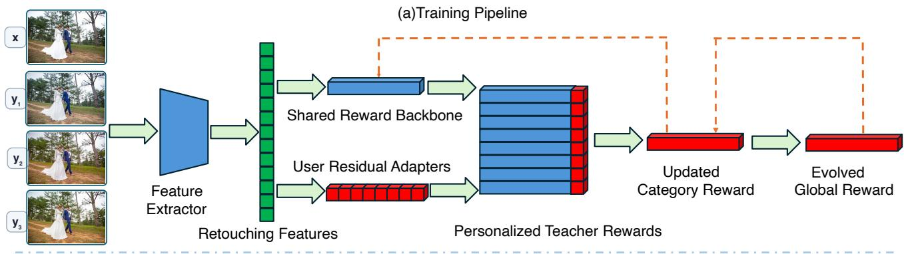
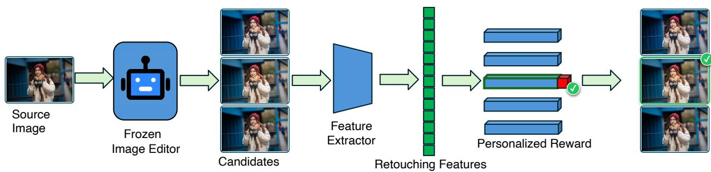
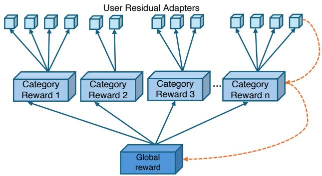
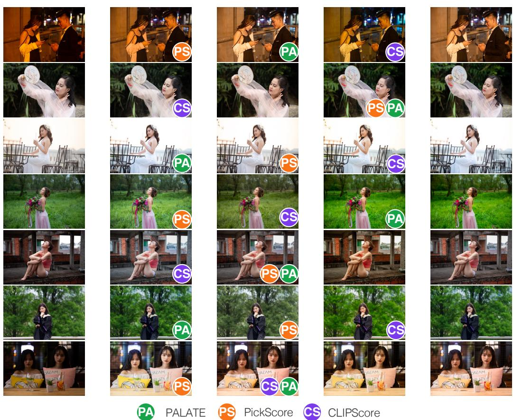
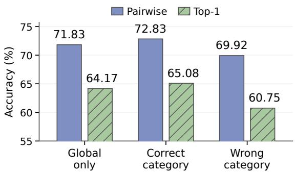
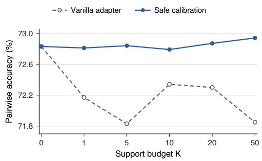

# PALATE: Personalized Aesthetic Learning through Adaptive Taste Evolution for Multi-User Portrait Retouching

Jingxuan Wang1,4, Yifan Mei2,4, Yuxia Niu3,4, Chaowan Jiao2,4, Qijin Shen4∗

1Harbin Institute of Technology 2Xiamen University 3Central South University 4MT Lab, Meitu Inc.

## Abstract

Automatic portrait retouching has advanced rapidly, yet its objective is inherently subjective: the same portrait admits multiple professionally valid results, and users disagree about which one is best. Most existing methods optimize a populationlevel aesthetic standard and therefore cannot capture individual taste, while fine-tuning a separate editing model for every user incurs prohibitive training, storage, and data costs. We propose PALATE, a shared reward-evolution framework that keeps the image editor fixed and instead personalizes the selection among retouched candidates of the same source portrait. PALATE decomposes the reward for each user into a global backbone shared by all users, category-level residuals shared by aesthetically similar users, and a lightweight user adapter, with anti-collapse regularizers keeping the three levels complementary.A cyclic dual-level distillation scheme first distills user-specific preferences into category rewards and then consolidates the resulting category-level knowledge into the global backbone, which is redistributed to initialize the next evolution round. In this way, the shared initialization improves progressively across rounds, enabling unseen users to be calibrated from only a few rankings. On expert-retouched candidates from PPR10K with held-out users and held-out images, PALATE attains 72.83% pairwise preference-prediction accuracy, surpassing all reward, aesthetic, and image-quality baselines, of which the strongest, PickScore, reaches 58.06%. Each new user costs only 512 bytes of user-specific parameters and millisecond-level scoring.

## Introduction

A single portrait admits multiple professionally valid retouchings—with warmer or cooler skin tones, stronger or lighter smoothing, and restrained or expressive color—but the preferred result varies across users. This subjectivity becomes increasingly important as portrait images serve as a primary means of self-presentation on visual social media, where users expect retouching results to reflect their individual aesthetics rather than a universal standard. Existing solutions force a trade-of between usability and personalization: professional tools such as Photoshop ofer fine-grained control but require substantial expertise, whereas consumer presets are easy to use but produce homogeneous results that fail to accommodate individual preferences. A seemingly direct remedy is to adapt the underlying editing model to each user (Zhu et al. 2025) with parameter-eficient modules such as adapters (Houlsby et al. 2019) or LoRA (Hu et al. 2022). For a large and growing user population, however, separately training, storing, and deploying user-specific editors is prohibitively expensive, and reliable adaptation demands considerable per-user data and computation.

We instead shift personalization from the editing model to the reward model. Rather than fine-tuning an editor for every user, we learn and iteratively refine a shared reward initialization that accumulates preference knowledge from historical users and enables rapid adaptation to unseen ones. Achieving this is nontrivial: user preferences mix transferable regularities with irreducible individual diferences, so a purely global reward washes out personal taste, whereas independently trained user rewards cannot reuse knowledge across users.

We therefore propose PALATE, a hierarchical rewardlearning framework with cyclic dual-level distillation for personalized portrait-retouching candidate selection, illustrated in Figure 1. PALATE decomposes the personalized reward into three levels: a global backbone that captures aesthetic knowledge shared across users, category-level residuals that model preference patterns shared by aesthetically similar users, and lightweight user adapters that encode individual variations. To keep this hierarchy meaningful, a dualconstraint mechanism keeps each adapter informative and distinguishable in the shared preference space, preventing user representations from collapsing toward a few dominant solutions.

As shown in the upper part of Figure 1, preference knowledge is consolidated through two distillation stages. Userlevel rewards are first distilled into their category models, turning individual feedback into reusable category-level preference knowledge; category knowledge is then consolidated into the global backbone, which is redistributed to initialize the next round of category and user adaptation. Through this cycle, the shared reward continually accumulates and reuses multi-user knowledge instead of repeatedly adapting from a static initialization.

For an unseen user, the evolved backbone provides a robust initialization: the best-matching category reward is selected from a small support set, and only a lightweight user adapter is optimized. PALATE thus serves every user with one frozen editor, one cyclically evolving shared reward, and a few hun-

(b) Inference Pipeline  
  
Figure 1: Overview of PALATE. (a) During training, a source portrait and its retouched candidates are encoded into retouching features. A shared reward backbone and user residual adapters jointly form personalized teacher rewards. User-level preference knowledge is first distilled within each aesthetic category to update the corresponding category reward, after which category rewards are consolidated into an evolved global reward. The evolved rewards are redistributed to initialize the next round of category modeling and user adaptation. (b) During inference, a frozen image editor generates multiple retouched candidates for a source portrait, and a few-shot calibrated personalized reward ranks the candidates and selects the result that best matches the target user’s preference.

dred bytes of per-user state.

Our main contributions are as follows:

1. We propose a global–category–user hierarchical reward architecture that separates shared aesthetic knowledge, category-level preference patterns, and individual residuals.

2. We introduce a dual-constraint mechanism that keeps user adapters informative yet mutually distinguishable, mitigating representation collapse across users.

3. We develop a cyclic dual-level distillation scheme that consolidates knowledge from users to categories and from categories to the global backbone, yielding progressively stronger shared initializations for few-shot adaptation to unseen users.

## Related Work

## Portrait Retouching and Controllable Image Editing

Learning-based photo retouching was initially formulated as learning a mapping from source images to expert references, as exemplified by FiveK (Bychkovsky et al. 2011). PPR10K (Liang et al. 2021) extends this paradigm to portraits with human-region masks and multiple professional retouches. Subsequent methods improve eficiency, interpretability, and regional control through bilateral transforms, white-box operators, local parametric filters, learnable lookup tables, and region-specific color filters (Gharbi et al. 2017; Hu et al. 2018; Moran et al. 2020; Zeng et al. 2022; He et al. 2020; Ouyang et al. 2023; Xie et al. 2023).

More recent studies shift attention from fixed enhancement mappings to flexible control. Conditional Image Repainting methods progressively explore semantic bridging, unified multi-condition fusion, illumination-aware repainting, and open condition mixtures (Weng et al. 2020; Sun et al. 2022; Tang et al. 2023; Weng and Shi 2024; Weng et al. 2025). Instruction-guided editors such as InstructPix2Pix (Brooks, Holynski, and Efros 2023) and MagicBrush (Zhang et al. 2023) translate natural-language requests into visual modifications, while HIVE (Zhang et al. 2024b) further incorporates human feedback to align editing results. Afective Image Filter (Weng et al. 2023) and its generative-prior extension (Zhang et al. 2026a) map emotional text to image adjustments, while AIEdiT (Zhang et al. 2026b) controls multiple afective factors from fine-grained descriptions. PIF (Zhu et al. 2025) instead extracts and transfers photographic styles from reference images. Despite their flexibility, these methods rely on explicit conditions to manipulate images, rather than learning a persistent user-specific reward for selecting among professionally retouched candidates.

## Personalized Visual Preference

Existing preference models difer in whose judgment they represent. ImageReward (Xu et al. 2023) and HPS (Wu et al. 2023b) aggregate comparisons into general humanpreference scores, while Pick-a-Pic (Kirstain et al. 2023) and HPS v2 (Wu et al. 2023a) enlarge the crowd-sourced preference data and evaluation protocols available for training such models. MPS (Zhang et al. 2024a) further separates preference into multiple evaluation dimensions. None of these general-purpose models maintains a persistent representation of individual taste.

Personalized aesthetic models address this limitation through residual corrections (Ren et al. 2017), rich user and image attributes (Yang et al. 2022), or user-adaptive meta-learning (Zhu et al. 2022). Recent preference-learning methods also adapt generative models from limited pairwise feedback (Dang et al. 2025), while variational preference learning (Poddar et al. 2024) and low-rank reward modeling (Bose et al. 2025) represent heterogeneous users with latent variables or user-specific combinations of shared reward components. Most nevertheless connect a shared model directly to individual parameters, without explicitly capturing preference regularities recurring across aesthetically similar users.

## Multi-User Knowledge Transfer

Knowledge distillation (Hinton, Vinyals, and Dean 2015) transfers predictive structure between models, including intermediate representations rather than only final predictions, as in FitNets (Romero et al. 2015). Deep Mutual Learning (Zhang et al. 2018) enables collaborative supervision, whereas Born-Again Networks (Furlanello et al. 2018) and Knowledge Evolution (Taha, Shrivastava, and Davis 2021) repeatedly refine knowledge across successive generations. Multi-teacher methods further combine intermediate teacher assistants (Son et al. 2021) or dynamically selected teacher groups (Choi et al. 2023) to improve knowledge transfer.

Beyond centralized distillation, FedDF (Lin et al. 2020) consolidates heterogeneous client predictions into a global model, and multi-teacher distillation (Wen et al. 2024) has been used to preserve knowledge across incremental learning stages. These methods generally seek a stronger consensus student. In personalized aesthetics, however, disagreement may encode meaningful taste rather than noise: direct aggregation can erase user diferences, whereas isolated user models cannot convert recurring preferences into shared knowledge. PALATE addresses this combined gap through hierarchical cyclic reward transfer that preserves group-level variation while improving the shared model across rounds.

## Method

PALATE is a personalized candidate-selection framework for portrait retouching. As summarized in Figure 1, it models retouching preferences at three granularities: a global backbone capturing broadly transferable retouching knowledge, a category residual preserving the distinctive patterns of each preference category, and a lightweight user adapter calibrating the reward to an individual user. Anti-collapse regularizers at the category and user levels keep the learned representations from degenerating into similar solutions, so each component retains complementary preference knowledge. A cyclic dual-level distillation strategy then consolidates preference knowledge across the user, category, and global levels, letting the reward hierarchy evolve over successive rounds.

## Ranking-Based Preference Supervision

For each source portrait x, PPR10K (Liang et al. 2021) provides three expert-retouched candidates $\bar { y _ { x } } = \{ y _ { 1 } , y _ { 2 } , \bar { y } _ { 3 } \}$ A user u from preference category $c ( u )$ ranks them as $y _ { \pi _ { 1 } } \succ _ { u , x } y _ { \pi _ { 2 } } \succ _ { u , x } y _ { \pi _ { 3 } }$ . Each ranking induces three pairwise preference tuples $z = \bar { ( } x , y ^ { + } , y ^ { - } , u , c ( u ) \backslash$ ) with $y ^ { + } \succ _ { u , x } y ^ { - }$ and the resulting collection $\mathcal { D } _ { \mathrm { p r e f } }$ constitutes our supervision. Ranking triplets are a low-burden interface: ordering three candidates takes seconds, yet every ranking yields three mutually consistent pairwise constraints. All comparisons induced by the same $( u , x )$ ranking are kept in the same split to avoid information leakage.

## Hierarchical Residual Reward Modeling

Given a source portrait x and a retouched candidate $y ,$ the global backbone $F _ { \theta _ { G } ^ { t } }$ maps the feature vector $\Phi ( x , y )$ to a scalar reward $\bar { G } ^ { t } ( x , \bar { y } )$ and an ℓ -normalized preference representation $h ^ { t } ( x , \dot { y } )$ , where t denotes the evolution round and Φ extracts portrait-appearance and source–edit features. The personalized reward for user u is

$$
\begin{array} { r } { R _ { u } ^ { t } ( x , y ) = G ^ { t } ( x , y ) + C _ { c ( u ) } ^ { t } ( x , y ) + e _ { u } ^ { \top } h ^ { t } ( x , y ) , } \end{array}\tag{1}
$$

where $C _ { c ( u ) } ^ { t }$ is the residual reward of category $c ( u )$ and $e _ { u }$ is a low-dimensional user residual; at deployment, PALATE returns arg $\mathrm { m a x } _ { y \in \mathcal { y } _ { x } } R _ { u } ^ { t } ( x , y )$ . For a preference tuple $z _ { n } =$ $( x _ { n } , y _ { n } ^ { + } , y _ { n } ^ { - } , u _ { n } , c _ { n } )$ , let $\delta _ { f } ( z _ { n } )$ denote the pairwise margin predicted by reward function $f$ . We define the Bradley– Terry ranking loss (Bradley and Terry 1952) and the margindistillation distance as

$$
\begin{array} { r c l } { { \delta _ { f } ( z _ { n } ) } } & { { = } } & { { f ( x _ { n } , y _ { n } ^ { + } ) - f ( x _ { n } , y _ { n } ^ { - } ) , } } \end{array}
$$

$$
\begin{array} { r c l } { \displaystyle \mathcal { L } _ { \mathrm { r a n k } } ( \mathcal { D } ; f ) } & { = } & { \displaystyle - \frac { 1 } { | \mathcal { D } | } \sum _ { z _ { n } \in \mathcal { D } } \log \sigma \big ( \delta _ { f } ( z _ { n } ) \big ) , } \\ { \displaystyle \mathrm { D } _ { \Delta } ( f , g ; \mathcal { D } ) } & { = } & { \displaystyle \frac { 1 } { | \mathcal { D } | } \sum _ { z _ { n } \in \mathcal { D } } \big ( \delta _ { f } ( z _ { n } ) - \delta _ { g } ( z _ { n } ) \big ) ^ { 2 } . } \end{array}\tag{2}
$$

## Hierarchical Residual Geometry Regularization

The additive reward decomposition alone does not guarantee a meaningful hierarchy. Shared preference patterns may be absorbed by lower-level residuals, while user representations may collapse toward a few dominant directions. We therefore regularize the residual geometry at both the user and category levels.

Centered user residuals. For each training user u, we maintain $P$ bootstrap latent codes $q _ { u , p } \in \mathbf { R } ^ { d _ { q } }$ . Let $\mathcal { U } _ { c }$ denote the users assigned to category $c , \bar { q } _ { c }$ their mean latent code, and $A _ { c }$ the map from latent codes to the preference space. The user residual is

$$
e _ { u } = \frac { s } { P } \sum _ { p = 1 } ^ { P } A _ { c } ^ { \top } \left( q _ { u , p } - \bar { q } _ { c } \right) ,\tag{3}
$$

where s controls the residual scale. Category-wise centering prevents components shared by all users of a category from being re-encoded by their adapters; it also gives the hierarchy a clean interpretation: the category reward captures the collective taste of a group, and each adapter encodes only a user’s deviation from it. To preserve diversity among user representations, we apply SIGReg (Balestriero and LeCun 2025) to random one-dimensional projections. Let $Z _ { c , \ell }$ collect the projections $\theta _ { \ell } ^ { \top } ( q _ { u , p } - \bar { q } _ { c } )$ of all centered codes in category c onto a random unit direction $\theta _ { \ell } .$ . The user-level regularizer is

$$
\mathcal { L } _ { \mathrm { u s r } } = \frac { 1 } { C L } \sum _ { c = 1 } ^ { C } \sum _ { \ell = 1 } ^ { L } D _ { \mathrm { E P } } \left( Z _ { c , \ell } , \mathcal { N } ( 0 , 1 ) \right) ,\tag{4}
$$

where $D _ { \mathrm { E P } }$ denotes the Epps–Pulley discrepancy (Epps and Pulley 1983). During user fitting, the global and category rewards remain fixed, and the user codes are optimized with $\mathcal { L } _ { \mathrm { r a n k } } + \lambda _ { \mathrm { u s r } } \mathcal { L } _ { \mathrm { u s r } } .$

Category residual geometry. We characterize each category on a fixed training-only anchor set $\begin{array} { r l } { B } & { { } = } \end{array}$ $\{ ( x _ { m } , \dot { y } _ { m } ^ { + } , y _ { m } ^ { - } ) \} _ { m = 1 } ^ { M }$ through its residual-margin signature $v _ { c } \in \mathbf { R } ^ { M }$ , with entries $\bar { [ v _ { c } ] _ { m } } = \bar { C _ { c } } ( x _ { m } , y _ { m } ^ { + } ) - \bar { C _ { c } } ( \bar { x _ { m } } , y _ { m } ^ { - } )$ Let $\widetilde { v } _ { c }$ denote the signature centered across categories and $\widehat { v } _ { c }$ its $\ell _ { 2 }$ -normalized counterpart, stacked as the rows of $\widehat { V }$ . The category regularizer is

$$
\mathcal { L } _ { \mathrm { c a t } } = \frac { 1 } { C } \sum _ { c = 1 } ^ { C } \left[ \tau - \frac { \| \widetilde { v } _ { c } \| _ { 2 } } { \sqrt { M } } \right] _ { + } + \left\| \widehat { V } \widehat { V } ^ { \top } - S _ { C } \right\| _ { F } ^ { 2 } ,\tag{5}
$$

where $S _ { C }$ is the Gram matrix of a regular simplex, with diagonal entries equal to 1 and of-diagonal entries equal t $) - 1 / ( C - 1 )$ . The first term prevents category residuals from vanishing, whereas the second encourages diferent categories to occupy distinct directions. Geometrically, the regular simplex is the configuration in which $C$ unit vectors are maximally and equally separated—the geometry that also emerges in neural collapse (Papyan, Han, and Donoho 2020)—so the regularizer drives the categories toward equally distinct preference directions without privileging any single group. This regularizer is added to categorylevel training with coeficient $\lambda _ { a }$

## Cyclic Dual-Level Reward Distillation

PALATE evolves the hierarchy cyclically from users to categories, from categories to the global model, and back to categories. All three steps instantiate one distill-and-anchor objective. For a student reward $f ,$ a teacher reward $T ,$ , a sample set $\mathcal { D } ,$ , and the student’s previous state $f ^ { - }$ , we minimize

$$
\mathcal { I } = \mathcal { L } _ { \mathrm { r a n k } } ( \mathcal { D } ; f ) + \lambda \mathrm { D } _ { \Delta } ( f , T ; \mathcal { D } ) + \mu \Omega ( f , f ^ { - } ) ,\tag{6}
$$

  
Figure 2: Global–category–user cyclic reward evolution in PALATE. Shared knowledge is distributed from the global reward to category rewards and user adapters, while personalized knowledge is distilled in the reverse direction, from users to categories and then to the global reward. The evolved global reward is redistributed to initialize the next evolution round.

where $\mathcal { L } _ { \mathrm { r a n k } }$ and $\mathrm { D } _ { \Delta }$ are defined in Eq. (2) and Ω penalizes parameter drift from the previous state. The ranking term anchors learning to observed preferences, margin distillation transfers the teacher’s preference structure, and the drift penalty stabilizes the cycle; the three transfer steps difer only in their teacher, sample set, and anchor.

User-to-category distillation. With $G ^ { t }$ and $C _ { c } ^ { t }$ fixed, the fitted user residuals define personalized teachers $\bar { T } _ { u } ^ { t } ( x , y ) =$ $G ^ { t } ( x , y ) + C _ { c ( u ) } ^ { t } ( x , y ) + e _ { u } ^ { \top } h ^ { t } ( x , y )$ . Each category residual is updated by

$$
C _ { c } ^ { t , + } = \underset { C _ { c } } { \arg \operatorname* { m i n } } \frac { 1 } { | \mathcal { U } _ { c } | } \sum _ { u \in \mathcal { U } _ { c } } \mathcal { I } \big ( G ^ { t } { + } C _ { c } ; T _ { u } ^ { t } , \mathcal { D } _ { u , c } ^ { U C } \big ) + \lambda _ { a } \mathcal { L } _ { \mathrm { c a t } } ,\tag{7}
$$

where the ranking term inside $\mathcal { I }$ is shared over the categorylevel union $\mathcal { D } _ { c } ^ { U C }$ and $( \lambda , \mu )$ instantiate as $( \lambda _ { u } , \lambda _ { p } )$ . Margin distillation thus transfers preference patterns shared by the users of a category.

Category-to-global consolidation and feedback. The evolved backbone $G ^ { t + 1 }$ minimizes Eq. (6) with student $G ,$ the C category teachers $G ^ { t } { + } C _ { c } ^ { t , + }$ , each weighted by $\lambda _ { c } / C$ on $\mathcal { D } _ { c } ^ { C G }$ , and drift penalty $\lambda _ { g } \Omega ( \bar { G } , { \cal G } ^ { t } )$ ; equal category weighting prevents categories with more users or samples from dominating the shared backbone. The category residuals are then rebased on the evolved global reward: each $C _ { c } ^ { t + 1 }$ minimizes Eq. (6) with student $\Breve { G } ^ { t + 1 } + C _ { c }$ , teacher $G ^ { t } + C _ { c } ^ { t , + }$ samples $\dot { \mathcal { D } } _ { c } ^ { \dot { G } C }$ , weights $( \lambda , \mu ) = ( \lambda _ { b } , \lambda _ { p } )$ , and $\lambda _ { a } \mathcal { L } _ { \mathrm { c a t } }$ added, which preserves category-specific margins after the global reference changes. We carry $G ^ { t + 1 }$ and $\mathbf { \bar { C } } ^ { t + 1 } = \{ C _ { c } ^ { t + 1 } \} _ { c = 1 } ^ { C }$ into the next evolution round. To reduce teacher–student leakage, the source portraits used for user fitting, user-tocategory distillation, and category-to-global consolidation are assigned to disjoint training subsets.

## Safe Calibration for New Users

At test time, the evolved global and category rewards are frozen. Given a support set $\mathcal { S } _ { u }$ containing a few rankings

Edit B  
  
Figure 3: Qualitative comparison of candidate-selection results. For each source portrait, three expert-retouched candidates are evaluated by PALATE, PickScore, and CLIPScore. The rightmost column shows the candidate selected by the user.

from a new user, PALATE estimates only a low-dimensional user residual by minimizing the Bradley–Terry objective in Eq. (2) with an $\ell _ { 2 }$ penalty:

$$
\widehat { e } _ { u } = \underset { e } { \arg \operatorname* { m i n } } \mathcal { L } _ { \mathrm { { r a n k } } } \left( \boldsymbol { S } _ { u } ; \boldsymbol { G } + \boldsymbol { C } _ { c ( u ) } + e ^ { \top } \boldsymbol { h } \right) + \beta \| e \| _ { 2 } ^ { 2 } .\tag{8}
$$

If the new user’s category is unknown, we independently fit a user residual under every category and select the category bc(u) with the lowest regularized support loss. We call the resulting procedure safe calibration: the residual is initialized from the category posterior implied by $ { \boldsymbol { S } } _ { u }$ rather than from zero, its norm is constrained throughout optimization, and a budget-dependent shrinkage factor scales the fitted residual, so smaller support sets induce more conservative updates. The final calibrated reward is $\widehat { R } _ { u } ( x , y ) = G ( x , y ) + C _ { \widehat { c } ( u ) } ( x , y ) + \widehat { e } _ { u } ^ { \top } h ( x , y )$ . Adapting PALATE to a new user therefore updates neither the global backbone nor the category residuals nor the underlying image editor.

## Experiments

## Experimental Setup

Baselines. We compare PALATE with CLIPScore (Hessel et al. 2021), PickScore (Kirstain et al. 2023), HPS v2 (Wu et al. 2023a), SigLIP (Zhai et al. 2023), CLIP-IQA (Wang, Chan, and Loy 2023), CLIP similarity (Radford et al. 2021), FGAesQ (Yang et al. 2026), and Qwen2.5-VL-based EditReward (Wu et al. 2026; Bai et al. 2025). We also evaluate global-only and wrong-category routing with the same backbone. Few-shot calibration is compared with an unconstrained, zero-initialized user adapter. All methods share candidate bundles, held-out splits, support sets, and budgets K ∈ {0, 1, 5, 10, 20, 50}.

Model Architecture. For each source–candidate pair, we cache a 195-dimensional vector of color, edge, editdiference, quality, and artifact cues from the full image and portrait region. Its eight semantic groups form the tokens of a two-layer Pre-LN Transformer (Vaswani et al. 2017) with four heads and hidden size 128. The normalized [CLS] embedding h(x, y) is scored by a scalar head; the 128-dimensional user residual enters only as $e _ { u } ^ { \top } h ( x , y )$ in Eq. (1).

Datasets and Evaluation Protocol. Our benchmark uses 1,000 PPR10K portraits (Liang et al. 2021), each with three expert retouches and a portrait mask. Twenty-five volunteers rank every bundle under five aesthetic styles, yielding 25,000 rankings and 75,000 pairwise comparisons. Users are split

<table><tr><td></td><td>Pairwise Acc.</td><td></td><td>Top-1 MRR NDCG@3</td><td></td><td>Exact Rank Hit@2</td><td></td><td>Kendall Spearman</td><td></td><td>Macro Pairwise</td><td>Worst-prof. Pairwise</td><td>Macro Top-1</td><td>Worst-prof. Top-1</td></tr><tr><td colspan="2">Method</td><td></td><td></td><td></td><td></td><td></td><td>T</td><td>ρ</td><td></td><td></td><td></td><td></td></tr><tr><td colspan="2">Aesthetic and quality assessment FGAesQ</td><td>38.31</td><td>21.1752.24</td><td>73.01</td><td>9.17</td><td>49.92</td><td>-0.234</td><td>-0.262</td><td>39.60</td><td>35.72</td><td>23.08</td><td>17.33</td></tr><tr><td>CLIP-IQA</td><td></td><td>43.72</td><td>25.92 56.92</td><td>75.92</td><td>13.42</td><td>59.42</td><td>-0.097</td><td>-0.112</td><td>43.94</td><td>42.33</td><td>26.21</td><td>24.00</td></tr><tr><td colspan="2">Vision–language similarity</td><td></td><td></td><td></td><td></td><td></td><td></td><td></td><td></td><td></td><td></td><td></td></tr><tr><td>CLIP image similarity</td><td></td><td>41.17</td><td>22.2554.53</td><td>74.39</td><td>12.67</td><td>58.21</td><td>-0.148</td><td>-0.165</td><td>41.28</td><td>40.00</td><td>22.96</td><td>20.83</td></tr><tr><td>SigLIP similarity</td><td></td><td>48.67</td><td>35.83 62.69</td><td>78.75</td><td>18.38</td><td>65.88</td><td>0.002</td><td>0.000</td><td>48.78</td><td>47.67</td><td>36.42</td><td>34.67</td></tr><tr><td>CLIPScore</td><td></td><td>48.78</td><td>29.67 60.23</td><td>78.16</td><td>15.29</td><td>66.62</td><td>0.004</td><td>0.010</td><td>48.69</td><td>45.33</td><td>29.67</td><td>27.00</td></tr><tr><td colspan="2">Human-preference reward models</td><td></td><td></td><td></td><td></td><td></td><td></td><td></td><td></td><td></td><td></td><td></td></tr><tr><td>HPS v2</td><td></td><td>37.14</td><td>22.4254.08</td><td>73.58</td><td>10.75</td><td>53.62</td><td>-0.216</td><td>-0.235</td><td>37.96</td><td>34.50</td><td>23.54</td><td>20.00</td></tr><tr><td>PickScore</td><td></td><td>58.06</td><td>38.83 66.85</td><td>82.08</td><td>25.71</td><td>76.75</td><td>0.189</td><td>0.207</td><td>57.56</td><td>52.67</td><td>38.17</td><td>35.50</td></tr><tr><td colspan="2">Editing-specific reward models EditReward,</td><td></td><td></td><td></td><td></td><td></td><td></td><td></td><td></td><td></td><td></td><td></td></tr><tr><td>generic prompt</td><td></td><td>46.06</td><td>27.0858.56</td><td>76.83</td><td>14.92</td><td>65.12</td><td>-0.051</td><td>-0.044</td><td>46.75</td><td>44.67</td><td>27.79</td><td>25.67</td></tr><tr><td>EditReward, profile-conditioned prompt</td><td></td><td>48.78</td><td>32.33 61.30</td><td>78.31</td><td>18.58</td><td>66.42</td><td>0.004</td><td>0.009</td><td>48.94</td><td>43.50</td><td>32.92</td><td>26.50</td></tr><tr><td>PALATE (ours)</td><td></td><td>72.83</td><td>65.08 82.20</td><td>90.26</td><td>42.25</td><td>89.96</td><td>0.485</td><td>0.533</td><td>71.53</td><td>64.67</td><td>62.04</td><td>52.50</td></tr></table>

Table 1: Comparison under the same held-out users and source images. All metrics except Kendall’s τ and Spearman’s ρ are percentages. Macro scores average user profiles equally; worst-profile scores report the lowest-performing profile. Best results are bold.

  
Figure 4: Deployment modes under the user–image doubleheld-out protocol. Correct routing improves global-only scoring; wrong routing degrades it.

17/2/6 and images 700/100/200 for joint leave-user-out and leave-image-out training, validation, and testing; the test set contains 1,200 rankings. We report pairwise and bundlelevel measures, including NDCG@3 (Järvelin and Kekäläinen 2002). Few-shot support is drawn only from the 800 non-query images, and diferences use unrounded values.

Training Details. The global reward is pretrained for three epochs on expert-retouch-versus-source comparisons. We then run five evolution rounds: user-teacher fitting (50 epochs, 10 examples per user), user-to-category distillation (three repetitions of two epochs), category-to-global consolidation (two epochs), and global broadcast (one epoch). We select models by zero-shot validation accuracy and run all experiments on four NVIDIA A800 GPUs.

  
Figure 5: Few-shot user calibration under diferent support budgets. Safe calibration is stable; the vanilla adapter degrades.

## Comparison with Existing Reward Models

PALATE leads every scorer under the user–image doubleheld-out protocol (Table 1), consistent with the selections in Figure 3. It reaches 72.83% pairwise and 65.08% Top-1 accuracy; the strongest baseline, PickScore, reaches 58.06% pairwise accuracy. Profile-conditioned EditReward improves over its generic prompt (48.78% versus 46.06%) but remains 24.05 points behind PALATE. Textual profiles therefore help, yet do not replace task-aligned preference evidence accumulated across users.

## Efect of Hierarchical Preference Modeling

The global reward obtains 71.83% pairwise and 64.17% Top-1 accuracy (Figure 4). Correct routing raises them to 72.83% and 65.08%, whereas wrong routing reduces them to 69.92% and 60.75%. The 2.92-point routing gap has an image-cluster bootstrap (Efron 1979) 95% interval of $[ 1 . 5 0 , 4 . 3 9 ]$ and an exact McNemar (McNemar 1947) $p = \bar { 8 . 2 4 } \times 1 0 ^ { - 7 }$ . Category rewards thus encode reusable group preference rather than arbitrary extra capacity.

<table><tr><td>Persistent storage Component</td><td>Parameters</td><td>Storage</td></tr><tr><td>Global reward</td><td>309,511</td><td>1.23 MiB</td></tr><tr><td>Five category rewards</td><td> $5 \times 3 0 9 { , } 5 1 1$ </td><td>6.08 MiB</td></tr><tr><td>One user adapter</td><td>128</td><td>512 B</td></tr><tr><td></td><td></td><td></td></tr><tr><td>Computation time Operation</td><td>Time</td><td>Setting</td></tr><tr><td>Global scoring</td><td> $2 . 1 8 \pm 0 . 6 4$ </td><td>ms 0.189 ms/cand.  $( B = 8 )$ </td></tr><tr><td>Global + category</td><td> $3 . 3 1 \pm 0 . 6 0$ </td><td>ms 0.488 ms/cand.  $( B = 8 )$ </td></tr><tr><td>Direct adaptation</td><td>1.99 s/user</td><td>1.44–3.95 s range</td></tr><tr><td></td><td></td><td></td></tr></table>

Table 2: Storage and deployment cost measured on one NVIDIA A800-SXM4-80GB GPU with cached 195- dimensional input features. The shared PALATE state, consisting of one global and five category rewards, occupies 7.31 MiB. The adaptation timing is measured for the vanilla user adapter at $K = 1 0$ with 50 optimization steps and is reported as its mean and observed range over six test users.

## Safe Few-Shot User Calibration

The vanilla adapter falls from 72.83% at K = 0 to 71.85% at K = 50, while safe calibration remains stable and reaches 72.94% (Figure 5). Its K = 50 gain over zero-shot is 0.111 points, with a user-cluster bootstrap 95% interval of [0.019, 0.204]. Category-posterior initialization, norm constraints, and budget-dependent shrinkage therefore turn additional feedback into a small but reliable gain rather than overfitting.

## Deployment Eficiency

PALATE stores one user in 128 FP32 values (512 B), complementing parameter-eficient adaptation (Houlsby et al. 2019; Hu et al. 2022) with substantially smaller persistent state (Table 2). The shared rewards occupy 7.31 MiB. Globalplus-category scoring costs $3 . 3 1 \pm 0 . { \overset { } { 6 0 } }$ ms per candidate at batch size one and 0.488 ms at batch size eight, keeping a three-candidate bundle below two milliseconds at the latter setting. With 10,000 users, the shared rewards and all user states require 12.19 MiB; even one million adapters remain below 500 MiB. Personalization therefore scales with users through byte-scale states rather than duplicated reward models.

## Ablation Study

Category semantics and source/edit cues are the dominant factors (Table 3). Removing user-to-category distillation loses 1.33 points (95% image-cluster interval [0.50, 2.22]); shufling categories loses 2.69 points, more than resetting category rewards (0.22 points). Hence the group semantics matter more than the initial residual values. Removing source or edit tokens reduces accuracy to 70.89% and 70.17%, respectively, while removing both anti-collapse terms yields

<table><tr><td colspan="2">Variant Pairwise acc. (%)</td></tr><tr><td>Full PALATE</td><td>72.83</td></tr><tr><td>Cyclic knowledge flow w/o user-to-category distillation</td><td>71.50</td></tr><tr><td>w/o category-to-global distillation w/o global broadcast</td><td>72.72 72.03</td></tr><tr><td>w/o double teacher One inner step</td><td>72.33 72.17</td></tr><tr><td>Reset category rewards Shuffled categories</td><td>72.61 70.14</td></tr><tr><td></td><td></td></tr><tr><td>Input representations</td><td></td></tr><tr><td>w/o source tokens</td><td>70.89</td></tr><tr><td>w/o edit tokens</td><td>70.17</td></tr><tr><td>w/o portrait tokens</td><td>72.03</td></tr><tr><td>Anti-collapse regularization</td><td></td></tr><tr><td></td><td></td></tr><tr><td>w/o category anti-collapse</td><td>72.06</td></tr><tr><td>w/o both anti-collapse terms</td><td>71.25</td></tr></table>

Table 3: Ablation results under the same user–image doubleheld-out protocol. All variants are selected using the validation set. The three blocks evaluate cyclic knowledge flow, input representations, and anti-collapse regularization, respectively. Pairwise accuracy is reported in percent.

71.25%. Category-to-global distillation, global broadcast, and the double teacher each contribute stably, with changes of at most 0.81 points. These results locate the primary gains in meaningful preference groups, edit-aware evidence, and stable representation learning, with cyclic refinements providing efective complementary improvements. Portrait-mask tokens also provide consistent benefits: removing them decreases accuracy to 72.03%,indicating that global cues explain most rankings while localized face and skin evidence remains additionally useful. Category anti-collapse alone contributes 0.77 points, and using both anti-collapse terms together yields a total improvement of 1.58 points, demonstrating their complementary roles. Among cyclic components, user-to-category transfer is the most influential, efectively distilling individual supervision into reusable category knowledge.

## Conclusion

PALATE personalizes portrait-retouch selection through a global–category–user reward hierarchy that cyclically shares knowledge while retaining a 512-byte state per user. Without modifying the editor, anti-collapse regularization preserves distinct preference geometry. On the user–image doubleheld-out PPR10K benchmark, PALATE reaches 72.83% pairwise accuracy and outperforms all baselines. Routing and ablations attribute the gain to meaningful preference groups, while constrained calibration safely incorporates few-shot feedback. Together with millisecond-level scoring, this combination of shared evolution and byte-scale user state ofers a practical design for subjective visual tasks in which separate per-user models are infeasible. Future work will infer categories from feedback and couple the reward with candidate generation.

## References

Bai, S.; Chen, K.; Liu, X.; Wang, J.; Ge, W.; Song, S.; Dang, K.; Wang, P.; Wang, S.; Tang, J.; Zhong, H.; Zhu, Y.; Yang, M.; Li, Z.; Wan, J.; Wang, P.; Ding, W.; Fu, Z.; Xu, Y.; Ye, J.; Zhang, X.; Xie, T.; Cheng, Z.; Zhang, H.; Yang, Z.; Xu, H.; and Lin, J. 2025. Qwen2.5-VL Technical Report. arXiv:2502.13923.

Balestriero, R.; and LeCun, Y. 2025. LeJEPA: Provable and Scalable Self-Supervised Learning Without the Heuristics. arXiv:2511.08544.

Bose, A.; Xiong, Z.; Chi, Y.; Du, S. S.; Xiao, L.; and Fazel, M. 2025. LoRe: Personalizing LLMs via Low-Rank Reward Modeling. arXiv:2504.14439.

Bradley, R. A.; and Terry, M. E. 1952. Rank Analysis of Incomplete Block Designs: I. The Method of Paired Comparisons. Biometrika, 39(3/4): 324–345.

Brooks, T.; Holynski, A.; and Efros, A. A. 2023. InstructPix2Pix: Learning to Follow Image Editing Instructions. In Proceedings of the IEEE/CVF Conference on Computer Vision and Pattern Recognition (CVPR), 18392–18402.

Bychkovsky, V.; Paris, S.; Chan, E.; and Durand, F. 2011. Learning Photographic Global Tonal Adjustment with a Database of Input/Output Image Pairs. In Proceedings of the IEEE Conference on Computer Vision and Pattern Recognition (CVPR).

Choi, J.; Cho, H.; Cheung, S.; and Hwang, W. 2023. ORC: Network Group-Based Knowledge Distillation Using Online Role Change. In Proceedings of the IEEE/CVF International Conference on Computer Vision (ICCV), 17381–17390.

Dang, M.; Singh, A.; Zhou, L.; Ermon, S.; and Song, J. 2025. Personalized Preference Fine-tuning of Difusion Models. In Proceedings of the IEEE/CVF Conference on Computer Vision and Pattern Recognition (CVPR).

Efron, B. 1979. Bootstrap Methods: Another Look at the Jackknife. The Annals of Statistics, 7(1): 1–26.

Epps, T. W.; and Pulley, L. B. 1983. A Test for Normality Based on the Empirical Characteristic Function. Biometrika, 70(3): 723–726.

Furlanello, T.; Lipton, Z.; Tschannen, M.; Itti, L.; and Anandkumar, A. 2018. Born Again Neural Networks. In Proceedings ofthe 35th International Conference on Machine Learning, volume 80, 1607– 1616. PMLR.

Gharbi, M.; Chen, J.; Barron, J. T.; Hasinof, S. W.; and Durand, F. 2017. Deep Bilateral Learning for Real-Time Image Enhancement. ACM Transactions on Graphics, 36(4).

He, J.; Liu, Y.; Qiao, Y.; and Dong, C. 2020. Conditional Sequential Modulation for Eficient Global Image Retouching. In Proceedings ofthe European Conference on Computer Vision (ECCV).

Hessel, J.; Holtzman, A.; Forbes, M.; Le Bras, R.; and Choi, Y. 2021. CLIPScore: A Reference-Free Evaluation Metric for Image Captioning. In Proceedings of the 2021 Conference on Empirical Methods in Natural Language Processing (EMNLP), 7514–7528.

Hinton, G.; Vinyals, O.; and Dean, J. 2015. Distilling the Knowledge in a Neural Network. arXiv:1503.02531.

Houlsby, N.; Giurgiu, A.; Jastrzebski, S.; Morrone, B.; De Laroussilhe, Q.; Gesmundo, A.; Attariyan, M.; and Gelly, S. 2019. Parameter-Eficient Transfer Learning for NLP. In Proceedings of the 36th International Conference on Machine Learning, volume 97, 2790–2799. PMLR.

Hu, E. J.; Shen, Y.; Wallis, P.; Allen-Zhu, Z.; Li, Y.; Wang, S.; Wang, L.; and Chen, W. 2022. LoRA: Low-Rank Adaptation of Large Language Models. In Proceedings ofthe 10th International Conference on Learning Representations (ICLR).

Hu, Y.; He, H.; Xu, C.; Wang, B.; and Lin, S. 2018. Exposure: A White-Box Photo Post-Processing Framework. ACM Transactions on Graphics, 37(2).

Järvelin, K.; and Kekäläinen, J. 2002. Cumulated Gain-Based Evaluation of IR Techniques. ACM Transactions on Information Systems, 20(4): 422–446.

Kirstain, Y.; Polyak, A.; Singer, U.; Matiana, S.; Penna, J.; and Levy, O. 2023. Pick-a-Pic: An Open Dataset of User Preferences for Text-to-Image Generation. In Advances in Neural Information Processing Systems, volume 36.

Liang, J.; Zeng, H.; Cui, M.; Xie, X.; and Zhang, L. 2021. PPR10K: A Large-Scale Portrait Photo Retouching Dataset with Human-Region Mask and Group-Level Consistency. In Proceedings ofthe IEEE/CVF Conference on Computer Vision and Pattern Recognition (CVPR), 653–661.

Lin, T.; Kong, L.; Stich, S. U.; and Jaggi, M. 2020. Ensemble Distillation for Robust Model Fusion in Federated Learning. In Advances in Neural Information Processing Systems, volume 33.

McNemar, Q. 1947. Note on the Sampling Error of the Diference Between Correlated Proportions or Percentages. Psychometrika, 12(2): 153–157.

Moran, S.; Marza, P.; McDonagh, S.; Parisot, S.; and Slabaugh, G. 2020. DeepLPF: Deep Local Parametric Filters for Image Enhancement. In Proceedings of the IEEE/CVF Conference on Computer Vision and Pattern Recognition (CVPR), 12826–12835.

Ouyang, W.; Dong, Y.; Kang, X.; Ren, P.; Xu, X.; and Xie, X. 2023. RSFNet: A White-Box Image Retouching Approach Using Region-Specific Color Filters. In Proceedings ofthe IEEE/CVF International Conference on Computer Vision (ICCV), 12160–12169.

Papyan, V.; Han, X. Y.; and Donoho, D. L. 2020. Prevalence ofNeural Collapse during the Terminal Phase of Deep Learning Training. Proceedings ofthe National Academy ofSciences, 117(40): 24652– 24663.

Poddar, S.; Wan, Y.; Ivison, H.; Gupta, A.; and Jaques, N. 2024. Personalizing Reinforcement Learning from Human Feedback with Variational Preference Learning. InAdvances in Neural Information Processing Systems, volume 37.

Radford, A.; Kim, J. W.; Hallacy, C.; Ramesh, A.; Goh, G.; Agarwal, S.; Sastry, G.; Askell, A.; Mishkin, P.; Clark, J.; Krueger, G.; and Sutskever, I. 2021. Learning Transferable Visual Models from Natural Language Supervision. In Proceedings ofthe 38th International Conference on Machine Learning, volume 139, 8748–8763. PMLR.

Ren, J.; Shen, X.; Lin, Z.; Měch, R.; and Foran, D. J. 2017. Personalized Image Aesthetics. In Proceedings ofthe IEEE International Conference on Computer Vision (ICCV), 638–647.

Romero, A.; Ballas, N.; Kahou, S. E.; Chassang, A.; Gatta, C.; and Bengio, Y. 2015. FitNets: Hints for Thin Deep Nets. In Proceedings of the 3rd International Conference on Learning Representations (ICLR).

Son, W.; Na, J.; Choi, J.; and Hwang, W. 2021. Densely Guided Knowledge Distillation Using Multiple Teacher Assistants. In Proceedings of the IEEE/CVF International Conference on Computer Vision (ICCV), 9395–9404.

Sun, J.; Weng, S.; Chang, Z.; Li, S.; and Shi, B. 2022. UniCoRN: A Unified Conditional Image Repainting Network. In Proceedings ofthe IEEE/CVF Conference on Computer Vision and Pattern Recognition (CVPR), 11369–11378.

Taha, A.; Shrivastava, A.; and Davis, L. S. 2021. Knowledge Evolution in Neural Networks. In Proceedings of the IEEE/CVF Conference on Computer Vision and Pattern Recognition (CVPR), 12843– 12852.

Tang, J.; Zhong, H.; Weng, S.; and Shi, B. 2023. LuminAIRe: Illumination-Aware Conditional Image Repainting for Lighting-Realistic Generation. InAdvances in Neural Information Processing Systems, volume 36, 64468–64481.

Vaswani, A.; Shazeer, N.; Parmar, N.; Uszkoreit, J.; Jones, L.; Gomez, A. N.; Kaiser, Ł.; and Polosukhin, I. 2017. Attention Is All You Need. In Advances in Neural Information Processing Systems, volume 30.

Wang, J.; Chan, K. C. K.; and Loy, C. C. 2023. Exploring CLIP for Assessing the Look and Feel of Images. Proceedings of the AAAI Conference on Artificial Intelligence, 37(2): 2555–2563.

Wen, H.; Pan, L.; Dai, Y.; Qiu, H.; Wang, L.; Wu, Q.; and Li, H. 2024. Class Incremental Learning with Multi-Teacher Distillation. In Proceedings of the IEEE/CVF Conference on Computer Vision and Pattern Recognition (CVPR), 28443–28452.

Weng, S.; Gong, X.; Zheng, H.; Wang, X.; Li, S.; and Shi, B. 2025. OpenCIR: Conditional Image Repainting with Open Condition Mixture. IEEE Transactions on Pattern Analysis and Machine Intelligence, 47(11): 10406–10419.

Weng, S.; Li, W.; Li, D.; Jin, H.; and Shi, B. 2020. Conditional Image Repainting via Semantic Bridge and Piecewise Value Function. In Proceedings of the European Conference on Computer Vision (ECCV), 467–482.

Weng, S.; and Shi, B. 2024. Conditional Image Repainting. IEEE Transactions on Pattern Analysis and Machine Intelligence, 46(4): 2285–2298.

Weng, S.; Zhang, P.; Chang, Z.; Wang, X.; Li, S.; and Shi, B. 2023. Afective Image Filter: Reflecting Emotions from Text to Images. In Proceedings ofthe IEEE/CVF International Conference on Computer Vision (ICCV), 10810–10819.

Wu, K.; Jiang, S.; Ku, M.; Nie, P.; Liu, M.; and Chen, W. 2026. EditReward: A Human-Aligned Reward Model for Instruction-Guided Image Editing. In Proceedings of the 14th International Conference on Learning Representations (ICLR).

Wu, X.; Hao, Y.; Sun, K.; Chen, Y.; Zhu, F.; Zhao, R.; and Li, H. 2023a. Human Preference Score v2: A Solid Benchmark for Evaluating Human Preferences of Text-to-Image Synthesis. arXiv:2306.09341.

Wu, X.; Sun, K.; Zhu, F.; Zhao, R.; and Li, H. 2023b. Human Preference Score: Better Aligning Text-to-Image Models with Human Preference. In Proceedings of the IEEE/CVF International Conference on Computer Vision (ICCV), 2096–2105.

Xie, L.; Xue, W.; Xu, Z.; Wu, S.; Yu, Z.; and Wong, H. S. 2023. Blemish-Aware and Progressive Face Retouching with Limited Paired Data. In Proceedings ofthe IEEE/CVF Conference on Computer Vision and Pattern Recognition (CVPR), 5599–5608.

Xu, J.; Liu, X.; Wu, Y.; Tong, Y.; Li, Q.; Ding, M.; Tang, J.; and Dong, Y. 2023. ImageReward: Learning and Evaluating Human Preferences for Text-to-Image Generation. In Advances in Neural Information Processing Systems, volume 36.

Yang, Y.; Xu, L.; Li, L.; Qie, N.; Li, Y.; Zhang, P.; and Guo, Y. 2022. Personalized Image Aesthetics Assessment with Rich Attributes. In Proceedings ofthe IEEE/CVF Conference on Computer Vision and Pattern Recognition (CVPR), 19861–19869.

Yang, Z.; Wang, J.; Zhang, Z.; Xie, P.; Sheng, X.; Chen, P.; and Li, L. 2026. Fine-Grained Image Aesthetic Assessment: Learning Discriminative Scores from Relative Ranks. In Proceedings of the IEEE/CVF Conference on Computer Vision and Pattern Recognition (CVPR).

Zeng, H.; Cai, J.; Li, L.; Cao, Z.; and Zhang, L. 2022. Learning Image-Adaptive 3D Lookup Tables for High Performance Photo

Enhancement in Real-Time. IEEE Transactions on Pattern Analysis and Machine Intelligence, 44(4): 2058–2073.

Zhai, X.; Mustafa, B.; Kolesnikov, A.; and Beyer, L. 2023. Sigmoid Loss for Language Image Pre-Training. In Proceedings of the IEEE/CVF International Conference on Computer Vision (ICCV), 11975–11986.

Zhang, K.; Mo, L.; Chen, W.; Sun, H.; and Su, Y. 2023. MagicBrush: A Manually Annotated Dataset for Instruction-Guided Image Editing. In Advances in Neural Information Processing Systems, Datasets and Benchmarks Track, volume 36.

Zhang, P.; Weng, S.; Tang, J.; Li, S.; and Shi, B. 2026a. Toward Deeper Emotional Reflection: Crafting Afective Image Filters with Generative Priors. IEEE Transactions on Pattern Analysis and Machine Intelligence, 48(4): 4303–4317.

Zhang, P.; Weng, S.; Zhu, C.; Tang, B.; Jia, Z.; Li, S.; and Shi, B. 2026b. Afective Image Editing: Shaping Emotional Factors via Text Descriptions. International Journal of Computer Vision, 134(1): 16.

Zhang, S.; Wang, B.; Wu, J.; Li, Y.; Gao, T.; Zhang, D.; and Wang, Z. 2024a. Learning Multi-Dimensional Human Preference for Textto-Image Generation. In Proceedings ofthe IEEE/CVF Conference on Computer Vision and Pattern Recognition (CVPR), 8018–8027.

Zhang, S.; Yang, X.; Feng, Y.; Qin, C.; Chen, C.-C.; Yu, N.; Chen, Z.; Wang, H.; Savarese, S.; Ermon, S.; Xiong, C.; and Xu, R. 2024b. HIVE: Harnessing Human Feedback for Instructional Visual Editing. In Proceedings of the IEEE/CVF Conference on Computer Vision and Pattern Recognition (CVPR), 9026–9036.

Zhang, Y.; Xiang, T.; Hospedales, T. M.; and Lu, H. 2018. Deep Mutual Learning. In Proceedings ofthe IEEE Conference on Computer Vision and Pattern Recognition (CVPR), 4320–4328.

Zhu, C.; Weng, S.; Fang, J.; Zhang, P.; Li, S.; Xu, C.; and Shi, B. 2025. Personalized Image Filter: Mastering Your Photographic Style. arXiv:2510.16791.

Zhu, H.; Li, L.; Wu, J.; Zhao, S.; Ding, G.; and Shi, G. 2022. Personalized Image Aesthetics Assessment via Meta-Learning with Bilevel Gradient Optimization. IEEE Transactions on Cybernetics, 52(3): 1798–1811.