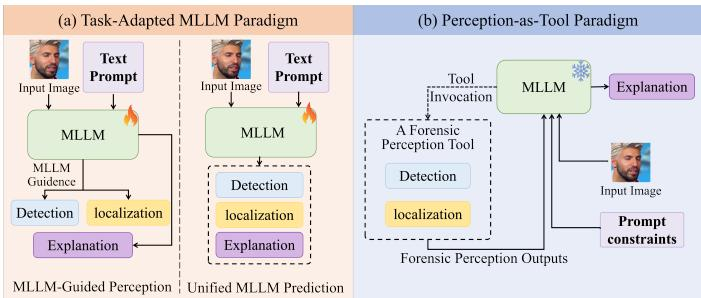
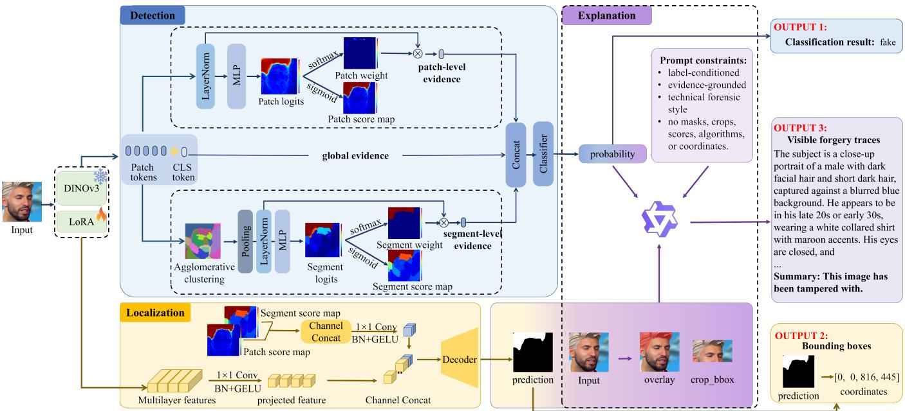
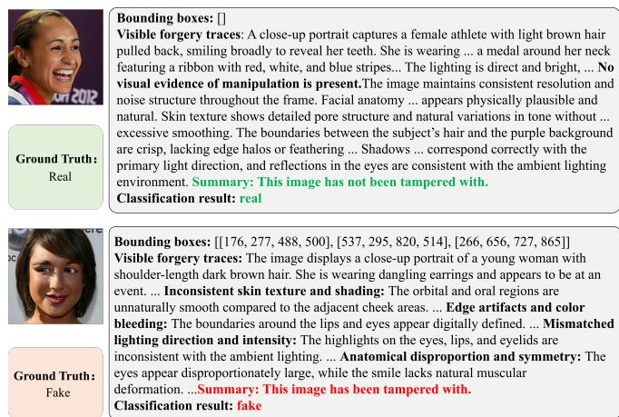

# PATE-Forensics: Perception-as-Tool for Explainable Deepfake Forensics with General-Purpose MLLMs

Yaqi Li1∗ , Jielun Peng1∗ , Yabin Wang1† , Jincheng Liu1 and Xiaopeng Hong1

1Harbin Institute of Technology

{25s103223, 25s003052}@stu.hit.edu.cn, wang-yabin@outlook.com, 25b903114@stu.hit.edu.cn, hongxiaopeng@ieee.org

## Abstract

Existing explainable deepfake forensic methods typically rely on task-adapted MLLM to jointly address detection, localization, and explanation. Inspired by agent-style tool use, we instead introduce a Perception-as-Tool paradigm and instantiate it as PATE-Forensics, which architecturally decouples detection and localization from explanation generation while coupling detection and localization as tightly as possible within a forensic perception tool. The DINOv3-based tool couples a multi-granularity detection module that integrates global, patch-level, and segment-level evidence with a cue-guided localization module by spatializing the patch-level and segment-level evidence into forgery score maps that guide dense mask prediction. The original image and forensic perception outputs produced by the tool form structured forensic context for a general-purpose MLLM, which is guided by prompt constraints to generate explanations without task-specific fine-tuning. On DDL-X Track 3, PATE-Forensics achieves the best official score of 0.89, outperforming the second-ranked team by 0.19 points. Our code is available at https: //github.com/yqli00000/PATE-Forensics.

## 1 Introduction

Recent advances in deepfake generative models have significantly improved the realism and controllability of manipulated facial images [Karras et al., 2019; Rombach et al., 2022; Saharia et al., 2022; Wang et al., 2026], raising serious concerns about digital security, identity trustworthiness, and visual authenticity [Nguyen et al., 2022; Peng et al., 2026; Hopf et al., 2026]. A practical forensic system should not only determine whether an image is fake, but also localize the manipulated regions and explain the supporting visual evidence in a human-readable form.

Motivated by these requirements, existing methods have begun to integrate forgery detection, manipulation localization, and textual explanation with the help of multimodal large language models (MLLMs) [Kang et al., 2025]. Existing approaches mainly follow two task-adapted designs. Some methods fine-tune MLLMs on task-specific forensic data and use the generated descriptions or hidden representations to guide dedicated detection and localization modules [Xu et al., 2025; Huang et al., 2025; Kang et al., 2025]. A recent unified variant instead applies reinforcementlearning-based fine-tuning to a unified MLLM, enabling it to jointly produce detection, localization, and explanation outputs [Li et al., 2026]. Despite their structural differences, both designs internalize domain-specific forensic capabilities through task-specific MLLM adaptation. This reliance on task-specific MLLM fine-tuning can be costly and less scalable, since each new forensic task or setting may require another round of MLLM fine-tuning. Meanwhile, fine-grained forensic perception still depends on dense visual cues such as local artifacts, texture inconsistencies, facial-part anomalies, and boundary blending patterns.

  
Figure 1: Comparison with existing method jointly addressing detection, localization, and explanation. Existing methods rely on taskadapted MLLMs, either using MLLM outputs to guide dedicated detection and localization modules or directly producing all three task outputs. In contrast, PATE-Forensics keeps a general-purpose MLLM frozen and externalizes detection and localization as a forensic perception tool, whose outputs, together with the original image, form the structured forensic context for explanation generation.

As general-purpose vision-language models become increasingly capable in reasoning and language generation, this motivates us to investigate whether a general-purpose MLLM can generate domain-specific forensic explanations without task-specific fine-tuning when supplied with reliable structured forensic context. We therefore reorganize how the three tasks collaborate by architecturally decoupling detection and localization from explanation generation, while coupling detection and localization as tightly as possible to construct such context. Inspired by agent-style tool use, we introduce a Perception-as-Tool paradigm, in which coupled detection and localization are externalized as a forensic perception tool, while explanation generation is handled by a general-purpose MLLM. The tool produces a fake/real probability and a manipulation localization result. Together with the original image, these outputs form the structured forensic context used by a general-purpose MLLM to generate humanreadable explanations. This design confines domain-specific visual learning to the forensic perception tool and avoids taskspecific MLLM fine-tuning.

To build the reliable forensic perception tool, we further consider how detection and localization can be coupled as tightly as possible. The key is to learn shared forensic evidence that is both discriminative for image-level detection and spatially informative for localization. Existing detectors have exploited global representations and multi-scale patch features to capture forensic evidence at different granularities [Zhao et al., 2021; Wang et al., 2022]. Nevertheless, patch-wise evidence alone may be insufficient, as facial forgery artifacts are often associated with semantically meaningful facial components, such as the eyes and mouth [Schwarcz and Chellappa, 2021; Haliassos et al., 2021]. Since a facial component generally spans multiple image patches, patch-wise modeling may fragment its forensic evidence and fail to capture consistency across the component. Segment-level evidence is therefore also needed to aggregate semantically related patches and model componentlevel consistency beyond individual patch responses. Meanwhile, prior manipulation localization methods show that dense mask prediction benefits from explicit forensic cues such as noise-sensitive fingerprints, or noise-guided amplification [Chen et al., 2021; Guillaro et al., 2023; Cai et al., 2026]. However, these cues are typically constructed specifically for localization, leaving them disconnected from the evidence learned for detection. We instead connect the two tasks through shared patch-level and segment-level forensic evidence, which supports image-level detection and is spatialized into forgery score maps to guide dense mask prediction. This design tightly couples multi-granularity detection with cue-guided localization within a single forensic perception tool.

Based on this design, we instantiate this paradigm as PATE-Forensics (Perception-as-Tool for Explainable Deepfake Forensics). PATE-Forensics implements a DINOv3- based forensic perception tool that couples a multigranularity detection module and a cue-guided localization module. The detection module mines multi-granularity evidence from global, patch-level, and segment-level representations. At the global level, the DINOv3 class-token representation captures holistic image context. At the patch level, dense patch tokens are used to estimate local suspiciousness. At the segment level, dense features are grouped into semantic-aware regions to model regional consistency and estimate region-level suspiciousness. The patch-level and segment-level suspiciousness scores contribute to image-level detection and are also spatialized into score maps. The localization module takes these maps as coarse forgery cues and fuses them with multi-layer DINOv3 features through a lightweight decoder to predict a dense manipulation mask. Finally, the original image and forensic perception outputs, including the predicted probability, localization overlay, and suspicious-region crops, form the structured forensic context supplied to a general-purpose MLLM for explanation generation without task-specific fine-tuning. Official evaluation on DDL-X Track 3 shows that PATE-Forensics ranked first with a score of 0.89 under the official evaluation metric, outperforming the second-ranked team by 0.19 points.

Our contributions are summarized as follows:

• We introduce a Perception-as-Tool paradigm and instantiate it as PATE-Forensics, which architecturally decouples detection and localization from explanation generation, and enables a general-purpose MLLM to generate forensic explanations from structured forensic context without task-specific fine-tuning.

• We develop a coupled forensic perception tool that combines multi-granularity detection across global, patch, and segment levels with cue-guided localization, where detection-stage patch and segment suspiciousness maps guide dense mask prediction.

• Our approach ranked first in the DDL-X Challenge, demonstrating competitive performance in deepfake detection, localization, and explainability.

## 2 Related Work

## 2.1 Image Forgery Detection and Localization

Image forgery detection and localization have been studied as closely related forensic tasks. Prior studies suggest that reliable forgery analysis requires sensitivity to subtle forensic details rather than only high-level semantics. MVSS-Net [Chen et al., 2021] improves generalization by combining multi-view feature learning and multi-scale supervision, showing that image-level detection and pixel-level localization benefit from low-level forensic evidence. Recent methods combine heterogeneous forensic evidence more explicitly. TruFor [Guillaro et al., 2023] uses RGB content and a learned noise-sensitive fingerprint to produce a localization map, an image-level integrity score, and a reliability map. OpenSDI [Wang et al., 2025] studies diffusiongenerated image spotting in open-world settings and includes both detection and localization for globally and locally manipulated images. NFA-ViT [Cai et al., 2026] addresses localized AIGC editing by using noise-guided attention to amplify subtle forgery cues and improve fine-grained localization. Although these methods demonstrate the importance of detailed forensic evidence, the relationship between detection and localization is usually established through shared representations, multi-task supervision, or image-level scores derived from localization outputs. Such designs couple the two tasks, but suspicious-region cues mined during detection are not explicitly reused as coarse forgery cues to guide dense mask prediction.

For face forgery analysis, many works show that manipulation traces are often local and related to facial parts or blending boundaries. Face X-Ray [Li et al., 2020] detects face forgeries by revealing blending boundaries shared by many face manipulation pipelines. Lips Don’t Lie [Haliassos et al., 2021] focuses on mouth dynamics for generalizable face forgery detection, while parts-based detectors [Schwarcz and Chellappa, 2021] analyze artifacts around individual facial components. More recently, Han et al. [Han et al., 2025] introduce facial component guidance to adapt a foundation model for video-based deepfake detection, encouraging the model to attend to key facial regions for improved generalization. These works suggest that local artifacts, facial component consistency, and region-level structures are all important for robust forgery analysis.

Our method follows this motivation but differs in how local and regional evidence are constructed and used. Instead of relying only on a fused dense representation or manually defined facial parts, we exploit DINOv3 dense features [Cuttano et al., 2026] to build patch and segment-level evidence. The patch branch captures patch-level evidence, while the segment branch models suspiciousness over spatially coherent regions. Both branches contribute to image-level detection, and their suspiciousness scores are further converted into score maps to guide dense mask prediction, forming a coupled detection-localization design within a single forensic perception tool.

## 2.2 Explainable Image Forgery Analysis

In forensic applications, a binary prediction alone is often insufficient. Users need to know where the suspicious evidence lies and why the system regards an image as manipulated. Recent multimodal methods have therefore moved toward jointly addressing detection, localization, and explanation through task-adapted MLLMs. These approaches can be organized into two designs. The first is MLLM-guided perception, where MLLM outputs or representations assist dedicated perception modules. FakeShield [Xu et al., 2025] generates a textual tampering description and uses its representation to guide a forgery localization module. SIDA [Huang et al., 2025] extracts detection and segmentation token representations from a large vision-language model and feeds them into dedicated heads for authenticity prediction and mask generation. The second is unified MLLM prediction. Omni-Fake-R1 [Li et al., 2026] is a recent example that applies reinforcement-learning-based fine-tuning to a unified omnimodal model, enabling it to jointly produce authenticity decisions, localization results, and natural-language explanations.

Although the two designs differ in how the three tasks are connected, both adapt the MLLM to domain-specific forensic data and output requirements. Our method instead follows a Perception-as-Tool paradigm. A forensic perception tool performs detection and localization without receiving MLLM guidance, and its outputs, together with the original image, form structured forensic context for a general-purpose MLLM. Thus, the MLLM neither assists forensic perception nor directly predicts all three task outputs. It uses the structured forensic context only for interpretation and explanation generation, avoiding task-specific fine-tuning.

## 3 Methodology

PATE-Forensics employs a DINOv3-based forensic perception tool that couples multi-granularity detection with cueguided localization, without relying on MLLM assistance. The original image and forensic perception outputs are organized as structured forensic context for a general-purpose MLLM to generate human-readable forensic explanations without task-specific fine-tuning. Figure 2 provides an overview of PATE-Forensics.

Given an input image I, the forensic perception tool extracts a class token and dense patch tokens using a DINOv3 backbone with LoRA adaptation. Its detection module integrates global, patch-level, and segment-level evidence for fake/real detection. The patch and segment branches not only contribute to image-level detection, but also produce coarse forgery cues in the form of patch and segment score maps. The localization module fuses these coarse forgery cues with multi-layer DINOv3 features through a lightweight cue-guided decoder to predict a dense forgery mask. During inference, the original image, predicted probability, dense mask, overlaid image, and bounding-box crops are organized as structured forensic context for explanation generation.

## 3.1 Multi-Granularity Forgery Detection

The detection module performs image-level fake/real prediction by integrating global, patch-level, and segment-level evidence. The global branch captures holistic image context from the DINOv3 class token. The patch branch estimates patch-level suspiciousness from dense patch tokens, while the segment branch aggregates patch tokens into semanticaware region prototypes to model spatially coherent manipulation patterns. In this way, the detector integrates imagelevel context with patch-level, and segment-level evidence, where the latter captures regional consistency beyond individual patches.

Global evidence. The global evidence is derived from the DINOv3 class token. The normalized class token serves as the global representation in the final multi-granularity detector and is also passed through a lightweight classifier to produce an auxiliary image-level fake/real logit:

$$
\ell _ { g } ^ { i m g } = C _ { g } ( \mathrm { L N } ( z _ { c l s } ) ) .\tag{1}
$$

Patch-level evidence. The patch branch operates on the trainable DINOv3 patch tokens. Let $X ~ = ~ \{ x _ { i } \} _ { i = 1 } ^ { N }$ denote the normalized patch tokens, where N is the number of image patches. For each patch token, the patch branch predicts a patch-level suspiciousness logit:

$$
a _ { i } = f _ { p } ( x _ { i } ) ,\tag{2}
$$

where $f _ { p }$ is a lightweight MLP and $a _ { i }$ measures how suspicious the i-th patch is. The resulting logits serve two roles. First, they are converted into temperature-scaled weights and used to aggregate patch tokens into an image-level patch representation $p _ { a g g }$ , which serves as the patch-level representation in the final multi-granularity detector:

  
Figure 2: Overview of PATE-Forensics. Following the Perception-as-Tool paradigm, a forensic perception tool performs detection and localization through two coupled modules. The global, patch, and segment branches provide multi-granularity evidence for fake/real detection, while the cue-guided localization module fuses detection-stage patch and segment score maps with multi-layer DINOv3 features to predict a dense forgery mask. The original image and forensic perception outputs form structured forensic context for a general-purpose MLLM. Guided by prompt constraints, the MLLM generates the final explanation without task-specific fine-tuning

$$
\begin{array} { c } { { w _ { i } = \displaystyle \frac { \exp ( a _ { i } / \tau ) } { \sum _ { j = 1 } ^ { N } \exp ( a _ { j } / \tau ) } , \hfill } } \\ { { { } } } \\ { { p _ { a g g } = \displaystyle \sum _ { i = 1 } ^ { N } w _ { i } x _ { i } . \hfill } } \end{array}\tag{3}
$$

(4)

The aggregated representation $p _ { a g g }$ is then passed to the patch classifier to produce an auxiliary image-level fake/real logit:

$$
\ell _ { p } ^ { i m g } = C _ { p } ( \mathrm { L N } ( p _ { a g g } ) ) .\tag{5}
$$

Second, the same patch-level logits are spatialized into a score map. After applying the sigmoid function and reshaping the logits to the patch grid, we obtain a patch-level coarse forgery cue that provides spatial guidance for localization:

$$
S _ { p } = \sigma ( { \mathrm { r e s h a p e } } ( a ) ) ,\tag{6}
$$

where $a ~ = ~ [ a _ { 1 } , \ldots , a _ { N } ]$ . In this way, the patch branch produces both image-level evidence for detection and spatial cues for localization.

Segment-level evidence. The segment branch introduces region-level evidence by grouping patch tokens into spatially coherent segments. To avoid unstable assignments caused by task-specific adaptation, agglomerative clustering is performed on frozen DINOv3 patch tokens. The resulting assignments are then applied to the LoRA-adapted patch tokens. This produces a patch-to-segment assignment $r _ { i } ~ \in$ $\{ 1 , \ldots , K \}$ for each patch i, where K is the number of semantic-aware regions. Given the trainable patch tokens

$X = \{ x _ { i } \} _ { i = 1 } ^ { N }$ , the prototype of segment k is computed by averaging the tokens assigned to that segment:

$$
q _ { k } = \frac { 1 } { | \mathcal { R } _ { k } | } \sum _ { i \in \mathcal { R } _ { k } } x _ { i } , \quad \mathcal { R } _ { k } = \{ i \mid r _ { i } = k \} .\tag{7}
$$

Analogously to the patch branch, each segment prototype is assigned a suspiciousness logit:

$$
b _ { k } = f _ { s } ( q _ { k } ) ,\tag{8}
$$

where $f _ { s }$ is a lightweight MLP and $b _ { k }$ measures the suspiciousness of segment k. These logits are used to obtain both an image-level segment representation and a segment score map:

$$
s _ { a g g } = \sum _ { k = 1 } ^ { K } \frac { \exp ( b _ { k } / \tau ) } { \sum _ { j = 1 } ^ { K } \exp ( b _ { j } / \tau ) } q _ { k } ,\tag{9}
$$

$$
\ell _ { s } ^ { i m g } = C _ { s } ( \mathrm { L N } ( s _ { a g g } ) ) .\tag{10}
$$

$$
S _ { s } ( i ) = \sigma ( b _ { r _ { i } } ) .\tag{11}
$$

Here, $s _ { a g g }$ serves as the segment-level representation in the final multi-granularity detector, while Ss provides a spatially coherent coarse forgery cue for localization. Compared with the patch score map, $S _ { s }$ is more region-consistent because all patches in the same segment share the same suspiciousness score.

Main detection. The final detector fuses the normalized global feature, aggregated patch feature, and aggregated segment feature:

$$
\ell _ { m } = C _ { m } ( [ \mathrm { L N } ( z _ { c l s } ) ; \mathrm { L N } ( p _ { a g g } ) ; \mathrm { L N } ( s _ { a g g } ) ] ) ,\tag{12}
$$

where $z _ { c l s } , p _ { a g g } ,$ and $s _ { a g g }$ denote the class-token representation, aggregated patch representation, and aggregated segment representation, respectively. The main classifier $C _ { m }$ produces the final fake/real logit $\ell _ { m }$

## 3.2 Cue-Guided Localization

The localization module predicts a dense manipulation mask conditioned on the coarse forgery cues produced by the patch and segment branches. In parallel, patch tokens from multiple hidden layers of DINOv3 are reshaped into spatial feature maps and used as multi-level visual inputs to the decoder. The patch and segment score maps are concatenated into a twochannel guidance map:

$$
S = \operatorname { c o n c a t } ( S _ { p } , S _ { s } ) .\tag{13}
$$

The decoder follows a lightweight SegFormer-style design [Xie et $a l .$ , 2021]. Each DINOv3 feature map is projected into a shared embedding dimension by a $1 \times { \bar { 1 } }$ convolution followed by batch normalization and GELU activation. The two-channel score map is projected in the same way. All projected features are concatenated along the channel dimension.

$$
F _ { m e r g e } = \mathrm { C o n c a t } \big ( \phi _ { 1 } ( F _ { 1 } ) , \dots , \phi _ { 4 } ( F _ { 4 } ) , \phi _ { s } ( S ) \big ) ,\tag{14}
$$

$$
\hat { M } = \sigma ( \mathrm { U p } ( \psi ( F _ { m e r g e } ) ) ) .\tag{15}
$$

Here $F _ { 1 } , \ldots , F _ { 4 }$ are selected DINOv3 feature maps, $\phi _ { l }$ and $\phi _ { s }$ denote projection layers for DINOv3 features and score maps, ψ is the convolutional fusion head, and Up upsamples the mask logits to the input image resolution.

This design makes localization guided by detection-stage evidence, as the decoder uses patch and segment score maps as coarse forgery cues and fuses them with dense DINOv3 features.

## 3.3 Training Objective

The training objective supervises three groups of outputs. First, image-level fake/real labels supervise the main detector and the three auxiliary image-level logits. Let $y \in \{ 0 , 1 \}$ denote the image-level fake/real label, where $y = 1$ indicates a fake image. The main logit $\ell _ { m } .$ , global-branch image-level logit $\ell _ { g } ^ { i m g }$ , patch-branch image-level logit $\ell _ { p } ^ { i m g }$ , and segmentbranch image-level logit $\ell _ { s } ^ { i m g }$ are all supervised by y:

$$
\begin{array} { r l } & { \mathcal { L } _ { d e t } = \mathcal { L } _ { c l s } ( \ell _ { m } , y ) + \mathcal { L } _ { c l s } ( \ell _ { g } ^ { i m g } , y ) } \\ & { \phantom { \mathcal { L } _ { c l s } } + \mathcal { L } _ { c l s } ( \ell _ { p } ^ { i m g } , y ) + \mathcal { L } _ { c l s } ( \ell _ { s } ^ { i m g } , y ) . } \end{array}\tag{16}
$$

Second, the patch and segment suspiciousness logits are supervised by targets derived from the ground-truth mask. Specifically, the ground-truth mask is downsampled to patchlevel targets $\tilde { M _ { p } } ~ = ~ \{ m _ { i } ^ { p } \} _ { i = 1 } ^ { N }$ , and segment-level targets $M _ { s } = \{ m _ { k } ^ { s } \} _ { k = 1 } ^ { K }$ are obtained by aggregating $M _ { p }$ within each cluster. The corresponding cue supervision loss is

$$
\mathcal { L } _ { c u e s } = \mathcal { L } _ { c u e } ^ { p } ( a , M _ { p } ) + \mathcal { L } _ { c u e } ^ { s } ( b , M _ { s } ) ,\tag{17}
$$

where $a = [ a _ { 1 } , \dotsc , a _ { N } ]$ are patch suspiciousness logits and $b = [ b _ { 1 } , \dotsc , \stackrel { \textstyle - } { b _ { K } } ]$ are segment suspiciousness logits. In the implementation, focal loss is used for these classification and mask-derived supervision terms.

Third, the final dense mask prediction is supervised with binary cross-entropy and Dice loss:

$$
\mathcal { L } _ { m a s k } = \mathcal { L } _ { B C E } ( \hat { \boldsymbol { M } } , \boldsymbol { M } ) + \mathcal { L } _ { D i c e } ( \hat { \boldsymbol { M } } , \boldsymbol { M } ) ,\tag{18}
$$

where M denotes the ground-truth forgery mask. The overall training objective is defined as

$$
\mathcal { L } = \mathcal { L } _ { d e t } + \mathcal { L } _ { c u e s } + \mathcal { L } _ { m a s k } .\tag{19}
$$

## 3.4 Inference and Post-processing

At inference, each image is resized to 768 × 768 and passed through the model. The fake probability is computed from the sigmoid of the main detection logit. Images with fake probability greater than or equal to 0.5 are classified as fake, otherwise they are classified as real.

For images predicted as fake, the predicted mask is resized back to the original image resolution and binarized with threshold 0.4. We extract 8-connected components from the binary mask and discard components with area smaller than 8 pixels. Each remaining component is converted into a bounding box [x1, y1, x2, y2] in the original image coordinate system. These bounding boxes serve as the localization output for official evaluation and are also used to crop suspicious regions for explanation generation. Following the submission format, the bounding box coordinates are normalized to a 0- 1000 scale:

$$
x ^ { \prime } = \operatorname { r o u n d } \left( { \frac { x } { W } } \times 1 0 0 0 \right)\tag{20}
$$

$$
y ^ { \prime } = \operatorname { r o u n d } \left( { \frac { y } { H } } \times 1 0 0 0 \right) ,\tag{21}
$$

where W and H are the original image width and height. Real images return an empty bounding-box list.

## 3.5 MLLM-based Explanation Generation

The explanation module supplies a general-purpose MLLM with structured forensic context formed by the original image and the outputs of the forensic perception tool. Explanation generation is further guided by a text prompt that specifies task and output constraints. The MLLM is used without taskspecific fine-tuning. For each sample, the context includes the original image and the predicted fake probability. When the image is predicted as fake, the localization output is further used to construct two region-level visual cues, namely an image with the predicted suspicious region highlighted and a local crop of the bounding-box region extracted from the predicted mask during inference. These inputs allow the model to inspect both the full image context and the localized region indicated by the model.

The prompt is designed with four constraints. First, it is label-conditioned. Fake samples require localized forensic evidence, while real samples require descriptions of visual consistency and the absence of manipulation artifacts. Second, it is grounded in structured forensic context. The MLLM is guided to focus on the model-indicated region and compare it with adjacent normal regions. Third, it constrains the writing style to a technical forensic annotation, using stable categories such as texture inconsistency, lighting mismatch, edge artifacts, anatomical irregularity, reflection inconsistency, and resolution or noise mismatch when applicable. Fourth, it prevents the final explanation from exposing internal implementation details such as masks, overlays, crops, thresholds, confidence scores, algorithms, or coordinates. These constraints guide the MLLM in transforming structured forensic context into coherent, well-organized, and evidence-grounded natural-language explanations. The complete prompt templates used to generate explanations for real and fake images are provided in our code repository.

## 4 Experiment

The task follows the DDL-X Track 3 setting of the IJCAI 2026 AI Safety Workshop, which jointly evaluates deepfake detection, localization, and explainability [IJCAI 2026 AI Safety Workshop Organizers, 2026]. We use the image portion of the Deepfake Detection and Localization Image (DDL-I) dataset [Miao et al., 2025]. DDL-I is a large-scale image deepfake dataset with pixel-level forgery region annotations. It consists of 1.2 million images and covers both single-face and multi-face scenarios, where manipulated regions may appear in local facial areas or in one or more faces within a multi-face image.

## 4.1 Training Data and Augmentation

The model is trained on the DDL-I dataset. To make full use of the annotated data, we repartition the dataset into training and validation sets. Specifically, we merge the original training and validation sets and use both for training. We further randomly split the original test set into training and validation subsets at a ratio of 9:1, using a fixed random seed of 42. Consequently, the final training set consists of the original training set, the original validation set, and 90% of the original test set, while the remaining 10% of the original test set is used as the validation set.

Two forms of data augmentation are applied during training. First, synchronized geometric transformations are applied to each image-mask pair, including horizontal flipping and rotations by 90, 180, and 270 degrees. The training resolution is randomly sampled between 384 and 768 pixels and constrained to be divisible by the patch size. Images are resized with bilinear interpolation, while masks use nearestneighbor interpolation to preserve binary labels.

Second, we introduce canvas-level layout augmentation to simulate the diverse layouts observed in the test set. With probability 0.25, an image-mask pair is transformed by one of three layout operations: shrinking the image and pasting it onto a solid-color canvas, repeating multiple resized copies on the canvas, or composing multiple samples into a mosaic layout. The same paste geometry is applied to the image and its mask, while the mask canvas is initialized as background. For mosaic augmentation, the image-level label is set to fake if any constituent sample is fake.

## 4.2 Implementation Details

The model uses DINOv3-L/16 with feature dimension 1024 and patch size 16. LoRA is enabled with rank 32, scaling factor 16, and dropout 0.05. The DINOv3 feature layers selected for mask decoding are layers 6, 12, 18, and 24. The hidden dimension of the mask decoder is set to 256. Training uses AdamW with learning rate $1 0 ^ { - 4 }$ , weight decay $5 \times 1 0 ^ { - 2 } ,$ mixed precision, and a warmup cosine scheduler. The model is trained for 20 epochs using distributed training on three NVIDIA RTX 3090 GPUs, with a per-GPU batch size of 8 and an effective batch size of 24. For explanation generation, we use Qwen3.5-Flash model (qwen3.5-flash) as the general-purpose MLLM without task-specific fine-tuning, accessed through the OpenAI-compatible API of Alibaba Cloud Model Studio (DashScope). Each request uses a maximum answer length of 700 tokens. Temperature and top-p are not explicitly specified and therefore follow the provider defaults.

<table><tr><td>Rank</td><td>Team</td><td>Score</td><td>ACC</td><td>IoU</td><td>BERT</td><td>Rub.</td></tr><tr><td>1</td><td>HIT_VIRLAB</td><td>0.8940</td><td>0.1995</td><td>0.3079</td><td>0.0943</td><td>0.2923</td></tr><tr><td>2</td><td>CBSR-WTD</td><td>0.7025</td><td>0.1776</td><td>0.2495</td><td>0.0813</td><td>0.1941</td></tr><tr><td>3</td><td>Track Killer</td><td>0.6857</td><td>0.1562</td><td>0.2363</td><td>0.0851</td><td>0.2081</td></tr><tr><td>4</td><td>hellohello</td><td>0.6181</td><td>0.1601</td><td>0.2200</td><td>0.0769</td><td>0.1610</td></tr><tr><td>5</td><td>XQ999</td><td>0.5770</td><td>0.1601</td><td>0.1985</td><td>0.0585</td><td>0.1599</td></tr></table>

Table 1: Final results compared with other teams on DDL-X Track 3. CBSR-WTD denotes CBSR what the dog doing.

## 4.3 Evaluation Protocol

Following the official DDL-X Track 3 evaluation protocol, we evaluate the system from three aspects: image-level detection, forgery localization, and explanation generation. Detection is measured by accuracy (ACC). Localization is measured by bounding-box IoU and is evaluated on fake images. Explanation quality is measured by BERTScore and a rubricbased score. The rubric-based score further evaluates factual correctness, visual grounding, regional specificity, label faithfulness, alignment between the textual explanation and predicted bounding boxes, face-centered analysis, and clarity of the generated explanation. The scores for fake and real images are calculated separately as follows:

$$
\mathrm { S c o r e _ { f } } = \left\{ \begin{array} { l l } { 0 . 2 A + 0 . 5 I , } & { I < 0 . 7 , } \\ { 0 . 2 A + 0 . 5 I + 0 . 1 B + 0 . 2 R , } & { I \geq 0 . 7 , } \end{array} \right.\tag{22}
$$

$$
\mathrm { S c o r e _ { r } } = 0 . 2 A + 0 . 2 B + 0 . 6 R\tag{23}
$$

where A, I, B, and R denote ACC, IoU, BERTScore, and the rubric-based score, respectively. The final reported score is obtained by computing the score for each sample using the formula corresponding to its ground-truth category, i.e., real or fake, and then aggregating the resulting sample-level scores over the entire evaluation set.

## 4.4 Experimental Results

Table 1 reports the final DDL-X Track 3 leaderboard results. The metric columns follow the official leaderboard presentation and correspond to the weighted score components used in the final score. Our method ranked first among all participating teams, with a final score of 0.8940.

The improvement is consistent across the three evaluated aspects. Our method obtains the highest detection component and the highest localization component among the top-5 submissions, suggesting that coupling multi-granularity detection with cue-guided localization is effective for both image-level prediction and bounding-box localization. It also achieves the strongest BERTScore and rubric-based score, showing that a general-purpose MLLM guided by prompt constraints can generate effective explanations from structured forensic context comprising the original image and forensic perception outputs. These results demonstrate the practical viability of the Perception-as-Tool design without task-specific fine-tuning.

  
Figure 3: Qualitative examples of MLLM-based explanation. For the real image (top), no manipulated region is detected. For the fake image (bottom), the predicted bounding-box coordinates localize the manipulated regions. The explanations are abridged for readability.

## 4.5 Qualitative Analysis

Figure 3 presents the explanations generated using the structured forensic context and prompt guidance. For the real example, the perception tool predicts the image as real and identifies no suspicious region. The MLLM then supports this prediction by describing visual consistency in facial structure, texture, boundaries, illumination, and reflections. For the fake example, the perception tool predicts the image as fake and localizes candidate suspicious regions. Using the structured forensic context, the MLLM examines these regions and describes visible forensic evidence, including inconsistent skin texture and shading, boundary artifacts, color bleeding, and illumination mismatch. Rather than merely repeating the predicted label, the generated explanation connects the perception outputs with observable visual evidence. Overall, the perception tool supplies the structured forensic context, while the prompt guides the MLLM to organize the relevant evidence into a structured explanation. This design produces label-consistent and region-aware explanations without taskspe cific MLLM fine-tuning.

## 4.6 Ablation Studies

We conduct ablation studies to examine the contributions of multi-granularity forgery detection and cue-guided localization. The training and validation sets used in all ablation experiments follow the same data-partitioning protocol described above. To ensure a fair performance evaluation, we tested all variants on the development set provided during

<table><tr><td></td><td colspan="3">Detection Evidence Localization Input</td><td colspan="3"></td><td colspan="2">Metric</td></tr><tr><td>Configuration</td><td>Zcls</td><td> $p _ { a g g }$ </td><td> $s _ { a g g }$ </td><td>F1-F4</td><td> $S _ { p }$ </td><td> $S _ { s }$ </td><td>ACC</td><td>IoU</td></tr><tr><td>Baseline</td><td>√</td><td>x</td><td>x</td><td>√</td><td>x</td><td>x</td><td>0.9914 0.7283</td><td></td></tr><tr><td>+ Patch-level evidence</td><td>√</td><td>√</td><td>x</td><td>√</td><td>x</td><td>x</td><td>0.99250.7375</td><td></td></tr><tr><td>+ Segment-level evidence</td><td>√</td><td>√</td><td>√</td><td>√</td><td>x</td><td>x</td><td>0.99390.7410</td><td></td></tr><tr><td>+ Coarse forgery cues</td><td>√</td><td>√</td><td>√</td><td>√</td><td>√</td><td>√</td><td>0.9961 0.7910</td><td></td></tr></table>

Table 2: Progressive component-wise ablation of PATE-Forensics. Components are added cumulatively from top to bottom. The baseline uses $z _ { c l s }$ for detection and multi-layer features $F _ { 1 } { - } F _ { 4 }$ for localization. The final row denotes the full PATE-Forensics model.

Phase I.1 The progressive component-wise ablation results are reported in Table 2.

Starting from the baseline, progressively adding patchlevel and segment-level evidence consistently improves both ACC and IoU, indicating that the three levels of detection evidence provide complementary information. Introducing the patch and segment score maps $S _ { p }$ and $S _ { s }$ as coarse localization cues produces the most substantial gain, increasing IoU from 0.7410 to 0.7910. Compared with the baseline, PATE-Forensics improves ACC by 0.0047 and IoU by 0.0627, demonstrating the effectiveness of both multi granularity forgery detection and cue-guided localization.

## 5 Conclusion

This paper introduced the Perception-as-Tool paradigm and instantiated it as PATE-Forensics for explainable deepfake forensics without task-specific MLLM fine-tuning. PATE-Forensics architecturally decouples detection and localization from explanation generation while coupling detection and localization as tightly as possible within a DINOv3-based forensic perception tool. The tool couples multi-granularity detection with cue-guided localization by spatializing patchlevel and segment-level forgery logits into score maps that guide dense mask prediction. The original image and forensic perception outputs produced by the tool form the structured forensic context used by a general-purpose MLLM to generate human-readable explanations without task-specific fine-tuning. PATE-Forensics achieved the top official score on DDL-X Track 3. More broadly, our results suggest that domain perception can be externalized as a reliable tool, allowing domain-specific systems to potentially benefit from advances in general-purpose MLLMs without repeatedly adapting the language model. Future work will explore richer structured forensic context and evaluate the Perception-as-Tool paradigm across different general-purpose MLLMs and domain-specific multimodal tasks.

## Acknowledgments

This work was supported by the National Natural Science Foundation of China (Grant Nos. 62376070 and 62076195), the Fundamental Research Funds for the Central Universities (AUGA5710028726), and the China Postdoctoral Science Foundation (Grant No. 2026M794773).

## References

[Cai et al., 2026] Lvpan Cai, Haowei Wang, Jiayi Ji, YanShu ZhouMen, Shen Chen, Taiping Yao, and Xiaoshuai Sun. Zooming in on fakes: A novel dataset for localized aigenerated image detection with forgery amplification approach. In Proceedings of the AAAI Conference on Artificial Intelligence, pages 2534–2542, 2026.

[Chen et al., 2021] Xinru Chen, Chengbo Dong, Jiaqi Ji, Juan Cao, and Xirong Li. Image manipulation detection by multi-view multi-scale supervision. In Proceedings of the IEEE/CVF International Conference on Computer Vision (ICCV), pages 14185–14193, October 2021.

[Cuttano et al., 2026] Claudia Cuttano, Gabriele Trivigno, Christoph Reich, Daniel Cremers, Carlo Masone, and Stefan Roth. INSID3: Training-free in-context segmentation with DINOv3. In Proceedings of the IEEE/CVF Conference on Computer Vision and Pattern Recognition (CVPR), 2026.

[Guillaro et al., 2023] Fabrizio Guillaro, Davide Cozzolino, Avneesh Sud, Nicholas Dufour, and Luisa Verdoliva. Trufor: Leveraging all-round clues for trustworthy image forgery detection and localization. In Proceedings of the IEEE/CVF Conference on Computer Vision and Pattern Recognition (CVPR), pages 20606–20615, June 2023.

[Haliassos et al., 2021] Alexandros Haliassos, Konstantinos Vougioukas, Stavros Petridis, and Maja Pantic. Lips don’t lie: A generalisable and robust approach to face forgery detection. In Proceedings of the IEEE/CVF Conference on Computer Vision and Pattern Recognition (CVPR), pages 5039–5049, June 2021.

[Han et al., 2025] Yue-Hua Han, Tai-Ming Huang, Kai-Lung Hua, and Jun-Cheng Chen. Towards more general video-based deepfake detection through facial component guided adaptation for foundation model. In Proceedings ofthe IEEE/CVF Conference on Computer Vision and Pattern Recognition (CVPR), pages 22995–23005, June 2025.

[Hopf et al., 2026] Benedikt Hopf, Radu Timofte, Chenfan Qu, Junchi Li, Fei Wu, Dagong Lu, Mufeng Yao, Xinlei Xu, Fengjun Guo, Yongwei Tang, et al. Robust deepfake detection, ntire 2026 challenge: Report. In Proceedings ofthe IEEE/CVF Conference on Computer Vision and Pattern Recognition Workshops (CVPRW), 2026. NTIRE 2026 Challenge Report.

[Huang et al., 2025] Zhenglin Huang, Jinwei Hu, Xiangtai Li, Yiwei He, Xingyu Zhao, Bei Peng, Baoyuan Wu, Xiaowei Huang, and Guangliang Cheng. Sida: Social media image deepfake detection, localization and explanation with large multimodal model. In Proceedings of the IEEE/CVF Conference on Computer Vision and Pattern Recognition (CVPR), pages 28831–28841, June 2025.

[IJCAI 2026 AI Safety Workshop Organizers, 2026] IJCAI 2026 AI Safety Workshop Organizers. Track 3: Deepfake detection, localization, and explainability. https: //ai-safety-workshop-ijcai2026.github.io/Track3.html, 2026. Accessed June 8, 2026.

[Kang et al., 2025] Hengrui Kang, Siwei Wen, Zichen Wen, Junyan Ye, Weijia Li, Peilin Feng, Baichuan Zhou, Bin Wang, Dahua Lin, Linfeng Zhang, et al. Legion: Learning to ground and explain for synthetic image detection. In Proceedings ofthe IEEE/CVF International Conference on Computer Vision, pages 18937–18947, 2025.

[Karras et al., 2019] Tero Karras, Samuli Laine, and Timo Aila. A style-based generator architecture for generative adversarial networks. In Proceedings of the IEEE/CVF Conference on Computer Vision and Pattern Recognition (CVPR), June 2019.

[Li et al., 2020] Lingzhi Li, Jianmin Bao, Ting Zhang, Hao Yang, Dong Chen, Fang Wen, and Baining Guo. Face xray for more general face forgery detection. In IEEE/CVF Conference on Computer Vision and Pattern Recognition (CVPR), June 2020.

[Li et al., 2026] Tianxiao Li, Zhenglin Huang, Haiquan Wen, Yiwei He, Xinze Li, Bingyu Zhu, Wuhui Duan, Congang Chen, Zeyu Fu, Yi Dong, Baoyuan Wu, Xiangtai Li, and Guangliang Cheng. Omni-fake: Benchmarking unified multimodal social media deepfake detection. In Proceedings of the IEEE/CVF Conference on Computer Vision and Pattern Recognition (CVPR), pages 30299– 30311, June 2026.

[Miao et al., 2025] Changtao Miao, Yi Zhang, Weize Gao, Zhiya Tan, Weiwei Feng, Man Luo, Jianshu Li, Ajian Liu, Yunfeng Diao, Qi Chu, et al. Ddl: A large-scale datasets for deepfake detection and localization in diversified realworld scenarios. arXiv preprint arXiv:2506.23292, 2025.

[Nguyen et al., 2022] Thanh Thi Nguyen, Quoc Viet Hung Nguyen, Dung Tien Nguyen, Duc Thanh Nguyen, Thien Huynh-The, Saeid Nahavandi, Thanh Tam Nguyen, Quoc-Viet Pham, and Cuong M. Nguyen. Deep learning for deepfakes creation and detection: A survey. Comput. Vis. Image Underst., 223(C), October 2022.

[Peng et al., 2026] Jielun Peng, Yabin Wang, Yaqi Li, Long Kong, and Xiaopeng Hong. Leave no stone unturned: Uncovering holistic audio-visual intrinsic coherence for deepfake detection. In Proceedings of the IEEE/CVF Conference on Computer Vision and Pattern Recognition (CVPR) Findings, pages 6655–6666, June 2026.

[Rombach et al., 2022] Robin Rombach, Andreas Blattmann, Dominik Lorenz, Patrick Esser, and Bjorn¨ Ommer. High-resolution image synthesis with latent diffusion models. In Proceedings of the IEEE/CVF Conference on Computer Vision and Pattern Recognition (CVPR), pages 10684–10695, June 2022.

[Saharia et al., 2022] Chitwan Saharia, William Chan, Saurabh Saxena, Lala Li, Jay Whang, Emily L Denton, Kamyar Ghasemipour, Raphael Gontijo Lopes, Burcu Karagol Ayan, Tim Salimans, Jonathan Ho, David Fleet, and Mohammad Norouzi. Photorealistic text-to-image diffusion models with deep language understanding. In S. Koyejo, S. Mohamed, A. Agarwal, D. Belgrave, K. Cho, and A. Oh, editors, Advances in Neural Information Processing Systems, volume 35, pages 36479–36494. Curran Associates, Inc., 2022.

[Schwarcz and Chellappa, 2021] Steven Schwarcz and Rama Chellappa. Finding facial forgery artifacts with parts-based detectors. In Proceedings of the IEEE/CVF Conference on Computer Vision and Pattern Recognition (CVPR) Workshops, pages 933–942, June 2021.

[Wang et al., 2022] Junke Wang, Zuxuan Wu, Wenhao Ouyang, Xintong Han, Jingjing Chen, Yu-Gang Jiang, and Ser-Nam Li. M2tr: Multi-modal multi-scale transformers for deepfake detection. In Proceedings of the 2022 international conference on multimedia retrieval, pages 615– 623, 2022.

[Wang et al., 2025] Yabin Wang, Zhiwu Huang, and Xiaopeng Hong. Opensdi: Spotting diffusion-generated images in the open world. In Proceedings of the Computer Vision and Pattern Recognition Conference (CVPR), pages 4291–4301, June 2025.

[Wang et al., 2026] Yabin Wang, Xiaopeng Hong, Yaqi Li, Zhiheng Ma, and Zhiwu Huang. Linguistic profiling of deepfakes: An open database for next-generation deepfake detection. Pattern Recognition, 178:113395, 2026.

[Xie et al., 2021] Enze Xie, Wenhai Wang, Zhiding Yu, Anima Anandkumar, Jose M. Alvarez, and Ping Luo. Segformer: Simple and efficient design for semantic segmentation with transformers. In M. Ranzato, A. Beygelzimer, Y. Dauphin, P.S. Liang, and J. Wortman Vaughan, editors, Advances in Neural Information Processing Systems, volume 34, pages 12077–12090. Curran Associates, Inc., 2021.

[Xu et al., 2025] Zhipei Xu, Xuanyu Zhang, Runyi Li, Zecheng Tang, Qing Huang, and Jian Zhang. Fakeshield: Explainable image forgery detection and localization via multi-modal large language models. In International Conference on Learning Representations, volume 2025, pages 31186–31216, 2025.

[Zhao et al., 2021] Hanqing Zhao, Wenbo Zhou, Dongdong Chen, Tianyi Wei, Weiming Zhang, and Nenghai Yu. Multi-attentional deepfake detection. In Proceedings of the IEEE/CVF conference on computer vision and pattern recognition, pages 2185–2194, 2021.