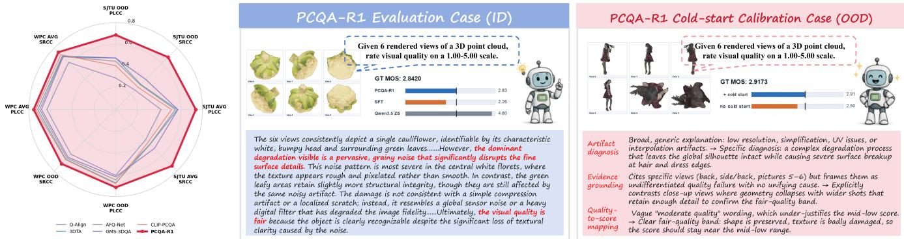
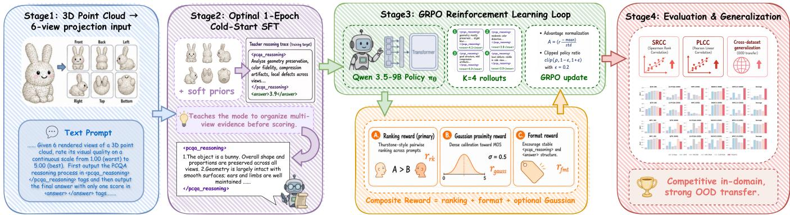
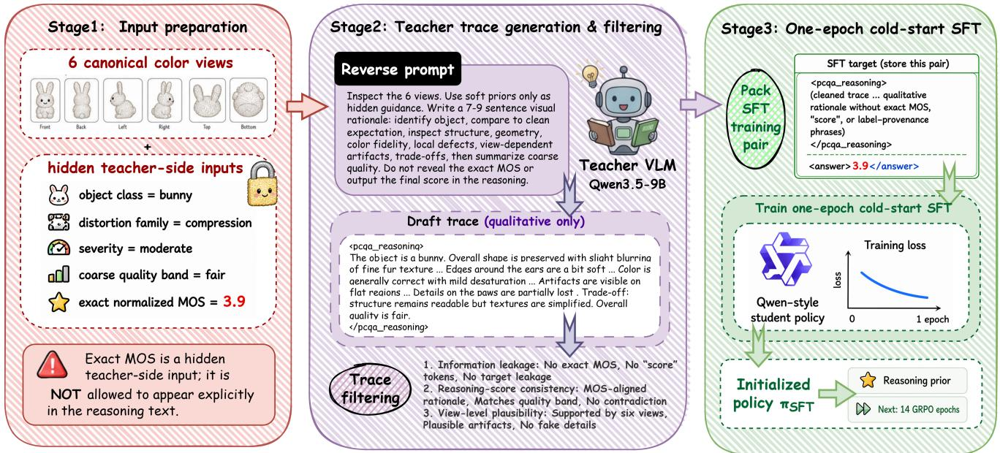

# PCQA-R1: Advancing Generalized 3D Point Cloud Quality Assessment with Reinforcement Learning

Kangning Ye1∗, Yunhao Li1∗, Sijing Wu1, Yucheng Zhu1, Guangtao Zhai1

1Shanghai Jiao Tong University

## Abstract

No-reference point cloud quality assessment (PCQA) has been an active topic in recent years and is used to measure and optimize the visual experience of point clouds. However, large multimodal models (LMMs) have rarely been explored in this area. Previous LMM-based methods mainly rely on supervised fine-tuning to directly predict numerical quality scores, lacking the ability to generalize across datasets with heterogeneous MOS scales and limited annotations. A key dificulty is that absolute MOS regression can be brittle across datasets with diferent score scales and distortion distributions, whereas relative quality ranking is more stable under such shifts. In this paper, we present PCQA-R1, the first reinforcement learning LMM for 3D point cloud quality assessment to simultaneously model quality understanding and scoring. Built upon the group relative policy optimization (GRPO) strategy, PCQA-R1 first constructs a chain-of-thought dataset, PCQA-CoT, which serves as cold-start training data through a reverse reasoning strategy that teaches the LMM to generate its reasoning process. We further introduce a Gaussian proximity reward that prevents calibration drift by anchoring score predictions to the source MOS range. Experimental results demonstrate that PCQA-R1 achieves state-of-the-art cross-dataset generalization across five benchmarks and competitive in-domain accuracy. Ablation studies support the role of ranking, Gaussian reward, and cold-start traces.

## Introduction

Three-dimensional (3D) point clouds have become a dominant representation for immersive media, autonomous driving, and digital twins, where end-to-end processing pipelines (acquisition, compression, transmission, rendering) inevitably degrade perceived quality. Objective point cloud quality assessment (PCQA) is therefore crucial for calibrating codecs, guiding streaming decisions, and benchmarking 3D reconstructions. The core challenge we address is cross-dataset generalization: projection models trained on SJTU-PCQA achieve up to 0.97 PLCC in-domain but drop to as low as 0.28 SRCC on LS-PCQA, because they learn dataset-specific MOS scales rather than transferable quality relations. This paper asks: can reinforcement learning learn quality rankings that transfer across datasets without seeing target-domain data?

Existing PCQA methods have advanced along several lines: fullreference geometry/color metrics, projection-based no-reference (NR) models, 3D-native or multimodal hybrids, and recent large multimodal model (LMM) scorers. Strong projection models such as

CLIP-PCQA (Liu et al. 2025b), GMS-3DQA (Zhang et al. 2024b), and AFQ-Net (Zhang et al. 2024a) achieve impressive in-domain correlations, while LMM methods such as Q-Align (Wu et al. 2023) make large multimodal backbones usable for PCQA. However, most of these methods still learn by regressing or classifying datasetspecific mean opinion scores (MOS). They can output a number, but they usually do not expose which visible defects, viewpoints, or structure changes justify that number. This lack of explicit quality evidence is not only a trust issue: under cross-dataset evaluation, the same regression target must absorb diferent MOS scales, distortion taxonomies, object distributions, and projection conventions, so in-domain accuracy often fails to transfer (Tables 1, 2).

We address this gap with two design choices. First, we study structured quality evidence as part of the learning problem, rather than as post-hoc decoration. Recent image-quality work such as Q-Insight (Li et al. 2026a) argues that a quality model should connect visible artifacts, content preservation, degradation severity, and the final rating in its reasoning process. For PCQA, this suggests a concrete hypothesis: view-specific degradation cues — compression artifacts, color corruption, geometry breakage, missing structures, and surface defects — are more transferable than an absolute MOS anchor. Point clouds make this hypothesis especially relevant because quality is inherently multi-view: a defect may be obvious in one canonical view and nearly invisible in another. A model that is initialized to organize such evidence before scoring may rely less on source-dataset score shortcuts.

Second, perceived quality is fundamentally relative: a ranking signal is naturally invariant to monotone MOS rescaling across datasets, motivating a Thurstone-style GRPO reward (Guo et al. 2025; Wu et al. 2026d). We ask: can an LMM learn transferable quality rankings from source-domain data alone? Concurrent QD-PCQA (Zhang et al. 2026) targets the same goal via domain adaptation with unlabeled target data; PCQA-R1 uses no target samples.

We answer this question with PCQA-R1, a reinforcementlearning-to-rank framework for projection-based PCQA. Each point cloud is represented by six canonical color views and a single scoring prompt. The model does not receive depth, normals, point patches, or explicit 3D feature embeddings; all reported results use the same color-view input as the LMM baselines. PCQA-R1 fine-tunes Qwen3.5-9B (Team 2026) with GRPO (Guo et al. 2025) using a ranking-primary reward bundle. The main training recipe adds a Gaussian proximity reward for source-scale score shaping and a short SFT cold start with sample-specific quality-analysis traces. These traces ask the policy to organize evidence from the six rendered views — object structure, geometry preservation, color fidelity, compression artifacts, and local defects — before emitting a score, so RL begins from an artifact-aware scoring policy rather than from a pure score regressor. The final answer is still a precise score, but the route to that score is optimized by verifiable ranking and score-shaping rewards. Unlike VisualQuality-R1 (Wu et al. 2026d), which trains on 14,000+ 2D images where ranking alone stabilises, PCQA-R1 faces a 30–40× smaller MOS-labelled training set and must aggregate evidence across six views of irregular 3D geometry—motivating both the Gaussian proximity reward and the cold-start initialisation that are unnecessary at 2D scale.

  
Figure 1: Cross-domain trend and qualitative evidence. (Left) Radar plot of PLCC/SRCC transfer from SJTU and WPC sources. (Right) PCQA-R1 mapping from six-view cues to quality score. The case study is qualitative only; fuller excerpts are in Appendix E in the supplementary material.

## Contributions.

• A ranking-based LMM-RL adaptation for PCQA. We formulate NR-PCQA as reinforcement learning to rank, using a Qwen3.5-9B LMM to score six colour views without depth maps, point patches, or explicit 3D feature injection. To our knowledge, this is the first reinforcement-learning LMM formulation for NR-PCQA. A rank-invariance property of the Thurstone reward provides a theoretical basis for its cross-domain stability.

• A score-shaping reward and cold-start recipe. Thurstonestyle GRPO, Gaussian proximity, and a one-epoch quality-trace warm-up jointly separate rank transfer from source-scale score alignment.

• Empirical evidence for ranking-based generalization. Foldcontrolled experiments across five benchmarks and two source domains show stronger average OOD transfer, with ablations isolating ranking, calibration, and cold start.

## Related Work

## Reinforcement Learning for Vision–Language Reasoning

DeepSeek-R1 (Guo et al. 2025) popularized GRPO, which normalizes sampled responses within each prompt group and removes the need for a critic. Vision extensions use similarly verifiable rewards for grounding (Shen et al. 2025), image quality (Li et al. 2026a; Wu et al. 2026d; Cai et al. 2025; Feng et al. 2025; Cao et al. 2026b; Li et al. 2025a; Wu et al. 2026c; Li et al. 2025b), and video quality (Cao et al. 2026a; Li et al. 2026b; Wu et al. 2025b,a). These works show that reasoning traces help when tied to task feedback, but they remain 2D image/video tasks. Recent survey work further documents how large-model-based quality assessment is shifting from direct score prediction toward more reasoning-aware pipelines (Zhang et al. 2025). VisualQuality-R1 (Wu et al. 2026d) trains on 14K+ 2D image samples with a Thurstone ranking reward. PCQA-R1 operates on 336–592 labelled samples per domain—one to two orders of magnitude smaller—and must aggregate evidence across six rendered views of irregular 3D geometry. To stabilize training at this scale, we pair ranking with a Gaussian proximity reward and a 1-epoch cold-start trace initialization, neither of which appears necessary in the larger-data 2D setting.

## 3D Point Cloud Quality Assessment

PCQA methods mainly difer in their input evidence. FR metrics compare a distorted cloud with its reference using geometry or appearance cues, including PCQM (Meynet et al. 2020), Graph-SIM (Yang et al. 2020b), PointSSIM (Alexiou and Ebrahimi 2018), PointPCA (Alexiou et al. 2024), PSNR , and recent MLLMassisted FR scoring (Watanabe et al. 2025). They are informative when a pristine cloud exists but are unusable for reference-free capture or streaming. NR projection methods reuse 2D backbones over rendered views, from PQA-Net, 3DTA, GMS-3DQA, AFQ-Net, and CLIP-PCQA (Liu et al. 2021b; Zhu et al. 2024; Zhang et al. 2024b; Wu et al. 2026b; Zhang et al. 2024a; Liu et al. 2025b) to saliency-guided and transfer/alignment variants (Zhou et al. 2024; Su et al. 2025; Wu et al. 2025d). They are strong in-domain but often inherit dataset-specific MOS scales. 3D or multimodal models add sparse 3D CNNs, point patches, cross-media transfer, cross-modal contrastive enhancement (Ming et al. 2025), or dynamic video evidence (Liu et al. 2023; Zhang et al. 2022b,a; Liu et al. 2025a; Yang et al. 2025; Chakraborty and Farias 2025), yet still learn by MOS regression. Related work on dynamic 4D human quality (Li et al. 2026c; Wu et al. 2025c) and multi-dimensional video quality (Wu et al. 2026a) similarly employs MOS supervision but for diferent 3D/4D modalities. LMM-based PCQA uses multimodal foundation models for scoring or graph-assisted reasoning (Wu et al. 2023; Zhang et al. 2024c; Gupta, Phillips, and Bovik 2025; Xie et al. 2024; Duan et al. 2026), but remains supervised by absolute scores.

The closest cross-domain line is domain adaptation, including early PCQA adaptation (Yang et al. 2022), UPDA (Xie et al. 2026), and QD-PCQA (Zhang et al. 2026). These methods align source and target distributions, often requiring unlabeled target samples. PCQA-R1 instead changes the learning signal itself: it optimizes relative ranking with no target-domain data. The broader shift toward reasoning-aware LMM quality assessment (Li et al. 2026a; Cai et al. 2025; Feng et al. 2025; Cao et al. 2026b; Wu et al. 2026d; Zhang et al. 2025) motivates applying this to 3D point clouds.

## Method

Figure 2 summarizes PCQA-R1. The method has three parts: a fixed six-view input protocol, a GRPO objective centered on relative quality ordering with an optional score-shaping term, and a short

  
Figure 2: Overview of PCQA-R1. Six canonical colour views and a scoring prompt are fed to a Qwen3.5-9B policy. For each prompt, K=4 rollouts produce a reasoning block and a score. GRPO optimises ranking, an optional Gaussian score-shaping term, and format stability under KL regularisation; an optional one-epoch SFT cold start provides the initial quality-analysis traces.

quality-trace cold start. We begin with GRPO preliminaries, then formalize the prediction task, and describe the rendering protocol, ranking reward, Gaussian score-shaping term, and cold-start stage.

## Preliminaries: Group Relative Policy Optimization

Group Relative Policy Optimization (GRPO) (Guo et al. 2025) fine-tunes large language or multimodal models with reward signals without requiring a separate critic network. For each training prompt x, GRPO samples K independent completions $\{ o ^ { ( k ) } \} _ { k = 1 } ^ { K }$ , evaluates scalar rewards $\{ r ^ { ( k ) } \}$ , and computes within-group normalized advantages:

$$
\hat { A } ^ { ( k ) } = \frac { r ^ { ( k ) } - \mathrm { m e a n } _ { k } ( r ) } { \mathrm { s t d } _ { k } ( r ) + \epsilon } ,\tag{1}
$$

where ϵ is a small stability constant. The policy is then updated using a clipped-ratio objective with a KL penalty against a frozen reference model $\pi _ { \mathrm { r e f } } \cdot$

$$
\begin{array} { r l } & { \mathcal { I } ( \theta ) = \mathbb { E } _ { k } \Big [ \operatorname* { m i n } \big ( \rho ^ { ( k ) } \hat { A } ^ { ( k ) } , \mathrm { c l i p } ( \rho ^ { ( k ) } , 1 { - } \varepsilon , 1 { + } \varepsilon ) \hat { A } ^ { ( k ) } \big ) } \\ & { \qquad - \beta D _ { \mathrm { K L } } \big [ \pi _ { \theta } ( \cdot | x ) \| \pi _ { \mathrm { r e f } } ( \cdot | x ) \big ] \Big ] , } \end{array}\tag{2}
$$

where $\rho ^ { ( k ) } = \pi _ { \boldsymbol { \theta } } \big ( o ^ { ( k ) } | x \big ) / \pi _ { \boldsymbol { \theta } _ { \mathrm { o l d } } } \big ( o ^ { ( k ) } | x \big )$ and $\varepsilon { = } 0 . 2$ . The KL term prevents the policy drifting far from the pre-trained model, regularising against reward hacking. In PCQA-R1, the scalar reward $r ^ { ( k ) }$ is replaced by a composite ranking reward that measures batch-level quality ordering and score calibration; the full derivation is given in the GRPO reward subsection.

## Problem Formulation

Given a point cloud P with MOS $y \ \in \ [ y _ { \operatorname* { m i n } } , y _ { \operatorname* { m a x } } ] .$ , we render it into an ordered tuple of six canonical colour views $\mathbf { I } ( \mathcal { P } ) ~ = ~ \{ I _ { 1 } , . . . , I _ { 6 } \}$ and define a policy $\pi _ { \theta } \left( o \mid \mathbf { I } , c \right)$ over a language output o given a textual prompt c. The output follows the template <pcqa\_reasoning>·</pcqa\_reasoning> <answer>yˆ</answer>, from which a scalar prediction $\hat { y } \in$ $[ y _ { \mathrm { m i n } } , y _ { \mathrm { m a x } } ]$ is parsed. The training objective is to maximise a multi-term reward that rewards ranking consistency across diferent point clouds within the same mini-batch, with the expectation that a ranking-correct policy generalises across datasets.

## Multi-View Rendering Protocol

We adopt six canonical viewpoints (front, back, left, right, top, bottom) rendered under one shared colour-view protocol applied identically across SJTU-PCQA (Yang et al. 2020a), LS-PCQA (Liu et al. 2023), WPC (Liu et al. 2022), WPC2.0 (Liu et al. 2021a), and BASICS (Ak et al. 2024). Only colour views are used. We do not inject explicit point features, depth, normal maps, or mesh information in the reported experiments. This single-protocol choice allows direct checkpoint transfer between source and target datasets; implementation details are given in Appendix A of the supplementary material.

## GRPO with Thurstone Ranking Reward

For each prompt $x _ { i }$ (a point cloud plus its 6-view stack), the policy samples $K = 4$ completions $\{ o _ { i } ^ { ( k ) } \} _ { k = 1 } ^ { K }$ , from which scores $\{ \hat { y } _ { i } ^ { ( k ) } \}$ are parsed. Let $\mu _ { i } , \sigma _ { i }$ denote the per-prompt empirical mean and standard deviation of $\{ \hat { y } _ { i } ^ { ( k ) } \}$ }. GRPO needs a separate reward for every sampled completion, not only one reward for the prompt mean. We therefore use a rollout-conditioned Thurstone-style comparison: rollout k of prompt i is represented by $Q _ { i } ^ { ( k ) } { \sim } \mathcal { N } ( \hat { y } _ { i } ^ { ( k ) } , \sigma _ { i } ^ { 2 } )$ , while another prompt j is summarized by its rollout consensus $Q _ { j } \sim$ $\mathcal { N } ( \mu _ { j } , \sigma _ { j } ^ { 2 } )$ ). Under independent Gaussian noise, the probability that rollout k of prompt i is rated higher than prompt j is

$$
p _ { k } ( x _ { i } , x _ { j } ) = \Phi \left( \frac { \hat { y } _ { i } ^ { ( k ) } - \mu _ { j } } { \sqrt { \sigma _ { i } ^ { 2 } + \sigma _ { j } ^ { 2 } + \gamma } } \right) ,\tag{3}
$$

where $\Phi ( \cdot )$ is the standard-normal CDF and $\gamma { = } 1 0 ^ { - 6 }$ . The asymmetric numerator keeps completions from the same prompt separable: diferent rollouts $\hat { y } _ { i } ^ { ( k ) }$ can receive diferent ranking rewards, while $\mu _ { j }$ provides a stable batch-level anchor for the comparison prompt. For tractability, all rollouts from the same prompt share the same variance $\sigma _ { i } ^ { 2 }$ , estimated from the K sampled scores; our goal here is to model prompt-level dispersion rather than rollout-specific heteroscedastic noise. This is not a prompt-mean comparison $\mathbf { \hat { \textit { P } } } ( Q _ { i } > Q _ { j } )$ using $\mu _ { i }$ against $\mu _ { j } ;$ it is the rollout-level form used by VisualQuality-R1 and by our training implementation (Appendix A). Eq. 3 should therefore be read as an asymmetric rollout-conditioned approximation rather than the classical symmetric mean-vs-mean Thurstone model.

Denoting the GT ranking probability $g _ { i j } = \mathcal { H } [ y _ { i } > y _ { j } ]$ , the fidelity ranking reward is

$$
r _ { \mathrm { r k } } ^ { ( k ) } ( x _ { i } ) ~ = ~ \frac { 1 } { | \mathcal { Z } _ { i } | } { \sum _ { j \in \mathcal { Z } _ { i } } } \Bigl [ \sqrt { p _ { k } g _ { i j } } + \sqrt { ( 1 { - } p _ { k } ) ( 1 { - } g _ { i j } ) } \Bigr ] ,\tag{4}
$$

where $\mathcal { Z } _ { i }$ is the set of other unique prompts in the batch. Valid gradients require $| \mathcal { Z } _ { i } | { \geq } 1$ , which translates to the practical constraint that the per-device batch satisfies batch/GPU ≥ 2K.

  
Figure 3: Cold-start trace construction and training use. For source-training samples only, a Qwen3.5-9B teacher model receives the six rendered views, metadata-derived weak priors, and the exact normalized MOS as a hidden calibration signal. The generated compact 7–9 sentence rationale is filtered for leakage and factual plausibility, then stored as the <pcqa\_reasoning> target, while MOS remains only in the final <answer> field during student SFT. We treat these traces as score-calibrated training rationales, not as independent human explanations; the one-epoch warm start initializes artifact-aware quality reasoning before 14 epochs of GRPO ranking refinement.

Rank-invariance property. The fidelity reward $r _ { \mathrm { r k } } ^ { ( k ) }$ depends on ground-truth labels solely through the ordinal indicator $g _ { i j } =$ $\mathcal { H } [ y _ { i } > y _ { j } ]$ . Because any strictly increasing function $f$ preserves strict inequalities, replacing each MOS $y _ { i }$ with $f ( y _ { i } )$ leaves every $g _ { i j }$ unchanged and hence leaves $r _ { \mathrm { r k } } ^ { ( k ) }$ unchanged. In particular, diferences in MOS range or distributional shift between source and target datasets do not corrupt the ranking signal, which explains why the ranking reward remains robust to cross-dataset MOS scale shifts.

Format reward. We reward outputs that contain a wellstructured <pcqa\_reasoning>...</pcqa\_reasoning> block followed by <answer>...</answer>. The reasoning block must contain nontrivial alphabetic or CJK content. The format reward is $r _ { \mathrm { f m t } } { = } 1$ when this structure is matched and 0 otherwise. In the implementation, this term is an independent bonus rather than a hard gate.

Combined reward.

$$
r ^ { ( k ) } = r _ { \mathrm { r k } } ^ { ( k ) } + w _ { \mathrm { f m t } } ( t ) r _ { \mathrm { f m t } } + \alpha r _ { \mathrm { g s } } ^ { ( k ) } , \qquad \alpha \in \{ 0 , 1 \} ,\tag{5}
$$

where the Gaussian proximity reward $r _ { \mathrm { g s } } ^ { ( k ) }$ is introduced next, $\alpha { = } 0$ for the ranking-only ablation, and the training script uses a simple format curriculum: $w _ { \mathrm { f m t } } ( t ) { = } 1$ for the first 20% of GRPO steps— ensuring stable output structure before ranking dominates—and then decays linearly to 0.3 by the end of training.

GRPO policy objective. Let $A _ { i } ^ { ( k ) } { = } \big ( r _ { i } ^ { ( k ) } - \mu _ { r } ^ { ( i ) } \big ) / \sigma _ { r } ^ { ( i ) }$ be the per-prompt normalised advantage, where $\mu _ { r } ^ { ( i ) } , \sigma _ { r } ^ { ( i ) }$ are the mean and standard deviation of $\{ r _ { i } ^ { ( k ) } \} _ { k = 1 } ^ { K }$ . Denoting the likelihood ratio $\rho _ { i } ^ { ( k ) } { = } \pi _ { \theta } \big ( o _ { i } ^ { ( k ) } | x _ { i } \big ) / \pi _ { \theta _ { \mathrm { o l d } } } \big ( o _ { i } ^ { \overline { { ( k ) } } } | x _ { i } \big )$ , We use the following GRPO

objective.

$$
\begin{array} { r l } & { \mathcal { I } _ { \mathrm { G R P O } } ( \theta ) \ = \ \mathbb { E } _ { i , k } \Big [ \operatorname* { m i n } \bigr ( \rho _ { i } ^ { ( k ) } A _ { i } ^ { ( k ) } , \ \mathrm { c l i p } ( \rho _ { i } ^ { ( k ) } , 1 { - } \varepsilon , 1 { + } \varepsilon ) A _ { i } ^ { ( k ) } \bigr ) } \\ & { \qquad - \ \beta \mathrm { K L } \big ( \pi _ { \theta } ( \cdot | x _ { i } ) \| \pi _ { \mathrm { r e f } } ( \cdot | x _ { i } ) \big ) \Big ] , } \end{array}\tag{6}
$$

with $\varepsilon { = } 0 . 2$ and $\beta { = } 0 . 0 4$ . Note that the advantage is baselined within each prompt, so the fidelity ranking reward of Eq. (4) — which compares each rollout to other prompts’ means — supplies the between-prompt signal that a per-prompt baseline cannot.

## Gaussian Proximity Reward

In a low-resource PCQA setting (336–592 training samples per source domain), sparse pairwise ranking rewards cannot prevent calibration drift: a model may learn to rank correctly within training batches while systematically anchoring predictions to a shifted score scale. We add a Gaussian proximity reward,

$$
\begin{array} { r } { r _ { \mathrm { g s } } ^ { ( k ) } ( x _ { i } ) = s \cdot \mathrm { e x p } \Bigl ( - \frac { ( \hat { y } _ { i } ^ { ( k ) } - y _ { i } ) ^ { 2 } } { 2 \sigma ^ { 2 } } \Bigr ) , } \end{array}\tag{7}
$$

with $\sigma { = } 0 . 5$ and s=1.0 in all experiments (MOS is normalized to [0, 1] for every dataset), to provide a weak absolute anchor that keeps score predictions calibrated to the MOS range during RL exploration. The term decays to zero far from yi, preventing it from dominating the ranking objective while correcting cross-domain scale mismatch.

## Cold-Start SFT with Quality-Analysis Traces

Starting directly from the base model leaves two things for sparse RL to learn at once: the PCQA reasoning style and the score-ranking policy. We therefore optionally prepend a one-epoch SFT stage, used as a reasoning prior rather than as the final learner. We call the resulting trace collection PCQA-CoT. For each MOS-labeled point cloud, we pair the sample with a generated compact 7–9 sentence quality-analysis trace that first identifies stable visual evidence across the six canonical views and then connects geometry, colour, and texture degradations to a coarse quality band before the final MOS answer. This teaches the model to organize viewpoint-aware evidence inside <pcqa\_reasoning> before producing the numeric score in <answer>.

The trace generator follows a reverse-thinking protocol. We use Qwen3.5-9B as the teacher model, sharing the same base architecture as the student. For source-training samples only, it observes the six rendered views, metadata-derived priors such as object class, distortion family, severity, and coarse quality band, and the exact normalized ground-truth MOS. The teacher uses the exact MOS only as a hidden calibration signal during ofline trace synthesis; it is not used for target-domain evaluation. The prompt explicitly forbids the teacher from writing the exact MOS, any numeric score, the word “score”, or label-provenance phrases in the generated rationale, and the stored trace is filtered for leakage before being used as the <pcqa\_reasoning> target. During student SFT, the exact MOS appears only in the final <answer> field, as in standard supervised score training. Each stored trace is kept as a compact 7–9 sentence evidence chain that follows a fixed order: object cue plus clean-reference expectation, global preservation, dominant degradation, degradation justification, damaged regions, preserved regions, and a coarse-band summary, with one or two extra support sentences when needed. The goal is not to solve PCQA by score-conditioned rationale imitation: the cold start only initializes a policy that can describe transferable visual evidence, while the subsequent 14-epoch GRPO stage optimizes relative ranking and calibrated score behavior from reward feedback. Concretely, a 15- epoch SFT-only baseline achieves OOD AVG SRCC 0.649 on SJTU, whereas 1-epoch cold-start followed by 14-epoch GRPO reaches OOD AVG SRCC 0.678 (+0.029; Table 3), suggesting that RL refinement, rather than teacher-generated trace supervision alone, is the primary driver of cross-domain generalization. We keep this warm-up short because excessive score-trace SFT can over-specialize the language policy and narrow RL exploration. The total budget therefore remains 15 epochs: 1 SFT epoch plus 14 GRPO epochs.

## Experiments

## Experimental Setup

All methods use the public fold-1 split from prior PCQA evaluation (Liu et al. 2025b). ID columns report the source test split; crossdataset columns evaluate the full target set (fold-0, no source-train overlap), except the WPC-source WPC2.0† protocol in Appendix B. We evaluate SJTU-PCQA, LS-PCQA, WPC, WPC2.0, and BA-SICS (Yang et al. 2020a; Liu et al. 2023, 2022, 2021a; Ak et al. 2024) with one canonical six-colour-view rendering protocol. Red bold and blue underline mark the best and runner-up NR methods; FR rows are reference-only.

Evaluation. We report PLCC/SRCC for every dataset with the same source-selected checkpoint and parsing pipeline. Across the component comparisons, only the ablated training module changes; split, decoding, and evaluation protocol are held fixed. Further metric and compute details are deferred to Appendix B and Appendix A.

## Cross-Dataset Generalization from SJTU

Table 1 reports PLCC/SRCC when all no-reference methods are trained on the small SJTU-PCQA fold-1 split (336 samples) and evaluated zero-shot on four OOD target datasets. The main comparison includes reproduced fold-controlled baselines and full-reference reference metrics. Unless otherwise noted, the PCQA-R1 row in

Tables 1 and 2 denotes the full RL+Gaussian+Cold Start variant. The RL+Gaussian row without cold start is retained in Table 3 for a controlled component comparison.

## Cross-Dataset Generalization from WPC

Table 2 swaps the source dataset to WPC fold-1 (592 training samples), which is compression-dominated (67.6% compressionrelated distortions) on industrial objects. This setting stresses crosscontent rather than cross-distortion generalization: SJTU contains MPEG references with similar codecs but diferent content, while LS-PCQA and BASICS introduce both new distortion types and new content distributions.

SJTU source. Table 1 shows that strong in-domain projection models such as AFQ-Net and GMS-3DQA generalize poorly, dropping from .969 PLCC on SJTU to .549 and .573 average across five datasets. The full PCQA-R1 configuration with Gaussian reward and cold-start traces raises the average to .739/.733, leading on the strongest OOD columns for this source while remaining competitive on SJTU. The cold-start gain is most visible on the heterogeneous WPC-source setting, while individual targets can vary.

WPC source. Table 2 presents a harder setting: the WPC source is compression-oriented mixed-distortion with an object-level split; 500/740 samples (67.6%) are compression-related. The full PCQA-R1 configuration with Gaussian reward and cold-start traces achieves the best average (.767/.756) among fold-controlled methods. CLIP-PCQA remains strong on source-like data (WPC and SJTU) due to its compression bias, but drops on LS-PCQA and clean WPC2.0. PCQA-R1 outperforms CLIP-PCQA on these columns (.613 vs .494 and .862 vs .673 PLCC), indicating that ranking-based training with a cold-start reasoning prior is more robust when content and distortion statistics co-vary. The WPC2.0† column follows the clean target protocol described in Appendix B.

## Component Analysis

The cross-domain tables report the full PCQA-R1 variant with Gaussian reward and cold-start traces. We now isolate the contribution of each training component by ablating along the linear chain SFT baseline → ranking-only RL → RL+Gaussian → RL+Gaussian+Cold Start, all trained from the same Qwen3.5-9B initialization with identical total budget (15 epochs) on SJTU and WPC fold-1. The chain is additive in training design, but we do not expect every column to improve monotonically: ID PLCC, ID SRCC, and OOD rank transfer measure diferent behaviours, and the source datasets induce diferent MOS anchors. Figure 3 shows the full trace construction and training workflow.

Setup. SFT baseline is a straight 15-epoch supervised finetuning baseline (no RL). Ranking-only RL is GRPO with the Thurstone reward and format bonus but no Gaussian scoreshaping term. RL+Gaussian adds the Gaussian proximity reward. RL+Gaussian+Cold Start additionally inserts a 1-epoch qualitytrace SFT cold start before the 14 GRPO epochs. In-domain (ID) cells are evaluated on the source test split; OOD AVG averages PLCC/SRCC over the four target datasets in Tables 1 and 2.

Results (Table 3). On SJTU, pure SFT is already a strong baseline (.956 SRCC ID, .649 OOD-AVG SRCC), reflecting that supervised regression on a small clean MOS distribution is wellconditioned. The ranking-only RL row trails SFT on ID SRCC (.933 vs .956) while improving OOD AVG SRCC to .665, so the first gain comes from replacing absolute-score regression with a ranking objective. Adding Gaussian proximity to that ranking policy recovers ID PLCC/SRCC to .945/.945 and lifts OOD AVG to .681/.676, a +.011 SRCC gain over the ranking-only row. The reasoning-trace cold start gives the strongest SJTU ID row (.954/.953), but changes SJTU OOD AVG only marginally to .685/.678, so its benefit on this source split is limited rather than decisive. On WPC, the source distribution is concentrated around compression-related patterns (67.6% of the source split), so SFT remains very strong in-domain; nevertheless the OOD trend favors RL: the ranking-only row already improves OOD AVG from .705/.687 to .712/.695 (PLCC/SRCC), the Gaussian-reward row keeps the gain (.716/.706), and the cold-start row further raises OOD AVG to .730/.717, the best of all rows. Thus the evidence is not “each module wins every metric”, but rather that ranking improves transfer, Gaussian improves source-scale score alignment and mapped PLCC/SRCC, and the cold start is most useful when the source split is harder or more heterogeneous. In other words, RL helps less by squeezing additional ID accuracy from a source-aligned scorer and more by stabilizing cross-dataset ordering once content and distortion statistics shift.

<table><tr><td rowspan="2">Category</td><td rowspan="2">Method</td><td rowspan="2">SJTU (ID)</td><td rowspan="2">LS-PCQA (OOD)</td><td rowspan="2">WPC (OOD)</td><td rowspan="2">BASICS (OOD)</td><td rowspan="2">WPC2.0 (OOD)</td><td rowspan="2">AVG.</td></tr><tr><td></td></tr><tr><td rowspan="4">FR</td><td>p2point (RMS)</td><td>.758/.708</td><td>.410/.283</td><td>.458/.452</td><td>.559/.557</td><td>.461/.426</td><td>.529/.485</td></tr><tr><td>p2plane</td><td>.665/.602</td><td>.394/.272</td><td>.378/.326</td><td>.472/.474</td><td>.425/.408</td><td>.467/.416</td></tr><tr><td>GraphSIM (Yang et al. 2020b)</td><td>.781/.746</td><td>.289/.227</td><td>.474/.394</td><td>.432/.394</td><td>.201/.186</td><td>.435/.389</td></tr><tr><td>PointSSIM (Alexiou and Ebrahimi 2018) PSNRyuv</td><td>.686/.635 .660/.655</td><td>.398/.162 .518/.494</td><td>.424/.417 .557/.539</td><td>.363/.403 .512/.457</td><td>.475/.457 .411/.408</td><td>.469/.415 .532/.511</td></tr><tr><td rowspan="10">NR</td><td>IT-PCQA (Zhang et al. 2022a)</td><td>.846/.608</td><td>.255/.150</td><td>.089/.040</td><td>.138/.047</td><td></td><td></td></tr><tr><td>PQA-Net (Liu et al. 2021b)</td><td>.784/.790</td><td></td><td></td><td></td><td>.085/.013</td><td>.282/.172</td></tr><tr><td>ResSCNN (Liu et al. 2023)</td><td>.933/.928</td><td>.227/.147</td><td>.321/.112</td><td>.462/.157</td><td>.181/.118</td><td>.395/.265</td></tr><tr><td>3DTA (Zhu et al. 2024)</td><td>.941/.940</td><td>.311/.312 .3671.261</td><td>.277/.260 .451/.136</td><td>.285/.214 .612/.447</td><td>.121/.068</td><td>.385/.356</td></tr><tr><td>AFQ-Netª (Zhang et al. 2024a)</td><td>.968/.953</td><td>.387/.341</td><td>.479/.398</td><td>.659/.425</td><td>.471/.464 .252/.122</td><td>.568/.450</td></tr><tr><td>CLIP-PCQA (Liu et al. 2025b)</td><td>.959/.957</td><td>.311/.286</td><td>.438/.300</td><td>.658/.454</td><td>.206/.119</td><td>.549/.448</td></tr><tr><td>GMS-3DQA (Zhang et al. 2024b)</td><td>.969/.958</td><td>.370/.364</td><td>.457/.366</td><td>.653/.456</td><td>.414/.379</td><td>.514/.423</td></tr><tr><td>MM-PCQAb (Zhang et al. 2022b)</td><td>.964/.958</td><td>.350/.296</td><td>.420/.283</td><td>.621/.398</td><td>.199/.174</td><td>.573/.505</td></tr><tr><td>Q-Align (Wu et al. 2023)</td><td>.926/.946</td><td>.279/.279</td><td>.529/.519</td><td>.195/.071</td><td>.157/.138</td><td>.511/.422</td></tr><tr><td></td><td></td><td></td><td></td><td></td><td></td><td>.417/.391</td></tr><tr><td colspan="2">LMM-RL PCQA-R1 (Ours)</td><td>.954/.953</td><td>.541/.547</td><td>.820/.826</td><td>.673/.634 .704/.704.739/.733</td><td></td><td></td></tr></table>

Table 1: Cross-dataset PLCC/SRCC from SJTU-PCQA fold-1. SJTU is ID; all other columns are zero-shot OOD targets. Notes and provenance are in Appendix B.
<table><tr><td rowspan="2">Category</td><td rowspan="2">Method</td><td rowspan="2">WPC (ID)</td><td rowspan="2">SJTU (OOD)</td><td rowspan="2">LS-PCQA</td><td rowspan="2">BASICS (OOD)</td><td rowspan="2">WPC2.0† (OOD†)</td><td rowspan="2">AVG.</td></tr><tr><td>(OOD)</td></tr><tr><td rowspan="5">FR</td><td>p2point (RMS)</td><td>.458/.452</td><td>.758/.708</td><td>.410/.283</td><td>.559/.557</td><td>.577/.544</td><td>.552/.509</td></tr><tr><td>p2plane</td><td>.378/.326</td><td>.665/.602</td><td>.394/.272</td><td>.472/.474</td><td>.569/.544</td><td>.496/.444</td></tr><tr><td>GraphSIM (Yang et al. 2020b)</td><td>.474/.394</td><td>.781/.746</td><td>.289/.227</td><td>.432/.394</td><td>.207/.020</td><td>.437/.356</td></tr><tr><td>PointSSIM (Alexiou and Ebrahimi 2018)</td><td>.424/.417</td><td>.686/.635</td><td>.398/.162</td><td>.363/.403</td><td>.555/.567</td><td>.485/.437</td></tr><tr><td>PSNRyuv</td><td>.557/.539</td><td>.660/.655</td><td>.518/.494</td><td>.512/.457</td><td>.549/.517</td><td>.559/.532</td></tr><tr><td rowspan="10">NR</td><td>IT-PCQA (Zhang et al. 2022a)</td><td>.215/.060</td><td>.232/.196</td><td>.283/.100</td><td>.141/.064</td><td>.334/.148</td><td>.241/.114</td></tr><tr><td>PQA-Net (Liu et al. 2021b)</td><td>.460/.367</td><td>.501/.254</td><td>.252/.097</td><td>.509/.330</td><td>.353/.074</td><td>.415/.224</td></tr><tr><td>ResSCNNe (Liu et al. 2023)</td><td>.305/.331</td><td>.419/.380</td><td>.181/.196</td><td>.088/.082</td><td>.525/.523</td><td>.304/.302</td></tr><tr><td>3DTA (Zhu et al. 2024)</td><td>.891/.883</td><td>.751/.716</td><td>.410/.403</td><td>.670/.597</td><td>.871/.879</td><td>.719/.696</td></tr><tr><td>AFQ-Neta (Zhang et al. 2024a)</td><td>.911/.921</td><td>.648/.648</td><td>.5971.593</td><td>.471/.473</td><td>.873/.823</td><td>.700/.692</td></tr><tr><td>CLIP-PCQA (Liu et al. 2025b)</td><td>.947/.947</td><td>.835/.819</td><td>.494/.491</td><td>.680/.583</td><td>.673/.678</td><td>.726/.704</td></tr><tr><td>GMS-3DQA (Zhang et al. 2024b)</td><td>.940/.942</td><td>.660/.668</td><td>.461/.449</td><td>.647/.613</td><td>.710/.756</td><td>.684/.686</td></tr><tr><td>MM-PCQAb (Zhang et al. 2022b)</td><td>.281/.376</td><td>.449/.426</td><td>.444/.415</td><td>.382/.310</td><td>.313/.322</td><td>.374/.370</td></tr><tr><td>Q-Align (Wu et al. 2023)</td><td>.748/.739</td><td>.704/.695</td><td>.442/.453</td><td>.586/.493</td><td>.692/.690</td><td>.635/.614</td></tr><tr><td>LMM-RL PCQA-R1 (Ours)</td><td></td><td>.913/.912.776/.776</td><td>.613/.605</td><td>.669/.628</td><td>.862/.858</td><td>.767/.756</td></tr></table>

Table 2: Cross-dataset PLCC/SRCC from WPC fold-1. WPC is ID; all other columns are zero-shot targets. WPC2.0† uses the clean protocol in Appendix B.

Narrative. Pure SFT is strong in-domain but anchors the policy to the source MOS scale, weakening transfer when target distortions shift. Ranking-only RL removes this anchor and improves OOD robustness; Gaussian reward adds local score shaping without fully returning to source-scale regression. Cold start further helps by initializing GRPO with coherent multi-view quality analysis, especially on WPC’s broader distortion mix and object-level split.

Why ranking transfers. The rank objective is invariant to any monotone reparameterisation of MOS, so dataset-specific score ofsets or range changes do not alter the desired ordering. A regression objective, in contrast, must learn the source MOS units directly; this can remain well calibrated on the source test split while misordering samples when the target dataset uses diferent distortions or a compressed perceptual scale. The Gaussian term complements rather than replaces ranking: it supplies local numeric pressure around the source MOS, but the fidelity reward continues to carry the between-sample transfer signal. The cold-start traces then reduce the exploration burden by giving GRPO an initial policy that already links visible multi-view artifacts to quality bands. This also helps explain why the cold-start gain is clearer on WPC than on SJTU: once ranking carries the transferable signal, a stronger artifact-aware initialization matters most on the more heterogeneous source split. On the smaller and cleaner SJTU source, the Gaussian reward already recovers most of the source-scale signal that remains useful after ranking. Put diferently, the traces help not because long rationales are directly rewarded at test time, but because they bias the initial policy toward artifact-grounded evidence before GRPO starts. On WPC, where compression-heavy samples still coexist with object-level content shift and non-compression cases, this initialization is more useful than on SJTU for preventing early RL updates from collapsing onto source-like scoring shortcuts.

<table><tr><td rowspan="3">Method</td><td colspan="4">SJTU source</td><td colspan="4">WPC source</td></tr><tr><td colspan="2">ID</td><td colspan="2">OOD AVG</td><td colspan="2">ID</td><td colspan="2">OOD AVG</td></tr><tr><td>PLCC</td><td>SRCC</td><td>PLCC</td><td></td><td>SRCC | PLCC</td><td>SRCC</td><td>PLCC</td><td>SRCC</td></tr><tr><td>SFT baseline</td><td>.958</td><td>.956</td><td>.652</td><td>.649</td><td>.921</td><td>.917</td><td>.705</td><td>.687</td></tr><tr><td>Ranking-only RL</td><td>.927</td><td>.933</td><td>.671</td><td>.665</td><td>.891</td><td>.908</td><td>.712</td><td>.695</td></tr><tr><td>RL + Gaussian</td><td>.945</td><td>.945</td><td>.681</td><td>.676</td><td>.914</td><td>.910</td><td>.716</td><td>.706</td></tr><tr><td>RL + Gaussian + Cold Start</td><td>.954</td><td>.953</td><td>.685</td><td>.678</td><td>.913</td><td>.912</td><td>.730</td><td>.717</td></tr></table>

Table 3: Component analysis on SJTU and WPC fold-1. Rows add components sequentially; OOD AVG averages the four targets in Tables 1 and 2. Bold red = best.

## Qualitative Analysis of Reasoning Traces

Beyond the scalar quality score, PCQA-R1 produces a <pcqa\_reasoning> block for every inference call, providing a human-readable explanation that links observable defects across the six rendered views to the predicted quality band.

Trace structure. The cold-start initialization encourages the model to follow a progressive evidence chain: identify the depicted object across views; describe what an undistorted version should preserve; assess whether global structure and silhouette survive; characterize the dominant artifact; locate which views show the heaviest damage; contrast these with relatively preserved regions; and close with a quality-band word (bad, poor,fair, good, or excellent) that motivates the final score. GRPO then refines this policy via ranking rewards, so the traces that survive training are those whose evidence grounding correlates with correct quality ordering.

Case evidence. Figure 1 (right) illustrates one output: the model localizes compression noise in specific side and bottom views, contrasts these with the cleaner top-down silhouette, and assigns a fair quality band before outputting the predicted score. Appendix E provides extended traces for three cases spanning the full quality range—an in-domain WPC example, an out-of-domain LS-PCQA transfer, and a high-quality reference case—demonstrating that artifact identification remains coherent under domain shift even when the target distortion taxonomy has not been seen during training.

Interpretability from the ranking objective. The traces are interpretable not because the training objective explicitly requires natural-language quality descriptions, but because ranking rewards penalize traces that misidentify or misweight artifacts: a trace that mislabels geometry noise as “compression blur” on a sample the batch ranks as better will receive a lower accuracy reward, pushing the policy toward more accurate artifact attribution. This creates a weak supervision signal for trace quality at no additional labeling cost, complementing the cold-start filtering that removes MOS leakage and factual implausibility before SFT. The Gaussian proximity reward further reinforces this by anchoring score-band predictions to the source MOS range, preventing score drift that would otherwise be invisible in a pure ranking objective.

Format and score-range statistics. Across SJTU and WPC test sets, fewer than 2% of outputs have malformed <answer> fields, and predicted scores remain within the source training range in over 97% of cases. The format and score-range statistics above are grounded in archived traces (Appendix E).

## Conclusion

We presented PCQA-R1, an RL-to-rank framework for no-reference point cloud quality assessment. Our study combines three main ingredients. First, we formulate NR-PCQA as a ranking problem optimized via GRPO with a Thurstone pairwise-ranking reward, learning relative quality orderings that are inherently invariant to dataset-specific MOS scales. Second, we use a Gaussian proximity reward that provides a dense score-shaping signal around source MOS and improves mapped in-domain PLCC without overriding the ranking objective. Third, we design a lightweight cold-start strategy using quality-analysis traces (PCQA-CoT), which initializes the policy with artifact-aware reasoning before GRPO optimization.

Experiments on five PCQA benchmarks show strong cross-dataset generalization relative to the compared no-reference baselines. Ablation studies suggest that ranking improves transferability, Gaussian improves source-scale score alignment and mapped PLCC/SRCC, and the cold-start trace provides the most benefit on heterogeneous source distributions. Wilcoxon signed-rank tests confirm that the OOD improvements of PCQA-R1 over the SFT baseline are statistically significant (pooled OOD p < 0.001), with no significant in-domain diference (p > 0.8), directly supporting the rank-invariance hypothesis (per-domain tests in Appendix I). These results suggest that ranking-centered reinforcement learning is a useful alternative to regression-centered supervised fine-tuning for cross-domain PCQA.

Limitations and future directions. Our study has two practical limitations: most main-table rows are single-run results, and only Qwen3.5-9B is evaluated as the backbone. We keep a projectiononly protocol for controlled comparison with existing NR-PCQA baselines.

## References

Ak, A.; Zerman, E.; Quach, M.; Chetouani, A.; Smolic, A.; Valenzise, G.; and Le Callet, P. 2024. BASICS: Broad quality assessment of static point clouds in a compression scenario. IEEE Transactions on Multimedia, 26: 6730–6742.

Alexiou, E.; and Ebrahimi, T. 2018. Point cloud quality assessment metric based on angular similarity. In 2018 IEEE international conference on multimedia and expo (ICME), 1–6. IEEE.

Alexiou, E.; Zhou, X.; Viola, I.; and Cesar, P. 2024. PointPCA: Point cloud objective quality assessment using PCA-based descriptors. EURASIP Journal on Image and Video Processing, 2024(1): 20.

Cai, Z.; Zhang, J.; Yuan, X.; Jiang, P.-T.; Chen, W.; Tang, B.; Yao, L.; Wang, Q.; Chen, J.; and Q-ponder, B. L. 2025. A unified training pipeline for reasoning-based visual quality assessment. arXiv preprint arXiv:2506.05384, 2(5).

Cao, L.; Sun, W.; Zhang, W.; Zhu, X.; Jia, J.; Zhang, K.; Zhu, D.; Zhai, G.; and Min, X. 2026a. Vqathinker: Exploring generalizable and explainable video quality assessment via reinforcement learning. In Proceedings of the AAAI Conference on Artificial Intelligence, volume 40(4), 2607–2615.

Cao, L.; Sun, W.; Zhang, W.; Zhu, X.; Zhang, K.; Jia, J.; Zhu, D.; Zhai, G.; and Min, X. 2026b. Qualirag: Retrieval-augmented generation for visual quality understanding. arXiv preprint arXiv:2601.18195.

Chakraborty, S.; and Farias, M. C. 2025. MT-DPCQA: A Multimodal Time-aware Learning Approach for No-Reference Dynamic Point Cloud Quality Assessment. In Proceedings of the 33rd ACM International Conference on Multimedia, 7113–7122.

Duan, H.; Fu, K.; Wu, S.; Li, Y.; Zhang, Z.; Hu, Q.; Min, X.; and Zhai, G. 2026. Bmpcqa: Bioinspired metaverse point cloud quality assessment based on large multimodal models. Advanced Intelligent Systems, 8(7): e202500504.

Feng, Z.; Qiu, T.; Wu, T.; Li, J.; Xu, H.; and Han, T. 2025. PreResQ-R1: Towards Fine-Grained Rank-and-Score Reinforcement Learning for Visual Quality Assessment via Preference-Response Disentangled Policy Optimization. arXiv preprint arXiv:2511.05393.

Guo, D.; Yang, D.; Zhang, H.; Song, J.; Wang, P.; Zhu, Q.; Xu, R.; Zhang, R.; Ma, S.; Bi, X.; et al. 2025. Deepseek-r1: Incentivizing reasoning capability in llms via reinforcement learning. arXiv preprint arXiv:2501.12948.

Gupta, S.; Phillips, G.; and Bovik, A. C. 2025. Pit-qmm: A large multimodal model for no-reference point cloud quality assessment. In 2025 IEEE International Conference on Image Processing (ICIP), 2085–2090. IEEE.

Li, W.; Zhang, X.; Zhao, S.; Zhang, Y.; Li, J.; Zhang, J.; et al. 2026a. Q-insight: Understanding image quality via visual reinforcement learning. Advances in Neural Information Processing Systems, 38: 36802–36827.

Li, Y.; Wu, S.; Duan, H.; Zhu, Y.; Jia, Q.; and Zhai, G. 2025a. Exploring instruction data quality for explainable image quality assessment. arXiv preprint arXiv:2510.03880.

Li, Y.; Wu, S.; Gao, Z.; Zhang, Z.; Jia, Q.; Duan, H.; Min, X.; and Zhai, G. 2026b. VideoAesBench: Benchmarking the Video Aesthetics Perception Capabilities of Large Multimodal Models. arXiv preprint arXiv:2601.21915.

Li, Y.; Wu, S.; Sun, W.; Zhang, Z.; Zhu, Y.; Zhang, Z.; Duan, H.; Min, X.; and Zhai, G. 2025b. Aghi-qa: A subjective-aligned dataset and metric for ai-generated human images. IEEE Transactions on Circuits and Systems for Video Technology.

Li, Y.; Wu, S.; Zhu, Y.; Duan, H.; Zhang, Z.; Sun, W.; Min, X.; and Zhai, G. 2026c. DHQA-4D: A large-scale dataset and LMM-based metric for dynamic 4D digital human quality assessment. Pattern Recognition, 114567.

Liu, Q.; Su, H.; Duanmu, Z.; Liu, W.; and Wang, Z. 2022. Perceptual quality assessment of colored 3D point clouds. IEEE Transactions on Visualization and Computer Graphics, 29(8): 3642–3655.

Liu, Q.; Yuan, H.; Hamzaoui, R.; Su, H.; Hou, J.; and Yang, H. 2021a. Reduced reference perceptual quality model with application to rate control for video-based point cloud compression. IEEE Transactions on Image Processing, 30: 6623–6636.

Liu, Q.; Yuan, H.; Su, H.; Liu, H.; Wang, Y.; Yang, H.; and Hou, J. 2021b. PQA-Net: Deep no reference point cloud quality assessment via multi-view projection. IEEE transactions on circuits and systems for video technology, 31(12): 4645–4660.

Liu, Y.; Yang, Q.; Xu, Y.; and Yang, L. 2023. Point cloud quality assessment: Dataset construction and learning-based no-reference metric. ACM Transactions on Multimedia Computing, Communica tions and Applications, 19(2s): 1–26.

Liu, Y.; Yang, Q.; Zhang, Y.; Xu, Y.; Yang, L.; and Li, Z. 2025a. From Images to Point Clouds: An Eficient Solution for Cross-media Blind Quality Assessment without Annotated Training. IEEE Transactions on Circuits and Systemsfor Video Technology.

Liu, Y.; Zhang, Y.; Shan, Z.; and Xu, Y. 2025b. CLIP-PCQA: Exploring subjective-aligned vision-language modeling for point cloud quality assessment. In Proceedings ofthe AAAI Conference on Artificial Intelligence, volume 39(6), 5694–5702.

Meynet, G.; Nehmé, Y.; Digne, J.; and Lavoué, G. 2020. PCQM: A full-reference quality metric for colored 3D point clouds. In 2020 Twelfth International Conference on Quality of Multimedia Experience (QoMEX), 1–6. IEEE.

Ming, R.; Yin, H.; Huang, X.; Dong, W.; Lu, H.; and Wang, H. 2025. No reference Point Cloud Quality Assessment via cross-modal learning and contrastive enhancement. Image and Vision Computing, 105788.

Shen, H.; Liu, P.; Li, J.; Fang, C.; Ma, Y.; Liao, J.; Shen, Q.; Zhang, Z.; Zhao, K.; Zhang, Q.; et al. 2025. Vlm-r1: A stable and generalizable r1-style large vision-language model. arXiv preprint arXiv:2504.07615.

Su, H.; Liu, Y.; Liu, Q.; Yuan, H.; and Hamzaoui, R. 2025. Progressive knowledge transfer network based on human visual perception mechanism for no-reference point cloud quality assessment. IEEE Transactions on Visualization and Computer Graphics, 31(10): 6915–6929.

Team, Q. 2026. Qwen3. 5-omni technical report. arXiv preprint arXiv:2604.15804.

Watanabe, R.; Konno, T.; Sankoh, H.; Tanaka, B.; and Kobayashi, T. 2025. Full-Reference Point Cloud Quality Assessment with Multimodal Large Language Models. In ICASSP 2025-2025 IEEE International Conference on Acoustics, Speech and Signal Processing (ICASSP), 1–5. IEEE.

Wu, H.; Zhang, Z.; Zhang, W.; Chen, C.; Liao, L.; Li, C.; Gao, Y.; Wang, A.; Zhang, E.; Sun, W.; et al. 2023. Q-align: Teaching lmms for visual scoring via discrete text-defined levels. arXiv preprint arXiv:2312.17090.

Wu, S.; Li, Y.; Duan, H.; Jiang, Y.; Zhu, Y.; and Zhai, G. 2025a. Hveval: Towards unified evaluation of human-centric video generation and understanding. In Proceedings ofthe 33rd ACM International Conference on Multimedia, 13376–13383.

Wu, S.; Li, Y.; Duan, H.; Zhu, Y.; Min, X.; Le Callet, P.; and Zhai, G. 2026a. Multi-Dimensional Quality Assessment for AI-Generated Human-Centric Videos: Dataset and Model. IEEE Transactions on Circuits and Systemsfor Video Technology.

Wu, S.; Li, Y.; Gao, Z.; Duan, H.; Zhu, Y.; Zhai, G.; and Callet, P. L. 2026b. FMReward: Aligning and Evaluating Audio-Driven

3D Facial Animation with Human Preferences. arXiv preprint arXiv:2608.15296.

Wu, S.; Li, Y.; Xu, Z.; Gao, Y.; Duan, H.; Sun, W.; and Zhai, G. 2025b. Fvq: A large-scale dataset and an lmm-based method for face video quality assessment. In Proceedings of the 33rd ACM International Conference on Multimedia, 6928–6937.

Wu, S.; Li, Y.; Zhang, W.; Jia, J.; Zhu, Y.; Yan, Y.; Zhai, G.; and Yang, X. 2025c. Singinghead: A large-scale 4d dataset for singing head animation. IEEE Transactions on Multimedia.

Wu, S.; Li, Y.; Zhang, Z.; Jia, Q.; Li, X.; Duan, H.; Min, X.; and Zhai, G. 2026c. Q-Bench-Portrait: Benchmarking Multimodal Large Language Models on Portrait Image Quality Perception. arXiv preprint arXiv:2601.18346.

Wu, T.; Zou, J.; Liang, J.; Zhang, L.; and Ma, K. 2026d. Visualqualityr1: Reasoning-induced image quality assessment via reinforcement learning to rank. Advances in Neural Information Processing Systems, 38: 88167–88190.

Wu, X.; He, Z.; Luo, T.; Jiang, G.; Zhou, W.; Zhu, L.; and Lin, W. 2025d. DA-Net: A Double Alignment Multimodal Learning Network for Point Cloud Quality Assessment. IEEE Transactions on Image Processing, 34: 8185–8200.

Xie, B.; Zhou, F.; Wu, J.; Liu, Y.; Li, W.; and Su, Z. 2026. UPDA: Unsupervised Progressive Domain Adaptation for No-Reference Point Cloud Quality Assessment. IEEE Transactions on Broadcasting.

Xie, W.; Liu, Y.; Wang, K.; and Wang, M. 2024. Llm-guided crossmodal point cloud quality assessment: A graph learning approach. IEEE Signal Processing Letters, 31: 2250–2254.

Yang, Q.; Chen, H.; Ma, Z.; Xu, Y.; Tang, R.; and Sun, J. 2020a. Predicting the perceptual quality of point cloud: A 3d-to-2d projectionbased exploration. IEEE transactions on multimedia, 23: 3877–3891.

Yang, Q.; Liu, Y.; Chen, S.; Xu, Y.; and Sun, J. 2022. No-reference point cloud quality assessment via domain adaptation. In 2022 IEEE/CVF Conference on Computer Vision and Pattern Recognition (CVPR), 21147–21156. IEEE.

Yang, Q.; Ma, Z.; Xu, Y.; Li, Z.; and Sun, J. 2020b. Inferring point cloud quality via graph similarity. IEEE transactions on pattern analysis and machine intelligence, 44(6): 3015–3029.

Yang, Z.; Xiao, S.; Tao, W.; Pan, L.; Miao, Y.; and Yu, W. 2025. Mpv-pcqa: multimodal no-reference point cloud quality assessment via point cloud and captured dynamic video. Multimedia Systems, 31(4): 310.

Zhang, G.; Jin, J.; Liu, M.; Yao, C.; and Lin, W. 2026. QD-PCQA: Quality-Aware Domain Adaptation for Point Cloud Quality Assessment. arXiv preprint arXiv:2603.03726.

Zhang, Y.; Yang, Q.; Shan, Z.; and Xu, Y. 2024a. Asynchronous feedback network for perceptual point cloud quality assessment. IEEE Transactions on Circuits and Systemsfor Video Technology, 35(4): 3693–3705.

Zhang, Z.; Sun, W.; Min, X.; Wang, T.; Lu, W.; and Zhai, G. 2022a. No-reference quality assessment for 3D colored point cloud and mesh models. IEEE Transactions on Circuits and Systems for Video Technology, 32(11): 7618–7631.

Zhang, Z.; Sun, W.; Min, X.; Zhou, Q.; He, J.; Wang, Q.; and Zhai, G. 2022b. MM-PCQA: Multi-modal learning for no-reference point cloud quality assessment. arXiv preprint arXiv:2209.00244.

Zhang, Z.; Sun, W.; Wu, H.; Zhou, Y.; Li, C.; Chen, Z.; Min, X.; Zhai, G.; and Lin, W. 2024b. GMS-3DQA: Projection-based grid minipatch sampling for 3D model quality assessment. ACM Transactions on Multimedia Computing, Communications andApplications, 20(6): 1–19.

Zhang, Z.; Wu, H.; Zhou, Y.; Li, C.; Sun, W.; Chen, C.; Min, X.; Liu, X.; Lin, W.; and Zhai, G. 2024c. Lmm-pcqa: Assisting point cloud quality assessment with lmm. In Proceedings of the 32nd ACM International Conference on Multimedia, 7783–7792.

Zhang, Z.; Zhou, Y.; Li, C.; Zhao, B.; Liu, X.; and Zhai, G. 2025. Quality assessment in the era of large models: A survey. ACM Transactions on Multimedia Computing, Communications and Applications, 21(7): 1–31.

Zhou, X.; Viola, I.; Yin, R.; and Cesar, P. 2024. Visual-saliency guided multi-modal learning for no reference point cloud quality assessment. In Proceedings of the 3rd Workshop on Quality of Experience in Visual Multimedia Applications, 39–47.

Zhu, L.; Cheng, J.; Wang, X.; Su, H.; Yang, H.; Yuan, H.; and Korhonen, J. 2024. 3DTA: No-reference 3D point cloud quality assessment with twin attention. IEEE Transactions on Multimedia, 26: 10489–10502.