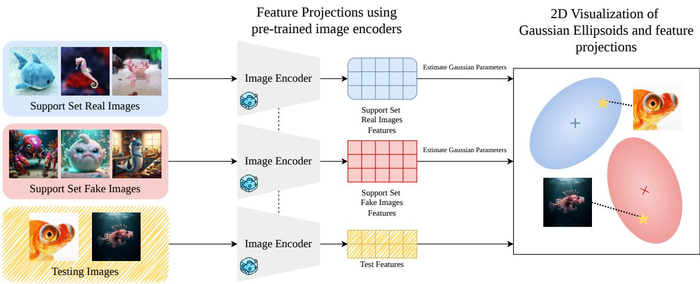
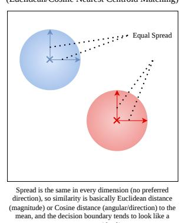
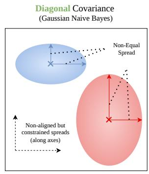
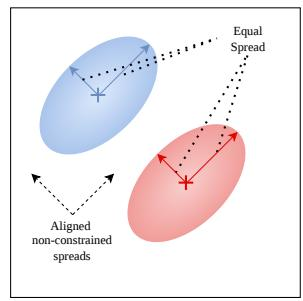
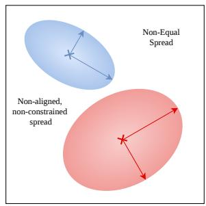
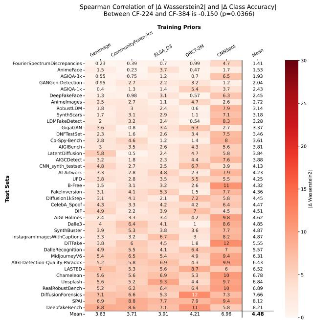
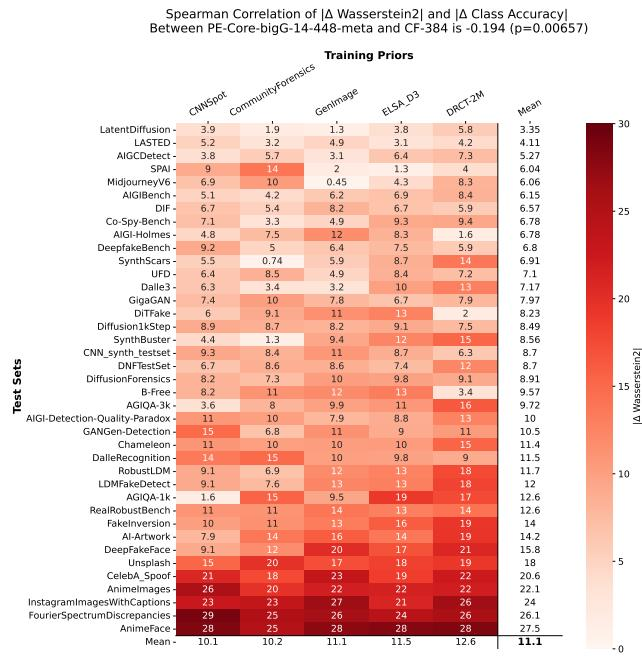

# Prior-Conditioned Gaussian Discriminants for Generalizable AI-generated Image Detection

Shashank Kotyan, Makoto Shing, Yuki Imajuku, Rujikorn Charakorn and Tarin Clanuwat Sakana AI, Tokyo, Japan

Difusion-based generators have made synthetic images ubiquitous, but detectors often fail under simultaneous shifts in generator, prompt/style, and source-domain. We study AI-generated image detection as a transfer system described by training prior, frozen encoder feature space, and decision rule, and ask when classifier head training adds value beyond what is already separable in modern features. As a controlled diagnostic, we fit a prior-conditioned Gaussian discriminant ladder: closed-form heads built from first- and second-order feature statistics under nested covariance assumptions. On Percept-Lens, a unified protocol over 39 public datasets (7.1 million images), the best rung is frequently competitive with, and sometimes exceeds, released AI-generated image detector heads when matched on both prior and encoder. We further quantify strong sensitivity to the training prior, data-eficiency of moment-based heads, and representation dependence of Gaussian shift metrics, motivating (prior, encoder, head)-level reporting and stronger analytical baselines for AIGI transfer.

Keywords: AI-generated image detection; distribution shift; Gaussian discriminant analysis; few-shot transfer;   
transfer learning.

## Contents

1 Introduction 2   
2 Related Works 3   
3 Preliminaries 4   
4 Prior-Conditioned Gaussian Discriminants as Few-Shot Discriminant Heads 4   
5 Investigating Generalization with Percept-Lens suite 7   
6 Conclusion 13   
A On the Computational Paradigm and Practical Utility of Gaussian Discriminants 21   
B Proofs of Theoretical Propositions 21   
C Analytical Forms of the Gaussian Discriminant Ladder 25   
D Details about existing datasets in our Percept-Lens evaluation suite 26   
E Extended Investigation of Generalization with Percept-Lens suite 27   
F Threshold-Free (AUC) Evaluation on Mixed Datasets in Percept-Lens suite 31   
G Class-Conditional Gaussianity Diagnostics of Evaluation Features 39

  
Figure 1 | Training-prior-conditioned Gaussian discriminants in a frozen feature space. A frozen image encoder � maps images � to embeddings �. Given a (possibly few-shot) support set S drawn from a training prior, we estimate classconditional moments (� , Σ ) and instantiate a ladder of classical closed-form heads under nested covariance assumptions. By keeping the encoder and prior fixed, the ladder isolates what the decision rule contributes.

## 1. Introduction

Difusion-based generative models (MidJourney, 2022; Ramesh et al., 2021; Rombach et al., 2022; Saharia et al., 2022) have made high-quality AI-generated imagery widely accessible. These models have practical benefits, but they also complicate trust in visual media and enable misuse of synthetic content (Bushard, 2023; Daniel, 2024; McCarthy, 2023). As a result, AI-generated image (AIGI) detection has become a core recognition problem with direct implications for safety and privacy.

Modern detectors must transfer across shifts in both generator family and image-source domain. In practice these shifts co-occur (new generators, new prompting styles, new platforms, and postprocessing), and performance can collapse even when in-distribution metrics look strong. Moreover, collecting large-scale labeled data from newly emerging generators is often expensive or infeasible. Together, these conditions make AIGI detection a concrete transfer / low-shot recognition problem, where a deployed detector must operate under joint shift and sometimes with only a small support set for calibration.

Existing evaluations (Baraldi et al., 2025; Chen et al., 2024; Zhu et al., 2023) typically probe only part of this space, frequently reusing narrow prompt regimes and closely related sources. Such evaluations can conflate genuine generalization with prior-specific shortcuts. We take a stricter, system-level view. A reported number is a property of a system consisting of a training prior, a frozen image encoder, and a decision rule on top. Here, training prior denotes the data distribution induced by a public training dataset, such as CommunityForensics (Park and Owens, 2025); it is not a Bayesian prior over model parameters. If generalization fails, it is not obvious whether the bottleneck is the representation, the head optimization, or the prior itself.

To isolate the decision-rule factor while keeping the prior and representation fixed, we fit trainingprior-conditioned Gaussian discriminants, which are classical closed-form heads obtained from first- and second-order statistics of frozen encoder features (Figure 1). We organize these rules into a Gaussian discriminant ladder spanning nested covariance assumptions (isotropic, diagonal, shared, classspecific). Because each rung has an analytic solution, the ladder is a reproducible, hyperparameterlight baseline. The identity of the best-performing rung also indicates which low-order feature statistics transfer across generator and domain shifts. Although Gaussian discriminants are classical, we argue that they are underused as diagnostic baselines in AIGI detection, and we find that they can be competitive under matched (prior, encoder) conditions.

Empirically, across 39 public test sets (7.1 million images), at least one rung is often competitive with trained heads under matched priors and frozen encoders. As a retrospective diagnostic upper bound, the best rung can even surpass released heads in several settings. Our decomposition is not fully symmetric across the three factors. The most direct intervention is a matched head replacement, while the encoder and prior experiments are controlled one-factor sweeps. We use the procedure as a source-side audit. If a trained head does not outperform the best rule in the ladder on the same final representation and support prior, classifier training is unlikely to be the source of OOD transfer gains. If it succeeds, it signals structure beyond second moments.

## Contributions.

Prior-conditioned Gaussian discriminant ladder (diagnostic baseline). We instantiate a ladder of classical closed-form Gaussian heads on frozen encoder features, varying covariance assumptions (isotropic → diagonal → shared full → class-specific full). The best-transfer rung provides an interpretable diagnostic of which low-order feature statistics are preserved under shift.

Post-hoc controlled evaluation under matched (prior, encoder) conditions. On Percept-Lens, a unified evaluation protocol built entirely from existing public datasets, we compare released AIgenerated image detector heads against the ladder using the same training prior and the same frozen encoder features. This isolates when trained heads add value beyond low-order geometry.

Empirical drivers of generalization under joint shift. We quantify sensitivity to the training prior under a fixed encoder, show that moment-based heads can adapt with few labeled samples on strong frozen encoders, and demonstrate that Gaussian shift metrics are strongly representationconditioned.

## 2. Related Works

## 2.1. AI-generated Image (AIGI) detection under Distribution Shift

The literature on AIGI detection spans artifact-driven detectors (He et al., 2021; Wang et al., 2020; Yang et al., 2019) and representation-based detectors (Baraldi et al., 2025; Ojha et al., 2023; Park and Owens, 2025). Early work focused on GAN-era artifacts and domain-specific settings such as face forgeries (He et al., 2021; Wang et al., 2020; Yang et al., 2019). Difusion models increased photorealism and prompt diversity, and exposed a persistent failure mode: detectors trained on narrow synthetic prior exploit shortcuts that do not transfer across generators or domains (Baraldi et al., 2025; Chen et al., 2024; Xiao et al., 2025; Zhu et al., 2023). Chen et al. (2024) and Park and Owens (2025) broaden training priors by scaling generator coverage. Ojha et al. (2023), Baraldi et al. (2025), and Zhou et al. (2025a) instead use foundation-model features and lightweight heads. Yang et al. (2026) adjust detector logits or thresholds after training under shift. Our intervention instead replaces the classifier in feature space while matching the prior and encoder. Thus our emphasis is not another trained detector, but what is already separable in frozen encoder space and what the trained head adds under the same prior. This is closely related to the observation that many OOD detectors can be expressed as generative scoring rules on features, but the implications for AIGI detection under joint shift have not been carefully isolated.

## 2.2. Analytical Gaussian Discriminants and Feature-Space Scoring

Gaussian discriminant analysis and Mahalanobis scoring are classical tools for uncertainty and OOD detection (Lee et al., 2018). Wu et al. (2025b) connect few-shot prototypical inference to Euclidean nearest-centroid rules, while Yan et al. (2025) explore orthogonal subspace decompositions that preserve pretrained structure under adaptation.

We build on these ideas, but use them as a diagnostic ladder: isotropic, diagonal, tied, and classspecific covariance assumptions correspond to increasing geometric expressivity. The decision rules themselves are not new. Our contribution is to condition them on explicit training priors and use the ladder covariance model to interpret what transfers, and what does not, across generator and domain shifts.

## 3. Preliminaries

## 3.1. Problem setup

We study binary detection of AI-generated images. Given a training set $\mathcal { D } _ { \operatorname { t r a i n } } = \{ ( x _ { i } , y _ { i } ) \} _ { i = 1 } ^ { n }$ , where $x _ { i }$ are images and $y _ { i } \in \{ 0 , 1 \}$ are labels for real $( y = 0 )$ and synthetic $( y = 1 )$ images, the goal of AIGI detection is to learn a classifier that can accurately predict the label of a previously unseen image.

## 3.2. Feature Extraction and Trained Classifiers

We use a frozen image encoder $\phi : \boldsymbol { X } \to \mathbb { R } ^ { D }$ from a pre-trained foundation model to map each image � to a �-dimensional feature vector $z = \phi ( x )$ . A standard approach trains a discriminative head, such as a linear probe, on these features by minimizing a loss function (e.g., binary cross-entropy) via gradient descent: min $\begin{array} { r } { \mathsf { i } _ { w , b } \sum _ { i = 1 } ^ { n } \mathrm { C E } ( \sigma ( w ^ { \top } z _ { i } + b ) , y _ { i } ) } \end{array}$ where $\sigma ( \cdot )$ is the sigmoid activation function and $\boldsymbol { w } \in \mathbb { R } ^ { D }$ and $b \in \mathbb { R }$ define a separating hyperplane.

More complex models, such as multi-layer perceptrons (MLPs), can learn non-linear decision boundaries. This process iteratively searches for an optimal boundary based on the training data. Although powerful, these methods can overfit to artifacts specific to the generative models in the training set, potentially limiting generalization to unseen generative processes (Park and Owens, 2025; Yan et al., 2025).

We compare (i) trained discriminative detectors that optimize a supervised objective on a given prior and (ii) Gaussian discriminant rule classifiers fitted on frozen features (Section 4). The audit applies to released systems that expose the feature vector used by a classifier, including frequency/statistical detectors (Frank et al., 2020; Yan et al., 2024), reconstruction-based detectors (Cazenavette et al., 2024; Chen et al., 2024), LoRA-adapted detectors (Yan et al., 2025), or end-to-end detectors (Baraldi et al., 2025; Wang et al., 2020) after their final representation is fixed. Methods that expose only a scalar anomaly score can still be evaluated by Percept-Lens as complete detectors, but their internal head cannot be replaced by the ladder. The split is diagnostic: if a trained head underperforms a closed-form rule under OOD shift, the trained head’s decision surface and/or training prior is implicated rather than only the encoder capacity.

## 4. Prior-Conditioned Gaussian Discriminants as Few-Shot Discriminant Heads

We use Gaussian class-conditional models as a controlled diagnostic of what information is already separable in a frozen feature space. Motivated by classical generative classification and recent analyses of contrastive representations using mixture models (Bansal et al., 2025), we approximate

$$
p ( z \mid y = c ) ~ \approx ~ N ( \mu _ { c } , \Sigma _ { c } ) , ~ c \in \{ 0 , 1 \} .\tag{4.1}
$$

Given a support set S drawn from a training prior, $S \subseteq { \mathcal { D } } _ { \operatorname { t r a i n } } ,$ we estimate $\left( \mu _ { c } , \Sigma _ { c } \right)$ by sample moments. We also define the pooled covariance $\begin{array} { r } { \dot { \Sigma } _ { p } = \frac { ( n _ { 0 } - 1 ) \Sigma _ { 0 } + ( n _ { 1 } - 1 ) \Sigma _ { 1 } } { n _ { 0 } + n _ { 1 } - 2 } } \end{array}$ , used when assuming a shared

Spherical (Isotropic) Covariance (Euclidean/Cosine Nearest Centroid Matching)

  
Figure 2 | Gaussian discriminant ladder as nested covariance assumptions. Each rung is a classical generative classifier obtained by restricting the class-conditional covariance: isotropic (Euc-/Cos-NCM), diagonal (GNB), shared full covariance (Mah-NCM), or class-specific full covariance (QDA). This nested family makes it possible to diagnose how much transferable signal is captured by first- and second-order feature statistics.

  
Spread can differ per dimension but dimensions don’t covary (no rotation), so distance is like Euclidean after perdimension re-scaling, and the boundary can bend but stays constrained by axis-aligned geometry.  
Homoscedastic Covariance (Mahalanobis Nearest Centroid Matching)

  
All classes share the same covariance (same ellipse shape for everyone), so differences come mainly from where the means are, and the decision boundary becomes linear.  
Heteroscedastic Covariance (Quadratic Discriminant Analysis)

  
Each class has its own covariance including correlation (rotated ellipses allowed), so the model adapts to classspecific geometry, and the decision boundary becomes quadratic/curvy.

covariance structure. In high-dimensional embeddings, covariance inversion can be ill-conditioned. We therefore use standard regularization (diagonal loading and shrinkage) when computing ${ \boldsymbol { \Sigma } } ^ { - 1 }$ and log-determinants (Appendix Section D). The Gaussian assumption is diagnostic rather than literal. Appendix Tables 23 and 24 shows mostly near-Gaussian marginal summaries on PE-Core features, but also clear failures such as FourierSpectrumDiscrepancies (Dzanic et al., 2020) and DiffusionForensics-fake (Wang et al., 2023). Multimodal or heavy-tailed regimes are exactly where trained non-linear heads may add value.

This yields a ladder of classical discriminant rules in closed form, and the best-performing covariance assumption becomes an interpretable indicator of which feature statistics transfer across domains, bypassing iterative training. (The same estimation extends to �-way �-shot classification. We focus on binary AIGI detection.)

In this article, we consider Cosine Nearest Centroid Matching (Cos-NCM), Gaussian Naive Bayes (GNB), Mahalanobis Nearest Centroid Matching (Mah-NCM), and Quadratic Discriminant Analysis (QDA) as Gaussian discriminants. We also include squared Euclidean nearest-centroid matching (Euc-NCM), which mirrors the inference rule used in prototypical-network detectors (e.g. Wu et al., 2025b) but is applied directly in the frozen encoder space without metric learning. Table 1 provides an overview of Gaussian discriminants in analytical form, while Figure 2 provides a visual explanation.

Euclidean Nearest Centroid Matching (Euc-NCM). Assuming an isotropic shared covariance $\Sigma _ { c } ~ = ~ \sigma ^ { 2 } I$ , the Gaussian log-likelihood (up to additive constants) is proportional to the squared Euclidean distance to the class mean. Prediction reduces to nearest-centroid classification in the frozen feature space, matching prototypical inference without metric learning.

Cosine Nearest Centroid Matching (Cos-NCM). When features are $\ell _ { 2 } \cdot$ -normalized, isotropic Gaussian scoring is monotone in cosine similarity. Cos-NCM predicts the class whose centroid has the highest cosine similarity to the query.

Gaussian Naive Bayes (GNB). GNB assumes diagonal covariance $\Sigma _ { c } = \mathrm { d i a g } ( \sigma _ { c , 1 } ^ { 2 } , . . . , \sigma _ { c , D } ^ { 2 } )$ , which implies conditionally independent features. The assumption simplifies classification but ignores feature correlations.

Table 1 | Gaussian discriminant ladder used as analytical baselines. Each rung is a generative classifier obtained by restricting the class-conditional covariance (isotropic, diagonal, homoscedastic, or heteroscedastic), which determines the geometry of the induced decision boundary. We use this ladder to isolate head efects in a fixed frozen encoder feature space rather than to propose a new detector.
<table><tr><td>Gaussian Discriminant</td><td colspan="2">Covariance Structure Assumption</td><td>Decision Boundary</td><td>Characteristic</td></tr><tr><td>Euclidean Nearest Centroid Matching (Euc-NCM)</td><td>Isotropic</td><td> $\Sigma _ { c \in \{ 0 , 1 \} } = \sigma ^ { 2 } I$ </td><td>Linear</td><td>Assumes spherical class distributions.</td></tr><tr><td>Cosine Nearest Centroid Isotropic Matching (Cos-NCM)</td><td></td><td> $\Sigma _ { c \in \{ 0 , 1 \} } = \sigma ^ { 2 } I$ </td><td>Linear</td><td>Assumes spherical class distributions; decision is based on angular proximity, suitable for normalized</td></tr><tr><td>Gaussian Naive Bayes (GNB) Diagonal</td><td></td><td> $\Sigma _ { c \in \{ 0 , 1 \} } = \mathrm { d i a g } ( \sigma _ { c , j } ^ { 2 } )$ </td><td>Non-Linear</td><td>embeddings. Simplest model; assumes feature independence, useful for identifying decorrelated representations.</td></tr><tr><td>Mahalanobis Centroid Matching (Mah- NCM)</td><td>Nearest Homoscedastic</td><td> $\Sigma _ { 0 } = \Sigma _ { 1 } = \Sigma _ { p }$ </td><td>Linear</td><td>Assumes classes share the same elliptical shape. It accounts for feature correlations by whitening the</td></tr><tr><td>Quadratic Analysis (QDA)</td><td>Discriminant Heteroscedastic</td><td> $\Sigma _ { 0 } \neq \Sigma _ { 1 }$ </td><td>Quadratic</td><td>space, yielding a correlation-aware linear boundary. Most general model; allows each class to have a unique elliptical shape and orientation, capturing complex separations.</td></tr></table>

Mahalanobis Nearest Centroid Matching (Mah-NCM). Mah-NCM assumes homoscedasticity, i.e., a shared covariance matrix for both classes $\Sigma _ { 0 } = \Sigma _ { 1 } = \Sigma _ { p }$ . The classification decision is based on the Mahalanobis distance $( z - \mu _ { c } ) ^ { \top } \Sigma _ { p } ^ { - 1 } ( z - \mu _ { c } )$ , which accounts for the correlations of the features by transforming the feature space into one in which the pooled covariance is the identity.

Quadratic Discriminant Analysis (QDA). QDA is the most general of the four classifiers, allowing each class to have its own full-rank covariance matrix $\left( \Sigma _ { 0 } \neq \Sigma _ { 1 } \right)$ , thus assuming heteroskedasticity. The resulting quadratic boundary can adapt to classes with diferent shapes and orientations.

## 4.1. Connection to classical generative classification

The eficacy of these Gaussian discriminants in analytical form can be understood through the lens of Bayesian decision theory, which provides a formal basis for our geometric approach. Under the Gaussian assumption, they approximate or realize the Bayes-optimal classifier, which minimizes the probability of error. Full proofs are provided in the Appendix Section B.

Proposition 1 (Bayes-Optimal Classifier under Gaussian Assumption). If the class-conditional densities are Gaussian, $p ( z \mid y = c )$ ≈ $\mathcal { N } ( \mu _ { c } , \Sigma _ { c } )$ , and the class priors are equal, $\begin{array} { r } { P ( y = 0 ) = P ( y = 1 ) = \frac { 1 } { 2 } } \end{array}$ , the Bayes-optimal decision rule is given by Quadratic Discriminant Analysis (QDA).

Proposition 2 (Optimality under Homoscedasticity). If the classes are additionally assumed to be homoscedastic (i.e., they share a common covariance matrix $\Sigma _ { 0 } = \Sigma _ { 1 } = \Sigma _ { p } ) _ { . }$ , the Bayes-optimal decision rule simplifies to Mahalanobis Nearest Centroid Matching (Mah-NCM).

Proposition 3 (Performance Stability under Bounded Drift). Assume a homoscedastic classifier with shared covariance Σ and equal priors. If the statistical drift between the training and testing distributions is bounded by $\| \mu _ { c } ^ { t e s t } - \mu _ { c } ^ { t r a i n } \| _ { 2 } \leq \epsilon _ { \mu }$ and $\Vert \Sigma ^ { t e s t } - \Sigma ^ { t r a i n } \Vert _ { F } \leq \epsilon _ { \Sigma } ,$ then $\left| \mathrm { A U C } _ { t e s t } - \mathrm { A U C } _ { t r a i n } \right| \leq L ( \epsilon _ { \mu } + \epsilon _ { \Sigma } )$ where � is the Lipschitz constant.

Proposition 4 (Stability of the Fisher Margin under Distributional Drift). Assume that both the training and testing domains are characterized by homoscedastic Gaussian parameters. If the distributional drift is bounded such that $\lVert \delta ^ { t e s t } - \delta ^ { t r a i n } \rVert _ { 2 } \leq \epsilon$ and $\| \Sigma _ { p } ^ { t e s t } - \Sigma _ { p } ^ { t r a i n } \| _ { F } \leq \eta ,$ where $\delta = \mu _ { 1 } - \mu _ { 0 }$ , then the absolute change in the Fisher Margin ${ \mathcal { D } } _ { \mu }$ is bounded, to a first order, by $\begin{array} { r } { | \mathcal { D } _ { \mu } ^ { t e s t } - \mathcal { D } _ { \mu } ^ { t r a i n } | \leq 2 \| ( \Sigma _ { p } ^ { t r a i n } ) ^ { - 1 } \| _ { 2 } \| \delta ^ { t r a i n } \| _ { 2 } \epsilon + O ( \eta ) } \end{array}$

These propositions should be read as model-conditional: they characterize the optimal decision rules if frozen features are well-approximated by Gaussian class-conditionals. They provide the theoretical foundation for our geometric analysis of generalization. Under this model, Quadratic Discriminant Analysis is Bayes-optimal in the heteroscedastic case (Proposition 1) and simplifies to a linear rule under a shared covariance (Mahalanobis-NCM; Proposition 2). Proposition 3 shows that, under the homoscedastic Gaussian model, the AUC of Mah-NCM is a monotone function of the Fisher margin ${ \mathcal { D } } _ { \mu }$ Proposition 4 bounds how ${ \mathcal { D } } _ { \mu }$ changes under drift in low-order statistics. Together, these results imply smooth degradation when class means and covariances drift. In this model, reliable generalization requires geometric alignment between training and testing data.

The linear decision boundary of Mah-NCM has the same functional form as a linear probe trained with cross-entropy. Both induce a single separating hyperplane in �-space. The key diference is optimization rather than representation. A neural network iteratively searches for the boundary, whereas Gaussian discriminants compute it analytically from the data’s first- and second-order statistics. Thus, when a trained linear head does not outperform Gaussian discriminants under matched priors and encoders, the result is consistent with the hypothesis that second-order feature geometry is already suficient for separation. Consistent gaps instead suggest non-Gaussian or higher-order structure that the ladder cannot capture.

Limitations. By design, the Gaussian ladder is restricted to a Gaussian class-conditional approximation based on first- and second-order statistics. The result is a diagnostic baseline rather than a universal detector, one that leaves out higher-order, multimodal, or heavy-tailed cues from strong post-processing, unusual content, or generator-specific artifacts. In those regimes, trained non-linear heads or end-to-end adaptation can legitimately outperform the ladder.

## 5. Investigating Generalization with Percept-Lens suite

We use the Gaussian ladder to investigate which components of a detection system drive OOD performance under realistic distribution shift. We focus on the training prior, the frozen encoder, and the decision rule on top. To assess the reliability of current AI-generated image detectors under realistic generative variability, we begin by evaluating pre-trained models on the Percept-Lens test suite. These results help to localize whether failures are attributable to the training prior, the encoder feature space, or the trained decision surface, motivating more principled system-level investigations.

## 5.1. Evaluation Protocol and Data

Percept-Lens denotes a unified evaluation protocol constructed entirely from existing public datasets to stress-test AIGI detectors under joint distribution shift. Unlike settings where only the generator family changes while the underlying image source and prompt distribution remain fixed, Percept-Lens explicitly couples shifts in generator family, prompt/style, and acquisition pipeline (Figure 3). To avoid conflating in-distribution performance with transfer, the large training priors used for conditioning (e.g., CommunityForensics, GenImage, DRCT-2M, ELSA-D3) are treated as support-only and are not part of the evaluation suite.

Evaluation Datasets. The Percept-Lens suite aggregates 39 existing public datasets totaling 7.1 million images. It spans real-only, synthetic-only, and mixed regimes, with joint shifts in (i) generator family, (ii) prompt/style, and (iii) image-source domain and post-processing. Concretely, it combines in-the-wild real sources, synthetic-only prompt/style collections, and mixed forensic benchmarks spanning diverse generators and post-processing.

  
Uses some data source (e.g. one of ImageNet-1k, COCO, LAION-400M) and generative model to train the AI-Generated Image Detectors

  
Uses some different generative model (e.g. Stable Diffusion XL-Turbo, Stable Diffusion v1.4) to evaluate the trained AI-Generated Image Detectors

  
Uses some different data source (e.g. DiffusionDB, AI-Artworks) to evaluate the trained AI-Generated Image Detectors

  
Uses different data sources (Art, Social-Media, Face, User-generated) and generative models (e.g. Stable Diffusion, FLUX, MidJourney, and various GANs) to evaluate the AI-Generated Image Detectors

Figure 3 | Percept-Lens stress-tests detectors under joint distribution shift. Percept-Lens is an evaluation protocol built entirely from existing public datasets. Many AIGI evaluations vary either the generator family or the image source in isolation; we instead evaluate under joint shifts in generator family, prompt/style, and source domain, closer to deployment where these factors drift together.

Table 2 | Closed-form Gaussian discriminants versus released AI-generated image detector heads under matched (prior, encoder) conditions. Mean class accuracy CA (dataset-wise balanced accuracy where defined; Section 5.1), macroaveraged across Percept-Lens evaluation datasets. For each released detector checkpoint, we report (i) the released decision head (Out-of-the-Shelf) and (ii) closed-form baselines fitted on the same frozen encoder features using the corresponding public training prior: Euc-NCM (Wu et al., 2025b) and the best-performing rung of the Gaussian ladder. The full ladder is reported in Table 3. (Parentheses indicate the training subset reported by the original work when applicable.)

<table><tr><td>Detection Model</td><td>Out-of-the-Shelf Euc-NCM (Wu et al., 2025b)</td><td></td><td>Gaussian ladder (best)</td></tr><tr><td colspan="4">Trained with CNNSpot (Wang et al., 2020) (ProGAN Images based on LSUN)</td></tr><tr><td>UnivFD (Ojha et al., 2023)</td><td>54.63% 56.41%</td><td>50.98% 54.25%</td><td>57.62% (Mah-NCM) (2.99% ↑)</td></tr><tr><td>AIDE (Yan et al., 2024)</td><td></td><td></td><td>62.76% (Mah-NCM)(6.35% ↑)</td></tr><tr><td colspan="4">Trained with GenImage (Zhu et al., 2023) (Diffusion Model Images based on ImageNet-1k)</td></tr><tr><td>AIDE (GenImage-SDv1) (Yan et al., 2024)</td><td>48.99%</td><td>54.53%</td><td>57.35% (Mah-NCM) (8.36% ↑)</td></tr><tr><td>Effort (GenImage-SDv1) (Yan et al., 2025)</td><td>72.58%</td><td>75.06%</td><td>76.82% (Mah-NCM) (4.24% ↑)</td></tr><tr><td>DRCT-UnivFD (Full GenImage) (Chen et al., 2024)</td><td>65.77%</td><td>66.08%</td><td>73.01% (Mah-NCM) (7.24% ↑)</td></tr><tr><td>AIDE (Full GenImage) (Yan et al., 2024)</td><td>54.98%</td><td>52.24%</td><td>64.64% (Mah-NCM) (9.66% ↑)</td></tr><tr><td colspan="4">Trained with DRCT-2M (Chen et al., 2024) (Stable Diffusion Model Images based on COCO)</td></tr><tr><td>DRCT-UnivFD (DRCT-SDv1) (Chen et al., 2024)</td><td>63.36% 62.37%</td><td>65.36% 66.31%</td><td>70.20% (QDA) (6.84% ↑)</td></tr><tr><td>DRCT-UnivFD (DRCT-SDv2) (Chen et al., 2024)</td><td></td><td></td><td>70.31% (QDA) (7.94% ↑)</td></tr><tr><td colspan="4">Trained with ELSA-D3 (Baraldi et al., 2025) or CommunityForensics (Park and Owens, 2025) (Diffusion Model Images based on LAION-400M Dataset)</td></tr><tr><td>CoDE-kNN (ELSA-D3) (Baraldi et al., 2025)</td><td>64.01% 81.98%</td><td>63.63%</td><td>66.15% (Mah-NCM) (2.14% ↑)</td></tr><tr><td>CF-224 (CommunityForensics) (Park and Owens, 2025)</td><td></td><td>78.53%</td><td>82.61% (Mah-NCM) (0.63% ↑)</td></tr><tr><td>CF-384 (CommunityForensics) (Park and Owens, 2025)</td><td>87.54%</td><td>82.65%</td><td>84.55% (Mah-NCM) (-2.99% ↓)</td></tr><tr><td colspan="4">Frozen image encoder (no detection fine-tuning)</td></tr><tr><td>PE-Core-bigG-14-448 (Bolya et al., 2025)</td><td></td><td>86.38%</td><td>94.46% (Mah-NCM)</td></tr></table>

Percept-Lens standardizes evaluation over existing public datasets to ensure head–prior–encoder comparisons are tested under a realistic mixture of shifts. The complete manifest of the dataset and the composition of the class are provided in Appendix Table 9.

Evaluation Protocol. For a training prior, detectors are evaluated on every dataset in the Percept-Lens test suite. We report a dataset-wise class accuracy that equals balanced accuracy when both classes are present and reduces to class-conditional accuracy on one-class sets. Concretely, for an evaluation dataset � with observed classes C ⊆ {0, 1}, we define Class Accuracy CA as

Table 3 | Comparative Performance of Diferent Gaussian Discriminants. Mean class accuracy CA (macro-averaged across Percept-Lens evaluation datasets) for each rung of the Gaussian discriminant ladder, conditioned on the same public training prior and fitted on the same frozen features as in Table 2. (Parentheses indicate the training subset reported by the original work; underlining denotes improvement over the corresponding released head as reported in Table 2.)
<table><tr><td colspan="4">Detection Model Cos-NCM GNB Mah-NCM QDA</td></tr><tr><td colspan="4">Trained with CNNSpot (Wang et al., 2020) (ProGAN Images based on LSUN Dataset)</td></tr><tr><td>UnivFD (Ojha et al., 2023) AIDE (Yan et al., 2024)</td><td>51.01% 54.36%</td><td>48.44% 56.69%</td><td>57.62% 48.23% 62.76% 61.28%</td></tr><tr><td colspan="4"></td></tr><tr><td colspan="4">Trained with GenImage (Zhu et al., 2023) (Diffusion Model Images based on ImageNet-1k Dataset) AIDE (GenImage-SDv1) (Yan et al., 2024)</td></tr><tr><td>Effort (GenImage-SDv1) (Yan et al., 2025)</td><td>54.23% 54.39% 74.44% 74.92%</td><td>57.35% 76.82%</td><td>57.15% 73.21%</td></tr><tr><td colspan="4">DRCT-UnivFD (Full GenImage) (Chen et al., 2024)</td></tr><tr><td>AIDE (Full GenImage) (Yan et al., 2024)</td><td>67.97% 68.28% 52.66% 53.92%</td><td>73.01% 64.64%</td><td>69.74% 56.20%</td></tr><tr><td colspan="4"></td></tr><tr><td colspan="4">Trained with DRCT-2M (Chen et al., 2024) (Stable Diffusion Model Images based on COCO Dataset) DRCT-UnivFD (DRCT-SDv1) (Chen et al., 2024)</td></tr><tr><td>DRCT-UnivFD (DRCT-SDv2) (Chen et al., 2024) 65.53%</td><td>65.16% 66.37% 66.69%</td><td>65.21% 67.91%</td><td>70.20% 70.31%</td></tr><tr><td colspan="4">Trained with ELSA-D3 (Baraldi et al., 2025) or CommunityForensics (Park and Owens, 2025)</td></tr><tr><td colspan="4">(Diffusion Model Images based on LAION-400M Dataset) CoDE-kNN (ELSA-D3) (Baraldi et al., 2025) 62.70%</td></tr><tr><td>CF-224 (CommunityForensics) (Park and Owens, 2025) 78.98%</td><td>65.98% 79.45%</td><td>66.15% 82.61%</td><td>64.00% 80.70%</td></tr><tr><td colspan="4">CF-384 (CommunityForensics) (Park and Owens, 2025) 84.46% 80.01% 84.55%</td></tr><tr><td></td><td></td><td></td><td>79.52%</td></tr><tr><td colspan="4">Frozen image encoder (no detection fine-tuning)</td></tr><tr><td>PE-Core-bigG-14-448 (Bolya et al., 2025)</td><td>86.06% 87.26%</td><td>94.46%</td><td>86.15%</td></tr></table>

$$
\mathsf { C A } ^ { ( \phi ) } ( t ) = \frac { 1 } { | C _ { t } | } \sum _ { c \in C _ { t } } \mathsf { P r } ( \hat { y } ^ { \phi } = c \mid y = c ) ,\tag{5.1}
$$

and report the macro-average $\begin{array} { r } { \frac { 1 } { | \mathcal { T } | } \sum _ { t \in \mathcal { T } } \mathbf { C } \mathsf { A } ( t ) } \end{array}$ across evaluation datasets $\mathcal { T }$ so that no single large dataset dominates. For all detectors we use the default arg max decision on predicted class probabilities and do not tune thresholds per dataset. On real-only sets, CA corresponds to true-negative accuracy (1–FPR); on synthetic-only sets it corresponds to true-positive accuracy (1–FNR). We additionally compute AUC on the 24 mixed datasets (those containing both real and synthetic images) and report in Appendix Section F.

## 5.2. Closed-form Gaussian Discriminants versus Trained Heads

Tables 2 and 3 compares released AI-generated image detector heads with Gaussian discriminant rules fitted on the same frozen features and conditioned on the same training prior. Several rows in Tables 2 and 3 share the same underlying backbone. UnivFD and DRCT-UnivFD both use ViT-L-14-quickgelu-openai (Radford et al., 2021) as the image encoder; diferences arise from the public training prior and the trained head. DRCT exposes classifier features after reconstruction training. Effort applies LoRA adaptation before its head. AIDE uses frequency/statistical experts plus semantic features, and CoDE/CF train backbones and heads end-to-end. All are auditable once the encoder’s final feature space is exposed.

Across several priors, the best closed-form Gaussian discriminant improves class accuracy, with the largest gains occurring when separation is well-captured by first- and second-order moments (often Mah-NCM). These patterns are consistent with Propositions 1 and 2: when separation is well-captured by first- and second-order moments in a frozen encoder feature space, the corresponding Gaussian discriminants recover most of the available discriminative geometry. A main exception is CF-384 (Park and Owens, 2025), where the released detector remains ahead of the ladder (87.54% vs. 84.55% CA), consistent with a regime in which the trained head’s decision surface exploits structure not explained by second-order moments alone. Per-dataset results in Tables 14 and 21 also show large variability. For example, Mah-NCM reaches near-ceiling performance on many synthetic-only sets but is much weaker on DeepFakeBench (Yan et al., 2023), while QDA performs best on CelebA-Spoof (Zhang et al., 2020).

Table 4 | Encoder scaling under a fixed prior: representation choice strongly afects transfer. Mean class accuracy CA (macro-averaged across Percept-Lens evaluation datasets) for Gaussian discriminant heads conditioned on the same CommunityForensics training prior (Park and Owens, 2025), using frozen CLIP encoders of increasing capacity pretrained by OpenAI. Only the head is changed. No detector fine-tuning is performed.
<table><tr><td>Frozen Encoders</td><td>Euc-NCM (Wu et al., 2025b)</td><td>Cos-NCM</td><td>GNB</td><td>Mah-NCM</td><td>QDA</td></tr><tr><td>ResNet-50 (Timm, 2024a)</td><td>65.27%</td><td>64.36%</td><td>65.72%</td><td>72.00%</td><td>63.15%</td></tr><tr><td>ResNet-101 (He et al., 2016)</td><td>65.20%</td><td>64.70%</td><td>64.46%</td><td>70.27%</td><td>62.29%</td></tr><tr><td>ResNet-50x4 (Timm, 2024c)</td><td>66.24%</td><td>65.91%</td><td>65.12%</td><td>72.34%</td><td>64.28%</td></tr><tr><td>ResNet-50x16 (Timm, 2024b)</td><td>67.35%</td><td>66.77%</td><td>66.21%</td><td>74.98%</td><td>65.71%</td></tr><tr><td>ResNet-50x64 (Timm, 2024d)</td><td>68.42%</td><td>68.19%</td><td>65.02%</td><td>74.57%</td><td>68.38%</td></tr><tr><td>ViT-B/16 (Laion, 2024d)</td><td>64.66%</td><td>64.65%</td><td>66.37%</td><td>74.18%</td><td>65.70%</td></tr><tr><td>ViT-B/32 (Laion, 2024e)</td><td>64.53%</td><td>64.25%</td><td>64.83%</td><td>70.61%</td><td>62.81%</td></tr><tr><td>ViT-L/14 (Radford et al., 2021)</td><td>66.18%</td><td>68.44%</td><td>69.79%</td><td>76.96%</td><td>68.87%</td></tr></table>

Table 5 | Pretraining objective afects transfer even without detector training. Mean class accuracy CA (macro-averaged across Percept-Lens evaluation datasets) for Gaussian discriminant heads conditioned on the same CommunityForensics training prior (Park and Owens, 2025), using frozen encoders trained with diferent objectives.
<table><tr><td>Frozen Encoders</td><td>Euc-NCM (Wu et al., 2025b)</td><td>Cos-NCM</td><td>GNB</td><td>Mah-NCM</td><td>QDA</td></tr><tr><td>MAE-Huge (He et al., 2022)</td><td>55.18%</td><td>55.22%</td><td>58.33%</td><td>69.37%</td><td>64.01%</td></tr><tr><td>BEiT-Large (Bao et al., 2022)</td><td>58.53%</td><td>58.49%</td><td>58.80%</td><td>61.78%</td><td>53.63%</td></tr><tr><td>CLIP-XLM-RoBERTa-Large (Cherti et al., 2023)</td><td>70.72%</td><td>69.70%</td><td>70.61%</td><td>77.67%</td><td>65.79%</td></tr><tr><td>SigLIP-Large (Zhai et al., 2023)</td><td>58.25%</td><td>58.25%</td><td>58.07%</td><td>64.14%</td><td>60.85%</td></tr><tr><td>BLIP-Large (Li et al., 2022)</td><td>55.75%</td><td>56.89%</td><td>53.87%</td><td>70.17%</td><td>55.42%</td></tr><tr><td>BLIP2 (Li et al., 2023)</td><td>68.61%</td><td>68.46%</td><td>65.41%</td><td>77.73%</td><td>62.21%</td></tr><tr><td>DINOv2-giant (Oquab et al., 2024)</td><td>63.15%</td><td>63.59%</td><td>61.95%</td><td>73.30%</td><td>58.52%</td></tr><tr><td>DINOv3-ViT-7b (Siméoni et al., 2025)</td><td>83.85%</td><td>85.82%</td><td>83.18%</td><td>88.91%</td><td>78.88%</td></tr></table>

## 5.3. Encoder Sensitivity of Closed-form Gaussian Discriminants

We investigate the model-agnostic behavior of the ladder by evaluating a range of frozen architectures and pretraining objectives (Tables 4 and 5). Mah-NCM is consistently the top performer across these encoders, indicating that a shared full-covariance geometry captures a stable component of real/fake separability in modern representation spaces. This motivates a practical reporting guideline. Trained heads on frozen encoders should be compared against the best Gaussian rung on the same frozen features. Additional models are presented in Appendix Section E.

## 5.4. Training Prior Sensitivity of Closed-form Gaussian Discriminants

We isolate training-prior efects by fixing PE-Core-bigG-14-448 (Bolya et al., 2025) as the encoder and varying only the support prior used to estimate Gaussian parameters (Table 6). The spread is large: the best CA ranges from 77.92% (CNNSpot) to 94.46% (CommunityForensics), despite using the same representation and evaluation suite.

Moreover, the prevailing covariance assumption shifts with the prior: DRCT-2M favors QDA (heteroscedastic) while all others favor Mah-NCM (homoscedastic). Thus, if two papers use the same backbone but diferent priors, their OOD behavior can difer more than what is attributable to the classifier family within the Gaussian ladder.

Table 6 | Training prior dominates transfer even under a fixed encoder. Mean class accuracy CA (macro-averaged across Percept-Lens evaluation datasets) for Gaussian discriminant heads when varying only the support prior used to estimate moments, under the fixed frozen PE-Core-bigG-14-448 encoder (Bolya et al., 2025). Underlining denotes improvement over the best released head of CF-384 (Park and Owens, 2025) as reported in Table 2.
<table><tr><td>Training Dataset</td><td>Euc-NCM (Wu et al., 2025b)</td><td>Cos-NCM</td><td>GNB</td><td>Mah-NCM</td><td>QDA</td></tr><tr><td>CNNSpot (Wang et al., 2020)</td><td>74.95%</td><td>78.57%</td><td>59.21%</td><td>77.93%</td><td>49.24%</td></tr><tr><td>GenImage (Zhu et al., 2023)</td><td>86.68%</td><td>88.75%</td><td>87.50%</td><td>92.43%</td><td>81.83%</td></tr><tr><td> $\mathtt { G e n I m a g e - S D v 1 }$ </td><td>88.74%</td><td>89.80%</td><td>86.34%</td><td>92.57%</td><td>65.06%</td></tr><tr><td>DRCT-2M (Chen et al., 2024)</td><td>81.90%</td><td>81.76%</td><td>86.21%</td><td>83.25%</td><td>91.09%</td></tr><tr><td>DRCT-SDv1 (Chen et al., 2024)</td><td>82.29%</td><td>83.81%</td><td>88.70%</td><td>88.31%</td><td>89.92%</td></tr><tr><td>DRCT-SDv2 (Chen et al., 2024)</td><td>83.50%</td><td>84.38%</td><td>89.56%</td><td>90.08%</td><td>91.44%</td></tr><tr><td>ELSA-D3 (Baraldi et al., 2025)</td><td>88.87%</td><td>89.03%</td><td>86.98%</td><td>94.45%</td><td>86.40%</td></tr><tr><td>CommunityForensics (Park and Owens, 2025)</td><td>86.38%</td><td>86.06%</td><td>87.26%</td><td>94.46%</td><td>86.15%</td></tr></table>

Table 7 | Data-eficiency of moment-based heads. Mean class accuracy CA (macro-averaged across Percept-Lens evaluation datasets) for Gaussian discriminant heads as the support set used to estimate moments is subsampled from CommunityForensics (Park and Owens, 2025), under the fixed frozen PE-Core-bigG-14-448 encoder (Bolya et al., 2025). (Superscript/subscript denote max/min deviations (in percentage points) from the reported mean).
<table><tr><td>Amount</td><td>Euc-NCM (Wu et al., 2025b)</td><td>Cos-NCM</td><td>GNB</td><td>Mah-NCM</td><td>QDA</td></tr><tr><td>0.001%</td><td> $8 3 . 9 7 \% _ { - 2 . 7 4 } ^ { + 1 . 9 3 }$ </td><td> $8 3 . 4 6 \% _ { - 2 . 4 7 } ^ { + 2 . 2 5 }$ </td><td> $8 7 . 1 4 \% _ { - 1 . 6 8 } ^ { + 1 . 2 1 }$ </td><td> $8 5 . 5 6 \% _ { - 1 . 7 5 } ^ { + 1 . 8 4 }$ </td><td> $8 5 . 1 3 \% _ { - 0 . 6 6 } ^ { + 1 . 0 7 }$ </td></tr><tr><td>0.005%</td><td> $8 6 . 0 4 \% _ { - 0 . 4 0 } ^ { + 0 . 2 8 }$ </td><td> $8 5 . 7 8 \% _ { - 0 . 5 3 } ^ { + 0 . 2 7 }$ </td><td> $8 7 . 2 3 \% _ { - 0 . 7 7 } ^ { + 0 . 7 6 }$ </td><td> $9 0 . 8 9 \% _ { - 1 . 3 4 } ^ { + 0 . 7 3 }$ </td><td> $8 5 . 5 3 \% _ { - 1 . 7 1 } ^ { + 1 . 5 1 }$ </td></tr><tr><td>0.01%</td><td> $8 6 . 3 2 \% _ { - 0 . 3 5 } ^ { + 0 . 6 7 }$ </td><td> $8 6 . 0 2 \% _ { - 0 . 4 2 } ^ { + 0 . 7 7 }$ </td><td> $8 7 . 4 2 \% _ { - 0 . 9 0 } ^ { + 1 . 1 9 }$ </td><td> $9 1 . 5 5 \% _ { - 0 . 6 9 } ^ { + 0 . 6 7 }$ </td><td> $8 6 . 4 8 \% _ { - 0 . 8 2 } ^ { + 1 . 1 6 }$ </td></tr><tr><td>0.1%</td><td> $8 6 . 2 6 \% _ { - 0 . 4 4 } ^ { + 0 . 7 1 }$ </td><td> $8 5 . 9 2 \% _ { - 0 . 4 7 } ^ { + 0 . 7 4 }$ </td><td> $8 7 . 3 3 \% _ { - 0 . 1 9 } ^ { + 0 . 2 2 }$ </td><td> $9 3 . 1 8 \% _ { - 0 . 5 4 } ^ { + 0 . 4 2 }$ </td><td> $8 4 . 1 8 \% _ { - 0 . 7 1 } ^ { + 0 . 3 3 }$ </td></tr><tr><td>1%</td><td> $8 6 . 3 9 \% _ { - 0 . 1 2 } ^ { + 0 . 1 1 }$ </td><td> $8 6 . 0 5 \% _ { - 0 . 1 0 } ^ { + 0 . 1 1 }$ </td><td> $8 7 . 2 8 \% _ { - 0 . 0 5 } ^ { + 0 . 0 4 }$ </td><td> $9 3 . 5 2 \% _ { - 0 . 1 7 } ^ { + 0 . 2 8 }$ </td><td> $8 5 . 1 6 \% _ { - 0 . 3 4 } ^ { + 0 . 2 0 }$ </td></tr><tr><td>100%</td><td>86.38%</td><td>86.06%</td><td>87.26%</td><td>94.46%</td><td>86.15%</td></tr></table>

## 5.5. Data Eficiency of Closed-form Gaussian Discriminants

We investigate data eficiency by subsampling the support set used to estimate Gaussian parameters (Table 7). Performance saturates quickly. With only 1% of the prior (around 43k samples), Mah-NCM nearly matches the full-support estimate, while at extremely small support sizes (0.001% of the prior, or 44 samples) the diagonal GNB assumption can be more stable. The pattern reinforces the central observation from the ladder. For this support prior and encoder, low-order feature statistics capture a large share of the signal used by the best head, without iterative optimization.

With the frozen PE-Core-bigG-14-448 encoder (Bolya et al., 2025), Mah-NCM fitted from only 0.005% of the CommunityForensics prior (219 labeled samples) reaches 90.89% CA. Although this is not an apples-to-apples comparison to CF-384 (which uses a diferent backbone), it indicates that moment-based adaptation can be data-eficient once the representation is strong.

## 5.6. Representation Sensitivity of Wasserstein-2 Shift Estimates

All geometric shift metrics in Percept-Lens are computed in the encoder’s feature space, hence their numerical values are not purely properties of the data distributions, but of the encoder used to embed them. This raises a basic reliability question about whether conclusions drawn from a Gaussian shift metric are stable under reasonable encoder changes, or are artifacts of a particular backbone.

  
Figure 4 | Gaussian Wasserstein-2 distances are representation-conditioned. Each cell reports the absolute diference in class-averaged Gaussian $\mathcal { W } _ { 2 }$ for the same train–test pair under two feature spaces, $\Delta \mathcal { W } _ { 2 } ( \mathcal { D } _ { \mathrm { t r a i n } } , \mathcal { D } _ { \mathrm { t e s t } } ; \phi _ { a } , \phi _ { b } )$ (row/column means on the margins). The sub-figure title reports the Spearman correlation between the flattened cell-wise ΔW values and the corresponding ΔCA values. Large changes in $\mathcal { W } _ { 2 }$ do not necessarily coincide with large changes in Mah-NCM CA, so feature-space shift magnitudes should not be interpreted as detector-agnostic indicators without checking stability across representations.

Setup. For each training prior $\mathcal { D } _ { \mathrm { t r a i n } }$ and test set $\mathcal { D } _ { \mathrm { t e s t } }$ , class-conditional Gaussians are fitted to the representation induced by an encoder �, then a class-averaged Wasserstein-2 shift is computed between the training and test distributions:

$$
\mathcal { W } _ { 2 } ^ { ( \phi ) } ( \mathcal { D } _ { \mathrm { t r a i n } } , \mathcal { D } _ { \mathrm { t e s t } } ) \ = \ \frac { 1 } { 2 } \sum _ { c \in \{ 0 , 1 \} } \mathrm { W } _ { 2 } \Big ( \mathcal { N } \big ( \mu _ { c , \mathcal { D } _ { \mathrm { t r a i n } } } ^ { ( \phi ) } , \Sigma _ { c , \mathcal { D } _ { \mathrm { t r a i n } } } ^ { ( \phi ) } \big ) , \mathcal { N } \big ( \mu _ { c , \mathcal { D } _ { \mathrm { t e s t } } } ^ { ( \phi ) } , \Sigma _ { c , \mathcal { D } _ { \mathrm { t e s t } } } ^ { ( \phi ) } \big ) \Big ) \ .\tag{5.2}
$$

To isolate representation efects while keeping the data fixed, Figure 4 uses heatmap cells for the encoder-induced change in Gaussian $\mathcal { W } _ { 2 }$ and panel titles for its Spearman correlation with the corresponding change in Mah-NCM accuracy. Thus each panel asks whether the train–test pairs whose estimated shift changes most after an encoder swap are also the pairs whose detector accuracy changes most. High correlation means the shift estimate is decision-aligned for that encoder pair. Weak correlation means $\mathcal { W } _ { 2 }$ is responding to feature-space changes that the detector does not use:

$$
\Delta ^ { \bullet } W _ { 2 } ( \mathcal { D } _ { \mathrm { t r a i n } } , \mathcal { D } _ { \mathrm { t e s t } } ; \phi _ { a } , \phi _ { b } ) = \left| \mathcal { W } _ { 2 } ^ { ( \phi _ { a } ) } ( \mathcal { D } _ { \mathrm { t r a i n } } , \mathcal { D } _ { \mathrm { t e s t } } ) - \mathcal { W } _ { 2 } ^ { ( \phi _ { b } ) } ( \mathcal { D } _ { \mathrm { t r a i n } } , \mathcal { D } _ { \mathrm { t e s t } } ) \right| ,\tag{5.3}
$$

$$
\Delta \mathrm { C A } ( \mathcal { D } _ { \mathrm { t e s t } } ; \phi _ { a } , \phi _ { b } ) = \Big | \mathrm { C A } ^ { ( \phi _ { a } ) } ( \mathcal { D } _ { \mathrm { t e s t } } ) - \mathrm { C A } ^ { ( \phi _ { b } ) } ( \mathcal { D } _ { \mathrm { t e s t } } ) \Big | .\tag{5.4}
$$

Figure 4 shows strong representation dependence. Within a closely related encoder family, CF-224 and CF-384 (Park and Owens, 2025) have a modest $\Delta \mathcal { W } _ { 2 }$ on average. Across larger backbone changes, such as PE-Core-bigG-14-448 (Bolya et al., 2025) versus CF-384 (Park and Owens, 2025), ΔW increases by an order of magnitude, especially for real-only datasets. The sensitivity is also uneven.

Particular prior–test pairs exhibit consistently larger $\Delta \mathcal { W } _ { 2 } ,$ indicating that some distribution shifts are more representation-fragile.

A weak association between $\Delta \mathcal { W } _ { 2 }$ and ΔCA implies that global distributional distances can change under encoder re-parameterizations that do not materially afect the discriminative geometry used by Mah-NCM. For example, anisotropic rescaling can inflate Wasserstein distances while leaving the efective decision geometry largely intact. Percept-Lens therefore measures generalization at the level of complete detection systems (training prior × encoder × classifier), and the representation axis is not interchangeable. Any claim that uses $\mathcal { W } _ { 2 }$ to argue for or against a training prior must therefore be stated as representation-conditioned. Robust conclusions should rely on patterns that persist across encoders $( \mathrm { e . g . }$ ., rank-consistent prior ordering or decision-aligned shift measures), rather than absolute $\mathcal { W } _ { 2 }$ values in a single feature space.

Practical reporting checklist. These experiments suggest a minimal audit for future AIGI detector papers. Authors should report the released head and the best Gaussian rung on the same frozen features and support prior, include per-dataset CA/AUC rather than only macro averages, state the encoder used for any geometric shift metric, and flag non-Gaussian feature regimes using diagnostics such as those in Appendix Tables 23 and 24. This makes head-level OOD claims auditable without treating the Gaussian ladder as a replacement for specialized detectors.

## 6. Conclusion

This paper studies prior-conditioned Gaussian discriminants as practical baselines and diagnostics for AI-generated image detection under joint distribution shift. Using a unified public-data protocol, the ladder is often competitive with trained detector heads under matched priors and encoders, and sometimes exceeds them. We support a matched head audit plus controlled prior/encoder sweeps, not a fully symmetric decomposition of every detector component. The source-side recommendation is to compare the trained head with the best Gaussian rung on the same representation and support prior before claiming head-level OOD gains. Across priors, the winning covariance model indicates which low-order statistics transfer, and the data-eficiency results show that useful moment estimates can be obtained from small support sets. Future work should characterize failures in multimodal or heavy-tailed feature regimes and design adaptation procedures that improve OOD performance while preserving transferable geometry.

## References

Instagram images with captions. URL https://www.kaggle.com/datasets/prithvijaunjal e/instagram-images-with-captions.

terminusresearch/midjourney-v6-520k-raw · datasets at hugging face. URL https://huggingfac e.co/datasets/terminusresearch/midjourney-v6-520k-raw.

Unsplash dataset. URL https://unsplash.com/data.

Quentin Bammey. Synthbuster: Towards detection of difusion model generated images. IEEE Open Journal of Signal Processing, 5:1–9, 2024. ISSN 2644-1322. doi: 10.1109/OJSP.2023.3337714. URL https://ieeexplore.ieee.org/document/10334046.

Banana\_Leopard. Anime images dataset, 2023. URL https://www.kaggle.com/datasets/di raizel/anime-images-dataset.

Parikshit Bansal, Ali Kavis, and Sujay Sanghavi. Understanding contrastive learning via gaussian mixture models. October 2025. URL https://openreview.net/forum?id=nCAdkkAeR9.

Hangbo Bao, Li Dong, Songhao Piao, and Furu Wei. BEiT: BERT pre-training of image transformers. In International Conference on Learning Representations, 2022. URL https://openreview.net /forum?id=p-BhZSz59o4.

Lorenzo Baraldi, Federico Cocchi, Marcella Cornia, Lorenzo Baraldi, Alessandro Nicolosi, and Rita Cucchiara. Contrasting deepfakes difusion via contrastive learning and global-local similarities. In Aleš Leonardis, Elisa Ricci, Stefan Roth, Olga Russakovsky, Torsten Sattler, and Gül Varol, editors, Computer Vision – ECCV 2024, pages 199–216, Cham, 2025. Springer Nature Switzerland. ISBN 978-3-031-73036-8. doi: 10.1007/978-3-031-73036-8\_12. URL https://openreview.net/f orum?id=tsrYdgxbFM.

Daniel Bolya, Po-Yao Huang, Peize Sun, Jang Hyun Cho, Andrea Madotto, Chen Wei, Tengyu Ma, Jiale Zhi, Jathushan Rajasegaran, Hanoona Rasheed, Junke Wang, Marco Monteiro, Hu Xu, Shiyu Dong, Nikhila Ravi, Daniel Li, Piotr Dollár, and Christoph Feichtenhofer. Perception encoder: The best visual embeddings are not at the output of the network, 2025. URL https://arxiv.org/ abs/2504.13181.

Brian Bushard. Fake image of explosion near pentagon went viral—even though it never happened. Forbes, 2023. URL https://www.forbes.com/sites/brianbushard/2023/05/22/fake-i mage-of-explosion-near-pentagon-went-viral-even-though-it-never-happene d/.

George Cazenavette, Avneesh Sud, Thomas Leung, and Ben Usman. FakeInversion: Learning to Detect Images from Unseen Text-to-Image Models by Inverting Stable Difusion. pages 10759–10769, 2024. URL https://openaccess.thecvf.com/content/CVPR2024/html/Cazenavette\_ FakeInversion\_Learning\_to\_Detect\_Images\_from\_Unseen\_Text-to-Image\_Model s\_by\_CVPR\_2024\_paper.html.

Baoying Chen, Jishen Zeng, Jianquan Yang, and Rui Yang. DRCT: difusion reconstruction contrastive training towards universal detection of difusion generated images. In Forty-first International Conference on Machine Learning, June 2024. URL https://openreview.net/forum?id=oRLw yayrh1.

Siyuan Cheng, Lingjuan Lyu, Zhenting Wang, Xiangyu Zhang, and Vikash Sehwag. CO-SPY: Combining semantic and pixel features to detect synthetic images by AI. pages 13455–13465, 2025. URL https: //openaccess.thecvf.com/content/CVPR2025/html/Cheng\_CO-SPY\_Combining\_Sem antic\_and\_Pixel\_Features\_to\_Detect\_Synthetic\_Images\_CVPR\_2025\_paper.html.

Mehdi Cherti, Romain Beaumont, Ross Wightman, Mitchell Wortsman, Gabriel Ilharco, Cade Gordon, Christoph Schuhmann, Ludwig Schmidt, and Jenia Jitsev. Reproducible scaling laws for contrastive language-image learning. In IEEE/CVF Conference on Computer Vision and Pattern Recognition, pages 2818–2829, 2023. URL https://openaccess.thecvf.com/content/CVPR2023/htm l/Cherti\_Reproducible\_Scaling\_Laws\_for\_Contrastive\_Language-Image\_Learn ing\_CVPR\_2023\_paper.html.

Huan Liu Chuangchuang Tan, Renshuai Tao. GANGen-detection: a dataset generated by gans for generalizable deepfake detection, 2024. URL https://github.com/chuangchuangtan/GAN Gen-Detection.

Spencer Churchill and Brian Chao. Anime face dataset, 2019. URL https://www.kaggle.com/d s/379764.

Riccardo Corvi, Davide Cozzolino, Giada Zingarini, Giovanni Poggi, Koki Nagano, and Luisa Verdoliva. On the detection of synthetic images generated by difusion models. In ICASSP 2023 - 2023 IEEE

International Conference on Acoustics, Speech and Signal Processing (ICASSP), pages 1–5, June 2023. doi: 10.1109/ICASSP49357.2023.10095167. URL https://ieeexplore.ieee.org/abstra ct/document/10095167.

Lars Daniel. How hurricane helene deepfakes flooding social media hurt real people. Forbes, 2024. URL https://www.forbes.com/sites/larsdaniel/2024/10/04/hurricane-helena-d eepfakes-flooding-social-media-hurt-real-people/.

Tarik Dzanic, Karan Shah, and Freddie Witherden. Fourier spectrum discrepancies in deep network generated images. In Advances in Neural Information Processing Systems, volume 33, pages 3022– 3032. Curran Associates, Inc., 2020. URL https://proceedings.neurips.cc/paper/2020/ hash/1f8d87e1161af68b81bace188a1ec624-Abstract.html.

Ben Egan, Alex Redden, XWAVE, and SilentAntagonist. Dalle3 1 million+ high quality captions, May 2024. URL https://huggingface.co/datasets/ProGamerGov/synthetic-dataset-1 m-dalle3-high-quality-captions.

Joel Frank, Thorsten Eisenhofer, Lea Schönherr, Asja Fischer, Dorothea Kolossa, and Thorsten Holz. Leveraging Frequency Analysis for Deep Fake Image Recognition. In Proceedings of the 37th International Conference on Machine Learning, pages 3247–3258. PMLR, November 2020. URL https://proceedings.mlr.press/v119/frank20a.html.

Fabrizio Guillaro, Giada Zingarini, Ben Usman, Avneesh Sud, Davide Cozzolino, and Luisa Verdoliva. A bias-free training paradigm for more general AI-generated image detection. pages 18685–18694, 2025. URL https://openaccess.thecvf.com/content/CVPR2025/html/Guillaro\_A\_B ias-Free\_Training\_Paradigm\_for\_More\_General\_AI-generated\_Image\_Detection \_CVPR\_2025\_paper.html.

Kaiming He, Xiangyu Zhang, Shaoqing Ren, and Jian Sun. Deep residual learning for image recognition. In IEEE/CVF Conference on Computer Vision and Pattern Recognition, pages 770–778, 2016. URL https://openaccess.thecvf.com/content\_cvpr\_2016/html/He\_Deep\_Residual\_Le arning\_CVPR\_2016\_paper.html.

Kaiming He, Xinlei Chen, Saining Xie, Yanghao Li, Piotr Dollár, and Ross Girshick. Masked Autoencoders Are Scalable Vision Learners. In IEEE/CVF Conference on Computer Vision and Pattern Recognition, pages 16000–16009, 2022. URL https://openaccess.thecvf.com/co ntent/CVPR2022/html/He\_Masked\_Autoencoders\_Are\_Scalable\_Vision\_Learners\_ CVPR\_2022\_paper.html.

Yinan He, Bei Gan, Siyu Chen, Yichun Zhou, Guojun Yin, Luchuan Song, Lu Sheng, Jing Shao, and Ziwei Liu. ForgeryNet: a versatile benchmark for comprehensive forgery analysis. pages 4360–4369, 2021. URL https://openaccess.thecvf.com/content/CVPR2021/html/He\_ForgeryNe t\_A\_Versatile\_Benchmark\_for\_Comprehensive\_Forgery\_Analysis\_CVPR\_2021\_pap er.html.

Gabriel Ilharco, Mitchell Wortsman, Ross Wightman, Cade Gordon, Nicholas Carlini, Rohan Taori, Achal Dave, Vaishaal Shankar, Hongseok Namkoong, John Miller, Hannaneh Hajishirzi, Ali Farhadi, and Ludwig Schmidt. OpenCLIP, July 2021. URL https://doi.org/10.5281/zenodo.51437 73.

Hengrui Kang, Siwei Wen, Zichen Wen, Junyan Ye, Weijia Li, Peilin Feng, Baichuan Zhou, Bin Wang, Dahua Lin, Linfeng Zhang, and Conghui He. LEGION: Learning to ground and explain for synthetic image detection. pages 18937–18947, 2025. URL https://openaccess.thecvf.com/cont ent/ICCV2025/html/Kang\_LEGION\_Learning\_to\_Ground\_and\_Explain\_for\_Synthet

ic\_Image\_Detection\_ICCV\_2025\_paper.html.

Minguk Kang, Jun-Yan Zhu, Richard Zhang, Jaesik Park, Eli Shechtman, Sylvain Paris, and Taesung Park. Scaling up GANs for text-to-image synthesis. pages 10124–10134, 2023. URL https: //openaccess.thecvf.com/content/CVPR2023/html/Kang\_Scaling\_Up\_GANs\_for\_T ext-to-Image\_Synthesis\_CVPR\_2023\_paper.html.

Dimitrios Karageorgiou, Symeon Papadopoulos, Ioannis Kompatsiaris, and Efstratios Gavves. Any-Resolution AI-Generated Image Detection by Spectral Learning. pages 18706–18717, 2025. URL https://openaccess.thecvf.com/content/CVPR2025/html/Karageorgiou\_Any-Res olution\_AI-Generated\_Image\_Detection\_by\_Spectral\_Learning\_CVPR\_2025\_pape r.html.

Adam El Kholy. AI-artwork, 2024. URL https://www.kaggle.com/dsv/7878124.

Nathan Koliha. AI recognition dataset, 2024. URL https://www.kaggle.com/dsv/7501727.

Laion. CLIP-convnext\_base\_w-laion2B-s13B-b82K-augreg, 2024a. URL https://huggingface.co /laion/CLIP-convnext\_base\_w-laion2B-s13B-b82K-augreg.

Laion. CLIP-convnext\_large\_d\_320.laion2B-s29B-b131K-ft-soup, 2024b. URL https://huggingf ace.co/laion/CLIP-convnext\_large\_d\_320.laion2B-s29B-b131K-ft-soup.

Laion. CLIP-convnext\_xxlarge-laion2B-s34B-b82K-augreg-soup, 2024c. URL https://huggingfac e.co/laion/CLIP-convnext\_xxlarge-laion2B-s34B-b82K-augreg-soup.

Laion. CLIP-ViT-B-16-datacomp.xl-s13B-b90K, 2024d. URL https://huggingface.co/laion/C LIP-ViT-B-16-DataComp.XL-s13B-b90K.

Laion. CLIP-ViT-B-32-256x256-DataComp-s34B-b86K, 2024e. URL https://huggingface.co/l aion/CLIP-ViT-B-32-256x256-DataComp-s34B-b86K.

Kimin Lee, Kibok Lee, Honglak Lee, and Jinwoo Shin. A simple unified framework for detecting out-of-distribution samples and adversarial attacks. In Advances in Neural Information Processing Systems, volume 31. Curran Associates, Inc., 2018. URL https://papers.nips.cc/paper\_f iles/paper/2018/hash/abdeb6f575ac5c6676b747bca8d09cc2-Abstract.html.

Chunxiao Li, Xiaoxiao Wang, Meiling Li, Boming Miao, Peng Sun, Yunjian Zhang, Xiangyang Ji, and Yao Zhu. Bridging the gap between ideal and real-world evaluation: Benchmarking AI-generated image detection in challenging scenarios. pages 20379–20389, 2025a. URL https://openacce ss.thecvf.com/content/ICCV2025/html/Li\_Bridging\_the\_Gap\_Between\_Ideal\_an d\_Real-world\_Evaluation\_Benchmarking\_AI-Generated\_ICCV\_2025\_paper.html.

Chunyi Li, Zicheng Zhang, Haoning Wu, Wei Sun, Xiongkuo Min, Xiaohong Liu, Guangtao Zhai, and Weisi Lin. AGIQA-3K: an open database for AI-generated image quality assessment. IEEE Transactions on Circuits and Systemsfor Video Technology, 34(8):6833–6846, August 2024. ISSN 1558-2205. doi: 10.1109/TCSVT.2023.3319020. URL https://ieeexplore.ieee.org/abst ract/document/10262331?casa\_token=d0CSMRfrEDcAAAAA:hMig5SBv7x\_oX--KIQDL r\_fs5XcGZoKZr7VqsfMjujTKFwMNf32x5WilbDCrBp5l2Ht-REfDSw.

Junnan Li, Dongxu Li, Caiming Xiong, and Steven Hoi. BLIP: Bootstrapping language-image pretraining for unified vision-language understanding and generation. In Proceedings of the 39th International Conference on Machine Learning, volume 162 of Proceedings of Machine Learning Research, pages 12888–12900. PMLR, 2022. URL https://proceedings.mlr.press/v162/l i22n.html.

Junnan Li, Dongxu Li, Silvio Savarese, and Steven Hoi. BLIP-2: Bootstrapping language-image pre-training with frozen image encoders and large language models. In Proceedings of the 40th International Conference on Machine Learning, volume 202 of Proceedings of Machine Learning Research, pages 19730–19742. PMLR, 2023. URL https://proceedings.mlr.press/v202/l i23q.html.

Ouxiang Li, Jiayin Cai, Yanbin Hao, Xiaolong Jiang, Yao Hu, and Fuli Feng. Improving synthetic image detection towards generalization: an image transformation perspective. In Proceedings of the 31st ACM SIGKDD Conference on Knowledge Discovery and Data Mining V.1, KDD ’25, pages 2405–2414, New York, NY, USA, July 2025b. Association for Computing Machinery. ISBN 979-8-4007-1245-6. doi: 10.1145/3690624.3709392. URL https://dl.acm.org/doi/10.1145/3690624.37093 92.

Ziqiang Li, Jiazhen Yan, Ziwen He, Kai Zeng, Weiwei Jiang, Lizhi Xiong, and Zhangjie Fu. Is artificial intelligence generated image detection a solved problem? October 2025c. URL https: //openreview.net/forum?id=N52U2h9k9o.

Bill McCarthy. Fake pentagon explosion image spreads online. AFP Fact Check, 2023. URL https: //factcheck.afp.com/doc.afp.com.33FV4BU.

MidJourney. MidJourney: AI-based text-to-image generation, 2022. URL https://www.midjourn ey.com/.

Utkarsh Ojha, Yuheng Li, and Yong Jae Lee. Towards Universal Fake Image Detectors That Generalize Across Generative Models. In Proceedings ofthe IEEE/CVF Conference on Computer Vision and Pattern Recognition, pages 24480–24489, 2023. URL https://openaccess.thecvf.com/content/ CVPR2023/html/Ojha\_Towards\_Universal\_Fake\_Image\_Detectors\_That\_Generaliz e\_Across\_Generative\_Models\_CVPR\_2023\_paper.html.

Maxime Oquab, Timothée Darcet, Théo Moutakanni, Huy Vo, Marc Szafraniec, Vasil Khalidov, Pierre Fernandez, Daniel Haziza, Francisco Massa, Alaaeldin El-Nouby, Mahmoud Assran, Nicolas Ballas, Wojciech Galuba, Russell Howes, Po-Yao Huang, Shang-Wen Li, Ishan Misra, Michael Rabbat, Vasu Sharma, Gabriel Synnaeve, Hu Xu, Hervé Jégou, Julien Mairal, Patrick Labatut, Armand Joulin, and Piotr Bojanowski. DINOv2: Learning robust visual features without supervision. Transactions on Machine Learning Research, 2024. URL https://openreview.net/forum?id=a68SUt6zFt.

Jeongsoo Park and Andrew Owens. Community forensics: using thousands of generators to train fake image detectors. pages 8245–8257, 2025. URL https://openaccess.thecvf.com/cont ent/CVPR2025/html/Park\_Community\_Forensics\_Using\_Thousands\_of\_Generators \_to\_Train\_Fake\_Image\_CVPR\_2025\_paper.html.

Alec Radford, Jong Wook Kim, Chris Hallacy, Aditya Ramesh, Gabriel Goh, Sandhini Agarwal, Girish Sastry, Amanda Askell, Pamela Mishkin, Jack Clark, Gretchen Krueger, and Ilya Sutskever. Learning transferable visual models from natural language supervision. In Proceedings ofthe 38th International Conference on Machine Learning, volume 139 of Proceedings of Machine Learning Research, pages 8748–8763. PMLR, 2021. URL https://proceedings.mlr.press/v139/radford21a.html.

Anirudh Sundara Rajan and Yong Jae Lee. Stay-positive: a case for ignoring real image features in fake image detection. June 2025. URL https://openreview.net/forum?id=VNLmfMJi3w&n oteId=x7FR8R6HMU.

Anirudh Sundara Rajan, Utkarsh Ojha, Jedidiah Schloesser, and Yong Jae Lee. Aligned Datasets Improve Detection of Latent Difusion-Generated Images. October 2024. URL https://openre view.net/forum?id=doBkiqESYq.

Aditya Ramesh, Mikhail Pavlov, Gabriel Goh, Scott Gray, Chelsea Voss, Alec Radford, Mark Chen, and Ilya Sutskever. Zero-shot text-to-image generation. In Proceedings of the 38th International Conference on Machine Learning, pages 8821–8831. PMLR, July 2021. URL https://proceedi ngs.mlr.press/v139/ramesh21a.html.

Robin Rombach, Andreas Blattmann, Dominik Lorenz, Patrick Esser, and Björn Ommer. Highresolution image synthesis with latent difusion models. In Proceedings of the IEEE/CVF Conference on Computer Vision and Pattern Recognition, pages 10684–10695, 2022. URL https://openacce ss.thecvf.com/content/CVPR2022/html/Rombach\_High-Resolution\_Image\_Synthe sis\_With\_Latent\_Diffusion\_Models\_CVPR\_2022\_paper.

Chitwan Saharia, William Chan, Saurabh Saxena, Lala Li, Jay Whang, Emily L. Denton, Kamyar Ghasemipour, Raphael Gontijo Lopes, Burcu Karagol Ayan, Tim Salimans, Jonathan Ho, David J. Fleet, and Mohammad Norouzi. Photorealistic Text-to-Image Difusion Models with Deep Language Understanding. Advances in Neural Information Processing Systems, 35:36479–36494, December 2022. URL https://proceedings.neurips.cc/paper\_files/paper/2022/hash/ec795 aeadae0b7d230fa35cbaf04c041-Abstract-Conference.html.

Oriane Siméoni, Huy V. Vo, Maximilian Seitzer, Federico Baldassarre, Maxime Oquab, Cijo Jose, Vasil Khalidov, Marc Szafraniec, Seungeun Yi, Michaël Ramamonjisoa, Francisco Massa, Daniel Haziza, Luca Wehrstedt, Jianyuan Wang, Timothée Darcet, Théo Moutakanni, Leonel Sentana, Claire Roberts, Andrea Vedaldi, Jamie Tolan, John Brandt, Camille Couprie, Julien Mairal, Hervé Jégou, Patrick Labatut, and Piotr Bojanowski. DINOv3, 2025. URL https://arxiv.org/abs/ 2508.10104.

Sergey Sinitsa and Ohad Fried. Deep image fingerprint: towards low budget synthetic image detection and model lineage analysis. pages 4067–4076, 2024. URL https://openaccess.thecvf.co m/content/WACV2024/html/Sinitsa\_Deep\_Image\_Fingerprint\_Towards\_Low\_Budge t\_Synthetic\_Image\_Detection\_and\_WACV\_2024\_paper.html.

Haixu Song, Shiyu Huang, Yinpeng Dong, and Wei-Wei Tu. Robustness and generalizability of deepfake detection: a study with difusion models, September 2023. URL http://arxiv.org/ abs/2309.02218.

Chuangchuang Tan, Yao Zhao, Shikui Wei, Guanghua Gu, Ping Liu, and Yunchao Wei. Rethinking the up-sampling operations in CNN-based generative network for generalizable deepfake detection. pages 28130–28139, 2024. URL https://openaccess.thecvf.com/content/CVPR2024/h tml/Tan\_Rethinking\_the\_Up-Sampling\_Operations\_in\_CNN-based\_Generative\_Ne twork\_for\_Generalizable\_CVPR\_2024\_paper.html.

Timm. Resnet50\_clip.openai, 2024a. URL https://huggingface.co/timm/resnet50\_clip. openai.

Timm. Resnet50x16\_clip.openai, 2024b. URL https://huggingface.co/timm/resnet50x16\_ clip.openai.

Timm. Resnet50x4\_clip.openai, 2024c. URL https://huggingface.co/timm/resnet50x4\_c lip.openai.

Timm. Resnet50x64\_clip.openai, 2024d. URL https://huggingface.co/timm/resnet50x64\_ clip.openai.

Sheng-Yu Wang, Oliver Wang, Richard Zhang, Andrew Owens, and Alexei A. Efros. CNN-generated images are surprisingly easy to spot... for now. pages 8695–8704, 2020. URL https://openacce ss.thecvf.com/content\_CVPR\_2020/html/Wang\_CNN-Generated\_Images\_Are\_Surp

risingly\_Easy\_to\_Spot...\_for\_Now\_CVPR\_2020\_paper.html.

Zhendong Wang, Jianmin Bao, Wengang Zhou, Weilun Wang, Hezhen Hu, Hong Chen, and Houqiang Li. DIRE for Difusion-Generated Image Detection. In 2023 IEEE/CVF International Conference on Computer Vision (ICCV), pages 22388–22398. arXiv, October 2023. doi: 10.1109/ICCV51070.2023 .02051. URL https://ieeexplore.ieee.org/document/10377654/.

Haiwei Wu, Jiantao Zhou, and Shile Zhang. Generalizable synthetic image detection via languageguided contrastive learning. IEEE Transactions on Artificial Intelligence, pages 1–11, 2025a. ISSN 2691-4581. doi: 10.1109/TAI.2025.3641104. URL https://ieeexplore.ieee.org/abstra ct/document/11281880.

Shiyu Wu, Jing Liu, Jing Li, and Yequan Wang. Few-Shot Learner Generalizes Across AI-Generated Image Detection. June 2025b. URL https://openreview.net/forum?id=uvU29AfoNT&not eId=76cql2x3jK.

Yao Xiao, Binbin Yang, Weiyan Chen, Jiahao Chen, Zijie Cao, ZiYi Dong, Xiangyang Ji, Liang Lin, Wei Ke, and Pengxu Wei. Are high-quality AI-generated images more dificult for models to detect? June 2025. URL https://openreview.net/forum?id=sKYdVKE1tS&noteId=1BtdJodSwK.

Shilin Yan, Ouxiang Li, Jiayin Cai, Yanbin Hao, Xiaolong Jiang, Yao Hu, and Weidi Xie. A sanity check for AI-generated image detection. October 2024. URL https://openreview.net/forum?id= ODRHZrkOQM.

Zhiyuan Yan, Yong Zhang, Xinhang Yuan, Siwei Lyu, and Baoyuan Wu. DeepfakeBench: A comprehensive benchmark of deepfake detection. Advances in Neural Information Processing Systems, 36:4534–4565, December 2023. URL https://proceedings.neurips.cc/paper\_f iles/paper/2023/hash/0e735e4b4f07de483cbe250130992726-Abstract-Datasets\_ and\_Benchmarks.html.

Zhiyuan Yan, Jiangming Wang, Peng Jin, Ke-Yue Zhang, Chengchun Liu, Shen Chen, Taiping Yao, Shouhong Ding, Baoyuan Wu, and Li Yuan. Orthogonal subspace decomposition for generalizable AI-generated image detection. June 2025. URL https://openreview.net/forum?id=GFpj O8S8Po.

Muli Yang, Gabriel James Goenawan, Henan Wang, Huaiyuan Qin, Chenghao Xu, Yanhua Yang, Fen Fang, Ying Sun, Joo Hwee Lim, and Hongyuan Zhu. Your AI-Generated Image Detector Can Secretly Achieve SOTA Accuracy, If Calibrated. Proceedings of the AAAI Conference on Artificial Intelligence, 40(14):11622–11630, March 2026. ISSN 2374-3468. doi: 10.1609/aaai.v40i14.38146. URL https://ojs.aaai.org/index.php/AAAI/article/view/38146.

Xin Yang, Yuezun Li, and Siwei Lyu. Exposing Deep Fakes Using Inconsistent Head Poses. In ICASSP 2019 - 2019 IEEE International Conference on Acoustics, Speech and Signal Processing (ICASSP), pages 8261–8265, May 2019. doi: 10.1109/ICASSP.2019.8683164. URL https://ieeexplore .ieee.org/abstract/document/8683164?casa\_token=J-Gs5Rxe4HEAAAAA:67CcBzvy D6o9fsp18ns9tw6bsA4VIADNo5cnBcwvxYl3vHgtPqWCs8k8pWb0eWNRQR0-HWAg2g.

Xiaohua Zhai, Basil Mustafa, Alexander Kolesnikov, and Lucas Beyer. Sigmoid loss for language image pre-training. In IEEE/CVF International Conference on Computer Vision, pages 11975–11986, 2023. URL https://openaccess.thecvf.com/content/ICCV2023/html/Zhai\_Sigmoid\_Los s\_for\_Language\_Image\_Pre-Training\_ICCV\_2023\_paper.html.

Yichi Zhang and Xiaogang Xu. Difusion noise feature: Accurate and fast generated image detection. In Ecai 2025, pages 1139–1146. IOS Press, 2025. doi: 10.3233/FAIA250925. URL https: //ebooks.iospress.nl/doi/10.3233/FAIA250925.

Yuanhan Zhang, ZhenFei Yin, Yidong Li, Guojun Yin, Junjie Yan, Jing Shao, and Ziwei Liu. CelebAspoof: Large-scale face anti-spoofing dataset with rich annotations. In Andrea Vedaldi, Horst Bischof, Thomas Brox, and Jan-Michael Frahm, editors, Computer Vision – ECCV 2020, pages 70–85, Cham, 2020. Springer International Publishing. ISBN 978-3-030-58610-2. doi: 10.1007/978-3-0 30-58610-2\_5.

Zicheng Zhang, Chunyi Li, Wei Sun, Xiaohong Liu, Xiongkuo Min, and Guangtao Zhai. A perceptual quality assessment exploration for AIGC images. In 2023 IEEE International Conference on Multimedia and Expo Workshops (ICMEW), pages 440–445, July 2023. doi: 10.1109/ICMEW59549.2023.00082. URL https://ieeexplore.ieee.org/document/10222021.

Nan Zhong, Yiran Xu, Sheng Li, Zhenxing Qian, and Xinpeng Zhang. PatchCraft: Exploring texture patch for eficient AI-generated image detection, March 2024. URL http://arxiv.org/abs/23 11 12397.

Yue Zhou, Xinan He, Kaiqing Lin, Bing Fan, Feng Ding, Jinhua Zeng, and Bin Li. Brought a Gun to a Knife Fight: Modern VFM Baselines Outgun Specialized Detectors on In-the-Wild AI Image Detection, October 2025a. URL http://arxiv.org/abs/2509.12995.

Ziyin Zhou, Yunpeng Luo, Yuanchen Wu, Ke Sun, Jiayi Ji, Ke Yan, Shouhong Ding, Xiaoshuai Sun, Yunsheng Wu, and Rongrong Ji. AIGI-holmes: Towards explainable and generalizable AIgenerated image detection via multimodal large language models. pages 18746–18758, 2025b. URL https://openaccess.thecvf.com/content/ICCV2025/html/Zhou\_AIGI-Holmes\_ Towards\_Explainable\_and\_Generalizable\_AI-Generated\_Image\_Detection\_via\_M ultimodal\_ICCV\_2025\_paper.html.

Mingjian Zhu, Hanting Chen, Qiangyu Yan, Xudong Huang, Guanyu Lin, Wei Li, Zhijun Tu, Hailin Hu, Jie Hu, and Yunhe Wang. GenImage: A Million-Scale Benchmark for Detecting AI-Generated Image. Advances in Neural Information Processing Systems, 36:77771–77782, December 2023. URL https://proceedings.neurips.cc/paper\_files/paper/2023/hash/f4d4a021f9051 a6c18183b059117e8b5-Abstract-Datasets\_and\_Benchmarks.html.

## A. On the Computational Paradigm and Practical Utility of Gaussian Discriminants

Closed-form Gaussian heads difer from gradient-trained heads not only in statistical assumptions but also in optimization burden. Fitting a rung of the ladder reduces to estimating sample means and (possibly regularized) covariances on a support set, followed by a single solve. This procedure is deterministic and largely hyperparameter-light. Aside from standard covariance regularization (e.g., shrinkage or diagonal loading), there is no learning-rate schedule, early stopping, or multi-run tuning.

The computational cost depends on the covariance structure. Isotropic and diagonal heads require only per-dimension statistics $\left( O ( N D ) \right)$ ). Full-covariance heads (Mah-NCM/QDA) additionally estimate a $D \times D$ covariance $( O ( N D ^ { 2 } ) )$ ) and invert or solve linear systems $( O ( D ^ { 3 } ) )$ , which can be non-trivial for very large � or very large �. However, this cost is paid once per (prior, encoder) pair and does not scale with the number of training epochs.

In contrast, gradient-based heads typically require many passes over the data and introduce additional variance from stochastic optimization and hyperparameter choices. For our purposes, this simplicity is a feature. The Gaussian ladder provides a controlled baseline and diagnostic, while its one-shot fitting reduces optimization confounds and makes head comparisons easier to reproduce.

## B. Proofs of Theoretical Propositions

We provide formal derivations for the propositions presented in the theoretical framework Section 4.1.   
We adopt the notation defined in the main text.

## B.1. Proof of Proposition 1 (Bayes-Optimal Classifier under Gaussian Assumption)

Proposition 5. If the class-conditional densities are Gaussian, $p ( z \mid y = c ) \sim N ( \mu _ { c } , \Sigma _ { c } )$ , and the class priors are equal, $\begin{array} { r } { P ( y = 0 ) = P ( y = 1 ) = \frac { 1 } { 2 } } \end{array}$ , the decision rule that minimizes the probability of error (the Bayes-optimal rule) is given by Quadratic Discriminant Analysis (QDA).

Proof. The Bayes-optimal decision rule minimizes the probability of misclassification by assigning a feature vector � to the class � with the maximum a posteriori (MAP) probability, $P ( y = c | z )$ . For a binary classification task, this means that we assign � to class 1 if $P ( y = 1 | z ) > P ( y = 0 | z )$ and to class 0 otherwise.

Formulating the Decision Rule. Using Bayes’ theorem, the posterior probability is $P ( y = c { \vert } z ) =$ $\textstyle { \frac { p ( z | y = c ) P ( y = c ) } { p ( z ) } }$ . The MAP decision rule is therefore:

$$
\frac { p ( z | y = 1 ) P ( y = 1 ) } { p ( z ) } > \frac { p ( z | y = 0 ) P ( y = 0 ) } { p ( z ) }\tag{B.1}
$$

Since the evidence $p ( z )$ is a positive common denominator and we assumed that the class priors are equal $\begin{array} { r } { \left( P ( y = 1 ) = P ( y = 0 ) = \frac { 1 } { 2 } \right) } \end{array}$ . The decision rule simplifies to a comparison of the class-conditional likelihoods:

$$
p ( z | y = 1 ) > p ( z | y = 0 )\tag{B.2}
$$

We define the decision function $g ^ { * } ( z )$ as the log-likelihood ratio:

$$
g ^ { \ast } ( z ) = \log p ( z | y = 1 ) - \log p ( z | y = 0 )\tag{B.3}
$$

The decision rule using the log-likelihood ratio is to classify as class 1 if $g ^ { * } ( z ) > 0$ and class 0 otherwise.

Introducing Gaussian PDF assumption to decision rule. The probability density function (PDF) for a multivariate Gaussian distribution is:

$$
p ( z | y = c ) = N ( z ; \mu _ { c } , \Sigma _ { c } ) = \frac { 1 } { ( 2 \pi ) ^ { D / 2 } | \Sigma _ { c } | ^ { 1 / 2 } } \exp \left( - \frac { 1 } { 2 } ( z - \mu _ { c } ) ^ { \top } { \Sigma _ { c } ^ { - 1 } ( z - \mu _ { c } ) } \right)\tag{B.4}
$$

The corresponding log-likelihood for class � is:

$$
\log p ( z | y = c ) = - \frac { D } { 2 } \log ( 2 \pi ) - \frac { 1 } { 2 } \log | \Sigma _ { c } | - \frac { 1 } { 2 } ( z - \mu _ { c } ) ^ { \top } \Sigma _ { c } ^ { - 1 } ( z - \mu _ { c } )\tag{B.5}
$$

Using this expression in the decision function $g ^ { * } ( z )$ Equation (B.3), we convert our decision rule into an approximation using Gaussian parameters after simplification.

$$
g ^ { * } ( z ) \propto ( z - \mu _ { 0 } ) ^ { \top } \Sigma _ { 0 } ^ { - 1 } ( z - \mu _ { 0 } ) - ( z - \mu _ { 1 } ) ^ { \top } \Sigma _ { 1 } ^ { - 1 } ( z - \mu _ { 1 } ) + \log \frac { | \Sigma _ { 0 } | } { | \Sigma _ { 1 } | }\tag{B.6}
$$

This is the discriminant function for Quadratic Discriminant Analysis (QDA), which is therefore Bayes-optimal under the stated Gaussian assumption.

## B.2. Proof of Proposition 2 (Optimality under Homoscedasticity)

Proposition 6. If the classes are additionally assumed to be homoscedastic $( i . e .$ , they share a common covariance matrix $\Sigma _ { 0 } = \Sigma _ { 1 } = \Sigma _ { p } )$ , the decision rule that minimizes the probability of error (the Bayesoptimal rule) is given by Mahalanobis Nearest Centroid Matching (Mah-NCM).

Proof. We begin with the Bayes-optimal QDA decision function derived above Equation (B.6) and apply the homoscedasticity assumption $\Sigma _ { 0 } = \Sigma _ { 1 } = \Sigma _ { p }$ to the decision function Equation (B.6) and after simplifications of the quadratic forms, the decision rule becomes of the form:

$$
g ^ { \ast } ( z ) \propto ( z - \mu _ { 0 } ) ^ { \intercal } \Sigma _ { p } ^ { - 1 } ( z - \mu _ { 0 } ) - ( z - \mu _ { 1 } ) ^ { \intercal } \Sigma _ { p } ^ { - 1 } ( z - \mu _ { 1 } )\tag{B.7}
$$

$$
\propto \left( z ^ { \top } \Sigma _ { p } ^ { - 1 } z - 2 \mu _ { 0 } ^ { \top } \Sigma _ { p } ^ { - 1 } z + \mu _ { 0 } ^ { \top } \Sigma _ { p } ^ { - 1 } \mu _ { 0 } \right) - \left( z ^ { \top } \Sigma _ { p } ^ { - 1 } z - 2 \mu _ { 1 } ^ { \top } \Sigma _ { p } ^ { - 1 } z + \mu _ { 1 } ^ { \top } \Sigma _ { p } ^ { - 1 } \mu _ { 1 } \right)\tag{B.8}
$$

$$
\propto 2 \mu _ { 1 } ^ { \top } \Sigma _ { p } ^ { - 1 } z - 2 \mu _ { 0 } ^ { \top } \Sigma _ { p } ^ { - 1 } z + \mu _ { 0 } ^ { \top } \Sigma _ { p } ^ { - 1 } \mu _ { 0 } - \mu _ { 1 } ^ { \top } \Sigma _ { p } ^ { - 1 } \mu _ { 1 }\tag{B.9}
$$

$$
\propto 2 ( \mu _ { 1 } - \mu _ { 0 } ) ^ { \top } \Sigma _ { p } ^ { - 1 } z - ( \mu _ { 1 } ^ { \top } \Sigma _ { p } ^ { - 1 } \mu _ { 1 } - \mu _ { 0 } ^ { \top } \Sigma _ { p } ^ { - 1 } \mu _ { 0 } )\tag{B.10}
$$

$$
\propto 2 ( \mu _ { 1 } - \mu _ { 0 } ) ^ { \top } \Sigma _ { p } ^ { - 1 } z - ( \mu _ { 1 } - \mu _ { 0 } ) ^ { \top } \Sigma _ { p } ^ { - 1 } ( \mu _ { 1 } + \mu _ { 0 } )\tag{B.11}
$$

Note that this assumption of homoscedasticity $\Sigma _ { 0 } = \Sigma _ { 1 } = \Sigma _ { p }$ linearizes the decision boundary:

$$
g ^ { * } ( z ) \propto w ^ { \top } z + b\tag{B.12}
$$

$$
{ \mathrm { w h e r e ~ } } w = \Sigma _ { p } ^ { - 1 } ( \mu _ { 1 } - \mu _ { 0 } )\tag{B.13}
$$

$$
b = - { \frac { 1 } { 2 } } ( \mu _ { 1 } + \mu _ { 0 } ) ^ { \top } { \boldsymbol { w } } = - { \frac { 1 } { 2 } } { ( \mu _ { 1 } + \mu _ { 0 } ) ^ { \top } } { \boldsymbol { \Sigma } } _ { p } ^ { - 1 } ( \mu _ { 1 } - \mu _ { 0 } )\tag{B.14}
$$

This is the discriminant function for Mahalanobis Nearest Centroid Matching (Mah-NCM), which is therefore Bayes-optimal under the stated homoscedastic Gaussian assumption.

## B.3. Proof Sketch for Proposition 3 (Performance Stability under Bounded Drift)

Proposition 7. Assume a homoscedastic classifier with shared covariance Σ and equal priors. If the statistical drift between the training and testing distributions is bounded by $\| \mu _ { c } ^ { t e s t } - \mu _ { c } ^ { t r a i n } \| _ { 2 } \leq \epsilon _ { \mu }$ and $\lVert \Sigma ^ { t e s t } - \Sigma ^ { t r a i n } \rVert _ { F } \leq \epsilon _ { \Sigma }$ , then $\left| \mathsf { A U C } _ { t e s t } - \mathsf { A U C } _ { t r a i n } \right| \le L ( \epsilon _ { \mu } + \epsilon _ { \Sigma } )$

Proof Sketch. A full proof requires extensive details from perturbation theory. We provide a rigorous sketch outlining the main logical steps.

Expressing AUC as a function of statistical parameters. For a linear classifier with weight vector �, the AUC is the probability that a randomly drawn positive sample scores higher than a randomly drawn negative sample: $\mathrm { A U C } = P ( w ^ { \top } Z _ { 1 } > w ^ { \top } Z _ { 0 } )$ , where $Z _ { c } \sim \mathcal { N } ( \mu _ { c } , \Sigma )$ . Let the score diference be the random variable $\boldsymbol { Y } = \boldsymbol { w } ^ { \intercal } ( Z _ { 1 } - Z _ { 0 } )$ . Since $Z _ { 1 }$ and $Z _ { 0 }$ are independent Gaussian variables, their diference is also Gaussian: $Z _ { 1 } - Z _ { 0 } \sim { \cal N } ( \mu _ { 1 } - \mu _ { 0 } , 2 \Sigma )$ . Therefore, � is a scalar Gaussian with mean $\mathbb { E } [ Y ] = w ^ { \top } ( \mu _ { 1 } - \mu _ { 0 } )$ and variance $\mathsf { V a r } ( Y ) = \boldsymbol { w } ^ { \top } ( 2 \Sigma ) \boldsymbol { w }$ . The AUC is $P ( Y > 0 )$ , which can be expressed using the CDF of the standard normal distribution, Φ:

$$
\mathrm { A U C } = P \left( { \frac { Y - \mathbb { E } [ Y ] } { \sqrt { \operatorname { V a r } ( Y ) } } } > { \frac { - \mathbb { E } [ Y ] } { \sqrt { \operatorname { V a r } ( Y ) } } } \right) = \Phi \left( { \frac { \mathbb { E } [ Y ] } { \sqrt { \operatorname { V a r } ( Y ) } } } \right)\tag{B.15}
$$

Under the homoscedastic Gaussian assumption, for the optimal linear classifier Mahalanobis Nearest Centroid Matching (Mah-NCM) where $w = \Sigma ^ { - 1 } ( \mu _ { 1 } - \mu _ { 0 } )$ , this simplifies to:

$$
{ \mathrm { A U C } } = \Phi \left( { \frac { ( \mu _ { 1 } - \mu _ { 0 } ) ^ { \mathsf { T } } \Sigma ^ { - 1 } ( \mu _ { 1 } - \mu _ { 0 } ) } { { \sqrt { 2 ( \mu _ { 1 } - \mu _ { 0 } ) ^ { \mathsf { T } } \Sigma ^ { - 1 } \Sigma \Sigma ^ { - 1 } ( \mu _ { 1 } - \mu _ { 0 } ) } } } } \right) = \Phi \left( { \sqrt { \frac { \mathscr { D } _ { \mu } } { 2 } } } \right)\tag{B.16}
$$

This establishes that the AUC is a direct and smooth function of the Fisher margin ${ \mathcal { D } } _ { \mu }$

Establishing Lipschitz Continuity. It remains to show that AUC is locally Lipschitz. The map is a composition of three parts:

1. The Fisher Margin ${ \mathcal { D } } _ { \mu } = ( \mu _ { 1 } - \mu _ { 0 } ) ^ { \top } \Sigma ^ { - 1 } ( \mu _ { 1 } - \mu _ { 0 } )$ is a smooth (infinitely diferentiable) function of its arguments as long as Σ is invertible. (Note that all the training datasets we used in the experiments made this assumption of invertible Σ valid by ensuring $n > > d ,$ future works can explore the shrinkage Σ using Ledoit-Wolf Shrinkage when training sets are of form $n < < d ,$ ensuring Σ is invertible).

2. The square root function, which is locally Lipschitz in $( 0 , \infty )$

3. The standard normal $\mathrm { C D F } \ \Phi ( x )$ , which is globally Lipschitz because its derivative (the normal PDF) is bounded by $1 / { \sqrt { 2 \pi } }$

Since the composition of local Lipschitz functions is locally Lipschitz, the overall function ��� is locally Lipschitz.

Deriving the bounds on deviation. By the definition of local Lipschitz continuity, for small perturbations in the arguments, the change in the function’s value is bounded by a constant times the magnitude of the perturbation. Therefore, for perturbations bounded by $\epsilon _ { \mu }$ and $\epsilon _ { \Sigma } ,$ , we have

$$
\left| \mathrm { A U C } _ { \mathrm { t e s t } } - \mathrm { A U C } _ { \mathrm { t r a i n } } \right| = \left| H ( \mu ^ { \mathrm { t e s t } } , \Sigma ^ { \mathrm { t e s t } } ) - H ( \mu ^ { \mathrm { t r a i n } } , \Sigma ^ { \mathrm { t r a i n } } ) \right| \le L \cdot \left( \left\| \mu ^ { \mathrm { t e s t } } - \mu ^ { \mathrm { t r a i n } } \right\| + \left\| \Sigma ^ { \mathrm { t e s t } } - \Sigma ^ { \mathrm { t r a i n } } \right\| \right)\tag{B.17}
$$

This can be expressed as $\left| \mathrm { A U C } _ { \mathrm { t e s t } } - \mathrm { A U C } _ { \mathrm { t r a i n } } \right| \ \leq \ L _ { 1 } \epsilon _ { \mu } + L _ { 2 } \epsilon _ { \Sigma } \ \leq \ L ( \epsilon _ { \mu } + \epsilon _ { \Sigma } )$ , where $L = \operatorname* { m a x } ( L _ { 1 } , L _ { 2 } )$ The Lipschitz constant � depends on the local derivatives of $H ,$ which are functions of the training parameters, critically including the spectral norm of the inverse covariance, $\| \Sigma ^ { - 1 } \| _ { 2 }$ □

## B.4. Proof of Proposition 4 (Stability of the Fisher Margin under Distributional Drift)

Proposition 8. Assume that both the training and testing domains are characterized by homoscedastic Gaussian parameters $( \mu _ { c } ^ { t r a i n } , \Sigma _ { p } ^ { t r a i n } )$ and $( \mu _ { c } ^ { t e s t } , \Sigma _ { p } ^ { t e s t } )$ , respectively. $I f$ the distributional drift is bounded such that $\lVert \delta ^ { t e s t } - \delta ^ { t r a i n } \rVert _ { 2 } \leq \epsilon$ and $\| \Sigma _ { p } ^ { t e s t } - \Sigma _ { p } ^ { t r a i n } \| _ { F } \leq \eta ,$ where $\delta = \mu _ { 1 } - \mu _ { 0 } ,$ , then the absolute change in the Fisher Margin ${ \mathcal { D } } _ { \mu }$ is bounded, to a first order, by $\begin{array} { r } { | \mathcal { D } _ { \mu } ^ { t e s t } - \mathcal { D } _ { \mu } ^ { t r a i n } | \leq 2 \| ( \Sigma _ { p } ^ { t r a i n } ) ^ { - 1 } \| _ { 2 } \| \delta ^ { t r a i n } \| _ { 2 } \epsilon + O ( \eta ) } \end{array}$

Proof. We analyze the change in Fisher Margin $\mathcal { D } _ { \mu } = \delta ^ { \top } \Sigma _ { p } ^ { - 1 } \delta$ under small perturbations. We define perturbations as $\Delta \delta = \delta ^ { \mathrm { t e s t } } - \delta ^ { \mathrm { t r a i n } }$ and $\Delta \Sigma _ { p } = \Sigma _ { p } ^ { \mathrm { t e s t } } - \Sigma _ { p } ^ { \mathrm { t r a i n } }$ , with norms bounded by $\| \Delta \delta \| _ { 2 } \le \epsilon$ and $\| \Delta \Sigma _ { p } \| _ { F } \leq \eta$

First-Order Taylor Expansion. On expanding ${ \mathcal { D } } _ { \mu }$ around the training parameters $( \delta ^ { \mathrm { t r a i n } } , \Sigma _ { p } ^ { \mathrm { t r a i n } } )$ , in first order, the change is given by the total derivative:

$$
\Delta \mathcal { D } _ { \mu } = \mathcal { D } _ { \mu } ^ { \mathrm { t e s t } } - \mathcal { D } _ { \mu } ^ { \mathrm { t r a i n } } \approx \left( \nabla _ { \delta } \mathcal { D } _ { \mu } \right) ^ { \top } \Delta \delta + \langle \nabla _ { \Sigma _ { p } } \mathcal { D } _ { \mu } , \Delta \Sigma _ { p } \rangle _ { F }\tag{B.18}
$$

where the gradients are evaluated at the training parameters.

Gradient with respect to $\delta .$

$$
\nabla _ { \delta } \mathcal { D } _ { \mu } = 2 \Sigma _ { p } ^ { - 1 } \delta\tag{B.19}
$$

Gradient with respect to $\Sigma _ { p }$

$$
d \mathcal D _ { \mu } = ( d \mathcal S ^ { \top } ) \Sigma _ { p } ^ { - 1 } \mathcal S + \delta ^ { \top } \Sigma _ { p } ^ { - 1 } ( d \mathcal S ) + \delta ^ { \top } ( d \Sigma _ { p } ^ { - 1 } ) \delta\tag{B.20}
$$

$$
= 2 \delta ^ { \top } \Sigma _ { p } ^ { - 1 } d \delta - \delta ^ { \top } \Sigma _ { p } ^ { - 1 } ( d \Sigma _ { p } ) \Sigma _ { p } ^ { - 1 } \delta\tag{B.21}
$$

$$
= \operatorname { T r } \left( 2 { \boldsymbol { \delta } } ^ { \intercal } { \boldsymbol { \Sigma } } _ { p } ^ { - 1 } d { \boldsymbol { \delta } } \right) - \operatorname { T r } \left( { \boldsymbol { \delta } } ^ { \intercal } { \boldsymbol { \Sigma } } _ { p } ^ { - 1 } ( d { \boldsymbol { \Sigma } } _ { p } ) { \boldsymbol { \Sigma } } _ { p } ^ { - 1 } { \boldsymbol { \delta } } \right)\tag{B.22}
$$

$$
\begin{array} { r l } { \mathbf { \eta } } & { { } = \operatorname { T r } \left( 2 { \delta } ^ { \top } { \boldsymbol { \Sigma } } _ { p } ^ { - 1 } d { \delta } \right) - \operatorname { T r } \left( { \boldsymbol { \Sigma } } _ { p } ^ { - 1 } { \delta } { \delta } ^ { \top } { \boldsymbol { \Sigma } } _ { p } ^ { - 1 } d { \boldsymbol { \Sigma } } _ { p } \right) } \end{array}\tag{B.23}
$$

From the definition of the Frobenius inner product, $\langle A , B \rangle _ { F } = \operatorname { T r } ( A ^ { \top } B )$ , the gradient with respect to $\Sigma _ { p }$ is:

$$
\nabla _ { \Sigma _ { p } } \mathcal { D } _ { \mu } = - \left( { \boldsymbol { \Sigma } } _ { p } ^ { - 1 } \delta { \boldsymbol { \delta } } ^ { \top } { \boldsymbol { \Sigma } } _ { p } ^ { - 1 } \right) ^ { \top } = - { \boldsymbol { \Sigma } } _ { p } ^ { - 1 } \delta { \boldsymbol { \delta } } ^ { \top } { \boldsymbol { \Sigma } } _ { p } ^ { - 1 }\tag{B.24}
$$

since $\Sigma _ { p }$ is symmetric.

Deriving the bound on the magnitude of the change. Using the triangle inequality on the firstorder expansion Equation (B.18):

$$
\left| \Delta \mathcal { D } _ { \mu } \right| \leq \left| \left( \nabla _ { \delta } \mathcal { D } _ { \mu } \right) ^ { \top } \Delta \delta \right| + \left| \left. \nabla _ { \Sigma _ { p } } \mathcal { D } _ { \mu } , \Delta \Sigma _ { p } \right. _ { F } \right|\tag{B.25}
$$

We bound each term separately:

Mean Drift Term. By the Cauchy-Schwarz inequality:

$$
\begin{array} { r } { \left| \left( 2 ( \Sigma _ { p } ^ { \operatorname { t r a i n } } ) ^ { - 1 } \delta ^ { \operatorname { t r a i n } } \right) ^ { \top } \Delta \delta \right| \leq \| 2 ( \Sigma _ { p } ^ { \operatorname { t r a i n } } ) ^ { - 1 } \delta ^ { \operatorname { t r a i n } } \| _ { 2 } \| \Delta \delta \| _ { 2 } } \\ { \leq 2 \| ( \Sigma _ { p } ^ { \operatorname { t r a i n } } ) ^ { - 1 } \| _ { 2 } \| \delta ^ { \operatorname { t r a i n } } \| _ { 2 } \epsilon } \end{array}
$$

where $\| \cdot \| _ { 2 }$ is the spectral norm for matrices and the Euclidean norm for vectors.

Covariance Drift Term. Using the property of the Frobenius inner product, $| \langle A , B \rangle _ { F } | \leq \| A \| _ { F } \| B \| _ { F } ;$

$$
\begin{array} { r l } & { \left| \langle \nabla _ { \Sigma _ { p } } \mathcal { D } _ { \mu } , \Delta \Sigma _ { p } \rangle _ { F } \right| \leq \| \nabla _ { \Sigma _ { p } } \mathcal { D } _ { \mu } \| _ { F } \| \Delta \Sigma _ { p } \| _ { F } } \\ & { \qquad \leq C \cdot \eta = O ( \eta ) } \end{array}
$$

where $C = \| ( \Sigma _ { p } ^ { \mathrm { t r a i n } } ) ^ { - 1 } \delta ^ { \mathrm { t r a i n } } ( \delta ^ { \mathrm { t r a i n } } ) ^ { \top } ( \Sigma _ { p } ^ { \mathrm { t r a i n } } ) ^ { - 1 } \| _ { F }$ is a constant determined by the training distribution. Combining the bounds for both terms yields:

$$
\begin{array} { r } { \left| \mathcal { D } _ { \mu } ^ { \mathrm { t e s t } } - \mathcal { D } _ { \mu } ^ { \mathrm { t r a i n } } \right| \leq 2 \| ( \Sigma _ { p } ^ { \mathrm { t r a i n } } ) ^ { - 1 } \| _ { 2 } \| \delta ^ { \mathrm { t r a i n } } \| _ { 2 } \epsilon + O ( \eta ) } \end{array}\tag{B.26}
$$

This shows that the change in the Fisher Margin ${ \mathcal { D } } _ { \mu }$ is controlled, to a first order, by the magnitude of the drift in the class statistics. □

## C. Analytical Forms of the Gaussian Discriminant Ladder

For each rung, we estimate class means $\mu _ { c }$ and (optionally) covariance matrices from a labeled support set in the training prior. Given a test feature ${ \mathcal { Z } } ,$ the heads produce unnormalized class scores $g _ { c } ( z )$ and predict $\hat { y } ( z ) = \arg \operatorname* { m a x } _ { c \in \{ 0 , 1 \} } g _ { c } ( z )$ . The score functions used in Table 1 are listed below. (Additive constants shared across classes are omitted.)

Class priors. To avoid confounding head comparisons with class-imbalance in the support prior, we use uniform class priors by default $\begin{array} { r } { ( \pi _ { 0 } = \pi _ { 1 } = \frac { 1 } { 2 } ) } \end{array}$ , so any log $\pi _ { c }$ terms are class-independent and may be dropped. When we report results with empirical priors, $\pi _ { c }$ denotes the support-set class frequency and is stated explicitly. Balanced evaluation metrics $( \mathrm { e . g . }$ , balanced accuracy) do not in general remove prior-induced ofsets in the decision rule.

Euc-NCM (isotropic, shared covariance).

$$
\begin{array} { r } { g _ { c } ( z ) = - \| z - \mu _ { c } \| _ { 2 } ^ { 2 } . } \end{array}\tag{C.1}
$$

Cos-NCM (cosine similarity).

$$
g _ { c } ( z ) = \left. \frac { z } { \| z \| _ { 2 } } , \frac { \mu _ { c } } { \| \mu _ { c } \| _ { 2 } } \right. .\tag{C.2}
$$

GNB (diagonal covariance). Let $\Sigma _ { c } = \mathrm { d i a g } ( \sigma _ { c } ^ { 2 } )$

$$
g _ { c } ( z ) = - \frac { 1 } { 2 } \sum _ { j = 1 } ^ { d } \left( \frac { ( z _ { j } - \mu _ { c , j } ) ^ { 2 } } { \sigma _ { c , j } ^ { 2 } } + \log { \sigma _ { c , j } ^ { 2 } } \right) + \log { \pi _ { c } } .\tag{C.3}
$$

Mah-NCM / LDA (shared full covariance). Let $\Sigma _ { 0 } = \Sigma _ { 1 } = \Sigma$

$$
\begin{array} { r } { g _ { c } ( z ) = z ^ { \top } \Sigma ^ { - 1 } \mu _ { c } - \frac { 1 } { 2 } \mu _ { c } ^ { \top } \Sigma ^ { - 1 } \mu _ { c } + \log \pi _ { c } . } \end{array}\tag{C.4}
$$

QDA (class-specific full covariance).

$$
\begin{array} { r } { g _ { c } ( z ) = - \frac { 1 } { 2 } ( z - \mu _ { c } ) ^ { \top } \Sigma _ { c } ^ { - 1 } ( z - \mu _ { c } ) - \frac { 1 } { 2 } \log \operatorname* { d e t } ( \Sigma _ { c } ) + \log \pi _ { c } . } \end{array}\tag{C.5}
$$

(With the default uniform priors used in this paper, log $\pi _ { c }$ is constant across � and is omitted in implementation.)

Table 8 | Summary of training priors used for conditioning. We list the public datasets used as training priors in our experiments and report the number of real and synthetic images available in the version used by our pipeline. ♣ indicates that counts correspond to the publicly available subset used in our preprocessing and may difer from the full dataset described in the original source due to corrupted images in the original source.
<table><tr><td>Training Dataset</td><td>Total Images</td><td>Real</td><td>Synthetic</td></tr><tr><td>CNNSpot (Wang et al., 2020)</td><td>720,119</td><td>360,059</td><td>360,060</td></tr><tr><td>GenImage (Zhu et al., 2023)</td><td>2,254,762</td><td>1,116,779</td><td>1,137,983</td></tr><tr><td>GenImage-SDv1 (Zhu et al., 2023)</td><td>323,997</td><td>162,000</td><td>161,997</td></tr><tr><td>DRCT-2M  (Chen et al., 2024)</td><td>2,247,453</td><td>118,287</td><td>2,129,166</td></tr><tr><td>DRCT-SDv1 (Chen et al., 2024)</td><td>473,148</td><td>118,287</td><td>354,861</td></tr><tr><td>DRCT-SDv2 (Chen et al., 2024)</td><td>473,148</td><td>118,287</td><td>354,861</td></tr><tr><td>CommunityForensics  (Park and Owens, 2025)</td><td>4,386,820</td><td>1,678,386</td><td>2,708,434</td></tr><tr><td>ELSA-D3  (Baraldi et al., 2025)</td><td>8,417,550</td><td>1,683,511</td><td>6,734,039</td></tr></table>

## D. Details about existing datasets in our Percept-Lens evaluation suite

The following tables list the datasets used for training (Table 8) and evaluation (Table 9) to make the experimental setup reproducible. Percept-Lens uses public datasets, leaves support priors out of evaluation, and combines generator style, source-domain, and post-processing shifts rather than a single generator-only shift.

Covariance estimation and numerical stability. For full-covariance rules (Mah-NCM/QDA), covariance inversion in high-dimensional feature spaces can be ill-conditioned, especially in low-shot regimes. We therefore regularize covariance estimates before computing Σ−1 and log det(Σ). Concretely, we use an empirical covariance estimate with diagonal loading, $\widehat { \Sigma } \longleftarrow \widehat { \Sigma } + \varepsilon I .$ , and compute inverses via a numerically stable pseudo-inverse (small singular values truncated) to avoid catastrophic failures when bΣ is nearly singular. Log-determinants are computed from the (clipped) spectrum of bΣ to guarantee finite values. All priors and encoders are evaluated with the same estimator and regularization hyperparameters to avoid confounding.

We use standard regularization (shrinkage estimators such as Ledoit–Wolf, plus diagonal loading ��) before computing Σ−1 and log-determinants, when computing the covariances for data-eficiency results in Tables 7 and 22. This is because under extreme data shrinkage, we enter the � < � regime (number of samples smaller than feature dimension), where empirical covariance estimates are unstable. All priors and backbones are evaluated with the same estimator to avoid confounding.

Table 9 | Summary of Percept-Lens evaluation datasets. We list the public datasets used to evaluate generalization and report the number of real and synthetic images. ♦ indicates that we evaluate on all oficially released subsets/variants provided by the source; when a dataset provides multiple transformations of the same underlying image, we treat each transformation as a separate evaluation subset and do not interpret the resulting counts as independent samples.
<table><tr><td>Evaluation Dataset</td><td>Total Images</td><td>Real</td><td>Synthetic</td></tr><tr><td colspan="4">Out-of-Distribution Existing Datasets with only Real Images</td></tr><tr><td>Unsplash (Lite Subset) (uns)</td><td>24,969</td><td>24,969</td><td></td></tr><tr><td>InstagramImagesWithCaptions (ins)</td><td>34,927</td><td>34,927</td><td></td></tr><tr><td>Anime Faces Dataset (Churchill and Chao, 2019)</td><td>63,565</td><td>63,565</td><td></td></tr><tr><td>Anime Images (Banana_Leopard, 2023)</td><td>82,975</td><td>82,975</td><td></td></tr><tr><td>CelebA-Spoof ◆ (Zhang et al., 2020)</td><td>561,575</td><td>561,575</td><td></td></tr></table>

Continued on next page

<table><tr><td>Evaluation Dataset</td><td>Total Images</td><td>Real</td><td>Synthetic</td></tr><tr><td colspan="4">Out-of-Distribution Existing Datasets with only Synthetic Images</td></tr><tr><td>AGIQA-1k (Zhang et al., 2023)</td><td>1,080</td><td></td><td>1,080</td></tr><tr><td>AGIQA-3k (Li et al., 2024)</td><td>2,982</td><td></td><td>2,982</td></tr><tr><td>SPAI (Karageorgiou et al., 2025)</td><td>3,638</td><td></td><td>3,638</td></tr><tr><td>SynthBuster Extended (Bammey, 2024; Guillaro et  $\mathrm { a l . , }$ </td><td>11,003</td><td></td><td>11,003</td></tr><tr><td>2025) SynthScars (Kang et al., 2025)</td><td></td><td></td><td></td></tr><tr><td>GigaGAN (Kang et al., 2023)</td><td>12,182 170,000</td><td></td><td>12,182 170,000</td></tr><tr><td>LatentDiffusion (Corvi et al., 2023)</td><td>216,000</td><td></td><td>216,000</td></tr><tr><td>MidJourneyV6 (ter)</td><td>519,849</td><td></td><td>519,849</td></tr><tr><td>Co-Spy-Bench (Cheng et al., 2025)</td><td></td><td></td><td></td></tr><tr><td>Dalle3 (Egan et al., 2024)</td><td>550,000 1,193,805</td><td></td><td>550,000 1,193,805</td></tr><tr><td colspan="4">Out-of-Distribution Existing Datasets with both Real and Synthetic Images</td></tr><tr><td>FourierSpectrumDiscrepancies (Dzanic et al., 2020)</td><td>90</td><td>15</td><td>75</td></tr><tr><td>FakeInversion (Cazenavette et al., 2024)</td><td>1,300</td><td>650</td><td>650</td></tr><tr><td>UniversalFakeDetect (Ojha et al., 2023)</td><td>10,000</td><td>2,000</td><td>8,000</td></tr><tr><td>Dalle Recognition Dataset (Koliha, 2024)</td><td>21,635</td><td>3,780</td><td>17,855</td></tr><tr><td>Chameleon (Yan et al., 2024)</td><td>26,033</td><td>14,863</td><td>11,170</td></tr><tr><td>AIGI-Detection-Quality-Paradox (Xiao et al., 2025)</td><td>27,864</td><td>3,864</td><td>24,000</td></tr><tr><td>DiTFake (Li et al., 2025b)</td><td>30,000</td><td>15,000</td><td>15,000</td></tr><tr><td>Diffusion1kSteps (Tan et al., 2024)</td><td>35,992</td><td>18,000</td><td>17,992</td></tr><tr><td>GANGen-Detection (Chuangchuang Tan, 2024)</td><td>36,000</td><td>18,000</td><td>18,000</td></tr><tr><td>RobustLDM (Rajan et al., 2024)</td><td>42,752</td><td>6,000</td><td>36,752</td></tr><tr><td>RealRobustBench (Li et al., 2025a)</td><td>53,999</td><td>26,999</td><td>27,000</td></tr><tr><td>LDMFakeDetect (Rajan and Lee, 2025)</td><td>61,352</td><td>6,000</td><td>55,352</td></tr><tr><td>DIF (Sinitsa and Fried, 2024)</td><td>75,344</td><td>37,672</td><td>37,672</td></tr><tr><td>ForenSynths (Wang et al., 2020)</td><td>90,329</td><td>45,169</td><td>45,160</td></tr><tr><td>DNF-TestSet (Zhang and Xu, 2025)</td><td>91,267</td><td>7,000</td><td>84,267</td></tr><tr><td>DeepFakeFace (Song et al., 2023)</td><td>120,000</td><td>30,000</td><td></td></tr><tr><td>AIGCDetectBench (Zhong et al., 2024)</td><td>152,597</td><td>76,298</td><td>90,000</td></tr><tr><td>AIGI-Holmes (Zhou et al., 2025b)</td><td>164,996</td><td>83,850</td><td>76,299</td></tr><tr><td>AI-Artwork (Kholy, 2024)</td><td></td><td></td><td>81,146</td></tr><tr><td>DiffusionForensics (Wang et al., 2023)</td><td>271,993</td><td>81,444</td><td>190,549</td></tr><tr><td></td><td>313,368</td><td>86,000</td><td>227,368</td></tr><tr><td>B-Free (Guillaro et al., 2025)</td><td>361,584</td><td>52,482</td><td>309,102</td></tr><tr><td>LASTED (Wu et al., 2025a)</td><td>367,533</td><td>136,287</td><td>231,246</td></tr><tr><td>AIGIBench (Li et al., 2025c)</td><td>520,826</td><td>260,514</td><td>260,312</td></tr><tr><td>DeepFakeBench (Yan et al., 2023)</td><td>803,991</td><td>70,998</td><td>732,993</td></tr><tr><td>Percept-Lens Evaluation Suite</td><td>7,129,395</td><td>1,850,896</td><td>5,278,499</td></tr></table>

## E. Extended Investigation of Generalization with Percept-Lens suite

Table 10 | Closed-form Gaussian discriminants versus released AI-generated image detector heads under matched (prior, encoder) conditions. Mean class accuracy CA (dataset-wise balanced accuracy where defined; Section 5.1), macroaveraged across Percept-Lens evaluation datasets. For each released detector checkpoint, we report (i) the released decision head (Out-of-the-Shelf) and (ii) closed-form baselines fitted on the same frozen encoder features using the corresponding public training prior: Euc-NCM (Wu et al., 2025b) and the Gaussian ladder. (Parentheses indicate the training subset reported by the original work when applicable.)
<table><tr><td>Detection Model</td><td>Out-of-the-Shelf Euc-NCM (Wu et al., 2025b) Cos-NCM</td><td></td><td></td><td>GNB Mah-NCM</td><td>QDA</td></tr><tr><td colspan="6">Trained with GenImage (Zhu et al., 2023) (Diffusion Model Images based on ImageNet-1k Dataset)</td></tr><tr><td>DRCT-ConvNeXt (Full GenImage) (Chen et al., 2024)</td><td>46.92% 65.44%</td><td>64.67% 58.21%</td><td></td><td>65.54%</td><td>61.19%</td></tr><tr><td colspan="6">Trained with DRCT-2M (Chen et al., 2024) (Stable Diffusion Model Images based on COCO Dataset)</td></tr><tr><td>DRCT-ConvNeXt (DRCT-SDv1) (Chen et al., 2024)</td><td>46.92%</td><td>57.14% 57.64% 60.95%</td><td>57.79% 61.82%</td><td>52.66% 60.69%</td><td>59.93% 61.20%</td></tr><tr><td colspan="6">DRCT-ConvNeXt (DRCT-SDv2) (Chen et al., 2024) 50.60% 62.02%</td></tr><tr><td>Trained with ELSA-D3 (Baraldi et al., 2025) (Diffusion Model Images based on LAION-400M Dataset) 36.01%</td><td></td><td></td><td></td><td></td><td></td></tr><tr><td colspan="6">CoDE-Linear (ELSA-D3) (Baraldi et al., 2025) 62.34% 63.63%</td></tr><tr><td>CoDE-SVM (ELSA-D3) (Baraldi et al., 2025)</td><td>63.63%</td><td>62.70%</td><td>65.98%</td><td>66.15%</td><td>64.00%</td></tr></table>

Table 11 | Encoder scaling under a fixed prior: representation choice strongly afects transfer. Mean class accuracy CA (macro-averaged across Percept-Lens evaluation datasets) for Gaussian discriminant heads conditioned on the same CommunityForensics training prior (Park and Owens, 2025), using frozen CLIP encoders of increasing capacity pretrained and available in OpenCLIP (Ilharco et al., 2021). Only the head is changed. No detector fine-tuning is performed.
<table><tr><td>Frozen Encoders</td><td>Euc-NCM (Wu et al., 2025b)</td><td>Cos-NCM</td><td>GNB</td><td>Mah-NCM</td><td>QDA</td></tr><tr><td>convnext_base-laion400m_s13b_b51k</td><td>65.64%</td><td>65.00%</td><td>65.99%</td><td>67.96%</td><td>62.27%</td></tr><tr><td>convnext_base_w-laion_aesthetic_s13b_b82k</td><td>67.26%</td><td>67.25%</td><td>66.97%</td><td>73.32%</td><td>64.98%</td></tr><tr><td>convnext_base_w-laion2b_s13b_b82k_augreg</td><td>67.64%</td><td>67.66%</td><td>68.20%</td><td>73.43%</td><td>66.93%</td></tr><tr><td>convnext_base_w-laion2b_s13b_b82k</td><td>66.95%</td><td>66.91%</td><td>66.00%</td><td>74.43%</td><td>63.32%</td></tr><tr><td>convnext_base_w_320-laion_aesthetic_s13b_b82k</td><td>67.22%</td><td>67.16%</td><td>66.88%</td><td>72.75%</td><td>64.89%</td></tr><tr><td>convnext_base_w_320-laion_aesthetic_s13b_b82k_augreg</td><td>67.33%</td><td>66.99%</td><td>66.43%</td><td>73.06%</td><td>64.52%</td></tr><tr><td>convnext_large_d-laion2b_s26b_b102k_augreg</td><td>68.99%</td><td>68.73%</td><td>68.58%</td><td>74.81%</td><td>67.48%</td></tr><tr><td>convnext_large_d_320-laion2b_s29b_b131k_ft</td><td>69.11%</td><td>68.30%</td><td>68.13%</td><td>74.87%</td><td>67.91%</td></tr><tr><td>convnext_large_d_320-laion2b_s29b_b131k_ft_soup</td><td>68.49%</td><td>67.77%</td><td>67.25%</td><td>73.71%</td><td>66.45%</td></tr><tr><td>convnext_xxlarge-laion2b_s34b_b82k_augreg</td><td>71.61%</td><td>70.73%</td><td>72.14%</td><td>78.76%</td><td>71.70%</td></tr><tr><td>convnext_xxlarge-laion2b_s34b_b82k_augreg_soup</td><td>71.50%</td><td>70.77%</td><td>71.89%</td><td>79.34%</td><td>71.44%</td></tr><tr><td>convnext_xxlarge-laion2b_s34b_b82k_augreg_rewind</td><td>71.60%</td><td>70.75%</td><td>71.94%</td><td>79.41%</td><td>71.34%</td></tr><tr><td>ViT-B-16-datacomp_xl_s13b_b90k</td><td>67.26%</td><td>67.57%</td><td>67.48%</td><td>72.27%</td><td>64.20%</td></tr><tr><td>ViT-B-32-datacomp_xl_s13b_b90k</td><td>65.05%</td><td>66.13%</td><td>66.19%</td><td>72.23%</td><td>62.56%</td></tr><tr><td>ViT-L-14-datacomp_xl_s13b_b90k</td><td>64.83%</td><td>64.73%</td><td>63.74%</td><td>66.39%</td><td>64.68%</td></tr><tr><td>ViT-L-14-laion400m_e32</td><td>65.93%</td><td>65.14%</td><td>65.64%</td><td>71.90%</td><td>63.39%</td></tr><tr><td>ViT-L-14-laion400m e31</td><td>65.91%</td><td>65.19%</td><td>65.61%</td><td>71.92%</td><td>63.40%</td></tr><tr><td>ViT-L-14-laion2b_s32b_b82k</td><td>66.67%</td><td>66.33%</td><td>65.46%</td><td>73.06%</td><td>62.95%</td></tr><tr><td>ViT-L-14-commonpool_xl_clip_s13b_b90k</td><td>67.31%</td><td>69.42%</td><td>68.06%</td><td>74.60%</td><td>65.43%</td></tr><tr><td>ViT-L-14-commonpool_xl_laion_s13b_b90k</td><td>70.22%</td><td>70.81%</td><td>71.09%</td><td>75.13%</td><td>66.23%</td></tr><tr><td>ViT-L-14-quickgelu-metaclip_400m</td><td>66.73%</td><td>70.09%</td><td>71.15%</td><td>75.74%</td><td>67.72%</td></tr><tr><td>ViT-L-14-quickgelu-metaclip_fullcc</td><td>69.45%</td><td>72.62%</td><td>72.65%</td><td>76.07%</td><td>68.22%</td></tr><tr><td>ViT-L-14-quickgelu-dfn2b</td><td>65.06%</td><td>70.29%</td><td>68.69%</td><td>76.21%</td><td>66.36%</td></tr><tr><td>ViT-L-14-dfn2b s39b</td><td>65.86%</td><td>70.70%</td><td>69.92%</td><td>76.24%</td><td></td></tr><tr><td>ViT-L-14-commonpool_xl_s13b_b90k</td><td>67.34%</td><td>70.13%</td><td>72.37%</td><td>78.77%</td><td>67.99% 69.05%</td></tr><tr><td>ViT-L-14-336-quickgelu-openai</td><td>68.20%</td><td>70.42%</td><td>72.33%</td><td>78.85%</td><td></td></tr><tr><td>ViT-H-14-quickgelu-metaclip_fullcc</td><td>71.58%</td><td>74.11%</td><td>73.68%</td><td></td><td>71.36%</td></tr><tr><td>ViT-H-14-quickgelu-dfn5b</td><td>70.80%</td><td>74.92%</td><td>74.00%</td><td>77.83% 79.02%</td><td>69.08%</td></tr><tr><td>ViT-H-14-worldwide-quickgelu-metaclip2_worldwide</td><td>79.15%</td><td>81.57%</td><td>84.01%</td><td>84.20%</td><td>72.82% 76.89%</td></tr><tr><td>ViT-H-14-378-quickgelu-dfn5b</td><td>72.12%</td><td>76.05%</td><td>74.75%</td><td>78.36%</td><td></td></tr><tr><td>ViT-H-14-worldwide-378-metaclip2_worldwide</td><td>82.10%</td><td>84.81%</td><td>86.86%</td><td>85.53%</td><td>74.02% 80.68%</td></tr><tr><td>ViT-bigG-14-quickgelu-metaclip_fullcc</td><td>72.62%</td><td>76.43%</td><td>76.65%</td><td></td><td></td></tr><tr><td>ViT-bigG-14-worldwide-metaclip2_worldwide</td><td>85.79%</td><td>85.72%</td><td>86.16%</td><td>79.56% 87.36%</td><td>72.17% 80.28%</td></tr><tr><td>ViT-bigG-14-worldwide-378-metaclip2_worldwide</td><td>88.65%</td><td>88.94%</td><td>89.01%</td><td>89.28%</td><td>83.77%</td></tr></table>

Table 12 | Pretraining objective afects transfer even without detector training. Mean class accuracy CA (macro-averaged across Percept-Lens evaluation datasets) for Gaussian discriminant heads conditioned on the same CommunityForensics training prior (Park and Owens, 2025), using frozen encoders trained with diferent objectives.

<table><tr><td>Frozen Encoders</td><td>Euc-NCM (Wu et al., 2025b)</td><td>Cos-NCM</td><td>GNB</td><td>Mah-NCM</td><td>QDA</td></tr><tr><td>CLIP-RoBERTa</td><td>63.81%</td><td>64.64%</td><td>63.87%</td><td>69.10%</td><td>62.00%</td></tr><tr><td>CLIP-XLM-RoBERTa-Base</td><td>63.13%</td><td>64.34%</td><td>64.47%</td><td>72.20%</td><td>62.34%</td></tr><tr><td>MAE-Base</td><td>58.35%</td><td>58.13%</td><td>59.37%</td><td>68.46%</td><td>63.74%</td></tr><tr><td>MAE-Large</td><td>59.56%</td><td>59.72%</td><td>62.39%</td><td>68.39%</td><td>60.79%</td></tr><tr><td>BEiT-Base</td><td>57.81%</td><td>57.69%</td><td>58.30%</td><td>59.57%</td><td>52.12%</td></tr><tr><td>SigLIP-so400m</td><td>56.30%</td><td>57.78%</td><td>58.55%</td><td>64.02%</td><td>59.01%</td></tr><tr><td>SigLIP2-Base-224</td><td>58.37%</td><td>58.37%</td><td>58.34%</td><td>61.78%</td><td>55.37%</td></tr><tr><td>SigLIP2-Base-512</td><td>58.58%</td><td>58.79%</td><td>58.68%</td><td>63.28%</td><td>56.59%</td></tr><tr><td>SigLIP2-Large-512</td><td>56.10%</td><td>56.03%</td><td>56.92%</td><td>69.30%</td><td>60.75%</td></tr><tr><td>coca_ViT-L-14]</td><td>66.90%</td><td>67.01%</td><td>64.00%</td><td>70.81%</td><td>63.43%</td></tr><tr><td>coca_ViT-L-14-mscoco_finetuned</td><td>62.06%</td><td>61.51%</td><td>62.81%</td><td>69.50%</td><td>64.80%</td></tr><tr><td>EVA01-g-14-laion400m_s11b_b41k</td><td>69.54%</td><td>68.51%</td><td>66.61%</td><td>76.74%</td><td>62.44%</td></tr><tr><td>EVA01-g-14-plus-merged2b_s11b_b114k</td><td>69.56%</td><td>71.17%</td><td>70.12%</td><td>78.72%</td><td>67.08%</td></tr><tr><td>EVA02-B-16-merged2b_s8b_b131k</td><td>63.75%</td><td>63.08%</td><td>64.53%</td><td>71.38%</td><td>60.78%</td></tr><tr><td>EVA02-L-14-merged2b_s4b_b131k</td><td>66.64%</td><td>67.16%</td><td>67.08%</td><td>72.81%</td><td>63.06%</td></tr><tr><td>CLIPA-ViT-L-14</td><td>65.69%</td><td>66.90%</td><td>66.31%</td><td>76.08%</td><td>68.51%</td></tr><tr><td>CLIPA-ViT-L-14-336</td><td>65.42%</td><td>66.92%</td><td>67.08%</td><td>76.25%</td><td>69.25%</td></tr><tr><td>CLIPA-ViT-H-14</td><td>67.23%</td><td>68.18%</td><td>69.12%</td><td>79.17%</td><td>70.58%</td></tr><tr><td>CLIPA-ViT-bigG-14-336</td><td>68.66%</td><td>70.67%</td><td>72.72%</td><td>80.27%</td><td>73.00%</td></tr><tr><td>nllb-clip-large-v1</td><td>70.73%</td><td>69.71%</td><td>70.61%</td><td>77.65%</td><td>65.80%</td></tr><tr><td>nllb-clip-large-siglip-v1</td><td>59.72%</td><td>59.48%</td><td>59.24%</td><td>67.55%</td><td>63.01%</td></tr><tr><td>nllb-clip-large-siglip-mrl</td><td>59.21%</td><td>59.02%</td><td>59.34%</td><td>68.23%</td><td>62.47%</td></tr><tr><td>MobileCLIP2-L-14-dfndr2b</td><td>66.48%</td><td>69.43%</td><td>68.33%</td><td>75.12%</td><td>65.68%</td></tr><tr><td>ViTamin-S</td><td>63.22%</td><td>64.43%</td><td>63.51%</td><td>67.72%</td><td>65.09%</td></tr><tr><td>ViTamin-S-LTT</td><td>64.41%</td><td>65.18%</td><td>64.86%</td><td>68.38%</td><td>65.07%</td></tr><tr><td>ViTamin-B</td><td>62.75%</td><td>64.25%</td><td>64.21%</td><td>70.75%</td><td>65.65%</td></tr><tr><td>ViTamin-B-LTT</td><td>64.97%</td><td>65.60%</td><td>64.85%</td><td>72.40%</td><td>67.23%</td></tr><tr><td>ViTamin-L</td><td>67.94%</td><td>68.42%</td><td>69.08%</td><td>76.64%</td><td>69.57%</td></tr><tr><td>ViTamin-L-256</td><td>67.57%</td><td>68.19%</td><td>68.07%</td><td>75.90%</td><td>70.56%</td></tr><tr><td>ViTamin-L-336</td><td>67.36%</td><td>68.36%</td><td>67.76%</td><td>76.18%</td><td>69.49%</td></tr><tr><td>ViTamin-L-384</td><td>74.43%</td><td>73.08%</td><td>76.17%</td><td>76.35%</td><td>65.83%</td></tr><tr><td>ViTamin-L2</td><td>70.11%</td><td>69.25%</td><td>70.75%</td><td>77.03%</td><td>70.16%</td></tr><tr><td>ViTamin-L2-256</td><td>70.50%</td><td>69.74%</td><td>70.01%</td><td>77.18%</td><td>71.64%</td></tr><tr><td>ViTamin-L2-336</td><td>70.42%</td><td>69.62%</td><td>69.72%</td><td>77.07%</td><td>69.77%</td></tr><tr><td>ViTamin-L2-384</td><td>70.53%</td><td>69.82%</td><td>68.51%</td><td>75.64%</td><td>66.00%</td></tr><tr><td>ViTamin-XL-256</td><td>71.25%</td><td>70.35%</td><td>71.62%</td><td>80.74%</td><td>71.36%</td></tr><tr><td>ViTamin-XL-336</td><td>71.63%</td><td>71.10%</td><td>71.54%</td><td>79.92%</td><td>70.52%</td></tr><tr><td>ViTamin-XL-384</td><td>71.56%</td><td>70.91%</td><td>72.49%</td><td>79.82%</td><td>71.52%</td></tr><tr><td>DINOv2-Small</td><td>62.02%</td><td>61.77%</td><td>60.99%</td><td>66.63%</td><td>60.17%</td></tr><tr><td>DINOv2-Base</td><td>63.79%</td><td>64.06%</td><td>62.08%</td><td>68.45%</td><td>59.43%</td></tr></table>

Continued on next page

<table><tr><td>Frozen Encoders</td><td>Euc-NCM (Wu et al., 2025b)</td><td>Cos-NCM</td><td>GNB</td><td>Mah-NCM</td><td>QDA</td></tr><tr><td>DINOv2-Large</td><td>63.03%</td><td>62.78%</td><td>62.29%</td><td>70.17%</td><td>59.34%</td></tr><tr><td>DINOv3-ConvNeXt-Tiny</td><td>61.14%</td><td>62.31%</td><td>59.97%</td><td>65.68%</td><td>59.85%</td></tr><tr><td>DINOv3-ConvNeXt-Small</td><td>61.70%</td><td>61.98%</td><td>59.60%</td><td>65.65%</td><td>60.30%</td></tr><tr><td>DINOv3-ConvNeXt-Base</td><td>64.54%</td><td>63.46%</td><td>61.39%</td><td>70.34%</td><td>62.68%</td></tr><tr><td>DINOv3-ConvNeXt-Large</td><td>69.32%</td><td>67.70%</td><td>69.02%</td><td>74.15%</td><td>66.77%</td></tr><tr><td>DINOv3-ViT-S-16</td><td>64.52%</td><td>64.26%</td><td>64.18%</td><td>66.92%</td><td>61.55%</td></tr><tr><td>DINOv3-ViT-S-16+</td><td>64.46%</td><td>64.03%</td><td>63.78%</td><td>67.35%</td><td>63.35%</td></tr><tr><td>DINOv3-ViT-B-16</td><td>68.83%</td><td>66.69%</td><td>69.67%</td><td>76.08%</td><td>65.32%</td></tr><tr><td>DINOv3-ViT-L-16</td><td>79.34%</td><td>74.74%</td><td>79.32%</td><td>83.31%</td><td>71.37%</td></tr><tr><td>DINOv3-ViT-H-16+</td><td>82.13%</td><td>79.58%</td><td>80.99%</td><td>86.22%</td><td>77.52%</td></tr><tr><td>PE-Core-T-16-384-meta</td><td>54.56%</td><td>54.78%</td><td>54.54%</td><td>63.27%</td><td>55.27%</td></tr><tr><td>PE-Core-S-16-384-meta</td><td>64.32%</td><td>63.01%</td><td>64.63%</td><td>68.13%</td><td>63.69%</td></tr><tr><td>PE-Core-B-16-meta</td><td>67.25%</td><td>67.02%</td><td>68.19%</td><td>73.08%</td><td>66.10%</td></tr><tr><td>PE-Core-L-14-336-meta</td><td>81.78%</td><td>80.77%</td><td>84.76%</td><td>89.51%</td><td>78.76%</td></tr></table>

Table 10 extends the matched (prior, encoder) audit to additional ConvNeXt checkpoints (Chen et al., 2024) and alternative CoDE heads (Baraldi et al., 2025). The pattern remains mostly unfavorable to the released heads. On the same frozen ConvNeXt representation, replacing the released head with a closed-form Gaussian rule yields CA gains for all three DRCT checkpoints: from 46.92% to 65.54% for the full GenImage model, from 46.92% to 59.93% for DRCT-SDv1, and from 50.60% to 62.02% for DRCT-SDv2. The CoDE comparison isolates the head efect more directly. CoDE-Linear and CoDE-SVM induce identical closed-form baselines because they share the same frozen encoder and the same support prior, yet their released heads difer sharply (62.34% versus 36.01%). Representation quality alone cannot explain this gap. The comparison instead points to head sensitivity on top of a fixed representation. As throughout the paper, this remains a post hoc swap on the final released representation, not a replay of the original training pipeline. The conservative conclusion is therefore that the released head does not always recover separability already present in the final encoder, not that end-to-end training is unnecessary.

Table 11 shows that the encoder efect is not confined to the smaller OpenAI sweep in the main text. Under the same CommunityForensics prior and with no detector fine-tuning, the best CA rises from 67.96% for convnext\_base-laion400m\_s13b\_b51k to 79.41% for convnext\_xxlarge-laion2b\_s34b\_b82k\_augreg\_rewind. The larger ViT family exhibits a wider spread, from 66.39% to 89.28%. This spread is larger than many method-level gains reported in the detector literature, making head-only comparisons dificult to interpret unless encoder choice is controlled. Mah-NCM is the modal winner across rows, but the pattern is not universal. On the strongest encoders the margin often collapses, and in isolated cases another Gaussian rule is competitive or better. Any claim of universal Mahalanobis dominance would therefore be overstated.

Table 12 further reinforces the representation-centric reading. The best CA ranges from 59.57% for BeiT-Base to 89.51% for PE-Core-L-14-336-meta, while DINOv3-ViTH16plus already reaches 86.22% without any detector-specific fine-tuning. These gaps are large enough that they should not be treated as marginal implementation details. At the same time, this table should not be over-interpreted as a clean causal statement about a single pretraining objective, because objective, scale, data, and architecture all vary together. The supported claim is narrower. The choice of frozen encoder feature space is a first-order determinant of transfer, and a simple moment-based head on a strong encoder can outperform a specialized detector head trained on a weaker one. Overall, the appendix supports a system-level conclusion rather than an algorithmic one. Cross-dataset AIGI detection depends strongly on the joint choice of support prior and representation, while the downstream head often contributes less than its standalone presentation suggests.

Table 13 | QuickGELU versus GELU in otherwise matched encoders. Mean class accuracy CA (macro-averaged across Percept-Lens evaluation datasets) for Gaussian discriminant heads conditioned on the same CommunityForensics training prior (Park and Owens, 2025), using frozen encoders that difer primarily in whether QuickGELU is used.
<table><tr><td>Frozen Encoders</td><td>Euc-NCM (Wu et al., 2025b)</td><td>Cos-NCM</td><td>GNB</td><td>Mah-NCM</td><td>QDA</td></tr><tr><td>ViT-B-16-openai</td><td>63.39%</td><td>64.66%</td><td>64.98%</td><td>73.19%</td><td>64.65%</td></tr><tr><td>ViT-B-16-quickgelu-openai</td><td>64.66%</td><td>64.65%</td><td>66.37%</td><td>74.18%</td><td>65.70%</td></tr><tr><td>ViT-B-32-openai</td><td>63.44%</td><td>63.95%</td><td>64.34%</td><td>69.07%</td><td>62.20%</td></tr><tr><td>ViT-B-32-quickgelu-openai</td><td>64.53%</td><td>64.25%</td><td>64.83%</td><td>70.61%</td><td>62.81%</td></tr><tr><td>ViT-L-14-openai</td><td>64.19%</td><td>66.96%</td><td>68.37%</td><td>76.87%</td><td>69.02%</td></tr><tr><td>ViT-L-14-quickgelu-openai</td><td>66.18%</td><td>68.44%</td><td>69.79%</td><td>76.96%</td><td>68.87%</td></tr><tr><td>ViT-L-14-336-openai</td><td>66.33%</td><td>69.05%</td><td>70.47%</td><td>78.89%</td><td>71.14%</td></tr><tr><td>ViT-L-14-336-quickgelu-openai</td><td>68.20%</td><td>70.42%</td><td>72.33%</td><td>78.85%</td><td>71.36%</td></tr><tr><td>ViT-L-14-metaclip_400m</td><td>64.85%</td><td>69.76%</td><td>70.40%</td><td>74.25%</td><td>66.65%</td></tr><tr><td>ViT-L-14-quickgelu-metaclip_400m</td><td>66.73%</td><td>70.09%</td><td>71.15%</td><td>75.74%</td><td>67.72%</td></tr><tr><td>ViT-L-14-metaclip_fullcc</td><td>68.07%</td><td>72.22%</td><td>72.81%</td><td>75.76%</td><td>67.51%</td></tr><tr><td>ViT-L-14-quickgelu-metaclip_fullcc</td><td>69.45%</td><td>72.62%</td><td>72.65%</td><td>76.07%</td><td>68.22%</td></tr><tr><td>ViT-L-14-dfn2b</td><td>66.91%</td><td>71.24%</td><td>70.16%</td><td>75.83%</td><td>66.52%</td></tr><tr><td>ViT-L-14-quickgelu-dfn2b</td><td>65.06%</td><td>70.29%</td><td>68.69%</td><td>76.21%</td><td>66.36%</td></tr><tr><td>ViT-H-14-worldwide-metaclip2_worldwide</td><td>78.59%</td><td>80.28%</td><td>82.89%</td><td>83.59%76.55%</td><td></td></tr><tr><td>ViT-H-14-worldwide-quickgelu-metaclip2_worldwide</td><td>79.15%</td><td>81.57%</td><td>84.01%</td><td>84.20%</td><td>76.89%</td></tr><tr><td>ViT-H-14-378-dfn5b</td><td>73.28%</td><td>74.43%</td><td>74.08%</td><td>78.43% 72.76%</td><td></td></tr><tr><td>ViT-H-14-378-quickgelu-dfn5b</td><td>72.12%</td><td>76.05%</td><td>74.75%</td><td>78.36% 74.02%</td><td></td></tr></table>

Table 13 indicates that activation choice is a secondary factor relative to encoder family and scale. Across most matched pairs, the change in CA is modest, and the sign is not consistent across families. QuickGELU helps several models, but it does not provide a plausible explanation for the much larger performance diferences observed across encoder families in Tables 11 and 12.

Table 14 shows that the aggregate CA gains are broadly distributed across evaluation datasets rather than being driven by a small subset of low-dificulty benchmarks. Mah-NCM is strongest on many mixed and synthetic-only benchmarks, but the exceptions are informative: QDA is best on CelebA-Spoof (Zhang et al., 2020), GNB is strongest on DiffusionForensics (Wang et al., 2023) and DeepFakeBench (Yan et al., 2023), and cosine or Euclidean rules slightly lead on a small number of synthetic-only datasets such as SPAI (Karageorgiou et al., 2025) and MidJourneyV6 (ter). The dataset-level view supports the same restrained conclusion as the averaged tables. Covariance-aware scoring is often useful, but no single Gaussian assumption is uniformly best across all shifts.

## F. Threshold-Free (AUC) Evaluation on Mixed Datasets in Percept-Lens suite

In addition to CA, we report ROC-AUC on the 24 mixed datasets that contain both real and synthetic images (Table 9). AUC is not a universally stronger metric than CA, but it is a cleaner diagnostic of ranking quality because it is threshold-free and excludes one-class datasets. If the gains from the Gaussian ladder were mainly artifacts of a favorable operating point, they should shrink under AUC. In several cases they do not, although the counterexamples also become more informative.

Table 15 preserves the central matched-head finding under a calibration-agnostic metric. The size of the improvements suggests that threshold selection alone does not explain the result. CoDE-SVM rises from 0.3061 to 0.7039, DRCT-ConvNeXt on full GenImage from 0.4977 to 0.7417, AIDE on CNNSpot from 0.4917 to 0.6787, and AIDE on full GenImage from 0.5389 to 0.7082. These are ranking improvements, not merely operating-point adjustments. The table also contains counterexamples, since the released CF-224 and CF-384 heads remain marginally stronger than any closed-form surrogate on AUC. CA and AUC therefore diagnose diferent failure modes. A head swap can improve thresholded balanced accuracy while leaving global ranking unchanged, or vice versa. The strongest result in this block is obtained without detector fine-tuning: PE-Core-bigG-14-448 with Mah-NCM reaches 0.9693 AUC. This is not an apples-to-apples replacement for a released detector with a diferent backbone, but it shows how quickly the comparison shifts once the encoder feature space itself becomes stronger.

Table 14 | Per-dataset class accuracy under a fixed encoder and varying training prior. Class accuracy CA for individual datasets in the Percept-Lens evaluation suite for Gaussian discriminant heads under the fixed frozen PE-Core-bigG-14-448 encoder (Bolya et al., 2025) and the same CommunityForensics support prior (Park and Owens, 2025) throughout.
<table><tr><td>Evaluation Dataset</td><td>Euc-NCM (Wu et al., 2025b)</td><td>Cos-NCM</td><td></td><td>GNB Mah-NCM</td><td>QDA</td></tr><tr><td colspan="6">Out-of-Distribution Existing Datasets with only Real Images</td></tr><tr><td>Unsplash (Lite Subset) (uns)</td><td>24.13%</td><td>29.07% 75.56%</td><td></td><td>99.07%</td><td>96.20%</td></tr><tr><td>InstagramImagesWithCaptions (ins)</td><td>99.65%</td><td>99.40%</td><td>99.96%</td><td>99.96%</td><td>99.98%</td></tr><tr><td>Anime Faces Dataset (Churchill and Chao, 2019)</td><td>100.00%</td><td>100.00%</td><td>99.98%</td><td>98.20%</td><td>100.00%</td></tr><tr><td>Anime Images (Banana_Leopard, 2023)</td><td>99.95%</td><td>99.96%</td><td>99.97%</td><td>99.89%</td><td>100.00%</td></tr><tr><td>CelebA-Spoof (Zhang et al., 2020)</td><td>73.77%</td><td>68.03%</td><td>79.56%</td><td>84.70%</td><td>94.55%</td></tr><tr><td colspan="6">Out-of-Distribution Existing Datasets with only Synthetic Images</td></tr><tr><td>AGIQA-1k (Zhang et al., 2023)</td><td>99.81%</td><td>99.91% 98.80%</td><td></td><td>100.00%</td><td>97.41%</td></tr><tr><td>AGIQA-3k (Li et al., 2024) SPAI (Karageorgiou et al., 2025)</td><td>85.81%</td><td>84.51%</td><td>75.52%</td><td>91.15%</td><td>51.84%</td></tr><tr><td>SynthBuster Extended (Bammey, 2024; Guillaro et al., 2025)</td><td>97.72%</td><td>97.77%</td><td>90.82%</td><td>92.00%</td><td>76.58%</td></tr><tr><td>SynthScars (Kang et al., 2025)</td><td>99.95%</td><td>99.94%</td><td>98.52%</td><td>99.05%</td><td>91.43%</td></tr><tr><td>GigaGAN (Kang et al., 2023)</td><td>79.61%</td><td>79.17%</td><td>62.32%</td><td>91.50%</td><td>50.90%</td></tr><tr><td>LatentDiffusion (Corvi et al., 2023)</td><td>94.86%</td><td>94.33%</td><td>90.27%</td><td>94.31%</td><td>92.08%</td></tr><tr><td>MidJourneyV6 (ter)</td><td>98.16%</td><td>97.85%</td><td>99.16%</td><td>99.86%</td><td>98.42%</td></tr><tr><td>Co-Spy-Bench (Cheng et al., 2025)</td><td>99.51%</td><td>99.49%</td><td>93.92%</td><td>96.99%</td><td>83.88%</td></tr><tr><td>Dalle3 (Egan et al., 2024)</td><td>99.66%</td><td>99.71%</td><td>98.27%</td><td>99.29%</td><td>95.88%</td></tr><tr><td></td><td>92.22%</td><td>93.28%</td><td>42.49%</td><td>99.25%</td><td>59.02%</td></tr><tr><td colspan="6">Out-of-Distribution Existing Datasets with both Real and Synthetic Images</td></tr><tr><td>FourierSpectrumDiscrepancies (Dzanic et al., 2020)</td><td></td><td>86.00% 88.67%</td><td></td><td></td><td></td></tr><tr><td>FakeInversion (Cazenavette et al., 2024)</td><td>85.33% 85.08%</td><td></td><td>84.38% 91.38%</td><td>100.00% 99.00%</td><td>97.33%</td></tr><tr><td>UniversalFakeDetect (Ojha et al., 2023)</td><td>98.06%</td><td>98.15%</td><td>99.07%</td><td>99.56%</td><td>96.08%</td></tr><tr><td>Dalle Recognition Dataset (Koliha, 2024)</td><td>88.56%</td><td>88.55%</td><td>86.59%</td><td>97.16%</td><td>97.55% 83.96%</td></tr><tr><td>Chameleon (Yan et al., 2024)</td><td>79.51%</td><td>79.20%</td><td>72.03%</td><td>90.52%</td><td></td></tr><tr><td>AIGI-Detection-Quality-Paradox (Xiao et al., 2025)</td><td>83.70%</td><td></td><td>82.56% 92.09%</td><td>99.42%</td><td>59.45%</td></tr><tr><td>DiTFake (Li et al., 2025b)</td><td>92.61%</td><td></td><td>91.91% 98.28%</td><td>99.53%</td><td>92.71% 97.93%</td></tr><tr><td>Diffusion1kSteps (Tan et al., 2024)</td><td>81.83%</td><td>81.17%</td><td>88.27%</td><td>93.80%</td><td>89.57%</td></tr><tr><td>GANGen-Detection (Chuangchuang Tan, 2024)</td><td>81.13%</td><td>82.48%</td><td>94.21%</td><td>98.10%</td><td>93.40%</td></tr><tr><td>RobustLDM (Rajan et al., 2024)</td><td>89.28%</td><td>87.62%</td><td>88.01%</td><td>98.22%</td><td></td></tr><tr><td>RealRobustBench (Li et al., 2025a)</td><td>77.61%</td><td></td><td>76.96% 75.28%</td><td>95.26%</td><td>85.73%</td></tr><tr><td>LDMFakeDetect (Rajan and Lee, 2025)</td><td>88.85%</td><td></td><td>87.18% 88.39%</td><td>97.63%</td><td>71.61%</td></tr><tr><td>DIF (Sinitsa and Fried, 2024)</td><td>89.61%</td><td>88.51%</td><td>96.86%</td><td>98.62%</td><td>84.54%</td></tr><tr><td>ForenSynths (Wang et al., 2020)</td><td>75.85%</td><td>74.99%</td><td>84.11%</td><td>97.06%</td><td>97.80%</td></tr><tr><td>DNF-TestSet (Zhang and Xu, 2025)</td><td>98.67%</td><td>98.50%</td><td>99.43%</td><td>99.73%</td><td>91.78%</td></tr><tr><td>DeepFakeFace (Song et al., 2023)</td><td>59.90%</td><td>61.67%</td><td>62.08%</td><td>76.50%</td><td>98.92%</td></tr><tr><td>AIGCDetectBench (Zhong et al., 2024)</td><td>92.66%</td><td>92.22%</td><td>97.02%</td><td>98.57%</td><td>57.65%</td></tr><tr><td>AIGI-Holmes (Zhou et al., 2025b)</td><td>90.72%</td><td>89.28%</td><td>95.21%</td><td>98.97%</td><td>96.47%</td></tr><tr><td>AI-Artwork (Kholy, 2024)</td><td></td><td></td><td>90.20%</td><td></td><td>95.92%</td></tr><tr><td>DiffusionForensics (Wang et al., 2023)</td><td>88.42%</td><td>86.86%</td><td></td><td>95.72%</td><td>84.95%</td></tr><tr><td></td><td>95.10%</td><td>95.19%</td><td>96.44%</td><td>91.16%</td><td>93.02%</td></tr><tr><td>B-Free (Guillaro et al., 2025) LASTED (Wu et al., 2025a)</td><td>87.75%</td><td>87.79%</td><td>85.35%</td><td>85.78%</td><td>85.13%</td></tr><tr><td></td><td>75.98%</td><td>74.74% 80.46%</td><td></td><td>80.80%</td><td>76.27%</td></tr><tr><td>AIGIBench (Li et al., 2025c)</td><td>86.55%</td><td>85.88%</td><td>93.92%</td><td>95.21%</td><td>92.61%</td></tr><tr><td>DeepFakeBench (Yan et al., 2023)</td><td>51.39%</td><td>52.10%</td><td>54.59%</td><td>52.40%</td><td>51.08%</td></tr></table>

Table 15 | Closed-form Gaussian discriminants versus released AI-generated image detector heads under matched (prior, encoder) conditions. Mean ROC-Area Under Curve AUC (dataset-wise ROC-AUC where defined; Section 5.1), macro-averaged across the 24 mixed datasets in Percept-Lens evaluation datasets. For each released detector checkpoint, we report (i) the released decision head (Out-of-the-Shelf) and (ii) closed-form baselines fitted on the same frozen encoder features using the corresponding public training prior: Euc-NCM (Wu et al., 2025b) and the Gaussian ladder. (Parentheses indicate the training subset reported by the original work when applicable.)
<table><tr><td>Detection Model</td><td>Out-of-the-Shelf Euc-NCM (Wu et al., 2025b)</td><td></td><td>Cos-NCM</td><td>GNB Mah-NCM</td><td>QDA</td></tr><tr><td colspan="6">Trained with CNNSpot (Wang et al., 2020) (ProGAN Images based on LSUN Dataset)</td></tr><tr><td>UnivFD (Ojha et al., 2023)</td><td>0.7091 0.4917</td><td>0.6995 0.5256</td><td>0.6756 0.7145 0.5136 0.5278</td><td>0.7454 0.6787</td><td>0.6994 0.6383</td></tr><tr><td colspan="6">AIDE (Yan et al., 2024)</td></tr><tr><td>Trained with GenImage (Zhu et al., 2023) (Diffusion Model Images based on ImageNet-1k Dataset)</td><td>0.5231</td><td>0.5620</td><td>0.5866 0.5710</td><td>0.6875</td><td>0.5929</td></tr><tr><td colspan="6">AIDE (GenImage-SDv1) (Yan et al., 2024)</td></tr><tr><td>Effort (GenImage-SDv1) (Yan et al., 2025)</td><td>0.7729</td><td>0.7951</td><td>0.8348 0.8339</td><td>0.8635</td><td>0.8196</td></tr><tr><td>DRCT-ConvNeXt (Full GenImage) (Chen et al., 2024)</td><td>0.4977</td><td>0.7270</td><td>0.7304 0.6176</td><td>0.7417</td><td>0.6936</td></tr><tr><td>DRCT-UnivFD (Full GenImage) (Chen et al., 2024) AIDE (Full GenImage) (Yan et al., 2024)</td><td>0.7368 0.5389</td><td>0.7488 0.5240</td><td>0.8083 0.7801 0.5662 0.5322</td><td>0.8395 0.7082</td><td>0.7789 0.5850</td></tr><tr><td colspan="6"></td></tr><tr><td></td><td>Trained with DRCT-2M (Chen et al., 2024) (Stable Diffusion Model Images based on COC0 Dataset)</td><td></td><td></td><td></td><td></td></tr><tr><td>DRCT-ConvNeXt (DRCT-SDv1) (Chen et al., 2024)</td><td>0.4977</td><td>0.6194</td><td>0.6274 0.6236</td><td>0.5920</td><td>0.6460</td></tr><tr><td>DRCT-UnivFD (DRCT-SDv1) (Chen et al., 2024) DRCT-ConvNeXt (DRCT-SDv2) (Chen et al., 2024)</td><td>0.7359</td><td>0.6792</td><td>0.7055 0.7060</td><td>0.7389</td><td>0.7363</td></tr><tr><td>DRCT-UnivFD (DRCT-SDv2) (Chen et al., 2024)</td><td>0.5230 0.7366</td><td>0.6569 0.6781</td><td>0.6449 0.6704 0.6916 0.7022</td><td>0.6786 0.7527</td><td>0.6542 0.7244</td></tr><tr><td colspan="6">Trained with ELSA-D3 (Baraldi et al., 2025) or CommunityForensics (Park and Owens, 2025) (Diffusion Model Images based on LAION-400M Dataset)</td></tr><tr><td>CoDE-SVM (ELSA-D3) (Baraldi et al., 2025)</td><td>0.3061</td><td>0.6986</td><td>0.7039 0.7034</td><td>0.6866</td><td></td></tr><tr><td>CoDE-Linear (ELSA-D3) (Baraldi et al., 2025)</td><td>0.7065</td><td>0.6986</td><td>0.7039 0.7034</td><td>0.6866</td><td>0.6714</td></tr><tr><td>CoDE-kNN (ELSA-D3) (Baraldi et al., 2025)</td><td>0.6360</td><td>0.6986</td><td>0.7039 0.7034</td><td>0.6866</td><td>0.6714 0.6714</td></tr><tr><td>CF-224 (CommunityForensics) (Park and Owens, 2025)</td><td>0.9131</td><td>0.8799</td><td>0.9101 0.9007</td><td>0.9093</td><td>0.8826</td></tr><tr><td>CF-384 (CommunityForensics) (Park and Owens, 2025)</td><td>0.9351</td><td>0.8821</td><td>0.9304 0.9327</td><td>0.9283</td><td>0.9320</td></tr><tr><td colspan="6">Frozen image encoder (no detection fine-tuning)</td></tr><tr><td>PE-Core-bigG-14-448 (Bolya et al., 2025)</td><td></td><td>0.8948</td><td>0.9309 0.9412</td><td>0.9693</td><td>0.9295</td></tr></table>

Table 16 | Encoder scaling under a fixed prior: representation choice strongly afects transfer. Mean ROC-Area Under Curve AUC (macro-averaged across the 24 mixed datasets in Percept-Lens evaluation datasets) for Gaussian discriminant heads conditioned on the same CommunityForensics training prior (Park and Owens, 2025), using frozen CLIP encoders of increasing capacity pretrained by OpenAI. Only the head is changed. No detector fine-tuning is performed.
<table><tr><td>Frozen Encoders</td><td>Euc-NCM (Wu et al., 2025b)</td><td>Cos-NCM</td><td>GNB</td><td>Mah-NCM</td><td>QDA</td></tr><tr><td>ResNet-50 (Timm, 2024a)</td><td>0.6066</td><td>0.5682</td><td>0.6370</td><td>0.7406</td><td>0.5844</td></tr><tr><td>ResNet-101 (He et al., 2016)</td><td>0.5999</td><td>0.5823</td><td>0.6157</td><td>0.7194</td><td>0.5990</td></tr><tr><td>ResNet-50x4 (Timm, 2024c)</td><td>0.6268</td><td>0.6150</td><td>0.6491</td><td>0.7633</td><td>0.6031</td></tr><tr><td>ResNet-50x16 (Timm, 2024b)</td><td>0.6519</td><td>0.6358</td><td>0.6829</td><td>0.8143</td><td>0.6404</td></tr><tr><td>ResNet-50x64 (Timm, 2024d)</td><td>0.6870</td><td>0.6752</td><td>0.6798</td><td>0.8345</td><td>0.6728</td></tr><tr><td>ViT-B/16 (Laion, 2024d)</td><td>0.6334</td><td>0.5965</td><td>0.6551</td><td>0.7823</td><td>0.6573</td></tr><tr><td>ViT-B/32 (Laion, 2024e)</td><td>0.6065</td><td>0.5831</td><td>0.6131</td><td>0.7147</td><td>0.6098</td></tr><tr><td>ViT-L/14 (Radford et al., 2021)</td><td>0.6654</td><td>0.6911</td><td>0.7165</td><td>0.8193</td><td>0.7051</td></tr></table>

Table 17 | Encoder scaling under a fixed prior: representation choice strongly afects transfer. Mean ROC-Area Under Curve AUC (macro-averaged across the 24 mixed datasets in Percept-Lens evaluation datasets) for Gaussian discriminant heads conditioned on the same CommunityForensics training prior (Park and Owens, 2025), using frozen CLIP encoders of increasing capacity pretrained and available in OpenCLIP (Ilharco et al., 2021). Only the head is changed. No detector fine-tuning is performed.
<table><tr><td>Frozen Encoders</td><td>Euc-NCM (Wu et al., 2025b)</td><td>Cos-NCM</td><td>GNB</td><td>Mah-NCM</td><td>QDA</td></tr><tr><td>convnext_base-laion400m_s13b_b51k</td><td>0.6288</td><td>0.6177</td><td>0.6486</td><td>0.7076</td><td>0.6254</td></tr><tr><td>convnext base w-laion aesthetic s13b b82k</td><td>0.6820</td><td>0.6733</td><td>0.7028</td><td>0.7791</td><td>0.6491</td></tr><tr><td>convnext_base_w-laion2b_s13b_b82k_augreg</td><td>0.6775</td><td>0.6765</td><td>0.6940</td><td>0.8036</td><td>0.6298</td></tr><tr><td>convnext_base_w-laion2b_s13b_b82k</td><td>0.6528</td><td>0.6479</td><td>0.6814</td><td>0.7889</td><td>0.6262</td></tr><tr><td>convnext_base_w_320-laion_aesthetic_s13b_b82k</td><td>0.6752</td><td>0.6647</td><td>0.6833</td><td>0.7833</td><td>0.6509</td></tr><tr><td>convnext_base_w_320-laion_aesthetic_s13b_b82k_augreg</td><td>0.6694</td><td>0.6623</td><td>0.6629</td><td>0.7958</td><td>0.6505</td></tr><tr><td>convnext_large_d-laion2b_s26b_b102k_augreg</td><td>0.7101</td><td>0.7092</td><td>0.7038</td><td>0.8098</td><td>0.6545</td></tr><tr><td>convnext_large_d_320-laion2b_s29b_b131k_ft</td><td>0.6930</td><td>0.6866</td><td>0.6891</td><td>0.8059</td><td>0.6667</td></tr><tr><td>convnext_large_d_320-laion2b_s29b_b131k_ft_soup</td><td>0.7106</td><td>0.7038</td><td>0.7006</td><td>0.8155</td><td>0.6695</td></tr><tr><td>convnext_xxlarge-laion2b_s34b_b82k_augreg</td><td>0.7460</td><td>0.7446</td><td>0.7772</td><td>0.8653</td><td>0.7056</td></tr><tr><td>convnext_xxlarge-laion2b_s34b_b82k_augreg_soup</td><td>0.7427</td><td>0.7435</td><td>0.7722</td><td>0.8636</td><td>0.7033</td></tr><tr><td>convnext_xxlarge-laion2b_s34b_b82k_augreg_rewind</td><td>0.7452</td><td>0.7459</td><td>0.7755</td><td>0.8635</td><td>0.7036</td></tr><tr><td>ViT-B-16-datacomp_xl_s13b_b90k</td><td>0.6912</td><td>0.6811</td><td>0.7171</td><td>0.7993</td><td>0.6481</td></tr><tr><td>ViT-B-32-datacomp_xl_s13b_b90k</td><td>0.6258</td><td>0.6385</td><td>0.6563</td><td>0.7535</td><td>0.5838</td></tr><tr><td>ViT-L-14-datacomp_x1_s13b_b90k</td><td>0.7217</td><td>0.7036</td><td>0.7254</td><td>0.7577</td><td>0.7326</td></tr><tr><td>ViT-L-14-laion400m e32</td><td>0.6461</td><td>0.6460</td><td>0.6524</td><td>0.7590</td><td>0.6300</td></tr><tr><td>ViT-L-14-laion400m_e31</td><td>0.6452</td><td>0.6448</td><td>0.6525</td><td>0.7598</td><td>0.6297</td></tr><tr><td>ViT-L-14-laion2b_s32b_b82k</td><td>0.6481</td><td>0.6535</td><td>0.6588</td><td>0.8017</td><td>0.6132</td></tr><tr><td>ViT-L-14-commonpool_xl_clip_s13b_b90k</td><td>0.7146</td><td>0.7361</td><td>0.7329</td><td>0.8228</td><td>0.6497</td></tr><tr><td>ViT-L-14-commonpool_xl_laion_s13b_b90k</td><td>0.7408</td><td>0.7493</td><td>0.7564</td><td>0.8109</td><td>0.6491</td></tr><tr><td>ViT-L-14-quickgelu-metaclip_400m</td><td>0.7089</td><td>0.7473</td><td>0.7639</td><td>0.8186</td><td>0.6867</td></tr><tr><td>ViT-L-14-quickgelu-metaclip_fullcc</td><td>0.7589</td><td>0.8029</td><td>0.8014</td><td>0.8394</td><td>0.6774</td></tr><tr><td>ViT-L-14-quickgelu-dfn2b</td><td>0.7033</td><td>0.7388</td><td>0.7357</td><td>0.8239</td><td>0.6526</td></tr><tr><td>ViT-L-14-dfn2b_s39b</td><td>0.6766</td><td>0.7611</td><td>0.7632</td><td>0.8353</td><td>0.6680</td></tr><tr><td>ViT-L-14-commonpool_xl_s13b_b90k</td><td>0.7218</td><td>0.7670</td><td>0.7810</td><td>0.8336</td><td>0.6842</td></tr><tr><td>ViT-L-14-336-quickgelu-openai</td><td>0.7046</td><td>0.7230</td><td>0.7598</td><td>0.8428</td><td>0.7269</td></tr><tr><td>ViT-H-14-quickgelu-metaclip_fullcc</td><td>0.8172</td><td>0.8249</td><td>0.8277</td><td>0.8559</td><td>0.6668</td></tr><tr><td>ViT-H-14-quickgelu-dfn5b ViT-H-14-worldwide-quickgelu-metaclip2_worldwide</td><td>0.7820</td><td>0.8166</td><td>0.8145</td><td>0.8557</td><td>0.7048</td></tr><tr><td></td><td>0.8599</td><td>0.9142</td><td>0.9082</td><td>0.9211</td><td>0.7557</td></tr><tr><td>ViT-H-14-378-quickgelu-dfn5b ViT-H-14-worldwide-378-metaclip2_worldwide</td><td>0.8095</td><td>0.8290</td><td>0.8282</td><td>0.8629</td><td>0.7339</td></tr><tr><td></td><td>0.8892</td><td>0.9334</td><td>0.9299</td><td>0.9274</td><td>0.8053</td></tr><tr><td>ViT-bigG-14-quickgelu-metaclip_fullcc</td><td>0.8107</td><td>0.8576</td><td>0.8469</td><td>0.8792</td><td>0.6965</td></tr><tr><td>ViT-bigG-14-worldwide-metaclip2_worldwide</td><td>0.8921</td><td>0.9320</td><td>0.9164</td><td>0.9328</td><td>0.7968</td></tr><tr><td>ViT-bigG-14-worldwide-378-metaclip2_worldwide</td><td>0.9169</td><td>0.9460</td><td>0.9353</td><td>0.9464</td><td>0.8399</td></tr></table>

Table 18 | Pretraining objective afects transfer even without detector training. Mean ROC-Area Under Curve AUC (macro-averaged across the 24 mixed datasets in Percept-Lens evaluation datasets) for Gaussian discriminant heads conditioned on the same CommunityForensics training prior (Park and Owens, 2025), using frozen encoders trained with diferent objectives.
<table><tr><td>Frozen Encoders</td><td>Euc-NCM (Wu et al., 2025b)</td><td>Cos-NCM</td><td>GNB</td><td>Mah-NCM</td><td>QDA</td></tr><tr><td>CLIP-RoBERTa</td><td>0.5812</td><td>0.5838</td><td>0.6208</td><td>0.7274</td><td>0.6025</td></tr><tr><td>CLIP-XLM-RoBERTa-Base</td><td>0.5985</td><td>0.6087</td><td>0.6391</td><td>0.7586</td><td>0.5921</td></tr><tr><td>CLIP-XLM-RoBERTa-Large (Cherti et al., 2023)</td><td>0.7264</td><td>0.7236</td><td>0.7261</td><td>0.8452</td><td>0.6492</td></tr><tr><td>MAE-Base</td><td>0.5251</td><td>0.5227</td><td>0.5334</td><td>0.6873</td><td>0.5770</td></tr><tr><td>MAE-Large</td><td>0.5434</td><td>0.5465</td><td>0.5769</td><td>0.7068</td><td>0.5672</td></tr><tr><td>MAE-Huge (He et al., 2022)</td><td>0.5401</td><td>0.5402</td><td>0.5806</td><td>0.7418</td><td>0.5738</td></tr><tr><td>BEiT-Base</td><td>0.5152</td><td>0.5060</td><td>0.5170</td><td>0.5715</td><td>0.5245</td></tr><tr><td>BEiT-Large (Bao et al., 2022)</td><td>0.5203</td><td>0.5128</td><td>0.5208</td><td>0.6062</td><td>0.5363</td></tr><tr><td>SigLIP-Large (Zhai et al., 2023)</td><td>0.5203</td><td>0.5294</td><td>0.5257</td><td>0.6474</td><td>0.5772</td></tr><tr><td>SigLIP-so400m</td><td>0.5228</td><td>0.5213</td><td>0.5248</td><td>0.6345</td><td>0.5530</td></tr><tr><td>SigLIP2-Base-224</td><td>0.5260</td><td>0.5337</td><td>0.5207</td><td>0.5998</td><td>0.5232</td></tr><tr><td>SigLIP2-Base-512</td><td>0.5209</td><td>0.5482</td><td>0.5175</td><td>0.6123</td><td>0.5238</td></tr><tr><td>SigLIP2-Large-512</td><td>0.5401</td><td>0.5684</td><td>0.5318</td><td>0.7056</td><td>0.5723</td></tr><tr><td>BLIP-Large (Li et al., 2022)</td><td>0.5473</td><td>0.5511</td><td>0.5378</td><td>0.7535</td><td>0.5591</td></tr><tr><td>BLIP2 (Li et al., 2023)</td><td>0.7187</td><td>0.7119</td><td>0.6359</td><td>0.8386</td><td>0.5871</td></tr><tr><td>coca_ViT-L-14</td><td>0.6654</td><td>0.6630</td><td>0.6859</td><td>0.8045</td><td>0.6089</td></tr><tr><td>coca_ViT-L-14-mscoco_finetuned</td><td>0.5681</td><td>0.5554</td><td>0.5892</td><td>0.7758</td><td>0.5818</td></tr><tr><td>EVA01-g-14-laion400m_s11b_b41k</td><td>0.7275</td><td>0.7218</td><td>0.6932</td><td>0.8275</td><td>0.5941</td></tr><tr><td>EVA01-g-14-plus-merged2b_s11b_b114k</td><td>0.7063</td><td>0.7609</td><td>0.7052</td><td>0.8461</td><td>0.6488</td></tr><tr><td>EVA02-B-16-merged2b_s8b_b131k</td><td>0.6305</td><td>0.6293</td><td>0.6337</td><td>0.7642</td><td>0.5929</td></tr><tr><td>EVA02-L-14-merged2b_s4b_b131k</td><td>0.7002</td><td>0.7281</td><td>0.6887</td><td>0.7993</td><td>0.6163</td></tr><tr><td>CLIPA-ViT-L-14</td><td>0.6955</td><td>0.7049</td><td>0.7193</td><td>0.8304</td><td>0.6739</td></tr><tr><td>CLIPA-ViT-L-14-336</td><td>0.7116</td><td>0.7223</td><td>0.7363</td><td>0.8350</td><td>0.6863</td></tr><tr><td>CLIPA-ViT-H-14</td><td>0.7073</td><td>0.7362</td><td>0.7500</td><td>0.8655</td><td>0.6997</td></tr><tr><td>CLIPA-ViT-bigG-14-336</td><td>0.7206</td><td>0.7871</td><td>0.7849</td><td>0.8828</td><td>0.7302</td></tr><tr><td>nllb-clip-large-v1</td><td>0.7265</td><td>0.7237</td><td>0.7260</td><td>0.8452</td><td>0.6488</td></tr><tr><td>nllb-clip-large-siglip-v1</td><td>0.5187</td><td>0.5094</td><td>0.5109</td><td>0.6906</td><td>0.5632</td></tr><tr><td>nllb-clip-large-siglip-mrl</td><td>0.4891</td><td>0.4827</td><td>0.5037</td><td>0.6968</td><td>0.5609</td></tr><tr><td>MobileCLIP2-L-14</td><td>0.7155</td><td>0.7313</td><td>0.7674</td><td>0.8415</td><td>0.6452</td></tr><tr><td>ViTamin-S</td><td>0.6070</td><td>0.6117</td><td>0.6403</td><td>0.7238</td><td>0.6345</td></tr><tr><td>ViTamin-S-LTT</td><td>0.6246</td><td>0.6379</td><td>0.6270</td><td>0.7425</td><td>0.6336</td></tr><tr><td>ViTamin-B</td><td>0.6547</td><td>0.6601</td><td>0.6679</td><td>0.7713</td><td>0.6643</td></tr><tr><td>ViTamin-B-LTT</td><td>0.6494</td><td>0.6542</td><td>0.6523</td><td>0.7848</td><td>0.6548</td></tr><tr><td>ViTamin-L</td><td>0.6823</td><td>0.7058</td><td>0.7334</td><td>0.8358</td><td>0.7092</td></tr><tr><td>ViTamin-L-256</td><td>0.6967</td><td>0.7180</td><td>0.7376</td><td>0.8435</td><td>0.7298</td></tr><tr><td>ViTamin-L-336</td><td>0.7084</td><td>0.7266</td><td>0.7482</td><td>0.8473</td><td>0.7259</td></tr><tr><td>ViTamin-L-384</td><td>0.7404</td><td>0.7594</td><td>0.7910</td><td>0.8814</td><td>0.6827</td></tr><tr><td>ViTamin-L2</td><td>0.7163</td><td>0.7207</td><td>0.7477</td><td>0.8500</td><td>0.7000</td></tr><tr><td>ViTamin-L2-256</td><td>0.7418</td><td>0.7416</td><td>0.7548</td><td>0.8596</td><td>0.7268</td></tr><tr><td>ViTamin-L2-336</td><td>0.7483</td><td>0.7439</td><td>0.7643</td><td>0.8671</td><td>0.7057</td></tr><tr><td>ViTamin-L2-384</td><td>0.7244</td><td>0.7270</td><td>0.7359</td><td>0.8297</td><td>0.6634</td></tr><tr><td>ViTamin-XL-256</td><td>0.7660</td><td>0.7589</td><td>0.7848</td><td>0.8770</td><td>0.7231</td></tr></table>

Continued on next page

<table><tr><td>Frozen Encoders</td><td>Euc-NCM (Wu et al., 2025b)</td><td>Cos-NCM</td><td>GNB</td><td>Mah-NCM</td><td>QDA</td></tr><tr><td>ViTamin-XL-336</td><td>0.7774</td><td>0.7724</td><td>0.7936</td><td>0.8759</td><td>0.7089</td></tr><tr><td>ViTamin-XL-384</td><td>0.7703</td><td>0.7643</td><td>0.7899</td><td>0.8816</td><td>0.7386</td></tr><tr><td>DINOv2-Smal1</td><td>0.6455</td><td>0.6561</td><td>0.6419</td><td>0.6827</td><td>0.5546</td></tr><tr><td>DINOv2-Base</td><td>0.6748</td><td>0.6835</td><td>0.6698</td><td>0.7275</td><td>0.5709</td></tr><tr><td>DINOv2-Large</td><td>0.6929</td><td>0.6928</td><td>0.6895</td><td>0.7576</td><td>0.5813</td></tr><tr><td>DINOv2-Giant (Oquab et al., 2024)</td><td>0.7007</td><td>0.7103</td><td>0.7021</td><td>0.8087</td><td>0.5896</td></tr><tr><td>DINOv3-ConvNeXt-Tiny</td><td>0.5989</td><td>0.6700</td><td>0.5966</td><td>0.6872</td><td>0.5748</td></tr><tr><td>DINOv3-ConvNeXt-Small</td><td>0.6480</td><td>0.6784</td><td>0.6103</td><td>0.7055</td><td>0.5865</td></tr><tr><td>DINOv3-ConvNeXt-Base</td><td>0.6884</td><td>0.6932</td><td>0.6506</td><td>0.7406</td><td>0.6179</td></tr><tr><td>DINOv3-ConvNeXt-Large</td><td>0.7519</td><td>0.7281</td><td>0.7554</td><td>0.8051</td><td>0.6768</td></tr><tr><td>DINOv3-ViT-S-16</td><td>0.6598</td><td>0.6546</td><td>0.6581</td><td>0.6788</td><td>0.5676</td></tr><tr><td>DINOv3-ViT-S-16+</td><td>0.6917</td><td>0.6827</td><td>0.6947</td><td>0.6973</td><td>0.6048</td></tr><tr><td>DINOv3-ViT-B-16</td><td>0.7608</td><td>0.7403</td><td>0.7697</td><td>0.8105</td><td>0.6485</td></tr><tr><td>DINOv3-ViT-L-16</td><td>0.8539</td><td>0.8064</td><td>0.8593</td><td>0.8869</td><td>0.7490</td></tr><tr><td>DINOv3-ViT-H-16+</td><td>0.8924</td><td>0.8447</td><td>0.8772</td><td>0.9111</td><td>0.8251</td></tr><tr><td>DINOv3-ViT-7B (Siméoni et al., 2025)</td><td>0.9177</td><td>0.8836</td><td>0.8931</td><td>0.9342</td><td>0.8078</td></tr><tr><td>PE-Core-T-16-384-meta</td><td>0.4960</td><td>0.4998</td><td>0.5057</td><td>0.6300</td><td>0.5215</td></tr><tr><td>PE-Core-S-16-384-meta</td><td>0.6095</td><td>0.5850</td><td>0.6270</td><td>0.7314</td><td>0.6162</td></tr><tr><td>PE-Core-B-16-meta</td><td>0.6527</td><td>0.6437</td><td>0.6879</td><td>0.8056</td><td>0.6356</td></tr><tr><td>PE-Core-L-14-336-meta</td><td>0.8758</td><td>0.8806</td><td>0.9039</td><td>0.9425</td><td>0.8130</td></tr></table>

Tables 16 and 17 confirms that the encoder efect survives under a threshold-free metric. Within the OpenAI CLIP family, the best AUC improves from 0.7406 for ResNet-50 to 0.8345 for ResNet-50x64, and from 0.7147 for ViT-B/32 to 0.8193 for ViT-L/14. The broader OpenCLIP sweep spans a wider range, from 0.7076 to 0.9464, with several large H/bigG models above 0.92. As in CA, Mah-NCM is the modal winner, but the advantage is not universal. On some of the strongest encoders the gap to cosine or diagonal rules becomes negligible, and after correcting row-wise maxima there are isolated reversals. These reversals argue against presenting any one covariance assumption as universally correct. The head family still matters, but less than representation choice in this sweep.

Table 18 shows a similarly large spread across encoder families, from 0.5715 for BeiT-Base to 0.9425 for PE-Core-L-14-336-meta, with DINOv3-ViT-7b already reaching 0.9342. Several masked-image or SigLIP-style models remain well below the strongest contrastive or distilled models. This should still be written cautiously. The table does not isolate objective alone, because data scale, architecture, and resolution also change. What it does establish is that pretraining family is a first-order determinant of transfer even before any detector-specific optimization is introduced. In particular, language alignment is not a suficient explanation: some language-aligned encoders are middling, whereas some visually distilled representations are exceptionally strong.

Table 20 | Training prior dominates transfer even under a fixed encoder. Mean ROC-Area Under Curve AUC (macroaveraged across the 24 mixed datasets in Percept-Lens evaluation datasets) for Gaussian discriminant heads when varying only the support prior used to estimate moments, under the fixed frozen PE-Core-bigG-14-448 encoder (Bolya et al., 2025).
<table><tr><td>Training Dataset</td><td>Euc-NCM (Wu et al., 2025b)</td><td>Cos-NCM</td><td>GNB</td><td>Mah-NCM</td><td>QDA</td></tr><tr><td>CNNSpot (Wang et al., 2020)</td><td>0.8987</td><td>0.9196</td><td>0.9210</td><td>0.9290</td><td>0.6466</td></tr><tr><td>GenImage (Zhu et al., 2023)</td><td>0.8781</td><td>0.9624</td><td>0.9455</td><td>0.9589</td><td>0.9341</td></tr><tr><td>GenImage-SDv1</td><td>0.8974</td><td>0.9491</td><td>0.9467</td><td>0.9577</td><td>0.8407</td></tr><tr><td>DRCT-2M (Chen et al., 2024)</td><td>0.8505</td><td>0.9260</td><td>0.9177</td><td>0.8716</td><td>0.9300</td></tr><tr><td>DRCT-SDv1 (Chen et al., 2024)</td><td>0.8466</td><td>0.9508</td><td>0.9359</td><td>0.9372</td><td>0.9459</td></tr><tr><td>DRCT-SDv2 (Chen et al., 2024)</td><td>0.8504</td><td>0.9551</td><td>0.9427</td><td>0.9551</td><td>0.9471</td></tr><tr><td>ELSA-D3 (Baraldi et al., 2025)</td><td>0.9120</td><td>0.9363</td><td>0.9413</td><td>0.9645</td><td>0.9469</td></tr><tr><td>CommunityForensics (Park and Owens, 2025)</td><td>0.8948</td><td>0.9309</td><td>0.9412</td><td>0.9693</td><td>0.9295</td></tr></table>

Table 19 | QuickGELU versus GELU under a threshold-free metric. Mean ROC-Area Under Curve AUC (macro-averaged across the 24 mixed datasets in Percept-Lens evaluation datasets) for Gaussian discriminant heads conditioned on the same CommunityForensics training prior (Park and Owens, 2025), using frozen encoders that difer primarily in whether QuickGELU is used.
<table><tr><td>Frozen Encoder</td><td>Euc-NCM (Wu et al., 2025b)</td><td>Cos-NCM</td><td>GNB</td><td>Mah-NCM</td><td>QDA</td></tr><tr><td>ViT-B-16-openai</td><td>0.6310</td><td>0.6077</td><td>0.6498</td><td>0.7750</td><td>0.6500</td></tr><tr><td>ViT-B-16-quickgelu-openai</td><td>0.6334</td><td>0.5965</td><td>0.6551</td><td>0.7823</td><td>0.6573</td></tr><tr><td>ViT-B-32-openai</td><td>0.5819</td><td>0.5657</td><td>0.5928</td><td>0.6987</td><td>0.6027</td></tr><tr><td>ViT-B-32-quickgelu-openai</td><td>0.6065</td><td>0.5831</td><td>0.6131</td><td>0.7147</td><td>0.6098</td></tr><tr><td>ViT-L-14-openai</td><td>0.6708</td><td>0.6853</td><td>0.7134</td><td>0.8223</td><td>0.7012</td></tr><tr><td>ViT-L-14-quickgelu-openai</td><td>0.6654</td><td>0.6911</td><td>0.7165</td><td>0.8193</td><td>0.7051</td></tr><tr><td>ViT-L-14-metaclip_400m</td><td>0.6948</td><td>0.7266</td><td>0.7473</td><td>0.8088</td><td>0.6742</td></tr><tr><td>ViT-L-14-quickgelu-metaclip_400m</td><td>0.7089</td><td>0.7473</td><td>0.7639</td><td>0.8186</td><td>0.6867</td></tr><tr><td>ViT-L-14-metaclip_fullcc</td><td>0.7330</td><td>0.7898</td><td>0.7895</td><td>0.8347</td><td>0.6637</td></tr><tr><td>ViT-L-14-quickgelu-metaclip_fullcc</td><td>0.7589</td><td>0.8029</td><td>0.8014</td><td>0.8394</td><td>0.6774</td></tr><tr><td>ViT-L-14-dfn2b</td><td>0.7195</td><td>0.7480</td><td>0.7443</td><td>0.8188</td><td>0.6546</td></tr><tr><td>ViT-L-14-quickgelu-dfn2b</td><td>0.7033</td><td>0.7388</td><td>0.7357</td><td>0.8239</td><td>0.6526</td></tr><tr><td>ViT-L-14-336-openai</td><td>0.7115</td><td>0.7220</td><td>0.7537</td><td>0.8527</td><td>0.7253</td></tr><tr><td>ViT-L-14-336-quickgelu-openai</td><td>0.7046</td><td>0.7230</td><td>0.7598</td><td>0.8428</td><td>0.7269</td></tr><tr><td>ViT-H-14-worldwide-metaclip2</td><td>0.8506</td><td>0.9081</td><td>0.9027</td><td>0.9108</td><td>0.7573</td></tr><tr><td>ViT-H-14-worldwide-quickgelu-metaclip2</td><td>0.8599</td><td>0.9142</td><td>0.9082</td><td>0.9211</td><td>0.7557</td></tr><tr><td>ViT-H-14-378-dfn5b</td><td>0.7930</td><td>0.7988</td><td>0.8045</td><td>0.8558</td><td>0.7125</td></tr><tr><td>ViT-H-14-378-quickgelu-dfn5b</td><td>0.8095</td><td>0.8290</td><td>0.8282</td><td>0.8629</td><td>0.7339</td></tr></table>

Table 19 suggests that the choice between GELU and QuickGELU is secondary relative to encoder family and scale. Most matched pairs difer by less than two AUC points, and the sign of the diference is not consistent across families. We therefore treat activation choice as a modest architecture-level modifier rather than a primary explanation for transfer.

Table 20 shows that prior choice remains important even after fixing a strong encoder. The best AUC varies from 0.9290 with CNNSpot support to 0.9693 with CommunityForensics support. More importantly, the preferred Gaussian rule depends on the prior: CommunityForensics and ELSA-D3 favor Mah-NCM, DRCT-2M favors QDA or cosine, and GenImage favors cosine once the row-wise maximum is corrected. Thus, the covariance structure that transfers best is prior-conditioned rather than universal.

At the per-dataset level, the AUC table (Table 21) shows both the breadth and the limits of the average improvement. Mah-NCM reaches near-ceiling AUC on many mixed benchmarks, including RealRobustBench (Li et al., 2025a) (0.9923), ForenSynths (Wang et al., 2020) (0.9947), and AIGI-Holmes (Zhou et al., 2025b) (0.9988), so the macro-average is not driven by a small subset of low-dificulty benchmarks. The failure cases are also informative. LASTED favors GNB, DiffusionForensics (Wang et al., 2023) is efectively tied between cosine and Mahalanobis, and DeepFakeBench (Yan et al., 2023) remains dificult for every head, peaking at only 0.6735. Comparing Table 21 with Table 14 is especially informative on DiffusionForensics: Mah-NCM is not best in CA but is essentially tied for best in AUC, suggesting that the representation contains ranking signal even though the default operating point is suboptimal.

Table 21 | Per-dataset AUC under a fixed encoder and varying training prior. ROC-Area Under Curve AUC for individual datasets in Percept-Lens evaluation mixed datasets (24 datasets total) for Gaussian discriminant heads, under the fixed frozen PE-Core-bigG-14-448 encoder (Bolya et al., 2025) and the fixed CommunityForensics support prior (Park and Owens, 2025).
<table><tr><td>Training Dataset</td><td>Euc-NCM (Wu et al., 2025b)</td><td>Cos-NCM</td><td>GNB</td><td>Mah-NCM</td><td>QDA</td></tr><tr><td>FourierSpectrumDiscrepancies (Dzanic et al., 2020)</td><td>0.8569</td><td>0.8996</td><td>0.9551</td><td>1.0000</td><td>0.9956</td></tr><tr><td>FakeInversion (Cazenavette et al., 2024)</td><td>0.8714</td><td>0.9811</td><td>0.9588</td><td>0.9997</td><td>0.9844</td></tr><tr><td>UniversalFakeDetect (Ojha et al., 2023)</td><td>0.9900</td><td>0.9982 0.9980</td><td></td><td>0.9998 0.9906</td><td></td></tr><tr><td>Dalle Recognition Dataset (Koliha, 2024)</td><td>0.9087</td><td>0.9457</td><td>0.9528</td><td>0.9916</td><td>0.9708</td></tr><tr><td>Chameleon (Yan et al., 2024)</td><td>0.9548</td><td>0.9549</td><td>0.9674</td><td>0.9932</td><td>0.8537</td></tr><tr><td>AIGI-Detection-Quality-Paradox (Xiao et al., 2025)</td><td>0.8714</td><td>0.9668</td><td>0.9768</td><td>0.9992</td><td>0.9909</td></tr><tr><td>DiTFake (Li et al., 2025b)</td><td>0.9504</td><td>0.9989</td><td>0.9979</td><td></td><td>0.9995 0.9935</td></tr><tr><td>Diffusion1kSteps (Tan et al., 2024)</td><td>0.9025</td><td>0.9127</td><td>0.9586</td><td>0.9873</td><td>0.9234</td></tr><tr><td>GANGen-Detection (Chuangchuang Tan, 2024)</td><td>0.9891</td><td>0.9890</td><td>0.9939</td><td>0.9979</td><td>0.9876</td></tr><tr><td>RobustLDM (Rajan et al., 2024)</td><td>0.9378</td><td>0.9549</td><td>0.9659</td><td></td><td>0.9973 0.9397</td></tr><tr><td>RealRobustBench (Li et al., 2025a)</td><td>0.8445</td><td>0.8670</td><td>0.8820</td><td>0.9923</td><td>0.8071</td></tr><tr><td>LDMFakeDetect (Rajan and Lee, 2025)</td><td>0.9342</td><td>0.9509</td><td>0.9641</td><td>0.9959</td><td>0.9335</td></tr><tr><td>DIF (Sinitsa and Fried, 2024)</td><td>0.9184</td><td>0.9884</td><td>0.9918</td><td></td><td>0.9995 0.9904</td></tr><tr><td>ForenSynths (Wang et al., 2020)</td><td>0.7858</td><td>0.9413</td><td>0.9383</td><td>0.9947</td><td>0.9748</td></tr><tr><td>DNF-TestSet (Zhang and Xu, 2025)</td><td>0.9949</td><td>0.9978</td><td>0.9990</td><td>0.9999</td><td>0.9949</td></tr><tr><td>DeepFakeFace (Song et al., 2023)</td><td>0.8500</td><td>0.8490</td><td>0.8424</td><td></td><td>0.9346 0.8261</td></tr><tr><td>AIGCDetectBench (Zhong et al., 2024)</td><td>0.9463</td><td>0.9884</td><td>0.9897</td><td>0.9975</td><td>0.9806</td></tr><tr><td>AIGI-Holmes(Zhou et al., 2025b)</td><td>0.9348</td><td>0.9744</td><td>0.9892</td><td>0.9988</td><td>0.9860</td></tr><tr><td>AI-Artwork (Kholy, 2024)</td><td>0.9163</td><td>0.9383</td><td>0.9670</td><td>0.9913 0.9714</td><td></td></tr><tr><td>DiffusionForensics (Wang et al., 2023)</td><td>0.9701</td><td>0.9916</td><td>0.9905</td><td>0.9912 0.9505</td><td></td></tr><tr><td>B-Free (Guillaro et al., 2025)</td><td>0.9140</td><td>0.9373</td><td>0.9362</td><td>0.9439</td><td>0.9294</td></tr><tr><td>LASTED (Wu et al., 2025a)</td><td>0.7766</td><td>0.8022</td><td>0.8250</td><td>0.8008</td><td>0.7916</td></tr><tr><td>AIGIBench (Li et al., 2025c)</td><td>0.8941</td><td>0.9539</td><td>0.9817</td><td>0.9843</td><td>0.9545</td></tr><tr><td>DeepFakeBench (Yan et al., 2023)</td><td>0.5620</td><td>0.5595</td><td>0.5666</td><td>0.6735 0.5865</td><td></td></tr></table>

Table 22 | Data-eficiency of moment-based heads. Mean ROC-Area Under Curve AUC (macro-averaged across the 24 mixed datasets in Percept-Lens evaluation datasets) for Gaussian discriminant heads as the support set used to estimate moments is subsampled from CommunityForensics (Park and Owens, 2025), under the fixed frozen PE-Core-bigG-14-448 encoder (Bolya et al., 2025). (Superscript/subscript denote max/min deviations (in percentage points) from the reported mean).
<table><tr><td>Amount</td><td>Euc-NCM (Wu et al., 2025b)</td><td>Cos-NCM</td><td>GNB</td><td>Mah-NCM</td><td>QDA</td></tr><tr><td>0.001%</td><td> $0 . 8 3 4 5 _ { - 0 . 0 4 0 7 } ^ { + 0 . 0 2 2 4 }$ </td><td> $\pmb { 0 . 9 3 5 6 _ { - 0 . 0 0 4 2 } ^ { + 0 . 0 0 3 7 } }$ </td><td> $0 . 9 2 3 9 _ { - 0 . 0 1 8 5 } ^ { + 0 . 0 1 3 4 }$ </td><td> $0 . 8 7 8 8 _ { - 0 . 0 1 8 7 } ^ { + 0 . 0 1 3 2 }$ </td><td> $0 . 9 0 2 5 _ { - 0 . 0 1 4 8 } ^ { + 0 . 0 2 7 7 }$ </td></tr><tr><td>0.005%</td><td> $0 . 8 8 5 2 _ { - 0 . 0 0 3 2 } ^ { + 0 . 0 0 5 2 }$ </td><td> $0 . 9 3 1 3 _ { - 0 . 0 0 3 6 } ^ { + 0 . 0 0 4 1 }$ </td><td> $0 . 9 3 7 9 _ { - 0 . 0 0 3 2 } ^ { + 0 . 0 0 3 9 }$ </td><td> $\mathbf { 0 . 9 3 8 3 _ { - 0 . 0 0 4 9 } ^ { + 0 . 0 0 3 7 } }$ </td><td> $0 . 9 0 8 9 _ { - 0 . 0 1 3 7 } ^ { + 0 . 0 1 2 2 }$ </td></tr><tr><td>0.01%</td><td> $0 . 8 8 9 7 _ { - 0 . 0 0 4 4 } ^ { + 0 . 0 0 8 0 }$ </td><td> $0 . 9 3 1 9 _ { - 0 . 0 0 2 9 } ^ { + 0 . 0 0 1 8 }$ </td><td> $0 . 9 3 9 6 _ { - 0 . 0 0 4 8 } ^ { + 0 . 0 0 5 2 }$ </td><td> $\pmb { 0 . 9 4 6 9 } _ { - 0 . 0 0 4 5 } ^ { + 0 . 0 0 6 1 }$ </td><td> $0 . 8 9 9 1 _ { - 0 . 0 1 9 7 } ^ { + 0 . 0 1 6 6 }$ </td></tr><tr><td>0.1%</td><td> $0 . 8 9 1 9 _ { - 0 . 0 0 3 6 } ^ { + 0 . 0 0 5 0 }$ </td><td> $0 . 9 3 0 3 _ { - 0 . 0 0 3 2 } ^ { + 0 . 0 0 3 6 }$ </td><td> $0 . 9 4 0 3 _ { - 0 . 0 0 1 3 } ^ { + 0 . 0 0 1 5 }$ </td><td> $\mathbf { 0 . 9 6 3 8 _ { - 0 . 0 0 1 9 } ^ { + 0 . 0 0 1 7 } }$ </td><td> $0 . 8 3 0 8 _ { - 0 . 0 1 1 9 } ^ { + 0 . 0 0 4 4 }$ </td></tr><tr><td>1%</td><td> $0 . 8 9 4 7 _ { - 0 . 0 0 1 2 } ^ { + 0 . 0 0 1 0 }$ </td><td> $0 . 9 3 1 0 _ { - 0 . 0 0 1 0 } ^ { + 0 . 0 0 0 9 }$ </td><td> $0 . 9 4 1 0 _ { - 0 . 0 0 0 1 } ^ { + 0 . 0 0 0 2 }$ </td><td> $\pmb { 0 . 9 6 6 8 } _ { - 0 . 0 0 0 8 } ^ { + 0 . 0 0 1 4 }$ </td><td> $0 . 8 4 7 8 _ { - 0 . 0 0 5 4 } ^ { + 0 . 0 0 3 5 }$ </td></tr><tr><td>100%</td><td>0.8948</td><td>0.9309</td><td>0.9412</td><td>0.9693</td><td>0.9295</td></tr></table>

Table 22 adds a small-data qualifier. At the smallest support size, simpler rules can be more reliable than shared full-covariance estimation. With only 0.001% of CommunityForensics, Cos-NCM already reaches 0.9356 AUC, whereas Mah-NCM drops to 0.8788. Mah-NCM overtakes once modest support is available, reaching 0.9638 at 0.1% and 0.9668 at 1%, close to the full-support 0.9693. QDA is visibly unstable and non-monotone under subsampling, consistent with a higher-variance class-specific covariance estimate. For few-shot adaptation, the data do not support the general rule “always use the richest Gaussian model.” They support the more specific rule “match the covariance model to the amount of support available.”

Overall, the AUC results do not merely replicate the CA results. The threshold-free view strengthens the main claim. Low-order feature geometry remains highly competitive, while the failure cases show that the residual value of a trained head, when it exists, is real but narrower than many standalone detector comparisons suggest.

## G. Class-Conditional Gaussianity Diagnostics of Evaluation Features

A natural objection to the Gaussian ladder is that frozen-encoder features on shifted evaluation data need not be exactly Gaussian. The relevant object, however, is the class-conditional feature distribution $p _ { \phi } ( z \mid y = c , \mathcal { D } )$ , not the pooled distribution $p _ { \phi } ( z \mid \mathcal { D } )$ : even if each class-conditional component were Gaussian, their mixture would in general not be Gaussian. We therefore report class-conditional Gaussianity diagnostics for each dataset–class subset in feature space.

These quantities are diagnostics, not formal hypothesis tests. They summarize departures from Gaussian structure, but they do not provide calibrated �-values and should not be interpreted as accepting or rejecting exact normality.

Let $z _ { i } = \phi ( x _ { i } ) \in \mathbb { R } ^ { d }$ denote the frozen-encoder feature of sample $x _ { i } ,$ restricted to a fixed dataset D and class $c \in \{ 0 , 1 \}$ . With � samples in that subset, empirical mean $\bar { z } ,$ , and regularized sample covariance

$$
\widehat { \Sigma } = \frac { 1 } { n - 1 } \sum _ { i = 1 } ^ { n } ( z _ { i } - \bar { z } ) ( z _ { i } - \bar { z } ) ^ { \top } + \varepsilon I _ { d } , \qquad \varepsilon = 1 0 ^ { - 8 } ,\tag{G.1}
$$

we compute both marginal and multivariate diagnostics.

Finite-sample caveats. Marginal skewness/kurtosis estimates can be noisy when the subset size � is small, and multivariate diagnostics based on Mahalanobis radii require $n > d$ for a well-conditioned full-rank covariance estimate. Accordingly, we interpret large deviations most strongly on dataset– class subsets with ample sample sizes, and we treat results for very small subsets as qualitative indicators rather than definitive evidence of non-Gaussianity.

For each coordinate $j \in \{ 1 , \ldots , d \}$ , let $\hat { \gamma } _ { 1 , j }$ and $\hat { \gamma } _ { 2 , }$ � denote the bias-corrected sample skewness and Pearson kurtosis, respectively, so that the Gaussian reference is $\hat { \gamma } _ { 1 , j } = 0$ and $\hat { \gamma } _ { 2 , j } = 3$ . We summarize these marginal statistics by their median and interquartile range across dimensions, and we report the proportion of dimensions satisfying the loose Gaussian screen

$$
\mathrm { P c t C l o s e } = \frac { 1 0 0 } { d } \sum _ { j = 1 } ^ { d } { \bf 1 } \big ( \lvert \hat { \gamma } _ { 1 , j } \rvert < 0 . 5 ~ \wedge ~ 2 < \hat { \gamma } _ { 2 , j } < 5 \big ) .\tag{G.2}
$$

At the multivariate level, we compute the empirical squared Mahalanobis radii

$$
\delta _ { i } ^ { 2 } = ( z _ { i } - \bar { z } ) ^ { \top } \widehat { \Sigma } ^ { - 1 } ( z _ { i } - \bar { z } ) ,\tag{G.3}
$$

and the normalized Mardia kurtosis

$$
\widetilde { \beta } _ { 2 , d } = \frac { 1 } { d ( d + 2 ) } \cdot \frac { 1 } { n } \sum _ { i = 1 } ^ { n } ( \delta _ { i } ^ { 2 } ) ^ { 2 } ,\tag{G.4}
$$

whose Gaussian reference value is 1. For completeness, we also report

$$
R _ { \chi ^ { 2 } } = \frac { 1 } { n d } \sum _ { i = 1 } ^ { n } \delta _ { i } ^ { 2 } .\tag{G.5}
$$

$R _ { \chi ^ { 2 } }$ should be interpreted with caution because $\widehat { \Sigma }$ is estimated from the same sample, and therefore

$$
\frac { 1 } { n d } \sum _ { i = 1 } ^ { n } \delta _ { i } ^ { 2 } \approx \frac { n - 1 } { n }\tag{G.6}
$$

in the ideal full-rank unregularized setting, so values near 1 are largely expected and do not constitute strong evidence of Gaussianity.

To summarize the second-order geometry of each class-conditional feature cloud, let $\lambda _ { 1 } \geq \cdots \geq \lambda _ { d }$ denote the eigenvalues of $\widehat { \Sigma }$ and define $p _ { j } = \lambda _ { j } / \sum _ { k = 1 } ^ { d } \lambda _ { k }$ . We report the efective rank

$$
E _ { \mathrm { r a n k } } ( \widehat { \Sigma } ) = \exp \left( - \sum _ { j = 1 } ^ { d } p _ { j } \log p _ { j } \right) ,\tag{G.7}
$$

which can be interpreted as the efective number of principal directions carrying variance, and the anisotropy

$$
\operatorname { A n i s o } ( { \widehat { \Sigma } } ) = { \frac { \lambda _ { 1 } } { { \frac { 1 } { d } } \sum _ { j = 1 } ^ { d } \lambda _ { j } } } = { \frac { d \lambda _ { 1 } } { \operatorname { t r } ( { \widehat { \Sigma } } ) } } ,\tag{G.8}
$$

which equals 1 for isotropic covariance and increases as variance concentrates into a small number of directions.

Table 23 | Marginal Gaussianity diagnostics for class-conditional evaluation features. For each dataset–class subset, we compute the bias-corrected sample skewness $\hat { \gamma } _ { 1 , j }$ and Pearson kurtosis $\hat { \gamma } _ { 2 , j }$ for every feature dimension �. We report the median with first/third quartiles [Q1,Q3] across dimensions, together with the percentage of dimensions satisfying the heuristic Gaussian screen $| \hat { \gamma } _ { 1 , j } | < 0 . 5$ and $2 < \hat { \gamma } _ { 2 , j } < 5$ . These quantities are descriptive diagnostics rather than formal normality tests.
<table><tr><td>Dataset</td><td>Class</td><td> $\hat { \gamma } _ { 1 , j }$ </td><td> $\hat { \gamma } _ { 2 , j }$ </td><td>PctClose</td></tr><tr><td colspan="5">Out-of-Distribution Existing Datasets with only Real Images</td></tr><tr><td>Unsplash (uns)</td><td>Real</td><td>0.0045 [-0.07,0.08]</td><td>3.0577 [2.99,3.13]</td><td>99.77</td></tr><tr><td>InstagramImagesWithCaptions (ins)</td><td>Real</td><td>-0.0001 [-0.07,0.06]</td><td>3.0327 [2.97,3.01]</td><td>98.98</td></tr><tr><td>AnimeFace (Churchill and Chao, 2019)</td><td>Real</td><td>-0.0058 [-0.16,0.16]</td><td>3.1563 [3.01,3.30]</td><td>94.45</td></tr><tr><td>AnimeImages (Banana_Leopard, 2023)</td><td>Real</td><td>-0.0027 [-0.08,0.08]</td><td>3.0867 [3.02,3.17]</td><td>99.53</td></tr><tr><td>CelebA-Spoof (Zhang et al., 2020)</td><td>Real</td><td>-0.0081 [-0.12,0.12]</td><td>3.1013 [2.99,3.21]</td><td>99.38</td></tr><tr><td colspan="5">Out-of-Distribution Existing Datasets with only Synthetic Images</td></tr><tr><td>AGIQA-1k (Zhang et al., 2023)</td><td>Fake</td><td>-0.0034 [-0.13,0.11]</td><td>2.9904 [2.84,3.16]</td><td>97.81</td></tr><tr><td>AGIQA-3k (Li et al., 2024)</td><td>Fake</td><td>-0.0037 [-0.09,0.09]</td><td>3.0732 [2.97,3.19]</td><td>99.45</td></tr><tr><td>SPAI (Karageorgiou et al., 2025)</td><td>Fake</td><td>0.0018 [-0.06,0.06]</td><td>3.0477 [2.97,3.14]</td><td>99.69</td></tr></table>

Continued on next page

<table><tr><td>Dataset</td><td>Class</td><td> $\hat { \gamma } _ { 1 , j }$ </td><td> $\hat { \gamma } _ { 2 , j }$ </td><td>PctClose</td></tr><tr><td>SynthBuster Extended (Bammey, 2024; Guillaro et al., 2025)</td><td>Fake</td><td>-0.0004 [-0.08,0.07]</td><td>3.0470 [2.96,3.14]</td><td>99.38</td></tr><tr><td>SynthScars (Kang et al., 2025)</td><td>Fake</td><td>-0.0037 [-0.06,0.05]</td><td>3.0438 [2.98,3.11]</td><td>99.92</td></tr><tr><td>GigaGAN (Kang et al., 2023)</td><td>Fake</td><td>0.0016 [-0.08,0.08]</td><td>3.1237 [3.05,3.12]</td><td>100.00</td></tr><tr><td>LatentDiffusion (Corvi et al., 2023)</td><td>Fake</td><td>0.0043 [-0.08,0.09]</td><td>3.0735 [2.95,3.19]</td><td>99.45</td></tr><tr><td>MidjourneyV6 (ter)</td><td>Fake</td><td>0.0008 [-0.04,0.04]</td><td>3.0391 [2.99,3.09]</td><td>100.00</td></tr><tr><td>Co-Spy-Bench (Cheng et al., 2025)</td><td>Fake</td><td>-0.0005 [-0.05,0.05]</td><td>3.0572 [3.01,3.11]</td><td>100.00</td></tr><tr><td>Dalle3 (Egan et al., 2024)</td><td>Fake</td><td>0.0003 [-0.04,0.04]</td><td>3.0211 [2.98,3.06]</td><td>99.38</td></tr></table>

<table><tr><td colspan="5">Out-of-Distribution Existing Datasets with both Real and Synthetic Images</td></tr><tr><td>FourierSpectrumDiscrepancies (Dzanic et al., 2020)</td><td>Real</td><td>-0.0496 [-0.41,0.35]</td><td>2.4977 [2.01,3.16]</td><td>38.44</td></tr><tr><td>FourierSpectrumDiscrepancies (Dzanic et al., 2020)</td><td>Fake</td><td>0.0286 [-0.31,0.33]</td><td>2.9860 [2.60,3.52]</td><td>70.39</td></tr><tr><td>FakeInversion (Cazenavette et al., 2024)</td><td>Real</td><td>0.0027 [-0.08,0.09]</td><td>3.0182 [2.88,3.18]</td><td>99.69</td></tr><tr><td>FakeInversion (Cazenavette et al., 2024)</td><td>Fake</td><td>-0.0019 [-0.08,0.09]</td><td>3.0231 [2.89,3.18]</td><td>100.0</td></tr><tr><td>UniversalFakeDetect (Ojha et al., 2023)</td><td>Real</td><td>0.0019 [-0.06,0.06]</td><td>3.0278 [2.94,3.12]</td><td>99.22</td></tr><tr><td>UniversalFakeDetect (Ojha et al., 2023)</td><td>Fake</td><td>0.0021 [-0.07,0.07]</td><td>3.1456 [3.07,3.25]</td><td>99.84</td></tr><tr><td>DalleRecognition (Koliha, 2024)</td><td>Real</td><td>0.0025 [-0.07,0.08]</td><td>3.0176 [2.92,3.12]</td><td>99.61</td></tr><tr><td>DalleRecognition (Koliha, 2024)</td><td>Fake</td><td>-0.0002 [-0.04,0.05]</td><td>3.0393 [2.98,3.10]</td><td>99.77</td></tr><tr><td>Chameleon (Yan et al., 2024)</td><td>Real</td><td>0.0000 [-0.05,0.05]</td><td>3.0130 [2.96,3.07]</td><td>100.0</td></tr><tr><td>Chameleon (Yan et al., 2024)</td><td>Fake</td><td>-0.0073 [-0.09,0.08]</td><td>3.0824 [2.99,3.19]</td><td>99.84</td></tr><tr><td>AIGI-Detection-Quality-Paradox (Xiao et al., Real 2025)</td><td></td><td>-0.0002 [-0.05,0.05]</td><td>3.0274 [2.96,3.12]</td><td>98.36</td></tr><tr><td>AIGI-Detection-Quality-Paradox (Xiao et al., Fake 2025)</td><td></td><td>-0.0020 [-0.07,0.07]</td><td>3.0670 [2.99,3.15]</td><td>99.84</td></tr><tr><td>DiTFake (Li et al., 2025b)</td><td>Real</td><td>0.0054 [-0.05,0.06]</td><td>3.0002 [2.93,3.07]</td><td>99.84</td></tr><tr><td>DiTFake (Li et al., 2025b)</td><td>Fake</td><td>0.0043 [-0.07,0.08]</td><td>2.9940 [2.91,3.09]</td><td>100.0</td></tr><tr><td>Diffusion1kStep (Tan et al., 2024)</td><td>Real</td><td>0.0062 [-0.07,0.08]</td><td>3.0114 [2.92,3.11]</td><td>98.67</td></tr><tr><td>Diffusion1kStep (Tan et al., 2024)</td><td>Fake</td><td>-0.0010 [-0.16,0.17]</td><td>3.1901 [2.99,3.39]</td><td>97.27</td></tr><tr><td>GANGen-Detection (Chuangchuang Tan, 2024)</td><td>Real</td><td>-0.0022 [-0.10,0.11]</td><td>3.1389 [3.02,3.28]</td><td>97.27</td></tr><tr><td>GANGen-Detection (Chuangchuang Tan, 2024)</td><td>Fake</td><td>0.0091 [-0.17,0.19]</td><td>3.3372 [3.19,3.51]</td><td>94.38</td></tr><tr><td>RobustLDM (Rajan et al., 2024)</td><td>Real</td><td>0.0029 [-0.07,0.07]</td><td>3.0167 [2.93,3.11]</td><td>99.77</td></tr><tr><td>RobustLDM (Rajan et al., 2024)</td><td>Fake</td><td>-0.0015 [-0.10,0.10]</td><td>3.0445 [2.93,3.17]</td><td>99.38</td></tr><tr><td>RealRobustBench (Li et al., 2025a)</td><td>Real</td><td>0.0017 [-0.06,0.07]</td><td>3.0111 [2.94,3.08]</td><td>99.69</td></tr><tr><td>RealRobustBench (Li et al., 2025a)</td><td>Fake</td><td>0.0038 [-0.09,0.10]</td><td>3.0029 [2.90,3.13]</td><td>99.22</td></tr><tr><td>LDMFakeDetect (Rajan and Lee, 2025)</td><td>Real</td><td>0.0029 [-0.07,0.07]</td><td>3.0167 [2.93,3.11]</td><td>99.77</td></tr><tr><td>LDMFakeDetect (Rajan and Lee, 2025)</td><td>Fake</td><td>-0.0044 [-0.10,0.09]</td><td>3.0534 [2.95,3.19]</td><td>99.45</td></tr><tr><td>DIF (Sinitsa and Fried, 2024)</td><td>Real</td><td>0.0001 [-0.06,0.06]</td><td>3.0288 [2.97,3.09]</td><td>99.84</td></tr><tr><td>DIF (Sinitsa and Fried, 2024)</td><td>Fake</td><td>0.0032 [-0.09,0.10]</td><td>3.0732 [2.94,3.21]</td><td>99.53</td></tr><tr><td>ForenSynths (Wang et al., 2020)</td><td>Real</td><td>0.0143 [-0.23,0.24]</td><td>3.2898 [2.97,3.50]</td><td>97.27</td></tr><tr><td>ForenSynths (Wang et al., 2020)</td><td>Fake</td><td>0.0119 [-0.20,0.23]</td><td>3.1450 [2.84,3.40]</td><td>93.98</td></tr><tr><td>DNFTestSet (Zhang and Xu, 2025)</td><td>Real</td><td>0.0006 [-0.06,0.07]</td><td>3.0247 [2.95,3.10]</td><td>99.69</td></tr><tr><td>DNFTestSet (Zhang and Xu, 2025)</td><td>Fake</td><td>0.0038 [-0.11,0.13]</td><td>3.1119 [2.95,3.24]</td><td>99.45</td></tr><tr><td>DeepFakeFace (Song et al., 2023)</td><td>Real</td><td>-0.0021 [-0.06,0.06]</td><td>3.0008 [2.95,3.06]</td><td>99.84</td></tr><tr><td>DeepFakeFace (Song et al., 2023)</td><td>Fake</td><td>-0.0027 [-0.09,0.08]</td><td>3.0757 [3.01,3.15]</td><td>99.84</td></tr><tr><td>AIGCDetectBench (Zhong et al., 2024)</td><td>Real</td><td>0.0020 [-0.05,0.05]</td><td>3.0221 [2.97,3.07]</td><td>99.61</td></tr><tr><td>AIGCDetectBench (Zhong et al., 2024)</td><td>Fake</td><td>0.0079 [-0.09,0.10]</td><td>3.1043 [3.00,3.21]</td><td>99.61</td></tr></table>

Continued on next page

<table><tr><td>Dataset</td><td>Class</td><td> $\hat { \gamma } _ { 1 , j }$ </td><td> $\hat { \gamma } _ { 2 , j }$ </td><td>PctClose</td></tr><tr><td>AIGI-Holmes (Zhou et al., 2025b)</td><td>Real</td><td>0.0012 [-0.05,0.05]</td><td>3.0068 [2.95,3.06]</td><td>99.77</td></tr><tr><td>AIGI-Holmes (Zhou et al., 2025b)</td><td>Fake</td><td>0.0000 [-0.09,0.09]</td><td>3.0812 [2.99,3.17]</td><td>100.0</td></tr><tr><td>AI-Artwork (Kholy, 2024)</td><td>Real</td><td>-0.0032 [-0.06,0.06]</td><td>3.0122 [2.95,3.08]</td><td>99.77</td></tr><tr><td>AI-Artwork (Kholy, 2024)</td><td>Fake</td><td>0.0050 [-0.12,0.12]</td><td>3.0849 [2.95,3.23]</td><td>99.30</td></tr><tr><td>DiffusionForensics (Wang et al., 2023)</td><td>Real</td><td>0.0079 [-0.12,0.12]</td><td>3.1291 [3.02,3.22]</td><td>99.45</td></tr><tr><td>DiffusionForensics (Wang et al., 2023)</td><td>Fake</td><td>0.0071 [-0.31,0.32]</td><td>3.7335 [3.49,4.01]</td><td>71.48</td></tr><tr><td>B-Free (Guillaro et al., 2025)</td><td>Real</td><td>0.0049 [-0.05,0.06]</td><td>2.9950 [2.93,3.07]</td><td>99.92</td></tr><tr><td>B-Free (Guillaro et al., 2025)</td><td>Fake</td><td>0.0006 [-0.06,0.06]</td><td>3.0396 [2.98,3.10]</td><td>100.0</td></tr><tr><td>LASTED (Wu et al., 2025a)</td><td>Real</td><td>0.0078 [-0.06,0.07]</td><td>3.0478 [2.98,3.11]</td><td>100.0</td></tr><tr><td>LASTED (Wu et al., 2025a)</td><td>Fake</td><td>-0.0028 [-0.12,0.12]</td><td>3.2195 [3.11,3.34]</td><td>99.22</td></tr><tr><td>AIGIBench (Li et al., 2025c)</td><td>Real</td><td>0.0001 [-0.06,0.06]</td><td>3.0447 [2.99,3.11]</td><td>99.92</td></tr><tr><td>AIGIBench (Li et al., 2025c)</td><td>Fake</td><td>0.0067 [-0.11,0.13]</td><td>3.1626 [3.05,3.28]</td><td>99.77</td></tr><tr><td>DeepFakeBench (Yan et al., 2023)</td><td>Real</td><td>-0.0008 [-0.17,0.18]</td><td>3.1662 [2.97,3.34]</td><td>98.52</td></tr><tr><td>DeepFakeBench (Yan et al., 2023)</td><td>Fake</td><td>0.0101 [-0.16,0.17]</td><td>3.0508 [2.75,3.31]</td><td>94.69</td></tr></table>

Table 24 | Multivariate diagnostics for class-conditional evaluation features. Let $r _ { i } = z _ { i } - { \bar { z } }$ and let $\widehat { \Sigma }$ be the regularized sample covariance of the class-conditional features. We compute squared Mahalanobis radii $\delta _ { i } ^ { 2 } = r _ { i } ^ { \top } \widehat { \Sigma } ^ { - 1 } r _ { i }$ . We report (i) the normalized Mardia kurtosis $\begin{array} { r } { \widetilde { \beta } _ { 2 , d } = \frac { 1 } { d ( d + 2 ) } \frac { 1 } { n } \sum _ { i = 1 } ^ { n } ( \delta _ { i } ^ { 2 } ) ^ { 2 } } \end{array}$ , whose Gaussian reference value is 1, (ii) the normalized mean radius $\begin{array} { r } { R _ { \chi ^ { 2 } } = \frac { 1 } { n d } \sum _ { i = 1 } ^ { n } \delta _ { i } ^ { 2 } } \end{array}$ (a limited self-consistency diagnostic; with same-sample mean/covariance estimation it is expected to be near 1 even under non-Gaussianity), and two spectrum/conditioning summaries of bΣ: (iii) the efective rank $E _ { \mathrm { r a n k } } = \mathrm { e x p } \big ( - \textstyle \sum _ { j = 1 } ^ { d } p _ { j } \log p _ { j } \big )$ with $p _ { j } = \lambda _ { j } / \sum _ { k } \lambda _ { k }$ , and (iv) anisotropy Aniso $= \lambda _ { 1 } / \big ( { \textstyle \frac { 1 } { d } } \sum _ { j = 1 } ^ { d } \lambda _ { j } \big ) = d \lambda _ { 1 } / \mathrm { t r } ( \widehat { \Sigma } )$ , where $\lambda _ { 1 } \geq \cdots \geq \lambda _ { d }$ are the eigenvalues of ${ \widehat { \Sigma } } .$ $E _ { \mathrm { r a n k } } \in [ 1 , d ]$ summarizes efective dimensionality, while Aniso ≥ 1 measures dominance of the top variance direction. All quantities are descriptive diagnostics rather than calibrated hypothesis tests. (Note: We report dataset/classes where number of samples is greater than number of feature dimensions.)

<table><tr><td>Dataset</td><td>Class</td><td> $\widetilde { \beta } _ { 2 , d }$ </td><td> $R _ { \chi ^ { 2 } }$ </td><td> $E _ { \mathrm { r a n k } }$ </td><td>Aniso</td></tr><tr><td colspan="6">Out-of-Distribution Existing Datasets with only Real Images</td></tr><tr><td>Unsplash (uns)</td><td>Real</td><td>1.1225</td><td>0.9998</td><td>227.80</td><td>75.23</td></tr><tr><td>InstagramImagesWithCaptions (ins)</td><td>Real</td><td>1.1092</td><td>0.9998</td><td>251.47</td><td>74.98</td></tr><tr><td>AnimeFace (Churchill and Chao, 2019)</td><td>Real</td><td>1.1957</td><td>0.9995</td><td>61.89</td><td>293.73</td></tr><tr><td>AnimeImages (Banana _Leopard, 2023)</td><td>Real</td><td>1.1715</td><td>0.9998</td><td>254.45</td><td>61.78</td></tr><tr><td>CelebA-Spoof (Zhang et al., 2020)</td><td>Real</td><td>1.1694</td><td>0.9998</td><td>171.74</td><td>166.86</td></tr><tr><td colspan="6">Out-of-Distribution Existing Datasets with</td></tr><tr><td>only Synthetic Images AGIQA-3k (Li et al., 2024)</td><td></td><td></td><td></td><td></td><td></td></tr><tr><td>SPAI (Karageorgiou et al., 2025)</td><td>Fake Fake</td><td>1.0319 1.0574</td><td>0.9992 0.9994</td><td>210.56 267.96</td><td>76.71 51.12</td></tr><tr><td>SynthBuster Extended (Bammey, 2024; Guillaro et al., 2025)</td><td>Fake</td><td>1.0879</td><td>0.9996</td><td>194.50</td><td>91.25</td></tr><tr><td>SynthScars (Kang et al., 2025)</td><td>Fake</td><td>1.0690</td><td>0.9997</td><td>250.11</td><td>60.05</td></tr><tr><td>GigaGAN (Kang et al., 2023)</td><td>Fake</td><td>1.1644</td><td>0.9998</td><td>268.03</td><td>80.58</td></tr><tr><td>LatentDiffusion (Corvi et al., 2023)</td><td>Fake</td><td>1.1179</td><td>0.9997</td><td>212.48</td><td>76.55</td></tr><tr><td>MidjourneyV6 (ter)</td><td>Fake</td><td>1.0934</td><td>0.9998</td><td>281.47</td><td>50.06</td></tr><tr><td>Co-Spy-Bench (Cheng et al., 2025)</td><td>Fake</td><td>1.0772</td><td>0.9998</td><td>299.09</td><td>39.92</td></tr><tr><td>Dalle3 (Egan et al., 2024)</td><td>Fake</td><td>1.0995</td><td>0.9998</td><td>280.66</td><td>54.19</td></tr></table>

Continued on next page

<table><tr><td>Dataset</td><td>Class</td><td> $\widetilde { \beta } _ { 2 , d }$ </td><td> $R _ { \chi ^ { 2 } }$ </td><td> $E _ { \mathrm { r a n k } }$ </td><td>Aniso</td></tr><tr><td colspan="6">Out-of-Distribution Existing Datasets with</td></tr><tr><td>both Real and Synthetic Images UniversalFakeDetect (Ojha et al., 2023)</td><td>Real</td><td>1.0030</td><td>0.9991</td><td>339.72</td><td>76.99</td></tr><tr><td>UniversalFakeDetect (Ojha et al., 2023)</td><td>Fake</td><td>1.0742</td><td>0.9996</td><td>282.82</td><td>52.51</td></tr><tr><td>DalleRecognition (Koliha, 2024)</td><td>Real</td><td>1.0335</td><td>0.9995</td><td>229.58</td><td>111.29</td></tr><tr><td>DalleRecognition (Koliha, 2024)</td><td>Fake</td><td>1.0719</td><td>0.9997</td><td>291.76</td><td>39.74</td></tr><tr><td>Chameleon (Yan et al., 2024)</td><td>Real</td><td>1.0619</td><td>0.9997</td><td>262.78</td><td>77.87</td></tr><tr><td>Chameleon (Yan et al., 2024)</td><td>Fake</td><td>1.1232</td><td>0.9996</td><td>194.40</td><td>119.96</td></tr><tr><td>AIGI-Detection-Quality-Paradox (Xiao et al., 2025)</td><td>Real</td><td>1.0430</td><td>0.9995</td><td>319.79</td><td>61.35</td></tr><tr><td>AIGI-Detection-Quality-Paradox (Xiao et al., 2025)</td><td>Fake</td><td>1.1087</td><td>0.9997</td><td>263.10</td><td>55.39</td></tr><tr><td>DiTFake (Li et al., 2025b)</td><td>Real</td><td>1.0507</td><td>0.9997</td><td>281.90</td><td>51.76</td></tr><tr><td>DiTFake (Li et al., 2025b)</td><td>Fake</td><td>1.0900</td><td>0.9997</td><td>213.86</td><td>58.78</td></tr><tr><td>Diffusion1kStep (Tan et al., 2024)</td><td>Real</td><td>1.0448</td><td>0.9997</td><td>222.71</td><td>109.72</td></tr><tr><td>Diffusion1kStep (Tan et al., 2024)</td><td>Fake</td><td>1.2005</td><td>0.9997</td><td>148.31</td><td>148.77</td></tr><tr><td>GANGen-Detection (Chuangchuang Tan, 2024)</td><td>Real</td><td>1.1642</td><td>0.9997</td><td>187.29</td><td>101.55</td></tr><tr><td>GANGen-Detection (Chuangchuang Tan, 2024)</td><td>Fake</td><td>1.2674</td><td>0.9996</td><td>146.67</td><td>122.43</td></tr><tr><td>RobustLDM (Rajan et al., 2024)</td><td>Real</td><td>1.0408</td><td>0.9996</td><td>249.19</td><td>98.38</td></tr><tr><td>RobustLDM (Rajan et al., 2024)</td><td>Fake</td><td>1.2930</td><td>0.9997</td><td>177.50</td><td>72.18</td></tr><tr><td>RealRobustBench (Li et al., 2025a)</td><td></td><td>1.0891</td><td></td><td></td><td>73.09</td></tr><tr><td>RealRobustBench (Li et al., 2025a)</td><td>Real Fake</td><td>1.1513</td><td>0.9998 0.9997</td><td>239.64 173.27</td><td>98.95</td></tr><tr><td>LDMFakeDetect (Rajan and Lee, 2025)</td><td></td><td>1.0408</td><td></td><td></td><td></td></tr><tr><td>LDMFakeDetect (Rajan and Lee, 2025)</td><td>Real Fake</td><td>1.3017</td><td>0.9996 0.9997</td><td>249.19 178.20</td><td>98.38 71.55</td></tr><tr><td>DIF (Sinitsa and Fried, 2024)</td><td></td><td></td><td></td><td></td><td></td></tr><tr><td>DIF (Sinitsa and Fried, 2024)</td><td>Real Fake</td><td>1.0587 1.1797</td><td>0.9998 0.9997</td><td>309.16 192.48</td><td>60.52 89.98</td></tr><tr><td>ForenSynths (Wang et al., 2020)</td><td></td><td></td><td></td><td></td><td></td></tr><tr><td>ForenSynths (Wang et al., 2020)</td><td>Real Fake</td><td>1.2396 1.2685</td><td>0.9998 0.9997</td><td>182.97 104.62</td><td>193.47 218.03</td></tr><tr><td>DNFTestSet (Zhang and Xu, 2025)</td><td></td><td></td><td></td><td></td><td></td></tr><tr><td>DNFTestSet (Zhang and Xu, 2025)</td><td>Real Fake</td><td>1.0450 1.1293</td><td>0.9997 0.9997</td><td>274.26 198.64</td><td>84.16 117.17</td></tr><tr><td>DeepFakeFace (Song et al., 2023)</td><td></td><td></td><td></td><td></td><td></td></tr><tr><td>DeepFakeFace (Song et al., 2023)</td><td>Real Fake</td><td>1.0758 1.1205</td><td>0.9998 0.9998</td><td>237.47 221.72</td><td>74.91 72.87</td></tr><tr><td>AIGCDetectBench (Zhong et al., 2024)</td><td></td><td></td><td></td><td></td><td>69.08</td></tr><tr><td>AIGCDetectBench (Zhong et al., 2024)</td><td>Real Fake</td><td>1.0540 1.1375</td><td>0.9998 0.9997</td><td>323.16 228.13</td><td>83.67</td></tr><tr><td>AIGI-Holmes (Zhou et al., 2025b)</td><td></td><td></td><td></td><td></td><td></td></tr><tr><td>AIGI-Holmes (Zhou et al., 2025b)</td><td>Real Fake</td><td>1.0686</td><td>0.9998</td><td>303.84 222.87</td><td>49.64 64.21</td></tr><tr><td>AI-Artwork (Kholy, 2024)</td><td></td><td>1.1375</td><td>0.9998</td><td></td><td></td></tr><tr><td>AI-Artwork (Kholy, 2024)</td><td>Real</td><td>1.0767</td><td>0.9998</td><td>220.19</td><td>71.57</td></tr><tr><td></td><td>Fake</td><td>1.2529</td><td>0.9997</td><td>144.42</td><td>114.62</td></tr><tr><td>DiffusionForensics (Wang et al., 2023)</td><td>Real</td><td>1.1251</td><td>0.9998</td><td>236.08</td><td>129.66</td></tr><tr><td>DiffusionForensics (Wang et al., 2023)</td><td>Fake</td><td>1.4326</td><td>0.9997</td><td>144.56</td><td>190.06</td></tr><tr><td>B-Free (Guillaro et al., 2025)</td><td>Real</td><td>1.0637</td><td>0.9998</td><td>278.64</td><td>52.92</td></tr></table>

Continued on next page

<table><tr><td>Dataset</td><td>Class</td><td> $\widetilde { \beta } _ { 2 , d }$ </td><td> $R _ { \chi ^ { 2 } }$ </td><td> $E _ { \mathrm { r a n k } }$ </td><td>Aniso</td></tr><tr><td>B-Free (Guillaro et al., 2025)</td><td>Fake</td><td>1.0798</td><td>0.9998</td><td>267.28</td><td>55.60</td></tr><tr><td>LASTED (Wu et al., 2025a)</td><td>Real</td><td>1.0803</td><td>0.9998</td><td>300.73</td><td>58.42</td></tr><tr><td>LASTED (Wu et al., 2025a)</td><td>Fake</td><td>1.3136</td><td>0.9997</td><td>210.48</td><td>111.79</td></tr><tr><td>AIGIBench (Li et al., 2025c)</td><td>Real</td><td>1.0864</td><td>0.9998</td><td>303.42</td><td>65.94</td></tr><tr><td>AIGIBench (Li et al., 2025c)</td><td>Fake</td><td>1.1784</td><td>0.9998</td><td>217.27</td><td>77.97</td></tr><tr><td>DeepFakeBench (Yan et al., 2023)</td><td>Real</td><td>1.1376</td><td>0.9996</td><td>128.46</td><td>208.58</td></tr><tr><td>DeepFakeBench (Yan et al., 2023)</td><td>Fake</td><td>1.2176</td><td>0.9996</td><td>73.41</td><td>310.36</td></tr></table>

Applied to features from the strongest frozen encoder in our sweep, PE-Core-bigG-14-448 (Bolya et al., 2025), the diagnostics support Gaussian heads as approximate second-order models, but not as exact density models. In Table 23, most dataset–class subsets have median skewness near zero, median Pearson kurtosis near three, and high PctClose, often above 97%. The clearest marginal exceptions are the real and fake subsets of FourierSpectrumDiscrepancies (Dzanic et al., 2020) and the fake subset of DiffusionForensics (Wang et al., 2023), where deviations from the Gaussian reference are large.

For the Gaussian ladder, the multivariate diagnostics in Table 24 are more relevant. The normalized Mardia kurtosis $\widetilde { \beta } _ { 2 , d }$ is often only moderately above its Gaussian reference value of 1, but the larger deviations occur disproportionately in fake subsets. These same subsets frequently exhibit lower efective rank and higher anisotropy than their real counterparts, indicating that variance is concentrated in fewer dominant directions. This pattern is not universal, but it recurs often enough to make covariance-aware scoring plausible. By contrast, $R _ { \chi ^ { 2 } }$ remains close to 1 almost everywhere, as expected under same-sample estimation, and should be interpreted only as a consistency check.

The resulting conclusion is deliberately narrow. Evaluation features are not exactly Gaussian, and several datasets exhibit clear departures from Gaussianity. For many dataset–class subsets, however, first- and second-order summaries describe a useful part of the class structure, while the failures mark cases where higher-order or multimodal structure likely matters. This supports Gaussian heads as controlled, interpretable probes in matched support-prior and encoder audits, not as literal generative models of the feature distribution.

Read together with the transfer results, these diagnostics support a methodological claim rather than a distributional one: when the support prior and frozen encoder feature space are fixed, Gaussian heads indicate the extent to which the observed head-level behavior is already available in low-order geometry. They do not imply that low-order geometry is the only transfer mechanism or that Gaussian assumptions hold globally. Head-level comparisons are therefore most interpretable when both quantities are controlled.