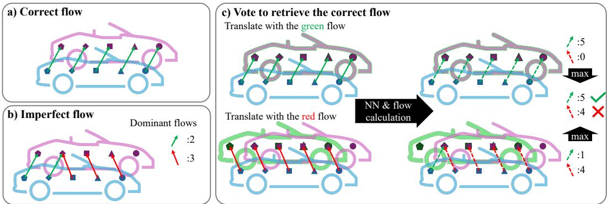
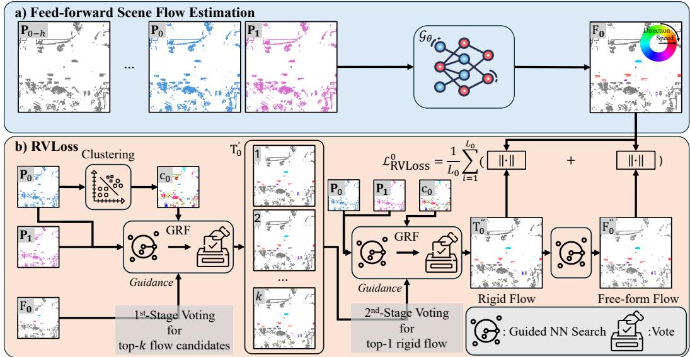
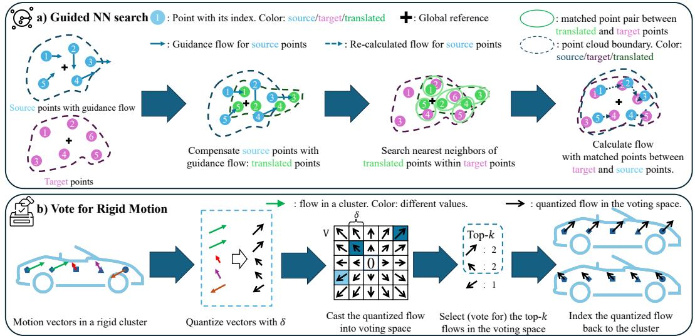
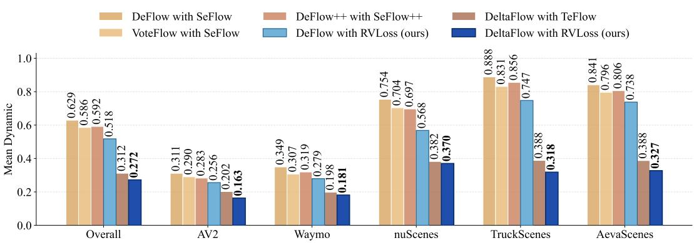
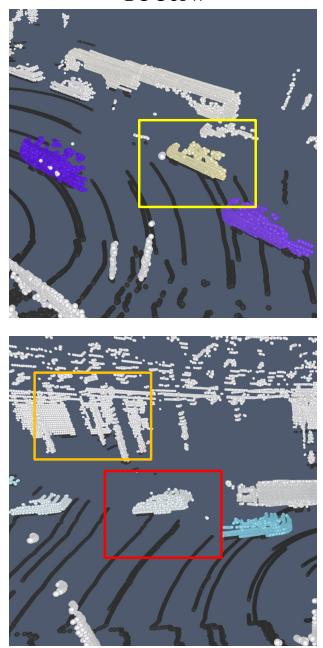
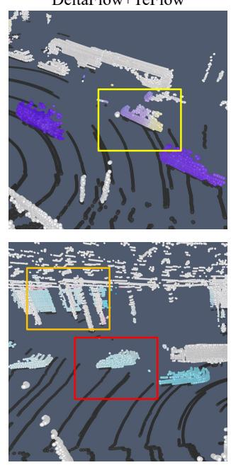
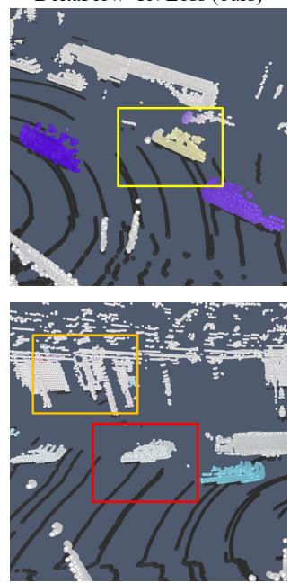

# RVLoss: Runoff Vote Loss for Self-Supervised LiDAR Scene Flow Estimation

Shiming Wang1, Liangliang Nan1, Julian Kooij1, Holger Caesar1 and Yancong Lin2,∗ 1TU Delft, the Netherlands 2University of Nottingham, UK

## Abstract

LiDAR scene flow estimates point-wise motion between two consecutive scans, referred to as the source and target. Leading self-supervised methods typically minimize the Chamfer loss, the nearest neighbor distance between the flow-compensated source and the target. However, nearest-neighbor search does not enforce motion rigidity, often leading to inconsistent flows within object instances. Existing approaches address this issue with additional regularization terms, but flow consistency among points remains limited, especially for large objects. We propose RVLoss, a self-supervised loss that incorporates motion rigidity by design, through a runoffvote mechanism. Our key observation is that the point-wise motion, cal culated from nearest neighbor search, can often be grouped into a small set of dominant flow candidates by voting (top-k voting). Furthermore, when compensating the source by these candidates, the flow that best represents the underlying rigid motion often yields the highest consensus after a second voting (top-1 voting). Based on this insight, we incorporate the two-stage runoff vote into loss design and create cluster-wise rigid flows and free-form flows as pseudo-labels for self-supervised learning. RVLoss can be seamlessly integrated into existing feedforward architectures. Experiments on the Argoverse2 2026 Challenge show that models trained with RVLoss achieve state-of-the-art performance among selfsupervised approaches, outperforming baseline models trained with alternative loss designs by 20%. Moreover, cross-dataset evaluations demonstrate consistent performance improvements across four additional datasets. Code will be released upon acceptance.

## 1 Introduction

LiDAR scene flow is the per-point 3D motion between two consecutive point clouds, and estimating scene flow is essential for many downstream tasks in autonomous driving, such as object discovery [1, 2], dynamic object reconstruction [3, 4], and BEV feature alignment [5]. Self-supervised methods have recently gained increasing attention, as they reduce reliance on costly manual annotations. Progress has been substantial, as demonstrated by the annual Argoverse2 Scene Flow Challenge [6, 7], where leading methods achieve both high accuracy and real-time inference. The majority of leading works follow a feedforward design and use the Chamfer distance as the loss function, where the goal is to minimize the spatial distance between a point and its nearest neighbor across time after flow compensation [8–10]. However, nearest-neighbor search breaks motion rigidity (a common property for traffic participants in autonomous driving scenarios), as shown in Fig. 1. As a result, there are often inconsistent flows, particularly for large objects such as cars, buses, and trucks.

A common strategy for enhancing motion rigidity is to introduce additional regularization terms. For instance, Zhang et al. [3, 8] apply regularization to static, dynamic, and clustered points, where point labels are precomputed using off-the-shelf algorithms. Beyond explicit regularization, Lin et al. [9] propose a differentiable module that enforces motion rigidity from an architectural perspective by aggregating features over predefined local neighborhoods to capture collective motion cues. While these approaches improve performance, the resulting flow predictions still exhibit inconsistent motion within rigid objects.

  
Figure 1: Overview of a runoff vote. a) A car moves rigidly and thus exhibits consistent flows among points. b) The widely used Chamfer distance breaks motion rigidity due to the local nearest neighbor search. As a result, multiple flow candidates emerge within the object. Although the correct flow is among these candidates, it may not be the top-voted one (1st stage). c) We translate the source by those flow candidates and measure how well it aligns with the target by an additional voting (2nd stage). The flow receiving the highest number of votes is selected as the rigid flow, representing the underlying motion of the car.

In this paper, we investigate how to incorporate motion rigidity directly into the loss design, eliminating the need for delicate architectural modification or multiple regularization terms. Our key observation is that point-wise motions of rigidly moving points, calculated from nearest-neighbor search, can often be grouped into a small set of dominant flows (top-k), and crucially, the ideal flow (top-1) that best characterizes the underlying rigid motion typically resides among these candidates, as shown in Fig. 1 b). Intuitively, the top-k candidates provide a limited number of viable solutions, which can be further evaluated one by one by shifting the source point cloud toward the target and by checking for consistency among clustered points, as illustrated in Fig. 1 c). Both the selection of top-k candidates and the identification of the top-1 can be implemented via voting, i.e., aggregating the total number of points that share the same motion. Based on this insight, we propose RVLoss, a self-supervised loss function built on two-stage cascaded voting for scene flow estimation, also known as a runoffvote. RVLoss generates cluster-wise rigid flows and free-form flows, which are treated as pseudo-labels for self-supervised learning.

RVLoss differs from directly selecting the top-1 dominant flow via a single-stage voting, which often underestimates the actual motion. For large objects (e.g., trucks) that exhibit significant spatial overlap after motion, nearest-neighbor search tends to favor correspondences with minimal displacement. Such matches, however, fail to capture the true object motion, especially on geometrically featureless surfaces. Selecting the top-k candidates instead accounts for multiple plausible displacements shared across points, yielding a compact set of hypotheses and enabling efficient downstream voting.

Our experiments on the Argoverse2 2026 Scene Flow Challenge\* demonstrate consistent performance improvement of RVLoss over other loss designs. Cross-dataset evaluation confirms the strong generalization ability of models supervised by RVLoss, yielding top performance on four additional datasets. To summarize, our contributions are as follows:

• We propose RVLoss for self-supervised scene flow learning based on a RunoffVote process. As its name suggests, RVLoss uses two-stage cascaded voting to identify cluster-wise rigid motions, and uses these as pseudo labels for self-supervised learning. This way, motion rigidity is encoded directly by the pseudo labels, rather than as a learning objective of a separate loss term.

• RVLoss is architecture-agnostic and can be seamlessly applied with mainstream scene flow backbones. Models supervised by RVLoss achieve leading performance on the Argoverse2 2026 Scene Flow Challenge [11] in both in-domain test and cross-domain evaluation on four other datasets, in particular on rigid moving object categories.

## 2 Related Work

Our work builds on four lines of research: efficient backbone design, self-supervised loss design, rigid motion modeling, and voting-based point cloud processing.

Backbone design for LiDAR scene flow estimation. LiDAR scene flow methods commonly adapt feedforward architectures to predict per-point motion [12–20]. However, early models mainly operate on downsampled point clouds, typically up to 8k points, and therefore struggle with fullscale LiDAR scans [17, 21–23]. FastFlow3D [24] addresses this limitation as the first feedforward model for real-time large-scale scene flow, and subsequent methods build on this design for further improvement [3, 9, 25–27]. Recent works extend feedforward estimation from frame pairs to LiDAR sequences [28, 29]. In parallel, test-time optimization also demonstrates strong performance [30–34]. However, the time-consuming inference limits practical deployment. In this work, we build on established feedforward backbones [26, 28] and focus on improving supervision through RVLoss.

Loss design for self-supervised scene flow learning. Early scene flow methods are predominantly supervised, requiring precise annotations from real-world datasets [12, 13, 22, 35] or synthetic data [36]. To reduce reliance on manual annotation, self-supervised methods commonly adopt cycle-consistency-based objectives [21, 30, 37, 38]. However, these objectives typically estimate per-point motion independently and lack an explicit object-level rigidity prior, leading to intra-object motion inconsistency under sparse LiDAR sampling. Recent works address this issue with additional regularizers [3, 8, 32], while TeFlow [10] strengthens supervision through multi-frame temporal consistency. In contrast, we directly incorporate motion rigidity into loss design through a runoffvote mechanism, eliminating the need for additional regularization terms.

Rigid motion priors. Rigid motion is a common property in autonomous driving and has been incorporated into scene flow estimation through architectural design and loss regularization. From the model-design perspective, ICP-Flow [34] estimates rigid transformations of clustered points with ICP [39]. RigidFlow [23] integrates ICP into a learning-based framework. PointPWC [21] promotes local consistency through cost volumes and neighborhood feature aggregation. More recently, VoteFlow [9] introduces a differentiable voting module to identify shared translations within clustered points. Unlike these methods that encode rigidity through architectural components, we enforce motion rigidity directly through loss design. From the loss-design perspective, prior works typically encourage motion consistency through local regularization terms [3, 8, 32, 40]. In contrast, we pursue the same objective through a different formulation by directly encoding motion rigidity into pseudo-label generation via a runoffvote.

Voting mechanisms for point cloud processing. Voting is a classical technique for extracting geometric primitives [41–44]. It has been widely used in point cloud processing, including segmentation [45], detection [46], tracking [47], and pose estimation [48], where sparse local evidence is aggregated into object-level hypotheses. Recent scene flow methods have also incorporated voting mechanisms. ICP-Flow [34] uses voting to identify dominant translations, while VoteFlow [9] extends voting into feature space. In comparison, we use voting in loss design, making RVLoss compatible with existing backbones without architectural modification.

## 3 Methodology

This section describes the problem definition and our proposed RVLoss: a self-supervised loss for feed-forward scene flow estimation, compatible with state-of-the-art backbone designs.

## 3.1 Problem Definition

Given a pair of consecutive LiDAR point clouds, compensated by ego motion, $\mathbf { P } _ { 0 } \in \mathbb { R } ^ { L _ { 0 } \times 3 } = \{ \mathbf { p } _ { 0 } ^ { i } \in$ $\mathbb { R } ^ { 3 } \} _ { i } ^ { L _ { 0 } }$ and $\mathbf { P } _ { 1 } \in \mathbb { R } ^ { L _ { 1 } \times 3 } = \{ \mathbf { p } _ { 1 } ^ { j } \in \mathbb { R } ^ { 3 } \} _ { j } ^ { L _ { 1 } }$ , a neural network $\mathcal { G } _ { \theta }$ produces a per-point flow field, $\mathbf { F } _ { 0 } \in \mathbb { R } ^ { L _ { 0 } \times 3 } = \{ \mathbf { f } _ { 0 } ^ { i } \in \mathbb { R } ^ { 3 } \} _ { i } ^ { L _ { 0 } }$ , such that $\mathbf { P } _ { 1 } \approx \mathbf { P } _ { 0 } + \mathbf { F } _ { 0 } . ~ L _ { 0 }$ and $L _ { 1 }$ denote the number of points in $\mathbf { P _ { 0 } }$ and $\mathbf { P _ { 1 } }$ . Optionally, multiple historical frames $\mathbf { P } _ { 0 - h } , \cdots , \mathbf { P } _ { 0 }$ can be incorporated as input to improve performance, where h is number of historical frames [9, 28]. The training objective of the feed-forward scene flow estimation is defined as:

  
Figure 2: Overview of RVLoss. a) A typical feedforward scene flow estimator $\mathcal { G } _ { \theta }$ takes as input a sequence of LiDAR scans $( \geq 2$ frames), $\mathbf { P } _ { 0 - h } , \ldots , \mathbf { P } _ { 0 } , \mathbf { P } _ { 1 }$ , and predicts per-point flows $\mathbf { F } _ { 0 } .$ . b) RVLoss employs a runoff vote mechanism to estimate rigid and free-form flows over clustered points during each forward pass, and uses the resulting flows as pseudo-labels. The runoffvote consists of a two-stage voting procedure built upon a shared operation, termed Guided Rigid Flow Estimation (GRF). Specifically, GRF first uses the predicted flow $\mathbf { F } _ { 0 }$ as guidance to select the top-k rigid flow candidates $\mathbf { T } _ { 0 } ^ { ' }$ (Stage 1). Subsequently, GRF takes these top-k candidates as guidance and identifies the top-1 rigid flow $\mathbf { T } _ { 0 } ^ { ' \prime }$ (Stage 2). In addition to rigid flow, RVLoss also computes a free-form flow $\bar { \mathbf { F } } _ { 0 } ^ { \prime \prime }$ as complementary supervision to relax the rigid-motion assumption and to mitigate the quantization error introduced by voting. The objective is to minimize the residual between the predicted flow and two supervision flows: the top-1 rigid flow and the free-form flow.

$$
{ \bf F } _ { 0 } = \mathcal { G } _ { \boldsymbol { \theta } } \left( { \bf P } _ { 0 - h } , \cdots , { \bf P } _ { 0 } , { \bf P } _ { 1 } \right) ,\tag{1}
$$

$$
\theta ^ { * } = \arg \operatorname* { m i n } _ { \theta \in \Theta } \mathbb { E } _ { ( \mathbf { P } _ { 0 } , \mathbf { P } _ { 1 } ) \sim \mathcal { D } } \left[ \mathcal { L } \left( \mathbf { P } _ { 0 } , \mathbf { P } _ { 1 } , \mathbf { F } _ { 0 } \right) \right] ,\tag{2}
$$

where D denotes the distribution of consecutive point cloud pairs, and L represents a self-supervised loss. The bidirectional Chamfer loss $\mathcal { L } _ { C D }$ is widely used in self-supervised scene flow estimation [8– 10, 30–33, 49], i.e.:

$$
\mathcal { L } _ { \mathrm { C D } } = \frac { 1 } { L _ { 0 } } \sum _ { i = 1 } ^ { L _ { 0 } } \mathcal { L } _ { \mathrm { N N } } \big ( \mathbf { p } _ { 0 } ^ { i } + \mathbf { f } _ { 0 } ^ { i } , \mathbf { P } _ { 1 } \big ) + \frac { 1 } { L _ { 1 } } \sum _ { j = 1 } ^ { L _ { 1 } } \mathcal { L } _ { \mathrm { N N } } \big ( \mathbf { p } _ { 1 } ^ { j } , \mathbf { P } _ { 0 } + \mathbf { F } _ { 0 } \big ) .\tag{3}
$$

where ${ \mathcal { L } } _ { \mathrm { N N } }$ calculates the distance between a point and its nearest neighbor in another point cloud, defined by $\begin{array} { r } { \mathcal { L } _ { \mathrm { N N } } ( \mathbf { p } _ { 0 } , \mathbf { P } _ { 1 } ) = \operatorname* { m i n } _ { \mathbf { p } _ { 1 } ^ { j } \in \mathbf { P } _ { 1 } } \left\| \mathbf { p } _ { 0 } - \mathbf { p } _ { 1 } ^ { j } \right\| } \end{array}$

Despite its popularity, $\mathcal { L } _ { \mathrm { C D } }$ inherits a critical limitation from nearest neighbor search: the lack of motion rigidity, which leads to inconsistent flow predictions. To address this issue, recent works [3, 8] introduce multiple regularization terms to encourage coherent motion within each cluster. More importantly, adding extra regularization does not guarantee motion rigidity, demonstrating the need for an inherently motion-rigid loss function and thus motivating our RVLoss.

## 3.2 RVLoss

Our proposed RVLoss enables self-supervised learning by generating pseudo flow labels during training. It aims to create increasingly more reliable rigid flow estimates during every forward pass, by (1) using the model’s increasingly more accurate flow predictions as guidance to calculate the point-wise motion from observed data, and (2) pooling motions across pre-computed point clusters to estimate top-k cluster-wise rigid flows via voting. The clustering of points is done beforehand by HDBSCAN following common practice [8, 50, 51]. We refer to this procedure as Guided Rigid Flow Estimation or GRF in short, as shown in Fig. 3. Pseudo implementation of GRF (Algorithm 1) is also available in Section A.1.

  
Figure 3: Overview of GRF. a) Guided NN Search first translates the source points using the guidance flow and then finds their nearest neighbors in the target point cloud. The point-wise motion between each source point and its matched target point is used for the subsequent processing. b) Vote for Rigid Motion quantizes the point-wise flows within each cluster and casts them into a predefined voting space. The top-k flow candidates are then selected and assigned to all points within the cluster.

In practice, we apply GRF twice (see Fig. 2), resulting in a cascaded runoff vote process. In the 1st stage, GRF uses the model’s predicted flow as guidance to generate the top-k most likely rigid flow candidates per cluster (top-k flows). In the $2 ^ { \mathrm { n } \mathbf { \breve { d } } }$ stage, GRF uses each of the k flow candidates as guidance, letting each point vote k times to find consistent object motion across all points within the cluster. The flow with the highest vote count is deemed the rigid flow (top-1 flow). We also add a free-form loss term to relax the rigid motion assumption and to handle the quantization errors in voting by performing an additional nearest neighbor lookup using the top-1 rigid flow as guidance. With the rigid and free-form flows established, the forward pass is supervised by a distance-based loss, e.g., ℓ loss, between the predicted flow and pseudo flows. The following subsections first describe GRF, and then elaborate on its use in both stages to create pseudo flows.

## 3.2.1 Guided Rigid Flow Estimation (GRF)

GRF takes as input the source $\mathbf { P } \in \mathbb { R } ^ { L _ { p } \times 3 }$ , the target $\mathbf { Q } \in \mathbb { R } ^ { L _ { q } \times 3 }$ , the cluster indices of the source $\mathbf { c } \in \mathbb { Z } ^ { L _ { p } }$ , a guidance flow $\mathbf { F } \in \mathbb { R } ^ { L _ { p } \times 3 }$ , and a hyperparameter $k \in \mathbb { Z } ^ { + }$ that determines the number of top-k flow candidates per-cluster. GRF consists of the following two steps:

Guided nearest neighbor search. It checks for where each point in P moves to according to the guidance flow F, and identifies the nearest point in Q. Then it computes point-wise flows $\mathbf { M } \breve { \in } \mathbb { R } ^ { L _ { p } \times 3 } = \mathrm { N N } ( \mathbf { P } + \mathbf { F } , \mathbf { Q } ) - \mathbf { P }$ , where NN indicates the nearest neighbor search. The whole process is shown in Fig. 3 a).

Vote for rigid motion. Points within each cluster cast a vote, and the top-k flow candidates per cluster are returned, as shown in Fig. 3 b). To be specific, we create a uniformly spaced 2D voting space over x and y dimensions\*, bounded by the minimal and maximal motion along each dimension, resulting in $\mathbf { V } \in \mathrm { \mathbb { Z } } ^ { c \times m \times n }$ , where m × n is the spatial dimensions of the voting space over x and y, and c is the total number of clusters. In practice, we set the voting step δ, i.e., the distance between two adjacent bins in the voting space, to be 1 cm. For $i ^ { t h }$ motion vector ${ \bf M } _ { i } \in \mathbb { R } ^ { 3 }$ , we cast a vote into the corresponding bin where it falls after quantization. All votes are equally weighted, $\mathrm { i . e . }$ , each vote increases bin count by 1. After voting, we select the top k (quantized) flows $\breve { \mathbf { T } } \in \mathbb { R } ^ { c \times k \times 3 }$ by the number of votes for each cluster, after non-maximum suppression. We further index T using cluster indices c to obtain the point-wise flow candidates $\mathbf { T } \in \mathbb { R } ^ { L _ { p } \times k \times 3 }$ . For simplicity, we use $\mathbf { T } = \operatorname { G R F } ( \mathbf { P } , \mathbf { Q } , \mathbf { F } , \mathbf { c } , k )$ to illustrate GRF.

## 3.2.2 $1 ^ { \mathbf { s t } }$ stage voting for top-k rigid flows

The goal of this stage is to generate a set of top-k flow candidates using GRF. The input to GRF consists of the source $\mathbf { P } _ { 0 } \in \overline { { \mathbb { R } } } ^ { L _ { 0 } \times 3 }$ , the target $\dot { \mathbf { P } } _ { 1 } \in \mathbb { R } ^ { L _ { 1 } \times 3 }$ , cluster indices $\mathbf { c } _ { 0 } \in \mathbb { Z } ^ { L _ { 0 } }$ , initial flow prediction $\mathbf { F } _ { 0 } \in \mathbb { R } ^ { L _ { 0 } \times 3 }$ (the guidance flow) by a neural network $\mathcal { G } _ { \theta }$ , and the number of top-k flow candidates. The output of GRF is top-k rigid flow candidates $\mathbf { T } _ { 0 } ^ { ' } \in \mathbb { R } ^ { L _ { 0 } \times k \times 3 }$ , representing k most likely rigid flows per cluster. We represent the $1 ^ { s t }$ stage by ${ \bf T } _ { 0 } ^ { ' } = \mathrm { G R F } ( { \bf P } _ { 0 } , { \bf P } _ { 1 } , { \bf F } _ { 0 } , { \bf c } _ { 0 } , k )$

## 3.2.3 2nd stage voting for top-1 rigid flow

The goal of this stage is to select, from the top-k candidates $( \mathrm { i . e . , } \mathbf { T } _ { 0 } ^ { ' } \in \mathbb { R } ^ { L _ { 0 } \times k \times 3 } )$ , the one that best represents the collective motion of clustered points, resulting in $\mathbf { T } _ { 0 } ^ { \prime \prime } \in \mathbb { R } ^ { L _ { 0 } \times 1 \times 3 } . \ \mathbf { T } _ { 0 } ^ { \prime }$ becomes the guidance flows in this stage and each source point votes k times. This can be done efficiently by tensor broadcasting operations (see Algorithm 2). For simplicity, we omit the details of broadcasting. Thus, we can re-use GRF for the $2 ^ { \mathrm { n d } }$ stage voting, parameterized by ${ \bf T } _ { 0 } ^ { \prime \prime } = \mathrm { G R F } ( { \bf P } _ { 0 } , { \bf P } _ { 1 } , { \bf c } _ { 0 } , { \bf T } _ { 0 } ^ { ' } , 1 )$

## 3.2.4 Loss formulation

With the obtained top-1 rigid flow, two loss terms can be computed to complete the forward pass.

Rigid flow. $\mathbf { T } _ { 0 } ^ { ' \prime }$ is the quantized flow that indicates where clustered points move. We consider $\mathbf { T } _ { 0 } ^ { ' \prime }$ as the rigid flow supervision.

Free-form flow. To avoid quantization error, we further conduct a guided nearest neighbor search to retrieve the nearest neighbor of $\mathbf { P } _ { 0 }$ from ${ \bf P } _ { 1 }$ under the guidance of $\mathbf { T } _ { 0 } ^ { \prime \prime }$ . As a result, we obtain the free-form point-wise flow $\mathbf { F } _ { 0 } ^ { \prime \prime } ~ \in ~ \mathbb { R } ^ { L _ { 0 } \times 3 }$ depicting the motion from $\mathbf { P } _ { 0 }$ to ${ \bf P } _ { 1 }$ , i.e., ${ \bf { F } } _ { 0 } ^ { \prime \prime } \mathrm { ~ = ~ }$ $\mathrm { N N } ( \mathbf { P } _ { 0 } + \mathbf { T } _ { 0 } ^ { \prime \prime } , \mathbf { P } _ { 1 } ) - \mathbf { P } _ { 0 }$ . We treat $\mathbf { F } _ { 0 } ^ { ' \prime }$ as the free-form flow supervision.

The total loss, which consists of rigid-flow and free-form-flow supervision, is defined as follows. The corresponding pseudo implementation is provided in Section $\mathrm { A } . 2$

$$
\mathcal { L } _ { \mathrm { R V L o s s } } ^ { 0 } = \frac { 1 } { L _ { 0 } } \sum _ { i = 1 } ^ { L _ { 0 } } \big ( \underbrace  { \lVert { \bf T } _ { 0 } ^ { \prime \prime } - { \bf F } _ { 0 } \rVert } _ { \mathrm { R i g i d ~ f l o w } } + \underbrace { { \lVert { \bf F } _ { 0 } ^ { \prime \prime } - { \bf F } _ { 0 } \rVert } _ { \mathrm { F r e e - f o r m ~ f l o w } } } _ { \mathrm { F r e e - f o r m ~ f l o w } } \big ) .\tag{4}
$$

Bidirectional supervision. Similar to the bidirectional Chamfer loss $\left( \mathrm { E q . } \left( 3 \right) \right)$ , we also calculate the rigid and free-form flow from ${ \bf P } _ { 1 }$ to $\mathbf { P } _ { 0 } , \mathbf { F } _ { 1 } ^ { \prime \prime }$ and $\mathbf { T } _ { 1 } ^ { \prime \prime }$ to ensure cycle-consistency. To be specific, we first calculate the nearest neighbor index of $\bar { \mathbf { P } } _ { 1 }$ with respect to $\mathbf { P } _ { 0 } + \mathbf { F } _ { 0 }$ , and then retrieve the predicted flow accordingly, denoted as $\mathbf { F } _ { 1 }$ , which characterizes the motion from ${ \bf P } _ { 1 }$ to $\mathbf { P } _ { 0 }$ . Afterwards, we repeat the aforementioned $1 ^ { \mathrm { s t } }$ stage voting and $2 ^ { \mathrm { n d } }$ stage voting procedures by swapping ${ \bf P } _ { 1 }$ and $\mathbf { P } _ { 0 }$ , and obtain ${ \bf { F } } _ { 1 } ^ { ' \prime }$ and $\mathbf { T } _ { 1 } ^ { ' \prime }$ . When bidirectional optimization is adopted, the overall loss becomes: $\begin{array} { r } { \mathcal { L } _ { \mathrm { R V L o s s } } = \frac { 1 } { L _ { 0 } } \sum _ { i = 1 } ^ { \tilde { L _ { 0 } } } \left( \Vert \mathbf { T } _ { 0 } ^ { \prime \prime } - \mathbf { F } _ { 0 } \Vert + \Vert \mathbf { F } _ { \textrm { 0 } } ^ { \prime \prime } - \mathbf { F } _ { 0 } \Vert \right) + \frac { 1 } { L _ { 1 } } \sum _ { j = 1 } ^ { L _ { 1 } } \left( \Vert \mathbf { T } _ { 1 } ^ { \prime \prime } - \mathbf { F } _ { 1 } \Vert + \Vert \mathbf { F } _ { \textrm { 1 } } ^ { \prime \prime } - \mathbf { F } _ { 1 } \Vert \right) } \end{array}$

## 4 Experiments

We conduct benchmarking on the Argoverse2 (AV2) 2026 Scene Flow Challenge to demonstrate the advantage of RVLoss over other loss designs.

## 4.1 Datasets and Evaluation Metrics

Datasets. The AV2 2026 Scene Flow Challenge has been released to benchmark models across a variety of datasets. The key difference to previous challenges is the multi-dataset evaluation, composed of five mainstream autonomous driving datasets: Argoverse2 [6], Waymo [52], nuScenes [53], TruckScenes [54] and AevaScenes [55].

Table 1: In-domain performance on the AV2 test split. Numerical results on scene flow prediction come from the AV2 2026 Scene Flow Challenge leaderboard. $\mathrm { \# F _ { \mathrm { i n p u t } } } ^ { \cdot }$ denotes the number of input frames to the network. $\mathrm { \Phi _ { \# F _ { l o s s } } } 3$ denotes the number of input frames during loss calculation. RT stands for runtime per sequence (around 157 frames) in seconds, retrieved from TeFlow [10]. (Best, Second Best)
<table><tr><td rowspan="2">Backbone</td><td rowspan="2">Loss</td><td rowspan="2"> $\# \mathrm { F _ { i n p u t } }$ </td><td rowspan="2"> $\# \mathrm { F _ { l o s s } }$ </td><td rowspan="2">RT (s)</td><td colspan="5">Dynamic Bucket-Normalized↓</td><td colspan="4">Three-way EPE (cm) ↓</td></tr><tr><td>Mean</td><td>CAR</td><td>O.V.</td><td>PED.</td><td>VRU</td><td>Mean</td><td>FD</td><td>FS</td><td>BS</td></tr><tr><td>Supervised methods</td><td></td><td></td><td></td><td></td><td></td><td></td><td></td><td></td><td></td><td></td><td></td><td></td><td></td></tr><tr><td>DeltaFlow</td><td>GT</td><td>5</td><td></td><td>8</td><td>0.103</td><td>0.083</td><td>0.132</td><td>0.122</td><td>0.075</td><td>1.76</td><td>3.16</td><td>1.31</td><td>0.81</td></tr><tr><td>SSF</td><td>GT</td><td>2</td><td></td><td></td><td>0.160</td><td>0.115</td><td>0.170</td><td>0.217</td><td>0.137</td><td>2.36</td><td>4.71</td><td>1.69</td><td>0.67</td></tr><tr><td>Self-supervised methods</td><td></td><td></td><td></td><td></td><td></td><td></td><td></td><td></td><td></td><td></td><td></td><td></td><td></td></tr><tr><td>DeFlow</td><td>SeFlow</td><td>2</td><td>22</td><td>7.2</td><td>0.313</td><td>0.236</td><td>0.295</td><td>0.441</td><td>0.273</td><td>4.76</td><td>10.93</td><td>2.23</td><td>1.12</td></tr><tr><td>VoteFlow</td><td>SeFlow</td><td>2</td><td></td><td>13.0</td><td>0.290</td><td>0.226</td><td>0.301</td><td>0.383</td><td>0.252</td><td>4.52</td><td>10.36</td><td>2.09</td><td>1.12</td></tr><tr><td>DeFlow++</td><td>SeFlow++</td><td>3</td><td>3</td><td>10.0</td><td>0.283</td><td>0.202</td><td>0.308</td><td>0.387</td><td>0.234</td><td>4.20</td><td>9.49</td><td>2.02</td><td>1.08</td></tr><tr><td>DeFlow</td><td>RVLoss (ours)</td><td>2</td><td>2</td><td>7.2</td><td>0.256</td><td>0.160</td><td>0.254</td><td>0.391</td><td>0.218</td><td>3.63</td><td>7.14</td><td>2.16</td><td>1.60</td></tr><tr><td>DeltaFlow</td><td>TeFlow</td><td>5</td><td>5</td><td>8.0</td><td>0.202</td><td>0.167</td><td>0.221</td><td>0.273</td><td>0.146</td><td>3.54</td><td>7.02</td><td>2.18</td><td>1.42</td></tr><tr><td>DeltaFlow</td><td>RVLoss (ours)</td><td>5</td><td>2</td><td>8.0</td><td>0.163</td><td>0.116</td><td>0.154</td><td>0.242</td><td>0.141</td><td>2.95</td><td>4.92</td><td>2.12</td><td>1.82</td></tr></table>

Evaluation Metrics. Following the challenge protocol, we compare the Dynamic Bucket-Normalized End-Point Error (EPE) [7] within a 35 m radius around the ego vehicle. Unlike standard EPE, which calculates the L2 distance between predicted and ground-truth flow vectors, Dynamic Bucket-Normalized EPE normalizes EPE by the mean speed within predefined motion buckets, providing a fairer comparison across multiple categories with different velocities. The four categories are: Car, Other Vehicle (O.V.), Pedestrian (Ped.), and Wheeled Vulnerable Road User (VRU).

## 4.2 Implementation Details

Baselines. We make comparisons with leading feed-forward models, including SeFlow [8], VoteFlow [9], SeFlow++ [3], TeFlow [10], SSF [27], and DeltaFlow [28] . We take the numerical results directly from the leaderboard if provided; Otherwise, we report results using the publicly released checkpoints by the authors. The optimization-based models are currently absent on the leaderboard, and we are unable to test them due to high computational cost\*.

Implementation of our models. We use RVLoss to supervise the training of two scene flow backbones: multi-frame DeltaFlow [28] and two-frame DeFlow [26]. We follow the official training schemes provided by OpenSceneFlow\*. We take k = 10 by default in the 1st stage voting and discuss the selection of k in Sec. A.4. We adopt the bidirectional optimization by default. We conduct model training on 4 NVIDIA A40 GPUs (48GB VRAM). The training time of DeltaFlow+RVLoss takes approximately 3 days.

## 4.3 Quantitative comparison

In-domain evaluation. Tab. 1 demonstrates the in-domain test on the AV2 test split, which is part of the AV2 2026 Scene Flow Challenge. All models are trained on the AV2 train split. We refer to all models by BACKBONE + LOSS. DeltaFlow+RVLoss achieves the best performance among all self-supervised models when comparing Dynamic Bucket-Normalized EPE. Particularly, given the DeltaFlow backbone, RVLoss outperforms the TeFlow loss on Car and Other Vehicle by approximately 5 p.p. (percentage points) and $7 _ { \mathrm { \scriptsize ~ p . p . } }$ ., demonstrating the advantage of RVLoss over other self-supervised loss functions. Similarly, given the DeFlow [26] backbone, RVLoss is able to deliver better results than the SeFlow [8] loss, verifying the effectiveness of the runoffvote design. Despite substantial improvement on Car and Other Vehicle, the gain on Wheeled VRU is less prominent, as the rigid motion assumption no longer stands and point density decreases. When adopting RVLoss during training, the DeltaFlow backbone reduces the mean EPE by a large margin (up to 9 p.p.) over the DeFlow backbone, demonstrating the benefit of using temporal information.

  
Figure 4: Cross-domain evaluation performance. We report the mean Dynamic Bucket-Normalized EPE on multiple datasets used in the AV2 2026 scene flow challenge [11]. DeltaFlow+RVLoss demonstrates consistent performance improvement over all baselines.

Although the performance gain induced by RVLoss is encouraging, the gap to fully supervised baselines, e.g., DeltaFlow+GT, remains, particularly on Pedestrian and Wheeled VRU. We also perform in-domain evaluation on Waymo [24] and nuScenes [53] in Section A.3.

GT Flow  

DeltaFlow+TeFlow  

DeltaFlow+RVLoss (ours)  
  
Figure 5: Qualitative comparison. Visualization of scene flow predictions from the DeltaFlow model trained with the TeFlow loss and the proposed RVLoss. Point colors denote flow direction, and color saturation indicates flow magnitude. Objects are expected to exhibit coherent color patterns. Compared with the TeFlow [10] loss, RVLoss produces more uniform coloring within each object (highlighted in boxes), demonstrating more coherent scene flow estimation.

Cross-domain evaluation. We make further comparisons on multiple datasets adopted in the AV2 2026 Scene Flow Challenge, as shown in Fig. 4. The models in this comparison are identical to those in Tab. 1, i.e., all are trained on the AV2 train split. DeltaFlow+RVLoss demonstrates consistent performance improvement over the others on all 5 datasets. Notably, the error on the nuScenes is nearly twice as high as on AV2 and Waymo. We speculate that the reduced point density is the main cause, as nuScenes use a single 32-beam LiDAR, resulting in × 2 fewer beams than the other two. TruckScenes dataset differs from AV2, Waymo, and nuScenes, as it uses a truck as the ego vehicle and collects data mainly on highways. Despite the use of multiple 64-beam LiDAR sensors, the error remains high, suggesting that models trained on urban-centric and car-based datasets need further fine-tuning to better adapt to truck views and highway scenarios. AevaScenes dataset uses high-resolution FMCW LiDARs that differ substantially from rotating LiDAR sensors in the other four datasets. All models exhibit relatively high errors on AevaScenes, indicating a notable domain gap. Overall, DeltaFlow+RVLoss delivers not only the best result in the in-domain test but also in the cross-domain test, validating its generalization ability over other variants.

Table 2: Ablation of each loss component on the Argoverse 2 val split [6]. (Best, Second Best)
<table><tr><td rowspan="2">Free-form Loss</td><td rowspan="2">Rigid Loss</td><td rowspan="2">Bidirect Optim</td><td colspan="5">Dynamic Bucket-Normalized↓</td><td colspan="4">Three-way EPE (cm) ↓</td></tr><tr><td>Mean</td><td>CAR</td><td>O.V.</td><td>PD.</td><td>VRU</td><td>Mean</td><td>FD</td><td>FS</td><td>BS</td></tr><tr><td>√</td><td>√</td><td>x</td><td>0.284</td><td>0.129</td><td>0.267</td><td>0.442</td><td>0.299</td><td>3.59</td><td>7.31</td><td>1.99</td><td>1.48</td></tr><tr><td>x</td><td>√</td><td>√</td><td>0.338</td><td>0.138</td><td>0.268</td><td>0.604</td><td>0.346</td><td>3.70</td><td>8.27</td><td>1.69</td><td>1.14</td></tr><tr><td>√</td><td>x</td><td>√</td><td>0.275</td><td>0.139</td><td>0.266</td><td>0.405</td><td>0.288</td><td>4.68</td><td>7.48</td><td>3.62</td><td>2.94</td></tr><tr><td>√</td><td>√</td><td>√</td><td>0.262</td><td>0.121</td><td>0.246</td><td>0.405</td><td>0.277</td><td>3.47</td><td>6.84</td><td>2.05</td><td>1.53</td></tr></table>

## 4.4 Ablation Study on Loss Composition.

We validate our design choices in Tab. 2, using the DeFlow backbone [26] as it takes less training time than DeltaFlow. The comparison between the first and last rows shows that bidirectional optimization improves performance by enforcing cycle consistency. While the free-form flow alone achieves the second-best performance on Dynamic Bucketed-Normalized EPE, it performs worst on static background regions, as the model tends to overestimate motion and predict most points as moving. Adding the rigid flow loss effectively reduces errors on static points. Therefore, we use both rigid and free-form flows, together with bidirectional optimization, as our default configuration.

## 4.5 Qualitative Comparison

Fig. 5 visualizes the difference among flow predictions. As shown in the 1st row, DeltaFlow+RVLoss learns a more consistent flow on a dynamic car, while DeltaFlow+TeFlow breaks motion rigidity, resulting in inconsistent coloring. In the 2nd row, DeltaFlow+RVLoss reduces errors not only on static background (highlighted in orange), but also on static foreground objects (highlighted in red).

## 5 Conclusions

We present RVLoss, a self-supervised loss function for LiDAR scene flow estimation using a runoff vote mechanism. Unlike the widely used Chamfer loss, RVLoss explicitly incorporates the rigidmotion prior into the design without demanding a separate regularization term. Specifically, RVLoss estimates cluster-wise rigid flows and point-wise free-form flows via a runoff vote and uses them as pseudo labels for self-supervised learning. Extensive experiments on the AV2 2026 Scene Flow Challenge demonstrate that RVLoss consistently improves scene flow estimation in both in-domain and cross-domain evaluations. For in-domain evaluation, DeltaFlow+RVLoss achieves state-of-the-art performance on the AV2 test set, reaching a Dynamic Mean of 0.163 and substantially outperforming DeltaFlow+TeFlow (0.202). For cross-domain evaluation, DeltaFlow+RVLoss achieves an average Dynamic Mean of 0.272 across five datasets, improving over DeltaFlow+TeFlow (0.312) by 4 percentage points. The advantage on Car and Other Vehicle validates the importance of incorporating a rigid-motion prior into the loss design and demonstrates the effectiveness of the runoff vote mechanism.

Limitations and Future Work. One limitation of RVLoss is its reliance on cluster labels in both voting stages. A promising future direction is to develop cluster-free voting mechanisms that can infer consensus groups directly from the predicted motion field. Another limitation is that the rigidmotion assumption is most suitable for large traffic participants, such as cars, buses, and trucks, but may not hold for non-rigid or articulated agents, such as pedestrians and other vulnerable road users. Extending the motion prior beyond strict rigidity, e.g., toward part-level or deformable motion consistency, is an important direction for future work. Additionally, RVLoss does not explicitly model rotational motion, which becomes increasingly important over longer temporal sequences. Extending the framework to handle full 6-DoF rigid motion remains future work.

## References

[1] Mahyar Najibi, Jingwei Ji, Yin Zhou, Charles R Qi, Xinchen Yan, Scott Ettinger, and Dragomir Anguelov. Motion inspired unsupervised perception and prediction in autonomous driving. In ECCV, 2022.

[2] Ted Lentsch, Holger Caesar, and Dariu M Gavrila. UNION: Unsupervised 3d object detection using object appearance-based pseudo-classes. NeurIPS, 2024.

[3] Qingwen Zhang, Ajinkya Khoche, Yi Yang, Li Ling, Sina Sharif Mansouri, Olov Andersson, and Patric Jensfelt. Himo: High-speed objects motion compensation in point clouds. T-RO, 2025.

[4] Junhwa Hur, Charles Herrmann, Songyou Peng, Philipp Henzler, Zeyu Ma, Todd Zickler, and Deqing Sun. UFO-4D: Unposed feedforward 4D reconstruction from two images. In ICLR, 2026.

[5] Shiming Wang, Holger Caesar, Liangliang Nan, and Julian FP Kooij. Asyncbev: Cross-modal flow alignment in asynchronous 3d object detection. In ICLR, 2026.

[6] Benjamin Wilson, William Qi, Tanmay Agarwal, John Lambert, Jagjeet Singh, Siddhesh Khandelwal, Bowen Pan, Ratnesh Kumar, Andrew Hartnett, Jhony Kaesemodel Pontes, Deva Ramanan, Peter Carr, and James Hays. Argoverse 2: Next generation datasets for self-driving perception and forecasting. In NeurIPS, 2021.

[7] Ishan Khatri, Kyle Vedder, Neehar Peri, Deva Ramanan, and James Hays. I can’t believe it’s not scene flow! In ECCV, 2024.

[8] Qingwen Zhang, Yi Yang, Peizheng Li, Olov Andersson, and Patric Jensfelt. Seflow: A self-supervised scene flow method in autonomous driving. In ECCV, 2025.

[9] Yancong Lin, Shiming Wang, Liangliang Nan, Julian Kooij, and Holger Caesar. Voteflow: Enforcing local rigidity in self-supervised scene flow. In CVPR, 2025.

[10] Qingwen Zhang, Chenhan Jiang, Xiaomeng Zhu, Yunqi Miao, Yushan Zhang, Olov Andersson, and Patric Jensfelt. TeFlow: Enabling multi-frame supervision for self-supervised feed-forward scene flow estimation. In CVPR, 2026.

[11] Siyi Li, Qingwen Zhang, Ishan Khatri, Kyle Vedder, Deva Ramanan, and Neehar Peri. Uniflow: Towards zero-shot lidar scene flow for autonomous vehicles via cross-domain generalization. arXiv preprint arXiv:2511.18254, 2025.

[12] Aseem Behl, Despoina Paschalidou, Simon Donné, and Andreas Geiger. Pointflownet: Learning representations for rigid motion estimation from point clouds. In CVPR, 2019.

[13] Xingyu Liu, Charles R Qi, and Leonidas J Guibas. Flownet3d: Learning scene flow in 3d point clouds. In CVPR, 2019.

[14] Gilles Puy, Alexandre Boulch, and Renaud Marlet. FLOT: Scene Flow on Point Clouds Guided by Optimal Transport. In ECCV, 2020.

[15] Xiuye Gu, Yijie Wang, Chongruo Wu, Yong Jae Lee, and Panqu Wang. Hplflownet: Hierarchical permutohedral lattice flownet for scene flow estimation on large-scale point clouds. In CVPR, 2019.

[16] Xingyu Liu, Mengyuan Yan, and Jeannette Bohg. Meteornet: Deep learning on dynamic 3d point cloud sequences. In ICCV, 2019.

[17] Yair Kittenplon, Yonina C Eldar, and Dan Raviv. Flowstep3d: Model unrolling for selfsupervised scene flow estimation. In CVPR, 2021.

[18] Haiyan Wang, Jiahao Pang, Muhammad A Lodhi, Yingli Tian, and Dong Tian. Festa: Flow estimation via spatial-temporal attention for scene point clouds. In CVPR, 2021.

[19] Wencan Cheng and Jong Hwan Ko. Bi-pointflownet: Bidirectional learning for point cloud based scene flow estimation. In ECCV, 2022.

[20] Zirui Wang, Shuda Li, Henry Howard-Jenkins, Victor Prisacariu, and Min Chen. Flownet3d++: Geometric losses for deep scene flow estimation. In WACV, 2020.

[21] Wenxuan Wu, Zhi Yuan Wang, Zhuwen Li, Wei Liu, and Li Fuxin. Pointpwc-net: Cost volume on point clouds for (self-) supervised scene flow estimation. In ECCV, 2020.

[22] Zhao Jin, Yinjie Lei, Naveed Akhtar, Haifeng Li, and Munawar Hayat. Deformation and correspondence aware unsupervised synthetic-to-real scene flow estimation for point clouds. In CVPR, 2022.

[23] Ruibo Li, Chi Zhang, Guosheng Lin, Zhe Wang, and Chunhua Shen. Rigidflow: Self-supervised scene flow learning on point clouds by local rigidity prior. In CVPR, 2022.

[24] Philipp Jund, Chris Sweeney, Nichola Abdo, Zhifeng Chen, and Jonathon Shlens. Scalable scene flow from point clouds in the real world. RA-L, 2021.

[25] Kyle Vedder, Neehar Peri, Nathaniel Chodosh, Ishan Khatri, Eric Eaton, Dinesh Jayaraman, Yang Liu, Deva Ramanan, and James Hays. Zeroflow: Fast zero label scene flow via distillation. In ICLR, 2024.

[26] Qingwen Zhang, Yi Yang, Heng Fang, Ruoyu Geng, and Patric Jensfelt. Deflow: Decoder of scene flow network in autonomous driving. In ICRA, 2024.

[27] Ajinkya Khoche, Qingwen Zhang, Laura Pereira Sánchez, Aron Asefaw, Sina Sharif Mansouri, and Patric Jensfelt. Ssf: Sparse long-range scene flow for autonomous driving. In 2025 IEEE International Conference on Robotics and Automation (ICRA), pages 6394–6400. IEEE, 2025.

[28] Qingwen Zhang, Xiaomeng Zhu, Yushan Zhang, Yixi Cai, Olov Andersson, and Patric Jensfelt. Deltaflow: An efficient multi-frame scene flow estimation method. In NeurIPS, 2025.

[29] Jaeyeul Kim, Jungwan Woo, Ukcheol Shin, Jean Oh, and Sunghoon Im. Flow4d: Leveraging 4d voxel network for lidar scene flow estimation. RA-L, 2024.

[30] Xueqian Li, Jhony Kaesemodel Pontes, and Simon Lucey. Neural scene flow prior. NeurIPS, 2021.

[31] Xueqian Li, Jianqiao Zheng, Francesco Ferroni, Jhony Kaesemodel Pontes, and Simon Lucey. Fast neural scene flow. In ICCV, 2023.

[32] David T Hoffmann, Syed Haseeb Raza, Hanqiu Jiang, Denis Tananaev, Steffen Klingenhoefer, and Martin Meinke. Floxels: Fast unsupervised voxel based scene flow estimation. In CVPR, 2025.

[33] Kyle Vedder, Neehar Peri, Ishan Khatri, Siyi Li, Eric Eaton, Mehmet Kocamaz, Yue Wang, Zhiding Yu, Deva Ramanan, and Joachim Pehserl. Neural eulerian scene flow fields. In ICLR, 2025.

[34] Yancong Lin and Holger Caesar. ICP-Flow: Lidar scene flow estimation with icp. In CVPR, 2024.

[35] Shengyu Huang, Zan Gojcic, Jiahui Huang, Andreas Wieser, and Konrad Schindler. Dynamic 3d scene analysis by point cloud accumulation. In ECCV, 2022.

[36] Alexey Dosovitskiy, Philipp Fischer, Eddy Ilg, Philip Hausser, Caner Hazirbas, Vladimir Golkov, Patrick van der Smagt, Daniel Cremers, and Thomas Brox. Flownet: Learning optical flow with convolutional networks. In ICCV, 2015.

[37] Stefan Andreas Baur, David Josef Emmerichs, Frank Moosmann, Peter Pinggera, Björn Ommer, and Andreas Geiger. Slim: Self-supervised lidar scene flow and motion segmentation. In ICCV, 2021.

[38] Himangi Mittal, Brian Okorn, and David Held. Just go with the flow: Self-supervised scene flow estimation. In CVPR, 2020.

[39] Paul J Besl and Neil D McKay. Method for registration of 3-d shapes. In Sensor fusion IV: control paradigms and data structures, 1992.

[40] Kavisha Vidanapathirana, Shin-Fang Chng, Xueqian Li, and Simon Lucey. Multi-body neural scene flow. In 3DV, 2024.

[41] Richard O Duda and Peter E Hart. Use of the hough transformation to detect lines and curves in pictures. Communications ofthe ACM, 1972.

[42] Dana H Ballard. Generalizing the hough transform to detect arbitrary shapes. PR, 1981.

[43] Yancong Lin, Ruben Wiersma, , Silvia L Pintea, Klaus Hildebrandt, Elmar Eisemann, and Jan C van Gemert. Deep vanishing point detection: Geometric priors make dataset variations vanish. In CVPR, 2022.

[44] Yancong Lin, Silvia L Pintea, and Jan C Van Gemert. Deep hough-transform line priors. In European Conference on Computer Vision, pages 323–340. Springer, 2020.

[45] Fausto Milletari, Seyed-Ahmad Ahmadi, Christine Kroll, Christoph Hennersperger, Federico Tombari, Amit Shah, Annika Plate, Kai Boetzel, and Nassir Navab. Robust segmentation of various anatomies in 3d ultrasound using hough forests and learned data representations. In MICCAI, 2015.

[46] Alain Lehmann, Bastian Leibe, and Luc Van Gool. Fast prism: Branch and bound hough transform for object class detection. IJCV, 2011.

[47] Fausto Milletari, Wadim Kehl, Federico Tombari, Slobodan Ilic, Seyed-Ahmad Ahmadi, Nassir Navab, et al. Universal hough dictionaries for object tracking. In BMVC, 2015.

[48] Min Sun, Gary Bradski, Bing-Xin Xu, and Silvio Savarese. Depth-encoded hough voting for joint object detection and shape recovery. In ECCV, 2010.

[49] Haoqiang Fan, Hao Su, and Leonidas J Guibas. A point set generation network for 3d object reconstruction from a single image. In CVPR, 2017.

[50] Leland McInnes, John Healy, and Steve Astels. hdbscan: Hierarchical density based clustering. The Journal of Open Source Software, 2017.

[51] Ricardo JGB Campello, Davoud Moulavi, and Jörg Sander. Density-based clustering based on hierarchical density estimates. In Pacific-Asia conference on knowledge discovery and data mining, 2013.

[52] Pei Sun, Henrik Kretzschmar, Xerxes Dotiwalla, Aurelien Chouard, Vijaysai Patnaik, Paul Tsui, James Guo, Yin Zhou, Yuning Chai, Benjamin Caine, et al. Scalability in perception for autonomous driving: Waymo open dataset. In CVPR, 2020.

[53] Holger Caesar, Varun Bankiti, Alex H Lang, Sourabh Vora, Venice Erin Liong, Qiang Xu, Anush Krishnan, Yu Pan, Giancarlo Baldan, and Oscar Beijbom. nuScenes: A multimodal dataset for autonomous driving. In CVPR, 2020.

[54] Felix Fent, Fabian Kuttenreich, Florian Ruch, Farija Rizwin, Stefan Juergens, Lorenz Lechermann, Christian Nissler, Andrea Perl, Ulrich Voll, Min Yan, et al. Man truckscenes: A multimodal dataset for autonomous trucking in diverse conditions. NeurIPS, 2024.

[55] Gautham Narayan Narasimhan, Heethesh Vhavle, Kumar Bhargav Vishvanatha, and James Reuther. Aevascenes: A dataset and benchmark for fmcw lidar perception, 2025. URL https://scenes.aeva.com/.

[56] Adam Paszke, Sam Gross, Francisco Massa, Adam Lerer, James Bradbury, Gregory Chanan, Trevor Killeen, Zeming Lin, Natalia Gimelshein, Luca Antiga, et al. Pytorch: An imperative style, high-performance deep learning library. NeurIPS, 2019.

## A Technical appendices and supplementary material

## A.1 Pseudo implementation of k-Guided Rigid Flow Estimation

Algorithm 1: Guided Rigid Flow Estimation (PyTorch-style [56])   
Input: $\mathbf { P } \in \mathbb { R } ^ { L _ { P } \times 3 } , \mathbf { Q } \in \mathbb { R } ^ { L _ { Q } \times 3 } , \mathbf { F } \in \mathbb { R } ^ { L _ { P } \times 3 }$ , clusters $\mathbf { c } \in \mathbb { Z } ^ { l } , \delta \in \mathbb { R } ^ { + } , k \in \mathbb { Z } ^ { + }$   
Output: Top-k rigid flow per point $\mathbf { T } \in \mathbb { R } ^ { L _ { P } \times k \times 3 }$   
Guided nearest neighbor search   
$\mathbf { \boldsymbol { \mathsf { M } } } \in \mathbb { R } ^ { L _ { P } \times 3 } \gets \mathbb { N } \mathbf { \boldsymbol { \mathsf { N } } } ( \mathbf { \boldsymbol { P } } + \mathbf { \boldsymbol { F } } , \mathbf { \boldsymbol { Q } } ) - \mathbf { \boldsymbol { P } }$ // Point-wise motion x   
Vote for top-k rigid motion   
cmax ← c.max() + 1 ; // Number of clusters   
$\mathbf { b } _ { x } \in \mathbb { R } ^ { m }$ ← torch.arange(M[:, 0].min(), M[:, 0].max(), δ) ; // Bins over x   
$\mathbf { b } _ { y } \in \mathbb { R } ^ { n }$ ← torch.arange(M[:, 1].min(), M[:, 1].max(), δ) ; // Bins over y   
$\mathbf { V } \in \mathbb { R } ^ { c }$ ×m×n ← torch.zeros $\left( { { c } _ { m a x } } , m , n \right) / /$ Voting space over x and y   
$\mathbf { v } _ { x } \in \mathbb { Z } ^ { l }$ ← torch.bucketize $( \mathbf { M } [ : , 0 ] , \mathbf { b } _ { x } )$ // Flow indices after binning   
$\mathbf { v } _ { y _ { - } } \in \mathbb { Z } ^ { l }$ ← torch.bucketize $( \mathbf { M } [ : , 1 ] , \mathbf { b } _ { y } )$ ; // Flow indices after binning   
$\begin{array} { r } { \bar { \bf V } [ { \bf c } , { \bf v } _ { x } , { \bf v } _ { y } ] + = 1 ; } \end{array}$ // Majority voting   
$\mathbf { V }  \mathbf { F }$ .maxpool2d (V.unsqueeze $( 0 ) , 3 , 1 , 1 )$ .squeeze(0) ; // Non-max suppression   
$\mathbf { I } \in \mathbb { Z } ^ { c \times k }$ ← torch.topk $( \mathbf { V } . \mathbf { v i e w } ( c , - 1 ) , k , - 1 )$ // Top-k indices per cluster   
$\mathbf { D } _ { x } \in \mathbb { R } ^ { c \times k }  \mathbf { b } _ { x } [ \mathbf { I } \% m ]$ // Rigid flow over x   
${ \bf D } _ { y } \in \mathbb { R } ^ { c \times k }  { \bf b } _ { y } [ { \bf I } / / m \mathcal { V } _ { 0 } n ]$ // Rigid flow over y   
$\mathbf { D } _ { z } \in \mathbb { R } ^ { c \times k } \gets$ torch.zeros $( c , k )$ // Zero flow over z   
$\mathbf { D } \in \mathbb { R } ^ { c \times k \times 3 }$ ← torch.stack([Dx, Dy, Dz], −1) ; // Top-k rigid flow per cluster   
$\mathbf { D } \in \mathbb { R } ^ { L _ { P } \times k \times 3 }  \mathbf { D } [ \mathbf { c } ]$ // Top-k rigid flow per point

## A.2 Pseudo implementation of RVLoss

Algorithm 2: RVLoss   
Input: $\mathbf P _ { 0 } \in \mathbb R ^ { L _ { 0 } \times 3 } , \mathbf P _ { 1 } \in \mathbb R ^ { L _ { 1 } \times 3 } , \mathbf F _ { 0 } \in \mathbb R ^ { L _ { 0 } \times 3 } , k \in \mathbb Z , \Delta \in \mathbb R$   
Output: $\mathbf { T _ { 0 } ^ { \prime \prime } } \in \mathbb { R } ^ { L _ { 0 } \times 3 } , \mathbf { F _ { 0 } ^ { \prime \prime } } \in \mathbb { R } ^ { L _ { 0 } \times 3 }$   
Clustering   
$\mathbf { c } _ { 0 } \in \mathbb { Z } ^ { L _ { 0 } }  \mathrm { H D B S C A N } ( \mathbf { P } _ { 0 } )$ // Point clustering   
Top-k rigid flows (1st stage)   
$\mathbf { T } _ { 0 } ^ { ' } \in \mathbb { R } ^ { L _ { 0 } \times k \times 3 } \gets \mathrm { G R F } ( \mathbf { P } _ { 0 } , \mathbf { P } _ { 1 } , \mathbf { F } _ { 0 } , \mathbf { c } _ { 0 } , \boldsymbol { \delta } , \boldsymbol { k } )$ ; // Top-k rigid flows   
Top-1 rigid flow $( 2 ^ { \mathrm { n d } }$ stage)   
$\mathbf { P } _ { 0 } ^ { ' } \in \mathbb { R } ^ { L _ { 0 } k \times 3 }  \mathbf { P } _ { 0 } [ :$ , None, :]. expand $( L _ { 0 } , k , 3 )$ . view $( L _ { 0 } \times k , 3 )$ // Broadcasting   
$\mathbf { c } _ { 0 } ^ { ' } \in \mathbb { R } ^ { L _ { 0 } k }  \mathbf { c } _ { 0 } .$ . repeatinterleave(k) ; // Broadcasting   
$\mathbf { T } _ { 0 } ^ { ' } \in \mathbb { R } ^ { L _ { 0 } k \times 3 }  \mathbf { T } _ { 0 } ^ { ' } .$ view $( L _ { 0 } \times k , 3 )$ ; // Reshaping   
$\mathbf { T } _ { 0 } ^ { \prime \prime } \in \mathbb { R } ^ { L _ { 0 } \times 1 \times 3 } \gets \mathrm { G R F } ( \mathbf { P } _ { 0 } ^ { \prime } , \mathbf { P } _ { 1 } , \mathbf { T } _ { 0 } ^ { \prime } , \mathbf { c } _ { 0 } ^ { \prime } , \boldsymbol { \delta } , 1 )$ // Top-1 rigid flow   
$\mathbf { F } _ { 0 } ^ { \prime \prime } \in \mathbb { R } ^ { L _ { 0 } \times 3 }  \mathbb { N } ( \mathbf { P } _ { 0 } + \mathbf { T } _ { 0 } ^ { \prime \prime } . \mathrm { s q u e e z e } ( 1 ) , \mathbf { P } _ { 1 } ) - \mathbf { P } _ { 0 }$ ; // Free-form flow

## A.3 In-domain evaluation on nuScenes and Waymo

Besides Argoverse 2, we conduct further in-domain test on nuScenes and Waymo datasets. The Dynamic Bucket-Normalized EPE on these two datasets are shown in Tab. 3. Note that the results of TeFlow [10] are reproduced using the released pretrained models, whereas the results of other methods are taken from the TeFlow paper, as their checkpoints are not publicly available. Overall, DeltaFlow+RVLoss achieves state-of-the-art performance on both datasets in terms of Dynamic

Table 3: Dynamic Bucket-Normalized EPE (↓) on the nuScenes [53] val set and the Waymo [24] valid set. (Best, Second Best)
<table><tr><td rowspan="2">Method</td><td rowspan="2">Loss</td><td colspan="5">nuScenes [53]</td><td colspan="4">Waymo [24]</td></tr><tr><td>Mean</td><td>CAR</td><td>O.V.</td><td>PD.</td><td>VRU</td><td>Mean</td><td>CAR</td><td>PD.</td><td>VRU</td></tr><tr><td>DeFlow</td><td>SeFlow</td><td>0.544</td><td>0.396</td><td>0.653</td><td>0.726</td><td>0.419</td><td>0.351</td><td>0.212</td><td>0.551</td><td>0.289</td></tr><tr><td>VoteFlow</td><td>SeFlow</td><td>0.538</td><td>0.355</td><td>0.605</td><td>0.780</td><td>0.410</td><td>0.347</td><td>0.197</td><td>0.548</td><td>0.298</td></tr><tr><td>DeFlow++</td><td>SeFlow++</td><td>0.509</td><td>0.327</td><td>0.583</td><td>0.716</td><td>0.409</td><td>0.323</td><td>0.201</td><td>0.521</td><td>0.247</td></tr><tr><td>DeltaFlow</td><td>TeFlow</td><td>0.395</td><td>0.303</td><td>0.461</td><td>0.474</td><td>0.344</td><td>0.275</td><td>0.157</td><td>0.469</td><td>0.195</td></tr><tr><td>DeltaFlow</td><td>TeFlow (Re)</td><td>0.433</td><td>0.347</td><td>0.492</td><td>0.628</td><td>0.266</td><td>0.285</td><td>0.164</td><td>0.486</td><td>0.206</td></tr><tr><td>DeltaFlow</td><td>RVLoss (ours)</td><td>0.388</td><td>0.291</td><td>0.319</td><td>0.578</td><td>0.365</td><td>0.275</td><td>0.124</td><td>0.507</td><td>0.194</td></tr></table>

Mean. At the category level, DeltaFlow+RVLoss consistently outperforms DeltaFlow+TeFlow on Car and Other Vehicle. However, RVLoss occasionally underperforms on Pedestrian and Wheeled VRU. A possible explanation is that these objects often exhibit non-rigid or articulated motion, which violates the rigid-motion assumption. This experiment further supports our claim that incorporating motion rigidity into loss design enhances the quality of flow estimation.

## A.4 Ablation Study on Voting Components

Table 4: Ablation of k in voting modules on the Argoverse 2 val split [6]. (Best, Second Best)
<table><tr><td rowspan="2">Stage 1</td><td rowspan="2">Stage 2</td><td colspan="5">Dynamic Bucket-Normalized↓</td><td colspan="4">Three-way EPE (cm) ↓</td></tr><tr><td>Mean</td><td>CAR</td><td>O.V.</td><td>PD.</td><td>VRU</td><td>Mean</td><td>FD</td><td>FS</td><td>BS</td></tr><tr><td>一</td><td>1</td><td>0.499</td><td>0.373</td><td>0.667</td><td>0.540</td><td>0.418</td><td>7.19</td><td>18.5</td><td>1.81</td><td>1.29</td></tr><tr><td>3</td><td>1</td><td>0.317</td><td>0.176</td><td>0.303</td><td>0.474</td><td>0.316</td><td>4.44</td><td>9.84</td><td>2.03</td><td>1.47</td></tr><tr><td>5</td><td>1</td><td>0.277</td><td>0.137</td><td>0.260</td><td>0.418</td><td>0.291</td><td>3.73</td><td>7.75</td><td>1.98</td><td>1.46</td></tr><tr><td>10</td><td>1</td><td>0.262</td><td>0.121</td><td>0.246</td><td>0.405</td><td>0.277</td><td>3.47</td><td>6.84</td><td>2.05</td><td>1.53</td></tr><tr><td>20</td><td>1</td><td>0.297</td><td>0.127</td><td>0.276</td><td>0.500</td><td>0.285</td><td>3.67</td><td>7.41</td><td>2.04</td><td>1.57</td></tr></table>

We validate our design choices using the DeFlow backbone [26]. Tab. 4 presents the ablation study of the runoff vote process, including the necessity of two-stage voting and the choice of top-k. The variant that only uses a single stage produces the highest mean error, which is more than 10 p.p. higher than the other two-stage variants, showcasing the demand for two-stage voting. Empirically, we find that top-k = 10 achieves the best performance.

Table 5: RVLoss as offline Flow Refinement. We use RVLoss to refine the predicted flows and thus obtain rigid flows and free-form flows. We compare these flows on the AV2 val split [6] using Dynamic Bucket-Normalized EPE. (Best/Second Best in each row and category)
<table><tr><td rowspan="2">Method</td><td rowspan="2">Loss</td><td colspan="5">Predicted flow↓</td><td colspan="5">(Refined) rigid flow↓</td><td colspan="5">(Refined) free-form flow↓</td></tr><tr><td>|Mean</td><td>CAR</td><td>O.V.</td><td>PD.</td><td>VRU</td><td>Mean</td><td>CAR</td><td>O.V.</td><td>PD.</td><td>VRU</td><td>Mean</td><td>CAR O.V.</td><td>PD.</td><td></td><td>VRU</td></tr><tr><td>DeFlow</td><td>SeFlow</td><td>0.342</td><td>0.205</td><td>0.340</td><td>0.510</td><td>0.315</td><td>0.237</td><td>0.140</td><td>0.273</td><td>0.348</td><td>0.189</td><td>0.293</td><td>0.194</td><td>0.294</td><td>0.411</td><td>0.272</td></tr><tr><td>DeFlow++</td><td>SeFlow++</td><td>0.300</td><td>0.180</td><td>0.340</td><td>0.395</td><td>0.288</td><td>0.236</td><td>0.131</td><td>0.260</td><td>0.363</td><td>0.189</td><td>0.289</td><td>0.187</td><td>0.282</td><td>0.416</td><td>0.270</td></tr><tr><td>DeltaFlow</td><td>TeFlow</td><td>0.223</td><td>0.140</td><td>0.268</td><td>0.304</td><td>0.179</td><td>0.220</td><td>0.119</td><td>0.243</td><td>0.354</td><td>0.162</td><td>0.278</td><td>0.178</td><td>0.267</td><td>0.414</td><td>0.255</td></tr></table>

## A.5 RVLoss for offline flow refinement

Optionally, the runoff vote process in RVLoss can also be used as an offline refinement module that adjusts the predicted flow from a pretrained model, producing both refined rigid flow and refined free-form flow. We compare the predicted and refined flows in Tab. 5. For Car and Other Vehicle, the refined rigid flow consistently improves over the predicted flow, demonstrating the benefit of runoff vote in enhancing motion rigidity. However, it may degrade performance for Pedestrian, highlighting its limitations in handling non-rigid motion. The refined free-form flow exhibits varying behavior depending on the quality of the initial predictions. For DeFlow and DeFlow++ models, it generally improves over the predicted flow. In contrast, when applied to DeltaFlow, the refined free-form flow no longer yields gains, suggesting that it is approaching an upper performance bound (mean EPE around 0.28).

## A.6 Broader Impact

We introduce a self-supervised loss for scene flow estimation that is compatible with existing feedforward backbones. By removing the need for manual annotations, it has the potential to substantially reduce data collection and labeling costs. At the same time, it improves scalability by enabling training on large-scale unlabeled LiDAR datasets commonly available in autonomous driving. More accurate dynamic scene understanding can enhance the safety and reliability of point cloud-based perception systems, particularly in autonomous driving and robotics applications. However, increased scalability may come at the cost of higher computational demands, potentially raising the carbon footprint of model training. In addition, there is a risk that scene flow models could be misused for unauthorized tracking or surveillance. To mitigate these risks, it is essential to adopt responsible data governance, enforce strict access controls, and adhere to established ethical principles, ensuring the technology is deployed for societal benefit.