# ReWEIGH the Evidence: Calibrating Token-Level Ordinal Visual Evidence to Mitigate Hallucinations in Large Vision-Language Models

Jihae Jeong\* Junha Choi\* Hwanjo Yu† Pohang University of Science and Technology (POSTECH) {wisdomjeong, 2002junha, hwanjoyu}@postech.ac.kr

## Abstract

Large vision-language models (LVLMs) often hallucinate, generating content that the in put image does not support. Preventing such content during decoding calls for a candidate specific measure of how strongly the image supports the token under consideration. The model’s visual-token states offer a natural source of this evidence because projecting each state through the output head reveals which vocabulary items that position favors. These position-wise readouts cannot be pooled directly because their probability magnitudes are not comparable across visual positions. Vocabulary ranks provide a scale-invariant basis for pooling, but tokens still differ systematically in their typical rank-based evidence. We propose ReWEIGH, a training-free decoding intervention that aggregates these ranks across visual positions and compares each candidate with a token-specific reference estimated from unlabeled images. At inference, ReWEIGH caches the image evidence during prefill and applies a bounded penalty only to candidates that fall below their reference. On four 7B backbones, ReWEIGH reduces hallucinated object mentions by up to 21.3% while largely preserving or improving descriptive and general performance. With evidence cached, the average added latency is 1.33% per token, and the reductions extend across six architecture families to 32B parameters.

## 1 Introduction

Large vision-language models (LVLMs) have emerged as general-purpose systems for visual understanding and reasoning (Liu et al., 2023; Dai et al., 2023). However, they often hallucinate content that conflicts with the input image or lacks visual support (Li et al., 2023; Wang et al., 2023). These errors can arise when strong linguistic priors outweigh evidence from the image (Leng et al.,

2024; Favero et al., 2024). Because the resulting text remains fluent and plausible, the text alone often provides little indication of the error. This failure mode motivates interventions that act during decoding, before the model emits content without visual support.

Existing decoding interventions face a trade-off between computational cost and grounding specificity. Contrastive methods compute corrective logits under altered visual or textual conditioning, which commonly requires additional forward or decoding passes (Leng et al., 2024; Favero et al., 2024; Wang et al., 2024; Kim et al., 2024). Lighter methods use attention to control reliance on visual tokens (Huang et al., 2024; Liu et al., 2024c) or use uncertainty to decide when to reinject visual features (Zou et al., 2025). These methods assume that attention or uncertainty indicates insufficient grounding. Attention reveals where the model routes information, while uncertainty reflects confidence in the output distribution. Neither signal directly measures how strongly the image supports a particular candidate token. Output confidence also misses many errors, as hallucinated object mentions persist even in its top quartile (Table 15, Appendix B.6). Existing methods therefore offer no lightweight, candidate-specific measure of whether the model’s visual states provide unusually weak support for the token under consideration.

The LVLM’s internal visual states provide a natural source of token-specific evidence without auxiliary model passes. Applying the output head to each visual-token state yields a vocabulary readout that reveals which words each visual position favors (nostalgebraist, 2020; Jiang et al., 2025). Prior lens-guided decoding uses the resulting probability magnitudes (Cho and Kim, 2026), but their values depend on the sharpness of each position’s output distribution. Pooling these probabilities can therefore give disproportionate weight to sharper visual positions. Vocabulary ranks avoid this scale dependence and provide a stable ordinal basis for aggregation. However, ranks do not support a single criterion for all tokens. Some tokens routinely rank near the top across visual positions, while others have lower typical evidence. Visual support must therefore be assessed against the candidate token’s own evidence baseline.

Based on this analysis, we propose ReWEIGH (Reference-calibrated Weighting via Ordinal Evidence for Image-Grounded Hallucination Mitigation), a training-free decoding intervention. During offline calibration on unlabeled images, ReWEIGH aggregates the visual readouts using dense mean reciprocal rank (DMRR) and estimates each candidate token’s typical evidence level. It registers a token for intervention only when this reference estimate is stable. At inference, ReWEIGH computes and caches the image’s DMRR evidence during prefill. When a registered candidate falls below its reference, the method applies a bounded logit penalty.

Across four 7B backbones, ReWEIGH reduces CHAIRI (Rohrbach et al., 2018) by up to 21.3% while largely preserving or improving descriptive and general multimodal performance. The reductions extend to 11 models from six architecture families, with model sizes ranging from 7B to 32B. Each model requires a one-time offline calibration on unlabeled images. With image-level evidence cached, the average added latency is 1.33% per token.

Our contributions are as follows:

• We show that probability pooling remains sensitive to position-specific distribution shapes after affine scale equalization. Rank aggregation is invariant to strictly increasing transformations at each position and provides a stable basis for pooling visual readouts.

• We identify a strong token-dependent component in ordinal visual evidence. We then introduce candidate-conditioned, token-specific calibration that assesses each token against its typical evidence baseline.

• We develop a bounded, training-free decoding intervention that reduces hallucination across diverse LVLM backbones and architectures while largely preserving descriptive and general multimodal utility with minimal inference overhead.

## 2 Related Work

Training-free decoding methods mitigate LVLM hallucinations without updating the backbone. Contrastive methods derive reference logits from altered visual inputs or views (Leng et al., 2024; Favero et al., 2024; Chen et al., 2024), altered instructions or self-generated descriptions (Wang et al., 2024; Kim et al., 2024), or selectively retained vision tokens (Huo et al., 2025). These approaches typically require an auxiliary decoding trajectory and make the corrective signal depend on how the counterfactual condition is constructed. Other methods control attention or visual-token reliance (Huang et al., 2024; Liu et al., 2024c; Gong et al., 2024) or use uncertainty-triggered reinjection of visual features (Zou et al., 2025). Although these signals can strengthen visual conditioning, they do not directly provide a token-specific reference for determining whether a candidate has unusually weak support from the image.

Our approach belongs most directly to internalrepresentation interventions. Vocabulary projection maps hidden states into language space through the output head (nostalgebraist, 2020) and, in LVLMs, reveals signals that help distinguish visually grounded objects from hallucinated ones (Jiang et al., 2025). ReVisiT selects one vision token at each decoding step and uses its constrained probability projection to refine the output (Cho and Kim, 2026). Consequently, evidence distributed across the remaining visual positions is not explicitly aggregated. DeCo instead blends earlier-layer predictions from the current generation position (Wang et al., 2025), rather than directly summarizing visual-token states. Activation Steering Decoding learns hallucination directions from labeled hidden states and contrasts predictions from opposite steering passes (Su et al., 2025), but does not measure candidate-specific support from the image. In contrast, we aggregate scale-invariant ordinal readouts over all visual positions once during prefill, cache the resulting image-level evidence throughout generation, and interpret each candidate relative to its token-specific reference estimated from unlabeled calibration data.

## 3 Two Obstacles to Decoding with Internal Visual Evidence

Visual Evidence from Internal States. LVLMs frequently hallucinate unsupported content in openended descriptions (Li et al., 2023; Wang et al.,

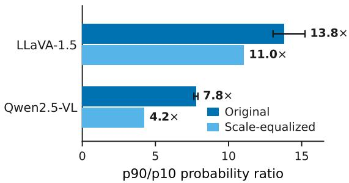

Figure 1: Across-position spread of the rank-10 probability before and after scale equalization. Error bars are retrospective image-bootstrap 95% intervals, and equalized bars are point estimates.  
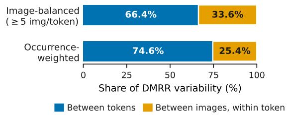  
Figure 2: Decomposition of DMRR variability on LLaVA-1.5-7B. Each bar sums to 100%.

2023), but their internal visual states can provide a proxy for the visual evidence associated with individual words. Projecting a visual-position hidden state through the language model’s output head yields a vocabulary-space readout of the words associated with that position (nostalgebraist, 2020). Such readouts distinguish grounded objects from hallucinated ones (Jiang et al., 2025), and grounded alternatives remain highly ranked even at decoding steps that produce hallucinations (Cho and Kim, 2026).

Formally, let P denote the set of visual-token positions and $\mathbf { h } _ { j } ^ { ( \ell ) }$ the hidden state at position $j \in P$ and language-model layer ℓ. Following the logitlens view, we apply the model’s final output normalization Norm and vocabulary projection $\mathbf { W } _ { \mathrm { h e a d } }$ to define the visual-position readout

$$
\begin{array} { r } { \mathbf { z } _ { j } ^ { ( \ell ) } = \mathbf { W } _ { \mathrm { h e a d } } \left( \mathrm { N o r m } \left( \mathbf { h } _ { j } ^ { ( \ell ) } \right) \right) . } \end{array}\tag{1}
$$

Each component of $\mathbf { z } _ { j } ^ { ( \ell ) }$ is the vocabulary score that visual position j assigns to the corresponding vocabulary item.

Turning these internal readouts into a decoding intervention, however, requires two steps. First, we must aggregate evidence from many visual positions without distortion (Section 3.1). Second, we must interpret the aggregated value relative to each candidate token (Section 3.2). These two problems determine ReWEIGH’s evidence measurement and per-candidate calibration, respectively.

## 3.1 Scale-Invariant Aggregation Across Visual Positions

Probability magnitudes are not directly comparable across visual positions. A direct approach applies softmax to Eq. (1) and averages a token’s probability across positions. Prior lens-guided decoding likewise represents visual evidence using these probability magnitudes (Cho and Kim, 2026; Jiang et al., 2025). However, the average inherits the sharpness of each position-wise distribution. At a given position, a small probability can indicate weak support for the candidate. It can also result from a distribution concentrated on another token. To measure this dependence, we use 500 development images and record, for each image, the probability of the token at vocabulary rank 10 at every visual position. The dispersion persists from rank 1 through rank 1,000 (Appendix B.2). Figure 1 reports the image-median ratio between the 90th and 10th percentiles of this probability across positions. The ratio is 13.8× for LLaVA-1.5-7B (Liu et al., 2024a) and 7.8× for Qwen2.5-VL-7B (Bai et al., 2025). Thus, the probability at the same ordinal position can differ by up to an order of magnitude across visual positions. Equalizing each position’s logit scale to the image median reduces these ratios only to 11.0× and 4.2×, respectively, leaving substantial dispersion in place. Therefore, an affine correction alone is insufficient.

This dependence propagates to the intervention itself. We test sensitivity to position-specific scale while preserving vocabulary order. We retain each position’s readout direction but reassign the observed positive scale factors among visual positions. We then reapply the same calibrated edit rule. This rescaling does not change the vocabulary ordering within any position. Any resulting change in the edit is therefore due to scale alone. Section 4.4 defines suppression strength as the per-candidate edit magnitude in [0, 1]. Under the probability readout, its mean absolute change is 0.045 in LLaVA-1.5- 7B and 0.046 in Qwen2.5-VL-7B. As shown in Table 9 of Appendix B.2, the rank-derived suppression strengths remain exactly unchanged.

Ranks, by contrast, are preserved under any strictly increasing transformation at each position. Our narrow claim is that ordinal information provides a transformation-invariant basis for aggregating evidence across visual positions. We pool visual evidence through reciprocal ranks, formalized in Section 4.2 as dense mean reciprocal rank (DMRR). Among order-only statistics, DMRR is a simple parameter-free choice requiring no truncation depth or fitted weights. It emphasizes positions that rank the token near the top while compressing differences among deep ranks.

Token-specific b(v) Global reference 1,000 shuffles (range)  
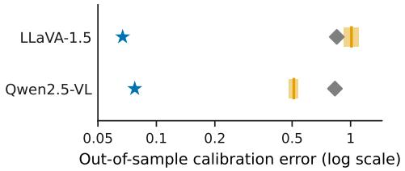  
Figure 3: Out-of-sample calibration error of tokenspecific, global, and shuffled references. Errors are in $b _ { 0 }$ units with every token counted once. Shading spans the full shuffle range, and the tick marks its median.

## 3.2 Token-Specific Interpretation of Aggregated Evidence

Replacing magnitude with rank makes visual positions comparable, but it does not make vocabulary items interchangeable. Some tokens routinely appear near the head of visual-position rankings. Others have lower typical levels. Figure 2 decomposes DMRR variability over calibration observations of LLaVA-1.5-7B. Each observation is an image-level DMRR value from a decoding step where the token is a plausible next-token candidate. In the imagebalanced decomposition, every pair of a token and an image contributes equally. Differences between tokens explain 66.4% of the variability, rather than differences between images for the same token. A single global reference therefore conflates evidence that is unusually low for one token with evidence that is entirely typical for another.

This structure suggests using each token’s calibration median as its reference. To assess whether this token-level structure generalizes beyond the calibration data, we fit token-specific medians on 500 unlabeled MS COCO images (Lin et al., 2014) and evaluate them on 4,969 disjoint images. For each token, the calibration error is the gap between its held-out median evidence and the stored reference. Relative to a single global reference, the token-specific medians reduce this error by 92% in LLaVA-1.5-7B and 91% in Qwen2.5-VL-7B. They also outperform all 1,000 random reassignments of references to tokens (Figure 3, Appendix B.3). The gain comes from the correspondence between tokens and their references, not from the distribution of reference values alone.

References estimated from few or highly variable observations can misstate typical evidence and risk suppressing well-grounded candidates. ReWEIGH therefore registers a token only when uncertainty in its estimated reference has little effect on the resulting edit, abstaining otherwise (Section 4.3).

Together, these diagnostics motivate ordinal aggregation, a token-specific reference, and a stability safeguard for uncertain references. Section 4 turns these ingredients into a bounded decoding intervention.

## 4 ReWEIGH: Token-Calibrated Ordinal Suppression

## 4.1 Overview

Figure 4 summarizes ReWEIGH’s Measure– Register–Intervene workflow. Offline, Measure aggregates visual-token readouts and Register builds a reliability-filtered token-reference table from unlabeled images. At inference, Measure computes image-level evidence once during prefill, and Intervene uses the cached evidence and frozen table throughout decoding. The resulting training-free method requires no additional model forward pass or external verifier. Algorithm 1 provides the complete procedure.

## 4.2 Measure: Dense Ordinal Visual Evidence

The Measure module quantifies how strongly the image-token states represent token v. Let V denote the language model’s vocabulary. Recall from Eq. (1) that $\mathbf { z } _ { j } ^ { ( \ell ) } \in \mathbb { R } ^ { | \nu | }$ is the LM-head readout of visual position $j \in P$ at layer ℓ. Let rankj(v) denote the rank of $z _ { j } ^ { ( \ell ) } ( v )$ among the vocabulary scores in descending order, such that the largest score has rank 1. We define the image-level evidence for token v as its dense mean reciprocal rank (DMRR) across visual positions:

$$
\mathrm { D M R R } _ { I } ( v ) = { \frac { 1 } { | P | } } \sum _ { j \in P } { \frac { 1 } { \mathrm { r a n k } _ { j } ( v ) } } .\tag{2}
$$

Equation (2) depends only on within-position vocabulary rankings and thus does not require score magnitudes to be comparable across visual positions. Reciprocal rank gives greater weight to positions where v ranks near the top while limiting the contribution of low-ranked positions. The quantity $\mathrm { D M R R } _ { I } ( v )$ depends on the image and readout layer but is independent of the autoregressive step. We therefore compute it once during prefill and cache it for the entire response.

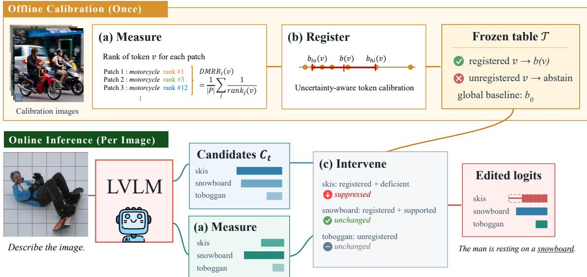  
Figure 4: Overview of ReWEIGH. Measure reads visual-token representations as vocabulary rankings. Register constructs a reliable token-specific reference table from unlabeled calibration images. Intervene applies a bounded negative shift to candidates with an evidence deficit. Measure is shared by offline calibration and online inference, whereas registration runs only once.

## 4.3 Register: Uncertainty-Aware Token Calibration

The Register module asks whether a token-specific reference is reliable enough to drive an intervention. We run the base model without logit intervention on N unlabeled calibration images that are disjoint from the evaluation data. For calibration image $I _ { i }$ with $T _ { i }$ decoding steps, let $\mathcal { C } _ { i , t }$ be the candidate set obtained by top-p selection under the base-model distribution, subject to minimum and maximum sizes. We define the candidate-conditioned calibration multiset as

$$
D _ { v } = \bigoplus _ { \substack { 1 \leq i \leq N , 1 \leq t \leq T _ { i } } } \left\{ \mathrm { D M R R } _ { I _ { i } } ( v ) \right\} ,\tag{3}
$$

where U denotes multiset union and therefore preserves repeated candidate occurrences. Thus, $D _ { v }$ records the visual evidence for v only at steps where the model considers it a plausible next-token candidate.

We summarize the observations using a tokenspecific reference and a pooled normalization scale:

$$
\begin{array} { l } { { b ( v ) = \mathrm { m e d i a n } ( D _ { v } ) , } } \\ { { \qquad b _ { 0 } = \mathrm { m e d i a n } \biggl ( \bigl \lfloor \pm \bigr \rfloor D _ { v } \biggr ) , } } \end{array}\tag{4}
$$

The token reference $b ( v )$ estimates the typical evidence level of token v as a decoder candidate under the calibration distribution (Section 3.2), whereas b0 provides a shared normalization scale across tokens.

Tokens occur at different frequencies during calibration, so the reliability of $b ( v )$ also varies. To account for this uncertainty, we construct a nominal 95% order-statistic range over the candidateoccurrence multiset $D _ { v } .$ , denoted by $[ b _ { \mathrm { l o } } ( v ) , b _ { \mathrm { h i } } ( v ) ]$ We use it as a conservative stability diagnostic rather than a coverage-guaranteed confidence interval (Appendix C.3). We then define the normalized edit induced by a reference b and observation x as

$$
e ( b , x ) = \mathrm { c l i p } \left( \frac { b - x } { b _ { 0 } } , 0 , 1 \right) .\tag{5}
$$

We quantify estimation uncertainty by its effect on the bounded edit:

$$
\Delta e ( v ) = \frac { 1 } { | D _ { v } | } \sum _ { x \in D _ { v } } \left| e ( b _ { \mathrm { h i } } ( v ) , x ) - e ( b _ { \mathrm { l o } } ( v ) , x ) \right| .\tag{6}
$$

We register token v only if its range exists and $\Delta e ( v ) < 0 . 5$ . Otherwise, the method abstains from editing it. The frozen table $\tau$ stores the global scale $b _ { 0 }$ and maps each registered vocabulary token $v \in \mathcal R$ to its token-specific reference $b ( v )$ . Appendix C.3 provides the range construction and Appendix A the candidate-set configuration.

<table><tr><td></td><td colspan="3">CHAIR</td><td colspan="7">AMBER</td><td colspan="2">Cost</td></tr><tr><td>Method</td><td>CHAIRS</td><td>CHAIRI↓</td><td>F1↑</td><td>CHAIR↓</td><td>Cover↑</td><td>Hal.↓</td><td>Cog.↓</td><td>Acc.↑</td><td>F1↑</td><td>Score↑</td><td>Lat.↓</td><td>Mem.↓</td></tr><tr><td>LLaVA-1.5-7B</td><td>52.60</td><td>15.61</td><td>80.66</td><td>3.69</td><td>50.47</td><td>19.02</td><td>3.82</td><td>71.96</td><td>74.81</td><td>85.56</td><td>1.00×</td><td>1.00×</td></tr><tr><td>VCD</td><td>59.00</td><td>17.97</td><td>78.50</td><td>6.25</td><td>51.81</td><td>32.07</td><td>4.49</td><td>66.81</td><td>70.37</td><td>82.06</td><td>2.01×</td><td>1.06×</td></tr><tr><td>OPERA</td><td>51.20</td><td>14.19</td><td>80.96</td><td>3.70</td><td>48.79</td><td>17.03</td><td>2.70</td><td></td><td>74.94 78.09</td><td>87.20</td><td>7.26×</td><td>1.51×</td></tr><tr><td>DoLa</td><td>53.00</td><td>15.87</td><td>79.28</td><td>4.52</td><td>51.03</td><td>21.12</td><td>3.84</td><td></td><td>72.17 75.09</td><td>85.28</td><td>1.10×</td><td>1.00×</td></tr><tr><td>PAI</td><td>42.40</td><td>13.51</td><td>75.55</td><td>4.68</td><td>43.11</td><td>19.32</td><td>1.97</td><td>38.29</td><td>18.93</td><td>57.12</td><td>2.14×</td><td>1.02×</td></tr><tr><td>ReVisiT</td><td>51.40</td><td>15.44</td><td>80.57</td><td>4.00</td><td>55.15</td><td>24.90</td><td>2.72</td><td>73.09</td><td>77.80</td><td>86.90</td><td>1.02×</td><td>1.03×</td></tr><tr><td>ReWEIGH</td><td>44.80</td><td>12.67</td><td>80.85</td><td>2.98</td><td>50.21</td><td>16.43</td><td>3.13</td><td>71.96</td><td>74.81</td><td>85.91</td><td>1.02×</td><td>1.00×</td></tr><tr><td>Qwen2.5-VL-7B</td><td>31.60</td><td>9.58</td><td>70.80</td><td>4.52</td><td>55.80</td><td>20.32</td><td>1.02</td><td>77.85</td><td>87.89</td><td>91.68</td><td>1.00×</td><td>1.00×</td></tr><tr><td>VCD</td><td>33.80</td><td>9.65</td><td>70.27</td><td>5.43</td><td>63.30</td><td>26.99</td><td>1.77</td><td>81.77</td><td>86.66</td><td>90.61</td><td>2.03×</td><td>1.01×</td></tr><tr><td>OPERA</td><td>20.20</td><td>7.01</td><td>63.79</td><td>3.51</td><td>63.33</td><td>20.92</td><td>1.42</td><td>83.70</td><td>88.17</td><td>92.33</td><td>8.03×</td><td>1.04×</td></tr><tr><td>DoLa</td><td>23.60</td><td>16.76</td><td>60.32</td><td>4.47</td><td>51.71</td><td>18.92</td><td>1.56</td><td>82.55</td><td>87.15</td><td>91.33</td><td>1.25×</td><td>1.00×</td></tr><tr><td>PAI</td><td>26.20</td><td>9.61</td><td>66.98</td><td>4.25</td><td>49.47</td><td>18.03</td><td>1.10</td><td>81.34</td><td>86.26</td><td>91.00</td><td>2.04×</td><td>1.00×</td></tr><tr><td>ReVisiT</td><td>24.00</td><td>6.75</td><td>66.99</td><td>4.27</td><td>62.30</td><td>24.90</td><td>1.42</td><td>83.28</td><td>87.70</td><td>91.71</td><td>1.05×</td><td>1.25×</td></tr><tr><td>ReWEIGH</td><td>25.40</td><td>7.54</td><td>71.83</td><td>3.80</td><td>54.65</td><td>18.82</td><td>0.93</td><td>78.19</td><td>87.97</td><td>92.08</td><td>1.01×</td><td>1.00×</td></tr><tr><td>InstructBLIP-7B</td><td>49.60</td><td>14.03</td><td>79.01</td><td>4.64</td><td>53.74</td><td>24.40</td><td>3.80</td><td>75.91</td><td>81.40</td><td>88.38</td><td>1.00×</td><td>1.00×</td></tr><tr><td>VCD</td><td>56.20</td><td>17.67</td><td>76.48</td><td>7.25</td><td>53.24</td><td>36.16</td><td>4.59</td><td>70.23</td><td>75.94</td><td>84.34</td><td>1.98×</td><td>1.02×</td></tr><tr><td>OPERA</td><td>50.80</td><td>14.77</td><td>79.02</td><td>4.81</td><td>52.08</td><td>23.80</td><td>3.53</td><td>75.90</td><td>81.32</td><td>88.25</td><td>11.52×</td><td>1.18×</td></tr><tr><td>DoLa</td><td>67.00</td><td>20.26</td><td>76.84</td><td>7.14</td><td>55.26</td><td>35.86</td><td>7.09</td><td>75.76</td><td>81.06</td><td>86.96</td><td>1.21×</td><td>1.00×</td></tr><tr><td>PAI</td><td>61.00</td><td>16.70</td><td>77.79</td><td>4.63</td><td>52.03</td><td>22.81</td><td>4.04</td><td>75.30</td><td>80.03</td><td>87.70</td><td>2.19×</td><td>1.01×</td></tr><tr><td>ReVisiT</td><td>43.00</td><td>15.02</td><td>74.97</td><td>4.22</td><td>50.99</td><td>22.91</td><td>2.13</td><td></td><td>54.36 50.95</td><td>73.37</td><td>1.01×</td><td>1.02×</td></tr><tr><td>ReWEIGH</td><td>46.00</td><td>12.50</td><td>79.80</td><td>4.05</td><td>53.28</td><td>21.51</td><td>3.11</td><td></td><td>75.96 81.44</td><td>88.69</td><td>1.01×</td><td>1.00×</td></tr></table>

Table 1: Main results on CHAIR and AMBER with decoding cost. The AMBER columns include generative and discriminative metrics, followed by the benchmark’s combined score. Lat. and Mem. are per-token latency and peak allocated memory relative to each backbone’s greedy decoding under the cached-evidence protocol. Green and red shade improvements and degradations of more than 5% against each backbone’s greedy baseline, darker shades mark more than 20%, and unshaded cells differ by less than 5%. Bold and underlined values indicate the best and second-best result, respectively, within each backbone block. Arrows indicate the preferred direction.

## 4.4 Intervene: Bounded Evidence-Deficit Suppression

The Intervene module determines how strongly to suppress a candidate that lacks visual support. For a registered token, we reuse Eq. (5) to compute an image-specific suppression strength

$$
s _ { I } ( v ) = e ( b ( v ) , \mathrm { D M R R } _ { I } ( v ) ) .\tag{7}
$$

At decoding step t, let $\mathbf { z } _ { t } \in \mathbb { R } ^ { | \nu | }$ denote the decoder logits before intervention, $z _ { t } ( v )$ their component for token $v \in \mathcal V$ , and $\mathcal { C } _ { t }$ the candidate set constructed exactly as during calibration. Given maximum penalty $\beta \geq 0$ , the edited decoder logit is

$$
\begin{array} { r } { z _ { t } ^ { \prime } ( v ) = \left\{ \begin{array} { l l } { z _ { t } ( v ) - \beta s _ { I } ( v ) , } & { v \in \mathcal { C } _ { t } \cap \mathcal { R } , } \\ { z _ { t } ( v ) , } & { \mathrm { o t h e r w i s e } . } \end{array} \right. } \end{array}\tag{8}
$$

The lower clipping bound makes the update suppression-only. Evidence at or above the token reference yields no edit, whereas lower evidence can reduce a candidate’s logit by at most $\beta .$ Candidates without registered references and tokens outside $\mathcal { C } _ { t }$ remain unchanged. At each decoding step, we recompute the candidate set from the preedit distribution. In contrast, we compute $s _ { I }$ once per image and cache it throughout decoding. Overall, online inference combines the frozen calibration table T with a single DMRR computation at prefill, after which each decoding step requires only candidate selection and bounded logit updates. Appendix E.1 traces this arithmetic at a recorded decoding step, where full, proportional, and zero suppression occur within a single candidate set.

## 5 Experiments

## 5.1 Experimental Setup

Models. We evaluate four 7B LVLMs with different visual interfaces and language backbones, namely LLaVA-1.5-7B (Liu et al., 2024a), Qwen2.5-VL-7B (Bai et al., 2025), InstructBLIP-7B (Dai et al., 2023), and LLaVA-NeXT-7B (Liu et al., 2024b). Appendix A lists the exact checkpoint identifiers.

Benchmarks. CHAIR (Rohrbach et al., 2018) evaluates object hallucination in MS COCO captions. AMBER (Wang et al., 2023) provides generative and discriminative evaluations. MMHal-Bench (Sun et al., 2024) evaluates open-ended multimodal responses. We use MM-Vet (Yu et al., 2024) to measure general multimodal capability. Because a model can reduce hallucination simply by saying less, we read hallucination metrics together with recall-oriented measures and general capability. Appendix A.3 gives the splits, prompts, metrics, and evaluator contracts.

<table><tr><td>Backbone</td><td>Metric</td><td>Base</td><td>VCD</td><td>OPERA</td><td>DoLa</td><td>PAI</td><td>ReVisiT</td><td>ReWEIGH</td></tr><tr><td rowspan="3">LLaVA-1.5-7B</td><td>MMHal Score↑ MMHal Hall. Rate (%)↓</td><td>2.76 51.04</td><td>2.16 65.62</td><td>2.57 53.12</td><td>2.65 53.12</td><td>2.28 43.75</td><td>2.33 58.33</td><td>2.78 48.96</td></tr><tr><td>MM-Vet Acc.↑</td><td></td><td>32.84</td><td>36.74</td><td>36.06</td><td></td><td></td><td></td></tr><tr><td></td><td>35.41</td><td></td><td></td><td></td><td>18.26</td><td>33.58</td><td>37.20</td></tr><tr><td rowspan="3">Qwen2.5-VL-7B</td><td>MMHal Score↑ MMHal Hall. Rate (%)↓</td><td>4.28 15.62</td><td>4.11 17.71</td><td>4.50 17.71</td><td>3.69 20.83</td><td>3.27 26.04</td><td>3.78 19.79</td><td>4.42 15.62</td></tr><tr><td></td><td></td><td></td><td></td><td></td><td></td><td></td><td></td></tr><tr><td>MM-Vet Acc.↑</td><td>56.65</td><td>60.87</td><td>70.96</td><td>46.97</td><td>44.86</td><td>56.38</td><td>59.54</td></tr><tr><td rowspan="2">InstructBLIP-7B</td><td>MMHal Score↑ MMHal Hall. Rate (%)↓</td><td>2.34 55.21</td><td>2.19 60.42</td><td>2.34 55.21</td><td>2.33 54.17</td><td>2.36 54.17</td><td>2.00 60.42</td><td>2.54 48.96</td></tr><tr><td>MM-Vet Acc.↑</td><td>29.17</td><td>30.78</td><td>35.23</td><td>31.61</td><td>31.19</td><td>20.09</td><td>29.63</td></tr><tr><td rowspan="2">LLaVA-NeXT-7B</td><td>MMHal Score↑ MMHal Hall. Rate (%)↓</td><td>3.84 31.25</td><td>3.46 41.67</td><td>3.71 37.50</td><td>3.96 32.29</td><td>3.55 38.54</td><td>3.47 37.50</td><td>4.02 29.17</td></tr><tr><td>MM-Vet Acc.↑</td><td>48.21</td><td>46.19</td><td>52.02</td><td>52.43</td><td>49.50</td><td>49.31</td><td>50.05</td></tr></table>

Table 2: MMHal-Bench and MM-Vet results. Hall. Rate is the percentage of examples with score below 3, and MM-Vet accuracy is on a 0–100 scale.

<table><tr><td rowspan="2">Configuration</td><td colspan="3">CHAIR</td><td colspan="3">AMBER</td></tr><tr><td> $C _ { S }$  ↓</td><td>CI↓</td><td>F1 ↑</td><td>CHAIR ↓ Cover ↑ Score ↑</td><td></td><td></td></tr><tr><td>Full method</td><td>44.8</td><td>12.67</td><td>80.85</td><td>2.98</td><td>50.21</td><td>85.91</td></tr><tr><td>Global reference</td><td>58.4</td><td>17.45</td><td>80.31</td><td>4.10</td><td>52.78</td><td>85.36</td></tr><tr><td>Shuffled references</td><td>56.0</td><td>14.74</td><td>81.54</td><td>4.11</td><td>51.63</td><td>85.36</td></tr><tr><td>Mismatched evidence</td><td>50.2</td><td>14.45</td><td>79.73</td><td>3.70</td><td>49.35</td><td>85.56</td></tr><tr><td>No abstention</td><td>44.4</td><td>12.64</td><td>80.90</td><td>2.97</td><td>50.37</td><td>86.62</td></tr><tr><td>Bidirectional update</td><td>50.4</td><td>16.07</td><td>79.74</td><td>3.72</td><td>51.22</td><td>85.54</td></tr><tr><td>Unbounded update</td><td>39.2</td><td>29.71</td><td>69.09</td><td>3.44</td><td>48.26</td><td>85.69</td></tr></table>

Table 3: Component ablations on LLaVA-1.5-7B. $C _ { S }$ and $C _ { I }$ denote $\mathrm { C H A I R } _ { S }$ and CHAIRI, and arrows indicate the preferred direction. Arm definitions are in Table 19.

Implementation. We calibrate on 500 MS COCO training images and define the candidate set as a top-p probability prefix with $p = 0 . 9$ , restricted to between 2 and 50 tokens. We select the readout layer and β once per backbone on 500 images sampled from MS COCO train2014 with seed 42. We then freeze the selected setting across benchmarks. CHAIR results come from a separate 500-image subset of MS COCO val2014, so no evaluation image enters operating-point selection. We compare with VCD (Leng et al., 2024), OPERA (Huang et al., 2024), DoLa (Chuang et al., 2024), PAI (Liu et al., 2024c), and ReVisiT (Cho and Kim, 2026). Appendix A provides further details.

## 5.2 Main Results

Visual Grounding and Hallucination Mitigation. Table 1 and Appendix D summarize finegrained visual grounding and hallucination mitigation on CHAIR and AMBER. Across the four models, ReWEIGH reduces $\mathrm { C H A I R } _ { I }$ by 10.3%– 21.3% while largely preserving or improving F1, so it does not simply suppress object mentions. The improvement generalizes to 11 models spanning six architecture families and model sizes from 7B to 32B, and ReWEIGH reduces both $\mathrm { C H A I R } _ { S }$ and CHAIRI for every model (Appendix D.4).

On AMBER generation, ReWEIGH lowers CHAIR and hallucination rate and improves the AMBER score for all four backbones. OPERA reduces $\mathrm { C H A I R } _ { S }$ more strongly on Qwen, and PAI reaches a lower $\mathrm { C H A I R } _ { S }$ on LLaVA-1.5, but both give up more F1 or discriminative performance. ReWEIGH balances hallucination reduction and retained content more consistently. Under the shading rule of Table 1, ReWEIGH is the only method that never degrades a baseline metric by more than 5% on any backbone. Its largest regression is a 2.1% relative decrease in AMBER coverage.

Open-ended Reliability and General Multimodal Utility. Table 2 shows that ReWEIGH improves MMHal-Bench quality and MM-Vet accuracy across all four backbones, while reducing or maintaining the MMHal-Bench hallucination rate.

## 5.3 Component and Counterfactual Analysis

Impact of the Ordinal Readout. Under a matched mean edit budget, replacing DMRR with probability pooling in Table 13 increases CHAIRS from 44.8 to 50.0. This comparison supports the ordinal readout as part of the complete intervention.

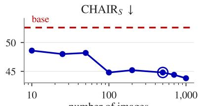  
number of images

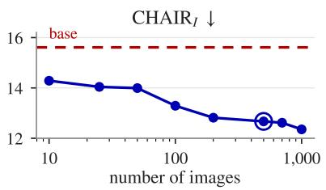

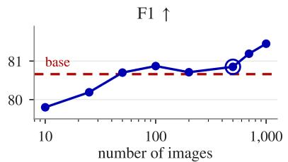  
Figure 5: Calibration-size sweep on LLaVA-1.5-7B. Dashed lines mark base decoding, and the open circle marks the deployed 500-image table.

Impact of Token-Specific Calibration. Table 3 shows that global or shuffled references degrade performance. Because shuffling preserves the marginal reference distribution, the degradation isolates the correspondence between tokens and their references.

Impact of Calibration Size. Figure 5 refits the calibration table on nested COCO subsets from 10 to 1,000 images at the frozen operating point. Ten images already recover half of the CHAIRS reduction, and 100 images match the default CHAIRS while keeping F1 above base decoding. We fixed the 500-image calibration table before these runs, so the reported results do not sit at this sweep’s optimum (Appendix D.3).

Impact of Image-Specific Evidence. The mismatched-evidence arm in Table 3 rotates the cached evidence vector across images while holding every other component fixed. Appendix D extends this counterfactual with further substitution variants (Table 21). Every substitution recovers less than half of the full method’s CHAIRS reduction and pushes F1 below base decoding, so the intervention draws on evidence about the current image, not only on which tokens are registered.

Impact of Conservative Suppression. Table 3 shows that bidirectional updates degrade CHAIR , CHAIR , and F1. Unbounded updates lower CHAIRS but induce repetition, which sharply increases CHAIR and reduces F1. In contrast, removing abstention has little effect on the aggregate metrics and affects only about 3.5% of candidate positions. We therefore treat registration as a conservative reference-stability rule rather than a measured source of aggregate gains.

## 5.4 Inference Efficiency

The Lat. and Mem. columns of Table 1 report pertoken decoding latency and peak allocated memory relative to greedy decoding, measured separately on three backbones over 100 prompts each and excluding offline calibration. Across the three backbones, ReWEIGH adds 1.33% latency after the evidence has been cached. Including online DMRR computation during prefill yields 2.40% end-to-end latency overhead. Peak allocated memory increases by 0.31% under the cached-evidence protocol. Appendix C.5 details both latency paths and the evidence-cache footprint.

## 6 Conclusion

We introduced ReWEIGH, a training-free decoder that aggregates vocabulary ranks across visual positions and compares each candidate with a reliably estimated token-specific reference. A bounded, one-sided penalty converts evidence deficits into logit edits, and prefill-time computation lets generation reuse the evidence. Across four 7B backbones, ReWEIGH reduces hallucination while preserving or improving descriptive and general multimodal utility, and the reductions extend to 11 models across six architecture families from 7B to 32B. These results support token-calibrated ordinal readouts as a practical interface between internal visual states and generation.

## Limitations

ReWEIGH requires access to visual-token hidden states, the output normalization, and the vocabulary head, so it cannot operate through closed APIs. Our current implementation uses a separate calibration table, readout layer, and intervention strength for each backbone. We evaluate 11 models from six architecture families, but we calibrate and tune each model separately. Our experiments therefore do not establish whether these components transfer across backbones without additional calibration or development data. Future work could derive references that transfer across models and choose operating points automatically.

The method derives its corrective signal entirely from the model’s visual representations and does not consult external sources. It can lower the logits of candidates that the image does not support, but it cannot add facts that neither the image nor the backbone contains. It therefore offers no direct way to correct errors that require current or specialized knowledge. Our open-ended and general multimodal benchmarks do not test this type of factual error. Future work could combine ordinal visual evidence with retrieval or external verification.

We conduct all calibration, development, and evaluation in English. We construct token-specific references over each model’s vocabulary, so differences in multilingual tokenization and alignment may change candidate frequencies and visualevidence baselines. Our results do not show whether the method behaves similarly in other languages, especially when languages differ in morphology or tokenization. We could repeat calibration in another language, but we do not know whether a reference table can transfer across languages or requires separate calibration. Future work should test the method in multilingual settings.

## Ethical Considerations

Reducing visually unsupported statements can improve the reliability of LVLM outputs, but the method does not make a model safe for high-stakes use. A bounded intervention can still leave hallucinations unchanged or replace them with different errors. Users should independently verify claims in medical, legal, scientific, and public-safety settings.

The method requires access to internal model states and an offline calibration corpus. Deployments should respect the licenses, privacy constraints, and provenance requirements of both model checkpoints and calibration images. Calibration data can also encode geographic, cultural, and frequency biases. Token-specific references may reproduce these biases by treating common visual concepts as better calibrated than rare ones. We report abstention for unstable references and avoid presenting lower benchmark scores as evidence of universal factual reliability.

## References

Shuai Bai, Keqin Chen, Xuejing Liu, Jialin Wang, Wenbin Ge, Sibo Song, Kai Dang, Peng Wang, Shi-

jie Wang, Jun Tang, Humen Zhong, Yuanzhi Zhu, Mingkun Yang, Zhaohai Li, Jianqiang Wan, Pengfei Wang, Wei Ding, Zheren Fu, Yiheng Xu, and 8 others. 2025. Qwen2.5-VL technical report. Preprint, arXiv:2502.13923.

Zhaorun Chen, Zhuokai Zhao, Hongyin Luo, Huaxiu Yao, Bo Li, and Jiawei Zhou. 2024. HALC: Object hallucination reduction via adaptive focal-contrast decoding. In Proceedings of the 41st International Conference on Machine Learning, volume 235 of Proceedings of Machine Learning Research, pages 7824–7846, Vienna, Austria. PMLR.

Beomsik Cho and Jaehyung Kim. 2026. Revisit what you see: Revealing visual semantics in vision tokens to guide LVLM decoding. In Proceedings of the 64th Annual Meeting ofthe Associationfor Computational Linguistics (Volume 1: Long Papers), pages 5794–5824, San Diego, California, United States. Association for Computational Linguistics.

Yung-Sung Chuang, Yujia Xie, Hongyin Luo, Yoon Kim, James R. Glass, and Pengcheng He. 2024. DoLa: Decoding by contrasting layers improves factuality in large language models. In The Twelfth International Conference on Learning Representations.

Wenliang Dai, Junnan Li, Dongxu Li, Anthony Tiong, Junqi Zhao, Weisheng Wang, Boyang Li, Pascale N. Fung, and Steven C. Hoi. 2023. InstructBLIP: Towards general-purpose vision-language models with instruction tuning. In Advances in Neural Information Processing Systems, volume 36, pages 49250– 49267. Curran Associates, Inc.

Alessandro Favero, Luca Zancato, Matthew Trager, Siddharth Choudhary, Pramuditha Perera, Alessandro Achille, Ashwin Swaminathan, and Stefano Soatto. 2024. Multi-modal hallucination control by visual information grounding. In Proceedings of the IEEE/CVF Conference on Computer Vision and Pattern Recognition (CVPR), pages 14303–14312, Seattle, WA, USA. IEEE.

Xuan Gong, Tianshi Ming, Xinpeng Wang, and Zhihua Wei. 2024. DAMRO: Dive into the attention mechanism of LVLM to reduce object hallucination. In Proceedings of the 2024 Conference on Empirical Methods in Natural Language Processing, pages 7696–7712, Miami, Florida, USA. Association for Computational Linguistics.

Qidong Huang, Xiaoyi Dong, Pan Zhang, Bin Wang, Conghui He, Jiaqi Wang, Dahua Lin, Weiming Zhang, and Nenghai Yu. 2024. OPERA: Alleviating hallucination in multi-modal large language models via over-trust penalty and retrospection-allocation. In Proceedings of the IEEE/CVF Conference on Computer Vision and Pattern Recognition (CVPR), pages 13418–13427, Seattle, WA, USA. IEEE.

Drew A. Hudson and Christopher D. Manning. 2019. GQA: A new dataset for real-world visual reason-

ing and compositional question answering. In Proceedings of the IEEE/CVF Conference on Computer Vision and Pattern Recognition (CVPR), pages 6700– 6709, Long Beach, CA, USA. IEEE.

Fushuo Huo, Wenchao Xu, Zhong Zhang, Haozhao Wang, Zhicheng Chen, and Peilin Zhao. 2025. Selfintrospective decoding: Alleviating hallucinations for large vision-language models. In The Thirteenth International Conference on Learning Representations.

Nicholas Jiang, Anish Kachinthaya, Suzanne Petryk, and Yossi Gandelsman. 2025. Interpreting and editing vision-language representations to mitigate hallucinations. In The Thirteenth International Conference on Learning Representations.

Junho Kim, Hyun Jun Kim, Yeon Ju Kim, and Yong Man Ro. 2024. CODE: Contrasting selfgenerated description to combat hallucination in large multi-modal models. In Advances in Neural Information Processing Systems, volume 37, pages 133571– 133599. Curran Associates, Inc.

Sicong Leng, Hang Zhang, Guanzheng Chen, Xin Li, Shijian Lu, Chunyan Miao, and Lidong Bing. 2024. Mitigating object hallucinations in large visionlanguage models through visual contrastive decoding. In Proceedings ofthe IEEE/CVF Conference on Computer Vision and Pattern Recognition (CVPR), pages 13872–13882, Seattle, WA, USA. IEEE.

Yifan Li, Yifan Du, Kun Zhou, Jinpeng Wang, Xin Zhao, and Ji-Rong Wen. 2023. Evaluating object hallucination in large vision-language models. In Proceedings of the 2023 Conference on Empirical Methods in Natural Language Processing, pages 292–305, Singapore. Association for Computational Linguistics.

Tsung-Yi Lin, Michael Maire, Serge Belongie, James Hays, Pietro Perona, Deva Ramanan, Piotr Dollár, and C. Lawrence Zitnick. 2014. Microsoft COCO: Common objects in context. In Computer Vision – ECCV 2014, volume 8693 of Lecture Notes in Computer Science, pages 740–755, Zurich, Switzerland. Springer.

Haotian Liu, Chunyuan Li, Yuheng Li, and Yong Jae Lee. 2024a. Improved baselines with visual instruction tuning. In Proceedings of the IEEE/CVF Conference on Computer Vision and Pattern Recognition (CVPR), pages 26296–26306, Seattle, WA, USA. IEEE.

Haotian Liu, Chunyuan Li, Yuheng Li, Bo Li, Yuanhan Zhang, Sheng Shen, and Yong Jae Lee. 2024b. LLaVA-NeXT: Improved reasoning, OCR, and world knowledge. Blog post, LLaVA project blog. Published 30 January 2024. Accessed 2026-08-04.

Haotian Liu, Chunyuan Li, Qingyang Wu, and Yong Jae Lee. 2023. Visual instruction tuning. In Advances in Neural Information Processing Systems, volume 36, pages 34892–34916. Curran Associates, Inc.

Shi Liu, Kecheng Zheng, and Wei Chen. 2024c. Paying more attention to image: A training-free method for alleviating hallucination in LVLMs. In Computer Vision – ECCV 2024, volume 15141 of Lecture Notes in Computer Science, pages 125–140, Milan, Italy. Springer.

nostalgebraist. 2020. interpreting GPT: the logit lens. Blog post, LessWrong. Published 31 August 2020; cross-posted to the AI Alignment Forum. Accessed 2026-08-04.

Anna Rohrbach, Lisa Anne Hendricks, Kaylee Burns, Trevor Darrell, and Kate Saenko. 2018. Object hallucination in image captioning. In Proceedings of the 2018 Conference on Empirical Methods in Natural Language Processing, pages 4035–4045, Brussels, Belgium. Association for Computational Linguistics.

Jingran Su, Jingfan Chen, Hongxin Li, Yuntao Chen, Li Qing, and Zhaoxiang Zhang. 2025. Activation steering decoding: Mitigating hallucination in large vision-language models through bidirectional hidden state intervention. In Proceedings of the 63rd Annual Meeting of the Association for Computational Linguistics (Volume 1: Long Papers), pages 12964– 12974, Vienna, Austria. Association for Computational Linguistics.

Zhiqing Sun, Sheng Shen, Shengcao Cao, Haotian Liu, Chunyuan Li, Yikang Shen, Chuang Gan, Liangyan Gui, Yu-Xiong Wang, Yiming Yang, Kurt Keutzer, and Trevor Darrell. 2024. Aligning large multimodal models with factually augmented RLHF. In Findings ofthe Associationfor Computational Linguistics: ACL 2024, pages 13088–13110, Bangkok, Thailand. Association for Computational Linguistics.

Chenxi Wang, Xiang Chen, Ningyu Zhang, Bozhong Tian, Haoming Xu, Shumin Deng, and Huajun Chen. 2025. MLLM can see? dynamic correction decoding for hallucination mitigation. In The Thirteenth International Conference on Learning Representations.

Junyang Wang, Yuhang Wang, Guohai Xu, Jing Zhang, Yukai Gu, Haitao Jia, Jiaqi Wang, Haiyang Xu, Ming Yan, Ji Zhang, and Jitao Sang. 2023. AM-BER: An LLM-free multi-dimensional benchmark for MLLMs hallucination evaluation. Preprint, arXiv:2311.07397.

Xintong Wang, Jingheng Pan, Liang Ding, and Chris Biemann. 2024. Mitigating hallucinations in large vision-language models with instruction contrastive decoding. In Findings of the Association for Computational Linguistics: ACL 2024, pages 15840–15853, Bangkok, Thailand. Association for Computational Linguistics.

Weihao Yu, Zhengyuan Yang, Linjie Li, Jianfeng Wang, Kevin Lin, Zicheng Liu, Xinchao Wang, and Lijuan Wang. 2024. MM-Vet: Evaluating large multimodal models for integrated capabilities. In Proceedings of

the 41st International Conference on Machine Learning, volume 235 of Proceedings of Machine Learning Research, pages 57730–57754, Vienna, Austria. PMLR.

Xin Zou, Yizhou Wang, Yibo Yan, Yuanhuiyi Lyu, Kening Zheng, Sirui Huang, Junkai Chen, Peijie Jiang, Jia Liu, Chang Tang, and Xuming Hu. 2025. Look twice before you answer: Memory-space visual retracing for hallucination mitigation in multimodal large language models. In Proceedings ofthe 42nd International Conference on Machine Learning, volume 267 of Proceedings ofMachine Learning Research, pages 80873–80899, Vancouver, Canada. PMLR.

## A Experimental and Evaluation Details

## A.1 Model Checkpoints

Table 4 lists the exact model checkpoints used in our experiments together with their language backbones. We use the abbreviated model names in the first column consistently throughout the paper.

## A.2 Calibration Data and Operating-Point Selection

For each backbone, we sample 500 images from MS COCO train2014 (Lin et al., 2014) with seed 4242. The calibration images are disjoint from both the seed-42 tuning subset used for operatingpoint selection and the evaluation manifests. We run the unmodified model greedily and, at each step, collect the DMRR value of every token in the shortest probability prefix whose mass reaches 0.9. We enforce a minimum of two candidates and cap the prefix at 50 tokens. We condition token observations on candidacy and do not sweep the vocabulary at every decoding step.

For operating-point selection, we sample 500 images from MS COCO train2014 with seed 42. The initial grid pairs the three decoder layers with $\beta \in \{ 0 . 5 , 0 . 7 , 0 . 9 , 1 . 1 , 1 . 3 \}$ , which gives 15 configurations. We then identify the most promising pair of adjacent strengths and evaluate their midpoint at all three layers. This adds three configurations and gives 18 in total per backbone. We inspect $\mathbf { C H A I R } _ { S } , \mathbf { C H A I R } _ { I }$ , recall, and F1 together and select the operating point qualitatively rather than optimizing a single aggregate score. We then freeze the selected layer and $\beta$ for all remaining benchmarks. Table 5 lists the frozen operating point (ℓ, $\beta , b _ { 0 } )$ and the number of registered tokens for each backbone. We report CHAIR results on 500 images sampled from MS COCO val2014. MS COCO defines train2014 and val2014 as distinct image splits and explicitly limits near-duplicates across splits (Lin et al., 2014). No evaluation image is therefore used for operating-point selection, and we use no benchmark-specific strength.

The calibration-size sweep in Figure 5 uses a single nested sequence built from the frozen seed-4242 panel. We sort the panel by COCO image ID and take the first n images as the subsets up to $n { = } 5 0 0$ . For larger sizes, we continue the same random stream, sample 500 additional images without replacement from the remaining pool, sort them by image ID, and append them to the frozen panel. The 700- and 1,000-image sets are prefixes of this extended sequence, so every smaller subset is contained in every larger one. The 500-image arm reproduces the deployed configuration exactly. Refitting from this prefix recovered the deployed $b _ { 0 } ,$ all 2,580 registered token references, and their observation counts, and the arm reuses the frozen evaluation output.

## A.3 Evaluation Protocols

Table 6 summarizes the evaluation splits and reported metrics. Unless otherwise stated, we follow the setup in each benchmark’s original paper and released official evaluator as closely as possible. We select CHAIR hyperparameters on the seed-42 COCO train2014 tuning subset and report results on the separate COCO val2014 subset listed in the table. We hold prompts, decoding limits, and evaluator contracts fixed across the base model, ReWEIGH, and the compared methods.

## A.3.1 CHAIR

We evaluate CHAIR (Rohrbach et al., 2018) on a fixed 500-image subset of MS COCO val2014, disjoint from the tuning and calibration images. The image identifiers are fixed by the evaluation manifest sampled with seed 42. We query every image with the exact prompt “Please describe this image in detail.” and cap generation at 512 new tokens. We use the official CHAIR object vocabulary and synonym mapping. Following the benchmark protocol, the reference object set for each image is the union of objects in the MS COCO instance annotations and the reference captions.

CHAIRS is the fraction of captions that contain at least one hallucinated object mention, whereas CHAIRI is the fraction of generated object mentions that are hallucinated. Object recall is corpusmicro recall, computed by summing the numbers of recovered and reference object categories across images. We additionally derive object precision as $1 - \mathrm { C H A I R } _ { I }$ and report its harmonic mean with object recall as F1. Length is the mean number of whitespace-delimited words in the generated captions. Every method uses the same fixed manifest, prompt, synonym mapping, and scorer. As described above, we select the readout layer ℓ and $\beta$ on the COCO train2014 tuning subset before scoring the 500 COCO val2014 captions.

## A.3.2 AMBER

AMBER (Wang et al., 2023) contains a 1,004- example generative split and a 14,216-question discriminative split. The latter comprises 4,924 existence, 7,628 attribute, and 1,664 relation questions. For the generative split, we use the exact prompt “Describe this image.” and generate at most 128 new tokens. The official noun-based scorer extracts and lemmatizes nouns with NLTK and matches them using the released association and safe-word resources together with the en\_core\_web\_lg similarity model at threshold 0.8. We report its CHAIR, object coverage (Cover), caption-level hallucination rate (Hal.), and cognitive hallucination (Cog.) metrics. These quantities use AMBER’s released vocabulary and should not be numerically equated with MS COCO CHAIRI.

<table><tr><td>Model</td><td>Checkpoint ID</td><td>Language backbone</td></tr><tr><td>InstructBLIP-7B</td><td>Salesforce/LAVIS blip2_vicuna_instruct/vicuna7b</td><td>Vicuna-7B</td></tr><tr><td>LLaVA-1.5-7B</td><td>liuhaotian/1lava-v1.5-7b</td><td>Vicuna-7B-v1.5</td></tr><tr><td>LLaVA-NeXT-7B</td><td>liuhaotian/1lava-v1.6-mistral-7b</td><td>Mistral-7B-Instruct-v0.2</td></tr><tr><td>Qwen2.5-VL-7B</td><td>Qwen/Qwen2.5-VL-7B-Instruct</td><td>Qwen2.5-7B</td></tr><tr><td>InternVL2.5-8B</td><td>OpenGVLab/InternVL2_5-8B</td><td>internlm/internlm2_5-7b-chat</td></tr><tr><td>Gemma-3-12B</td><td>google/gemma-3-12b-it</td><td>Gemma-3-12B</td></tr><tr><td>InstructBLIP-13B</td><td>Salesforce/LAVIS blip2_vicuna_instruct/vicuna13b</td><td>1msys/vicuna-13b-v1.1</td></tr><tr><td>LLaVA-1.5-13B</td><td>liuhaotian/1lava-v1.5-13b</td><td>Vicuna-13B-v1.5</td></tr><tr><td>InternVL2.5-26B</td><td>OpenGVLab/InternVL2_5-26B</td><td>internlm/internlm2_5-20b-chat</td></tr><tr><td>Gemma-3-27B</td><td>google/gemma-3-27b-it</td><td>Gemma-3-27B</td></tr><tr><td>Qwen2.5-VL-32B</td><td>Qwen/Qwen2.5-VL-32B-Instruct</td><td>Qwen2.5-32B</td></tr></table>

Table 4: Model checkpoints and their language backbones.
<table><tr><td>Backbone</td><td>2</td><td> $\beta$ </td><td> $b _ { 0 }$ </td><td>Registered</td></tr><tr><td>LLaVA-1.5</td><td>29</td><td>1.1</td><td>0.00324809</td><td>2,580</td></tr><tr><td>LLaVA-NeXT</td><td>30</td><td>1.2</td><td>0.00274012</td><td>3,734</td></tr><tr><td>InstructBLIP</td><td>29</td><td>0.5</td><td>0.00184383</td><td>2,708</td></tr><tr><td>Qwen2.5-VL</td><td>27</td><td>1.1</td><td>0.000653155</td><td>7,028</td></tr></table>

Table 5: Frozen backbone-specific operating points and reference-stability table statistics.

For the discriminative split, we preserve each released yes/no question verbatim, add no answerformat suffix, and cap generation at 8 new tokens. To avoid silently mapping a free-form response to a binary class, we normalize Unicode and case, remove leading whitespace and punctuation, and accept a response only if its first token is yes or no. We mark all other responses as unparsed and count them as incorrect for accuracy. An unparsed example whose ground-truth label is no also counts as a false negative for recall. We treat no, which denotes the hallucinatory case, as the positive class and report accuracy, precision, recall, F1, and the number and percentage of unparsed responses. F1 uses the scorer’s $1 0 ^ { - 4 }$ denominator smoothing. The reported combined score is

$$
\mathrm { A M B E R ~ S c o r e } = \textstyle { \frac { 1 } { 2 } } \left[ \left( 1 0 0 - \mathrm { C H A I R } \right) + \mathrm { F 1 } \right] ,\tag{9}
$$

with both constituent metrics expressed on a 0–100 scale.

## A.3.3 MMHal-Bench

We use all 96 MMHal-Bench examples (Sun et al., 2024), comprising 12 examples from each of eight question types: attribute, adversarial, comparison, counting, relation, environment, holistic, and other. We pass the released question verbatim without an additional prompt suffix and allow at most 256 new tokens. We retain the released five-example evaluator prompt and rubric without modification. This text-only evaluator receives the released imagecontent object list, question, human reference answer, and model response. It does not receive the image itself. Its rubric assigns an integer score from 0 to 6 according to informativeness and the presence of hallucination. Scores 0–2 denote a response with hallucination, and scores 3–6 denote a response without hallucination. We report the mean score and the percentage of examples assigned a score below 3.

All configurations are judged with the frozen gpt-4.1-mini-2025-04-14 snapshot at temperature 0. The parser extracts a “Rating: $s ^ { \prime }$ entry for $s \in \{ 0 , \ldots , 6 \}$ , and an output that does not yield a unique valid rating receives score 0. Thus, parse failures receive identical treatment for every method and stay in the denominator.

<table><tr><td>Benchmark</td><td>Split</td><td>Records</td><td>Max.</td><td>Reported metrics</td></tr><tr><td>CHAIR</td><td>MS COCO val500</td><td>500</td><td>512</td><td>Cs, C1, object recall, F1, length</td></tr><tr><td>AMBER-Generative</td><td>official generative</td><td>1,004</td><td>128</td><td>CHAIR, Cover, Hal., Cog.</td></tr><tr><td>AMBER-Discriminative</td><td>official discriminative</td><td>14,216</td><td>8</td><td>accuracy, precision, recall, F1, unparsed, AMBER score</td></tr><tr><td>MMHal-Bench</td><td>full set</td><td>96</td><td>256</td><td>quality score, hallucination rate</td></tr><tr><td>MM-Vet</td><td>original test</td><td>218</td><td>1,024</td><td>total score</td></tr></table>

Table 6: Evaluation datasets, record counts, maximum numbers of newly generated tokens (Max.), and reported metrics.

## A.3.4 MM-Vet

We evaluate the original MM-Vet test set (Yu et al., 2024), which contains 218 questions over 200 images. Each released question is used verbatim without an answer-format suffix, and generation is capped at 1,024 new tokens. The official text-only grading contract retains the released six-example prompt without modification. It compares the question, released reference answer, and model prediction, and returns one of {0.0, 0.1, . . . , 1.0}. The prompt explicitly preserves the benchmark’s <AND> semantics, which require all referenced elements, and <OR> semantics, which accept any listed alternative. We use gpt-4.1-mini-2025-04-14 at temperature 0. An evaluator output that does not yield a valid score receives score 0.

The total MM-Vet score is 100 times the mean item grade. The evaluator also defines capability breakdowns over recognition (150), OCR (96), knowledge (84), generation (80), spatial reasoning (75), and mathematics (26). These capability tags overlap, so their sample counts do not form a partition of the 218 questions. The same judge snapshot, prompt contract, and one-grade policy are used for every MM-Vet row in Table 2.

## A.4 Generation Settings

The base model and ReWEIGH use batch size 1, eager attention, one beam, and no sampling. The generation seed is 42. The checkpoint-native repetition penalty is 1.05 for Qwen2.5-VL and 1.0 for the other backbones. Benchmark-specific decoding limits are fixed in the evaluation manifests, and the method and base model use the same limit and prompt. For all baseline methods, we use the authors’ official implementations and the default configurations specified in the corresponding papers and repositories. Each baseline therefore keeps the decoding regime of its original paper. OPERA searches with five beams, which also accounts for the decoding cost we report for it in Table 1, and

VCD samples instead of decoding greedily.

## A.5 Hardware and Software

Each generation job uses an NVIDIA A100-SXM4- 80GB GPU, with approximately 250 total GPUhours used across all experiments. LLaVA-1.5 uses Python 3.10.20, PyTorch 2.1.2+cu121, and Transformers 4.40.0. LLaVA-NeXT and Qwen2.5- VL use Python 3.10.20, PyTorch 2.5.1+cu124, and Transformers 4.52.1. The original LAVIS InstructBLIP environment uses Python 3.9.16, PyTorch 2.0.1+cu117, and Transformers 4.33.2. LLaVA and InstructBLIP run in FP16, and Qwen2.5-VL runs in BF16. For every run, we record the model revision, the evaluation-manifest and prompt hashes, the calibration-table hash, the decoding configuration, and the runtime environment.

## A.6 Artifact Licenses and Intended Use

We use all datasets, model checkpoints, and evaluation tools for non-commercial research, consistent with their intended use and stated terms. MS COCO annotations are released under the Creative Commons Attribution 4.0 license, and the underlying images are governed by the Flickr Terms of Use (Lin et al., 2014). AMBER (Wang et al., 2023) and MMHal-Bench (Sun et al., 2024) are released under the Apache-2.0 license, and GQA (Hudson and Manning, 2019) under CC BY 4.0. The MM-Vet evaluation code is Apache-2.0 and its data are distributed under CC BY-NC 4.0 (Yu et al., 2024). Among the checkpoints in Table 4, Qwen2.5-VL-7B and LLaVA-NeXT-7B (Mistral-7B-Instruct-v0.2 backbone) are Apache-2.0, LLaVA-1.5-7B is subject to the Llama 2 Community License through its Vicuna-v1.5 backbone, and InstructBLIP-7B follows the non-commercial research terms of its LLaMA-based Vicuna backbone. The AMBER scorer depends on NLTK (Apache-2.0) and the spaCy en\_core\_web\_lg model (MIT), and the LLM judge is accessed through the OpenAI API under its terms of use. Qualitative figures reproduce individual benchmark images solely for scholarly analysis.

## B Additional Diagnostic Analyses

## B.1 Scope of the Diagnostic Analyses

The analyses in Section 3 answer two design questions. The first asks which property of a visualposition vocabulary readout can be pooled across positions without inheriting position-specific cardinal scale. The second asks which reference makes the pooled evidence interpretable for a particular token. These analyses motivate an intervention design. We do not claim that rank is a universally superior hallucination detector or that token-specific centering improves standalone classification.

We conduct the diagnostic analyses on LLaVA-1.5-7B and Qwen2.5-VL-7B at their selected readout layers. The scale-dispersion and token-identityshare measurements additionally cover all four evaluated backbones. The two models have different visual-token counts and different absolute DMRR scales. We therefore report within-backbone effects and do not compare absolute evidence values across models.

## B.2 Rank-Preserving Scale Analysis

Let $\mathbf { z } _ { j } ^ { ( \ell ) }$ be the vocabulary readout of visual position $j .$ Multiplying this vector by a positive scalar preserves its complete vocabulary ordering but changes the probability distribution obtained by softmax. The controlled test retains the observed readout directions and reassigns positive scale factors among visual positions. It is an invariance stress test rather than a model of a naturally occurring perturbation. Its role is to isolate sensitivity to position-wise cardinal scale while every withinposition vocabulary ordering stays fixed. Consequently, every token retains its rank within each position, while a probability aggregate can change because the positions now contribute distributions with different sharpness. The probability arm replaces DMRR with the logarithm of each token’s position-averaged softmax probability, floored at $1 0 ^ { - 8 }$ , and mirrors the calibration of Section 4.3: the token reference is the candidate-conditioned median of this readout, and registration applies the same $\Delta e ( v ) < 0 . 5$ rule. One substitution is forced by the readout’s range. The pooled median of the log-probability readout is negative (−8.6 for LLaVA-1.5-7B and −10.2 for Qwen2.5-VL

7B), so reusing it as the normalization scale $b _ { 0 }$ in Eq. (5) would flip the sign of the normalized deficit, clipping every evidence deficit to zero while directing suppression toward evidence surpluses. The probability arm therefore normalizes by a positive scale solved on the calibration images so that its mean deployed edit matches the DMRR arm’s under the same maximum penalty (0.966 for LLaVA-1.5-7B and 0.905 for Qwen2.5-VL-7B), and the registration rule is evaluated under the same positive scale. With this substitution, the two arms share the bounded evidence-deficit form of Eqs. (5) and (7) under a matched mean edit budget and differ in the underlying readout and its normalization scale.

The maximum rank change under this manipulation is zero. With the original calibration table fixed, the probability-derived suppression strengths shift by a mean absolute 0.0445 for LLaVA and 0.0462 for Qwen, whereas the rankderived suppression strengths remain exactly unchanged. Equalizing the scale closes only 6.94% and 8.76% of the full probability-to-rank gap in suppression strengths. The equalization comparison uses the raw position-averaged probability rather than its logarithm, whose pooled calibration median is positive and therefore serves directly as the normalization scale, with the penalty refit so this arm meets the same mean edit budget as the DMRR arm. Scale equalization also leaves most of the fixed-rank dispersion in place. Setting every position’s logit scale to the image median reduces the rank-10 p90/p10 spread from 13.82× to 11.05× on LLaVA and from 7.79× to 4.25× on Qwen. Between 67% and 95% of the log-probability spread survives across the measured depths 1–1,000 for both backbones (Table 8). Position-wise distribution shape therefore differs beyond what a perposition rescaling can correct. The result identifies cardinal scale as one nuisance in probability pooling, not as a complete explanation of the end-to-end difference between the two interventions.

Three tables document the position-scale diagnostics. Table 7 extends the dispersion measurement to all four evaluated backbones. It fixes a probability threshold and reports the acrossposition spread of its rank depth, complementing Figure 1, which fixes a vocabulary rank and reports the spread of its probability. At every selected readout layer, the rank depth of a fixed probability threshold varies across positions by at least a factor of four on 5,000 development images, and the

200-image measurement closely matches. Table 8 reports the depth-wise spreads on 500 development images before and after scale equalization. Its rank-10 rows underlie Figure 1, and the original rank-10 spreads carry retrospective image-bootstrap 95% intervals of [2.568, 2.723] and [2.032, 2.068] in log units, or [13.0×, 15.2×] and [7.6×, 7.9×] as ratios. Table 9 reports the rescaling stress test and the scale-equalization closure with their bootstrap intervals.

Table 10 reports the standardized-readout control referenced in Section 3.1. The control replaces the ordinal readout with a per-position standardized (z-scored) readout of the same lens under matched calibration and suppression. The comparison runs in a self-contained harness in which each backbone regenerates its own base, with Qwen2.5-VL-7B at repetition penalty 1.0, so its values are not numerically comparable with the main results. On $\mathrm { L L a V A } { \cdot }$ $1 . 5 – 7 \mathrm { B }$ , the ordinal readout lowers $\mathrm { C H A I R } _ { S }$ from 52.8 to 45.8 under matched support, while recall decreases from 76.9 to 75.2. On Qwen2.5-VL-7B, the standardized readout lowers $\mathrm { C H A I R } _ { S }$ from 26.0 to 24.4, while the ordinal readout raises recall from 55.6 to 58.0. These mixed point estimates do not establish cross-backbone superiority, but they show that per-position standardization does not reproduce the ordinal intervention’s behavior.

## B.3 Token-Conditioned Reference Analysis

After replacing probability magnitude with rank, the remaining evidence still depends on token identity. In the image-balanced LLaVA decomposition reported in the main paper, 66.36% of DMRR variability is associated with differences between tokens and 33.64% with differences between images for the same token. The decomposition is descriptive. Its role is to test whether a single global reference is well matched to the evidence being interpreted. Each observation is the image-level value $\mathrm { D M R R } _ { I } ( v )$ attached to one candidate occurrence of token v. Repeated occurrences within an image share one value because we compute $\mathrm { D M R R } _ { I } ( v )$ once per image. The decomposition splits the total sum of squares of these observations into a between-token component, the variability of per-token means, and a between-image, within-token remainder, and reports each component’s share of the total. The occurrence-weighted variant counts every candidate occurrence once, whereas the image-balanced variant counts every token–image pair once, subject to the rare-token

filter stated in Figure 2.

We evaluate this question out of sample using 500 calibration images and 4,969 disjoint images. For each token observed in the held-out set, we form the median of its held-out DMRR observations and score a stored reference b by the normalized gap between the two in $b _ { 0 }$ units. The token-unweighted aggregate takes the median of this gap with every token counted once, and the candidate-mass-weighted aggregate weights each token by its held-out candidate mass. The correct token-specific median reduces error relative to a global reference by more than 90% in both analyzed backbones under token-unweighted and candidate-mass-weighted aggregation. Randomly shuffling the mapping between tokens and reference values preserves the marginal reference distribution but performs worse than the correct mapping in all 1,000 permutations, which corresponds to the smallest attainable one-sided permutation p-value under this null $( p = 1 / 1 0 0 1 )$ . This control separates the value distribution of the calibration table from the token-to-reference correspondence.

Two tables document the token-reference analysis. Table 11 varies the rare-token filter and the weighting unit of the decomposition, and it reports the token-identity share for all four evaluated backbones on 5,000 development images. Table 12 lists the out-of-sample calibration errors behind Figure 3, including the shuffled-reference null for both analyzed backbones.

## B.4 Detection Quality Does Not Predict Mitigation

This section tests whether standalone detection quality identifies the signal that best drives an autoregressive intervention. We choose the ordinal readout in Section 3.1 for comparability across visual positions and for calibratability, not for detection quality. We compare rank- and probabilityderived signals at the emitted-object detection level, in a raw score-to-edit negative control, and in the complete calibrated intervention.

At the detection level, the emitted-object hallucination AUROC reaches 0.679 with the rank readout and 0.718 with the probability readout on LLaVA-1.5-7B, and 0.619 and 0.634 on Qwen2.5-VL-7B. This metric orders grounded and hallucinated object tokens that the base trajectory emitted. It does not specify the full candidate-vector edit or the autoregressive trajectory after an intervention.

The raw score-to-edit control asks whether the uncalibrated signals already differ as local intervention targets. At every step, each arm suppresses exactly one candidate by the same amount, without b(v), registration, normalization, or clipping. The contrast measures local switch selectivity within a fixed four-token precursor window. Raw rank minus probability is −0.49 pp (95% image-bootstrap interval $[ - 1 . 1 9 , + 0 . 2 2 ] )$ on LLaVA-1.5-7B and −0.93 pp ([−1.72, −0.16]) on Qwen2.5-VL-7B, so the bare rank signal provides no local advantage. Rank alone therefore does not explain the final method’s behavior.

<table><tr><td>Threshold τ</td><td>LLaVA-1.5-7B</td><td>InstructBLIP-7B</td><td>LLaVA-NeXT-7B</td><td>Qwen2.5-VL-7B</td></tr><tr><td> $1 0 ^ { - 3 }$ </td><td>8.6 (8.5)</td><td>4.1 (3.9)</td><td>9.2 (9.2)</td><td>5.8 (5.7)</td></tr><tr><td> $1 0 ^ { - 4 }$ </td><td>62.5 (59.4)</td><td>7.1 (6.7)</td><td>87.7 (84.0)</td><td>7.4 (7.4)</td></tr><tr><td> $1 0 ^ { - 5 }$ </td><td>93.8 (89.4)</td><td>4.6 (4.6)</td><td>477.3 (459.4)</td><td>11.5 (10.9)</td></tr></table>

Table 7: Across-position dispersion of the rank depth of a fixed probability threshold. Each cell is the imagemedian $\mathsf { p } 9 0 / \mathsf { p } 1 0$ ratio of $N _ { j } ( \tau )$ , the number of vocabulary items with probability at least τ at visual position j. Values in parentheses use the 200-image measurement.
<table><tr><td rowspan="2">Rank depth k</td><td colspan="3">LLaVA-1.5-7B</td><td colspan="3">Qwen2.5-VL-7B</td></tr><tr><td>Original</td><td>Equalized</td><td>Surv.</td><td>Original</td><td>Equalized</td><td>Surv.</td></tr><tr><td>1</td><td>4.64</td><td>3.86</td><td>83%</td><td>4.11</td><td>3.53</td><td>86%</td></tr><tr><td>2</td><td>3.59</td><td>2.91</td><td>81%</td><td>3.29</td><td>2.70</td><td>82%</td></tr><tr><td>5</td><td>2.55</td><td>2.15</td><td>84%</td><td>2.47</td><td>1.87</td><td>76%</td></tr><tr><td>10</td><td>2.63</td><td>2.40</td><td>91%</td><td>2.05</td><td>1.45</td><td>70%</td></tr><tr><td>20</td><td></td><td></td><td></td><td>1.79</td><td>1.20</td><td>67%</td></tr><tr><td>50</td><td>3.43</td><td>3.26</td><td>95%</td><td>1.58</td><td>1.18</td><td>75%</td></tr><tr><td>100</td><td>3.87</td><td>3.64</td><td>94%</td><td>1.53</td><td>1.28</td><td>84%</td></tr><tr><td>500</td><td>4.63</td><td>4.14</td><td>90%</td><td></td><td></td><td></td></tr><tr><td>1,000</td><td>4.84</td><td>4.22</td><td>87%</td><td>1.83</td><td>1.57</td><td>86%</td></tr></table>

Table 8: Across-position dispersion of the rank-k log probability before and after scale equalization. Each cell is the image-median p90–p10 spread in log units. Surv. is the share of the original spread that survives equalization. Depths absent from a backbone’s stored grid are marked —.

Table 13 gives the corresponding end-to-end comparison on LLaVA-1.5-7B under a matched mean edit budget. The calibrated rank intervention lowers $\mathrm { C H A I R } _ { S }$ from 50.0 to 44.8 relative to the calibrated probability intervention. It also removes more hallucinated-object occurrences from the shared base captions and introduces fewer new ones. Figure 6 illustrates the same distinction on one image. The probability intervention generates an unsupported fork, whereas the rank intervention avoids it while preserving the grounded pizza and dining table. The example is illustrative. The aggregate comparison in Table 13, rather than this selected image, supports the conclusion.

These results do not isolate a single causal mediator or show that calibration alone creates the gap. They establish the conclusion relevant to our design.

The ordering of the two signals on standalone detection does not match their ordering on end-to-end mitigation, where the token-calibrated rank intervention performs better under the matched budget. Detection quality alone therefore does not identify the signal of an effective autoregressive intervention.

## B.5 From Detection to Allocation

Table 14 examines where the calibrated rank and probability edit fields place their edits on 4,969 held-out images, complementing the raw score-toedit control of Appendix B.4. The unit of analysis is the four-step precursor window before each CHAIR object mention. A window counts as switched when the applied edit changes the onestep argmax at any of its steps, and switch selectivity is the switch rate before hallucinated mentions minus the switch rate before grounded mentions. A deterministic tokenizer-piece taxonomy, rather than contextual part-of-speech tagging, classifies precursor tokens into structural words, lexical words, punctuation and boundary pieces, and special fragments. An allocation-exclusive event is a window that switches under exactly one field’s candidate assignment, read at that field’s first switched step. The Effect rows exchange only the candidate assignment between the two calibrated fields while the edit-magnitude multiset stays fixed, using either field as the magnitude donor. On LLaVA-1.5-7B, the rank-derived assignment yields higher hallucination-linked precursor switch selectivity under both donors, while on Qwen2.5-VL-7B the contrasts are directionally consistent but their intervals include zero. The Role rows decompose the rank-donor effect by precursor token role, and the advantage concentrates on structural tokens. The Share rows report the fraction of allocationexclusive first edit events that fall on structural tokens, which is likewise larger under the rank field. These are descriptive allocation statistics. They locate the difference between the two calibrated fields without establishing that structural-token edits are individually necessary.

<table><tr><td rowspan="2">Signal</td><td rowspan="2">Quantity</td><td colspan="2">LLaVA-1.5-7B</td><td colspan="2">Qwen2.5-VL-7B</td></tr><tr><td>Value</td><td>95% CI</td><td>Value</td><td>95% CI</td></tr><tr><td>Rank</td><td>Suppression-strength change</td><td>0†</td><td></td><td>0†</td><td></td></tr><tr><td>Probability</td><td>Suppression-strength mean |∆|</td><td>0.0445</td><td>[0.0430, 0.0460]</td><td>0.0462</td><td>[0.0447, 0.0478]</td></tr><tr><td></td><td>Candidate-score Spearman</td><td>0.964</td><td></td><td>0.961</td><td></td></tr><tr><td></td><td>Edited-set Jaccard</td><td>0.805</td><td></td><td>0.857</td><td></td></tr><tr><td></td><td>Strongest edited candidate changed</td><td>18.6%</td><td></td><td>17.8%</td><td></td></tr><tr><td></td><td>One-step winner changed</td><td>1.7%</td><td></td><td>2.5%</td><td></td></tr><tr><td>Equalization</td><td>Probability-to-rank gap closed</td><td>6.94%</td><td>[6.52, 7.36]</td><td>8.76%</td><td>[6.50, 11.11]</td></tr></table>

Table 9: Order-preserving rescaling stress test at the selected readout layers. The probability rows report how the probability-derived edit field reacts to the rescaling, and the winner is the candidate-local one-step argmax after the edit. The equalization row reports the closed share of the probability-to-rank gap. Intervals are image-bootstrap 95%, retrospective for the rescaling rows and paired for the equalization row. † marks an exact zero. The shaded row is the rank signal used by ReWEIGH.
<table><tr><td></td><td></td><td colspan="4">LLaVA-1.5-7B</td><td colspan="4">Qwen2.5-VL-7B</td></tr><tr><td>Support</td><td>Readout policy</td><td>CHAIRS↓</td><td>CHAIRI↓</td><td>Recall↑</td><td>F1↑</td><td> $\operatorname { C H A I R } _ { S } \downarrow$ </td><td> $\mathrm { C H A I R } _ { I } \downarrow$ </td><td>Recall↑</td><td>F1↑</td></tr><tr><td>Matched</td><td>Ordinal readout (DMRR)</td><td>45.8</td><td>12.78</td><td>75.2</td><td>80.77</td><td>26.0</td><td>8.64</td><td></td><td>58.0 70.99</td></tr><tr><td></td><td>Standardized (z-score)</td><td>52.8</td><td>14.87</td><td>76.9</td><td>80.83</td><td>24.4</td><td>6.45</td><td></td><td>55.6 69.77</td></tr><tr><td>Native</td><td>Base decoding</td><td>52.6</td><td>16.07</td><td></td><td>77.3 80.48</td><td>28.8</td><td>8.26</td><td></td><td>56.669.97</td></tr><tr><td></td><td>Ordinal readout (DMRR)</td><td>45.8</td><td>12.77</td><td></td><td>75.2 80.77</td><td>25.8</td><td>8.59</td><td></td><td>57.8 70.82</td></tr><tr><td></td><td>Standardized (z-score)</td><td>52.4</td><td>14.90</td><td>76.9</td><td>80.81</td><td>24.0</td><td>6.38</td><td>55.0</td><td>69.29</td></tr><tr><td></td><td>Mean probability</td><td>49.2</td><td>13.30</td><td></td><td>77.481.81</td><td>25.2</td><td>8.94</td><td>57.6</td><td>70.58</td></tr><tr><td></td><td>Standardized probability</td><td>49.4</td><td>13.80</td><td></td><td>77.081.34</td><td>26.6</td><td>7.17</td><td>57.3</td><td>70.86</td></tr></table>

Table 10: End-to-end control between the ordinal and standardized readouts. Matched rows evaluate both policies on identical candidate support. Native rows let each policy form its own candidate sets, which is why the two blocks differ slightly. The native probability rows are not the matched-budget rank–probability comparison of Table 13. Shaded rows are the ordinal readout used by ReWEIGH. Arrows indicate the preferred direction.

## B.6 Output Confidence and the Evidence Deficit

Table 15 asks whether output confidence alone identifies the hallucinated mentions that the evidence signal targets. Among object-mention onsets in the top quartile of output confidence, 13.9% are hallucinated on LLaVA-1.5-7B and 7.3% on Qwen2.5-

VL-7B, and the hallucinated onsets carry a positive median evidence deficit while grounded onsets in the same quartile carry none. The separation is clear on LLaVA-1.5-7B. On Qwen2.5-VL-7B the direction agrees but the interval reaches zero. High output confidence therefore does not subsume the calibrated evidence signal.

## C Method and Implementation Details

## C.1 Architecture-Specific Visual Positions

The set P always refers to positions that carry visual information inside the language-model sequence. For LLaVA-1.5 and LLaVA-NeXT, these are the projected vision-encoder patch embeddings inserted in place of the image placeholder (Liu et al., 2023, 2024a,b). For InstructBLIP, P contains the projected Q-Former query embeddings supplied to the Vicuna language model (Dai et al., 2023). For Qwen2.5-VL, P contains the merged visual embeddings inserted into the multimodal sequence (Bai et al., 2025). We exclude text positions and image-boundary control tokens.

<table><tr><td colspan="3">(a) Weighting sensitivity of the decomposition (LLaVA-1.5-7B)</td></tr><tr><td>Analysis unit</td><td>Between tokens</td><td>Between images, within token</td></tr><tr><td>Token-image balanced, min. 1 image/token</td><td>66.40%</td><td>33.60%</td></tr><tr><td>Token-image balanced, min. 2 images/token</td><td>66.33%</td><td>33.67%</td></tr><tr><td>Token-image balanced, min. 5 images/token (primary)</td><td>66.36%</td><td>33.64% 33.41%</td></tr><tr><td>Token-image balanced, min. 10 images/token Occurrence weighted</td><td>66.59% 74.62%</td><td>25.38%</td></tr><tr><td></td><td></td><td></td></tr><tr><td colspan="3">(b) Token-identity share (ICC) on 5,000 development images</td></tr><tr><td>Backbone</td><td>ICC (simple)</td><td>ICC (ANOVA)</td></tr><tr><td>LLaVA-1.5-7B</td><td>0.470</td><td>0.655</td></tr><tr><td>InstructBLIP-7B</td><td>0.440</td><td>0.455</td></tr><tr><td>LLaVA-NeXT-7B</td><td>0.441</td><td>0.456</td></tr><tr><td>Qwen2.5-VL-7B</td><td>0.525</td><td>0.757</td></tr></table>

Table 11: Token-identity component of DMRR variability. Panel (a) varies the rare-token filter and the weighting unit of the decomposition in Figure 2. Panel (b) reports the intraclass correlation of token identity on image-unique observations at the selected readout layers.
<table><tr><td colspan="2"></td><td colspan="3">Out-of-sample error  $( b _ { 0 }$  units)</td><td></td></tr><tr><td>Backbone</td><td>Aggregation</td><td>Global</td><td>Shuffled</td><td>Token-specific</td><td>Reduction</td></tr><tr><td rowspan="2">LLaVA-1.5-7B</td><td>token-unweighted median</td><td>0.849</td><td>1.010</td><td>0.067</td><td>92.1%</td></tr><tr><td>candidate-mass-weighted mean</td><td>4.211</td><td>5.195</td><td>0.341</td><td>91.9%</td></tr><tr><td rowspan="2">Qwen2.5-VL-7B</td><td>token-unweighted median</td><td>0.831</td><td>0.510</td><td>0.077</td><td>90.7%</td></tr><tr><td>candidate-mass-weighted mean</td><td>7.506</td><td>8.501</td><td>0.612</td><td>91.9%</td></tr></table>

Table 12: Out-of-sample calibration error of global, shuffled, and token-specific references. The shuffled column is the median of 1,000 shuffles, and Reduction is the error decrease of the correct reference relative to the global reference. The shaded column is the reference used by ReWEIGH.

At the selected language-model layer ℓ, we collect $\mathbf { h } _ { j } ^ { ( \ell ) }$ for every $j \in P$ . The readout applies the final output normalization and the language model’s vocabulary head, exactly as in Eq. (1). We do not train a translator or probe for intermediate layers. We define all ranks over the native vocabulary of the corresponding language backbone.

## C.2 Candidate Construction and Reference Storage

We construct the candidate set from the unedited next-token distribution by sorting tokens by probability and taking $\mathcal { C } _ { t }$ as the shortest prefix whose cumulative mass reaches 0.9. We expand the prefix to two tokens when the threshold would produce a singleton and truncate it at 50 tokens when the distribution is flat. The same rule applies during calibration and inference.

Whenever $v \in \mathcal { C } _ { t }$ during calibration, the current image-level value $\mathrm { D M R R } _ { I } ( v )$ is appended to $D _ { v }$ The stored table contains $b ( v )$ only for registered tokens, together with the shared normalization unit b and the registration mask. Inference needs neither the calibration images nor their hidden states. We never substitute the pooled value $b _ { 0 }$ for a miss-

ing token reference.

## C.3 Reference-Stability Registration

Let $n = | D _ { v } |$ and write the calibration observations for token v as $D _ { v } = \{ x _ { 1 } , \ldots , x _ { n } \}$ , with order statistics $x _ { ( 1 ) } \leq \cdots \leq x _ { ( n ) }$ . We select the largest integer k satisfying the nominal order-statistic rule

$$
1 - 2 \operatorname* { P r } [ Y \leq k - 1 ] \geq 0 . 9 5 , \qquad Y \sim \mathrm { B i n } ( n , \frac { 1 } { 2 } ) ,\tag{10}
$$

and define the lower and upper endpoints as

$$
[ b _ { \mathrm { l o } } ( v ) , b _ { \mathrm { h i } } ( v ) ] = \left[ x _ { ( k ) } , x _ { ( n + 1 - k ) } \right] .\tag{11}
$$

The resulting endpoints define a nominal 95% order-statistic reference range. Calibration observations can repeat within images and decoding trajectories, so we do not interpret this range as a confidence interval with independent sampling or guaranteed 95% coverage. We use it only to test whether moving the stored reference between the two order-statistic endpoints materially changes the downstream edit. If no valid k exists, the token is not registered. The implied minimum sample size is six, so we do not introduce a separate minimumcount parameter.

<table><tr><td>Signal</td><td>CHAIRs↓</td><td>CHAIRI↓</td><td>Removed↑</td><td>Introduced↓</td><td>Net↑</td></tr><tr><td>Rank</td><td>44.8</td><td>12.67</td><td>329</td><td>198</td><td>131</td></tr><tr><td>Probability</td><td>50.0</td><td>14.03</td><td>283</td><td>227</td><td>56</td></tr></table>

Table 13: Matched-budget end-to-end comparison of the rank and probability signals on LLaVA-1.5-7B. Removed and Introduced count hallucinated-object occurrences relative to the same base captions, and Net is their difference. The shaded row is the rank signal used by ReWEIGH. Arrows indicate the preferred direction.

LLaVA-1.5-7B

Base The image features a delicious pepperoni pizza with a generous amount of pepperoni toppings, placed on a black tray. The pizza is cut into slices, making it easy to serve and enjoy. The pizza is served on a dining table, and a fork is placed nearby, ready for use. The table also has a bowl, possibly containing additional toppings or condiments. The scene is set in a cozy dining area, inviting people to gather around and enjoy the pizza together.

Matched probability The image features a delicious pepperoni pizza sitting on top of a black pan, ready to be served. The pizza is cut into slices and has a generous amount of pepperoni toppings. The pan is placed on a dining table, and a fork is resting nearby, indicating that it is ready to be enjoyed. The pizza appears to be freshly baked and is served on a pizza pan, making it an appetizing sight for anyone who loves pepperoni pizza.

+ReWEIGH (rank) The image features a delicious pepperoni pizza sitting in a black pan on a dining table. The pizza is cut into slices, making it easy to serve and enjoy. The pan is placed on a dining table, which occupies most of the background of the image. The pizza appears to be freshly baked and ready to be eaten.

Figure 6: Matched-budget rank and probability interventions on one CHAIR image. The visible utensil is a pizza server rather than a fork. Red marks scorer-flagged object mentions, and blue marks scorer-matched objects.

We compute the binomial tail exactly for $n \leq$ 200 and use a continuity-corrected normal approximation for larger collections. We evaluate the range endpoints in the normalized edit space. For a candidate reference b and an observed evidence value x, define

$$
e ( b , x ) = \mathrm { c l i p } \left( \frac { b - x } { b _ { 0 } } , 0 , 1 \right) .\tag{12}
$$

We measure the edit variation induced by the reference range as

$$
\Delta e ( v ) = \frac { 1 } { | D _ { v } | } \sum _ { x \in D _ { v } } \left| e ( b _ { \mathrm { h i } } ( v ) , x ) - e ( b _ { \mathrm { l o } } ( v ) , x ) \right| .\tag{13}
$$

We register a token only when $\Delta e ( v ) < 0 . 5$ . This engineering criterion measures reference stability in the quantity that reaches the decoder rather than attaching a coverage claim to the raw median. Table 24 contrasts this rule with minimumcount registration at the frozen operating point (Appendix D.3).

## C.4 Complete Procedure

Algorithm 1 summarizes the complete calibration and inference stages. Here $\mathcal { D } _ { \mathrm { c a l } }$ is the unlabeled calibration image–prompt set, M is the frozen LVLM, and T is the frozen token table. Both stages construct candidate sets with the rule of Appendix C.2, and the reference interval $[ b _ { \mathrm { l o } } ( v ) , b _ { \mathrm { h i } } ( v ) ]$ follows the order-statistic construction of Appendix C.3. At inference, the algorithm computes DMRRI once during prefill, caches the suppression strength $s _ { I } ( v )$ for registered tokens, and edits only candidates with registered references at each decoding step.

## C.5 Computational Cost

For |P| visual positions and a vocabulary of size |V|, exact dense ranking requires sorting the vocabulary readout at each position during prefill. A direct implementation costs $O ( | P | | \mathcal { V } | \log | \mathcal { V } | )$ for this one-time operation. The cached evidence requires $O ( | \nu | )$ memory, and the registered reference table requires $O ( | \mathcal { R } | )$ memory. Once the candidate set has been formed, the additional per-step editing work is $O ( | \mathcal { C } _ { t } | )$ . The method introduces no additional backbone forward pass and does not repeat the visual-position projection as the response grows.

Table 16 quantifies these costs. The latency rows average the backbone-specific ratios measured over

<table><tr><td></td><td></td><td colspan="2">LLaVA-1.5-7B</td><td colspan="2">Qwen2.5-VL-7B</td></tr><tr><td>Group</td><td>Quantity</td><td>Value</td><td>95% CI</td><td>Value</td><td>95% CI</td></tr><tr><td>Effect</td><td>Rank-magnitude donor</td><td>+2.32 pp</td><td>[+1.09, +3.53]</td><td>+0.55 pp</td><td>[−1.00, +2.12]</td></tr><tr><td></td><td>Probability-magnitude donor</td><td>+2.06 pp</td><td>[+0.95, +3.14]</td><td>+1.37 pp</td><td>[−0.15, +2.91]</td></tr><tr><td>Role</td><td>Structural tokens</td><td>+2.36 pp</td><td>[+1.28, +3.48]</td><td>+1.03 pp</td><td>[−0.36, +2.46]</td></tr><tr><td></td><td>Lexical content tokens</td><td>+0.33 pp</td><td> $\left[ - 0 . 3 9 , + 1 . 0 4 \right]$ </td><td>+0.51 pp</td><td>[−0.65, +1.72]</td></tr><tr><td></td><td>Punctuation tokens</td><td>-0.74pp</td><td>[−1.56, +0.09]</td><td>+0.72 pp</td><td>[−1.19, +2.62]</td></tr><tr><td>Share</td><td>Rank-allocation-only events</td><td>62.6%</td><td></td><td>55.1%</td><td></td></tr><tr><td></td><td>Probability-allocation-only events</td><td>50.0%</td><td></td><td>40.6%</td><td></td></tr></table>

Table 14: Candidate-allocation analysis of the calibrated rank and probability edit fields. Effect and Role values are rank-minus-probability selectivity differences in percentage points with image-bootstrap 95% intervals. Share values are fractions of allocation-exclusive events that fall on structural tokens. Role and Share use the rank-magnitude donor. The definitions are in the accompanying text.
<table><tr><td>Quantity</td><td>LLaVA-1.5-7B</td><td>Qwen2.5-VL-7B</td></tr><tr><td>Hallucinated onsets in the top-confidence quartile</td><td>13.9% [10.3, 17.7]</td><td>7.3% [4.4, 10.7]</td></tr><tr><td>(count)</td><td>52 /373</td><td>20 / 274</td></tr><tr><td>Median evidence deficit at those onsets</td><td>1.18</td><td>0.10</td></tr><tr><td>Median evidence deficit, grounded onsets in the same quartile</td><td>0.00</td><td>0.00</td></tr><tr><td>Median difference [95% CI]</td><td>1.18 [0.47, 5.56]</td><td>0.10 [0.00, 7.04]</td></tr></table>

Table 15: Object-mention onsets in the top quartile of output confidence. Brackets are image-bootstrap 95% intervals, and the evidence deficit is max $( b ( v ) - \mathrm { D M R R } _ { I } ( v ) , 0 ) / b _ { 0 }$ before clipping.

100 prompts for each of the three backbones in Table 1. With the evidence already cached, the mean latency ratio is ×1.013323, corresponding to 1.33% overhead over greedy decoding. When DMRR is computed online during prefill, the mean end-to-end latency ratio is ×1.023974, corresponding to 2.40% overhead. The Footprint rows report the stored evidence cache, which occupies 375 KiB per image across the three cached readout layers. Deployment reads only the selected layer’s slice of this cache.

## D Additional Quantitative Results

## D.1 Full CHAIR and AMBER Results

Tables 17 and 18 provide the complete perbenchmark results, including the metrics omitted from the main-paper summary table and the LLaVA-NeXT-7B backbone.

## D.2 Ablation Definitions and Diagnostics

All ablations use LLaVA-1.5-7B with readout layer $L ~ = ~ 2 9 , \beta ~ = ~ 1 . 1$ , the same frozen referencestability table, greedy decoding, and seed 42. We evaluate 500 CHAIR validation images and all 1,004 examples in the AMBER generative split. Each arm modifies exactly one component of the full method (Table 19).

Table 20 reports the CHAIR diagnostics omitted from the main paper. The mismatched-evidence arm fires more often than the full method (87.8% versus 80.4%) but performs worse, confirming that the identity of the visual evidence matters. The unbounded arm produces 765 bound-escape events and a maximum repetition count of 122. Its apparent $\mathrm { C H A I R } _ { S }$ gain is therefore inseparable from severe degeneration and coverage loss.

Table 21 expands this counterfactual into a full image-specificity study at the same frozen operating point. It replaces the cached evidence vector while holding every other component fixed. The fixed-derangement row is the mismatched-evidence arm above. A cyclic-shift swap and an imageblind control $( \mathrm { D M R R } _ { I } \equiv 0 )$ behave the same way, each recovering less than half of the full method’s CHAIRS reduction and pushing F1 below base decoding.

On AMBER generation, the well-behaved arms show the same overall degradation pattern as on CHAIR (Table 22). Abstention is a conservative safeguard rather than a performance component. It withholds the edit for tokens whose reference estimate is unstable, so one unreliable reference does not distort otherwise sound generation. The arm that removes it touches only about 3.5% of candidate positions and shifts CHAIRS by 0.4 points and CHAIR F1 by 0.05 points. On the discriminative split, removing abstention raises F1 from 74.81 to 76.20 while moving the predicted yes/no counts from 7,822/6,383 to 7,420/6,769. The prediction shift favors “no”, the majority label, and lowers precision as recall rises. We therefore read this F1 movement as majority-class drift rather than improved visual grounding, and such marginal movement does not outweigh the safeguard.

Algorithm 1 Calibration and inference with ReWEIGH.   
Calibration stage   
Require: Unlabeled calibration set $\mathcal { D } _ { \mathrm { c a l } }$ , frozen model M, readout layer ℓ   
Ensure: Frozen token table $\tau$   
1: Initialize an empty evidence multiset $D _ { v }$ for each token v   
2: for each image–prompt pair $( I , x ) \in \mathcal { D } _ { \mathrm { c a l } }$ do   
3: Compute $\mathrm { \tilde { D M R R } } _ { I } ( \boldsymbol { \hat { v } } )$ for all tokens using Eq. (2)   
4: Decode with the frozen model M and collect candidate sets $\mathcal { C } _ { t }$   
5: Add $\mathrm { D M R R } _ { I } ( v )$ to $D _ { \tau }$ whenever $v \in { \mathcal { C } } _ { t }$   
6: end for   
7: Compute the pooled scale $b _ { 0 }$ and token references $b ( v )$ by Eq. (4)   
8: for each token v with $D _ { v } \neq \varnothing$ do   
9: Estimate the reference interval $[ b _ { \mathrm { l o } } ( v ) , b _ { \mathrm { h i } } ( v ) ]$   
10: Compute $e ( b , x )$ and $\Delta e ( v )$ using Eqs. (5) and (6)   
11: if the interval exists and $\dot { \Delta e } ( v ) < 0 . \dot { 5 }$ then   
12: Register $( v , b ( v ) )$ in $\tau$   
13: end if   
14: end for   
15: Store $b _ { 0 }$ in $\tau$   
Inference stage   
Require: Image ${ \bar { I } } ,$ prompt $x ,$ frozen model M, readout layer $\ell ,$ penalty $\beta ,$ token table $\tau$   
Ensure: Generated sequence y   
16: During prefill, compute $\mathrm { D M R R } _ { I } ( v )$ once   
17: Cache $s _ { I } ( v )$ for every registered token using Eq. (7)   
18: while the response is not complete do   
19: Select candidates $\mathcal { C } _ { t }$ from the pre-edit distribution   
20: Apply $z _ { t } ^ { \prime } ( v ) = z _ { t } ( v ) - \beta s _ { I } \binom { \mathbf { \hat { \nu } } } { v } \mathrm { t o } v \in \mathcal { C } _ { t } \cap \mathcal { R } _ { }$   
21: Decode the next token from the edited logits $\mathbf { z } _ { t } ^ { \prime }$   
22: end while   
23: return y   
Group Quantity Greedy ReWEIGH Overhead   
Latency Cached evidence (mean ratio) 1.000000× 1.013323× +1.33%   
Online DMRR computation (mean ratio) 1.000000× 1.023974× +2.40%   
Memory Peak allocated memory (MiB) 14,353 14,397 +0.31%   
Footprint Disk, 500 images (MiB) 183.11   
Per image (KiB) 375.0  
Table 16: Inference-cost accounting. Latency ratios average measurements from three backbones, with 100 prompts per backbone. Memory and cache-footprint measurements use LLaVA-1.5-7B. Overhead is relative to greedy decoding, and the shaded column is ReWEIGH.

Table 23 lists the full layer $\times ~ \beta$ grid behind Figure 7, covering layers 28–30 and $\beta$ from 0 to 1.5. We selected the frozen operating point (ℓ = 29, $\beta = 1 . 1 )$ on the seed-42 COCO train2014 tuning subset before these validation runs. It is not the per-cell optimum on this split.

## D.3 Design-Space and Data Robustness

Table 24 contrasts the reference-stability rule of Section 4.3 with minimum-count registration (n(v) ≥ 5 or n(v) ≥ 10) under an otherwise frozen configuration. Every rule recovers most of the CHAIR improvement over base decoding, and the three rules stay within $1 . 2 \mathrm { C H A I R } _ { S }$ points of one another on every backbone. The referencestability rule also avoids the AMBER F1 drop that the $n ( v ) \geq 5$ rule shows on InstructBLIP-7B. A fixed occurrence cutoff, however, is an external constant. The counts it gates on grow with the calibration budget, and the evidence scale behind each reference varies across backbones with different visual-token counts, so the same threshold acts differently as either factor changes. We use the reference-stability rule because it gates each token on the normalized edit that reaches the decoder, which adapts to both factors without a separate minimum-count parameter (Appendix C.3).

<table><tr><td>Backbone</td><td>Metric</td><td>Base</td><td>VCD</td><td>OPERA</td><td>DoLa</td><td>PAI</td><td>ReVisiT</td><td>ReWEIGH</td></tr><tr><td rowspan="4">LLaVA-1.5-7B</td><td>CHAIRs↓</td><td>52.60</td><td>59.00</td><td>51.20</td><td>53.00</td><td>42.40</td><td>51.40</td><td>44.80</td></tr><tr><td>CHAIRi↓</td><td>15.61</td><td>17.97</td><td>14.19</td><td>15.87</td><td>13.51</td><td>15.44</td><td>12.67</td></tr><tr><td>Recall↑</td><td>77.25</td><td>75.26</td><td>76.63</td><td>74.95</td><td>67.06</td><td>76.94</td><td>75.26</td></tr><tr><td>F1↑</td><td>80.66</td><td>78.50</td><td>80.96</td><td>79.28</td><td>75.55</td><td>80.57</td><td>80.85</td></tr><tr><td rowspan="4">Qwen2.5-VL-7B</td><td>CHAIRs↓</td><td>31.60</td><td>33.80</td><td>20.20</td><td>23.60</td><td>26.20</td><td>24.00</td><td>25.40</td></tr><tr><td>CHAIRi↓</td><td>9.58</td><td>9.65</td><td>7.01</td><td>16.76</td><td>9.61</td><td>6.75</td><td>7.54</td></tr><tr><td>Recall↑</td><td>58.17</td><td>57.49</td><td>48.54</td><td>47.30</td><td>53.20</td><td>52.27</td><td>58.73</td></tr><tr><td>F1↑</td><td>70.80</td><td>70.27</td><td>63.79</td><td>60.32</td><td>66.98</td><td>66.99</td><td>71.83</td></tr><tr><td rowspan="4">InstructBLIP-7B</td><td>CHAIRs↓</td><td>49.60</td><td>56.20</td><td>50.80</td><td>67.00</td><td>61.00</td><td>43.00</td><td>46.00</td></tr><tr><td>CHAIRi↓</td><td>14.03</td><td>17.67</td><td>14.77</td><td>20.26</td><td>16.70</td><td>15.02</td><td>12.50</td></tr><tr><td>Recall↑</td><td>73.09</td><td>71.41</td><td>73.65</td><td>74.15</td><td>72.96</td><td>67.06</td><td>73.34</td></tr><tr><td>F1↑</td><td>79.01</td><td>76.48</td><td>79.02</td><td>76.84</td><td>77.79</td><td>74.97</td><td>79.80</td></tr><tr><td rowspan="4">LLaVA-NeXT-7B</td><td>CHAIRs↓</td><td>34.00</td><td>42.40</td><td>31.40</td><td>35.80</td><td>40.60</td><td>33.20</td><td>32.60</td></tr><tr><td>CHAIRi↓</td><td>8.67</td><td>10.87</td><td>7.98</td><td>9.54</td><td>10.62</td><td>8.75</td><td>7.78</td></tr><tr><td>Recall↑</td><td>64.82</td><td>65.94</td><td>63.46</td><td>67.25</td><td>66.94</td><td>65.94</td><td>63.70</td></tr><tr><td>F1↑</td><td>75.83</td><td>75.80</td><td>75.11</td><td>77.14</td><td>76.55</td><td>76.56</td><td>75.36</td></tr></table>

Table 17: Full CHAIR results. Bold and underlined values are the best and second-best result within each backbone block, and the shaded column is ReWEIGH. Arrows indicate the preferred direction.

Table 25 lists the calibration-size sweep behind Figure 5, including recall. The nested subsets share the frozen operating point, and the 500-image row reuses the deployed table and evaluation output (Appendix A).

Table 26 refits the calibration table on different unlabeled corpora at the frozen operating point. GQA calibration (Hudson and Manning, 2019) matches the MS COCO default on CHAIR , and AMBER and pooled calibration remain well below base decoding. The method therefore does not require calibrating on the evaluation distribution, although corpus shift can move the operating point.

## D.4 Scaling across Model Sizes and Architectures

We further evaluate ReWEIGH across 11 models spanning six architecture families and model sizes from 7B to 32B. Results use the 500 examples in CHAIR val and reference-stability registration with the fixed $b _ { 0 }$ scale. CHAIRS, $\mathrm { C H A I R } _ { I }$ , recall, and F1 are reported on a 0–100 scale.

The scaling study assigns operating points by family. A 13B or 32B model reuses the $\beta$ of its 7B backbone in Table 5 and places its readout layer at the same depth from the final decoder layer. We tune the two Gemma-3 models separately using a restricted search. For each model, we fix the readout to the third-to-last decoder layer and compare only $\beta \in \{ 0 . 5 , 1 . 0 \}$ on the seed-42 COCO train2014 tuning subset. We select the setting by jointly reviewing CHAIR , CHAIR , recall, and F1. This yields $( \ell , \beta ) \ = \ ( 4 5 , 1 . 0 )$ for Gemma-3-12B and $( \ell , \beta ) = ( 5 9 , 0 . 5 )$ for Gemma-3-27B. For InternVL2.5-8B and InternVL2.5-26B, we use the same operating-point search described in $\mathsf { A p - }$ pendix A. On the seed-42 COCO train2014 tuning subset, we pair the final three decoder layers with $\beta \in \{ 0 . 5 , 0 . 7 , 0 . 9 , 1 . 1 , 1 . 3 \}$ and then evaluate one additional midpoint at all three layers. We jointly review CHAIRS, CHAIRI, recall, and F1 over the resulting 18 configurations. This procedure yields $( \ell , \beta ) = ( 3 1 , 1 . 1 )$ for the 8B model and $( \ell , \beta ) = ( 4 5 , 1 . 1 )$ for the 26B model. We freeze these settings before evaluating the models on the separate 500-image COCO val2014 subset reported in Table 27.

As shown in Table 27, the selected ReWEIGH settings reduce both CHAIRS and CHAIRI for every model. This trend holds across all tested sizes and architectures. F1 improves for six of the 11 models. For the remaining models, F1 stays within 0.7 points of base decoding, and each decrease occurs where recall also falls.

## E Qualitative Results and Error Analysis

This appendix complements the quantitative results with recorded case studies. It unfolds the intervention arithmetic at a single decoding step, presents additional side-by-side examples from CHAIR and AMBER, and illustrates failure modes that appear when individual design components are removed.

<table><tr><td rowspan="2">Method</td><td colspan="4">Gen</td><td colspan="5">Disc</td><td>Score</td></tr><tr><td>CHAIR↓</td><td>Cover↑</td><td>Hal.↓</td><td>Cog.↓</td><td>Acc.↑</td><td>Prec.↑</td><td>Rec.↑</td><td>F1↑</td><td>Unp.%↓</td><td>AMBER↑</td></tr><tr><td>LLaVA-1.5-7B</td><td>3.69</td><td>50.47</td><td>19.02</td><td>3.82</td><td>71.96</td><td>92.65</td><td>62.73</td><td>74.81</td><td>0.08</td><td>85.56</td></tr><tr><td>VCD</td><td>6.25</td><td>51.81</td><td>32.07</td><td>4.49</td><td>66.81</td><td>86.22</td><td>59.45</td><td>70.37</td><td>0.67</td><td>82.06</td></tr><tr><td>OPERA</td><td>3.70</td><td>48.79</td><td>17.03</td><td>2.70</td><td>74.94</td><td>92.89</td><td>67.36</td><td>78.09</td><td>0.01</td><td>87.20</td></tr><tr><td>DoLa</td><td>4.52</td><td>51.03</td><td>21.12</td><td>3.84</td><td>72.17</td><td>92.35</td><td>63.27</td><td>75.09</td><td>0.08</td><td>85.28</td></tr><tr><td>PAI</td><td>4.68</td><td>43.11</td><td>19.32</td><td>1.97</td><td>38.29</td><td>73.46</td><td>10.86</td><td>18.93</td><td>16.66</td><td>57.12</td></tr><tr><td>ReVisiT</td><td>4.00</td><td>55.15</td><td>24.90</td><td>2.72</td><td>73.09</td><td>85.75</td><td>71.25</td><td>77.80</td><td>1.75</td><td>86.90</td></tr><tr><td>ReWEIGH</td><td>2.98</td><td>50.21</td><td>16.43</td><td>3.13</td><td>71.96</td><td>92.65</td><td>62.73</td><td>74.81</td><td>0.08</td><td>85.91</td></tr><tr><td>Qwen2.5-VL-7B</td><td>4.52</td><td>55.80</td><td>20.32</td><td>1.02</td><td>77.85</td><td>84.41</td><td>91.68</td><td>87.89</td><td>9.06</td><td>91.68</td></tr><tr><td>VCD</td><td>5.43</td><td>63.30</td><td>26.99</td><td>1.77</td><td>81.77</td><td>84.18</td><td>89.29</td><td>86.66</td><td>14.78</td><td>90.61</td></tr><tr><td>OPERA</td><td>3.51</td><td>63.33</td><td>20.92</td><td>1.42</td><td>83.70</td><td>85.01</td><td>91.57</td><td>88.17</td><td>7.94</td><td>92.33</td></tr><tr><td>DoLa</td><td>4.47</td><td>51.71</td><td>18.92</td><td>1.56</td><td>82.55</td><td>85.17</td><td>89.21</td><td>87.15</td><td>22.00</td><td>91.33</td></tr><tr><td>PAI</td><td>4.25</td><td>49.47</td><td>18.03</td><td>1.10</td><td>81.34</td><td>84.32</td><td>88.29</td><td>86.26</td><td>6.89</td><td>91.00</td></tr><tr><td>ReVisiT</td><td>4.27</td><td>62.30</td><td>24.90</td><td>1.42</td><td>83.28</td><td>85.62</td><td>89.88</td><td>87.70</td><td>17.07</td><td>91.71</td></tr><tr><td>ReWEIGH</td><td>3.80</td><td>54.65</td><td>18.82</td><td>0.93</td><td>78.19</td><td>84.28</td><td>92.01</td><td>87.97</td><td>8.53</td><td>92.08</td></tr><tr><td>InstructBLIP-7B</td><td>4.64</td><td>53.74</td><td>24.40</td><td>3.80</td><td>75.91</td><td>83.49</td><td>79.43</td><td>81.40</td><td>0.08</td><td>88.38</td></tr><tr><td>VCD</td><td>7.25</td><td>53.24</td><td>36.16</td><td>4.59</td><td>70.23</td><td>81.84</td><td>70.83</td><td>75.94</td><td>1.90</td><td>84.34</td></tr><tr><td>OPERA</td><td>4.81</td><td>52.08</td><td>23.80</td><td>3.53</td><td>75.90</td><td>83.66</td><td>79.10</td><td>81.32</td><td>0.04</td><td>88.25</td></tr><tr><td>DoLa</td><td>7.14</td><td>55.26</td><td>35.86</td><td>7.09</td><td>75.76</td><td>84.10</td><td>78.23</td><td>81.06</td><td>0.07</td><td>86.96</td></tr><tr><td>PAI</td><td>4.63</td><td>52.03</td><td>22.81</td><td>4.04</td><td>75.30</td><td>86.29</td><td>74.62</td><td>80.03</td><td>0.06</td><td>87.70</td></tr><tr><td>ReVisiT</td><td>4.22</td><td>50.99</td><td>22.91</td><td>2.13</td><td>54.36</td><td>88.66</td><td>35.75</td><td>50.95</td><td>2.47</td><td>73.37</td></tr><tr><td>ReWEIGH</td><td>4.05</td><td>53.28</td><td>21.51</td><td>3.11</td><td>75.96</td><td>83.50</td><td>79.48</td><td>81.44</td><td>0.02</td><td>88.69</td></tr><tr><td>LLaVA-NeXT-7B</td><td>5.45</td><td>56.64</td><td>32.47</td><td>2.64</td><td>64.62</td><td>99.02</td><td>56.70</td><td>72.10</td><td>19.93</td><td>83.33</td></tr><tr><td>VCD</td><td>7.55</td><td>56.21</td><td>41.33</td><td>3.11</td><td>69.46</td><td>95.28</td><td>56.75</td><td>71.13</td><td>17.33</td><td>81.79</td></tr><tr><td>OPERA</td><td>5.45</td><td>54.94</td><td>31.27</td><td>2.48</td><td>74.93</td><td>97.91</td><td>63.55</td><td>77.07</td><td>15.39</td><td>85.81</td></tr><tr><td>DoLa</td><td>6.19</td><td>58.24</td><td>33.27</td><td>3.03</td><td>72.21</td><td>98.68</td><td>58.88</td><td>73.76</td><td>20.05</td><td>83.79</td></tr><tr><td>PAI</td><td>5.66</td><td>56.55</td><td>33.37</td><td>2.60</td><td>67.57</td><td>98.73</td><td>51.77</td><td>67.92</td><td>25.89</td><td>81.13</td></tr><tr><td>ReVisiT</td><td>4.81</td><td>59.53</td><td>31.47</td><td>2.58</td><td>63.03</td><td>94.61</td><td>46.92</td><td>62.73</td><td>56.25</td><td>78.96</td></tr><tr><td>ReWEIGH</td><td>4.62</td><td>56.03</td><td>26.49</td><td>2.17</td><td>65.07</td><td>98.97</td><td>57.03</td><td>72.36</td><td>19.22</td><td>83.87</td></tr></table>

Table 18: Full AMBER results. Gen and Disc denote the generative and discriminative evaluations, respectively. Bold and underlined values are the best and second-best result within each backbone block, and shaded rows are ReWEIGH. Arrows indicate the preferred direction.

Throughout, red marks object mentions that the benchmark scorer counts as hallucinated, and blue marks objects that the scorer matches to the reference annotations. The rank–probability output comparison appears separately in Appendix B.4.

## E.1 Mechanism Case Study

Table 28 and Figure 8 unfold the intervention arithmetic at a single recorded decoding step of LLaVA-1.5-7B. At this step the base model’s argmax is the object token cars, which is absent from the image. Its evidence readout falls far below the token-specific reference (DMRRI $( v ) \ll b ( v ) )$ , the deficit saturates the normalization $( s _ { I } ( v ) { = } 1 )$ , and the token is displaced by the full bound $\beta .$ . The evidence-supported candidate traffic sits above its own reference, receives no edit, and becomes the post-edit argmax, so the caption continues with the traffic lights that the image does contain. The same table shows the two other regimes at work within a single candidate set: registered tokens whose evidence clears their reference are left untouched, and a partially supported candidate receives a proportional intermediate penalty. Figure 8(b) shows a complementary case for LLaVA-NeXT-7B in which the suppressed hallucinated object is directly replaced by a grounded one. All values come from recorded traces of the deployed configuration, and no quantity is recomputed post hoc.

## E.2 Additional CHAIR Examples

Figure 9 provides additional examples from CHAIR. We compare the response from the base model with the response obtained using ReWEIGH under the same image and prompt. These examples cover different backbones and common hallucination patterns, including contextual scene completion, repeated object generation, and removal of peripheral errors while preserving recognized objects.

Across these examples, ReWEIGH selectively suppresses the flagged object mentions while retaining or introducing descriptions of matched objects. This behavior applies to both isolated object mentions and relations built around those objects.

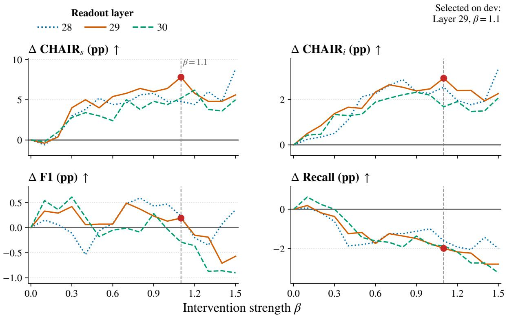

Figure 7: Layer-specific sensitivity to the intervention strength $\beta$ on the CHAIR validation set. Circles mark the selected operating point (ℓ = 29, β = 1.1).
<table><tr><td>Arm</td><td>Modification</td></tr><tr><td>Global reference</td><td>Replace the token-specific reference  $b ( v )$  with the single pooled scale  $b _ { 0 }$ </td></tr><tr><td>Shuffled references</td><td>Randomly permute  $b ( v )$  across token identities while preserving the multiset of reference values.</td></tr><tr><td>Mismatched evidence</td><td>Rotate the image-conditioned evidence DMRR1(v) across examples with a fixed derange- ment, so no example retains its own evidence.</td></tr><tr><td>No abstention</td><td>Apply the fallback  $b _ { 0 }$  to candidates absent from the registered set R instead of leaving them unchanged.</td></tr><tr><td>Bidirectional update</td><td>Remove the suppression-only rectifier (the lower clipping bound), permitting evidence to either decrease or increase a candidate logit.</td></tr><tr><td>Unbounded update</td><td>Remove the upper clipping bound on the intervention magnitude.</td></tr></table>

Table 19: Definitions of the component ablations.

## E.3 AMBER Examples

Figure 10 shows a generative example from AM-BER, whose per-image annotations provide both a ground-truth object list and a hallucination vocabulary. The pattern mirrors the CHAIR examples. The base model imports a scene-typical beach setting that the annotations flag, while ReWEIGH avoids the flagged term. The candidate example was flagged mechanically from the annotation vocabulary and then manually verified against the image before inclusion.

## E.4 Failure Modes of Ablated Components

Figure 11 illustrates, on actual generations, the two characteristic failure modes behind the component ablation in Table 3. Removing the bound (Unbounded update) turns suppression into unbounded logit displacement. Once the evidence-poor continuation is displaced far enough, the decoder falls into a two-token loop and repeats the same objects until the length limit, with a maximum singleobject repetition of 122. This collapse inflates caption length and drives the mention-level hallucination rate far above the base model. Replacing the token-specific reference b(v) with a single global reference (Global reference) misallocates suppression across candidates. On the example shown, it derails an otherwise clean continuation into five object classes that neither the base model nor the full method produces (book, bottle, dining table, potted plant, and vase). The full method keeps the base model’s two flagged objects (chair and remote) and adds none. Both examples are the top-ranked cases under a preregistered mechanical ordering rather than hand-picked selections. The ordering ranks degeneration cases by their maximum single-object repetition and misallocation cases by the number of newly introduced object classes, breaking ties by image ID. The corresponding aggregate diagnostics appear in the ablation diagnostics tables.

<table><tr><td>Configuration</td><td>CHAIRs↓</td><td>CHAIRI↓</td><td>Recall↑</td><td>F1↑</td><td>Length</td><td>Fire (%)</td><td>Escapes</td></tr><tr><td>Full method</td><td>44.8</td><td>12.67</td><td>75.3</td><td>80.85</td><td>90.3</td><td>80.4</td><td>0</td></tr><tr><td>Global reference</td><td>58.4</td><td>17.45</td><td>78.2</td><td>80.31</td><td>90.3</td><td>67.0</td><td>0</td></tr><tr><td>Shuffled references</td><td>56.0</td><td>14.74</td><td>78.1</td><td>81.54</td><td>92.9</td><td>72.6</td><td>0</td></tr><tr><td>Mismatched evidence</td><td>50.2</td><td>14.45</td><td>74.6</td><td>79.73</td><td>90.2</td><td>87.8</td><td>0</td></tr><tr><td>No abstention</td><td>44.4</td><td>12.64</td><td>75.3</td><td>80.90</td><td>90.2</td><td>82.7</td><td>0</td></tr><tr><td>Bidirectional update</td><td>50.4</td><td>16.07</td><td>75.9</td><td>79.74</td><td>92.0</td><td>98.7</td><td>0</td></tr><tr><td>Unbounded update</td><td>39.2</td><td>29.71</td><td>67.9</td><td>69.09</td><td>106.3</td><td>79.3</td><td>765</td></tr></table>

Table 20: Detailed CHAIR ablation results. Fire is the fraction of candidate positions at which the intervention is active, and Escapes counts updates that would exceed the full method’s clipping bound. The shaded row is the full method.
<table><tr><td>Evidence supplied</td><td>CHAIRs↓</td><td>CHAIRI↓</td><td>Recall↑</td><td>F1↑</td></tr><tr><td>None (base decoding)</td><td>52.6</td><td>15.61</td><td>77.3</td><td>80.66</td></tr><tr><td>Own image (ReWEIGH)</td><td>44.8</td><td>12.67</td><td>75.3</td><td>80.85</td></tr><tr><td>Wrong image, fixed derangement</td><td>50.2</td><td>14.45</td><td>74.6</td><td>79.73</td></tr><tr><td>Wrong image, cyclic shift</td><td>50.4</td><td>15.01</td><td>75.0</td><td>79.66</td></tr><tr><td>Image-blind  $( \mathrm { D M R R } _ { I } \equiv 0 )$ </td><td>49.8</td><td>13.98</td><td>74.1</td><td>79.61</td></tr></table>

Table 21: Image-specificity study on LLaVA-1.5-7B. Each row replaces the cached evidence vector with the stated substitute. The fixed-derangement row is the mismatched-evidence arm of Table 3. Arrows indicate the preferred direction, and the shaded row is the unmodified method.

## F Use of AI Assistants

In preparing this manuscript, we used AI-based writing assistants in a limited capacity to suggest alternative phrasings, correct grammatical errors, and improve readability. The authors reviewed and approved all such suggestions. AI assistants were not used to formulate the research ideas, design the method or experiments, implement the system, or generate or verify citations, factual claims, or dataset statistics.

Separately from writing assistance, the official protocols of MMHal-Bench and MM-Vet specify an LLM-based automatic evaluator. Following these protocols, we score both benchmarks with the frozen gpt-4.1-mini-2025-04-14 judge under identical settings for every compared method (Appendix A.3). This judge is a component of the evaluation pipeline defined by the benchmarks and is distinct from the writing assistance disclosed above. All other reported quantities are computed by deterministic scorers that involve no generative model.

All technical content, implementation details, analyses, and reported findings were produced and verified by the authors, who take full responsibility for the manuscript.

<table><tr><td></td><td colspan="4">Gen</td><td colspan="5">Disc</td><td>Score</td></tr><tr><td>Configuration</td><td>CHAIR↓</td><td>Cover↑</td><td>Hal.↓</td><td> $\mathrm { C o g . } \downarrow$ </td><td> $\operatorname { A c c . \uparrow }$ </td><td> $\mathrm { P r e c . \uparrow }$ </td><td>Rec.↑</td><td>F1↑</td><td> $\mathrm { U n p . } \% \downarrow$ </td><td>AMBER↑</td></tr><tr><td>Full method</td><td>2.98</td><td>50.21</td><td>16.43</td><td>3.13</td><td>71.96</td><td>92.65</td><td>62.73</td><td>74.81</td><td>0.08</td><td>85.91</td></tr><tr><td>Global reference</td><td>4.10</td><td>52.78</td><td>21.91</td><td>3.51</td><td>71.98</td><td>92.65</td><td>62.75</td><td>74.82</td><td>0.05</td><td>85.36</td></tr><tr><td>Shuffled references</td><td>4.11</td><td>51.63</td><td>21.51</td><td>4.14</td><td>71.98</td><td>92.65</td><td>62.75</td><td>74.82</td><td>0.05</td><td>85.36</td></tr><tr><td>Mismatched evidence</td><td>3.70</td><td>49.35</td><td>18.03</td><td>3.15</td><td>71.96</td><td>92.65</td><td>62.73</td><td>74.81</td><td>0.08</td><td>85.56</td></tr><tr><td>No abstention</td><td>2.97</td><td>50.37</td><td>16.14</td><td>3.01</td><td>72.82</td><td>91.17</td><td>65.46</td><td>76.20</td><td>0.19</td><td>86.62</td></tr><tr><td>Bidirectional update</td><td>3.72</td><td>51.22</td><td>19.02</td><td>2.94</td><td>71.95</td><td>92.65</td><td>62.72</td><td>74.80</td><td>0.08</td><td>85.54</td></tr><tr><td>Unbounded update</td><td>3.44</td><td>48.26</td><td>16.14</td><td>2.62</td><td>71.96</td><td>92.65</td><td>62.73</td><td>74.81</td><td>0.08</td><td>85.69</td></tr></table>

Table 22: Detailed AMBER ablation results. Gen and Disc denote the generative and discriminative evaluations, respectively. The shaded row is the full method. Arrows indicate the preferred direction.

<table><tr><td rowspan="2"> $\beta$ </td><td colspan="3"> $\ell = 2 8$ </td><td colspan="3">l = 29</td><td colspan="3"> $\ell = 3 0$ </td></tr><tr><td> $C _ { S }$  →</td><td> $C _ { I } \downarrow$ </td><td>F1↑</td><td> $C _ { S }$  →</td><td> $C _ { I \downarrow }$ </td><td>F1↑</td><td> $C _ { S }$  →</td><td> $C _ { I } \downarrow$ </td><td>F1↑</td></tr><tr><td>0.0</td><td>52.6</td><td>15.61</td><td>80.66</td><td>52.6</td><td>15.61</td><td>80.66</td><td>52.6</td><td>15.61</td><td>80.66</td></tr><tr><td>0.1</td><td>53.2</td><td>15.37</td><td>80.81</td><td>53.0</td><td>15.11</td><td>80.99</td><td>52.8</td><td>15.18</td><td>81.20</td></tr><tr><td>0.2</td><td>52.0</td><td>15.26</td><td>80.72</td><td>52.2</td><td>14.76</td><td>80.95</td><td>51.6</td><td>15.14</td><td>81.02</td></tr><tr><td>0.3</td><td>49.6</td><td>15.10</td><td>80.55</td><td>48.6</td><td>14.23</td><td>81.08</td><td>49.8</td><td>14.27</td><td>81.27</td></tr><tr><td>0.4</td><td>48.8</td><td>14.51</td><td>80.12</td><td>47.6</td><td>13.95</td><td>80.72</td><td>49.2</td><td>14.32</td><td>80.87</td></tr><tr><td>0.5</td><td>47.4</td><td>13.49</td><td>80.60</td><td>48.6</td><td>14.00</td><td>80.73</td><td>49.6</td><td>14.26</td><td>80.48</td></tr><tr><td>0.6</td><td>48.2</td><td>13.34</td><td>80.74</td><td>47.2</td><td>13.28</td><td>80.73</td><td>50.2</td><td>13.72</td><td>80.61</td></tr><tr><td>0.7</td><td>48.0</td><td>12.99</td><td>81.14</td><td>46.8</td><td>12.96</td><td>81.15</td><td>47.6</td><td>13.55</td><td>80.65</td></tr><tr><td>0.8</td><td>47.0</td><td>12.73</td><td>81.25</td><td>46.2</td><td>13.07</td><td>81.03</td><td>48.8</td><td>13.40</td><td>80.57</td></tr><tr><td>0.9</td><td>46.8</td><td>13.27</td><td>81.09</td><td>46.6</td><td>13.23</td><td>80.89</td><td>47.8</td><td>13.29</td><td>80.94</td></tr><tr><td>1.0</td><td>47.8</td><td>13.34</td><td>81.13</td><td>46.2</td><td>13.14</td><td>80.79</td><td>48.2</td><td>13.42</td><td>80.63</td></tr><tr><td>1.1</td><td>47.8</td><td>13.07</td><td>80.89</td><td>44.8</td><td>12.67</td><td>80.85</td><td>47.4</td><td>13.93</td><td>80.37</td></tr><tr><td>1.2</td><td>48.2</td><td>13.65</td><td>80.46</td><td>46.8</td><td>13.22</td><td>80.51</td><td>46.4</td><td>13.70</td><td>80.30</td></tr><tr><td>1.3</td><td>46.6</td><td>13.84</td><td>80.31</td><td>47.8</td><td>13.21</td><td>80.47</td><td>48.8</td><td>14.14</td><td>79.79</td></tr><tr><td>1.4</td><td>47.8</td><td>13.68</td><td>80.73</td><td>47.8</td><td>13.67</td><td>79.95</td><td>49.0</td><td>14.11</td><td>79.80</td></tr><tr><td>1.5</td><td>43.8</td><td>12.27</td><td>81.02</td><td>47.0</td><td>13.35</td><td>80.09</td><td>47.6</td><td>13.54</td><td>79.76</td></tr></table>

Table 23: Full layer $\times \beta$ grid on the CHAIR validation split (LLaVA-1.5-7B). $C _ { S }$ and $C _ { I }$ denote $\mathrm { C H A I R } _ { S }$ and $\mathrm { C H A I R } _ { I } ,$ the $\beta { = } 0$ rows equal base decoding, and the shaded cell is the frozen operating point.

<table><tr><td>Backbone</td><td>Registration rule</td><td>|R|</td><td> ${ \mathrm { C H A I R } } _ { S } \downarrow$ </td><td> $\mathbf { C H A I R } _ { I } \downarrow$ </td><td>Recall↑</td><td>F1↑</td><td>AMBER-disc F1↑</td></tr><tr><td rowspan="4">LLaVA-1.5-7B</td><td>none (base)</td><td></td><td>52.6</td><td>15.61</td><td>77.3</td><td>80.66</td><td>74.81</td></tr><tr><td>count  $n ( v ) \geq 5$ </td><td>3,252</td><td>44.6</td><td>12.69</td><td>75.4</td><td>80.91</td><td>74.81</td></tr><tr><td>count  $n ( v ) \geq 1 0$ </td><td>2,476</td><td>44.8</td><td>12.70</td><td>75.4</td><td>80.91</td><td>74.81</td></tr><tr><td>reference stability  $( \Delta e < 0 . 5 )$ </td><td>2,580</td><td>44.8</td><td>12.67</td><td>75.3</td><td>80.85</td><td>74.81</td></tr><tr><td rowspan="4">InstructBLIP-7B</td><td>none (base)</td><td></td><td>49.6</td><td>14.03</td><td>73.1</td><td>79.01</td><td>81.40</td></tr><tr><td>count  $n ( v ) \geq 5$ </td><td>3,524</td><td>46.2</td><td>12.50</td><td>73.3</td><td>79.80</td><td>78.51</td></tr><tr><td>count  $n ( v ) \geq 1 0$ </td><td>2,714</td><td>46.2</td><td>12.54</td><td>73.3</td><td>79.74</td><td>81.44</td></tr><tr><td>reference stability  $( \Delta e < 0 . 5 )$ </td><td>2,708</td><td>46.0</td><td>12.50</td><td>73.3</td><td>79.80</td><td>81.44</td></tr><tr><td rowspan="4">LLaVA-NeXT-7B</td><td>none (base)</td><td></td><td>34.0</td><td>8.67</td><td>64.8</td><td>75.83</td><td>72.10</td></tr><tr><td>count  $n ( v ) \geq 5$ </td><td>4,791</td><td>32.2</td><td>7.66</td><td>64.3</td><td>75.78</td><td>72.36</td></tr><tr><td>count  $n ( v ) \geq 1 0$ </td><td>3,572</td><td>32.2</td><td>7.72</td><td>64.1</td><td>75.68</td><td>72.36</td></tr><tr><td>reference stability  $( \Delta e < 0 . 5 )$ </td><td>3,734</td><td>32.6</td><td>7.78</td><td>63.7</td><td>75.36</td><td>72.36</td></tr><tr><td>Qwen2.5-VL-7B</td><td>none (base)</td><td></td><td>31.6</td><td>9.58</td><td>58.2</td><td>70.80</td><td>87.89</td></tr><tr><td rowspan="3"></td><td>count  $n ( v ) \geq 5$ </td><td>9,286</td><td>26.2</td><td>7.64</td><td>58.4</td><td>71.57</td><td>87.97</td></tr><tr><td>count  $n ( v ) \geq 1 0$ </td><td>6,458</td><td>26.6</td><td>7.87</td><td>58.4</td><td>71.50</td><td>87.97</td></tr><tr><td>reference stability  $( \Delta e < 0 . 5 )$ </td><td>7,028</td><td>25.4</td><td>7.54</td><td>58.7</td><td>71.83</td><td>87.97</td></tr></table>

Table 24: Design-space contrast of registration rules. $| \mathcal { R } |$ is the number of registered tokens. Arrows indicate the preferred direction, and the shaded rows are the reference-stability rule used by ReWEIGH.

<table><tr><td>Calibration images</td><td>CHAIRS↓</td><td> $\mathrm { C H A I R } _ { I } \downarrow$ </td><td>Recall↑</td><td>F1↑</td></tr><tr><td>None (base decoding)</td><td>52.6</td><td>15.61</td><td>77.3</td><td>80.66</td></tr><tr><td>10</td><td>48.6</td><td>14.29</td><td>74.64</td><td>79.80</td></tr><tr><td>25</td><td>48.0</td><td>14.04</td><td>75.14</td><td>80.19</td></tr><tr><td>50</td><td>48.2</td><td>13.99</td><td>76.01</td><td>80.70</td></tr><tr><td>100</td><td>44.8</td><td>13.29</td><td>75.76</td><td>80.87</td></tr><tr><td>200</td><td>45.2</td><td>12.82</td><td>75.14</td><td>80.71</td></tr><tr><td>500</td><td>44.8</td><td>12.67</td><td>75.26</td><td>80.85</td></tr><tr><td>700</td><td>44.4</td><td>12.62</td><td>75.82</td><td>81.19</td></tr><tr><td>1,000</td><td>43.8</td><td>12.35</td><td>76.07</td><td>81.45</td></tr></table>

Table 25: Calibration-size sweep on LLaVA-1.5-7B. Arrows indicate the preferred direction, and the shaded row is the deployed 500-image configuration.

<table><tr><td>Calibration corpus</td><td>Images</td><td>|R|</td><td>CHAIRs↓</td><td> $\mathrm { C H A I R } _ { I } \downarrow$ </td><td>Recall↑</td><td>F1↑</td></tr><tr><td>None (base decoding)</td><td></td><td></td><td>52.6</td><td>15.61</td><td>77.3</td><td>80.66</td></tr><tr><td>MS COCO (default)</td><td></td><td>500 2,580</td><td>44.8</td><td>12.67</td><td>75.3</td><td>80.85</td></tr><tr><td>GQA</td><td>500</td><td>2,429</td><td>44.6</td><td>13.15</td><td>75.4</td><td>80.71</td></tr><tr><td>AMBER</td><td>1,004</td><td>2,982</td><td>48.0</td><td>12.97</td><td>75.6</td><td>80.93</td></tr><tr><td>Pooled (COCO+GQA+AMBER)</td><td>2,004</td><td>3,900</td><td>46.6</td><td>13.22</td><td>75.9</td><td>81.00</td></tr></table>

Table 26: Calibration-corpus transfer on LLaVA-1.5-7B. |R| is the number of registered tokens. Arrows indicate the preferred direction, and the shaded row is the default configuration.

<table><tr><td>Model</td><td>Method</td><td>CHAIRS↓</td><td>CHAIRI↓</td><td>Recall↑</td><td>F1↑</td></tr><tr><td>InstructBLIP-7B</td><td>Greedy</td><td>49.60</td><td>14.03</td><td>73.09</td><td>79.01</td></tr><tr><td rowspan="3">LLaVA-1.5-7B</td><td>ReWEIGH</td><td>46.00</td><td>12.50</td><td>73.30</td><td>79.80</td></tr><tr><td>Greedy</td><td>52.60</td><td>15.61</td><td>77.25</td><td>80.66</td></tr><tr><td>ReWEIGH</td><td>44.80</td><td>12.67</td><td>75.30</td><td>80.85</td></tr><tr><td>LLaVA-NeXT-7B</td><td>Greedy</td><td>34.00</td><td>8.67</td><td>64.82</td><td>75.83</td></tr><tr><td rowspan="3">Qwen2.5-VL-7B</td><td>ReWEIGH</td><td>32.60</td><td>7.78</td><td>63.70</td><td>75.36</td></tr><tr><td>Greedy</td><td>31.60</td><td>9.58</td><td>58.17</td><td>70.80</td></tr><tr><td>ReWEIGH</td><td>25.40</td><td>7.54</td><td>58.70</td><td>71.83</td></tr><tr><td>InternVL2.5-8B</td><td>Greedy</td><td>32.40</td><td>8.21</td><td>69.36</td><td>79.01</td></tr><tr><td rowspan="2">Gemma-3-12B</td><td>ReWEIGH</td><td>30.00</td><td>7.51</td><td>68.18</td><td>78.50</td></tr><tr><td>Greedy</td><td>49.80</td><td>8.95</td><td>70.60</td><td>79.53</td></tr><tr><td rowspan="2">InstructBLIP-13B</td><td>ReWEIGH</td><td>46.80</td><td>8.53</td><td>70.04</td><td>79.33</td></tr><tr><td>Greedy</td><td>58.00</td><td>17.23</td><td>70.79</td><td>76.31</td></tr><tr><td>LLaVA-1.5-13B</td><td>ReWEIGH</td><td>54.60</td><td>15.95</td><td>70.04</td><td>76.41</td></tr><tr><td rowspan="3">InternVL2.5-26B</td><td>Greedy</td><td>51.80</td><td>14.76</td><td>77.50</td><td>81.19</td></tr><tr><td>ReWEIGH</td><td>45.00</td><td>11.70</td><td>75.95</td><td>81.66</td></tr><tr><td>Greedy</td><td>31.20</td><td>8.16</td><td>69.98</td><td>79.43</td></tr><tr><td>Gemma-3-27B</td><td>ReWEIGH</td><td>28.60</td><td>7.19</td><td>69.48</td><td>79.47</td></tr><tr><td rowspan="2"></td><td>Greedy</td><td>53.00</td><td>9.51</td><td>72.03</td><td>80.21</td></tr><tr><td>ReWEIGH</td><td>50.60</td><td>9.17</td><td>70.79</td><td>79.57</td></tr><tr><td rowspan="2">Qwen2.5-VL-32B</td><td>Greedy</td><td>59.40</td><td>10.93</td><td>75.33</td><td>81.62</td></tr><tr><td>ReWEIGH</td><td>54.60</td><td>10.15</td><td>74.58</td><td>81.51</td></tr></table>

Table 27: CHAIR results across model sizes and architecture families. Shaded cells mark ReWEIGH.

<table><tr><td></td><td></td><td colspan="3">Evidence  $( \times 1 0 ^ { - 3 } )$ </td><td colspan="3"></td></tr><tr><td>Candidate</td><td> $z _ { t } ( v )$ </td><td> $\mathrm { D M R R } _ { I } ( v )$ </td><td> $b ( v )$ </td><td>Deficit</td><td> $s _ { I } ( v )$ </td><td> $\beta s _ { I } ( v )$ </td><td> $z _ { t } ^ { \prime } ( v )$ </td></tr><tr><td>cars</td><td>17.000</td><td>0.758</td><td>8.321</td><td>7.563</td><td>1.000</td><td>1.100</td><td>15.900</td></tr><tr><td>people</td><td>16.359</td><td>2.225</td><td>6.128</td><td>3.903</td><td>1.000</td><td>1.100</td><td>15.259</td></tr><tr><td>traffic</td><td>16.344</td><td>40.513</td><td>6.984</td><td>0.000</td><td>0.000</td><td>0.000</td><td>16.344</td></tr><tr><td>p</td><td>15.891</td><td>7.390</td><td>23.583</td><td>16.192</td><td>1.000</td><td>1.100</td><td>14.791</td></tr><tr><td>pal</td><td>15.703</td><td>72.867</td><td>124.762</td><td>51.895</td><td>1.000</td><td>1.100</td><td>14.603</td></tr><tr><td>stop</td><td>15.063</td><td>10.986</td><td>5.882</td><td>0.000</td><td>0.000</td><td>0.000</td><td>15.063</td></tr><tr><td>ped</td><td>15.039</td><td>4.393</td><td>4.743</td><td>0.350</td><td>0.108</td><td>0.119</td><td>14.920</td></tr><tr><td>clock</td><td>14.953</td><td>0.760</td><td>7.693</td><td>6.933</td><td>1.000</td><td>1.100</td><td>13.853</td></tr></table>

Table 28: Per-candidate arithmetic of ReWEIGH at a single recorded decoding step. The step uses the deployed LLaVA-1.5-7B configuration of Table 5. The table lists the eight candidates with the highest pre-edit logits among the K=22 candidates, including the pre-edit argmax (bold) and the emitted token (highlighted). The columns reproduce the arithmetic of Eqs. (5), (7), and (8) from the recorded trace.

(a) LLaVA-1.5-7B  
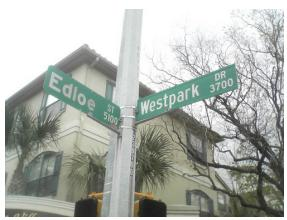

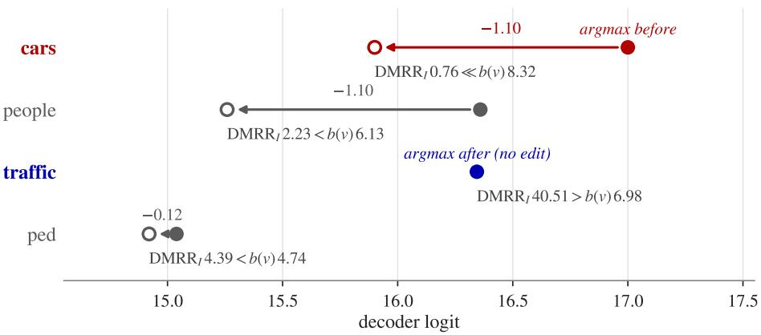

(b) LLaVA-NeXT-7B  
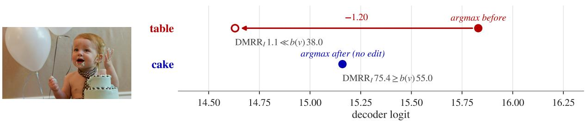  
Figure 8: Mechanism case studies read from recorded traces. Each panel plots decoder logits before (filled) and after (open) the edit at one recorded decoding step, and each arrow spans the bounded suppression $\beta s _ { I } ( v )$ The annotation under each candidate compares its evidence $\mathrm { D M R R } _ { I } ( v )$ with its reference $b ( v )$ in units of $1 0 ^ { - 3 }$ Panel (a) shows LLaVA-1.5-7B at step 71 with four candidates from Table 28 that span full, proportional, and zero suppression. Panel (b) shows LLaVA-NeXT-7B (β=1.2, layer-30 readout) at step 60. Red marks the hallucinated pre-edit argmax, and blue marks the grounded token that becomes the post-edit argmax.

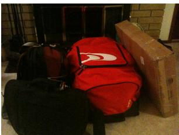

Base The image features a living room with a fireplace, where a red duffel bag is placed on the floor next to a chair. There are several other bags and suitcases scattered around the room, including a black bag and a brown bag. The room also contains a television, which is placed on a table in the center of the room. A potted plant can be seen on the left side of the room, and a book is placed on the right side of the room. The overall scene suggests that the room is being prepared for a trip or a move.

+ReWEIGH The image features a living room with a fireplace, where several bags and suitcases are placed on the floor next to the fireplace. There are three bags visible, with one of them being a red one, and the other two being black. The bags are placed close to each other, with one bag located closer to the fireplace and the other two bags further away. There is also a box placed on the floor near the fireplace, which is likely to contain additional items. The room appears to be well-organized, with the bags and box neatly arranged.

## (b) LLaVA-1.5-7B

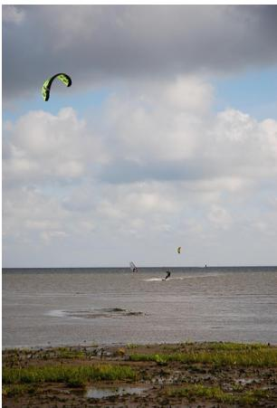

Base The image captures a lively scene of people enjoying water sports on a large body of water. There are two people in the water, one of them is parasailing, while the other is windsurfing. The parasailer is being pulled by a boat, and the windsurfer is skillfully navigating the water. In the sky above, a kite can be seen flying, adding to the excitement of the scene. The water is filled with various boats, including a couple of smaller boats near the shore and a larger boat further out in the water. The presence of multiple boats and people participating in water sports creates a vibrant and active atmosphere.

+ReWEIGH The image captures a beautiful scene of a person kiteboarding in the ocean, surrounded by a few other kiteboarders. The person in the center of the scene is skillfully riding a kiteboard, while others are also enjoying the water nearby. In the sky, there are two kites visible, one towards the left side and the other towards the right. The kites are flying high above the water, adding to the excitement of the kiteboarding activity. The overall atmosphere of the scene is lively and full of adventure.

(c) InstructBLIP-7B  
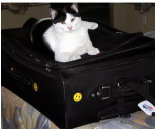

Base The image features a black and white cat sitting on top of a black suitcase placed on a bed. The cat is lying on the suitcase, which is open and partially visible. The cat’s body is stretched out, and its head is resting on the top of the suitcase. The suitcase is placed on the bed, which is covered with a blanket. There are several other items on the bed, including a book, a cup, and a bottle. The cat seems to be enjoying its time on the suitcase, possibly taking a nap or simply relaxing.

+ReWEIGH The image features a black and white cat sitting on top of a black suitcase placed on a bed. The cat is lying on the suitcase, which is open and partially visible on the bed. The cat is positioned in the center of the suitcase, with its head and body stretched out on top of it. The suitcase is placed on a bed, which is covered with a blanket and has a pillow on the left side. The cat seems to be enjoying its resting spot on the suitcase, possibly waiting for its owner to return.

Figure 9: Qualitative CHAIR examples of three common hallucination patterns. Panels (a), (b), and (c) show contextual scene completion, repeated object generation, and peripheral errors, respectively. Red marks CHAIR-hallucinated objects, and blue marks ground-truth objects.

## Query: Describe this image.

Base The image captures a lively beach volleyball game in progress. Two men are playing against each other, both reaching for the same volleyball that is in the air. They are both wearing sunglasses, and their athletic attire suggests they are fully engaged in the game. The volleyball is positioned in the middle of the scene, with both players trying to make a successful hit. The net is visible in the background, and the beach setting adds to the excitement of the game.

+ReWEIGH The image captures a dynamic moment during a volleyball game. Two men are playing against each other, both reaching for the same volleyball that is in the air. They are both wearing black shirts and are positioned close to the net. The volleyball is located in the center of the scene, with both players trying to grab it. The net is visible in the background, and the two men are the main focus of the image as they compete for the ball.

Figure 10: Generative example from AMBER. Red marks terms from the annotated hallucination vocabulary, and blue marks annotated ground-truth objects.

## (a) LLaVA-1.5-7B

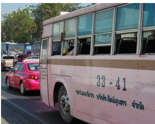

## Unbounded update → repetition collapse

−Bounding (unbounded update) The image depicts a busy city scene with multiple buses, cars, a bicycle, motorcycle, truck, motorcycle, taxi, [. . . ] bus, car, bus, car, bus, car, bus, car, bus, car, bus, car, bus, car, bus, car, bus, car, bus, car, bus, car, bus, car, bus, car, bus, car, bus, car

+ReWEIGH (full) The image depicts a busy city street filled with various vehicles, including a pink bus, several cars, and a truck. The pink bus is driving down the street, surrounded by other vehicles. There are multiple people visible in the scene, some of them standing or walking near the vehicles, while others are inside the bus or other vehicles. The street is quite congested, with traffic in both directions, including cars and buses. The scene captures the bustling atmosphere of a city, with people going about their daily routines and commuting using different modes of transportation.

## (b) LLaVA-1.5-7B

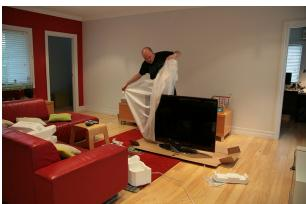

## Global reference → misdirected suppression

−Token reference (global reference) The image shows a man in a black shirt standing in a living room, unboxing a large flat-screen TV. He is carefully removing the plastic covering from the TV, which is placed on a wooden table. The room is furnished with a couch and a chair, and there is a remote control on the couch. In the background, there is a dining table with a bottle on it. The living room also features a potted plant, a vase, and a book, adding to the cozy atmosphere of the space.

+ReWEIGH (full) The image shows a man standing in a living room, carefully wrapping a large flat-screen TV in plastic. The TV is placed on a wooden stand, and the man is using plastic to protect it from dust and potential damage during transportation. The living room is furnished with a couch and a chair, both located towards the left side of the room. There is also a remote control placed on the couch, likely for operating the TV or other electronic devices. The overall atmosphere suggests that the man is taking care to ensure the TV’s safe and secure transportation to its new location.

Figure 11: Failure modes of ablated components on LLaVA-1.5-7B. Arm definitions are in Table 19. In (a), the arm caption is abridged, and the omitted middle, marked [. . . ], repeats only the two tokens “bus” and “car”. Red in (a) marks the repeated tokens in the shown tail. In (b), red marks CHAIR-hallucinated objects, and blue marks ground-truth objects.