# 4DAnyone: Create Anyone in 4D from a Casual Monocular Video

YUDONG JIN∗, State Key Lab of CAD&CG, Zhejiang University, China and Robbyant, China   
TAO XIE∗, State Key Lab of CAD&CG, Zhejiang University, China   
QIHANG ZHANG, Robbyant, China and Chinese University of Hong Kong, China   
ZEHONG SHEN, Ant Group, China   
ZHEN XU, State Key Lab of CAD&CG, Zhejiang University, China   
YUJUN SHEN, Robbyant, China   
HUJUN BAO, State Key Lab of CAD&CG, Zhejiang University, China   
XIAOWEI ZHOU†, State Key Lab of CAD&CG, Zhejiang University, China   
YINGHAO XU†, Hong Kong University of Science and Technology, China and Robbyant, China

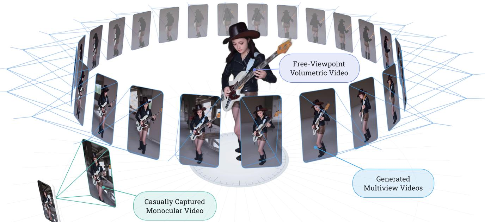  
Fig. 1. Given a casually captured monocular video, typically with mild camera motion and unknown camera intrinsics and poses, 4DAnyone generates multiview-consistent human videos, enabling 4DGS reconstruction rendered from free viewpoints. See the project page and Fig. 7 for more results.

We present 4DAnyone, a framework for reconstructing 4D humans from an uncalibrated monocular video by generating reconstruction-grade multiview-consistent videos and lifting them into 4D Gaussian Splatting (4DGS). Existing camera-controlled video difusion models synthesize plausible novel-view videos but fail to maintain consistency when scaled to the tens of target views required for 4DGS reconstruction. We identify this failure as a bounded-attention-context problem: when target views exceed the capacity of a single DiT forward pass, they must be split into

groups, exposing two coupled bottlenecks. On the reference-context side, conditioning on all previously generated views grows as � (�), weakening cross-view appearance guidance. On the target-context side, disjoint groups cannot directly exchange information, causing global structural drift. 4DAnyone addresses both bottlenecks with two complementary designs: Reference Context Packing (RCP) compresses growing reference views into a fixed-length mixed-resolution context with � (1) reference-context com plexity, while Target Context Routing (TCR) rotates target-view groupings during denoising to share context across groups at high-noise steps and stabilize details at low-noise steps. We further build the MVGameHuman dataset using our in-house game engine and combine it with light-stage and in-the-wild video datasets for training. Experiments on DNA-Rendering and DyMVHumans show that 4DAnyone outperforms prior methods in both novel-view video quality and downstream 4DGS reconstruction, with robust in-the-wild generalization. See our project page for video results and source code: https://4danyone.github.io.

Additional Key Words and Phrases: multiview video generation, 4D human reconstruction

CCS Concepts: • Computing methodologies → Multi-View & 3D.

## 1 Introduction

Reconstructing 4D humans renderable from arbitrary viewpoints is important for embodied AI, immersive content creation, and virtual reality. Recent 4D Gaussian Splatting (4DGS) methods [Kerbl et al. 2023; Wang et al. 2025a; Wu et al. 2024; Xu et al. 2024c] enable real-time, photorealistic dynamic-scene rendering, yet constructing such representations still requires dense multi-view video from calibrated, static camera arrays [Cheng et al. 2023]. This raises a natural question: can we reconstructa 4D humanfrom an uncalibrated monocular video?

A straightforward attempt is to reconstruct 4D humans directly from monocular video [Hu et al. 2024d,c; Yu et al. 2023]. However, these methods typically require known camera parameters and struggle to infer occluded body regions and recover high-fidelity ap- pearance. A more promising pipeline is to first generate novel-view videos with a camera-controlled video difusion model and then perform 4DGS reconstruction. Existing camera-controlled video generation methods, including implicit camera-conditioned models [Bai et al. 2025a; Wu et al. 2025] and explicit geometry-conditioned models [Ren et al. 2025; Yu et al. 2025], can synthesize visually plausible novel-view videos under prescribed camera motion. However, when extended to the tens of target-view videos required for 4DGS reconstruction, these methods fail to maintain cross-view consistency, leading to appearance inconsistency and structural drift that de- grade downstream 4D reconstruction. The bottleneck is therefore not only view control, but how to maintain cross-view consistency at reconstruction scale.

Why does consistency break at reconstruction scale? We argue the root cause is an architectural constraint: the attention context ofa single DiT forward pass is bounded by practical memory and compute budgets. When the number of target views � exceeds this capacity, the target context must be split into groups for tractable denoising, creating two consistency bottlenecks. On the reference context side, each group ideally conditions on all previously generated views, but the reference context length grows as �(�) and quickly exceeds capacity. On the target context side, target contexts of diferent groups are disjoint, so cross-group views cannot directly attend to one another, leading to cross-group structural drift. Existing cameracontrolled video generation methods do not jointly resolve these two bottlenecks: limiting the reference context weakens appearance guidance, while independently denoising target groups prevents cross-group structural communication.

We present 4DAnyone, which addresses both bottlenecks to en- able reconstruction-grade multiview-consistent video generation. First, Reference Context Packing (RCP) exploits the redundancy of cross-view appearance: a mixed-resolution reference context often sufices to preserve global layout while retaining fine appearance details. It keeps reference conditioning scalable by compressing the growing set of generated reference views into a fixed-length context, reducing the reference-context complexity from �(�) to �(1). Second, Target Context Routing (TCR) exploits the tempo-ral structure of difusion: high-noise steps tend to govern global structure, while low-noise steps mainly refine local details. During high-noise denoising, TCR rotates target-view groupings to enable cross-group context sharing and propagate global structure. During low-noise denoising, it fixes adjacent-view groups to stabilize fine details. For geometric guidance, we follow an accuracy-over- density principle: instead of relying on dense metric depth, which is dificult to estimate reliably from unconstrained videos, we use 3D skeletons that modern human mesh recovery methods can re- liably estimate from monocular input [Shen et al. 2024; Yang et al. 2026]. Accordingly, we adopt 3D-aware skeleton conditioning that encodes depth-bufered skeleton renderings to resolve the inherent 2D pose ambiguity. We further build the MVGameHuman dataset using our in-house game engine and combine it with light-stage and in-the-wild video datasets for training, enabling robust in-the-wild generalization.

In summary, our contributions are:

• We present 4DAnyone, a 4D human video generation framework that achieves reconstruction-grade multiview consistency from monocular videos.

• We propose Reference Context Packing (RCP), which compresses the growing reference context from �(�) to �(1) while preserv-ing cross-view appearance guidance.

• We propose Target Context Routing (TCR), which dynamically routes target-view groupings during denoising to enable cross-group context sharing and reduce cross-group structural drift.

## 2 Related Work

Camera-controlled video generation. Camera control in video difusion broadly follows implicit or explicit conditioning. Implicit methods encode camera information through learned representa- tions without hard geometric constraints. CameraCtrl [He et al. 2025a,b] injects pixel-wise Plücker rays into video difusion U-Nets; MotionCtrl [Wang et al. 2024] separates camera and object motion using rotation-translation matrices; VD3D [Bahmani et al. 2024] uses spatiotemporal camera embeddings in difusion transformers; and CamCo [Xu et al. 2024a] combines Plücker conditioning with epipolar attention. ReCamMaster [Bai et al. 2025a] concatenates source-video tokens with target trajectories to re-render novel views, while CAT4D [Wu et al. 2025] extends multi-view difusion to dynamic content. Although these methods generalize well across diverse scenes, their latent camera control lacks hard geometric constraints and can drift under large viewpoint changes, limiting downstream 3D reconstruction. Explicit methods improve accu- racy with dense 3D geometry: Gen3C [Ren et al. 2025] projects depth-derived point clouds for world-consistent generation, TrajectoryCrafter [Yu et al. 2025] warps reference frames using estimated depth for trajectory redirection, and WVD [Zhang et al. 2025b] jointly models RGB and XYZ frames to unify camera control with eometric reconstruction. However, these methods de end on dense metric de th or 3D coordinates that are dificult to estimate reliabl from in-the-wild videos [Xu et al. 2025], and remain limited for dynamic scenes or large viewpoint changes.

For humans, body pose ofers an alternative geometric signal. ControlNet [Zhang et al. 2023], MagicAnimate [Xu et al. 2024d], Animate Anyone [Hu et al. 2024b], UniAnimate [Wang et al. 2025b], and Wan-Animate [Cheng et al. 2025] use 2D pose skeletons for pose-driven animation, while 3DiMo [Fang et al. 2026] employs im-plicit motion encoding for view-adaptive generation. These methods target motion transfer rather than reconstruction-grade novel view synthesis. 4DAnyone uses sparse, precise 3D skeletons for explicit conditioning, achieving reconstruction-grade multiview consistency without estimating dense depth or source-camera parameters.

Multi-view difusion models. Multi-view difusion generates geometrically consistent views for generation-then-reconstruction. Zero-1-to-3 [Liu et al. 2023] pioneered viewpoint-conditioned image generation from a single image. MVDream [Shi et al. 2024], CAT3D [Gao et al. 2024], SV3D [Voleti et al. 2024], and Zero123++ [Shi et al. 2023] further advance multi-view generation for static 3D reconstruction. SV4D [Xie et al. 2024] and CAT4D [Wu et al. 2025] extend this paradigm to dynamic content through multi-view video difusion, while Difuman4D [Jin et al. 2025] further targets 4D human reconstruction but requires synchronized sparse-view videos with known camera parameters. Scaling to many reconstruction views remains dificult: GPU memory limits the views per forward pass, whereas independent batches cause cross-batch inconsistency. CAT3D selects sparse anchor views as context for each batch, but the subset selection discards appearance information. CAT4D and Difuman4D use sliding-window denois- ing with overlap aggregation, yet cross-window drift persists at large view counts. From monocular input alone, 4DAnyone uses two complementary designs. Reference Context Packing packs all reference views into a fixed-length context at �(1) cost, preserving rich appearance cues without lossy anchor selection. Target Context Routing regroups views at high noise to propagate global structure and reduce cross-group drift, then fixes adjacent groups at low noise for detail refinement, enabling consistent generation across many viewpoints.

4D human avatar reconstruction. Traditional approaches re-construct dynamic human avatars from dense multi-view captures using neural radiance fields [Lin et al. 2023; Mildenhall et al. 2021; Peng et al. 2021] or Gaussian splatting [Duan et al. 2024; Jiang et al. 2025, 2024; Kerbl et al. 2023; Wang et al. 2025a; Wu et al. 2024; Xu et al. 2024b,c; Yang et al. 2024], but require expensive multi-camera setups such as the 48-camera rig of DNA-Rendering [Cheng et al. 2023]. Monocular methods [Hu et al. 2024a,d,c; Jiang et al. 2023; Qian et al. 2024; Weng et al. 2022; Yu et al. 2023] remove this dependency by fitting neural representations to single-view video with parametric body priors [Loper et al. 2023; Pavlakos et al. 2019], yet they cannot reliably hallucinate appearance in unobserved regions, placing an inherent ceiling on visual quality. UP2You [Cai et al. 2025] reconstructs 3D clothed portraits from unconstrained in-thewild photos by rectifying unstructured inputs into clean multi-view images via a pose-correlated feature aggregation module, but is limited to static reconstruction. MV-Performer [Zhi et al. 2025] addresses human novel view synthesis with explicit geometric conditioning but remains within a reconstruction-only paradigm without generative hallucination. 4DAnyone takes a generation-assisted approach: it synthesizes multi-view observations from a monocular video via skeleton-conditioned difusion, then applies standard 4DGS pipelines [Wang et al. 2025a; Wu et al. 2024] for high-fidelity 4D human reconstruction without specialized hardware.

## 3 Method

## 3.1 Overview

Given a monocular source video $\mathbf { V } _ { \mathrm { s r c } } \in \mathbb { R } ^ { F \times 3 \times H \times W }$ with unknown camera intrinsics and poses, 4DAnyone generates � human videos $\left\{ \mathbf { V } _ { i } \right\} _ { i = } ^ { v }$ with reconstruction-grade consistency at prescribed static viewpoints distributed around the subject for high-fidelity 4DGS reconstruction. As shown in Fig. 2, HMR estimates a 3D skeleton sequence, which we render into depth-bufered skeleton videos at the target viewpoints. A 3D-aware skeleton encoder injects these cues into target latents (Sec. 3.2), which the DiT denoises conditioned on the source video, skeletons, and Reference Context Packing (RCP). For tens of views, Target Context Routing (TCR) exchanges context among target groups and reduces structural drift under a fixed per-group budget (Sec. 3.3). FreeTimeGS [Wang et al. 2025a] then reconstructs the 4DGS model from the generated videos.

## 3.2 3D-Aware Skeleton Conditioning

Prior geometry-conditioned methods [Ren et al. 2025; Yu et al. 2025] rely on dense geometric signals (e.g. depth maps and camera parameters) for viewpoint control. However, such signals are dificult to estimate reliably from in-the-wild videos, and errors in these estimates can introduce conflicting geometric constraints that cause multiview generation to diverge. Our key observation is accuracy over density: for reconstruction-grade multiview consistency, the accuracy of geometric signals is more critical than their density. Accordingly, we use 3D skeletons as sparse but reliable geometric guid-ance: they provide accurate structural cues, leave appearance details to the video model, and can be robustly recovered from monocular videos using modern human mesh recovery methods [Shen et al. 2024]. Despite their sparsity, the video model can still learn precise spatial correspondences between skeleton keypoints and generated human content, maintaining consistency in body structure, clothing, facial expressions, and other details.

Depth-bufered skeleton rendering. A naive 2D skeleton rendering sufers from inherent pose ambiguity: occlusions between body parts are lost, so opposite front-back configurations (e.g. an arm in front of or behind the torso) produce the same rendering, causing inconsistent results across viewpoints. We therefore rasterize the 3D skeleton with a pixelwise z-bufer so that nearer body parts cor- rectly occlude farther ones, upgrading the ambiguous 2D skeleton to an occlusion-aware rendering without extra input channels.

Keypoint selection. To improve the reliability of skeleton conditioning, we use a compact 40-keypoint subset of the 308-keypoint Goliath vocabulary [Khirodkar et al. 2026], retaining 17 body, 6 foot, and 10 palm-level hand keypoints (5 knuckles per hand) plus 7 auxiliary neck, shoulder, and elbow landmarks, while excluding the 238 facial keypoints and 30 finger joints. Facial expressions and fine hand details are instead learned from the source-video reference, avoiding artifacts from noisy fine-grained keypoint detections.

Skeleton encoder. The skeleton encoder $g _ { \phi }$ injects the skeleton condition into the noisy latent tokens as a DiT-resolution residual:

$$
\widetilde { \mathbf { z } } _ { i } ^ { t } = \mathbf { z } _ { i } ^ { t } + g _ { \phi } ( \mathbf { S } _ { i } ) ,
$$

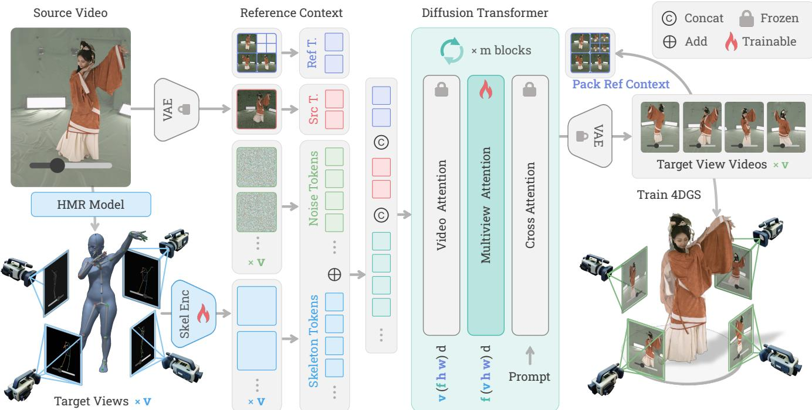  
Fig. 2. Overview of 4DAnyone. Given a source video, an HMR model (GVHMR [Shen et al. 2024]) estimates a 3D skeleton sequence, which is rendered into depth-bufered skeleton videos for � target views. A 3D-aware skeleton encoder produces residual skeleton tokens that are added to the noisy target latents. The source tokens, RCP reference tokens, and skeleton-conditioned target tokens are concatenated along the view dimension and processed by the DiT with video atention, multiview atention, and text cross-atention. Generated target videos are packed back into the RCP context for subsequent generation rounds, while TCR improves consistency during grouped target-view generation. The final multi-view videos are used to train a 4DGS model with FreeTimeGS [Wang et al. 2025a].

where $\mathsf { S } _ { i }$ denotes the depth-bufered skeleton video for target view $i ,$ and $\mathbf { z } _ { i } ^ { t }$ denotes the noisy latent tokens at timestep �. The final projection layer of $g _ { \phi }$ is zero-initialized for stable training from the pretrained DiT weights. See Supp. A for details.

## 3.3 Scalable Multiview Consistency

High-fidelity 4DGS reconstruction requires tens of target-view videos (e.g. 16), but joint denoising is prohibitively expensive. Splitting views into groups introduces two coupled consistency bottlenecks. On the conditioning side, each group needs appearance references that cover back and side views unseen in the monocular input. On the generation side, independently denoised groups cannot exchange global structural information and may drift across groups. As shown in Fig. 3, Reference Context Packing supplies scalable appearance context, and Target Context Routing propagates structure across groups.

Reference Context Packing. Across multiple target-view generation rounds, earlier outputs can serve as appearance references for later rounds to enhance multiview consistency. However, these references contain substantial cross-view redundancy, especially among nearby viewpoints. Directly appending every generated view as full DiT context is therefore ineficient, as the context length and computation grow linearly with the number of references. Inspired by FramePack [Zhang et al. 2025a], RCP uses multi-scale patchify layers to pack the growing set of target-view references into a fixed set of reference token slots. Specifically, while the standard Wan2.2 patchify layer uses kernel and stride (1, 2, 2), RCP uses a patchify layer $\mathcal { P } _ { r }$ with kernel and stride (1, 2�, 2�) for compression ratio $r ,$ producing $\textstyle { \frac { 1 } { r ^ { 2 } } }$ as many tokens as the standard layer. The packed reference tokens are assembled along the spatial dimensions and concatenated with the source and target tokens along the view dimension. Because the token-slot budget is fixed, RCP provides scalable appearance guidance with �(1) overhead as references accumulate.

In practice, we use $r \in \{ 2 , 4 \}$ for RCP references and denote the resulting fixed RCP context as

$$
C _ { \mathrm { R } } = [ \mathcal { P } _ { 1 } ( \mathbf { V } _ { \mathrm { s r c } } ) , \{ \mathcal { P } _ { 2 } ( \mathbf { V } _ { a _ { j } } ) \} _ { j = 1 } ^ { 3 } , \{ \mathcal { P } _ { 4 } ( \mathbf { V } _ { b _ { j } } ) \} _ { j = 1 } ^ { 4 } ] .
$$

During training, we randomly sample $\mathbf { V } _ { \mathrm { s r c } } , \{ \mathbf { V } _ { a _ { j } } \}$ , and $\left\{ { \mathbf { V } } _ { b _ { j } } \right\}$ from each training sequence. To support progressive inference, we apply dropout to $C _ { \mathrm { R } }$ by zeroing out either $\{ \mathcal { P } _ { 4 } ( \mathbf { V } _ { b _ { j } } ) \} _ { j = 1 } ^ { 4 }$ or both $\{ \mathcal { P } _ { 2 } ( \mathbf { V } _ { a _ { j } } ) \} _ { j = 1 } ^ { 3 }$ and $\{ \mathcal { P } _ { 4 } ( \mathbf { V } _ { b _ { j } } ) \} _ { j = 1 } ^ { 4 } ,$ with probability 0.1 each.

At inference time, we first generate reference views for RCP in two rounds. For each round, we select target viewpoints by farthest- point sampling: starting from the source view and existing reference views, it iteratively adds the candidate with the largest minimum angular distance to the selected views, improving viewpoint coverage. Round 1 generates four reference videos $\{ \mathbf { V } _ { j } \} _ { j = 1 } ^ { 4 }$ condi- tioned only on $\mathcal { P } _ { 1 } ( \mathbf { V } _ { \mathrm { s r c } } )$ , and Round 2 generates four additional reference videos conditioned on $[ \mathcal { P } _ { 1 } ( \mathbf { V } _ { \mathrm { s r c } } ) , \{ \mathcal { P } _ { 2 } ( \mathbf { V } _ { a _ { j } } ) \} _ { j = 1 } ^ { 3 } ]$ , where $\{ \mathbf { V } _ { a _ { j } } \} _ { j = 1 } ^ { 3 } \subset \{ \mathbf { V } _ { j } \} _ { j = 1 } ^ { 4 }$

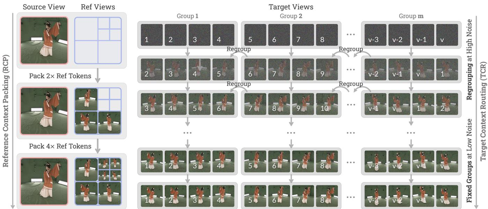  
Fig. 3. Progressive inference with Reference Context Packing and Target Context Routing. We first generate reference videos and pack them with the source video into a fixed RCP context. During target-view generation, this fixed RCP context is shared by all groups. TCR partitions � target views into � four-view groups, cyclically regroups them at high noise levels to propagate global structure, and fixes adjacent groups at low noise levels for stable detai refinement.

After these reference views are generated, we generate all target views in four-view groups using a fixed RCP context $C _ { \mathrm { R } }$ built from them. Specifically, $\{ \mathbf { \bar { V } } _ { a _ { j } } \} _ { j = 1 } ^ { 3 }$ is selected from Round 1 and $\{ \mathbf { V } _ { b _ { j } } \} _ { j = 1 } ^ { 4 }$ is selected from Round 2. The denoising process for these groups is handled by TCR, described next.

Target Context Routing. RCP addresses the conditioning bottleneck by giving each target group scalable appearance references. However, target groups are still denoised independently with no information exchange, so global structure can drift across groups de- spite shared appearance references. TCR addresses this generationside bottleneck by rotating target-view groupings during inference, so information can propagate across groups under the same per- group memory budget.

Our observation is that global structure is established at high noise levels, where isolated target groups are most likely to diverge in structure, eventually leading to inconsistent multiview appearance. Accordingly, TCR divides inference into two phases based on a switching timestep ��:

• High-noise phase $( t > t _ { s } ) \colon \mathrm { A t }$ each step, we cyclically shift the ordered view indices by the step index and repartition them into four-view groups, letting views exchange context over time and propagate global structure under the same per-group budget.

• Low-noise phase $( t \leq t _ { s } ) ;$ We fix adjacent four-view groups so neighboring views jointly refine details, stabilizing appearance and cross-view transitions.

Algorithm 1 summarizes TCR; at each denoising step, groups can be processed sequentially or in parallel across multiple GPUs.

Algorithm 1 Target Context Routing   
Require: Target viewpoints $\boldsymbol { \mathcal { V } } ,$ fixed RCP context $C _ { \mathrm { R } }$ built from the   
generated reference views, switching timestep $t _ { s } ,$ denoising schedule   
$\big \{ t _ { T } , \dots , t _ { 0 } \big \} _ { : }$ , skeleton conditions $\{ \mathsf { S } _ { i } \} _ { i \in \mathcal { V } }$   
1: Initialize $\mathbf { z } _ { i } ^ { T } \sim { \cal N } ( 0 , \mathbf { I } )$ for all views $i \in \mathcal { V }$   
2: for $n = T , \dot { T } - 1 , . . . , 1$ do   
3: if $t _ { n } > t _ { s }$ then ⊲ High-noise: rotate groups   
4: G ← RotatingGroups $( \mathcal { V } , \ 4 , \ n )$   
5: else ⊲ Low-noise: fix adjacent groups   
6: $G \gets$ AdjacentGroups $( \boldsymbol { \mathcal { V } } , \boldsymbol { 4 } )$   
7: end if   
8: for each group $G \in { \mathcal { G } }$ do   
9: Jointly denoise $\{ \mathbf { z } _ { i } ^ { n } \} _ { i \in G }$ conditioned on $C _ { \mathrm { R } }$ and $\{ \mathsf { S } _ { i } \} _ { i \in G }$ to ob-   
tain $\{ \mathbf { z } _ { i } ^ { n - 1 } \} _ { i \in G }$   
10: end for   
11: end for   
12: Decode $\{ \mathbf { z } _ { i } ^ { 0 } \} _ { i \in \mathcal { V } }$ into target-view videos $\{ \mathbf { V } _ { i } \} _ { i \in \mathcal { V } }$   
13: return $\{ \mathbf { V } _ { i } \} _ { i \in \mathcal { V } }$

## 3.4 Training Protocol

Multi-stage training. We adopt a three-stage curriculum to pro-gressively build the model’s capabilities:

Stage 1 trains on foreground-only DNA-Rendering videos to learn skeleton-conditioned camera control. To decouple pose from ap- pearance, we sample the source-view and target-view clips from diferent temporal windows with 20% probability. This encourages the model to follow the target skeleton while preserving appearance from the source video.

Stage 2 extends training to all multi-view datasets without fore-ground masking. Prior methods [Jin et al. 2025] train on masked human videos to avoid overfitting to uniform green-screen back- grounds, but this strategy introduces two drawbacks: foreground mask boundaries cause edge noise and multi-view inconsistency, while the absence of backgrounds prevents the model from learning lighting and shadow cues. This stage addresses both issues.

Table 1. Training dataset statistics.
<table><tr><td>Dataset</td><td>Videos</td><td>Cameras</td><td>Actors</td><td>Resolution</td><td>Type</td></tr><tr><td>MVGameHuman</td><td>38k</td><td>24</td><td>318</td><td>2560×1440</td><td>Multi-view</td></tr><tr><td>SynCamVideo</td><td>34k</td><td>10</td><td>66</td><td>1280×1280</td><td>Multi-view</td></tr><tr><td>DNA-Rendering</td><td>51k</td><td>48</td><td>548</td><td>2048×2048</td><td>Multi-view</td></tr><tr><td>TedTalk</td><td>42k</td><td>1</td><td>413</td><td>2160×1620</td><td>Monocular</td></tr><tr><td>Pexels</td><td>20k</td><td>1</td><td>1,411</td><td>3840×2160</td><td>Monocular</td></tr></table>

Stage 3 adds monocular datasets to improve in-the-wild generalization. In this stage, we remove finger keypoints from the skeleton input, encouraging the model to infer hand details from the source video rather than relying on noisy finger-keypoint detections.

Loss functions. We train with a latent flow-matching loss and a perceptual reconstruction loss:

$$
\begin{array} { r } { \mathcal { L } = \mathcal { L } _ { \mathrm { l a t e n t } } + \lambda \mathcal { L } _ { \mathrm { L P I P S } } , } \end{array}
$$

where $\mathcal { L } _ { \mathrm { l a t e n t } }$ is the standard MSE flow-matching loss in latent space. We compute $\mathcal { L } _ { \mathrm { L P I P S } }$ [Zhang et al. 2018] on decoded frames with $\lambda =$ 0.25 to mitigate artifacts caused by the high spatial compression of the Wan2.2 VAE. To reduce GPU memory consumption, we evaluate LPIPS on body-part-aware semantic crops. See Supp. C for details.

## 4 Experiments

## 4.1 Experimental Setup

Dataset. Table 1 summarizes our human-centric training data. MVGameHuman and SynCamVideo [Bai et al. 2025b] provide multiview videos with diverse backgrounds, DNA-Rendering [Cheng et al. 2023] provides real captures, and monocular Pexels and TedTalk improve in-the-wild generalization. MVGameHuman is captured using our in-house game engine (Supp. B).

We detect 2D keypoints using Sapiens2-1B [Khirodkar et al. 2026]. For multi-view datasets, 3D skeletons are obtained via cross-view triangulation and reprojected to each camera view for depth-bufered skeleton rendering. For monocular datasets, we sample per-keypoint depth from the Sapiens2 pointmap prediction to drive the z-bufer, and filter out sequences with large camera motion.

Implementation details. We build 4DAnyone on top of Wan2.2- TI2V-5B [Wan Team 2025], a 5B-parameter DiT-based video difusion model whose high-compression VAE makes it particularly eficient for multi-view generation tasks. Training is conducted at 704×1280 resolution with a learning rate of $1 \times \bar { 1 0 } ^ { - 5 }$ on 128 H20-3E GPUs, following the 3-stage curriculum described in Sec. 3.4. The three stages take approximately 0.5, 1, and 1.5 days, respectively. At infer-ence time, we use 20 denoising steps. For Target Context Routing, we partition target views into four-view groups during target-view generation and set $t _ { s } / T = 0 . 2 .$ . See Supp. C–E for details.

Evaluation protocol. For quantitative evaluation, we use 10 DNA-Rendering [Cheng et al. 2023] and 3 DyMVHumans [Zheng et al.

2024] test scenes unseen during training, selecting 16 approximately uniformly distributed cameras and 98 frames per scene. Given a single front-view source video, 4DAnyone generates 16 uniformly spaced target-view videos. We report three complementary evalu ation dimensions: (i) 4DGS reconstruction, where all 16 generated views are used to reconstruct a 4DGS model via FreeTimeGS [Wang et al. 2025a], and the rendered views are compared against groundtruth videos; (ii) generated video consistency, where we hold out 4 evenly spaced views as the test set and use the remaining 12 views to train 4DGS, then compare the 4DGS renderings at test views against the corresponding generated videos to measure the 3D consistency among the generated views; and (iii) generated video reconstruction, directly comparing all 16 generated videos against ground-truth videos. All dimensions are evaluated using PSNR↑, SSIM↑, and LPIPS↓.

Baselines. We compare against three representative methods spanning diferent conditioning paradigms: MV-Performer [Zhi et al. 2025], an explicit geometry-conditioned human-specific novel view synthesis model natively trained on MVHumanNet++ [Li et al. 2025]; TrajectoryCrafter [Yu et al. 2025], an explicit geometry-conditioned camera control video model that uses depth-based warping; and ReCamMaster† [Bai et al. 2025a], an implicit camera-conditioned video model based on video conditioning. † denotes our fine-tuned version trained with the same protocol and datasets and equipped with the same RCP module and TCR strategy for fair comparison, while MV-Performer and TrajectoryCrafter are evaluated zero-shot with their released weights. All baselines are evaluated with the same source videos and target viewpoints. The DNA-Rendering test sequences are held out from our training data, and DyMVHumans is out-of-distribution for all methods.

## 4.2 Comparison with State-of-the-Art

Quantitative results. Table 2 presents the quantitative comparison on DNA-Rendering and DyMVHumans. 4DAnyone outperforms all baselines across all three evaluation dimensions. For generated- video consistency, its leading scores indicate more coherent in-puts for 4D lifting. For generated-video reconstruction, its leading scores indicate more faithful novel views than the compared implicit-camera and dense-geometry baselines. These consistency gains translate to the strongest 4DGS reconstruction results.

MV-Performer generates reasonable frontal views but distorts side and back views due to limited training diversity. Trajecto-ryCrafter accumulates depth errors and often fails under front- to-back changes, while ReCamMaster’s inaccurate camera control degrades 4DGS reconstruction despite plausible videos.

Qualitative results. Fig. 4 presents visual comparisons on the DNA-Rendering test set. MV-Performer distorts body shape and pose at side and back views, and TrajectoryCrafter sufers severe ge-ometry distortion and front-to-back failure. ReCamMaster produces plausible videos, but imprecise camera control causes cross-view misalignment and noisy 4DGS renderings. In contrast, 4DAnyone remains geometrically accurate and detailed across viewpoints, in-cluding hallucination of unseen back-view content consistent with the front-view input.

Table 2. Quantitative comparison on DNA-Rendering and DyMVHumans. We evaluate 4DGS reconstruction, generated video consistency, and generated video reconstruction. Best results are in bold. † denotes our fine-tuned version.
<table><tr><td rowspan="2">Method</td><td rowspan="2"></td><td colspan="3">DNA-Rendering</td><td colspan="3">DyMVHumans</td></tr><tr><td>PSNR↑</td><td>SSIM↑</td><td>LPIPS↓</td><td>PSNR↑</td><td>SSIM↑</td><td>LPIPS↓</td></tr><tr><td rowspan="4">Gen. Video Consistency</td><td>MV-Performer [Zhi et al. 2025]</td><td>21.25</td><td>0.799</td><td>0.222</td><td>19.98</td><td>0.797</td><td>0.182</td></tr><tr><td>TrajectoryCrafter [Yu et al. 2025]</td><td>13.56</td><td>0.641</td><td>0.331</td><td>15.19</td><td>0.769</td><td>0.204</td></tr><tr><td>ReCamMaster† [Bai et al. 2025a]</td><td>21.47</td><td>0.806</td><td>0.210</td><td>21.94</td><td>0.833</td><td>0.142</td></tr><tr><td>Ours</td><td>24.33</td><td>0.862</td><td>0.163</td><td>24.48</td><td>0.862</td><td>0.109</td></tr><tr><td rowspan="4">4DGS Reconstruction</td><td>MV-Performer [Zhi et al. 2025]</td><td>20.38</td><td>0.826</td><td>0.191</td><td>18.69</td><td>0.787</td><td>0.158</td></tr><tr><td>TrajectoryCrafter [Yu et al. 2025]</td><td>14.81</td><td>0.718</td><td>0.331</td><td>15.11</td><td>0.748</td><td>0.217</td></tr><tr><td>ReCamMaster† [Bai et al. 2025a]</td><td>20.55</td><td>0.807</td><td>0.214</td><td>19.86</td><td>0.795</td><td>0.159</td></tr><tr><td>Ours</td><td>24.15</td><td>0.863</td><td>0.159</td><td>23.28</td><td>0.846</td><td>0.117</td></tr><tr><td rowspan="4">Gen. Video Reconstruction</td><td>MV-Performer [Zhi et al. 2025]</td><td>19.33</td><td>0.803</td><td>0.204</td><td>14.36</td><td>0.731</td><td>0.230</td></tr><tr><td>TrajectoryCrafter [Yu et al. 2025]</td><td>13.68</td><td>0.698</td><td>0.358</td><td>14.11</td><td>0.725</td><td>0.247</td></tr><tr><td>ReCamMaster† [Bai et al. 2025a]</td><td>20.74</td><td>0.809</td><td>0.204</td><td>19.18</td><td>0.778</td><td>0.168</td></tr><tr><td>Ours</td><td>23.69</td><td>0.850</td><td>0.165</td><td>21.03</td><td>0.808</td><td>0.143</td></tr></table>

Table 3. Ablation study. Following the Gen. Video Consistency seting, we evaluate the consistency among generated videos.
<table><tr><td>Configuration</td><td>PSNR↑</td><td>SSIM↑</td><td>LPIPS↓</td></tr><tr><td>w/o TCR &amp; RCP</td><td>21.09</td><td>0.766</td><td>0.216</td></tr><tr><td>w/o RCP</td><td>22.03</td><td>0.780</td><td>0.203</td></tr><tr><td>w/o TCR</td><td>22.21</td><td>0.788</td><td>0.196</td></tr><tr><td>Full (Random)</td><td>22.20</td><td>0.788</td><td>0.197</td></tr><tr><td>Full (Strided)</td><td>22.06</td><td>0.786</td><td>0.198</td></tr><tr><td>Full (Sliding)</td><td>22.63</td><td>0.796</td><td>0.191</td></tr></table>

## 4.3 Ablation Study

We ablate the core components of 4DAnyone on DNA-Rendering, selecting 8 challenging sequences, each with 16 uniformly distributed cameras and 121 frames. Following the Gen. Video Consistency setting in Sec. 4.2, we evaluate the relative consistency among gen-erated videos. Results are reported in Table 3.

Efect of Reference Context Packing. Without RCP, the model relies on monocular context alone and lacks appearance guidance from previously generated views, leading to inconsistent hallucinations in unseen viewpoints and degradation across all metrics.

Efect of Target Context Routing. Without TCR, fixed view groups are denoised independently, causing structural and appearance inconsistencies across groups. TCR rotates groupings at high noise to share context, improving all three metrics. When RCP is additionally removed, all metrics deteriorate substantially, highlight- ing the complementary roles of RCP and TCR.

Efect of routing strategy. With all components enabled, Random provides no measurable gain and Strided degrades all metrics relative to fixed grouping, whereas only Sliding improves all three, suggesting that preserving local view adjacency is important for routing. See Supp. F.1 for details.

Efect of 3D-aware skeleton conditioning. Compared with plain 2D rendering, depth bufering resolves front-back ambiguity for overlapping body parts (Fig. 5), improving geometric consistency.

## 4.4 Generalization to In-the-Wild Videos

In-the-Wild Results. We further evaluate 4DAnyone on diverse in-the-wild human-centric videos. As shown in Fig. 7, 4DAnyone generalizes robustly beyond the controlled evaluation datasets, pro- ducing consistent target-view videos and high-quality 4DGS renderings across diverse human-centric videos.

Challenging Cases. Fig. 6 shows our tests on challenging inputs, including back-view source videos, complex subject appearance, and complex human motions. 4DAnyone remains robust in these settings, maintaining coherent target-view generation and high-quality 4DGS reconstruction. Limitations and failure cases are analyzed in Supp. H.

## 5 Conclusion

We have presented 4DAnyone, a novel framework for reconstruct- ing high-fidelity 4D humans from monocular videos. By using 3D skeletons as sparse yet robust geometric conditioning, together with Reference Context Packing for scalable appearance guidance and Target Context Routing for reducing cross-group drift, 4DAnyone generates reconstruction-grade multi-view videos that significantly outperform prior methods in both video quality and downstream 4DGS reconstruction.

## Ethics and Impact

4DAnyone synthesizes realistic human videos, which poses potential risks of deepfake misuse, identity privacy violation, and copyright infringement. We firmly oppose any malicious use of our work, and advocate that generated results be clearly disclosed as synthetic and created only with the consent of the depicted subjects.

## Acknowledgments

This work was partially supported by National Key R&D Program of China (No. 2024YFB2809105), NSFC (No. U24B20154), Zhejiang Provincial Natural Science Foundation of China (No. LR25F020003), Ant Group, and Information Technology Center and State Key Lab of CAD&CG, Zhejiang University.

## References

Sherwin Bahmani, Ivan Skorokhodov, Aliaksandr Siarohin, Willi Menapace, Guocheng Qian, Michael Vasilkovsky, Hsin-Ying Lee, Chaoyang Wang, Jiaxu Zou, Andrea Tagliasacchi, et al. 2024. VD3D: Taming Large Video Difusion Transformers for 3D Camera Control. arXiv preprint arXiv:2407.12781 (2024).

Jianhong Bai, Menghan Xia, Xiao Fu, Xintao Wang, Lianrui Mu, Jinwen Cao, Zuozhu Liu, Haoji Hu, Xiang Bai, Pengfei Wan, and Di Zhang. 2025a. ReCamMaster: Camera Controlled Generative Rendering from A Single Video. In ICCV. 14834–14844.

Jianhong Bai, Menghan Xia, Xintao Wang, Ziyang Yuan, Xiao Fu, Zuozhu Liu, Haoji Hu, Pengfei Wan, and Di Zhang. 2025b. SynCamMaster: Synchronizing Multi-Camera Video Generation from Diverse Viewpoints. In ICLR.

Zeyu Cai, Ziyang Li, Xiaoben Li, Boqian Li, Zeyu Wang, Zhenyu Zhang, and Yuliang Xiu. 2025. UP2You: Fast Reconstruction of Yourself from Unconstrained Photo Collections. arXiv preprint arXiv:2509.24817 (2025).

Gang Cheng, Xin Gao, Li Hu, Siqi Hu, Mingyang Huang, Chaonan Ji, Ju Li, Dechao Meng, Jinwei Qi, Penchong Qiao, et al. 2025. Wan-Animate: Unified Character Animation and Re lacement with Holistic Re lication. arXiv preprint arXiv:2509.14055 (2025).

Wei Cheng, Ruixiang Chen, Wanqi Yin, Siming Fan, Keyu Chen, Honglin He, Huiwen Luo, Zhon an Cai, Jin bo Wan , Yan Gao, et al. 2023. DNA-Renderin : A Di verse Neural Actor Repository for High-Fidelity Human-centric Rendering. In ICCV. 19925–19936.

Yuanxing Duan, Fangyin Wei, Qiyu Dai, Yuhang He, Wenzheng Chen, and Baoquan Chen. 2024. 4D-Rotor Gaussian Splatting: Towards Eficient Novel View Synthesis for Dynamic Scenes. In SIGGRAPH. 1–11.

Zhixue Fang, Xu He, Songlin Tang, Haoxian Zhang, Qingfeng Li, Xiaoqiang Liu, Pengfei Wan, and Kun Gai. 2026. 3DiMo: 3D-Aware Implicit Motion Control for View- Adaptive Human Video Generation. arXiv preprint arXiv:2602.03796 (2026).

Ruiqi Gao, Aleksander Holynski, Philipp Henzler, Arthur Brussee, Ricardo Martin Brualla, Pratul Srinivasan, Jonathan T. Barron, and Ben Poole. 2024. CAT3D: Create Anything in 3D with Multi-View Difusion Models. In NeurIPS. 75468–75494.

Hao He, Yinghao Xu, Yuwei Guo, Gordon Wetzstein, Bo Dai, Hongsheng Li, and Ceyuan Yang. 2025a. CameraCtrl: Enabling Camera Control for Text-to-Video Generation. In ICLR.

Hao He, Ceyuan Yang, Shanchuan Lin, Yinghao Xu, Meng Wei, Liangke Gui, Qi Zhao, Gordon Wetzstein, Lu Jiang, and Hongsheng Li. 2025b. CameraCtrl II: Dynamic Scene Exploration via Camera-Controlled Video Difusion Models. In ICCV. 13416– 13426.

Hezhen Hu, Zhiwen Fan, Tianhao Wu, Yihan Xi, Seoyoung Lee, Georgios Pavlakos, and Zhangyang Wang. 2024a. Expressive Gaussian Human Avatars from Monocular RGB Video. NeurIPS 37 (2024), 5646–5660.

Li Hu, Xin Gao, Peng Zhang, Ke Sun, Bang Zhang, and Liefeng Bo. 2024b. Animate Any- one: Consistent and Controllable Image-to-Video Synthesis for Character Animation. In CVPR. 8153–8163.

Liangxiao Hu, Hongwen Zhang, Yuxiang Zhang, Boyao Zhou, Boning Liu, Shengping Zhang, and Liqiang Nie. 2024d. GaussianAvatar: Towards Realistic Human Avatar Modeling from a Single Video via Animatable 3D Gaussians. In CVPR. 634–644.

Shoukang Hu, Tao Hu, and Ziwei Liu. 2024c. GauHuman: Articulated Gaussian Splatting from Monocular Human Videos. In CVPR. 20418–20431.

Wenbo Hu, Xiangjun Gao, Xiaoyu Li, Sijie Zhao, Xiaodong Cun, Yong Zhang, Long Quan, and Ying Shan. 2025. DepthCrafter: Generating Consistent Long Depth Sequences for Open-World Videos. In CVPR. 2005–2015.

Tianjian Jiang, Xu Chen, Jie Song, and Otmar Hilliges. 2023. InstantAvatar: Learning Avatars from Monocular Video in 60 Seconds. In CVPR. 16922–16932.

Yuheng Jiang, Chengcheng Guo, Yize Wu, Yu Hong, Shengkun Zhu, Zhehao Shen, Yingliang Zhang, Shaohui Jiao, Zhuo Su, Lan Xu, Marc Habermann, and Christian Theobalt. 2025. Topology-Aware Optimization of Gaussian Primitives for Human Centric Volumetric Videos. In SIGGRAPH Asia. 1–12.

Yuheng Jiang, Zhehao Shen, Yu Hong, Chengcheng Guo, Yize Wu, Yingliang Zhang, Jingyi Yu, and Lan Xu. 2024. Robust Dual Gaussian Splatting for Immersive Human centric Volumetric Videos. ACM TOG 43, 6 (2024), 1–15.

Yudong Jin, Sida Peng, Xuan Wang, Tao Xie, Zhen Xu, Yifan Yang, Yujun Shen, Hujun Bao, and Xiaowei Zhou. 2025. Difuman4D: 4D Consistent Human View Synthesis from Sparse-View Videos with Spatio-Temporal Difusion Models. In ICCV. 11047– 11057.

Bernhard Kerbl, Georgios Kopanas, Thomas Leimkühler, and George Drettakis. 2023. 3D Gaussian Splatting for Real-Time Radiance Field Rendering. ACM TOG 42, 4 (2023), 1–14.

Rawal Khirodkar, He Wen, Julieta Martinez, Yuan Dong, Su Zhaoen, and Shunsuke Saito. 2026. Sa iens2. In ICLR.

Chenghong Li, Hongjie Liao, Yihao Zhi, Xihe Yang, Zhengwentai Sun, Jiahao Chang, Shuguang Cui, and Xiaoguang Han. 2025. MVHumanNet++: A Large-scale Dataset of Multi-view Daily Dressing Human Captures with Richer Annotations for 3D Human Digitization. arXiv preprint arXiv:2505.01838 (2025).

Haotong Lin, Sili Chen, Jun Hao Liew, Donny Y. Chen, Zhenyu Li, Guang Shi, Jiashi Feng, and Bingyi Kang. 2025. Depth Anything 3: Recovering the Visual Space from Any Views. arXiv preprint arXiv:2511.10647 (2025).

Haotong Lin, Sida Peng, Zhen Xu, Tao Xie, Xingyi He, Hujun Bao, and Xiaowei Zhou. 2023. Hi h-Fidelit and Real-Time Novel View S nthesis for D namic Scenes. In SIGGRAPH Asia. 1–9.

Ruoshi Liu, Rundi Wu, Basile Van Hoorick, Pavel Tokmakov, Sergey Zakharov, and Carl Vondrick. 2023. Zero-1-to-3: Zero-shot One Image to 3D Object. In ICCV. 9298–9309.

Matthew Loper, Naureen Mahmood, Javier Romero, Gerard Pons-Moll, and Michael J. Black. 2023. SMPL: A Skinned Multi-Person Linear Model (1 ed.). Association for Com puting Machinery, New York, NY, USA. https://doi.org/10.1145/3596711.3596800

Ben Mildenhall, Pratul P Srinivasan, Matthew Tancik, Jonathan T Barron, Ravi Ra mamoorthi, and Ren Ng. 2021. NeRF: Representing Scenes as Neural Radiance Fields for View Synthesis. Commun. ACM 65, 1 (2021), 99–106.

Georgios Pavlakos, Vasileios Choutas, Nima Ghorbani, Timo Bolkart, Ahmed AA Osman, Dimitrios Tzionas, and Michael J Black. 2019. Expressive Body Capture: 3D Hands, Face, and Body from a Single Image. In Proceedings of the IEEE/CVF conference on computer vision and pattern recognition. 10975–10985.

Sida Peng, Yuanqing Zhang, Yinghao Xu, Qianqian Wang, Qing Shuai, Hujun Bao, and Xiaowei Zhou. 2021. Neural Body: Implicit Neural Representations with Structured Latent Codes for Novel View Synthesis of Dynamic Humans. In CVPR. 9050–9059.

Zhiyin Qian, Shaofei Wang, Marko Mihajlovic, Andreas Geiger, and Siyu Tang. 2024. 3DGS-Avatar: Animatable Avatars via Deformable 3D Gaussian Splatting. In CVPR. 5020–5030.

Xuanchi Ren, Tianchang Shen, Jiahui Huang, Huan Ling, Yifan Lu, Merlin Nimier-David, Thomas Mueller, Alexander Keller, Sanja Fidler, and Jun Gao. 2025. Gen3C: 3D-Informed World-Consistent Video Generation with Precise Camera Control. In CVPR. 6121–6132.

Zehong Shen, Huaijin Pi, Yan Xia, Zhi Cen, Sida Peng, Zechen Hu, Hujun Bao, Ruizhen Hu, and Xiaowei Zhou. 2024. World-Grounded Human Motion Recovery via Gravity View Coordinates. In SIGGRAPH Asia. 144:1–144:11.

Ruoxi Shi, Hansheng Chen, Zhuoyang Zhang, Minghua Liu, Chao Xu, Xinyue Wei, Lin hao Chen, Chon Zen , and Hao Su. 2023. Zero123++: A Sin le Ima e to Consistent Multi-View Difusion Base Model. arXiv preprint arXiv:2310.15110 (2023).

Yichun Shi, Peng Wang, Jianglong Ye, Mai Long, Kejie Li, and Xiao Yang. 2024. MV Dream: Multi-View Difusion for 3D Generation. In ICLR.

Vikram Voleti, Chun-Han Yao, Mark Boss, Adam Letts, David Pankratz, Dmitry Tochilkin, Christian Laforte, Robin Rombach, and Varun Jampani. 2024. SV3D: Novel Multi-View Synthesis and 3D Generation from a Single Image Using Latent Video Difusion. In European Conference on Computer Vision. S ringer, 439–457.

Wan Team. 2025. Wan: Open and Advanced Large-Scale Video Generative Models. arXiv preprint arXiv:2503.20314 (2025).

Xiang Wang, Shiwei Zhang, Changxin Gao, Jiayu Wang, Xiaoqiang Zhou, Yingya Zhang, Luxin Yan, and Nong Sang. 2025b. UniAnimate: Taming Unified Video Difusion Models for Consistent Human Image Animation. Science China Information Sciences 68, 10 (2025), 200103.

Yifan Wang, Peishan Yang, Zhen Xu, Jiaming Sun, Zhanhua Zhang, Yong Chen, Hujun Bao, Sida Peng, and Xiaowei Zhou. 2025a. FreeTimeGS: Free Gaussian Primitives at Anytime and Anywhere for Dynamic Scene Reconstruction. In CVPR. 21750–21760.

Zhouxia Wang, Ziyang Yuan, Xintao Wang, Yaowei Li, Tianshui Chen, Menghan Xia, Ping Luo, and Ying Shan. 2024. MotionCtrl: A Unified and Flexible Motion Controller for Video Generation. In SIGGRAPH. 1–11.

Chung-Yi Weng, Brian Curless, Pratul P. Srinivasan, Jonathan T. Barron, and Ira Kemelmacher-Shlizerman. 2022. HumanNeRF: Free-Viewpoint Rendering of Moving People from Monocular Video. In CVPR. 16210–16220.

Guanjun Wu, Taoran Yi, Jiemin Fang, Lingxi Xie, Xiaopeng Zhang, Wei Wei, Wenyu Liu, Qi Tian, and Xinggang Wang. 2024. 4D Gaussian Splatting for Real-Time Dynamic Scene Rendering. In CVPR. 20310–20320.

Rundi Wu, Ruiqi Gao, Ben Poole, Alex Trevithick, Changxi Zheng, Jonathan T. Barron, and Aleksander Holynski. 2025. CAT4D: Create Anything in 4D with Multi-View Video Difusion Models. In CVPR. 26057–26068.

Yiming Xie, Chun-Han Yao, Vikram Voleti, Huaizu Jiang, and Varun Jampani. 2024. SV4D: Dynamic 3D Content Generation with Multi-Frame and Multi-View Consis tency. arXiv preprint arXiv:2407.17470 (2024).

Dejia Xu, Weili Nie, Chao Liu, Sifei Liu, Jan Kautz, Zhangyang Wang, and Arash Vahdat. 2024a. CamCo: Camera-Controllable 3D-Consistent Ima e-to-Video Generation. arXiv preprint arXiv:2406.02509 (2024).

Zhen Xu, Sida Peng, Haotong Lin, Guangzhao He, Jiaming Sun, Yujun Shen, Hujun Bao, and Xiaowei Zhou. 2024b. 4K4D: Real-Time 4D View Synthesis at 4K Resolution. In CVPR. 20029–20040.

Zhen Xu, Yinghao Xu, Zhiyuan Yu, Sida Peng, Jiaming Sun, Hujun Bao, and Xiaowei Zhou. 2024c. Representing Long Volumetric Video with Temporal Gaussian Hierar chy. ACM TOG 43, 6 (2024), 1–18.

Zhongcong Xu, Jianfeng Zhang, Jun Hao Liew, Hanshu Yan, Jia-Wei Liu, Chenxu Zhang, Jiashi Feng, and Mike Zheng Shou. 2024d. MagicAnimate: Temporally Consistent Human Image Animation Using Difusion Model. In CVPR. 1481–1490.

Zhen Xu, Hongyu Zhou, Sida Peng, Haotong Lin, Haoyu Guo, Jiahao Shao, Peishan Yang, Qinglin Yang, Sheng Miao, Xingyi He, Yifan Wang, Yue Wang, Ruizhen Hu, Yiyi Liao, Xiaowei Zhou, and Hujun Bao. 2025. Towards Depth Foundation Model:

Recent Trends in Vision-Based Depth Estimation. arXiv preprint arXiv:2507.11540 (2025).

Xitong Yang, Devansh Kukreja, Don Pinkus, Anushka Sagar, Taosha Fan, Jinhyung Park, Soyong Shin, Jinkun Cao, Jiawei Liu, Nicolas Ugrinovic, Matt Feiszli, Jitendra Malik, Piotr Dollár, and Kris Kitani. 2026. SAM 3D Body: Robust Full-Body Human Mesh Recovery. arXiv preprint arXiv:2602.15989 (2026).

Zeyu Yang, Hongye Yang, Zijie Pan, and Li Zhang. 2024. Real-time Photorealistic Dynamic Scene Representation and Rendering with 4D Gaussian Splatting. In ICLR.

Mark Yu, Wenbo Hu, Jinbo Xing, and Ying Shan. 2025. TrajectoryCrafter: Redirecting Camera Trajectory for Monocular Videos via Difusion Models. In ICCV. 100–111.

Zhengming Yu, Wei Cheng, Xian Liu, Wayne Wu, and Kwan-Yee Lin. 2023. MonoHuman: Animatable Human Neural Field from Monocular Video. In CVPR. 16943–16953.

Lvmin Zhang, Shengqu Cai, Muyang Li, Gordon Wetzstein, and Maneesh Agrawala. 2025a. Frame Context Packing and Drift Prevention in Next-Frame-Prediction Video Difusion Models. In NeurIPS. 34436–34456.

Lvmin Zhang, Anyi Rao, and Maneesh Agrawala. 2023. Adding Conditional Control to Text-to-Image Difusion Models. In ICCV. 3836–3847.

Qihang Zhang, Shuangfei Zhai, Miguel Angel Bautista Martin, Kevin Miao, Alexander Toshev, Joshua Susskind, and Jiatao Gu. 2025b. World-Consistent Video Difusion with Explicit 3D Modeling. In CVPR. 21685–21695.

Richard Zhang, Phillip Isola, Alexei A. Efros, Eli Shechtman, and Oliver Wang. 2018. The Unreasonable Efectiveness of Deep Features as a Perceptual Metric. In CVPR. 586–595.

Xiaoyun Zheng, Liwei Liao, Xufeng Li,JianboJiao, Rongjie Wang, Feng Gao, Shiqi Wang, and Ronggang Wang. 2024. PKU-DyMVHumans: A Multi-View Video Benchmark for High-Fidelity Dynamic Human Modeling. In CVPR. 22530–22540.

Yihao Zhi, Chenghong Li, Hongjie Liao, Xihe Yang, Zhengwentai Sun, Jiahao Chang, Xi aodong Cun, Wensen Feng, and Xiaoguang Han. 2025. MV-Performer: Taming Video Difusion Model for Faithful and Synchronized Multi-view Performer Synthesis. In SIGGRAPH Asia. 1–14.

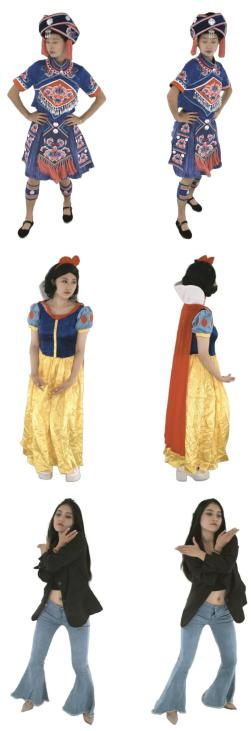

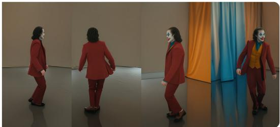  
Source View

10 • Yudong Jin, Tao Xie, Qihang Zhang, Zehong Shen, Zhen Xu, Yujun Shen, Hujun Bao, Xiaowei Zhou, and Yinghao Xu

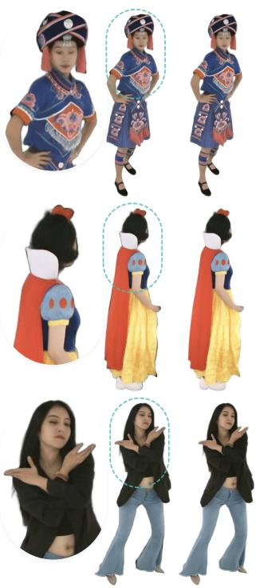  
Ground Truth  
Rend.  
Ours  
Gen.

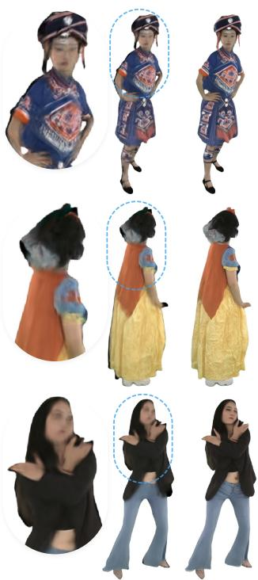

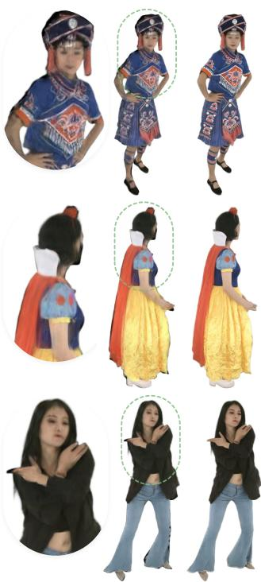  
Rend. Gen. MV-Performer  
Rend. Gen. ReCamMaster†

Fig. 4. Qualitative comparison with baselines. We show target-view generated videos (Gen.) and their corresponding 4DGS renderings (Rend.) across diverse human-centric videos. 4DAnyone produces geometrically accurate and visually detailed results across viewpoints, while the baselines sufer from inaccurate camera control (our fine-tuned ReCamMaster†) or geometric distortions (MV-Performer). See the project page for dynamic results.

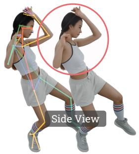  
w/o 3D-Aware Skeleton

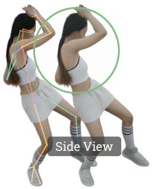  
w/ 3D-Aware Skeleton

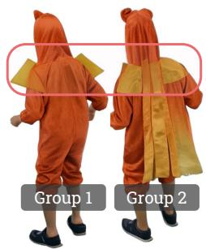  
w/o RCP + TCR

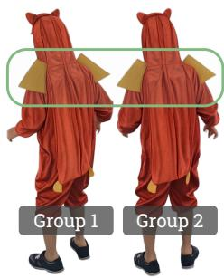  
w/ RCP + TCR

Fig. 5. Qualitative ablation results. Left: 3D-aware skeleton conditioning resolves the inherent ambiguity of 2D skeletons, guiding the model to generate geometrically correct content. Right: RCP and TCR maintain an efective cross-view context, leading to consistent appearance across generated views.

  
Source Video

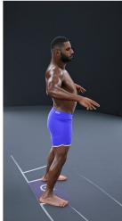  
Generated Target Videos

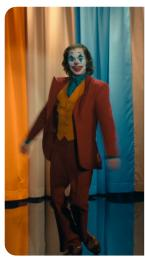  
Source Video  
Generated Target Videos

Fig. 6. Challenging cases. 4DAnyone robustly handles back-view source videos (left), complex subject appearance (right), and complex human motions.

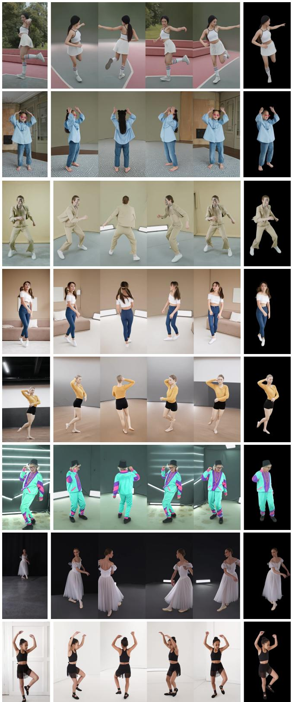

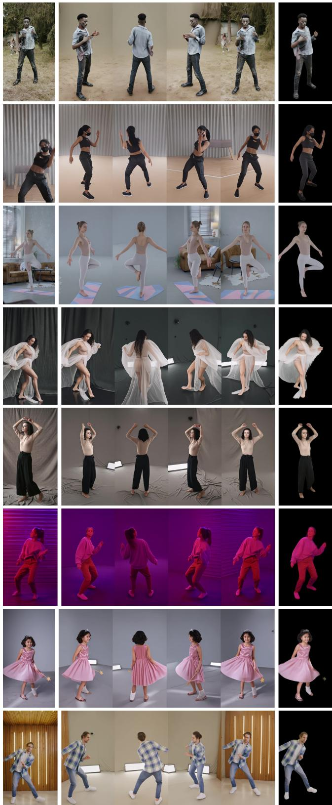  
Fig. 7. Robust generalization to diverse in-the-wild human videos. For each example, we show the source video (left), generated target-view videos (middle, 4 of 16 views), and a 4DGS novel-view rendering (right). See the project page for dynamic results.

# 4DAnyone: Create Anyone in 4D from a Casual Monocular Video

Supplementary Material

## A Model Details

Multiview self-attention. The multiview self-attention layers share the same architecture and weights as the video (temporal) self-attention layers in the base Wan2.2 DiT [Wan Team 2025], differing only in how tokens are arranged. In multiview self-attention, we rearrange tokens to (�, �·ℎ·�, $d ) _ { : }$ , allowing tokens from diferent viewpoints at the same timestep to directly attend to each other. These two attention modules jointly achieve 4D information ex-change across all views and frames. All parameters are initialized from the base model’s temporal self-attention layers, so the pre- trained temporal coherence serves as a natural starting point for learning cross-view consistency.

Multi-scale patchify layers. The standard Wan2.2 patchify layer is a Conv3d with kernel/stride (1, 2, 2). The RCP 2× and 4× patchify layers use kernel/stride (1, 4, 4) and (1, 8, 8), producing $\textstyle { \frac { 1 } { 4 } }$ and $\frac { 1 } { 1 6 }$ the tokens, respectively. Following FramePack [Zhang et al. 2025a], we initialize them by tiling the pretrained (1, 2, 2) kernel spatially and dividing by the area ratio (4 for 2×, 16 for 4×) to preserve activation variance.

3D-aware skeleton encoder. The skeleton encoder $g _ { \phi }$ takes the depth-bufered RGB skeleton video as input and outputs a DiT-resolution residual added to the noisy latent tokens. It consists of 10 Conv3d layers (5 strided, 5 non-strided, all with SiLU) followed by a 1×1×1 final projection. Channels progress as 3 → 16 → 32 → 64 → $1 2 8 \to 2 5 6 \to d ;$ strided convolutions use kernel (3, 4, 4), yielding 32× spatial and 4× temporal downsampling. The final projection is zero-initialized, so the residual is initially zero and the pretrained DiT behavior is preserved at the start of training. We prepend 3 replicated copies of the first frame before feeding the sequence to the skeleton encoder to match the Wan2.2 VAE encoding pattern, which maps 4�+1 input frames to �+1 latent frames.

## B Dataset Details

MVGameHuman. MVGameHuman is collected with our in-house game data engine. It contains 38k synchronized multi-view hu man videos rendered at 2560×1440 resolution, covering 318 actors captured by 24 virtual cameras per sequence. Fig. 8 visualizes rep- resentative samples from MVGameHuman. Each row shows the same frame observed by four uniformly spaced cameras selected from the 24-camera rig. The examples illustrate the dataset’s syn- chronized multi-view coverage and variations in actors, clothing, motion, lighting, virtual scenes, and backgrounds.

## C Training Details

Training setup. All stages fine-tune Wan2.2-TI2V-5B [Wan Team 2025] at 704×1280 resolution with a learning rate of $1 \times 1 0 ^ { - 5 }$ and an LPIPS [Zhang et al. 2018] weight of � = 0.25. The three stages take approximately 0.5, 1, and 1.5 days on 128 H20-3E GPUs; training converges stably with 32 or more GPUs, and we use 128 to accelerate it.

Table 4. Training data sampling. Source cameras are uniformly sampled from the listed options.
<table><tr><td>Dataset</td><td>No. Tgt Cam</td><td>No. Src Cam</td><td>No. Frame</td><td>Weight</td></tr><tr><td>MVGameHuman</td><td>6</td><td>1/4/8</td><td>41</td><td>0.4</td></tr><tr><td>MVGameHuman</td><td>4</td><td>1/4/8</td><td>61</td><td>0.4</td></tr><tr><td>MVGameHuman</td><td>1</td><td>1/4/8</td><td>121</td><td>0.2</td></tr><tr><td>SynCamVideo</td><td>4</td><td>1/4</td><td>61</td><td>0.8</td></tr><tr><td>SynCamVideo</td><td>1</td><td>1/4/8</td><td>81</td><td>0.2</td></tr><tr><td>DNA-Rendering</td><td>6</td><td>1/4/8</td><td>41</td><td>0.4</td></tr><tr><td>DNA-Rendering</td><td>4</td><td>1/4/8</td><td>61</td><td>0.4</td></tr><tr><td>DNA-Rendering</td><td>1</td><td>1/4/8</td><td>121</td><td>0.2</td></tr><tr><td>Pexels</td><td>1</td><td>1</td><td>121</td><td>1.0</td></tr><tr><td>TedTalk</td><td>1</td><td>1</td><td>121</td><td>1.0</td></tr></table>

Body-part-aware LPIPS cropping. Full-resolution LPIPS is memory intensive for long clips, so we use a body-part-aware sampler that prioritizes human regions, especially the face and hands, while retaining global coverage. From target-view 2D keypoints, we derive clip-level boxes for the full body, face, and hands and decode one spatial crop per clip. We sample the full body, face, left hand, and right hand with probabilities 0.2, 0.2, 0.1, and 0.1; the remaining 0.4 is uniform. Face and hand crops are box-centered, whereas full-body crops center on a point sampled within the box; missing boxes fall back to uniform sampling. Each 256×256 crop is shared across all clip frames.

Data sampling configuration. Tab. 4 summarizes the training sampling configuration. For each iteration, a dataset and camera configuration are randomly selected according to the specified sampling weights. To maintain roughly constant computational cost across configurations, the product of target cameras and frame count is kept approximately constant (e.g. 6 × 41 ≈ 4 × 61 ≈ 1 × 121), so that the total number of tokens per forward-backward pass remains simi- lar. Source cameras are uniformly sampled from the listed options to train the RCP module’s multi-scale patchify layers across diferent compression ratios: 1 source view uses 1× patchify, 4 source views use 2× patchify, and 8 source views combine 1×, 2×, and 4× patchify layers.

Stage-specific settings. Tab. 5 details the per-stage training configuration. In Stage 1, we train exclusively on foreground-only DNA-Rendering [Cheng et al. 2023] videos. A 20% probability of inde-pendently sampling the source frame range decouples pose from appearance: the model learns to follow the skeleton’s pose while referencing the source video’s appearance from a potentially difer- ent temporal window. Stage 2 removes background masking and adds MVGameHuman and SynCamVideo to improve diversity and enable background modeling. In Stage 3, we further include monoc- ular datasets (Pexels and TedTalk) and drop finger keypoints from the skeleton input, since monocular finger keypoint detections are noisy; the model instead learns to infer hand details from the source video reference.

Table 5. Stage-specific training setings. “Indep. Src Prob” denotes the probability of independently sampling the source frame range. Skeleton: B=body, H=hands, F=feet, Fi=fingers.
<table><tr><td rowspan="2">Stage Dataset</td><td colspan="3">Bg. Removal Indep. Src Prob Skeleton</td></tr><tr><td>DNA-Rendering</td><td>√ 0.2</td><td>B+H+F+Fi</td></tr><tr><td>1 2</td><td>+ MVGameHuman, SynCam.</td><td>一</td><td>0.0 B+H+F+Fi</td></tr><tr><td>3</td><td>+ Pexels, TedTalk</td><td>0.0</td><td>B+H+F</td></tr></table>

## D HMR Details

Human motion recovery. Given a monocular video, we run GVHMR [Shen et al. 2024] to estimate a ground-aligned SMPL-X [Pavlakos et al. 2019] mesh sequence, then apply a sparse vertexto-keypoint regressor to extract 70 3D keypoints of the Goliath vocabulary [Khirodkar et al. 2026]. For skeleton rendering, we keep the body, foot, and palm-level hand keypoints (the wrist and five knuckles per hand), excluding face and individual finger joints. Skeletons are rendered with body-part-specific coloring to help the model distinguish diferent body regions; each keypoint’s camera- space depth drives the pixelwise z-bufer, which depends only on relative depth ordering and is thus invariant to absolute scale and shift.

SMPL-X-to-Goliath70 regressor. The regressor predicts each of the 70 Goliath keypoints as a convex combination of a fixed set of nearby SMPL-X vertices, reducing keypoint extraction to a sparse weighted sum over mesh vertices. To train it, we run SAM 3D Body [Yang et al. 2026] on DNA-Rendering [Cheng et al. 2023] frames to obtain Momentum Human Rig (MHR) parameters, which yield both the target Goliath keypoints and, through the oficial MHR-to-SMPL-X conversion, the paired SMPL-X vertices; frames with conversion error above 1 mm are discarded. Support vertices are selected as each keypoint’s nearest SMPL-X vertices and kept fixed, and the convex weights are optimized with a Smooth-L1 loss. On held-out scenes, the regressor achieves a 3.5 mm mean keypoint error, compared with 14.0 mm for a nearest-vertex baseline.

## E Inference Details

Taking the multi-view skeleton conditions prepared in Sec. D as input, the inference pipeline generates all target-view videos and reconstructs the final 4DGS model as detailed below.

Multi-GPU inference. Target Context Routing supports both single-GPU sequential execution and multi-GPU parallel denoising for faster inference. Tab. 6 lists three commonly used configurations. A single-layer setup with 16 cameras sufices for free-viewpoint rendering at limited pitch angles. Two layers with 32 cameras cover most scenarios, while three layers with 48 cameras accommodate subjects with complex clothing or extreme motions that require denser view coverage.

Table 6. Multi-GPU inference configurations. Configurations are shown for diferent camera setups.
<table><tr><td>No. Layers</td><td>No. Cam /Layer</td><td>No. GPUs</td><td>No. Tgt Cam / GPU</td></tr><tr><td>1</td><td>16</td><td>4</td><td>4</td></tr><tr><td>2</td><td>16</td><td>8</td><td>4</td></tr><tr><td>3</td><td>16</td><td>8</td><td>6</td></tr></table>

4DGS reconstruction. We employ FreeTimeGS [Wang et al. 2025a], an enhanced version of 4DGS [Wu et al. 2024] and LongVolcap [Xu et al. 2024c], to reconstruct 4D human performances from the gen-erated multi-view videos. The 4D Gaussian primitives are initialized with coarse geometry obtained via space carving from the predicted foreground masks. We optimize the model using the Adam optimizer with a learning rate of $1 . 6 \times 1 0 ^ { - 4 }$ for 50k iterations on sequences of 16 cameras and 121 frames.

Inference eficiency. The full 4DAnyone pipeline for 4D human reconstruction involves three stages with the following approximate timings:

(1) Preprocessing (Sec. D): GVHMR inference and multi-view skeleton rendering, taking ∼2 min on a single RTX 4090.

(2) Multi-view video generation: generating 4 videos of 121 frames each with 20 denoising steps, taking ∼7 min on a sin-gle H20 GPU. Empirically, the strong conditioning guidance of our model allows reducing to 10 denoising steps with minimal quality degradation.

(3) 4DGS training: FreeTimeGS optimization from the generated multi-view videos, taking ∼30 min on a single RTX 4090.

## F Evaluation Details

We provide additional details on the evaluation setup for each base- line and our method. All methods are evaluated on the same test sequences from DNA-Rendering [Cheng et al. 2023] (10 scenes) and DyMVHumans [Zheng et al. 2024] (3 scenes), with 16 approximately uniformly distributed cameras and 98 frames per scene. For DNA-Rendering, we use camera 22 as the source, cameras [01, 04, . . ., 46] (stride 3) as targets, [04, 16, 28, 40] as RCP references, and [01, 13, 25, 37] as held-out views for consistency evaluation. DyMVHumans uses a 60-camera array. We use camera 29 as the source, cameras [02, 04, 06, 09, 14, 19, 24, 29, 33, 38, 43, 48, 52, 54, 57, 59] as targets, [04, 19, 38, 54] as RCP references, and [02, 14, 33, 52] as held-out views for consistency evaluation. For each dataset, the remaining 12 target views are used to optimize 4DGS for consistency evaluation. The specific test sequences are listed below:

• DNA-Rendering:

0012\_09, 0019\_06, 0025\_11, 0034\_04, 0094\_02,  
0124\_03, 0152\_01, 0165\_08, 0188\_02, 0219\_07.

• DyMVHumans: 1080\_Dance\_Dunhuang\_Single\_f14, 1080\_Sport\_Badminton\_Single\_f11, 1080\_Sport\_Football\_Single\_m11.

MV-Performer. MV-Performer is natively trained on MVHumanNet++ [Li et al. 2025]; we evaluate its oficially released model zero-shot on both benchmarks. Following the oficial MV-Performer pipeline, we construct the target-view condition from the source-view depth map. We first estimate depth with Depth-Anything-3 [Lin et al. 2025] using the ground-truth camera parameters of the evaluation capture, so the prediction is already expressed in the dataset camera scale. We run Depth-Anything-3 on all available views with ground-truth camera parameters to obtain reconstruction-grade depth, maximizing the generation accuracy of MV-Performer. We then take the depth map of the source camera, warp it to each of the 16 target views, and convert the warped depth into the normal-map condition used by MV-Performer. For inference, we split the 16 target cameras into two evenly spaced batches and process the 98-frame sequence in two 49-frame clips. We keep the inference resolution at 832 × 480, matching the oficial MV-Performer examples.

TrajectoryCrafter. TrajectoryCrafter is trained on a hybrid of web-scale monocular videos and static multi-view data; we evaluate its oficially released model zero-shot on both benchmarks. TrajectoryCrafter uses warped source-video depth as the target-view con dition. We first predict source-video depth with DepthCrafter [Hu et al. 2025] and align it to the dataset camera scale before warping. We use a camera-aligned Depth-Anything-3 [Lin et al. 2025] depth map as reference and compute a per-sequence scale and shift from foreground pixels only. The aligned depth is then warped to each of the 16 target views and fed to TrajectoryCrafter as the geometric condition. To match the model’s training setup, we additionally center-crop and resize the input frames to 672 × 384 before all other processing steps. Each inference run generates one target-view video of 49 frames, so the full 98-frame sequence is processed in two clips per target view.

ReCamMaster. We fine-tune ReCamMaster [Bai et al. 2025a] on the same training datasets and with the same training settings as our model. Specifically, we equip ReCamMaster with the same RCP module and TCR strategy used in 4DAnyone, providing a controlled comparison between implicit camera-parameter conditioning and our explicit skeleton-geometry conditioning.

4DAnyone. We first generate 4 uniformly spaced reference views from the source video in a single round. We then generate the 16 tar- get views in four-view groups with TCR, using the fixed RCP context built from the source video and these references. Our model inherits the 121-frame generation length from Wan2.2-TI2V-5B [Wan Team 2025]; we truncate to the first 98 frames to match the test sequence length.

## F.1 Ablation Details

We conduct the ablation study on eight DNA-Rendering scenes [0007\_04, 0166\_04, 0173\_02, 0592\_01, 0623\_01, 0700\_06, 0718\_06, 0811\_06]. We follow the DNA-Rendering comparison split above, omitting the reference views only for w/o RCP.

We order the 16 target views by azimuth and partition them into four-view groups. At each dynamic step �, Sliding applies a cumulative one-position circular shift, Random applies a deterministic permutation with seed $4 2 + n ,$ , and Strided reorders the views with stride 4− (� mod 4) before grouping. All three variants use dynamic routing for the first 16 of 20 denoising steps and fixed contiguous groups for the final four steps $( t _ { s } / T = 0 . 2 )$ , while w/o TCR uses fixed contiguous groups for all 20 steps.

Table 7. TCR switching-time sweep. Gen. Video Consistency when varying the number of sliding denoising steps.
<table><tr><td> $t _ { s } / T$ </td><td>Sliding steps</td><td>PSNR↑</td><td>SSIM↑</td><td>LPIPS↓</td></tr><tr><td>1.00</td><td>0</td><td>22.2079</td><td>0.7880</td><td>0.1964</td></tr><tr><td>0.75</td><td>5</td><td>22.3030</td><td>0.7898</td><td>0.1947</td></tr><tr><td>0.50</td><td>10</td><td>22.4575</td><td>0.7925</td><td>0.1933</td></tr><tr><td>0.25</td><td>15</td><td>22.6093</td><td>0.7955</td><td>0.1912</td></tr><tr><td>0.20</td><td>16</td><td>22.6294</td><td>0.7963</td><td>0.1906</td></tr><tr><td>0.15</td><td>17</td><td>22.6023</td><td>0.7961</td><td>0.1908</td></tr><tr><td>0.10</td><td>18</td><td>22.6217</td><td>0.7967</td><td>0.1905</td></tr><tr><td>0.05</td><td>19</td><td>22.6367</td><td>0.7972</td><td>0.1903</td></tr><tr><td>0.00</td><td>20</td><td>22.6414</td><td>0.7971</td><td>0.1903</td></tr></table>

TCR switching-time sweep. We vary only $t _ { s } / T$ while keeping all other ablation settings fixed. With 20 denoising steps, $t _ { s } / T = 1$ de- notes fixed contiguous grouping throughout, while $t _ { s } / T = 0$ denotes sliding throughout; intermediate values use sliding first and fixed grouping for the final $2 0 t _ { s } / T$ steps. As shown in Tab. 7, increasing the number of sliding steps improves consistency until $t _ { s } / T = 0 . 2 .$ Further decreasing $t _ { s } / T$ yields no measurable consistency gain and can even slightly degrade individual metrics; these non-monotonic fluctuations are comparable to variation from 4DGS optimization. We therefore use $t _ { s } / T = 0 . 2 ,$ , the start of this saturation regime, as the default.

## G Additional Results

Single image to 4D avatar. We can achieve the full single-image to-4D pipeline by chaining an of-the-shelf animation model (Wan-Animate [Cheng et al. 2025]) with 4DAnyone. Given a single input image and a driving motion video, Wan-Animate first generates a monocular video of the subject performing the target motion. 4DAnyone then takes this synthesized video as input and produces multi-view consistent videos, from which a 4DGS avatar is reconstructed via FreeTimeGS [Wang et al. 2025a], as illustrated in Fig. 9.

## H Limitations and Failure Cases

Our skeleton-conditioned pipeline is robust to many challenging inputs: even under occlusion or motion blur, HMR typically still predicts a complete and plausible skeleton, so pose errors yield a slightly shifted yet coherent human rather than a broken result. Fig. 10 shows two representative failure modes.

Loose garments. Skeleton guidance is not informative for garments that move far from the body. In Fig. 10 (left), the large flowing fabric is generated inconsistently across views, leading to a degraded reconstruction.

Inaccurate pose estimation. When HMR mis-estimates an un-usual pose, the generation faithfully follows the wrong skeleton. In Fig. 10 (right), the dancer stands en pointe in the source video, but HMR predicts flat feet, and all generated views inherit this pose error.

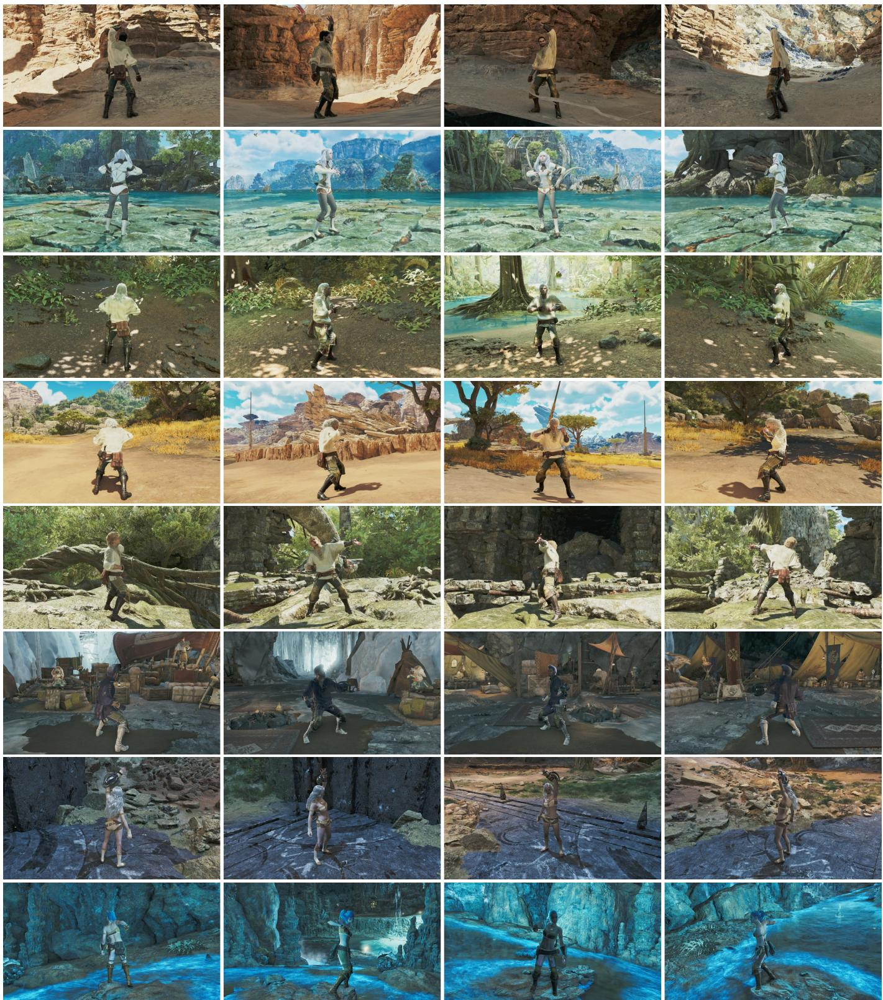  
Fig. 8. Representative MVGameHuman samples. Each row shows one frame from four evenly spaced cameras in a synchronized 24-camera sequence captured with our in-house game data engine. MVGameHuman provides diverse actors, clothing, motions, lighting conditions, virtual scenes, and backgrounds for training multi-view human video generation.

Input Image  
Pose-Driven Video Gen. Multiview Video Gen.  
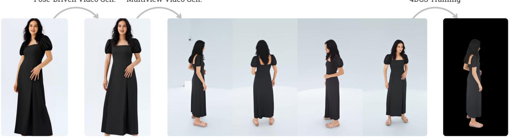  
Source Video  
Target Videos (4 of 16 Cameras)  
4DGS Rendering

4DGS Training

Fig. 9. Single image to 4D avatar. Given a single input image, we first generate a source video via pose-driven video generation (Wan-Animate), then produce multi-view target videos with 4DAnyone, and finally reconstruct a 4DGS avatar via FreeTimeGS.  
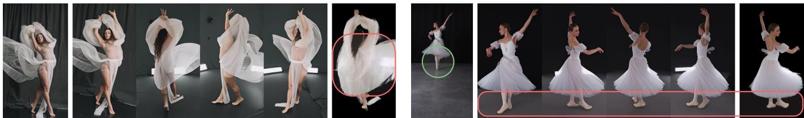  
Fig. 10. Failure cases. Left: skeleton guidance is uninformative for the large flowing fabric, which is generated inconsistently across views and yields a degraded reconstruction (red box). Right: HMR mis-estimates the en-pointe pose (green circle in the source view) as flat feet, and all generated views inherit the pose error (red box).