# ArmorOCR: Grounded Adversarial Visual Perception via Observation-Transferred Self-Distillation

Linhan Cao1,2∗, Siyuan Li1∗, Jun Lan1†, Liangbo He1, Guannan Li1, Xiaolei Huang1, Jun Jia2, Shuheng Zhou1, Huijia Zhu1, Weiqiang Wang1, Wei Sun3†

1Ant Group, 2Shanghai Jiao Tong University, 3East China Normal University

## Abstract

Large multimodal models (LMMs) have demonstrated strong OCR recognition capabilities, yet remain vulnerable to adversarial visual text that is readable to humans but challenging for models to localize and recognize. Existing OCR benchmarks mainly focus on natural or document-style text, while adversarial OCR evaluations remain limited in scale, task coverage, or region-aware evaluation. In this paper, we formulate adversarial OCR as a grounded OCR perception task and introduce AdvSpot, the first benchmark for grounded adversarial OCR evaluation. AdvSpot comprises 390 images with region-level annotations, spanning 5 primary categories and 13 fine-grained adversarial OCR types. To address this challenge, we propose ArmorOCR, a two-stage training framework for robust adversarial OCR perception. ArmorOCR first acquires missing adversarial OCR perception from privileged transformed observations through On-Policy Self-Distillation (OPSD), and then refines grounded OCR perception through Group Relative Policy Optimization (GRPO) with task-conditioned rewards for localization, recognition, full spotting, and visual question answering (VQA). Experiments on our AdvSpot, other adversarial OCR benchmarks, and general OCR benchmarks demonstrate that ArmorOCR consistently improves adversarial OCR perception while preserving competitive general OCR capability.

Code — https://github.com/ant-research/ArmorOCR

## Introduction

OCR is a fundamental capability of large multimodal models (LMMs) (Zhang et al. 2023; Li et al. 2024; Zhu et al. 2025), yet its reliability under challenging visual conditions remains limited (Li, Cai, and Wang 2025; Gao et al. 2025). As illustrated in Figure 1, certain visual text patterns expose a clear human–AI perception gap: humans can easily recover the intended text from visual context, whereas current LMMs may mislocalize, overlook, or misread it. We refer to such patterns as adversarial OCR patterns. These patterns expose systematic weaknesses in LMMs’ visual text perception, underscoring the need for systematic evaluation and targeted model improvement to bridge this gap and develop more robust OCR capabilities.

Existing OCR benchmarks (Liu et al. 2024; Yang et al. 2025; Fu et al. 2026) have advanced general OCR evaluation across diverse natural visual content, but provide limited coverage of adversarial OCR patterns. Recent adversarial OCR benchmarks (Xu et al. 2026; Li et al. 2026) begin to address this setting, but remain limited in scale, task diversity, or region-level annotations. Moreover, recognition-only evaluation provides limited insight into whether a model has identified the relevant text region or merely inferred the answer from global context or linguistic priors.

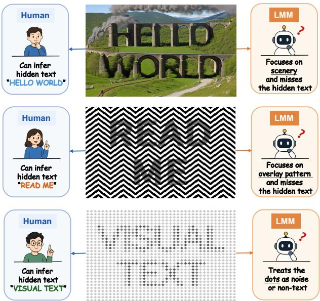  
Figure 1: Examples of adversarial OCR patterns that reveal a human–AI perception gap: humans can easily recover the intended text from visual context, while current LMMs may mislocalize, overlook, or misread it.

Motivated by this limitation, we formulate adversarial OCR as a grounded OCR perception task, where models are expected to identify relevant text regions, recognize adversarial text content, and answer region-specific questions under challenging visual conditions. This formulation supports region-level verification and more fine-grained analysis of adversarial OCR failures.

To instantiate this formulation, we introduce AdvSpot, the first benchmark for grounded adversarial OCR perception. AdvSpot provides the most comprehensive perception taxonomy of adversarial OCR patterns to date, covering 5 primary categories and 13 fine-grained types organized according to their underlying OCR failure mechanisms. It contains 390 images with region-level annotations, including bounding boxes, text transcriptions, category labels, and grounded visual question answering (VQA) pairs. Together, these annotations enable systematic evaluation of grounded adversarial OCR perception with respect to localization, recognition, and region-specific question answering.

Recent approaches (Xu et al. 2026; Li, Cai, and Wang 2025) to adversarial OCR perception rely on “thinking-withimages” strategies (Hong et al. 2025; Song et al. 2025), applying transformations such as cropping, resizing, or flipping at inference time to reveal adversarial text that is dificult to perceive from the original view. Although efective, these approaches introduce additional inference latency and deployment complexity, motivating us to ask: Can the perceptual information revealed by transformed views be internalized into model parameters during training?

To answer this question, we propose ArmorOCR, a twostage training framework that internalizes transformationrevealed visual evidence for single-pass grounded adversarial OCR perception, without requiring additional visual transformations or tools at inference time. In Stage 1, we perform On-Policy Self-Distillation (OPSD) with responseregion-aware token weighting: the student observes only the original image, while a teacher with the same backbone is conditioned on privileged transformed views. Token-level distribution guidance along the student’s on-policy trajectories transfers the perception revealed by privileged observations to the student, establishing a robust perceptual foundation. However, self-distillation remains constrained by the teacher’s performance ceiling and lacks explicit optimization of diverse grounded OCR objectives. Stage 2 therefore employs Group Relative Policy Optimization (GRPO) with task-conditioned rewards for localization, recognition, full spotting, and grounded VQA to jointly optimize these complementary capabilities.

Our contributions are summarized as follows:

• We introduce AdvSpot, the first benchmark for grounded adversarial OCR perception, with the most comprehensive taxonomy of adversarial OCR patterns to date and region-level annotations enabling fine-grained evaluation of adversarial OCR perception.

• We propose ArmorOCR, a two-stage framework that internalizes transformation-revealed perception through privileged observation transfer and refines grounded OCR perception with task-conditioned GRPO.

• Extensive experiments on AdvSpot, existing adversarial OCR benchmarks, and general OCR benchmarks demonstrate that ArmorOCR consistently improves adversarial OCR perception while preserving competitive general OCR capability.

## Related Work

## OCR Perception Benchmarks

Existing OCR benchmarks (Singh et al. 2019; Mathew, Karatzas, and Jawahar 2021; Masry et al. 2022; Wang et al.

2024), such as OCRBench (Liu et al. 2024), CCOCR (Yang et al. 2025), and OCRBench-v2 (Fu et al. 2026), evaluate visual text perception across diverse scenarios, including natural scenes, documents, and multilingual content. However, they provide limited coverage of adversarial OCR patterns.

Recent adversarial OCR benchmarks begin to address this gap. AdvOCR (Xu et al. 2026) focuses on adversarial OCR robustness but remains limited in scale and taxonomy, while SmuggleBench (Li et al. 2026) evaluates image-level hidden-text extraction without region grounding or designed question answering. In contrast, our proposed AdvSpot provides bounding boxes, transcriptions, region-grounded VQA and perception-type labels instances under a comprehensive failure-mechanism-based taxonomy.

## Adversarial OCR Perception Methods

Existing approaches to adversarial OCR perception mainly recover dificult visual text at inference time. VACoT (Xu et al. 2026) adopts a “thinking-with-images” paradigm (Chng et al. 2025; Zhang et al. 2025; Zheng et al. 2025b) that dynamically applies visual transformations such as cropping and resizing, while SemVink (Li, Cai, and Wang 2025) shows that zoom-out views can reveal text hidden in AI-generated images. Although efective, these approaches introduce additional inference-time overhead. Li et al. (Li et al. 2026) improve hidden-text extraction through detailed chain-ofthought (CoT) prompting, but such prompt-based strategies require benchmark-specific adaptation. In contrast, our ArmorOCR enables single-pass inference on the original image without additional visual transformations or extended reasoning processes.

## Self-Distillation and Reinforcement Learning

On-policy self-distillation (OPSD) (Zhao et al. 2026) trains the student on its own sampled trajectories, with a teacher equipped with privileged information to provide token-level distribution guidance. Recent multimodal studies (Yuan et al. 2026; Cai et al. 2026; Tian et al. 2026) further extend privileged information from textual to visual representations. For example, Vision-OPD (Yuan et al. 2026) transfers finegrained perception from a crop-conditioned teacher to a fullimage student. ArmorOCR extends this principle to adversarial OCR by transferring perception revealed through multiple transformations from a privileged-view teacher to an original-view student.

Reinforcement learning has been widely used for LMM alignment by optimizing task-specific rewards (Schulman et al. 2017; Guo et al. 2025; Zheng et al. 2025a; Yu et al. 2026), such as GRPO (Guo et al. 2025), which performs policy optimization using relative rewards among multiple sampled responses without requiring an explicit value model. Such reward-driven optimization is suitable for adversarial OCR perception, where localization, recognition, spotting, and grounded answering can be directly optimized through task-specific rewards.

## Benchmark: AdvSpot

AdvSpot advances adversarial OCR benchmarking in three respects. First, it ofers broader and more systematic coverage of adversarial OCR perception types by organizing them according to their underlying failure mechanisms. Second, it introduces fine-grained annotations, including bounding boxes, transcriptions, perception-type labels, and region-grounded VQA pairs. Third, it provides a region-grounded evaluation framework for adversarial OCR perception, enabling more informative assessment beyond recognition-only evaluation. Table 1 compares AdvSpot with existing adversarial OCR benchmarks.

<table><tr><td>Dimension</td><td>AdvOCR</td><td>SmuggleBench</td><td>AdvSpot</td></tr><tr><td># Images</td><td>100</td><td>1,700</td><td>390</td></tr><tr><td># Perception Types</td><td></td><td>6</td><td>13</td></tr><tr><td>BBox Annotations</td><td>x</td><td>x</td><td>√</td></tr><tr><td>Region-aware QA</td><td>x</td><td>x</td><td>√</td></tr></table>

Table 1: Comparison to prior adversarial OCR benchmarks.

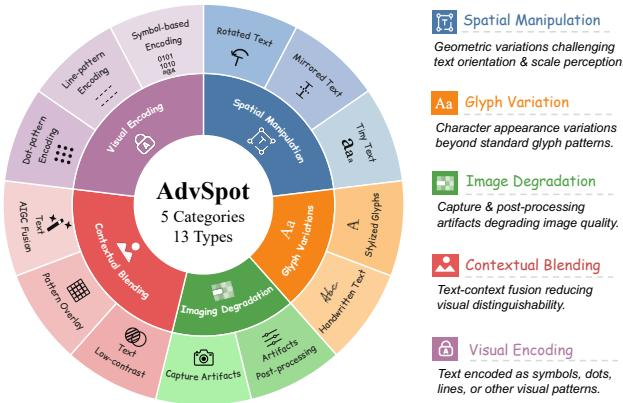  
Figure 2: Perception types of AdvSpot grouped by their underlying failure mechanisms.

## Task Definition

AdvSpot instantiates grounded adversarial OCR perception as a region-grounded VQA task. Each instance is represented as

$$
\boldsymbol { S } = ( x , \mathcal { C } ^ { \star } , b ^ { \star } , t ^ { \star } , q , a ^ { \star } ) ,\tag{1}
$$

where x is an image containing adversarial OCR patterns, ${ \mathcal { C } } ^ { \star }$ is the set of perception-type labels associated with the annotated text region $b ^ { \star }$ , and $t ^ { \star }$ is its transcription. The question q uniquely refers to the region–text pair (b⋆, t⋆) through visual attributes or spatial context, and $a ^ { \star }$ is the corresponding answer.

During evaluation, the model receives only (x, q). Answering correctly requires the model to ground the question to the relevant text region, recognize the adversarial text, and provide a region-specific answer. This formulation enables grounded evaluation of adversarial OCR perception.

## Taxonomy

AdvSpot comprises 5 primary categories and 13 finegrained adversarial OCR types grouped by perceptionfailure mechanisms, as summarized in Figure 2, with detailed definitions and examples provided in Appendix A.1.

## Annotation and QA Construction

We construct AdvSpot through a human-in-the-loop pipeline, as illustrated in Figure 3. We first collect tens of thousands of candidate images potentially containing adversarial OCR patterns. Each image is independently annotated by two annotators with bounding boxes, transcriptions, and perceptiontype labels according to our taxonomy. We retain only regions with consistent annotations from both annotators and discard images without agreed regions. For each retained region, we use Qwen3-VL-235B-A22B-Instruct to generate a regiongrounded question–answer pair conditioned on the image, bounding box, and transcription; the detailed prompt is provided in Appendix A.2. Each QA pair then undergoes two rounds of expert review to correct errors, verify that the question uniquely refers to the target region, and ensure that the answer is consistent with the verified transcription.

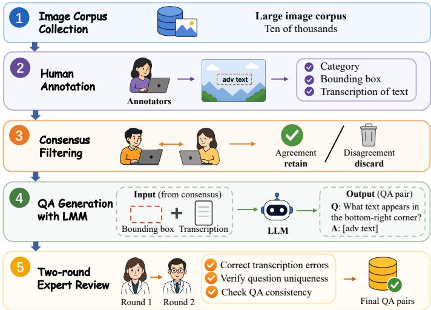  
Figure 3: Human-in-the-loop pipeline of our AdvSpot.

## Evaluation Protocol

We use VQA accuracy as the primary metric. A prediction is considered correct if the complete reference answer appears as a contiguous substring of the model prediction:

$$
\operatorname { A c c } ( \hat { a } , a ^ { \star } ) = \mathbb { I } [ a ^ { \star } \preceq _ { \mathrm { s u b } } \hat { a } ] ,\tag{2}
$$

where u ${ \preceq } _ { \mathrm { s u b } }$ v denotes that u is a contiguous substring of v. This criterion permits additional explanatory content while requiring the complete reference answer.

To directly evaluate region grounding, we additionally compute the intersection over union (IoU) between the predicted bounding box $\hat { b }$ and the ground-truth bounding box $b ^ { \star }$

$$
\operatorname { I o U } ( { \hat { b } } , b ^ { \star } ) = { \frac { \Bigl | { \hat { b } } \cap b ^ { \star } \Bigr | } { \Bigl | { \hat { b } } \cup b ^ { \star } \Bigr | } } .\tag{3}
$$

VQA accuracy evaluates the correctness of region-specific answers, while IoU explicitly measures localization quality. Detailed evaluation prompts are provided in Appendix A.3.

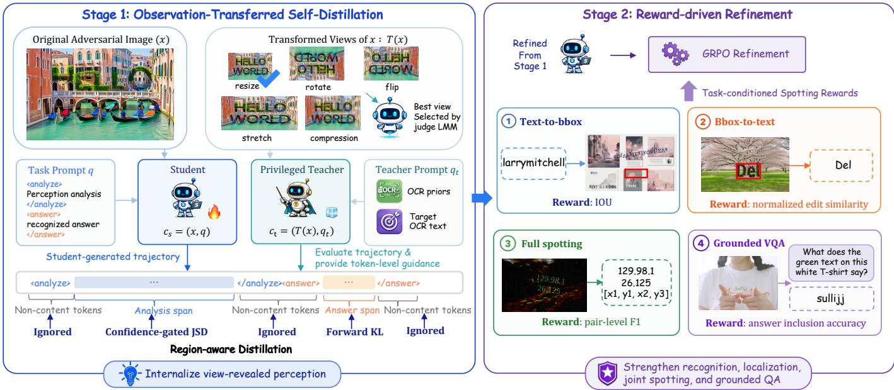  
Figure 4: Overview of ArmorOCR, a two-stage framework for grounded adversarial OCR perception. Stage 1 transfers transformation-induced perception from privileged observations via OPSD, while Stage 2 optimizes grounded OCR perception through task-conditioned GRPO rewards for localization, recognition, full spotting, and grounded $\mathrm { \Delta V \bar { Q } A }$

## Method: ArmorOCR

We propose ArmorOCR (Figure 4), a two-stage framework for adversarial OCR perception via observation transfer and reward-driven refinement. ArmorOCR is based on the observation that adversarial OCR failures arise from two challenges: (1) the original view may hide critical visual cues required to perceive adversarial text, and (2) adversarial perception alone is insuficient for completing grounded OCR tasks that require localization, recognition, and grounded answering. Therefore, ArmorOCR first transfers transformation-revealed perception from privileged observations to the student through OPSD, and then optimizes grounded OCR perception through GRPO with taskconditioned rewards.

## Stage 1: Observation-Transferred Self-Distillation

Motivated by the observation that adversarial OCR dificulty is often view-dependent (Li, Cai, and Wang 2025), we aim to transfer the perceptual advantages revealed by transformed views into the model during training. Building upon OPSD, we propose Observation-Transferred Self-Distillation (OTSD), where a teacher conditioned on privileged transformed views guides the student.

Let x be the original adversarial image and q be the task prompt. The prompt q instructs the model to provide an intermediate perception analysis within <analyze> and </analyze> tags, followed by the final recognized answer within <answer> and </answer> tags. The student is conditioned only on the original image and the task prompt:

$$
c _ { s } = ( x , q ) .\tag{4}
$$

In contrast, the teacher is conditioned on privileged observa-

tions:

$$
c _ { t } = ( T ( x ) , q _ { t } ) ,\tag{5}
$$

where $\tau ( x )$ denotes a transformed view of x. We consider five transformations: resizing, stretching, rotation, flipping, and compression. For each image, the judge LMM, Qwen3- VL-235B-A22B-Instruct, selects the transformed view with the highest recognition accuracy. The teacher prompt $q _ { t }$ further extends q with adversarial OCR priors and the target OCR text, enabling the teacher to understand the adversarial visual pattern and provide reliable token-level answer guidance. Further details are provided in Appendix B.1.

The student first samples an on-policy response:

$$
\hat { y } \sim \pi _ { \theta } ( \cdot \mid c _ { s } ) .\tag{6}
$$

The teacher then evaluates the student-generated trajectory under privileged observations. At token position i, the student and teacher distributions are:

$$
p _ { s } ^ { i } = \pi _ { \theta } ( \cdot \mid c _ { s } , \hat { y } _ { < i } ) , \quad p _ { t } ^ { i } = \pi _ { \theta } ^ { \prime } ( \cdot \mid c _ { t } , \hat { y } _ { < i } ) .\tag{7}
$$

Vanilla OPSD uniformly distills all response tokens, overlooking their distinct roles in the final OCR prediction. Analysis tokens encode potentially uncertain intermediate perception, answer tokens directly determine the transcription, and structural tokens contain no task-relevant content. We therefore introduce a response-region-aware distillation loss, partitioning the response into an analysis span ${ \mathcal { R } } _ { \mathrm { a n a } }$ , an answer span $\bar { \mathcal { R } } _ { \mathrm { a n s } }$ , and non-content structural tokens using predefined tags.

For analysis tokens, uniformly applying distillation may propagate uncertain or noisy intermediate reasoning. We therefore use confidence-gated Jensen–Shannon divergence (JSD) (Lu et al. 2026) to selectively transfer reliable teacher signals:

<table><tr><td rowspan="2">Category</td><td rowspan="2">Subtype</td><td colspan="4">Open-source Qwen3-VL Series</td><td colspan="4">Closed-source Proprietary LMMs</td><td>Our LMM</td></tr><tr><td>8B (Our Base)</td><td>30B- A3B</td><td>32B</td><td>235B- A22B</td><td>Claude- Sonnet-4.5</td><td>GPT-40</td><td>GPT-5</td><td>Gemini- 2.5 Flash</td><td>Armor- OCR</td></tr><tr><td>Imaging</td><td>Capture Artifacts</td><td>56.7</td><td>56.7</td><td>50.0</td><td>56.7</td><td>3.3</td><td>20.0</td><td>30.0</td><td>56.7</td><td>60.0</td></tr><tr><td>Degradation</td><td>Post-processing</td><td>50.0</td><td>63.3</td><td>70.0</td><td>63.3</td><td>26.7</td><td>43.3</td><td>40.0</td><td>76.7</td><td>56.7</td></tr><tr><td>Spatial</td><td>Rotated Text</td><td>53.3</td><td>56.7</td><td>73.3</td><td>53.3</td><td>6.7</td><td>26.7</td><td>30.0</td><td>50.0</td><td>56.7</td></tr><tr><td>Manipulation</td><td>Mirrored Text</td><td>33.3 63.3</td><td>36.7</td><td>33.3</td><td>33.3</td><td>6.7</td><td>13.3 50.0</td><td>23.3 60.0</td><td>26.7 86.7</td><td>60.0</td></tr><tr><td></td><td>Tiny Text</td><td></td><td>63.3</td><td>73.3</td><td>66.7</td><td>50.0</td><td></td><td></td><td></td><td>56.7</td></tr><tr><td>Glyph</td><td>Stylized Glyphs</td><td>36.7</td><td>43.3</td><td>40.0</td><td>46.7</td><td>13.3</td><td>16.7</td><td>43.3</td><td>23.3</td><td>30.0</td></tr><tr><td>Variations</td><td>Handwritten Text</td><td>66.7</td><td>56.7</td><td>63.3</td><td>63.3</td><td>13.3</td><td>33.3</td><td>40.0</td><td>50.0</td><td>63.3</td></tr><tr><td>Visual</td><td>Symbol Encoding</td><td>0.0</td><td>2.5</td><td>0.0</td><td>5.0</td><td>0.0</td><td>20.0</td><td>32.5</td><td>12.5</td><td>52.5</td></tr><tr><td>Encoding</td><td>Dot Encoding</td><td>6.7</td><td>10.0</td><td>6.7</td><td>10.0</td><td>3.3</td><td>20.0</td><td>26.7</td><td>10.0</td><td>53.3</td></tr><tr><td></td><td>Line Encoding</td><td>6.7</td><td>13.3</td><td>3.3</td><td>13.0</td><td>0.0</td><td>20.0</td><td>20.0</td><td>3.3</td><td>60.0</td></tr><tr><td>Contextual</td><td>AIGC Fusion Text</td><td>2.5</td><td>5.0</td><td>10.0</td><td>7.5</td><td>0.0</td><td>0.5</td><td>2.5</td><td>5.0</td><td>75.0</td></tr><tr><td>Blending</td><td>Low Contrast Text</td><td>42.9</td><td>48.6</td><td>51.4</td><td>48.6</td><td>11.4</td><td>31.4</td><td>34.4</td><td>37.1</td><td>51.4</td></tr><tr><td></td><td>Pattern Overlay</td><td>11.4</td><td>11.4</td><td>11.4</td><td>11.4</td><td>0.0</td><td>5.7</td><td>8.6</td><td>8.6</td><td>48.6</td></tr><tr><td>Avg. Acc.</td><td></td><td>31.2</td><td>34.3</td><td>35.3</td><td>34.8</td><td>9.8</td><td>23.2</td><td>30.0</td><td>32.3</td><td>55.7</td></tr><tr><td>Avg. IoU</td><td></td><td>49.1</td><td>50.6</td><td>51.9</td><td>47.5</td><td>10.4</td><td>15.9</td><td>35.0</td><td>28.0</td><td>63.3</td></tr></table>

Table 2: Fine-grained accuracy and average localization IoU on AdvSpot. All values are reported in %. The best and second-best results are highlighted in bold and underlined, respectively. Avg. Acc. and Avg. IoU denote the sample-weighted averages of accuracy and IoU, respectively. Category-wise IoU results are provided in Appendix A.3. The same conventions apply to subsequent tables.

$$
\begin{array} { r } { \mathcal { L } _ { \mathrm { a n a } } ^ { i } = g _ { i } D _ { \mathrm { J S D } } ^ { \beta } ( p _ { t } ^ { i } \Vert p _ { s } ^ { i } ) , \quad i \in \mathcal { R } _ { \mathrm { a n a } } , } \end{array}\tag{8}
$$

where $D _ { \mathrm { J S D } } ^ { \beta }$ denotes the generalized JSD with mixture coeficient $\beta .$ The token-level confidence weight is defined as

$$
g _ { i } = \sigma \left( \gamma \left[ \operatorname* { m a x } _ { k } \log p _ { t } ^ { i } ( k ) - \operatorname* { m a x } _ { k } \log p _ { s } ^ { i } ( k ) \right] \right) ,\tag{9}
$$

where $\sigma ( \cdot )$ is the sigmoid function and $\gamma$ controls the sharpness of the confidence gate. The weight $g _ { i }$ increases when the privileged teacher is more confident than the student, strengthening distillation at positions with reliable teacher guidance while suppressing uncertain signals.

For answer tokens, which directly determine the final OCR transcription, we apply stronger supervision using forward KL divergence:

$$
\begin{array} { r } { \mathcal { L } _ { \mathrm { a n s } } ^ { i } = \mathrm { K L } ( p _ { t } ^ { i } \Vert p _ { s } ^ { i } ) , \quad i \in \mathcal { R } _ { \mathrm { a n s } } . } \end{array}\tag{10}
$$

Conditioned on privileged observations and OCR guidance, the teacher provides a reliable target answer distribution. We assign uniform weights to all answer tokens, as each contributes to the final transcription.

Non-content tokens, such as structural markers, are excluded from the loss because they encode only the output format and do not contribute to adversarial text perception. The resulting objective selectively transfers intermediate perception while imposing direct supervision on the final OCR output:

$$
\mathcal { L } _ { \mathrm { O T S D } } = \frac { \sum _ { i \in \mathcal { R } _ { \mathrm { a n a } } } \mathcal { L } _ { \mathrm { a n a } } ^ { i } + \sum _ { i \in \mathcal { R } _ { \mathrm { a n s } } } \mathcal { L } _ { \mathrm { a n s } } ^ { i } } { \sum _ { i \in \mathcal { R } _ { \mathrm { a n a } } } g _ { i } + \left| \mathcal { R } _ { \mathrm { a n s } } \right| + \epsilon } .\tag{11}
$$

## Stage 2: Reward-driven Refinement

Stage 1 establishes the model’s ability to perceive adversarial text, but teacher-guided distillation remains constrained by teacher supervision and does not directly optimize the diverse objectives required by grounded OCR tasks. We therefore apply GRPO with task-conditioned rewards to align the model with grounded adversarial OCR perception. Specifically, we construct four complementary tasks: text-to-bbox for localization, bbox-to-text for recognition, full spotting for joint region–text prediction, and grounded VQA for regionspecific question answering.

For text-to-bbox, the model performs text-conditioned region localization by predicting the bounding box corresponding to a given text string. The localization reward is defined as the IoU between the predicted and ground-truth bounding boxes:

$$
R _ { \mathrm { t 2 b } } = \mathrm { I o U } ( \hat { b } , b ^ { \star } ) .\tag{12}
$$

For bbox-to-text, the model performs region-conditioned text recognition by predicting the transcription corresponding to a given bounding box. Let tˆand t⋆ denote the predicted and ground-truth transcriptions, respectively. We adopt normalized Levenshtein similarity as the recognition reward:

$$
R _ { \mathrm { b 2 t } } = 1 - \frac { \mathrm { E D } ( \hat { t } , t ^ { \star } ) } { \operatorname* { m a x } ( | \hat { t } | , | t ^ { \star } | ) } ,\tag{13}
$$

where $\operatorname { E D } ( \cdot , \cdot )$ denotes the Levenshtein edit distance.

For full spotting, the model jointly predicts multiple text regions and their corresponding transcriptions. A predicted bbox-text pair is considered a valid match only when both localization and recognition constraints are satisfied:

$$
\mathrm { I o U } ( \hat { b } , b ^ { \star } ) \geq \theta _ { \mathrm { i o u } } , \quad \mathrm { S i m } ( \hat { t } , t ^ { \star } ) \geq 1 - \theta _ { \mathrm { e d i t } } ,\tag{14}
$$

where Sim(·, ·) denotes the normalized Levenshtein similar-${ \mathrm { i t y } } ,$ and $\theta _ { \mathrm { i o u } }$ and $\theta _ { \mathrm { e d i t } }$ are predefined thresholds for localization and recognition matching, respectively. We perform

<table><tr><td rowspan="3">Benchmark</td><td rowspan="3">Task</td><td colspan="4">Open-source Qwen3-VL Series</td><td colspan="2">Closed-source LMMs</td><td colspan="3">Specialized LMMs</td></tr><tr><td>8B (Our Base)</td><td>30B- A3B</td><td>32B</td><td>235B- A22B</td><td>GPT-5</td><td>Gemini- 2.5 Flash</td><td>VACoT</td><td>Smuggle- CoT</td><td>Armor- OCR</td></tr><tr><td rowspan="3">AdvOCR</td><td>Real-world</td><td>30.0</td><td>34.0</td><td>44.0</td><td>44.0</td><td>12.0</td><td>34.0</td><td>62.0</td><td>一</td><td>44.0</td></tr><tr><td>Synthetic</td><td>12.0</td><td>12.0</td><td>8.0</td><td>12.0</td><td>22.0</td><td>12.0</td><td>48.0</td><td>1</td><td>68.0</td></tr><tr><td>Avg.</td><td>21.0</td><td>23.0</td><td>26.0</td><td>28.0</td><td>17.0</td><td>23.0</td><td>55.0</td><td>1</td><td>56.0</td></tr><tr><td rowspan="8">SmuggleBench</td><td>Tiny Text</td><td>26.1</td><td>25.9</td><td>23.6</td><td>25.1</td><td>18.2</td><td>26.3</td><td></td><td>30.2</td><td>33.0</td></tr><tr><td>Occluded Text</td><td>18.2</td><td>23.2</td><td>19.1</td><td>19.6</td><td>9.7</td><td>24.1</td><td></td><td>26.1</td><td>17.5</td></tr><tr><td>Low Contrast</td><td>3.0</td><td>8.8</td><td>3.5</td><td>6.5</td><td>4.0</td><td>12.5</td><td></td><td>8.5</td><td>6.5</td></tr><tr><td>Handwritten</td><td>31.7</td><td>30.4</td><td>29.3</td><td>33.7</td><td>15.8</td><td>15.4</td><td></td><td>31.7</td><td>27.0</td></tr><tr><td>Artistic</td><td>14.1</td><td>14.5</td><td>11.6</td><td>15.6</td><td>11.1</td><td>8.7</td><td></td><td>18.6</td><td>19.0</td></tr><tr><td>AI Illusions</td><td>0.0</td><td>0.3</td><td>0.8</td><td>0.8</td><td>0.3</td><td>0.0</td><td></td><td>0.0</td><td>8.2</td></tr><tr><td>Avg.</td><td>13.3</td><td>14.8</td><td>14.3</td><td>14.6</td><td>8.5</td><td>12.4</td><td></td><td>16.4</td><td>17.1</td></tr><tr><td></td><td></td><td></td><td></td><td></td><td></td><td></td><td></td><td></td><td></td></tr></table>

Table 3: Results on other adversarial OCR benchmarks: AdvOCR and SmuggleBench.

greedy matching between predicted and ground-truth pairs and use pair-level F1 score as the joint spotting reward:

$$
R _ { \mathrm { j o i n t } } = \frac { 2 P R } { P + R } ,\tag{15}
$$

where $P$ and R denote the precision and recall of matched bbox-text pairs.

For grounded VQA, the model answers questions grounded on the annotated adversarial text region. We use normalized answer inclusion as the reward:

$$
R _ { \mathrm { v q a } } = \mathbb { I } [ a ^ { \star } \subseteq { \hat { a } } ] .\tag{16}
$$

Given the sampled response ${ \hat { y } } ,$ its ground-truth target $y ^ { \star }$ and the task type τ, the final reward is defined as:

$$
\begin{array} { r } { R ( y , y ^ { \star } , \tau ) = \left\{ \begin{array} { l l } { R _ { \mathrm { t 2 b } } , } & { \tau = \mathrm { t e x t \_ t o \_ b b o x } , } \\ { R _ { \mathrm { b 2 t } } , } & { \tau = \mathrm { b b o x \_ t o \_ t e x t } , } \\ { R _ { \mathrm { j o i n t } } , } & { \tau = \mathrm { f u l \_ s p o t t i n g } , } \\ { R _ { \mathrm { v q a } } , } & { \tau = \mathrm { v q a } . } \end{array} \right. } \end{array}\tag{17}
$$

## Experiments

## Experimental Setup

Benchmarks. We evaluate models on two groups of benchmarks. For adversarial OCR perception, we evaluate models on our proposed AdvSpot and two existing adversarial OCR-related benchmarks, AdvOCR (Xu et al. 2026) and SmuggleBench (Li et al. 2026). For general OCR perception, we further evaluate on three widely used general OCR benchmarks: CCOCR (Yang et al. 2025), OCRBench (Liu et al. 2024), and OCRBench-v2 (Fu et al. 2026).

Models. We compare open-source and proprietary LMMs. For open-source models, we evaluate the Qwen3-VL series at diferent scales (Bai et al. 2025). For proprietary models, we include Claude-Sonnet-4.5 (Anthropic 2025), GPT-4o (Achiam et al. 2023), GPT-5 (OpenAI 2025) and Gemini-2.5 Flash (Comanici et al. 2025). Additional benchmark results are reported in Appendix A.4. For existing adversarial OCR benchmarks, we also compare benchmark-specific methods: VACoT (Xu et al. 2026) for AdvOCR and Smuggle-CoT (Li et al. 2026) for SmuggleBench1.

Training Details. Due to the scarcity of large-scale adversarial OCR data, we construct automated data synthesis pipelines to generate stage-specific training sets with controllable adversarial patterns. The synthesized training data provide scalable supervision with diverse adversarial patterns, and all evaluations are conducted in a zero-shot setting. Stage 1 uses 50K samples to establish adversarial OCR perception, while Stage 2 uses 70K samples enriched with harder adversarial cases for fine-grained grounded OCR optimization. All evaluations are conducted in a zero-shot setting on AdvSpot and other OCR benchmarks. Detailed data generation procedures are provided in Appendix C.1. ArmorOCR uses Qwen3-VL-8B-Instruct as the backbone. In Stage 1, the teacher model is kept frozen and the student is optimized with the proposed OTSD. In Stage 2, we further optimize the model with GRPO using task-conditioned rewards, with 8 rollout responses sampled per prompt. The hyperparameters $\theta _ { \mathrm { i o u } }$ and $\theta _ { \mathrm { e d i t } }$ in Eq. (14) are set to 0.5 and 0.1, respectively. Both stages are trained on PPU-810E accelerators. Detailed training configurations are provided in Appendix C.2.

Metrics. For AdvSpot, we report VQA accuracy and localization IOU. For AdvOCR, we report pass@1 accuracy evaluated by Qwen3-30B-A3B-2507 (Bai et al. 2025), following its oficial evaluation protocol. For SmuggleBench, we focus on its “Perceptual Blindness” subset, which is most aligned with our task, and report the TER metric introduced in the original paper. For the three general OCR benchmarks, we we adopt the open-source evaluation toolkit VLMEvalKit (Duan et al. 2024), whose results are largely consistent with the official metrics, and report the overall benchmarks scores.

## Performance Analysis

Results on AdvSpot. The results on AdvSpot are presented in Table 2. Both open-source and closed-source LMMs struggle on our benchmark, achieving overall accuracies below 36%. Symbol Encoding and AIGC Fusion Text remain highly challenging, with most models achieving nearly zero accuracy. These failures indicate that current LMMs are still vulnerable to adversarial OCR patterns, especially those involving visual encoding and contextual blending. In contrast, ArmorOCR achieves the best overall performance, improving over its base model by 24.5%. The gain is particularly pronounced on AIGC Fusion Text, where ArmorOCR outperforms the strongest competing model by 65%. ArmorOCR also achieves the highest average localization IoU, indicating its strong capability in both region localization and grounded adversarial OCR perception. Moreover, the mismatch between IoU and accuracy trends across diferent models suggests that answer accuracy alone does not guarantee reliable grounding. For example, Gemini-2.5 Flash achieves competitive accuracy but obtains only 28.0% IoU, 7% lower than GPT-5 despite its lower accuracy. This highlights the importance of jointly evaluating localization and perception for fine-grained analysis of adversarial OCR failures.

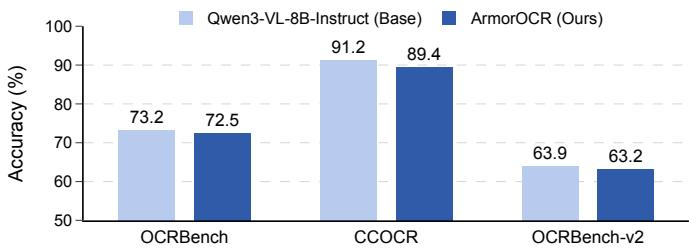  
Figure 5: General OCR capability preservation of ArmorOCR on three standard OCR benchmarks.

Results on Other Adversarial OCR Benchmarks. The results on AdvOCR and SmuggleBench are summarized in Table 3. ArmorOCR achieves the highest average accuracy on both benchmarks. On AdvOCR, ArmorOCR outperforms the tool-assisted VACoT by 20% on the synthetic split, which focuses on more challenging adversarial patterns. On SmuggleBench, ArmorOCR achieves better overall performance than Smuggle-CoT, with a notable gain of 8% on the AI Illusions category, despite the latter relying on a much larger 235B model with detailed CoT prompting. These results demonstrate the efectiveness and robustness of ArmorOCR across diverse adversarial OCR scenarios.

General OCR Capability. A potential concern is that improving adversarial OCR perception may degrade general OCR ability. We therefore evaluate both the base model and ArmorOCR on three general OCR benchmarks. As shown in Figure 5, ArmorOCR maintains comparable performance with the base model across all benchmarks, despite using no additional general OCR training data. This demonstrates that our training strategy improves adversarial OCR robustness while largely preserving general OCR capability.

## Ablation Study

We conduct all ablation studies on AdvSpot, as it provides a comprehensive evaluation setting for grounded adversarial OCR perception. The results are reported in Table 9.

Stage Ablations. We first evaluate the two-stage training design. The full ArmorOCR outperforms both single-stage variants, indicating that Stage 1 and Stage 2 are complementary. Although Stage 2 alone substantially improves localization, it yields only a limited gain in VQA accuracy, highlighting the importance of first internalizing the adversarial OCR perception revealed by transformed views. Building Stage 2 upon Stage 1 further improves accuracy performance by 6.8%, showing that task-conditioned reward optimization efectively translates the perception acquired in Stage 1 into more accurate grounded answers.

<table><tr><td>Stage 1</td><td colspan="4">Stage 2</td><td rowspan="3">IoU</td><td rowspan="3">Acc.</td></tr><tr><td>VT RAD</td><td>Rt2b</td><td>Rb2t</td><td> $\underline { { R } } _ { \mathrm { j o i n t } }$ </td><td> $\underline { { R _ { \mathbf { v q a } } } }$ </td></tr><tr><td colspan="3">Baseline</td><td></td><td></td><td></td></tr><tr><td></td><td></td><td></td><td></td><td></td><td>49.1</td><td>31.2</td></tr><tr><td colspan="7">Stage Ablations</td></tr><tr><td>√ √</td><td></td><td></td><td></td><td></td><td>61.2 58.7</td><td>39.8</td></tr><tr><td>Stage 1 Component Ablations</td><td></td><td></td><td></td><td></td><td></td><td>48.9</td></tr><tr><td colspan="7"></td></tr><tr><td></td><td></td><td></td><td></td><td></td><td>52.2 54.1</td><td>35.3 46.6</td></tr><tr><td colspan="7">Stage 2 Reward Ablations</td></tr><tr><td></td><td></td><td></td><td></td><td></td><td>60.4</td><td>52.1</td></tr><tr><td>√</td><td>√ √</td><td></td><td>√</td><td>√</td><td>61.5</td><td>52.4</td></tr><tr><td>√</td><td>√ √</td><td>√</td><td></td><td>√</td><td>62.8</td><td>53.2</td></tr><tr><td>√</td><td>√ √</td><td>√</td><td>√</td><td></td><td>62.8</td><td>50.1</td></tr><tr><td>V</td><td>√ √</td><td>√</td><td>√</td><td>V</td><td>63.3</td><td>55.7</td></tr></table>

Table 4: Ablation study of ArmorOCR on AdvSpot. VT and RAD denote visual transfer and region-aware distillation.

Stage 1 Component Ablations. We further analyze the two key designs in Stage 1: visual transfer and response-regionaware distillation. Removing visual transfer conditions the teacher only on the original image and privileged textual information, yielding a marginal accuracy improvement of 4.1%, thus indicating that privileged transformed observations provide more efective supervision than textual information alone. Replacing our response-region-aware objective with the standard OPSD JSD loss also degrades performance, demonstrating that importance-guided selective distillation enables more efective knowledge transfer.

Stage 2 Reward Ablations. We finally evaluate the contribution of each task-conditioned reward in Stage 2. Removing any reward leads to a performance drop, showing that recognition, localization, spotting, and VQA objectives each provide useful supervision. Their complementary efects jointly strengthen grounded adversarial OCR perception.

## Conclusion

In this work, we introduced AdvSpot, a grounded adversarial OCR benchmark with a comprehensive taxonomy for evaluating adversarial OCR perception. AdvSpot goes beyond existing OCR benchmarks by focusing on visually manipulated text that is readable to humans but challenging for LMMs. We further proposed ArmorOCR, a two-stage framework for robust grounded adversarial OCR perception. ArmorOCR first internalizes transformation-revealed perception through observation-transferred self-distillation, and then uses task-conditioned GRPO rewards tojointly optimize localization, recognition, spotting, and grounded VQA. Experiments demonstrate that ArmorOCR consistently improves adversarial OCR perception while preserving general OCR capability. We hope AdvSpot and ArmorOCR will facilitate future research on reliable and generalizable visual text perception under challenging conditions.

## References

Achiam, J.; Adler, S.; Agarwal, S.; Ahmad, L.; Akkaya, I.; Aleman, F. L.; Almeida, D.; Altenschmidt, J.; Altman, S.; Anadkat, S.; et al. 2023. Gpt-4 technical report. arXiv preprint arXiv:2303.08774.

Anthropic. 2025. Claude Sonnet 4.5. https://www.anthropic. com/news/claude-sonnet-4-5.

Bai, S.; Cai, Y.; Chen, R.; Chen, K.; Chen, X.; Cheng, Z.; Deng, L.; Ding, W.; Gao, C.; Ge, C.; et al. 2025. Qwen3-vl technical report. arXiv preprint arXiv:2511.21631.

Cai, Y.; Liu, J.; Liu, Y.; Deng, H.; Yao, L.; Zheng, Y.; Ouyang, K.; Li, Z.; Wang, Z.; Sun, X.; et al. 2026. Thinking Without Images: Internalizing Visual Manipulation with On-Policy Self-Distillation. arXiv preprint arXiv:2606.08719.

Chng, Y. X.; Hu, T.; Tong, W.; Li, X.; Chen, J.; Yu, H.; Lu, J.; Guo, H.; Deng, H.; Xie, C.; et al. 2025. SenseNova-MARS: Empowering Multimodal Agentic Reasoning and Search via Reinforcement Learning. arXiv preprint arXiv:2512.24330.

Comanici, G.; Bieber, E.; Schaekermann, M.; Pasupat, I.; Sachdeva, N.; Dhillon, I.; Blistein, M.; Ram, O.; Zhang, D.; Rosen, E.; et al. 2025. Gemini 2.5: Pushing the frontier with advanced reasoning, multimodality, long context, and next generation agentic capabilities. arXiv preprint arXiv:2507.06261.

Duan, H.; Yang, J.; Qiao, Y.; Fang, X.; Chen, L.; Liu, Y.; Dong, X.; Zang, Y.; Zhang, P.; Wang, J.; et al. 2024. Vlmevalkit: An open-source toolkit for evaluating large multi-modality models. In Proceedings of the 32nd ACM International Conference on Multimedia, 11198–11201.

Fu, L.; Kuang, Z.; Song, J.; Huang, M.; Yang, B.; Li, Y.; Zhu, L.; Luo, Q.; Wang, X.; Lu, H.; et al. 2026. Ocrbench v2: An improved benchmark for evaluating large multimodal models on visual text localization and reasoning. Advances in Neural Information Processing Systems, 38.

Gao, H.; Huang, Z.; Xu, L.; Tang, J.; Li, X.; Liu, Y.; Li, H.; Hu, T.; Lin, M.; Yang, X.; et al. 2025. Pixels, patterns, but no poetry: To see the world like humans. arXiv preprint arXiv:2507.16863.

Guo, D.; Yang, D.; Zhang, H.; Song, J.; Wang, P.; Zhu, Q.; Xu, R.; Zhang, R.; Ma, S.; Bi, X.; et al. 2025. Deepseek-r1: Incentivizing reasoning capability in llms via reinforcement learning. arXiv preprint arXiv:2501.12948.

Hong, J.; Zhao, C.; Zhu, C.; Lu, W.; Xu, G.; and Yu, X. 2025. Deepeyesv2: Toward agentic multimodal model. arXiv preprint arXiv:2511.05271.

Li, B.; Zhang, Y.; Guo, D.; Zhang, R.; Li, F.; Zhang, H.; Zhang, K.; Zhang, P.; Li, Y.; Liu, Z.; et al. 2024. Llava-onevision: Easy visual task transfer. arXiv preprint arXiv:2408.03326.

Li, S.; Cai, Y.; and Wang, Y. 2025. SemVink: Advancing VLMs’ Semantic Understanding of Optical Illusions via Visual Global Thinking. In Proceedings ofthe 2025 Conference on Empirical Methods in Natural Language Processing, 27155–27165.

Li, Z.; Ma, Z.; Pan, Y.; Zhang, Z.; Lv, X.; Li, B.; Gao, J.; Zhang, J.; Yuan, C.; Li, B.; et al. 2026. Making mllms blind:

Adversarial smuggling attacks in mllm content moderation. In Findings of the Association for Computational Linguistics: ACL 2026, 20142–20161.

Liu, Y.; Li, Z.; Huang, M.; Yang, B.; Yu, W.; Li, C.; Yin, X.-C.; Liu, C.-L.; Jin, L.; and Bai, X. 2024. Ocrbench: on the hidden mystery of ocr in large multimodal models. Science China Information Sciences, 67(12): 220102.

Lu, Z.; Yao, Z.; Han, Z.; Wang, Z.-H.; Wu, J.; Gu, Q.; Cai, X.; Lu, W.; Xiao, J.; Zhuang, Y.; et al. 2026. Self-distilled agentic reinforcement learning. arXiv preprint arXiv:2605.15155.

Masry, A.; Tan, J. Q.; Joty, S.; Hoque, E.; et al. 2022. Chartqa: A benchmark for question answering about charts with visual and logical reasoning. In Findings of the association for computational linguistics: ACL 2022, 2263–2279.

Mathew, M.; Karatzas, D.; and Jawahar, C. 2021. Docvqa: A dataset for vqa on document images. In Proceedings of the IEEE/CVF winter conference on applications of computer vision, 2200–2209.

OpenAI. 2025. GPT-5. https://openai.com/gpt-5/.

Schulman, J.; Wolski, F.; Dhariwal, P.; Radford, A.; and Klimov, O. 2017. Proximal policy optimization algorithms. arXiv preprint arXiv:1707.06347.

Singh, A.; Natarajan, V.; Shah, M.; Jiang, Y.; Chen, X.; Batra, D.; Parikh, D.; and Rohrbach, M. 2019. Towards vqa models that can read. In Proceedings of the IEEE/CVF conference on computer vision and pattern recognition, 8317–8326.

Song, Q.; Li, H.; Yu, Y.; Zhou, H.; Yang, L.; Bai, S.; She, Q.; Huang, Z.; and Zhao, Y. 2025. CodeDance: A Dynamic Toolintegrated MLLM for Executable Visual Reasoning. arXiv preprint arXiv:2512.17312.

Tian, K.; Liu, S.; Yan, Z.; Xia, S.; Dong, S.; and Wang, Y. 2026. ViCuR: Visual Cues as Recoverable Privilege for Multimodal On-Policy Distillation. arXiv preprint arXiv:2606.05718.

Wang, Z.; Xia, M.; He, L.; Chen, H.; Liu, Y.; Zhu, R.; Liang, K.; Wu, X.; Liu, H.; Malladi, S.; et al. 2024. Charxiv: Charting gaps in realistic chart understanding in multimodal llms. In The Thirty-eight Conference on Neural Information Processing Systems Datasets and Benchmarks Track.

Xu, Z.; Sun, C.; Du, S.; Li, C.; Lyu, J.; and Yuan, C. 2026. Vacot: Rethinking visual data augmentation with vlms. In Proceedings of the IEEE/CVF Conference on Computer Vision and Pattern Recognition, 9780–9790.

Yang, Z.; Tang, J.; Li, Z.; Wang, P.; Wan, J.; Zhong, H.; Liu, X.; Yang, M.; Wang, P.; Bai, S.; et al. 2025. Cc-ocr: A comprehensive and challenging ocr benchmark for evaluating large multimodal models in literacy. In Proceedings of the IEEE/CVF International Conference on Computer Vision, 21744–21754.

Yu, Q.; Zhang, Z.; Zhu, R.; Yuan, Y.; Zuo, X.; Yue, Y.; Dai, W.; Fan, T.; Liu, G.; Liu, L.; et al. 2026. Dapo: An opensource llm reinforcement learning system at scale. Advances in Neural Information Processing Systems, 38: 113222– 113244.

Yuan, Q.; Lou, J.; Yu, X.; Lin, H.; Sun, L.; Han, X.; and Lu, Y. 2026. Vision-opd: Learning to see fine details for multimodal llms via on-policy self-distillation. arXiv preprint arXiv:2605.18740.

Zhang, P.; Dong, X.; Wang, B.; Cao, Y.; Xu, C.; Ouyang, L.; Zhao, Z.; Duan, H.; Zhang, S.; Ding, S.; et al. 2023. Internlm-xcomposer: A vision-language large model for advanced text-image comprehension and composition. arXiv preprint arXiv:2309.15112.

Zhang, Y.; Lu, X.; Yin, S.; Fu, C.; Chen, W.; Hu, X.; Wen, B.; Jiang, K.; Liu, C.; Zhang, T.; et al. 2025. Thyme: Think beyond images. In NeurIPS 2025 Fourth Workshop on Deep Learning for Code.

Zhao, S.; Xie, Z.; Liu, M.; Huang, J.; Pang, G.; Chen, F.; and Grover, A. 2026. Self-Distilled Reasoner: On-Policy Self-Distillation for Large Language Models. arXiv preprint arXiv:2601.18734.

Zheng, C.; Liu, S.; Li, M.; Chen, X.-H.; Yu, B.; Gao, C.; Dang, K.; Liu, Y.; Men, R.; Yang, A.; et al. 2025a. Group sequence policy optimization. arXiv preprint arXiv:2507.18071.

Zheng, Z.; Yang, M.; Hong, J.; Zhao, C.; Xu, G.; Yang, L.; Shen, C.; and Yu, X. 2025b. Deepeyes: Incentivizing" thinking with images" via reinforcement learning. arXiv preprint arXiv:2505.14362.

Zhu, J.; Wang, W.; Chen, Z.; Liu, Z.; Ye, S.; Gu, L.; Tian, H.; Duan, Y.; Su, W.; Shao, J.; et al. 2025. Internvl3: Exploring advanced training and test-time recipes for open-source multimodal models. arXiv preprint arXiv:2504.10479.

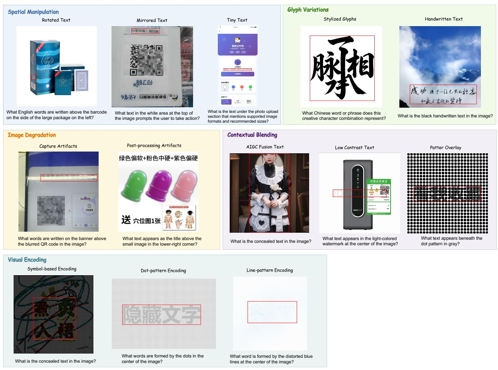  
Figure 6: Representative examples of the 5 primary categories and 13 fine-grained subtypes in AdvSpot. Each example includes a grounded VQA pair for region-level adversarial OCR perception evaluation.

# ArmorOCR: Grounded Adversarial Visual Perception via Observation-Transferred Self-Distillation Supplementary Material

## More Details of our Benchmark

## Detailed Definition of each Taxonomy

Our taxonomy is organized according to the underlying OCR failure mechanisms. Specifically, AdvSpot categorizes adversarial OCR patterns into 5 primary categories and 13 fine-grained subtypes, as detailed below.

• Spatial Manipulation. This category contains adversarial patterns that alter the spatial layout or geometric properties of text, making localization and recognition more challenging.

– Rotated Text. Text is rotated with arbitrary orientations or perspective distortions, requiring the model to recognize text under diverse geometric transformations.

– Mirrored Text. Text is horizontally or vertically flipped, violating the normal reading direction.

– Tiny Text. The text occupies only a very small portion of the image, making it dificult to localize and recognize.

• Glyph Variations. This category modifies the appearance of characters while preserving their semantic meaning.

<table><tr><td>Category</td><td>Subtype</td><td>Number of Samples</td></tr><tr><td rowspan="3">Spatial Manipulation</td><td>Rotated Text</td><td>30</td></tr><tr><td>Mirrored Text</td><td>30</td></tr><tr><td>Tiny Text</td><td>30</td></tr><tr><td rowspan="2">Glyph Variations</td><td>Stylized Glyphs</td><td>30</td></tr><tr><td>Handwritten Text</td><td>30</td></tr><tr><td rowspan="2">Image Degradation</td><td>Capture Artifacts</td><td>30</td></tr><tr><td>Post-processing Artifacts</td><td>30</td></tr><tr><td rowspan="3">Contextual Blending</td><td>AIGC Fusion Text</td><td>40</td></tr><tr><td>Low Contrast Text</td><td>35</td></tr><tr><td>Pattern Overlay</td><td>35</td></tr><tr><td rowspan="3">Visual Encoding</td><td>Symbol-based Encoding</td><td>40</td></tr><tr><td>Dot-pattern Encoding</td><td>30</td></tr><tr><td>Line-pattern Encoding</td><td>30</td></tr></table>

Table 5: Distribution of AdvSpot samples across the 5 primary categories and 13 fine-grained subtypes.

– Stylized Glyphs. Characters are intentionally distorted through stroke splitting, occlusion, truncation, or other artistic modifications while remaining readable to humans.

– Handwritten Text. Non-standard handwritten characters exhibiting connected strokes, exaggerated deformation, or irregular writing styles.

• Image Degradation. This category reduces OCR performance through imaging artifacts introduced during image acquisition or post-processing.

– Capture Artifacts. Imaging degradations caused during acquisition, such as motion blur, reflections, film grain, over-/under-exposure, or excessive filtering.

– Post-processing Artifacts. Image quality degradation introduced after capture, including blur, compression artifacts, additive noise, and other image processing operations.

• Contextual Blending. This category conceals text by reducing its visual distinguishability from the surrounding context.

– AIGC Fusion Text. AI-generated images seamlessly blend text with surrounding visual content, making text boundaries dificult to distinguish.

– Low Contrast Text. Text exhibits low contrast with its background due to similar colors or high transparency.

– Pattern Overlay. Lines, dot patterns, textures, or other visual patterns are superimposed on text, interfering with character perception.

• Visual Encoding. This category encodes textual information into non-standard visual patterns instead of conventional glyphs.

– Symbol-based Encoding. Characters are represented through the spatial arrangement of symbols or special characters.

– Dot-pattern Encoding. Characters are encoded using the positions, sizes, or densities of dot patterns.

– Line-pattern Encoding. Characters are encoded through line orientation, length, width, or connectivity.

Figure 6 presents representative examples for each fine-grained subtype in our taxonomy. These examples illustrate the diverse adversarial OCR patterns covered by AdvSpot and highlight the distinct visual challenges introduced by diferent failure mechanisms.

Table 5 summarizes the distribution of AdvSpot across diferent taxonomy categories and fine-grained subtypes. Counts are computed at the adversarial pattern level, where a single image or VQA instance may contain multiple adversarial patterns. AdvSpot contains 390 images with 397 grounded VQA pairs in total.

## Detailed Construction of VQA Pairs

For each retained text region, we construct a grounded visual question answering (VQA) pair using Qwen3-VL-235B-A22B-Instruct. The model receives the original image together with the target bounding box and its OCR transcription as privileged information, and is instructed to generate a question whose unique answer is exactly the provided transcription.

As shown in Figure 7, the prompt explicitly requires the generated question to (1) uniquely identify the target region using visual attributes (e.g., object category, color, shape, size, or relative position), (2) avoid any ambiguity with other text regions in the image, (3) never expose the OCR transcription or bounding-box coordinates in the question itself, and (4) ensure that the provided transcription is the only correct answer. These constraints encourage visually grounded questions that require both accurate localization and text recognition, while preventing shortcuts based on coordinate information or answer leakage.

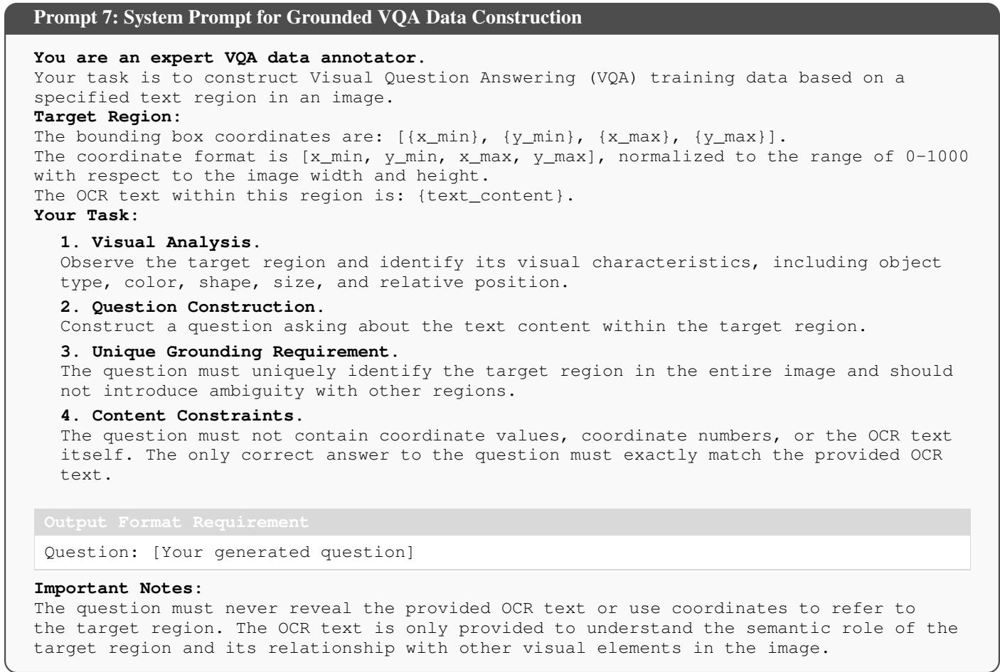  
Figure 7: The system prompt used for constructing grounded VQA training data.

## Detailed Testing Prompt

Figure 8 presents the testing prompt used throughout all experiments. Given a grounded VQA question, the model is instructed to output the recognized text and its corresponding bounding box in a predefined JSON format. The bounding box coordinates are normalized to the range of 0–1000 with respect to the image size.

## More Experiments on AdvSpot

To provide a more comprehensive evaluation, we report the complete benchmarking results on AdvSpot across an expanded collection of both open-source and proprietary LMMs. Specifically, Table 6 presents the localization IoU results, while Table 7 reports the corresponding grounded VQA accuracy.

Prompt 2: Detailed Testing Prompt for Grounded OCR Perception Evaluation   
Please output the answer and the corresponding text bounding box in JSON format:   
{"text":"answer content","bbox":[x\_min,y\_min,x\_max,y\_max]}   
The coordinate values are in the range of 0-1000.

Figure 8: The testing prompt used for grounded OCR perception evaluation.
<table><tr><td rowspan="2">Model Name</td><td colspan="2">1</td><td colspan="3"></td><td colspan="2">3</td><td colspan="3">4</td><td colspan="3">5</td><td rowspan="2">Overall</td></tr><tr><td>1-1</td><td>1-2</td><td>2-1</td><td>2-2</td><td>2-3</td><td>3-1</td><td>3-2</td><td>4-1</td><td>4-2</td><td>4-3</td><td>5-1</td><td>5-2</td><td>5-3</td></tr><tr><td colspan="10">OpenAI GPT Family</td><td></td><td></td><td></td><td></td><td></td></tr><tr><td>GPT-40</td><td>5.3</td><td>11.6</td><td>3.5</td><td>8.1</td><td>4.3</td><td>26.0</td><td>17.1</td><td>27.8</td><td>30.0</td><td>19.4</td><td>8.8</td><td>13.3</td><td>23.3</td><td>15.9</td></tr><tr><td>GPT-5</td><td>16.0</td><td>22.8</td><td>19.9</td><td>19.6</td><td>11.7</td><td>55.8</td><td>40.0</td><td>54.8</td><td>51.9</td><td>48.2</td><td>20.4</td><td>23.6</td><td>52.1</td><td>35.0</td></tr><tr><td>GPT-5.1 GPT-5.4</td><td>13.3 20.8</td><td>20.9 27.8</td><td>16.5 22.5</td><td>24.3 27.4</td><td>10.3 11.0</td><td>41.0 56.3</td><td>39.0 37.0</td><td>39.2 61.1</td><td>47.8 46.9</td><td>46.7 54.1</td><td>25.1 25.4</td><td>13.2 14.0</td><td>44.3 38.4</td><td>30.1</td></tr><tr><td colspan="10"></td><td></td><td></td><td></td><td></td><td>34.5</td></tr><tr><td>Google Gemini Family</td><td></td><td></td><td></td><td></td><td></td><td></td><td></td><td></td><td></td><td></td><td></td><td></td><td></td><td></td></tr><tr><td>Gemini-2.5-Flash Gemini-2.5-Pro</td><td>15.2 23.7</td><td>22.9 31.6</td><td>14.2 25.4</td><td>12.2</td><td>18.0</td><td>46.0</td><td>34.8</td><td>30.4</td><td>47.2</td><td>41.8</td><td>15.4</td><td>22.1</td><td>40.3 52.0</td><td>28.0</td></tr><tr><td>Gemini-3-Flash</td><td>67.2</td><td>68.3</td><td>55.6</td><td>21.6 62.5</td><td>15.9 50.5</td><td>55.5 70.1</td><td>45.9 80.9</td><td>40.9 42.8</td><td>49.1 70.9</td><td>51.4 78.9</td><td>22.3 45.6</td><td>28.4 56.5</td><td>73.5</td><td>36.2 63.0</td></tr><tr><td>Gemini-3.5-Flash</td><td>21.7</td><td>28.3</td><td>21.0</td><td>23.1</td><td>15.6</td><td>44.9</td><td>44.4</td><td>45.6</td><td>60.9</td><td>74.2</td><td>42.0</td><td>18.7</td><td>71.3</td><td>40.5</td></tr><tr><td colspan="10">Anthropic Claude Family</td><td></td><td></td><td></td><td></td><td></td></tr><tr><td>Claude-Haiku-4.5</td><td>3.7</td><td>7.2</td><td>1.1</td><td>6.0</td><td></td><td></td><td></td><td></td><td></td><td></td><td></td><td></td><td></td><td></td></tr><tr><td>Claude-Sonnet-4.5</td><td>4.8</td><td>9.7</td><td>10.3</td><td>12.1</td><td>6.0 0.0</td><td>22.2 32.3</td><td>6.3 19.8</td><td>16.5 3.2</td><td>21.2 4.0</td><td>24.5 11.7</td><td>16.1 5.8</td><td>6.3 6.0</td><td>22.0 12.9</td><td>12.8 10.4</td></tr><tr><td>Claude-Opus-4.5</td><td>4.0</td><td>8.1</td><td>4.1</td><td>7.8</td><td>4.7</td><td>12.5</td><td>13.7</td><td>16.3</td><td>19.6</td><td>26.0</td><td>16.7</td><td>5.1</td><td>25.1</td><td>13.1</td></tr><tr><td colspan="10">Moonshot Family</td><td></td><td></td><td></td><td></td><td></td></tr><tr><td>Kimi-K2.5</td><td>36.9</td><td>39.8</td><td>41.4</td><td>39.4</td><td></td><td></td><td></td><td></td><td></td><td></td><td></td><td></td><td></td><td></td></tr><tr><td>Kimi-K2.6</td><td>38.3</td><td>37.0</td><td>41.4</td><td>48.1</td><td>62.7 39.3</td><td>73.6 72.8</td><td>51.9 59.9</td><td>28.9 28.2</td><td>48.3 40.9</td><td>51.6 42.2</td><td>12.3 12.3</td><td>41.0 45.3</td><td>44.4 41.9</td><td>41.6 41.1</td></tr><tr><td colspan="10">Zhipu Family</td><td></td><td></td><td></td><td></td><td></td></tr><tr><td>GLM-4.5V</td><td>40.2</td><td></td><td>41.6</td><td></td><td></td><td></td><td></td><td></td><td></td><td></td><td></td><td></td><td></td><td></td></tr><tr><td>GLM-4.6V</td><td>37.1</td><td>37.8 39.5</td><td>45.1</td><td>52.1 57.0</td><td>42.4 44.7</td><td>68.7 71.4</td><td>75.8 73.0</td><td>30.5 37.2</td><td>66.7 63.8</td><td>63.6 68.1</td><td>23.6 25.8</td><td>43.9 49.6</td><td>52.7 58.8</td><td>48.8 51.0</td></tr><tr><td colspan="10">Alibaba Qwen Family</td><td colspan="7"></td></tr><tr><td colspan="10">Qwen3 Series</td><td colspan="7"></td></tr><tr><td colspan="10">Qwen3-VL-8B-Instruct</td><td colspan="7"></td></tr><tr><td>Qwen3-VL-30B-A3B-Instruct</td><td>62.0</td><td>46.0</td><td>61.7</td><td>55.9</td><td>44.5</td><td>77.9</td><td>83.2</td><td>9.9</td><td>37.1</td><td>44.9</td><td>28.4</td><td>57.6</td><td>48.4</td><td>49.1</td></tr><tr><td>Qwen3-VL-32B-Instruct</td><td>64.8</td><td>51.6</td><td>58.3</td><td>48.7</td><td>48.8</td><td>72.2</td><td>79.7</td><td>14.7</td><td>49.6</td><td>57.0</td><td>18.3</td><td>57.8</td><td>60.2</td><td>50.6</td></tr><tr><td>Qwen3-VL-235B-A22B-Instruct</td><td>70.4 55.1</td><td>48.9 37.5</td><td>70.5 58.2</td><td>60.5 51.1</td><td>51.9 44.5</td><td>86.0 77.9</td><td>86.9 82.1</td><td>13.7 18.5</td><td>42.5 26.1</td><td>39.8 39.3</td><td>18.9 29.1</td><td>63.2</td><td>50.4 50.3</td><td>51.9 47.5</td></tr><tr><td colspan="10"></td><td colspan="3"></td><td colspan="3">57.1</td></tr><tr><td>Qwen3.5 Series</td><td></td><td></td><td></td><td></td><td></td><td></td><td></td><td></td><td></td><td></td><td></td><td></td><td></td><td></td></tr><tr><td>Qwen3.5-35B-A3B Qwen3.5-122B-A10B</td><td>24.9 38.3</td><td>17.8</td><td>27.7</td><td>44.2</td><td>22.8</td><td>55.0</td><td>44.2</td><td>24.6</td><td>32.6</td><td>36.6</td><td>15.7</td><td>27.1</td><td>29.6 37.7</td><td>30.6 38.5</td></tr><tr><td>Qwen3.5-397B-A17B</td><td>47.0</td><td>22.4 32.8</td><td>34.5 46.6</td><td>48.6 51.1</td><td>33.4 49.0</td><td>57.0 71.7</td><td>57.8 61.0</td><td>32.9 41.5</td><td>37.7 51.3</td><td>45.1 48.5</td><td>19.6 23.6</td><td>38.4 45.8</td><td>40.4</td><td>47.0</td></tr><tr><td colspan="10">Our Proposed Method</td><td colspan="7"></td></tr><tr><td>ArmorOCR</td><td>53.0</td><td>40.0</td></table>

Table 6: Localization IOU results of our AdvSpot benchmark across the expanded model zoo. Accuracy results over five main categories and their subcategories. Category legend: 1 = Imaging Degradation (1-1: Capture Artifacts; 1-2: Post-processing Artifacts); 2 = Spatial Manipulation (2-1: Rotated Text; 2-2: Mirrored Text; 2-3: Tiny Text); 3 = Glyph Variations (3-1: Stylized Glyphs; 3-2: Handwritten Text); 4 = Visual Encoding (4-1: Symbol-based Encoding; 4-2: Dot-pattern Encoding; 4-3: Line pattern Encoding); 5 = Contextual Blending (5-1: AIGC Fusion Text; 5-2: Low Contrast Text; 5-3: Pattern Overlay).

## More Details of Method

## More Details of Stage 1

Figure 9 and 10 illustrates two representative training examples of Observation-Transferred Self-Distillation (OTSD). In each example, the student receives only the original adversarial image together with the task prompt, while the teacher is conditioned on an additional privileged transformed observation. Among multiple transformed views, the view with the highest recognition accuracy selected by the judge LMM is provided to the teacher as the privileged observation.

Beyond the transformed view, the teacher prompt q incorporates additional privileged textual information, including adversarial OCR priors and the ground-truth OCR text. The adversarial OCR priors describe the construction process of synthetic adversarial patterns introduced in Section , providing the teacher with contextual knowledge about the visual perturbations and

<table><tr><td rowspan="2">Model Name</td><td colspan="2">1</td><td colspan="3"></td><td colspan="2">3</td><td colspan="3"></td><td colspan="3">5</td><td rowspan="2">Overall</td></tr><tr><td>1-1</td><td>1-2</td><td>2-1</td><td>2-2</td><td>2-3</td><td>3-1</td><td>3-2</td><td>4-1</td><td>4-2</td><td>4-3</td><td>5-1</td><td>5-2</td><td>5-3</td></tr><tr><td colspan="10">OpenAI GPT Family</td><td></td><td></td><td></td><td></td><td></td></tr><tr><td>GPT-40</td><td>20.0</td><td>43.3</td><td>26.7</td><td>13.3</td><td>50.0</td><td>16.7</td><td>33.3</td><td>20.0</td><td>20.0</td><td>20.0</td><td>0.5</td><td>31.4</td><td>5.7</td><td>23.2</td></tr><tr><td>GPT-5</td><td>30.0</td><td>40.0</td><td>30.0</td><td>23.3</td><td>60.0</td><td>43.3</td><td>40.0</td><td>32.5</td><td>26.7</td><td>20.0</td><td>2.5</td><td>34.4</td><td>8.6</td><td>30.0</td></tr><tr><td>GPT-5.1</td><td>30.0 23.3</td><td>43.3 46.7</td><td>26.7 23.3</td><td>6.7</td><td>53.3</td><td>26.7</td><td>33.3</td><td>27.5</td><td>23.3</td><td>26.7</td><td>5.0</td><td>31.4</td><td>2.9</td><td>25.9</td></tr><tr><td>GPT-5.4</td><td></td><td></td><td></td><td>13.3</td><td>36.7</td><td>13.3</td><td>20.0</td><td>0.0</td><td>3.3</td><td>3.3</td><td>0.0</td><td>28.6</td><td>5.7</td><td>16.1</td></tr><tr><td colspan="10">Google Gemini Family</td><td></td><td></td><td></td><td></td><td></td></tr><tr><td>Gemini-2.5-Flash</td><td>56.7</td><td>76.7</td><td>50.0</td><td>26.7</td><td>86.7</td><td>23.3</td><td>50.0</td><td>12.5</td><td>10.0</td><td>3.3</td><td>5.0</td><td>37.1</td><td>8.6</td><td>32.3</td></tr><tr><td>Gemini-2.5-Pro</td><td>63.3</td><td>80.0</td><td>60.0</td><td>36.7</td><td>83.3</td><td>33.3</td><td>60.0</td><td>12.5</td><td>20.0</td><td>10.0</td><td>7.5</td><td>40.0</td><td>12.5</td><td>37.3</td></tr><tr><td>Gemini-3-Flash</td><td>73.3</td><td>80.0</td><td>76.7</td><td>40.0</td><td>93.3</td><td>63.3</td><td>70.0</td><td>5.0</td><td>16.7</td><td>20.0</td><td>7.5</td><td>62.9</td><td>20.0</td><td>45.6</td></tr><tr><td>Gemini-3.5-Flash</td><td>63.3</td><td>80.0</td><td>63.3</td><td>26.7</td><td>80.0</td><td>70.0</td><td>70.0</td><td>7.5</td><td>20.0</td><td>16.7</td><td>7.5</td><td>60.0</td><td>17.1</td><td>42.6</td></tr><tr><td colspan="10">Anthropic Claude Family</td><td colspan="3"></td><td colspan="3"></td></tr><tr><td>Claude-Haiku-4.5</td><td>3.3</td><td>16.7</td><td>3.3</td><td>0.0</td><td>26.7</td><td>6.7</td><td>3.3</td><td>0.0</td><td>0.0</td><td>0.0</td><td>0.0</td><td>8.6</td><td>0.0</td><td>5.0</td></tr><tr><td>Claude-Sonnet-4.5</td><td>3.3</td><td>26.7</td><td>6.7</td><td>6.7</td><td>50.0</td><td>13.3</td><td>13.3</td><td>0.0</td><td>3.3</td><td>0.0</td><td>0.0</td><td>11.4</td><td>0.0</td><td>9.8</td></tr><tr><td>Claude-Opus-4.5</td><td>33.3</td><td>50.0</td><td>30.0</td><td>13.3</td><td>60.0</td><td>30.0</td><td>26.7</td><td>0.0</td><td>3.3</td><td>3.3</td><td>5.0</td><td>31.4</td><td>2.9</td><td>21.2</td></tr><tr><td colspan="10">Moonshot Family</td><td colspan="3"></td><td colspan="3"></td></tr><tr><td>Kimi-K2.5</td><td>53.3</td><td>53.3</td><td>56.7</td><td>10.0</td><td>53.3</td><td>56.7</td><td>56.7</td><td>5.0</td><td>0.0</td><td>0.0</td><td>2.5</td><td>37.1</td><td>5.7</td><td>28.2</td></tr><tr><td>Kimi-K2.6</td><td>50.0</td><td>56.7</td><td>53.3</td><td>16.7</td><td>63.3</td><td>63.3</td><td>53.3</td><td>5.0</td><td>0.0</td><td>0.0</td><td>2.5</td><td>42.9</td><td>5.7</td><td>29.7</td></tr><tr><td colspan="10">Zhipu Family</td><td colspan="3"></td><td colspan="3"></td></tr><tr><td>GLM-4.5V</td><td>50.0</td><td>40.0</td><td>40.0</td><td>13.3</td><td>56.7</td><td>23.3</td><td>53.3</td><td>0.0</td><td>6.7</td><td></td><td></td><td>31.4</td><td></td><td>24.7</td></tr><tr><td>GLM-4.6V</td><td>53.3</td><td>43.3</td><td>43.3</td><td>20.0</td><td>63.3</td><td>33.3</td><td>53.3</td><td>0.0</td><td>10.0</td><td>3.3 3.3</td><td>7.5 7.5</td><td>34.3</td><td>14.3 14.3</td><td>27.7</td></tr><tr><td colspan="10">Alibaba Qwen Family</td><td colspan="7"></td></tr><tr><td colspan="10">Qwen3 Series</td><td colspan="7"></td></tr><tr><td>Qwen3-VL-8B-Instruct</td><td>56.7</td><td>50.0</td><td>53.3</td><td>33.3</td><td>63.3</td><td>36.7</td><td>66.7</td><td>0.0</td><td>6.7</td><td>6.7</td><td>2.5</td><td>42.9</td><td></td><td>31.2</td></tr><tr><td>Qwen3-VL-30B-A3B-Instruct</td><td>56.7</td><td>63.3</td><td>56.7</td><td>36.7</td><td>63.3</td><td>43.3</td><td>56.7</td><td>2.5</td><td>10.0</td><td>13.3</td><td>5.0</td><td>48.6</td><td>11.4 11.4</td><td>34.3</td></tr><tr><td>Qwen3-VL-32B-Instruct</td><td>50.0</td><td>70.0</td><td>73.3</td><td>33.3</td><td>73.3</td><td>40.0</td><td>63.3</td><td>0.0</td><td>6.7</td><td>3.3</td><td>10.0</td><td>51.4</td><td>11.4</td><td>35.3</td></tr><tr><td>Qwen3-VL-235B-A22B-Instruct</td><td>56.7</td><td>63.3</td><td>53.3</td><td>33.3</td><td>66.7</td><td>46.7</td><td>63.3</td><td>5.0</td><td>10.0</td><td>13.0</td><td>7.5</td><td>48.6</td><td>11.4</td><td>34.8</td></tr><tr><td colspan="10">Qwen3.5 Series</td><td colspan="3"></td><td colspan="3"></td><td></td></tr><tr><td>Qwen3.5-35B-A3B</td><td>36.7</td><td>40.0</td><td>43.3</td><td>6.7</td><td></td><td></td><td>36.7</td><td>0.0</td><td>6.7</td><td>0.0</td><td></td><td>34.3</td><td>5.7</td><td>20.7</td></tr><tr><td>Qwen3.5-122B-A10B Qwen3.5-397B-A17B</td><td>26.7 36.7</td><td>30.0 50.0</td><td>40.0</td><td>10.0</td><td>40.0 46.7</td><td>33.3 36.7</td><td>43.3</td><td>0.0</td><td>0.0</td><td>3.3</td><td>5.0 2.5</td><td>34.3</td></table>

Table 7: VQA Accuracy results of our AdvSpot benchmark across the expanded model zoo.  
helping it understand the underlying perception challenges. The ground-truth OCR text further provides explicit recognition guidance, improving the reliability of the teacher’s generated responses.

The contributions of these two types of privileged textual information are further investigated through the ablation study in Section .

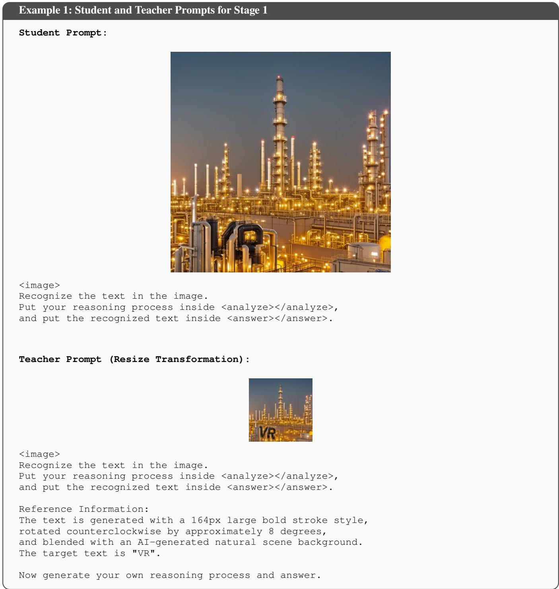  
Figure 9: Example 1 of student and teacher prompts in Stage 1 observation-transferred self-distillation. The student receives only the original image, while the teacher receives additional privileged information revealed by transformed observations.

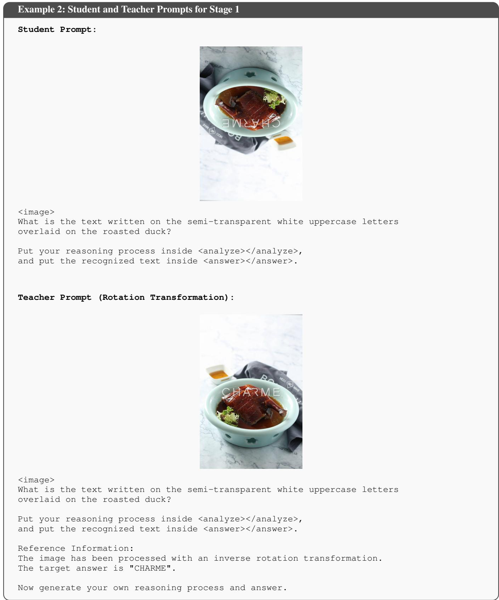  
Figure 10: Example 2 of student and teacher prompts in Stage 1 observation-transferred self-distillation.

## More Details of Stage 2

Stage 2 employs GRPO with four task-conditioned objectives to explicitly optimize diferent aspects of grounded adversaria OCR perception. Specifically, we formulate four tasks, including text-to-bbox localization, bbox-to-text recognition, full spotting, and grounded VQA. Each task uses a task-specific prompt and corresponding reward function. The detailed prompts are shown in Figure 11.

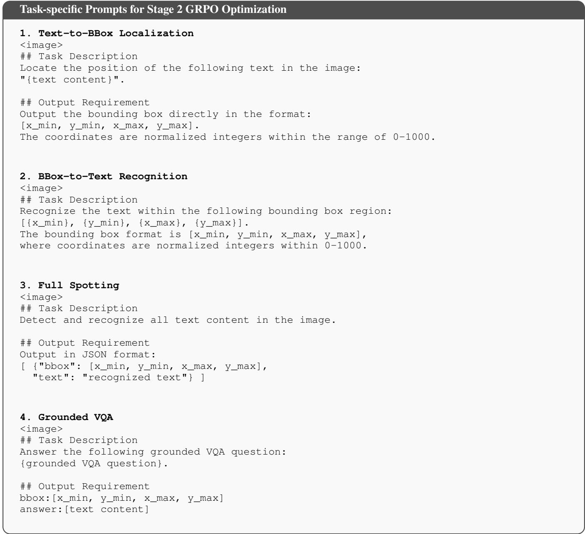  
Figure 11: Task-specific prompts used for Stage 2 GRPO optimization.

## More Details of Training

## Training Data Construction

Due to MLLM’s limited perception of adversarial OCR, building such datasets relies heavily on manual annotation, which is dificult to scale. Therefore we design an adversarial OCR data synthesis framework that batch-generates adversarial OCR samples with full annotations (including adversarial prior, text transcription, and bounding box).

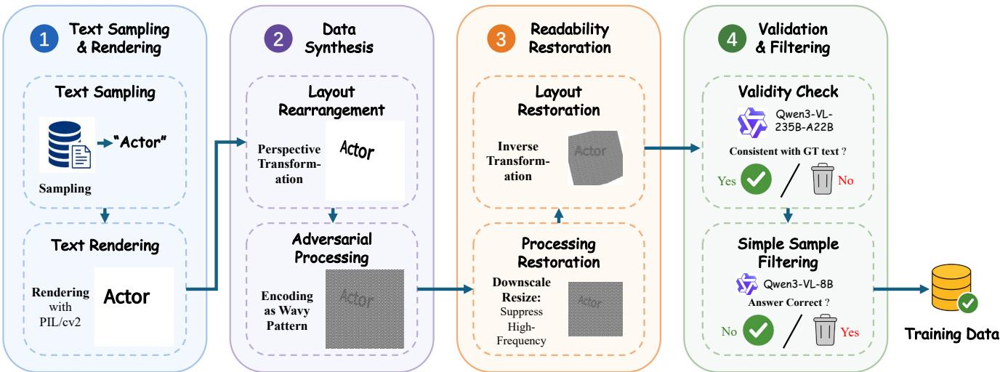  
Figure 12: Adversarial OCR Data Synthesis Framework.

The overall pipeline is shown in 12, which consists of the following steps: text generation, rendering, adversarial processing, readability restoration, validation and filtering. Text sources come from LLM-generated corpora and Faker library2. In the rendering step, each text instance is drawn on a separate mini-canvas with its bounding box recorded. All instances are blended into a single image after layout rearrangement and bounding bbox based collision detection. Then a range of adversarial processing steps (such as AIGC fusion, ASCII art) are applied to the template image, making the text hard to recognize. To ensure data usability, we introduce a readability-restoration step that partially recovers the readability of the adversarial OCR sample. The resulting degraded sample is verified by Qwen3-VL-235B-A22B, which rejects samples where adversaria processing destroyed the original text. Finally, Qwen-VL-8B filters out samples that can already be correctly recognized without further training.

## Training Configurations

Table 8 summarizes the detailed training configurations used in Stage 1 and Stage 2 of ArmorOCR, including the common model settings and stage-specific hyper-parameters for observation-transferred self-distillation and Reward-driven Refinement.

## More Details of Experiments

## Ablation Study on Privileged Textual Information

To investigate the contribution of diferent types of privileged textual information in Stage 1, we conduct an ablation study by removing OCR priors and ground-truth OCR text individually. All results in Table 9 are obtained without visual transfer to evaluate the individual contribution of privileged textual signals.

Specifically, OCR priors provide information about the construction process of adversarial OCR patterns, helping the teacher model understand the underlying visual perturbations and better perceive adversarial text. Meanwhile, ground-truth OCR text provides explicit semantic guidance, helping resolve visually ambiguous characters and establish the correct recognition target. Combining both sources achieves the best performance, demonstrating their complementary efects.

However, the improvements remain limited without visual transfer from transformed observations, indicating that textual information alone cannot fully reveal the visual cues required for robust adversarial OCR perception. This further validates the importance of transferring transformation-revealed perception in Stage 1.

<table><tr><td>Training Configuration</td><td>Value</td><td>Description</td></tr><tr><td colspan="3">Common Configuration</td></tr><tr><td colspan="3">Model Configuration</td></tr><tr><td>Backbone</td><td>Qwen3-VL-8B-Instruct</td><td></td></tr><tr><td>FREEZE_LLM</td><td>False</td><td>All LLM parameters are trainable</td></tr><tr><td>FREEZE_ALIGNER</td><td></td><td></td></tr><tr><td>FREEZE_VIT</td><td>False False</td><td>All aligner parameters are trainable All vision encoder parameters are trainable</td></tr><tr><td colspan="3">Optimization Configuration</td></tr><tr><td></td><td>AdamW</td><td></td></tr><tr><td>Optimizer</td><td></td><td></td></tr><tr><td>Learning Rate</td><td>1 × 10−6</td><td></td></tr><tr><td>Weight Decay Warmup Ratio</td><td>0.05</td><td></td></tr><tr><td>Precision</td><td>0.03</td><td></td></tr><tr><td>DeepSpeed</td><td>bfloat16 ZeRO-2</td><td></td></tr><tr><td colspan="3">Vision Processing Configuration</td></tr><tr><td>Minimum Image Tokens</td><td></td><td></td></tr><tr><td>Maximum Image Tokens</td><td>64 4096</td><td>1</td></tr><tr><td>Maximum Sequence Length</td><td>8192</td><td>/</td></tr><tr><td colspan="3">Stage 1: Observation-Transferred Self-Distillation</td></tr><tr><td colspan="3">OPSD Configuration</td></tr><tr><td>JSD On-policy Sampling Ratio λ</td><td>1.0</td><td></td></tr><tr><td>Generalized JSD Weight β</td><td>0.5</td><td>Fully on-policy Weight in the generalized JSD loss</td></tr><tr><td>Sampling Temperature</td><td>1.0</td><td></td></tr><tr><td>Maximum Completion Length</td><td>1024</td><td></td></tr><tr><td>vLLM Configuration</td><td></td><td>Maximum number of generated tokens</td></tr><tr><td>Use vLLM</td><td></td><td></td></tr><tr><td>vLLM Mode</td><td>True Colocate</td><td></td></tr><tr><td>vLLM Maximum Model Length</td><td>8192</td><td>vLLM shares the same devices with training</td></tr><tr><td>vLLM GPU Memory Utilization</td><td>0.4</td><td></td></tr><tr><td>Training Configuration</td><td></td><td>1</td></tr><tr><td>Training Samples</td><td>50K</td><td></td></tr><tr><td>Accelerators</td><td></td><td></td></tr><tr><td>Per-device Batch Size</td><td>16</td><td>PPU-810E accelerators</td></tr><tr><td>Gradient Accumulation Steps</td><td>122</td><td></td></tr><tr><td>Training Epochs</td><td></td><td>1 1</td></tr><tr><td colspan="3">Stage 2: Reward-driven Refinement</td></tr><tr><td>GRPO Configuration</td><td></td><td></td></tr><tr><td>Number of Rollouts</td><td>84</td><td>Number of sampled responses per prompt</td></tr><tr><td>Steps per Generation</td><td></td><td>Policy update steps per generation</td></tr><tr><td>KLCoefficient β Maximum Completion Length</td><td>0.04</td><td>KL regularization coefficient</td></tr><tr><td>vLLM Configuration</td><td>1024</td><td></td></tr><tr><td colspan="3">Use vLLM</td></tr><tr><td>vLLM Mode</td><td>True</td><td></td></tr><tr><td></td><td>Server</td><td>External vLLM server for rollout generation</td></tr><tr><td>vLLM Maximum Model Length</td><td>8192</td><td></td></tr><tr><td>vLLM Tensor Parallel Size</td><td>1</td><td>/</td></tr><tr><td>vLLM Data Parallel Size</td><td>16</td><td>Computed from 16 rollout accelerators</td></tr><tr><td>vLLM Prefix Caching</td><td>True</td><td>Enabled during rollout generation</td></tr><tr><td>Asynchronous Generation</td><td>True</td><td></td></tr><tr><td colspan="3">Training Configuration</td></tr><tr><td>Training Samples</td><td>70K</td><td></td></tr><tr><td>Accelerators</td><td>128</td><td>PPU-810E accelerators</td></tr><tr><td>Training Accelerators</td><td>112</td><td>14 per node × 8 nodes</td></tr><tr><td>Rollout Accelerators</td><td>16</td><td>2 per node × 8 nodes</td></tr><tr><td>Number of Nodes</td><td>8</td><td></td></tr><tr><td>Processes per Node</td><td>14</td><td>Training processes only</td></tr><tr><td>Per-device Batch Size</td><td>413</td><td>1</td></tr><tr><td>Gradient Accumulation Steps Training Epochs</td><td></td><td>/</td></tr><tr><td></td><td></td><td></td></tr></table>

Table 8: Training configurations of ArmorOCR for two stages.

<table><tr><td>OCR Priors</td><td>GT OCR Text</td><td>IoU</td><td>Acc.</td></tr><tr><td>√</td><td>×</td><td>51.4</td><td>32.0</td></tr><tr><td>×</td><td>√</td><td>50.8</td><td>33.8</td></tr><tr><td>√</td><td>√</td><td>52.2</td><td>35.3</td></tr></table>

Table 9: Ablation study of privileged textual information in Stage 1 on AdvSpot without visual transfer.

## Case Study

## Our ArmorOCR

<analyze>

The image features stylized text that appears to be "WPK俱乐部". The text is rendered in a glowing, slightly blurred font, superimposed on an AIgenerated background depicting a night scene with bamboo stalks and a moon. Th e characters are arranged in three lines: "WP" on the top, "K俱乐部" on the middle and bottom. Although the image is designed to blend the text into t he environment, the text is still legible and appears to be a coherent phrase. The phrase "WPK俱乐部" is likely a proper name, perhaps for a club or organization. </analyze>

<answer>WPK俱乐部</answer>

Question: Please identify the hidden text in the image.

## GPT-5

Grouned Truth: WPK俱乐部

<analyze>

I examined the image carefully for any legible or hidden text and did not find any. </analyze>

<answer>No recognizable text found in the image.</answer>

## Gemini-2.5-Flash

<analyze>

I will analyze the provided image and its crops to identify any hidden text.

1. Examine the overall image: The image depicts a serene night scene with bamboo forests, a river, lanterns, and a moonlit sky in an illustrative or digital-art style.

2. Look for anomalies or patterns: I scan the entire image, paying attention to areas that might contain hidden text. 3. Utilize the cropped images: The crops help zoom in on specific sections without losing context, so I go through them systematically.

Crop 1 (Top left): focuses on the upper sky, moons, and bamboo. No obvious text.

Crop 2 (Top right): focuses on the upper sky, moons, bamboo, and a hanging lantern. No obvious text.

Crop 3 (Bottom left): focuses on the left bank of the river, bamboo, and ground lanterns. Looking closely at the reflections of the three lanterns near the bottom left corner, each reflection shows faint, distorted shapes. It is very subtle, but these reflections seem to contain letter-like forms.

Crop 4 (Bottom right): focuses on the right bank of the river, bamboo, and ground lanterns. No obvious text. 4. Re-examine the original image with this location in mind: I focus on the reflections of the three lanterns on the left bank, closest to the viewer. The left reflection looks like a distorted “A” or “R”. The middle reflection looks like a distorted “I” or “L”. The right reflection looks like a distorted “A” or “N”. Although the text is extremely faint and distorted by the water reflection, the most plausible reading from left to right is "AIA". </analyze>

<answer>The hidden text is "AIA". </answer>

## Qwen3-VL-235B-A22B-Instruct

<analyze>

Upon careful inspection of the image, I looked for any text subtly embedded in the lighting, reflections, foliage, lanterns, sky, or water. The image shows a serene night scene with bamboo stalks, glowing lanterns, a moonlit sky, a reflective river, and distant misty mountains. I examined the lanterns, bamboo, sky, water, and background architecture, but found no visible inscriptions, mirrored text, or hidden symbols. I also checked for steganographic or watermark-like elements, but nothing appears embedded in the composition. Therefore, I conclude that no text is hidden in this image.

</analyze>

<answer>

No hidden text found.

</answer>

  
Figure 13: Case study 1 from AdvSpot (AIGC Fusion Text), illustrating the performance comparison between ArmorOCR and existing LMMs on adversarial OCR perception.

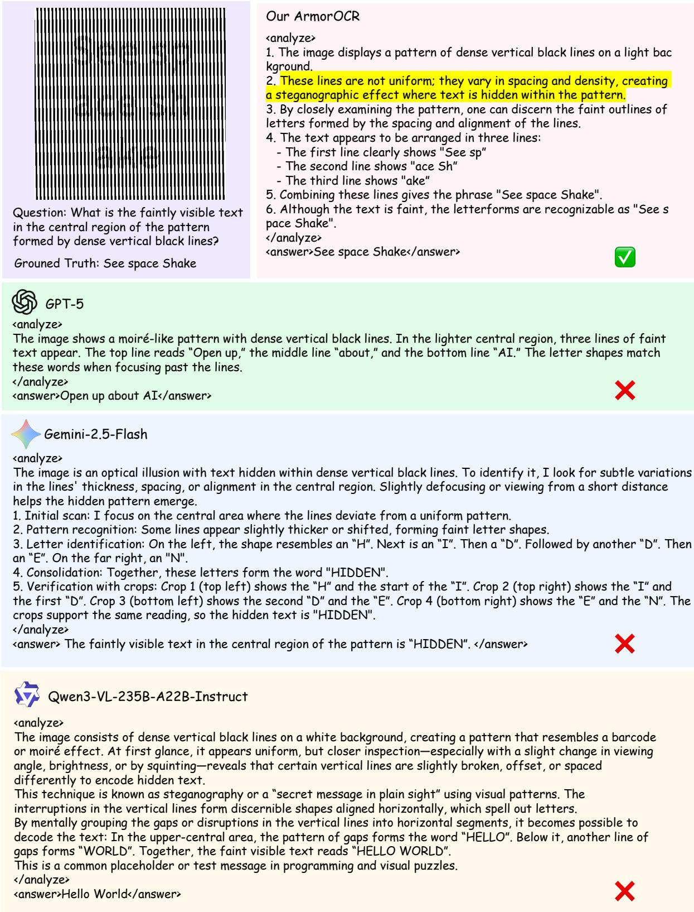  
Figure 14: Case study 2 from AdvSpot (Line-pattern Encoding).

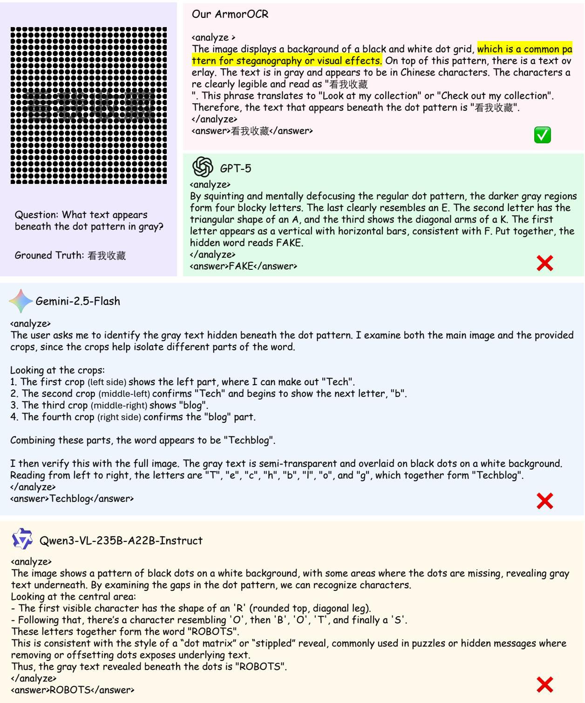  
Figure 15: Case study 3 from AdvSpot (Patter Overlay).

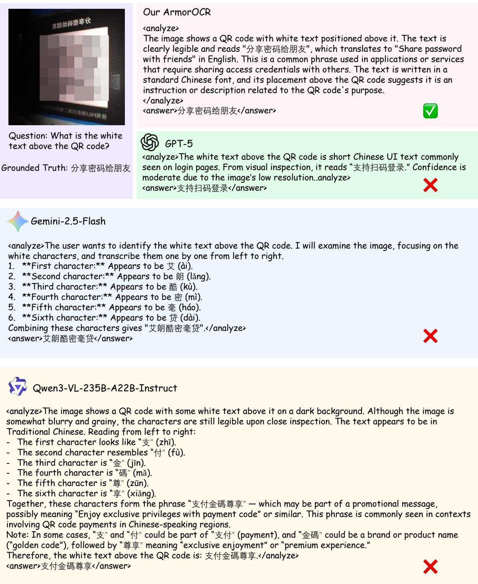