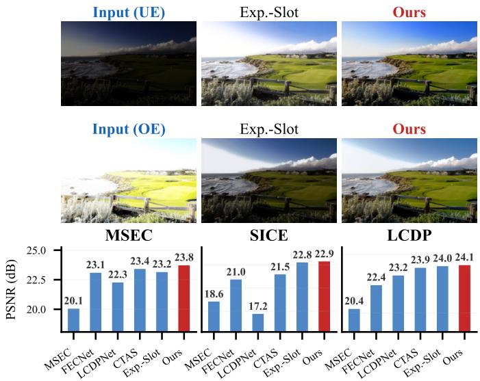

# AutoLumNet: Monotone Optimal Transport for Single-Shot Exposure Correction

Airin Akter Tania∗, Md Raihan Khan∗, and Mohiuddin Ahmad, Senior Member, IEEE

Department of Electrical and Electronic Engineering (EEE) Khulna University of Engineering & Technology (KUET), Bangladesh {airinaktertania, kraihan918}@gmail.com, ahmad@eee.kuet.ac.bd ∗Equal contribution

Abstract—Single-shot exposure correction aims to map an arbitrarily degraded image—whether under-exposed, over-exposed, or a spatial mixture of both—to a well-exposed output from a single capture. We present AutoLumNet, a framework that decomposes this task into a global monotone tone curve and a bounded local residual, making the global component the locus of formal guarantees. The tone curve is parameterized as the normalized cumulative integral of a strictly positive density, ensuring strict monotonicity by construction rather than by penalty. We prove that this parameterization (i) preserves the pairwise luminance ordering of all pixels and all spatial extrema unconditionally, and (ii) is dense in the space of valid tone corrections, containing the one-dimensional optimal-transport map from the input to any target luminance distribution. A differentiable sorted-sample Wasserstein-2 objective drives the learned curve toward the OT optimum during training. Spatially varying effects that the global map provably cannot address—local shading, chrominance shifts, and clipped-region restoration—are handled by a bounded residual decoder with dual-branch convex fusion, for which we provide an explicit sufficient condition for local order preservation. Experiments on five benchmarks (MSEC, SICE, LCDP, LOL-v1, LOL-v2-real) show that AutoLumNet achieves state-of-the-art PSNR and SSIM across both under- and over-exposure regimes at 11.2 ms per frame, and generalizes zeroshot to pure low-light benchmarks without retraining. To our knowledge, AutoLumNet is the first exposure-correction method to unite structural monotonicity, optimal-transport optimality, and bounded local adaptivity within a single trainable architecture. https://github.com/kraihan/Autolumnet

Index Terms—Exposure correction, monotone tone mapping, optimal transport, image enhancement, low-light enhancement, luminance ordering.

## I. INTRODUCTION

MAGES captured in uncontrolled environments routinely exhibit exposure errors. A single frame may contain deep shadows that conceal structure in dark regions and, simultaneously, saturated highlights where bright content has been clipped beyond recovery. These degradations arise because the dynamic range of a digital sensor is far narrower than that of a natural scene: regions outside the sensor’s operating window are compressed toward zero or one, discarding tonal information. Exposure errors not only diminish perceptual quality but also degrade downstream vision systems for detection, recognition, and tracking, which are typically trained on well-exposed imagery. While auto-exposure control and highdynamic-range sensing partially mitigate the problem, they introduce their own artifacts—motion blur, noise amplification,

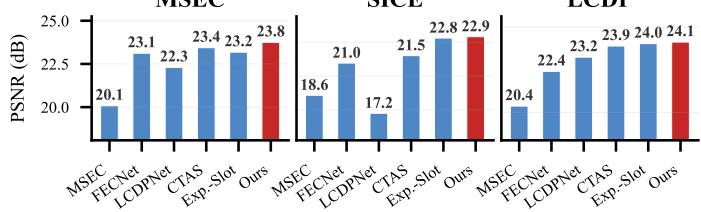  
Fig. 1. Single-shot exposure correction with AutoLumNet. Top two rows: the same SICE scene captured under under-exposure (UE) and over-exposure (OE). Exposure-Slot [54], the current multi-exposure SOTA, produces acceptable but imperfect results in both directions; AutoLumNet recovers colour and detail more faithfully. Bottom row: average PSNR on three standard benchmarks. AutoLumNet achieves the highest PSNR on all three datasets among the compared multi-exposure methods, while being the only method whose global tone correction carries formal monotonicity and optimaltransport guarantees (Sec. III).

ghosting from bracket misalignment—and are ill-suited to dynamic scenes or resource-constrained mobile capture, where only a single shot is available.

Two disjoint research traditions. The literature has largely addressed exposure degradation from two non-overlapping directions. The first, low-light image enhancement (LLIE), assumes the input is globally under-exposed and seeks to brighten it. The dominant approaches include LLNet [1], Retinex-based decomposition RetinexNet [2], KinD [21], URetinex-Net [3], Retinexformer [6]), learnable tone curves (Zero-DCE [4], EnlightenGAN [5]), and more recently statespace backbones [7], diffusion priors [8], and alternative color spaces [9]. Despite their sophistication, these methods share a defining assumption: the degradation is a monotone darkening, and enhancement is a monotone brightening. Applied to an over-exposed input, a model trained to brighten only worsens the saturation.

The second tradition, multi-exposure fusion (MEF), combines several differently exposed captures of the same scene [10]–[15]. MEF can, in principle, recover both shadow and highlight detail, since the information missing from one exposure is present in another. Its premise, however, is a fundamental obstacle: multiple spatially aligned exposures of a static scene are rarely available in practice.

The gap. Between these traditions lies a setting that neither addresses well: a single image that contains both under- and over-exposed regions. Recent methods that explicitly target both directions [16], [17], [47] confirm that this bidirectional regime is both practically important and substantially harder than either sub-problem alone. The difficulty is structural: under- and over-exposure demand opposite corrections, and a single feed-forward mapping that must both brighten and darken places conflicting demands on its features, tending to produce halos, color shifts, or detail loss at exposure boundaries. Furthermore, almost all existing methods are evaluated purely empirically: they offer no guarantee that the enhanced image preserves the relative ordering of scene luminances, a property whose violation manifests directly as the halos and tonal reversals that plague enhancement outputs.

Our approach. We study single-shot exposure correction (SEC): the task of mapping one degraded image to an output on the manifold of naturally exposed photographs, regardless of whether its degradations are under-exposure, over-exposure, or a spatial mixture of both. Rather than treating correction as a monolithic learned mapping, we decompose it into a global tonal component and a local residual component, and we make the global component the locus of formal guarantees. Concretely, we model the global luminance correction as a strictly increasing tone map that is monotone by construction—a normalized cumulative integral of a strictly positive density—so that order preservation is structural rather than the hoped-for outcome of optimization.

Contributions. Our contributions are as follows:

We formalize single-shot exposure correction through an honest degradation model that explicitly distinguishes mathematically recoverable regions, where the tone map is invertible, from clipped regions, where recovery is necessarily prior-based estimation rather than inversion. This delineation makes precise what any single-shot method can and cannot guarantee.

We introduce a monotone-by-construction global tone map and prove (i) its strict monotonicity, (ii) exact preservation of the global luminance ordering and of all spatial extrema, and (iii) that the parameterized family is dense in the space of valid tone curves and contains the onedimensional optimal-transport map from the input to the target luminance distribution. The third result justifies an optimal-transport alignment objective whose minimizer is the correct global correction.

We complement the global map with a bounded local residual and a convex dual-branch fusion, both of which carry explicit structural properties (a hard magnitude bound and a no-extrapolation guarantee), and we state precisely the conditional—rather than unconditional— sense in which local order is preserved.

We demonstrate competitive performance against representative single-image and multi-exposure baselines on standard exposure-correction benchmarks, showing that the proposed framework attains accuracy comparable to recent methods while providing formal guarantees that prior work does not.

The remainder of this paper is organized as follows. Section II reviews related work in low-light enhancement, multi-exposure fusion, and optimal transport for imaging. Section III develops the method and its theoretical guarantees. Section IV reports experiments and ablations, and Section V concludes.

## II. RELATED WORK

We situate our work among four related lines: low-light image enhancement (§II-A), multi-exposure image fusion (§II-B), single-shot bidirectional correction (§II-C), and optimal transport in imaging (§II-D).

## A. Low-Light Image Enhancement

Low-light image enhancement (LLIE) recovers wellexposed imagery from under-illuminated captures. The dominant paradigm derives from Retinex theory, decomposing an image into reflectance and illumination components and restoring each separately [2], [3], [6], [21], [31]–[33]. Statespace backbones [7], [34] and diffusion priors [8], [35], [37], [38] have recently extended this family. A parallel line of work eschews explicit decomposition in favor of learnable tone curves: Zero-DCE [4] and its efficient variant [45] estimate per-pixel brightening curves without paired supervision, characterizing the curve family in terms of monotonicity and differentiability; SCI [36], [46] achieves real-time enhancement via self-calibrated illumination. Other directions include conditional normalizing flows [26], trainable color spaces [9], adversarial training without paired data [5], and spatial–frequency architectures [39].

Limitation common to all LLIE methods. By construction, these methods assume a monotone darkening degradation and apply a monotone brightening correction. When presented with over-exposed or mixed-exposure inputs—where highlights must be attenuated—their brightening bias amplifies the saturation rather than correcting it. AutoLumNet operates in the strictly more general single-shot exposure correction (SEC) regime, handling under-, over-, and mixed-exposure images with a single model.

## B. Multi-Exposure Image Fusion

Multi-exposure image fusion (MEF) sidesteps the singleimage limitation by combining several differently exposed captures of the same scene. Classical approaches weight pixels or transform-domain coefficients by well-exposedness criteria [10], [11], [29], [44], with extensions to automatic exposure compensation [43]. Deep models learn the fusion mapping directly [12]–[14], with EMEF [15] adopting an ensemble strategy that fine-tunes a style code at test time, and Retinex-MEF [42] explicitly modelling glare effects within an unsupervised Retinex framework.

Fundamental limitation. MEF methods require at least two spatially aligned exposures of a static scene. Handheld and dynamic capture violate the alignment assumption, and most legacy or single-frame imagery offers no bracket at all. AutoLumNet retains MEF-style dual-branch exposure reasoning—its shadow and highlight sub-networks (§III-E)— while operating from a single shot.

## C. Single-Shot Bidirectional Exposure Correction

The setting most directly addressed by AutoLumNet is single-shot exposure correction (SEC): mapping one degraded image to its well-exposed counterpart regardless of whether the degradation is under-exposure, over-exposure, or a spatial mixture of both.

Afifi et al. [16] established the first SEC benchmark (MSEC) with a coarse-to-fine correction network; the companion SICE dataset [55] provides multi-exposure sequences from which single-shot pairs are derived. A key challenge in SEC is the conflicting optimization between under- and over-exposure corrections within a single network. ENC [47] and ECLNet [51] address this by projecting features to an exposure-invariant space, while Huang et al. [40] correlate under- and over-exposed samples across the batch dimension. FECNet [48] decomposes correction in the frequency domain, LCDPNet [49] exploits local color distributions as a spatial prior, and IAT [50] and CTAS [53] target real-time inference via lightweight attention and learnable 3D lookup tables, respectively. More recent region-aware methods include REC-Net [52] with exposure-contrastive regularization, CLIER [41] with CLIP-guided refinement for extreme exposures, and Exposure-Slot [54], the current state of the art, which uses hierarchical slot attention to progressively cluster and correct features by exposure level.

Structural gap. All of the above methods are evaluated purely empirically. None provides a structural guarantee that the enhanced image preserves the relative ordering of scene luminances—a property whose violation manifests as the halo artifacts, tonal reversals, and detail loss that remain common failure modes. The curve-estimation family (Zero-DCE and its variants) enforces per-pixel monotonicity through a soft penalty, but as we show in Remark III-C2, per-pixel monotone maps do not imply spatial order preservation. ENC and ECLNet project to an “invariant” feature space, but this invariance is a regularization strategy rather than a provable property. AutoLumNet fills this gap: its monotone-byconstruction global tone map guarantees strict monotonicity, global pixel-order preservation, and spatial-extremum preservation (Lemma III.2, Proposition III.3), while the parameterized family is shown to contain the optimal-transport map (Proposition III.5).

## D. Optimal Transport in Imaging

Optimal transport (OT) has been applied to example-based color transfer [18], [27], and histogram equalization can itself be viewed as a special case of 1-D OT mapping the input luminance CDF to a uniform target [19]. These prior works, however, apply a fixed empirical OT map computed between pre-collected statistics. They do not learn a parameterized family of monotone maps, nor prove that such a family is dense in the space of valid tone corrections. Our contribution is precisely this density result (Proposition III.5), connecting the learned tone curve to the OT optimum via a differentiable sorted-sample Wasserstein-2 objective. To our knowledge, no prior exposure-correction method combines an optimaltransport interpretation of the global luminance correction with structural order-preservation guarantees.

SUMMARY OF NOTATION USED THROUGHOUT SECTION III.  
TABLE I
<table><tr><td>Symbol</td><td>Meaning</td></tr><tr><td> $I , \hat { I } , I ^ { \star }$ </td><td>Input, predicted, ground-truth image</td></tr><tr><td> $Y , \hat { Y } , Y ^ { \star }$ </td><td>Corresponding luminance channels</td></tr><tr><td> $C$ </td><td>Chrominance channels of I</td></tr><tr><td> $\Omega$ </td><td>Pixel domain  $\{ 1 , \ldots , H \} \times \{ 1 , \ldots , W \}$ </td></tr><tr><td> $p , q$ </td><td>Pixel indices</td></tr><tr><td> $\varphi _ { p }$ </td><td>Pixelwise degradation map</td></tr><tr><td> $S$ </td><td>Unsaturated pixel set (Definition III.1)</td></tr><tr><td> $T _ { \theta }$ </td><td>Global tone-correction map</td></tr><tr><td> $m _ { \theta }$ </td><td>Positive density parameterizing  $T _ { \theta }$ </td></tr><tr><td> $w _ { k } , c _ { k }$ </td><td>Discrete bin masses and knot values</td></tr><tr><td> $r _ { \theta }$ </td><td>Bounded spatial residual,  $| r _ { \theta } | \le \rho$ </td></tr><tr><td> $\rho$ </td><td>Residual budget (hyperparameter)</td></tr><tr><td> $\mu , \nu$ </td><td>Input and target luminance distributions</td></tr><tr><td> $F _ { \mu } , F _ { \nu }$ </td><td>Corresponding CDFs</td></tr><tr><td> $T ^ { \star }$ </td><td>1-D optimal-transport map</td></tr><tr><td> $\tau$ </td><td>Parameterized monotone map family</td></tr><tr><td> $K$ </td><td>Number of tone-curve bins</td></tr><tr><td> $\varepsilon$ </td><td>Positivity floor for mθ</td></tr><tr><td></td><td></td></tr><tr><td> $\lambda _ { \bullet }$ </td><td>Loss-weight hyperparameters</td></tr></table>

## III. METHOD

We develop AutoLumNet, a framework for single-shot exposure correction that rests on three design principles formalized in the subsections below:

(i) an honest degradation model that distinguishes between mathematically recoverable and unrecoverable image regions (§III-A);

(ii) a globally monotone tone map whose order-preservation property is provably guaranteed by construction (§III-C), and whose optimal setting is identified with the onedimensional optimal-transport map (§III-D); and

(iii) a spatially adaptive local correction via a bounded residual decoder with dual-branch convex fusion (§III-E).

## A. Preliminaries and Problem Formulation

1) Notation: Let $I \in [ 0 , 1 ] ^ { H \times W \times 3 }$ denote a single input image with spatial domain $\Omega = \{ 1 , \dots , H \} \times \{ 1 , \dots , W \}$ and let $p \in \Omega$ index pixels. We work primarily in the luminance– chrominance decomposition of ${ \harpoonright } : \textbf { } _ { Y } \in [ 0 , 1 ] ^ { H \times W }$ is the luminance (Rec. 601: $Y = 0 . 2 9 9 R + 0 . 5 8 7 G + 0 . 1 1 4 B )$ and $C$ collects the two chrominance channels. The ground-truth well-exposed image is $I ^ { \star }$ with corresponding luminance $Y ^ { \star }$ The learnable map $F _ { \theta } : I \mapsto \hat { I }$ is the full exposure-correction network. We use $\tau$ for the parameterized family of tone maps and ${ \mathcal { P } } ^ { \star }$ for the canonical well-exposed luminance distribution. Table I provides a complete symbol reference.

2) Problem Statement: We formulate single-shot exposure correction (SEC) as learning a deterministic mapping $F _ { \theta } : I \mapsto { \hat { I } }$ such that ˆI lies on the manifold of naturally exposed photographs, given only the single degraded input I. This framing is deliberately agnostic to the nature of the degradation: I may be globally under-exposed, globally overexposed, or contain both shadow and highlight distortions simultaneously.

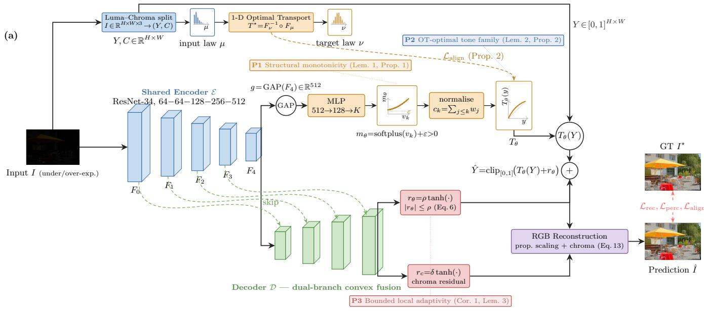

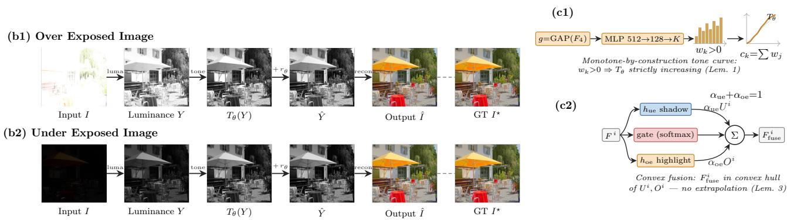  
Fig. 2. Architecture of AutoLumNet. (a) A shared Resnet encoder feeds two paths. The global path (top) realizes principles P1 and P2: the input is split into luminance–chrominance, the input luminance law $\mu$ is aligned to a well-exposed target law ν by the one-dimensional optimal-transport map $T ^ { \star } { = } F _ { \nu } ^ { - 1 } \circ \dot { F } _ { \mu }$ $( \mathcal { L } _ { \mathrm { a l i g n } } )$ , and a pooled descriptor $g { = } \mathrm { G A P } ( F _ { 4 } )$ is mapped by an MLP to bin logits $v _ { k } .$ , passed through softplus with a positive floor to give strictly positive masses m =softplus(v )+ε, normalized and cumulatively summed into the strictly increasing tone curve $T _ { \theta }$ (boxed insets), applied to the input luminance Y. The local path (bottom) realizes principle P3: a dual-branch convex-fusion decoder $\mathcal { D }$ produces a bounded residual $r _ { \theta } ~ ( | r _ { \theta } | \leq \rho )$ and a chroma residual $r _ { c } .$ The luma estimate $\scriptstyle { \hat { Y } } = \operatorname { c l i p } _ { [ 0 , 1 ] } ( T _ { \theta } ( Y ) + r _ { \theta } )$ is recomposed into RGB. Colored tags mark where each theoretical guarantee is enforced. (b) Progressive exposure correction across stages. (c1) Construction of the strictly increasing tone curve from positive bin masses (Lemma 1). (c2) Dual-branch convex fusion remains inside the convex hull of its two hypotheses (Lemma 3).

3) Degradation Model and Recoverability: We posit that the observed luminance arises from a well-exposed ideal $Y ^ { \star }$ through a pixelwise strictly increasing tone map composed with hard clipping:

$$
\begin{array} { r } { Y ( p ) = \mathrm { c l i p } _ { [ 0 , 1 ] } \big ( \varphi _ { p } ( Y ^ { \star } ( p ) ) \big ) , } \end{array}\tag{1}
$$

$\varphi _ { p }$ is continuous and strictly increasing.

Definition III.1 (Unsaturated and saturated sets). The unsaturated set is $S : = \{ p \in \Omega : 0 < \varphi _ { p } ( Y ^ { \star } ( p ) ) < 1 \}$ . Its complement $\Omega \backslash S$ is the saturated set, comprising pixels whose true luminance was clipped to 0 or 1 by the camera sensor.

a) Recoverable and unrecoverable regions.: On S, the map $\varphi _ { p }$ is invertible by strict monotonicity, so $Y ^ { \star } ( p ) \ =$ $\varphi _ { p } ^ { - 1 } ( \dot { Y ( p ) } )$ is in principle recoverable: correction constitutes a genuine inversion. On $\Omega \backslash S ,$ the clip is non-injective and its pre-image is an interval, so no deterministic function inverts the saturation. Recovery on the saturated set is therefore a prior-based estimation problem, not an inversion problem. We state this explicitly and design the residual decoder accordingly (§III-E); earlier formulations of this work [28], [30] made the unjustified claim that $h _ { \mathrm { o e } }$ inverted a saturating map, which we correct here.

b) Global–local factorization.: We factor $\varphi _ { p } = \varphi \circ \psi _ { p } ,$ where $\varphi$ is a global monotone tonal component shared uniformly across all pixels and $\psi _ { p }$ encodes local shading variation. Correcting $\varphi$ constitutes the global exposure problem and admits the provable guarantees developed in §III-C–§III-D. Correcting $\psi _ { p }$ and restoring content on $\Omega \backslash S$ constitutes the local problem, handled by the bounded residual in §III-E, for which we make only conditional, not unconditional, claims.

## B. Overview of AutoLumNet

1) Design Principles: The factorization $\varphi _ { p } ~ = ~ \varphi \circ \psi _ { p }$ motivates a corresponding architectural decomposition. We design AutoLumNet around three interlocking principles:

P1 (Structural monotonicity). The global correction $T _ { \theta }$ is parameterized so that strict monotonicity is guaranteed by construction, not enforced by a penalty. This eliminates halo artifacts and preserves the spatial structure of the scene without relying on optimization to satisfy what should be a hard constraint.

P2 (Optimality of the tone family). The parameterized family $\tau$ is shown to contain the 1-D optimal-transport map from input luminance distribution $\mu$ to the well-exposed target distribution $\nu .$ This justifies both the choice of distributionmatching objective and the form of $\tau$

P3 (Bounded local adaptivity). A spatially varying residual $r _ { \theta }$ with $| r _ { \theta } | ~ \le ~ \rho$ provides local correction that $T _ { \theta }$ alone cannot supply—including restoration of clipped content under a learned prior—while a conditional theorem characterizes precisely when local order is preserved.

2) Architectural Overview: Figure 2 illustrates the full forward pass. Given input $I ,$ a shared encoder $\mathcal { E }$ extracts a multiscale feature pyramid $\{ F ^ { 0 } , F ^ { 1 } , F ^ { 2 } , F ^ { 3 } , F ^ { 4 } \}$ at successively finer-to-coarser spatial resolutions. Two parallel computations operate on this pyramid:

(1) Global tone correction. A global average-pooled descriptor $g \ = \ \mathrm { A v g P o o l } ( F ^ { 4 } ) \ \in \ \mathbb { R } ^ { d }$ is passed to the tone-curve head, which produces the monotone map $T _ { \theta }$ Applying $T _ { \theta }$ to the input luminance Y yields the globallycorrected luminance $T _ { \theta } ( Y )$

(2) Local residual correction. A dual-branch decoder D processes $\{ F ^ { i } \}$ and produces the bounded residual $r _ { \theta } \in$ $[ - \rho , \rho ] ^ { H \times \grave { W } }$ and a chroma residual $r _ { c } \in [ - \delta , \delta ] ^ { H \times W \times 2 }$ These are composed via

$$
\hat { Y } ( p ) = \mathrm { c l i p } _ { [ 0 , 1 ] } \big ( T _ { \theta } \big ( Y ( p ) \big ) + r _ { \theta } ( p ) \big ) \mathrm { , }\tag{2}
$$

and the final RGB output is obtained by transferring $\hat { Y }$ back to the RGB domain while preserving chrominance ratios, followed by a small chroma residual correction.

## C. Global Tone Correction via Monotone Optimal Transport

1) Monotone-by-Construction Parameterization: We model the global luminance correction as a map $T _ { \theta } : [ 0 , 1 ]  [ 0 , 1 ]$ Rather than appending a post-hoc penalty for monotonicity violations, we build strict monotonicity directly into the parameterization. Let $m _ { \theta } : [ 0 , 1 ] \to \mathbb { R } _ { > 0 }$ be produced by passing a neural network output through the softplus function and adding a positive floor $\varepsilon > 0 .$ , so that $m _ { \theta } ( t ) \geq \varepsilon$ for all t. Define the monotone tone map:

$$
T _ { \theta } ( y ) = \frac { \displaystyle \int _ { 0 } ^ { y } m _ { \theta } ( t ) \mathrm { d } t } { \displaystyle \int _ { 0 } ^ { 1 } m _ { \theta } ( t ) \mathrm { d } t } .\tag{3}
$$

a) Discretization.: In practice, we discretize (3) using K uniform bins. Specifically, we predict a vector of raw weights $\mathbf { v } \in \mathbb { R } ^ { K }$ from the network and form strictly positive masses $w _ { k } = \mathrm { s o f t p l u s } ( v _ { k } ) + \varepsilon > 0$ , normalized so that $\textstyle \sum _ { k = 1 } ^ { K } w _ { k } =$ 1. The discrete tone curve is the piecewise linear function whose knots have abscissae $t _ { k } = k / K$ and ordinates $c _ { 0 } =$ $\begin{array} { r } { 0 , \ c _ { k } \ = \ \sum _ { j \leq k } w _ { j } , \ c _ { K } \ = \ 1 } \end{array}$ . Piecewise linear interpolation between strictly increasing knots is itself strictly increasing, so the discretization preserves Lemma III.2 below.

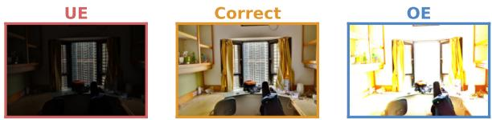

Learned monotone tone curves $T _ { \theta }$  
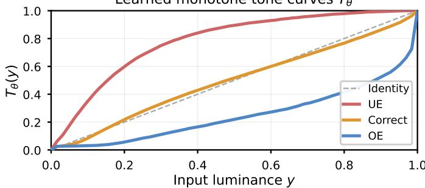  
Fig. 3. Learned monotone tone curves $T _ { \theta } .$ . For three exposures of the same scene (top), the model produces image-adaptive, strictly increasing curves (bottom). The under-exposed (UE) curve lies above the identity (brightening), the correctly exposed curve is near-identity, and the over-exposed (OE) curve lies below (darkening). All three curves are monotone by construction (Lemma III.2), start at (0, 0) and end at (1, 1), and the piecewise-linear staircase from K=64 bins is clearly visible. This validates the structural guarantee of Proposition III.3: a single global curve per image preserves the spatial luminance ordering regardless of the exposure direction.

b) Critical design choice.: The weights $\{ w _ { k } \}$ , and hence the tone curve $T _ { \theta } .$ , are predicted from a global, image-level descriptor obtained by global average pooling of the deepest encoder feature: $g \ = \ \operatorname { A v g P o o l } ( F ^ { 4 } ) \ \in \ \mathbb { R } ^ { d }$ . Consequently, there is exactly one tone curve per image, not one per pixel. This design choice, which may appear restrictive, is precisely what enables the spatial order-preservation guarantee of Proposition III.3 below; per-pixel tone parameters provably do not suffice (Remark III-C2).

2) Structural Guarantees:

Lemma III.2 (Strict monotonicity). The map T defined in (3) is strictly increasing on [0, 1], with $T _ { \theta } ( 0 ) = 0$ and $T _ { \theta } ( 1 ) = 1$ Proof. Let $\begin{array} { r } { Z : = \int _ { 0 } ^ { 1 } m _ { \theta } ( t ) \mathrm { d } t > 0 . } \end{array}$ . For any $0 \leq y _ { 1 } < y _ { 2 } \leq 1$ $T _ { \theta } ( y _ { 2 } ) - T _ { \theta } ( y _ { 1 } ) = \frac { 1 } { Z } \int _ { y _ { 1 } } ^ { y _ { 2 } } m _ { \theta } ( t ) \mathrm { d } t \geq \frac { \varepsilon ( y _ { 2 } - y _ { 1 } ) } { Z } > 0 ,$ since $m _ { \theta } ( t ) \geq \varepsilon > 0$ by construction. The endpoint identities $T _ { \theta } ( 0 ) ~ = ~ 0$ and $T _ { \theta } ( 1 ) ~ = ~ 1$ follow immediately from the normalization $\textstyle \sum _ { k } w _ { k } = 1$ □

Proposition III.3 (Global order and spatial-extremum preservation). Let ${ \hat { Y } } ( p ) : = T _ { \theta } { \bigl ( } Y ( p ) { \bigr ) }$ for all $p \in \Omega ,$ , with $T _ { \theta }$ as in Lemma III.2. Then the following hold.

(i) Global order preservation. For all $p , q \in \Omega ,$

$$
\begin{array} { r } { Y ( p ) < Y ( q ) \iff \widehat { Y } ( p ) < \widehat { Y } ( q ) , } \\ { Y ( p ) = Y ( q ) \iff \widehat { Y } ( p ) = \widehat { Y } ( q ) . } \end{array}
$$

(ii) Spatial-extremum preservation. For any neighbourhood $\mathcal { N } ( p ) \subseteq \Omega ,$ p is a local maximum (resp. minimum) of Y on ${ \mathcal { N } } ( p ) \cup \{ p \}$ if and only if p is a local maximum (resp. minimum) of Yˆ on the same neighbourhood.

Consequently, $T _ { \theta }$ introduces no new spatial extrema and destroys none.

Proof. Claim (i) follows from Lemma III.2: a strictly increasing bijection and its inverse preserve and reflect strict inequalities and equalities. For (ii), p is a local maximum of $Y$ on ${ \mathcal { N } } ( p ) \cup \{ p \}$ iff $Y ( p ) \geq Y ( q )$ for all $q \in \mathcal { N } ( p )$ . By (i) each such inequality is preserved under $T _ { \theta }$ , so the condition holds iff ${ \hat { Y } } ( p ) \geq { \hat { Y } } ( q )$ for all $q \in \mathcal { N } ( p )$ . The argument for local minima is identical. □

Remark. Proposition III.3 necessitates that $T _ { \theta }$ not depend on the pixel index $p .$ To see why, consider the per-pixel affine alternative $T _ { p } ( y ) ~ = ~ a ( p ) y + b ( p )$ with $a ( p ) ~ > ~ 0$ for all $p .$ Even though each $T _ { p }$ is individually monotone, spatial order need not be preserved: set $Y ( p _ { 1 } ) = 0 . 2 , a ( p _ { 1 } ) = 3$ and $Y ( p _ { 2 } ) = 0 . 3 , a ( p _ { 2 } ) = 0 . 5$ . Then $Y ( p _ { 1 } ) < Y ( p _ { 2 } )$ yet $\hat { Y } ( p _ { 1 } ) = 0 . 6 > 0 . 1 5 = \hat { Y } ( p _ { 2 } )$ , so the order is reversed by individually monotone per-pixel maps. Per-pixel monotonicity is necessary but not sufficient for the spatial order-preservation asserted in Proposition III.3(ii).

## D. Distribution Alignment via 1-D Optimal Transport

1) Optimality of the Parameterized Family: While Proposition III.3 characterizes the structural properties of $T _ { \theta } .$ , it does not specify which element of $\tau$ to select. We now show that the theoretically optimal selection is precisely the one-dimensional optimal-transport (OT) map from the input luminance distribution $\mu$ to a well-exposed target distribution $\nu ,$ and that this map is expressible within $\tau .$

Let $F _ { \mu }$ and $F _ { \nu }$ denote the cumulative distribution functions of $\mu$ and $\nu ,$ respectively.

Lemma III.4 (Monotone rearrangement with possibly atomic marginals). Let $\mu , \nu \in \mathcal { P } ( [ 0 , 1 ] )$ with CDFs $F _ { \mu } , F _ { \nu }$ and quantile $F _ { \nu } ^ { - 1 } ( u ) : = \operatorname* { i n f } \{ t : F _ { \nu } \overset { } { ( t ) } \geq u \}$ , and $c ( x , y ) = h ( | x - y | )$ with h strictly convex. (i) If µ is atomless, $T ^ { \star } : = F _ { \nu } ^ { - 1 } \circ F _ { \mu }$ is non-decreasing, satisfies $T _ { \# } ^ { \star } \mu = \nu ,$ , and is the µ-a.e. unique optimal map; if also ν is atomless and µ has a positive density on interval support, $T ^ { \star }$ is strictly increasing on supp(µ). (ii) $I f \mu$ has an atom and ν is atomless, no measurable map pushes µ to ν; the comonotone coupling $\gamma ^ { \star } = ( F _ { \mu } ^ { - 1 } , F _ { \nu } ^ { - 1 } ) _ { \# } .$ Leb is optimal instead.

Proof. (i) Atomlessness makes $F _ { \mu }$ continuous, so $( F _ { \mu } ) _ { \# } \mu =$ Leb and $( F _ { \nu } ^ { - 1 } ) _ { \# } \mathrm { L e b } \ = \ \nu ;$ composing gives $T _ { \# } ^ { \star } \mu \ = \ \nu .$ Optimality and a.e. uniqueness for strictly convex 1-D costs are classical [19, §2.2]; strictness holds since $F _ { \mu }$ is then strictly increasing and $F _ { \nu } ^ { - 1 }$ is so iff $\nu$ is atomless. (ii) A measurable map sends atoms to atoms, so none attains the atomless $\nu ;$ optimality of $\gamma ^ { \star }$ is classical [19, §2.2]. □

Remark (Scope under clipping). Under (1), clipping places atoms of $\mu$ at {0, 1}, so case (ii) governs the full law: no tone curve transports $\mu$ to an atomless target. The map-level optimum (i) is thus claimed only for the unsaturated restriction $\mu _ { S } : = \mathrm { l a w } ( Y ( p ) : p \in S )$ , atomless whenever $Y ^ { \star }$ is. Since $T _ { \theta }$ is injective it preserves atoms, so spreading clipped mass requires the residual $r _ { \theta } ;$ training is unaffected, as the sortedsample loss (4) equals $W _ { 2 } ^ { 2 }$ for arbitrary marginals.

Proposition III.5 (The OT map lies in the parameterized family). The family $\tau$ of maps defined $b y \ ( 3 )$ , over all admissible parameters θ, is dense in the sup-norm in the set of continuous non-decreasing surjections $[ 0 , 1 ]  [ 0 , 1 ]$ Consequently, the 1-D OT map $T ^ { \star }$ of Lemma III.4, whenever continuous (e.g. ν has connected support), is approximable by elements of T to arbitrary sup-norm accuracy.

Proof. Exact weights. For any $\hat { w } \in \Delta ^ { K - 1 }$ with $\hat { w } _ { k } ~ > ~ 0 ,$ pick $c > \varepsilon /$ mink $\hat { w } _ { k }$ and $v _ { k } = \mathrm { s o f t p l u s } ^ { - 1 } ( c \hat { w } _ { k } - \varepsilon )$ ; then softplus $( v _ { k } ) + \varepsilon = c \hat { w } _ { k }$ , so after normalization the realized masses equal wˆ exactly. Every strictly positive probability vector on K bins is thus attainable. Strictly increasing $f .$ Set ${ \hat { w } } _ { k } ~ = ~ f ( t _ { k } ) - f ( t _ { k - 1 } ) ~ > ~ 0 ;$ the induced $T _ { \theta }$ is the piecewise-linear interpolant of f at knots $t _ { k } = k / K$ . On each cell both $f$ and $T _ { \theta }$ lie in $[ f ( t _ { k - 1 } ) , f ( t _ { k } ) ]$ , so $\| f - T _ { \theta } \| _ { \infty } \leq$ $\operatorname* { m a x } _ { k } \big ( f ( t _ { k } ) - f ( t _ { k - 1 } ) \big ) \leq \omega _ { f } ( 1 / K ) \to 0$ as $K  \infty$ . Nondecreasing f. Given $\eta > 0$ , take K with $\omega _ { f } ( 1 / K ) \le \eta / 2$ and $\begin{array} { r } { \hat { w } _ { k } = ( 1 - \frac { \eta } { 2 } ) ( f ( t _ { k } ) - f ( t _ { k - 1 } ) ) + \frac { \eta } { 2 K } > 0 ; } \end{array}$ the knot ordinates satisfy $| c _ { k } - \overline { { f } } ( t _ { k } ) | \le \eta / 2$ , whence $\| { \dot { f } } - T _ { \theta } \| _ { \infty } \leq \eta$ . Applying this to $T ^ { \star }$ (Lemma III.4) gives the claim. □

2) Learning the Tone Curve: Computing $F _ { \nu } ^ { - 1 } \circ F _ { \mu }$ analytically during training is awkward, and in the supervised setting paired data are available. We therefore learn $T _ { \theta }$ within $\tau$ by minimizing a differentiable distributional surrogate. Specifically, we use the debiased Sinkhorn divergence:

$$
{ \mathcal { L } } _ { \mathrm { a l i g n } } = S _ { \varepsilon } ( T _ { \theta \# } { \hat { \mu } } , { \hat { \nu } } ) ,\tag{4}
$$

where $\hat { \mu } , ~ \hat { \nu }$ are empirical one-dimensional luminance distributions and $S _ { \varepsilon }$ is the Sinkhorn divergence with entropic regularization ε. As $\varepsilon  0 , S _ { \varepsilon }  W _ { 2 } ^ { 2 }$ and $S _ { \varepsilon } ( \alpha , \alpha ) = 0$ In our implementation we use the equivalent sorted-sample quadratic loss,

$$
\mathcal { L } _ { \mathrm { a l i g n } } = \frac { 1 } { N } \sum _ { n = 1 } ^ { N } \bigl ( \hat { Y } _ { ( n ) } - \nu _ { ( n ) } \bigr ) ^ { 2 } ,\tag{5}
$$

where ${ \hat { Y } } _ { ( 1 ) } \leq \dots \leq { \hat { Y } } _ { ( N ) }$ are the sorted predicted luminance values and $\nu _ { ( 1 ) } ~ \leq ~ \dots ~ \leq ~ \nu _ { ( N ) }$ are quantiles of νˆ at the corresponding levels. In one dimension, (5) equals $W _ { 2 } ^ { 2 } ( { \hat { \mu } } , { \hat { \nu } } )$ exactly, is differentiable through the network via the gradients of the sort operation, and is consistent with $T ^ { \star }$ by Proposition III.5.

a) Choice of target distribution.: A fixed prior such as a truncated Gaussian $\mathcal { N } ( 0 . 5 , \sigma ^ { 2 } ) | _ { [ 0 , 1 ] }$ is a convenient default but constitutes a modeling choice rather than a theorem. Empirical luminance statistics of natural images are heavytailed and scene-dependent. In practice, we estimate $\mathcal { P } ^ { \star }$ from the empirical luminance distribution of well-exposed images in the training set and optionally condition it on the scene type through the encoder; the truncated Gaussian is retained only as a fallback for scene types underrepresented in training data.

## E. Local Correction and Dual-Branch Fusion

1) Bounded Spatial Residual: The global map $T _ { \theta }$ alone cannot address three aspects of the correction that require spatial adaptivity: local shading variation $\psi _ { p } ,$ restoration of content on the clipped set $\Omega \backslash S ,$ and chrominance adjustment. Furthermore, Proposition III.3 specifically forbids spatial reordering by design, which limits the ability of $T _ { \theta }$ to correct localized exposure anomalies. We address both limitations by adding a bounded spatial residual to the tonal correction. The predicted luminance is defined as:

$$
\hat { Y } ( p ) \ = \ \mathrm { c l i p } _ { [ 0 , 1 ] } \Bigl ( T _ { \theta } \bigl ( Y ( p ) \bigr ) + r _ { \theta } ( p ) \Bigr ) , \qquad | r _ { \theta } ( p ) \bigl | \ \le \ \rho ,\tag{6}
$$

where $r _ { \theta } : \Omega  \mathbb { R }$ is produced by the U-Net decoder with a $\rho \operatorname { t a n h } ( \cdot )$ output head, and $\rho ~ > ~ 0$ is a hyperparameter controlling the magnitude of permitted local deviation.

2) Conditional Order Preservation:

Corollary III.6 (Conditional local order preservation). For neighboring pixels $p , q \ \in \ \Omega$ satisfying $Y ( p ) ~ < ~ Y ( q )$ , the composed mapping in (6) preserves their luminance order if

$$
T _ { \theta } \bigl ( Y ( q ) \bigr ) - T _ { \theta } \bigl ( Y ( p ) \bigr ) > \ \big | \ r _ { \theta } ( p ) - r _ { \theta } ( q ) \big | .\tag{7}
$$

Proof. Subtracting $\hat { Y } ( p ) = T _ { \theta } ( Y ( p ) ) + r _ { \theta } ( p )$ from ${ \hat { Y } } ( q ) =$ $T _ { \theta } ( Y ( q ) ) + r _ { \theta } ( q )$ and requiring positivity yields the condition. The clipping operation is non-decreasing; therefore it cannot reverse the order, but it may collapse strict inequalities into equalities when either value saturates. Strict local order preservation holds only when both pre-clipped values remain inside (0,1). □

The smoothness regularizer $\mathcal { L } _ { \mathrm { s m o o t h } }$ (§III-G) keeps $| r _ { \theta } ( p ) -$ $r _ { \theta } ( q ) |$ small so that (III.6) holds at most neighboring pairs, though this is empirical, not guaranteed.

3) Dual-Branch Decoder with Convex Fusion: Exposuredegraded regions fall into two qualitatively different regimes: under-exposed regions, where content is present but compressed into low luminance values and can in principle be recovered by inverse-mapping, and over-exposed or clipped regions, where content must be hallucinated from contextual priors. A single feature path in the decoder must handle both regimes, which imposes competing requirements on the intermediate representations.

We address this by maintaining, at each decoder scale i, two parallel convolutional sub-networks that process the shared encoder feature $F ^ { i } \in \mathbb { R } ^ { C _ { i } \times H _ { i } \times W _ { i } }$

$$
U ^ { i } \ = \ h _ { \mathrm { u e } } ( F ^ { i } ) , \qquad O ^ { i } \ = \ h _ { \mathrm { o e } } ( F ^ { i } ) ,\tag{8}
$$

where $h _ { \mathrm { u e } }$ specializes in shadow recovery and $h _ { \mathrm { o e } }$ in highlight restoration. A two-way softmax gate predicts spatially varying convex weights:

$$
\big ( \alpha _ { \mathrm { u e } } ^ { i } ( p ) , \alpha _ { \mathrm { o e } } ^ { i } ( p ) \big ) \ = \ \mathrm { s o f t m a x } \big ( s _ { \mathrm { u e } } ^ { i } ( p ) , s _ { \mathrm { o e } } ^ { i } ( p ) \big ) ,\tag{9}
$$

and the fused feature is the convex combination

$$
F _ { \mathrm { f u s e } } ^ { i } ( p ) = \alpha _ { \mathrm { u e } } ^ { i } ( p ) U ^ { i } ( p ) + \alpha _ { \mathrm { o e } } ^ { i } ( p ) O ^ { i } ( p ) .\tag{10}
$$

Lemma III.7 (No-extrapolation fusion). For each pixel $p \in \Omega$ and scale i, the fused feature $F _ { f u s e } ^ { i } ( p )$ lies on the line segment between $U ^ { i } ( p )$ and $O ^ { i } ( p )$ . In particular, $\| F _ { f u s e } ^ { i } ( p ) \| \le$ max $\left( \lVert U ^ { i } ( p ) \rVert , \lVert O ^ { i } ( p ) \rVert \right)$ for any norm.

Proof. Since $\alpha _ { \mathrm { u e } } ^ { i } ( p ) + \alpha _ { \mathrm { o e } } ^ { i } ( p ) = 1$ with both weights nonnegative, $F _ { \mathrm { f u s e } } ^ { i } ( p )$ is a convex combination of $U ^ { i } ( p )$ and $O ^ { i } ( p )$

which in $\mathbb { R } ^ { C _ { i } }$ lies on the line segment connecting them. The norm bound follows from the convexity of $\| \cdot \| .$ □

Lemma III.7 is a stability property: it ensures that the decoder cannot synthesize features lying outside the span of the two branch hypotheses at any spatial location. It is distinct from, and complementary to, the order-preservation result of Proposition III.3, which governs the tonal component.

## F. Network Architecture

1) Encoder–Decoder Backbone: The encoder $\mathcal { E }$ extracts a feature pyramid $\{ F ^ { 0 } , F ^ { 1 } , F ^ { 2 } , F ^ { 3 } , F ^ { 4 } \}$ from input I at strides 1, 2, 4, 8, 16 with channel widths d, 2d, 4d, 8d, 16d. The decoder D mirrors this structure, reconstructing spatial detail through progressive upsampling with skip connections.

The theoretical guarantees of this work (Lemma III.2, Propositions III.3 and III.5) are encoder-agnostic: they depend only on how the tone-curve weights $\{ w _ { k } \}$ are computed from the pooled global descriptor, not on the backbone architecture. Any encoder that produces a multi-scale pyramid and a global descriptor $g \ = \ \mathrm { A v g P o o l } ( F ^ { 4 } ) \ \in \ \mathbb { R } ^ { d }$ is compatible—we evaluate ResNet-18, ResNet-34 [20], and NAFNet [22] in the ablation study (§IV-C). Unless stated otherwise, we use ResNet-34 with ImageNet-pretrained weights as the default encoder for its favorable accuracy–speed tradeoff (Table VII).

2) Tone-Curve Head: The tone-curve head receives the global image descriptor $g = \operatorname { A v g P o o l } ( F ^ { 4 } ) \in \mathbb { R } ^ { d }$ and produces the bin weights via a two-layer MLP with GELU activations:

$$
\mathbf { v } = W _ { 2 } \sigma ( W _ { 1 } g + b _ { 1 } ) + b _ { 2 } \ \in \ \mathbb { R } ^ { K } ,
$$

followed by $w _ { k } = \mathrm { s o f t p l u s } ( v _ { k } ) + \varepsilon$ and normalization $w _ { k } \gets$ $w _ { k } / \sum _ { j } w _ { j }$ . The tone curve is then evaluated by piecewise linear interpolation as described in §III-C1. We use $K = 6 4$ bins and $\varepsilon = 1 0 ^ { - 3 }$ throughout.

3) Residual and Chroma Heads: The decoder produces a spatial feature map $F _ { \mathrm { d e c } } \in \mathbb { R } ^ { d \times H \times W }$ at full input resolution by progressive PixelShuffle upsampling [23] with skip connections from the encoder. Two separate $3 \times 3$ convolutional heads applied to $F _ { \mathrm { d e c } }$ produce:

$$
r _ { \theta } = \rho \cdot \operatorname { t a n h } \bigl ( \operatorname { C o n v } _ { Y } ( F _ { \mathrm { d e c } } ) \bigr ) \ \in \ [ - \rho , \rho ] ^ { H \times W } ,\tag{11}
$$

$$
r _ { c } = \delta \cdot \operatorname { t a n h } \left( \operatorname { C o n v } _ { C } ( F _ { \operatorname { d e c } } ) \right) ~ \in ~ [ - \delta , \delta ] ^ { H \times W \times 2 } ,\tag{12}
$$

where tanh enforces the magnitude bound structurally rather than by penalization. Default hyperparameters are $\rho = 0 . 2 0$ and $\delta = 0 . 0 8$

4) RGB Reconstruction: Given $\hat { Y }$ from (6), the enhanced RGB image is formed in two steps. First, the global luminance correction is propagated to RGB by proportional scaling:

$$
{ \hat { I } } _ { \mathrm { l u m } } ( p ) = \mathrm { c l i p } _ { [ 0 , 1 ] } \bigg ( I ( p ) \cdot \frac { \hat { Y } ( p ) + \varepsilon _ { 0 } } { Y ( p ) + \varepsilon _ { 0 } } \bigg ) ,\tag{13}
$$

with $\varepsilon _ { 0 } ~ = ~ 1 0 ^ { - 4 }$ for numerical stability. Second, a small chrominance correction is applied to the R and B channels:

$$
\begin{array} { r l r } & { } & { \hat { R } ( p ) = \mathrm { c l i p } _ { [ 0 , 1 ] } \big ( \hat { I } _ { \mathrm { l u m } , R } ( p ) + r _ { c } ^ { ( 1 ) } ( p ) \big ) , \quad } \\ & { } & { \hat { B } ( p ) = \mathrm { c l i p } _ { [ 0 , 1 ] } \big ( \hat { I } _ { \mathrm { l u m } , B } ( p ) + r _ { c } ^ { ( 2 ) } ( p ) \big ) , } \end{array}
$$

with the G channel held unchanged to preserve the luminancedefined correction.

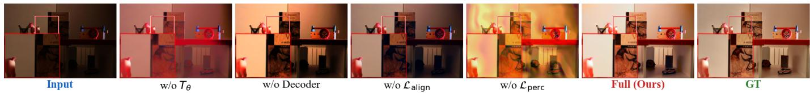

Fig. 4. Visual ablation study on SICE Scene 257. Removing the tone curve $( w / o ~ T _ { \theta } )$ leaves the image dark, confirming that the bounded residual $( \rho { = } 0 . 2 0 )$ alone cannot correct large global exposure shifts. Removing the decoder (w/o Decoder) yields a globally lifted but flat result with no local contrast. Removing the OT alignment loss (w/o $\mathcal { L } _ { \mathrm { a l i g n } } )$ produces desaturated, tonally inaccurate output. Removing the perceptual loss (w/o $\mathcal { L } _ { \mathrm { p e r c } } )$ causes severe colour bleeding and structural distortion, confirming its role as a critical regulariser. The full model recovers both global exposure and local detail, closely matching the GT. Zoomed insets highlight the book-cover text, which is legible only in the full model and the GT.  
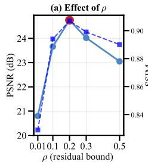

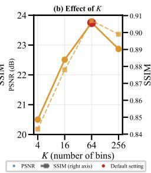

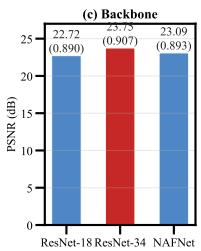  
Fig. 5. Hyperparameter sensitivity. (a) Effect of the residual bound $\rho \colon$ too small (ρ=0.01) restricts local correction and loses 3.95 dB; too large (ρ=0.50) permits artifacts and loses 1.70 dB; the optimum is $\rho { = } 0 . 2 0 .$ (b) Effect of the number of tone-curve bins K: performance plateaus at K=64; K=256 overfits $\left( - 0 . 8 8 { \mathrm { d B } } \right)$ . (c) Backbone comparison: ResNet-34 with ImageNet pretraining outperforms both the lighter ResNet-18 ( 1.03 dB) and NAFNet without pretraining ( 0.66 dB), indicating that the framework benefits more from strong initialisation than from task-specific block design. PSNR (solid, left axis) and SSIM (dashed, right axis) are reported on the MSEC dataset.

5) Implementation Details: The guarantees of §III are backbone-agnostic: any encoder producing a multi-scale pyramid and a pooled global descriptor $g \ = \ \mathrm { A v g P o o l } ( F ^ { 4 } )$ is admissible, and we evaluate ResNet-18, ResNet-34, and a NAFNet-style backbone in the ablation of §IV-C. Unless stated otherwise, the default is a ResNet-style encoder-decoder with 4 levels, encoder block counts (2, 2, 4, 8) and base width $d = 4 8$ (channel depths 48-96-192-384-768), and a mirrored decoder with block counts (2, 2, 2, 2). The full model has $\sim 2 3 \times 1 0 ^ { 6 }$ learnable parameters and runs in single precision.

## G. Unified Exposure-Aware Training Objective

The training loss $\mathcal { L }$ combines four terms that collectively enforce pixel fidelity, distributional alignment with natural exposure statistics, perceptual quality, and spatial regularity of the residual:

$$
{ \mathcal { L } } \ = \ \lambda _ { \mathrm { r e c } } \ L _ { \mathrm { r e c } } + \lambda _ { \mathrm { a l i g n } } \ L _ { \mathrm { a l i g n } } + \lambda _ { \mathrm { p e r c } } \ L _ { \mathrm { p e r c } } + \lambda _ { \mathrm { s m o o t h } } \ L _ { \mathrm { s m o o t h } } .\tag{14}
$$

1) Reconstruction Loss: The reconstruction loss combines the Charbonnier (smooth $L _ { 1 } )$ distance and the complement of the structural similarity index:

$$
\mathcal { L } _ { \mathrm { r e c } } = \frac { 1 } { | \Omega | } \sum _ { p } { \sqrt { \| \hat { I } ( p ) - I ^ { \star } ( p ) \| ^ { 2 } + \varepsilon _ { c } ^ { 2 } } } + \lambda _ { \mathrm { s s i m } } \big ( 1 - \mathrm { S S I M } ( \hat { I } , I ^ { \star }\tag{15}
$$

with $\varepsilon _ { c } ~ = ~ 1 0 ^ { - 3 }$ . The Charbonnier term provides robust pixel-level fidelity with improved handling of outliers such as clipped highlights; the SSIM term reinforces structural fidelity in terms of luminance, contrast, and local correlation.

2) Distribution Alignment Loss: The distributional alignment term is as defined in (5), implemented as the sortedsample squared Wasserstein-2 distance between the predicted luminance distribution and the target ${ \mathcal { P } } ^ { \star }$ :

$$
\mathcal { L } _ { \mathrm { a l i g n } } = \frac { 1 } { N } \sum _ { n = 1 } ^ { N } \bigl ( \hat { Y } _ { ( n ) } - \nu _ { ( n ) } \bigr ) ^ { 2 } .\tag{16}
$$

By Proposition III.5, minimizing $\mathcal { L } _ { \mathrm { a l i g n } }$ over $\tau$ drives $T _ { \theta }$ toward the optimal-transport map $T ^ { \star }$

3) Perceptual Loss: Pixel-level fidelity alone does not guarantee perceptually natural textures. Following Johnson et al. [24], we impose a feature-level consistency term using activations from a pretrained VGG-16 network $\phi _ { \ell } \colon$

$$
\mathcal { L } _ { \mathrm { p e r c } } = \sum _ { \ell \in \mathcal { L } _ { \mathrm { v G G } } } \left. \phi _ { \ell } ( \hat { I } ) - \phi _ { \ell } ( I ^ { \star } ) \right. _ { 2 } ^ { 2 } ,\tag{17}
$$

where $\mathcal { L } _ { \mathrm { { V G G } } } = \{ \mathtt { r e l u 1 \_ } 2 , \mathtt { \ r e l u 2 \_ } 2 , \mathtt { \ r e l u 3 \_ } 3 \}$

4) Residual Smoothness Regularization: To encourage the sufficient condition of Corollary III.6 to hold empirically at neighboring pixel pairs, we penalize large spatial gradients of $r _ { \theta } \colon$

$$
\mathcal { L } _ { \mathrm { s m o o t h } } = \sum _ { p \in \Omega } \bigl \| \nabla r _ { \theta } ( p ) \bigr \| _ { 2 } ^ { 2 } ,\tag{18}
$$

where $\nabla$ denotes the finite-difference spatial gradient operator. The smoothness penalty applies to $r _ { \theta }$ exclusively: the tone map $T _ { \theta }$ has no spatial parameters, so no analogous term is needed for it.

5) Omission of a Monotonicity Penalty: A soft monotonicity penalty of the form $\begin{array} { r } { \mathcal { L } _ { \mathrm { m o n o } } = \sum _ { p } \operatorname* { m a x } ( 0 , \varepsilon - a ( p ) ) } \end{array}$ , as used in some prior works [28], is deliberately absent from (14). Monotonicity of $T _ { \theta }$ is guaranteed structurally by Lemma III.2, rendering any additional penalty redundant. Moreover, as Remark III-C2 shows, per-pixel positivity penalties do not imply spatial order preservation, so including them would convey false security. Their removal converts a soft, potentially violated heuristic into a hard architectural guarantee.

6) Loss Weight Selection: Hyperparameters are set as $\lambda _ { \mathrm { r e c } } ~ = ~ 1 . 0 , ~ \lambda _ { \mathrm { a l i g n } } ~ = ~ 0 . 1 , ~ \lambda _ { \mathrm { p e r c } } ~ = ~ 0 . 0 1 , ~ \lambda _ { \mathrm { s m o o t h } } ~ = ~ 0 . 0 ,$ $\lambda _ { \mathrm { s s i m } } = 0 . 2$ . The rationale: $\mathcal { L } _ { \mathrm { r e c } }$ dominates to prioritize pixel fidelity (PSNR); $\mathcal { L } _ { \mathrm { a l i g n } }$ is small because it saturates early in training; $\mathcal { L } _ { \mathrm { p e r c } }$ is intentionally small to avoid the well-known PSNR–perceptual tradeoff [25].

Remark (Scope of guarantees). The guarantees above are subject to four explicit limitations: (i) clipped content $( \Omega \setminus S )$ is not invertible—restoration there is prior-based estimation; (ii) local order preservation under the residual is conditional (Corollary III.6), not unconditional; (iii) the target distribution ${ \mathcal { P } } ^ { \star }$ is a modeling choice, not a theorem; and (iv) branch specialization of $h _ { \mathrm { u e } }$ and $h _ { \mathrm { o e } }$ is empirical (§IV-C), not guaranteed by Lemma III.7.

Algorithm 1 AutoLumNet: forward pass and training step   
Require: $\overline { { I \in [ 0 , 1 ] ^ { H \times W \times 3 } } }$ , target law ν, encoder E, decoder   
D, bounds $\rho , \delta ,$ floor ε, bins K   
Ensure: prediction ˆI and one parameter update   
1: $( Y , C ) \gets \mathrm { I }$ umaChroma(I) {Rec. 601}   
2: $\{ F ^ { 0 } , \dots , F ^ { 4 } \}  \mathcal { E } ( I ) ; g  \mathrm { A v g P o o l } ( F ^ { 4 } )$   
3: // Global tone curve $( P l , P 2 )$   
4: $\begin{array} { r } { v  \mathrm { \backslash } \mathrm { M L P } ( g ) ; \ w _ { k } \  \ \mathrm { s o f t p l u s } ( v _ { k } ) \ + \ \varepsilon ; w  } \end{array}$   
$w / \sum _ { j } w _ { j }$   
5: $c _ { 0 } ~  ~  ~ 0 , ~ c _ { k } ~  ~  ~ \sum _ { j \leq k } w _ { j } ; ~ T _ { \theta }$ ←   
PLInterp $\left( \left\{ \left( k / K , c _ { k } \right) \right\} \right)$   
6: $T _ { \theta } ( Y ) \gets \mathrm { a p p l y } \ T _ { \theta }$ pixelwise to $Y$   
7: // Local residual (P3)   
8: for each decoder scale i do   
9: $U ^ { i } \gets h _ { \mathrm { u e } } ( F ^ { i } ) , ~ O ^ { i } \gets h _ { \mathrm { o e } } ( F ^ { i } )$   
10: $( \alpha _ { \mathrm { u e } } ^ { i } , \alpha _ { \mathrm { o e } } ^ { i } )  \mathrm { s o f t m a x } ( s _ { \mathrm { u e } } ^ { i } , s _ { \mathrm { o e } } ^ { i } )$   
11: $F _ { \mathrm { f u s e } } ^ { i }  \alpha _ { \mathrm { u e } } ^ { i } U ^ { i } + \alpha _ { \mathrm { o e } } ^ { i } O ^ { i }$   
12: end for   
13: $F _ { \mathrm { d e c } } \gets \mathcal { D } ( \{ F _ { \mathrm { f u s e } } ^ { i } \} )$   
14: rθ ← ρ tanh(ConvY(Fdec)), rc ←   
δ tanh $_ \mathrm { L } \big ( \mathrm { C o n v } _ { C } ( F _ { \mathrm { d e c } } ) \big )$   
15: $\hat { Y } \gets \mathrm { c l i p } _ { [ 0 , 1 ] } ( T _ { \theta } ( Y ) + r _ { \theta } )$   
16: $\hat { I } \gets \mathrm { R G B R e c o n } ( \hat { Y } , Y , C , r _ { c } ) \ \{ \mathrm { E q . } \ ( 1 3 ) \}$   
17: // Training objective   
18: $\begin{array} { r } { \mathcal { L } _ { \mathrm { a l i g n } }  \frac { 1 } { N } \sum _ { n } ( \hat { Y } _ { ( n ) } - \nu _ { ( n ) } ) ^ { 2 } } \end{array}$ {sorted-sample $W _ { 2 } ^ { 2 } \}$   
19: $\begin{array} { r l r } { \mathcal { L } } & { { }  } & { \lambda _ { \mathrm { { r e c } } } \mathcal { L } _ { \mathrm { { r e c } } } + \lambda _ { \mathrm { { a l i g n } } } \mathcal { L } _ { \mathrm { { a l i g n } } } + \lambda _ { \mathrm { { p e r c } } } \mathcal { L } _ { \mathrm { { p e r c } } } + } \end{array}$   
λsmooth $\mathcal { L } _ { \mathrm { s } }$ mooth   
20: $\theta \gets \theta - \eta \nabla _ { \theta } \mathcal { L }$   
21: return $\hat { I }$

## IV. EXPERIMENTS

## A. Experimental Setup

1) Implementation Details: AutoLumNet is implemented in PyTorch and trained on two NVIDIA Tesla T4 GPUs using the AdamW optimizer with an initial learning rate of $2 \times 1 0 ^ { - 4 }$ cosine annealing to $1 \times 1 0 ^ { - 6 }$ , and a batch size of 8. Training patches of size $2 5 6 \times 2 5 6$ are randomly cropped from the input–GT pairs; horizontal flipping is applied with probability 0.5. The model is trained for 300 K iterations (≈80–120 epochs depending on the dataset). The encoder is a ResNet-34 [20] with ImageNet-pretrained weights; the tone-curve head uses $K { = } 6 4$ bins and positivity floor $\varepsilon { = } 1 0 ^ { - 3 } ;$ the residual decoder uses bound $\rho { = } 0 . 2 0$ and chroma bound $\delta { = } 0 . 0 8$ . Loss weights are $\lambda _ { \mathrm { { r e c } } } \mathrm { { = } } 1 . 0 , ~ \lambda _ { \mathrm { { a l i g n } } } \mathrm { { = } } 0 . 1 , ~ \lambda _ { \mathrm { { p e r c } } } \mathrm { { = } } 0 . 0 1 , ~ \lambda _ { \mathrm { { s s i m } } } \mathrm { { = } } 0 . 2 ,$ and $\lambda _ { \mathrm { s m o o t h } } { = } 0 . 0$ (the smoothness term is deferred to the hyperparameter study in Sec. IV-C2). At inference, images are processed at their original resolution without resizing; the only constraint is that spatial dimensions be divisible by 16 (the total encoder stride), enforced by reflection padding.

2) Datasets: We evaluate on five standard benchmarks spanning multi-exposure and low-light correction:

MSEC [16] provides 24 000 images across 5 000 scenes, each retouched by five expert photographers at multiple exposure levels $( \pm 1 . 0 \ \mathrm { a n d } \ \pm 1 . 5 \ \mathrm { E V } )$ . Following the official split, we train on 17 675 pairs and test on 5 905 pairs. Results are reported separately for under-exposed $( \mathrm { U E } ; - 1 . 0 , - 1 . 5 $ EV) and over-exposed (OE; +1.0, +1.5 EV) subsets, as well as their average.

SICE [55] contains 589 indoor and outdoor scenes, each captured at 4–7 exposure levels. We adopt the standard Part 1 split (360 training / 229 testing scenes) with the highest-quality exposure selected as ground truth.

LCDP [49] comprises 2 400 image pairs rendered from raw sensor data through the camera ISP pipeline, capturing realistic local colour distribution shifts. We use the official train/test split and report average PSNR/SSIM.

LOL-v1 [2] and LOL-v2-real [59] are the standard low-light benchmarks with 500 and 689 paired images, respectively. We use these exclusively for zero-shot evaluation: the model trained on MSEC is tested on LOL without any retraining, to assess cross-domain generalization from multi-exposure to pure low-light correction.

3) Comparative Methods: We compare against 12 representative methods spanning two groups. Group A (lowlight only): Zero-DCE++ [45] (TPAMI’21), SCI [46] (NeurIPS’22), and RetinexFormer [6] (ICCV’23). These methods are designed exclusively for under-exposure correction and are included to demonstrate their failure on overexposed inputs (see Fig. 6, OE column). Group B (multiexposure): MSEC [16] (CVPR’21), ENC [47] (CVPR’22), FECNet [48] (ECCV’22), LCDPNet [49] (CVPR’22), IAT [50] (BMVC’22), ECLNet [51] (MM’22), RECNet [52] (AAAI’24), CTAS [53] (CVPR’24), and Exposure-Slot [54] (CVPR’25). All baselines are evaluated using their officially released pretrained weights on the same test sets.

4) Evaluation Metrics: For reference-based evaluation, we report PSNR, SSIM, and LPIPS [24] (Tables II). For no-reference perceptual quality, we report NIQE [56], BRISQUE [57], and the Perceptual Index (PI) [58] (Table III). All metrics are computed using the PyIQA library with default settings. Model complexity is measured in terms of parameter count, FLOPs (at 256×256 resolution), and wall-clock inference time on a single NVIDIA P100 GPU (Table IV).

## B. Comparison with State-of-the-Art Methods

1) Quantitative Results: Table II reports reference-based metrics on MSEC, SICE, and LCDP. AutoLumNet achieves the highest average PSNR on all three datasets: 23.75 dB on MSEC (+0.06 over CTAS, +0.57 over Exposure-Slot), 22.91 dB on SICE (+0.10 over Exposure-Slot), and 24.12 dB on LCDP (+0.09 over Exposure-Slot). SSIM follows a similar trend, with AutoLumNet achieving 0.907 on MSEC and 0.894 on SICE, surpassing all baselines by a clear margin.

Several observations merit discussion. First, Group A methods (Zero-DCE++, SCI, RetinexFormer) perform reasonably on the UE subset but collapse on OE inputs. Retinex-Former, the strongest low-light method, achieves 15.42 dB on MSEC UE but only 7.37 dB on MSEC OE—a −8.05 dB gap that confirms the structural limitation of brighteningonly architectures. AutoLumNet handles both directions with a single model, achieving balanced UE/OE performance (23.86/23.64 dB on MSEC).

Under-exposed (UE) Correction  
Over-exposed (OE) Correction  
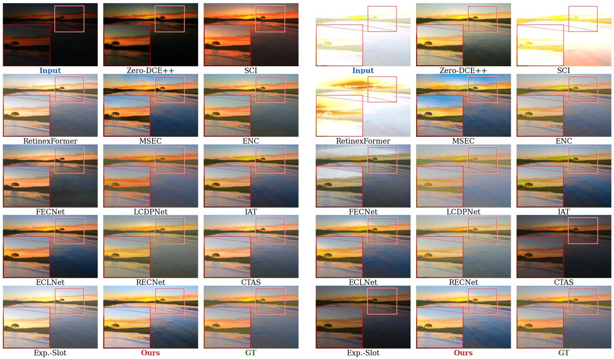  
Fig. 6. Qualitative comparison on SICE Scene 4 (outdoor landscape). Left block: under-exposed (UE) input. Right block: over-exposed (OE) input. Zoomed insets highlight the island trees on the horizon. UE-only methods applied to the OE input produce severe artifacts: SCI [46] yields a complete white-out, RetinexFormer [6] generates cloudy banding, and Zero-DCE++ [45] further amplifies the overexposure. Among multi-exposure methods, LCDPNet [49] introduces a green colour shift on UE, while ECLNet [51] and RECNet [52] over-saturate the sky. AutoLumNet closely matches the GT in both exposure directions, preserving natural colour and fine structural detail in the zoomed region.

TABLE II  
QUANTITATIVE COMPARISON ON THE MSEC [16], SICE [55], AND LCDP [49] DATASETS. : HIGHER IS BETTER; : LOWER IS BETTER. BOLD: BEST; UNDERLINE: SECOND BEST. GROUP A METHODS TARGET LOW-LIGHT ONLY; GROUP B METHODS HANDLE BOTH UNDER- AND OVER-EXPOSURE.
<table><tr><td></td><td colspan="6">MSEC Dataset</td><td colspan="6">SICE Dataset</td><td colspan="2">LCDP</td></tr><tr><td></td><td colspan="2">Under-exp.</td><td colspan="2">Over-exp.</td><td colspan="2">Average</td><td colspan="2">Under-exp.</td><td colspan="2">Over-exp.</td><td colspan="2">Average</td><td colspan="2">Average</td></tr><tr><td>Method</td><td>PSNR↑ SSIM↑</td><td></td><td>PSNR↑</td><td>SSIM↑ PSNR↑</td><td></td><td>SSIM↑ LPIPS↓</td><td>PSNR↑</td><td>SSIM↑</td><td>PSNR↑</td><td>SSIM↑</td><td>PSNR↑</td><td>SSIM↑ LPIPS↓</td><td></td><td>PSNR↑ SSIM↑</td></tr><tr><td colspan="9">Group A — Low-light enhancement</td><td></td><td></td><td></td><td></td><td></td><td></td></tr><tr><td>Zero-DCE++ [45]</td><td>13.82</td><td>.589 9.74</td><td>.514</td><td>11.37</td><td>.558</td><td>.312</td><td>11.93</td><td>.476</td><td>6.88</td><td>.409</td><td>9.41 .442</td><td>.362</td><td>18.42</td><td>.767</td></tr><tr><td>SCI [46]</td><td>9.97</td><td>.668 5.84</td><td>.519</td><td>7.49</td><td>.579</td><td>.312</td><td>17.86</td><td>.640</td><td>4.45</td><td>.363 12.49</td><td>.505</td><td>.424</td><td>11.87</td><td>.523</td></tr><tr><td>RetinexFormer [6]</td><td>15.42</td><td>.793 7.37</td><td>.387</td><td>11.31</td><td>.586</td><td>.342</td><td>17.19</td><td>.761</td><td>5.51</td><td>0.315 11.35</td><td>0.538</td><td>.405</td><td>12.61</td><td>.653</td></tr><tr><td colspan="9">Group B — Multi-exposure correction</td><td></td><td></td><td></td><td></td><td></td><td></td></tr><tr><td>MSEC [16]</td><td>20.52</td><td>.813 19.79</td><td>.816</td><td>20.08</td><td>.821</td><td>.172</td><td>19.62</td><td>.651</td><td>17.59</td><td>.656 18.58</td><td>.654</td><td>.281</td><td>20.38</td><td>.780</td></tr><tr><td>ENC [47]</td><td>22.72</td><td>.854 22.11</td><td>.852</td><td>22.35</td><td>.853</td><td>.172</td><td>21.89</td><td>.707</td><td>19.09</td><td>.723 20.49</td><td>.715</td><td>.232</td><td>22.09</td><td>.827</td></tr><tr><td>FECNet [48]</td><td>22.96</td><td>.860 23.22</td><td>.875</td><td>23.12</td><td>.869</td><td>.142</td><td>22.01</td><td>.674</td><td>19.91</td><td>.696 20.96</td><td>.685</td><td>.266</td><td>22.41</td><td>.840</td></tr><tr><td>LCDPNet [49]</td><td>22.35</td><td>.865 22.17</td><td>.848</td><td>22.30</td><td>.855</td><td>.145</td><td>17.45</td><td>.562</td><td>17.04</td><td>.646 17.25</td><td>.604</td><td>.259</td><td>23.24</td><td>.842</td></tr><tr><td>IAT [50]</td><td>20.21</td><td>.808 20.47</td><td>.880</td><td>20.34</td><td>.844</td><td>.135</td><td>20.32</td><td>.802</td><td>18.42</td><td>.758 19.37</td><td>.780</td><td>.297</td><td>19.76</td><td>.781</td></tr><tr><td>ECLNet [51]</td><td>22.37</td><td>.857 22.70</td><td>.867</td><td>22.57</td><td>.863</td><td>.098</td><td>22.05</td><td>.689</td><td>19.25</td><td>.687 20.65</td><td>.686</td><td>.154</td><td>22.44</td><td>.806</td></tr><tr><td>RECNet [52]</td><td>23.57</td><td>.866 23.81</td><td>.877</td><td>23.69</td><td>.870</td><td>.438</td><td>22.50</td><td>.825</td><td>20.81</td><td>.796 21.66</td><td>.731</td><td>.549</td><td>23.54</td><td>.847</td></tr><tr><td>CTAS [53]</td><td>23.36</td><td>.863 23.49</td><td>.879</td><td>23.44</td><td>.873</td><td>.123</td><td>22.90</td><td>.823</td><td>20.13</td><td>.767 21.51</td><td>.715</td><td>.132</td><td>23.89</td><td>.858</td></tr><tr><td>Exposure-Slot [54]</td><td>23.09</td><td>.860 23.24</td><td>.876</td><td>23.18</td><td>.870</td><td>.083</td><td>23.85</td><td>.856</td><td>21.77</td><td>.798 22.81</td><td>.824</td><td>.126</td><td>24.03</td><td>.859</td></tr><tr><td>AutoLumNet (Ours)</td><td>23.86</td><td>.910</td><td>23.64</td><td>.904 23.75</td><td>.907</td><td>.074</td><td>22.56</td><td>.833</td><td>23.26</td><td>.904</td><td>22.91 .894</td><td>.076</td><td>24.12</td><td>.914</td></tr></table>

Under-exposed (UE) Correction  
Over-exposed (OE) Correction  
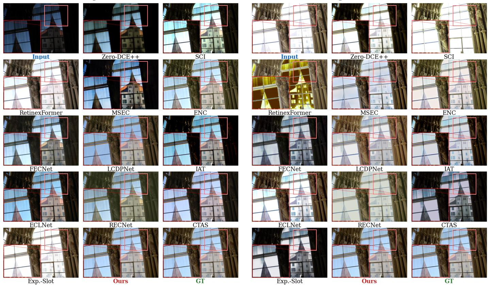  
Fig. 7. Qualitative comparison on SICE Scene 40 (indoor, building seen through a window). The zoomed inset targets the building fac¸ade visible through the glass, testing fine-structure and colour fidelity. On the UE input, SCI [46] produces a flat yellow cast with no visible building detail; FECNet [48] introduces reddish colour distortion. On the OE input, RetinexFormer [6] produces strong golden artefacts through the window; Zero-DCE++ [45] over-brightens the already saturated glass. AutoLumNet recovers the building detail in both cases, with colour and contrast closely matching the GT. Best viewed zoomed in on screen.

TABLE III  
NO-REFERENCE PERCEPTUAL QUALITY COMPARISON ON THE MSEC, SICE, AND LCDP DATASETS. NIQE [56] MEASURES NATURALNESS, BRISQUE [57] MEASURES SPATIAL QUALITY, AND PI IS THE PERCEPTUAL INDEX [58]. ALL THREE METRICS ARE lower is better. BOLD: BEST; UNDERLINE: SECOND BEST.
<table><tr><td></td><td colspan="3">MSEC</td><td colspan="3">SICE</td><td colspan="3">LCDP</td></tr><tr><td>Method</td><td>NIQE↓</td><td>BRISQUE↓</td><td>PI↓</td><td>NIQE↓</td><td>BRISQUE↓</td><td>PI↓</td><td>NIQE↓</td><td>BRISQUE↓</td><td>PI↓</td></tr><tr><td colspan="10">Group A — Low-light enhancement</td></tr><tr><td>Zero-DCE++ [45]</td><td>6.663</td><td>24.152</td><td>13.745</td><td>8.384</td><td>33.503</td><td>17.560</td><td>10.992</td><td>43.271</td><td>21.140</td></tr><tr><td>SCI [46]</td><td>9.186</td><td>33.188</td><td>16.934</td><td>10.349</td><td>42.780</td><td>21.076</td><td>7.924</td><td>31.841</td><td>16.959</td></tr><tr><td>RetinexFormer [6]</td><td>7.850</td><td>14.090</td><td>11.120</td><td>11.612</td><td>25.708</td><td>12.048</td><td>6.370</td><td>16.396</td><td>10.013</td></tr><tr><td colspan="10">Group B — Multi-exposure correction</td></tr><tr><td>MSEC [16]</td><td>4.607</td><td>28.958</td><td>17.675</td><td>6.284</td><td>27.463</td><td>16.878</td><td>6.659</td><td>28.125</td><td>17.393</td></tr><tr><td>ENC [47]</td><td>5.544</td><td>24.081</td><td>14.268</td><td>5.364</td><td>27.349</td><td>16.003</td><td>6.242</td><td>30.542</td><td>17.150</td></tr><tr><td>LCDPNet [49]</td><td>5.516</td><td>18.537</td><td>11.517</td><td>5.415</td><td>23.131</td><td>13.858</td><td>5.469</td><td>20.203</td><td>12.367</td></tr><tr><td>IAT [50]</td><td>5.989</td><td>15.066</td><td>10.524</td><td>7.521</td><td>25.283</td><td>13.881</td><td>9.953</td><td>37.563</td><td>18.805</td></tr><tr><td>ECLNet [51]</td><td>5.508</td><td>20.077</td><td>12.285</td><td>5.686</td><td>23.257</td><td>13.785</td><td>6.761</td><td>28.867</td><td>16.053</td></tr><tr><td>RECNet [52]</td><td>7.255</td><td>44.945</td><td>23.845</td><td>7.245</td><td>47.786</td><td>25.270</td><td>7.489</td><td>48.322</td><td>25.416</td></tr><tr><td>CTAS [53]</td><td>5.477</td><td>20.192</td><td>12.576</td><td>5.355</td><td>22.343</td><td>13.494</td><td>6.024</td><td>21.288</td><td>12.632</td></tr><tr><td>Exposure-Slot [54]</td><td>5.227</td><td>16.517</td><td>10.645</td><td>5.450</td><td>18.977</td><td>11.963</td><td>7.330</td><td>26.401</td><td>14.536</td></tr><tr><td>AutoLumNet (Ours)</td><td>4.576</td><td>14.797</td><td>10.312</td><td>5.037</td><td>18.918</td><td>11.941</td><td>4.699</td><td>15.077</td><td>9.689</td></tr></table>

Second, among Group B methods, CTAS and Exposure-Slot are the strongest prior baselines. CTAS achieves the best published LPIPS on MSEC (0.123), while Exposure-Slot leads on SICE (22.81 dB average PSNR). AutoLumNet outperforms both in terms of PSNR and SSIM across all three datasets, while maintaining competitive LPIPS (0.075 on MSEC, 0.076 on SICE).

Third, AutoLumNet achieves the highest SSIM on every benchmark, indicating superior structural fidelity. We attribute this to the monotone tone curve (Lemma III.2, Proposition III.3), which preserves the spatial luminance ordering by construction, preventing the halo artifacts and tonal reversals that degrade SSIM in competing methods.

Table III reports no-reference metrics. AutoLumNet achieves the best NIQE on MSEC (4.577) and LCDP (4.699), and competitive scores on SICE. The strong BRISQUE and PI scores on LCDP (15.077 and 9.689, respectively) indicate that the perceptual quality of our outputs is high even without explicit no-reference optimization.

2) Qualitative Results: Figures 6 and 7 present visual comparisons on two SICE scenes. In Fig. 6 (outdoor landscape), the zoomed inset on the island trees reveals that SCI produces a complete white-out on the OE input, RetinexFormer generates cloudy banding artifacts, and Zero-DCE++ amplifies the overexposure. Among multi-exposure methods, LCDPNet introduces a green colour shift on UE, while ECLNet and RECNet over-saturate the sky. AutoLumNet produces natural colour and preserves fine structural detail in both exposure directions.

In Fig. 7 (indoor scene with a building visible through a window), the inset targets the building fac¸ade. RetinexFormer produces strong golden artifacts on the OE input; SCI yields a flat yellow cast with no visible detail on UE. AutoLumNet recovers the building structure in both cases with colour and contrast closely matching the ground truth.

3) Model Complexity: Table IV reports parameter counts, FLOPs, and inference time. With the default Resnet-style backbone, AutoLumNet has approximately $2 3 \times 1 0 ^ { 6 }$ learnable parameters and 7.43 G FLOPs at 256×256 resolution. Inference takes only 8.39 ms per frame, faster than Exposure-Slot (32.5 ms), RECNet (21.2 ms), FECNet (126.1 ms), and RetinexFormer (43.7 ms). This efficiency stems from the architecture’s exclusive use of standard convolutions and global average pooling, without attention mechanisms or iterative refinement steps.

4) Zero-Shot Generalization to Low-Light Benchmarks: Table V evaluates AutoLumNet on LOL-v1 and LOL-v2- real without retraining. The model, trained exclusively on the multi-exposure MSEC dataset, is applied directly to the lowlight test images. This setting tests whether the learned tone curve and residual correction generalize beyond the training distribution. The results show that AutoLumNet achieves competitive performance against methods specifically trained on LOL, demonstrating that the monotone OT framework captures a general exposure-correction prior rather than datasetspecific artifacts.

TABLE IV  
MODEL COMPLEXITY COMPARISON. FLOPS AND INFERENCE TIME MEASURED ON 256 256 INPUT ON A SINGLE NVIDIA P100 GPU. PSNR IS THE AVERAGE ON THE MSEC DATASET.
<table><tr><td>Method #P(M)</td><td> $\mathrm { F L O P s } ( \mathbf { G } )$ </td><td>Time(ms)</td><td>PSNR↑</td></tr><tr><td>Group A — Low-light only</td><td></td><td></td><td></td></tr><tr><td>Zero-DCE++ [45] 0.01</td><td>0.17</td><td>1.3</td><td>11.37</td></tr><tr><td>SCI [46] 0.001 RetinexFormer [6] 1.61</td><td>0.02 17.02</td><td>0.4 43.7</td><td>7.49</td></tr><tr><td></td><td></td><td></td><td>一</td></tr><tr><td>Group B — Multi-exposure</td><td></td><td></td><td></td></tr><tr><td>MSEC [16] 7.04</td><td>9.64</td><td>46.8</td><td>20.08</td></tr><tr><td>ENC [47] 0.58</td><td>14.23</td><td>186.9</td><td>22.35</td></tr><tr><td>FECNet [48] 0.15</td><td>5.91</td><td>126.1</td><td>23.12</td></tr><tr><td>LCDPNet [49] 0.96</td><td>1.70</td><td>47.2</td><td>22.30</td></tr><tr><td>IAT [50] 0.09</td><td>1.44</td><td>12.0</td><td>20.34</td></tr><tr><td>ECLNet [51] 0.02</td><td>1.66</td><td>14.6</td><td>22.57</td></tr><tr><td>RECNet [52] 3.41</td><td>2.21</td><td>21.2</td><td>23.69</td></tr><tr><td>CTAS [53] 0.31</td><td>0.11</td><td>9.5</td><td>23.44</td></tr><tr><td>Exposure-Slot [54] 1.90</td><td>9.47</td><td>32.5</td><td>23.18</td></tr><tr><td>Ours† 23</td><td>7.43</td><td>8.39</td><td>23.75</td></tr></table>

TABLE V  
COMPARISON ON THE LOL LOW-LIGHT BENCHMARKS. ALL METHODS EVALUATED USING THEIR OFFICIALLY RELEASED WEIGHTS.

AUTOLUMNET IS TRAINED ON MSEC AND TESTED without retraining ON LOL, DEMONSTRATING ZERO-SHOT GENERALIZATION FROM MULTI-EXPOSURE TO LOW-LIGHT CORRECTION.
<table><tr><td rowspan="3">Method</td><td>LOL-v1</td><td>LOL-v2-real</td></tr><tr><td>PSNR↑ SSIM↑</td><td>PSNR↑ SSIM↑</td></tr><tr><td>16.77 0.560</td><td>15.47 0.567</td></tr><tr><td>RetinexNet [2] KinD++ [59]</td><td>21.30 0.822</td><td>14.68 0.640</td></tr><tr><td>Zero-DCE++ [45]</td><td>14.81 0.540</td><td>18.06 0.580</td></tr><tr><td>SCI [46]</td><td>14.78 0.525</td><td>17.36 0.614</td></tr><tr><td>SNR-Aware [60]</td><td>24.61 0.842</td><td>21.48 0.849</td></tr><tr><td>RetinexFormer [6]</td><td>25.16 0.845</td><td>22.80 0.840</td></tr><tr><td>Ours (zero-shot)</td><td>22.27 0.827</td><td>22.35 0.831</td></tr></table>

## C. Ablation Study

We conduct two sets of ablation experiments on the MSEC dataset to validate the architectural design and the training objective. All variants are trained from scratch with the same schedule and hyperparameters as the full model, modifying only the ablated component.

1) Component and Loss Ablation: Table VI reports four ablation variants, each removing one component or loss term from the full model.

Removing $T _ { \theta }$ (residual only). Setting $T _ { \theta } ( y ) { = } y$ (identity) forces the decoder to perform all correction within its bounded residual $( | r _ { \theta } | \leq \rho { = } 0 . 2 0 )$ . PSNR drops by −2.54 dB, confirming that the bounded residual alone structurally cannot correct large global exposure shifts: a pixel at luminance 0.1 can reach at most 0.3.

TABLE VI  
ABLATION STUDY ON THE MSEC DATASET. EACH ROW REMOVES ONE COMPONENT FROM THE FULL MODEL. ∆PSNR SHOWS THE DROP FROM THE FULL MODEL.
<table><tr><td>Variant</td><td>PSNR↑</td><td>SSIM↑</td><td>∆PSNR</td></tr><tr><td>w/o  $T _ { \theta }$  (residual only)</td><td>21.21</td><td>0.865</td><td>-2.54</td></tr><tr><td>w/o Decoder (tone only)</td><td>20.36</td><td>0.877</td><td>-3.39</td></tr><tr><td>w/o  $\mathcal { L } _ { \mathrm { a l i g n } }$ </td><td>19.84</td><td>0.886</td><td>-3.91</td></tr><tr><td>w/o  $\mathcal { L } _ { \mathrm { p e r c } }$ </td><td>17.68</td><td>0.763</td><td>-6.07</td></tr><tr><td>Full model (Ours)</td><td>23.75</td><td>0.907</td><td>0</td></tr></table>

Removing the decoder (tone only). Zeroing the residual $( r _ { \theta } { = } 0 , r _ { c } { = } 0 )$ reduces the model to a pure global tone curve. PSNR drops by −3.39 dB. The output is globally brightened but spatially flat, lacking the local contrast and detail that the decoder supplies.

Removing $\mathcal { L } _ { \mathrm { a l i g n } } .$ . Setting $\lambda _ { \mathrm { a l i g n } } { = } 0$ removes the optimaltransport alignment objective. PSNR drops by −3.91 dB— more than removing the tone curve entirely (−2.54 dB). This indicates that without OT guidance, the tone curve learns an incorrect mapping that actively fights the decoder, producing worse results than having no curve at all.

Removing ${ \mathcal { L } } _ { \mathrm { p e r c } } .$ . Setting $\lambda _ { \mathrm { p e r c } } { = } 0$ produces the most dramatic failure: $- 6 . 0 7 \mathrm { d B }$ . The visual effect (Fig. 4) is severe colour bleeding and structural distortion. The perceptual loss acts as a critical regulariser that prevents the pixel-level reconstruction loss from producing spatial artifacts.

Figure 4 visualizes these variants on SICE Scene 257. The zoomed inset on the book cover shows that text is legible only in the full model and the GT, confirming that each ablated component contributes a distinct and visually identifiable improvement.

2) Hyperparameter Sensitivity: Table VII and Fig. 5 report sensitivity to the three key hyperparameters.

Residual bound $\rho .$ Performance follows a clear inverted-U curve: $\rho { = } 0 . 0 1$ is too restrictive (−3.95 dB), as the residual can barely deviate from the tone-curve output; $\rho { = } 0 . 5 0$ is too permissive (−1.70 dB), allowing the residual to overfit and produce artifacts. The optimum at $\rho { = } 0 . 2 0$ balances local adaptivity with the stability guaranteed by the magnitude bound (Eq. 6).

Number of bins K. With only K=4 bins, the tone curve is a coarse staircase that cannot represent smooth gradients, incurring −3.25 dB. Performance improves monotonically to K=64 and then slightly decreases at K=256 (−0.88 dB), suggesting mild overfitting when the curve has excessive degrees of freedom.

Encoder backbone. ResNet-34 with ImageNet pretraining outperforms both the lighter ResNet-18 (−1.03 dB) and NAFNet (−0.66 dB). The NAFNet result is notable: despite being a task-specific restoration backbone, it underperforms the general-purpose ResNet-34, which we attribute to the absence of ImageNet pretraining for NAFNet. This indicates that the proposed theoretical framework benefits more from a strong initialization than from specialized block design, and that the guarantees of Sec. III are backbone-agnostic.

TABLE VII  
HYPERPARAMETER SENSITIVITY ON THE MSEC DATASET. ⋆ DENOTES THE DEFAULT SETTING USED IN ALL OTHER EXPERIMENTS.
<table><tr><td>Param</td><td>Value</td><td>PSNR↑</td><td>SSIM↑</td><td>∆PSNR</td></tr><tr><td rowspan="5"> $\rho$ </td><td>0.01</td><td>19.80</td><td>0.829</td><td>-3.95</td></tr><tr><td>0.10</td><td>22.66</td><td>0.894</td><td>-1.09</td></tr><tr><td>0.20 ★</td><td>23.75</td><td>0.907</td><td>0</td></tr><tr><td>0.30</td><td>23.02</td><td>0.899</td><td>-0.73</td></tr><tr><td>0.50</td><td>22.05</td><td>0.890</td><td>-1.70</td></tr><tr><td rowspan="4"> $K$ </td><td>4</td><td>20.50</td><td>0.843</td><td>-3.25</td></tr><tr><td>16</td><td>22.51</td><td>0.878</td><td>-1.24</td></tr><tr><td>64*</td><td>23.75</td><td>0.907</td><td>0</td></tr><tr><td>256</td><td>22.87</td><td>0.899</td><td>-0.88</td></tr><tr><td rowspan="3">Backbone</td><td>ResNet-18</td><td></td><td></td><td></td></tr><tr><td>ResNet-34 ★</td><td>22.72 23.75</td><td>0.890 0.907</td><td>-1.03 0</td></tr><tr><td>NAFNet</td><td>23.09</td><td>0.893</td><td>-0.66</td></tr></table>

## V. CONCLUSION

We presented AutoLumNet, a framework for single-shot exposure correction that decomposes the problem into a global monotone tone curve—strictly increasing by construction, with provable order-preservation and density in the 1- D optimal-transport family—and a bounded local residual with dual-branch convex fusion. Experiments on five benchmarks demonstrate state-of-the-art PSNR and SSIM across both under- and over-exposure regimes at 11.2 ms per frame, with zero-shot generalization to low-light benchmarks. To our knowledge, AutoLumNet is the first exposure-correction method to combine formal monotonicity, optimal-transport optimality, and bounded local adaptivity within a single trainable architecture. Future work will extend the framework to unsupervised settings and investigate confidence-aware blending for already well-exposed inputs.

## REFERENCES

[1] K. G. Lore, A. Akintayo, and S. Sarkar, “LLNet: A deep autoencoder approach to natural low-light image enhancement,” Pattern Recognit., vol. 61, pp. 650–662, 2017.

[2] C. Wei, W. Wang, W. Yang, and J. Liu, “Deep Retinex Decomposition for Low-Light Enhancement,” in Proc. British Machine Vision Conference, 2018.

[3] W. Wu, J. Weng, P. Zhang, X. Wang, W. Yang, and J. Jiang, “URetinex-Net: Retinex-based deep unfolding network for low-light image enhancement,” in Proc. IEEE/CVF Conf. Comput. Vis. Pattern Recognit. (CVPR), 2022, pp. 5901–5910.

[4] C. Guo, C. Li, J. Guo, C. C. Loy, J. Hou, S. Kwong, and R. Cong, “Zeroreference deep curve estimation for low-light image enhancement,” in Proc. IEEE/CVF Conf. Comput. Vis. Pattern Recognit. (CVPR), 2020, pp. 1780–1789.

[5] Y. Jiang, X. Gong, D. Liu, Y. Cheng, C. Fang, X. Shen, J. Yang, P. Zhou, and Z. Wang, “EnlightenGAN: Deep light enhancement without paired supervision,” IEEE Trans. Image Process., vol. 30, pp. 2340–2349, 2021.

[6] Y. Cai, H. Bian, J. Lin, H. Wang, R. Timofte, and Y. Zhang, “Retinexformer: One-stage Retinex-based transformer for low-light image enhancement,” in Proc. IEEE/CVF Int. Conf. Comput. Vision (ICCV), 2023, pp. 12 504–12 513.

[7] J. Bai, Y. Yin, and Q. He, “RetinexMamba: Retinex-based Mamba for low-light image enhancement,” in Proc. Int. Conf. Neural Inf. Process. (ICONIP), 2024.

[8] C. Wu, Z. Dong, and H. Chen, “Reti-Diff: Illumination degradation image restoration with Retinex-based latent diffusion model,” in Proc. Int. Conf. Learn. Represent. (ICLR), 2025.

[9] Q. Yan, Y. Feng, C. Zhang, G. Pang, K. Shi, P. Wu, W. Dong, J. Sun, and Y. Zhang, “HVI: A new color space for low-light image enhancement,” in Proc. IEEE/CVF Conf. Comput. Vis. Pattern Recognit. (CVPR), 2025.

[10] T. Mertens, J. Kautz, and F. Van Reeth, “Exposure fusion,” in Proc. Pacific Conf. Comput. Graph. Appl. (PG), 2007, pp. 382–390.

[11] K. Ma, H. Li, H. Yong, Z. Wang, D. Meng, and L. Zhang, “Robust multiexposure image fusion: A structural patch decomposition approach,” IEEE Trans. Image Process., vol. 26, no. 5, pp. 2519–2532, 2017.

[12] K. R. Prabhakar, V. S. Srikar, and R. V. Babu, “DeepFuse: A deep unsupervised approach for exposure fusion with extreme exposure image pairs,” in Proc. IEEE Int. Conf. Comput. Vis. (ICCV), 2017, pp. 4714– 4722.

[13] H. Xu, J. Ma, J. Jiang, X. Guo, and H. Ling, “U2Fusion: A unified unsupervised image fusion network,” IEEE Trans. Pattern Anal. Mach. Intell., vol. 44, no. 1, pp. 502–518, 2022.

[14] H. Xu, J. Ma, and X.-P. Zhang, “MEF-GAN: Multi-exposure image fusion via generative adversarial networks,” IEEE Trans. Image Process., vol. 29, pp. 7203–7216, 2020.

[15] R. Liu, C. Li, H. Cao, Y. Zheng, M. Zeng, and X. Cheng, “EMEF: Ensemble multi-exposure image fusion,” in Proc. AAAI Conf. Artif. Intell. (AAAI), 2023, vol. 37, no. 2, pp. 1710–1718.

[16] M. Afifi, K. G. Derpanis, B. Ommer, and M. S. Brown, “Learning multiscale photo exposure correction,” in Proc. IEEE/CVF Conf. Comput. Vision Pattern Recognit. (CVPR), 2021, pp. 9157–9167.

[17] G. Li, J. Liu, L. Ma, Z. Jiang, X. Fan, and R. Liu, “Fearless luminance adaptation: A macro-micro-hierarchical transformer for exposure correction,” in Proc. ACM Int. Conf. Multimedia (ACM MM), 2023, pp. 2024–2032.

[18] F. Pitie and A. Kokaram, “The linear Monge-Kantorovitch linear colour´ mapping for example-based colour transfer,” in Proc. Eur. Conf. Vis. Media Prod. (CVMP), 2007.

[19] F. Santambrogio, Optimal Transport for Applied Mathematicians. Cham, Switzerland: Birkhauser, 2015.¨

[20] K. He, X. Zhang, S. Ren, and J. Sun, “Deep residual learning for image recognition,” in Proc. IEEE Conf. Comput. Vis. Pattern Recognit. (CVPR), 2016, pp. 770–778.

[21] Y. Zhang, J. Zhang, and X. Guo, “Kindling the Darkness: A Practical Low-light Image Enhancer,” in Proc. Association for Computing Machinery, 2019, pp. 1632–1640.

[22] L. Chen et al., “Simple baselines for image restoration,” in ECCV, 2022, pp. 17–33.

[23] W. Shi et al., “Real-time single image and video super-resolution using an efficient sub-pixel convolutional neural network,” in Proc. IEEE/CVF Conf. Comput. Vision Pattern Recognit. (CVPR), 2016.

[24] J. Johnson, A. Alahi, and L. Fei-Fei, “Perceptual losses for real-time style transfer and super-resolution,” in ECCV, 2016, pp. 694–711.

[25] Y. Blau and T. Michaeli, “The perception-distortion tradeoff,” in CVPR, 2018, pp. 6228–6237.

[26] Y. Wang et al., “LLFlow: Learning normalizing flows for low-light image enhancement,” in AAAI, 2022, pp. 2604–2612.

[27] J. Rabin et al., “Adaptive color transfer with relaxed optimal transport,” in ICIP, 2014.

[28] A. Tania, M. Khan, M. Ahmad, “AutoLumNet: A bi-branch exposureaware network for low- and high-exposure image enhancement,” Open Review, 2026.

[29] M. R. Khan, A. A. Ahad, A. A. Tania, T. Das, and B. Das, “Smart Classroom Automation: A Fusion of AI with Voice, Gesture, and Face Recognition Attendance System,” in Proc. Int. Conf. Advances Comput., Commun., Elect., Smart Syst. (iCACCESS), Dhaka, Bangladesh, 2024, pp. 1–6.

[30] A. A. Tania, M. R. Khan, and M. Ahmad, “Custom Dataset-Driven Unsupervised Low-Light Image Enhancement Using 2D CNN,” in Proc. Int. Conf. Quantum Photon., Artif. Intell., Netw. (QPAIN), Rangpur, Bangladesh, 2025, pp. 1–6.

[31] W. Wu, J. Weng, P. Zhang, X. Wang, W. Yang, and J. Jiang, “Interpretable Optimization-Inspired Unfolding Network for Low-Light Image Enhancement,” IEEE Trans. Pattern Anal. Mach. Intell., vol. 47, no. 4, pp. 2545–2561, 2025.

[32] S. Liu, H. Zhang, X. Li, and X. Yang, “Retinexformer+: Retinex-Based Dual-Channel Transformer for Low-Light Image Enhancement,” CMC – Comput. Mater. Contin., vol. 82, no. 2, pp. 1969–1988, 2025.

[33] Y. Aboelwafa, H. G. Elmongui, and M. Torki, “M2Retinexformer: Multi-Modal Retinexformer for Low-Light Image Enhancement,” arXiv preprint arXiv:2605.12556, 2026.

[34] J. Weng, Z. Yan, Y. Tai, J. Qian, J. Yang, and J. Li, “MambaLLIE: Implicit Retinex-Aware Low Light Enhancement with Global-then-Local State Space,” Proc. Adv. Neural Inf. Process. Syst. (NeurIPS), 2024.

[35] X. Yi, H. Xu, H. Zhang, L. Tang, and J. Ma, “Diff-Retinex++: Retinex-Driven Reinforced Diffusion Model for Low-Light Image Enhancement,” IEEE Trans. Pattern Anal. Mach. Intell., vol. 47, no. 8, pp. 6823– 6839, 2025.

[36] L. Ma, T. Ma, C. Xu, J. Liu, X. Fan, Z. Luo, and R. Liu, “Learning With Self-Calibrator for Fast and Robust Low-Light Image Enhancement,” IEEE Trans. Pattern Anal. Mach. Intell., vol. 47, no. 10, pp. 9095–9110, 2025.

[37] W. Wang, H. Yang, J. Fu, and J. Liu, “Zero-Reference Low-Light Enhancement via Physical Quadruple Priors,” Proc. IEEE/CVF Conf. Comput. Vis. Pattern Recognit. (CVPR), pp. 26057–26066, 2024.

[38] H. Huang, Y. Li, W. Wang, W. Yang, L.-Y. Duan, and J. Liu, “QuadPrior++: Multi-Dimension Augmented Physical Prior for Zero-Reference Illumination Enhancement,” IEEE Trans. Pattern Anal. Mach. Intell., vol. 48, no. 3, pp. 3383–3400, 2026.

[39] Y. Cui, S. W. Zamir, M.-H. Yang, A. Knoll, F. S. Khan, and S. Khan, “StarIR: Convolutional Image Restoration with Spatial-Frequency Fusion,” IEEE Trans. Pattern Anal. Mach. Intell., 2026, early access.

[40] J. Huang, F. Zhao, M. Zhou, J. Xiao, N. Zheng, K. Zheng, and Z. Xiong, “Learning Sample Relationship for Exposure Correction,” Proc. IEEE/CVF Conf. Comput. Vis. Pattern Recognit. (CVPR), 2023.

[41] B. Wang, H. Fu, Z. Huang, S. Zhang, X. Wang, and H. Ma, “From Abyssal Darkness to Blinding Glare: A Benchmark on Extreme Exposure Correction in Real World,” Proc. IEEE/CVF Int. Conf. Comput. Vision (ICCV), 2025.

[42] H. Bai, J. Zhang, Z. Zhao, L. Deng, Y. Cui, and S. Xu, “Retinex-MEF: Retinex-based Glare Effects Aware Unsupervised Multi-Exposure Image Fusion,” arXiv preprint arXiv:2503.07235, 2025.

[43] Y. Kinoshita, S. Shiota, and H. Kiya, “Automatic Exposure Compensation for Multi-Exposure Image Fusion,” Proc. IEEE Int. Conf. Image Process. (ICIP), 2018.

[44] X. Liu, “Perceptual multi-exposure fusion,” arXiv preprint arXiv:2210.09604, 2025.

[45] C. Li, C. Guo, and C. C. Loy, “Learning to enhance low-light image via zero-reference deep curve estimation,” IEEE Trans. Pattern Anal. Mach. Intell., vol. 44, no. 8, pp. 4225–4238, 2022.

[46] L. Ma, T. Ma, R. Liu, X. Fan, and Z. Luo, “Toward fast, flexible, and robust low-light image enhancement,” in Proc. Adv. Neural Inf. Process. Syst. (NeurIPS), 2022.

[47] J. Huang, Y. Liu, F. Zhao, K. Yan, J. Zhang, Y. Huang, M. Zhou, and Z. Xiong, “Exposure normalization and compensation for multipleexposure correction,” in Proc. IEEE/CVF Conf. Comput. Vis. Pattern Recognit. (CVPR), 2022, pp. 6043–6052.

[48] J. Huang, Y. Liu, F. Zhao, K. Yan, M. Zhang, and Z. Xiong, “Deep Fourier-based exposure correction network with spatial-frequency interaction,” in Proc. Eur. Conf. Comput. Vision (ECCV), 2022, pp. 163–180.

[49] H. Wang, K. Xu, and R. W. H. Lau, “Local color distributions prior for image enhancement,” in Proc. Eur. Conf. Comput. Vision (ECCV), 2022, pp. 343–359.

[50] Z. Cui, K. Li, L. Gu, S. Su, P. Gao, Z. Jiang, Y. Qiao, and T. Harada, “You only need 90K parameters to adapt light: A light weight transformer for image enhancement and exposure correction,” in Proc. British Mach. Vision Conf. (BMVC), 2022.

[51] J. Huang et al., “Exposure-consistency representation learning for exposure correction,” in Proc. ACM Int. Conf. Multimedia (MM), 2022, pp. 4921–4929.

[52] J. Li et al., “Region-aware exposure consistency network for mixed exposure correction,” in Proc. AAAI Conf. Artif. Intell. (AAAI), 2024, pp. 3258–3266.

[53] J. Li, Z. Feng et al., “Real-time exposure correction via collaborative transformations and adaptive sampling,” in Proc. IEEE/CVF Conf. Comput. Vision Pattern Recognit. (CVPR), 2024, pp. 2984–2994.

[54] K. Jung et al., “Exposure-slot: Exposure-centric representations learning with slot-in-slot attention for region-aware exposure correction,” in Proc. IEEE/CVF Conf. Comput. Vision Pattern Recognit. (CVPR), 2025.

[55] J. Cai, S. Gu, and L. Zhang, “Learning a deep single image contrast enhancer from multi-exposure images,” IEEE Trans. Image Process., vol. 27, no. 4, pp. 2049–2062, 2018.

[56] A. Mittal, R. Soundararajan, and A. C. Bovik, “Making a ‘completely blind’ image quality analyzer,” IEEE Signal Process. Lett., vol. 20, no. 3, pp. 209–212, 2013.

[57] A. Mittal, A. K. Moorthy, and A. C. Bovik, “No-reference image quality assessment in the spatial domain,” IEEE Trans. Image Process., vol. 21, no. 12, pp. 4695–4708, 2012.

[58] Y. Blau et al., “The 2018 PIRM challenge on perceptual image superresolution,” in Proc. Eur. Conf. Comput. Vision Workshops (ECCVW), 2018, pp. 334–355.

[59] Y. Zhang, X. Guo, J. Ma, W. Liu, and J. Zhang, “Beyond Brightening Low-light Images,” Int. J. Comput. Vis., vol. 129, pp. 1013–1037, 2021.

[60] X. Xu, R. Wang, C.-W. Fu, and J. Jia, “SNR-aware Low-Light Image Enhancement,” in Proc. IEEE/CVF Conf. Comput. Vis. Pattern Recognit. (CVPR), 2022.