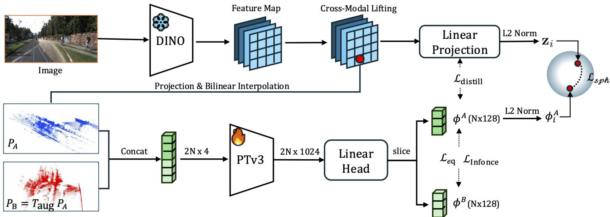
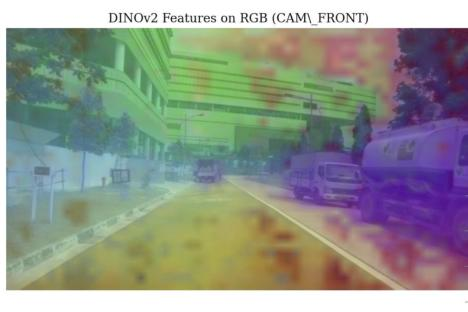
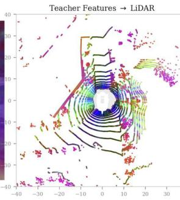
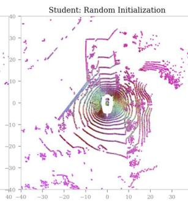
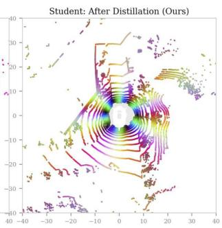
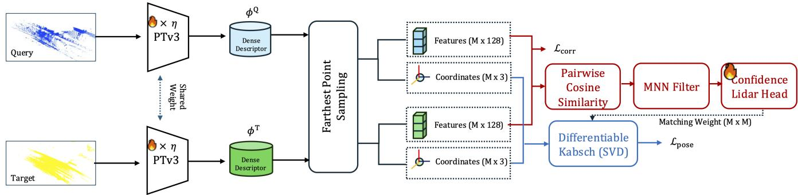
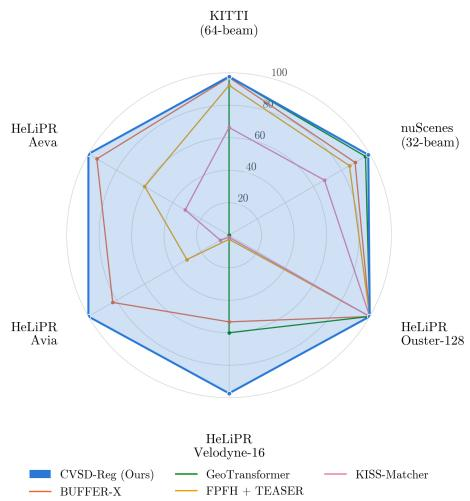
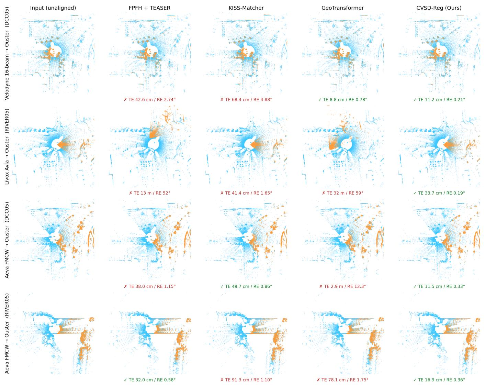

# CVSD-Reg: Cross-Modal Visual Semantic Prior Distillation for Robust LiDAR Registration

Eunsoo Im, Junghun Suh, Gyeonggwan Lee and Seunghwan Hong

## Abstract

Learning-based global point cloud registration has achieved remarkable progress, yet its reliance on geometric representations makes existing methods sensitive to variations in point density, scan pattern, viewpoint, and sensor characteristics. We propose CVSD-Reg, a robust global LiDAR registration framework that distills visual semantic priors from a vision foundation model into LiDAR representations. In Stage 1, a Point Transformer V3 student learns from a frozen DINOv2 teacher through contrastive distillation and spherical-manifold alignment, which preserves the hyperspherical geometry of the teacher embedding space. Self-supervised InfoNCE consistency and soft SE(3) invariance further encourage viewpoint-robust descriptors. In Stage 2, the distilled representation is adapted to registration through correspondence learning, density-aware point-dropout augmentation, and end-to-end pose optimization. With a single checkpoint, CVSD-Reg generalizes to both single-sensor and zero-shot cross-sensor scenarios without sensor-specific adaptation and remains entirely camera-free at inference. On KITTI, nuScenes, and HeLiPR, CVSD-Reg achieves strict success rate (SR@0.5 m/1◦) of 97.7%, 99.0%, and 99.3%, respectively, including 97.3% on sparse 16-beam Velodyne scans. It outperforms state-of-the-art geometric registration methods by up to 44.0 percentage points without requiring camera inputs or post-hoc ICP refinement.

## Introduction

Point cloud registration estimates a rigid transformation $\mathbf { T } \in \mathrm { S E } ( 3 )$ that aligns a source scan $\mathcal { P } _ { q }$ with a target scan $\mathcal { P } _ { t }$ and is fundamental to mapping, localization, and multi-session map updates. Although recent learning-based methods have substantially advanced global registration, their descriptors and correspondences remain sensitive to geometric variations arising from changes in point density, scan pattern, viewpoint, and sensor characteristics. Both classical descriptors such as FPFH (Rusu, Blodow, and Beetz 2009) and learned geometric matchers (Qin et al. 2022; Huang et al. 2024) can therefore degrade under severe sparsity, low overlap, or out-of-distribution sampling patterns. This problem is particularly pronounced across heterogeneous LiDAR systems, whose diferent beam configurations and sensing principles induce substantial shifts in observed geometry, motivating complementary priors that remain informative when geometric evidence is unreliable.

Recent registration methods have sought to improve robustness to such geometric variations through adaptive voxelization and geometric normalization (Seo et al. 2025) or flow-matching-based registration (Pan et al. 2025). Nevertheless, their correspondences remain predominantly geometrydriven and can become unreliable when structural evidence is sparse or ambiguous. Vision foundation models such as DINOv2 (Oquab et al. 2024) provide complementary semantic representations that are comparatively stable across viewpoints and can disambiguate geometrically similar structures. Prior works, however, either require visual features at inference time (Vödisch et al. 2025) or distill them mainly for semantic understanding (Sautier et al. 2022; Puy et al. 2024), leaving their transfer to camera-free LiDAR descriptors for correspondence estimation and pose recovery largely unexplored.

To bridge this gap, we propose CVSD-Reg, a robust global LiDAR registration framework that learns 3D representations robust to geometric variations by distilling visual semantic priors. Our key idea is to decouple semantic representation learning from registration-specific adaptation in a two-stage training scheme. In Stage 1, visual semantic priors encoded by a frozen vision foundation model are transferred to a LiDAR backbone through cross-modal contrastive distillation. To retain the feature space organization of these priors during distillation, teacher and student descriptors are further aligned on the unit hypersphere. This preserves the angular structure of the teacher embedding space, while consistency learning across rigidly transformed views promotes robustness to viewpoint and geometric variations. In Stage 2, the pretrained representation is adapted to pairwise registration by jointly learning cross-scan correspondences and relative pose estimation. Confidence-weighted matches are integrated with a diferentiable Kabsch solver, allowing pose-level supervision to directly refine both the descriptor and correspondence networks, while density-aware point dropout improves robustness to variations in scan sparsity.

CVSD-Reg uses a single checkpoint and a unified inference configuration across conventional single-sensor benchmarks and zero-shot cross-sensor settings. It achieves a strict success rate (SR@0.5 m/1◦) of 97.7% on KITTI, 99.0% on nuScenes, and 99.3% on HeLiPR, including 97.3% on sparse 16-beam Velodyne scans. These results indicate that visual semantic prior distillation improves registration robustness to geometric distribution shifts without compromising standard singlesensor performance.

In summary, our main contributions are three-fold:

1. We present CVSD-Reg, a global LiDAR registration framework that distills visual semantic priors from a frozen vision foundation model into a LiDAR backbone, enabling camera-free inference.

2. We introduce a registration-oriented two-stage learning strategy that couples hyperspherical cross-modal distillation in Stage 1 with density-robust correspondence and end-to-end pose supervision in Stage 2.

3. A single CVSD-Reg checkpoint achieves strong singlesensor accuracy on KITTI and nuScenes and state-of-theart zero-shot cross-sensor robustness on HeLiPR, outperforming the strongest geometric baseline by up to 44.0 percentage points on sparse 16-beam scans.

## Related Work

Cross-modal distillation SLidR (Sautier et al. 2022) and ScaLR (Puy et al. 2024) lift frozen ViT features onto LiDAR points and distill them into sparse 3D backbones, yet optimize primarily for semantic segmentation rather than correspondence for registration. PointCLIP (Zhang et al. 2022) and OpenScene (Peng et al. 2023) similarly pursue CLIP-style 3D feature lifting for open-vocabulary understanding. Closer to our setting, VFM-Registration (Vödisch et al. 2025) projects DINOv2 patches onto outdoor LiDAR at test time, preserving foundation-model quality but requiring synchronized, calibrated cameras at deployment. DINOReg (Chen and Qu 2025) combines DINOv2 with geometric cues, but only under indoor RGB-D evaluation. CVSD-Reg instead distills once at training time and runs a camera-free LiDAR-only pipeline at inference on heterogeneous outdoor benchmarks.

LiDAR registration Learning-based matchers such as Geo-Transformer (Qin et al. 2022), MAC (Zhang et al. 2023), CAST (Huang et al. 2024), PARE-Net (Yao et al. 2024), and UGP (Zeng et al. 2025) attain strong in-distribution accuracy, but their descriptors are tied to the multi-beam geometries seen in training and degrade under unseen sparsity or scan patterns. BUFFER-X (Seo et al. 2025) mitigates some of this gap with adaptive voxelization and patch-wise scale normalization for zero-shot scene transfer, while RAP (Pan et al. 2025) reformulates registration as conditional flow matching with an alternating-attention velocity field. Learning-free pipelines such as KISS-Matcher (Lim et al. 2025) improve scalability via Faster-PFH descriptors and linear-complexity graph pruning, yet still depend on handcrafted geometric cues. Across both families, purely geometric evidence becomes unreliable when beam density collapses or sensor topology shifts out of distribution. As a complementary approach, CVSD-Reg retains a standard 3D backbone and injects vision-derived semantic anchors during training to stabilize matching under these shifts.

Feature geometry Registration quality depends on how descriptors are organized in feature space. Hard structural equivariance, as in PARE-Net (Yao et al. 2024), SE(3)- Transformers (Fuchs et al. 2020), and Vector Neurons (Deng et al. 2021), preserves pose structure by construction. Hyperspherical metric learning such as ArcFace (Deng et al. 2019)

and SphereFace (Liu et al. 2017) instead sharpens angular separability on the unit sphere. Rather than imposing hard equivariant architectures, CVSD-Reg adopts a soft alternative. Student features are aligned to the teacher on $\mathbb { S } ^ { d - 1 }$ via geodesic distance with an angular margin, and rigid-view con sistency is encouraged with a soft SE(3) invariance objective, which avoids the distortion that flat Euclidean matching can induce.

## Overview

CVSD-Reg adopts a two-stage training framework that separates visual semantic prior learning from registration-specific adaptation. Stage 1 distills semantic priors from a frozen DINOv2 (Oquab et al. 2024) teacher into a Point Transformer V3 (PTv3) (Wu et al. 2024) LiDAR backbone using synchronized image–LiDAR data (Figure 1). Hyperspherical teacher–student alignment and consistency learning across rigidly transformed LiDAR views encourage semantically grounded and viewpoint-robust descriptors. In Stage 2, the vision teacher is removed, and the pretrained LiDAR backbone is fine-tuned on unposed LiDAR pairs through correspondence and pose learning under varying scan densities, as detailed in Figure 3. This decoupling confines visual supervision to pretraining and yields a camera-free LiDAR-only registration pipeline at inference.

Stage-1: Cross-Modal Distillation Pretraining Given a LiDAR scan $\mathcal { P } _ { A } = \{ \mathbf { p } _ { i } \} _ { i = 1 } ^ { N }$ with coordinates $\mathbf { p } _ { i } \in$ $\mathbb { R } ^ { 3 }$ and per-point intensity, and V synchronized camera images $\{ I _ { v } \} _ { v = 1 } ^ { V }$ , Stage 1 transfers dense visual semantic priors from the frozen DINOv2 teacher to the PTv3 student. The teacher branch lifts image features onto LiDAR points visible from the synchronized cameras, providing point-wise semantic supervision. The student branch encodes the original scan and a rigidly augmented view. The representation is jointly optimized through cross-modal teacher–student distillation and self-supervised rigid-view consistency.

Visual Feature Lifting To construct point-wise semantic targets, we lift dense DINOv2 features from the image plane to the LiDAR coordinate frame. For the v-th camera, the point $\mathbf { p } _ { i }$ is transformed and projected onto the image plane as

$$
\mathbf { q } _ { i } ^ { v } = \mathbf { R } _ { v } \mathbf { p } _ { i } + \mathbf { t } _ { v } , \qquad \mathbf { u } _ { i } ^ { v } = \pi \left( \mathbf { K } _ { v } \mathbf { q } _ { i } ^ { v } \right) ,\tag{1}
$$

where $\mathbf { R } _ { v } \in \mathrm { S O } ( 3 )$ and $\mathbf { t } _ { v } \in \mathbb { R } ^ { 3 }$ define the LiDAR-to-camera transformation, ${ \bf K } _ { v }$ is the camera intrinsic matrix, and $\pi ( \cdot )$ denotes perspective division.

Let $\nu _ { i }$ denote the set of cameras in which $\mathbf { p } _ { i }$ has a valid depth in $[ z _ { \mathrm { m i n } } , z _ { \mathrm { m a x } } ]$ m and projects inside the image boundary. For each valid view, the DINOv2 feature is bilinearly sampled at $\mathbf { u } _ { i } ^ { v }$ as $\mathbf { F } _ { v } ( \mathbf { u } _ { i } ^ { v } )$ . The point-wise teacher feature is then computed by averaging these features over all valid views:

$$
\mathbf { f } _ { i } = \frac { 1 } { \left| \mathcal { V } _ { i } \right| } \sum _ { v \in \mathcal { V } _ { i } } \mathbf { F } _ { v } \left( \mathbf { u } _ { i } ^ { v } \right) ,\tag{2}
$$

Cross-modal supervision is applied only to visible points indexed by $\mathcal { T } \doteq \{ i \in \{ 1 , \ldots , N \} \mid | \dot { \mathcal { V } _ { i } } | > 0 \}$ . Figure 2 qualitatively compares the lifted teacher features with the randomly initialized and distilled student representations.

  
Figure 1: Overview of Stage-1 cross-modal distillation framework. (Top) Teacher branch: Dense 2D DINOv2 features are lifted onto visible 3D LiDAR points via projective geometry and bilinear interpolation. (Bottom) Student branch: A trainable PTv3 backbone processes original $( { \mathcal { P } } _ { A } )$ and augmented $( { \dot { \mathcal { P } } } _ { B } )$ scans in a single stacked pseudo-batch pass. The representation is optimized jointly via cross-modal alignment $( \mathcal { L } _ { \mathrm { d i s t i l l } } , \mathcal { L } _ { \mathrm { s p h } } )$ within the visibility mask I and self-supervised rigid-view consistency $( \dot { \mathcal { L } } _ { \mathrm { I n f o N C E } } , \dot { \mathcal { L } } _ { \mathrm { e q } } )$

  
(A)

  
(B)

  
(C)

  
(D)  
Figure 2: Cross-modal distillation visualized by PCA feature coloring. High-dimensional descriptors are projected to RGB via PCA, so nearby colors indicate similar feature directions. (A) DINOv2 features on the RGB frame (CAM\_FRONT). (B) The same teacher features lifted onto LiDAR. (C) A randomly initialized student yields nearly uniform colors (no semantic structure). (D) After distillation, the LiDAR-only student recovers a color topology closely matching the teacher in (B).

Dual-View LiDAR Encoding The student branch extracts descriptors from the original scan $\mathcal { P } _ { A }$ and a rigidly augmented view $\mathcal { \bar { P } } _ { B } = \mathbf { T } _ { \mathrm { a u g } } \mathcal { P } _ { A }$ , where $\mathbf { T } _ { \mathrm { a u g } } \in \mathrm { S E } ( 3 )$ is randomly sampled. Because the transformation is applied without resampling, the points retain index-wise correspondences across the two views. The two views are jointly encoded with shared parameters in a single PTv3 forward pass:

$$
\left[ \Phi ^ { A } ; \Phi ^ { B } \right] = h _ { \theta } ( \mathcal { P } _ { s t a c k e d } ) , \qquad \Phi ^ { A } , \Phi ^ { B } \in \mathbb { R } ^ { N \times d } .\tag{3}
$$

Here, $\mathcal { P } _ { s t a c k e d }$ denotes the batch-wise concatenation of $\mathcal { P } _ { A }$ and $\mathcal { P } _ { B }$ , and $h _ { \theta }$ is the PTv3 student. The matrices $\Phi ^ { A }$ and ΦB contain the corresponding d-dimensional point descriptors for the original and transformed views, respectively.

Hyperspherical Cross-Modal Distillation We transfer the lifted visual priors to the LiDAR representation by aligning the teacher and student descriptors in a common embedding space.

A bias-free linear projector $\mathbf { W } _ { \mathrm { p r o j } }$ maps each point-wise teacher feature $\mathbf { f } _ { i }$ into the d-dimensional student embedding space:

$$
\mathbf { z } _ { i } = \mathbf { W } _ { \mathrm { p r o j } } \mathbf { f } _ { i } \in \mathbb { R } ^ { d } .\tag{4}
$$

Here, $\mathbf { z } _ { i }$ is the teacher feature projected into the student embedding space for point $\mathbf { p } _ { i }$ . Let $\phi _ { i } ^ { A } \in \mathbb { R } ^ { d }$ denote the i-th row of $\Phi ^ { \mathbf { \hat { A } } }$ . The primary distillation objective combines directional alignment with feature regression:

$$
\begin{array} { r } { \mathcal { L } _ { \mathrm { d i s t i l l } } = \displaystyle \frac { 1 } { | \mathcal { T } | } \sum _ { i \in \mathcal { Z } } \left( 1 - \left. \widetilde { \phi } _ { i } ^ { A } , \widetilde { \mathbf { z } } _ { i } \right. \right) } \\ { + \lambda _ { \mathrm { m s e } } \mathrm { M S E } \left( \Phi _ { \mathcal { Z } } ^ { A } , \mathbf { Z } _ { \mathcal { Z } } \right) , } \end{array}\tag{5}
$$

where $\Phi _ { \mathcal { T } } ^ { A }$ and $\mathbf { Z } _ { \mathcal { I } }$ collect the student descriptors and projected teacher features indexed by I, respectively. The coeficient

$\lambda _ { \mathrm { m s e } }$ balances the feature regression, and $\widetilde { \mathbf { x } } = \mathbf { x } / \lVert \mathbf { x } \rVert _ { 2 }$ denotes $L _ { 2 }$ normalization.

To directly penalize teacher-student angular deviation, we additionally measure their geodesic angle on the unit hypersphere:

$$
\theta _ { i } = \operatorname { a r c c o s } \left( \langle \widetilde { \phi } _ { i } ^ { A } , \widetilde { \mathbf { z } } _ { i } \rangle \right) , \qquad i \in \mathcal { I } .\tag{6}
$$

The hyperspherical refinement loss is

$$
\mathcal { L } _ { \mathrm { s p h } } = \frac { 1 } { | \mathcal { T } | } \sum _ { i \in \mathcal { I } } \big [ \theta _ { i } + \operatorname* { m a x } ( 0 , \ \theta _ { i } - m ) ^ { 2 } \big ] ,\tag{7}
$$

where $m$ is the angular threshold. This loss directly promotes teacher–student alignment and places additional emphasis on descriptor pairs whose angular discrepancy exceeds m.

Rigid-View Descriptor Consistency The index-wise correspondences between $\mathcal { P } _ { A }$ and $\mathcal { P } _ { B }$ provide self-supervision for descriptors that remain consistent under rigid transformations. We sample $M _ { \mathrm { r v } }$ index-aligned points from the two views and denote their row-wise L2-normalized descriptor matrices by $ { \widetilde { \Phi } } _ { \mathrm { r v } } ^ { A } ,  { \widetilde { \Phi } } _ { \mathrm { r v } } ^ { B } \in \mathbb { R } ^ { M _ { \mathrm { r v } } \times d }$ . A symmetric InfoNCE objective (Oord, Li, and Vinyals 2018) encourages corresponding descriptors to remain similar while separating non-corresponding points:

$$
\begin{array} { r } { \mathcal { L } _ { \mathrm { I n f o N C E } } = \displaystyle \frac { 1 } { 2 } \Bigg [ \mathrm { C E } \left( \frac { \widetilde { \Phi } _ { \mathrm { r v } } ^ { A } \left( \widetilde { \Phi } _ { \mathrm { r v } } ^ { B } \right) ^ { \top } } { \tau } , \mathbf { y } \right) } \\ { + \mathrm { C E } \left( \frac { \widetilde { \Phi } _ { \mathrm { r v } } ^ { B } \left( \widetilde { \Phi } _ { \mathrm { r v } } ^ { A } \right) ^ { \top } } { \tau } , \mathbf { y } \right) \Bigg ] , } \end{array}\tag{8}
$$

where $\tau$ is the temperature, $\mathbf { y } = ( 0 , 1 , \ldots , M _ { \mathrm { r v } } - 1 )$ contains the correspondence indices, and CE denotes the row-wise cross-entropy loss.

To further reduce descriptor drift, we introduce a soft rigidtransformation invariance objective over all N index-aligned point pairs:

$$
\mathcal { L } _ { \mathrm { e q } } = \frac { 1 } { N } \sum _ { i = 1 } ^ { N } \left( 1 - \left. \widetilde { \phi } _ { i } ^ { A } , \widetilde { \phi } _ { i } ^ { B } \right. \right) .\tag{9}
$$

While $\mathcal { L } _ { \mathrm { { I n f o N C E } } }$ promotes point-wise discriminability through positive and negative pairs, $\mathcal { L } _ { \mathrm { e q } }$ directly enforces descriptor consistency between corresponding points across rigidly transformed views.

Stage-1 Objective The complete Stage-1 objective combines cross-modal semantic transfer with self-supervised rigid-view consistency:

$$
\begin{array} { r } { \mathcal { L } _ { \mathrm { s t a g e 1 } } = w _ { d } \mathcal { L } _ { \mathrm { d i s t i l l } } + w _ { s } \mathcal { L } _ { \mathrm { s p h } } + w _ { n } \mathcal { L } _ { \mathrm { I n f o N C E } } + w _ { e } \mathcal { L } _ { \mathrm { e q } } , } \\ { ( 1 0 } \end{array}\tag{10}
$$

where $w _ { d } , w _ { s } , w _ { n }$ , and $w _ { e }$ are non-negative balancing coefficients. The cross-modal losses are restricted to the active visibility indices $\mathcal { T } _ { : }$ , while the rigid-view losses operate on index-aligned point pairs between $\mathcal { P } _ { A }$ and ${ \mathcal { P } } _ { B } ,$ using $M _ { \mathrm { r v } }$ sampled pairs for $\mathcal { L } _ { \mathrm { { I n f o N C E } } }$ and all $N$ pairs for $\mathcal { L } _ { \mathrm { e q } }$

## Stage-2: Pairwise Registration Fine-Tuning

Stage 2 adapts the distilled LiDAR representation to pairwise registration using only 3D inputs (Figure 3). Given an unposed query–target pair $\mathcal { P } _ { q } ~ = ~ \{ { \bf p } _ { i } ^ { q } \} _ { i = 1 } ^ { N _ { q } }$ and $\mathbf { \mathcal { P } } _ { t } ~ = ~ \{ \mathbf { p } _ { j } ^ { t } \} _ { j = 1 } ^ { N _ { t } } ,$ a weight-shared Siamese PTv3 backbone, initialized from Stage 1, extracts point-wise descriptors from both scans. The vision teacher and image inputs are no longer used in this stage. To preserve the distilled representation during registrationspecific adaptation, the pretrained backbone is updated with a smaller learning rate than the newly initialized correspondence and confidence modules. The network is jointly optimized through correspondence and pose supervision, together with density-aware point-dropout augmentation.

Pairwise Superpoint Generation Given the query and target scans, the Stage-1-pretrained, weight-shared PTv3 backbone extracts dense descriptor matrices $\Phi ^ { q } \in \mathbb { R } ^ { N _ { q } \times d }$ and $\Phi ^ { t } \in \mathbb { R } ^ { N _ { t } \times d }$ , respectively. To reduce the cost of pairwise matching, we apply Farthest Point Sampling (FPS) to the point coordinates and select $M _ { \mathrm { s p } }$ representative points from each scan. This yields the superpoint coordinates Sq, $\mathbf { S } ^ { t } \in \mathbb { R } ^ { M _ { \mathrm { s p } } \times 3 }$ and their associated descriptors ${ \bf G } ^ { q } , { \bf G } ^ { t } \in \mathring { \mathbb { R } } ^ { M _ { \mathrm { s p } } \times d }$ . These superpoints serve as the basis for correspondence estimation and pose recovery.

Confidence-Weighted Correspondence Estimation We select the top-K mutual nearest-neighbor (MNN) correspondences based on the pairwise cosine similarity between the superpoint descriptors. Let $\mathcal { C } = \{ ( i _ { k } , j _ { k } ) \} _ { k = 1 } ^ { \bar { K } }$ denote the selected correspondence indices, and let $C _ { i _ { k } , j _ { k } } ^ { " }$ denote the descriptor similarity of the k-th pair. Let $\mathbf { g } _ { i } ^ { q }$ and $\mathbf { g } _ { j } ^ { t }$ denote the i-th and $j \mathrm { - t h }$ rows of $\mathbf { G } ^ { q }$ and $\mathbf { G } ^ { t }$ , respectively. Because high descriptor similarity does not necessarily indicate consistency with the underlying rigid transformation, a confidence head predicts an additional weight for each candidate correspondence:

$$
w _ { k } = c _ { \eta } ( [ \mathbf { W } _ { c } \mathbf { g } _ { i _ { k } } ^ { q }  \mathbf { W } _ { c } \mathbf { g } _ { j _ { k } } ^ { t } ] ) \in [ 0 , 1 ] ,\tag{11}
$$

where $\mathbf { W } _ { c }$ is a shared feature projection, $c _ { \eta }$ denotes the confidence head, and ∥ denotes feature concatenation. The final correspondence score is defined as

$$
s _ { k } = \operatorname { R e L U } \left( C _ { i _ { k } , j _ { k } } \right) w _ { k } .\tag{12}
$$

The scores $\{ s _ { k } \} _ { k = 1 } ^ { K }$ weight the corresponding 3D point pairs during diferentiable pose estimation.

Density-Aware Point Dropout To expose the model to variations in scan sparsity, point dropout is independently applied to the query and target scans during fine-tuning with probability $p _ { \mathrm { a p p l y } }$ . When point dropout is applied to a scan containing N points, we sample a keep ratio $\bar { \rho } \sim \mathcal { U } [ \rho _ { \operatorname* { m i n } } , 1 ]$ and retain a random subset of size

$$
N _ { \mathrm { k e e p } } = \operatorname* { m a x } \left( N _ { \mathrm { m i n } } , \lfloor \rho N \rfloor \right) .\tag{13}
$$

This augmentation encourages the model to remain robust to variations in point density and sampling topology. Implementation values $( p _ { \mathrm { a p p l y } } , \rho _ { \mathrm { m i n } } , N _ { \mathrm { m i n } } )$ and a dropout-strength ablation are provided in Appendix B.

  
Figure 3: Overview of the Stage-2 pairwise registration fine-tuning pipeline. A weight-shared PTv3 backbone extracts descriptors from query and target LiDAR scans. Farthest Point Sampling selects representative superpoints, which are matched via mutual nearest neighbors and weighted by a confidence head. A diferentiable Kabsch solver utilizes these weighted correspondences to estimate the relative pose.

End-to-End Registration Objective During training, positive cross-scan superpoint pairs are identified by spatial proximity after transforming the query coordinates with the ground-truth relative pose. The corresponding normalized descriptors are optimized using the same symmetric InfoNCE formulation as Equation (8), while the remaining sampled descriptors serve as negatives. We denote this cross-scan descriptor objective by $\bar { \mathcal { L } } _ { \mathrm { c o r r } }$

For pose estimation, the coordinates associated with $\mathcal { C }$ are collected as

$$
{ \bf S } _ { \mathcal { C } } ^ { q } = \left[ { \bf S } _ { i _ { k } } ^ { q } \right] _ { k = 1 } ^ { K } , \qquad { \bf S } _ { \mathcal { C } } ^ { t } = \left[ { \bf S } _ { j _ { k } } ^ { t } \right] _ { k = 1 } ^ { K }
$$

and $\pmb { \alpha } = ( s _ { 1 } , \ldots , s _ { K } ) ^ { \top }$ collects their correspondence scores. A diferentiable weighted Kabsch solver (Kabsch 1976) estimates the relative pose:

$$
\widehat { \mathbf { T } } _ { t  q } = ( \widehat { \mathbf { R } } , \widehat { \mathbf { t } } ) = \operatorname { K a b s c h } ( \mathbf { S } _ { \mathcal { C } } ^ { q } , \mathbf { S } _ { \mathcal { C } } ^ { t } , \alpha ) .\tag{14}
$$

Given the ground-truth relative pose $\mathbf { T } _ { t  q } ^ { \mathrm { g t } } = ( \mathbf { R } _ { \mathrm { g t } } , \mathbf { t } _ { \mathrm { g t } } )$ , the pose loss is defined as

$$
\mathcal { L } _ { \mathrm { p o s e } } = \operatorname { a r c c o s } \left( \frac { \operatorname { t r } \left( \widehat { \mathbf { R } } ^ { \top } \mathbf { R } _ { \mathrm { g t } } \right) - 1 } { 2 } \right) + \lambda _ { t } \left. \widehat { \mathbf { t } } - \mathbf { t } _ { \mathrm { g t } } \right. _ { 2 } ,\tag{15}
$$

where $\lambda _ { t }$ balances the rotational and translational errors. The rotation term measures geodesic distance on $\mathrm { S O ( 3 ) }$ , while the translation term uses Euclidean distance.

The complete Stage-2 objective is

$$
\mathcal { L } _ { \mathrm { s t a g e 2 } } = \mathcal { L } _ { \mathrm { c o r r } } + \lambda _ { p } \mathcal { L } _ { \mathrm { p o s e } } ,\tag{16}
$$

where $\lambda _ { p }$ balances descriptor-level correspondence learning and pose-level supervision. Because weighted Kabsch is diferentiable with respect to the selected correspondence scores, gradients from $\mathcal { L } _ { \mathrm { p o s e } }$ update the confidence head and LiDAR descriptor backbone through the continuous weighting path, without requiring binary inlier labels.

## Inference

At inference, CVSD-Reg uses only LiDAR inputs. Following the Stage-2 pipeline, we extract $M _ { \mathrm { { i n f } } } ^ { \bullet } = 2 0 4 8 \mathring \mathrm { { F P S } }$ superpoints from each scan and retain the $K _ { \mathrm { i n f } } = 5 1 2$ correspondences with the highest scores $s _ { k }$ . A vectorized three-point RANSAC generates $N _ { \mathrm { r } } ~ = ~ 2 0 { , } 0 0 0$ pose hypotheses and selects the transformation with the largest inlier support under a distance threshold $\delta _ { \mathrm { r } } = 1$ .5 m as the initial estimate $\mathbf { T } ^ { ( 0 ) }$ . Starting from $\mathbf { T } ^ { ( 0 ) }$ , we refine the pose using the Local Geometric Refinement (LGR) procedure of GeoTransformer (Qin et al. 2022). At each iteration, correspondences whose residuals under the current transformation exceed $\delta _ { \mathrm { l g r } }$ are assigned zero weight, while the remaining pairs retain their correspondence scores. The pose is then re-estimated using weighted Kabsch. We perform $N _ { \mathrm { l g r } } = 5 0$ iterations with $\delta _ { \mathrm { l g r } } = 0 . 6 \mathrm { m }$ . The same inference configuration is used for all benchmarks without camera inputs, external pose solvers, or post-hoc ICP refinement.

## Experiments

## Experimental Setup

Evaluation Metrics The primary evaluation metric is strict Success Rate (SR@0.5 m/1◦), complemented by relaxed thresholds (SR@1 m/2◦ and SR@2 m/5◦). A scan pair is counted as a successful registration if its relative translation error (RTE) and relative rotation error (RRE) both fall below the respective threshold. We additionally report median RTE/RRE over all evaluated pairs without conditioning on registration success, using synchronized GNSS/INS pose ground truth as the reference. Consequently, a method can post a low median RTE while recording 0% success rate if many failures are driven by rotation rather than translation.

## Evaluation Benchmarks

KITTI Odometry We evaluate performance on the standard test sequences (08, 09, and 10) of the KITTI odometry benchmark (Geiger, Lenz, and Urtasun 2012), comprising 555 evaluation pairs. Scans are captured using a 64-beam Velodyne HDL-64E sensor under high-overlap conditions. This benchmark serves to measure the baseline registration accuracy in a standard in-distribution setting.

  
Figure 4: Strict success rate (SR@0.5 m/1◦) across all benchmarks and HeLiPR sensors. CVSD-Reg (blue, filled) nearly saturates every axis with a single checkpoint and inference recipe, whereas purely geometric methods collapse on the cross-sensor axes (Velodyne-16, Avia, Aeva). Only methods reported across Tables 1, 2, and 3 are shown.

nuScenes We sample 500 key-frame pairs with a trajectory gap of 1–5 m from the validation split of the nuScenes dataset (Caesar et al. 2020). This benchmark evaluates registration performance on 32-beam spinning LiDAR scans.

HeLiPR Cross-Sensor To evaluate zero-shot cross-sensor generalization, we use held-out HeLiPR (Kim et al. 2024) sequences with Ouster-128 reference maps and queries from four LiDAR types (Velodyne-16, Livox Avia, Aeva FMCW, and Ouster-128), totaling 600 pairs (150 per sensor). Pair construction details are provided in Appendix D.

## Main Results

Tables 1, 2, and 3 and Figure 4 summarize registration success rates and median pose errors on HeLiPR, KITTI, and nuScenes under a single CVSD-Reg checkpoint. We highlight two takeaways, namely that in-distribution competence is retained while zero-shot cross-sensor robustness improves substantially over geometric baselines.

Cross-Sensor Robustness Table 1 isolates zero-shot registration of queries from four LiDAR types against an Ouster reference map. Relative to BUFFER-X (Seo et al. 2025), a strong overall geometric baseline on HeLiPR, CVSD-Reg gains +44.0 pp on sparse Velodyne-16 (97.3% vs. 53.3%), +17.3 pp on solid-state Avia (100.0% vs. 82.7%), and +6.0 pp on FMCW Aeva (100.0% vs. 94.0%), for +16.8 pp overall (99.3% vs. 82.5%). Median RTE/RRE also improve from 0.269 m / 0.74◦ to 0.107 m / 0.218◦. The largest gap appears precisely where purely geometric cues are sparsest or least regular, such as in 16-beam scans and non-repetitive patterns, which is consistent with semantic priors disambiguating matches when local geometry alone is unreliable.

Universal vs. Specialist Capabilities Tables 2 and 3 show that geometric specialists remain strong when test geometry matches training. On KITTI, GeoTransformer (Qin et al. 2022), UGP (Zeng et al. 2025), and PARE-Net (Yao et al. 2024) all reach 97.7% strict success rate, with CAST (Huang et al. 2024) reaching the peak at 99.3% (0.023 m / 0.125◦ median error). However, these same specialists collapse under HeLiPR sensor shifts, as illustrated in Table 1 and Figure 4; for instance, GeoTransformer and CAST both drop to 0% on Avia and Aeva. This highlights a clear accuracy–generality trade-of that CVSD-Reg successfully addresses. CVSD-Reg matches the competitive 97.7% KITTI benchmark at 0.047 m / 0.153◦ median error, leads nuScenes with 99.0% strict success rate compared to GeoTransformer (97.0%) and BUFFER-X (Seo et al. 2025) (89.6%), and remains near-saturated on HeLiPR with 97.3% on Velodyne and 99.3% overall. This supports our claim that distilling visual semantic priors improves cross-sensor generalization without sacrificing competitive in-distribution accuracy.

## Ablation Studies

Necessity of Semantic Distillation Table 4 compares CVSD-Reg with a Stage-2-only control that uses the same backbone, losses, dropout, KITTI+nuScenes data, and inference recipe, but is trained from scratch without Stage-1 DINOv2 distillation. The control reaches only 16.2% overall on held-out HeLiPR (58.0% on Ouster, 6.7% on Velodyne, and 0.0% on Avia and Aeva), while CVSD-Reg reaches 99.3%. Sharing the Stage-2 recipe and budget makes a pure under-training explanation for the control less likely, though we cannot fully rule out a harder optimization landscape from random initialization. The result shows that, in our protocol, Stage-2 registration supervision alone does not yield transferable cross-sensor descriptors.

Cross-Modal Distillation vs. Test-Time VFM Projection Table 5 compares raw test-time DINOv2 projection against our distilled LiDAR student on a fixed 100-pair KITTI diagnostic subset (not the 555-pair protocol of Table 2). Both rows use the same lightweight matching and optimization pipeline so that only the descriptor source difers. Absolute success rates are therefore not comparable to the main KITTI numbers. Direct projection requires cameras at test time and yields only 24.0% strict success rate, whereas CVSD-Reg reaches 98.0% camera-free. This supports that structured distillation, rather than naïve feature lifting, produces correspondence-ready LiDAR descriptors.

Stage-1 Loss Formulations We ablate Stage-1 loss terms on a 210-pair heterogeneous subset of HeLiPR (70 pairs per sensor for Velodyne, Avia, and Aeva), with results summarized in Table 6. Each entry is $k / 7 0$ successes to one decimal place, and Overall is the mean over the three sensors. Unlike Table 1, this diagnostic excludes Ouster and uses a smaller pair set, so absolute rates are not comparable to the main HeLiPR protocol (e.g., Full CVSD-Reg 88.1% here vs. 99.3% there). Relative to a ${ \mathcal { L } } _ { \mathrm { d i s t i l l } } { \mathrm { - o n l y } }$ baseline, adding $\mathcal { L } _ { \mathrm { s p h } }$ primarily benefits the sparse 16-beam Velodyne stream (+12.8 pp), while adding $\mathcal { L } _ { \mathrm { e q } }$ improves overall cross-sensor stability (+3.8 pp). The Full configuration is the complete

Table 1: Zero-shot cross-sensor generalization on HeLiPR.
<table><tr><td rowspan="2">Method</td><td colspan="4">Primary: SR@0.5m/1° (%) ↑</td><td colspan="4">Relaxed: SR@1m/2°(%) ↑</td><td colspan="2">Median Error</td></tr><tr><td>Ouster (Same)</td><td>Velodyne 16-beam</td><td>Avia (Solid)</td><td>Aeva (FMCW)</td><td>Ouster (Same)</td><td>Velodyne 16-beam</td><td>Avia (Solid)</td><td>Aeva (FMCW)</td><td>RTE (m)↓</td><td>RRE (°)↓</td></tr><tr><td>FPFH + TEASER</td><td></td><td></td><td></td><td></td><td></td><td></td><td></td><td></td><td></td><td></td></tr><tr><td>(Rusu, Blodow, and Beetz 2009; Yang, Shi, and Carlone 2020)</td><td>100.0</td><td>2.7</td><td>30.0</td><td>60.0</td><td>100.0</td><td>16.0</td><td>53.3</td><td>86.7</td><td>1.080</td><td>3.42</td></tr><tr><td>KISS-Matcher (Lim et al. 2025)</td><td>100.0</td><td>1.3</td><td>6.0</td><td>31.3</td><td>100.0</td><td>45.3</td><td>36.0</td><td>70.0</td><td>0.515</td><td>1.95</td></tr><tr><td>RAP (Pan et al. 2025)</td><td>94.0</td><td>12.7</td><td>11.3</td><td>8.7</td><td>100.0</td><td>27.3</td><td>46.0</td><td>44.0</td><td>1.061</td><td>3.28</td></tr><tr><td>CAST (Huang et al. 2024)</td><td>100.0</td><td>0.0</td><td>0.0</td><td>0.0</td><td>100.0</td><td>0.0</td><td>0.0</td><td>0.0</td><td>6.115</td><td>48.6</td></tr><tr><td>GeoTransformer (Qin et al. 2022)</td><td>100.0</td><td>60.0</td><td>0.0</td><td>0.0</td><td>100.0</td><td>80.0</td><td>0.0</td><td>0.0</td><td>0.164</td><td>11.2</td></tr><tr><td>UGP (Zeng et al. 2025)</td><td>100.0</td><td>52.7</td><td>18.7</td><td>45.3</td><td>100.0</td><td>78.7</td><td>37.3</td><td>56.0</td><td>0.470</td><td>1.68</td></tr><tr><td>PARE-Net (Yao et al. 2024)</td><td>100.0</td><td>15.3</td><td>37.3 82.7</td><td>27.3</td><td>100.0</td><td>44.0</td><td>61.3</td><td>54.7</td><td>0.535</td><td>1.91</td></tr><tr><td>BUFFER-X (Seo et al. 2025)</td><td>100.0</td><td>53.3</td><td></td><td>94.0</td><td>100.0</td><td>91.3</td><td>100.0</td><td>99.3</td><td>0.269</td><td>0.74</td></tr><tr><td>CVSD-Reg (Ours)</td><td>100.0</td><td>97.3</td><td>100.0</td><td>100.0</td><td>100.0</td><td>98.0</td><td>100.0</td><td>100.0</td><td>0.107</td><td>0.218</td></tr></table>

Table 2: Registration performance on the KITTI odometry benchmark
<table><tr><td rowspan="2">Method</td><td colspan="3">Success Rate (%)</td><td colspan="2">Median Error</td></tr><tr><td>SR@2m/5°</td><td>SR@1m/2°</td><td>SR@0.5m/1°</td><td>RTE (m) ↓</td><td>RRE (°) ↓</td></tr><tr><td>FPFH + TEASER</td><td>98.7</td><td>97.7</td><td>92.3</td><td>0.070</td><td>0.295</td></tr><tr><td>MAC</td><td>93.0</td><td>88.8</td><td>78.4</td><td>0.095</td><td>0.410</td></tr><tr><td>RAP</td><td>97.1</td><td>93.5</td><td>81.8</td><td>0.263</td><td>0.366</td></tr><tr><td>KISS-Matcher</td><td>97.1</td><td>87.7</td><td>66.3</td><td>0.140</td><td>0.723</td></tr><tr><td>UGP</td><td>99.8</td><td>99.6</td><td>97.7</td><td>0.060</td><td>0.189</td></tr><tr><td>PARE-Net</td><td>99.8</td><td>99.6</td><td>97.7</td><td>0.040</td><td>0.172</td></tr><tr><td>GeoTransformer</td><td>99.8</td><td>99.6</td><td>97.7</td><td>0.054</td><td>0.173</td></tr><tr><td>BUFFER-X</td><td>99.8</td><td>99.6</td><td>97.1</td><td>0.081</td><td>0.207</td></tr><tr><td>CAST</td><td>100.0</td><td>100.0</td><td>99.3</td><td>0.023</td><td>0.125</td></tr><tr><td>CVSD-Reg (Ours)</td><td>98.7</td><td>98.7</td><td>97.7</td><td>0.047</td><td>0.153</td></tr></table>

Table 3: Registration performance on nuScenes benchmark
<table><tr><td rowspan="2">Method</td><td colspan="3">Success Rate (%)</td><td colspan="2">Median Error</td></tr><tr><td>SR@2m/5°</td><td>SR@1m/2°</td><td>SR@0.5m/1°</td><td>RTE (m) ↓</td><td>RRE(°)↓</td></tr><tr><td>FPFH + TEASER</td><td>87.4</td><td>87.4</td><td>85.6</td><td>0.090</td><td>0.302</td></tr><tr><td>KISS-Matcher</td><td>78.4</td><td>77.2</td><td>67.8</td><td>0.124</td><td>0.523</td></tr><tr><td>GeoTransformer</td><td>99.4</td><td>98.6</td><td>97.0</td><td>0.080</td><td>0.239</td></tr><tr><td>BUFFER-X</td><td>92.6</td><td>90.6</td><td>89.6</td><td>0.113</td><td>0.294</td></tr><tr><td>CVSD-Reg (Ours)</td><td>100.0</td><td>100.0</td><td>99.0</td><td>0.067</td><td>0.249</td></tr></table>

Stage-1 objective $( \mathcal { L } _ { \mathrm { d i s t i l l } } , \mathcal { L } _ { \mathrm { s p h } } , \mathcal { L } _ { \mathrm { I n f o N C E } } .$ , and $\mathcal { L } _ { \mathrm { e q } } )$ and attains the best overall rate (+8.6 pp over distill-only). Thus the structural terms each help beyond distillation alone, and the full training recipe is needed for peak diagnostic performance.

## Conclusion

We presented CVSD-Reg, a two-stage framework that distills visual semantic priors into LiDAR descriptors for robust global registration. By separating semantic adaptation learning from registration specific adaptation, CVSD-Reg transfers complementary visual knowledge during pretraining while retaining a LiDAR-only pipeline at inference. Hyperspherical teacher–student alignment and rigid-view consistency promote descriptors that are robust to geometric variations, while correspondence and pose learning adapt them to pairwise registration under varying scan densities. Experiments across single-sensor and zero-shot cross-sensor settings show that the resulting representation remains efective under substantial changes in LiDAR density, sampling pattern, and sensor configuration. The ablation results further confirm that semantic distillation is critical to this generalization and that the additional Stage-1 objectives provide complementary benefits. A current limitation is the need for synchronized and calibrated image–LiDAR data during pretraining, which motivates future work on weaker or calibration-free cross-modal supervision.

Table 4: Stage-1 distillation ablation on HeLiPR (strict success rate at 0.5 m and 1◦. Overall is the mean over sensors).
<table><tr><td>Method</td><td>Overall</td><td>Ouster</td><td>Vel 16</td><td>Avia</td><td>Aeva</td></tr><tr><td>Stage-2 only (no distill, from scratch)</td><td>16.2</td><td>58.0</td><td>6.7</td><td>0.0</td><td>0.0</td></tr><tr><td>CVSD-Reg (Ours)</td><td>99.3</td><td>100.0</td><td>97.3</td><td>100.0</td><td>100.0</td></tr></table>

Table 5: Test-time DINOv2 projection vs. distilled descriptors (strict success rate at 0.5 m and 1◦ on a 100-pair KITTI diagnostic subset).
<table><tr><td>Descriptor Source</td><td>Strict success rate (%) ↑</td><td>Camera-Free?</td></tr><tr><td>DINOv2-L projection (test-time)</td><td>24.0</td><td>No</td></tr><tr><td>CVSD-Reg (Ours)</td><td>98.0</td><td>Yes</td></tr></table>

Table 6: Stage-1 loss ablation on a 210-pair HeLiPR subset (Velodyne/Avia/Aeva). Overall is the mean over sensors. Full denotes the complete Stage-1 objective, including LInfoNCE.
<table><tr><td>Configuration</td><td>Overall</td><td>Vel 16</td><td>Avia</td><td>Aeva</td></tr><tr><td> ${ \mathcal { L } } _ { \mathrm { d i s t i l l } }$ </td><td>79.5</td><td>68.6</td><td>84.3</td><td>85.7</td></tr><tr><td> $+ \mathcal { L } _ { \mathrm { e q } }$ </td><td>83.3</td><td>75.7</td><td>87.1</td><td>87.1</td></tr><tr><td> $+ \mathcal { L } _ { \mathrm { s p h } }$ </td><td>85.7</td><td>81.4</td><td>88.6</td><td>87.1</td></tr><tr><td>Full CVSD-Reg (Ours)</td><td>88.1</td><td>84.3</td><td>91.4</td><td>88.6</td></tr></table>

## References

Caesar, H.; Bankiti, V.; Lang, A. H.; Vora, S.; Liong, V. E.; Xu, Q.; Krishnan, A.; Pan, Y.; Baldan, G.; and Beijbom, O. 2020. nuScenes: A multimodal dataset for autonomous driving. In Proceedings of the IEEE/CVF Conference on Computer Vision and Pattern Recognition (CVPR).

Chen, C.; and Qu, Y. 2025. DINOReg: Strong Point Cloud Registration with Vision Foundation Model. arXiv:2509.24370.

Deng, C.; Litany, O.; Xiang, F.; Guibas, L.; and Su, H. 2021.

Vector Neurons: A General Framework for SO(3)-Equivariant Networks. In Proceedings of the IEEE/CVF International Conference on Computer Vision (ICCV).

Deng, J.; Guo, J.; Xue, N.; and Zafeiriou, S. 2019. ArcFace: Additive Angular Margin Loss for Deep Face Recognition. In Proceedings ofthe IEEE/CVF Conference on Computer Vision and Pattern Recognition (CVPR), 4690–4699.

Fuchs, F.; Worrall, D.; Fischer, V.; and Welling, M. 2020. SE(3)-Transformers: 3D Roto-Translation Equivariant Attention Networks. In Advances in Neural Information Processing Systems (NeurIPS).

Geiger, A.; Lenz, P.; and Urtasun, R. 2012. Are we ready for Autonomous Driving? The KITTI Vision Benchmark Suite. In Proceedings of the IEEE/CVF Conference on Computer Vision and Pattern Recognition (CVPR).

Huang, R.; Tang, Y.; Chen, J.; and Li, L. 2024. Consistency-Aware Spot-Guided Transformer for Versatile and Hierarchical Point Cloud Registration. In Advances in Neural Information Processing Systems (NeurIPS).

Kabsch, W. 1976. A solution for the best rotation to relate two sets of vectors. Acta Crystallographica Section A: Crystal Physics, Difraction, Theoretical and General Crystallography, 32(5): 922–923.

Kim, G.; Kim, M.; Park, Y.; Jho, J.; and Kim, A. 2024. He-LiPR: Heterogeneous LiDAR Dataset for Place Recognition. The International Journal ofRobotics Research.

Lim, H.; Kim, D.; Shin, G.; Shi, J.; Vizzo, I.; Myung, H.; Park, J.; and Carlone, L. 2025. KISS-Matcher: Fast and Robust Point Cloud Registration Revisited. In Proceedings of the IEEE International Conference on Robotics and Automation (ICRA), 11104–11111.

Liu, W.; Wen, Y.; Yu, Z.; Li, M.; Raj, B.; and Song, L. 2017. SphereFace: Deep Hyperspherical Face Recognition. In Proceedings ofthe IEEE Conference on Computer Vision and Pattern Recognition (CVPR), 212–220.

Oord, A. v. d.; Li, Y.; and Vinyals, O. 2018. Representation Learning with Contrastive Predictive Coding. arXiv preprint arXiv:1807.03748.

Oquab, M.; Darcet, T.; Moutakanni, T.; Vo, H.; Szafraniec, M.; Khalidov, V.; Fernandez, P.; Haziza, D.; Massa, F.; El-Nouby, A.; et al. 2024. DINOv2: Learning Robust Visual Features without Supervision. Transactions on Machine Learning Research (TMLR).

Pan, Y.; Sun, T.; Zhu, L.; Nunes, L.; Armeni, I.; Behley, J.; and Stachniss, C. 2025. Register Any Point: Scaling 3D Point Cloud Registration by Flow Matching. arXiv:2512.01850.

Peng, S.; Genova, K.; Jiang, C.; Tagliasacchi, A.; Pollefeys, M.; and Funkhouser, T. 2023. OpenScene: 3D Scene Understanding with Open Vocabularies. In Proceedings of the IEEE/CVF Conference on Computer Vision and Pattern Recognition (CVPR).

Puy, G.; Gidaris, S.; Boulch, A.; Siméoni, O.; Sautier, C.; Pérez, P.; Bursuc, A.; and Marlet, R. 2024. Three Pillars Improving Vision Foundation Model Distillation for Lidar. In Proceedings of the IEEE/CVF Conference on Computer Vision and Pattern Recognition (CVPR), 21519–21529.

Qin, Z.; Yu, H.; Wang, C.; Guo, Y.; Peng, Y.; and Xu, K. 2022. Geometric Transformer for Fast and Robust Point Cloud Registration. In Proceedings of the IEEE/CVF Conference on Computer Vision and Pattern Recognition (CVPR), 11143– 11152.

Rusu, R. B.; Blodow, N.; and Beetz, M. 2009. Fast Point Feature Histograms (FPFH) for 3D Registration. In Proceedings of the IEEE International Conference on Robotics and Automation (ICRA), 3212–3217.

Sautier, C.; Puy, G.; Gidaris, S.; Boulch, A.; Bursuc, A.; and Marlet, R. 2022. Image-to-Lidar Self-Supervised Distillation for Autonomous Driving Data. In Proceedings of the IEEE/CVF Conference on Computer Vision and Pattern Recognition (CVPR).

Seo, M.; Lim, H.; Lee, K.; Carlone, L.; and Park, J. 2025. BUFFER-X: Towards Zero-Shot Point Cloud Registration in Diverse Scenes. In Proceedings of the IEEE/CVF International Conference on Computer Vision (ICCV), 3851–3862.

Vödisch, N.; Ciofi, G.; Cannici, M.; Burgard, W.; and Scaramuzza, D. 2025. LiDAR Registration with Visual Foundation Models. arXiv:2502.19374.

Wu, X.; Jiang, L.; Wang, P.-S.; Liu, Z.; Liu, X.; Qiao, Y.; Ouyang, W.; He, T.; and Zhao, H. 2024. Point Transformer V3: Simpler, Faster, Stronger. In Proceedings ofthe IEEE/CVF Conference on Computer Vision and Pattern Recognition (CVPR), 26265–26276.

Yang, H.; Shi, J.; and Carlone, L. 2020. TEASER: Fast and Certifiable Point Cloud Registration. IEEE Transactions on Robotics, 36(5): 1579–1598.

Yao, R.; Du, S.; Cui, W.; Tang, C.; and Yang, C. 2024. PARE-Net: Position-Aware Rotation-Equivariant Networks for Robust Point Cloud Registration. In Proceedings ofthe European Conference on Computer Vision (ECCV), 287–303.

Zeng, Z.; Wu, Q.; Zhang, X.; Wu, L. Y.; An, P.; Yang, J.; Wang, J.; and Wang, P. 2025. Unlocking Generalization Power in LiDAR Point Cloud Registration. In Proceedings of the IEEE/CVF Conference on Computer Vision and Pattern Recognition (CVPR). Highlight.

Zhang, R.; Guo, Z.; Zhang, W.; Li, K.; Miao, X.; Cui, B.; Qiao, Y.; Gao, P.; and Li, H. 2022. PointCLIP: Point Cloud Understanding by CLIP. In Proceedings of the IEEE/CVF Conference on Computer Vision and Pattern Recognition (CVPR), 8552–8562.

Zhang, X.; Yang, J.; Zhang, S.; and Zhang, Y. 2023. 3D Registration with Maximal Cliques. In Proceedings of the IEEE/CVF Conference on Computer Vision and Pattern Recognition (CVPR).

## A Training and Evaluation Details

Stage-1 pretraining. We pretrain on nuScenes and KITTI for 100k steps using AdamW (learning rate $1 0 ^ { - 4 }$ , cosine decay) with the final layer of DINOv2 (ViT-L/14) as the distillation target. The Stage-1 loss weights are $w _ { d } = 1 . 0 , w _ { s } = 0 . 3 ,$ $w _ { n } = 0 . 5 .$ , and $w _ { e } = 0 . 3$ (for $\mathcal { L } _ { \mathrm { d i s t i l l } } , \mathcal { L } _ { \mathrm { s p h } }$ , LInfoNCE, ${ \mathcal { L } } _ { \mathrm { e q } } ,$ respectively). Images are resized to 448×896; DINOv2 outputs a $1 0 2 4 \times 3 2 \times 6 4$ feature map (per-point teacher features $\mathbf { f } _ { i } \in \mathbb { R } ^ { 1 0 2 4 }$ after bilinear sampling and multi-view averaging). For visual feature lifting, a LiDAR point is treated as visible in a camera if its depth lies in $[ z _ { \mathrm { m i n } } , z _ { \mathrm { m a x } } ]$ m with $z _ { \mathrm { m i n } } = 0 . 5$ and $z _ { \mathrm { m a x } } = 1 2 0$ , and the projected pixel falls inside the image bounds. The PTv3 student voxelizes inputs at 0.1 m and projects decoder features to 128-d descriptors. Rigidview augmentation samples $\mathbf { T } _ { \mathrm { a u g } }$ with a rotation about a random axis of angle uniform in $[ - 1 5 ^ { \circ } , 1 5 ^ { \circ } ]$ and translations uniform in $[ - 2 , 2 ] ^ { 3 }$ m. For ${ \mathcal { L } } _ { \mathrm { { I n f o N C E } } } ,$ we sample $M _ { \mathrm { r v } } { = } 2 0 4 8$ index-aligned anchors with temperature ${ \tau } \mathrm { { = } } 0 . 0 7$

Stage-2 fine-tuning. We fine-tune for 20k steps on KITTI (sequences 00–07) and nuScenes training-scene pairs with per-epoch data-source balancing. KITTI evaluation uses sequences $0 8 { - } 1 0 ;$ nuScenes evaluation uses validation-scene pairs only. We apply a diferential learning rate: trunk multiplier 0.05 $( 2 . 5 { \times } \bar { 1 0 } ^ { \bar { - } 6 } )$ and head learning rate $5 \times 1 0 ^ { - 5 }$ . Pointdropout augmentation is applied independently to each scan with probability $p _ { \mathrm { a p p l y } } { = } 0 . 5 \colon$ we sample $\rho \sim \mathcal { U } [ \rho _ { \mathrm { m i n } } , 1 ]$ with $\rho _ { \mathrm { m i n } } { = } 0 . 2 5$ and keep $N _ { \mathrm { k e e p } } ~ = ~ \operatorname* { m a x } ( N _ { \mathrm { m i n } } , \lfloor \rho N \rfloor )$ points $( N _ { \mathrm { m i n } } { = } 5 0 0 ) . \ L _ { \mathrm { p o s e } }$ is computed using the top-128 correspondences by score. HeLiPR is excluded from all training stages.

Evaluation protocols. KITTI: 555 consecutive-frame pairs from sequences 08–10 (64-beam Velodyne HDL-64E). nuScenes: 500 validation key-frame pairs with a 1–5 m gap (32-beam LiDAR). HeLiPR: held-out KAIST05, DCC05, and RIVER05; Ouster-128 reference maps with Velodyne VLP-16, Livox Avia, Aeva FMCW, and in-distribution Ouster queries (150 pairs per sensor; 600 pairs total). All methods share identical pair lists under unified xyz + intensity inputs and no ICP. The primary metric is strict SR@0.5 m/1◦, complemented by relaxed thresholds and median RTE/RRE against GNSS/INS ground truth.

Hyperparameter summary. Table A1 lists the settings used for all reported CVSD-Reg numbers. A single checkpoint and a single inference recipe are shared across KITTI, nuScenes, and HeLiPR.

## B Point-Dropout Ablation

Table A2 isolates Stage-2 dropout strength under a fixed TEASER+LGR solver, so that diferences reflect the training augmentation rather than the pose initializer used in the main paper. For readability we parameterize strength by $d _ { \operatorname* { m a x } } = 1 -$ $\rho _ { \mathrm { m i n } }$ (larger $d _ { \mathrm { m a x } }$ allows stronger downsampling). Activating dropout at $\rho _ { \mathrm { m i n } } { = } 0 . 2 5 \left( d _ { \mathrm { m a x } } { = } 0 . 7 5 \right)$ improves Velodyne strict SR from 91.3% to 97.3% (LGR 50). The main-paper HeLiPR numbers instead use the unified mini-RANSAC+LGR recipe on the same dropout-trained checkpoint.

Table A1: CVSD-Reg implementation details. One checkpoint and one inference recipe are used for KITTI, nuScenes, and HeLiPR.

$$
4 \ : ( \mathrm { x y z + i n t e n s i t y } )
$$

$$
4  3 2
$$

$$
( 2 , 2 , 2 , 6 , 2 )
$$

$$
1 0 2 4 \times 3 2 \times 6 4
$$

$$
1 0 ^ { - 4 } ,
$$

$$
w _ { d } \mathrm { = } 1 . 0 , \ w _ { s } \mathrm { = } 0 . 3 , \ w _ { n } \mathrm { = } 0 . 5 , \ w _ { e } \mathrm { = } 0 . 3
$$

$$
\mathrm { I n f o N C E } \tau = 0 . 0 7
$$

$$
M _ { \mathrm { r v } }
$$

$$
\lambda _ { \mathrm { m s e } }
$$

$$
\in [ - 1 5 ^ { \circ } , 1 5 ^ { \circ } ] , t \sim \mathcal { U } [ - 2 , 2 ] ^ { 3 } \mathbf { m }
$$

$$
2 . 5 { \times } 1 0 ^ { - 6 } \ ( \mathrm { m u l t . } \ 0 . 0 5 ) / 5 { \times } 1 0 ^ { - 5 }
$$

$$
M _ { \mathrm { s p } } = 1 0 2 4 \ : ( \mathrm { t r a i n i n g } )
$$

$$
1 0 2 4
$$

$$
\mathcal { L } _ { \mathrm { c o r r } } + \lambda _ { p } \mathcal { L } _ { \mathrm { p o s e } } , \lambda _ { p } { = } 0 . 5
$$

$$
\mathrm { g e o d e s i c \ r o t . } + \lambda _ { t } \bar { \| } \Delta t \| _ { 2 } , \ \lambda _ { t } { = } 0 . 1
$$

$$
\scriptstyle p _ { \mathrm { a p p l y } } = 0 . 5 , \ \rho _ { \mathrm { m i n } } = 0 . 2 5 , \ N _ { \mathrm { m i n } } = 5 0 0
$$

$$
M _ { \mathrm { { i n f } } } = 2 0 4 8
$$

$$
\mathrm { { t o p } \mathrm { { - } } { \cal K } _ { \mathrm { { i n f } } } = 5 1 2 }
$$

$$
N _ { \mathrm { r } } { = } 2 0 , 0 0 0 , \delta _ { \mathrm { r } } { = } 1 . 5 \mathrm { m }
$$

$$
\mathrm { L G R } , N _ { \mathrm { l g r } } { = } 5 0 , \delta _ { \mathrm { l g r } } { = } 0 . 6 \mathrm { m }
$$

## C Qualitative Cross-Sensor Registration

Figure A1 visualizes representative HeLiPR cross-sensor pairs. Geometric matchers degrade on non-repetitive Livox Avia and FMCW Aeva patterns, whereas CVSD-Reg aligns structure across all four sensor pairings.

## D HeLiPR Pair Construction

We evaluate on the held-out KAIST05, DCC05, and RIVER05 sequences of HeLiPR (Kim et al. 2024). Dense 128-beam Ouster scans serve as the reference map, while query streams cover four sensor architectures: a sparse 16-beam Velodyne VLP-16, a non-repetitive solid-state Livox Avia, an FMCW Aeva, and an in-distribution Ouster-128. Query frames are spatio-temporally matched to the nearest Ouster reference map frame using synchronized GNSS/INS, subject to a spatial gate of < 5 m. This yields exactly 50 pairs per sequence per sensor (3 sequences × 50 queries × 4 sensors = 600 pairs; 150 pairs per sensor). All clouds are standardized to xyz + intensity before evaluation, and the same pair lists are shared across all compared methods.

Table A2: Point-dropout strength ablation on HeLiPR (600 pairs; TEASER+LGR). Overall is the mean of Ouster/Velodyne/Avia/Aeva (Ouster is 100.0% in all rows and omitted from the columns). $d _ { \operatorname* { m a x } } = 1 - \rho _ { \operatorname* { m i n } }$ follows the main-paper keep-ratio parameterization. Main-paper HeLiPR results use mini-RANSAC instead.
<table><tr><td> $d _ { \mathrm { m a x } }$ </td><td>LGR iters</td><td>Overall Vel. Avia Aeva RTE (m) ↓ SR@0.5m/1° (%) ↑</td><td>Med.</td></tr><tr><td rowspan="2">0 (none)</td><td>20</td><td>96.3 91.3 96.0</td><td>98.0 0.121 98.7</td></tr><tr><td>50</td><td>96.8 91.3 97.3</td><td>0.118</td></tr><tr><td>0.50</td><td>20 50</td><td>98.2 95.3 97.3 98.5 96.7 97.3</td><td>100.0 0.114 100.0 0.114</td></tr><tr><td>0.75</td><td>20 50</td><td>98.2 96.7 96.7 98.7 97.3 98.0</td><td>99.3 0.117 99.3 0.118</td></tr></table>

  
Figure A1: Qualitative HeLiPR cross-sensor registration. Each row shows a diferent query→map pairing against an Ouster-128 reference (blue); the transformed query is orange. Columns compare unaligned input, FPFH+TEASER, KISS-Matcher, GeoTransformer, and CVSD-Reg (Ours). Per-cell RTE/RRE report translation and rotation errors; ✓/× indicate success at SR@0.5 m/1◦.