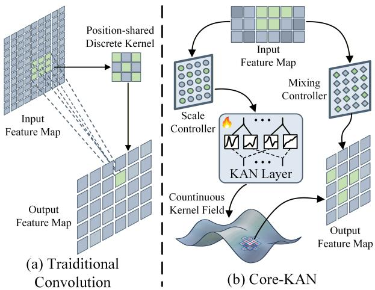
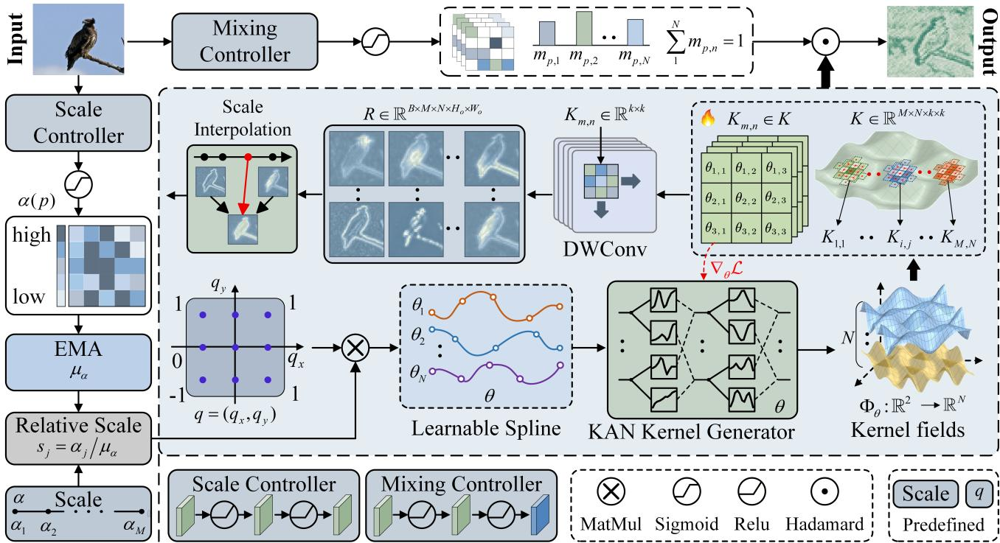
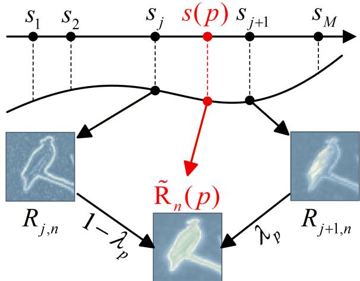
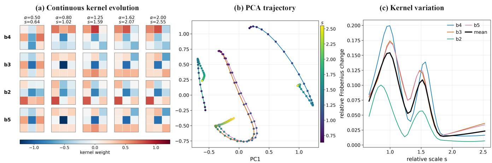
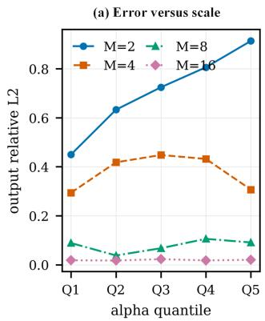
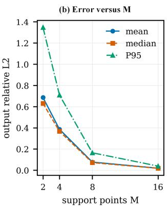

# Core-KAN: Continuous Vision Kernels with Kolmogorov-Arnold Networks

Lan Guo1, Mengling Li1, Haoran Li2, Jun Shen3, Yuanbo Jiang1, Qingguo Zhou1, Binbin Yong1∗

1 School of Information Science and Engineering, Lanzhou University

2 Department of Data Science and AI, Monash University

3 School of Computing and Information Technology, University of Wollongong

## Abstract

Conventional convolutional kernels are typically defined on fixed discrete grids, limiting their ability to accommodate heterogeneous local structures. Existing adaptive operators improve flexibility, but often couple geometric scale variation with content-dependent filtering, while incurring high computational cost from per-location kernel generation. To decouple geometric scale adaptation from content-dependent filtering while avoiding expensive per-location kernel generation, we propose Continuous Relative-scale KAN (Core-KAN), a relative-scale-conditioned continuous convolution operator. In detail, Core-KAN maps input features into a compact latent basis space and uses a lightweight scale controller to predict local scales relative to an exponential moving average reference. A KAN-based generator represents depth-wise kernel bases as continuous coordinate functions, allowing the operator to synthesize spatial filters at arbitrary resolutions rather than being confined to a fixed lattice. Instead of synthesizing independent kernels at every location, it constructs a compact bank of scale-conditioned kernel responses and interpolates them according to the predicted local scale map. An independent mixing controller further combines the interpolated basis responses based on local content, explicitly decoupling geometric scale adaptation from content-dependent filtering. Together with lightweight pointwise projections, this design forms a low-rank dynamic convolution that scales eficiently with kernel size and can be readily integrated into hierarchical vision backbones. Extensive experiments across three representative computer vision tasks demonstrate that Core-KAN consistently outperforms strong convolutional and dynamickernel baselines while introducing only marginal parameter and computational overhead. Core-KAN provides an eficient and general framework for continuous, scale-adaptive convolution across diverse vision tasks.

## Introduction

Local aggregation is a fundamental mechanism for building visual representations. Convolution remains one of the most reliable choices because a small spatially shared kernel provides translation equivariance, computational eficiency, and a strong locality bias (Krizhevsky, Sutskever, and Hinton 2012; Simonyan and Zisserman 2015; He et al. 2016; Liu et al. 2022; Woo et al. 2023). Yet the same property that makes convolution eficient also limits its adaptivity:

  
Figure 1: Conceptual comparison between conventional convolution and Core-KAN. (a) Conventional convolution shares a fixed discrete kernel across locations. (b) Core-KAN conditions a shared KAN-parameterized continuous kernel field on local relative scales and independently mixes basis responses according to content, enabling location-specific aggregation on a fixed sampling grid. Implementation details are omitted for clarity.

a fixed discrete kernel profile is applied to textures, object boundaries, thin structures, and homogeneous regions alike. Modern vision backbones therefore face a recurring tension between the eficiency of shared convolutional operators and the need for location-specific spatial reasoning.

A direct way to increase adaptivity is to generate or select a diferent kernel at each location. However, fully positionspecific kernels weaken the parameter sharing that makes convolution transferable, and dense kernel synthesis is expensive in both computation and memory. Existing approaches address parts of this tension. Large-kernel and multi-branch networks enlarge or diversify receptive fields, but still operate over finitely parameterized filters (Szegedy et al. 2015; Li et al. 2019; Ding et al. 2022; Liu et al. 2023; Ding et al. 2024). Conditional and dynamic convolutions improve content adaptivity by routing among learned components or modulating kernel weights (Yang et al. 2019; Chen et al.

2020; Ma et al. 2020; Li, Zhou, and Yao 2022; Jia et al. 2016; Zhou et al. 2021). Deformable convolutions adapt sampling locations, but still attach weights to a finite set of displaced points (Dai et al. 2017; Zhu et al. 2019; Wang et al. 2023; Xiong et al. 2024). Continuous convolutional representations learn coordinate-to-weight functions, but their kernel fields are typically shared at the layer level rather than conditioned densely on local structure (Wang et al. 2018; Wu, Qi, and Li 2019; Romero et al. 2022b,a). Thus, an eficient operator that provides dense spatial adaptation through a shared continuous kernel family remains underexplored.

Our key observation is that spatial adaptation in convolution involves two distinct decisions. The first is geometric: local scale and structure may require a sharper, broader, or diferently shaped kernel profile. The second is contentdependent: local visual evidence may require a diferent mixture of latent filtering patterns. Existing dynamic-kernel mechanisms often bind these roles into a single routing signal, reducing interpretability by obscuring whether the operator changes kernel geometry, feature-dependent composition, or merely selects among discrete alternatives. Moreover, absolute scale predictions can drift across feature stages and optimization dynamics, making dense scale conditioning unstable without calibration to a feature-level reference.

Based on this observation, we propose Continuous Relative-scale KAN (Core-KAN), a Continuous Relativescale KAN convolution operator for spatially adaptive visual aggregation. As illustrated in Figure 1, unlike conventional convolution with a fixed discrete kernel, Core-KAN represents depthwise kernel bases as a shared continuous coordinate field parameterized by a Kolmogorov-Arnold Network (KAN) (Liu et al. 2025). A lightweight scale controller predicts dense local scales and normalizes them with an exponential moving average reference. The resulting relative scales transform the queried coordinates, enabling locationspecific kernel profiles along a continuous trajectory on a fixed regular sampling grid. An independent mixing controller composes basis responses according to local content, decoupling geometric scale adaptation from contentdependent composition. For eficiency, Core-KAN samples the continuous kernel field at a compact set of scale supports, constructs a response bank, and interpolates neighboring responses according to each local scale. This avoids positionwise kernel synthesis and confines adaptive computation to a compact low-rank basis space with lightweight pointwise projections.

Our contributions are threefold. First, we propose Core-KAN, a relative-scale-conditioned continuous convolution operator that parameterizes a shared coordinate-to-kernel field with a KAN, enabling smooth location-specific adaptation on a fixed sampling grid. Second, we develop an eficient support-and-interpolate scheme with a dual-control mechanism that decouples geometric scale adaptation from contentdependent basis composition. Finally, extensive evaluations on ImageNet-1K, COCO, and ADE20K demonstrate that Core-KAN is an efective plug-and-play operator with consistent performance gains and interpretable adaptive behavior.

## Related Work

## Adaptive Convolutional Operators

Adaptive ConvNets enlarge the receptive field, select among filters, or generate input-dependent weights. Selective Kernel Networks and large-kernel models provide multiple or wider spatial supports (Li et al. 2019; Ding et al. 2022; Liu et al. 2023; Ding et al. 2024). Recent eficient backbones further use selective large kernels, multi-scale kernels, anisotropic strip kernels, and partial-channel processing (Li et al. 2023; Cai et al. 2024; Yuan et al. 2026; Huang et al. 2026). Ref-Conv reparameterizes filters from pretrained kernels, while SCConv reduces spatial and channel redundancy (Cai et al. 2025; Li, Wen, and He 2023). These designs improve context modeling or eficiency, but their filters remain finite tensors or branches.

Conditional and dynamic convolution instead adapts learned components from the input. CondConv and Dynamic Convolution combine experts (Yang et al. 2019; Chen et al. 2020); ODConv attends over spatial, channel, and kernel dimensions (Li, Zhou, and Yao 2022); KernelWarehouse assembles kernels from shared cells (Li and Yao 2024); and FD-Conv modulates frequency-grouped kernel parameters (Chen et al. 2025). Spatially varying filters are also produced by Dynamic Filter Networks, DDF, pixel-adaptive convolution, and involution (Jia et al. 2016; Zhou et al. 2021; Su et al. 2019; Li et al. 2021).

## Sampling Adaptation and Continuous Kernels

Deformable convolution approaches spatial adaptivity from the sampling side. By predicting ofsets and modulation weights, they allow the operator to collect evidence from irregular positions around each location (Dai et al. 2017; Zhu et al. 2019; Xiong et al. 2024). This mechanism is powerful when object geometry suggests that the sampling grid itself should move. Core-KAN follows a diferent principle. It keeps the regular convolutional grid intact and adapts the kernel function evaluated on that grid. Thus, the operator preserves the implementation structure and locality bias of convolution while allowing the filter profile to vary continuously.

Continuous kernel methods provide another route to parameter eficiency by representing weights as coordinateconditioned functions rather than independent lattice parameters. Prior work has shown that coordinate-to-weight mappings can compactly describe kernels for point clouds, long sequences, or large spatial supports (Wang et al. 2018; Romero et al. 2022b,a; Kim and Park 2023). However, these continuous kernels are usually learned as layer-level or globally controlled functions. They are not primarily designed for dense, location-wise kernel adaptation inside standard 2D visual backbones.

## KANs for Visual Modeling

Kolmogorov-Arnold Networks replace fixed scalar weights and activations with learnable univariate edge functions, giving them a diferent functional parameterization from conventional multilayer perceptrons (Liu et al. 2025). This makes the kernel transformation traceable as combinations of one-dimensional functions. Unlike MLPs, which apply high-dimensional nonlinear changes, each input coordinate’s efect on the output can be understood through the shape of its corresponding edge function. This gives the kernel evolution explicit geometric meaning. Existing visual uses of KANs mainly treat them as feature transformation modules, inserting KAN style nonlinear mappings into local or tokenized visual representations (Bodner et al. 2024; Li et al. 2025). In that setting, the KAN directly transforms image features.

  
Figure 2: Overview of Core-KAN. The scale controller predicts a dense scale field α(p), and an operator-specific EMA reference $\mu _ { \alpha }$ converts absolute scale supports into relative supports. These supports transform a predefined coordinate grid q before it is evaluated by the KAN kernel generator. The learnable spline parameters θ define N shared continuous kernel fields, from which M sets of fixed-size kernels are sampled. Depthwise convolution produces a response bank R, and each location interpolates its two neighboring support responses.

Subsequent studies have broadened this paradigm to other building blocks of visual architectures. For instance, KAT replaces MLP blocks in Transformers with scalable rationalfunction KAN layers (Yang and Wang 2025), whereas KAC incorporates a KAN-based classifier for continual visual learning (Hu et al. 2025). Despite their emerging potential across vision tasks, leveraging the continuous functional parameterization of KANs to implement eficient, spatially adaptive convolution operators remains largely unexplored.

## Method

We propose Core-KAN, a relative-scale-conditioned continuous convolution operator that decouples geometric scale adaptation from content-dependent basis composition. As illustrated in Figure 2, a scale controller predicts a dense local scale field, while an exponential moving average (EMA) provides an operator-specific reference for relative-scale normalization. A shared Kolmogorov-Arnold Network (KAN) maps scale-transformed coordinates to continuous kernel weights. Instead of synthesizing a diferent kernel at every spatial position, Core-KAN samples this continuous field at a compact set of scale supports, constructs a response bank using shared depthwise convolutions, and interpolates neighboring responses according to the local relative scale. An independent mixing controller then performs content-dependent composition over the latent basis responses.

## Operator Formulation

Let $X \in \mathbb { R } ^ { B \times C _ { \mathrm { i n } } \times H \times W }$ and $Y \in \mathbb { R } ^ { B \times C _ { \mathrm { o u t } } \times H _ { o } \times W _ { o } }$ denote the input and output features. Core-KAN first projects the input into a compact N-dimensional basis space:

$$
V = P _ { \mathrm { i n } } ( X ) , \qquad V \in \mathbb { R } ^ { B \times N \times H \times W } ,\tag{1}
$$

where $P _ { \mathrm { i n } }$ is $1 1 \times 1$ convolution. The operator computes one scale-adapted response $\widetilde { R } _ { b , n } ( p )$ for each sample b, basis $n ,$ and output location p. It then modulates these responses with content-dependent weights $m _ { b } ( p , n )$ and applies a pointwise output projection:

$$
Y _ { b , c } ( p ) = \sum _ { n = 1 } ^ { N } W _ { c , n } ^ { \mathrm { o u t } } m _ { b } ( p , n ) \widetilde { R } _ { b , n } ( p ) ,\tag{2}
$$

where $W ^ { \mathrm { o u t } }$ is the weight matrix of $P _ { \mathrm { o u t } }$ . Equation (2) exposes the two complementary controls in Core-KAN: the

scale branch changes the spatial profile of each basis response, whereas the mixing branch changes its contentdependent contribution.

For clarity, the spatial equations below use unit-stride indexing. General stride, padding, and output resolution follow the standard convolutional convention.

## Decoupled Scale and Mixing Controllers

Both controllers operate on the original input X. In our implementation, each controller contains two lightweight $3 \times 3$ convolution-GroupNorm-ReLU blocks followed by a $1 \times 1$ prediction layer.

Dense scale prediction. The scale controller $C _ { \alpha }$ predicts a bounded scalar at every spatial location:

$$
\begin{array} { r l } & { \widehat { \alpha } _ { b } ( p ) = \sigma \big ( C _ { \alpha } ( X _ { b } ) ( p ) \big ) , } \\ & { { \alpha } _ { b } ( p ) = { \alpha } _ { \operatorname* { m i n } } + \big ( { \alpha } _ { \operatorname* { m a x } } - { \alpha } _ { \operatorname* { m i n } } \big ) \widehat { \alpha } _ { b } ( p ) , } \end{array}\tag{3}
$$

where $\sigma$ is the sigmoid function and $\alpha _ { b } ( p ) \in [ \alpha _ { \operatorname* { m i n } } , \alpha _ { \operatorname* { m a x } } ] .$

Because feature statistics vary across layers and training iterations, the same absolute prediction can have diferent meanings in diferent operators. Each Core-KAN layer therefore maintains a non-learnable EMA reference. At training iteration t, it is updated by

$$
\begin{array} { l } { \displaystyle \overline { { \alpha } } ^ { ( t ) } = \frac { 1 } { B H W } \sum _ { b = 1 } ^ { B } \sum _ { p } \alpha _ { b } ^ { ( t ) } ( p ) , } \\ { \displaystyle \mu _ { \alpha } ^ { ( t ) } = \mathrm { c l i p } _ { [ \alpha _ { \mathrm { m i n } } , \alpha _ { \mathrm { m a x } } ] } \Big ( \rho \mu _ { \alpha } ^ { ( t - 1 ) } + ( 1 - \rho ) \mathrm { s g } \Big ( \overline { { \alpha } } ^ { ( t ) } \Big ) \Big ) , } \end{array}\tag{4}
$$

where $\rho$ is the EMA momentum and $\operatorname { s g } ( \cdot )$ denotes stopgradient. The stored reference is fixed at inference time. The local relative scale is then

$$
s _ { b } ( p ) = \frac { \alpha _ { b } ( p ) } { \mu _ { \alpha } } .\tag{5}
$$

This normalization expresses the predicted scale relative to the typical scale of the current operator.

Content-dependent mixing. The independent mixing controller $C _ { m }$ predicts a simplex distribution over the N latent bases:

$$
\begin{array} { c } { { m _ { b } ( p , : ) = \displaystyle \mathrm { s o f t m a x } \bigl ( C _ { m } ( X _ { b } ) ( p ) \bigr ) , } } \\ { { \nonumber } } \\ { { m _ { b } ( p , n ) \geq 0 , \qquad \displaystyle \sum _ { n = 1 } ^ { N } m _ { b } ( p , n ) = 1 . } } \end{array}\tag{6}
$$

The mixing weights depend on local content but do not determine the relative scale used to query the kernel field. This separation prevents the adaptation of the geometric scale and the selection of the bases from being represented by a single routing signal.

## KAN-Parameterized Continuous Kernel Fields

Relative-scale supports. We place M uniformly spaced absolute supports in the bounded prediction interval:

$$
\alpha _ { j } = \alpha _ { \operatorname* { m i n } } + \frac { j - 1 } { M - 1 } \left( \alpha _ { \operatorname* { m a x } } - \alpha _ { \operatorname* { m i n } } \right) , \qquad j = 1 , \dotsc , M .\tag{7}
$$

  
Figure 3: Pixel-wise scale interpolation in response space. For a location p with $s _ { j } \leq s ( p ) \leq s _ { j + 1 } ,$ Core-KAN retrieves the neighboring support responses $R _ { j , n } ( p )$ and $R _ { j + 1 , n } ( p )$ and linearly combines them using weights $1 - \lambda _ { p }$ and $\lambda _ { p } ,$ respectively. Batch indices are omitted for clarity.

The supports are converted to relative coordinates using the same EMA reference as the dense scale map:

$$
s _ { j } = \frac { \alpha _ { j } } { \mu _ { \alpha } } , \qquad j = 1 , \ldots , M .\tag{8}
$$

Thus, $s _ { b } ( p )$ and $\{ s _ { j } \} _ { j = 1 } ^ { M }$ lie in the same operator-calibrated scale coordinate system.

Continuous coordinate-to-kernel mapping. Let $\mathcal { G } _ { k } ~ =$ $\lbrace \delta _ { r } \rbrace _ { r = 1 } ^ { k ^ { 2 } }$ denote the ofsets of a regular $k \times k$ convolutional grid, and let $q _ { r } = ( q _ { x , r } , q _ { y , r } ) \in [ - 1 , 1 ] ^ { 2 }$ be the normalized coordinate associated with $\delta _ { r } . \mathrm { A }$ shared KAN maps a continuous two-dimensional coordinate to N scalar kernel fields:

$$
\Phi _ { \theta } : \mathbb { R } ^ { 2 }  \mathbb { R } ^ { N } .\tag{9}
$$

For a KAN with L layers, the ℓ-th layer can be written as

$$
z _ { v } ^ { ( \ell + 1 ) } = \sum _ { u = 1 } ^ { d _ { \ell } } \phi _ { v , u } ^ { ( \ell ) } \Big ( z _ { u } ^ { ( \ell ) } \Big ) , \qquad z ^ { ( 0 ) } = x ,\tag{10}
$$

where each $\phi _ { v , u } ^ { ( \ell ) }$ is a learnable univariate edge function parametrized by spline. The symbol θ collectively denotes all learnable spline parameters, and $\Phi _ { \theta } ( x ) = z ^ { ( L ) }$

For a relative scale s, Core-KAN evaluates the same KAN at the scale-transformed coordinates $\{ s q _ { r } \} _ { r = 1 } ^ { k ^ { 2 } }$ . The unnormalized n-th basis kernel is

$$
G _ { n } ( s ) = { \mathrm { r e s h a p e } } _ { k \times k } \Big ( \{ [ \Phi _ { \theta } ( s q _ { r } ) ] _ { n } \} _ { r = 1 } ^ { k ^ { 2 } } \Big ) .\tag{11}
$$

Each sampled kernel is standardized over its spatial entries and rescaled to a Kaiming-compatible magnitude:

$$
K _ { n } ( s ) = { \sqrt { \frac { 2 } { k ^ { 2 } } } } { \frac { G _ { n } ( s ) - \operatorname * { m e a n } ( G _ { n } ( s ) ) } { \operatorname { s t d } ( G _ { n } ( s ) ) + \varepsilon } } .\tag{12}
$$

Sampling the continuous fields at the M relative supports yields

$$
\mathcal { K } = \{ K _ { j , n } = K _ { n } ( s _ { j } ) \} _ { \underset { n = 1 , \ldots , N } { j = 1 , \ldots , M } } \in \mathbb { R } ^ { M \times N \times k \times k } .\tag{13}
$$

The kernels in K are therefore samples from the same shared continuous fields, rather than MN independently stored filters. Moreover, the discrete ofsets $\delta _ { r }$ remain fixed for all scales. Varying s changes the coordinates queried from the continuous kernel field, and hence the kernel weights, but does not resize or deform the $k \times k$ sampling grid.

## Support-and-Interpolate Readout

Directly querying $K _ { n } ( s _ { b } ( p ) )$ at every spatial location would require synthesizing a distinct kernel for each position. Core-KAN instead evaluates the kernel field only at the M supports and realizes dense adaptation through response-space interpolation.

Support-sampled response bank. Each support kernel is applied depthwise to the projected basis feature V:

$$
R _ { b , j , n } ( \boldsymbol { p } ) = \sum _ { r = 1 } ^ { k ^ { 2 } } K _ { j , n } ( \delta _ { r } ) V _ { b , n } ( \boldsymbol { p } + \delta _ { r } ) .\tag{14}
$$

Stacking the responses over all supports and bases gives

$$
\mathcal { R } \in \mathbb { R } ^ { B \times M \times N \times H _ { o } \times W _ { o } } .\tag{15}
$$

This response bank requires only M shared depthwise convolutions in the compact basis space.

Pixel-wise scale interpolation. If the convolution changes spatial resolution, the scale map is first bilinearly resized to $( \bar { H } _ { o } , W _ { o } )$ . We reuse $\alpha _ { b } ( p )$ and $s _ { b } ( p )$ for the resized values. For the neighboring supports satisfying $\alpha _ { j } \leq \alpha _ { b } ( p ) \leq \alpha _ { j + 1 } ,$ equivalently $s _ { j } \leq s _ { b } ( p ) \leq s _ { j + 1 }$ , the interpolation coeficient is

$$
\lambda _ { b , p } = \frac { \alpha _ { b } ( p ) - \alpha _ { j } } { \alpha _ { j + 1 } - \alpha _ { j } } = \frac { s _ { b } ( p ) - s _ { j } } { s _ { j + 1 } - s _ { j } } , \qquad \lambda _ { b , p } \in [ 0 , 1 ] .\tag{16}
$$

The equality follows because the local prediction and all support values share the same positive reference $\mu _ { \alpha }$ . The scale-adapted response is then

$$
\widetilde { R } _ { b , n } ( p ) = ( 1 - \lambda _ { b , p } ) R _ { b , j , n } ( p ) + \lambda _ { b , p } R _ { b , j + 1 , n } ( p ) .\tag{17}
$$

Values outside the supported interval are clamped to its nearest boundary; at an exact support location, the interpolation reduces to that support response.

To relate the eficient readout to direct continuous evaluation, define

$$
R _ { b , n } ^ { \star } ( p ) = \sum _ { r = 1 } ^ { k ^ { 2 } } K _ { n } \big ( s _ { b } ( p ) \big ) ( \delta _ { r } ) V _ { b , n } ( p + \delta _ { r } ) ,\tag{18}
$$

which evaluates the continuous kernel field separately at every position. Because convolution is linear in the kernel weights, Equation (17) is exactly equivalent to applying the interpolated local kernel

$$
\widetilde { K } _ { b , n , p } = \left( 1 - \lambda _ { b , p } \right) K _ { j , n } + \lambda _ { b , p } K _ { j + 1 , n } ,\tag{19}
$$

<table><tr><td>Method</td><td colspan="3">Params (M) ↓ Top-1 (%) ↑ Top-5 (%) ↑</td></tr><tr><td>ResNet-50[CVPR&#x27;16]</td><td>25.56</td><td>78.44</td><td>94.24</td></tr><tr><td>DY-ConV [CVPR&#x27;20]</td><td>100.88</td><td>79.00</td><td>94.27</td></tr><tr><td>ODConV [ICLR&#x27;22]</td><td>90.67</td><td>78.52</td><td>94.01</td></tr><tr><td>SCConV [CVPR&#x27;23]</td><td>17.69</td><td>79.89</td><td>94.76</td></tr><tr><td>RefConv [TNNLS&#x27;25]</td><td>36.97</td><td>79.91</td><td>94.61</td></tr><tr><td>PartialNet [AAAI&#x27;26]</td><td>18.00</td><td>80.61</td><td>95.13</td></tr><tr><td>KernelWarehouse [ICML&#x27;24]</td><td>102.02</td><td>81.05</td><td>95.21</td></tr><tr><td>FDConV [CVPR&#x27;25]</td><td>29.20</td><td>80.36</td><td>95.02</td></tr><tr><td>Core-KAN (Ours)</td><td>26.61</td><td>81.45</td><td>95.68</td></tr></table>

Table 1: ImageNet-1K validation results. Reported or reproduced training recipes difer across methods, so the table is intended as a reference comparison. Bold and underlined values indicate the best and second-best accuracy, respectively.

namely,

$$
\widetilde { R } _ { b , n } ( p ) = \sum _ { r = 1 } ^ { k ^ { 2 } } \widetilde { K } _ { b , n , p } ( \delta _ { r } ) V _ { b , n } ( p + \delta _ { r } ) .\tag{20}
$$

Thus, response interpolation exactly realizes the piecewiselinearly interpolated kernel in Equation (19), without materializing a location-specific kernel tensor. Relative to the direct query in Equation (18), it is a controllable piecewiselinear approximation along the learned scale-conditioned kernel trajectory. Increasing M improves the sampling density, while a compact M reduces response-bank computation.

## Content Mixing and Low-Rank Interpretation

The interpolated basis responses encode geometric scale adaptation. Core-KAN subsequently applies the independent content weights from Equation (6):

$$
Z _ { b , n } ( p ) = m _ { b } ( p , n ) \widetilde { { \cal R } } _ { b , n } ( p ) .\tag{21}
$$

When required, the mixing map is bilinearly resized to $( H _ { o } , W _ { o } )$ and renormalized over n. The output is $Y =$ $ { P _ { \mathrm { o u t } } } ( Z )$ , yielding Equation (2).

The complete operator admits a low-rank interpretation. Let $W ^ { \mathrm { i n } }$ and $W ^ { \mathrm { o u \bar { t } } }$ denote the input and output projection matrices. Combining Equations (1), (20), and (2) gives the efective location-dependent kernel between input channel $c ^ { \prime }$ and output channel c:

$$
W _ { b , c , c ^ { \prime } , p } ^ { \mathrm { e f f } } ( \delta ) = \sum _ { n = 1 } ^ { N } W _ { c , n } ^ { \mathrm { o u t } } m _ { b } ( p , n ) \widetilde { K } _ { b , n , p } ( \delta ) W _ { n , c ^ { \prime } } ^ { \mathrm { i n } } .\tag{22}
$$

Here, $s _ { b } ( p )$ controls the spatial profile $\begin{array} { r } { \widetilde { K } _ { b , n , p } , } \end{array}$ whereas $m _ { b } ( p , n )$ controls the content-dependent composition of the latent bases. The surrounding pointwise projections share channel-mixing factors across locations, confining the spatially adaptive computation to the compact N-dimensional basis space.

## Experiments

## Experimental Setup

Core-KAN configuration. Unless otherwise specified, Core-KAN uses a fixed spatial support of $k = 3 , \overset { \cdot } { N } = 1 6$ continuous kernel basis fields, and $M = 8$ uniformly spaced scale supports. The predicted local scale is bounded to $[ \alpha _ { \mathrm { m i n } } , \alpha _ { \mathrm { m a x } } ] = [ 0 . 5 , 2 . 0 ]$ , and the momentum of the exponential moving average scale reference is set to $\rho = 0 . 9 9 .$ Both the scale controller and the content-mixing controller use a hidden width of 32. The continuous kernel generator consists of two KAN layer with a grid size of 7 and a spline order of 3. For details, see Appendix A.2-A.6 and E.1-E.4.

<table><tr><td rowspan="2">Method</td><td colspan="6">Object Detection</td><td colspan="6">Instance Segmentation</td></tr><tr><td> $\operatorname { A P } ^ { \mathrm { { b o x } } }$ </td><td> $\mathrm { A P } _ { 5 0 } ^ { \mathrm { b o x } }$ </td><td> $\mathrm { A P } _ { 7 5 } ^ { \mathrm { b o x } }$ </td><td> $\mathrm { A P _ { S } ^ { b o x } }$ </td><td> $\mathrm { A P _ { M } ^ { b o x } }$ </td><td> $\mathrm { A P } _ { \mathrm { L } } ^ { \mathrm { b o x } }$ </td><td> $\mathrm { { A P } ^ { m a s k } }$ </td><td> $\mathrm { A P _ { 5 0 } ^ { m a s k } }$ </td><td> $\mathrm { A P _ { 7 5 } ^ { m a s k } }$ </td><td> $\mathrm { A P _ { S } ^ { m a s k } }$ </td><td> $\mathrm { A P _ { M } ^ { m a s k } }$ </td><td> $\mathrm { A P _ { L } ^ { m a s k } }$ </td></tr><tr><td>ResNet-50[CVPR&#x27;16]</td><td>37.9</td><td>58.7</td><td>41.2</td><td>21.6</td><td>41.5</td><td>49.3</td><td>34.5</td><td>55.6</td><td>36.8</td><td>15.9</td><td>37.1</td><td>50.4</td></tr><tr><td>DY-Conv [CVPR&#x27;20]</td><td>39.2</td><td>60.3</td><td>42.5</td><td>23.0</td><td>42.9</td><td>51.4</td><td>34.7</td><td>56.0</td><td>37.1</td><td>16.4</td><td>36.9</td><td>51.1</td></tr><tr><td>ODConv [ICLR&#x27;22]</td><td>40.1</td><td>61.5</td><td>43.6</td><td>24.0</td><td>43.6</td><td>52.3</td><td>36.7</td><td>58.5</td><td>39.6</td><td>18.6</td><td>39.0</td><td>52.8</td></tr><tr><td>KernelWarehouse [ICML&#x27;24]</td><td>42.4</td><td>65.4</td><td>46.3</td><td>27.2</td><td>46.2</td><td>54.6</td><td>38.9</td><td>62.0</td><td>41.5</td><td>22.7</td><td>42.6</td><td>53.1</td></tr><tr><td>FDConv [CVPR&#x27;25]</td><td>42.5</td><td>64.8</td><td>46.2</td><td>26.4</td><td>47.0</td><td>54.9</td><td>38.3</td><td>61.8</td><td>41.0</td><td>19.6</td><td>42.4</td><td>54.3</td></tr><tr><td>Core-KAN (Ours)</td><td>43.0</td><td>65.1</td><td>47.0</td><td>27.1</td><td>47.1</td><td>55.8</td><td>39.5</td><td>62.1</td><td>42.4</td><td>20.5</td><td>42.8</td><td>57.2</td></tr></table>

Table 2: COCO val2017 results using Mask R-CNN under the standard $1 \times$ schedule (12 epochs). Bold and underlined values denote the best and second-best results, respectively; ties are marked equally.
<table><tr><td rowspan="2">Method</td><td colspan="6">Object Detection</td><td colspan="6">Instance Segmentation</td></tr><tr><td> $\mathrm { A P ^ { b o x } }$ </td><td> $\mathrm { A P _ { 5 0 } ^ { b o x } }$ </td><td> $\mathrm { A P } _ { 7 5 } ^ { \mathrm { b o x } }$ </td><td> $\mathrm { A P _ { S } ^ { b o x } }$ </td><td> $\mathrm { A P _ { M } ^ { b o x } }$ </td><td> $\mathrm { A P } _ { \mathrm { L } } ^ { \mathrm { b o x } }$ </td><td> $\mathrm { { A P } ^ { m a s k } }$ </td><td> $\mathrm { A P _ { 5 0 } ^ { m a s k } }$ </td><td> $\mathrm { A P _ { 7 5 } ^ { m a s k } }$ </td><td> $\mathrm { A P _ { S } ^ { m a s k } }$ </td><td> $\mathrm { A P _ { M } ^ { m a s k } }$ </td><td> $\mathrm { A P _ { L } ^ { m a s k } }$ </td></tr><tr><td>ResNet-50 [CVPR&#x27;16]</td><td>40.9</td><td>61.3</td><td>44.8</td><td>24.4</td><td>44.6</td><td>52.3</td><td>37.1</td><td>58.3</td><td>39.9</td><td>18.4</td><td>39.8</td><td>52.9</td></tr><tr><td>DY-ConV [CVPR&#x27;20]</td><td>41.9</td><td>63.0</td><td>45.7</td><td>25.8</td><td>45.6</td><td>53.8</td><td>36.9</td><td>58.5</td><td>39.7</td><td>18.8</td><td>39.4</td><td>53.2</td></tr><tr><td>ODConV [ICLR&#x27;22]</td><td>42.6</td><td>64.0</td><td>46.6</td><td>27.0</td><td>46.3</td><td>54.8</td><td>38.7</td><td>60.6</td><td>42.0</td><td>21.4</td><td>41.2</td><td>54.7</td></tr><tr><td>KernelWarehouse [ICML&#x27;24]</td><td>45.6</td><td>67.5</td><td>49.8</td><td>29.8</td><td>49.4</td><td>59.0</td><td>41.5</td><td>63.0</td><td>44.8</td><td>24.2</td><td>43.9</td><td>58.5</td></tr><tr><td>FDConV [CVPR&#x27;25]</td><td>45.7</td><td>67.3</td><td>50.4</td><td>30.5</td><td>49.7</td><td>58.4</td><td>41.7</td><td>62.5</td><td>45.0</td><td>24.0</td><td>44.2</td><td>58.7</td></tr><tr><td>Core-KAN (Ours)</td><td>46.2</td><td>67.8</td><td>50.5</td><td>31.3</td><td>49.8</td><td>58.9</td><td>42.2</td><td>63.8</td><td>45.1</td><td>24.8</td><td>44.5</td><td>59.2</td></tr></table>

Table 3: COCO val2017 results using Mask R-CNN under the standard $3 \times$ schedule (36 epochs). Bold and underlined values denote the best and second-best results, respectively; ties are marked equally.

  
Figure 4: Evolution of learned $3 \times 3$ kernels in the last Core-KAN block. (a) Four basis fields queried at five relative scales. (b) PCA trajectories of densely sampled kernels. (c) Relative Frobenius change between adjacent queries. Smooth, basis-specific trajectories indicate a continuous kernel field rather than a discrete lookup table.

Training and evaluation. Core-KAN is trained on ImageNet-1K (Russakovsky et al. 2015) for 300 epochs with AdamW, a batch size of 4,096, an initial learning rate of

$4 \times 1 0 ^ { - 3 }$ , 20 warm-up epochs, cosine decay, and single-crop 224×224 validation. COCO 2017 (Lin et al. 2014) uses Mask R-CNN (He et al. 2017) with FPN (Lin et al. 2017) under the standard 1× (12-epoch) and 3× (36-epoch) schedules. For ADE20K (Zhou et al. 2017), the models are trained for 160K iterations. Within each downstream benchmark, all reproduced backbones share the same data pipeline, schedule, task head, and evaluation protocol.

<table><tr><td>Method</td><td>Params (M) ↓ mIoU (%) ↑ mAcc (%) ↑</td><td></td></tr><tr><td>ResNet-50[CVPR&#x27;16]</td><td>66.00</td><td>40.00 49.61</td></tr><tr><td>DY-ConV [CVPR&#x27;20]</td><td>140.00</td><td>41.20 51.05</td></tr><tr><td>ODConV [ICLR&#x27;22]</td><td>131.00</td><td>42.36 52.51</td></tr><tr><td>KernelWarehouse [ICML&#x27;24]</td><td>141.00</td><td>43.20 53.30</td></tr><tr><td>FDConV [CVPR&#x27;25]</td><td>70.00</td><td>43.50 53.63</td></tr><tr><td>Core-KAN (Ours)</td><td>68.50</td><td>44.19 54.38</td></tr></table>

Table 4: ADE20K validation results with a ResNet-50 backbone. Params denotes the complete segmentation model. Bold and underlined values denote the best and second-best results, respectively.

  
Figure 5: Interpolation fidelity to direct continuous-kernel evaluation. (a) Relative output error across five scale quantiles for diferent support counts M. (b) Mean, median, and 95th-percentile error. Denser supports consistently reduce the approximation error.

## Main Results

Table 1 compares Core-KAN with dynamic convolution operators and recent eficient backbones on ImageNet-1K. Core-KAN achieves 81.45% top-1 and 95.68% top-5 accuracy with 26.61M parameters. Compared with ResNet-50, it delivers relative improvements of 3.84% and 1.53% in top-1 and top-5 accuracy, respectively, with a parameter overhead of only 4.11%. Core-KAN also provides relative gains of 0.49% in both accuracy metrics over KernelWarehouse while using 73.92% fewer parameters.

On COCO, Core-KAN consistently improves Mask R-CNN under both training schedules. As shown in Table 2, Core-KAN achieves $4 3 . 0 ~ \mathrm { A P ^ { b o x } }$ and $3 9 . 5 \mathrm { \ A P ^ { m a s k } }$ , corresponding to relative improvements of 13.46% and 14.49% over ResNet-50, respectively. Compared with the strongest competing methods, Core-KAN further improves box AP over FDConv by 1.18% and mask AP over KernelWarehouse by 1.54%. The improvements are consistent across object scales: relative to ResNet-50, Core-KAN achieves gains of 25.46%, 13.49%, and 13.18% in $\mathrm { A P _ { S } ^ { b o x } , A P _ { M } ^ { b o x } }$ and $\mathrm { A P } _ { \mathrm { L } } ^ { \mathrm { b o x } }$ , respectively, together with corresponding gains of 28.93%, 15.36%, and 13.49% for mask prediction. Under the longer 3× schedule, Core-KAN obtains 46.2 $\mathrm { A P ^ { b o x } }$ and $4 2 . 2 ~ \mathrm { A P ^ { m a s k } }$ (Table 3), yielding relative improvements of 12.96% and 13.75% over ResNet-50, respectively. It also outperforms FDConv, the strongest competing method in terms of overall AP under this schedule, by 1.09% in box AP and 1.20% in mask AP. Core-KAN ranks first on five of the six box metrics and all six mask metrics. The only exception is $\mathrm { A P } _ { \mathrm { L } } ^ { \mathrm { b o x } }$ , where its result is only 0.17% lower than that of KernelWarehouse (58.9 versus 59.0). These results demonstrate that the advantages of Core-KAN remain consistent under longer training and across detection and instance-segmentation tasks.

On ADE20K, Core-KAN achieves 44.19% mIoU and 54.38% mAcc with 68.50M parameters (Table 4). These results represent relative improvements of 10.47% and 9.61% over ResNet-50, respectively, with a parameter overhead of only 3.79% in the complete segmentation model. Core-KAN further improves mIoU and mAcc over FDConv by 1.59% and 1.40%, respectively, while using 2.14% fewer parameters.

## Continuous Kernels and Interpolation

Figure 4 examines whether the KAN represents a continuous kernel family and, critically, whether this representation provides interpretable kernel evolution. Queries at increasing relative scales change both the signs and spatial arrangements of the normalized weights while retaining a fixed 3 × 3 sampling grid. The ordered, basis-specific PCA trajectories reveal that each basis function captures a distinct and interpretable pattern of scale-dependent kernel transformations. Dense queries form ordered, basis-specific PCA trajectories, demonstrating that the KAN learns semantically meaningful continuous trajectories rather than arbitrary discrete lookup tables.

Figure 5 compares support-based interpolation with direct per-location continuous-kernel evaluation. The approximation error decreases consistently as the number of supports increases across all scale quantiles and summary statistics. The default setting of $M = 8$ substantially reduces the error relative to smaller support sets, while $\dot { M } = 1 6$ provides further improvement at additional response-bank cost. Thus, eight supports ofer a practical trade-of between approximation fidelity and computational eficiency. For details, see Appendix B.1-B.4.

## Conclusion

Core-KAN introduces dense spatial adaptation through a shared continuous kernel field. Relative-scale queries change kernel geometry, a separate controller mixes latent bases from image content, and support-based interpolation avoids explicit kernel synthesis at every position. Across ImageNet-1K, both COCO schedules, and ADE20K, Core-KAN improves on ResNet-50 with modest parameter overhead. Kernel trajectories and interpolation errors support the intended continuous formulation, while the controller maps show complementary spatial behavior. A remaining limitation is that the response-bank cost grows with the number of scale supports; reducing this cost without weakening interpolation fidelity is a useful direction for further work.

## References

Bodner, A. D.; Tepsich, A. S.; Spolski, J. N.; and Pourteau, S. 2024. Convolutional Kolmogorov–Arnold Networks. arXiv preprint arXiv:2406.13155.

Cai, X.; Lai, Q.; Wang, Y.; Wang, W.; Sun, Z.; and Yao, Y. 2024. Poly Kernel Inception Network for Remote Sensing Detection. In Proceedings of the IEEE/CVF Conference on Computer Vision and Pattern Recognition, 27706–27716.

Cai, Z.; Ding, X.; Shen, Q.; and Cao, X. 2025. RefConv: Reparameterized Refocusing Convolution for Powerful ConvNets. IEEE Transactions on Neural Networks and Learning Systems, 36(6): 11617–11631.

Chen, L.; Gu, L.; Li, L.; Yan, C.; and Fu, Y. 2025. Frequency Dynamic Convolution for Dense Image Prediction. In Proceedings of the IEEE/CVF Conference on Computer Vision and Pattern Recognition, 30178–30188.

Chen, Y.; Dai, X.; Liu, M.; Chen, D.; Yuan, L.; and Liu, Z. 2020. Dynamic Convolution: Attention over Convolution Kernels. In Proceedings of the IEEE/CVF Conference on Computer Vision and Pattern Recognition, 11030–11039.

Dai, J.; Qi, H.; Xiong, Y.; Li, Y.; Zhang, G.; Hu, H.; and Wei, Y. 2017. Deformable Convolutional Networks. In Proceedings ofthe IEEE International Conference on Computer Vision, 764–773.

Ding, X.; Zhang, X.; Han, J.; and Ding, G. 2022. Scaling Up Your Kernels to 31x31: Revisiting Large Kernel Design in CNNs. In Proceedings of the IEEE/CVF Conference on Computer Vision and Pattern Recognition, 11963–11975.

Ding, X.; Zhang, Y.; Ge, Y.; Zhao, S.; Song, L.; Yue, X.; and Shan, Y. 2024. UniRepLKNet: A Universal Perception Large-Kernel ConvNet for Audio, Video, Point Cloud, Time-Series and Image Recognition. In Proceedings of the IEEE/CVF Conference on Computer Vision and Pattern Recognition, 5513–5524.

He, K.; Gkioxari, G.; Dollár, P.; and Girshick, R. 2017. Mask R-CNN. In Proceedings of the IEEE International Conference on Computer Vision, 2961–2969.

He, K.; Zhang, X.; Ren, S.; and Sun, J. 2016. Deep Residual Learning for Image Recognition. In Proceedings ofthe IEEE Conference on Computer Vision and Pattern Recognition, 770–778.

Hu, Y.; Liang, Z.; Yang, F.; Hou, Q.; Liu, X.; and Cheng, M.- M. 2025. KAC: Kolmogorov–Arnold Classifier for Continual Learning. In Proceedings of the IEEE/CVF Conference on Computer Vision and Pattern Recognition, 15297–15307.

Huang, H.; Xia, T.; Zhao, W.; and Ren, P. 2026. PartialNet: Compute Less, Perform Better. In Proceedings of the AAAI Conference on Artificial Intelligence, volume 40, 21930– 21938.

Jia, X.; De Brabandere, B.; Tuytelaars, T.; and Van Gool, L. 2016. Dynamic Filter Networks. In Advances in Neural Information Processing Systems, volume 29.

Kim, S.; and Park, E. 2023. SMPConv: Self-Moving Point Representations for Continuous Convolution. In Proceedings of the IEEE/CVF Conference on Computer Vision and Pattern Recognition, 10289–10299.

Krizhevsky, A.; Sutskever, I.; and Hinton, G. E. 2012. ImageNet Classification with Deep Convolutional Neural Networks. In Advances in Neural Information Processing Systems, volume 25.

Li, C.; Liu, X.; Li, W.; Wang, C.; Liu, H.; Liu, Y.; Chen, Z.; and Yuan, Y. 2025. U-KAN Makes Strong Backbone for Medical Image Segmentation and Generation. Proceedings ofthe AAAI Conference on Artificial Intelligence, 39(5): 4652–4660.

Li, C.; and Yao, A. 2024. KernelWarehouse: Rethinking the Design of Dynamic Convolution. In Proceedings of the 41st International Conference on Machine Learning, volume 235 of Proceedings ofMachine Learning Research, 29201– 29221. PMLR.

Li, C.; Zhou, A.; and Yao, A. 2022. Omni-Dimensional Dynamic Convolution. In International Conference on Learning Representations.

Li, D.; Hu, J.; Wang, C.; Li, X.; She, Q.; Zhu, L.; Zhang, T.; and Chen, Q. 2021. Involution: Inverting the Inherence of Convolution for Visual Recognition. In Proceedings of the IEEE/CVF Conference on Computer Vision and Pattern Recognition, 12321–12330.

Li, J.; Wen, Y.; and He, L. 2023. SCConv: Spatial and Channel Reconstruction Convolution for Feature Redundancy. In Proceedings of the IEEE/CVF Conference on Computer Vision and Pattern Recognition, 6153–6162.

Li, X.; Wang, W.; Hu, X.; and Yang, J. 2019. Selective Kernel Networks. In Proceedings of the IEEE/CVF Conference on Computer Vision and Pattern Recognition, 510–519.

Li, Y.; Hou, Q.; Zheng, Z.; Cheng, M.-M.; Yang, J.; and Li, X. 2023. Large Selective Kernel Network for Remote Sensing Object Detection. In Proceedings ofthe IEEE/CVF International Conference on Computer Vision, 16794–16805.

Lin, T.-Y.; Dollár, P.; Girshick, R.; He, K.; Hariharan, B.; and Belongie, S. 2017. Feature Pyramid Networks for Object Detection. In Proceedings of the IEEE Conference on Computer Vision and Pattern Recognition, 2117–2125.

Lin, T.-Y.; Maire, M.; Belongie, S.; Hays, J.; Perona, P.; Ramanan, D.; Dollár, P.; and Zitnick, C. L. 2014. Microsoft COCO: Common Objects in Context. In Computer Vision – ECCV 2014, volume 8693 of Lecture Notes in Computer Science, 740–755. Springer.

Liu, S.; Chen, T.; Chen, X.; Chen, X.; Xiao, Q.; Wu, B.; Kärkkäinen, T.; Pechenizkiy, M.; Mocanu, D. C.; and Wang, Z. 2023. More ConvNets in the 2020s: Scaling Up Kernels Beyond 51x51 Using Sparsity. In International Conference on Learning Representations.

Liu, Z.; Mao, H.; Wu, C.-Y.; Feichtenhofer, C.; Darrell, T.; and Xie, S. 2022. A ConvNet for the 2020s. In Proceedings of the IEEE/CVF Conference on Computer Vision and Pattern Recognition, 11976–11986.

Liu, Z.; Wang, Y.; Vaidya, S.; Ruehle, F.; Halverson, J.; Soljačić, M.; Hou, T. Y.; and Tegmark, M. 2025. KAN: Kolmogorov–Arnold Networks. In The Thirteenth International Conference on Learning Representations.

Ma, N.; Zhang, X.; Huang, J.; and Sun, J. 2020. WeightNet: Revisiting the Design Space of Weight Networks. In Computer Vision – ECCV 2020, volume 12360 of Lecture Notes in Computer Science, 776–792. Springer.

Romero, D. W.; Bruintjes, R.-J.; Bekkers, E. J.; Tomczak, J. M.; Hoogendoorn, M.; and van Gemert, J. C. 2022a. Flex-Conv: Continuous Kernel Convolutions with Diferentiable Kernel Sizes. In International Conference on Learning Representations.

Romero, D. W.; Kuzina, A.; Bekkers, E. J.; Tomczak, J. M.; and Hoogendoorn, M. 2022b. CKConv: Continuous Kernel Convolution for Sequential Data. In International Conference on Learning Representations.

Russakovsky, O.; Deng, J.; Su, H.; Krause, J.; Satheesh, S.; Ma, S.; Huang, Z.; Karpathy, A.; Khosla, A.; Bernstein, M.; Berg, A. C.; and Fei-Fei, L. 2015. ImageNet Large Scale Visual Recognition Challenge. International Journal of Computer Vision, 115(3): 211–252.

Simonyan, K.; and Zisserman, A. 2015. Very Deep Convolutional Networks for Large-Scale Image Recognition. In International Conference on Learning Representations.

Su, H.; Jampani, V.; Sun, D.; Gallo, O.; Learned-Miller, E.; and Kautz, J. 2019. Pixel-Adaptive Convolutional Neural Networks. In Proceedings of the IEEE/CVF Conference on Computer Vision and Pattern Recognition, 11166–11175.

Szegedy, C.; Liu, W.; Jia, Y.; Sermanet, P.; Reed, S.; Anguelov, D.; Erhan, D.; Vanhoucke, V.; and Rabinovich, A. 2015. Going Deeper with Convolutions. In Proceedings of the IEEE Conference on Computer Vision and Pattern Recognition, 1–9.

Wang, S.; Suo, S.; Ma, W.-C.; Pokrovsky, A.; and Urtasun, R. 2018. Deep Parametric Continuous Convolutional Neural Networks. In Proceedings of the IEEE Conference on Computer Vision and Pattern Recognition, 2589–2597.

Wang, W.; Dai, J.; Chen, Z.; Huang, Z.; Li, Z.; Zhu, X.; Hu, X.; Lu, T.; Lu, L.; Li, H.; Wang, X.; and Qiao, Y. 2023. InternImage: Exploring Large-Scale Vision Foundation Models with Deformable Convolutions. In Proceedings of the IEEE/CVF Conference on Computer Vision and Pattern Recognition, 14408–14419.

Woo, S.; Debnath, S.; Hu, R.; Chen, X.; Liu, Z.; Kweon, I. S.; and Xie, S. 2023. ConvNeXt V2: Co-Designing and Scaling ConvNets with Masked Autoencoders. In Proceedings of the IEEE/CVF Conference on Computer Vision and Pattern Recognition, 16133–16142.

Wu, W.; Qi, Z.; and Li, F. 2019. PointConv: Deep Convolutional Networks on 3D Point Clouds. In Proceedings of the IEEE/CVF Conference on Computer Vision and Pattern Recognition, 9621–9630.

Xiong, Y.; Li, Z.; Chen, Y.; Wang, F.; Zhu, X.; Luo, J.; Wang, W.; Lu, T.; Li, H.; Qiao, Y.; Lu, L.; Zhou, J.; and Dai, J. 2024. Eficient Deformable ConvNets: Rethinking Dynamic and Sparse Operator for Vision Applications. In Proceedings of the IEEE/CVF Conference on Computer Vision and Pattern Recognition, 5652–5661.

Yang, B.; Bender, G.; Le, Q. V.; and Ngiam, J. 2019. Cond-Conv: Conditionally Parameterized Convolutions for Eficient Inference. In Advances in Neural Information Processing Systems, volume 32.

Yang, X.; and Wang, X. 2025. Kolmogorov–Arnold Transformer. In The Thirteenth International Conference on Learning Representations.

Yuan, X.; Zheng, Z.; Li, Y.; Liu, X.; Liu, L.; Li, X.; Hou, Q.; and Cheng, M.-M. 2026. Strip R-CNN: Large Strip Convolution for Remote Sensing Object Detection. In Proceedings ofthe AAAI Conference on Artificial Intelligence, volume 40, 12259–12267.

Zhou, B.; Zhao, H.; Puig, X.; Fidler, S.; Barriuso, A.; and Torralba, A. 2017. Scene Parsing Through ADE20K Dataset. In Proceedings of the IEEE Conference on Computer Vision and Pattern Recognition, 633–641.

Zhou, J.; Jampani, V.; Pi, Z.; Liu, Q.; and Yang, M.-H. 2021. Decoupled Dynamic Filter Networks. In Proceedings of the IEEE/CVF Conference on Computer Vision and Pattern Recognition, 6647–6656.

Zhu, X.; Hu, H.; Lin, S.; and Dai, J. 2019. Deformable ConvNets V2: More Deformable, Better Results. In Proceedings of the IEEE/CVF Conference on Computer Vision and Pattern Recognition, 9308–9316.