# DPC-Net: Dual-Prior Collaborative Network for All-in-One Image Restorationt erpalette is somewhat dull, with the sky I C CGAP

Zhaokun He1, Kangbiao Shi1, Axi Niu1, Jian Jin2, Peng Wu1, Wei Dong3, Qingsen Yan1∗challenging to discern the finer details of the T IF G Co • •spil spil

1Northwestern Polytechnical University

2Singapore Management University

3Xi’an University of Architecture and Technology

## AbstractAdditio

All-in-One Image Restoration (AiOIR) aims to handle diverseMatrixMultH×W×1 degradations within a unified model. However, existing methods often overlook image semantics in degradation modeling• Hadamard ProductA and lack low-level visual priors during reconstruction, leading• to structural distortions and semantic inconsistencies. To ad-1-W + dress these issues, we propose a novel Dual-Prior Collabora-• tive Network (DPC-Net), which achieves high-quality restoration by jointly exploiting degradation-semantic coupled priors and low-level visual priors. Specifically, degraded images are fed into a Degradation-Aware Network (DAN) to extract degradation-semantic coupled features. To this end, a Vision-Language Model (VLM) supervises DAN by constraining itsF features distribution, introducing image semantics into the encoding of degradation patterns. A Degradation-Semantic Modulation Module (DSMM) further translates this guidance into degradation-semantic coupling and propagates coupled− ÷ • + representations to the decoder. During decoding, knowledge bases provide low-level visual priors, and the Dual-Prior Col-M laborative Reconstruction Module (DPCR) integrates dualprior information to guide degradation removal while pre-D D serving structure and semantics, producing high-fidelity re-or A FN+ or + stored images. Extensive experiments on multiple restoration benchmarks demonstrate that DPC-Net achieves superior performance against state-of-the-art AiOIR methods.

## Introduction

Image restoration, as a fundamental task in computer vision, has been extensively studied. Early eforts primarily focused on addressing a single type of degradation, such as noise (Huang et al. 2021; Lin et al. 2023), haze (Wu et al. 2021; Qin et al. 2020), rain (Yang et al. 2020; Chen and Li 2021), or blur (Cho et al. 2021; Zhang et al. 2020). Although these methods achieve promising performance under individual degradations, they struggle to generalize to complex multi-degradation scenarios. Consequently, recent research has shifted toward multi-degradation image restoration models (Mou, Wang, and Zhang 2022; Zamir et al. 2022; Guo et al. 2024), which have achieved state-of-the-art performance for known combinations of degradations. However, such methods typically require a separate network for each degradation type, leading to large model sizes and substantial computational overhead.

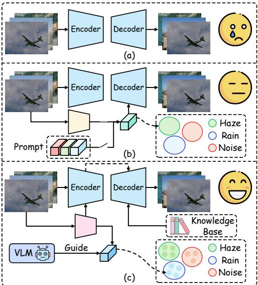  
Figure 1: Motivations of our method. (a) Models that implicitly learn degradation features. (b) Models that explicitly learn degradation features. (c) Our method.

Recently, all-in-one approaches (Tang et al. 2026; Zhang et al. 2026) have attracted increasing attention by addressing multiple image degradations within a unified model. In general, existing all-in-one models can be broadly categorized into two types. As shown in Fig. 1 (a), the first type implicitly learns degradation features (Liu et al. 2022; Ye et al. 2023; Cui et al. 2025), relying on the network itself to automatically infer degradation patterns from degraded images without requiring explicit degradation priors. However, when confronted with diverse degradation patterns, such models often fail to accurately infer the underlying degradation type, resulting in suboptimal restoration performance. As shown in Fig. 1 (b), the second type explicitly learns degradation features (Zhang et al. 2025; Tian et al. 2025; Wang, Zhang, and Yang 2026). These methods typically introduce a lightweight auxiliary network or leverage prompts to improve the controllability of the restoration process. Although they can recognize the type of degradation, they fail to efectively couple image semantics with degradation modeling. Consequently, the model cannot understand how degradations visually distort image content. Moreover, during image reconstruction, existing methods tend to focus on the inverse removal of degradations while neglecting low-level visual priors, such as brightness, color, and edges, which lead to structural distortions or semantic inconsistencies in the restored images.

To address the aforementioned issues, we propose a novel Dual-Prior Collaborative Network (DPC-Net). Initially, we feed degraded images into the Degradation-Aware Network (DAN) to extract degradation-semantic coupled features. Specifically, a vision-language model (VLM) supervises DAN by constraining its feature distribution, thereby introducing scene semantics into the encoding of diverse degradation patterns, such as blur, noise, and low-light conditions. The Degradation-Semantic Modulation Module (DSMM) then leverages this guidance to couple degradation and semantic information and propagates the resulting coupled representations to the decoder, thereby guiding the image restoration process. In the decoding stage, we construct multiple knowledge bases with diferent prior information and retrieve low-level visual priors through queries. The retrieved priors, together with the degradation-semantic coupled priors output by the DSMM, are then injected into the Dual-Prior Collaborative Reconstruction Module (DPCR). This module can collaboratively leverage dual-prior information, enabling the image reconstruction process to fully incorporate priors such as luminance, color, and edges while removing degradations, thereby yielding restored results with more reasonable structures and better semantic consistency.

The main contributions of this work are summarized as follows:

• We propose an innovative Dual-Prior Collaborative Restoration Network, which achieves high-quality image restoration by jointly exploiting degradation-semantic coupled features and low-level visual priors.

• A VLM-supervised Degradation-Aware Network, together with the Degradation-Semantic Modulation Module, is introduced to learn degradation-semantic coupled features, thereby guiding the image restoration process.

• Multiple knowledge bases storing low-level visual priors are constructed to provide prior information, while employing the Dual-Prior Collaborative Reconstruction Module for dual-prior collaborative reconstruction to achieve structurally consistent restoration.

• Extensive experiments show that our network achieves superior performance across various restoration tasks, effectively removing degradation and restoring high-quality images with coherent structures and semantics.

## Related Work

## All-in-One Image Restoration

Implicit Learning of Degraded Features. Models that implicitly learn degradation features (Chen et al. 2022; Liu et al. 2022; Ye et al. 2023; Li et al. 2021; Cui et al. 2025) rely on the representation capability of the network itself to adaptively perceive degradation types and distributions from degraded images, without explicitly constructing degradation priors. In recent years, some methods have improved model adaptability to multiple degradations through multitask pretraining (Liu et al. 2022), knowledge distillation (Chen et al. 2022), or adaptive feature modulation (Cui et al. 2025). For example, TAPE (Liu et al. 2022) learns general priors through task-agnostic pretraining. AdaIR (Cui et al. 2025) exploits frequency-domain diferences to realize unified image restoration. However, such methods still depend on the network’s implicit inference of degradation features and lack explicit modeling, which leads to limitations such as insuficient representation capacity and weak interpretability in complex or unknown scenarios.

Explicitly Learning Degraded Features. Explicit degradation modeling approaches (Potlapalli et al. 2023; Yao et al. 2024; Zhang et al. 2025; Tian et al. 2025; Zhang et al. 2026; Wang, Zhang, and Yang 2026) aim to enhance model adaptability across diverse degradation scenarios by incorporating additional degradation-aware networks or learnable prompts, which explicitly encode degradation information into the image restoration pipeline. Typically, these methods first identify and characterize degradations before injecting them into the recovery process. For instance, Perceive-IR (Zhang et al. 2025)jointly infers degradation types and severity levels through quality-aware and semantics-guided learning. DFPIR (Tian et al. 2025) adapts unified parameter spaces via degradation-prompted feature perturbations. Retrieve-to-Restore (Wang, Zhang, and Yang 2026) leverages a degradation prior library for retrieval-based restoration. However, such methods still largely confine degradation modeling to the type level, failing to integrate high-level semantic context. Moreover, while prioritizing the inverse removal of degradation components, they overlook the exploitation of crucial content priors, such as luminance, color, and edge structures, that could further inform the restoration process.

## Vision-Language Models for Image Restoration

Vision-Language Models (VLMs) introduce cross-modal semantic priors, providing additional content-aware and degradation-aware guidance for image restoration. In recent years, several methods (Zhou et al. 2025; Qu et al. 2024; Sun et al. 2026; Cheng et al. 2026; Dong et al. 2026) have begun to explore the use of VLMs in image restoration tasks. For example, DATPRL-IR (Dong et al. 2026) uses a VLM to produce multi-dimensional descriptions of image content, color, and brightness. UniLDif (Cheng et al. 2026) adopts a VLM to describe image degradation types and content. In addition, XPSR (Qu et al. 2024) extracts high-level semantic descriptions with a VLM to characterize image content and spatial layout, while also extracting low-level semantic descriptions to depict degradations and quality defects. Although the low-level semantic descriptions integrate image semantics with degradation information, they primarily capture coarse-grained semantics and degradation patterns of salient objects in the scene, lacking the fine-grained details required for pixel-level reconstruction. As a result, they can hardly provide efective guidance for image restoration through direct injection into the decoder. Consequently, we inject hierarchical features from the DAN into the DEM at each encoder level, thereby obtaining superior priors.

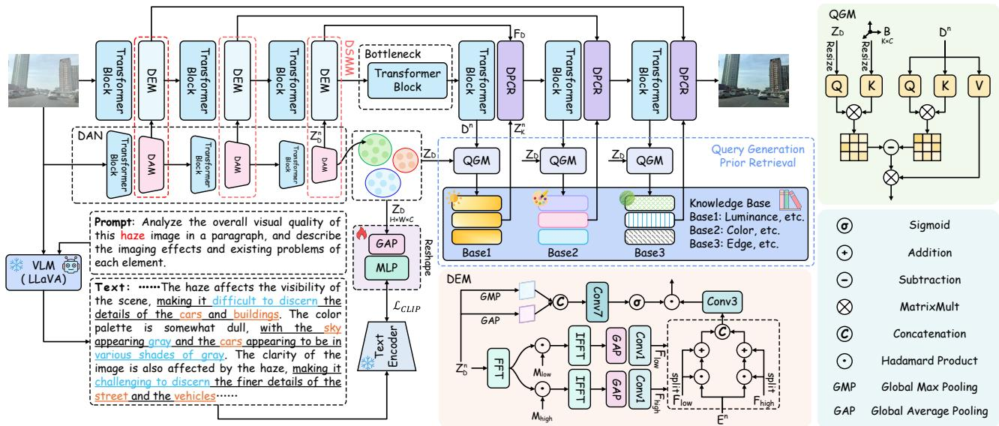  
Figure 2: Overview of our proposed Dual-Prior Collaborative Network (DPC-Net) for all-in-one image restoration.

## MLPMethod

## FDOverall Pipeline

M1×C 1×C H×W×1To enable the model to better capture the visual distor-Weightions caused by degradation during degradation modeling • • HadaDnwhile more efectively leveraging low-level visual priors for 1-W +image reconstruction, we propose the Dual-Prior Collab-•orative Network (DPC-Net). As shown in Fig. 2, we first feed degraded images into the Degradation-Aware Network (DAN) to extract degradation-semantic coupled features. To this end, a Vision-Language Model (VLM) supervises DAN by constraining its feature distribution, thereby introducing scene semantics into the encoding of diverse degradation patterns, such as blur, noise, and low-light conditions. Guided by the VLM, the Degradation-Semantic Modulation Module (DSMM) couples degradation and semantic infor-DANmation. Specifically, hierarchical degradation features from TDAN are injected into the corresponding encoder levels via sfBlo DA nsfoBloc DA nsfoBloc DAthe Degradation Embedding Modulation Module (DEM), me mer erand the modulated features are transmitted to the decoder. During the decoding stage, we construct multiple knowledge DNorm F DAMbases containing diverse low-level visual priors. By querying these bases, we supply the reconstruction process with rich μF σF σ μ No SAF + Nolow-level visual priors. Finally, the dual-prior information − ÷ • +is jointly injected into the Dual-Prior Collaborative Reconstruction Module (DPCR), where their synergy guides the + Addition ÷ Division Dimage restoration process, thereby removing complex degra-• Hadamard Product− Subtraction SA Selfdations while generating high-quality restored images with more plausible structures and better semantic consistency. The details of each component in the proposed network are presented in the following subsections.

## Integrating VLMs into Image Restoration

Existing methods fail to consider image semantics during degradation modeling, making it dificult for the model to understand how degradations visually distort image content. Meanwhile, VLMs can provide cross-modal semantic descriptions of degraded images, capturing scene content, imaging quality, color variations, and detail degradation. Compared with manually defined degradation labels, such textual descriptions ofer a more expressive way to characterize how degradations afect visual appearance. Therefore, Rainwe leverage VLMs to guide the image restoration process. (b)olingThe overall process will be described in detail below.

Degradation-Aware Network. Given a degraded image Encoder DecoderI , we construct an image quality analysis prompt to guide the VLM to generate textual descriptions from multiple per-Basespectives, including global visual quality, local imaging ar-Guide Hazetifacts, scene content, color representation, and detail degradation. Subsequently, $\mathbf { I } _ { d }$ Rainis fed into the DAN for feature extraction. Specifically, the Distribution-aware Normalization within the Degradation-Aware Module (DAM) adaptively adjusts the feature distributions based on diferent degradation types, thereby accommodating the variations in feature statistics caused by diverse degradations. On this basis, the degradation-semantic coupled features produced by DAN are further constrained by the textual descriptions generated by the VLM, enabling them to encode degradation patterns while incorporating scene semantic information. The overall process can be formulated as follows:

$$
\begin{array} { r } { \mathbf { Z } _ { D } ^ { n } = \mathrm { S A } ( \mathrm { D N o r m } ( \mathbf { Z } _ { D } ^ { n } ) ) + \mathbf { Z } _ { D } ^ { n } , } \end{array}\tag{1}
$$

$$
{ \bf Z } _ { D } ^ { n + 1 } = \mathrm { F F N } ( \mathrm { D N o r m } ( { \bf Z } _ { D } ^ { n } ) ) + { \bf Z } _ { D } ^ { n }\tag{2}
$$

Where DNorm(·) denotes Distribution-aware Normalization, SA(·) denotes self-attention, FFN(·) denotes a feedforward network, and $\mathbf { Z } _ { D } ^ { n }$ denotes the feature of the n-th layer of the DAN. Details of DAN are provided in the Appendix.

Degradation Embedding Modulation Module. As shown in Fig. 4, although the degradation-semantic coupled features extracted by DAN can capture coarse-grained subject semantics and overall degradation patterns, they lack fine-grained spatial information and thus cannot be directly injected into the decoder to guide pixel-level reconstruction.

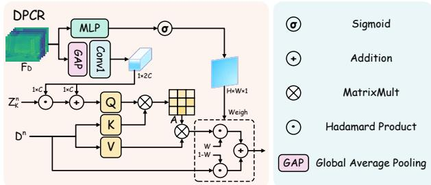

Figure 3: Illustration of our proposed Dual-Prior Collaborative Reconstruction Module (DPCR).  
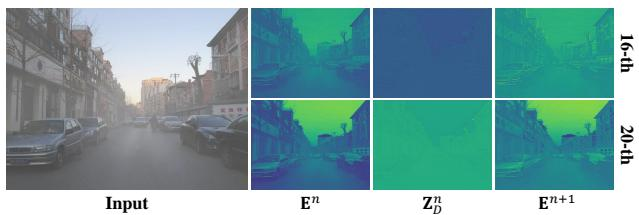  
er rFigure 4: Comparison of feature maps across diferent channels.

D DTo address this issue, we inject the hierarchical feature $\mathbf { Z } _ { \cal D } ^ { n }$ μF σF σ μ or SA FNF + or +from the DAN into the corresponding level of the DEM − ÷ • +within the encoder. Considering that diferent degradations exhibit distinct characteristic distributions in the frequency + Addition ÷ Divisiondomain (Cui et al. 2025), we first decompose $\mathbf { Z } _ { D } ^ { n }$ Flowinto high-• Hadamard Product− Subtraction SAand low-frequency features within the DEM:

$$
\mathbf { F } _ { d } = \operatorname { C o n v 1 } \bigl ( \operatorname { G A P } ( \operatorname { I F F T } ( \operatorname { F F T } ( \mathbf { Z } _ { D } ^ { n } ) \odot \mathbf { M } _ { d } ) ) \bigr )\tag{3}
$$

where $d \in \{ l o w , h i g h \}$ indicates the frequency domain. Subsequently, the high- and low-frequency features are interacted with the encoder hierarchical feature $\mathbf { E } ^ { n }$ separately, followed by their fusion:

$$
\mathbf { E } _ { d } ^ { n } = { \boldsymbol { \alpha } } _ { d } \odot \mathbf { E } ^ { n } + { \boldsymbol { \beta } } _ { d }\tag{4}
$$

$$
\mathbf { E } _ { f u s e d } ^ { n } = \mathrm { C o n v 3 } ( [ \mathbf { E } _ { h i g h } ^ { n } : \mathbf { E } _ { l o w } ^ { n } ] )\tag{5}
$$

where $\alpha _ { d }$ and $\beta _ { d }$ denote the results of splitting $\mathbf { F } _ { d }$ along the channel dimension, and [:] indicates channel-wise concatenation. Finally, to further establish the correspondence between semantic regions and degradation, we generate a spatial attention map $\mathbf { A } _ { i }$ s from $\mathbf { Z } _ { D } ^ { n }$ to adaptively weight $\mathbf { E } _ { f u s e d } ^ { n } { \mathrm { : } }$

$$
\mathbf { A } _ { s } = \sigma ( \mathrm { C o n v 7 } ( [ \mathrm { G M P } ( \mathbf { Z } _ { D } ^ { n } ) : \mathrm { G A P } ( \mathbf { Z } _ { D } ^ { n } ) ] ) )\tag{6}
$$

$$
\mathbf { E } ^ { n + 1 } = \mathbf { A } _ { s } \odot \mathbf { E } _ { f u s e d } ^ { n }\tag{7}
$$

## Leveraging Knowledge Bases for Image Restoration

Degradation-semantic coupling features primarily characterize the visual distortion efects of degradation on image content. However, high-quality reconstruction requires not only modeling the correlation between degradation and semantic content but also incorporating low-level visual priors to guide reconstruction. For diferent restoration tasks, the roles of low-level visual priors vary. In low-light enhancement, brightness and color priors help restore reasonable exposure and color naturalness. In dehazing, color and edge priors

Encoder Decoderfacilitate the recovery of natural colors and long-range structures. In denoising, deraining, and deblurring, edge priors help preserve genuine structural boundaries. Based on this, we set up a learnable knowledge base at each layer of the decoder. Since features at diferent layers possess varying spatial scales and semantic granularities, the corresponding Rainknowledge bases can adaptively learn multi-scale low-level (b)Prompt Noisevisual priors. Furthermore, we equip each knowledge base with a Query Generation Module (QGM) to generate queries. Encoder DecoderIts detailed design is elaborated below.

Query Generation Module. Since the decoder’s hier-Knowledge archical features contain degradation information, directly using them as queries introduces interference. Therefore, Rainwe leverage the degradation-semantic coupled features to (c) Noiseeliminate this interference and generate clear queries. Inspired by (Ye et al. 2025), we introduce a diferential attention mechanism to eliminate interference by leveraging the degradation-semantic coupled features. However, these degradation-semantic coupled features still retain imagesemantic information, which may impair the semantic integrity of the query features. To resolve this issue, we construct a set of degradation basis vectors $\mathbf { B } \in \mathbb { R } ^ { K \times C }$ and impose a loss function to enforce pairwise orthogonality among them. Subsequently, we leverage the degradation-semantic coupled features to query B, thereby filtering out the embedded semantic information:

$$
\mathbf { Q } _ { d e g } = \operatorname { C o n v 3 } ( \operatorname { I n t e r p } ( \mathbf { Z } _ { D } , ( H , W ) ) )\tag{8}
$$

$$
\mathbf { K } _ { b a s e } = \operatorname { C o n v 3 } ( \operatorname { R e s h a p e } ( \operatorname { I n t e r p } ( \mathbf { B } , H \cdot W ) ) )\tag{9}
$$

$$
{ \bf A } _ { d e g } = { \bf Q } _ { d e g } \otimes { \bf K } _ { b a s e }\tag{10}
$$

where $\mathrm { I n t e r p } ( \cdot , \cdot )$ represents the operation of interpolating features to a specified shape. Finally, we integrate the differential attention mechanism to efectively eliminate the interfering components in the hierarchical decoder features, thereby generating high-quality clean queries:

$$
{ \bf A } _ { d i f f } = { \bf A } _ { f e a t } - { \bf A } _ { d e g }\tag{11}
$$

$$
\mathbf { F } _ { Q } = \operatorname { S o f t m a x } ( \mathbf { A } _ { d i f f } ) \otimes \mathbf { V } _ { f e a t }\tag{12}
$$

Where $\mathbf { A } _ { f e a t }$ and $\mathbf { V } _ { f e a t }$ are derived by applying a selfattention mechanism to the decoder-level features $\bar { \mathbf { D } } ^ { n }$ , and $\mathbf { F } _ { Q }$ denotes the generated clean query.

## Dual-Prior Collaborative Reconstruction Module

To leverage dual prior information for image restoration, we embed DPCR into each layer of the decoder. The feature $\mathbf { F } _ { D }$ from the DEM contains rich semantic information as well as degradation cues, enabling the model to understand how the degradation distorts image content in the visual domain. Therefore, we utilize $\mathbf { F } _ { D }$ to, on the one hand, select from the queried low-level visual priors the efective prior information required under the current degradation condition:

$$
\alpha _ { s } , \beta _ { s } = \mathrm { c h u n k } ( \mathrm { C o n v 1 } ( \mathrm { G A P } ( \mathbf { F } _ { D } ) ) ) ,\tag{13}
$$

$$
\hat { \mathbf { Z } } _ { K } ^ { n } = \mathbf { Z } _ { K } ^ { n } \odot \alpha _ { s } + \beta _ { s }\tag{14}
$$

On the other hand, it adaptively measures the restoration strength of each pixel in an image:

$$
\mathbf { W } _ { s } = \sigma ( \mathrm { M L P } ( \mathbf { F } _ { D } ) ) ,\tag{15}
$$

$$
\mathbf { D } ^ { n + 1 } = \mathbf { D } _ { r e c } ^ { n } \odot \mathbf { W } _ { s } + \mathbf { D } ^ { n } \odot \left( 1 - \mathbf { W } _ { s } \right)\tag{16}
$$

Where $\mathbf { D } _ { r e c } ^ { n }$ is the output of restoring $\mathbf { D } ^ { n }$ using $\bar { \mathbf { Z } } _ { K } ^ { n }$

<table><tr><td rowspan="2">Method</td><td rowspan="2">Source</td><td rowspan="2">Params.</td><td rowspan="2">Dehazing SOTS</td><td rowspan="2">Deraining</td><td colspan="3">Denoising</td><td rowspan="2">Average</td></tr><tr><td>Rain100L</td><td> $8 \mathrm { S D } 6 8 _ { \sigma = 1 5 }$ </td></tr><tr><td>AirNet (Li et al. 2022)</td><td>CVPR&#x27;22</td><td>9M</td><td>27.94.962</td><td>34.90.967</td><td>33.92 .933</td><td> $\mathrm { B S D } 6 8 _ { \sigma = 2 5 }$  31.26 .888</td><td>BSD68σ=50 28.00 .797</td><td>31.20 .910</td></tr><tr><td>IDR (Zhang et al. 2023)</td><td>CVPR&#x27;23</td><td>15M</td><td>29.87.970 36.03</td><td></td><td>.971 33.89</td><td>.931 31.32 .884</td><td>28.04 .798</td><td>31.83.911</td></tr><tr><td>PromptIR (Potlapalli et al. 2023)</td><td>NeurIPS’23</td><td>33M</td><td>30.58.974 36.37</td><td></td><td>7.972 33.98</td><td>.933 31.31 .888</td><td>28.06 .799</td><td>32.06.913</td></tr><tr><td>NDR (Yao et al. 2024)</td><td>TIP&#x27;24</td><td>28M</td><td></td><td>28.64 .962 35.42 .969 34.01</td><td></td><td>.932 31.36 .887</td><td>28.10</td><td>.798 31.51.910</td></tr><tr><td>Gridformer (Wang et al. 2024)</td><td>IJCV’24</td><td>34M</td><td>30.37</td><td>.970 37.15</td><td>.972 33.93</td><td>.931 31.37 .887</td><td>28.11 .801</td><td>32.19.912</td></tr><tr><td>InstructIR (Conde, Geigle, and Timofte 2024)</td><td>ECCV’24</td><td>16M</td><td>30.22 .959</td><td>37.98</td><td>3.978 34.15</td><td>.933 31.52 .890</td><td>28.30 .803</td><td>32.43.913</td></tr><tr><td>Up-Restorer (Liu et al. 2025)</td><td>AAAI&#x27;25</td><td>28M</td><td>30.68</td><td>.97736.74</td><td>.978 33.99</td><td>.933 31.33 .888</td><td>28.07 .799</td><td>32.16 .915</td></tr><tr><td>Perceive-IR (Zhang et al. 2025)</td><td>TIP&#x27;25</td><td>42M</td><td>30.87.975 38.29</td><td></td><td>.980 34.13</td><td>.934 31.53 .890</td><td>28.31 .804</td><td>32.63 .917</td></tr><tr><td>AdaIR (Cui et al. 2025)</td><td>ICLR&#x27;25</td><td>29M</td><td></td><td>31.06 .980 38.64 .983 34.12</td><td></td><td>.935 31.45 .892</td><td>28.19 .802</td><td>32.69 .918</td></tr><tr><td>R2R (Wang, Zhang, and Yang 2026)</td><td>CVPR&#x27;26</td><td>20M</td><td></td><td>31.40.97737.46.980 34.10</td><td></td><td>.936 31.45 .895</td><td>28.22</td><td>.806 32.53 .918</td></tr><tr><td>DFPIR (Tian et al. 2025)</td><td>CVPR&#x27;25</td><td>30M</td><td></td><td>31.87.98038.65 .982 34.14</td><td></td><td>.935 31.47 .893</td><td>28.25 .806</td><td>32.88 .919</td></tr><tr><td>VLU-Net (Zeng et al. 2025)</td><td>CVPR&#x27;25</td><td>35M</td><td>30.71</td><td>.980 38.93</td><td>.984 34.13</td><td>.935 31.48 .892</td><td>28.23 .804</td><td>32.70.919</td></tr><tr><td>StarIR (Cui et al. 2026)</td><td>TPAMI&#x27;26</td><td>9M</td><td>30.89 .979</td><td></td><td>938.50 .984 34.17</td><td>.936 31.51 .893</td><td>28.26 .806</td><td>32.67.920</td></tr><tr><td>HOGformer (Wu et al. 2026)</td><td>AAAI&#x27;26</td><td>17M</td><td>31.91 .981</td><td>38.50</td><td>.983 34.04</td><td>.935 31.40 .892</td><td>28.16 .804</td><td>32.80.919</td></tr><tr><td>DRNet (Li et al. 2026)</td><td>TMM&#x27;26</td><td>7M</td><td>31.15 .979</td><td>38.28</td><td>.983 34.20</td><td>.937 31.55 .894</td><td>28.27 .807</td><td>32.69.920</td></tr><tr><td>ClearAIR (Zhang et al. 2026)</td><td>AAAI&#x27;26</td><td>31M</td><td>31.08</td><td>.981 38.61</td><td>.984 34.18</td><td>.935 31.50 .891</td><td>28.31</td><td>.804 32.74 .919</td></tr><tr><td>Ours</td><td></td><td>27M</td><td></td><td>32.99 .983 38.16 .982 34.15</td><td></td><td>.937 31.50.896</td><td>28.26</td><td>.813 33.01 .922</td></tr></table>

Table 1: Comparison to state-of-the-art all-in-one methods on the three degradation tasks. Best and second best performances are highlighted. PSNR (dB, ↑) and SSIM (↑) metrics are reported on the full RGB images.

## Experiment

## Experimental Setup

Datasets. Following existing works (Wang, Zhang, and Yang 2026; Zhang et al. 2026), we establish two configurations involving three degradations and five degradations, respectively. For the denoising task, we merge BSD400 (Arbelaez et al. 2010) and WED (Ma et al. 2016) as the training set and synthesize noisy images by adding Gaussian noise with a noise level of $\sigma \in [ 1 5 , 2 5 , 5 0 ]$ , while employing BSD68 (Martin et al. 2001) for testing. The deraining task utilizes the Rain100L (Yang et al. 2017) dataset. The dehazing task adopts the SOTS (Li et al. 2018) dataset. The deblurring task employs the GoPro (Nah, Hyun Kim, and Mu Lee 2017) dataset. The low-light enhancement task uses the LOLv1 (Wei et al. 2018) dataset. Additionally, for single-task experiments, our method is trained on the respective training set. Dataset details are provided in the Appendix.

Implementation Details. Our DPC-Net provides an endto-end trainable solution. Leveraging LLaVA as the visionlanguage model and Restormer as the backbone network, the proposed architecture adopts a four-level encoder-decoder structure. Each level incorporates a distinct number of Transformer blocks, specifically configured as [4, 6, 6, 8] from level-1 to level-4. Each decoder layer is equipped with a knowledge base containing m = 256 features, whose dimensions match those of the corresponding layer. Experiments are conducted on NVIDIA GeForce RTX 4090 GPUs using PyTorch. During training, we set the learning rate to $1 e ^ { - 4 }$ and the input patch size to 1282. Network optimization employ a composite loss function comprising L1, $\mathcal { L } _ { e d g e }$ , LSSIM, $\mathcal { L } _ { C L I P } ,$ , and $\mathcal { L } _ { b a s e }$ losses (detailed in the Appendix), in conjunction with the Adam optimizer $( \beta _ { 1 } = 0 . 9 , \beta _ { 2 } = 0 . 9 9 9 )$ Training is performed on cropped images, augmented via random horizontal and vertical flips.

## All-in-One Image Restoration Results

Three Degradation Tasks. We evaluate DPC-Net on three image degradation tasks, including denoising, dehazing, and deraining. As shown in Tab. 1, our method achieves the best average performance and demonstrates especially significant improvements on the dehazing task. As shown in Fig. 5, our restoration results demonstrate superior performance in texture preservation, efective removal of haze and rain streaks, and detail enhancement. This success is attributed to the guidance of the vision-language model, which enables a deep understanding of how degradation distorts image content, and to the DPCR framework’s integration of dual prior information for synergistic image restoration.

Five Degradation Tasks. Building upon the original three degradation tasks, we extend DPC-Net to encompass five degradation types. Specifically, for the newly introduced deblurring and low-light enhancement tasks, we incorporate the GoPro and LOL datasets during training, respectively. As shown in Tab. 2, DPC-Net achieves state-of-the-art average performance, exhibiting particularly significant superiority in the image dehazing task. Although DPC-Net has a higher parameter count than StarIR (Cui et al. 2026), HOGFormer (Wu et al. 2026), R2R (Wang, Zhang, and Yang 2026), and DRNet (Li et al. 2026), it delivers substantially leading performance, achieving 31.00 dB (PSNR) and 0.923 (SSIM).

Single Degradation Task. As shown in Tab. 3, we evaluate DPC-Net on single image restoration tasks. For image dehazing, our method surpasses the previous state-of-the-art R2R by 0.65 dB in terms of PSNR. On the image deraining task, DPC-Net achieves the best PSNR and SSIM among all competing methods. Furthermore, DPC-Net consistently delivers the best quantitative performance on the image denoising task, thereby demonstrating its strong capability across diverse restoration scenarios.

<table><tr><td rowspan="2">Method</td><td rowspan="2">Source</td><td rowspan="2">Params.</td><td>Dehazing</td><td>Deraining</td><td>Denoising</td><td colspan="3">Deblurring Low-Light</td><td rowspan="2">Average</td></tr><tr><td>SOTS</td><td></td><td>Rain100L</td><td>BSD68σ=25</td><td>GoPro</td><td>LOLv1</td></tr><tr><td>AirNet (Li et al. 2022)</td><td>CVPR&#x27;22</td><td>9M</td><td>21.04 .884 32.98.951</td><td></td><td></td><td>30.91.882</td><td></td><td></td><td>24.35.78118.18 .735 25.49.846</td></tr><tr><td>IDR (Zhang et al. 2023)</td><td>CVPR&#x27;23</td><td>15M</td><td>25.24.943</td><td>35.63.965</td><td>31.60</td><td>.887</td><td>27.87</td><td>.846 21.34 .826 28.34 .893</td><td></td></tr><tr><td>PromptIR (Potlapalli et al. 2023)</td><td>NeurIPS’23</td><td>33M</td><td>26.54.949</td><td>36.37</td><td>.970 31.47</td><td>.886</td><td>28.71 .881</td><td>22.68.832 29.15.904</td><td></td></tr><tr><td>Gridformer (Wang et al. 2024)</td><td>IJCV’24</td><td>34M</td><td>26.79.951</td><td>36.61.971</td><td>31.45</td><td>.885</td><td>29.22</td><td>.884 22.59 .831 29.33 .904</td><td></td></tr><tr><td>InstructIR (Conde, Geigle, and Timofte 2024)</td><td>ECCV’24</td><td>16M</td><td>27.10 .956 36.84 .973 31.40</td><td></td><td></td><td>.887</td><td>29.40</td><td></td><td>.886 23.00 .836 29.55 .907</td></tr><tr><td>Perceive-IR (Zhang et al. 2025)</td><td>TIP&#x27;25</td><td>42M</td><td>28.19 .964 37.25 .977 31.44 .887</td><td></td><td></td><td></td><td></td><td></td><td>29.46 .886 22.81 .833 29.84 .909</td></tr><tr><td>AdaIR (Cui et al. 2025)</td><td>ICLR&#x27;25</td><td>29M</td><td>30.53 .978 38.02 .981 31.35</td><td></td><td></td><td>.889</td><td>28.12</td><td></td><td>.858 23.00 .845 30.20 .910</td></tr><tr><td>VLU-Net (Zeng et al. 2025)</td><td>CVPR&#x27;25</td><td>35M</td><td>30.84 .98038.54 .982 31.43</td><td></td><td></td><td>.891</td><td>27.46 .840</td><td>22.29.833 30.11 .905</td><td></td></tr><tr><td>ClearAIR (Zhang et al. 2026)</td><td>AAAI&#x27;26</td><td>31M</td><td>30.12 .978 38.20 .982 31.53</td><td></td><td></td><td>.888</td><td>29.67 .887</td><td>22.83.846 30.45.916</td><td></td></tr><tr><td>StarIR (Cui et al. 2026)</td><td>TPAMI&#x27;26</td><td>9M</td><td>30.46 .977 38.69 .984 31.47</td><td></td><td></td><td>.893</td><td>28.63 .871</td><td></td><td>23.32 .858 30.51.917</td></tr><tr><td>HOGformer (Wu et al. 2026)</td><td>AAAI&#x27;26</td><td>17M</td><td>31.16 .979 38.05 .981 31.19</td><td></td><td></td><td>.884</td><td>28.62 .867</td><td></td><td>24.46.858 30.70 .914</td></tr><tr><td>R2R (Wang, Zhang, and Yang 2026)</td><td>CVPR&#x27;26</td><td>20M</td><td>30.64 .974 36.61.975 31.35</td><td></td><td></td><td>.891</td><td>30.93 .911</td><td>22.88 .856 30.48 .921</td><td></td></tr><tr><td>DRNet (Li et al. 2026)</td><td>TMM&#x27;26</td><td>7M</td><td>31.28 .980 38.13 .982 31.54</td><td></td><td></td><td>.894</td><td>29.01</td><td>.87022.30 .846 30.45.914</td><td></td></tr><tr><td>Ours</td><td></td><td>27M</td><td></td><td></td><td></td><td></td><td></td><td>32.17 .980 37.90 .981 31.46 .894 29.86 .895 23.60 .865 31.00 .923</td><td></td></tr></table>

Table 2: Comparison to state-of-the-art all-in-one methods on the five degradation tasks. Best and second best performances are highlighted. PSNR (dB, ↑) and SSIM (↑) metrics are reported on the full RGB images.  
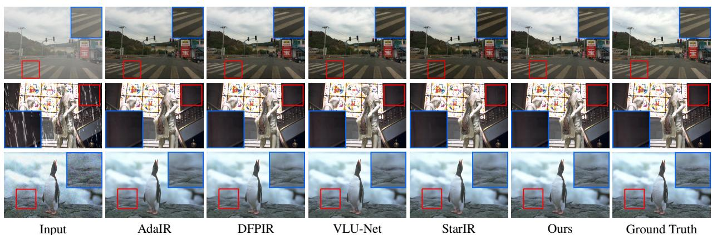  
Figure 5: Visual comparisons of DPC-Net with state-of-the-art all-in-one methods on the three degradation tasks.

## Ablation Study

Efects ofKey Components. As shown in Tab. 4, we conduct ablation studies to quantify the contribution of each component. Specifically, Variant (a) removes DAN and DEM. Variant (b) excludes DEM while directly feeding DAN features into DPCR. Variant (c) omits the external knowledge base and DPCR, while Variant (d) removes DPCR and directly injects low-level visual priors into the decoder. Comparing Variants (a) and (b) shows that incorporating DAN significantly improves performance, demonstrating its efectiveness in learning degradation-semantic coupled features. Adding DEM further enhances performance by introducing fine-grained spatial information through hierarchical feature fusion. The t-SNE visualizations in Fig. 7 further confirm that DAN and DEM enable the encoder to better distinguish diferent degradation types. Furthermore, the comparison between Variants (c) and (d) indicates that the external knowledge base provides beneficial low-level visual priors for restoration. Building upon this, DPCR efectively fuses low-level visual priors with degradation semantic priors, achieving the best overall performance. As shown in

Fig. 6, the visual results further highlight the progressive improvement brought by each component.

Efects of LLaVA-based Guidance Strategy. As shown in Tab. 5, we conduct an ablation study to validate the eficacy of our LLaVA-based guidance strategy. The promptbased approach yields the lowest performance, primarily due to its shallow level of semantic guidance, which hinders the establishment of deep correlations between degradation features and visual content. In contrast, the DA-CLIPbased strategy incorporates structured semantic constraints and achieves moderate improvement. However, this approach focuses solely on degradation type discrimination while failing to fully exploit the deep semantic priors embedded within image content. Our method attains optimal results by leveraging LLaVA’s robust cross-modal understanding capability. Specifically, textual descriptions generated by LLaVA not only identify degradations but also guide the model in comprehending how such degradations visually distort specific image content. Consequently, these detailed semantic contexts significantly enhance restoration quality.

Efects of QGM and Knowledge Base Capacity. As shown in Tab. 6, we evaluate the efectiveness of QGM and investigate the impact of knowledge base capacity. Experimental results demonstrate that incorporating the QGM module significantly enhances model performance by leveraging degraded semantic coupling features to efectively filter out noise interference in decoder-level features, thereby generating clean queries. Regarding knowledge base capacity, we compare settings of 128, 256, and 512 feature vectors. The model achieves optimal performance with 256 vectors, indicating this scale strikes an optimal balance between representational capacity and computational complexity.

<table><tr><td rowspan="2">Method</td><td>Dehazing</td><td rowspan="2">Method</td><td>Deraining</td><td rowspan="2">Method</td><td>Denoising</td></tr><tr><td>SOTS</td><td>Rain100L</td><td>BSD68σ=25</td></tr><tr><td>MSCNN (Ren et al. 2016)</td><td>22.06/.908</td><td>UMR (Yasarla and Patel 2019)</td><td>32.39/.921</td><td>CBM3D (Dabov et al. 2007)</td><td>30.69/.868</td></tr><tr><td>AODNet (Li et al. 2017)</td><td>20.29/.877</td><td>SIRR (Wei et al. 2019)</td><td>32.37/.926</td><td>DnCNN (Zhang et al. 2017a)</td><td>31.23/.883</td></tr><tr><td>EPDN (Qu et al. 2019)</td><td>22.57/.863</td><td>MSPFN (Jiang et al. 2020)</td><td>33.50/.948</td><td>IRCNN (Zhang et al. 2017b)</td><td>31.18/.882</td></tr><tr><td>FDGAN (Dong et al. 2020)</td><td>23.15/.921</td><td>LPNet (Gao et al. 2019)</td><td>23.15/.921</td><td>BRDNet (Tian, Xu, and Zuo 2020)</td><td>31.43/.885</td></tr><tr><td>AirNet (Li et al. 2022)</td><td>23.18/.900</td><td>AirNet (Li et al. 2022)</td><td>34.90/.977</td><td>AirNet (Li et al. 2022)</td><td>31.48/.893</td></tr><tr><td>PromptIR (Potlapalli et al. 2023)</td><td>31.31/.973</td><td>PromptIR (Potlapalli et al. 2023)</td><td>37.04/.979</td><td>PromptIR (Potlapalli et al. 2023)</td><td>31.71/.897</td></tr><tr><td>R2R (Wang, Zhang, and Yang 2026)</td><td>31.50/.978</td><td>R2R (Wang, Zhang, and Yang 2026)</td><td>37.45/.980</td><td>R2R (Wang, Zhang, and Yang 2026)</td><td>31.64/.897</td></tr><tr><td>Ours</td><td>32.15/.982</td><td>Ours</td><td>37.65/.981</td><td>Ours</td><td>31.73/.900</td></tr></table>

Table 3: Comparison to state-of-the-art all-in-one methods on the single degradation task. Best and second best performances are highlighted. PSNR (dB, ↑) and SSIM (↑) metrics are reported on the full RGB images.

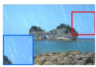  
Input

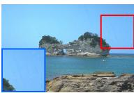  
Variant (a)

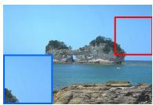  
Variant (b)

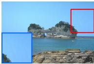  
Variant (c)

  
Variant (d)

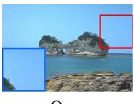  
Ours

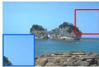  
Ground Truth

Figure 6: Visual comparisons of DPC-Net with its variants to demonstrate the progressive improvement brought by each component.
<table><tr><td>Index</td><td>(1)</td><td>(2) (3)</td><td>(4)</td><td>PSNR↑</td><td>SSIM↑</td></tr><tr><td>(a)</td><td>x</td><td>x √</td><td>√</td><td>32.65</td><td>0.920</td></tr><tr><td>(b)</td><td>√</td><td>x √</td><td>√</td><td>32.86</td><td>0.920</td></tr><tr><td>(c)</td><td>√</td><td>√ x</td><td>x</td><td>32.66</td><td>0.919</td></tr><tr><td>(d)</td><td>√</td><td>√ √</td><td>x</td><td>32.79</td><td>0.920</td></tr><tr><td>Ours</td><td>√</td><td>√ √</td><td>√</td><td>33.01</td><td>0.922</td></tr></table>

Table 4: Efectiveness of key components under the three degradation tasks. (1), (2), (3), and (4) denote DAN, DEM, knowledge base, and DPCR, respectively.

<table><tr><td>Index</td><td>Method</td><td>PSNR↑</td><td>SSIM↑</td></tr><tr><td>(a)</td><td>Prompt</td><td>32.46</td><td>0.918</td></tr><tr><td>(b)</td><td>DA-CLIP</td><td>32.64</td><td>0.919</td></tr><tr><td>(c)</td><td>LLaVA (Ours)</td><td>33.01</td><td>0.922</td></tr></table>

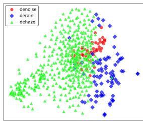  
Variant (a)

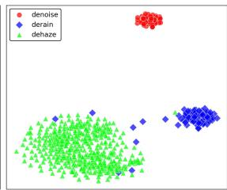  
Ours  
Figure 7: t-SNE (Van der Maaten and Hinton 2008) visualization of En under the three-task setting. Variant (a) corresponds to Tab. 4.

Table 5: Efectiveness of LLaVA-based guidance strategy under the three degradation tasks.
<table><tr><td rowspan="3">m</td><td colspan="2">w/o QGM</td><td colspan="2">w QGM</td></tr><tr><td>PSNR↑</td><td>SSIM↑</td><td>PSNR↑</td><td>SSIM↑</td></tr><tr><td>128</td><td>32.62</td><td>0.918</td><td>32.73</td><td>0.920</td></tr><tr><td>256</td><td>32.75</td><td>0.920</td><td>33.01</td><td>0.922</td></tr><tr><td>512</td><td>32.64</td><td>0.920</td><td>32.81</td><td>0.920</td></tr></table>

Table 6: Efectiveness of the QGM and comparison of knowledge base capacities across three degradation tasks.

## Conclusion

This paper presents DPC-Net, a Dual-Prior Collaborative Network for all-in-one image restoration. Specifically, the Degradation-Aware Network extracts degradation-semantic coupled features under the supervision of a Vision-Language Model, which constrains their feature distribution. The Degradation-Semantic Modulation Module then converts this semantic guidance into degradation-semantic coupling and propagates the coupled representations to the decoder. During decoding, the Dual-Prior Collaborative Reconstruction Module fuses degradation semantic priors with lowlevel visual priors from knowledge bases, enabling efective restoration while preserving texture and structural fidelity. Extensive experiments demonstrate that DPC-Net consistently outperforms state-of-the-art AiOIR methods.

## References

Arbelaez, P.; Maire, M.; Fowlkes, C.; and Malik, J. 2010. Contour detection and hierarchical image segmentation. IEEE TPAMI, 33(5): 898–916.

Chen, C.; and Li, H. 2021. Robust representation learning with feedback for single image deraining. In CVPR, 7742– 7751.

Chen, W.-T.; Huang, Z.-K.; Tsai, C.-C.; Yang, H.-H.; Ding, J.-J.; and Kuo, S.-Y. 2022. Learning multiple adverse weather removal via two-stage knowledge learning and multicontrastive regularization: Toward a unified model. In CVPR, 17653–17662.

Cheng, Z.; Zhou, L.; Chen, D.; Tang, N.; Luo, X.; Xie, Y.; and Qu, Y. 2026. Unildif: Unlocking the power of difusion priors for all-in-one image restoration. In CVPR, 37465– 37475.

Cho, S.-J.; Ji, S.-W.; Hong, J.-P.; Jung, S.-W.; and Ko, S.-J. 2021. Rethinking coarse-to-fine approach in single image deblurring. In ICCV, 4641–4650.

Conde, M. V.; Geigle, G.; and Timofte, R. 2024. Instructir: High-quality image restoration following human instructions. In ECCV, 1–21.

Cui, Y.; Zamir, S. W.; Khan, S.; Knoll, A.; Shah, M.; and Khan, F. 2025. Adair: Adaptive all-in-one image restoration via frequency mining and modulation. In ICLR, volume 2025, 101306–101327.

Cui, Y.; Zamir, S. W.; Yang, M.-H.; Knoll, A.; Khan, F. S.; and Khan, S. 2026. Starir: Convolutional image restoration with spatial-frequency fusion. IEEE TPAMI.

Dabov, K.; Foi, A.; Katkovnik, V.; and Egiazarian, K. 2007. Color image denoising via sparse 3D collaborative filtering with grouping constraint in luminance-chrominance space. In ICIP, volume 1, I–313.

Dong, G.; Li, C.; Ren, C.; Hu, J.; Shi, Y.; Zhu, X. X.; and Mou, L. 2026. Learning Domain-Aware Task Prompt Representations for Multi-Domain All-in-One Image Restoration. arXiv preprint arXiv:2603.01725.

Dong, Y.; Liu, Y.; Zhang, H.; Chen, S.; and Qiao, Y. 2020. FD-GAN: Generative adversarial networks with fusiondiscriminator for single image dehazing. InAAAI, volume 34, 10729–10736.

Gao, H.; Tao, X.; Shen, X.; and Jia, J. 2019. Dynamic scene deblurring with parameter selective sharing and nested skip connections. In CVPR, 3848–3856.

Guo, H.; Li, J.; Dai, T.; Ouyang, Z.; Ren, X.; and Xia, S.-T. 2024. Mambair: A simple baseline for image restoration with state-space model. In ECCV, 222–241.

Huang, T.; Li, S.; Jia, X.; Lu, H.; and Liu, J. 2021. Neighbor2neighbor: Self-supervised denoising from single noisy images. In CVPR, 14781–14790.

Jiang, K.; Wang, Z.; Yi, P.; Chen, C.; Huang, B.; Luo, Y.; Ma, J.; and Jiang, J. 2020. Multi-scale progressive fusion network for single image deraining. In CVPR, 8346–8355.

Li, A.; Liu, X.; Li, S.; Du, Y.; Long, Z.; Luo, L.; Zhang, L.; and Zhu, C. 2026. DRNet: All-in-One Image Restoration via

Prior-Guided Dynamic Reparameterization. arXiv preprint arXiv:2605.08627.

Li, B.; Liu, X.; Hu, P.; Wu, Z.; Lv, J.; and Peng, X. 2022. Allin-one image restoration for unknown corruption. In CVPR, 17452–17462.

Li, B.; Peng, X.; Wang, Z.; Xu, J.; and Feng, D. 2017. Aodnet: All-in-one dehazing network. In ICCV, 4770–4778.

Li, B.; Ren, W.; Fu, D.; Tao, D.; Feng, D.; Zeng, W.; and Wang, Z. 2018. Benchmarking single-image dehazing and beyond. IEEE TIP, 28(1): 492–505.

Li, W.; Lu, X.; Qian, S.; Lu, J.; Zhang, X.; and Jia, J. 2021. On eficient transformer-based image pre-training for low-level vision. arXiv preprint arXiv:2112.10175.

Lin, X.; Ren, C.; Liu, X.; Huang, J.; and Lei, Y. 2023. Unsupervised image denoising in real-world scenarios via selfcollaboration parallel generative adversarial branches. In ICCV, 12642–12652.

Liu, L.; Xie, L.; Zhang, X.; Yuan, S.; Chen, X.; Zhou, W.; Li, H.; and Tian, Q. 2022. Tape: Task-agnostic prior embedding for image restoration. In ECCV, 447–464.

Liu, M.; Yang, W.; Luo, J.; and Liu, J. 2025. Up-restorer: When unrolling meets prompts for unified image restoration. In AAAI, volume 39, 5513–5522.

Ma, K.; Duanmu, Z.; Wu, Q.; Wang, Z.; Yong, H.; Li, H.; and Zhang, L. 2016. Waterloo exploration database: New challenges for image quality assessment models. IEEE TIP, 26(2): 1004–1016.

Martin, D.; Fowlkes, C.; Tal, D.; and Malik, J. 2001. A database of human segmented natural images and its application to evaluating segmentation algorithms and measuring ecological statistics. In ICCV, volume 2, 416–423.

Mou, C.; Wang, Q.; and Zhang, J. 2022. Deep generalized unfolding networks for image restoration. In CVPR, 17399– 17410.

Nah, S.; Hyun Kim, T.; and Mu Lee, K. 2017. Deep multiscale convolutional neural network for dynamic scene deblurring. In CVPR, 3883–3891.

Potlapalli, V.; Zamir, S. W.; Khan, S. H.; and Shahbaz Khan, F. 2023. Promptir: Prompting for all-in-one image restoration. In NeurIPS, volume 36, 71275–71293.

Qin, X.; Wang, Z.; Bai, Y.; Xie, X.; and Jia, H. 2020. FFA-Net: Feature fusion attention network for single image dehazing. In AAAI, volume 34, 11908–11915.

Qu, Y.; Chen, Y.; Huang, J.; and Xie, Y. 2019. Enhanced pix2pix dehazing network. In CVPR, 8160–8168.

Qu, Y.; Yuan, K.; Zhao, K.; Xie, Q.; Hao, J.; Sun, M.; and Zhou, C. 2024. Xpsr: Cross-modal priors for difusion-based image super-resolution. In ECCV, 285–303.

Ren, W.; Liu, S.; Zhang, H.; Pan, J.; Cao, X.; and Yang, M.-H. 2016. Single image dehazing via multi-scale convolutional neural networks. In ECCV, 154–169.

Sun, X.; Wang, L.; Jin, Y.; Lam, K.-m.; Su, Z.; Yang, Y.; Pan, J.; and Wang, C. 2026. Adapting Large VLMs with Iterative and Manual Instructions for Generative Low-light Enhancement. In CVPR, 4832–4842.

Tang, N.; Luo, X.; Cheng, Z.; Zhou, L.; Zhang, D.; and Qu, Y. 2026. Difusion Once and Done: Degradation-Aware LoRA for All-in-One Image Restoration. In AAAI, volume 40, 9448–9456.

Tian, C.; Xu, Y.; and Zuo, W. 2020. Image denoising using deep CNN with batch renormalization. NN, 121: 461–473.

Tian, X.; Liao, X.; Liu, X.; Li, M.; and Ren, C. 2025. Degradation-aware feature perturbation for all-in-one image restoration. In CVPR, 28165–28175.

Van der Maaten, L.; and Hinton, G. 2008. Visualizing data using t-SNE. JMLR, 9(11).

Wang, C.; Zhang, K.; and Yang, J. 2026. Retrieve-to-Restore: Eficient All-in-One Image Restoration with a Retrieval-Based Degradation Bank. In CVPR, 1277–1287.

Wang, T.; Zhang, K.; Shao, Z.; Luo, W.; Stenger, B.; Lu, T.; Kim, T.-K.; Liu, W.; and Li, H. 2024. Gridformer: Residual dense transformer with grid structure for image restoration in adverse weather conditions. IJCV, 132(10): 4541–4563.

Wei, C.; Wang, W.; Yang, W.; and Liu, J. 2018. Deep retinex decomposition for low-light enhancement. arXiv preprint arXiv:1808.04560.

Wei, W.; Meng, D.; Zhao, Q.; Xu, Z.; and Wu, Y. 2019. Semi-supervised transfer learning for image rain removal. In CVPR, 3877–3886.

Wu, H.; Qu, Y.; Lin, S.; Zhou, J.; Qiao, R.; Zhang, Z.; Xie, Y.; and Ma, L. 2021. Contrastive learning for compact single image dehazing. In CVPR, 10551–10560.

Wu, J.; Yang, Z.; Wang, Z.; and Jin, Z. 2026. Gradient as conditions: Rethinking HOG for all-in-one image restoration. In AAAI, volume 40, 10682–10690.

Yang, W.; Tan, R. T.; Feng, J.; Liu, J.; Guo, Z.; and Yan, S. 2017. Deep joint rain detection and removal from a single image. In CVPR, 1357–1366.

Yang, W.; Tan, R. T.; Wang, S.; Fang, Y.; and Liu, J. 2020. Single image deraining: From model-based to data-driven and beyond. IEEE TPAMI, 43(11): 4059–4077.

Yao, M.; Xu, R.; Guan, Y.; Huang, J.; and Xiong, Z. 2024. Neural degradation representation learning for all-in-one image restoration. IEEE TIP, 33: 5408–5423.

Yasarla, R.; and Patel, V. M. 2019. Uncertainty guided multiscale residual learning-using a cycle spinning cnn for single image de-raining. In CVPR, 8405–8414.

Ye, T.; Chen, S.; Bai, J.; Shi, J.; Xue, C.; Jiang, J.; Yin, J.; Chen, E.; and Liu, Y. 2023. Adverse weather removal with codebook priors. In ICCV, 12653–12664.

Ye, T.; Dong, L.; Xia, Y.; Sun, Y.; Zhu, Y.; Huang, G.; and Wei, F. 2025. Diferential transformer. In ICLR, volume 2025, 144–164.

Zamir, S. W.; Arora, A.; Khan, S.; Hayat, M.; Khan, F. S.; and Yang, M.-H. 2022. Restormer: Eficient transformer for high-resolution image restoration. In CVPR, 5728–5739.

Zeng, H.; Wang, X.; Chen, Y.; Su, J.; and Liu, J. 2025. Visionlanguage gradient descent-driven all-in-one deep unfolding networks. In CVPR, 7524–7533.

Zhang, J.; Huang, J.; Yao, M.; Yang, Z.; Yu, H.; Zhou, M.; and Zhao, F. 2023. Ingredient-oriented multi-degradation learning for image restoration. In CVPR, 5825–5835.

Zhang, K.; Luo, W.; Zhong, Y.; Ma, L.; Stenger, B.; Liu, W.; and Li, H. 2020. Deblurring by realistic blurring. In CVPR, 2737–2746.

Zhang, K.; Zuo, W.; Chen, Y.; Meng, D.; and Zhang, L. 2017a. Beyond a gaussian denoiser: Residual learning of deep cnn for image denoising. IEEE TIP, 26(7): 3142–3155.

Zhang, K.; Zuo, W.; Gu, S.; and Zhang, L. 2017b. Learning deep CNN denoiser prior for image restoration. In CVPR, 3929–3938.

Zhang, X.; Ma, J.; Wang, G.; Zhang, Q.; Zhang, H.; and Zhang, L. 2025. Perceive-ir: Learning to perceive degradation better for all-in-one image restoration. IEEE TIP.

Zhang, X.; Zhang, H.; Wang, G.; Zhang, Q.; and Zhang, L. 2026. ClearAIR: A Human-Visual-Perception-Inspired Allin-One Image Restoration. arXivpreprint arXiv:2601.02763.

Zhou, H.; Dong, W.; Liu, X.; Zhang, Y.; Zhai, G.; and Chen, J. 2025. Low-light image enhancement via generative perceptual priors. In AAAI, volume 39, 10752–10760.