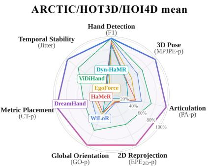

# DreamHand: Repurposing Video Diffusion Models for Occlusion-Robust Egocentric 3D Hand Motion Recovery

Yufei Liu1,4, Xixi Wang2, Hao Li3,4, Ganlong Zhao3,4, Kaitong Cai4, Chengkai Jin2,4, Chunxiao Liu4, Jianbo Liu4, Siyuan Huang4, Xingang Pan2, Hongsheng Li3,4✉

1Shanghai Jiao Tong University 2Nanyang Technological University 3The Chinese University of Hong Kong 4ACE Robotics

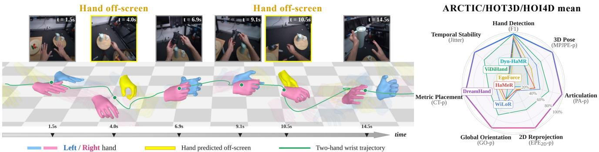  
Figure 1. Occlusion-robust egocentric 3D hand motion recovery. Left: DreamHand applied to a raw RGB video clip. DreamHand maintains hand identity and trajectory continuity even when a hand temporarily leaves the field of view (frames shaded yellow). Right: DreamHand leads on six of the seven metrics shown (F1, MPJPE-p, PA-p, EPE -p, GO-p, CT-p, and Jitter, each averaged over ARCTIC, HOT3D, and HOI4D, with farther from the center being better) and matches the strongest baseline on detection F1.

## Abstract

Egocentric video offers scalable manipulation datafor embodied AI, yet recovering metric 3D hand trajectories remains challenging due to severe object occlusion and frequent out-of-sight gaps. Existing single-frame and windowed temporal regressors fail when hand shortly leaves the frame, while recent video diffusion models (VDMs) rely on heavy, stochastic multi-step sampling as pixel-space renderers. We instead repurpose VDM into a deterministic geometry encoder. A single forward pass over the clean latent exposes scene content beyond current observations, including occluded and out-of-sight hands. We introduce DreamHand, an offline clip-level framework that extracts features via a Deterministic Clean-Latent Encoder and decodes them with a Bidirectional Spatiotemporal Decoder. DreamHand recovers continuous bimanual trajectories with metric placement and no external detector, while a Ray-Based Camera Solver supports a second configuration that needs no test-time camera intrinsics. Across five egocentric benchmarks, DreamHand sets a new state ofthe art, cutting MPJPE-p by 30% on occlusion-heavy ARC-

TIC and 40% on HOT3D. These gains reach 46%–61% once out-of-sight hands are included in the evaluation, offering a scalable path from everyday human video to robot manipulation data. The code is publicly available at github.com/ggxxii/dreamhand.

## 1. Introduction

Egocentric video offers a scalable source of robot manipulation data [8, 12, 37], but exploiting this source requires recovering metric 3D hand motion from raw footage. Two constraints of egocentric capture make this recovery particularly challenging: frequent hand-object-interaction (HOI) occlusions, and swift head motion that pushes hands entirely out of sight (OOS) and leaves no visual evidence in the field of view. Existing 3D hand motion reconstruction methods rely heavily on per-frame detectors [5, 20, 22– 24] or SLAM-anchored tracking [35, 38, 39, 41], which inherently suffer from error accumulation. Once a hand becomes unobserved or exits the camera frustum, causal trackers [4, 17, 27] lose historical context and struggle to resume coherent tracking upon re-emergence. To tackle this, we argue that metric 3D hand trajectory recovery from egocentric video is fundamentally an offline clip-level spatiotemporal reasoning task.

In order to effectively reconstruct plausible hand dynamics during OOS intervals, rich physical and temporal priors are essential. Pretrained video diffusion models (VDMs) naturally capture such priors of physical dynamics and human-object interaction. Recent generative frameworks [36] exploit video diffusion priors for hand pose estimation under severe HOI occlusions. However, they rely on an indirect pixel-rendering pipeline—executing multi-step sampling to synthesize explicit RGB frames before estimating poses. This roundabout route incurs sampling latency and may propagate generative artifacts into the pose estimates. Furthermore, directly regressing 3D hand coordinates in the camera frame conflates hand articulation with rapid camera ego-motion and imposes strict calibration dependencies.

To address these limitations, we present DreamHand, an offline clip-level 3D hand motion reconstruction framework. Our key insight is twofold: the VDM serves reconstruction best as an encoder rather than a renderer, and its generic features need end-to-end 3D supervision to become geometry-aware. DreamHand therefore repurposes a pretrained VDM [32] as a Deterministic Clean-Latent Encoder. A single noise-free forward pass over the full video clip yields a dense spatiotemporal feature grid, adapted end-toend via LoRA to capture structured physical representations without generative sampling latency. To recover continuous metric trajectories from these features, we propose Bidirectional Spatiotemporal Decoder paired with a Ray-Based Camera Solver. Across the entire video clip, we aggregate long-range temporal context via unconstrained bidirectional attention. By anchoring joint-specific queries to spatial feature maps and enforcing a global shape prior, the model reliably interpolates plausible hand poses during severe occlusions and prolonged out-of-sight intervals. Concurrently, to resolve trajectory jitter caused by rapid head turns, we estimate a 3D viewing-ray field directly from the diffusion latents. By optimizing metric hand translation against predicted 2D anchors during visible frames and relying on temporal bearing cues during visual gaps, DreamHand can recover metric hand translation without a supplied calibration matrix, which supports intrinsics-free (K-free) at test time.

Our primary contributions are summarized as follows:

• We introduce DreamHand, an offline clip-level framework that repurposes a video diffusion model into a Deterministic Clean-Latent Encoder, recovering metric bimanual trajectories without any external detector.

• We present a Bidirectional Spatiotemporal Decoder that synergizes spatially grounded queries, clip-level shape priors, and bidirectional reasoning to reconstruct out-ofsight hands. A Ray-Based Camera Solver further decouples hand motion from camera dynamics to enable testtime intrinsics-free inference.

• Extensive evaluations on five challenging egocentric benchmarks demonstrate that DreamHand achieves superior accuracy and robustness, outperforming state-of-theart baselines on 45 of 48 primary metric comparisons and remaining stable under severe occlusions and hand absences.

## 2. Related Work

Single-frame hand reconstruction. Most single-frame methods follow a “detect–crop–regress” pipeline, localizing the hand and then regressing MANO parameters from the cropped image [5, 20, 22, 23]. For egocentric settings, WildHands [24] conditions on camera intrinsics, and EgoForce [19] adds a forearm-guided camera-space solver with causal translation filtering at inference. Despite the improved camera modeling, these methods remain crop-dependent. Scale and depth are tied to the detection box, and they produce no reconstruction when the hand is severely occluded or outside the field of view.

Video-based hand motion recovery. Video-based methods address missing observations through temporal fusion or motion-prior completion. Early works apply bidirectional modeling to per-frame features [13] or aggregate multiple frames to predict the center frame [4, 27], and OmniHands [17] fuses nine consecutive two-hand crops to recover hands fully occluded within the image. A second line completes invisible hands with motion priors. GENMO [16] performs bidirectional motion modeling conditioned on video features, and EgoH4 [7] causally predicts out-of-sight hands from estimated body poses. However, their visual front ends still rely on frame-wise detection and cropping, and they typically complete motion over normalized pose sequences rather than the original video [30].

Generative video models as representations. Recent work increasingly repurposes generative video models for downstream perception, either by reading their activations [33] or by prompting the generation process itself [28]. The two routes differ in cost. Reading activations needs a single forward pass, while prompting the generation process pays for a full sampling trajectory. Self-supervised video encoders [1, 31] offer a discriminative alternative, trained to predict masked content rather than to synthesize it. ViDi-Hand [36] applies this idea to hand reconstruction. The method fine-tunes Wan through VACE [10] to synthesize geometric overlays and regresses MANO from intermediate denoising features, using 12–25 sampling steps and a decoder trained on cached frozen features. The backbone therefore receives no gradient from the reconstruction objective, and those features stay generic. We instead read the clean latent in a single forward pass inside the training loop.

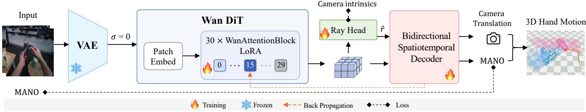  
Figure 2. Overview of DreamHand. Raw video is encoded into latents by the Wan VAE and processed by the Wan DiT (σ = 0). Block-1 features (grayed blocks skipped) branch to the Ray Head and Bidirectional Spatiotemporal Decoder. Only the patch embedding, LoRA, Ray Head, and Decoder are trained (parameter accounting in Appendix B). Camera intrinsics supervise the Ray Head during training. At test time they are discarded (K-free) or used only as the bearing source in the translation solve (standard).

## 3. DreamHand

DreamHand processes an egocentric video clip $V =$ $\{ I _ { t } \} _ { t = 1 } ^ { T }$ to predict frame-wise 3D bimanual MANO parameters in a single deterministic pass: global orientation $\hat { R } _ { t } .$ , articulation ${ \widehat { \theta } } _ { t } ,$ camera-frame translation $\hat { \tau } _ { t } .$ , and a perclip shape ${ \hat { \beta } } .$ The MANO layer M maps the pose and shape parameters to hand meshes and 21 joints, and the network additionally predicts per-frame existence and visibility flags. Instead of iteratively sampling from generative models, we extract motion representations directly through three unified modules (Figure 2): a Deterministic Clean-Latent Encoder that reads features from a LoRAadapted pretrained video diffusion model, a Bidirectional Spatiotemporal Decoder for sequence-wide trajectory estimation, and a Ray-Based Camera Solver. We consider two configurations: standard DreamHand and the intrinsicsfree DreamHand.

## 3.1. From Generator to Encoder

Feedforward encoding. The generator Φ is a Diffusion Transformer (DiT) pretrained via rectified flow on noisy latents $x _ { \sigma } = ( 1 - \sigma ) z + \sigma \epsilon .$ , where z is the clean video latent, ϵ is Gaussian noise, and $\sigma \in [ 0 , 1 ]$ is the noise level. This sequence-level pretraining is expected to equip Φ with spatiotemporal priors such as object permanence, 3D structural consistency, and occlusion reasoning. Sec. 4.3 probes this premise by swapping feature sources. We therefore use Φ strictly as an encoder. A frozen VAE encoder $\mathcal { E }$ compresses the clip into the clean latent $z = \mathcal { E } ( V )$ , and a single deterministic forward pass runs at zero noise $( \sigma = 0 )$ :

$$
F = \Phi _ { 1 : L ^ { \star } } ( z ; \sigma = 0 ) ,\tag{1}
$$

where $\Phi _ { 1 : L } ,$ ⋆ truncates execution at block $L ^ { \star } = 1 5$ out of 30. Bypassing the remaining blocks and generation head cuts per-pass computation by approximately half. A tapdepth sweep in Appendix D shows that block 15 retains nearly all of the available accuracy. The resulting feature sequence $\begin{array} { r } { F = \{ F _ { \ell } \} _ { \ell = } ^ { T ^ { \prime } } } \end{array}$ contains $T ^ { \prime } = 2 1$ latent frames for an input of $T = 8 1$ frames. This setup yields 4× temporal and 16× spatial compression. Each latent frame $F _ { \ell }$ forms a spatial grid of $D = 3 0 7 2$ -channel feature cells. For a $6 7 2 \times 4 8 0$ input, this corresponds to a $4 2 \times 3 0$ grid of $1 6 \times 1 6$ pixel patches. The latent features F then feed both the Bidirectional Spatiotemporal Decoder (Sec. 3.2) and the Ray-Based Camera Solver (Sec. 3.3).

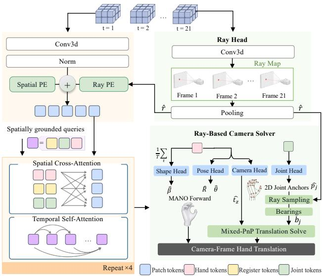  
Figure 3. Architecture of the Bidirectional Spatiotemporal Decoder. The predicted ray field rˆ enters as a ray PE added to the spatial PE. Four layers alternate Spatial Cross-Attention with Temporal Self-Attention. The readout heads emit MANO parameters and feed the mixed-PnP translation solve. Our two configurations differ architecturally only in the bearing source, sampled from rˆ (K-free, shown) or computed from camera intrinsics (standard).

End-to-end adaptation. We keep the encoder trainable within the optimization loop, utilizing LoRA [9] on attention and feed-forward projections alongside a trainable patch embedding layer, so that backpropagated 3D supervision reshapes $F$ into geometry-aware features end to end. We compare alternative latent representations in Sec. 4.3. A matched comparison in Appendix D further shows that reading the clean latent at $\sigma ~ = ~ 0$ outperforms reading noised latents.

## 3.2. Bidirectional Spatiotemporal Decoder

Spatially grounded queries. We propose a lightweight Bidirectional Spatiotemporal Decoder with spatially grounded queries to extract representations from the tapped feature grid, as illustrated in Figure 3. The decoder processes 48 queries per latent frame: 2 hand tokens assigned to fixed left and right slots, 42 joint tokens, and 4 register tokens that serve as learned scratch space without updating $F .$ Structuring joint queries as spatially grounded tokens binds features directly to physical keypoints, facilitating precise 3D hand pose estimation.

Each latent frame is tokenized into patch tokens by integrating two additive positional encodings:

$$
X _ { \ell } = \mathrm { L N } ( W _ { F } F _ { \ell } ) + P ^ { \mathrm { s p } } + g \big ( \Gamma ( \hat { r } ) \big ) ,\tag{2}
$$

where LN denotes Layer Normalization and $W _ { F }$ projects the $D = 3 0 7 2$ backbone channels to the 384-dimensional decoder space. The spatial PE $P ^ { \mathrm { s p } }$ provides explicit coordinates for attention, and the ray PE injects viewing geometry: Γ Fourier-encodes the direction of each cell’s predicted viewing ray rˆ, produced by the Ray Head (Sec. 3.3), and a zero-initialized MLP $g$ maps that encoding to the decoder dimension (implementation details in Appendix B).

Spatial readout heads. The Joint Head estimates 2D joint locations directly from this spatial grid. For each joint $j ,$ the cross-attention weights from its corresponding token form a spatial heatmap $A _ { j }$ . A soft-argmax operation then aggregates these attention probabilities to derive 2D joint anchors $\hat { p } _ { j }$ :

$$
\hat { p } _ { j } = \sum _ { u } A _ { j } ( u ) u , \qquad \sum _ { u } A _ { j } ( u ) = 1 ,\tag{3}
$$

where u iterates over normalized grid-cell center coordinates in $[ 0 , 1 ] ^ { 2 }$ This differentiable formulation anchors each keypoint with sub-cell precision, and an MLP then predicts wrist-relative 3D joint positions in meters. In parallel, the Pose Head regresses the global orientation $\hat { R }$ and articulation $\hat { \theta }$ as Gram–Schmidt-orthogonalized 6D rotations, and the Camera Head predicts a log-depth $\hat { \zeta }$ with $\hat { t } _ { z } = \exp ( \hat { \zeta } )$ guaranteeing strictly positive metric depth. Existence and visibility confidence scores complete the frame-level readout, avoiding the need for Hungarian matching [3, 14].

Clip-level shape prior. In egocentric videos, an individual hand maintains a constant physical shape and scale throughout a continuous recording. Estimating mesh parameters independently per frame, however, risks size flickering and shape drift under camera motion and local occlusions. To enforce this physical invariant, the Shape Head predicts hand shape parameters $\hat { \beta }$ once per hand per video clip by temporally pooling hand tokens across all T frames, yielding a single mesh scale for the entire sequence.

Unconstrained bidirectional reasoning. We process the spatially grounded queries with four alternating attention layers. Frame ${ \boldsymbol { \ell } } { \boldsymbol { \mathbf { \mathit { s } } } }$ queries first extract per-frame visual details through Spatial Cross-Attention over $X _ { \ell } ,$ and queries from all frames then exchange motion information via Temporal Self-Attention. Rotary relative positional encodings [29] on the temporal axis remove absolute sequence constraints, so a single forward pass generalizes to long recordings (Appendix D). Temporal attention runs at the downsampled latent frame rate $T ^ { \prime }$ , with outputs linearly interpolated back to the $T$ video frames, reducing whole-clip attention to roughly $( T ^ { \prime } / T ) ^ { 2 } \approx 1 / 1 5$ of the full-resolution cost. We apply no causal mask: each frame conditions on both past and future context across the entire clip, so the decoder reconstructs occluded or out-of-sight hands rather than extrapolating unidirectionally.

## 3.3. Ray-Based Camera Solver

Intrinsics-free ray field prediction. Camera geometry is needed at two points: the ray positional encoding in Eq. (2) and the metric projection of the predicted hand. Readout heads that memorize the pixel-to-metric mapping of one camera fail to generalize across intrinsics, so we instead predict a continuous viewing-ray field, following ray-based camera representations [11, 42]. The Ray Head, a zeroinitialized $1 \times 1$ convolution on $F ,$ , predicts a per-cell direction normalized to a unit ray $\boldsymbol { \hat { r } } = \left( \hat { r } _ { x } , \hat { r } _ { y } , \hat { r } _ { z } \right)$ in the camera frame. Temporal pooling then averages the per-frame predictions into a single field, since intrinsics are constant within a clip.

During training, ground-truth camera calibration supervises this ray field using a cosine distance loss:

$$
\mathcal { L } _ { \mathrm { r a y } } = \frac { 1 } { | \Omega | } \sum _ { u \in \Omega } \big ( 1 - \langle \hat { r } ( u ) , r _ { K } ( u ) \rangle \big ) ,\tag{4}
$$

where $\langle \cdot , \cdot \rangle$ denotes the inner product, Ω is the latent token grid, and $r _ { K } ( u )$ is the unit ray unprojected from the cell center under the calibrated camera model. One head thus accommodates both pinhole and fisheye camera models without intrinsics as input at test time.

Mixed-PnP translation. To determine metric placement, we employ a mixed Perspective-n-Point (PnP) scheme, similar in spirit to Wang et al. [36] but formulated for the calibration-free setting. Rather than predicting full 3D translations, the Camera Head regresses only the optical depth $\hat { t } _ { z } ~ = ~ \exp ( \hat { \zeta } )$ , and we solve the in-plane translation $( t _ { x } , t _ { y } )$ directly against the predicted 2D joint anchors. Per frame and hand (indices suppressed), the MANO forward pass yields $J ^ { \mathrm { c a n } } ~ = ~ \mathcal { M } ( \bar { \hat { R } } , \bar { \theta } , \hat { \beta } )$ , the 21 joints posed and camera-oriented but not yet placed, so the depth of joint $j$ along the optical axis is $\begin{array} { l l l } { z _ { j } } & { = } & { J _ { z , j } ^ { \mathrm { c a n } } + { \hat { t } } _ { z } } \end{array}$ The bearing vector $b _ { j } ~ = ~ ( b _ { j } ^ { x } , b _ { j } ^ { y } )$ , the dimensionless pair $( x / z , y / z )$ of the ray toward joint $j ,$ is sampled from the predicted ray field $\hat { r }$ at the 2D joint anchor $\hat { p } _ { j }$ , expressed as $( b _ { j } ^ { x } , b _ { j } ^ { y } ) = ( \hat { r } _ { x } / | \hat { r } _ { z } | , \hat { r } _ { y } / | \hat { r } _ { z } | ) ( \hat { p } _ { j } )$ . Standard DreamHand instead computes the bearings from the provided intrinsics as $\left( ( u _ { j } - c _ { x } ) / f _ { x } , ( v _ { j } - c _ { y } ) / f _ { y } \right)$ with $( u _ { j } , v _ { j } ) = \hat { p } _ { j }$ in pixels, so the two configurations differ architecturally only in the bearing source. Each configuration is trained end to end with its own bearing source under an identical recipe, so the K-free rows in Table 1 report a separately trained model, not a test-time solver switch.

Perspective projection is linear in the in-plane shift, so $t _ { x }$ admits a closed-form weighted least-squares solution:

$$
b _ { j } ^ { x } = \frac { J _ { x , j } ^ { \mathrm { c a n } } + t _ { x } } { z _ { j } } \quad \Rightarrow \quad \hat { t } _ { x } = \frac { \sum _ { j } m _ { j } z _ { j } ^ { - 1 } \left( b _ { j } ^ { x } - J _ { x , j } ^ { \mathrm { c a n } } / z _ { j } \right) } { \sum _ { j } m _ { j } z _ { j } ^ { - 2 } } ,\tag{5}
$$

where $m _ { j } \in \{ 0 , 1 \}$ selects joints that lie in front of the camera with anchors inside the frame. We solve for $\hat { t } _ { y }$ symmetrically, yielding $\hat { \tau } = ( \hat { t } _ { x } , \hat { t } _ { y } , \hat { t } _ { z } )$ . With too few valid joints or an excessive re-projection residual, the hand falls back to its inverse-projected wrist ray at depth $\hat { t } _ { z }$ (thresholds in Appendix B).

## 3.4. Training Recipe

We optimize all trainable components, namely the patch embedding, the LoRA modules, the Ray Head, and the Bidirectional Spatiotemporal Decoder, jointly under a unified objective:

$$
\mathcal { L } = \mathcal { L } _ { \mathrm { r o t } } + \mathcal { L } _ { \mathrm { j o i n t } } + \mathcal { L } _ { \mathrm { i m g } } + \mathcal { L } _ { \mathrm { c a m } } + \mathcal { L } _ { \mathrm { p r e s } } + \mathcal { L } _ { \mathrm { t m p } } + \mathcal { L } _ { \mathrm { r a y } } .\tag{6}
$$

${ \mathcal L } _ { \mathrm { r o t } }$ supervises orientation, articulation, and shape. $\mathcal { L } _ { \mathrm { j o i n t } }$ constrains root-relative, camera-frame, and wrist 3D positions. ${ \mathcal { L } } _ { \mathrm { i m g } }$ penalizes 2D anchors and re-projected MANO keypoints under the training camera. $\mathcal { L } _ { \mathrm { c a m } }$ supervises camera-frame translation, with gradients flowing through the PnP solver. $\mathcal { L } _ { \mathrm { p r e s } }$ trains existence and visibility scores, and $\mathcal { L } _ { \mathrm { t m p } }$ penalizes 3D joint accelerations for temporal smoothness. Loss weights are in Appendix B.

We highlight three key supervision strategies. First, we fully supervise out-of-sight hands rather than masking them out, forcing the bidirectional attention to reconstruct invisible hands from temporal context. Second, a source lacking 3D MANO annotations, RHD in our mixture, supervises only 2D anchors, 3D joints, and presence heads, a routing that adds appearance diversity while shielding the MANO parameter heads. Third, camera intrinsics serve strictly as training targets for ${ \mathcal { L } } _ { \mathrm { i m g } }$ re-projections and $\mathcal { L } _ { \mathrm { r a y } }$ supervision, never acting as an input to the network.

## 4. Experiments

## 4.1. Experimental Setup

Training data and benchmarks. Both DreamHand configurations are trained from scratch for 20k steps, the standard one on 16 A100 GPUs and the K-free one on 8, using a weighted mixture of MANO-labeled egocentric video (ARCTIC, HOT3D, H2O, and OakInk2), rendered egocentric video from Re:InterHand [21], and two image-only hand datasets (FreiHAND [44] and RHD [43]). HOI4D serves as the held-out test set.

We evaluate DreamHand across five complementary benchmarks: ARCTIC [6] for severe bimanual occlusion, HOT3D [2] for complex egocentric viewpoints, HOI4D [18] for category-level 4D interaction generalization, H2O [15] for bimanual hand-object pose estimation, and OakInk2 [40] for long-horizon multi-object manipulation. The main text reports ARCTIC, HOT3D, and held-out HOI4D. H2O and OakInk2 appear in Appendix C, and the splits and preprocessing in Appendix A.

Baselines. We compare DreamHand against ten representative methods under a unified setting. Single-frame baselines comprise InterWild [20], HaMeR [22], Hamba [5], WiLoR [23], WildHands [24], and EgoForce [19]. Videobased baselines include OmniHands [17], Dyn-HaMR [39], HaWoR [41], and ViDiHand [36].

Evaluation protocol. All methods are evaluated across sequence-disjoint test splits using identical video segments. Baseline rows in Table 1 quote the published ViDiHand evaluation under the identical protocol, and EgoForce plus our rows come from the same evaluator. Note that EgoForce‡ post-filters its camera-space translation with a causal Kalman filter, and that HaWoR is scored on its camera-space front end with the SLAM and infilling stages disabled (Appendix A). HOI4D is held out from our training and evaluated zero-shot, while the H2O and OakInk2 comparisons in Appendix C place our in-domain model against baselines that never saw those datasets.

Metrics. Following Wang et al. [36], a hand is defined as on-screen if any of its 21 ground-truth 3D joints projects within the image boundary at a depth above $z _ { \mathrm { m i n } } = 1$ cm. Frame Accuracy (FAcc) measures the fraction of frames containing neither missed nor spurious hands, while Recall and F1 are calculated per hand. A hand counts as detected when its existence score exceeds 0.5 and matches a sameside on-screen ground-truth hand by projected 2D overlap, with the on-screen gate applied to both sides. Because matching is scored under the predicted translation, detection reflects placement as well as presence. For 3D hand motion reconstruction we report six metrics. MPJPE-p (mm) is the mean joint position error after wrist alignment, and PA-p (mm) the mean joint error following Procrustes alignment. $\mathrm { E P E } _ { 2 \mathrm { D } ^ { - } \mathrm { p } } \left( \mathrm { p x } \right)$ is the mean 2D end-point error over in-frame joints, GO-p (◦) the geodesic global rotation error, and $\mathrm { C T - p } \left( \mathrm { m } \right)$ the camera-frame translation error $\| \hat { \tau } - \tau \| _ { 2 }$ Jitter $( \mathrm { m i n } / \mathrm { f r a m e } ^ { 2 } )$ is the mean second temporal difference of the 3D joint predictions.

Table 1. Main comparison on ARCTIC, HOT3D, and held-out HOI4D. Best result per column in bold. ↑/↓ give the direction of improvement. MPJPE+OOS averages over all hand-frames, in view and out of sight alike, so it needs out-of-sight ground truth, which HOI4D lacks (–). † zero-shot evaluation, ‡ causal Kalman filtering.
<table><tr><td colspan="2"></td><td colspan="3">Detection</td><td colspan="3">3D Pose</td><td colspan="3">Orient. &amp; Position</td><td rowspan="2">Temporal</td></tr><tr><td colspan="2">Method</td><td>FAcc↑</td><td>Recall↑</td><td>F1↑</td><td>MPJPE-p↓</td><td>PA-p↓</td><td>MPJPE+OOS</td><td>EPE2D-P↓</td><td>GO-p↓</td><td>CT-p↓</td></tr><tr><td rowspan="10">ARCTIC</td><td>InterWild</td><td>0.878</td><td>0.943</td><td>0.959</td><td>30.817</td><td>15.952</td><td>39.435</td><td>53.888</td><td>25.386</td><td>0.097</td><td>46.577</td></tr><tr><td>HaMeR</td><td>0.875</td><td>0.943</td><td>0.957</td><td>29.197</td><td>14.596</td><td>38.183</td><td>65.289</td><td>24.907</td><td>0.095</td><td>18.279</td></tr><tr><td>Hamba</td><td>0.833</td><td>0.912</td><td>0.941</td><td>31.233</td><td>17.168</td><td>40.039</td><td>87.047</td><td>27.822</td><td>0.110</td><td>15.357</td></tr><tr><td>WildHands</td><td>0.879</td><td>0.946</td><td>0.960</td><td>25.704</td><td>13.941</td><td>33.915</td><td>50.517</td><td>22.320</td><td>0.058</td><td>12.972</td></tr><tr><td>WiLoR</td><td>0.919</td><td>0.951</td><td>0.974</td><td>22.012</td><td>11.873</td><td>31.502</td><td>71.527</td><td>17.358</td><td>0.075</td><td>24.091</td></tr><tr><td>EgoForce</td><td>0.882</td><td>0.930</td><td>0.963</td><td>22.388</td><td>14.322</td><td>32.193</td><td>61.761</td><td>21.073</td><td>0.069</td><td>24.158</td></tr><tr><td>OmniHands</td><td>0.866</td><td>0.949</td><td>0.954</td><td>29.674</td><td>14.203</td><td>38.191</td><td>51.505</td><td>24.580</td><td>0.087</td><td>45.312</td></tr><tr><td>Dyn-HaMR</td><td>0.842</td><td>0.918</td><td>0.951</td><td>27.904</td><td>17.017</td><td>37.445</td><td>85.723</td><td>25.951</td><td>0.121</td><td>12.840</td></tr><tr><td>HaWoR</td><td>0.700</td><td>0.817</td><td>0.895</td><td>45.357</td><td>26.375</td><td>53.443</td><td>158.062</td><td>43.325</td><td>0.149</td><td>19.789</td></tr><tr><td>ViDiHand</td><td>0.997</td><td>0.999</td><td>0.999</td><td>21.668</td><td>9.821</td><td>31.045</td><td>12.407</td><td>14.642</td><td>0.047</td><td>3.183 2.700</td></tr><tr><td>DreamHand DreamHand (K-free)</td><td>1.000 0.907</td><td>1.000 0.999</td><td>1.000 0.971</td><td>15.256 15.264</td><td>7.474 7.770</td><td>16.783 16.616</td><td>9.180 13.168</td><td>11.807 11.915</td><td>0.021 0.020</td><td></td></tr><tr><td rowspan="10">InterWild HaMeR Hamba</td><td></td><td>0.669</td><td>0.881</td><td>0.868</td><td>77.168</td><td>24.811</td><td>89.218</td><td>71.482</td><td>58.501</td><td>0.213</td><td>2.704</td></tr><tr><td></td><td>0.692</td><td>0.904</td><td></td><td></td><td>21.455</td><td>80.264</td><td>59.077</td><td>49.636</td><td>0.102</td><td>101.164</td></tr><tr><td></td><td>0.632</td><td></td><td>0.883</td><td>68.314</td><td></td><td></td><td>107.625</td><td>56.525</td><td>0.128</td><td>23.632</td></tr><tr><td>WildHands</td><td>0.655</td><td>0.828 0.863</td><td>0.853</td><td>71.732</td><td>29.620 28.946</td><td>83.438 60.491</td><td>111.438</td><td>53.933</td><td>0.157</td><td>18.507</td></tr><tr><td>WiLoR</td><td>0.827</td><td>0.897</td><td>0.844 0.937</td><td>52.791 30.966</td><td>19.980</td><td>52.014</td><td>72.978</td><td>25.746</td><td></td><td>22.885</td></tr><tr><td>EgoForce‡</td><td>0.769</td><td>0.856</td><td></td><td></td><td></td><td></td><td></td><td></td><td>0.098</td><td>17.976</td></tr><tr><td>OmniHands</td><td>0.649</td><td>0.895</td><td>0.916</td><td>43.960</td><td>25.709 22.682</td><td>63.085</td><td>83.521</td><td>37.144</td><td>0.130</td><td>38.342</td></tr><tr><td>Dyn-HaMR</td><td>0.614</td><td>0.811</td><td>0.868 0.802</td><td>63.281 74.214</td><td>38.201</td><td>73.503</td><td>68.437 171.617</td><td>49.120</td><td>0.133</td><td>69.510</td></tr><tr><td>HaWoR</td><td>0.348</td><td>0.499</td><td>0.654</td><td>71.396</td><td>66.031</td><td>80.952 84.733</td><td>327.294</td><td>43.851 79.350</td><td>0.571 0.262</td><td>44.942</td></tr><tr><td>ViDiHand</td><td>0.948</td><td>0.974</td><td>0.983</td><td>21.514</td><td>11.383</td><td>44.440</td><td>14.953</td><td>15.829</td><td>0.040</td><td>23.872</td></tr><tr><td>DreamHand</td><td>0.986</td><td>0.998</td><td>0.996</td><td>12.888</td><td>6.436</td><td>17.273</td><td>6.418</td><td>7.924</td><td>0.025</td><td>3.741 3.159</td></tr><tr><td colspan="2">DreamHand (K-free) InterWild</td><td>0.752 0.958</td><td>0.906</td><td></td><td>18.039</td><td>11.998</td><td>17.766</td><td>15.755</td><td>13.982</td><td>0.044</td><td>3.100</td></tr><tr><td rowspan="10">HOD+</td><td></td><td>0.731</td><td>0.922</td><td>0.864</td><td>53.072</td><td>22.909</td><td></td><td>80.549</td><td>41.743</td><td>0.228</td><td>98.866</td></tr><tr><td>HaMeR</td><td>0.731</td><td>0.923</td><td>0.864</td><td>44.481</td><td>21.580</td><td></td><td>79.494</td><td>33.557</td><td>0.187</td><td>20.068</td></tr><tr><td>Hamba</td><td>0.710</td><td>0.885</td><td>0.849</td><td>47.161</td><td>25.924</td><td></td><td>115.793</td><td>37.390</td><td>0.204</td><td>21.556</td></tr><tr><td>WildHands</td><td>0.730</td><td>0.924</td><td>0.864</td><td>45.623</td><td>23.601</td><td></td><td>82.246</td><td>45.654</td><td>0.159</td><td>18.615</td></tr><tr><td>WiLoR</td><td>0.962</td><td>0.966</td><td>0.972</td><td>33.710</td><td>14.903</td><td></td><td>41.579</td><td>25.527</td><td>0.115</td><td>17.449</td></tr><tr><td>EgoForce‡</td><td>0.917</td><td>0.941</td><td>0.949</td><td></td><td></td><td></td><td></td><td></td><td></td><td></td></tr><tr><td>OmniHands</td><td>0.655</td><td>0.937</td><td>0.834</td><td>44.746 44.255</td><td>19.160 18.689</td><td></td><td>75.821 70.662</td><td>38.861 34.392</td><td>0.126 0.108</td><td>83.452</td></tr><tr><td>Dyn-HaMR</td><td>0.750</td><td>0.863</td><td>0.845</td><td>45.097</td><td>29.259</td><td></td><td>144.643</td><td>40.176</td><td>0.258</td><td>24.212 17.947</td></tr><tr><td>HaWoR</td><td>0.869</td><td>0.864</td><td>0.919</td><td>47.329</td><td>28.851</td><td></td><td>135.748</td><td>43.091</td><td>0.139</td><td>28.376</td></tr><tr><td>ViDiHand</td><td>0.984</td><td>0.991</td><td>0.990</td><td>30.090</td><td>13.960</td><td></td><td>24.460</td><td>23.420</td><td>0.117</td><td>4.010</td></tr><tr><td>DreamHand</td><td>0.958</td><td>0.996</td><td>0.974 0.919</td><td>23.031 22.936</td><td>11.664 11.388</td><td></td><td>14.987</td><td>18.426 17.517</td><td>0.057 0.051</td><td>2.393 2.522</td></tr><tr><td>DreamHand (K-free)</td><td>0.859</td><td>0.998</td></table>

The -p suffix denotes a penalization protocol for false negatives: undetected on-screen hands are assigned a canonical MANO mesh (identity rotation and mean shape) placed at the camera origin, preventing methods from artificially boosting accuracy by dropping challenging detections. Additionally, MPJPE+OOS (mm) evaluates all hands across the sequence including out-of-sight targets, weighted by frame counts, while MPJPEOOS (mm) restricts the same wrist-aligned error to the hand-frames that fail the on-screen gate. The two average over different populations and are not interchangeable. For our K-free variant, EPE2D-p is evaluated by re-projecting predicted 3D joints using held-out ground-truth intrinsics, directly diagnosing the accuracy of implicit camera calibration. Appendix A gives the formal definition of every metric.

## 4.2. Main Results

In-view accuracy. DreamHand achieves state-of-the-art overall tracking performance across ARCTIC, HOT3D, and HOI4D, leading on 27 of 29 evaluation metrics. Detection of the standard configuration is near saturation (FAcc, Recall, and F1 above 0.95, and 1.00 on ARCTIC), while seven baselines fall below 0.70 FAcc on wide-angle HOT3D sequences. Compared with ViDiHand, DreamHand reduces MPJPE-p by 30% (21.67 to 15.26 mm), 40% (21.51 to 12.89 mm), and 23% (30.09 to 23.03 mm) on ARCTIC, HOT3D, and zero-shot HOI4D, respectively, and leads on articulation, 2D localization, orientation, and translation throughout. The advantage persists on occlusion-heavy ARCTIC: DreamHand reduces PA-p by 24% over ViDi-

Hand and nearly halves the $\mathrm { M P J P E { - } p }$ of OmniHands, a method designed for in-image occlusion recovery. Dream-Hand also yields the lowest Jitter $( 2 . 3 9 { - } 3 . 1 6 \mathrm { m m } { \dot { / } } \mathrm { f r a m e } ^ { 2 } )$ reflecting clip-level decoding and the explicit temporalsmoothness objective.

Intrinsics-free operation. As a byproduct rather than a headline capability, the separately trained K-free configuration drops test-time calibration entirely while matching the wrist-aligned pose of the standard configuration on ARCTIC and H2O (15.26 vs. 15.26 mm MPJPE-p on ARCTIC) and improving marginally on held-out HOI4D. Its cost falls on detection coverage and 2D localization under wide-angle capture (FAcc 0.986 to 0.752 and MPJPE-p 12.89 to 18.04 mm on HOT3D), which we attribute to unreliable bearings toward the image border. Wrist-aligned pose on matched detections stays tied (12.75 vs. 12.68 mm on HOT3D, analysis in Appendix C).

Out-of-sight recovery. Once out-of-sight hands enter the evaluation, DreamHand achieves 16.8 and 17.3 mm MPJPE+OOS on ARCTIC and HOT3D, reducing the 31.05 and 44.44 mm of ViDiHand by 45.9% and 61.1%, respectively. Restricted to the out-of-sight stratum alone, Dream-Hand attains 35.2 and 38.6 mm MPJPEOOS against 149.1 and 151.7 mm for ViDiHand and 135.4 and 126.4 mm for WildHands, the strongest baseline on those frames. The K-free variant remains comparable at 16.6 and 17.8 mm MPJPE+OOS, although its out-of-sight placement degrades further without intrinsics. The encoder ablation traces this robustness to the generative VDM features (Table 2). Note that both metrics are wrist-aligned, so they certify articulation and orientation through the gap. Absolute out-of-sight placement instead relies on depth and bearing regressed from temporal context through the solver fallback, and remains less constrained (Figure 4).

Efficiency. One deterministic pass makes DreamHand fast as well as accurate: 63.1 fps on one A100 (63.3 K-free) versus 1.91 fps for ViDiHand in its accuracy configuration, a 33× gap (protocol in Appendix C).

## 4.3. Ablation Studies

Video encoder. To assess the necessity of VDM representations in DreamHand, we replace VDM features with VAE latents and raw RGB, remove LoRA to test task-specific adaptation, and substitute Wan 2.2 with frozen V-JEPA 2 and VideoMAE encoders to evaluate robustness across feature sources. All variants, including the full model, are trained on ARCTIC only for 10k steps, a reduced recipe whose absolute errors sit above the 20k full-mix numbers of Table 1 and are comparable only within this table.

Table 2 demonstrates that DreamHand consistently outperforms all alternative feature sources. Compared to raw RGB (46.50 mm) and VAE latents (32.50 mm), the full model lowers MPJPE-p to 16.95 mm and achieves the best MPJPEOOS (41.5 mm), confirming that high-level spatiotemporal features are essential for temporally coherent recovery. Disabling LoRA adaptation causes MPJPE-p and MPJPEOOS to rise to 23.10 mm and 50.1 mm, verifying the value of task-specific adaptation. Most importantly, while V-JEPA 2 performs reasonably on visible inputs, its outof-sight error jumps to 66.1 mm, indicating that generative VDM priors provide superior predictive capabilities when visual cues are missing. Both substitutes run frozen while the reference row adapts Wan 2.2 with LoRA, but the matched frozen-to-frozen contrast points the same way, with V-JEPA 2 at 66.1 against 50.1 mm for Wan 2.2 without LoRA.

Table 2. Feature-source ablation on ARCTIC. MPJPE-p, PAp and $\mathbf { M P J P E } ^ { \mathrm { { o o s } } }$ in mm, Jitter in mm/frame2. $\mathbf { M P J P E } ^ { \mathrm { o o s } }$ is restricted to the hand-frames that fail the on-screen gate.
<table><tr><td>Feature source</td><td>MPJPE-p↓</td><td>PA-p↓</td><td>Jitter↓  $\mathbf { M P J P E } ^ { \mathrm { O O S } } \downarrow$ </td></tr><tr><td>DreamHand</td><td>16.95</td><td>8.16</td><td>2.69 41.5</td></tr><tr><td>w/o LoRA</td><td>23.10</td><td>10.83 3.35</td><td>50.1</td></tr><tr><td>V-JEPA 2 [1]</td><td>17.81</td><td>8.74 4.56</td><td>66.1</td></tr><tr><td>VideoMAÈ [31]</td><td>22.53</td><td>10.42 5.60</td><td>77.6</td></tr><tr><td>VAE latent</td><td>32.50</td><td>12.89 3.35</td><td>79.3</td></tr><tr><td>raw RGB</td><td>46.50</td><td>16.93 4.37</td><td>98.3</td></tr></table>

Table 3. Camera and decoder ablations on ARCTIC. MPJPE-p and PA-p in mm, $\mathrm { E P E } _ { 2 \mathrm { D } ^ { - } \mathrm { P } }$ in px, CT-p in m, Jitter in mm/frame2.
<table><tr><td>Variant</td><td>MPJPE-p↓ PA-p↓ EPE2D-p↓ CT-p↓ Jitter↓</td><td></td><td></td><td></td><td></td></tr><tr><td>DreamHand</td><td>15.256</td><td>7.474</td><td>9.180</td><td></td><td>0.021 2.700</td></tr><tr><td colspan="6">Removing test-time intrinsics</td></tr><tr><td>DreamHand (K-free)</td><td>15.264</td><td>7.770</td><td>13.168</td><td></td><td>0.0202.704</td></tr><tr><td>w/o mixed-PnP (inverse proj.)</td><td>16.134</td><td>8.002</td><td>14.425</td><td>0.030</td><td>2.874</td></tr><tr><td>w/o PnP solve (direct regr.)</td><td>15.546</td><td>7.955</td><td>14.399</td><td>0.023</td><td>2.658</td></tr><tr><td colspan="6">Decoder design (ablated from K-free)</td></tr><tr><td>w/o spatial PE</td><td>15.348</td><td>8.101</td><td>13.141</td><td></td><td>0.023 2.686</td></tr><tr><td>w/o joint queries (pooled)</td><td>17.144</td><td>8.916</td><td>14.849</td><td>0.029</td><td>2.727</td></tr><tr><td>shape β from registers</td><td>15.622</td><td>7.760</td><td>14.078</td><td>0.020</td><td>2.714</td></tr><tr><td>w/o rotary PE (absolute PE)</td><td>17.787</td><td>8.671</td><td>13.915</td><td>0.033</td><td>2.948</td></tr></table>

Decoder and camera solve. We ablate the Ray-Based Camera Solver and the Bidirectional Spatiotemporal Decoder on ARCTIC (Table 3), training all variants from scratch under the same recipe as Table 1 (HOI4D held out). Camera-level ablations evaluate the K-free variant, pointwise inverse projection, and direct translation regression. Decoder-level ablations remove spatial PE, replace joint queries with hand-pooled queries, predict clip-level βˆ via register tokens, or swap rotary relative PE for absolute PE. Two variants, hand-pooled queries and absolute PE, run at half the data-parallel width of the rest at the same step count and the same clips per GPU, so part of their gap may reflect the smaller effective batch rather than the design change alone.

The K-free configuration matches the standard configuration (15.264 vs. 15.256 mm MPJPE-p and 0.020 vs. 0.021 m CT-p), so learned ray fields replace explicit testtime intrinsics under the camera geometry of ARCTIC. Rotary relative PE and joint queries are pivotal: replacing relative PE with absolute PE degrades MPJPE-p by 2.523 mm and worsens Jitter from 2.704 to 2.948 mm/frame2, while pooling joint queries adds 1.880 mm to MPJPE-p and 1.681 px to EPE2D-p. For solver components, replacing mixed-PnP with inverse projection degrades CT-p (0.020 to 0.030 m), and direct translation regression increases EPE -p by 1.231 px. Direct regression does return the lowest Jitter of the table (2.658 mm/frame2), a trade-off we do not adopt, since it loosens image-space placement. These findings confirm that multi-joint geometric solving stabilizes metric placement, while joint-level features and relative temporal encodings improve pose accuracy.

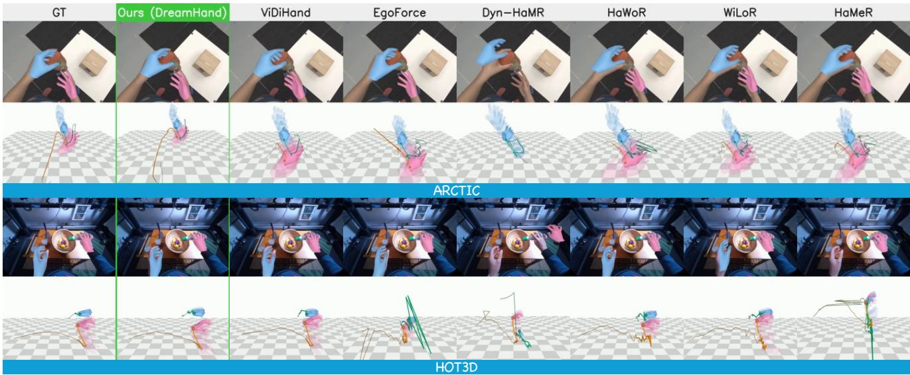  
Figure 4. Qualitative comparison on ARCTIC (top) and HOT3D (bottom). For each dataset: the predicted mesh on the input frame, and the recovered hands in a shared world frame with wrist trails. Every method predicts in the camera frame, and the world view places those predictions with the ground-truth camera poses, so the view shows placement, not recovered camera motion. Under bimanual occlusion on ARCTIC several baselines recover only one hand. On wide-angle HOT3D they scatter the hands across the floor plane.

## 4.4. Qualitative Comparison

As illustrated in Figure 4, single-frame and world-space baselines produce fragmented, frequently interrupted predictions, while the generative baseline produces smoother yet depth-biased ones in these examples. In contrast, DreamHand recovers continuous, temporally stable trajectories tightly aligned with ground truth under rapid motion, severe occlusion, and transient out-of-sight intervals. Retargeting the recovered trajectories onto a dexterous Inspire Hand yields natural, coordinated motions that closely mirror the source videos, shown as kinematic visualizations in Appendix E, which also extends this comparison to H2O, OakInk2, and two in-the-wild egocentric sources.

## 5. Conclusion and Discussion

We presented DreamHand, an offline clip-level framework that recovers metric bimanual hand trajectories from egocentric video. Rather than sampling a video diffusion model as a renderer, we read it once as a Deterministic Clean-Latent Encoder and let 3D supervision reshape its features into geometry-aware ones. A Bidirectional Spatiotemporal Decoder then reconstructs whole clips at once, and a Ray-Based Camera Solver places them metrically. DreamHand sets a new state of the art across five benchmarks while running in a single forward pass, 33× faster than the strongest prior method, and its margins are largest where hands are occluded or out of sight. The best discriminative encoder approaches this accuracy while hands are visible but degrades far more once they leave view, suggesting that generative pretraining may contribute a temporal-geometric prior that discriminative pretraining does not. We hope Dream-Hand serves as a practical bridge from large-scale human video to manipulation data for robot learning.

Several limitations remain. The predicted ray field generalizes best within camera families seen during training, and broader data coverage is the natural remedy. HOI4D and H2O rely partially on pseudo-ground-truth annotations, so higher-precision ground truth is a promising path to further gains. Moreover, DreamHand operates offline over complete clips, which suits scalable data curation rather than closed-loop control, and distilling the encoder into a causal, streaming variant is a natural step toward online deployment.

## References

[1] Mido Assran, Adrien Bardes, David Fan, Quentin Garrido, Russell Howes, Mojtaba Komeili, et al. V-JEPA 2: Selfsupervised video models enable understanding, prediction and planning, 2025. Meta AI.

[2] Prithviraj Banerjee, Sindi Shkodrani, Pierre Moulon, Shreyas Hampali, Shangchen Han, Fan Zhang, Linguang Zhang, Jade Fountain, Edward Miller, Selen Basol, Richard Newcombe, Robert Wang, Jakob Julian Engel, and Tomas Hodan. HOT3D: Hand and object tracking in 3D from egocentric multi-view videos. In Proceedings of the IEEE/CVF Conference on Computer Vision and Pattern Recognition (CVPR), 2025. arXiv:2411.19167.

[3] Nicolas Carion, Francisco Massa, Gabriel Synnaeve, Nicolas Usunier, Alexander Kirillov, and Sergey Zagoruyko. End-toend object detection with transformers. In Proceedings of the European Conference on Computer Vision (ECCV), 2020.

[4] Hongsuk Choi, Gyeongsik Moon, Ju Yong Chang, and Kyoung Mu Lee. Beyond static features for temporally consistent 3D human pose and shape from a video. In Proceedings of the IEEE/CVF Conference on Computer Vision and Pattern Recognition (CVPR), 2021.

[5] Haoye Dong, Aviral Chharia, Wenbo Gou, Francisco Vicente Carrasco, and Fernando De la Torre. Hamba: Singleview 3D hand reconstruction with graph-guided bi-scanning mamba. In Advances in Neural Information Processing Systems (NeurIPS), 2024.

[6] Zicong Fan, Omid Taheri, Dimitrios Tzionas, Muhammed Kocabas, Manuel Kaufmann, Michael J. Black, and Otmar Hilliges. ARCTIC: A dataset for dexterous bimanual hand-object manipulation. In Proceedings ofthe IEEE/CVF Conference on Computer Vision and Pattern Recognition (CVPR), 2023.

[7] Masashi Hatano, Zhifan Zhu, Hideo Saito, and Dima Damen. The invisible EgoHand: 3D hand forecasting through EgoBody pose estimation, 2025.

[8] Ryan Hoque, Peide Huang, David J. Yoon, Mouli Sivapurapu, and Jian Zhang. EgoDex: Learning dexterous manipulation from large-scale egocentric video. In International Conference on Learning Representations (ICLR), 2026. arXiv:2505.11709. Apple.

[9] Edward J. Hu, Yelong Shen, Phillip Wallis, Zeyuan Allen-Zhu, Yuanzhi Li, Shean Wang, Lu Wang, and Weizhu Chen. LoRA: Low-rank adaptation of large language models. In International Conference on Learning Representations (ICLR), 2022.

[10] Zeyinzi Jiang, Zhen Han, Chaojie Mao, Jingfeng Zhang, Yulin Pan, and Yu Liu. VACE: All-in-one video creation and editing. In Proceedings of the IEEE/CVF International Conference on Computer Vision (ICCV), 2025. arXiv:2503.07598.

[11] Linyi Jin, Jianming Zhang, Yannick Hold-Geoffroy, Oliver Wang, Kevin Matzen, Matthew Sticha, and David F. Fouhey. Perspective fields for single image camera calibration. In Proceedings of the IEEE/CVF Conference on Computer Vision and Pattern Recognition (CVPR), 2023.

[12] Simar Kareer, Dhruv Patel, Ryan Punamiya, Pranay Mathur, Shuo Cheng, Chen Wang, Judy Hoffman, and Danfei Xu. EgoMimic: Scaling imitation learning via egocentric video. In IEEE International Conference on Robotics and Automa tion (ICRA), 2025. arXiv:2410.24221.

[13] Muhammed Kocabas, Nikos Athanasiou, and Michael J. Black. VIBE: Video inference for human body pose and shape estimation. In Proceedings of the IEEE/CVF Confer ence on Computer Vision and Pattern Recognition (CVPR), 2020.

[14] Harold W. Kuhn. The Hungarian method for the assignment problem. Naval Research Logistics Quarterly, 2, 1955.

[15] Taein Kwon, Bugra Tekin, Jan Stuhmer, Federica Bogo,¨ and Marc Pollefeys. H2O: Two hands manipulating objects for first person interaction recognition. In Proceedings of the IEEE/CVF International Conference on Computer Vision (ICCV), 2021.

[16] Jiefeng Li, Jinkun Cao, Haotian Zhang, Davis Rempe, Jan Kautz, Umar Iqbal, and Ye Yuan. GENMO: A generalist model for human motion. In Proceedings of the IEEE/CVF International Conference on Computer Vision (ICCV), 2025. arXiv:2505.01425.

[17] Dixuan Lin, Yuxiang Zhang, Mengcheng Li, Wei Jing, Q Yan, Qianying Wang, Yebin Liu, and Hongwen Zhang. Om niHands: Towards robust 4D hand mesh recovery via a versatile transformer, 2024.

[18] Yunze Liu, Yun Liu, Che Jiang, Kangbo Lyu, Weikang Wan, Hao Shen, Boqiang Liang, Zhoujie Fu, He Wang, and Li Yi. HOI4D: A 4D egocentric dataset for category-level human object interaction. In Proceedings of the IEEE/CVF Confer ence on Computer Vision and Pattern Recognition (CVPR), 2022.

[19] Christen Millerdurai, Shaoxiang Wang, Yaxu Xie, Vladislav Golyanik, Didier Stricker, and Alain Pagani. EgoForce: Forearm-guided camera-space 3D hand pose from a monocular egocentric camera. In ACM SIGGRAPH 2026 Conference Papers, 2026. arXiv:2605.12498.

[20] Gyeongsik Moon. Bringing inputs to shared domains for 3D interacting hands recovery in the wild. In Proceedings of the IEEE/CVF Conference on Computer Vision and Pattern Recognition (CVPR), 2023. arXiv:2303.13652.

[21] Gyeongsik Moon, Shunsuke Saito, Weipeng Xu, et al. A dataset of relighted 3D interacting hands. In Advances in Neural Information Processing Systems (NeurIPS) Datasets and Benchmarks, 2023.

[22] Georgios Pavlakos, Dandan Shan, Ilija Radosavovic, Angjoo Kanazawa, David Fouhey, and Jitendra Malik. Reconstructing hands in 3D with transformers. In Proceedings of the IEEE/CVF Conference on Computer Vision and Pattern Recognition (CVPR), 2024.

[23] Rolandos Alexandros Potamias, Jinglei Zhang, Jiankang Deng, and Stefanos Zafeiriou. WiLoR: End-to-end 3D hand localization and reconstruction in-the-wild. In Proceedings of the IEEE/CVF Conference on Computer Vision and Pat tern Recognition (CVPR), 2025. arXiv:2409.12259.

[24] Aditya Prakash, Ruisen Tu, Matthew Chang, and Saurabh Gupta. 3D hand pose estimation in everyday egocentric im-

ages. In Proceedings of the European Conference on Computer Vision (ECCV), 2024.

[25] Javier Romero, Dimitrios Tzionas, and Michael J. Black. Embodied hands: Modeling and capturing hands and bodies together. ACM Transactions on Graphics, 36(6), 2017. Proc. SIGGRAPH Asia 2017; the MANO hand model.

[26] Ropedia. Xperience-10M: A large-scale egocentric multimodal dataset with structured 3d/4d annotations. https: / / huggingface . co / datasets / ropedia - ai / xperience-10m, 2026. Dataset.

[27] Xiaolong Shen, Zongxin Yang, Xiaohan Wang, Jianxin Ma, Chang Zhou, and Yi Yang. Global-to-local modeling for video-based 3D human pose and shape estimation. In Proceedings of the IEEE/CVF Conference on Computer Vision and Pattern Recognition (CVPR), 2023.

[28] Ayush Shrivastava, Sanyam Mehta, Daniel Geng, and Andrew Owens. Point prompting: Counterfactual tracking with video diffusion models. In International Conference on Learning Representations (ICLR), 2026. arXiv:2510.11715.

[29] Jianlin Su, Murtadha Ahmed, Yu Lu, Shengfeng Pan, Wen Bo, and Yunfeng Liu. RoFormer: Enhanced transformer with rotary position embedding. Neurocomputing, 568, 2024.

[30] Guy Tevet, Sigal Raab, Brian Gordon, Yoni Shafir, Daniel Cohen-Or, and Amit H. Bermano. Human motion diffusion model. In International Conference on Learning Representations (ICLR), 2023.

[31] Zhan Tong, Yibing Song, Jue Wang, and Limin Wang. VideoMAE: Masked autoencoders are data-efficient learners for self-supervised video pre-training. In Advances in Neural Information Processing Systems (NeurIPS), 2022.

[32] Wan Team. Wan: Open and advanced large-scale video generative models, 2025. Alibaba; covers the Wan2.1/Wan2.2 model family.

[33] Letian Wang, Chuhan Zhang, Rishabh Kabra, Jasper Uijlings, Steven Waslander, Andrew Zisserman, Joao Carreira, Kaiming He, Misha Andriluka, Eduard Gabriel Bazavan, Andrei Zanfir, and Cristian Sminchisescu. Video generation models are general-purpose vision learners, 2026. GenCeption; Google DeepMind.

[34] Xin Wang, Taein Kwon, Mahdi Rad, Bowen Pan, Ishani Chakraborty, Sean Andrist, Dan Bohus, Ashley Feniello, Bugra Tekin, Felipe Vieira Frujeri, Neel Joshi, and Marc Pollefeys. HoloAssist: An egocentric human interaction dataset for interactive AI assistants in the real world. In Proceedings of the IEEE/CVF International Conference on Computer Vision (ICCV), 2023.

[35] Yufu Wang, Ziyun Wang, Lingjie Liu, and Kostas Daniilidis. TRAM: Global trajectory and motion of 3D humans from inthe-wild videos. In Proceedings of the European Conference on Computer Vision (ECCV), 2024. arXiv:2403.17346.

[36] Yuxi Wang, Chengkai Jin, Yufei Liu, Wenqi Ouyang, Tianyi Wei, Zhiwei Zeng, Siyuan Huang, Zhiqi Shen, and Xingang Pan. The surprising effectiveness of video diffusion models for hand motion reconstruction, 2026.

[37] Ruihan Yang, Qinxi Yu, Yecheng Wu, Rui Yan, Borui Li, An-Chieh Cheng, Xueyan Zou, Yunhao Fang, Xuxin Cheng, Ri-Zhao Qiu, Hongxu Yin, Sifei Liu, Song Han, Yao Lu, and

Xiaolong Wang. EgoVLA: Learning vision-language-action models from egocentric human videos, 2025.

[38] Vickie Ye, Georgios Pavlakos, Jitendra Malik, and Angjoo Kanazawa. Decoupling human and camera motion from videos in the wild. In Proceedings ofthe IEEE/CVF Confer ence on Computer Vision and Pattern Recognition (CVPR), 2023.

[39] Zhengdi Yu, Stefanos Zafeiriou, and Tolga Birdal. Dyn-HaMR: Recovering 4D interacting hand motion from a dynamic camera. In Proceedings of the IEEE/CVF Conference on Computer Vision and Pattern Recognition (CVPR), 2025. arXiv:2412.12861.

[40] Xinyu Zhan, Lixin Yang, Yifei Zhao, Kangrui Mao, Hanlin Xu, Zenan Lin, Kailin Li, and Cewu Lu. OakInk2: A dataset of bimanual hands-object manipulation in complex task completion. In Proceedings of the IEEE/CVF Confer ence on Computer Vision and Pattern Recognition (CVPR), 2024.

[41] Jinglei Zhang, Jiankang Deng, Chao Ma, and Rolandos Alexandros Potamias. HaWoR: World-space hand motion reconstruction from egocentric videos. In Proceedings of the IEEE/CVF Conference on Computer Vision and Pat tern Recognition (CVPR), 2025. arXiv:2501.02973.

[42] Jason Y. Zhang, Amy Lin, Moneish Kumar, Tzu-Hsuan Yang, Deva Ramanan, and Shubham Tulsiani. Cameras as rays: Pose estimation via ray diffusion. In International Con ference on Learning Representations (ICLR), 2024.

[43] Christian Zimmermann and Thomas Brox. Learning to esti mate 3D hand pose from single RGB images. In Proceedings of the IEEE International Conference on Computer Vision (ICCV), 2017.

[44] Christian Zimmermann, Duygu Ceylan, Jimei Yang, Bryan Russell, Max Argus, and Thomas Brox. FreiHAND: A dataset for markerless capture of hand pose and shape from single RGB images. In Proceedings of the IEEE/CVF Inter national Conference on Computer Vision (ICCV), 2019.

# DreamHand: Repurposing Video Diffusion Models for Occlusion-Robust Egocentric 3D Hand Motion Recovery

Supplementary Material

The appendix is organized as follows. Appendix A states the evaluation protocol, the dataset splits, and how the baselines were reproduced, so that every number in the main text can be traced to a definition. Appendix B gives the architecture, optimization, and loss details needed to reproduce the model. Appendix C reports the two additional in-domain datasets, the out-of-sight stratification behind the two OOS metrics of the main text, the matched-detection check, and inference throughput. Appendix D analyzes where Dream-Hand degrades, at the image periphery and over long decoding passes, and measures two design choices, the tap depth and the latent noise level. Appendix E gives extended qualitative comparisons and the retargeting application. Appendix F closes with the limitations, the failure signature each one produces, and our data-use statement.

## A. Experimental Setup and Protocol

## A.1. Metric Definitions and Penalty Protocol

This section states the definitions behind every result table of the main text. Let a hand be a pair (J, τ) of 21 canonical joints and a camera-frame translation, and write $J ^ { \mathrm { c a m } } =$ $J + \tau .$ . Note that τ places the canonical hand and is therefore the MANO root translation, not the position of the wrist joint, which is $J _ { 0 } + \tau .$ . CT below is an error in τ .

Table S1 lists every metric symbol used in this paper, the population it averages over, and whether the coverage penalty applies. The rest of this section defines each one. One further metric appears in Appendix C and is named in place: MPJPE restricted to matched detections, a third population again, used there to separate lost coverage from lost pose.

On-screen gate. A hand is on-screen if at least one of its 21 joints projects inside the image rectangle at positive depth,

$$
\exists j : \ \pi ( J _ { j } ^ { \mathrm { c a m } } ) \in [ 0 , W ) \times [ 0 , H ) \ \land \ J _ { z , j } ^ { \mathrm { c a m } } > z _ { \operatorname* { m i n } } ,\tag{S1}
$$

with π the calibrated projection and $z _ { \mathrm { m i n } } = 1$ cm. Groundtruth hands that fail this test are out of sight (OOS) and are excluded from the main metrics. The same test is applied to predictions, so a prediction that places its hand OOS is not charged as a false positive.

Detection. A predicted hand is active when its existence score exceeds 0.5. Active predictions are matched to on-screen ground-truth hands of the same side by the intersection-over-union of their projected mesh bounding boxes, with ground-truth boxes dilated by 10% before the overlap is computed. Each prediction takes its highestoverlap candidate, and where two same-side predictions select the same ground-truth hand, the higher overlap wins. A prediction whose best overlap is zero, or whose best overlap falls on the opposite side, is counted as a false positive, so the rule is a strictly-positive-overlap test on the matching side rather than a fixed IoU threshold. Unmatched groundtruth hands count as false negatives (FN), and unmatched predictions as false positives (FP). With per-side counts, and writing P and R for precision and recall,

$$
\mathrm { P } = \frac { \mathrm { T P } } { \mathrm { T P } + \mathrm { F P } } , \qquad \mathrm { R } = \frac { \mathrm { T P } } { \mathrm { T P } + \mathrm { F N } } , \qquad \mathrm { F 1 } = \frac { 2 \mathrm { P } \mathrm { R } } { \mathrm { P } + \mathrm { R } } ,\tag{S2}
$$

and Frame Accuracy is the fraction of frames that contain no error on either side,

$$
\mathrm { F A c c } = \frac { 1 } { N } \sum _ { f = 1 } ^ { N } \mathbf { 1 } [ \mathrm { F P } _ { f } + \mathrm { F N } _ { f } = 0 ] .\tag{S3}
$$

Because matching uses the projected mesh, detection depends on predicted translation as well as on the existence score.

Pose metrics. For a matched pair, with $\bar { J } = J - J _ { 0 }$ denoting wrist-relative joints and Λ the Procrustes alignment,

$$
\begin{array} { r } { \mathrm { M P J P E } = \frac { 1 } { 2 1 } \sum _ { j } \lVert \bar { \hat { J } } _ { j } - \bar { J } _ { j } \rVert _ { 2 } , } \end{array}\tag{S4}
$$

$$
\begin{array} { r } { \mathrm { P A } = \frac { 1 } { 2 1 } \sum _ { j } \| \boldsymbol { \Lambda } ( \hat { \boldsymbol { J } } ) _ { j } - J _ { j } \| _ { 2 } , } \end{array}\tag{S5}
$$

$$
\begin{array} { r } { \mathrm { E P E } _ { \mathrm { 2 D } } = \frac { 1 } { | \mathcal { V } | } \sum _ { j \in \mathcal { V } } \lVert \hat { p } _ { j } - p _ { j } \rVert _ { 2 } , } \end{array}\tag{S6}
$$

$$
\mathrm { C T } = \Vert \hat { \tau } - \tau \Vert _ { 2 } ,\tag{S7}
$$

where $\hat { p } _ { j }$ is the model’s own 2D anchor, V holds the joints whose ground truth falls inside the frame, and $\mathrm { G O } ~ = ~ \angle ( \hat { R } , R )$ is the geodesic angle between predicted and ground-truth global orientations. One case needs stating separately. For the K-free configuration no intrinsics are supplied to fix a pixel scale, so its $\hat { p } _ { j }$ is obtained by re-projecting the predicted camera-frame joints under the clip’s ground-truth intrinsics. Those intrinsics are used for scoring only and never reach the model, so that $\mathrm { E P E } _ { \mathrm { 2 D } ^ { - } \mathrm { p } }$ becomes a direct read-out of how well the predicted ray field stands in for calibration. Jitter is the mean second temporal difference of the camera-frame joints, $\begin{array} { r } { \frac { 1 } { T - 2 } \sum _ { t } \lVert J _ { t + 1 } ^ { \mathrm { c a m } } - } \end{array}$ $2 J _ { t } ^ { \mathrm { c a m } } + J _ { t - 1 } ^ { \mathrm { c a m } } | |$ , in mm/frame2. The difference runs over the frame index and is not normalized by frame rate, and

$J ^ { \mathrm { c a m } }$ is the wrist-relative joint set plus the predicted translation. Jitter is evaluated only on frames for which a method produced a matched detection. For each segment and each ground-truth hand the matched predictions are partitioned into maximal runs of consecutive frames, and the second difference is averaged inside every run of at least three frames. A frame with no detection ends a run rather than being filled by interpolation or by a placeholder pose, and no run crosses a segment boundary. A missed detection therefore removes a frame from the computation instead of charging it, so the convention is conservative for a method that detects nearly every hand.

Reading Jitter. The Bidirectional Spatiotemporal Decoder emits one token set per latent frame, and the Wan VAE compresses time by 4×, so the 81 frames scored in Table 1 are carried by 21 latent frames. Hidden features and the direct joint coordinates are expanded to frame rate by linear interpolation along time, and the per-frame Pose Head and Camera Head then run on the expanded features, while the Shape Head reads a single $\hat { \beta }$ per hand per clip. The scored joints are therefore decoded per frame from a feature trajectory that is piecewise linear in time. Jitter, in mm/frame2, measures the smoothness of that output. Fidelity to the ground truth is judged by the accuracy columns reported beside Jitter.

Coverage penalty (the -p suffix). Reporting errors only on matched hands rewards a method for skipping the hardest frames. Every metric therefore averages over true positives and false negatives, charging each FN the error of a canonical MANO [25] hand: identity global orientation, zero articulation, mean shape, and $\boldsymbol { \tau } = \mathbf { 0 }$

$$
{ \mathrm { m e t r i c } } - p = { \frac { \sum _ { i \in \mathrm { T P } } e _ { i } + \sum _ { i \in \mathrm { F N } } e _ { i } ^ { \mathrm { c a n } } } { | \mathrm { T P } | + | \mathrm { F N } | } } .\tag{S8}
$$

The placeholder is computed per missed ground-truth hand, so the cost of a miss is deterministic and identical for every method. $\mathrm { E P E _ { 2 D } }$ is the one exception. Each joint of a missed hand is charged the image diagonal $\sqrt { W ^ { 2 } + H ^ { 2 } }$ , an upper bound on the distance between two points inside the frame, which is 826 px on ARCTIC and 679 px on HOT3D. That diagonal is 826 px on ARCTIC and 679 px on HOT3D.

Coverage of out-of-sight hands: two distinct metrics. The on-screen gate restricts every metric above to groundtruth hands inside the frame, so none of them scores a hand while it is out of sight. Two further metrics close that gap. They are easy to confuse, so we state what separates them before defining either.

Both come from a second scoring pass that is gated by the ground truth alone. That pass walks every ground-truth hand-frame of the sequence and scores it against whatever the model emits in that hand slot, with no existence gate, no detection matching, and no false-negative placeholder.

Table S1. Metric symbols. “Averaged $\mathrm { o v e r } ^ { \prime \mathrm { { \cdot } } }$ is the population each metric runs on. “Pen.” marks the metrics that charge a placeholder for every missed on-screen detection. The upper block is detection-gated: restricted to on-screen ground truth, matched to predictions, penalized for each miss. The lower block is groundtruth-gated: no matching, no placeholder, and the three differ only in which hand-frames they average over. The two families are not interchangeable.
<table><tr><td>Symbol</td><td>Averaged over</td><td>Pen. Unit</td></tr><tr><td>FAcc</td><td>frames</td><td></td></tr><tr><td>Recall, F1</td><td>on-screen hands</td><td></td></tr><tr><td> $\mathrm { M P J P E { - } p }$ </td><td>on-screen hands</td><td>√ mm</td></tr><tr><td> $\mathrm { P A } \mathfrak { - p }$ </td><td>on-screen hands</td><td>√ mm</td></tr><tr><td> $\mathrm { E P E } _ { \mathrm { 2 D } ^ { - } \mathrm { p } }$ </td><td>on-screen joints</td><td>px</td></tr><tr><td> $\mathrm { G O - p }$ </td><td>on-screen hands</td><td>0</td></tr><tr><td> $\mathrm { C T - p }$ </td><td>on-screen hands</td><td>√ √ m</td></tr><tr><td>Jitter</td><td>matched runs</td><td> $\mathrm { m m / f r a m e ^ { 2 } }$ </td></tr><tr><td> $\mathbf { M P J P E } ^ { \mathrm { { o o s } } }$ </td><td>out-of-sight hand-frames</td><td>一 mm</td></tr><tr><td> $\mathbf { M P J P E ^ { + O O S } }$ </td><td>all hand-frames</td><td>mm</td></tr></table>

Neither metric therefore carries the -p coverage penalty, and neither is a function of MPJPE-p: MPJPE-p averages over matched detections plus a placeholder for each miss, whereas the two out-of-sight metrics average over groundtruth hand-frames regardless of whether the method detected anything, so the two scoring passes cannot be recombined arithmetically. Both are wrist-aligned, so they certify articulation and orientation through an out-of-sight interval rather than absolute placement.

Write H for the ground-truth hand-frames of a sequence, $\mathcal { H } ^ { \mathrm { I V } } \subseteq \mathcal { H }$ for those that pass the on-screen gate, the in-view stratum, and $\mathcal { H } ^ { \mathrm { O O S } } = \dot { \mathcal { H } } \setminus \mathcal { H } ^ { \mathrm { I V } }$ for those that fail it, and let

$$
\varepsilon _ { i } = \frac { 1 } { 2 1 } \sum _ { j } \lVert \bar { \hat { J } } _ { j } ^ { ( i ) } - \bar { \bar { J } } _ { j } ^ { ( i ) } \rVert _ { 2 }\tag{S9}
$$

be the wrist-aligned error of hand-frame $i ,$ written ε to keep it distinct from the generic per-hand error e of the penalty above. The two metrics are the same error averaged over different populations,

$$
\begin{array} { c } { { \mathrm { M P J P E } ^ { \mathrm { O O S } } = \displaystyle \frac { 1 } { | \mathcal { H } ^ { \mathrm { O O S } } | } \sum _ { i \in \mathcal { H } ^ { \mathrm { O O S } } } \varepsilon _ { i } , } } \\ { { \mathrm { M P J P E } ^ { \mathrm { + O O S } } = \displaystyle \frac { 1 } { | \mathcal { H } | } \sum _ { i \in \mathcal { H } } \varepsilon _ { i } , } } \end{array}\tag{S10}
$$

The second is therefore the frame-count-weighted mixture of the two strata. Writing $\bar { \varepsilon } _ { \mathrm { I V } }$ and $\bar { \varepsilon } _ { \mathrm { O O S } }$ for the mean of $\varepsilon _ { i }$ over each stratum, and $n _ { \mathrm { I V } }$ and nOOS for the two handframe counts,

$$
\mathrm { M P J P E } ^ { \mathrm { + O O S } } = \frac { n _ { \mathrm { I V } } \bar { \varepsilon } _ { \mathrm { I V } } + n _ { \mathrm { O O S } } \bar { \varepsilon } _ { \mathrm { O O S } } } { n _ { \mathrm { I V } } + n _ { \mathrm { O O S } } } .\tag{S11}
$$

MPJPEOOS scores the out-of-sight stratum on its own. MPJPE+OOS pools both strata, so it is dominated by the larger one: out-of-sight hand-frames are 6.9% of ARCTIC, 17.6% of HOT3D, and 14.5% of OakInk2, so the blended figure is dominated by the in-view stratum on all three. A reduction on MPJPE+OOS is therefore not a reduction on out-of-sight hands, and the two must not be read as substitutes for one another. Table 1 (the main comparison) reports the blended form, Table 2 (the feature-source ablation) reports the stratum, and Table S4 of this appendix reports both, together with the in-view stratum, so that Eq. (S11) can be checked row by row.

## A.2. Datasets, Splits, and Preprocessing

The five evaluated video datasets (ARCTIC [6], HOT3D [2], H2O [15], OakInk2 [40], and HOI4D [18]) are processed at 30 fps without temporal subsampling. On the four of these that enter training, training operates on full-length recordings, drawing a random 21-latent-frame (81 RGB frame) window from each recording at every step, while evaluation decodes the fixed 81-frame test segments shared with all baselines. Three further datasets enter the training mixture only. They do not all follow this convention and are described at the end of this subsection. Input resolutions are 672 × 480 for ARCTIC and 480 × 480 for HOT3D, and H2O and OakInk2 are resized to a width of 832 with intrinsics rescaled accordingly, so that every dataset yields an even latent grid. Test splits are subjectdisjoint on ARCTIC (test subject s05) and H2O (test sub ject 4), recording-level on HOT3D (126/72 recordings), and sequence-level on OakInk2 (evaluated on the 202-segment subset shared with the baselines), while HOI4D is excluded from training entirely and evaluated zero-shot. Each dataset ships its own hand annotation format, and we convert all of them into one shared MANO format so that a single loader and a single evaluator serve every dataset. As the main text notes, HOI4D and H2O rely partially on pseudoground-truth MANO annotation derived from a per-frame estimator, so on those two benchmarks the comparison measures agreement with the labels rather than absolute accuracy. The two differ in how much that matters. HOI4D is held out of training entirely, so its labels are noisy but the noise is the same for every method. H2O is in our train ing mixture, so our model additionally trains on the label distribution that later scores it, while every baseline meets that distribution for the first time at evaluation. ARCTIC, HOT3D, and OakInk2 carry native MANO ground truth, and the headline reductions are quoted on ARCTIC and HOT3D.

Training mixture. Both configurations train on the same seven-source mixture, with a dataset drawn per batch from the weights of Table S2, which sum to 100. Four sources are egocentric video with MANO, namely ARCTIC, HOT3D,

Table S2. Training and evaluation data. Clip and frame counts are read from the dataset manifests. For the video sources one clip is one full-length recording, not an 81-frame window. Frei-HAND and RHD are static image sources, so their clip column counts images. “Eval” is the number of 81-frame test segments shared with every baseline. For HOT3D and OakInk2 these segments cover only a subset of the available test video. “Wt.” is the per-batch sampling weight in percent and is identical for both configurations. HOI4D is held out of training.
<table><tr><td rowspan="2">Source</td><td colspan="2">Train</td><td colspan="2">Test</td><td colspan="2"></td></tr><tr><td>clips</td><td>s frames clips</td><td></td><td></td><td>frames Eval Wt.</td><td></td></tr><tr><td>ARCTIC</td><td></td><td>267184,373</td><td>34</td><td>24,863</td><td>291</td><td>14</td></tr><tr><td>HOT3D</td><td></td><td>126444,649</td><td></td><td>72 256,870</td><td>437</td><td>18</td></tr><tr><td>H2O</td><td></td><td>114 68,929</td><td></td><td>46 30,724 355</td><td></td><td>10</td></tr><tr><td>OakInk2</td><td></td><td>550935,260</td><td>77</td><td></td><td>69,371 202</td><td>14</td></tr><tr><td>Re:InterHand</td><td></td><td>43 21,315</td><td></td><td></td><td></td><td>16</td></tr><tr><td>FreiHAND</td><td>32,560162,800</td><td></td><td></td><td></td><td></td><td>14</td></tr><tr><td>RHD</td><td>41,251 206,255</td><td></td><td></td><td></td><td></td><td>14</td></tr><tr><td>HOI4D (held out)</td><td>一</td><td></td><td>166</td><td>49,800</td><td>498</td><td>0</td></tr></table>

H2O, and OakInk2. The remaining three are used for training only and are never evaluated on. They hold 44% of the sampling weight and add appearance and pose diversity from outside the egocentric video domain. The three differ in kind. Re:InterHand [21] contributes relit studio captures rendered under egocentric fisheye cameras at 10 fps, so it enters as video and receives the full 21-latent-frame window like the video datasets above. FreiHAND [44] and RHD [43] are two static image sources. Each image is replicated into a static five-frame clip. Those batches contain almost no temporal variation, so they supply appearance and hand-pose diversity rather than motion. FreiHAND is right-hand only and carries a full MANO fit, as does Re:InterHand. RHD provides 21 3D joints and no MANO fit. Those samples supervise the 2D anchor, 3D joint, existence, and visibility heads while the rotation and shape terms are held at zero, following the loss routing described in the main text. Every batch is drawn from a single dataset, so clips of different length and different latent grid are never stacked together.

## A.3. Baseline Reproduction

Every number we compute is produced by a single evaluation protocol applied to per-segment prediction files, and the values quoted from prior work follow that same protocol, so no metric definition changes between the rows of a table. That protocol is the one introduced by ViDiHand [36], whose metric definitions, on-screen gate, and test segments we adopt unchanged.

Nine of the twelve rows in each block of Table 1 report methods that ViDiHand also evaluates, and for those the table quotes the published values. EgoForce is not among them, so its row comes from our own run under the same protocol, as do the two DreamHand rows and every row of this appendix. Quoting across papers is only sound if the two implementations of the protocol agree, so we did not take that on trust. We re-ran every one of the nine public releases through our own evaluator and compared the outcome with the published number. The agreement is close enough for us to treat the two implementations as one protocol, and where a cell differs, the table keeps the published value rather than ours, so that the nine quoted rows remain consistent with the source they come from. The paragraphs below describe how those reproduction runs were set up. Baseline predictions come from the official public release of each method, run without retraining and without edits to its model code, then converted to the shared MANO format before scoring.

HaMeR [22] and Hamba [5] use the released hamer. ckpt and hamba.ckpt behind the Detectron2 ViTDet-H detector and the ViTPose+-Huge whole-body keypoint model that produce their hand boxes. WildHands [24] uses wildhands.ckpt and OmniHands [17] its nine-frame video model Demo Video.pth with config video. yaml, both behind the same detector front end, that is, ViTDet-H plus ViTPose+-Huge. InterWild [20] uses the egocentric release snapshot 6 ego.pth behind that front end as well, with its internal BoxNet bypassed at run time so that the same external hand boxes are injected, because that BoxNet mislocalizes hands on egocentric frames. WiLoR [23] uses wilor final.ckpt with its own YOLO detector, HaWoR [41] uses hawor.ckpt, and EgoForce [19] uses its released model weights. pth. Dyn-HaMR [39] runs the default optimization schedule of that repository on top of the HaMeR front end. Because every baseline is scored from its public release without retraining on our splits, the training data behind the baseline rows is whatever each release was trained on, and we do not control for that.

Three adaptations are worth stating. Two favor the baseline. WildHands and HaWoR, which take camera geometry as an explicit input, receive the ground-truth intrinsics of the clip, rescaled together with the image where the method requires its own input resolution. Dyn-HaMR receives the ground-truth extrinsics instead of running DROID-SLAM, which removes a failure source unrelated to hand pose. The third works against the baseline, and we state this as a cost to HaWoR. HaWoR’s SLAM and infilling stages are skipped and its camera-space motion estimate is scored directly, because the protocol is camera-space and DROID-SLAM is unstable on the 81-frame (2.7 s) test segments. The two stages are coupled in the released code, since the infiller runs in world space on the SLAM trajectory, so dropping SLAM drops infilling with it. That removes the module meant to carry a hand through frames where it is not detected, so the HaWoR rows report the output of its cameraspace hand-motion estimator rather than of its full published pipeline. The K-free configuration of DreamHand receives no camera information as input. Ground-truth intrinsics enter its evaluation only where the metric definitions above say so, namely to re-project its 3D joints when $\mathrm { E P E } _ { \mathrm { 2 D } ^ { - } \mathrm { p } }$ is scored.

## B. Implementation Details

## B.1. Architecture

The spatial PE Psp is a learned 16 × 16 grid bilinearly resized to the token resolution, and the ray PE Fourierencodes each ray’s azimuth and elevation with sines and cosines at eight doubling frequencies, after which a zeroinitialized MLP maps the resulting features to the decoder width, giving a smooth start to training. In the mixed-PnP solve, a joint votes $( m _ { j } = 1 )$ if it lies at least 5 cm in fron of the camera and its anchor lies inside the frame by a mar gin of at least 2% of the image size. When fewer than six joints vote, or when the refit RMS anchor residual exceeds the larger of 15 px and a quarter of the hand’s 2D bounding diagonal, the wrist is placed on its own inverseprojected ray at depth $\hat { t } _ { z }$ . The backbone is the Wan2.2- Fun-5B-Control release [32] distributed with VideoX-Fun, loaded as its low-noise DiT submodel with 30 blocks of width 3072, feed-forward width 14336, 148 input latent channels, and 48 output channels, and paired with the Wan 2.2 VAE. We keep the released input and output channel counts unchanged. LoRA adapters of rank 64 with α = 64 and no dropout are injected into all ten linear layers of every block, namely the query, key, value, and output projections of both self-attention and cross-attention plus the two feed-forward layers. Adapters are matched by module name rather than by depth, so one set is instantiated in each of the 30 blocks, giving 5.37M adapter parameters per block and 161.219M in total. Three counts are worth keeping apart. Of the 5.002B pretrained weights the released DiT holds, only the 1.822M patch embedding is ever updated, and the 30 transformer blocks stay frozen throughout. With the adapters attached, the instantiated backbone holds 5.16B parameters. The optimizer is then handed 183.99M parameters, split by module into 161.219M in the LoRA adapters, 20.347M in the decoder and its readout heads, 1.822M in the patch embedding, 0.596M in the DiT’s own diffusion output head, and 9,219 in the Ray Head. These fall into the three learning-rate groups of the next subsection: the LoRA group, the patch-embedding group, and one group holding the decoder, its readout heads, the Ray Head, and the diffusion output head. Since the forward pass stops at the tap, the parameters a gradient can actually reach are the 85.983M of LoRA inside the executed blocks, the 1.822M patch embedding, the 12.287M of decoder parameters that this configuration routes through, and the Ray Head, for 100.10M in all.

The adapters in the bypassed blocks and the diffusion output head sit on the skipped path and therefore never leave their initialization. We confirmed this on the released checkpoint: after 20k steps every LoRA B matrix past the tap is still exactly zero, which makes those adapters exact identity maps, and every tensor of the diffusion output head is bit-identical to the pretrained release. The decoder parameters outside the 12.287M belong to readout variants that this configuration does not select, and we keep them instantiated so that a single checkpoint schema covers every ablation.

## B.2. Optimization

Only the 183.99M parameters listed above are registered with the optimizer. The decoder, the Ray Head, and the LoRA adapters are trained from scratch, with the Ray Head and the LoRA B matrices starting at zero so that the network begins the run as the unmodified backbone, while the patch embedding is fine-tuned from its released weights. We run 20k AdamW steps (weight decay $1 0 ^ { - 2 }$ , gradient clip 1.0, cosine decay, 200 warmup steps) at three learning rates: $2 \times 1 0 ^ { - 4 }$ for the decoder and heads, $1 \times 1 0 ^ { - 4 }$ for the LoRA adapters, $2 \times 1 0 ^ { - 5 }$ for the patch embedding. Each GPU holds four clips, where a clip is 81 frames for the video datasets and five frames for the two image datasets. The standard configuration runs on 16 A100 GPUs, for an effective batch of 64 clips, and the K-free configuration on 8, for an effective batch of 32. The ablations of Table 3 follow the K-free configuration, except that the hand-pooledquery and absolute-PE variants run on half as many GPUs at the same step count and the same number of clips per GPU, so part of their measured gap to the K-free configuration may reflect the smaller effective batch rather than the design change alone.

## B.3. Loss Weights

DreamHand’s trainable components, namely the LoRA adapters, the patch embedding, the Ray Head, and the Bidirectional Spatiotemporal Decoder, are optimized jointly under Eq. (6), $\mathcal { L } = \mathcal { L } _ { \mathrm { r o t } } + \mathcal { L } _ { \mathrm { j o i n t } } + \mathcal { L } _ { \mathrm { i m g } } + \mathcal { L } _ { \mathrm { c a m } } + \mathcal { L } _ { \mathrm { p r e s } } +$ ${ \mathcal { L } } _ { \mathrm { t m p } } + { \mathcal { L } } _ { \mathrm { r a y } }$ . The per-term weights are as follows.

${ \mathcal L } _ { \mathrm { r o t } }$ supervises orientation and articulation with the geodesic distance arccos $\begin{array} { r } { \left( \frac { 1 } { 2 } ( \mathrm { t r } ( \hat { R } ^ { \top } R ) - 1 ) \right) } \end{array}$ to the groundtruth rotation R, plus a rotation-matrix MSE (weight 1 each), and shape with an $\ell _ { 1 }$ loss (0.1). $\mathcal { L } _ { \mathrm { j o i n t } }$ places $\ell _ { 1 }$ losses on root-relative (weight 10, the dominant term), camera-frame (5), and wrist (2) 3D joints. ${ \mathcal { L } } _ { \mathrm { i m g } }$ supervises, under the training camera, the grounded soft-argmax 2D anchors and the re-projected MANO joints (weight 1, and 0.5 for the wrist). $\mathcal { L } _ { \mathrm { c a m } }$ is an $\ell _ { 1 }$ loss on the assembled translation (weight 1), with the gradient flowing through the mixed-PnP solve. $\mathcal { L } _ { \mathrm { p r e s } }$ applies binary cross-entropy to existence and visibility (0.5/0.25). $\mathcal { L } _ { \mathrm { t m p } }$ penalizes the acceleration of the predicted 3D joints $\hat { J } _ { t } , \lVert \hat { J } _ { t + 1 } - 2 \hat { J } _ { t } + \hat { J } _ { t - 1 } \rVert _ { 1 }$

(0.5). $\mathcal { L } _ { \mathrm { r a y } }$ carries weight 1.

## C. Additional Quantitative Results

## C.1. Additional In-Domain Datasets: H2O and OakInk2

The main comparison (Table 1) reports ARCTIC, HOT3D, and held-out HOI4D. Table S3 gives the full per-dataset results on two further in-domain datasets, H2O and OakInk2, scored with the same shared evaluator. DreamHand again leads every accuracy metric but one, cutting the best baseline $\mathrm { M P J P E { - } p }$ by 66% on OakInk2 (26.520→8.988) and by 43% on H2O (16.219→9.223), with the K-free configuration landing within 0.004 mm of the standard configuration (9.227 vs. 9.223). The only cell a baseline wins is H2O CT-p, where the weak-perspective solve of WiLoR is marginally tighter (0.023 vs. 0.031). H2O GO-p is instead led by our own K-free row (5.605 vs. 5.689). Two caveats apply. First, each DreamHand entry comes from a single training run. Second, both datasets are in-domain for us and out-of-domain for every baseline, so these two blocks read as an in-domain upper bound rather than as the like-for-like comparison ARCTIC and HOT3D provide. On H2O, whose labels are partially pseudo-ground-truth, our model has additionally trained on the distribution it is scored against, whereas OakInk2 carries native MANO ground truth.

## C.2. Out-of-Sight Stratification

Table S4 decomposes the wrist-aligned error into its inview and out-of-sight strata for every method on the three datasets that carry out-of-sight ground truth. The table exists so that the two out-of-sight numbers of the main text can be told apart and audited separately, since the blended metric alone cannot distinguish a method that reconstructs out-of-sight hands from one that is merely accurate while the hands are in view.

The decomposition makes the difference concrete. On ARCTIC, ViDiHand and DreamHand differ by under 7 mm in view (22.311 against 15.423) but by 113.9 mm out of sight (149.113 against 35.165). Because only 6.9% of ARCTIC hand-frames are out of sight, the blended column compresses those two very different gaps into 31.045 against 16.783. In HOT3D, 17.6% of hand-frames are out of sight, so more of the out-of-sight gap survives into the blend. The blended reduction is therefore larger on HOT3D (61.1%) than on ARCTIC (45.9%), while the stratum reduction runs the other way (74.5% against 76.4%).

Two further points are visible only in the stratum column. First, the baselines are not merely worse out of sight. They collapse into one narrow band far above their in-view errors: all ten sit between 126 and 164 mm on all three datasets, with no ordering that resembles their in-view ranking. This is what one would expect of methods that, in the configuration scored here, have no mechanism for producing a hand pose when no hand appears in the frame. Second, and as a consequence, the strongest baseline out of sight is not the strongest baseline in view: WildHands leads the out-of-sight stratum on ARCTIC (135.437) and HOT3D (126.358) despite trailing WiLoR and ViDiHand in view, and DreamHand still reduces WildHands’ error by 74.0% and 69.4%. We read the out-of-sight margin as evidence of temporal reconstruction rather than of better perception, and we caution that it is a wrist-aligned margin: Appendix F states what that margin does not establish.

Table S3. Results on H2O and OakInk2. Same protocol as Table 1. Best per column in bold. MPJPE+OOS needs out-of-sight ground truth, which H2O lacks (–). OakInk2 uses the 202-segment subset shared with the baselines. ‡EgoForce post-filters translation with a causal Kalman filter.
<table><tr><td></td><td colspan="3">Detection</td><td colspan="3">3D Pose</td><td colspan="2">Orient. &amp; Position</td><td colspan="2">Temporal</td></tr><tr><td>Method</td><td>FAcc↑</td><td>Recall↑</td><td>F1↑</td><td>MPJPE-p↓</td><td>PA-p↓</td><td>MPJPE+OOS</td><td>EPE2D-P↓</td><td>GO-p↓</td><td>CT-p↓</td><td>Jitter↓</td></tr><tr><td>InterWild</td><td>0.981</td><td>0.990</td><td>0.994</td><td>21.526</td><td>8.979</td><td></td><td>19.929</td><td>17.695</td><td>0.037</td><td>16.153</td></tr><tr><td>HaMeR</td><td>0.980</td><td>0.990</td><td>0.992</td><td>20.079</td><td>7.221</td><td></td><td>21.786</td><td>17.971</td><td>0.034</td><td>9.307</td></tr><tr><td>Hamba</td><td>0.960</td><td>0.979</td><td>0.987</td><td>21.412</td><td>8.390</td><td></td><td>32.978</td><td>19.510</td><td>0.038</td><td>8.285</td></tr><tr><td>WildHands</td><td>0.989</td><td>0.995</td><td>0.996</td><td>32.587</td><td>10.508</td><td></td><td>26.297</td><td>22.033</td><td>0.082</td><td>10.894</td></tr><tr><td>WiLoR</td><td>0.994</td><td>0.998</td><td>0.998</td><td>16.390</td><td>5.633</td><td></td><td>14.497</td><td>14.495</td><td>0.023</td><td>6.117</td></tr><tr><td>HZ EgoForce</td><td>0.990</td><td>0.996</td><td>0.997</td><td>16.219</td><td>6.020</td><td></td><td>15.849</td><td>10.416</td><td>0.024</td><td>8.046</td></tr><tr><td>OmniHands</td><td>0.974</td><td>0.986</td><td>0.990</td><td>19.835</td><td>7.417</td><td></td><td>25.665</td><td>18.032</td><td>0.038</td><td>6.321</td></tr><tr><td>Dyn-HaMR</td><td>0.988</td><td>0.999</td><td>0.997</td><td>17.213</td><td>6.390</td><td></td><td>10.790</td><td>11.057</td><td>0.030</td><td>5.349</td></tr><tr><td>HaWoR</td><td>0.946</td><td>0.972</td><td>0.985</td><td>23.504</td><td>9.570</td><td></td><td>39.735</td><td>17.080</td><td>0.045</td><td>14.162</td></tr><tr><td>ViDiHand</td><td>0.997</td><td>0.999</td><td>0.999</td><td>17.320</td><td>7.987</td><td></td><td>16.544</td><td>12.159</td><td>0.040</td><td>1.990</td></tr><tr><td>DreamHand</td><td>0.999</td><td>1.000</td><td>1.000</td><td>9.223</td><td>4.894</td><td></td><td>6.088</td><td>5.689</td><td>0.031</td><td>0.707</td></tr><tr><td>DreamHand (K-free) InterWild</td><td>0.991</td><td>1.000</td><td>0.998</td><td>9.227</td><td>4.917</td><td></td><td>8.530</td><td>5.605</td><td>0.031</td><td>0.732</td></tr><tr><td rowspan="13">HaMeR Hamba Oallk2</td><td>0.547</td><td>0.722</td><td>0.819</td><td></td><td>51.013 37.038</td><td>65.619</td><td>244.590</td><td>54.710</td><td>0.179</td><td>43.499</td></tr><tr><td>0.680</td><td>0.799</td><td>0.866</td><td>43.804</td><td>28.726</td><td>59.471</td><td>171.887</td><td>46.340</td><td>0.148</td><td>19.510</td></tr><tr><td>0.634</td><td>0.755</td><td>0.840</td><td>46.517</td><td>32.488</td><td>61.863</td><td>213.576</td><td>51.295</td><td>0.159</td><td>13.811</td></tr><tr><td>WildHands</td><td>0.731 0.837</td><td></td><td>0.890</td><td>44.087</td><td>27.115</td><td>58.366</td><td>151.305</td><td>43.806 0.146</td><td></td><td>15.156</td></tr><tr><td>WiLoR</td><td>0.921</td><td>0.955</td><td>0.973</td><td>26.520</td><td>12.481</td><td>45.215</td><td>39.928</td><td>25.084</td><td>0.085</td><td>9.522</td></tr><tr><td>EgoForce†</td><td>0.846</td><td>0.912</td><td>0.949</td><td>36.725</td><td>18.198</td><td>55.095</td><td>81.356</td><td>35.671</td><td>0.101</td><td>30.476</td></tr><tr><td>OmniHands</td><td>0.530</td><td>0.688</td><td>0.787</td><td>54.712</td><td>40.373</td><td>68.024</td><td>283.245</td><td>60.157</td><td>0.174</td><td>22.562</td></tr><tr><td>Dyn-HaMR</td><td>0.882</td><td>0.941</td><td>0.947</td><td>28.781</td><td>14.945</td><td>47.434</td><td>46.902</td><td>25.711</td><td>0.102</td><td>7.311</td></tr><tr><td>HaWoR</td><td>0.818</td><td>0.891</td><td>0.935</td><td>35.428</td><td>20.670</td><td>52.775</td><td>96.442</td><td>32.043</td><td>0.120</td><td>13.780</td></tr><tr><td>ViDiHand</td><td>0.813</td><td>0.886</td><td>0.937</td><td>38.996</td><td>22.827</td><td>56.047</td><td>101.568</td><td>38.119</td><td>0.103</td><td>3.728</td></tr><tr><td>DreamHand</td><td>0.977</td><td>0.985</td><td>0.993</td><td>8.988</td><td>5.887</td><td>8.272</td><td>11.129</td><td>7.222</td><td>0.018</td><td>1.089</td></tr><tr><td>DreamHand (K-free) 0.857</td><td></td><td>0.951</td><td>0.936</td><td>13.192</td><td>9.965</td><td>9.062</td><td>25.819</td><td>11.923</td><td>0.033</td><td>1.109</td></tr></table>

## C.3. Matched-Detection Errors

Restricting the evaluation to matched detections separates the placement cost of the K-free configuration at the image periphery from its articulation accuracy. This defines a third population, narrower than the in-view stratum of Table S4 because it drops the hand-frames a method failed to detect. The matched-detection numbers are therefore near, but not equal to, the in-view column of that table. On HOT3D the two configurations tie once false negatives are excluded (12.75 mm K-free against 12.68 mm standard, root-relative), whereas the coverage-penalized gap in the same order is 18.04 against 12.89 mm. On OakInk2 they remain close, 7.96 mm K-free against 7.47 mm standard. The penalized gap therefore reflects lost coverage at the image periphery, not a loss of hand pose.

## C.4. Inference Throughput

Figure S1 places every method on the accuracy–speed plane. This section states the protocol behind that figure. All methods are timed on the same 81-frame ARCTIC clip on one A100, from decoded frames in host memory to MANO parameters back on the host, excluding model loading, warmup, rendering, and file I/O. We report the median of at least three passes after a full-clip warmup, and we count the hands actually produced per frame so that missed detections cannot masquerade as speed. Several points depart from that protocol. HaMeR and WildHands warm up on five frames instead of a full clip. The timing for HaMeR is the mean of two passes rather than the median of at least three, and its frame decode sits inside the timed region rather than outside it, a few tenths of a second out of 49.0 s, so that figure is understated by well under one percent. That decode costs a few tenths of a second out of 49.0 s, so its throughput is understated by well under one percent. Hamba is timed without the compiled selective-scan kernel, which is absent from our environment and forces a fallback scan, so its 1.5 fps is a lower bound on what the method can reach. That 1.5 fps is therefore a lower bound on what the method can reach. HaWoR is timed in the SLAM-free and infilling-free configuration that produced its accuracy row (Appendix A), so its figure does not describe its full published pipeline, which would be slower. The timing for Ego-Force is inherited from a separate benchmarking run rather than measured with our own harness, and was taken in fp16 on a matched egocentric 81-frame clip rather than on our protocol clip. Both departures favor EgoForce. For ViDi-Hand we use its published accuracy row. Each baseline is timed in the configuration that produced its accuracy row in Table 1. DreamHand runs at 63.1 fps (63.3 fps in the K-free configuration) in a single deterministic pass whose runtime is 72% VAE encode, against 1.91 fps for ViDiHand, a 33× gap. The five crop-based baselines that share a ViTDet-H+ViTPose+ front end cluster at 1.5–1.7 fps, so their cost is set by the detector, not by the reconstruction network. The fastest crop-based method, WiLoR, reaches 15.5 fps.

Table S4. Out-of-sight stratification of the wrist-aligned error. The same wrist-aligned, ground-truth-gated error over three populations: the hand-frames that pass the on-screen gate, the hand-frames that fail it $( \mathrm { M P J P E } ^ { \mathrm { o o \overline { { s } } } } )$ ), and all of them together (MPJPE+OOS). Every row satisfies Eq. (S11) at the counts in the header. None carries the -p penalty, so the in-view column is close to but not the same as the MPJPE-p of Table 1. HOI4D and H2O carry no out-of-sight ground truth. Lower is better. ‡EgoForce post-filters translation with a causa Kalman filter.
<table><tr><td></td><td colspan="3">ARCTIC (43,893 IV / 3,247 OOS)</td><td colspan="3">HOT3D (57,985 / 12,394)</td><td colspan="3">OakInk2 (27,988 / 4,736)</td></tr><tr><td>Method</td><td>in view</td><td>out of sight</td><td>MPJPE+OOS</td><td>in view</td><td>out of sight</td><td>MPJPE+OOS</td><td>in view</td><td>out of sight</td><td>MPJPE+OOS</td></tr><tr><td>InterWild</td><td>32.000</td><td>139.937</td><td>39.435</td><td>77.866</td><td>142.326</td><td>89.218</td><td>49.364</td><td>161.681</td><td>65.619</td></tr><tr><td>HaMeR</td><td>30.576</td><td>141.005</td><td>38.183</td><td>67.956</td><td>137.847</td><td>80.264</td><td>42.361</td><td>160.588</td><td>59.471</td></tr><tr><td>Hamba</td><td>32.513</td><td>141.774</td><td>40.039</td><td>71.277</td><td>140.333</td><td>83.438</td><td>45.119</td><td>160.812</td><td>61.863</td></tr><tr><td>WildHands</td><td>26.404</td><td>135.437</td><td>33.915</td><td>46.412</td><td>126.358</td><td>60.491</td><td>41.184</td><td>159.901</td><td>58.366</td></tr><tr><td>WiLoR</td><td>22.775</td><td>149.477</td><td>31.502</td><td>30.921</td><td>150.697</td><td>52.014</td><td>25.428</td><td>162.143</td><td>45.215</td></tr><tr><td>EgoForce</td><td>23.533</td><td>149.264</td><td>32.193</td><td>44.225</td><td>151.322</td><td>63.085</td><td>36.690</td><td>163.858</td><td>55.095</td></tr><tr><td>OmniHands</td><td>30.706</td><td>139.371</td><td>38.191</td><td>61.152</td><td>131.289</td><td>73.503</td><td>52.382</td><td>160.461</td><td>68.024</td></tr><tr><td>Dyn-HaMR</td><td>29.084</td><td>150.464</td><td>37.445</td><td>67.786</td><td>142.547</td><td>80.952</td><td>28.127</td><td>161.532</td><td>47.434</td></tr><tr><td>HaWoR</td><td>46.406</td><td>148.565</td><td>53.443</td><td>70.767</td><td>150.074</td><td>84.733</td><td>34.343</td><td>161.700</td><td>52.775</td></tr><tr><td>ViDiHand</td><td>22.311</td><td>149.113</td><td>31.045</td><td>21.513</td><td>151.703</td><td>44.440</td><td>38.109</td><td>162.053</td><td>56.047</td></tr><tr><td>DreamHand</td><td>15.423</td><td>35.165</td><td>16.783</td><td>12.703</td><td>38.649</td><td>17.273</td><td>7.449</td><td>13.131</td><td>8.272</td></tr><tr><td>DreamHand (K-free)</td><td>15.347</td><td>33.770</td><td>16.616</td><td>13.005</td><td>40.043</td><td>17.766</td><td>8.052</td><td>15.029</td><td>9.062</td></tr></table>

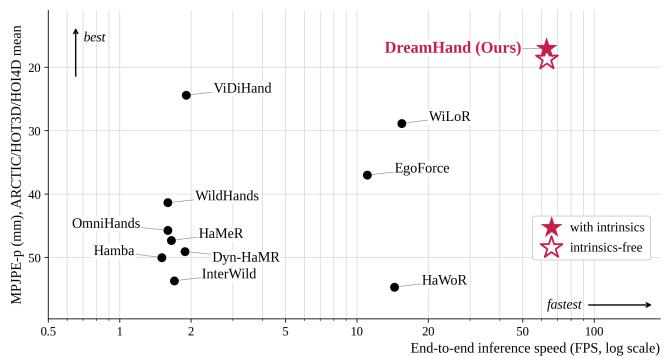  
Figure S1. Accuracy against speed. We plot MPJPE-p averaged over ARCTIC, HOT3D, and HOI4D against end-to-end clip throughput on one A100, excluding model loading, video decoding, and rendering. Both DreamHand configurations run at the same speed.

Table S5. Error against distance from the image center. In-view hand-frames binned by normalized radius r, with the share falling in each bin. The columns report the unpenalized in-view stratum of Table S1, not the matched-detection numbers of Appendix C, so share-weighting a column reproduces the in-view column of Table S4. The two configurations agree to within a millimeter at the center and diverge in translation toward the border, which isolates the cost of sampling bearings from a predicted ray field.
<table><tr><td colspan="4">DreamHand</td><td colspan="2">DreamHand (K-free)</td></tr><tr><td>Radius r</td><td>share MPJPE</td><td></td><td>CT</td><td>MPJPE</td><td>CT</td></tr><tr><td colspan="6">ARCTIC</td></tr><tr><td rowspan="4">0.00–0.25 26.1%</td><td></td><td>15.81</td><td>0.019</td><td>15.49</td><td>0.019</td></tr><tr><td>0.25–0.50 57.7%</td><td>14.96</td><td>0.021</td><td>14.97</td><td>0.020</td></tr><tr><td>0.50–0.75 14.7%</td><td>16.15</td><td>0.028</td><td>16.19</td><td>0.039</td></tr><tr><td>&gt; 0.75 1.5%</td><td>19.17</td><td>0.048</td><td>19.00</td><td>0.165</td></tr><tr><td colspan="6">HOT3D</td></tr><tr><td colspan="2">0.00-0.25 7.8%</td><td>12.62</td><td>0.022</td><td>12.97</td><td>0.023</td></tr><tr><td colspan="2">0.25–0.50 59.3%</td><td>12.28</td><td>0.024</td><td>12.57</td><td>0.025</td></tr><tr><td colspan="2">0.50–0.75 28.5%</td><td>12.68</td><td>0.025</td><td>13.12</td><td>0.058</td></tr><tr><td colspan="2">&gt; 0.75 4.4%</td><td>18.80</td><td>0.035</td><td>18.19</td><td>0.190</td></tr></table>

## D. Analysis of Failure Modes and Design Choices

## D.1. Errors Toward the Image Border

The main text attributes the coverage loss of the K-free configuration to bearings that become unreliable near the image border, since the predicted ray field is defined only over the token grid. This section tests that attribution directly. For every in-view hand-frame we compute the normalized distance of its projected center from the principal point, $r = \| ( u - c _ { x } , v - c _ { y } ) \| / ( \mathrm { d i a g } / 2 )$ , and bin the errors by r (Table S5). Both configurations are evaluated on the identical dumps that reproduce their main-text rows.

At the image center the two configurations agree to within a millimeter, with translation errors of 0.019 and 0.019 m on ARCTIC and 0.022 and 0.023 m on HOT3D, the standard configuration first. The gap then opens outward, negligibly in the second bin, where the K-free configuration is in fact marginally the tighter of the two on ARCTIC, and sharply in the outer two bins. In the outermost bin the K-free translation error is 0.165 against 0.048 m on ARC-TIC, a factor of 3.4, and 0.190 against 0.035 m on HOT3D, a factor of 5.4. Wrist-aligned pose is nearly identical between the two configurations in every bin, so the border effect is specific to metric placement rather than to hand pose. This is what the ray-field explanation predicts, because a cell near the frame edge has few neighbors to constrain its direction and the solve inherits that uncertainty as an inplane shift. HOT3D shows the stronger effect, consistent with its wider field of view placing more hands in the outer bins.

## D.2. Decoded Sequence Length

Long-horizon decoding is a property of the DreamHand architecture rather than a separate mode. This section measures what that costs. All results in the main text are scored on the 81-frame segments shared with every baseline. Those 81 frames occupy 21 latent frames, and a segment whose first frame does not fall on a latent boundary is covered by one further latent frame, so the decoder is run over 21 or 22 latent frames depending on where the segment starts. Nothing in the model requires that length: the temporal attention uses rotary relative position encoding, so no absolute clip length is baked into the weights and the same checkpoint decodes any length in one pass. Figure S2 sweeps the length decoded in one pass on the identical 291 ARCTIC segments. Only the decoded window changes. The scored segments are fixed 81-frame slices of the 34 ARCTIC test recordings, which run 594 to 1,087 frames, and a window is anchored at the segment it is scored on and clamped to end with the recording. The added context is therefore neighboring frames of the same recording, mostly the frames that follow the segment. Each window is anchored at the segment it is scored on and clamped to end no later than the recording. The added context is therefore neighboring frames of the same recording, mostly the frames that follow the segment.

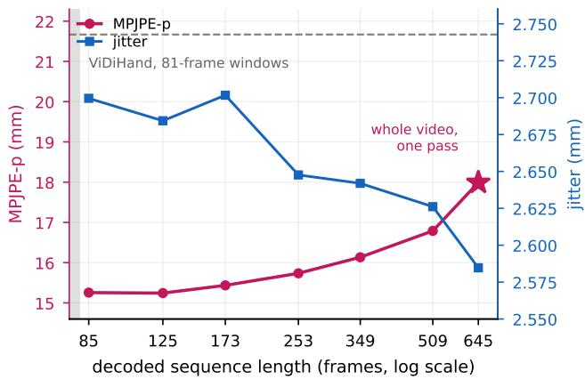  
Figure S2. Effect of decoded sequence length. We plot Dream-Hand accuracy (MPJPE-p, left axis) and smoothness (Jitter, right axis) against the length decoded in one pass, MPJPE-p in mm and Jitter in mm/frame2. The same 291 ARCTIC segments are scored at every length. The dotted vertical line marks the 81-frame training window, the dashed line marks 81-frame-window MPJPE-p, and the star marks every recording decoded end to end in one pass. The star’s abscissa is nominal, at 645 frames: the recordings themselves run 594 to 1,087 frames, so the star understates that horizon.

Accuracy is flat well past the training window: at 125 frames, more than 50% longer than that window, MPJPEp is marginally better than at the segment-length setting. Beyond that accuracy degrades gently, reaching 17.99 mm when each recording is decoded in a single pass, 7 to 13× the training window. Jitter, by contrast, falls from 2.700 to 2.585 mm/frame2. The temporal resolution does not change with the pass length, because the VAE always carries four frames per latent. A longer window therefore adds context for the temporal attention to average over without adding any degree of freedom between latent samples. The net effect is 4% additional smoothing at a cost of 18% in MPJPE-p. Even so, DreamHand stays 17% below the windowed 21.668 mm of ViDiHand at that setting, so wholerecording decoding remains usable when the application needs a single pass. The main text reports the segmentlength setting because it is the like-for-like comparison with the baselines.

## D.3. Tap Depth

The tap sits at block 15 of the 30-block DiT, a choice fixed before the model reported in this paper was trained. This ablation retrains four models that differ only in tap depth and scores all four, to measure what tap depth costs and buys. The four runs share one reduced training configuration, 20k steps at effective batch 16 over a mixture of ARCTIC and HOT3D, rather than the seven training sets and the larger batch of the main recipe. They also decode translation by inverse projection rather than by the mixed-PnP solver of the main model. All four are scored at step 20k on the same 291-segment ARCTIC test split, so absolute errors are comparable within the sweep but not with Table 1. Table S6 reports the sweep.

Table S6. Tap depth. Four runs differing only in which DiT block is read, scored at step 20k on the same 291 ARCTIC segments under the reduced sweep recipe. Block indices are zero-based and a tap returns the output of its block, so a tap at block i runs the first i+1 of the 30 blocks. Each row label gives that executed count. Lower is better throughout.
<table><tr><td>Tap (blocks run)</td><td>MPJPE-p</td><td>PA-p</td><td> $\mathrm { E P E } _ { \mathrm { 2 D } ^ { - } \mathrm { p } }$ </td><td>GO-p</td><td>CT-p Jitter</td></tr><tr><td>Block 10 (11/30)</td><td>17.77</td><td>8.70</td><td>11.63</td><td>12.58 0.030</td><td>2.74</td></tr><tr><td>Block 15 (16/30)</td><td>16.10</td><td>7.76</td><td>9.99</td><td>11.98 0.028</td><td>2.66</td></tr><tr><td>Block 20 (21/30)</td><td>15.93</td><td>7.68</td><td>9.87</td><td>12.15 0.021</td><td>2.59</td></tr><tr><td>Block 24 (25/30)</td><td>15.95</td><td>7.70</td><td>9.93</td><td>12.02 0.023</td><td>2.60</td></tr></table>

Accuracy has saturated by the middle of the stack. Tapping at block 10, which runs 11 of the 30 blocks, costs 1.67 mm of MPJPE-p and is the only setting that is clearly worse, degrading every column at once. Descending past block 15 buys at most 0.17 mm while running 21 and 25 of the 30 blocks instead of 16, and the two deeper taps do not order consistently: block 20 is marginally better than block 24 on five of the six metrics but loses on global orientation. We therefore read the residual difference as run-torun noise rather than as a trend. Block 15 therefore captures nearly all of the available accuracy at roughly half the forward cost, which is why the main model reads there.

## D.4. Clean versus Noised Latents

DreamHand reads the backbone at $\sigma = 0$ , where the input latent is the clean VAE code and no noise is added. The main text argues for this on determinism grounds. The measurement that supports that argument is reported here. We retrain with $\sigma = 0 . 5$ in place of $\sigma = 0 ,$ so the encoder reads a half-noised latent at the timestep bound to that noise level. The two runs share the training data, the schedule, and the evaluator, are scored on the same 291 ARCTIC segments, and are read at the same 20k-step checkpoint (Table S7).

Reading the clean latent is better on every metric. MPJPE-p improves by 2.40 mm (17.66 to 15.26) and translation error by 39% (0.0343 to 0.0208 m), while the two runs sit within $0 . 0 8 \mathrm { m m / f r a m e ^ { 2 } }$ of each other on Jitter. The gain is concentrated in metric placement rather than articulation, since $\mathrm { P A } { \cdot } { \mathsf { p } }$ moves by only 0.52 mm. Injecting noise degrades geometry that the deterministic read preserves, and the sample diversity it introduces goes unused because no generative pass is run. The comparison covers two noise levels and one seed per level, so it shows that σ=0 is the better of the two settings, not that error varies monotonically with σ. The gap is not an artifact of the checkpoint we read. Across the 31 validation checkpoints logged between step 5k and step 20k, the noised run is the worse of the two on 29, by a mean of 1.2 mm of wrist-aligned validation error.

Table S7. Clean versus noised latent readout. Two runs that differ in the noise level σ at which the backbone is read, scored by the shared evaluator on the same 291 ARCTIC segments at the same 20k-step checkpoint. Lower is better throughout.
<table><tr><td>Latent readout MPJPE-p PA-p</td><td></td><td></td><td> $\mathrm { E P E } _ { \mathrm { 2 D } ^ { - } \mathrm { p } }$ </td><td>GO-p CT-p Jitter</td></tr><tr><td>clean, σ=0</td><td>15.26</td><td>7.47</td><td>9.18</td><td>11.81 0.021 2.70</td></tr><tr><td>noised,  $\sigma { = } 0 . 5$ </td><td>17.66</td><td>7.99</td><td>9.78</td><td>12.62 0.0342.78</td></tr></table>

## E. Qualitative Results and Application

## E.1. Extended Qualitative Comparison

Figures S3 and S4 extend the comparison of Figure 4. Figure S3 covers the two main benchmarks, ARCTIC and HOT3D. Figure S4 covers H2O and OakInk2 together with two in-the-wild egocentric datasets, HoloAssist [34] and Xperience-10M [26]. Neither carries ground-truth hand annotation here, and neither enters any training mixture or evaluation table in this paper. We include them to place the comparison on footage that none of the methods was tuned on. Each block pairs a camera-space overlay row with the corresponding 3D reconstruction, and the columns hold the ground truth, where it exists, followed by Dream-Hand and six baselines. Every method predicts in the camera frame. For the datasets that provide camera poses, the 3D rows place those camera-frame predictions in a shared world frame, following the same convention as Figure 4. The clips are chosen to contain OOS intervals, because that is where the methods separate most visibly. Single-frame baselines drop the hand entirely once it leaves the frame and re-acquire it in a different pose, while world-space baselines keep producing a hand but drift away from the ground-truth trajectory. DreamHand carries the hand through the gap and re-aligns it with the visible evidence on re-entry.

## E.2. Qualitative Results Without Ground Truth

Figure S5 shows DreamHand at eight moments drawn from two egocentric recordings for which no ground-truth annotation exists, so nothing in the pipeline can be tuned to them. Each row holds the source frame, the camera-space overlay of the prediction, a blank ground-truth panel, and two renders of the same prediction, one from a fixed third-person viewpoint and one from the head-camera pose. DreamHand predicts hands in the camera frame and does not estimate camera motion, and these clips carry no camera annotation, so the two rendered views show the recovered hands themselves rather than a globally referenced trajectory. Without ground truth to overlay, what remains verifiable is whether the two hands stay metrically separated, keep a consistent scale as the head turns, and continue along a plausible path while they are outside the frame. The figure shows these properties, which the benchmark tables measure numerically, on footage that carries no annotation.

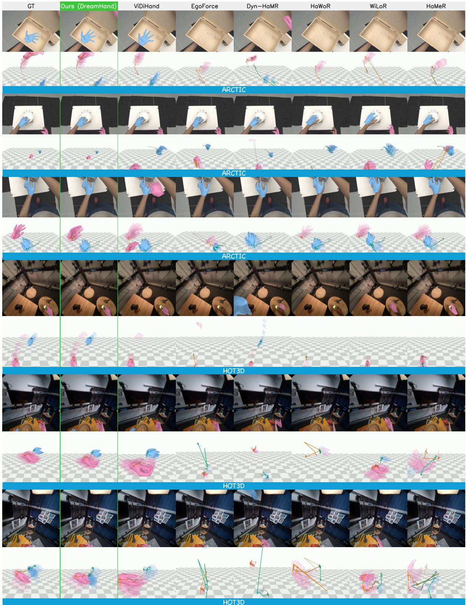  
Figure S3. Extended qualitative comparison on ARCTIC and HOT3D. Columns: ground truth, DreamHand, and six baselines (ViDi Hand, EgoForce, Dyn-HaMR, HaWoR, WiLoR, HaMeR). Each dataset block shows a camera-space overlay row above the corresponding 3D reconstruction, which uses the ground-truth camera poses these two datasets provide.

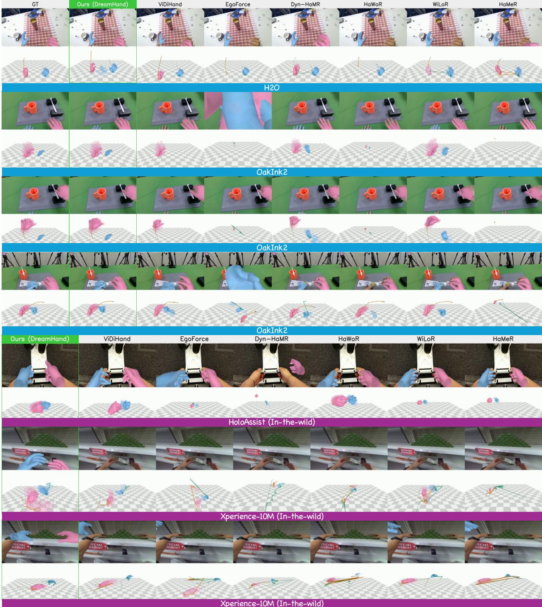  
Figure S4. Extended qualitative comparison on H2O, OakInk2, and in-the-wild HoloAssist and Xperience-10M. Same columns and same layout as Figure S3. H2O and OakInk2 supply ground-truth camera poses for the 3D row, while the two in-the-wild sources carry no annotation and are shown for qualitative inspection only.

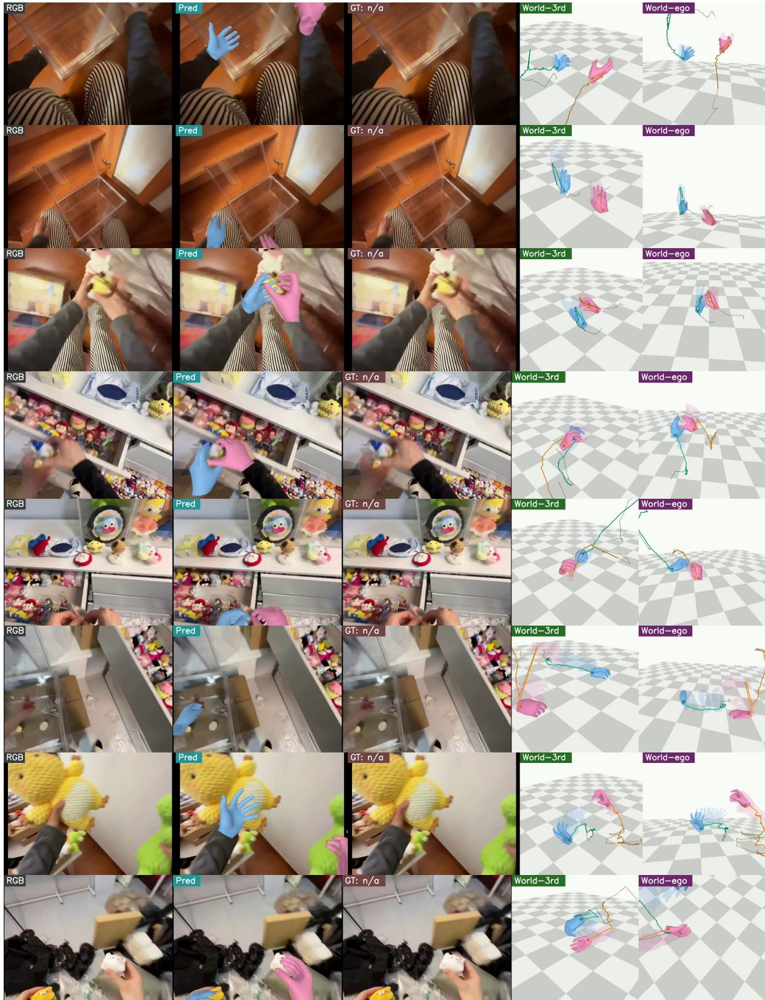  
Figure S5. DreamHand qualitative results on in-the-wild videos without ground truth. Columns: source RGB, predicted hands overlaid on the source video, a blank ground-truth panel marked GT: n/a, and the same prediction rendered from a fixed third-person viewpoint and from the head-camera pose.

## E.3. Retargeting to a Dexterous Hand

We show the step before policy learning, qualitatively: replaying the recovered bimanual trajectories on a dexterous Inspire Hand, shown in a neutral gray color scheme for legibility, with each panel rendered under the intrinsics of the source clip so robot and video share one projection. Finger flexion is read off the predicted 3D joints rather than the MANO articulation parameters. Figure S6 places the source frame, the recovered hand mesh, and the retargeted robot hand side by side for one clip from each of the four in-domain datasets, so the two conversion steps can be inspected separately. Figure S7 then follows a single recording over two minutes, sampled at four instants, to show that the conversion still holds at the end of a horizon far longer than the 81-frame training window.

A demonstration requires the three properties Dream-Hand provides: metric placement in the camera frame, cliplevel shape, and OOS coherence where per-frame methods drop frames. At 63.1 fps, the trajectory recovery that feeds this conversion is not the collection bottleneck. Whether such trajectories improve downstream policy learning remains for future work.

## F. Limitations, Failure Cases, and Data Use

## F.1. Limitations and Failure Cases

Five limitations follow from the analyses above. Each has a concrete failure signature, which we state in the units a user would see.

The K-free configuration loses coverage at the image border. Table S5 localizes the cost. Inside the central half of the image the K-free translation error matches that of the standard configuration to the millimeter. In the outermost radial bin the K-free error is 0.165 against 0.048 m on ARCTIC and 0.190 against 0.035 m on HOT3D. Because detection matching is scored under the predicted translation, this in-plane slide pushes peripheral hands outside the matching threshold. Because detection matching is scored under the predicted translation, this in-plane slide pushes peripheral hands out of the match, which is what the penalized gap on HOT3D reflects (Frame Accuracy 0.986 to 0.752 in Table 1) even though root-relative pose on matched detections stays tied. Supplying calibration is still worth it for wide-field cameras that place many hands near the border.

Long single-pass decoding trades accuracy for smoothness. Decoding a whole recording in one pass costs 18% in MPJPE-p relative to the 81-frame setting (15.26 to 17.99 mm), so a single long pass is an operating point rather than a free improvement. The failure signature is a trajectory that is smoother but less tightly fitted to the ground truth.

Ground truth and splits are uneven across the five benchmarks. Only ARCTIC and H2O are subjectdisjoint. HOT3D is split at the recording level and OakInk2 at the sequence level, so subject overlap between train and test cannot be excluded there. As noted in Appendix A, HOI4D and H2O rely partially on pseudo-ground-truth annotation, which flatters any method that resembles the perframe estimator behind those labels. On H2O, our own model was trained on that label distribution. The H2O and OakInk2 blocks of Table S3 also compare an in-domain DreamHand against baselines trained elsewhere, as Table 1 does on ARCTIC and HOT3D.

The out-of-sight gain is wrist-aligned and does not certify placement. Both MPJPEOOS and MPJPE+OOS align the wrist before measuring, so the margins of Table S4 certify that the articulation and the global orientation of an out-of-sight hand stay close to the ground truth, and nothing more. Where the hand actually sits while it is out of sight depends on a regressed depth and on a bearing that no image evidence constrains, and on the solver fallback of Appendix B once too few joint anchors survive inside the frame. We therefore read the out-of-sight result as temporal coherence through the gap rather than as metric localization during the gap, and the failure signature is a plausibly articulated hand on a trajectory that has drifted in depth. No table in this paper measures absolute out-of-sight placement, because none of the five benchmarks scores it.

The method is offline by construction. What makes DreamHand offline is its dependence on clip-level context, not the direction of temporal attention in the decoder. The backbone attends over the whole clip in one pass, so latency is bounded below by the length of the clip rather than by the 63.1 fps throughput. DreamHand is a tool for curating manipulation data from recorded video, not a closed-loop controller. Three directions follow from that boundary. Distilling the encoder into a causal variant would trade clip-level context for streaming operation and would also quantify how much of the accuracy rests on future frames. Bounding the pass length while keeping identity across passes would remove the dependence of latency on clip length. Carrying hand identity and shape over recordings of several minutes would extend the horizon beyond what one pass now holds.

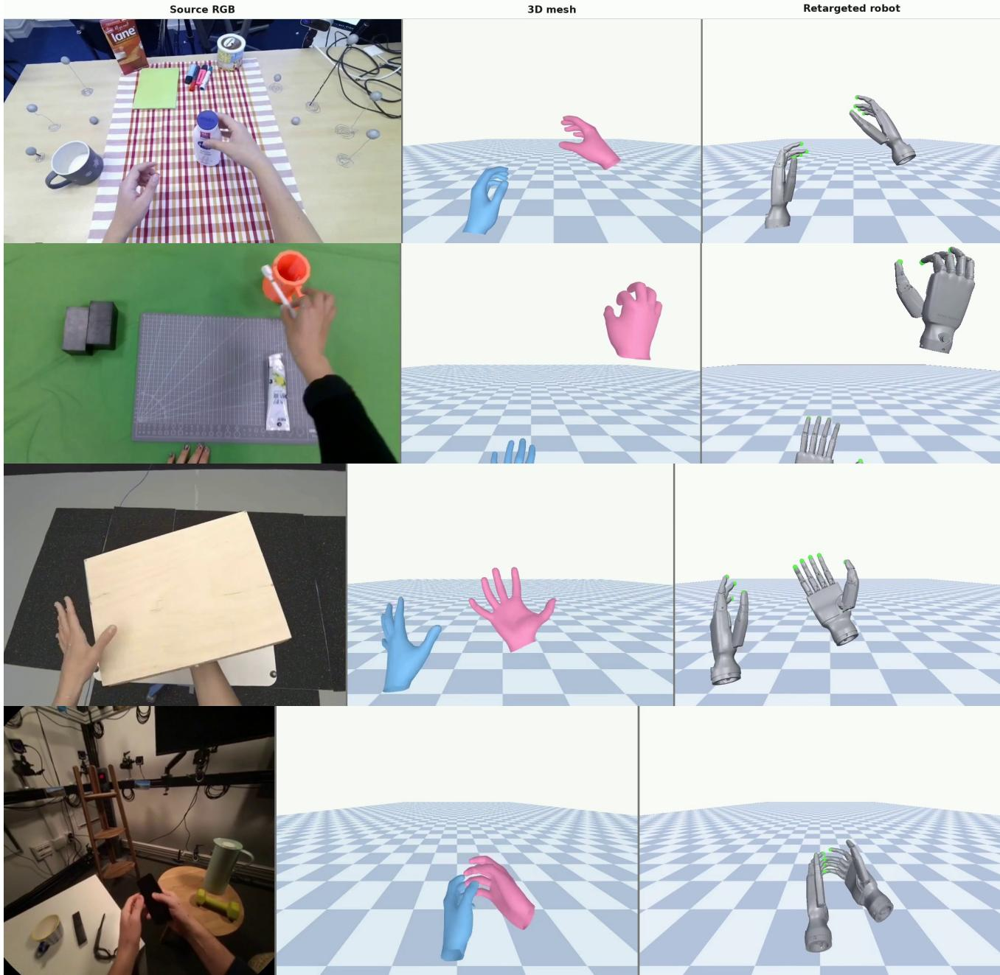  
Figure S6. From egocentric video to a dexterous hand, step by step. One clip from each of ARCTIC, HOT3D, H2O, and OakInk2. Columns: source RGB, the hand mesh recovered by DreamHand, and the trajectory retargeted to an Inspire Hand. Finger flexion is mapped from the predicted 3D joints rather than from the MANO articulation parameters.

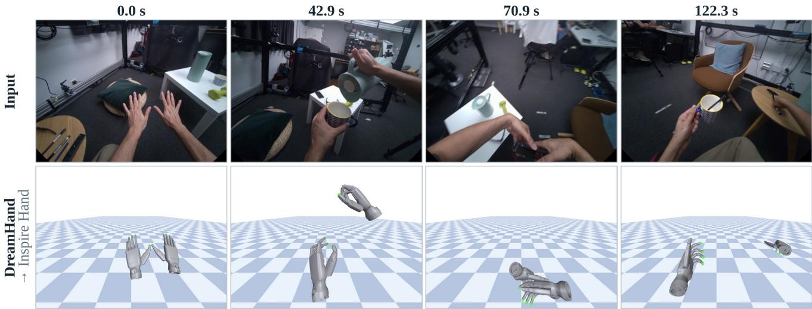  
Figure S7. Retargeting over a two-minute recording. A single recording sampled at four instants, with the input frame above and the retargeted dexterous hand below. The horizon is roughly 45 times the 81-frame training window, and both hands are still tracked and correctly identified at the last of the four instants.

## F.2. Ethics and Data Use

All five benchmarks and the three auxiliary training sources are public research datasets, as are the two in-the-wild datasets in Figure S4. We obtained each through its official channel and use it under the terms of that release. For Xperience-10M those terms are controlled access for noncommercial research. We collected no new human-subject data and we redistribute no dataset. Egocentric recordings can contain identifiable people and private environments, so we use them only to fit hand geometry. The model takes video, together with camera calibration in the standard configuration, and outputs MANO pose, shape, and camera-frame translation. The model neither receives nor produces identity, demographic, or biometric-identification attributes, and is not a person recognizer. Frames shown in figures are taken from those public releases and are reproduced under the same terms, with one exception. The frames in Figure S5 come from a licensed egocentric dataset outside those benchmarks, used for qualitative illustration only. That dataset enters no training mixture and no evaluation table. The intended downstream use is imitation learning from recordings whose subjects consented to being recorded. Running the model on third-party video without that consent is a misuse we do not endorse.