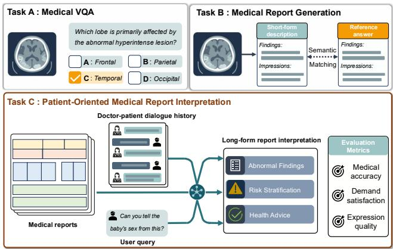
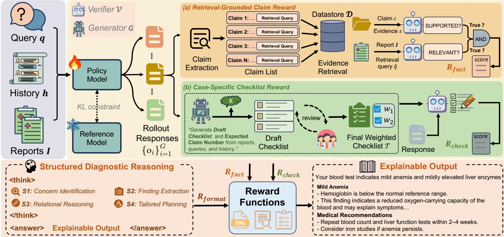
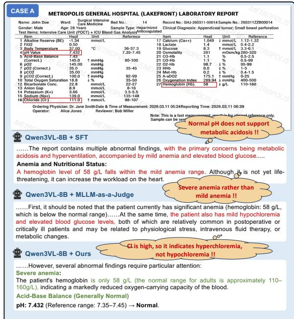
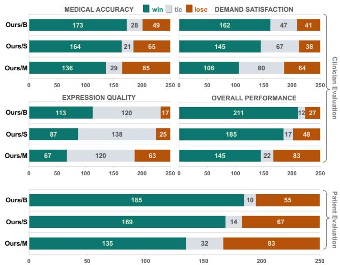

# G-CARL: Grounded Checklist-Aligned Reward Learning for Patient-Oriented Medical Report Interpretation

Shiao Xie1∗, Siyu Chen1∗, Jianwei Lv1, Bo Yuan1, Yujin Wang1†, Xiandong Li1† 1Baidu Inc., China

## Abstract

Personalized interpretation of medical reports has emerged as an increasingly important need among patients. Address- ing this need requires both evidence-grounded medical fac- tuality and context-dependent patient communication, yet ex- isting medical vision-language tasks do not adequately cap- ture these dual requirements. To bridge this gap, we intro- duce Patient-oriented Medical Report Interpretation (PMRI), a novel open-ended multimodal generation task that requires models to explain medical reports in accurate and accessi- ble language based on a user’s query and dialogue history. These two objectives difer fundamentally in their verifiability, yet remain tightly coupled, making them dificult to optimize jointly under conventional supervised fine-tuning and holistic reinforcement learning paradigms. To address this chal- lenge, we propose G-CARL, a grounded, checklist-aligned reinforcement learning framework that combines multi-source retrieval for atomic claim verification with context-aware, instance-specific weighted checklists for response coverage, providing structured supervision for factuality, user-demand satisfaction, and expression quality without constraining re- sponse diversity. We further construct MMedReport, a real- world PMRI benchmark, along with a clinician-designed three-dimensional evaluation protocol. Extensive experiments demonstrate that G-CARL consistently outperforms existing post-training baselines in overall quality, claim-level preci- sion, and checklist recall. Pairwise preference evaluation by clinicians further confirms that G-CARL produces interpre- tations that are more accurate and better aligned with patient needs.

## 1 Introduction

Written within a professional medical context, medical re- ports commonly present abnormal values and descriptive findings without explaining their implications for non-expert readers. This gap becomes particularly salient in online healthcare scenarios, where patients upload one or more report images and ask open-ended questions shaped by their personal concerns. To bridge this gap, we introduce Patient-oriented Medical Report Interpretation (PMRI), a novel open-ended multimodal generation task. Beyond sim- ply recognizing report findings, PMRI must align profes- sional medical knowledge with patient-centered communi- cation by transforming report evidence into accessible ex- planations, addressing user-specific concerns, and ofering clinically cautious guidance.

  
Figure 1: Comparison of PMRI (Task C) with medical VQA (TaskA) and conventional report generation (Task B). Unlike the short, deterministic outputs of Tasks A and B, PMRI produces long-form, patient-facing explanations grounded in multimodal reports and extended patient–doctor dialogue.

As illustrated in Fig. 1, PMRI difers from conventional medical visual question answering (VQA) (Lu et al. 2025; Jiang et al. 2025a) and report generation (Lin et al. 2026; Li et al. 2025) in two important ways. First, it is an evidencebounded generation task whose responses must be grounded not only in the reports but also in reliable clinical knowl- edge and medically coherent diagnostic reasoning, particu- larly when explaining abnormalities or suggesting follow-up actions. This requirement is essential for patient safety be- cause unsupported interpretations and inappropriate recom-mendations may mislead patients or delay necessary care. Second, PMRI is a patient-facing communication task that must go beyond clinical correctness to address patients’ indi- vidual information needs while clearly explaining potential abnormalities and risks in an emotionally adaptive and reas- suring manner. Accordingly, we model PMRI quality along three core dimensions: medical accuracy, demand satisfac- tion, and expression quality.

Given the nature of PMRI, a straightforward strategy is to collect large-scale physician-written interpretations and train multimodal models with supervised fine-tuning (SFT) (Chen et al. 2024b; Rotstein et al. 2024). However, SFT can overfit to the specific wording of the reference interpretation and encourage imitation of particular answers rather than learn- ing the underlying principles. This is especially limiting in PMRI, where multiple responses may be clinically accept- able for the same report and user query as long as they remain faithful to the evidence and address the user’s concern. Physi- cian references therefore provide useful guidance on what a response should cover, rather than fully defining the quality space of PMRI outputs.

Reinforcement learning (RL) with reward-based posttraining, such as Group Relative Policy Optimization (GRPO) (Shao et al. 2024), ofers a promising alternative for improving large vision-language models beyond reference imitation (Xing et al. 2025). However, applying RL to PMRI requires rewards that reflect heterogeneous verifiability of diferent objectives. Medical factuality can be externally verified against the uploaded report and clinical knowledge, whereas demand satisfaction and expression quality depend more on the patient’s concern and the consultation context. This motivates reward signals that can distinguish objective-specific errors rather than collapsing the entire response into a single score.

Existing reward designs do not fully meet this requirement. Holistic MLLM-as-a-Judge scoring (Zheng et al. 2023; Chen et al. 2024a) compresses an entire interpretation into a single reward, making the supervision coarse and highly depen- dent on the judge model’s medical knowledge. As a result, localized hallucinations may be overlooked when the over- all response appears fluent and plausible, despite the fact that a single unsupported medical claim can fundamentally mislead patients. Recent work has introduced rubric-based rewards to provide more structured supervision (Arora et al. 2025; Gunjal et al. 2025). However, static rubrics remain insuficient for PMRI because evaluation priorities vary sub- stantially across cases. PMRI errors often stem not from entirely incorrect responses, but from omitting case-critical information or emphasizing secondary details while over- looking the most important clinical recommendations and user concerns. Since static rubrics are desi ned to ca ture generic response quality, they are often insensitive to these case-s ecific omissions and mis laced em hases.

To address these challenges, we propose G-CARL, a rein- forcement learning framework with retrieval-grounded and checklist-guided rewards. G-CARL assigns reward mecha- nisms according to the verifiability boundary of each objective. For externally verifiable medical factuality, it decom- poses each response into atomic medical claims, retrieves supporting evidence from the uploaded report and a multi- source medical datastore, and evaluates each claim for factual support and contextual relevance. This claim-level reward provides localized supervision for sparse factual errors and discourages unsupported elaboration. For context-dependent objectives such as demand satisfaction and expression quality, G-CARL constructs instance-specific weighted checklists through MLLM generation followed by clinician refinement. Each checklist item is assigned an automatically generated weight, allowing the reward to emphasize the aspects most relevant to the current report and user question. This yields an explicit checklist score that provides transparent supervi- sion for whether the response addresses the user’s concern appropriately. In summary, our contributions are as follows:

• We formulate PMRI as an evidence-grounded and patientfacing multimodal generation task, and propose G-CARL, a reinforcement learning framework that decomposes re- ward supervision according to the heterogeneous verifia- bility of diferent objectives.

• We propose a retrieval-grounded claim reward that pro-vides fine-grained supervision for medical factuality through atomic claim verification, and a case-specific checklist reward that explicitly supervises demand satis- faction and expression quality without relying on a single reference response.

• We construct MMedReport, a real-world PMRI bench-mark with clinician-designed evaluation protocols. Ex- tensive experiments across multiple LVLM backbones demonstrate that G-CARL consistently outperforms su- pervised and reinforcement learning baselines, with the gains further validated by clinician preference and user comprehension studies.

## 2 Related Works

Medical Report Generation. Medical report generation has been extensively studied where models generate diagnostic reports from multimodal images such as X-rays (Li et al. 2023; Liu et al. 2025). Recent methods have improved re-port quality through multimodal feature alignment (Jin et al. 2024; Li et al. 2025), clinically grounded visual representations (Arisoy et al. 2025), and reinforcement learning-based optimization (Wang et al. 2026). MedVAG (Arisoy et al. 2025) introduces clinically aware visual grounding, while HiMed-3B (Wang et al. 2026) explores RL-based alignment for medical text generation. MedRepBench (Shang et al. 2025) further promotes faithful report generation through field-level evaluation of structured clinical findings. In con- trast to these imaging-to-report tasks, PMRI focuses on patient-facing interpretation of existing structured reports under patient–doctor dialogue contexts, requiring models to address user-specific concerns while providing accurate and understandable explanations.

Reinforcement Learning for Medical VLMs. RL has re-cently been adopted to improve reasoning and reliability in medical VLMs (Jing et al. 2026; Zhou et al. 2026). MedVLM-R1 (Pan et al. 2025) uses a GRPO-based framework to elicit explicit reasoning paths for radiology VQA, while Med-R1 (Lai et al. 2026) designs preference signals that align visual perception, intermediate reasoning, and fi- nal answers. Beyond short-form QA, MediX-R1 (Mullappilly et al. 2026) extends multimodal medical RL to open-ended responses through LLM-based multi-objective rewards. RL has also been explored for report-centric tasks. RadVLM- GRPO (Gundersen et al. 2026) applies clinically grounded rewards to chest X-ray report generation and visual ground- ing, showing that RL can complement strong SFT.

  
Figure 2: Overview of G-CARL. Given report images, user queries, and dialogue history, G-CARL samples G responses from the old policy and optimizes them with a multi-objective reward function consisting of retrieval-grounded claim reward $R _ { \mathrm { f a c t } } ,$ case-specific checklist reward $R _ { \mathrm { c h e c k } }$ , and structured reasoning format reward $R _ { \mathrm { f o r m a t } }$

## 3 Methods

## 3.1 Overall Architecture

Built upon GRPO, G-CARL optimizes the policy model with three reward signals, as illustrated in Fig. 2. Given uploaded medical report images I, the dialogue history h, and a user query q, the policy model first generates candidate responses. The retrieval-grounded branch then supervises medical fac- tuality by verifying report-grounded medical claims against evidence retrieved from a multi-source medical datastore, producing the factuality reward $R _ { \mathrm { f a c t } }$ (Sec. 3.2). In parallel, the case-specific checklist branch optimizes demand satis- faction and expression quality by constructing a weighted checklist through MLLM generation followed by clinician- guided refinement, and evaluating the checklist coverage of the generated response to produce the checklist reward $R _ { \mathrm { c h e c k } }$ (Sec. 3.3). Together with the format reward $R _ { \mathrm { f o r m a t } }$ , these components are integrated into a multi-objective optimization task (Sec. 3.4).

## 3.2 Retrieval-Grounded Claim Reward

Medical factuality in PMRI is inherently claim-level, as a single response often contains multiple heterogeneous med- ical claims. Holistic response-level rewards cannot localize factual errors and may overestimate fluent but unsupported generations. Moreover, many clinical interpretations, causal attributions, and recommendations cannot be verified from the report alone, requiring factual verification grounded in authoritative external medical knowledge.

To address these challenges, inspired by (Min et al. 2023a; Song et al. 2024), we propose a retrieval-grounded claim reward. As illustrated in Fig. 2 (a), each response is first decomposed into atomic medical claims, which are then ver- ified against evidence retrieved from a multi-source medi- cal datastore. Specifically, each claim is evaluated from two complementary perspectives: whether it is RELEVANT to the uploaded medical report and whether it is SUPPORTED by the retrieved evidence. This dual-binary design encourages the generation of statements that are both clinically grounded and factually correct. We describe each step in detail below.

Claim Extraction. Following (Song et al. 2024), we perform claim extraction at the sentence level. Given a response $^ { O , }$ we first segment its answer span into sentences $\{ s _ { 1 } , \ldots , s _ { n } \}$ For each sentence $s ,$ an extractor ${ \mathcal { G } } ,$ , conditioned on the full response o and user query q, produces a set of verifiable and decontextualized claims as follows:

$$
\{ ( c , { \tilde { q } } ) , \dots \} = { \mathcal { G } } ( s \mid o , q ) .\tag{1}
$$

Alongside each claim $c ,$ the extractor jointly generates a retrieval query q˜. After claim deduplication, the final claim set for response o is defined as:

$$
\begin{array} { r } { \mathcal { C } ( o ) = \{ ( c _ { i } , \tilde { q } _ { i } ) \} _ { i = 1 } ^ { N } . } \end{array}\tag{2}
$$

Evidence Retrieval. To support trustworthy evidence-grounded factual verification in the medical domain, we con- struct a large-scale medical datastore D by integrating authoritative medical resources, including drug labeling, medical textbooks, and clinical practice guidelines:

$$
\mathcal { D } = \mathcal { D } _ { \mathrm { d r u g } } \cup \mathcal { D } _ { \mathrm { b o o k } } \cup \mathcal { D } _ { \mathrm { g u i d e } } ,\tag{3}
$$

where $\mathcal { D } _ { \mathrm { d r u g } }$ contains approximately 20,000 drug instruction entries, $\mathcal { D } _ { \mathrm { b o o k } }$ comprises 18,200 textbook passages cover- ing foundational medical knowledge, and $\mathcal { D } _ { \mathrm { g u i d e } }$ consists of 16,000 clinical guideline passages. All resources are prepro- cessed into semantically coherent chunks.

Given a claim-query pair $( c , \tilde { q } )$ , the retrieval query q˜ combines the topical intent of the user query with the core medical concepts of the corresponding claim, producing a concise set of retrieval keywords aligned with the current clinical con- text. We then perform parallel retrieval across all knowledge sources using $\tilde { q }$ and aggregate the top-k most relevant evidence chunks from each source:

$$
\mathcal { E } = \bigcup \mathrm { T o p } _ { k } \big ( f ( \tilde { q } , \mathcal { D } _ { i } ) \big ) , \quad i \in \{ \mathrm { b o o k , g u i d e , d r u g } \} ,\tag{4}
$$

where $f ( \tilde { q } , d )$ denotes the relevance score between query and document chunk. The retrieved evidence set $\mathcal { E }$ is then concatenated with source identifiers and truncated to a fixed token budget to form the evidence context for verifying claim.

Dual Binary Verification. To verify each extracted claim, a multimodal verifier V takes the claim $c ,$ the retrieved evi- dence $\mathcal { E } ,$ the user query $q ,$ and the uploaded report image I as input, and predicts two binary verdicts as:

$$
\begin{array} { l l } { v = \mathcal { V } ( c , \mathcal { E } ) , } & { v \in \{ \mathrm { S U P P O R T E D } , \mathrm { U N S U P P O R T E D } \} , } \\ { u = \mathcal { V } ( c , I , h , q ) , } & { u \in \{ \mathrm { R E L E v A N T } , \mathrm { I R R E L E v A N T } \} , } \end{array}\tag{5}
$$

where v assesses whether the claim is factually supported, while u assesses whether the claim is contextually relevant to the uploaded reports.

For factuality verification, the verifier follows an evidence- first, contradiction-oriented protocol. A claim is judged as Supported if it is directly supported by the retrieved evi- dence or remains consistent with it without contradiction. When explicit evidence is unavailable, the claim is still con- sidered Supported if it reflects established medical consen- sus and does not conflict with domain knowledge. Otherwise, the claim is judged as Unsupported.

For relevance verification, a claim is judged as Relevant if it is grounded in the uploaded report, directly addresses the user query, or provides clinically necessary context for the current case. Otherwise, it is judged as Irrelevant, even if medically correct, when it introduces generic or unsup- ported information unrelated to the report findings or the user’s concern. This dual-verdict design prevents the verifier from penalizing valid common-sense medical statements that lack explicit retrieved evidence, while discouraging reward hacking through factually correct but irrelevant elaborations.

Then, a claim is considered valid only if it is both factually supported and contextually relevant:

$$
z = \mathbf { 1 } [ v = \mathbf { S } _ { \mathbf { U P P O R T E D } } ] \cdot \mathbf { 1 } [ u = \mathbf { R E L E V A N T } ] \in \{ 0 , 1 \} .\tag{6}
$$

The valid-claim precision can be defined as:

$$
P _ { \mathrm { f a c t } } = \frac { 1 } { N } \sum _ { i = 1 } ^ { N } z _ { i } .\tag{7}
$$

However, precision alone may favor overly short responses, as a response containing only a few valid claims can still achieve a high precision score. To encourage suficient in- formational coverage, we introduce a coverage term with a case-specific target claim count $K ,$ where $K$ is automatically generated by the checklist generator described in Section 3.3 and represents the expected number of valid medical claims in an informative response:

$$
C _ { \mathrm { f a c t } } = \operatorname* { m i n } \left( \frac { \sum _ { i = 1 } ^ { N } z _ { i } } { K } , 1 \right) .\tag{8}
$$

The final factual validity reward can be formulated as the harmonic mean of valid-claim precision and coverage:

$$
R _ { \mathrm { f a c t } } = { \frac { 2 P _ { \mathrm { f a c t } } C _ { \mathrm { f a c t } } } { P _ { \mathrm { f a c t } } + C _ { \mathrm { f a c t } } } } .\tag{9}
$$

## 3.3 Case-Specific Checklist Reward

Unlike medical factuality, dimensions such as demand sat- isfaction and expression quality are inherently subjective and cannot be verified against referenceable knowledge. Moreover, these dimensions are highly instance-dependent: whether a response is considered complete, helpful, or well- expressed depends on the specific report, user concern, and dialogue context. Diferent criteria also vary substantially in clinical importance. Consequently, assigning a single holis- tic reward provides little guidance about which aspects of the response should be improved and fails to distinguish critical requirements from desirable but non-essential ones.

To address this challenge, we decompose subjective eval-uation into a set of weighted checklist items. Each check- list item represents an independent evaluation criterion with an associated importance weight. A verifier then evaluates the candidate response against each checklist item indepen dently, producing a fine-grained and controllable reward sig- nal for reinforcement learning. The overall procedure is de- scribed as follows.

Weighted Checklist Construction. As shown in Fig. 2 (b), to reduce manual annotation efort, an MLLM $( e . g .$ ., Gemini 3.1 Pro) as generator G first generates a draft instance-specific checklist conditioned on the dialogue history, user query, and uploaded medical reports. Professional clinicians then iteratively review, refine, and complete the draft to pro- duce the final checklist:

$$
\mathcal { T } = \{ ( t _ { i } , w _ { i } ) \} _ { i = 1 } ^ { m } ,\tag{10}
$$

where $t _ { i }$ denotes a self-contained checklist item and $w _ { i }$ its corresponding importance weight. Physician-guided check- list construction grounds the supervision signal in clinically appropriate expectations rather than generic evaluation tem- plates, which prior work has shown to be essential for reliable expert-domain assessment (Viswanathan et al. 2026).

The importance weight w is determined according to the clinical significance of each checklist item. Specifically, each checklist item is assigned one of four importance lev- els, namely Essential, Important, Optional, or Pitfall, which are mapped to predefined integer-valued weights (e.g., 4–5, 2–3, 1–2, and $\bar { - 2 } \mathrm { - } \mathrm { - } 1$ , respectively). This weighting scheme ensures that clinically critical criteria contribute more strongly to the reward while undesirable behaviors in- cur explicit penalties. In particular, Pitfall items capture undesirable behaviors discouraged by the physicians, includ- ing ignoring the user’s primary concern, generating overly technical explanations, or providing dismissive responses.

Explicit Aggregation. Given the checklist T and a candidate response $^ { O , }$ the checklist verifier V evaluates each checklist item independently and outputs a binary satisfaction signal:

$$
z _ { i } = \mathcal { V } ( t _ { i } , o ) \in \{ 0 , 1 \} .\tag{11}
$$

For Essential, Important, and Optional items, $z _ { i } ~ = ~ 1$ indicates that the criterion is satisfied. For Pitfall items, $z _ { i } = 1$ indicates that the undesirable behavior is triggered. We denote the positive checklist item set as $\mathcal { P }$ and the Pitfall item set as ${ \mathcal { N } } .$ , and compute the positive coverage and pitfall violation terms as:

$$
V _ { \mathrm { p o s } } = \frac { \sum _ { i \in \mathcal { P } } | w _ { i } | z _ { i } } { \sum _ { i \in \mathcal { P } } | w _ { i } | } , \qquad V _ { \mathrm { n e g } } = \frac { \sum _ { j \in \mathcal { N } } | w _ { j } | z _ { j } } { \sum _ { i \in \mathcal { P } } | w _ { i } | } .\tag{12}
$$

The final checklist reward is defined as:

$$
R _ { \mathrm { c h e c k } } = \mathrm { c l i p } ( V _ { \mathrm { p o s } } - V _ { \mathrm { n e g } } , 0 , 1 ) .\tag{13}
$$

Unlike conventional reference-based training, our checklist does not encourage the policy to mimic a single physician- authored response. Instead, the reference is distilled into a set of clinically important evaluation criteria, specifying what the response should cover rather than how it should be written. This design preserves the diversity of valid re- sponses while rewarding clinical completeness and user- oriented communication.

## 3.4 Multi-objective Reward Function

Inspired by recent advances in structured reasoning (Yu et al. 2025), we introduce a format reward that encourages the model to follow a physician-oriented clinical reasoning scaf- fold during reinforcement learning. As illustrated in Fig. 2, the model is required to organize its intermediate reasoning within the <think></think> block according to a four-step clinical reasoning workflow before generating the final patient-facing interpretation in the <answer></answer> block. This reward does not directly supervise medical cor- rectness; instead, it encourages a structured decomposition of report findings, supporting evidence, clinical reasoning, and response planning, thereby improving the coherence and or- ganization of the final response. Our reward function jointly optimizes medical factuality, demand satisfaction and ex- pression quality, which can be defined as:

$$
R _ { \mathrm { t o t a l } } = \lambda _ { \mathrm { f a c t } } R _ { \mathrm { f a c t } } + \lambda _ { \mathrm { c h e c k } } R _ { \mathrm { c h e c k } } + \lambda _ { \mathrm { f o r m a t } } R _ { \mathrm { f o r m a t } } ,\tag{14}
$$

where $\lambda _ { \mathrm { f a c t } } , \lambda _ { \mathrm { c h e c k } }$ , and $\lambda _ { \mathrm { f o r m a t } }$ are weighting coeficients that balance the contributions of the reward components.

## 4 Experiments

## 4.1 Experimental Setup

Datasets. We evaluate G-CARL primarily on (1) MMe-dReport, a real-world multimodal PMRI benchmark col- lected from online healthcare consultations. It contains 2,450 instances, each including dialogue history, a user query, up- loaded medical report images, and clinician-verified refer- ence annotations. All instances undergo quality control, de- identification, and manual verification to ensure data quality and patient privacy. Detailed dataset statistics are provided in Appendix A. Following the standard split, 2,200 instances are used for training and 250 for evaluation. To assess broader medical capability beyond PMRI, we further evaluate the trained models on an external benchmark, (2) CMB (Wang et al. 2024), which evaluates both medical QA accuracy and the professionalism of open-ended clinical interpretation un- der an LLM-as-a-judge protocol.

Evaluation Protocol. We evaluate PMRI responses using both subjective and objective metrics. (1) Subjective Evaluation. Responses are evaluated along three clinician-defined dimensions: Medical Accuracy (Accuracy), Demand Satisfaction (Satisfaction), and Expression Quality (Expression). Each dimension is scored according to a detailed clinician- authored rubric ranging from −2 to 3. We employ GPT-5.2 (OpenAI 2025) as the judge by strictly following these evaluation criteria. The complete judging protocol is provided in the Appendix B to facilitate reproducibility. (2) Objective Evaluation. In addition to holistic assessment, we report claim-level Precision and checklist-level Recall. Pre-cision is defined as the ratio of supported claims to extracted claims, measuring factual correctness, while Recall is defined as the ratio of satisfied checklist items to the total checklist items, measuring coverage of case-specific requirements.

Implementation Details. Our policy models are initialized from the Qwen3-VL (Bai et al. 2025) and InternVL3 (Zhu et al. 2025) series. G-CARL is trained for three epochs on 8 NVIDIA H100 GPUs with a batch size of 192 and a learning rate of $1 \times 1 0 ^ { - 5 }$ . We set the number of rollout responses to G = 8 during training. The reward weights are configured as $\lambda _ { \mathrm { f a c t } } = 0 . 4 , \lambda _ { \mathrm { c h e c k } } = 0 . 3 ,$ , and $\lambda _ { \mathrm { f o r m a t } } \stackrel { \textstyle = } { = } 0 . 3 ;$ detailed hyper- parameter analysis is provided in Appendix C. The verifier V is initialized with Qwen3.5-35B-A3B, with implementation details reported in Appendix D. We compare G-CARL with the corresponding base models (Base), supervised finetuning (SFT), and an MLLM-as-a-Judge reward baseline. Additionally, we evaluate a diverse range of general-purpose and medical LVLMs under a zero-shot inference setting.

## 4.2 Main Results on MMedReport

Quantitative Comparison. Table 1 compares G-CARL with general-purpose LVLMs, specialized medical LVLMs, and diferent training paradigms based on the Qwen3-VL and InternVL3 backbones. While the MLLM-as-a-Judge reward improves over SFT, its holistic rubric struggles to jointly optimize medical accuracy, demand satisfaction, and expres- sion quality. By decomposing reward supervision into ex- ternally verifiable medical claims and internally grounded checklist objectives, G-CARL achieves the highest scores across both objective and subjective metrics. On Qwen3-VL-8B, G-CARL improves the overall subjective score, while boosting claim-level precision (+0.77%) and checklist-level recall (+6.71%), indicating more informative and richer interpretations. Moreover, G-CARL consistently outperforms specialized medical LVLMs and remains competitive with substantially larger general-purpose LVLMs under zero-shot evaluation, demonstrating the efectiveness of G-CARL.

External Generalization Study. We further transfer the trained models to CMB without any adaptation. As shown in Table 2, G-CARL improves QA accuracy on both splits (+0.63) and attains the highest professionalism score in openended generation (3.61), whereas SFT and MLLM-as-a-Judge bring marginal gains and even degrade profession- alism. This indicates that grounding rewards in verifiable medical evidence suppresses hallucinated content and better elicits the medical accuracy already latent in the base model, rather than merely fitting the PMRI response style.

Table 1: Main results on our medical report interpretation benchmark. Numbers are mean over 3 seeds with standard deviation.
<table><tr><td rowspan="2">Method</td><td colspan="4">Subjective Metrics</td><td colspan="2">Objective Metrics</td></tr><tr><td>Overall</td><td>Accuracy</td><td>Satisfaction</td><td>Expression</td><td>Precision (%)</td><td>Recall (%)</td></tr><tr><td colspan="7">General LVLMs</td></tr><tr><td>GPT-4o (Hurst et al. 2024)</td><td> $1 . 5 8 8 _ { \pm 0 . 0 0 7 }$ </td><td> $0 . 9 7 4 _ { \pm 0 . 0 0 7 }$ </td><td> $0 . 3 5 8 { \scriptstyle \pm 0 . 0 0 1 }$ </td><td> $0 . 2 5 6 _ { \pm 0 . 0 0 1 }$ </td><td>95.26</td><td>42.63</td></tr><tr><td>ERNIE 4.5 VL (Baidu ERNIE Team 2025)</td><td> $1 . 7 0 9 _ { \pm 0 . 0 1 0 }$ </td><td> $1 . 0 8 8 _ { \pm 0 . 0 1 2 }$ </td><td> $0 . 3 7 6 _ { \pm 0 . 0 0 2 }$ </td><td> $0 . 2 4 5 _ { \pm 0 . 0 0 0 }$ </td><td>95.27</td><td>53.74</td></tr><tr><td>GLM-4.6V (Team et al. 2026b)</td><td> $1 . 8 1 9 _ { \pm 0 . 0 1 4 }$ </td><td> $1 . 1 5 9 _ { \pm 0 . 0 1 3 }$ </td><td> $0 . 3 9 5 _ { \pm 0 . 0 0 2 }$ </td><td> $0 . 2 6 5 _ { \pm 0 . 0 0 1 }$ </td><td>95.90</td><td>59.51</td></tr><tr><td>Step-3.7-Flash (StepFun AI 2026)</td><td> $1 . 8 4 2 _ { \pm 0 . 0 1 1 }$ </td><td> $1 . 1 7 5 _ { \pm 0 . 0 1 2 }$ </td><td> $0 . 4 1 2 _ { \pm 0 . 0 0 2 }$ </td><td> $0 . 2 5 5 _ { \pm 0 . 0 0 1 }$ </td><td>95.96</td><td>72.11</td></tr><tr><td>Kimi K2.5 (Team et al. 2026a)</td><td> $1 . 9 0 3 _ { \pm 0 . 0 0 2 } ^ { - }$ </td><td> $1 . 2 2 1 { \scriptstyle \pm 0 . 0 0 2 }$ </td><td> $0 . 4 1 8 _ { \pm 0 . 0 0 1 } ^ { - }$ </td><td> $0 . 2 6 4 _ { \pm 0 . 0 0 1 }$ </td><td>97.63</td><td>76.42</td></tr><tr><td>Gemini 3.1 Pro (Google DeepMind 2026)</td><td> $\mathbf { 1 . 9 6 4 _ { \pm 0 . 0 0 8 } }$ </td><td> $\mathbf { 1 . 2 2 9 _ { \pm 0 . 0 0 8 } }$ </td><td> $\mathbf { 0 . 4 3 8 _ { \pm 0 . 0 0 3 } }$ </td><td> $\mathbf { 0 . 2 9 7 _ { \pm 0 . 0 0 2 } }$ </td><td>98.10</td><td>80.29</td></tr><tr><td colspan="7">Medical LVLMs</td></tr><tr><td>Hulumed (Jiang et al. 2025b)</td><td> $1 . 0 2 0 _ { \pm 0 . 0 1 8 }$ </td><td> $0 . 4 8 0 _ { \pm 0 . 0 1 3 }$ </td><td> $0 . 2 8 2 _ { \pm 0 . 0 0 4 }$ </td><td> $0 . 2 5 8 _ { \pm 0 . 0 0 2 }$ </td><td>72.28</td><td>32.65</td></tr><tr><td>Medgemma (Sellergren et al. 2026)</td><td> $1 . 0 0 4 _ { \pm 0 . 0 0 5 }$ </td><td> $0 . 4 6 0 { \scriptstyle \pm 0 . 0 0 8 }$ </td><td> $0 . 2 8 9 _ { \pm 0 . 0 0 4 }$ </td><td> $0 . 2 5 5 _ { \pm 0 . 0 0 1 }$ </td><td>74.30</td><td>33.86</td></tr><tr><td>Lingshu (Xu et al. 2025)</td><td> $1 . 5 2 7 _ { \pm 0 . 0 0 3 }$ </td><td> $\mathbf { 0 . 9 0 2 { \scriptstyle \pm 0 . 0 0 2 } }$ </td><td> $\mathbf { 0 . 3 5 7 { \scriptstyle \pm 0 . 0 0 3 } }$ </td><td> $\mathbf { 0 . 2 6 8 _ { \pm 0 . 0 0 2 } }$ </td><td>89.69</td><td>39.41</td></tr><tr><td colspan="7">Qwen-VL series</td></tr><tr><td>Qwen3-VL-4B-Instruct (Base)</td><td> $1 . 5 2 7 _ { \pm 0 . 0 1 0 }$ </td><td> $0 . 8 9 7 _ { \pm 0 . 0 0 7 }$ </td><td> $0 . 3 7 4 _ { \pm 0 . 0 0 3 }$ </td><td> $0 . 2 5 6 _ { \pm 0 . 0 0 1 }$ </td><td>92.19</td><td>49.35</td></tr><tr><td>+SFT</td><td> $1 . 6 0 3 _ { \pm 0 . 0 0 9 }$ </td><td> $0 . 9 4 5 _ { \pm 0 . 0 1 2 }$ </td><td> $0 . 3 9 2 _ { \pm 0 . 0 0 2 }$ </td><td> $0 . 2 6 6 _ { \pm 0 . 0 0 2 }$ </td><td>92.90</td><td>57.28</td></tr><tr><td>+MLLM-as-a-Judge</td><td> $1 . 6 6 2 _ { \pm 0 . 0 1 2 }$ </td><td> $0 . 9 9 3 _ { \pm 0 . 0 0 9 }$ </td><td> $0 . 3 9 6 _ { \pm 0 . 0 0 2 }$ </td><td> $0 . 2 7 3 _ { \pm 0 . 0 0 1 }$ </td><td>93.82</td><td>57.72</td></tr><tr><td>+Ours</td><td> $\mathbf { 1 . 7 0 9 _ { \pm 0 . 0 0 9 } }$ </td><td> $\mathbf { 1 . 0 2 8 _ { \pm 0 . 0 0 8 } }$ </td><td> $\mathbf { 0 . 4 0 6 _ { \pm 0 . 0 0 0 } }$ </td><td> $\mathbf { 0 . 2 7 5 _ { \pm 0 . 0 0 2 } }$ </td><td>93.97</td><td>58.92</td></tr><tr><td>Qwen3-VL-8B-Instruct (Base)</td><td> $1 . 6 2 6 _ { \pm 0 . 0 1 2 }$ </td><td> $0 . 9 8 0 _ { \pm 0 . 0 1 0 }$ </td><td> $0 . 3 8 8 _ { \pm 0 . 0 0 6 }$ </td><td> $0 . 2 5 8 _ { \pm 0 . 0 0 1 }$ </td><td>93.46</td><td>60.68</td></tr><tr><td>+SFT</td><td> $1 . 7 1 8 _ { \pm 0 . 0 0 8 }$ </td><td> $1 . 0 4 0 _ { \pm 0 . 0 1 0 }$ </td><td> $0 . 4 0 3 _ { \pm 0 . 0 0 2 }$ </td><td> $0 . 2 7 5 _ { \pm 0 . 0 0 1 }$ </td><td>94.22</td><td>63.44</td></tr><tr><td>+MLLM-as-a-Judge</td><td> $1 . 7 6 6 _ { \pm 0 . 0 0 8 }$ </td><td> $1 . 0 8 9 _ { \pm 0 . 0 0 7 }$ </td><td> $0 . 4 0 7 _ { \pm 0 . 0 0 2 }$ </td><td> $0 . 2 7 0 { \scriptstyle \pm 0 . 0 0 1 }$ </td><td>95.85</td><td>65.47</td></tr><tr><td>+Ours</td><td> $\mathbf { 1 . 8 2 9 _ { \pm 0 . 0 0 9 } }$ </td><td> ${ \bf 1 . 1 4 1 { _ { \pm 0 . 0 0 8 } } }$ </td><td> $\mathbf { 0 . 4 1 1 { _ { \pm 0 . 0 0 1 } } }$ </td><td> $\mathbf { 0 . 2 7 7 _ { \pm 0 . 0 0 1 } }$ </td><td>96.62</td><td>72.18</td></tr><tr><td colspan="7">InternVL3 series</td></tr><tr><td>InternVL3-8B (Base)</td><td> $1 . 3 5 8 _ { \pm 0 . 0 0 7 }$ </td><td> $0 . 7 4 4 _ { \pm 0 . 0 0 7 }$ </td><td> $0 . 3 4 5 _ { \pm 0 . 0 0 1 }$ </td><td> $0 . 2 6 9 _ { \pm 0 . 0 0 1 }$ </td><td>91.25</td><td>40.37</td></tr><tr><td>+SFT</td><td> $1 . 5 1 3 _ { \pm 0 . 0 1 8 }$ </td><td> $0 . 8 6 8 _ { \pm 0 . 0 1 6 }$ </td><td> $0 . 3 8 5 _ { \pm 0 . 0 0 4 }$ </td><td> $0 . 2 6 0 _ { \pm 0 . 0 0 1 }$ </td><td>92.06</td><td>50.88</td></tr><tr><td>+MLLM-as-a-Judge</td><td> $1 . 5 5 3 _ { \pm 0 . 0 1 8 }$ </td><td> $0 . 8 9 7 _ { \pm 0 . 0 1 7 }$ </td><td> $0 . 3 8 8 { \scriptstyle \pm 0 . 0 0 1 }$ </td><td> $0 . 2 7 1 { \overset { - } { \pm } } 0 . 0 0 1$ </td><td>92.39</td><td>52.61</td></tr><tr><td>+Ours</td><td> $\mathbf { 1 . 6 3 8 _ { \pm 0 . 0 0 8 } }$ </td><td> $\mathbf { 0 . 9 6 7 { \scriptstyle \pm 0 . 0 1 0 } }$ </td><td> $\mathbf { 0 . 3 9 7 _ { \pm 0 . 0 0 1 } }$ </td><td> $\mathbf { 0 . 2 7 4 _ { \pm 0 . 0 0 1 } }$ </td><td>92.51</td><td>57.97</td></tr><tr><td>InternVL3-14B (Base)</td><td> $1 . 6 1 6 _ { \pm 0 . 0 1 6 }$ </td><td> $0 . 9 8 6 _ { \pm 0 . 0 1 3 }$ </td><td> $0 . 3 6 5 _ { \pm 0 . 0 0 4 }$ </td><td> $0 . 2 6 5 _ { \pm 0 . 0 0 1 }$ </td><td>92.93</td><td>44.86</td></tr><tr><td>+SFT</td><td> $1 . 6 6 3 _ { \pm 0 . 0 0 7 }$ </td><td> $0 . 9 9 5 _ { \pm 0 . 0 0 8 }$ </td><td> $0 . 4 0 0 _ { \pm 0 . 0 0 0 }$ </td><td> $0 . 2 6 8 _ { \pm 0 . 0 0 1 }$ </td><td>93.34</td><td>58.58</td></tr><tr><td>+MLLM-as-a-Judge</td><td> $1 . 6 7 0 _ { \pm 0 . 0 0 3 }$ </td><td> $1 . 0 1 0 _ { \pm 0 . 0 0 4 }$ </td><td> $0 . 3 9 9 _ { \pm 0 . 0 0 3 }$ </td><td> $0 . 2 6 1 _ { \pm 0 . 0 0 0 }$ </td><td>93.72</td><td>58.06</td></tr><tr><td>+Ours</td><td> $\mathbf { 1 . 7 3 9 _ { \pm 0 . 0 0 7 } }$ </td><td> $\mathbf { 1 . 0 6 1 { \scriptstyle \pm 0 . 0 0 5 } }$ </td><td> $\mathbf { 0 . 4 0 5 _ { \pm 0 . 0 0 0 } }$ </td><td> $\mathbf { 0 . 2 7 3 _ { \pm 0 . 0 0 2 } }$ </td><td>95.42</td><td>64.57</td></tr><tr><td></td><td></td><td></td><td></td><td></td><td></td><td></td></tr></table>

Table 2: Evaluation results on the CMB dataset.
<table><tr><td rowspan="2">Method</td><td colspan="2">QA Accuracy (%)</td><td rowspan="2">Open-ended Generation</td></tr><tr><td>Train</td><td>Val</td></tr><tr><td>Base</td><td>74.85</td><td>71.42</td><td>3.58</td></tr><tr><td>SFT</td><td>75.00</td><td>71.43</td><td>3.48</td></tr><tr><td>MLLM-as-a-Judge</td><td>74.96</td><td>70.36</td><td>3.51</td></tr><tr><td>G-CARL</td><td>75.48</td><td>72.05</td><td>3.61</td></tr></table>

Table 3: Ablation study of reward designs in G-CARL.
<table><tr><td></td><td>Overall Acc</td><td></td><td>Sat</td><td>Exp</td><td>Pre</td><td>Rec</td></tr><tr><td colspan="7">Reward Combination</td></tr><tr><td>Baseline</td><td>1.626</td><td></td><td></td><td></td><td></td><td>0.980 0.388 0.258 93.46 60.68</td></tr><tr><td> $+ \ R _ { \mathrm { c h e c k } } + \ R _ { \mathrm { f o r m a t } }$ </td><td>1.720</td><td></td><td></td><td></td><td></td><td>1.046 0.406 0.268 95.36 64.10</td></tr><tr><td> $+ \ \underbrace { R } _ { \mathrm { { f a c t } } } + \underbrace { R } _ { \mathrm { { f o r m a t } } }$ </td><td>1.748</td><td></td><td></td><td></td><td></td><td>1.074 0.404 0.27095.84 62.81</td></tr><tr><td> $+ \ R _ { \mathrm { f a c t } } + \ R _ { \mathrm { c h e c k } }$ </td><td>1.810</td><td></td><td></td><td></td><td></td><td>1.1350.411 0.264 96.03 70.09</td></tr><tr><td> $+ R _ { \mathrm { f a c t } } + R _ { \mathrm { c h e c k } } + R _ { \mathrm { f o r m a t } }$ </td><td>1.829</td><td></td><td></td><td></td><td></td><td>1.141 0.411 0.277 96.62 72.18</td></tr><tr><td colspan="7">Reward Design</td></tr><tr><td> $R _ { \mathrm { c h e c k } } \colon \mathbf { w } /$  static rubric</td><td>1.786</td><td></td><td></td><td></td><td></td><td>1.100 0.412 0.274 94.83 66.09</td></tr><tr><td> $R _ { \mathrm { f a c t } } \mathrm { : w / o r e t r i e v a l }$ </td><td>1.734</td><td></td><td></td><td></td><td></td><td>1.057 0.406 0.271 94.26 63.81</td></tr></table>

Case Study. As shown in Fig. 3, we qualitatively compare the outputs of our method with SFT and MLLM-as-a-Judge using Qwen3VL-8B as the base model. The report shows a normal pH (7.432), elevated chloride (111.0 mmol/L), and severe anemia (Hb = 58 g/L). However, SFT incorrectly diag- noses metabolic acidosis and misclassifies the severe anemia as mild, while MLLM-as-a-Judge mistakes the elevated chlo- ride level for hypochloremia instead of hyperchloremia. In contrast, our method correctly identifies all key abnormalities and produces clinically accurate interpretations. Similarly, in the right example, SFT fails to incorporate the user’s smoking and alcohol cessation history, while MLLM-as-a-Judge fails to address the user’s primary concern of whether to continue the medication. In contrast, our method efectively integrates historical context, directly answers the user’s question, and provides evidence-grounded recommendations.

Human Preference Evaluation. We conduct a blind pair-wise human preference study on 250 held-out cases. Three professional clinicians compare anonymized responses gen- erated by G-CARL and the baselines across the three evalu- ation dimensions and overall preference, with majority voting used for the final decision. We additionally recruit 50 participants without medical training to evaluate the com- prehensibility of the generated interpretations. As shown in Fig. 4, G-CARL is consistently preferred over both SFT and MLLM-as-a-Judge, particularly in medical accuracy and de- mand satisfaction, with preference margins of 136:85 and 106:64, respectively. It also achieves substantially higher comprehensibility ratings from non-expert participants, sug- gesting that its responses are easier for patients to understand.

## 4.3 Ablation Study

Efect of Reward Components. To evaluate the contribution of each reward component, we conduct ablation studies on Qwen3VL-8B. As shown in Table 3, $R _ { \mathrm { c h e c k } }$ combined with $R _ { \mathrm { f o r m a t } }$ improves the baseline by enhancing case-specific re- quirement coverage, while $R _ { \mathrm { f a c t } }$ provides substantial gains in medical factuality. Combining all three rewards achieves the best performance, demonstrating their complementary efects. Further analysis shows that replacing the dynamic checklist with a static rubric degrades overall performance, highlighting the importance of case-adaptive supervision. Similarly, removing retrieval from $R _ { \mathrm { f a c t } }$ reduces claim-level precision, confirming the efectiveness of retrieval-grounded factual verification.

  
Fi ure 3: Qualitative com arison of inter retation results across diferent models. Two re resentative real-world cases (Case A and Case B) are presented, where Case B includes both report images and dialogue history as input.

  
Figure 4: Human preference evaluation by clinicians and patients. "Ours/B", "Ours/S", and "Ours/M" denote pairwise comparisons between G-CARL and the base model, the SFT model, and the MLLM-as-a-Judge-trained model.

Comparison with Other RL Methods. Table 4 compares G-CARL with representative RL methods for open-ended gen- eration. Preference-based DPO performs worst, since high- quality preference data can hardly cover the diverse response space of PMRI. PROMETHEUS scores responses directly against reference answers, which is too coarse-grained to yield confident judgments and thus provides unstable re-ward signals. Rubric-based RAR ofers finer criteria but lacks explicit evidence verification, while MedRepBench emphasizes structured clinical finding recall and is there- fore less aligned with user-specific demands. Factuality- oriented rewards (FactScore, CapRL) bring the most pro-nounced accuracy gains among the baselines. By coupling retrieval-grounded claim verification with objective-specific reward decomposition, G-CARL attains the best overall per- formance, jointly improving three dimensions.

Table 4: Comparison with existing RL methods.
<table><tr><td>Method</td><td>|Overall</td><td>Acc</td><td>Sat</td><td>Exp</td></tr><tr><td>DPO (Rafailov et al. 2023)</td><td>1.032</td><td>0.438</td><td>0.3320.262</td><td></td></tr><tr><td colspan="5">GRPO-based methods</td></tr><tr><td>+ PROMETHEUS (Kim et al. 2024)</td><td>1.132</td><td></td><td>0.5300.3470.255</td><td></td></tr><tr><td>+ RAR (Gunjal et al. 2025)</td><td>1.683</td><td></td><td>1.0160.3980.269</td><td></td></tr><tr><td>+ MedRepBench (Shang et al. 2025)</td><td>1.722</td><td></td><td>1.0480.4060.268</td><td></td></tr><tr><td>+ CapRL (Xing et al. 2025)</td><td>1.729</td><td></td><td>1.0500.4100.269</td><td></td></tr><tr><td>+ FactScore (Min et al. 2023b)</td><td>1.776</td><td></td><td>1.1000.4080.268</td><td></td></tr><tr><td>+ Ours</td><td>1.829</td><td></td><td>1.141 0.411 0.277</td><td></td></tr></table>

## 5 Conclusion

In this paper, we present PMRI as a challenging yet under- explored task that requires both evidence-grounded medical factuality and context-dependent patient communication. We propose G-CARL, a reinforcement learning framework that decomposes reward supervision through retrieval-grounded claim verification and case-specific checklist guidance. Ex- tensive experiments on the newly constructed MMedReport benchmark, together with clinician-authored evaluation and human preference studies, show that G-CARL consistently improves the quality of patient-oriented medical report in- terpretation. We hope this work lays the foundation for more reliable and patient-centered multimodal medical assistants.

## References

Arisoy, V.; et al. 2025. A vision attention driven Language framework for medical report generation. Scientific Reports, 15(1): 10704.

Arora, R. K.; Wei, J.; Soskin Hicks, R.; Bowman, P.; Quiñonero Candela, J.; Tsimpourlas, F.; Sharman, M.; Shah, M.; Vallone, A.; Beutel, A.; Heidecke, J.; and Singhal, K. 2025. HealthBench: Evaluating Large Language Mod- els Towards Improved Human Health. arXiv preprint arXiv:2505.08775.

Bai, S.; et al. 2025. Qwen3-VL Technical Report. arXiv:2511.21631.

Baidu ERNIE Team. 2025. ERNIE 4.5 Technical Report. https://ernie.baidu.com/blog/publication/ERNIE\_ Technical\_Report.pdf. Technical report.

Chen, D.; Chen, R.; Zhang, S.; Liu, Y.; Wang, Y.; Zhou, H.; Zhang, Q.; Zhou, P.; Wan, Y.; and Sun, L. 2024a. MLLM-as-a-Judge: Assessing Multimodal LLM-as-a-Judge with Vision-Language Benchmark. In International Conference on Machine Learning.

Chen, L.; Li, J.; Dong, X.; Zhang, P.; He, C.; Wang, J.; Zhao, F.; and Lin, D. 2024b. Sharegpt4v: Improving large multi- modal models with better captions. In European Conference on Computer Vision, 370–387. Springer.

Google DeepMind. 2026. Gemini 3.1 Pro Model Card. https://deepmind.google/models/model-cards/gemini-3-1- pro. Published February 2026.

Gundersen, B.; Deperrois, N.; Ruiperez-Campillo, S.; Sut- ter, T. M.; Vogt, J. E.; Moor, M.; Nooralahzadeh, F.; and Krauthammer, M. 2026. RadVLM-GRPO: Enhancing Chest X-ray Report Generation and Visual Grounding via Rein- forcement Learning. Proceedings ofMachine Learning Research, 150: 1–34.

Gunjal, A.; Wang, A. V.; Yao, C.; Chen, J.; Lo, K.; Rane, N.; Yang, S.; Zheng, Y.; Wang, Z.; et al. 2025. Rubrics as Re- wards: Reinforcement Learning Beyond Verifiable Domains. arXiv preprint arXiv:2507.17746.

Hurst, A.; Lerer, A.; Goucher, A. P.; Perelman, A.; Ramesh, A.; Clark, A.; Ostrow, A.; Welihinda, A.; Hayes, A.; Rad- ford, A.; et al. 2024. Gpt-4o system card. arXiv preprint arXiv:2410.21276.

Jiang, S.; Chen, Y.; Song, S.; Zhang, Y.; Jin, Y.; Feng, Y.; Wu, J.; and Liu, Z. 2025a. Knowing or Guessing? Robust Med- ical Visual Question Answering via Joint Consistency and Contrastive Learning. In International Conference on Medical Image Computing and Computer-Assisted Intervention, 325–335. Springer.

Jiang, S.; Wang, Y.; Song, S.; Hu, T.; Zhou, C.; Pu, B.; Zhang, Y.; Yang, Z.; Feng, Y.; Zhou, J. T.; et al. 2025b. Hulu-med: A transparent generalist model towards holistic medical vision- language understanding. arXiv preprint arXiv:2510.08668.

Jin, H.; Che, H.; Lin, Y.; and Chen, H. 2024. Promptmrg: Diagnosis-driven prompts for medical report generation. In Proceedings of the AAAI conference on artificial intelligence, volume 38, 2607–2615.

Jing, P.; Lee, K.; Zhang, Z.; Zhou, H.; Yuan, Z.; Gao, Z.; Zhu, L.; Pa anastasiou, G.; Fan , Y.; and Yan , G. 2026. Reason like a radiologist: Chain-of-thought and reinforcement learn- ing for verifiable report generation. Medical Image Analysis, 109: 103910.

Kim, S.; Shin, J.; Jang, J.; Longpre, S.; Lee, H.; Yun, S.; Shin, R.; Kim, S.; Thorne, J.; Seo, M.; et al. 2024. Prometheus: In- ducing fine-grained evaluation capability in language mod- els. In International Conference on Learning Representations, volume 2024, 29927–29962.

Lai, Y.; Zhong, J.; Li, M.; Zhao, S.; Li, Y.; Psounis, K.; and Yang, X. 2026. Med-r1: Reinforcement learning for generalizable medical reasoning in vision-language models. IEEE transactions on medical imaging.

Li, M.; Lin, B.; Chen, Z.; Lin, H.; Liang, X.; and Chang, X. 2023. Dynamic Graph Enhanced Contrastive Learn- ing for Chest X-Ray Report Generation. In Proceedings of the IEEE/CVF Conference on Computer Vision and Pattern Recognition (CVPR), 3334–3343.

Li, W.; Han, G.; Wu, Y.; Huang, I.-C.; and Huang, X. 2025. Joint Imbalance Adaptation for Radiology Report Genera- tion. Journal ofHealthcare Informatics Research, 1–23.

Lin, Y.; Ding, Y.; Wu, Y.; and Peng, Y. 2026. MARCH: Multi-Agent Radiology Clinical Hierarchy for CT Report Generation. arXiv preprint arXiv:2604.16175.

Liu, K.; Ma, Z.; Kang, X.; Li, Y.; Xie, K.; Jiao, Z.; and Miao, Q. 2025. Enhanced Contrastive Learning with Multi-view Longitudinal Data for Chest X-ray Report Generation. In Proceedings of the IEEE/CVF Conference on Computer Vision and Pattern Recognition (CVPR), 10348–10359.

Lu, Z.; Zeng, Q.; Lu, M.; Chen, G.; and Xia, Y. 2025. Bridg- ing the Semantic Gap in Medical Visual Question Answering With Prompt Learning. IEEE Transactions on Medical Imaging, 44(11): 4605–4616.

Min, S.; Krishna, K.; Lyu, X.; Lewis, M.; Yih, W.-t.; Koh, P.; Iyyer, M.; Zettlemoyer, L.; and Hajishirzi, H. 2023a. Factscore: Fine-grained atomic evaluation of factual preci- sion in long form text generation. In Proceedings of the 2023 Conference on Empirical Methods in Natural Language Processing, 12076–12100.

Min, S.; Krishna, K.; Lyu, X.; Lewis, M.; Yih, W.-t.; Koh, P.; Iyyer, M.; Zettlemoyer, L.; and Hajishirzi, H. 2023b. Factscore: Fine-grained atomic evaluation of factual preci- sion in long form text generation. In Proceedings ofthe 2023 Conference on Empirical Methods in Natural Language Processing, 12076–12100.

Mullappilly, S. S.; Kurpath, M. I.; Mohamed, O.; Zidan, M.; Khan, F.; Khan, S.; Anwer, R.; and Cholakkal, H. 2026. Medix-r1: Open ended medical reinforcement learn- ing. arXiv preprint arXiv:2602.23363.

OpenAI. 2025. Update to GPT-5 System Card: GPT-5.2. https://cdn.openai.com/pdf/3a4153c8-c748-4b71- 8e31-aecbde944f8d/oai\_5\_2\_system-card.pdf.

Pan, J.; Liu, C.; Wu, J.; Liu, F.; Zhu, J.; Li, H. B.; Chen, C.; Ouyang, C.; and Rueckert, D. 2025. Medvlm-r1: Incentiviz- ing medical reasoning capability of vision-language models

(vlms) via reinforcement learning. In International Conference on Medical Image Computing and Computer-Assisted Intervention, 337–347. Springer.

Rafailov, R.; Sharma, A.; Mitchell, E.; Manning, C. D.; Er- mon, S.; and Finn, C. 2023. Direct preference optimization: Your language model is secretly a reward model. Advances in neural information processing systems, 36: 53728–53741.

Rotstein, N.; Bensaid, D.; Brody, S.; Ganz, R.; and Kim- mel, R. 2024. Fusecap: Leveraging large language models for enriched fused image captions. In Proceedings of the IEEE/CVF winter conference on applications of computer vision, 5689–5700.

Sellergren, A.; Gao, C.; Mahvar, F.; Kohlberger, T.; Jamil, F.; Traverse, M.; Tono, A.; Sadjad, B.; Yang, L.; Lau, C.; et al. 2026. Medgemma 1.5 technical report. arXiv preprint arXiv:2604.05081.

Shang, F.; Xia, Y.; Yang, D.; Wang, Y.; and Yang, B. 2025. Medrepbench: A comprehensive benchmark for medical re- port interpretation. arXiv preprint arXiv:2508.16674.

Shao, Z.; Wang, P.; Zhu, Q.; Xu, R.; Song, J.; Bi, X.; Zhang, H.; Zhang, M.; Li, Y.; Wu, Y.; et al. 2024. Deepseekmath: Pushing the limits of mathematical reasoning in open lan- guage models. arXiv preprint arXiv:2402.03300.

Song, Y.; et al. 2024. VeriScore: Evaluating the factuality of verifiable claims in long-form text generation. 9447–9474. Association for Computational Linguistics.

StepFun AI. 2026. Step 3.7 Flash: A High-Eficiency Flash Model for Real-World Agentic Workflows. https: //static.stepfun.com/blog/step-3.7-flash. Oficial blog post.

Team, K.; Bai, T.; Bai, Y.; Bao, Y.; et al. 2026a. Kimi K2.5: Visual Agentic Intelligence. arXiv:2602.02276.

Team, V.; et al. 2026b. GLM-4.5V and GLM-4.1V-Thinking: Towards Versatile Multimodal Reasoning with Scalable Re- inforcement Learning. arXiv:2507.01006.

Viswanathan, V.; Sun, Y.; Ma, S.; Kong, X.; Cao, M.; Neubig, G.; and Wu, T. 2026. Checklists Are Better Than Reward Models For Aligning Language Models. In Advances in Neural Information Processing Systems.

Wang, X.; Chen, G. H.; Song, D.; Zhang, Z.; Chen, Z.; Xiao, Q.; Jiang, F.; Li, J.; Wan, X.; Wang, B.; and Li, H. 2024. CMB: A Comprehensive Medical Benchmark in Chinese. In Proceedings of the 2024 Conference of the North American Chapter of the Association for Computational Linguistics: Human Language Technologies. ArXiv:2308.08833.

Wang, Y.; Gao, S.; Liu, J.; Jiang, S.; Haoxiang, X.; Zhang, X.; Kang, Z.; Wang, Y.; and Liu, Z. 2026. Beyond n-grams: A hierarchical reward learning framework for clinically-aware medical report generation. In Proceedings ofthe AAAI Conference on Artificial Intelligence, volume 40, 33719–33727.

Xing, L.; Dong, X.; Zang, Y.; Cao, Y.; Liang, J.; Huang, Q.; Wang, J.; Wu, F.; and Lin, D. 2025. Caprl: Stimulating dense image caption capabilities via reinforcement learning. arXiv preprint arXiv:2509.22647.

Xu, W.; Chan, H. P.; Li, L.; Aljunied, M.; Yuan, R.;Wang, J.; Xiao, C.; Chen, G.; Liu, C.; Li, Z.; et al. 2025.

Lingshu: A generalist foundation model for unified multi- modal medical understanding and reasoning. arXiv preprint arXiv:2506.07044.

Yu, W.; Yang, Z.; Liu, Y.; and Bai, X. 2025. Docthinker: Explainable multimodal large language models with rule- based reinforcement learning for document understanding. In Proceedings of the IEEE/CVF International Conference on Computer Vision, 837–847.

Zheng, L.; Chiang, W.-L.; Sheng, Y.; Zhuang, S.; Wu, Z.; Zhuang, Y.; Lin, Z.; Li, Z.; Li, D.; Xing, E. P.; Zhang, H.; Gonzalez, J. E.; and Stoica, I. 2023. Judging LLM-as-a- Judge with MT-Bench and Chatbot Arena. In Advances in Neural Information Processing Systems.

Zhou, Q.; Liang, G.; Yang, Q.; Chen, J.; Wu, S.; Yao, C.; and Wang, Z. 2026. Enhancing Reinforcement Learning for Radiology Report Generation with Evidence-aware Rewards and Self-correcting Preference Learning. In Proceedings of the 64th Annual Meeting of the Association for Computational Linguistics (Volume 1: Long Papers), 37044–37056. Association for Computational Linguistics. ISBN 979-8- 89176-390-6.

Zhu, J.; et al. 2025. InternVL3: Exploring Advanced Training and Test-Time Recipes for Open-Source Multimodal Models. arXiv:2504.10479.