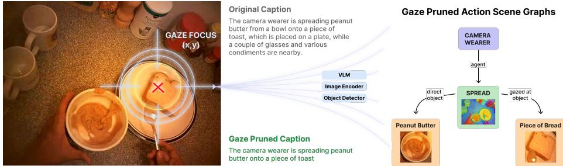
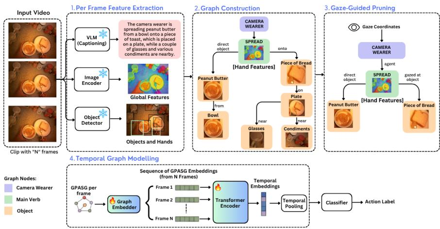
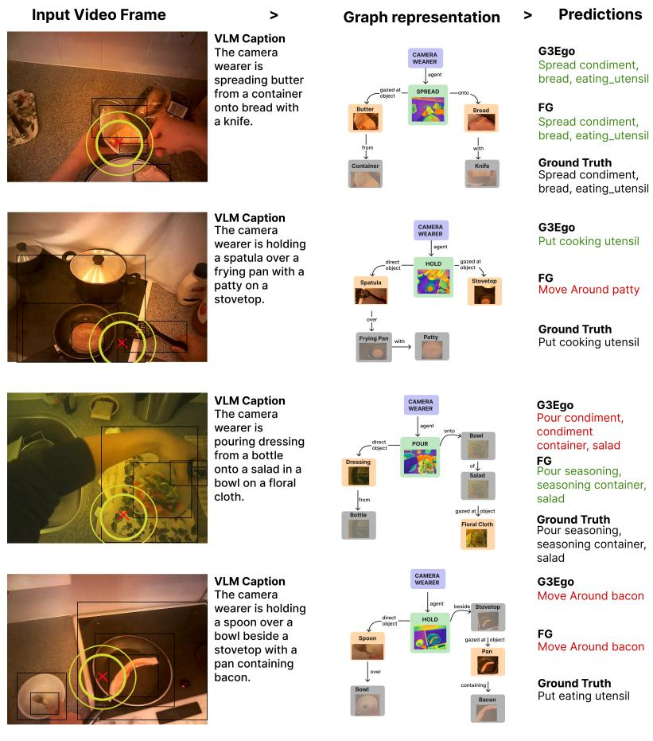

# G3Ego: Gaze-Guided Graphs for Egocentric Action Understanding

Marko Haralović1,2 , Akash Ramakrishnan2 ⋆, and Estefania Talavera Martinez2

1 University of Zagreb, Faculty of Electrical Engineering and Computing, Zagreb, Croatia

marko.haralovic@fer.hr 2 University of Twente, Enschede, The Netherlands a.ramakrishnan@utwente.nl

Abstract. Egocentric action understanding is often addressed using large video models pretrained on extensive exocentric datasets. However, many first-person actions depend on a small number of hand–object interactions involving only a few relevant entities. We propose G3Ego, a graph-based framework for egocentric action understanding that uses gaze as a structural cue to identify action-relevant entities in the scene. From sparsely sampled frames, G3Ego constructs action scene graphs from vision-language descriptions, grounded objects, and hand cues, and then prunes irrelevant entities using the camera wearer’s gaze. The resulting graph embeddings are temporally aggregated for action recognition and anticipation. Unlike prior work that uses gaze primarily as an auxiliary modality or attention signal, G3Ego incorporates gaze directly into graph construction, producing eficient and interpretable representations focused on action-relevant interactions. Experiments on EGTEA Gaze+ and MECCANO show that G3Ego achieves competitive performance compared with video-based approaches and consistently improves Macro-F1 under class-imbalanced evaluation, while avoiding reliance on computationally expensive video pretraining. These results demonstrate the efectiveness of gaze-guided graph representations for egocentric action understanding.

Keywords: Egocentric action recognition · Gaze-guided graphs · Scene graph learning

## 1 Introduction

Egocentric videos captured by wearable devices provide a unique first-person perspective on human behavior and daily activities. They support a wide range of tasks, including egocentric action recognition [22, 24, 26, 35, 36, 41, 52, 66, 69, 71, 76], action anticipation [4, 5, 14, 16, 28, 44, 49, 65], gaze anticipation [30, 64, 81, 83], person re-identification [3], and human-object interaction [25, 28, 33, 38, 47, 74, 80].

  
Fig. 1: Motivational overview of gaze-guided graph construction. Given an input egocentric frame and the camera wearer’s gaze coordinates, a vision-language model generates a caption describing the camera wearer’s interactions with the scene. Gaze is used to prune the caption, retaining only action-relevant objects. In this example, the gaze falls on the piece of bread. An action scene graph is then constructed using the global image descriptors from the image encoder as node features for the main verb, and local descriptors from the object detector, including bounding-box features, for the retained objects.

Significant progress has been made in exocentric, or third-person, video action recognition [7, 13, 17, 29], and prior work on egocentric action modeling has often relied on video-based models [14, 16, 36, 41, 65, 69, 70, 71, 76]. While these models are well suited for temporal modeling, they often require large-scale exocentric video pretraining to achieve strong performance [66], followed by supervised training or fine-tuning on egocentric datasets. Because egocentric videos frequently contain occlusions, partially visible interactions, and abrupt viewpoint changes, visual evidence solely coming from RGB frames may be insuficient for reliable action recognition. Prior work has incorporated complementary input modalities and auxiliary supervision signals. These include multimodal cues [20, 26, 27, 28, 49], gaze as an auxiliary learning signal [12, 22, 30, 31, 35, 48, 51, 56], and language-based action history or multitask learning, often centered on the camera wearer’s interactions with objects [24, 38, 44, 53, 66, 74]. Recent progress in high-capacity vision-language models has led to their use in egocentric action modeling and understanding [37, 47, 54, 56, 57, 78].

However, most existing methods rely on exocentric video pretraining, egocentric video-domain fine-tuning, and additional supervision, which create computational and annotation requirements for fine-tuning. In this work, we explore graph approaches for egocentric action recognition and anticipation by studying three complementary aspects: (1) leveraging sparsely sampled image-based representations as an alternative to video pretraining, (2) designing graph-based representations for eficient action modeling, and (3) incorporating gaze information as a complementary signal to enhance graph-based modeling.

Inspired by recent graph-based representations, we propose gaze-pruned action scene graphs as an efective structural cue for action recognition and anticipation. Graph-based approaches have been used for action modeling and procedural learning [1, 6, 11, 23, 34, 45, 46, 60, 61, 62, 73, 77, 82, 84], ofering structured inputs and improved interpretability. In our setting, graphs provide a compact alternative to dense visual processing by representing the camera wearer, action predicates, auxiliary verbs, and interacting objects in the scene as nodes, while edges encode semantic relations between objects and actions, as visualized in Figure 1. We hypothesize that such structured representations capture the essential components of egocentric actions more compactly than frame-based models.

Our automatic pipeline consists of several steps: (a) per-frame scene descriptions, (b) description parsing, (c) frame-based vision encoder inference, (d) object and hand grounding, (e) gaze-guided graph pruning, and (f) graph learning using a temporal aggregation module over graph embeddings. The overall pipeline is shown in Figure 2. Since only a small portion of frames contain meaningful action signals, we follow previous work [62] on sparse clip sampling. Following prior work on gaze as an auxiliary signal [12, 22, 35, 48, 51], we introduce a gaze-guided graph pruning strategy that removes non-salient background nodes and retains only objects that the wearer is attending to [12]. We refer to these graphs as Gaze-Guided Graphs for egocentric action representation (G3Ego).

Prior work has shown that hand- and object-centric cues can be used either as additional model inputs or structured visual cues [24, 25, 28, 55, 63, 66], or as auxiliary supervision signals [33, 38, 74, 80] for action recognition and human-object modeling. Given their usability, we extract both per-object and per-hand features in a single forward pass and use them as auxiliary visual features encoded in gaze-guided graph object nodes.

Our main contributions are as follows: (a) we introduce G3Ego, a gazeguided graph framework that leverages gaze as a structural cue to prune action scene graphs into compact representations centered on action-relevant entities; and (b) we demonstrate that G3Ego achieves competitive performance on egocentric action recognition and anticipation while using substantially more compact representations than dedicated video-based models.

## 2 Related Work

Action recognition has been extensively studied using exocentric video benchmarks, with approaches evolving from convolutional architectures [9, 13, 68] to transformer-based video models [7, 40, 79]. These methods typically rely on largescale video pretraining datasets, such as Kinetics [9], Something-Somethingv2 [18], HowTo100M [50], and EPIC-KITCHENS-100 [10], followed by taskspecific fine-tuning.

Egocentric action recognition introduces additional challenges due to the first-person perspective, where actions are often defined by interactions between the camera wearer’s hands and surrounding objects. As a result, existing approaches commonly adapt dense video backbones through egocentric finetuning [36, 43, 54, 69, 76], additional supervision signals [12, 35, 51, 66], or multimodal inputs [22, 24, 26, 27, 44]. More recently, vision-language models have been explored for egocentric representation learning and reasoning [37, 54, 55, 57]. However, these approaches generally continue to rely on large-scale video pretraining and dense temporal representations. In contrast, our work explores whether image-based pretrained representations, combined with structured semantic modeling, can ofer an eficient alternative that avoids dedicated video pretraining for egocentric action understanding.

Gaze and hand-object cues for egocentric understanding. Additional modalities have been widely investigated to address the ambiguity of egocentric video. Among them, gaze provides an important cue about the camera wearer’s attention and has been used to identify task-relevant objects and regions [12, 36]. Subsequent approaches incorporated gaze into attention mechanisms for activity recognition [51], jointly modeled gaze and action prediction [22, 30, 35], and exploited gaze for human-object interaction understanding [53]. Recent works have further explored gaze-guided reasoning for higher-level tasks, including intent understanding with vision-language models [56] and interaction anticipation [47].

Hand-object interactions provide another fundamental cue for egocentric action understanding, as many first-person activities are characterized by object manipulation. Previous methods have used hand and object information as explicit inputs [25, 38, 74], auxiliary supervision signals [55, 66], or cues for reasoning about object states and future interactions [47, 53, 66]. These studies demonstrate that focusing on interaction-relevant entities can reduce the ambiguity caused by irrelevant scene content. Our framework builds upon these observations by using gaze, hands, and objects as structural cues to construct compact action representations.

Graph-based representations for action understanding. Graphs provide a compact alternative to dense feature representations by explicitly modeling entities and their relationships. Previous works have explored graph-based approaches for video understanding, capturing spatio-temporal relations between regions, frames, or learned visual tokens [1, 11, 34, 77, 82]. These methods demonstrate the benefits of relational reasoning for action understanding, but typically rely on dense visual backbones and video-level representations.

Scene graphs ofer explicit representation of actions by modeling object– entities interactions. Existing approaches have applied scene graphs to compositional action understanding, video question answering, and semantic reasoning [23, 45, 60, 84]. However, these methods require dense scene graph annotations, object-centric supervision, or manually designed graph construction procedures, limiting their applicability to unconstrained egocentric scenarios.

More recent work has investigated graph representations for human-centric and egocentric video understanding. Human-centric graphs model relations between people, body cues, and objects [6, 61], while egocentric approaches have explored action scene graphs and graph-based anticipation models [4, 5, 62]. These methods demonstrate the potential of structured representations for firstperson scene understanding, but often depend on additional annotations, explicit temporal alignment, or complex pipelines. In contrast, our method constructs gaze-pruned action scene graphs directly from automatically extracted semantic cues and combines them with a lightweight trainable temporal model, without requiring dense video pretraining or manually refined graph supervision.

## 3 G3Ego: Gaze Guided Graph from Egocentric Videos

We propose G3Ego for temporal action understanding in egocentric videos. Given an input video, G3Ego constructs a semantic graph representation for each frame by combining global visual descriptors, local object and hand cues, and gaze-guided pruning. The resulting graph sequence is embedded and temporally aggregated for action recognition and anticipation, as illustrated in Fig. 2.

  
Fig. 2: Overview of the proposed G3Ego framework. Given a clip of N frames, we extract global, object, and hand features, construct a graph of the camera wearer’s interactions with the scene, and prune it using gaze. The resulting graph descriptors are temporally aggregated for action recognition.

## 3.1 Frame Representation

Global Visual and Semantic Descriptors. We extract global frame representations using a frozen vision encoder, producing visual descriptors xt. Additionally, a Vision Language Model generates a detailed semantic description of each frame, from which verbs, objects, attributes, and relations are extracted using dependency parsing. The exact annotation prompt and decoding configuration are provided in the supplementary material.

Local descriptors. To represent local scene elements, we extract objects and their attributes from the parsed annotations. We construct a descriptive list of objects (base object + attributes) and perform visual grounding using an open vocabulary object grounder. This provides both object localization and bounding-box feature vectors, $\mathbf { x } _ { o } .$ Each object is assigned a single feature representation. When multiple instances are detected, mean pooling is applied within the frame. To ensure eficiency, we perform a single forward pass per frame and extract feature maps directly, following prior work [62, 85].

We also extract a 20-dimensional hand feature vector to capture hand location and hand-object interaction cues. For each hand, the representation comprises normalized hand bounding-box coordinates and a side indicator (5D), together with the representation of the interacted object, consisting of its boundingbox coordinates and class index (5D). Features for both hands are concatenated. These features are obtained during the same forward pass used for visual grounding, and a hand is considered to interact with an object when their bounding boxes overlap. If a hand or its interacted object is not detected, the corresponding feature entries are set to zero.

The attributes and relations are encoded as multi-hot matrices of size $| \mathcal { O } | \times | \mathcal { A } |$ and $| \mathcal { O } | \times | \mathcal { R } |$ , respectively. During annotation refinement, compound nouns are preserved (e.g., board game), while descriptive phrases $( \mathrm { e . g . }$ , white doors) are decomposed into base objects and attribute pairs using dependency parsing.

## 3.2 Graph Construction

For each frame t, we construct an action scene graph that encodes verbs, objects, their attributes, and semantic relations. Inspired by [62], we represent each frame as a graph

$$
\mathcal { G } _ { t } = ( \mathcal { V } _ { t } , \mathcal { E } _ { t } , \mathbf { X } _ { t } ) ,\tag{1}
$$

where $\mathcal { V } _ { t } = \{ c , v _ { t } \} \cup \tilde { \mathcal { V } } _ { t } \cup \mathcal { O } _ { t }$ is the set of graph nodes, consisting of the camera wearer node $c ,$ the main verb node $v _ { t } ,$ the set of auxiliary verb nodes $\tilde { \mathcal { V } } _ { t } ,$ and the set of object nodes ${ \mathcal { O } } _ { t }$ . Each node $u \in \mathcal V _ { t }$ is associated with a feature vector $\mathbf { x } _ { u } ,$ collectively denoted by $\mathbf { X } _ { t } = \{ \mathbf { x } _ { u } ~ | ~ u \in \mathcal { V } _ { t } \}$ . The main verb node is initialized with the global frame descriptor, i.e., $\mathbf { x } _ { v _ { t } } = \mathbf { x } _ { t }$ , while each object node $o \in \mathcal { O } _ { t }$ is associated with a visual feature vector $\mathbf { x } _ { o }$ and a set of attributes $\scriptstyle A ( o )$ . The edge set $\mathcal { E } _ { t }$ encodes verb–object interactions (including direct and gazed-at objects), auxiliary–main verb dependencies, and prepositional relations.

The resulting graphs, referred to as full graphs (FG), preserve all detected objects, attributes, and semantic relations of the scene. Although comprehensive, they may include entities irrelevant to the performed action, motivating the gazeguided graph pruning strategy described next.

## 3.3 Gaze-Guided Graph Pruning

Unlike previous gaze-guided approaches that primarily use gaze as an auxiliary input or attention signal, our gaze-guided graphs use gaze as a structural cue that determines which entities are preserved in the graph.

Gaze-guided graphs. We define gaze-guided pruning as the graph transformation $P ( \mathcal { G } _ { t } , \mathbf { g } _ { t } ) = \hat { \mathcal { G } } _ { t }$ , where $\mathbf { g } _ { t }$ denotes the gaze coordinate and $\hat { \mathcal G } _ { t } = ( \hat { \mathcal V } _ { t } , \hat { \mathcal E } _ { t } , \hat { \mathbf X } _ { t } )$ is the resulting gaze-guided (pruned) graph.

The gazed object is identified as the object whose bounding-box center is closest to the gaze location, $O _ { t } ^ { g } = \arg \operatorname* { m i n } _ { o _ { i } \in \mathcal { O } _ { t } } \left. \mathbf { g } _ { t } - \mathbf { c } _ { i } \right. _ { 2 }$ , where $\mathbf { c } _ { i }$ denotes the center of the bounding box of object $o _ { i }$ . Let $\mathcal { O } _ { t } ^ { v } = \{ \bar { o } \in \mathcal { O } _ { t } \ | \ ( v _ { t } , o ) \in \mathcal { E } _ { t } \}$ denote the set of action-critical objects directly connected to the main verb. The retained node set is then defined as $\hat { \mathcal { V } } _ { t } = \{ c , v _ { t } , o _ { t } ^ { g } \} \cup \mathcal { O } _ { t } ^ { v }$ . The corresponding edge set is obtained by restricting the original graph to the retained nodes, $\hat { \mathcal { E } } _ { t } = \{ ( u , v ) \in \mathcal { E } _ { t } \mid u , v \in \hat { \mathcal { V } } _ { t } \}$ . The node features $\hat { \mathbf { X } } _ { t }$ of the pruned graph are inherited from the original graph.

This pruning operation preserves the camera wearer, the main verb, the gazed object, and the action-critical objects while discarding all remaining nodes and edges, producing a compact graph that captures the camera wearer’s interactions with the scene.

## 3.4 Temporal Graph Modeling

Given a sequence of interaction graphs describing the camera wearer’s interactions with the scene, we first encode each graph into a compact descriptor and then model temporal dependencies over the resulting graph representations.

Graph Embedder. Each graph is first converted into a tensor representation containing the global visual descriptor, verb and auxiliary verb indices, object representations, object-attribute and object-relation matrices, object features, and a set of (verb, object, relation) triplets.

We then learn a trainable graph embedder that maps these components into a fixed-dimensional representation. Verbs, objects, and relations are embedded using dictionary-based embeddings. Object features and auxiliary verbs are aggregated using Multi-Query Pooling [32], allowing the model to assign diferent importance to individual elements. The global visual feature is optionally projected into a lower-dimensional space, and the triplets are encoded through an MLP. Finally, we concatenate all embeddings to obtain the graph descriptor.

Temporal Aggregation. Given an activity window of n frames, we first construct a sequence of gaze-guided graphs $\{ \hat { \mathcal { G } } _ { 1 } , \hat { \mathcal { G } } _ { 2 } , \hdots , \hat { \mathcal { G } } _ { n } \}$ . Each graph is mapped by the graph embedder into a d-dimensional representation, $\mathbf { z } _ { t } = f _ { \mathrm { G E } } \big ( \hat { \mathcal { G } } _ { t } \big ) \in \mathbb { R } ^ { d }$ where $f _ { \mathrm { G E } } ( \cdot )$ denotes the graph embedding network.

The resulting sequence is ${ \bf Z } = [ { \bf z } _ { 1 } , { \bf z } _ { 2 } , \ldots , { \bf z } _ { n } ] \in \mathbb { R } ^ { n \times d }$ . To preserve temporal order, a learnable positional embedding $\mathbf { P } \in \mathbb { R } ^ { n \times d }$ is added, $\tilde { \mathbf { Z } } = \mathbf { Z } + \mathbf { P }$ Sequences shorter than n frames are zero-padded and accompanied by an attention mask, enabling our model to handle variable-length input.

The sequence is then processed by a Transformer encoder $\mathbf { H } \ = \ f _ { \mathrm { T r } } ( \tilde { \mathbf { Z } } )$ where f ( $f _ { \mathrm { T r } } ( \cdot )$ denotes a stack of Transformer encoder layers with multi-head selfattention and feed-forward blocks.

The output representations are aggregated using temporal attention pooling, $\mathbf { h } = \mathrm { A t t n P o o l } ( \mathbf { H } )$ , producing a fixed-dimensional activity representation. Finally, action probabilities are obtained through a fully connected classifier, $\hat { \mathbf { y } } = \operatorname { S o f t m a x } ( W \mathbf { h } + b )$

## 4 Experiments

Datasets. We evaluate our method on two publicly available egocentric datasets on tasks of action recognition and action anticipation, situated in diferent environments. For both datasets, RGB + gaze is used as input to our method.

MECCANO [59] is an egocentric dataset comprising 20 videos with 8,839 action segments across 61 action types related to the assembly of a toy motorbike. It includes annotations for 20 objects and 12 verbs, contains precomputed object, hands, gaze, and depth features, and provides annotations for both action recognition and action anticipation. We follow the train, validation, and test splits provided by the authors [59].

EGTEA Gaze+ [35] is an egocentric dataset in a kitchen environment, containing 10,321 segments of 106 actions across three 8:2 train:test splits. It provides hand location annotations and gaze coordinates. Following prior work [66], we split the training set into train and validation sets so that the final per-split ratio is 7:1:2 for the train, validation, and test sets.

Evaluation Details. Given an input video sequence of frames $f _ { 1 } , \ldots , f _ { n } ,$ , our framework operates on sparsely sampled frames and aggregates frame-level predictions to obtain a sequence-level output. We evaluate G3Ego on two tasks:

Action Recognition. For action recognition, the goal is to predict the action label associated with the observed frame sequence. We subsample each sequence into N frames, process them independently with our frame-based framework, and temporally aggregate the resulting representations to obtain the final sequencelevel prediction.

Action Anticipation. For action anticipation, the goal is to predict the future action label given observations up to timestamp t. Specifically, we predict the action occurring at timestamp $t + \delta$ , where we set δ = 1s in our experiments. We follow the same frame-based processing and temporal aggregation strategy used for action recognition.

Implementation Details. We adopt DINOv3 [67] as the frame-based vision encoder, using ${ \mathrm { V i T - L } } / { 1 6 }$ as the backbone. For frame-based VLM captioning, we use Qwen3-VL-32B-Instruct [2] in mixed precision, with images resized to 448 as input and the maximum number of new tokens set to 160. We rely on spaCy [21] for caption parsing. For object/hand grounding and feature extraction, we use the open vocabulary object grounder GroundingDINO [39] with a Swin-T backbone, which produces both object features and bounding boxes. Additional details on the pretrained components, feature dimensions, and computational resources are provided in the supplementary material.

Each graph is constructed from parsed VLM annotations, grounded features obtained with GroundingDINO, hand-object features constructed from groundings, and frame-level semantic features from DINOv3. Each object embedding is a 256-dimensional vector, while DINOv3-L produces a 1024-dimensional vector. Hand features are obtained from the object grounding method, resulting in a 20-dimensional feature vector. The resulting graphs are embedded using a lightweight graph encoder into fixed 64-dimensional graph embeddings, which are subsequently processed by the temporal aggregation module adapted from [65]. This module produces a final video representation of 352 dimensions. We compare the proposed model against three baselines: (1) a two-layer bidirectional LSTM with a hidden size of 64, (2) a two-layer MLP with GELU activations and dropout, and (3) a two-layer, four-head Graph Attention Network (GAT) with 128-dimensional node features. While the LSTM and MLP operate on the graph embeddings, the GAT is trained independently as a temporal graph neural network over the sequence of frame graphs. For action recognition, our G3Ego model has 105M trainable parameters, while for action anticipation, G3Ego has 15M trainable parameters, obtained by reducing the transformer encoder depth and hidden size, as the anticipation involves a shorter efective temporal context.

Training Details. Experiments were performed on NVIDIA A40 GPUs with 40GB of VRAM and NVIDIA Quadro RTX 6000 GPUs with 24GB of VRAM, which were used for object grounding and graph training. For VLM inference, we used an NVIDIA RTX PRO 6000 Blackwell GPU with 98GB of VRAM. For training, we use the Adam optimizer with a base learning rate of $3 \times 1 0 ^ { - 4 }$ and weight decay of $1 \times 1 0 ^ { - 5 }$ . We use a linear scheduler with a factor of 0.95, inverse frequency weighted cross entropy loss, and train for 20 epochs, selecting the best checkpoint based on the macro-F1 score. The batch size is set to 16 and we use 32 frames for graph construction.

Ofline feature extraction and graph construction. To reduce the computational cost of repeated training and evaluation, we perform the frozen visual feature extraction, both from DINOv3 and GroundingDINO, and graph construction stages once and cache their outputs. The temporal action model is then trained directly on the cached graph representations. Consequently, model training and standard inference over precomputed graphs require only graph embedding and temporal, rather than repeated DINOv3 and GroundingDINO forward passes followed by graph construction, substantially reducing efective computational and memory cost of downstream experimentation.

Comparison with State-of-the-Art Methods. On the MECCANO action recognition task, we reproduce the SlowFast baseline [28] and the recent method of [4], since neither report macro-F1 as an evaluation metric. We compare our approach against these reproduced baselines, the ensemble models that achieved the top performance in the MECCANO challenge [28, 72], and the recent method of [66], which reports F1-score and represents the previous bestperforming approach under this evaluation protocol.

For action anticipation, we reproduce existing methods [4, 5, 15, 16, 44, 49, 65] and report their top-1 and top-5 accuracy results. Additionally, we include macro-F1 scores for all methods, which we adopt as the primary evaluation metric to account for class imbalance and enable a fair comparison across methods.

For EGTEA Gaze+ action recognition, we compare our method with the methods following two common training protocols: approaches relying exclusively on egocentric fine-tuning [19, 22, 35, 36, 68, 69, 70, 71, 75, 76], and approaches leveraging exocentric pretraining followed by egocentric fine-tuning [9, 24, 41, 42, 66, 76]. We exclude methods that employ test-time LLM-based filtering [26, 52], as they introduce additional inference-time information and are therefore not directly comparable under the same evaluation setting.

Graph eficiency analysis. We analyze the efect of pruning by comparing G3Ego with Full Graphs using global eficiency and maximum shortest-path distance. Global eficiency is measured by the following formula

$$
E _ { \mathrm { g l o b } } ( G ) = \frac { 1 } { n ( n - 1 ) } \sum _ { i \neq j } \frac { 1 } { d _ { i j } }\tag{2}
$$

where n is the number of nodes and $d _ { i j }$ is the shortest path distance between nodes i and $j .$ . The maximum shortest path from the camera wearer node, denoted $v _ { c w } ,$ is defined as $\begin{array} { r } { D _ { \operatorname* { m a x } } = \operatorname* { m a x } _ { v \in \mathcal { V } , v \neq v _ { c w } } d ( v _ { c w } , v ) } \end{array}$ , where $d ( \cdot , \cdot )$ denotes the shortest path distance. This comparison is done on both datasets.

## 5 Results and Discussion

Framework components ablation. We first conduct an ablation study on the MECCANO action recognition dataset [59] to compare and validate the contribution of the individual components of our framework. The ablation results in Table 1 show that gaze pruning provides an improvement over the full action scene graph (FG). When using 10 frames with an LSTM backbone for aggregation, G3Ego improves Top-1 accuracy from 37.34 to 37.90, Top-5 from 70.39 to 70.88, and Macro-F1 from 8.61 to 10.63 over FG. This indicates that removing irrelevant context helps the model focus on the most action-relevant objects. Additional experiments examining the VLM semantic prior, random pruning, and explicit gaze input are reported in the supplementary material.

We also observe that temporal context plays an important role. Increasing the number of frames sampled within the same temporal window from 1 to 10, and then to 32, steadily improves the performance, with Top-1 accuracy increasing from 31.85 to 39.50, and Macro-F1 increasing from 4.72 to 12.34. This suggests that performance improves when the model observes a denser sampling of frames within the same temporal window.

We compared diferent models to aggregate the graph embeddings across all the frames. On G3Ego with 32 frames, the MLP baseline reaches a Top-1 accuracy of 35.28 and Macro-F1 of 7.71, GNN obtained a Top-1 of 33.79 and Macro-F1 of 8.70, LSTM achieved a Top-1 of 39.50 and 12.34, and the proposed temporal aggregation model achieved the best performance with a Top-1 accuracy of 41.91 and Macro-F1 of 15.87.

Table 1: Component-wise ablation of G3Ego on MECCANO. Global, Object, and Hand denote DINOv3 frame features, Grounding-DINO object-region features, and a 20-dimensional hand/hand–object interaction descriptor, respectively. Gaze is used only for graph pruning, not as a recognition feature. FG denotes the full graph. Macro-F1 is the primary selection metric.
<table><tr><td>Graph Type</td><td>Temporal Modeling</td><td>N Frames</td><td>Global</td><td>Object</td><td>Gaze Pruning</td><td>Hand</td><td>Top-1</td><td>Top-5</td><td>Macro F1</td></tr><tr><td colspan="10">Effect of Object Features</td></tr><tr><td>FG</td><td>LSTM</td><td>10</td><td></td><td>x</td><td>x</td><td>X</td><td>25.58</td><td>60.75</td><td>8.29</td></tr><tr><td>FG</td><td>LSTM</td><td>10</td><td></td><td></td><td>x</td><td>X</td><td>37.34</td><td>70.39</td><td>8.61</td></tr><tr><td colspan="10">Effect of Gaze-Guided Graph Pruning</td></tr><tr><td>FG</td><td>LSTM</td><td>10</td><td></td><td></td><td>X</td><td>x</td><td>37.34</td><td>70.39</td><td>8.61</td></tr><tr><td>G3EGO</td><td>LSTM</td><td>10</td><td></td><td></td><td>√</td><td>X</td><td>37.90</td><td>70.88</td><td>10.63</td></tr><tr><td colspan="10">Effect of Sampling Rate</td></tr><tr><td>G3EGO</td><td>LSTM</td><td>1</td><td></td><td>V</td><td>V</td><td>x</td><td>31.85</td><td>64.86</td><td>4.72</td></tr><tr><td>G3EGO</td><td>LSTM</td><td>10</td><td></td><td>√</td><td></td><td>x</td><td>37.90</td><td>70.88</td><td>10.63</td></tr><tr><td>G3EGO</td><td>LSTM</td><td>32</td><td></td><td></td><td></td><td>x</td><td>39.50</td><td>72.33</td><td>12.34</td></tr><tr><td colspan="10">Temporal Modeling Architecture</td></tr><tr><td>G3EGO</td><td>MLP</td><td>32</td><td></td><td></td><td></td><td>x</td><td>35.28</td><td>69.61</td><td>7.71</td></tr><tr><td>G3EGO</td><td>GNN</td><td>32</td><td></td><td></td><td></td><td>x</td><td>33.79</td><td>67.62</td><td>8.70</td></tr><tr><td>G3EGO</td><td>LSTM</td><td>32</td><td></td><td></td><td></td><td>X</td><td>39.50</td><td>72.33</td><td>12.34</td></tr><tr><td>G3EGO</td><td>Temp. Agg.</td><td>32</td><td></td><td></td><td></td><td>x</td><td>41.91</td><td>79.63</td><td>15.87</td></tr><tr><td colspan="10">Input Feature Ablation</td></tr><tr><td>G3EGO</td><td>Temp. Agg.</td><td>32</td><td>X</td><td></td><td></td><td></td><td>26.99</td><td>60.64</td><td>3.83</td></tr><tr><td>G3EGO</td><td>Temp. Agg.</td><td>32</td><td></td><td></td><td></td><td>X</td><td>41.91</td><td>79.63</td><td>15.87</td></tr><tr><td>G3EGO</td><td>Temp. Agg.</td><td>32</td><td></td><td></td><td></td><td>L</td><td>46.48</td><td>82.04</td><td>21.34</td></tr></table>

Finally, we experimented with the removal of RGB features, which caused the performance to drop sharply to 26.99 Top-1 and 3.83 Macro-F1, and inclusion of hand features on G3Ego with temporal aggregation, which reaches the best performance of 46.48 Top-1, 82.04 Top-5, and 21.34 Macro-F1.

Action recognition performance on MECCANO. Table 2 compares our method with reported state-of-the-art approaches on MECCANO action recognition. Our model achieves 46.48 Top-1, 82.04 Top-5, and 21.34 Macro-F1 using G3Ego with RGB and hands, which places it competitively among prior methods. While the best Top-1 accuracy is obtained by UCF Swin3D-B [28] with 52.82, our method outperforms several other strong baselines, including Slow-Fast with RGB [28], Swin-B+HOCL+OCL [66], and AAG [4]. Notably, G3Ego achieves the highest reported Macro-F1 score (21.34), indicating improved robustness across action categories.

In terms of eficiency, our model uses 105M trainable parameters, which is more compact than ensemble-based approaches [8, 28] and single model approaches [66], though larger than certain baselines [4, 28]. Overall, these results show that graph-based representations can achieve competitive recognition performance with fewer parameters than several video-based approaches.

Table 2: Performance comparison with SOTA on MECCANO action recognition task. AH: action history; HOCL: hand-object contact labels; OSL: object state labels.
<table><tr><td>Method</td><td>Venue</td><td>Modality</td><td>Top-1</td><td>Top-5</td><td>Macro-F1</td><td>Train. Params</td></tr><tr><td>Majority class baseline</td><td></td><td></td><td>27.31</td><td>51.22</td><td>0.72</td><td></td></tr><tr><td>SlowFast [28]</td><td>CVPRW&#x27;23</td><td>RGB</td><td>45.16</td><td>73.75</td><td>18.91</td><td>68M</td></tr><tr><td>SlowFast [28]</td><td>CVPRW&#x27;23</td><td>RGB+Depth+Gaze</td><td>49.66</td><td>77.82</td><td></td><td>68M</td></tr><tr><td>LUBECK UniFormer ens. [28]</td><td>CVPRW&#x27;23</td><td>RGB+Depth</td><td>51.82</td><td>83.35</td><td></td><td>540M</td></tr><tr><td>UCF Swin3D-B [28]</td><td>CVPRW&#x27;23</td><td>RGB+Depth</td><td>52.82</td><td>83.85</td><td></td><td>176M</td></tr><tr><td>UNIBZ 8-model ens. [8]</td><td>ISIEA&#x27;24</td><td>RGB+Depth</td><td>52.57</td><td>81.53</td><td></td><td>194M</td></tr><tr><td>Swin-B + HOCL+OSL [66]</td><td>WACV&#x27;24</td><td>RGB+HOCL+OSL</td><td>44.81</td><td>77.01</td><td>16.70</td><td>176M</td></tr><tr><td>AAG [4]</td><td>WACV&#x27;26</td><td>RGB+Depth+AH</td><td>33.48</td><td>69.32</td><td>9.52</td><td>24M</td></tr><tr><td>G3EGO</td><td></td><td>Gaze(RGB + Hands)</td><td>46.48</td><td>82.04</td><td>21.34</td><td>105M</td></tr></table>

Table 3: EGTEA Gaze+ action-recognition results on the oficial three splits. S1–S3 report mAcc when available; otherwise they report per-split Top-1/overall accuracy. MTL: multi-task learning; IDT:improved dense trajectories.
<table><tr><td>Method</td><td>Venue</td><td>Modality</td><td></td><td>S1</td><td>S2</td><td>S3</td><td>Avg mAcc</td><td>Avg Top-1</td></tr><tr><td>Two Stream [68]</td><td>NeurIPS&#x27;14</td><td></td><td>RGB + Optical Flow</td><td>43.78</td><td>41.47</td><td>40.28</td><td>41.84</td><td></td></tr><tr><td>EgoIDT+Gaze [36]</td><td>CVPR&#x27;15</td><td></td><td>RGB + IDT + Gaze</td><td>42.55</td><td>37.30</td><td>37.60</td><td>39.13</td><td></td></tr><tr><td>I3D+EgoConv [69]</td><td>CVPR&#x27;16</td><td>Gaze</td><td>RGB + Hands + Head +</td><td>54.19</td><td>51.45</td><td>49.41</td><td>51.68</td><td></td></tr><tr><td>TSN [75]</td><td>ECCV&#x27;16</td><td></td><td>RGB + Optical Flow</td><td>58.01</td><td>55.01</td><td>54.78</td><td>55.93</td><td></td></tr><tr><td>Sudhakaran et al. [71]</td><td>ECCVW&#x27;18</td><td>RGB</td><td></td><td>52.40</td><td>50.09</td><td>49.11</td><td>50.53</td><td></td></tr><tr><td>LSTA [70]</td><td>CVPR&#x27;19</td><td></td><td>RGB + Optical Flow</td><td>53.00</td><td></td><td></td><td></td><td></td></tr><tr><td>Mutuai Context [22]</td><td>TIP&#x27;20</td><td>RGB + MTL</td><td></td><td>55.70</td><td></td><td></td><td></td><td>62.60</td></tr><tr><td>I3D [76]</td><td>ICCV&#x27;21</td><td>RGB</td><td></td><td>56.78</td><td>54.92</td><td>53.94</td><td>55.21</td><td></td></tr><tr><td>GC-TSM [19]</td><td>CVPR&#x27;22</td><td>RGB</td><td></td><td></td><td></td><td></td><td></td><td>65.10</td></tr><tr><td>I3D+Gaze [35]</td><td>TPAMI&#x27;23</td><td>RGB</td><td> + Gaze</td><td>53.74</td><td>50.30</td><td>49.63</td><td>51.22</td><td></td></tr><tr><td>Prob-ATT w gaze [35]</td><td>TPAMI&#x27;23</td><td></td><td>RGB + Gaze Attention</td><td>57.20</td><td>53.75</td><td>54.13</td><td>55.03</td><td></td></tr><tr><td>G3EGO</td><td></td><td></td><td>Gaze(RGB + Hands)</td><td>61.68</td><td>56.34</td><td>51.46</td><td>56.49</td><td>64.25</td></tr></table>

Action recognition on EGTEA Gaze+. The results on EGTEA Gaze+ in Table 3 show that G3Ego performs well beyond MECCANO. G3Ego achieves the best Split 1 and Split 2 mean accuracies at 61.68 and 56.34, respectively. Although Split 3 remains lower at 51.46, the average mean accuracy across three splits is the highest for our model at 56.49. We also compare our method to works that report average Top-1 accuracy instead of mean accuracy across splits, and G3Ego achieves 64.25, second only to GC-TSM [19]. For a fair comparison, Table 3 includes only methods that do not rely on exocentric pretraining, while the complete comparison with all reported methods, including those that rely on exocentric pretraining, is provided in the supplementary material. These results demonstrate that G3Ego remains efective across diferent egocentric activity domains.

Action anticipation performance on MECCANO. We also evaluate the extension of our framework for next-activity prediction in MECCANO, reported in Table 4. Our G3Ego model achieves 25.20 Top-1, 61.67 Top-5, and 4.20 Macro-F1 at $t _ { a } = 1$ before the next action. Although Top-1 accuracy is lower than the many baseline methods, it is important to note that the majority class baseline already achieves a 27.21 Top-1, which is comparable to many stateof-the-art methods in the table. This indicates that Top-1 is not a suficiently informative metric for MECCANO anticipation, likely due to the long-tailed class distribution. In contrast, our method achieves the highest Macro-F1 among all reported approaches, suggesting a much stronger balance across classes and better performance on underrepresented actions.

Table 4: MECCANO next-action prediction results for reported methods and our graph-based models. Results are reported for action anticipation at $t _ { a } = 1 \mathrm { s }$ before the next action. Bold values indicate the best result across the full table.
<table><tr><td>Method</td><td>Venue</td><td>Modality</td><td>Top-1</td><td>Top-5</td><td>Macro-F1</td><td>Train. Params</td></tr><tr><td>Majority class baseline</td><td></td><td></td><td>27.21</td><td>51.15</td><td>0.71</td><td></td></tr><tr><td>TempAgg [65]</td><td>ECCV&#x27;20</td><td>OHG</td><td>19.69</td><td>25.37</td><td>3.11</td><td>123M</td></tr><tr><td>AVT [16]</td><td>ICCV&#x27;21</td><td>OHG</td><td>27.43</td><td>53.38</td><td>3.68</td><td>392M</td></tr><tr><td>RULSTM [28]</td><td>CVIU&#x27;23</td><td>OHG</td><td>24.08</td><td>58.23</td><td>2.47</td><td>67M</td></tr><tr><td>VLMAH [44]</td><td>ICCV-W&#x27;23</td><td>OHG</td><td>28.90</td><td>58.13</td><td>0.72</td><td>45M</td></tr><tr><td>MMTF-RU [49]</td><td>T-ASE’25</td><td>OHG</td><td>29.75</td><td>64.46</td><td></td><td>33.2M</td></tr><tr><td>AAG [4]</td><td>WACV&#x27;26</td><td>RGB+Depth</td><td>27.21</td><td>51.15</td><td>0.71</td><td>24M</td></tr><tr><td>AAG+ [5]</td><td>CoRR&#x27;26</td><td>RGB+Depth+AH</td><td>27.24</td><td>60.41</td><td></td><td>34M</td></tr><tr><td>G3EGO</td><td></td><td>Gaze(RGB + Hands)</td><td>25.20</td><td>61.67</td><td>4.20</td><td>15M</td></tr></table>

OHG: object, hand, and gaze features; AH: action history.

Table 5: Full graphs (FG) versus G3Ego graphs eficiency statistics. EGTEA values denote averages over the three oficial splits.
<table><tr><td>Dataset</td><td>Graph</td><td>Nodes ↓ Edges ↓</td><td> ${ \mathrm { A v g . } }$ </td><td></td><td>max distance ↓ Global Efficiency ↑</td></tr><tr><td rowspan="2">MECCANO</td><td>FG</td><td>13.57</td><td>8.13</td><td>3.29</td><td>0.257</td></tr><tr><td>G3EGO</td><td>3.75</td><td>2.75</td><td>2.00</td><td>0.771</td></tr><tr><td rowspan="2">EGTEA</td><td>FG</td><td>4.51</td><td>3.41</td><td>2.03</td><td>0.703</td></tr><tr><td>G3EGO</td><td>3.77</td><td>2.77</td><td>2.00</td><td>0.769</td></tr></table>

G3Ego graph eficiency analysis. Table 5 shows how graph pruning afects graph eficiency on both MECCANO and EGTEA Gaze+. G3Ego substantially reduces the size of the graph while producing shorter communication paths and higher global eficiency. In MECCANO, G3Ego reduces the average number of nodes and edges by 72.4% and 66.1%, respectively, while increasing the global eficiency from 0.257 to 0.771. A similar trend is observed on EGTEA Gaze+.

It is also notable that MECCANO contains substantially more nodes and edges than EGTEA Gaze+. This diference is caused by the longer captions generated by the Vision-Language Model, which tend to mention many objects present while the participant is assembling the toy motorbike. Consequently, graph pruning is particularly valuable for MECCANO, as it removes irrelevant objects and focuses the graph on the objects involved in the interaction.

  
Fig. 3: Qualitative examples of action classification predictions with the ground-truth labels. For each sample, we visualize the full action scene graph (FG) and the corresponding gaze-guided graph. Gaze-guided pruning preserves action-relevant entities and relationships while removing irrelevant context, yielding more discriminative graph representations and improved action recognition.

## 6 Conclusion

By leveraging gaze as a structural pruning mechanism, G3Ego produces a compact and interpretable interaction graph that models the camera wearer’s interactions with the surrounding scene. Experimental results on MECCANO and EGTEA Gaze+ demonstrate that G3Ego achieves competitive performance across diferent egocentric benchmarks, while obtaining the strongest Macro-F1 results among compared methods on MECCANO and average mean accuracy across 3 splits on EGTEA Gaze+. These findings indicate that gaze-guided graph representations can efectively capture semantic action structure without requiring dense video pretraining.

Our analysis also highlights the importance of evaluating egocentric action understanding beyond accuracy-based metrics, particularly in long-tailed settings where majority classes can dominate performance. Future work will extend G3Ego to model longer temporal dependencies, richer hand–object and human–object interactions, and more expressive graph representations that capture higher-order semantic relationships in egocentric videos.

## 7 Acknowledgements

E. Talavera Martinez was supported by the NWO Talent Programme – VENI (project Understanding Social Interactions in First-Person Videos with Multimodal Learning, file number 244507) which is financed by the Dutch Research Council (NWO). Computational resources were provided by the University of Twente High-Performance Computing infrastructure.

## Bibliography

[1] Arnab, A., Sun, C., Schmid, C.: Unified graph structured models for video understanding. In: International Conference on Computer Vision (ICCV). pp. 8117–8126 (2021)

[2] Bai, S., Cai, Y., Chen, R., Chen, K., Chen, X., et al.: Qwen3-vl technical report. arXiv preprint arXiv:2511.21631 (2025)

[3] Basaran, E., Tesfaye, Y.T., Shah, M.: Egoreid dataset: Person reidentification in videos acquired by mobile devices with first-person pointof-view. arXiv preprint arXiv:1812.09570 (2018), https://arxiv.org/abs/ 1812.09570

[4] Benavent-Lledo, M., Bacharidis, K., Manousaki, V., Papoutsakis, K., Argyros, A., Garcia-Rodriguez, J.: Action anticipation at a glimpse: To what extent can multimodal cues replace video? In: Winter Conference on Applications of Computer Vision (WACV). pp. 276–286 (2026)

[5] Benavent-Lledo, M., Bacharidis, K., Papoutsakis, K., Argyros, A., Garcia-Rodriguez, J.: Understanding multimodal complementarity for single-frame action anticipation. arXiv preprint arXiv:2601.22039 (2026)

[6] Benmessabih, T., Slama, R., Havard, V., Baudry, D.: Graph-based framework for temporal human action recognition and segmentation in industrial context. Engineering Applications of Artificial Intelligence 159, 111710 (2025). https://doi.org/10.1016/j.engappai.2025.111710

[7] Bertasius, G., Wang, H., Torresani, L.: Is space-time attention all you need for video understanding? In: International Conference on Machine Learning (ICML). pp. 813–824 (2021)

[8] Bianchi, E., Reiss, S., Carta, C., De Cecco, M., Ghidoni, S., Giunchiglia, F., Lingenfelser, F., Giordano, D., Ricci, F., Lanz, O.: Egocentric video-based human action recognition in industrial environments (2024), mECCANO 2023 Challenge, second-place solution

[9] Carreira, J., Zisserman, A.: Quo vadis, action recognition? a new model and the kinetics dataset. In: IEEE Conference on Computer Vision and Pattern Recognition (CVPR) (2017)

[10] Damen, D., Doughty, H., Farinella, G.M., Furnari, A., Ma, J., Kazakos, E., Moltisanti, D., Munro, J., Perrett, T., Price, W., Wray, M.: Rescaling egocentric vision: Collection, pipeline and challenges for epic-kitchens-100. International Journal of Computer Vision 130, 33–55 (2022). https://doi. org/10.1007/s11263-021-01531-2

[11] Duta, I., Nicolicioiu, A., Leordeanu, M.: Discovering dynamic salient regions for spatio-temporal graph neural networks. In: Advances in Neural Information Processing Systems (NeurIPS) (2021). https://doi.org/10. 48550/arXiv.2009.08427

[12] Fathi, A., Li, Y., Rehg, J.M.: Learning to recognize daily actions using gaze. In: European Conference on Computer Vision (ECCV) (2012)

[13] Feichtenhofer, C., Fan, H., Malik, J., He, K.: Slowfast networks for video recognition. In: International Conference on Computer Vision (ICCV). pp. 6202–6211 (2019)

[14] Furnari, A., Farinella, G.M.: What would you expect? anticipating egocentric actions with rolling-unrolling lstms and modality attention. In: International Conference on Computer Vision (ICCV) (2019)

[15] Furnari, A., Farinella, G.M.: Rolling-unrolling lstms for action anticipation from first-person video. IEEE Transactions on Pattern Analysis and Machine Intelligence 43(11), 4021–4036 (2020). https://doi.org/10.1109/ TPAMI.2020.2992451

[16] Girdhar, R., Grauman, K.: Anticipative video transformer. In: International Conference on Computer Vision (ICCV). pp. 13505–13515 (2021)

[17] Gowda, S.N., Rohrbach, M., Sevilla-Lara, L.: Smart frame selection for action recognition. In: AAAI Conference on Artificial Intelligence. pp. 1451– 1459 (2021)

[18] Goyal, R., Ebrahimi Kahou, S., Michalski, V., Materzynska, J., Westphal, S., Kim, H., Haenel, V., Fründ, I., Yianilos, P., Mueller-Freitag, M., Hoppe, F., Thurau, C., Bax, I., Memisevic, R.: The “something something” video database for learning and evaluating visual common sense. In: The IEEE International Conference on Computer Vision (ICCV). pp. 5842–5850 (2017)

[19] Hao, Y., Zhang, H., Ngo, C.W., He, X.: Group contextualization for video recognition. In: Conference on Computer Vision and Pattern Recognition (CVPR) (2022)

[20] Hatano, M., Hachiuma, R., Fujii, R., Saito, H.: Multimodal cross-domain few-shot learning for egocentric action recognition. In: European Conference on Computer Vision (ECCV) (2024)

[21] Honnibal, M., Montani, I., Van Landeghem, S., Boyd, A.: spacy: Industrialstrength natural language processing in python. Zenodo (2020). https: //doi.org/10.5281/zenodo.1212303

[22] Huang, Y., Cai, M., Li, Z., Lu, F., Sato, Y.: Mutual context network for jointly estimating egocentric gaze and action. IEEE Transactions on Image Processing 29, 7795–7806 (2020). https://doi.org/10.1109/TIP.2020. 3007841

[23] Ji, J., Krishna, R., Fei-Fei, L., Niebles, J.C.: Action genome: Actions as compositions of spatio-temporal scene graphs. In: Conference on Computer Vision and Pattern Recognition (CVPR). pp. 10236–10247 (2020)

[24] Kapidis, G., Poppe, R., van Dam, E., Noldus, L., Veltkamp, R.C.: Multitask learning to improve egocentric action recognition. In: International Conference on Computer Vision (ICCV) Workshops (2019)

[25] Kapidis, G., Poppe, R., van Dam, E., Noldus, L.P.J.J., Veltkamp, R.C.: Egocentric hand track and object-based human action recognition. In: IEEE SmartWorld, Ubiquitous Intelligence and Computing, Advanced and Trusted Computing, Scalable Computing and Communications, Cloud and Big Data Computing, Internet of People and Smart City Innovation. pp. 922–929 (2019). https://doi.org/10.1109/SmartWorld-UIC-ATC-SCALCOM-IOP-SCI.2019.00185

[26] Kazakos, E., Huh, J., Nagrani, A., Zisserman, A., Damen, D.: With a little help from my temporal context: Multimodal egocentric action recognition. In: British Machine Vision Conference (2021)

[27] Kazakos, E., Nagrani, A., Zisserman, A., Damen, D.: Epic-fusion: Audiovisual temporal binding for egocentric action recognition. In: International Conference on Computer Vision (ICCV) (2019)

[28] Kini, J., Fleischer, S., Dave, I., Shah, M.: Ensemble modeling for multimodal visual action recognition. In: International Conference on Image Analysis and Processing Workshops (ICIAP-W) (2023)

[29] Korbar, B., Tran, D., Torresani, L.: Scsampler: Sampling salient clips from video for eficient action recognition. In: International Conference on Computer Vision (ICCV) (2019)

[30] Lai, B., Ryan, F., Jia, W., Liu, M., Rehg, J.M.: Listen to look into the future: Audio-visual egocentric gaze anticipation. In: European Conference on Computer Vision (ECCV). pp. 192–210 (2024), https://arxiv.org/ abs/2305.03907

[31] Lall, V., Liu, Y.: Eyes on target: Gaze-aware object detection in egocentric video. arXiv preprint arXiv:2511.01237 (2025)

[32] Lee, J., Lee, Y., Kim, J., Kosiorek, A.R., Choi, S., Teh, Y.W.: Set transformer: A framework for attention-based permutation-invariant neural networks. In: International Conference on Machine Learning (ICML). Machine Learning Research, vol. 97, pp. 3744–3753 (2019)

[33] Leonardi, R., Ragusa, F., Materia, D., Passanisi, A., Fort, J., Engel, J., Farinella, G.M.: Egointeract: Synthetic egocentric videos generation for interaction understanding and anticipation. arXiv preprint arXiv:2605.18214 (2026). https://doi.org/10.48550/arXiv.2605.18214

[34] Li, R., Wu, X.J., Xu, T.: Video is graph: Structured graph module for video action recognition. arXiv preprint arXiv:2110.05904 (2021). https: //doi.org/10.48550/arXiv.2110.05904

[35] Li, Y., Liu, M., Rehg, J.M.: In the eye of the beholder: Gaze and actions in first person video. IEEE Transactions on Pattern Analysis and Machine Intelligence 45(6), 6731–6747 (2023). https://doi.org/10.1109/TPAMI. 2021.3051319

[36] Li, Y., Ye, Z., Rehg, J.M.: Delving into egocentric actions. In: Conference on Computer Vision and Pattern Recognition (CVPR). pp. 287–295 (2015). https://doi.org/10.1109/CVPR.2015.7298636

[37] Lin, K.Q., Wang, A.J., Soldan, M., Wray, M., Yan, R., Xu, E.Z., Gao, D., Tu, R., Zhao, W., Kong, W., Cai, C., Wang, H., Damen, D., Ghanem, B., Liu, W., Shou, M.Z.: Egocentric video-language pretraining. In: Advances in Neural Information Processing Systems (NeurIPS) (2022), https://arxiv. org/abs/2206.01670

[38] Liu, M., Tang, S., Li, Y., Rehg, J.M.: Forecasting human-object interaction: Joint prediction of motor attention and actions in first person video. In: European Conference on Computer Vision (ECCV) (2020)

[39] Liu, S., Zeng, Z., Ren, T., Li, F., Zhang, H., Yang, J., Jiang, Q., Li, C., Yang, J., Su, H., Zhu, J., Zhang, L.: Grounding DINO: Marrying DINO with

grounded pre-training for open-set object detection. In: European Conference on Computer Vision (ECCV). pp. 38–55 (2024)

[40] Liu, Z., Ning, J., Cao, Y., Wei, Y., Zhang, Z., Lin, S., Hu, H.: Video swin transformer. In: Conference on Computer Vision and Pattern Recognition (CVPR). pp. 3202–3211 (2022)

[41] Lu, M., Liao, D., Li, Z.N.: Learning spatiotemporal attention for egocentric action recognition. In: International Conference on Computer Vision (ICCV) Workshops (2019)

[42] Lu, X., Hao, Y., Cheng, L., Zhao, S., Liu, Y., Song, M.: Mixed attention and channel shift transformer for eficient action recognition. ACM Transactions on Multimedia Computing, Communications and Applications 21(3) (2025). https://doi.org/10.1145/3712594

[43] Ma, M., Fan, H., Kitani, K.M.: Going deeper into first-person activity recognition. In: IEEE Conference on Computer Vision and Pattern Recognition (CVPR) (2016)

[44] Manousaki, V., et al.: Vlmah: Visual-linguistic modeling of action history for efective action anticipation. In: International Conference on Computer Vision (ICCV) Workshops (2023)

[45] Mao, J., Jiang, W., Wang, X., Feng, Z., Lyu, Y., Liu, H., Zhu, Y.: Dynamic multistep reasoning based on video scene graph for video question answering. In: The 2022 Conference of the North American Chapter of the Association for Computational Linguistics: Human Language Technologies. pp. 3894–3904 (2022)

[46] Mao, W., Desai, R., Iuzzolino, M.L., Kamra, N.: Action dynamics task graphs for learning plannable representations of procedural tasks. In: AAAI Conference on Artificial Intelligence (2023)

[47] Materia, D., Ragusa, F., Farinella, G.M.: Leveraging gaze and set-of-mark in vllms for human-object interaction anticipation from egocentric videos. In: International Conference on Pattern Recognition (ICPR) (2026)

[48] Mazzamuto, M., Furnari, A., Sato, Y., Farinella, G.M.: Gazing into missteps: Leveraging eye-gaze for unsupervised mistake detection in egocentric videos of skilled human activities. In: Conference on Computer Vision and Pattern Recognition (CVPR) (2025), https://arxiv.org/abs/2406. 08379

[49] Mehta, N.K., Arvind, Prasad, S.S., Saurav, S., Singh, S.: Optimizing multitask industrial processes with predictive action guidance. IEEE Transactions on Automation Science and Engineering 22, 22833–22844 (2025). https://doi.org/10.1109/TASE.2025.3621005

[50] Miech, A., Zhukov, D., Alayrac, J.B., Tapaswi, M., Laptev, I., Sivic, J.: Howto100m: Learning a text-video embedding by watching hundred million narrated video clips. In: International Conference on Computer Vision (ICCV). pp. 2630–2640 (2019)

[51] Min, K., Corso, J.J.: Integrating human gaze into attention for egocentric activity recognition. In: Winter Conference on Applications of Computer Vision (WACV). pp. 1069–1078 (2021). https://doi.org/10.1109/ WACV48630.2021.00111

[52] Nasirimajd, A., Plizzari, C., Peirone, S.A., Ciccone, M., Averta, G., Caputo, B.: Domain generalization using action sequences for egocentric action recognition. Pattern Recognition Letters 196, 213–220 (2025). https: //doi.org/10.1016/j.patrec.2025.06.010

[53] Ni, Z., Valls Mascaró, E., Ahn, H., Lee, D.: Human–object interaction prediction in videos through gaze following. Computer Vision and Image Understanding 233, 103741 (2023). https://doi.org/10.1016/j.cviu. 2023.103741

[54] Pei, B., Chen, G., Xu, J., He, Y., Liu, Y., Pan, K., Huang, Y., Wang, Y., Lu, T., Wang, L., Qiao, Y.: EgoVideo: Exploring Egocentric Foundation Model and Downstream Adaptation (2024). https://doi.org/10.48550/ arXiv.2406.18070

[55] Pei, B., Huang, Y., Xu, J., Chen, G., He, Y., Yang, L., Wang, Y., Xie, W., Qiao, Y., Wu, F., Wang, L.: Modeling Fine-Grained Hand-Object Dynamics for Egocentric Video Representation Learning. In: International Conference on Learning Representations (2025)

[56] Peng, T., Hua, J., Liu, M., Lu, F.: In the eye of mllm: Benchmarking egocentric video intent understanding with gaze-guided prompting. In: Advances in Neural Information Processing Systems (NeurIPS) (2025)

[57] Pramanick, S., Song, Y., Nag, S., Lin, K.Q., Shah, H., Shou, M.Z., Chellappa, R., Zhang, P.: Egovlpv2: Egocentric video-language pre-training with fusion in the backbone. In: International Conference on Computer Vision (ICCV) (2023), https://openaccess.thecvf.com/content/ ICCV2023/papers/Pramanick\_EgoVLPv2\_Egocentric\_Video-Language\_ Pre-training\_with\_Fusion\_in\_the\_Backbone\_ICCV\_2023\_paper.pdf

[58] Radford, A., Kim, J.W., Hallacy, C., Ramesh, A., Goh, G., Agarwal, S., Sastry, G., Askell, A., Mishkin, P., Clark, J., Krueger, G., Sutskever, I.: Learning transferable visual models from natural language supervision. In: International Conference on Machine Learning (ICML). Machine Learning Research, vol. 139, pp. 8748–8763. PMLR (2021)

[59] Ragusa, F., Livatino, S., Furnari, A., Farinella, G.M.: The meccano dataset: Understanding human-object interactions from egocentric videos in an industrial-like domain. In: Winter Conference on Applications of Computer Vision (WACV) (2021)

[60] Rai, N., Chen, H., Ji, J., Desai, R., Kozuka, K., Ishizaka, S., Adeli, E., Niebles, J.C.: Home action genome: Cooperative compositional action understanding. In: Conference on Computer Vision and Pattern Recognition (CVPR). pp. 11184–11193 (2021)

[61] Riand, M., Le Callet, P., Dollé, L.: Rethinking scene graphs for action recognition. In: 2023 IEEE International Conference on Visual Communications and Image Processing (VCIP). pp. 1–5 (2023). https://doi.org/10.1109/ VCIP59821.2023.10402749

[62] Rodin, I., Furnari, A., Min, K., Tripathi, S., Farinella, G.M.: Action scene graphs for long-form understanding of egocentric videos. In: Conference on Computer Vision and Pattern Recognition (CVPR). pp. 18622–18632 (2024), https://arxiv.org/abs/2312.03391

[63] Roy, D., Rajendiran, R., Fernando, B.: Interaction Region Visual Transformer for Egocentric Action Anticipation. In: Winter Conference on Applications of Computer Vision (WACV). pp. 6740–6750 (January 2024)

[64] Ryan, F., Ananthabhotla, I., Qian, Y., Hofman, J., Rehg, J.M., Ithapu, V.K., Murdock, C.: Forecasting 3d scanpaths in egocentric video. In: Conference on Computer Vision and Pattern Recognition (CVPR) (2026)

[65] Sener, F., Singhania, D., Yao, A.: Temporal aggregate representations for long-range video understanding. In: European Conference on Computer Vision (ECCV). pp. 154–171. Springer (2020)

[66] Shiota, T., Takagi, M., Kumagai, K., Seshimo, H., Aono, Y.: Egocentric action recognition by capturing hand-object contact and object state. In: Winter Conference on Applications of Computer Vision (WACV). pp. 6541– 6551 (2024)

[67] Siméoni, O., Vo, H.V., Seitzer, M., Baldassarre, F., Oquab, M., Jose, C., Khalidov, V., Szafraniec, M., Yi, S., Ramamonjisoa, M., Massa, F., Haziza, D., Wehrstedt, L., Wang, J., Darcet, T., Moutakanni, T., Sentana, L., Roberts, C., Vedaldi, A., Tolan, J., Brandt, J., Couprie, C., Mairal, J., Jégou, H., Labatut, P., Bojanowski, P.: DINOv3. arXiv preprint arXiv:2508.10104 (2025)

[68] Simonyan, K., Zisserman, A.: Two-stream convolutional networks for action recognition in videos. In: Advances in Neural Information Processing Systems (NeurIPS) (2014)

[69] Singh, S., Arora, C., Jawahar, C.V.: First person action recognition using deep learned descriptors. In: Conference on Computer Vision and Pattern Recognition (CVPR). pp. 2620–2628 (2016)

[70] Sudhakaran, S., Escalera, S., Lanz, O.: Lsta: Long short-term attention for egocentric action recognition. In: Conference on Computer Vision and Pattern Recognition (CVPR) (2019)

[71] Sudhakaran, S., Lanz, O.: Attention is all we need: Nailing down objectcentric attention for egocentric activity recognition. In: British Machine Vision Conference (2018)

[72] Tai, T.M., Lanz, O., Fiameni, G., Wong, Y.K., Poon, S.S., Lee, C.K., Cheung, K.C., See, S.: NVIDIA-UNIBZ Submission for EPIC-KITCHENS-100 Action Anticipation Challenge 2022. In: EPIC-KITCHENS 2022 Challenges Report, Conference on Computer Vision and Pattern Recognition (CVPR) Workshops (2022)

[73] Taluzzi, A., Santambrogio, R., Mentasti, S., Plizzari, C., Matteucci, M.: Graph it first! enabling reasoning on long-form egocentric videos through scene graphs. arXiv preprint arXiv:2606.25842 (2026)

[74] Thakur, S., Beyan, C., Morerio, P., Murino, V., Del Bue, A.: Leveraging next-active objects for context-aware anticipation in egocentric videos. In: Winter Conference on Applications of Computer Vision (WACV). pp. 8657– 8666 (January 2024)

[75] Wang, L., Xiong, Y., Wang, Z., Qiao, Y., Lin, D., Tang, X., Van Gool, L.: Temporal segment networks: Towards good practices for deep action recognition. In: European Conference on Computer Vision (ECCV) (2016)

[76] Wang, X., Zhu, L., Wang, H., Yang, Y.: Interactive prototype learning for egocentric action recognition. In: International Conference on Computer Vision (ICCV). pp. 8168–8177 (2021)

[77] Wang, X., Gupta, A.: Videos as space-time region graphs. In: European Conference on Computer Vision (ECCV) (2018)

[78] Xu, B., Wang, Z., Du, Y., Song, Z., Zheng, S., Jin, Q.: Do Egocentric Video-Language Models Truly Understand Hand-Object Interactions? In: International Conference on Learning Representations (2025)

[79] Yang, Y.Q., Guo, Y.X., Xiong, J.Y., Liu, Y., Pan, H., Wang, P.S., Tong, X., Guo, B.: Swin3d: A pretrained transformer backbone for 3d indoor scene understanding. Computational Visual Media 11(1), 83–101 (2025)

[80] Yang, Y., Zhai, W., Wang, C., Yu, C., Cao, Y., Zha, Z.J.: Egochoir: Capturing 3d human-object interaction regions from egocentric views. In: Advances in Neural Information Processing Systems (NeurIPS) (2024)

[81] Yun, H., Na, J., Kim, J., Murdock, C., Kim, G.: Gaze beyond the frame: Forecasting egocentric 3d visual span. In: Advances in Neural Information Processing Systems (NeurIPS) (2025)

[82] Zhang, J., Shen, F., Xu, X., Shen, H.T.: Temporal reasoning graph for activity recognition. IEEE Transactions on Image Processing 29, 5491–5506 (2020)

[83] Zhang, M., Ma, K.T., Lim, J.H., Zhao, Q., Feng, J.: Deep future gaze: Gaze anticipation on egocentric videos using adversarial networks. In: Conference on Computer Vision and Pattern Recognition (CVPR) (2017)

[84] Zhao, Y., Fei, H., Cao, Y., Li, B., Zhang, M., Wei, J., Zhang, M., Chua, T.S.: Constructing holistic spatio-temporal scene graph for video semantic role labeling. In: ACM International Conference on Multimedia. pp. 5281–5291 (2023)

[85] Zou, Y., Jin, S., Deng, A., Zhao, Y., Wang, J., Chen, C.: A.I.R.: Enabling adaptive, iterative, and reasoning-based frame selection for video question answering. In: International Conference on Learning Representations (2026)

# G3Ego: Gaze-Guided Graphs for Egocentric Action Understanding Supplementary Material

## A Model Card

We use frozen Qwen3-VL-32B-Instruct [2] for frame captioning at 448×448 resolution with 160 output tokens, spaCy [21] for parsing, DINOv3 ViT-L/16 [67] for 1024-D global features, and GroundingDINO Swin-T [39] for 256-D object features and 20-D hand descriptors. Only the graph embedder and temporal aggregation module are trained. Grounding and training use A40 (40 GB) or Quadro RTX 6000 (24 GB) GPUs; VLM inference uses one RTX PRO 6000 Blackwell (98 GB).

We distinguish between two computational stages. Frozen visual feature extraction and graph construction are performed ofline and cached, whereas the trainable graph and temporal modules operate directly on the cached representations. We therefore report both the one-time feature-construction cost and the downstream inference cost over cached graphs.

## B Vision-Language Model Action and Activity Annotation Prompts

You will analyze ONE egocentric image and output the camera wearer’s action in the frame   
you are observing.   
Output one sentence only, following this structure:   
The camera wearer is <verb-ing> <object> <optional-context>.   
Rules:   
- Start with exactly: "The camera wearer is"   
- Use a clear verb in the -ing form, such as opening, closing, holding, cutting, using,   
pushing, pulling, taking, placing, stirring, pouring, washing, peeling, spreading,   
mixing, serving, eating, drinking, operating, reaching, or looking.   
- Identify the main object being handled or attended to.   
- Focus on the camera wearer’s hands and the objects with which they interact.   
- Add short scene context only when it helps identify the action or relevant objects.   
- Include object attributes only when needed to distinguish the object.   
- Associate every attribute with a specific object.   
- Mention other people when they are involved in the action.   
- If no clear hand--object interaction is visible, describe the most likely action   
supported by the scene.   
- Be specific about visible objects, but do not explain the reasoning.   
Examples:   
The camera wearer is opening a cabinet above a counter.   
The camera wearer is cutting a vegetable on a cutting board.   
The camera wearer is pouring liquid into a cup beside a sink.   
The camera wearer is holding a bowl over a counter.   
The camera wearer is reaching for a bottle.   
The camera wearer is playing table tennis with another person.   
Return only the sentence. Do not explain the reasoning.

Table 6: Computational metrics of the frozen feature extraction components and the trainable temporal model. Latency is measured per frame for the frozen visual components and per graph sequence for the temporal model. Peak memory denotes measured peak allocated GPU memory.
<table><tr><td>Component</td><td>Output</td><td>Params</td><td>GFLOPs</td><td>Memory</td></tr><tr><td>Qwen3-VL-32B</td><td>160 tokens</td><td>33.36B</td><td>27,500.8</td><td>63.91 GiB</td></tr><tr><td>DINOv3 ViT-L/16</td><td>1024-D</td><td>303.13M</td><td>121.76</td><td>1,176.52 MiB</td></tr><tr><td>GroundingDINÓ</td><td>256-D</td><td>232.90M</td><td>1,312.93</td><td>2,160.50 MiB</td></tr><tr><td>TempAgg, pruned</td><td>352-D</td><td>105M</td><td>0.435</td><td>421.84 MiB</td></tr><tr><td>TempAgg, full</td><td>352-D</td><td>105M</td><td>0.47</td><td>422.44 MiB</td></tr></table>

We use Qwen3-VL-32B-Instruct [2] in mixed precision without quantization. Input frames are resized to 448 × 448 pixels and encoded using the Hugging Face chat template. We use greedy decoding with max\_new\_tokens=160, and the default num\_beams=1. Temperature and top-p sampling are not applied because sampling is disabled.

Each frame is annotated independently. The prompt constrains the output to a single sentence and emphasizes the camera wearer’s hands and manipulated objects as the primary evidence for the action.

## C Additional Component Ablations

We investigate whether the semantic information produced by the VLM alone is suficient for action recognition, without the structured graph representation proposed in G3Ego. To this end, we use Qwen3-VL-32B-Instruct [2] to generate frame-level scene descriptions, which in our full pipeline are subsequently parsed, visually grounded, and converted into action scene graphs. For this ablation, however, we discard the graph construction stage and instead encode the generated captions using CLIP [58]. An LSTM is then trained over the resulting sequence of text embeddings for action recognition. As shown in Table 7, this caption-only variant performs below the majority-class baseline on MEC-CANO [28]. These results indicate that caption embeddings alone fail to capture the temporal dynamics and fine-grained interaction cues required for reliable action recognition, highlighting that the performance gains of G3Ego stem from its structured graph representation rather than from the VLM-generated captions themselves.

We also evaluate whether the improvements from gaze-guided pruning are simply a consequence of reducing graph complexity and retaining fewer objects. We therefore introduce a random-pruning baseline that retains two randomly selected object nodes per frame, matching the object-node budget of G3Ego. As shown in Table 7, random pruning performs worse than both the full graph and gaze-guided pruning. This result indicates that the benefit of G3Ego is not explained by sparsification alone, but by the use of gaze to preserve actionrelevant objects.

Table 7: Additional ablations on MECCANO action recognition. All variants use an LSTM over the same 10 uniformly sampled frames and exclude hand features. VLM caption embeddings are obtained using the CLIP [58] text encoder. Random-2 retains two randomly selected object nodes per frame. Gaze Aux. indicates that gaze coordinates are explicitly provided as an additional recognition feature.
<table><tr><td>Input Representation</td><td>Object Selection</td><td>Gaze Aux.</td><td>Temporal Model</td><td>N Frames</td><td>Top-1</td><td>Top-5</td><td>F1</td></tr><tr><td colspan="8">Effect of VLM Semantic Prior</td></tr><tr><td>Majority class baseline</td><td></td><td>x</td><td></td><td></td><td>27.31</td><td>51.22</td><td>0.72</td></tr><tr><td>VLM caption CLIP [58] embeddings</td><td></td><td>x</td><td>LSTM</td><td>10</td><td>3.86</td><td>24.76</td><td>0.46</td></tr><tr><td colspan="8">Effect of Pruning Strategy</td></tr><tr><td>FG</td><td></td><td>x</td><td>LSTM</td><td>10</td><td>37.34</td><td>70.39</td><td>8.61</td></tr><tr><td>G3EGO</td><td>Random-2</td><td>x</td><td>LSTM</td><td>10</td><td>21.22</td><td>57.07</td><td>7.95</td></tr><tr><td>G3EGO</td><td>Gaze pruning</td><td>x</td><td>LSTM</td><td>10</td><td>37.90</td><td>70.88</td><td>10.63</td></tr><tr><td colspan="8">Effect of Explicit Gaze Input</td></tr><tr><td>G3EGO</td><td>Gaze pruning</td><td>V</td><td>LSTM</td><td>10</td><td>23.45</td><td>57.81</td><td>8.62</td></tr><tr><td>G3EGO</td><td>Gaze pruning</td><td>x</td><td>LSTM</td><td>10</td><td>37.90</td><td>70.88</td><td>10.63</td></tr></table>

Finally, we examine whether gaze is beneficial when used as an explicit auxiliary input in addition to its role in graph pruning. To this end, we augment G3Ego with frame-level gaze coordinates as an auxiliary modality. As reported in Table 7, adding gaze coordinates as an auxiliary feature reduces performance. One possible explanation is that frame-level gaze coordinates are noisy and vary rapidly as the camera wearer shifts attention across consecutive frames. In this setting, due to noise directly providing gaze as an additional modality may distract the temporal model, whereas using gaze for graph pruning yields a more stable representation.

## D Additional results on EGTEA Gaze+

In Table 8, we provide a broader comparison with methods using diferent pretraining regimes. The upper part of the table reports approaches directly comparable to G3Ego, as they do not rely on exocentric video pretraining, while the lower part includes methods initialized from large-scale video datasets, such as Kinetics [9] or EPIC-KITCHENS-100 [10], before being fine-tuned on EGTEA Gaze+. These settings are not directly comparable because the pretrained video models benefit from task-relevant spatio-temporal representations and substantially greater pretraining supervision.

In contrast, G3Ego does not use a video-pretrained backbone or egocentricdomain pretraining. Its global frame representation is extracted using the generalpurpose vision encoder DINOv3 [67], and temporal information is modeled only after the frame-level graph representations have been constructed. Despite the absence of video-specific pretraining, G3Ego remains competitive with several pretrained approaches, although a gap remains to the strongest methods that use Kinetics or EPIC-KITCHENS-100 pretraining and additional annotated hand– object or object-state supervision. The results suggest that G3Ego recovers part of the benefits provided by video pretraining while operating on sparsely sampled frame-level representations and without requiring the additional supervision used by those models, while remaining the strongest method among approaches that do not rely on any dense video pretraining.

Table 8: EGTEA Gaze+ action-recognition results on the oficial three splits. S1–S3 report mAcc when available; otherwise, they report per-split Top-1 or overall accuracy. The upper block contains methods without exocentric video pretraining, while the lower block contains methods using Kinetics [9] or EPIC-KITCHENS-100 [10] pretraining. Results across these blocks are provided for context and are not directly comparable because of diferences in pretraining data, backbone design, and supervision.
<table><tr><td>Method</td><td>Venue</td><td>Pretraining</td><td>Modality sion</td><td></td><td>Supervi- S1</td><td>S2</td><td>S3</td><td></td><td>Avg mAcc Avg Top-1</td></tr><tr><td>Two Stream [68]</td><td>NeurIPS&#x27;14</td><td></td><td></td><td>RGB + Optical Flow</td><td>43.78</td><td>41.47</td><td>40.28</td><td>41.84</td><td></td></tr><tr><td>EgoIDT+Gaze [36]</td><td>CVPR&#x27;15</td><td></td><td></td><td>RGB + IDT + Gaze</td><td>42.55</td><td>37.30</td><td>37.60</td><td>39.13</td><td></td></tr><tr><td>I3D+EgoConv [69]</td><td>CVPR&#x27;16</td><td></td><td>RGB + Hands + Head</td><td></td><td>54.19</td><td>51.45</td><td>49.41</td><td>51.68</td><td></td></tr><tr><td>TSN [75]</td><td>ECCV&#x27;16</td><td></td><td>Motion + Gaze</td><td>RGB + Optical Flow</td><td>58.01</td><td>55.01</td><td>54.78</td><td>55.93</td><td></td></tr><tr><td>Sudhakaran et al. [71]</td><td>ECCVW&#x27;18</td><td></td><td>RGB</td><td></td><td>52.40</td><td>50.09</td><td>49.11</td><td>50.53</td><td></td></tr><tr><td>LSTA [70]</td><td>CVPR&#x27;19</td><td></td><td></td><td>RGB + Optical Flow</td><td>53.00</td><td></td><td></td><td></td><td></td></tr><tr><td>Mutual Context [22]</td><td>TIP&#x27;20</td><td></td><td></td><td>RGB + Multi-task Su- 55.70</td><td></td><td></td><td></td><td></td><td>62.60‡</td></tr><tr><td>I3D [76]</td><td>ICCV&#x27;21</td><td></td><td>pervision</td><td>RGB + Separate Classi- 56.78</td><td></td><td>54.92</td><td>53.94</td><td>55.21</td><td></td></tr><tr><td>GC-TSM [19]</td><td>CVPR&#x27;22</td><td></td><td>fiers RGB</td><td></td><td></td><td></td><td></td><td></td><td>65.10</td></tr><tr><td>I3D+Gaze [35]</td><td>TPAMI&#x27;23</td><td></td><td></td><td>RGB + Gaze Pooling</td><td>53.74</td><td>50.30</td><td>49.63</td><td>51.22</td><td></td></tr><tr><td>Prob-ATT w/ Gaze [35]</td><td>TPAMI&#x27;23</td><td></td><td></td><td>RGB + Gaze Attention</td><td>57.20</td><td>53.75</td><td>54.13</td><td>55.03</td><td></td></tr><tr><td>I3D Joint [9]</td><td>CVPR&#x27;17</td><td>Kinetics</td><td>RGB</td><td></td><td>55.76</td><td>53.14</td><td>53.55</td><td>54.15</td><td></td></tr><tr><td>STAM 2-Stream [41]</td><td>ICCVW&#x27;19</td><td>99 Kinetics</td><td></td><td>RGB + Optical Flow</td><td>60.54</td><td>55.21</td><td>55.32</td><td>57.02</td><td>65.97</td></tr><tr><td>Multitask [24]</td><td>ICCVW&#x27;19</td><td>Kinetics [9]</td><td></td><td>RGB + Sub-task Super-</td><td>61.40</td><td></td><td></td><td>57.60</td><td>65.70</td></tr><tr><td>IPL I3D [76]</td><td>ICCV&#x27;21</td><td>Kinetics [9]</td><td>vision RGB</td><td></td><td>60.15</td><td>59.03</td><td>57.98</td><td>59.05</td><td></td></tr><tr><td>SlowFast+HOCL+OSL [66]</td><td>WACV&#x27;24</td><td>Kinetics [9</td><td></td><td>RGB + HOCL + OSL</td><td>59.36</td><td>57.39</td><td>57.66</td><td>58.14</td><td>66.86</td></tr><tr><td>Swin-B+OSL [66]</td><td>WACV&#x27;24</td><td>EPIC-100 [10]</td><td>RGB + OSL</td><td></td><td>65.89</td><td>63.96</td><td>59.69</td><td>63.18</td><td>69.65</td></tr><tr><td>MACS-ViT (L) [42]</td><td>TOMM&#x27;25</td><td>Kinetics [9]</td><td>RGB</td><td></td><td></td><td></td><td></td><td></td><td>67.30^</td></tr><tr><td>G3EGO</td><td></td><td></td><td>Gaze(RGB + Hands)</td><td></td><td>61.68</td><td>56.34</td><td>51.46</td><td>56.49</td><td>64.25</td></tr></table>

‡Overall Top-1 accuracy reported on a single split or without split-wise mAcc; therefore, it is not directly comparable to the average split-wise mAcc values.  
G3Ego: gaze-guided graphs for egocentric action understanding; IDT: improved dense trajectories; HOCL: hand–object contact learning; OSL: object-state learning.