# Gallileo-4D: Frozen Backbone Ensemble for Dynamic 4D Reconstruction

Nicolò Savioli

OdaxAI Research

odaxai.com

nicolo.savioli@odaxai.com

Code Weights

Abstract. We describe our entry to the PhysAI Dynamic 4D Reconstruction Challenge, which placed third of 27 teams at 0.58356 APD on the final leaderboard, without a single gradient update. This was not the plan: of thirteen fine-tuning configurations of a pre-trained 4D backbone, twelve degraded the challenge score, and eleven of those twelve improved local validation at the same time. We trace this inversion to the structure of the benchmark: only 25% of the evaluation set belongs to the data variant released for training, so updates that fit the available data damage the pre-trained features the remaining 75% relies on. Our system therefore freezes the backbone and spends its budget at inference time, fusing three decoding configurations—temporal stride-3, horizontal-flip test-time augmentation, and dense stride-1—under a convex weighting. The ensemble recovers +0.041 APD over the frozen baseline, more than any training run achieved, at zero training cost.

Keywords: 4D reconstruction · Point tracking · Distribution shift · Test-time ensembling · Frozen features

## 1 Introduction

Reconstructing the 3D geometry of a scene together with its evolution over time from a single monocular video—4D reconstruction—has moved rapidly from per-scene optimisation towards feed-forward inference [2, 7, 16, 24]. The PhysAI Dynamic 4D Reconstruction Challenge evaluates this capability on 128 heldout synthetic sequences of 192 frames each, scoring the predicted world-space position of 512 query points at 32 timestamps per sequence.

We entered the challenge with a conventional plan: take the strongest available feed-forward backbone, fine-tune it on the released training split with a diferentiable surrogate of the evaluation metric, and submit. The plan failed in an unusually clean way. Across thirteen training configurations—spanning learning rate, epoch count, loss formulation, and which part of the network receives gradients—exactly one improved the challenge score, by +0.028: less than what we later obtained by averaging two decoding passes. The other twelve regressed, several catastrophically. Worse, the regressions were invisible locally: our heldout validation score kept improving while the challenge score fell (Fig. 3a).

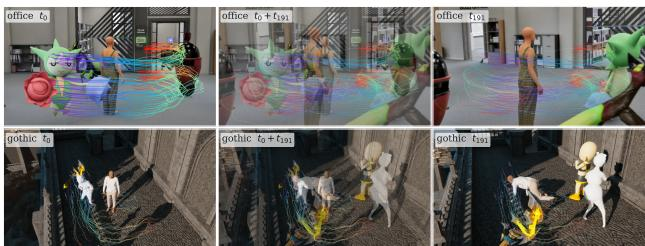  
Fig. 1: Gallileo-4D results. Dynamic 4D reconstruction of two challenge test sequences, ofice (top) and gothic (bottom). Each row shows the reconstruction at the first queried timestamp t0, an α-blend of the first and last, and the last timestamp t191, with the recovered 3D trajectory of every tracked point drawn over the full sequence and coloured by time. The system placed third of 27 teams on the final leaderboard without a single gradient update. A uniform tone curve is applied to the low-light gothic panels for print legibility; no geometry or trajectory is retouched.

Rather than treat this as a tuning problem, we treated it as evidence. Section 3 shows that the two facts have a common cause. The only training data released to us covers one of the four data variants present in the test set; scene identities are disjoint; clips are 50 frames rather than 192 and square rather than widescreen. A local validation set drawn from that training split therefore measures performance on a distribution that accounts for a quarter of the score, and fine-tuning on it is a textbook setting for feature distortion under distribution shift [11].

The resulting system is deliberately unambitious in its learning and aggressive in its inference. We keep the backbone frozen and combine three decoding strategies under a convex weighting selected by a two-parameter grid search. We name it Gallileo-4D, after a countryman who is remembered for writing down what the instrument showed rather than what the theory required.

## Contributions.

A documented negative result: thirteen fine-tuning configurations of a stateof-the-art 4D backbone, twelve of which regress on the challenge metric, reported with per-run learning rates, losses and scores (Sec. 4, Tab. 3).

– An analysis of why local validation inverts in this setting, including an axis that gained +0.0129 locally and lost −0.3443 on the leaderboard, and the operating rule we derived from it (Sec. 3).

– Gallileo-4D, a frozen-backbone inference-time ensemble that reaches third place with no weight updates, together with its full ablation (Sec. 5, 6).

– Characterisation of a scale-collapse failure mode in which raising the inference resolution from 512 to 1008 px drives the predicted scene scale 30× below its expected value (Sec. 4.1).

## 2 Related Work

Feed-forward 3D and 4D reconstruction. DUSt3R [27] and MASt3R [13] established that dense stereo geometry can be regressed in a single forward pass; VGGT [25], Pi3 [28] and Depth Anything 3 [14] scale this to many views. Dynamic extensions difer mainly in how motion is represented, from per-frame geometry on dynamic input [32] and paired point maps [2] to Bézier trajectory fields [15], first-frame-relative motion [7] and dynamic point maps [24]; per-scene optimisation [8,19,26] is accurate but far too slow for a 128-sequence benchmark. Our backbone is 4RC [16], used strictly as a fixed function. The challenge metric is closest to 3D point-tracking benchmarks such as TAPVid-3D [10] and inherits its median-scale alignment; tracking-specific systems [6, 31] are strong on sparse queries but do not produce the dense geometry the challenge also scores.

Fine-tuning under shift, ensembles, adaptive evaluation. That fine-tuning can underperform the frozen features it starts from is documented outside reconstruction: it distorts pre-trained features and degrades out-of-distribution accuracy relative to linear probing [11], which WiSE-FT [30] repairs by interpolating back towards the zero-shot weights. The classical framing is catastrophic interference [18], mitigated by EWC [9] or PackNet [17]; we find a low-rank restriction of the update [4] does not prevent the efect here (Sec. 4). On the aggregation side, averaging independent predictions reduces variance [12] and test-time augmentation applies the idea to input transformations [23]; weight averaging [29] needs several trained checkpoints, which our findings make undesirable, so we ensemble in output space over decoding configurations of a single frozen network. Any selection on a public split is adaptive data analysis [1, 22]; we keep ours two-dimensional and quantify the exposure in Sec. 7.

## 3 Analysis of the Challenge

## 3.1 Setup and metric

The challenge is built on the Syn4D benchmark [5]. The evaluation set contains 128 sequences of 192 frames at 1280 × 720, drawn from four scene families (antiquity, dream, gothic, ofice) and four rendering variants (og, sim, mixed, mixed\_no\_bedlam), 32 sequences per variant. For each sequence, 512 query points defined on a source frame must be localised in world coordinates at 32 target timestamps, giving 2,097,152 predicted 3D positions per submission.

Scoring uses the Average Percentage of points within Distance. Predictions are first aligned to the ground truth by a per-sequence median scale factor

$$
s = \mathrm { m e d i a n } _ { q , t } \frac { \| P _ { q , t } ^ { * } \| _ { 2 } } { \| \hat { P } _ { q , t } \| _ { 2 } } ,\tag{1}
$$

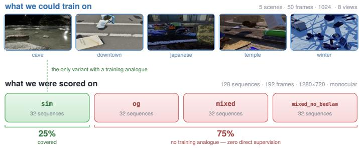  
Fig. 2: What we could train on versus what we were scored on. Top: the five scenes of the released syn4d\_sim split, the only training data available to us. Middle: the evaluation set is divided evenly across four rendering variants, and only sim has a training analogue, leaving three quarters of the distribution without direct supervision. Bottom: the three calibration points we obtained between the local proxy and the challenge score, two of which invert in sign. The SlotTABA bar is truncated at the plot edge; its true value is −0.3443.

after which the fraction of points falling inside a threshold ball is averaged over four thresholds $\delta \in \{ 0 . 1 , 0 . 3 , 0 . 5 , 1 . 0 \}$ m:

$$
\mathrm { A P D } _ { \mathcal { S } } = \frac { 1 } { 4 } \sum _ { \delta } \frac { 1 } { | \mathcal { S } | } \sum _ { ( { q } , t ) \in \mathcal { S } } \mathbf { 1 } \Big [ \| s \hat { P } _ { { q } , t } - P _ { { q } , t } ^ { * } \| _ { 2 } < \delta \Big ] .\tag{2}
$$

The reported score balances all queries against the moving subset, APD = $\mathrm { \frac { 1 } { 2 } ( A P D _ { a l l } + A P D _ { d y n } ) }$ , making it far more sensitive to the small fraction of genuinely dynamic points than a uniform average would be. We reimplemented Eqs. (1)–(2) and verified them against the organisers’ reference implementation with zero deviation. Because Eq. (1) removes any global scale error, the metric is invariant to the overall size of the reconstruction but extremely sensitive to its internal consistency—a property that matters in Sec. 4.1.

## 3.2 A training split covering a quarter of the test set

Table 1 compares the released training split with the evaluation set. Several axes difer, but only one is decisive. The training archive contains a single rendering variant, syn4d\_sim; the test set contains four in equal proportion. We verified this: the released tree exposes only syn4d\_sim/ and sim/, and no additional splits exist on the competition data tab, the participant kit, or the dataset host.

Concretely, 32 of 128 evaluation sequences (25%) are in-distribution with respect to content, and 96 (75%) require cross-variant generalisation for which zero direct supervision exists. Any parameter update that improves the sim quarter at the expense of general geometric priors is therefore a net loss in expectation, and it is a loss that a sim-only validation set cannot see.

Two secondary axes constrain what our proxy can test. Training clips are 50 frames; test sequences are 192. Any inference-time question about temporal windowing—window length, stride, overlap—is thus unanswerable locally, since a 96-frame window does not fit in a 50-frame clip. Field of view, by contrast, turned out not to be a gap. We list it because it was our leading hypothesis before measurement, and it was wrong.

<table><tr><td rowspan="2">Attribute</td><td colspan="2">Split</td></tr><tr><td>syn4d_sim (train)</td><td>challenge (test)</td></tr><tr><td>Frames / clip</td><td>50</td><td>192</td></tr><tr><td>Resolution</td><td>1024×1024</td><td>1280×720</td></tr><tr><td>Aspect ratio</td><td>1:1</td><td>16:9</td></tr><tr><td>Cameras / clip</td><td>8 (multi-view)</td><td>1 (monocular)</td></tr><tr><td>Horiz. FOV</td><td>35-84°</td><td>39.8–89.7°</td></tr><tr><td>Scene families</td><td>5</td><td>4</td></tr><tr><td>Scene overlap</td><td>0%, disjoint names</td><td></td></tr><tr><td>Rendering variants</td><td>1 (sim)</td><td>4, uniform</td></tr><tr><td>Test coverage</td><td>25% of test has a train analogue</td><td></td></tr></table>

Table 1: Training split versus evaluation set. The variant row determines everything else in this paper.

<table><tr><td></td><td colspan="2">Score change</td><td></td></tr><tr><td>Intervention</td><td>local</td><td>leaderb.</td><td>Verdict</td></tr><tr><td>base → geo ckpt</td><td>+0.0078</td><td>+0.0325</td><td>agrees, 4.2×</td></tr><tr><td>geo → SlotTABA</td><td>+0.0129</td><td>-0.3443</td><td>false positive</td></tr><tr><td>geo → fine-tune</td><td>+0.035</td><td>-0.030</td><td>false positive</td></tr></table>

Table 2: Every calibration point obtained between the local proxy and the challenge leaderboard. Two of three are sign-inconsistent; the fine-tuning row is the mean over the twelve regressing runs of Tab. 3.

## 3.3 Local validation inverts

We built a local proxy from 31 held-out syn4d\_sim sequences with reconstructed ground truth, and measured its resolution before trusting it. Recovering a query’s 3D position two ways—direct depth unprojection versus face-identifier centroid— gives a median disagreement of 4.3 mm and a 95th percentile of 1.6 cm, comfortably inside the finest 0.1 m threshold. However, face-identifier persistence across frames is weak: only 16–57% of (query, frame) cells match successfully after the first frame, with a mean of ∼25%. The efective sample size for the dynamic half of the metric is therefore about a quarter of nominal, and we treat any local delta below 0.005 APD as noise.

Table 2 lists every calibration point we obtained. The single agreeing point, a checkpoint swap, showed a leaderboard gain 4.2× larger than the local gain— already enough to make the proxy useless as a magnitude estimator. The two disagreeing points are worse. A slot-based temporal aggregation module raised the local score by +0.0129 and dropped the leaderboard score from 0.512 to

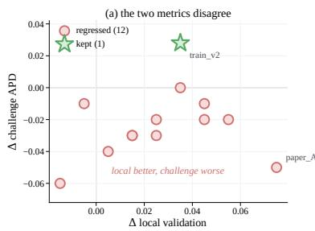

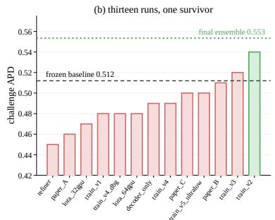  
Fig. 3: Thirteen training runs, one survivor. (a) Change in local validation against change in challenge APD, both relative to the frozen baseline. Eleven runs land above the horizontal axis on the local proxy and below it on the challenge metric. Only train\_v2 reaches the positive quadrant. (b) Absolute challenge score per run, annotated with learning rate; the dashed line is the frozen baseline the runs were supposed to beat, and the dotted line is the final ensemble, which uses no training at all.

0.177, a loss of −0.3443; it had been accepted locally because the acceptance test scored bearing consistency, which the module optimised, while silently destroying the depth structure the metric depends on.

From three points we adopted the only rule they support, and followed it for the rest of the competition:

Operating rule. Local validation is a regression veto, never a promotion gate. A configuration that scores worse locally is blocked. A configuration that scores equal or better becomes eligible for evaluation on the public split; it is never assumed to be an improvement.

This rule is cheap to state and expensive to follow: it converts the local proxy from a decision procedure into a filter, and defers final judgement to the public split on the held-out score. We believe it is nonetheless the correct rule whenever the validation split covers a minority of the evaluation distribution.

## 4 What Did Not Work

This section is the part of our submission we consider most useful to other participants, because it is the part that consumed most of the compute. Table 3 lists all thirteen runs. Training used the challenge metric’s diferentiable surrogate,

$$
\mathcal { L } _ { \mathrm { s o f t } } = 1 - \frac { 1 } { | \mathcal { T } | } \sum _ { \delta } \sum _ { i } \sigma \left( \frac { \delta - \| \hat { P } _ { i } ^ { \mathrm { a l n } } - P _ { i } ^ { * } \| _ { 2 } } { \tau } \right) ,\tag{3}
$$

with $\tau = 0 . 0 5$ and $\hat { P } ^ { \mathrm { a l n } }$ the scale-aligned prediction. Because Eq. (1) makes the scale itself a function of the prediction, backpropagating through it is unstable; we therefore detach it,

$$
s = { \frac { \langle \mathrm { s g } ( { \hat { P } } ) , P ^ { * } \rangle } { \| \mathrm { s g } ( { \hat { P } } ) \| _ { 2 } ^ { 2 } } } , \qquad { \hat { P } } ^ { \mathrm { a l n } } = { \hat { P } } \cdot \mathrm { s g } ( s ) ,\tag{4}
$$

<table><tr><td>Run</td><td>Adapted part</td><td>LR</td><td>ep.</td><td>local</td><td>chall.</td><td>Δ vs. frozen</td></tr><tr><td colspan="7">Naïve fine-tuning</td></tr><tr><td>train_v1</td><td>full network</td><td> $5 \times 1 0 ^ { - 5 }$ </td><td>1</td><td>0.42</td><td>0.48</td><td>-0.032</td></tr><tr><td>train_v2</td><td>full network</td><td> $5 \times 1 0 ^ { - 6 }$ </td><td>1</td><td>0.44</td><td>0.54</td><td>+0.028</td></tr><tr><td>train_v3</td><td>full network</td><td> $5 \times 1 0 ^ { - 6 }$ </td><td>3</td><td>0.46</td><td>0.52</td><td>+0.008</td></tr><tr><td>train_v4</td><td>full, scale-dec.</td><td> $1 \times 1 0 ^ { - 5 }$ </td><td>1</td><td>0.45</td><td>0.49</td><td>-0.022</td></tr><tr><td>train_v4d</td><td>full, scale-dec.</td><td> $1 \times 1 0 ^ { - 5 }$ </td><td>1</td><td>0.43</td><td>0.48</td><td>-0.032</td></tr><tr><td>train_v5</td><td>full network</td><td> $1 \times 1 0 ^ { - 7 }$ </td><td>1</td><td>0.40</td><td>0.50</td><td>-0.012</td></tr><tr><td colspan="7">Aggressive schedules</td></tr><tr><td>paper_A</td><td>full network</td><td> $1 \times 1 0 ^ { - 4 }$ </td><td>5</td><td>0.48</td><td>0.46</td><td>-0.052</td></tr><tr><td>paper_B</td><td>full network</td><td> $1 \times 1 0 ^ { - 6 }$ </td><td>2</td><td>0.44</td><td>0.51</td><td>-0.0021</td></tr><tr><td>paper_C</td><td>full, cosine</td><td> $5 \times 1 0 ^ { - 6 }$ </td><td>2</td><td>0.45</td><td>0.50</td><td>-0.012</td></tr><tr><td colspan="7">Parameter-efficient adaptation</td></tr><tr><td>lora_32</td><td>LoRA, rank 16</td><td> $1 \times 1 0 ^ { - 4 }$ </td><td>1</td><td>0.41</td><td>0.47</td><td>-0.042</td></tr><tr><td>lora_64</td><td>LoRA, rank 32</td><td> $5 \times 1 0 ^ { - 5 }$ </td><td>1</td><td>0.42</td><td>0.48</td><td>-0.032</td></tr><tr><td colspan="7">Lightweight refinement</td></tr><tr><td>refiner</td><td>added MLP head</td><td> $1 \times 1 0 ^ { - 3 }$ </td><td>1</td><td>0.39</td><td>0.45</td><td>-0.062</td></tr><tr><td>decoder</td><td>decoder only</td><td> $5 \times 1 0 ^ { - 5 }$ </td><td>1</td><td>0.43</td><td>0.49</td><td>-0.022</td></tr><tr><td>none</td><td>frozen + ensemble</td><td></td><td></td><td></td><td>0.553</td><td>+0.041</td></tr></table>

Table 3: All thirteen training runs, with the frozen inference-time ensemble in the last row for reference. Bars are drawn to scale; green is a gain over the frozen geofinetune baseline at 0.512 APD, red a loss. Only train\_v2 and train\_v3 gained, and only train\_v2 by more than noise — while paper\_A took the best local score of the study. Local scores are soft-APD on the 31-sequence sim proxy and are not comparable in absolute value to the challenge column.

with sg(·) the stop-gradient. This scale-decoupled formulation did stabilise optimisation. It did not improve the leaderboard.

Naïve fine-tuning. Learning rate behaves monotonically and in the wrong direction: $5 \times 1 0 ^ { - 5 }$ costs −0.032, $5 \times 1 0 ^ { - 6 }$ gains +0.028, and $1 \times 1 0 ^ { - 7 }$ costs −0.012 by learning nothing while still perturbing batch statistics. Extending train\_v2 from one epoch to three (train\_v3) raises the local score from 0.44 to 0.46 and lowers the challenge score from 0.54 to 0.52. This is the cleanest single instance of the inversion: the additional epochs measurably fit the sim variant and measurably damage the rest.

Aggressive schedules. paper\_A, at $1 \times 1 0 ^ { - 4 }$ for five epochs, achieves the best local score of any run (0.48) and the second-worst challenge score (0.46). If one had been selecting on local validation, this is the checkpoint one would have shipped.

Parameter-eficient adaptation. We expected LoRA to help, since restricting the update to a low-rank subspace is a standard defence against forgetting. It did not: rank 16 at $1 \times 1 0 ^ { - 4 }$ costs −0.042 and rank 32 at $5 \times 1 0 ^ { - 5 }$ costs −0.032, both worse than full fine-tuning at a comparable learning rate. We read this as evidence that the problem is not the capacity of the update but its objective—a low-rank direction that reduces loss on sim is still a direction away from the features the other three variants need.

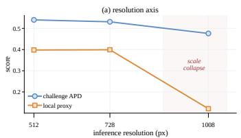

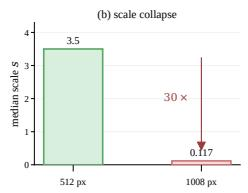  
Fig. 4: The resolution axis and its failure mode. (a) Local and challenge scores against inference resolution. (b) At 1008 px the geometry head emits predictions whose median scale is 0.117 against an expected 3.5, a collapse that median alignment cannot repair because it is not globally consistent.

Lightweight refinement. Freezing the backbone and training only an added MLP refinement head produced the single worst result of the study (−0.062). Training only the decoder with a frozen encoder cost −0.022. Both confirm that the damage does not require touching the encoder.

## 4.1 Scale collapse

One axis failed for a mechanically diferent and instructive reason. Raising the inference resolution is normally a safe way to gain accuracy. Here it destroys the prediction: at 1008 px the local score falls from 0.398 to 0.121 and the challenge score from 0.540 to 0.476. The cause is visible in the raw outputs. The median per-sequence scale factor of Eq. (1) moves from 3.5 at 512 px to 0.117 at 1008 px (Fig. 4b), i.e. the geometry head emits depths roughly 30× smaller than expected. The checkpoint was never trained at that resolution—the backbone’s own protocol samples long edges $\mathrm { u p }$ to 504 px—and the metric’s global median alignment cannot rescue it, because the collapse is not a single global factor but varies across the scene. Adding 1008 px predictions to our ensemble lowered the final score from 0.55345 to 0.54923, so we excluded the axis entirely.

## 5 Method: Gallileo-4D

## 5.1 Base model

We use 4RC [16] with the public geofinetune checkpoint as $f _ { \theta }$ , keeping θ fixed. Its encoder is a DINOv2-initialised ViT-G [20] pre-trained on a mixture of dynamic and static corpora including PointOdyssey [33] and Kubric [3], none of which overlaps the challenge scenes. Given a window of frames $\gamma = \{ I _ { i } \}$ , the backbone encodes once and decodes the position of query $q$ at target time τ as a base geometry plus a displacement,

$$
\begin{array} { r } { \hat { P } _ { q } ^ { t _ { q }  \tau } = \hat { P } _ { q } ^ { t _ { q } } + \varDelta \hat { P } _ { q } ^ { t _ { q }  \tau } . } \end{array}\tag{5}
$$

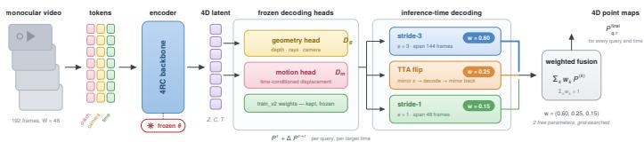  
Fig. 5: Model architecture of Gallileo-4D. The video is patchified into per-frame patch, camera and time tokens and encoded once by the frozen 4RC backbone into the 4D latent F. Frozen geometry and motion heads decode a base point map plus a displacement for any (query, target time) pair; the same frozen network is evaluated under three inference-time decoding configurations, and their point maps are averaged with fixed weights. No parameter is updated at any stage: the only fitted quantities in the entire system are the three fusion weights w.

The 192-frame sequences are processed with a sliding window of $W = 4 8$ frames at 512 px, the resolution the checkpoint was trained for. Prediction heads from train\_v2, the one surviving run of Sec. 4, are used in place of the released heads; these are also frozen. Figure 5 shows the resulting system.

## 5.2 Why freeze

Three properties of this challenge make a frozen backbone the right default rather than a fallback. (i) The training distribution covers 25% of the evaluation distribution (Sec. 3.2), so the expected value of a gradient step is negative once the damage to the uncovered 75% is priced in. (ii) Local validation cannot detect that damage (Sec. 3.3), so there is no mechanism to stop early. (iii) Empirically, twelve of thirteen attempts regressed (Sec. 4). Freezing converts an unbounded and unobservable risk into a fixed, known baseline of 0.512, and lets the remaining budget be spent on interventions whose efect is directly measurable on the evaluation of record.

## 5.3 Decoding configurations

We evaluate the same frozen network under three decoding configurations chosen to make diferent errors rather than better ones (Fig. 6).

Stride-3 $( w _ { 1 } = 0 . 6 0 )$ . Every third frame enters the window, so a single window spans 144 source frames. Long temporal context is the regime in which the backbone’s global attention is most useful, and this configuration is the strongest individually (0.543).

Horizontal-flip TTA $( w _ { 2 } = 0 . 2 5 )$ . The window is mirrored, decoded, and the resulting point maps are mirrored back, $\hat { P } ^ { ( 2 ) } = \mathcal { F } ^ { - 1 } ( f _ { \theta } ( \mathcal { F } ( \mathcal { V } ) ) )$ ), with $\mathcal { F }$ the horizontal flip acting on the x axis of the world frame. This axis was blocked by our local proxy, which showed a −0.0021 regression with 18 of 31 sequences worse; under the veto rule of Sec. 3.3 a regression blocks promotion, and we submitted it only after the frozen-backbone reading of Sec. 3 made us re-examine axes the proxy had rejected. It gains +0.003.

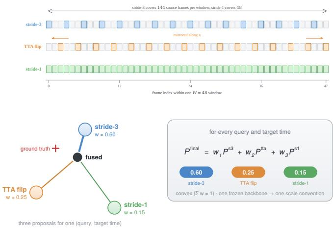  
Fig. 6: The three decoding configurations, and how they combine. Top: which frames each configuration admits inside one W=48 window. Stride-3 admits every third frame and so reaches 144 source frames of temporal context; stride-1 admits all 48 and maximises temporal resolution instead; the TTA branch runs the stride-3 pattern on a horizontally mirrored window and mirrors the predicted point maps back. The three therefore make errors that are only weakly correlated, which is what the fusion exploits. Bottom: for each query q and target time τ the three configurations propose three world-space positions, and the submitted prediction is their fixed convex combination. Averaging in world coordinates is meaningful only because all three share the frozen backbone, and therefore one scale convention.

Stride-1 $( w _ { 3 } = 0 . 1 5 )$ . Every frame enters the window, maximising temporal resolution at the cost of context length. Alone it is weaker than stride-3, but its errors on fast motion are largely uncorrelated, which is what the ensemble exploits: its marginal contribution (+0.009) is three times that of TTA despite the smaller weight.

## 5.4 Fusion and weight optimisation

The three predictions are combined per query and timestamp (Fig. 6),

$$
\begin{array} { r } { \hat { P } _ { q , \tau } ^ { \mathrm { f i n a l } } = w _ { 1 } \hat { P } _ { q , \tau } ^ { \mathrm { s 3 } } + w _ { 2 } \hat { P } _ { q , \tau } ^ { \mathrm { t t a } } + w _ { 3 } \hat { P } _ { q , \tau } ^ { \mathrm { s 1 } } , \quad \sum _ { k } w _ { k } = 1 . } \end{array}\tag{6}
$$

The simplex has two free parameters. Because the local proxy cannot rank configurations (Sec. 3.3), we selected them with a small coarse-to-fine grid evaluated on the public split, first along the $w _ { 3 } ~ = ~ 0$ edge, then over the interior once stride-1 predictions were available. The optimum sits at (0.60, 0.25, 0.15) and, importantly, the surface is flat around it: the eight best configurations lie within 0.0015 APD of each other (Fig. 7b). The result is therefore insensitive to the exact triple, and Sec. 7 bounds the residual selection efect.

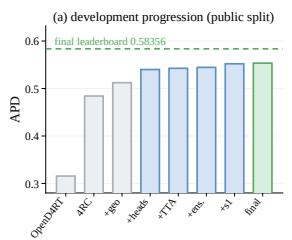

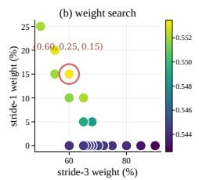

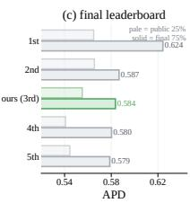

Fig. 7: Results. (a) Public-split score after each accepted change during development, from the organisers’ OpenD4RT baseline to our submitted system; grey bars are public baselines, blue are inference-time changes, green is the submitted entry, and the dashed line is the score that entry finally received on the private split. (b) The ensemble weight search of Eq. (6); the optimum is circled and the surface around it is flat. (c) Final leaderboard: pale bars the public 25%, solid the final 75%; other entries unnamed.
<table><tr><td colspan="2"></td><td colspan="2">APD ↑</td><td></td></tr><tr><td>Rank</td><td>Entry</td><td>public</td><td>final</td><td>Δ</td></tr><tr><td>1</td><td>anonymised</td><td>0.56496</td><td>0.62426</td><td>+0.0593</td></tr><tr><td>2</td><td>anonymised</td><td>0.56557</td><td>0.58667</td><td>+0.0211</td></tr><tr><td>3</td><td>OdaxAI (ours)</td><td>0.55513</td><td>0.58356</td><td>+0.0284</td></tr><tr><td>4</td><td>anonymised</td><td>0.54082</td><td>0.58024</td><td>+0.0394</td></tr><tr><td>5</td><td>anonymised</td><td>0.54455</td><td>0.57876</td><td>+0.0342</td></tr><tr><td></td><td>4RC public submission</td><td>0.48419</td><td>0.51142</td><td>+0.0272</td></tr><tr><td></td><td>organisers&#x27; OpenD4RT baseline</td><td>0.31564</td><td>0.32217</td><td>+0.0065</td></tr></table>

Table 4: Final leaderboard, top five. The public column is scored on approximately 25% of the test data and the final column on the remaining 75%. Identities are withheld; only our own entry is named. Our submitted system moved up one place between the two, and the configuration analysed in Sec. 5 and ablated in Tab. 5 is the one scored here.

## 6 Experiments

Setup. Training consumed roughly 1,000 GPU-hours and produced one usable artefact; inference consumed 168 GPU-hours and produced the submission.

## 6.1 Main results

Table 4 gives the final standings alongside the public ones, and the comparison is the most informative result in this paper. Every entry scored higher on the private 75% than on the public 25%, so the two splits are not interchangeable in absolute terms. What matters is the relative movement: our entry gained +0.0284 and rose one place, while the entries immediately below us on the public split gained +0.0394 and +0.0342 and stayed below. The system did not degrade when the evaluation set grew fourfold.

This is a direct test of the prediction we made in Sec. 7 before the private split was released: that the ensemble gain would survive because the weight surface is flat and the selection was two-dimensional. It did. We note the converse honestly — the first-place entry gained +0.0593, twice our movement, which is the signature of a method that was under selected on the public split rather than over-selected on it. Whatever they did, they left more on the table publicly than we did, and it was not leaderboard fitting.

<table><tr><td rowspan="2">Configuration</td><td colspan="2">Fusion weights</td><td rowspan="2">APD ↑</td></tr><tr><td>W1</td><td>W2 W3</td></tr><tr><td>OpenD4RT baseline 4RC, released ckpt + geofinetune + train_v2 heads</td><td></td><td></td><td>0.31564 0.48419 0.51234</td></tr><tr><td>stride-3 only + TTA + TTA</td><td>1.00 0.70 0.30</td><td></td><td>0.54256 0.54452</td></tr><tr><td> $+ \ \mathrm { T T A } + \mathrm { s t r i d e } { - 1 }$ </td><td>0.68 0.32 0.68 0.27</td><td>0.05</td><td>0.54455 0.54846</td></tr><tr><td> $+ \ \mathrm { T T A } + \mathrm { s t r i d e } { - 1 }$ </td><td>0.65 0.25</td><td>0.10</td><td>0.55206</td></tr><tr><td>Gallileo-4D</td><td>0.60 0.25</td><td>0.15</td><td></td></tr><tr><td></td><td></td><td></td><td>0.55345</td></tr><tr><td> $+ \ \mathrm { T T A } + \mathrm { s t r i d e } { - 1 }$ </td><td>0.25</td><td></td><td></td></tr><tr><td></td><td>0.55</td><td>0.20</td><td>0.55298</td></tr><tr><td></td><td></td><td></td><td></td></tr><tr><td> $+ \ \mathrm { T T A } + \mathrm { s t r i d e } { - 1 }$ </td><td>0.50 0.25</td><td>0.25</td><td></td></tr><tr><td></td><td></td><td></td><td>0.55201</td></tr><tr><td></td><td></td><td></td><td></td></tr><tr><td>+ res-1008 branch</td><td>4-way</td><td></td><td>0.54923</td></tr></table>

Table 5: Ablation of the ensemble. All rows use the same frozen backbone; only the decoding configurations and their weights change. Best and second best. The four-way row adds the collapsed 1008 px branch of Sec. 4.1 and was rejected.

## 6.2 Ablation

Table 5 decomposes the final score. The frozen pipeline reaches 0.54001 before any ensembling. Fusion then adds +0.01344, which is larger than the contribution of every training run in Tab. 3 combined, and was obtained for the cost of two extra forward passes per sequence.

The internal structure of that gain is worth noting. Along the two-component edge the score saturates quickly—w1 from 0.90 to 0.68 buys only +0.002, and the optimum at 0.68/0.32 is barely distinguishable from 0.70/0.30. Introducing the third component breaks the saturation: 5% of stride-1 weight adds +0.004, 10% adds +0.0072, and 15% adds +0.0089, after which the curve turns over. Diversity of temporal sampling, not the quality of any individual pass, is what the ensemble is buying.

## 6.3 Qualitative results

Figure 1 shows two challenge test sequences at the first and last queried timestamps, and Fig. 8 shows the same reconstructions at higher magnification. The frozen backbone recovers coherent static geometry and temporally smooth trajectories for the dynamic content in both the bright and the low-light regime.

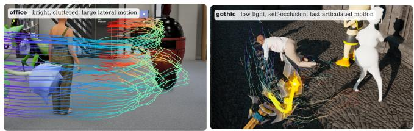  
Fig. 8: Reconstruction detail on two test sequences. Left, ofice: a bright cluttered interior with large lateral motion, where trajectories stay smooth and separated even as actors cross. Right, gothic: low light, self-occlusion and fast articulated motion; bundles stay coherent through the occlusion, but tracks on the fastest limb fan out, which is where the residual error concentrates.

Residual artefacts are of two kinds. Trajectories belonging to the fastest-moving limbs fan out near their endpoints, which is consistent with the limitations reported for the backbone on chaotic motion. And thin planar slivers appear in the reconstructed background of the ofice scene, the signature of the base geometry losing depth resolution at distance on low-texture surfaces; we leave both visible rather than crop them away.

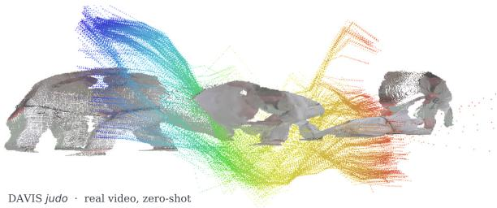  
Fig. 9: Zero-shot transfer to real video. The frozen pipeline applied unchanged to the judo sequence of DAVIS [21]: reconstructed geometry with the dense 3D motion field of the throw, coloured by time. Neither the decoding heads nor the fusion weights were touched, and the system was never trained or tuned on real footage. The figure is qualitative only—DAVIS provides no metric 4D ground truth—but it shows that nothing in the recipe is specific to the synthetic benchmark.

Beyond the benchmark. The system contains no weights fitted to this challenge beyond three fusion scalars, so it should transfer to data it has never seen. Figure 9 applies the pipeline unchanged to a real video from DAVIS [21]: the recovered motion field follows the articulated throw through contact and partial occlusion. We show one sequence and claim nothing quantitative from it.

## 7 Discussion

Why fine-tuning fails here. The mechanism matches the account of Kumar et al. [11]: gradient descent on a narrow slice of the target distribution moves features away from the configuration supporting the rest of it, while the loss on that slice falls throughout. The challenge supplies an unusually stark version— the covered slice is exactly 25%, the uncovered variants are rendered diferently rather than merely sampled diferently, and the only validation data available comes from the covered slice. We would therefore expect the inversion of Fig. 3a to be reproducible rather than incidental. A WiSE-FT-style interpolation [30] towards the released weights is the obvious untried remedy.

The same critique applies to us. The public leaderboard on which we selected w is itself computed on approximately 25% of the test data. The symmetry with our central finding is exact, and we would rather state it than let a reader discover it: the argument we make against our local proxy applies, in weaker form, to the signal we replaced it with.

Two things make the weaker form genuinely weaker. The public split is a random subset of the same distribution, whereas our local proxy was a diferent rendering variant—a covariate shift, not a sampling error. And the selection is two-dimensional on a simplex, far below the dimensionality at which publicsplit overfitting is typically observed [1, 22], with a flat objective: the eight best configurations span 0.0015 APD. We therefore expected the ensemble gain of +0.041 to survive on the private split and the third decimal of the specific triple not to; Sec. 6 reports that it did.

Cost and limitations. The system runs the backbone three times per sequence, so a submission costs about 3× a single pass; acceptable for an ofline benchmark, not for deployment, where the honest comparison is the 0.54001 single-pass baseline rather than the top of the leaderboard. Our conclusions come from one benchmark with one backbone, and the weights are selected on one public split. The 1,000 GPU-hours were not an exhaustive search: we did not try weightspace interpolation, variant-conditional adaptation, or synthesising the missing variants. We report that fine-tuning failed for us under thirteen configurations, not that it cannot succeed.

## 8 Conclusions

We placed third of 27 teams on the final leaderboard of the PhysAI Dynamic 4D Reconstruction Challenge with a system containing no weights of our own. Twelve of thirteen fine-tuning configurations degraded the challenge score while improving local validation, because the released training split covers a quarter of the evaluation distribution and the local proxy is drawn from that same quarter. Freezing the backbone and spending the budget on inference-time diversity recovered +0.041 APD, more than any training run produced. The lesson is about measurement rather than architecture: a validation signal covering a minority of the evaluation distribution stops estimating performance and starts estimating overfitting to that minority, and the two are hard to tell apart from inside a caution that applies to the public leaderboard as much as to our local proxy. Code and logs: https://github.com/odaxai/Gallileo-4D.

Acknowledgements. We thank the PhysAI organisers for the Syn4D benchmark and the 4RC authors for their checkpoints.

## References

1. Dwork, C., Feldman, V., Hardt, M., Pitassi, T., Reingold, O., Roth, A.: The reusable holdout: Preserving validity in adaptive data analysis. Science 349(6248), 636–638 (2015). https://doi.org/10.1126/science.aaa9375

2. Feng, H., Zhang, J., Wang, Q., Ye, Y., Yu, P., Black, M.J., Darrell, T., Kanazawa, A.: St4RTrack: Simultaneous 4d reconstruction and tracking in the world. In: ICCV (2025). https://doi.org/10.48550/arXiv.2504.13152

3. Gref, K., Belletti, F., Beyer, L., Doersch, C., Du, Y., et al.: Kubric: A scalable dataset generator. In: CVPR (2022). https://doi.org/10.1109/CVPR52688. 2022.00373

4. Hu, E.J., Shen, Y., Wallis, P., Allen-Zhu, Z., Li, Y., Wang, S., Wang, L., Chen, W.: LoRA: Low-rank adaptation of large language models. In: ICLR (2022). https: //doi.org/10.48550/arXiv.2106.09685

5. Jiang, Z., Lan, Y., Luo, Y., Deng, Y., Lai, Z., Sucar, E., Rupprecht, C., Laina, I., Larlus, D., Zheng, C., Vedaldi, A.: Syn4d: A multiview synthetic 4d dataset. arXiv preprint arXiv:2605.05207 (2026). https://doi.org/10.48550/arXiv.2605.05207

6. Karaev, N., Rocco, I., Graham, B., Neverova, N., Vedaldi, A., Rupprecht, C.: CoTracker: It is better to track together. In: ECCV (2024). https://doi.org/10. 48550/arXiv.2307.07635

7. Karhade, J., Keetha, N., Zhang, Y., Gupta, T., Sharma, A., Scherer, S., Ramanan, D.: Any4d: Unified feed-forward metric 4d reconstruction. arXiv preprint arXiv:2512.10935 (2025). https://doi.org/10.48550/arXiv.2512.10935

8. Kerbl, B., Kopanas, G., Leimkühler, T., Drettakis, G.: 3d gaussian splatting for real-time radiance field rendering. ACM Transactions on Graphics 42(4) (2023). https://doi.org/10.1145/3592433

9. Kirkpatrick, J., Pascanu, R., Rabinowitz, N., Veness, J., Desjardins, G., Rusu, A.A., Milan, K., Quan, J., Ramalho, T., Grabska-Barwinska, A., et al.: Overcoming catastrophic forgetting in neural networks. Proceedings of the National Academy of Sciences 114(13), 3521–3526 (2017). https://doi.org/10.1073/pnas.1611835114

10. Koppula, S., Rocco, I., Yang, Y., Heyward, J., Carreira, J., Zisserman, A., Brostow, G., Doersch, C.: TAPVid-3D: A benchmark for tracking any point in 3d. In: NeurIPS (2024). https://doi.org/10.48550/arXiv.2407.05921

11. Kumar, A., Raghunathan, A., Jones, R., Ma, T., Liang, P.: Fine-tuning can distort pretrained features and underperform out-of-distribution. In: ICLR (2022). https: //doi.org/10.48550/arXiv.2202.10054

12. Lakshminarayanan, B., Pritzel, A., Blundell, C.: Simple and scalable predictive uncertainty estimation using deep ensembles. In: NeurIPS (2017). https://doi. org/10.48550/arXiv.1612.01474

13. Leroy, V., Cabon, Y., Revaud, J.: Grounding image matching in 3d with MASt3R. In: ECCV (2024). https://doi.org/10.1007/978-3-031-73220-1\_5

14. Lin, H., Chen, S., Liew, J.H., Chen, D.Y., Li, Z., Shi, G., Feng, J., Kang, B.: Depth anything 3: Recovering the visual space from any views. arXiv preprint arXiv:2511.10647 (2025). https://doi.org/10.48550/arXiv.2511.10647

15. Liu, X., Xiao, Y., Chen, D.Y., Feng, J., Tai, Y.W., Tang, C.K., Kang, B.: Trace anything: Representing any video in 4d via trajectory fields. arXiv preprint (2025). https://doi.org/10.48550/arXiv.2510.13802

16. Luo, Y., Zhou, S., Lan, Y., Pan, X., Loy, C.C.: 4rc: 4d reconstruction via conditional querying anytime and anywhere. arXiv preprint arXiv:2602.10094 (2026). https: //doi.org/10.48550/arXiv.2602.10094

17. Mallya, A., Lazebnik, S.: PackNet: Adding multiple tasks to a single network by iterative pruning. In: CVPR (2018). https://doi.org/10.1109/CVPR.2018.00810

18. McCloskey, M., Cohen, N.J.: Catastrophic interference in connectionist networks: The sequential learning problem. In: Psychology of Learning and Motivation, vol. 24, pp. 109–165. Academic Press (1989). https://doi.org/10.1016/S0079- 7421(08)60536-8

19. Mildenhall, B., Srinivasan, P.P., Tancik, M., Barron, J.T., Ramamoorthi, R., Ng, R.: NeRF: Representing scenes as neural radiance fields for view synthesis. In: ECCV (2020). https://doi.org/10.1007/978-3-030-58452-8\_24

20. Oquab, M., Darcet, T., Moutakanni, T., Vo, H.V., Szafraniec, M., Khalidov, V., et al.: DINOv2: Learning robust visual features without supervision. arXiv preprint arXiv:2304.07193 (2023). https://doi.org/10.48550/arXiv.2304.07193

21. Perazzi, F., Pont-Tuset, J., McWilliams, B., Van Gool, L., Gross, M., Sorkine-Hornung, A.: A benchmark dataset and evaluation methodology for video object segmentation. In: CVPR (2016). https://doi.org/10.1109/CVPR.2016.85

22. Recht, B., Roelofs, R., Schmidt, L., Shankar, V.: Do ImageNet classifiers generalize to ImageNet? In: ICML (2019). https://doi.org/10.48550/arXiv.1902.10811

23. Shanmugam, D., Blalock, D., Balakrishnan, G., Guttag, J.: Better aggregation in test-time augmentation. In: ICCV (2021). https://doi.org/10.1109/ICCV48922. 2021.00125

24. Sucar, E., Insafutdinov, E., Lai, Z., Vedaldi, A.: V-dpm: 4d video reconstruction with dynamic point maps. arXiv preprint arXiv:2601.09499 (2026). https://doi. org/10.48550/arXiv.2601.09499

25. Wang, J., Chen, M., Karaev, N., Vedaldi, A., Rupprecht, C., Novotny, D.: VGGT: Visual geometry grounded transformer. In: CVPR (2025). https://doi.org/10. 48550/arXiv.2503.11651

26. Wang, Q., Ye, V., Gao, H., Austin, J., Li, Z., Kanazawa, A.: Shape of motion: 4d reconstruction from a single video. arXiv preprint arXiv:2407.13764 (2024). https://doi.org/10.48550/arXiv.2407.13764

27. Wang, S., Leroy, V., Cabon, Y., Chidlovskii, B., Revaud, J.: DUSt3R: Geometric 3d vision made easy. In: CVPR (2024). https://doi.org/10.48550/arXiv.2312. 14132

28. Wang, Y., Zhou, J., Zhu, H., Chang, W., Zhou, Y., Li, Z., Chen, J., Pang, J., Shen, C., He, T.: Pi3: Permutation-equivariant visual geometry learning. arXiv preprint arXiv:2507.13347 (2025). https://doi.org/10.48550/arXiv.2507.13347

29. Wortsman, M., Ilharco, G., Gadre, S.Y., Roelofs, R., Gontijo-Lopes, R., Morcos, A.S., Namkoong, H., Farhadi, A., Carmon, Y., Kornblith, S., Schmidt, L.: Model soups: Averaging weights of multiple fine-tuned models improves accuracy without increasing inference time. In: ICML (2022). https://doi.org/10.48550/arXiv. 2203.05482

30. Wortsman, M., Ilharco, G., Kim, J.W., Li, M., Kornblith, S., Roelofs, R., Lopes, R.G., Hajishirzi, H., Farhadi, A., Namkoong, H., Schmidt, L.: Robust fine-tuning of zero-shot models. In: CVPR (2022). https://doi.org/10.48550/arXiv.2109. 01903

31. Xiao, Y., Wang, Q., Zhang, S., Xue, N., Peng, S., Shen, Y., Zhou, X.: Spatial-Tracker: Tracking any 2d pixels in 3d space. In: CVPR (2024). https://doi.org/ 10.48550/arXiv.2404.04319

32. Zhang, J., Herrmann, C., Hur, J., Jampani, V., Darrell, T., Cole, F., Sun, D., Yang, M.H.: MonST3R: A simple approach for estimating geometry in the presence of motion. In: ICLR (2025). https://doi.org/10.48550/arXiv.2410.03825

33. Zheng, Y., Harley, A.W., Shen, B., Wetzstein, G., Guibas, L.J.: PointOdyssey: A large-scale synthetic dataset for long-term point tracking. In: ICCV (2023). https://doi.org/10.48550/arXiv.2307.15055