# HandMvNet: Real-Time 3D Hand Pose Estimation Using Multi-View Cross-Attention Fusion

Muhammad Asad Ali1,2, Nadia Robertini1 and Didier Stricker1,2

1Augmented Vision Group, German Research Center for Artificial Intelligence (DFKI), Kaiserslautern, Germany 2Department of Computer Science, University of Kaiserslautern-Landau (RPTU), Kaiserslautern, Germany {firstname middlename.lastname}@dfki.de

Keywords: Hand Reconstruction, Hand Pose Estimation, Multi-view Reconstruction.

## Abstract:

In this work, we present HandMvNet, one of the first real-time method designed to estimate 3D hand motion and shape from multi-view camera images. Unlike previous monocular approaches, which suffer from scale-depth ambiguities, our method ensures consistent and accurate absolute hand poses and shapes. This is achieved through a multi-view attention-fusion mechanism that effectively integrates features from multiple viewpoints. In contrast to previous multi-view methods, our approach eliminates the need for camera param eters as input to learn 3D geometry. HandMvNet also achieves a substantial reduction in inference time while delivering competitive results compared to the state-of-the-art methods, making it suitable for real-time ap plications. Evaluated on publicly available datasets, HandMvNet qualitatively and quantitatively outperforms previous methods under identical settings. Code is available at github.com/pyxploiter/HandMvNet.

## 1 INTRODUCTION

3D hand pose estimation has emerged as a important research area in computer vision with applications across fields like augmented reality (AR), virtual reality (VR), and robotics. The ability to accurately capture and reconstruct hand movements holds immense potential in enhancing human-computer interaction, enabling more natural, intuitive gesture-based controls. In AR and VR, realistic and responsive hand pose estimation enriches immersive experiences, allowing users to interact seamlessly with virtual environments. Similarly, in robotics, precise hand pose estimation is important for tasks such as robotic hand retargeting, where robotic hands mimic human movements to perform intricate tasks.

Traditional approaches in 3D hand pose estimation have primarily relied on single-view images (Boukhayma et al., 2019; Chen et al., 2021a,b; Ge et al., 2019; Moon and Lee, 2020; Park et al., 2022). However, 3D hand pose estimation from monocular views presents several challenges. Depth and scale ambiguity, where the exact distance and size of the hand from the camera are difficult to determine, significantly complicates the estimation process. Consequently, many approaches only estimate root-relative hand vertices (Moon and Lee, 2020; Ge et al., 2019; Zhou et al., 2020). Occlusions, caused by the overlapping of fingers or the hand being partially obscured by other objects, further add to the complexity of accurately estimating hand poses (Park et al., 2022). Additionally, varying perspectives and unknown camera viewpoints introduce uncertainties that make the task more challenging.

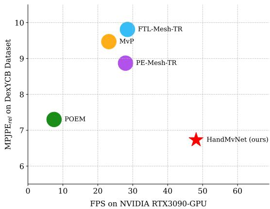  
Figure 1: Comparison of error vs. inference speed across different methods. Our approach outperforms other methods in both inference speed and accuracy.

To address the limitations associated with monocular views, multi-view setups have been proposed as a solution (Yu et al., 2021; Chao et al., 2021; Yang et al., 2022; Hampali et al., 2020). A multi-view setup, consisting of multiple cameras positioned at different angles around the hand, can significantly reduce the impact of occlusions and depth ambiguities, enabling more accurate and robust estimation of hand poses and shapes at absolute 3D locations. Most multi-view approaches (Guan et al., 2006; Yang et al., 2023; Zheng et al., 2023) are computationally expensive, primarily due to the increased input space and architectural design choices that prioritize qualitative results over computational efficiency.

In this work, we propose HandMvNet, a novel neural network architecture for efficient and accurate 3D hand pose estimation from multi-view inputs. The key contributions of this work are as follows:

• We present a framework that leverages multi-view data for accurate 3D hand pose estimation.

• Our method achieves real-time performance, making it suitable for time-critical applications.

• We show that our approach performs effectively with or without camera calibration.

We conduct extensive experiments on public multi-view datasets for hand pose and shape reconstruction in challenging scenarios, including strong occlusions from object interactions. Our findings demonstrate that HandMvNet effectively and accurately estimates hand poses and shapes, outperforming existing state-of-the-art methods both qualitatively and computationally.

## 2 RELATED WORK

Most approaches have focused on estimating hand pose from monocular input (Ge et al., 2019; Boukhayma et al., 2019; Zhou et al., 2020; Chen et al., 2021a,b; Park et al., 2022; Moon and Lee, 2020). While various hand representations have been proposed (Chen et al., 2021a; Malik et al., 2020, 2021), the deformable hand mesh model MANO (Romero et al., 2022), which includes dense 3D hand surface representation, remains the most widely used (Chen et al., 2021a; Park et al., 2022; Zhou et al., 2020; Boukhayma et al., 2019). Similarly to (Ge et al., 2019), we uniquely estimate the hand mesh directly, bypassing the need for the MANO model parameters, thus offering a flexible, model-free solution. With the rise of transformer architectures (Vaswani et al., 2017), such frameworks have also been adopted for 3D pose estimation, showcasing their effectiveness (Park et al., 2022; Zhao et al., 2022; Lin et al., 2021). Despite recent advances, most methods focus on estimating root-relative hand poses due to limited input information and scale-depth ambiguity. In this work, we integrate contributions from multiple views using cross-attention, enabling the estimation of contextualized 3D absolute hand poses. Compared to other multi-view approaches (Ge et al., 2016; He et al., 2020; Han et al., 2022; Remelli et al., 2020; Iskakov et al., 2019), our method avoids conventional volumetric or other intermediate representations that negatively affect the inference speed. Although most approaches require multi-view camera calibration, mainly for algebraic triangulation and geometric priors to estimate 3D hand pose (Remelli et al., 2020; Bartol et al., 2022; Chen et al., 2022; Iskakov et al., 2019; Tu et al., 2020; He et al., 2020; Zhang et al., 2021b), we instead propose a more flexible, calibration-free solution that can optionally incorporate camera parameters. Recent advancements (Yang et al., 2023; Shuai et al., 2022; Ma et al., 2022) in transformer-based implicit cross-view fusion inspire our proposed method for multi-view crossattention fusion.

## 3 METHOD

The aim of our HandMvNet approach is to estimate 3D hand joints and vertices from multi-view RGB images. In this section, we provide a comprehensive description of our proposed model architecture.

## 3.1 Architecture

The overall pipeline of HandMvNet is illustrated in Figure 2. The network processes a set of multi-view RGB images, $\pmb { \mathcal { I } } = \{ \mathbf { I } _ { i } \} _ { i = 1 } ^ { \bar { C } }$ , captured from C camera views and estimates the 3D hand joints $\mathbf { J } ^ { 3 D } \in \mathbb { R } ^ { \mathcal { I } \times 3 }$ and vertices $\mathbf { V } ^ { 3 D } \in \mathbb { R } ^ { \mathcal { V } \times 3 }$ , where $\mathscr { I } = 2 1 \ \& \ \mathscr { V } = 7 7 8$

The architecture consists of three key stages: (1) Pre-Fusion: Each input image is independently processed to extract view-specific features and estimate 2D joint locations, with shared network weights across all views. (2) Fusion: The extracted features are then fused to aggregate multi-view information for enhanced 3D understanding (see Figure 3b). (3) Post-Fusion: Finally, the fused features are refined to regress the 3D hand joints and vertices, producing the complete 3D hand reconstruction. Each stage is described in detail in the sections below.

## 3.1.1 Pre-Fusion

Backbone: The first stage of our pipelines uses ResNet50 (He et al., 2016) as a backbone to extract the view-specific image features from input images. The backbone is pre-trained on the ImageNet dataset (Deng et al., 2009), and its weights are shared across each camera view. For each camera view i, the backbone processes the image $\mathbf { I } _ { i }$ and outputs a corresponding view-specific feature map $\mathbf { Z } _ { i } \in \dot { \mathbb { R } } ^ { 1 0 2 4 \times 3 2 \times 3 2 }$

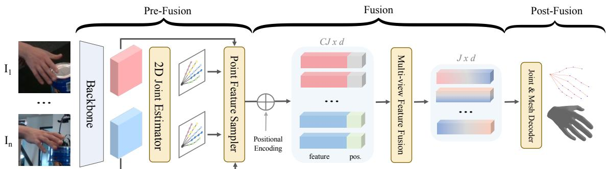

Figure 2: HandMvNet’ architecture consists of three stages: (a) Sampling joint-aligned features using predicted 2D joints from each image (b) Fusing multi-view sampled features, (c) Regressing 3D hand joints and vertices.  
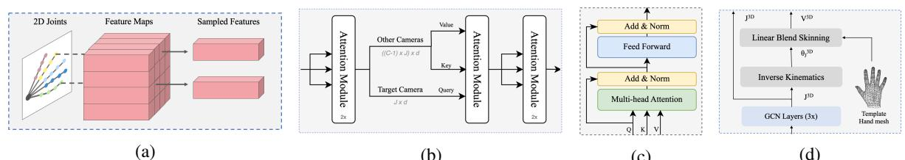  
(c)  
Figure 3: Modules of HandMvNet’s architecture: (a) Point Feature Sampler. (b) Multi-view Feature Fusion. (c) Attention Module. (d) Joint & Mesh Decoder

2D Joint Estimator: At this stage, two convolutional layers refine the features $\mathbf { Z } _ { i }$ to produce jointspecific heatmaps Hi. To extract the 2D joint locations from the heatmaps, we apply a differentiable soft-argmax function (Sun et al., 2018), which transforms the heatmaps into directly usable joint coordinates $\mathbf { J } _ { i } ^ { 2 D } = s o f t - a r g m a x ( f _ { \mathrm { C N N } } ( \mathbf { \bar { Z } } _ { i } ) ) \in \mathbb { R } ^ { \bar { \mathcal { I } } \times 2 }$

Point Feature Sampler: In the final pre-fusion stage, we extract view-specific features from $\mathbf { Z } _ { i }$ (see Figure 3a), reduced to a dimensionality of R512×32×32 using a convolutional layer, corresponding to 2D joint locations $\mathbf { J } _ { i } ^ { 2 D } , \ \mathbf { S } _ { i } \doteq s a m p l e r ( \mathbf { \dot { Z } } _ { i } , \mathbf { J } _ { i } ^ { 2 D } ) , \quad \mathbf { S } _ { i } \in$ $\mathbb { R } ^ { { \boldsymbol { g } } \times 5 1 2 }$ The sampled joint-aligned features from all camera views are concatenated, forming the aggregated multi-view feature representation ${ \boldsymbol { \mathbf { S } } } =$ concat $( \mathbf { S } _ { 1 } , \mathbf { S } _ { 2 } , \ldots , \mathbf { S } _ { C } )$ , where $\mathbf { S } \in \overset { \star } { \mathbb { R } } ^ { C \mathcal { I } \times 5 1 2 }$

## 3.1.2 Fusion

Positional Encoding: To preserve critical spatial and geometric information in cropped hand images, we introduce three types of positional encodings:

1) $\mathbf { P E _ { j o i n t } } \in \mathbb { R } ^ { C ^ { j } \times \dot { 2 } }$ embeds 2D joint positions into the feature vector to capture the hand’s skeletal structure and the relative joint positions in each view.

2) $\mathbf { P E } _ { \mathrm { c r o p } } \in \mathbb { R } ^ { C \times 1 0 }$ encodes the location of the hand crop relative to the camera (Prakash et al., 2023), with each corner and one center point $( x , y )$ calculated as $\Theta _ { x } = \tan ^ { - 1 } ( ( x - p _ { x } ) / f _ { x } )$ and $\Theta _ { y } = \mathrm { t a n } ^ { - 1 } ( ( y - p _ { y } ) / f _ { y } )$ where $p _ { x } , p _ { y }$ are the principal point coordinates, and $f _ { x } , f _ { y }$ are focal lengths. $\mathrm { P E _ { c r o p } }$ is repeated J times for each joint in the view. This encoding is only applied if camera intrinsics are available.

3) Sinusoidal encoding $\mathrm { P E } _ { \mathrm { s i n } } \in \mathbb { R } ^ { C ^ { g } \times d }$ (Vaswani et al., 2017) captures inter-view and inter-joint relations for attention-based fusion.

The final feature vector is:

$$
\mathbf F = \mathrm { c o n c a t } ( \mathbf S , \mathrm { P E _ { j o i n t } } , \mathrm { P E _ { c r o p } } ) + \mathrm { P E _ { s i n } } .\tag{1}
$$

where $\mathbf { F } \in \mathbb { R } ^ { C ^ { g } \times d }$ and d = 512 + 2 + 10 = 524.

Multi-view Feature Fusion: To capture the dependencies between non-local joints across $c$ camera views, we pass the independently sampled features F through attention module (Figure 3c) and then, to fuse multi-view features, we employ multi-head cross-attention between the first camera view features $\mathbf { F } _ { 1 } \in \mathbb { R } ^ { \mathcal { I } \times d }$ acting as the query and the features from the remaining camera views $\mathbf { F } _ { C - 1 } \in \mathbb { R } ^ { ( ( C - 1 ) \times \mathcal { I } ) \times d }$ acting as the key and value (source). The crossattention is formulated as:

$$
\mathbf { F } ^ { * } = s o f t m a x \left( \frac { \mathbf { F } _ { 1 } \mathbf { F } _ { C - 1 } ^ { T } } { \sqrt { d } } \right) \mathbf { F } _ { C - 1 }\tag{2}
$$

The cross-attention layer outputs $\mathbf { F } ^ { * } \in \mathbb { R } ^ { { \mathcal { I } } \times d }$ where $\mathcal { I } = 2 1$ and $d = 5 2 4$ , which aggregates the features across the camera views into the target camera feature space. Finally, self-attention is applied again to $\mathbf { F } ^ { \ast }$ to further refine the intra-joint relationships.

Table 1: Quantitative results (mm) on the test sets of DexYCB-MV, HO3D-MV, and MVHand.  denotes the methods that require camera parameters. The best and second-best results are highlighted in bold and underlined respectively.
<table><tr><td></td><td>#</td><td>Methods</td><td> $\overline { { \mathrm { { M P J P E } } _ { r e l } \downarrow } }$ </td><td> $\overline { { \mathrm { P A } _ { J } \downarrow } }$ </td><td> $\overline { { \mathrm { A U C } _ { J @ 2 0 } } }$  个</td><td> $\overline { { \mathbf { M P V P E } _ { r e l } \downarrow } }$ </td><td>PAV↓</td><td> $\overline { { \mathbf { A U C } _ { V @ 2 0 } \uparrow } }$ </td></tr><tr><td rowspan="7">Dx-CMMV</td><td>1</td><td>MvP</td><td>9.47</td><td>4.26</td><td>0.69</td><td>12.18</td><td>8.14</td><td>0.53</td></tr><tr><td>2</td><td> PE-Mesh-TR</td><td>8.87</td><td>4.76</td><td>0.64</td><td>8.67</td><td>4.70</td><td>0.64</td></tr><tr><td>3</td><td>FTL-Mesh-TR</td><td>9.81</td><td>5.51</td><td>0.59</td><td>9.80</td><td>5.75</td><td>0.59</td></tr><tr><td>4</td><td>POEM</td><td>7.30</td><td>3.93</td><td>0.68</td><td>7.21</td><td>4.00</td><td>0.70</td></tr><tr><td>5</td><td>Multi-view Fit.</td><td>8.77</td><td>5.19</td><td>0.65</td><td>8.71</td><td>5.29</td><td>0.65</td></tr><tr><td>6</td><td> HandMvNet (ours)</td><td>6.73</td><td>4.08</td><td>0.67</td><td>7.19</td><td>4.52</td><td>0.65</td></tr><tr><td>7</td><td> HandMvNet-HR (ours)</td><td>6.89</td><td>4.08</td><td>0.67</td><td>7.30</td><td>4.53</td><td>0.65</td></tr><tr><td>8 9</td><td>HandMvNet w/o cam. (ours)</td><td>7.03</td><td>4.13</td><td>0.66</td><td>7.38</td><td>4.56</td><td>0.64</td></tr><tr><td rowspan="7">HO-MV</td><td></td><td>HandMvNet-HR w/o cam. (ours)</td><td>7.28</td><td>4.20</td><td>0.65</td><td>7.62</td><td>4.69</td><td>0.63</td></tr><tr><td>10</td><td>MvP</td><td>24.90</td><td></td><td> $\overline { { \mathrm { A U C } _ { J @ 5 0 } \uparrow } }$ </td><td></td><td></td><td>AUCv@50 ↑</td></tr><tr><td>11</td><td>PE-Mesh-TR</td><td>30.23</td><td>10.44</td><td>0.60</td><td>27.08</td><td>10.04</td><td>0.59</td></tr><tr><td>12</td><td>FTL-Mesh-TR</td><td></td><td>11.67</td><td>0.54</td><td>29.19</td><td>11.31</td><td>0.55</td></tr><tr><td>13</td><td></td><td>34.74</td><td>10.72</td><td>0.52</td><td>33.53</td><td>10.56</td><td>0.53</td></tr><tr><td>14</td><td>POEM</td><td>21.94</td><td>9.60</td><td>0.63</td><td>21.45</td><td>9.97</td><td>0.66</td></tr><tr><td>15</td><td>HandMvNet (ours)</td><td>21.43</td><td>10.89</td><td>0.59</td><td>20.17</td><td>10.16</td><td>0.61</td></tr><tr><td>16</td><td>HandMvNet-HR (ours) HandMvNet w/o cam. (ours)</td><td>20.73</td><td>11.01</td><td>0.61</td><td>19.82</td><td>10.73</td><td></td><td>0.62</td></tr><tr><td></td><td></td><td>HandMvNet-HR w/o cam. (ours)</td><td>21.55 20.40</td><td>10.15</td><td>0.58</td><td>20.10</td><td>9.39</td><td>0.61</td></tr><tr><td rowspan="6">MHand</td><td>17</td><td></td><td></td><td>11.98</td><td>0.61</td><td>19.33</td><td>11.24</td><td>0.63</td></tr><tr><td>18</td><td>MediaPipe-DLT</td><td>17.24</td><td>9.97</td><td>AUCJ@20 ↑ 0.28</td><td></td><td></td><td>AUCV@20 ↑</td></tr><tr><td>19</td><td>HandMvNet (ours)</td><td>2.07</td><td>1.30</td><td></td><td>18.42</td><td>7.74</td><td>0.21</td></tr><tr><td>20</td><td> HandMvNet-HR (ours)</td><td>1.86</td><td>1.21</td><td>0.90</td><td>7.57</td><td>4.14</td><td>0.62</td></tr><tr><td>21</td><td>HandMvNet w/o cam. (ours)</td><td>2.05</td><td>1.28</td><td>0.91</td><td>7.59 7.62</td><td>4.12</td><td>0.62</td></tr><tr><td>22</td><td>HandMvNet-HR w/o cam. (ours)</td><td>1.77</td><td>1.14</td><td>0.90 0.91</td><td>7.46</td><td>4.11 4.15</td><td>0.62 0.63</td></tr></table>

## 3.1.3 Post-Fusion

Joint & Mesh Decoder: We use a three-layer graph convolutional network (GCN) to decode 3D joints from the fused feature $\dot { \mathbf { F } } ^ { * } \in \mathbb { R } ^ { \mathcal { I } \times d }$ , treating J joints as graph nodes with d-dimensional features, estimating the final $\mathbf { J } ^ { 3 D } \in \mathbb { R } ^ { \mathcal { I } \times 3 }$ . Inverse Kinematics (IK) is then applied to compute joint rotation angles $\theta _ { J ^ { 3 D } } \in$ $\mathbb { R } ^ { ( \mathcal { I } - 5 ) \times 3 }$ , which form a hand skeleton. This skeleton deforms a hand template mesh via linear blend skinning to yield the final 3D vertices $\mathbf { V } ^ { 3 D } \in \mathbb { R } ^ { \mathcal { V } \times 3 }$ as shown in Figure 3d.

## 3.2 Training

We apply mean squared error loss for the predicted 2D heatmaps (LH) and L1 loss for both 2D and 3D joints $( L _ { \mathrm { 2 D } } , L _ { \mathrm { 3 D } } )$ . Additionally, if camera parameters are available, we project predicted 3D joints onto 2D camera views using the perspective function $\Pi _ { c } ( \cdot )$ $\mathbb { R } ^ { 3 } \to \mathbb { R } ^ { 2 }$ , and minimize the L1 loss between these projections and the ground-truth 2D joints $( L _ { \mathrm { G 2 D } } ) .$ , as well as the predicted 2D joints (L ). The total loss is defined as:

$$
\begin{array} { c } { { L = \lambda _ { \mathrm { H } } L _ { \mathrm { H } } + \lambda _ { \mathrm { 2 D } } L _ { \mathrm { 2 D } } + \lambda _ { \mathrm { 3 D } } L _ { \mathrm { 3 D } } } } \\ { { + \lambda _ { \mathrm { G 2 D } } L _ { \mathrm { G 2 D } } + \lambda _ { \mathrm { P 2 D } } L _ { \mathrm { P 2 D } } } } \end{array}\tag{3}
$$

where λ values are set as 10, 1, 1, 1, and 0.5 to balance the loss scale, respectively.

## 4 EXPERIMENTS AND RESULTS

In this section, we conduct experiments to validate and assess the effectiveness of our proposed architecture, along with providing implementation details. We use Pytorch (Paszke et al., 2019) to implement al our networks. The AdamW (Loshchilov, 2017) optimizer is used with a weight decay of 0.05 and an initial learning rate set to 0.0001. The model is trained on two RTXA6000 GPUs with a batch size of 32. Cropped hand images resized to 256×256, serve as input data. We also evaluate a variation of our model, denoted as HandMvNet-HR, which uses HRNet-w40 as backbone (Sun et al., 2019).

## 4.1 Datasets

DexYCB (Chao et al., 2021) is a multi-view RGB-D dataset capturing hand-object interactions, featuring 10 subjects and 8 camera views per subject. We follow the official “S0” split, excluding left-hand samples, resulting in 25,387 training, 1,412 validation, and 4,951 test multi-view samples, same as (Yang et al., 2023). We refer to this split as DexYCB-MV.

HO3D (v3) (Hampali et al., 2020) includes images of hand-object interaction from up to 5 cameras. We construct HO3D-MV by selecting 7 sequences with complete multi-view observations from all 5 cameras. For the training set, we use the sequences ‘ABF1’,‘BB1’, ‘GSF1’, ‘MDF1’, and ‘SiBF1’, while the sequences ‘GPMF1’ and ‘SB1’ are reserved for testing. This results in 9,087 training and 2,706 test multi-view samples.

Table 2: Ablation Studies.  
(a) Different positional encodings.  
(b) Effect of fusion layers  
(c) Different number of camera views
<table><tr><td>Pos. Encoding</td><td> $\overline { { \mathrm { { M P J P E } } _ { r e l } \downarrow } }$ </td><td> $\overline { { \mathrm { P A } _ { J } \downarrow } }$ </td><td> $\overline { { \mathrm { \bf A U C } _ { J } \downarrow } }$ </td><td>Fusion Layers</td><td> $\overline { { \mathrm { { M P J P E } } _ { r e l } \downarrow } }$ </td><td> $\overline { { \mathrm { P A } _ { J \downarrow } } }$ </td><td> $\overline { { \mathbf { A U C } _ { J } \uparrow } }$ </td><td>Camera views</td><td> $\overline { { \mathrm { { M P J P E } } _ { r e l } } } \downarrow$ </td><td> $\overline { { \mathrm { P A } _ { J \downarrow } } }$ </td><td> $\overline { { \mathbf { A U C } _ { J } \mathcal { T } } }$ </td></tr><tr><td>sin</td><td>7.69</td><td>4.40</td><td>0.63</td><td>3</td><td>6.90</td><td>4.16</td><td>0.66</td><td>8</td><td>6.73</td><td>4.08</td><td>0.67</td></tr><tr><td>sin + joint</td><td>6.96</td><td>4.14</td><td>0.66</td><td>5</td><td>6.73</td><td>4.08</td><td>0.67</td><td>4</td><td>7.47</td><td>4.38</td><td>0.64</td></tr><tr><td>sin + joint + crop</td><td>6.73</td><td>4.08</td><td>0.67</td><td>7</td><td>6.88</td><td>4.14</td><td>0.67</td><td>2</td><td>8.33</td><td>4.83</td><td>0.60</td></tr></table>

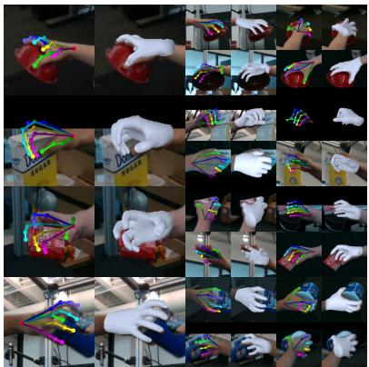

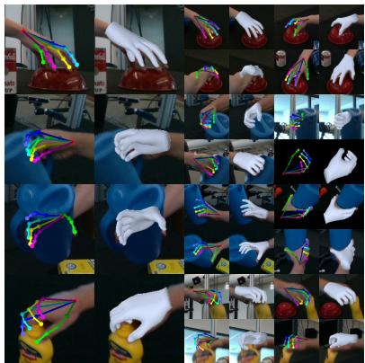

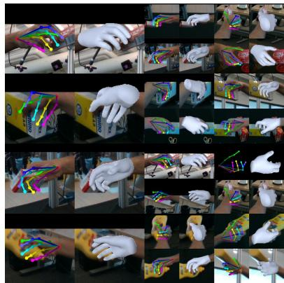  
Figure 4: Qualitative results on the test set of DexYCB-MV dataset.

MVHand (Yu et al., 2021) is a multi-view RGB-D hand pose dataset featuring 4 subjects and 4 camera views per subject. We split the 21,200 multiview frames into 15,417 training, 1,927 validation, and 3,856 test multi-view samples.

## 4.2 Evaluation Metrics

We evaluate the performance of our method using the following standard hand pose estimation metrics. 1) $\mathbf { M P J P E } _ { r e l } / \mathbf { M P V P E } _ { r e l }$ (Mean Per Joint/Vertex Position Error) calculates the average Euclidean distance (in mm) between predicted and ground-truth joints/vertices, after aligning the root(-wrist) joint. 2) PA-MPJPE/PA-MPVPE (Procrustes Aligned Joint/Vertex Error) measures MPJPE/MPVPE after applying procrustes analysis for scale, center and rotation alignment. We refer to these metrics as PA and PAV in our experiments. 3) AUCJ/AUCV (Area Under Curve for Joint/Vertex Error) computes the area under the percentage of correct keypoints (PCK) curve over a range of thresholds.

## 4.3 Comparison with Previous Methods

We benchmark our 3D hand reconstruction approach against state-of-the-art (SOTA) multi-view methods, including POEM (Yang et al., 2023) and MvP (Zhang et al., 2021a). Although MvP is primarily designed for multi-person pose estimation, we focus on its performance in single-hand reconstruction. Given the limited availability of multi-view hand pose methods, we further evaluate simulated approaches that combine single-view hand reconstruction with advanced multi-view fusion techniques. Detailed descriptions of these simulated methods, such as PE-Mesh-TR (Liu et al., 2022; Lin et al., 2021), FTL-Mesh-TR (Remelli et al., 2020), and Multi-view Fitting (Hampali et al., 2020), are provided in Section 4.2 of (Yang et al., 2023). For the MVHand dataset, which lacks established multi-view benchmarks, we introduce a baseline ”Mediapipe-DLT” that estimates 2D joints using Mediapipe (Zhang et al., 2020), triangulates them via Direct Linear Transform (DLT) (Hartley and Zisserman, 2003), and obtains 3D vertices through linear blend skinning.

Table 1 shows that our method consistently outperforms SOTA approaches in terms of $\mathrm { M P J P E } _ { r e l }$ and $\mathrm { M P V P E } _ { r e l }$ across all datasets, while achieving competitive performance in other metrics. In particular, our camera-independent variants, “HandMvNet w/o cam.” and “HandMvNet-HR w/o cam.”, also show superior performance in most cases. Our method’s capacity to implicitly learn 3D geometry demands substantial data, leading to a performance decline on smaller datasets like HO3D-MV as shown in Table 1. Figure 1 shows that HandMvNet surpasses other methods in both accuracy (lower $\mathrm { M P J P E } _ { r e l } )$ and inference speed (higher FPS). We visualize qualitative results on the DexYCB-MV, HO3D-MV, and MVHand test sets in Figures 4, 5, and 6, respectively.

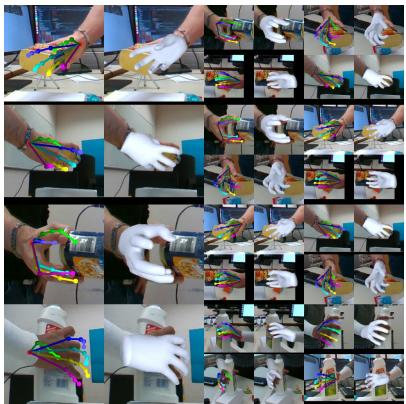

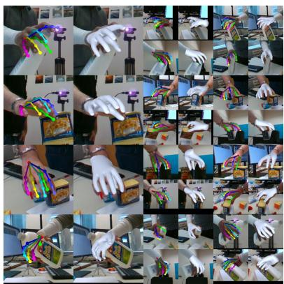

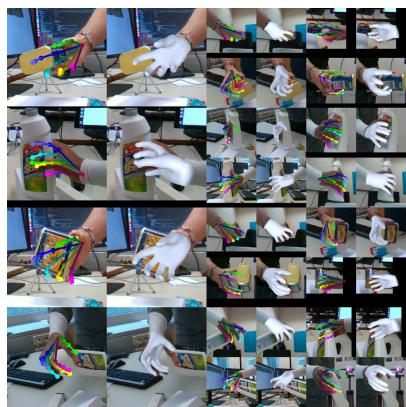  
Figure 5: Qualitative results on the test set of HO3D-MV dataset.

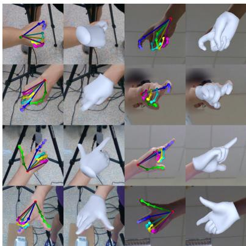

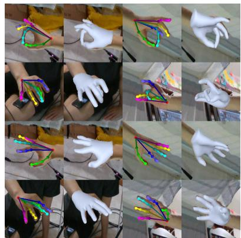

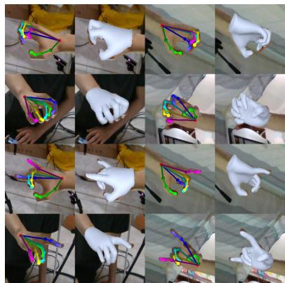  
Figure 6: Qualitative results on the test set of MVHand dataset.

## 4.4 Ablation Study

Different Backbones. We compare the results of HandMvNet using ResNet50 as backbone and HandMvNet-HR using HRNet-w40 as backbone in the rows 6-7, 14-15, 19-20 of Table 1.

Use of Camera Parameters. In our method, camera parameters are used to add the $\mathrm { P E } _ { c r o p }$ positional encoding and loss terms $L _ { G 2 D }$ and $L _ { P 2 D } .$ . To evaluate the effect of removing camera dependency, we create variants “HandMvNet w/o cam.” and “HandMvNet-HR w/o cam.” by excluding these components. The performance of both versions, with and without camera parameters, are compared in rows 6-9, 14-17, 19-22 of Table 1.

Impact of Positional Encoding. In Table 2a, we examine the effect of different positional encodings on performance. Using the combination of sinusoidal positional encoding $( \mathrm { P E _ { \mathrm { { s i n } } } } ) ,$ joint-wise encoding $( \mathrm { P E _ { j o i n t } } )$ and crop encoding $\mathrm { ( P E _ { c r o p } ) }$ results in the best performance.

Number of Fusion Layers. The impact of varying the number of fusion layers is presented in Table 2b. We observe that increasing from 3 to 5 layers improves performance, but adding more layers does not further enhance performance, suggesting that 5 layers are optimal.

Different Number of Camera Views. Table 2c shows that model performance improves gradually with increasing the number of camera views. We also compare FPS across different camera views with other approaches in Figure 7.

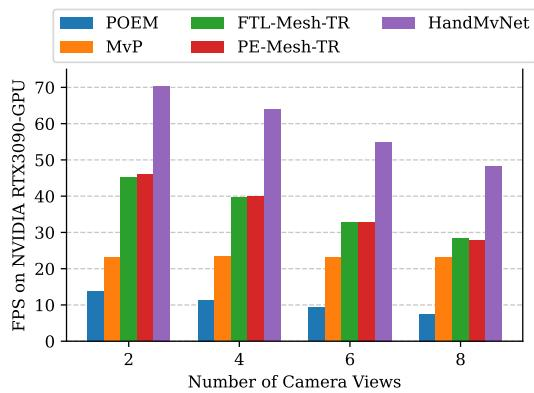  
Figure 7: Inference Speed (FPS) comparison across methods with different camera views. HandMvNet achieves the highest FPS across all configurations.

## 5 CONCLUSION

We introduced HandMvNet, one of the first real-time methods for estimating 3D hand motion and shape from multi-view camera images. Our approach employs a multi-view attention-fusion mechanism that effectively integrates features from multiple viewpoints, delivering consistent and accurate absolute hand poses and shapes, free from the scale-depth ambiguities typically seen in monocular methods. Unlike previous multi-view approaches, HandMvNet eliminates the need for camera parameters to learn 3D geometry. We validated the architecture through extensive ablation studies and compared its performance with state-of-the-art methods. Experiments on public datasets demonstrate the effectiveness of our approach, delivering superior accuracy and inference speed compared to existing methods.

## REFERENCES

Bartol, K., Bojanic, D., Petkovi´ c, T., and Pribani´ c, T.´ (2022). Generalizable human pose triangulation. In Proceedings of the IEEE/CVF Conference on Computer Vision and Pattern Recognition, pages 11028–11037.

Boukhayma, A., Bem, R. d., and Torr, P. H. (2019). 3d hand shape and pose from images in the wild. In Proceedings of the IEEE/CVF Conference on Computer Vision and Pattern Recognition, pages 10843–10852.

Chao, Y.-W., Yang, W., Xiang, Y., Molchanov, P., Handa, A., Tremblay, J., Narang, Y. S., Van Wyk, K., Iqbal, U., Birchfield, S., et al. (2021). Dexycb: A benchmark for capturing hand grasping of objects. In Proceedings of the IEEE/CVF Conference on Computer Vision and Pattern Recognition, pages 9044–9053.

Chen, P., Chen, Y., Yang, D., Wu, F., Li, Q., Xia, Q., and Tan, Y. (2021a). I2uv-handnet: Image-to-uv prediction network for accurate and high-fidelity 3d hand mesh modeling. In Proceedings of the IEEE/CVF International Conference on Computer Vision, pages 12929– 12938.

Chen, X., Liu, Y., Ma, C., Chang, J., Wang, H., Chen, T., Guo, X., Wan, P., and Zheng, W. (2021b). Camera-space hand mesh recovery via semantic aggregation and adaptive 2d-1d registration. In Proceedings of the IEEE/CVF Conference on Computer Vision and Pattern Recognition, pages 13274–13283.

Chen, Z., Zhao, X., and Wan, X. (2022). Structural triangulation: A closed-form solution to constrained 3d human pose estimation. In European Conference on Computer Vision, pages 695–711. Springer.

Deng, J., Dong, W., Socher, R., Li, L.-J., Li, K., and Fei-Fei, L. (2009). ImageNet: A Large-Scale Hierarchical Image Database. In CVPR09.

Ge, L., Liang, H., Yuan, J., and Thalmann, D. (2016). Robust 3d hand pose estimation in single depth images: from single-view cnn to multi-view cnns. In Proceedings of the IEEE conference on computer vision and pattern recognition, pages 3593–3601.

Ge, L., Ren, Z., Li, Y., Xue, Z., Wang, Y., Cai, J., and Yuan, J. (2019). 3d hand shape and pose estimation from a single rgb image. In Proceedings of the IEEE/CVF Conference on Computer Vision and Pattern Recognition, pages 10833–10842.

Guan, H., Chang, J. S., Chen, L., Feris, R. S., and Turk, M. A. (2006). Multi-view appearance-based 3d hand pose estimation. 2006 Conference on Computer Vision and Pattern Recognition Workshop (CVPRW’06), pages 154–154.

Hampali, S., Rad, M., Oberweger, M., and Lepetit, V. (2020). Honnotate: A method for 3d annotation of hand and object poses. In CVPR.

Han, S., Wu, P.-c., Zhang, Y., Liu, B., Zhang, L., Wang, Z., Si, W., Zhang, P., Cai, Y., Hodan, T., et al. (2022). Umetrack: Unified multi-view end-to-end hand tracking for vr. In SIGGRAPH Asia 2022 Conference Papers, pages 1–9.

Hartley, R. and Zisserman, A. (2003). Multiple view geometry in computer vision. Cambridge university press.

He, K., Zhang, X., Ren, S., and Sun, J. (2016). Deep residual learning for image recognition. In Proceedings of the IEEE conference on computer vision and pattern recognition, pages 770–778.

He, Y., Yan, R., Fragkiadaki, K., and Yu, S.-I. (2020). Epipolar transformers. In Proceedings of the ieee/cvf conference on computer vision and pattern recognition, pages 7779–7788.

Iskakov, K., Burkov, E., Lempitsky, V., and Malkov, Y. (2019). Learnable triangulation of human pose. In Proceedings of the IEEE/CVF international conference on computer vision, pages 7718–7727.

Lin, K., Wang, L., and Liu, Z. (2021). End-to-end human pose and mesh reconstruction with transformers. In Proceedings of the IEEE/CVF conference on computer vision and pattern recognition, pages 1954–1963.

Liu, Y., Wang, T., Zhang, X., and Sun, J. (2022). Petr: Position embedding transformation for multi-view 3d object detection. In European Conference on Computer Vision, pages 531–548. Springer.

Loshchilov, I. (2017). Decoupled weight decay regularization. arXiv preprint arXiv:1711.05101.

Ma, H., Wang, Z., Chen, Y., Kong, D., Chen, L., Liu, X., Yan, X., Tang, H., and Xie, X. (2022). Ppt: token-pruned pose transformer for monocular and multi-view human pose estimation. In European Conference on Computer Vision, pages 424–442. Springer.

Malik, J., Abdelaziz, I., Elhayek, A., Shimada, S., Ali, S. A., Golyanik, V., Theobalt, C., and Stricker, D. (2020). Handvoxnet: Deep voxel-based network for 3d hand shape and pose estimation from a single depth map. In Proceedings of the IEEE/CVF conference on computer vision and pattern recognition, pages 7113–7122.

Malik, J., Shimada, S., Elhayek, A., Ali, S. A., Theobalt, C., Golyanik, V., and Stricker, D. (2021). Handvoxnet++: 3d hand shape and pose estimation using voxel-based neural networks. IEEE Transactions on Pattern Analysis and Machine Intelligence, 44(12):8962–8974.

Moon, G. and Lee, K. M. (2020). I2l-meshnet: Image-tolixel prediction network for accurate 3d human pose and mesh estimation from a single rgb image. In Computer Vision–ECCV 2020: 16th European Conference, Glasgow, UK, August 23–28, 2020, Proceedings, Part VII 16, pages 752–768. Springer.

Park, J., Oh, Y., Moon, G., Choi, H., and Lee, K. M. (2022). Handoccnet: Occlusion-robust 3d hand mesh estimation network. In Proceedings ofthe IEEE/CVF Conference on Computer Vision and Pattern Recognition, pages 1496– 1505.

Paszke, A., Gross, S., Massa, F., Lerer, A., Bradbury, J., Chanan, G., Killeen, T., Lin, Z., Gimelshein, N., Antiga, L., et al. (2019). Pytorch: An imperative style, highperformance deep learning library. Advances in neural information processing systems, 32.

Prakash, A., Gupta, A., and Gupta, S. (2023). Mitigating perspective distortion-induced shape ambiguity in image crops. arXiv preprint arXiv:2312.06594.

Remelli, E., Han, S., Honari, S., Fua, P., and Wang, R. (2020). Lightweight multi-view 3d pose estimation through camera-disentangled representation. In Proceedings ofthe IEEE/CVF conference on computer vision and pattern recognition, pages 6040–6049.

Romero, J., Tzionas, D., and Black, M. J. (2022). Embodied hands: Modeling and capturing hands and bodies together. arXiv preprint arXiv:2201.02610.

Shuai, H., Wu, L., and Liu, Q. (2022). Adaptive multiview and temporal fusing transformer for 3d human pose estimation. IEEE Transactions on Pattern Analysis and Machine Intelligence, 45(4):4122–4135.

Sun, K., Xiao, B., Liu, D., and Wang, J. (2019). Deep highresolution representation learning for human pose estimation. In CVPR.

Sun, X., Xiao, B., Wei, F., Liang, S., and Wei, Y. (2018). Integral human pose regression. In Proceedings of the European conference on computer vision (ECCV), pages 529–545.

Tu, H., Wang, C., and Zeng, W. (2020). Voxelpose: Towards multi-camera 3d human pose estimation in wild environment. In Computer Vision–ECCV 2020: 16th European Conference, Glasgow, UK, August 23–28, 2020, Proceedings, Part I 16, pages 197–212. Springer.

Vaswani, A., Shazeer, N., Parmar, N., Uszkoreit, J., Jones, L., Gomez, A. N., Kaiser, Ł., and Polosukhin, I. (2017). Attention is all you need. Advances in neural information processing systems, 30.

Yang, L., Li, K., Zhan, X., Wu, F., Xu, A., Liu, L., and Lu, C. (2022). Oakink: A large-scale knowledge repository for understanding hand-object interaction. In Proceedings of the IEEE/CVF Conference on Computer Vision and Pattern Recognition, pages 20953–20962.

Yang, L., Xu, J., Zhong, L., Zhan, X., Wang, Z., Wu, K., and Lu, C. (2023). Poem: Reconstructing hand in a point embedded multi-view stereo. In Proceedings ofthe IEEE/CVF Conference on Computer Vision and Pattern Recognition, pages 21108–21117.

Yu, Z., Yang, L., Chen, S., and Yao, A. (2021). Local and global point cloud reconstruction for 3d hand pose estimation. arXiv preprint arXiv:2112.06389.

Zhang, F., Bazarevsky, V., Vakunov, A., Tkachenka, A., Sung, G., Chang, C.-L., and Grundmann, M. (2020). Mediapipe hands: On-device real-time hand tracking. arXiv preprint arXiv:2006.10214.

Zhang, J., Cai, Y., Yan, S., Feng, J., et al. (2021a). Direct multi-view multi-person 3d pose estimation. Advances in Neural Information Processing Systems, 34:13153– 13164.

Zhang, Z., Wang, C., Qiu, W., Qin, W., and Zeng, W. (2021b). Adafuse: Adaptive multiview fusion for accurate human pose estimation in the wild. International Journal ofComputer Vision, 129:703–718.

Zhao, W., Wang, W., and Tian, Y. (2022). Graformer: Graph-oriented transformer for 3d pose estimation. In Proceedings of the IEEE/CVF Conference on Computer Vision and Pattern Recognition, pages 20438–20447.

Zheng, X., Wen, C., Xue, Z., Ren, P., and Wang, J. (2023). Hamuco: Hand pose estimation via multiview collaborative self-supervised learning. In Proceedings of the IEEE/CVF International Conference on Computer Vision, pages 20763–20773.

Zhou, Y., Habermann, M., Xu, W., Habibie, I., Theobalt, C., and Xu, F. (2020). Monocular real-time hand shape and motion capture using multi-modal data. In Proceedings of the IEEE/CVF Conference on Computer Vision and Pattern Recognition, pages 5346–5355.