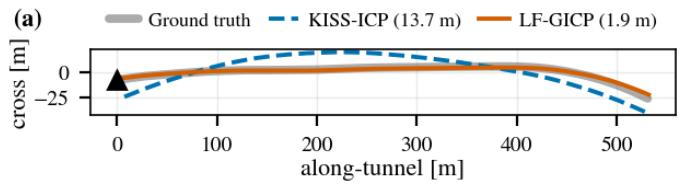
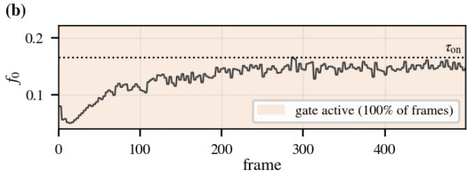
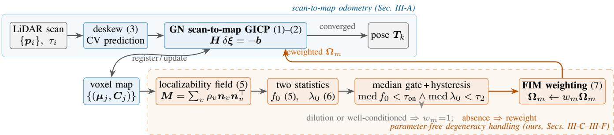
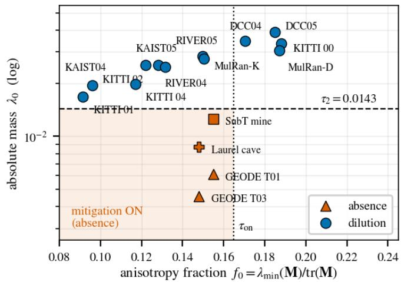
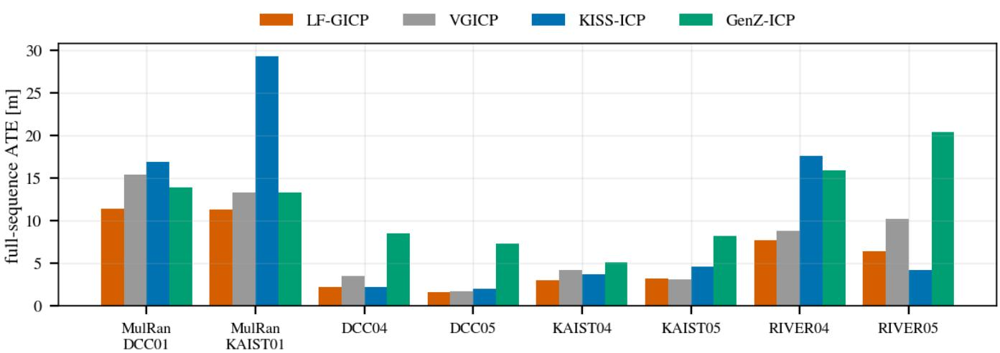
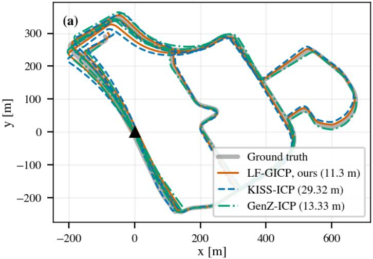
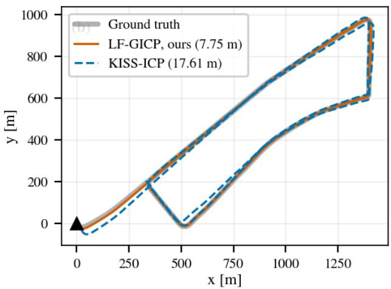
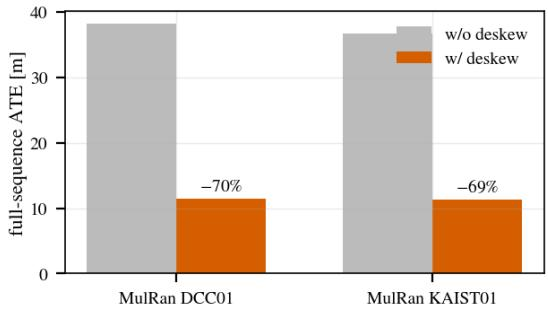
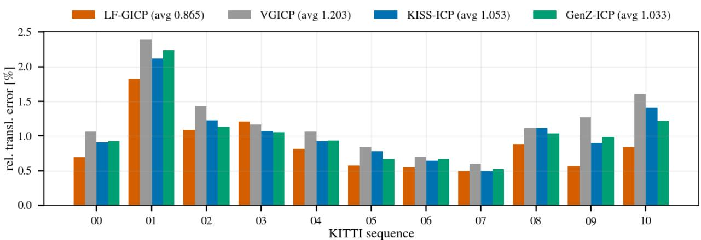
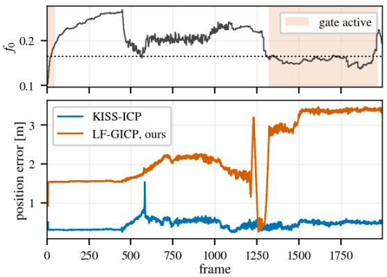

# LF-GICP: Parameter-Free Degeneracy-Aware LiDAR Odometry via a Voxel-Normal Localizability Field

Eunsoo Im

Abstract— Scan-to-map LiDAR odometry drifts unboundedly along the unobservable axes of geometrically degenerate environments like tunnels and corridors, and existing degeneracy handling requires environment-specific parameter tuning. This paper presents a parameter-free approach. We show that in voxelized GICP the Gauss–Newton (GN) Hessian masks translational degeneracy, because covariance regularization keeps the translation block artificially well-conditioned. We bypass this with a regularization-free voxel-normal localizability field and two of its statistics: a normalized fraction $f _ { 0 }$ detecting directional anisotropy, and an absolute per-voxel mass $\lambda _ { 0 }$ distinguishing information absence (tunnels) from dilution (dense open scenes). A temporal-median gate combines both to trigger Fisher-information correspondence weighting. Calibrated once by fixed rules on two short sequences and then frozen, LF-GICP achieves the lowest KITTI relative translation error (0.865%) under an identical evaluation protocol against re-run baselines, outperforms them on GEODE tunnels and MulRan, leads the HeLiPR mean, and generalizes across four sensor types without re-tuning. We further demonstrate empirically that straight, uniform tunnels remain unobservable along their axis for LiDAR-only registration.

## I. INTRODUCTION

Well-engineered frame-to-map ICP pipelines such as KISS-ICP [1] and the GICP family [2], [3] now rival complex LiDAR odometry systems by generalizing across sensors with frozen parameters or per-voxel statistics. Yet they fail under geometric degeneracy: in tunnels, corridors, or mines the observed surfaces only partially constrain the motion, the cost becomes flat along the unobservable direction, and drift grows unboundedly (Fig. 1)—a failure mode that has motivated a decade of degeneracy-aware registration research [4], [5], [6], [7].

Existing degeneracy handling methods typically threshold optimization metrics, such as GN-Hessian eigenvalues [4] or constraint-space alignments [5], [7]. Although they mitigate drift using priors [4], [5] or residual re-balancing [6], they invariably retain environment-dependent parameters, such as eigenvalue thresholds, dataset presets, and environment flags, which prevent out-of-the-box deployment. This paper introduces a parameter-free alternative, namely a single configuration calibrated once that operates across diverse datasets, sensors, and platforms. This approach rests on two key insights.

First, the GN Hessian of a voxelized GICP pipeline structurally masks translational degeneracy. Point-to-distribution registration uses full voxel covariances, so together with standard covariance regularization every correspondence contributes an isotropic information floor to the Hessian’s translation block: empirically, the eigenvalue ratio $\lambda _ { \operatorname* { m i n } } / \lambda _ { \operatorname* { m a x } }$ inside a uniform tunnel (0.87) is indistinguishable from open-road driving (0.81). The floor is intrinsic to the cost formulation, rendering Hessian-eigenvalue thresholding illposed in GICP-style pipelines (Sec. III-B). We therefore propose a regularization-free voxel-normal localizability field $\begin{array} { r } { \textbf {  { M } } = ~ \sum _ { v } \rho _ { v } \pmb { n } _ { v } \pmb { n } _ { v } ^ { \top } } \end{array}$ built from planarity-weighted map normals: its normalized smallest eigenvalue $f _ { 0 }$ isolates degenerate scenes and its null eigenvector identifies the unobservable axis (Sec. III-C).

Second, anisotropy alone does not imply degeneracy: information dilution must be distinguished from information absence. A uniform tunnel and a dense tree-lined boulevard produce similarly low $f _ { 0 } ,$ , yet reweighting the weak axis helps in the former and hurts in the latter, where many weakly informative points collectively constrain the estimate. We separate the regimes with the absolute weak-axis normal mass per voxel, $\lambda _ { 0 }$ (Sec. III-D): across five datasets and four sensor types it cleanly bifurcates tunnels/mines (0.005–0.013) from open/vegetated scenes (0.017–0.033). The mitigation gate enforces both conditions, with thresholds derived by a fixed rule from two short calibration traces and frozen thereafter.

Contributions. (1) A structural diagnosis showing that the GN Hessian of point-to-distribution registration hides translational degeneracy (Sec. III-B). (2) A regularization-free voxel-normal localizability field whose fraction statistic $f _ { 0 }$ isolates anisotropy and whose null eigenvector recovers the unobservable axis (Sec. III-C). (3) The absolute-mass statistic $\lambda _ { 0 }$ distinguishing information absence from dilution (Sec. III-D). (4) A parameter-free protocol deriving all constants from two calibration traces, validated across five benchmarks and four sensor types (Secs. IV-A, IV). (5) An empirical analysis of the failure modes of alternative strategies, mapping the boundaries of degeneracy-aware weighting (Secs. III-G, IV-E).

## II. RELATED WORK

LiDAR odometry. Feature-based LOAM [8] has largely given way to direct scan-to-map pipelines built on classical ICP [9], [10], such as KISS-ICP [1], CT-ICP [11], DLO [12], and MAD-ICP [13]. The distribution-based family (NDT [14], GICP [2], [15]) models local surface statistics; the voxelized variant VGICP [3] is our backend. GenZ-ICP [6] adaptively blends point-to-point and point-to-plane residuals, a strong degeneracy-robust baseline. LiDAR-inertial systems [16], [17] mitigate short-horizon degeneracy with IMUs. We focus on the LiDAR-only problem, which matters when inertial data is unreliable and because unmitigated degeneracy contaminates downstream fusion.

Degeneracy detection. ICP normal-equation conditioning has been analyzed since stable sampling [18] and closed-form covariance [19]; classical degeneracy handling thresholds GN-Hessian eigenvalues [4], and newer approaches classify directional localizability via constraint-space alignments (X-ICP [5], LP-ICP [7]), environment-driven estimation [20], or learning [21]. A recent field study [22] found that these generalize poorly without site-specific tuning. As Sec. III-B shows, metrics computed in the optimization’s information space are masked by covariance regularization in pointto-distribution pipelines. In contrast, our method directly evaluates the unregularized voxel-normal field. Filter-level and graph-level approaches [23], [24], [25] address error propagation and are complementary.

Degeneracy mitigation. Prior strategies (i) lock degenerate directions to a prior [4], [5], (ii) reweight residuals [6], or (iii) augment with photometric or inertial channels [26], [16]. Our analysis exposes limits of each: hard constraints discard the weak but valid along-axis signal that GICP’s regularized solver retains (Sec. III-E); reweighting helps under information absence but hurts under dilution (Sec. III-D); and photometry cannot resolve the null space of uniform tunnels (Sec. III-G).

Parameter-freeness and evaluation practice. KISS-ICP [1] established the single-frozen-configuration paradigm but lacks degeneracy handling; GenZ-ICP [6] shares the goal yet remains vulnerable in tunnels (Table III). Degeneracyaware systems typically retain heuristic or site-level thresholds [5], [7] and are mainly evaluated in degenerate scenes; a field study documents their sensitivity [22]. LF-GICP is the first to hold a single configuration across open-road SOTA benchmarks and severe tunnels [27], [28], [29], [30]; all gate constants come from calibration rules on two short traces (Sec. IV-A), backed by a sensitivity analysis (Sec. IV-E).

## III. METHOD

Fig. 2 overviews LF-GICP. We outline the baseline optimization (Sec. III-A), analyze why Hessian-based metrics structurally fail in point-to-distribution pipelines (Sec. III-B), construct the localizability field and its two statistics (Secs. III-C, III-D), and detail the weighting, gating, and LiDAR-only estimation limits (Secs. III-E–III-G).

## A. Scan-to-Map Registration Baseline

Let the source scan be represented by points $\{ p _ { i } \in \mathbb { R } ^ { 3 } \} _ { i = 1 } ^ { N _ { s } }$ and the target as a voxel map of Gaussians $\{ ( \mu _ { j } , C _ { j } ) \} _ { j = 1 } ^ { N } .$ where $\pmb { \mu } _ { j }$ and $C _ { j }$ denote the mean and covariance of the points within voxel $j .$ Generalized-ICP estimates the rigid body pose $\pmb { T } = ( \pmb { R } , \pmb { t } ) \in \mathrm { S E } ( 3 )$ by minimizing the Mahalanobis point-to-distribution cost:

$$
T ^ { \star } = \arg \operatorname* { m i n } _ { T } \sum _ { m } d _ { m } ^ { \top } \Omega _ { m } d _ { m } , \quad d _ { m } = R p _ { i ( m ) } + t - \mu _ { j ( m ) } ,\tag{1}
$$

  
Fig. 1. GEODE Urban Tunnel02 under the same frozen configuration as the KITTI evaluation (Sec. IV-B). (a) Aligned trajectories (500-frame GT horizon): KISS-ICP drifts laterally while LF-GICP tracks ground truth. (b) f0: the median gate detects the tunnel without an environment flag or site-specific threshold.

with per-correspondence information $\pmb { \Omega } _ { m } = \pmb { C } _ { i ( m ) } ^ { - 1 } \in \mathbb { R } ^ { 3 \times 3 }$ Linearizing $d _ { m }$ with respect to the local twist $\delta \xi \ =$ $[ \delta \omega ; \delta \pmb { \rho } ] ~ \in ~ \mathbb { R } ^ { 6 }$ (rotation; translation) yields the Gauss– Newton (GN) normal equations:

$$
H \delta \xi = - b , \quad H = \sum _ { m } J _ { m } ^ { \top } \Omega _ { m } J _ { m } , \quad b = \sum _ { m } J _ { m } ^ { \top } \Omega _ { m } d _ { m } ,\tag{2}
$$

where $J _ { m } = \left\lceil - \left[ R p _ { i ( m ) } + t \right] _ { \times } \quad I _ { 3 } \right\rceil \in \mathbb { R } ^ { 3 \times 6 }$ . The Hessian H is the empirical Fisher Information Matrix (FIM); the rank deficiency of its translation block $\begin{array} { r } { { \cal H } _ { \rho \rho } = \sum _ { m } \Omega _ { m } } \end{array}$ is the estimation-theoretic signature of translational degeneracy. Updates $\begin{array} { r } { \pmb { T }  \exp ( \delta \pmb { \xi } ) \pmb { T } } \end{array}$ iterate until convergence.

To ensure that the proposed degeneracy handling is the sole evaluation variable, the baseline adopts a standard configuration: constant-velocity (CV) initial predictions, a KISS-style adaptive correspondence threshold, a Huber weight (δ=1) composed multiplicatively with the FIM weight of Sec. III-E, sensor-class voxel sizes (1.0 m for ≥64 beams, 0.5 m for $\leq 3 2 )$ , and an age-windowed local map of per-voxel Gaussians (≥3 points, last 500 scans) with re-association at each GN iteration. Because point-to-distribution GICP is highly sensitive to spinning-LiDAR intra-scan distortion (∼1–1.5 m), we deskew whenever per-point timestamps $\tau _ { i } ~ \in ~ [ 0 , 1 ]$ are available (reconstructed via azimuth for MulRan), transforming each point into the scan-end frame via the closed-form SE(3) vectorization

$$
p _ { i } \gets \exp \bigl ( ( \tau _ { i } - 1 ) \xi \bigr ) p _ { i } ,\tag{3}
$$

where $\pmb { \xi } = \log ( \pmb { T } _ { k - 2 } ^ { - 1 } \pmb { T } _ { k - 1 } ) \in \mathfrak { s e } ( 3 )$ is the body-frame twist of the previous scan under constant velocity.

## B. Structural Masking in the GN Hessian

Covariance regularization acts as $C _ { j } \gets C _ { j } + \beta I$ , and information follows by inversion. A planar voxel with normal $\mathbf { \Delta } _ { n _ { j } }$ has a small normal variance $\bar { \sigma _ { n } ^ { 2 } }$ and a large in-plane variance $\sigma _ { t } ^ { 2 } ;$ its regularized covariance inverts exactly to $\Omega _ { j } = \kappa _ { t } { \cal I } + \left( \kappa _ { n } - \kappa _ { t } \right) { n _ { j } } n _ { i } ^ { \top }$ with $\kappa _ { n } = 1 / ( \sigma _ { n } ^ { 2 } + \beta )$ ≫ $\kappa _ { t } = 1 / ( \sigma _ { t } ^ { 2 } + \beta )$ . The translation block of (2) is therefore

  
Fig. 2. LF-GICP overview. From the accumulated voxel map—before covariance regularization—we build the localizability field M and its two statistics: the anisotropy fraction $f _ { 0 }$ and the absolute weak-axis mass $\lambda _ { 0 }$ that separates information absence from dilution. A trailing-median gate with hysteresi activates Fisher-information weighting only under genuine absence; diluted or well-conditioned scenes run the loop (top, blue) untouched.

$$
\mathbf  \frac { \partial \mathbf { H } _ { \rho \rho } } { \partial \mathbf { \zeta } _ { m } } \mathbf { \Omega } \Omega _ { m } = \underbrace { \Big ( \sum _ { m } \kappa _ { t } ^ { ( m ) } \Big ) \mathbf { \frac { \partial \mathbf { I } } { \partial \mathbf { \rho } } } } _ { \mathrm { i s o t r o p i c ~ f l o o r } } + \sum _ { m } ( \kappa _ { n } ^ { ( m ) } - \kappa _ { t } ^ { ( m ) } ) \mathbf { \gamma } n _ { m } \mathbf { n } _ { m } ^ { \top } .\tag{4}
$$

Since the floor scales linearly with the number of correspondences, writing $\begin{array} { r } { { H _ { \rho \rho } } = F I + S } \end{array}$ with $\begin{array} { r } { F = \sum _ { m } \kappa _ { t } ^ { ( m ) } } \end{array}$ and $\begin{array} { r } { \pmb { S } = \sum _ { m } ( \kappa _ { n } ^ { ( m ) } - \kappa _ { t } ^ { ( m ) } ) \pmb { n } _ { m } \pmb { n } _ { m } ^ { \top } \succsim 0 } \end{array}$ yields $\lambda _ { \operatorname* { m i n } } / \lambda _ { \operatorname* { m a x } } =$ $( F + s _ { 1 } ) / ( F + s _ { 3 } ) \geq \bar { \kappa } _ { t } / \bar { \kappa } _ { n } .$ a bound set only by the material statistics $( \sigma _ { n } ^ { 2 } , \sigma _ { t } ^ { 2 } , \beta )$ , regardless of scene geometry. Crucially, the floor does not vanish as $\beta \to 0 \colon \kappa _ { t } \to 1 / \sigma _ { t } ^ { 2 }$ stays finite because the in-plane variance is intrinsic to the fullcovariance formulation—every correspondence contributes information in all three dimensions, not only along its normal.

Real-world data confirms this masking. In the degenerate GEODE Metro shield tunnel, $H _ { \rho \rho }$ yields $\lambda _ { \operatorname* { m i n } } / \lambda _ { \operatorname* { m a x } } =$ 0.87 and $\lambda _ { \operatorname* { m i n } } / \mathrm { t r } = 0 . 3 1$ , statistically identical to KITTI open-road driving (0.81 and 0.29). Nor is this a tunable artifact: lowering β from 2.0 to 0.1 leaves the tunnel ratio at 0.32 while degrading KITTI-00 ATE from 0.318 to 0.401 m (Table IV). Hessian-eigenvalue detectors therefore inherently require environment-dependent tuning, explaining the sitespecific parameter reliance of prior work.

## C. Voxel-normal localizability field

To bypass the masking, we detect degeneracy from the raw geometry before regularization. For each local-map voxel $v ,$ the normal $\mathbf { \Delta } _ { \mathbf { \eta } ^ { n _ { v } } }$ is the dominant eigenvector of $\Omega _ { v } ,$ with planarity $\rho _ { v } ~ = ~ ( \lambda _ { 3 } - \lambda _ { 2 } ) / \lambda _ { 3 } ~ \in ~ [ 0 , 1 ] ~ ( \lambda _ { 1 } \leq \lambda _ { 2 } \leq \lambda _ { 3 } \mathrm { { . } }$ eigenvalues of $\Omega _ { v } ) ;$ for a planar voxel $\rho _ { v } = ( \kappa _ { n } - \kappa _ { t } ) / \kappa _ { n }$ approaches 1, and 0 for an isotropic one. The localizability field M and its ratio metric $f _ { 0 }$ are:

$$
M = \sum _ { v } \rho _ { v } \pmb { n } _ { v } \pmb { n } _ { v } ^ { \top } \in \mathbb { R } ^ { 3 \times 3 } , \qquad f _ { 0 } = \frac { \lambda _ { \operatorname* { m i n } } ( M ) } { \operatorname { t r } ( M ) } \in [ 0 , \frac { 1 } { 3 } ] .\tag{5}
$$

Because M accumulates only planarity-weighted normals, it carries no isotropic floor. In degenerate corridors the normals span only the cross-section plane, rendering $f _ { 0 } \to 0 .$ while the minimal eigenvector $\begin{array} { r } { \pmb { \mathscr { u } } = \arg \operatorname* { m i n } _ { \| \pmb { x } \| = 1 } \pmb { x } ^ { \top } \pmb { M } : } \end{array}$ x identifies the unobservable translation axis. Critically, if all contributing voxels are ideal planes with common normal information $\kappa _ { n } .$ the unregularized translation FIM equals $\kappa _ { n } M$ up to the intrinsic in-plane floor, so null(M) defines the unconstrained translation subspace; the isotropic floor in (4) shifts the eigenvalues of $H _ { \rho \rho }$ but leaves M itself unchanged. The statistic is scale-free and does not saturate as the map expands; stride-subsampling to $L _ { \mathrm { m a x } } = 4 0 9 6$ voxels keeps the once-per-frame evaluation at microsecond cost independent of map size.

## D. Information Absence and Dilution Classification

Because $f _ { 0 }$ is a scale-free ratio, open scenes with merely imbalanced normals (flat highways, boulevards) can score as low as a tunnel where weak-axis information is genuinely absent. The distinction is vital: concentrating weights on the weak axis is effective under absence but degrades accuracy by up to 1.4× under dilution (Sec. IV-E). We therefore introduce a second, regularization-free statistic, the absolute weak-axis normal mass per sampled voxel:

$$
\lambda _ { 0 } = \frac { \lambda _ { \operatorname* { m i n } } ( M ) } { | \mathcal { V } | } ,\tag{6}
$$

where $| \nu | \leq L _ { \operatorname* { m a x } }$ is the number of sampled voxels.

As illustrated in Fig. 3, λ cleanly separates information absence (GEODE, Laurel, SubT spanning 0.0046–0.0126) from dilution (KITTI, HeLiPR, MulRan spanning 0.0168– 0.0334).

The metric generalizes across 16-, 64-, and 128-channel sensors because voxel resolution scales with the sensor class. Analytically, if the weak-axis normal count is a fraction ϵ of the cross-section count, then $f _ { 0 } = \epsilon / ( 1 + \epsilon )$ regardless of scene density, whereas $\lambda _ { 0 } \approx \epsilon \bar { \rho }$ scales with the actual weak-axis surface mass $( \bar { \rho } \colon$ mean planarity). Tunnels drive $\epsilon $ 0; dense boulevards merely keep ϵ small while retaining large absolute mass. Both depress the fraction, but only true absence depresses the mass—a property of the map’s normal field that per-correspondence weight histograms cannot capture. Enforcing both low $f _ { 0 }$ and low $\lambda _ { 0 }$ therefore restricts the reweighting of Sec. III-E to genuine absence.

## E. Soft Fisher Information Weighting

When degeneracy is present, we weight each correspondence by its information along the weakest direction $v _ { \mathrm { m i n } } \in$

  
Fig. 3. Sequence medians of $( f _ { 0 } , \lambda _ { 0 } )$ across five benchmarks and four sensor types. $f _ { 0 }$ alone cannot separate tunnels (absence) from anisotropic but data-rich scenes (dilution); λ bifurcates the classes with a wide margin around the calibrated τ . Mitigation triggers only in the shaded region.

$\mathbb { R } ^ { 6 }$ , the minimal eigenvector of the full GN Hessian H in (2):

$$
w _ { m } = \frac { \pmb { v } _ { \mathrm { m i n } } ^ { \top } \pmb { J } _ { m } ^ { \top } \pmb { \Omega } _ { m } \pmb { J } _ { m } \pmb { v } _ { \mathrm { m i n } } } { \frac { 1 } { N _ { c } } \sum _ { m ^ { \prime } } \pmb { v } _ { \mathrm { m i n } } ^ { \top } \pmb { J } _ { m ^ { \prime } } ^ { \top } \pmb { \Omega } _ { m ^ { \prime } } \pmb { J } _ { m ^ { \prime } } \pmb { v } _ { \mathrm { m i n } } } , \qquad \pmb { \Omega } _ { m } \gets w _ { m } \pmb { \Omega } _ { m } ,\tag{7}
$$

after which (2) is re-solved $( N _ { c } { : }$ number of correspondences). This focuses the update on the minority of correspondences that inform the weak axis, at the cost of one $6 \times 6$ eigendecomposition per GN iteration and one quadratic form per correspondence. Mean normalization preserves the information scale and the adaptive-threshold statistics. With $q _ { m } = v _ { \operatorname* { m i n } } ^ { \top } J _ { m } ^ { \top } \Omega _ { m } J _ { m } v _ { \operatorname* { m i n } }$ and $w _ { m } = q _ { m } / \bar { q } ,$ , the quadraticmean inequality gives $\begin{array} { r } { v _ { \mathrm { m i n } } ^ { \top } H ^ { \prime } v _ { \mathrm { m i n } } = \sum _ { m } q _ { m } ^ { 2 } / \bar { q } \geq \sum _ { m } q _ { m } . } \end{array}$ so reweighting never reduces weak-axis information; each term of $H ^ { \prime }$ is a nonnegative multiple of an existing measurement, so nothing is injected into the data null space.

We avoid hard equality constraints that lock the degenerate axis to a motion prior: GICP’s regularized solver retains a weak but valid along-axis signal that outperforms deadreckoning, and replacing it with a hard lock to a CV prior (similar to X-ICP) causes GEODE Urban to diverge and worsens GEODE Metro. Soft weighting preserves this residual structural signal while stabilizing the linear system.

## F. Temporal Gating and Operational Control Policy

Because raw per-frame statistics are noisy under transient occlusions, we gate the mitigation state on trailing-window medians $( W \approx 2 \mathrm { s } )$ with hysteresis: the system enters the degenerate state when the $f _ { 0 }$ median falls below $\tau _ { \mathrm { o n } }$ and the $\lambda _ { 0 }$ median below $\tau _ { 2 } ,$ , and exits when the $f _ { 0 }$ median exceeds $\tau _ { \mathrm { o f f } } > \tau _ { \mathrm { o n } }$ or the $\lambda _ { 0 }$ condition fails. The median suppresses single-frame outliers and the hysteresis band $( \tau _ { \mathrm { o f f } } - \tau _ { \mathrm { o n } } =$ 0.02) prevents chattering (≈1 transition per 1000 frames); evaluating the statistics on the accumulated map rather than the current scan adds robustness to instantaneous visibility changes.

When the gate is active, full mitigation $( \gamma = 1 )$ is applied: the two-condition gate already restricts weighting to genuine absence; a severity-adaptive blend $\tilde { w } _ { m } = ( 1 - \gamma ) + \gamma w _ { m }$ conflates shallow profiles with dilution, under-powering shallow true degeneracy (Sec. IV-E) while still firing in diluted scenes.

## G. LiDAR-Only Estimation Limits

Eq. (7) bounds but does not eliminate along-axis drift: in a perfectly straight, uniform tunnel the along-axis translation lies in the geometric null space at every frame, so no reweighting creates absent information, and over multithousand-frame corridors every LiDAR-only method eventually diverges (full-length GEODE tunnels exceed 700 m of drift under KISS-ICP; Sec. IV-D). Photometry cannot help either: uniform tunnels carry no along-axis intensity texture, so intensity fusion, degeneracy-directed intensity weighting, and image-space photometric flow all leave the geometric null space unresolved. This is the LiDAR-only limit we report rather than tune around.

## IV. EXPERIMENTS

## A. Experimental Setup

Datasets and Sensors. We evaluate across platforms spanning over 99,000 frames: (i) KITTI Odometry 00–10 (Velodyne HDL-64E), (ii) GEODE Urban Tunnel 01–03 and Metro shield tunnel (Velodyne VLP-16, Livox), (iii) MulRan DCC01/KAIST01 (Ouster OS1-64), (iv) HeLiPR DCC04/05, KAIST04/05, RIVER04/05 (Ouster OS2-128); SubT-MRS underground traces also appear in the $( f _ { 0 } , \lambda _ { 0 } )$ diagnostics of Fig. 3. All evaluations are restricted to valid ground-truth spans.

Motion Compensation and Baselines. Where per-point timestamps exist or are reconstructable (HeLiPR, MulRan), all methods deskew with CV predictions; KITTI, GEODE, and SubT lack per-point times and are evaluated without deskewing throughout. We compare head-to-head against public KISS-ICP and GenZ-ICP, plus vanilla VGICP odometry (small gicp [15]; our backend without degeneracy handling), on identical scans, as pure frame-to-map odometry (no loop closure, no IMU). On KITTI this means the same raw Velodyne binaries for every method—including the KISS-ICP and GenZ-ICP numbers in Table I—so rankings reflect the registration front-end, not dataloader differences.1

Metrics and Implementation. We report the official KITTI relative translation error (%), ATE RMSE after Umeyama alignment [31], and segment relative drift (%) over 100–800 m; the pipeline runs on a deterministic C++ core (Eigen, OpenMP, nanoflann) with a Python front-end.

Parameter Calibration. All gating constants derive via fixed rules from exactly two 500-frame calibration traces— one well-conditioned (KITTI 00), one degenerate (GEODE

  
Fig. 4. Full-sequence ATE on MulRan and HeLiPR (Table II visualized), including the deskewed vanilla VGICP backend. GenZ-ICP requires 177–185 GB peak RSS on the four large-area HeLiPR sequences.  
TABLE I

KITTI FULL-SEQUENCE RELATIVE TRANSLATION ERROR (%) UNDER A SINGLE CONFIGURATION AND IDENTICAL RAW SCANS (BEST IN BOLD): 9/11 WINS, −17.9%/−16.3% AVERAGE ERROR VS. RE-RUN  
KISS-ICP/GENZ-ICP, AND −28% VS. THE VANILLA VGICP BACKEND [15] WITHOUT DEGENERACY HANDLING. THE $\lambda _ { 0 }$ CONDITION PREVENTS FALSE TRIGGERS ON OPEN ROADS (≤8% OF FRAMES). SEE SEC. IV-A FOR THE KITTI PROTOCOL NOTE.
<table><tr><td>Seq</td><td>frames</td><td>LF-GICP</td><td>VGICP</td><td>KISS-ICP</td><td>GenZ-ICP</td></tr><tr><td>00</td><td>4541</td><td>0.692</td><td>1.062</td><td>0.906</td><td>0.924</td></tr><tr><td>01</td><td>1101</td><td>1.822</td><td>2.390</td><td>2.120</td><td>2.238</td></tr><tr><td>02</td><td>4661</td><td>1.084</td><td>1.429</td><td>1.227</td><td>1.133</td></tr><tr><td>03</td><td>801</td><td>1.207</td><td>1.165</td><td>1.071</td><td>1.050</td></tr><tr><td>04</td><td>271</td><td>0.814</td><td>1.065</td><td>0.928</td><td>0.935</td></tr><tr><td>05</td><td>2761</td><td>0.577</td><td>0.841</td><td>0.778</td><td>0.666</td></tr><tr><td>06</td><td>1101</td><td>0.546</td><td>0.698</td><td>0.642</td><td>0.666</td></tr><tr><td>07</td><td>1101</td><td>0.496</td><td>0.596</td><td>0.495</td><td>0.522</td></tr><tr><td>08</td><td>4071</td><td>0.878</td><td>1.110</td><td>1.112</td><td>1.035</td></tr><tr><td>09</td><td>1591</td><td>0.566</td><td>1.268</td><td>0.899</td><td>0.984</td></tr><tr><td>10</td><td>1201</td><td>0.837</td><td>1.604</td><td>1.404</td><td>1.214</td></tr><tr><td>avg</td><td></td><td>0.865</td><td>1.203</td><td>1.053</td><td>1.033</td></tr></table>

Tunnel01): $\tau _ { \mathrm { o n } } = 0 . 1 6 5$ is the midpoint of their $f _ { 0 }$ medians, $\tau _ { \mathrm { o f f } } = \tau _ { \mathrm { o n } } + 0 . 0 2$ enforces the hysteresis band, $\tau _ { 2 } = 0 . 0 1 4 3$ is the log-scale geometric mean of their $\lambda _ { 0 }$ medians, and W spans 2 s. Wide sensitivity plateaus around these values are verified in Sec. IV-E.

## B. KITTI Full-Sequence Relative Error

As shown in Table I, under the shared raw-scan protocol of Sec. IV-A LF-GICP achieves the lowest relative translation error on 9 of 11 sequences and improves on its vanilla VGICP backend by 28%. LF-GICP, KISS-ICP, and GenZ-ICP show comparable ATE (3.98/3.91/3.45 m) due to global drift inherent to pure odometry; the relative metric isolates local tracking, where our formulation excels.

## C. Cross-Sensor Ouster Benchmarks

Table II reports full-sequence ATE on MulRan and HeLiPR under the single frozen configuration. LF-GICP is best on both MulRan sequences and achieves the lowest HeLiPR dataset mean (4.04 m vs. 5.28/5.72/10.90 m for VGICP/KISS-ICP/GenZ-ICP), beating GenZ-ICP on all six sequences (Fig. 4); Fig. 5 shows representative trajectories. The deskewed vanilla backend stays competitive on the wellconditioned campus routes (3% ahead on KAIST05)—the gate is largely silent in these dilution scenes—but trails on MulRan and the riverside routes. GenZ-ICP’s unbounded map also drives peak memory to 177–185 GB on the largearea sequences. Segment drift stays comparable to KISS-ICP (0.77–2.16% vs. 0.69–2.11%): the ATE gain stems from long-term heading-drift robustness, not short-term tracking.

TABLE II  
FULL-SEQUENCE ATE (M) ON MULRAN (OS1-64) AND HELIPR (OS2-128), SINGLE FROZEN MOTION-COMPENSATED CONFIGURATION (BEST IN BOLD). VGICP IS THE DESKEWED VANILLA BACKEND WITHOUT DEGENERACY HANDLING. †RUNNER WITHOUT DESKEWING; THE FOUR LARGE-AREA HELIPR SEQUENCES ADDITIONALLY REQUIRE 177–185 GB PEAK RSS DUE TO UNBOUNDED MAP GROWTH.
<table><tr><td></td><td>Seq (frames)</td><td>LF-GICP</td><td>VGICP</td><td>KISS-ICP</td><td> $\mathrm { G e n } Z ^ { \dagger }$ </td></tr><tr><td rowspan="2">MulRan</td><td>DCC01 (5409)</td><td>11.45</td><td>15.43</td><td>16.87</td><td>13.92</td></tr><tr><td>KAIST01 (8142)</td><td>11.30</td><td>13.32</td><td>29.32</td><td>13.33</td></tr><tr><td rowspan="6">HeLiPR</td><td>DCC04 (7857)</td><td>2.26</td><td>3.49</td><td>2.19</td><td>8.51</td></tr><tr><td>DCC05 (10810)</td><td>1.59</td><td>1.75</td><td>2.03</td><td>7.33</td></tr><tr><td>KAIST04 (12613)</td><td>2.97</td><td>4.22</td><td>3.72</td><td>5.07</td></tr><tr><td>KAIST05 (12477)</td><td>3.20</td><td>3.10</td><td>4.57</td><td>8.22</td></tr><tr><td>RIVER04 (6114)</td><td>7.75</td><td>8.86</td><td>17.61</td><td>15.87</td></tr><tr><td>RIVER05 (7249)</td><td>6.46</td><td>10.25</td><td>4.20</td><td>20.43</td></tr><tr><td></td><td>HeLiPR mean</td><td>4.04</td><td>5.28</td><td>5.72</td><td>10.90</td></tr></table>

## D. Degeneracy Handling in Urban Tunnels

Table III reports ATE on the GEODE urban tunnels at a 500-frame horizon. Under the identical frozen configuration, the gate automatically activates full Fisher-information weighting inside the tunnels $( \lambda _ { 0 }$ drops to 0.005–0.006) without any environment flag, and LF-GICP beats KISS-ICP and GenZ-ICP on all three sequences; disabling the gate degrades tracking to 1.06/2.24/7.54 m. Vanilla VGICP still tracks at this short horizon (edging out LF-GICP on mildly degenerate Tunnel03) but diverges by 182–502 m at full length, where KISS-ICP also drifts >700 m.

  
Fig. 5. Full-sequence trajectories, single frozen configuration (Umeyama-aligned; ATE in parentheses; ▲ = start). (a) MulRan KAIST01 (8142 frames, OS1-64): KISS-ICP accumulates heading drift over repeated campus loops. (b) HeLiPR RIVER04 (6114 frames, OS2-128); GenZ-ICP (15.9 m) omitted for clarity.

TABLE III  
GEODE URBAN TUNNEL ATE (M) AT A 500-FRAME HORIZON UNDER A SINGLE CONFIGURATION (BEST IN BOLD). ‡VANILLA VGICP DIVERGES BY 182–502 M OVER THE FULL SEQUENCES.
<table><tr><td>Sequence</td><td>LF-GICP</td><td> $\scriptstyle \mathrm { V G I C P ^ { \ddag } }$ </td><td>KISS-ICP</td><td> $_ \mathrm { G e n Z - I C P }$ </td></tr><tr><td>Urban_Tunnel01</td><td>0.83</td><td>0.99</td><td>1.91</td><td>1.36</td></tr><tr><td>Urban_Tunnel02</td><td>1.93</td><td>2.66</td><td>13.70</td><td>10.90</td></tr><tr><td>Urban_Tunnel03</td><td>5.20</td><td>3.65</td><td>5.45</td><td>5.37</td></tr></table>

TABLE IV

REGULARIZATION SWEEP: THE HESSIAN FRACTION STAYS FLAT WHILE$f _ { 0 }$ EXPOSES THE TUNNEL DEGENERACY THROUGHOUT.
<table><tr><td>Regularizationβ</td><td>0.1</td><td>0.5</td><td>1.0</td><td>2.0</td></tr><tr><td>Tunnel03 Hessian  $\lambda _ { \mathrm { m i n } } / \mathrm { t r }$ </td><td>0.316</td><td>0.314</td><td>0.316</td><td>0.324</td></tr><tr><td>Tunnel03  $f _ { 0 }$  (Ours)</td><td>0.157</td><td>0.138</td><td>0.128</td><td>0.125</td></tr><tr><td>KITTI seq00 ATE (m)</td><td>0.401</td><td>0.374</td><td>0.349</td><td>0.318</td></tr></table>

## E. Ablation Studies

Detection Signal. Replacing the field M (5) with the GN-Hessian translation-block fraction as the gate input fails entirely on GEODE: tunnel and open driving become indistinguishable (Sec. III-B) and mitigation never activates. Table IV confirms the masking is intrinsic: across $\beta \ \in$ {0.1, 0.5, 1.0, 2.0} the Hessian fraction stays flat (≈ 0.32) while $f _ { 0 }$ continues to expose the tunnel.

Absence Condition. An f0-only gate fires mistakenly on anisotropic yet dense scenes, degrading KITTI from 0.865% to 0.922% and HeLiPR campus errors by up to 1.4×; adding the $\lambda _ { 0 } < \tau _ { 2 }$ condition deactivates mitigation there while leaving genuine absence domains (GEODE) unchanged;

TABLE V  
MITIGATION STRENGTH ABLATION ON KITTI (AVG. RELATIVE ERROR) AND GEODE TUNNEL03. BEST RESULTS ARE IN BOLD.
<table><tr><td>Strategy</td><td>KITTI (%)</td><td>Tunnel03 (m)</td></tr><tr><td> $\gamma = 1 ,$  λ₀ gate (Ours)</td><td>0.865</td><td>5.20</td></tr><tr><td>γ=1, f₀-only gate</td><td>0.922</td><td>5.20</td></tr><tr><td>Blend  $( \gamma { < } 1 ) , f _ { 0 } { \ = } \mathrm { o n l y }$ </td><td>≈0.88</td><td>6.83</td></tr></table>

disabling the gate entirely degrades all GEODE sequences to 1.06/2.24/7.54 m (Sec. IV-D).

Mitigation Strength. Under the same gate, the severityadaptive blend $\tilde { w } _ { m } = ( 1 - \gamma ) + \gamma w _ { m }$ with $\gamma = \mathrm { c l a m p } ( ( \tau _ { 0 \mathrm { n } } -$ $f _ { 0 } ) / \tau _ { \mathrm { o n } } , 0 , 1 )$ under-powers mild degeneracy on GEODE Tunnel03 (ATE 6.83 vs. 5.20 m) while only marginally recovering KITTI (≈0.88%): any f0-monotone strength rule that spares diluted scenes is too weak for shallow true degeneracy; the binary absence gate with full weighting (γ=1) resolves the tension without new tuning parameters (Table V).

Parameter Sensitivity. Independent sweeps confirm wide plateaus: accuracy is invariant for $\tau _ { \mathrm { o n } } ~ \in ~ [ 0 . 1 5 , 0 . 1 9 ]$ and $W \in [ 5 , 4 0 ]$ , and $\tau _ { 2 }$ separates its classes with a clear margin (tightest gap: 0.013 vs. 0.017)—stable calibration outputs, not tuning knobs.

## V. CONCLUSION

We detect LiDAR degeneracy from a voxel-normal localizability field invisible to the regularization-floored GN Hessian, gating Fisher-information mitigation on $f _ { 0 }$ and $\lambda _ { 0 }$ and eliminating per-environment parameters. One frozen twotrace calibration yields the lowest KITTI relative error under the matched protocol of Sec. IV-A, beats KISS-ICP and GenZ-ICP on all GEODE tunnels, and leads MulRan and the HeLiPR mean across four sensor types; straight uniform tunnels remain unobservable to any LiDAR-only method.

## REFERENCES

[1] I. Vizzo, T. Guadagnino, B. Mersch, L. Wiesmann, J. Behley, and C. Stachniss, “KISS-ICP: In defense of point-to-point ICP – simple, accurate, and robust registration if done the right way,” IEEE Robotics and Automation Letters, vol. 8, no. 2, pp. 1029–1036, 2023.

[2] A. Segal, D. Hahnel, and S. Thrun, “Generalized-ICP,” in¨ Robotics: Science and Systems, 2009.

[3] K. Koide, M. Yokozuka, S. Oishi, and A. Banno, “Voxelized GICP for fast and accurate 3D point cloud registration,” in IEEE International Conference on Robotics and Automation, 2021.

[4] J. Zhang, M. Kaess, and S. Singh, “On degeneracy of optimizationbased state estimation problems,” in IEEE International Conference on Robotics and Automation, 2016.

[5] T. Tuna, J. Nubert, Y. Nava, S. Khattak, and M. Hutter, “X-ICP: Localizability-aware LiDAR registration for robust localization in extreme environments,” IEEE Transactions on Robotics, vol. 40, pp. 452–471, 2024.

[6] D. Lee, H. Lim, and S. Han, “GenZ-ICP: Generalizable and degeneracyrobust LiDAR odometry using an adaptive weighting,” IEEE Robotics and Automation Letters, vol. 10, no. 1, pp. 152–159, 2025.

[7] H. Yue, Q. Xu, F. Chen, J. Pan, and W. Chen, “LP-ICP: General localizability-aware point cloud registration for robust localization in extreme unstructured environments,” arXiv:2501.02580, 2025.

[8] J. Zhang and S. Singh, “LOAM: Lidar odometry and mapping in real-time,” in Robotics: Science and Systems, 2014.

[9] P. J. Besl and N. D. McKay, “A method for registration of 3-D shapes,” IEEE Transactions on Pattern Analysis and Machine Intelligence, vol. 14, no. 2, pp. 239–256, 1992.

[10] Y. Chen and G. Medioni, “Object modelling by registration of multiple range images,” Image and Vision Computing, vol. 10, no. 3, pp. 145– 155, 1992.

[11] P. Dellenbach, J.-E. Deschaud, B. Jacquet, and F. Goulette, “CT-ICP: Real-time elastic LiDAR odometry with loop closure,” in IEEE International Conference on Robotics and Automation, 2022.

[12] K. Chen, B. T. Lopez, A. Agha-mohammadi, and A. Mehta, “Direct LiDAR odometry: Fast localization with dense point clouds,” IEEE Robotics and Automation Letters, vol. 7, no. 2, pp. 2000–2007, 2022.

[13] S. Ferrari, L. D. Giammarino, L. Brizi, and G. Grisetti, “MAD-ICP: It is all about matching data – robust and informed LiDAR odometry,” IEEE Robotics and Automation Letters, vol. 9, no. 11, pp. 9175–9182, 2024.

[14] P. Biber and W. Straßer, “The normal distributions transform: A new approach to laser scan matching,” in IEEE/RSJ International Conference on Intelligent Robots and Systems, 2003.

[15] K. Koide, “small gicp: Efficient and parallel algorithms for point cloud registration,” Journal of Open Source Software, vol. 9, no. 100, p. 6948, 2024.

[16] W. Xu, Y. Cai, D. He, J. Lin, and F. Zhang, “FAST-LIO2: Fast direct LiDAR-inertial odometry,” IEEE Transactions on Robotics, vol. 38, no. 4, pp. 2053–2073, 2022.

[17] D. He, W. Xu, N. Chen, F. Kong, C. Yuan, and F. Zhang, “Point-LIO: Robust high-bandwidth light detection and ranging inertial odometry,” Advanced Intelligent Systems, vol. 5, no. 7, 2023.

[18] N. Gelfand, L. Ikemoto, S. Rusinkiewicz, and M. Levoy, “Geometrically stable sampling for the ICP algorithm,” in International Conference on 3-D Digital Imaging and Modeling, 2003.

[19] A. Censi, “An accurate closed-form estimate of ICP’s covariance,” in IEEE International Conference on Robotics and Automation, 2007.

[20] W. Zhen and S. Scherer, “Estimating the localizability in tunnellike environments using LiDAR and UWB,” in IEEE International Conference on Robotics and Automation, 2019.

[21] J. Nubert, E. Walther, S. Khattak, and M. Hutter, “Learning-based localizability estimation for robust LiDAR localization,” in IEEE/RSJ International Conference on Intelligent Robots and Systems, 2022.

[22] T. Tuna, J. Nubert, P. Pfreundschuh, C. Cadena, S. Khattak, and M. Hutter, “Informed, constrained, aligned: A field analysis on degeneracyaware point cloud registration in the wild,” arXiv:2408.11809, 2024.

[23] A. Hinduja, B.-J. Ho, and M. Kaess, “Degeneracy-aware factors with applications to underwater SLAM,” in IEEE/RSJ International Conference on Intelligent Robots and Systems, 2019.

[24] E. M. Lee, K. C. Marsim, and H. Myung, “LODESTAR: Degeneracyaware LiDAR-inertial odometry with adaptive schmidt-kalman filter and data exploitation,” IEEE Robotics and Automation Letters, vol. 11, no. 1, pp. 922–929, 2026.

[25] N. Chandna and A. Kaushal, “DAMM-LOAM: Degeneracy-aware multi-metric LiDAR odometry and mapping,” arXiv:2510.13287, 2025.

[26] P. Pfreundschuh, H. Oleynikova, C. Cadena, R. Siegwart, and O. Andersson, “COIN-LIO: Complementary intensity-augmented LiDARinertial odometry,” in IEEE International Conference on Robotics and Automation, 2024, pp. 1730–1737.

[27] A. Geiger, P. Lenz, and R. Urtasun, “Are we ready for autonomous driving? the KITTI vision benchmark suite,” in IEEE Conference on Computer Vision and Pattern Recognition, 2012.

[28] G. Kim, Y. S. Park, Y. Cho, J. Jeong, and A. Kim, “MulRan: Multimodal range dataset for urban place recognition,” in IEEE International Conference on Robotics and Automation, 2020.

[29] M. Jung, W. Yang, D. Lee, H. Gil, G. Kim, and A. Kim, “HeLiPR: Heterogeneous LiDAR dataset for inter-LiDAR place recognition under spatiotemporal variations,” International Journal of Robotics Research, vol. 43, no. 12, pp. 1867–1883, 2024.

[30] Z. Chen, Y. Qi, D. Feng, X. Zhuang, H. Chen, X. Hu, J. Wu, K. Peng, and P. Lu, “Heterogeneous LiDAR dataset for benchmarking robust localization in diverse degenerate scenarios,” International Journal of Robotics Research, 2025, doi:10.1177/02783649251344967.

[31] S. Umeyama, “Least-squares estimation of transformation parameters between two point patterns,” IEEE Transactions on Pattern Analysis and Machine Intelligence, vol. 13, no. 4, pp. 376–380, 1991.

# Supplementary Material for LF-GICP: Parameter-Free Degeneracy-Aware LiDAR Odometry via a Voxel-Normal Localizability Field

## SI. DERIVATIONS

This section derives the analytic statements of the mainpaper Method section (Sec. III) that are given there without proof, in the order they appear in the paper.

## A. Closed-Form Constant-Velocity Deskewing

We derive the per-point correction of Eq. (3). Let $\xi =$ $\log ( T _ { k - 2 } ^ { - 1 } T _ { k - 1 } ) \in \mathfrak { s e } ( \mathfrak { I } )$ be the body-frame twist accumulated over the previous scan period. Under the constantvelocity assumption the sensor continues to move with the same twist during the current scan, so the sensor pose at normalized in-scan time $\tau \in [ 0 , 1 ]$ is the geodesic (screw) interpolation

$$
\begin{array} { r } { \pmb { T } ( \tau ) = \pmb { T } _ { \mathrm { e n d } } \exp \big ( ( \tau - 1 ) \pmb { \xi } \big ) , } \end{array}\tag{8}
$$

where $T _ { \mathrm { e n d } } ~ = ~ { \cal T } ( 1 )$ is the scan-end pose in which the registration cost (1) is expressed. A point $\mathbf { \nabla } p _ { i }$ measured at time $\tau _ { i }$ lives in the frame ${ \pmb T } ( \tau _ { i } ) ;$ ; its coordinates in the scanend frame are $T _ { \mathrm { e n d } } ^ { - 1 } \pmb { T } ( \tau _ { i } ) \pmb { p } _ { i } = \exp ( ( \tau _ { i } - 1 ) \pmb { \xi } ) \pmb { p } _ { i }$ , which is Eq. (3). The exponential shares one axis–angle pair across the scan, so the map can be evaluated with a single Rodrigues expansion batched over all points (one closed-form SE(3) pass, no per-point iteration).

## B. The Isotropic Floor of the Regularized Hessian

We derive Eq. (4) and the resulting scene-independent eigenvalue ratio. A planar voxel has raw covariance $C _ { j } =$ $\sigma _ { t } ^ { - } ( I - n _ { j } \pmb { n } _ { j } ^ { \top } ) + \sigma _ { n } ^ { 2 } \pmb { n } _ { j } \pmb { n } _ { j } ^ { \top }$ with $\sigma _ { n } ^ { 2 } \ll \sigma _ { t } ^ { 2 }$ . Since ${ \cal I } - { \pmb n } _ { j } { \pmb n } _ { j } ^ { \top }$ and ${ \pmb n } _ { j } { \pmb n } _ { i } ^ { \dagger }$ are complementary orthogonal projectors, the regularization $C _ { j } + \beta \pmb { I }$ acts on each eigenspace separately, and inversion acts per eigenspace as well:

Ωj = (Cj + βI)−1 = κt(I − njn⊤j ) + κn njn⊤j , (9) with $\kappa _ { t } = 1 / ( \sigma _ { t } ^ { 2 } + \beta )$ and $\kappa _ { n } = 1 / ( \sigma _ { n } ^ { 2 } + \beta )$ . Writing $\kappa _ { t } ( I -$ ${ \pmb n } { \pmb n } ^ { \top } ) + \kappa _ { n } { \pmb n } { \pmb n } ^ { \top } = \kappa _ { t } { \pmb I } + ( \kappa _ { n } - \kappa _ { t } ) { \pmb n } { \pmb n } ^ { \top }$ and summing over correspondences gives Eq. (4): $\begin{array} { r } { { H } _ { \rho \rho } = F { I } + { S } } \end{array}$ with $\begin{array} { r } { F = \sum _ { m } \kappa _ { t } ^ { \bar { ( m ) } } } \end{array}$ and $\begin{array} { r } { \pmb { S } = \sum _ { m } ( \kappa _ { n } ^ { ( m ) } - \kappa _ { t } ^ { ( \acute { m } ) } ) \pmb { n } _ { m } \pmb { n } _ { m } ^ { \top } \succeq 0 } \end{array}$

$$
0 \leq s _ { 1 } \leq s _ { 3 }
$$

$$
\frac { \lambda _ { \operatorname* { m i n } } ( H _ { \rho \rho } ) } { \lambda _ { \operatorname* { m a x } } ( H _ { \rho \rho } ) } = \frac { F + s _ { 1 } } { F + s _ { 3 } } \ \geq \ \frac { F } { F + \mathrm { t r } ( S ) } \ \geq \ \frac { \bar { \kappa } _ { t } } { \bar { \kappa } _ { n } } ,\tag{10}
$$

where bars denote per-correspondence averages and the last bound is the worst case of all normals concentrated on one axis. Both F and S scale linearly with the number of correspondences, so the ratio converges to a constant determined only by the material statistics $( \sigma _ { n } ^ { 2 } , \sigma _ { t } ^ { 2 } , \beta )$ —not by the scene geometry. For representative planar-voxel values $( \stackrel { \cdot } { \sigma } _ { n } ^ { 2 } { \approx } 1 0 ^ { - 2 } , \stackrel { \cdot } { \sigma } _ { t } ^ { 2 } { \approx } 1 , \stackrel { \cdot } { \beta } { = } 1 )$ the bound is ≈ 0.5, consistent with the tunnel ratios measured in the main paper $( \lambda _ { \operatorname* { m i n } } / \lambda _ { \operatorname* { m a x } } =$ $0 . 8 7 , \lambda _ { \mathrm { m i n } } / \mathrm { t r } = 0 . 3 1 )$ ). As $\beta \to 0 , \kappa _ { t } \to 1 / \sigma _ { t } ^ { 2 }$ stays finite: the floor is intrinsic to the full-covariance formulation, and exposing the degeneracy would additionally require $\sigma _ { n } ^ { 2 } \to 0 ,$ which sensor noise and surface roughness prevent. This is why the measured ratio stays flat (≈ 0.32) across the entire $\beta$ sweep of main-paper Table IV.

## C. Properties of the Localizability Field

Planarity spectrum. For the planar information matrix (9) the eigenvalues are $\left[ \kappa _ { t } , \kappa _ { t } , \kappa _ { n } \right]$ , so $\rho _ { v } = ( \lambda _ { 3 } - \lambda _ { 2 } ) / \lambda _ { 3 } =$ $\left( \kappa _ { n } - \kappa _ { t } \right) / \kappa _ { n }$ , which approaches 1 for an ideal plane $( \sigma _ { n } ^ { 2 } \to 0$ hence $\kappa _ { n }  \infty$ at $\beta = 0 )$ and 0 for an isotropic voxel $( \kappa _ { n } = \kappa _ { t } )$

Range of $f _ { 0 } .$ M in Eq. (5) is a sum of positivesemidefinite rank-one terms, so $\begin{array} { r } { 0 \leq \lambda _ { \operatorname* { m i n } } ( M ) \leq \frac { 1 } { 3 } \mathrm { t r } ( M ) } \end{array}$ giving $f _ { 0 } \in [ 0 , \frac { 1 } { 3 } ]$ with the maximum attained only for an isotropic normal distribution.

Relation to the unregularized FIM. If every contributing voxel is an ideal plane $( \rho _ { v } ~ = ~ 1 )$ with common normal information $\kappa _ { n }$ , the unregularized translation FIM is

$$
\sum _ { v } \Omega _ { v } ^ { \beta = 0 } = \sum _ { v } \kappa _ { n } \pmb { n } _ { v } \pmb { n } _ { v } ^ { \top } + \mathscr { O } ( \kappa _ { t } ) = \kappa _ { n } M + \mathscr { O } ( \kappa _ { t } ) ,\tag{11}
$$

so null(M) coincides with the unconstrained translation subspace. Moreover, adding any isotropic term c I (the floor of Eq. (4)) shifts all eigenvalues of $H _ { \rho \rho }$ equally but leaves its eigenvectors—and M itself, which is built before regularization—unchanged.

## D. Absence vs. Dilution: the ϵ-Model

We derive the approximations $f _ { 0 } \approx \epsilon / ( 1 + \epsilon )$ and $\lambda _ { 0 } \approx \epsilon \bar { \rho }$ quoted in Sec. III-D. Consider $N _ { \perp }$ planar voxels whose normals lie uniformly in the cross-section plane orthogonal to the weak axis u, plus $N _ { \parallel } = \epsilon N _ { \perp }$ voxels with normals along $^ { \mathbf { \delta u } , }$ all with mean planarity ${ \bar { \rho } } .$ By symmetry the inplane normals distribute their mass equally over the two cross-section axes:

$$
\begin{array} { r } { M \approx \bar { \rho } \Bigl [ \epsilon N _ { \perp } { \pmb u } { \pmb u } ^ { \top } + \frac { N _ { \perp } } { 2 } ( { \pmb I } - { \pmb u } { \pmb u } ^ { \top } ) \Bigr ] , } \end{array}\tag{12}
$$

with eigenvalues $\bar { \rho } \epsilon N _ { \perp }$ (along u) and $\bar { \rho } N _ { \perp } / 2$ (twice). For $\epsilon < \frac { 1 } { 2 }$ the weak axis is u and, with $| \mathcal { V } | = ( 1 + \epsilon ) N _ { \bot }$

$$
f _ { 0 } = \frac { \epsilon } { 1 + \epsilon } , \qquad \lambda _ { 0 } = \frac { \bar { \rho } \epsilon } { 1 + \epsilon } \approx \epsilon \bar { \rho } .\tag{13}
$$

The fraction $f _ { 0 }$ cancels both $\bar { \rho }$ and the voxel count—it is scale-free and cannot tell whether a low value stems from a genuinely empty axis (absence, $\epsilon  0 )$ or from a scene where facade normals merely outnumber fronto-facing ones (dilution, small but nonzero ϵ with large absolute mass). The per-voxel mass $\lambda _ { 0 }$ retains the factor $\bar { \rho } \epsilon ,$ i.e., the absolute weak-axis surface mass, which is what separates the two regimes in main-paper Fig. 3.

## E. Properties of the FIM Weighting

Let $q _ { m } = \pmb { v } _ { \operatorname* { m i n } } ^ { \top } \pmb { J } _ { m } ^ { \top } \pmb { \Omega } _ { m } \pmb { J } _ { m } \pmb { v } _ { \operatorname* { m i n } } ~ \ge ~ 0$ be the weak-axis information of correspondence m and $\begin{array} { r } { \bar { q } = \frac { 1 } { N _ { c } } \sum _ { m } q _ { m } } \end{array}$ its mean, so that $w _ { m } = q _ { m } / \bar { q }$ in Eq. (7).

Scale preservation. By construction $\begin{array} { r } { \frac { 1 } { N _ { c } } \sum _ { m } w _ { m } = 1 \colon } \end{array}$ the mean information weight is unchanged, so the effective scale of $\textstyle \sum _ { m } w _ { m } \Omega _ { m }$ and the adaptive threshold statistics that depend on it are preserved.

Weak-axis amplification. After reweighting,

$$
v _ { \mathrm { m i n } } ^ { \top } H ^ { \prime } v _ { \mathrm { m i n } } = \frac { \sum _ { m } q _ { m } ^ { 2 } } { \bar { q } } \ \geq \ \sum _ { m } q _ { m } = v _ { \mathrm { m i n } } ^ { \top } H v _ { \mathrm { m i n } } ,\tag{14}
$$

by the quadratic–arithmetic mean inequality, with equality iff all $q _ { m }$ are equal. Reweighting therefore never reduces the weak-axis information and strictly amplifies it exactly when that information is concentrated in a minority of correspondences—the degenerate case.

No virtual information. Each term of $\begin{array} { r l } { \pmb { H } ^ { \prime } } & { { } = } \end{array}$ $\begin{array} { r } { \sum _ { m } w _ { m } J _ { m } ^ { \top } \pmb { \Omega } _ { m } \pmb { J } _ { m } } \end{array}$ is a nonnegative multiple of an existing measurement term, so range $( H ^ { \prime } ) \subseteq$ range(H): directions in the data null space receive no information from the reweighting, in contrast to isotropic-floor or prior-locking schemes (cf. Sec. SVI).

## SII. COMPLETE PARAMETER SET AND PER-FRAME ALGORITHM

This section complements the main-paper Method section (Sec. III and the calibration protocol of Sec. IV-A). Table SI lists every constant used by LF-GICP, grouped by how it is set: Auto quantities are recomputed from data at every frame and involve no tuning; Global constants are derived once from the two calibration traces by the fixed rules of the main paper and then frozen across all datasets, sensors, and platforms; Sensor constants follow the beam-count convention shared with the baselines and are not degeneracyrelated. Algorithm S1 then gives the complete per-frame pipeline: deskewing, construction of the localizability field M and its two statistics $f _ { 0 }$ and $\lambda _ { 0 } ,$ the temporal-median hysteresis gate, and the Gauss–Newton loop with Fisherinformation correspondence weighting applied only while the gate is active.

## SIII. ADDITIONAL RESULT VISUALIZATIONS

The figures in this section visualize results that are reported numerically in the main paper, following the order of the main-paper experiment section. Qualitative trajectories for GEODE Tunnel 02, MulRan KAIST01, and HeLiPR RIVER04 are shown in main-paper Figs. 1 and 5.

Motion compensation (Fig. S1). Figure S1 supports the motion-compensation protocol of the experimental setup (Sec. IV-A): on MulRan, with per-point times reconstructed from azimuth, constant-velocity deskewing is the dominant accuracy correction for the point-to-distribution backend, independent of and orthogonal to the degeneracy handling. This motivates applying the same deskewing to the strongest baseline (KISS-ICP) for a fair comparison.

TABLE SI  
COMPLETE PARAMETER SET. AUTO = DATA-DRIVEN PER FRAME; GLOBAL = ONE VALUE FROZEN ACROSS ALL DATASETS/SENSORS (DERIVED FROM THE TWO CALIBRATION TRACES); SENSOR = PER SENSOR CLASS.
<table><tr><td>Class</td><td>Parameter</td><td>Value / rule</td></tr><tr><td>Auto</td><td>mitigation on/off degenerate axis u deskew motion</td><td>medw (fo), medw (λ0) gate, Alg. S1 null eigenvector of M (5) constant-velocity prediction</td></tr><tr><td>Global absence threshold</td><td>anisotropy enter  $\tau _ { \mathrm { o n } }$  anisotropy exit  $\tau _ { \mathrm { o f f } }$   $\tau _ { 2 }$  gate window W field subsample  $L _ { \mathrm { m a x } }$ </td><td>0.165 0.185 (robust preset: 0.30) 0.0143 20 frames 4096 voxels</td></tr><tr><td>Sensor</td><td>voxel size source voxel max range GN iterations Huber δ</td><td>1.0 m (≥64 beams) / 0.5 m (≤32) 0.3 m / 0.25 m 80 m 12 1.0 map: radius / frames / corr age-based / 500 / 2.0 m</td></tr></table>

Algorithm S1 LF-GICP per-frame odometry   
1: Input: scan (+ point times), target voxel map, state   
$( \deg , \mathcal { W } , \mathcal { W } _ { \lambda } )$   
2: deskew scan by constant-velocity motion if point times   
available   
3: M $\begin{array} { r l } {  } & { { } \sum _ { v } \rho _ { v } \pmb { n } _ { v } \pmb { n } _ { v } ^ { \top } } \end{array}$ over $\leq ~ L _ { \mathrm { m a x } }$ voxels; $f _ { 0 } \gets$   
$\lambda _ { \operatorname* { m i n } } ( M ) / \mathrm { t r } ( M ) ; \lambda _ { 0 }  \lambda _ { \operatorname* { m i n } } ( M ) / | \mathcal { V } | \ \triangleright \ \mathrm { E q s . } \ ( 5 ) ,$ (6)   
4: push to windows (length W); $\tilde { f } \gets$ med(W), $\tilde { \lambda } \gets$   
med $( \mathcal { W } _ { \lambda } )$   
5: if ¬deg and $\tilde { f } < \tau _ { \mathrm { o n } }$ and $\tilde { \lambda } < \tau _ { 2 }$ then deg ← true   
6: else if deg and $( \ddot { f } > \tau _ { \mathrm { o f f } }$ or $\tilde { \lambda } \geq \tau _ { 2 } )$ then deg ← false   
7: for GN iteration do   
8: build $H , b \ ( 2 ) ;$ if deg, apply FIM weight $w _ { m } \mathrm { ~ ( ~ } 7 )$ to   
each $\Omega _ { m }$   
9: $\delta \xi \gets$ solve; $\pmb { T } \gets \exp ( \delta \pmb { \xi } ) \pmb { T }$   
10: insert scan into map; return $\mathbf { T }$

Per-sequence KITTI bars (Fig. S2). Figure S2 visualizes the per-sequence KITTI relative translation errors of mainpaper Table I, including the vanilla small gicp VGICP backend, showing that the average win is not driven by a single sequence. The MulRan/HeLiPR bar chart is in the main paper (Fig. 4).

## SIV. SUBT-MRS: DETECTION GENERALIZES; A REPRESENTATION LIMIT

This section reports the SubT-MRS study referenced in the main-paper experimental setup (Sec. IV-A); the correspond ing gate/error timeline is shown in Fig. S3. On six SubT-MRS underground sequences (2000-frame horizons) LF-GICP and KISS-ICP split 3–3 (LF wins Urban UGV2 0.27 vs 0.40, Final UGV2 0.14 vs 0.20, Final UGV3 0.08 vs 0.40), while GenZ-ICP with SubT-tuned parameters is best on all six— its adaptive point-to-plane/point blend suits confined spaces. The two clear LF losses share one property: rough natural surfaces (rock mine Final UGV1 2.32 vs KISS 0.45; Laurel cave 1.28 vs 0.59). The failure is forensically not a detection failure: the gate fires correctly (cave $\lambda _ { 0 } { = } 0 . 0 0 9$ , gate active 99%), local accuracy equals KISS (RPE 0.11 for both), and the drift is along-axis slip that survives every configuration change we tested (gate off, map policy, range, finer voxels— 0.25 m voxels are catastrophic at 12.3 m—correspondence radius, motion threshold) and the null-axis information floor of Sec. SVI. The per-voxel Gaussian compression of point-to-distribution registration destroys along-axis microtexture that point-based maps retain; the same argument the intensity study (Sec. SV) makes for photometry applies to the map representation itself. Degeneracy-aware weighting is necessary but cannot substitute for a representation that retains the signal—we state this as the honest boundary of the backend, orthogonal to the detection/gating contribution.

  
Fig. S1. Motion compensation on MulRan (azimuth-reconstructed per-point times): deskewing is the dominant correction for the point-to-distribution backend, independent of degeneracy handling.

## SV. INTENSITY CANNOT RECOVER THE AXIS

This section details the photometric null-space study summarized in the main paper (Sec. III-G). On the GEODE tunnel freeze region we test three photometric variants. (i) Uniform intensity fusion (4D geo-photometric residual): erratic, no fix $( f _ { 0 }$ -region ATE across $\alpha \in [ 0 , 2 ]$ non-monotone, $> 5 0$ m at full length). (ii) Degeneracy-directed per-voxel intensity (weight $\propto ( \nabla I \cdot \pmb { u } ) ^ { 2 } )$ : zero effect on ATE across all gains (T03@1000 flat at ≈ 108 m). (iii) Image-space photometric flow from the organized 16-ring scan: interframe azimuth shift uncorrelated with ground-truth alongaxis motion (image autocorrelation $\approx 0 . 8 ,$ near-invariant). All three confirm the uniform tunnel has no along-axis intensity texture, matching the geometric null space.

## SVI. ADDITIONAL ABLATION DETAIL

The quantitative ablations of the main paper (Sec. IV-E)—Detection Signal (Table IV), Absence Condition and Mitigation Strength (Table V)—are reported there in full. This section records rejected alternatives and the soft-vs.-hard constraint comparison.

Rejected Alternatives. Three architectural variants were evaluated and rejected: (i) a statistical Mahalanobis autotrim, which degrades KITTI and GEODE accuracy by 12– 13%, (ii) an isotropic information floor, which worsens SubT mine errors by filling the null space with virtual constraints that overwrite raw geometric data, and (iii) gating via percorrespondence weak-axis information concentration, which fails to separate the help/hurt classes due to identical topdecile weight distributions (0.430) across both regimes.

Soft Weighting vs. Hard Constraints. Replacing our soft FIM reweighting with a hard equality constraint that locks the degenerate axis to a constant-velocity prior (similar to X-ICP) consistently degrades performance, causing GEODE Urban to diverge and worsening GEODE Metro tracking. Because the regularized solver retains a weak but valid structural alongaxis signal, hard-locking discards this geometric information in favor of an unreliable dead-reckoning prior. Soft weighting stabilizes the linear system while preserving all remaining physical cues.

## SVII. SPEED

Field computation is one stride-subsampled $\left( \leq \ L _ { \operatorname* { m a x } } \right)$ closed-form $3 \times 3$ eigen-pass per frame plus one $3 \times 3$ eigendecomposition of M (microseconds, independent of map size); deskewing is a single batched closed-form $\operatorname { S E } ( 3 )$ pass over the scan. Outside degenerate stretches the gate runs plain GICP, so the degeneracy machinery itself is effectively free. End-to-end throughput is sensor-dependent: ∼15–20 Hz on 64-beam scans (KITTI, MulRan) and ∼5 Hz on fulldensity 128-beam HeLiPR scans $( \sim 1 0 ^ { 5 }$ pts/frame) with our unoptimized front-end—about $2 \times$ slower than KISS-ICP overall; the contribution of this paper is accuracy and automation, not speed.

## SVIII. SCOPE AND HONESTY

“Parameter-free” means no per-environment parameter: the degeneracy decision is data-driven from the field statistics and the mitigation applies full FIM weighting (no strength to tune); the remaining constants (Table SI) are single global values derived from two calibration traces and frozen, with measured sensitivity plateaus. Best-method claims are: KITTI relative error (full sequences, head-to-head), GEODE tunnels at the 500-frame horizon vs. KISS-ICP and GenZ-ICP, MulRan full-sequence ATE, and the HeLiPR dataset mean. Not claimed: KITTI ATE (comparable, driftdominated); HeLiPR DCC04 (3% behind deskewed KISS), KAIST05 (3% behind the deskewed vanilla VGICP backend, 3.20 vs. 3.10 m), and RIVER05; segment relative drift on MulRan/HeLiPR (within 0.1–0.2 pp of KISS, split); GEODE Tunnel03 at the 500-frame horizon vs. vanilla VGICP (3.65 vs. 5.20 m), which nevertheless diverges by 182–502 m at full length; SubT rough natural surfaces (Sec. SIV); fulllength straight tunnels (LiDAR-only limit, all methods fail). GenZ-ICP comparisons carry a protocol note (its runner lacks deskewing); completing the four large-area HeLiPR sequences required a 224 GB machine (177–185 GB peak RSS from unbounded map growth).

  
Fig. S2. KITTI full-sequence relative translation error per sequence (main-paper Table I visualized), including the vanilla VGICP backend without degeneracy handling.

  
Fig. S3. SubT rock mine failure case. Top: the gate triggers accurately on tunnel entry. Bottom: LF-GICP error growth stems from the representation limit of Gaussian voxel maps, not a detection failure.