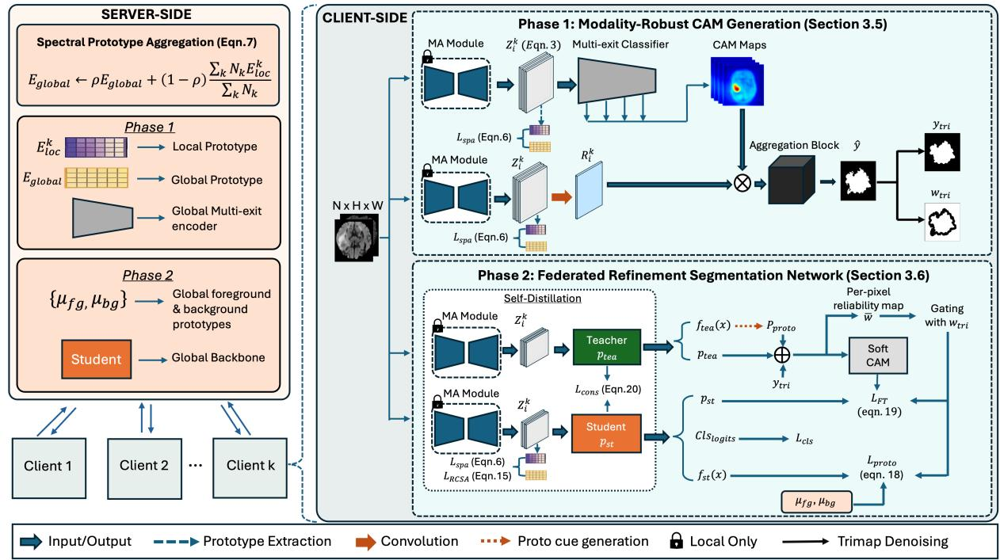
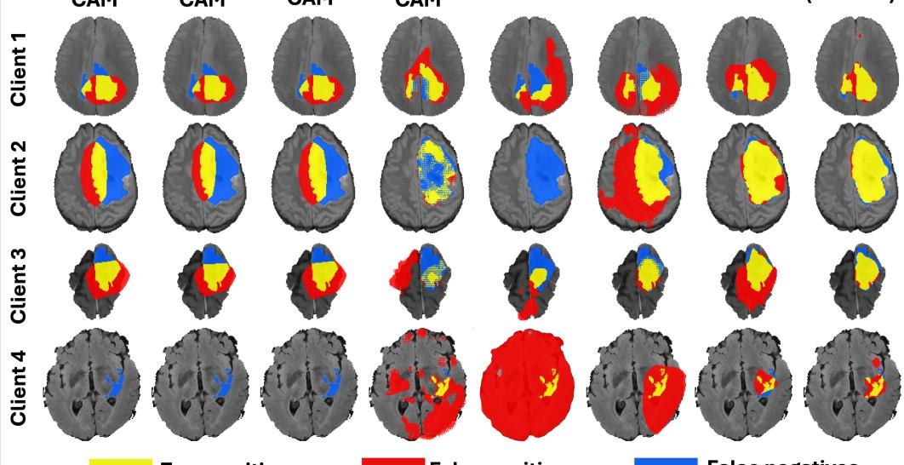
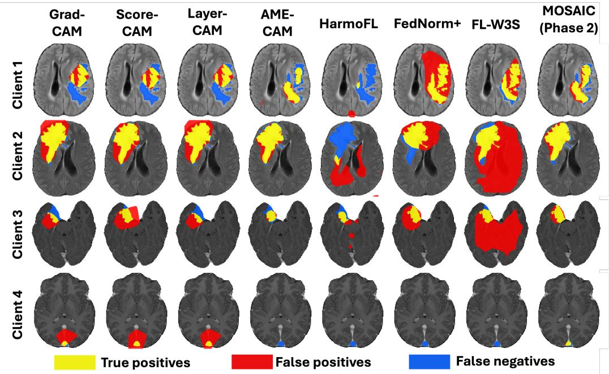
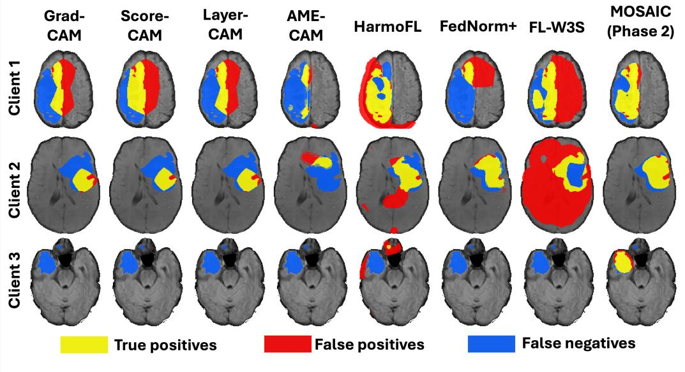
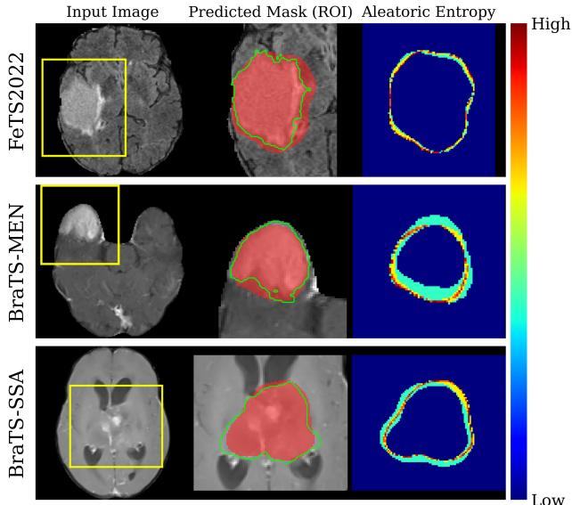
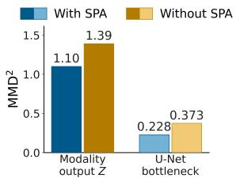
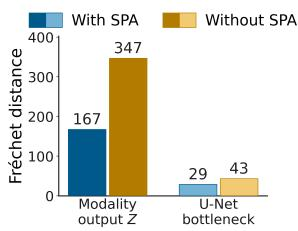

# MOSAIC: Modality-agnostic Spectral Alignment for Federated Image-level Weakly Supervised Tumor Segmentation under Client-specific Missing Modalities

Tarun Kumar Garg1 Vaanathi Sundaresan2, †

1Department of IISc Mathematics Initiative, Indian Institute of Science, Bengaluru 560012, Karnataka, India 2Department of Computational and Data Sciences, Indian Institute of Science, Bengaluru 560012, Karnataka, India

†Corresponding author: vaanathi@iisc.ac.in

Abstract. Trustworthy multimodal fusion in clinical settings requires handling incomplete and heterogeneous modality subsets across institutions, where privacy constraints prohibit centralized data sharing. Federated learning (FL) mitigates data-sharing constraints but sufers from client-specific missing modalities, where institutions possess incomplete multimodal subsets, degrading fusion quality and segmentation performance. While FL and weak supervision have been studied separately, their joint use with image-level labels under heterogeneous missing modalities remains unaddressed. We propose MO-SAIC, the first modality-agnostic federated framework for weakly supervised binary tumor segmentation under client-specific missing modalities. We introduce a client-specific modality-alignment module that fuses available channels into a shared latent space without prior knowledge of modality identity, a spectral prototype alignment loss that reconciles cross-client distribution shift using compact non-invertible frequency-domain statistics, and a dedicated federated refinement network that denoises the resulting CAM pseudo-labels into accurate masks, breaking the accuracy ceiling of weak supervision. Experiments on three multi-institutional brain tumor benchmarks (FeTS2022, BraTS-MEN, and BraTS-SSA) demonstrate significant improvements over all image, box, and point-supervised baselines, approaching fully supervised accuracy using only image-level labels and reaching 0.84 Dice on FeTS2022. Dynamic new client addition enables previously unseen institutions to join an already-trained federation within 0.01–0.04 Dice without retraining. Code is available at https://github.com/Tarun2201/MOSAIC.

Keywords: Federated learning · Weakly supervised segmentation · Missing modality · Spectral prototype alignment · Image-level supervision

## 1 Introduction

Trustworthy multimodal fusion of medical imaging data is a prerequisite for reliable diagnosis, treatment planning, and longitudinal monitoring of disease progression [1, 2]. In neuro-oncology, fusing complementary information across multi-parametric MRI sequences, each capturing distinct tissue contrasts and pathological signatures, provides the volumetric and boundary measurements that guide surgical resection, radiotherapy target definition, and response assessment. Deep neural networks achieve strong performance when trained on large annotated cohorts, yet their clinical deployment is constrained by two persistent barriers: expert annotations are scarce and expensive, and patient data are siloed across institutions by privacy regulation.

Dense voxel-level annotation demands scarce neuroradiologist time, is subject to substantial interobserver variability, and cannot be assembled at scale. Weakly supervised segmentation (WSS) ofers a pragmatic alternative by learning from coarse labels that are far cheaper to obtain. Image-level labels, indicating only whether a structure is present, are the most economical, often extractable directly from existing radiology reports. Class activation maps (CAMs) and their variants recover spatial localization from such labels [3, 4], but the resulting pseudo-labels are coarse and noisy, making accurate boundary delineation a central open challenge.

Privacy regulation and institutional governance prohibit centralized aggregation of medical images. Federated learning (FL) resolves this by enabling hospitals to jointly train a shared model while data never leave the local site [5]. Standard FL optimizers address client drift [6], feature distribution shift [7], and inter-client alignment [8], but universally assume dense supervision and complete modality availability. Crucially, FL alleviates the data-sharing barrier but not the annotation barrier, making the combination of federated learning with weak supervision both natural and clinically compelling.

This combination is further complicated by modality heterogeneity specific to multi-institutional imaging: acquisition protocols difer across sites, so clients routinely possess diferent subsets of MRI modalities, rendering standard multimodal fusion architectures inapplicable. When modalities are missing, fusion quality degrades non-uniformly across clients: modalityincomplete clients generate spurious false positives from absent tissue contrast, and CAM pseudo-labels become unreliable without the discriminative channels that complete multimodal fusion would otherwise provide. Methods designed for missing modalities in FL rely on fully supervised training rather than imagelevel labels and modality-specific encoders that assume explicit knowledge of each client’s modality set [9, 10, 11]. The few existing federated WSS methods [12, 13, 14] do not address missing modalities, and no existing work addresses all three challenges jointly.

To address this gap, we propose MOSAIC, the first modality-agnostic FL framework for weakly supervised binary tumor segmentation under client-specific missing modalities, and the first to jointly address federated learning, image-level weak supervision, and heterogeneous multimodal missing modalities within a single end-to-end architecture. A lightweight clientspecific alignment module maps each client’s available modalities into a shared latent space using only channel count, enabling modality-agnostic multimodal fusion without metadata or bookkeeping. A spectral prototype alignment (SPA) loss aligns clients via compact frequency-domain band energies rather than raw spatial features, preserving privacy while measurably reducing cross-client feature divergence. CAM pseudolabels produced by this aligned model are refined by a dedicated federated segmentation network, breaking the accuracy ceiling of noisy weak supervision. Our main contributions are as follows:

• First federated framework for image-level WSS under missing modalities. We present the first modality-agnostic federated framework for end-to-end weakly supervised tumor segmentation under client-specific missing modalities, evaluated against sixteen baselines spanning four supervision levels across three clinically distinct datasets, including FeTS2022, BraTS-MEN, and BraTS-SSA, consistently outperforming all prior methods.

• Modality-agnostic client alignment. We introduce a client-specific alignment module conditioned solely on available channel count, eliminating modality bookkeeping and enabling modalityagnostic multimodal fusion under privacy constraints, allowing clients with unseen modality combinations to join an already-trained federation without retraining.

• Spectral prototype alignment with empirical divergence validation. We propose a privacy-preserving SPA loss that aligns clients via compact frequency-domain band energies, validated empirically using MMD2 and Fréchet distance, demonstrating measurable cross-client feature divergence reduction at two network depths.

• Two-phase weakly supervised refinement pipeline. We propose a two-phase architecture in which federated CAM pseudo-labels are progressively refined by a dedicated segmentation network, with each component validated via leaveone-out ablation.

• Comprehensive evaluation under realistic federation conditions. We conduct systematic experiments covering modality assignment sensitivity, dynamic new client addition, scalability under increasing client counts, SPA spectral resolution ablation over $\Omega \in \{ 2 , 4 , 6 , 8 , 1 0 , 1 2 , 1 4 , 1 6 \}$ radial frequency bands, and aleatoric uncertainty quantification across all three datasets.

## 2 Related Work

Our work bridges five research areas: weakly supervised segmentation, federated learning for medical imaging, federated weakly supervised segmentation, missing-modality learning and multimodal fusion, and frequency-domain alignment in federated learning.

## 2.1 Weakly supervised segmentation

Class activation mapping (CAM) established the dominant paradigm for recovering spatial localization from image-level labels. Subsequent methods improved localization through gradient-based weighting [3], forward-pass scoring [15], multi-level aggregation [16], afinity-based pseudo-label propagation [17], and selfsupervised equivariant attention [18]. Erasing-based strategies further improved activation coverage by iteratively suppressing discriminative regions to force the network to discover complementary cues. More recently, transformer-based methods have leveraged self-attention to produce more complete and spatially consistent activation maps [19]. In medical imaging, WSS has been applied to polyp segmentation, skin lesion detection [20], and brain tumor localization [21], where image-level labels are particularly economical as they can be derived directly from radiology reports. However, all existing WSS methods assume centralized data and homogeneous modality availability, limiting their applicability in multi-institutional settings. To our knowledge, MOSAIC is the first to extend imagelevel WSS to a federated setting with client-specific missing modalities.

## 2.2 Federated learning for medical image segmentation

FedAvg [22] introduced collaborative training without raw data sharing. Subsequent work addressed client drift (FedProx [6]), feature distribution shift (FedBN [7]), and inter-client contrastive alignment (MOON [8]). Personalized FL methods [23] introduced client-specific components alongside a shared global backbone. Despite their efectiveness, all these methods assume complete and identical modality availability across clients, an assumption routinely violated in multi-centre deployments where acquisition protocols and scanner availability difer across institutions.

## 2.3 Federated weakly supervised segmentation

FedDM [12] calibrates noisy pseudo-labels generated from bounding-box-level supervision while mitigating client drift using hierarchical gradient de-conflicting. FedICRA [13] unified heterogeneous weak supervision through site-contrastive representation learning, while FedLPPA [14], a recent state of the art method leverages personalized prompts and adaptive decoder aggregation. FL-W3S [24] explored federated weakly supervised semantic segmentation using image-level labels for white blood cell segmentation. These methods use denser form of supervision (e.g., boxes, points, scribbles, and blocks) and none of them address clientspecific missing modalities alongside weak supervision, leaving the joint setting unaddressed.

## 2.4 Missing-modality learning and multimodal fusion

Robustness to missing modalities has been studied extensively in centralized settings. Shared latent projection methods map each available modality into a common representation and fuse any available subset [25]. Knowledge distillation approaches transfer representations from a full-modality teacher to a modality-incomplete student [26]. Generative methods reconstruct missing modalities from available ones, while transformer-based architectures have addressed missing modality fusion through masked reconstruction [1]. Beyond medical imaging, uncertainty-aware fusion frameworks quantify modality-level confidence under incomplete observations using evidential deep learning [27], and dynamic fusion mechanisms adaptively weight modality contributions based on input completeness [25]. Multimodal fusion under asynchronous and misaligned modalities has been addressed in clinical prediction using attention-based temporal alignment. Multimodal fusion has also been explored in clinical prediction by integrating heterogeneous sources such as clinical time-series and medical imaging [2]. These approaches address incomplete and asynchronously observed modalities by selectively fusing available information. In federated settings, existing missing modality methods rely on modalityspecific encoders [11], prototype-guided aggregation, per-modality feature extractors, or modality-aware normalisation [9], and all require full pixel-level supervision. In practice, modality availability is determined by scanner access, patient compliance, and institutional procurement, making client-specific missing modalities the norm rather than the exception in real multi-centre deployments. In contrast, MOSAIC operates under image-level weak supervision and conditions only on available channel count, enabling truly modality-agnostic multimodal fusion without pixelwise annotation or modality metadata.

## 2.5 Frequency-Domain Alignment in Federated Learning

The use of frequency-domain representations for domain alignment has roots in classic signal processing, where amplitude and phase decomposition separates style from content in natural images [28]. In deep learning, style transfer using Gram matrices of frequency statistics [29] demonstrated that spectral representations capture distributional properties efficiently. Applied to federated heterogeneity, HarmoFL [30] harmonized Fourier-domain amplitudes to mitigate client drift, and FedDG [31] performed federated domain generalization via continuous frequency space interpolation. These ideas have been extended to polyp segmentation [32] and heterogeneous medical imaging [33]. Prototype exchange has further proven efective for privacy-preserving crossclient alignment without exposing spatial features [34]. Existing frequency-domain methods assume complete modality availability. MOSAIC extends this line of work to the missing-modality setting by constructing spectral prototypes from whichever modalities a client holds, aligning only compact band energies across clients while preserving multimodal fusion quality under heterogeneous inputs.

## 2.6 Privacy-Preserving Federated Fusion

Privacy constraints fundamentally shape what information can be shared during multimodal fusion across institutions. Diferential privacy mechanisms [35] add calibrated noise to model updates to bound information leakage, while secure aggregation protocols [36] encrypt client contributions before server aggregation. Recent work has shown that sharing compact statistics rather than raw features or gradients provides an efective privacy-utility trade-of in federated settings [34, 33]. MOSAIC adopts this principle by sharing only non-invertible frequency-domain band energies rather than spatial feature maps, ensuring that no raw imaging data or reconstructible representation ever leaves a client.

In summary, no existing method unifies federated learning, image-level weak supervision, and clientspecific missing modalities; MOSAIC directly targets this gap by enabling modality-agnostic multimodal fusion across heterogeneous institutions without annotations beyond image-level labels.

## 3 Methodology

## 3.1 Problem Formulation

Let $\mathcal { M } = \{ m _ { 1 } , \dots , m _ { | \mathcal { M } | } \}$ denote the set of imaging modalities present across the federation, and let a fullmodal slice be $X ^ { \mathcal { M } } \in \mathbb { R } ^ { | \mathcal { M } | \times H \times W }$ , with H and W the spatial dimensions. We consider a federation of K clients (institutions), where each client k holds a

  
Figure 1: Overview of MOSAIC comprising K clients and a central server. Phase 1: Each client passes its available modalities through a local modality-alignment (MA) module to obtain $Z _ { i } ^ { k }$ . A multi-exit classifier generates CAMs which, together with a projection of $Z _ { i } ^ { k }$ , are processed by an aggregation network to produce pseudo-labels ${ \hat { y } } .$ The SPA loss aligns local prototypes $E _ { \mathrm { l o c } }$ to the global prototype $E _ { \mathrm { g l o b a l } }$ . Phase 2: An EMA teacher–student framework combines the teacher prediction $p _ { \mathrm { t e a } }$ , prototype cue $p _ { \mathrm { p r o t o } } ,$ and trimap target $y _ { \mathrm { t r i } }$ into a soft CAM that supervises the student via $\mathcal { L } _ { \mathrm { F T } }$ . The prototype-alignment loss $\mathcal { L } _ { \mathrm { p r o t o } }$ aligns student features $f _ { \mathrm { s t } }$ to federated prototypes $( \mu _ { \mathrm { f g } } , \mu _ { \mathrm { b g } } )$

private dataset:

$$
\begin{array} { r } { S _ { k } = \big \{ ( \boldsymbol { X } _ { i } ^ { k } , \boldsymbol { y } _ { i } ^ { k } ) \big \} _ { i = 1 } ^ { N _ { k } } , \quad \boldsymbol { X } _ { i } ^ { k } \in \mathbb { R } ^ { | \boldsymbol { M } _ { k } | \times { H } \times { W } } , } \end{array}\tag{1}
$$

with a client-specific modality subset $\mathcal { M } _ { k } \subseteq \mathcal { M }$ and a binary image-level label $y _ { i } ^ { k } \in \{ 0 , 1 \}$ indicating tumor presence. The subsets are heterogeneous: no modality is guaranteed to be present at every client, and some clients hold only a single modality. This induces two coupled challenges: cross-client distribution shift from heterogeneous multimodal inputs, and unreliable pseudo-labels from incomplete modality fusion, that standard federated methods cannot resolve jointly.

Our objective is to obtain client-personalized models $\theta _ { k }$ that map a modality-incomplete input to a spatial tumor-probability map $P _ { \theta _ { k } } ( X _ { i } ^ { \hat { k } } ) \in [ 0 , \overset { \cdot } { 1 } ] ^ { H \times W }$ using only image-level supervision, while data never leave the local site and only model parameters and compact statistics are communicated. Denoting by $\mathcal { L } _ { k }$ the local objective at client k and $\begin{array} { r } { N = \sum _ { k } N _ { k } } \end{array}$ , federated training minimizes the size-weighted sum of local objectives

$$
\operatorname* { m i n } _ { \{ \theta _ { k } \} } \sum _ { k = 1 } ^ { K } \frac { N _ { k } } { N } \mathcal { L } _ { k } \left( \mathcal { S } _ { k } ; \theta _ { k } \right) .\tag{2}
$$

## 3.2 Framework Overview

MOSAIC operates in two federated phases that share a common modality-agnostic core as shown in Figure 1. Phase 1 (modality-robust CAM generation)

trains a weakly supervised classifier and aggregation network to produce binary tumor pseudo-masks from image-level labels, using a classification-andaggregation pipeline [37]. Phase 2 (federated refinement segmentation) trains a dedicated segmentation network on these pseudo-masks, progressively denoising noisy weak supervision into accurate binary predictions.

Both phases are made robust to missing modalities through two shared components: a client-specific modality-alignment module (Sec. 3.3) that fuses each client’s heterogeneous modality subset into a shared representation, and a spectral prototype alignment (SPA) loss (Sec. 3.4) that reconciles residual crossclient distribution shift by exchanging only compact, non-invertible frequency statistics. Together, these components implement a privacy-preserving multimodal fusion strategy that requires no prior knowledge of modality identity and accommodates clients with previously unseen modality combinations. Phase 1 extends the weakly supervised classificationand-aggregation pipeline of [37], originally designed for centralized homogeneous-modality settings, to the federated missing-modality regime by integrating the modality-alignment module and SPA loss, enabling reliable CAM pseudo-label generation across clients with heterogeneous modality subsets. Phase 2 then addresses the pseudo-label noise amplified by modality incompleteness through a dedicated federated refinement network, breaking the accuracy ceiling of the original pipeline. Phase 1 is optimized with FedProx and Phase 2 with a reliability-weighted FedAvg.

## 3.3 Client-Specific Modality Alignment

Heterogeneous modality subsets prevent the shared, modality-dependent early layers from being aggregated directly without destroying complementary cross-modal information. Naive concatenation or zeroimputation of missing channels is inadequate because it either fixes the input dimensionality (preventing unseen modality combinations) or introduces spurious signals that corrupt the fused representation. We therefore equip each client k with a lightweight alignment module $A _ { \phi _ { k } }$ that implements a learned multimodal fusion operation mapping its local input into a common latent representation of fixed dimensionali $\mathrm { \Delta [ y , }$

$$
Z _ { i } ^ { k } = A _ { \phi _ { k } } ( X _ { i } ^ { k } ) , \quad Z _ { i } ^ { k } \in \mathbb { R } ^ { D \times H \times W } .\tag{3}
$$

The module is a shallow U-Net [38] with instance normalization that projects the $\vert \mathcal { M } _ { k } \vert$ available channels onto D canonical channels. Crucially, $A _ { \phi _ { k } }$ requires no prior knowledge of modality types and depends only on the number of channels a client holds, so clients with previously unseen modality combinations can join the federation without any modality bookkeeping. The parameters $\phi _ { k }$ are kept local and are never aggregated, which isolates modality-dependent fusion preprocessing at each site while allowing the shared downstream network to remain modality-agnostic. This design implements a form of personalized federated fusion where the fusion front-end is client-specific while the semantic processing backbone is globally shared. Crossclient consistency of $Z _ { i } ^ { k }$ is enforced by the spectral alignment loss of Sec. 3.4.

Communication overhead. The alignment module parameters $\phi _ { k }$ are kept strictly local and never transmitted, adding zero communication overhead relative to standard FedAvg. Only the shared backbone weights, together with the compact spectral statistics described below, are exchanged at each round.

## 3.4 Spectral Prototype Alignment (SPA)

Motivation. Combining heterogeneous imaging modalities induces discrepancies in the learned representation distributions, because diferent modalities carry distinct textural and structural signatures. In the frequency domain, amplitude statistics capture client-specific style information, including intensity distributions and texture signatures, while phase preserves semantic content [28, 33]. Sharing spatial feature statistics directly would risk reconstructing private imaging data; frequency-domain band energies are non-invertible by construction since they collapse the spatial layout of each frequency band into a single scalar, making reconstruction of the original feature map provably impossible from the shared statistics alone. This makes spectral prototypes an efective and privacy-safe proxy for cross-client multimodal fusion alignment.

Local spectral prototype construction. For a feature tensor $F ^ { ( k ) } \mathbf { \bar { \Psi } } \in \mathbb { R } ^ { B \times \mathbf { \bar { D } } \times H \times W }$ at client k (batch size B, D channels), we compute the 2-D discrete Fourier transform of each channel map $f _ { c , b }$

$$
F _ { c , b } ( u , v ) = \sum _ { h = 0 } ^ { H - 1 } \sum _ { w = 0 } ^ { W - 1 } f _ { c , b } ( h , w ) e ^ { - j 2 \pi \left( \frac { u h } { H } + \frac { v w } { W } \right) } ,\tag{4}
$$

and partition the frequency plane into Ω nonoverlapping radial bands. Let $r ( u , v )$ be the radial distance of coeficient $( u , v )$ from the spectrum centre, $r _ { \operatorname* { m a x } } =$ min $( H / 2 , W / 2 )$ , and $\mathbf { 1 } _ { \omega } ( u , v )$ the indicator that $( u , v )$ falls in band $\omega \in \{ 1 , \ldots , \Omega \}$ , which spans radii $[ ( \omega - 1 ) r _ { \mathrm { { m a x } } } / \Omega , \omega r _ { \mathrm { { m a x } } } / \Omega )$ . Radial binning aggregates coeficients at equal spatial frequencies regardless of orientation, producing a rotationinvariant summary of the spectral energy distribution. With $\begin{array} { r } { C _ { \omega } = \sum _ { u , v } \mathbf { 1 } _ { \omega } ( u , v ) } \end{array}$ , the local spectral prototype $E _ { \mathrm { l o c } } ^ { k } \in \mathbb { R } ^ { D \times \Omega }$ is the band-wise mean amplitude,

$$
E _ { \mathrm { l o c } } ^ { k } ( c , \omega ) = \frac { 1 } { B } \sum _ { b = 1 } ^ { B } \frac { 1 } { C _ { \omega } } \sum _ { u , v } | F _ { c , b } ( u , v ) | \mathbf { 1 } _ { \omega } ( u , v ) ,\tag{5}
$$

with the convention $E _ { \mathrm { l o c } } ^ { k } ( c , \omega ) = 0$ when $C _ { \omega } = 0$

Global prototype aggregation and alignment. At each round $t ,$ the server broadcasts a global prototype $E _ { \mathrm { g l o b a l } } ^ { ( t ) }$ (initialized to ones), and every client aligns to it by minimizing

$$
\mathcal { L } _ { \mathrm { S P A } } ^ { ( k , t ) } = \frac { 1 } { D \Omega } \sum _ { c = 1 } ^ { D } \sum _ { \omega = 1 } ^ { \Omega } \left( E _ { \mathrm { l o c } } ^ { k , ( t ) } ( c , \omega ) - E _ { \mathrm { g l o b a l } } ^ { ( t ) } ( c , \omega ) \right) ^ { 2 } .\tag{6}
$$

After local training, clients transmit only their aggregated band statistics $E _ { \mathrm { l o c } } ^ { k , ( t ) }$ , and the server updates the global prototype with a size-weighted exponential moving average (EMA),

$$
E _ { \mathrm { g l o b a l } } ^ { ( t + 1 ) } = \rho E _ { \mathrm { g l o b a l } } ^ { ( t ) } + ( 1 - \rho ) \frac { \sum _ { k } N _ { k } E _ { \mathrm { l o c } } ^ { k , ( t ) } } { \sum _ { k } N _ { k } } , \quad 0 \leq \rho < 1 .\tag{7}
$$

The EMA momentum $\rho$ controls the rate at which the global prototype adapts to new client statistics: a high $\rho$ stabilizes the target against noisy local estimates, while a low $\rho$ allows faster adaptation to distribution shifts introduced by newly joining clients. Because only compact band energies of dimensionality $D \times \Omega$ are exchanged per client per round, the communication overhead of SPA is negligible relative to backbone weight transmission. The SPA loss is applied at two depths: at the modality-alignment output $Z _ { i } ^ { k }$ and at an intermediate backbone feature so that both the multimodal fusion representation and the learned semantic features are regularized toward the global consensus. A region-conditioned variant, RCSA, which applies this alignment separately to tumor and background features, is introduced in Sec.3.6.

Privacy analysis. The shared statistics $E _ { \mathrm { l o c } } ^ { k }$ are band-wise mean amplitudes collapsed over all spatial positions within each frequency band. Because spatial layout information is discarded by the mean pooling, the original feature map cannot be reconstructed from $E _ { \mathrm { l o c } } ^ { k }$ alone. The mapping from feature map to band energy is many-to-one and non-invertible. This property ensures that no raw imaging data, spatial feature map, or reconstructible patient-specific representation is ever transmitted beyond the local client, satisfying the data locality requirement of FL while enabling effective cross-client multimodal fusion alignment.

Both foreground and background prototypes are federated (only normalized band statistics are shared) preserving the same privacy guarantees as standard SPA.

## 3.5 Phase 1: Modality-Robust CAM Generation

To obtain pixel-level supervision from image-level labels, a classification backbone predicts slice-level tumor presence and produces class activation maps, which are refined by an aggregation network into a binary tumor pseudo-mask $\breve { y } _ { i } ^ { k } \in \{ 0 , 1 \} ^ { H \times W }$ as shown in the client-side of Figure 1. Both networks are made modality-agnostic by our two core components: each client’s input passes through its modality-alignment module Sec. 3.3), and the SPA loss (Sec. 3.4) is imposed at two depths of each network to align multimodal fusion representations across clients. Each client’s input first passes through the modalityalignment module (Sec. 3.3) to obtain the aligned representation $Z _ { i } ^ { k }$ . The multi-exit classifier then encodes $Z _ { i } ^ { k }$ through four stage exits, each producing a onechannel CAM that is globally pooled and resized to the input resolution. These CAMs, together with a singlechannel projection $( R _ { i } ^ { k } )$ of $Z _ { i } ^ { k }$ , are then processed by the aggregation network, to produce the pseudolabels( yˆ). Both networks are trained federatedly with FedProx, while the SPA loss (Sec. 3.4) is imposed at two depths of each network to align multimodal fusion representations across clients. The characteristic failure mode of image-level weak supervision in the missing-modality setting is mislocalization rather than under-segmentation: without the contrast provided by a discriminative modality such as FLAIR, CAM activations shift toward high-intensity artifacts rather than tumor boundaries. This label noise, rather than the capacity of the downstream network, is the dominant limitation and motivates the refinement stage of Phase 2.

## 3.6 Phase 2: Federated Refinement Segmentation Network

Phase 2 trains a federated segmentation network on the CAM pseudo-labels $\hat { y } _ { i } ^ { k }$ . Rather than fitting noisy masks directly, it is supervised by a target that is continuously refined by CAM-independent cues and denoised where the CAM is untrustworthy. Each client couples its local modality-alignment module with a shared 4-level U-Net backbone [38] that returns segmentation logits, the last decoder feature $f \in$ $\mathbb { R } ^ { D _ { s } \times H \times W }$ , and a slice-level presence logit $( c l s _ { l o g i t s } )$ Let $p _ { \mathrm { s t } } \in \mathsf { \Gamma } [ 0 , 1 ] ^ { H \times W }$ and $f _ { \mathrm { s t } } \bar { ( \boldsymbol { x } ) } \in \mathbb { R } ^ { D _ { s } \times \breve { H } \times \breve { W } }$ denote the student’s pixel probabilities and decoder features, and $p _ { \mathrm { t e a } } , f _ { \mathrm { t e a } } ( x )$ the corresponding EMA teacher outputs. Three consecutive slices are stacked as 2.5D input to supply volumetric context, with only the central slice supervised. Alongside the trainable student, each client maintains an EMA teacher that provides stable predictions for target refinement.

Student and teacher updates. At the beginning of each communication round, the student is initialized from the global backbone $\theta _ { g }$ and local adapter ϕ , i.e., $\theta _ { s } ^ { k }  \theta _ { g } ,$ , forming the student model $\Theta _ { s } ^ { k } = \left( \theta _ { s } ^ { k } , \phi _ { k } \right)$ The student is then optimized using Eq. (21). The teacher $\Theta _ { \mathrm { t e a } } ^ { k }$ is never optimized or aggregated; instead, after each optimization step it is updated as an EMA of the student,

$$
\Theta _ { \mathrm { t e a } } ^ { k }  \eta \Theta _ { \mathrm { t e a } } ^ { k } + ( 1 - \eta ) \Theta _ { s } ^ { k } ,\tag{8}
$$

and is carried across communication rounds as a stable client-specific reference. At each step the teacher runs in inference mode on the same input, producing $p _ { \mathrm { t e a } }$ and $f _ { \mathrm { t e a } } ( x )$ without gradients. The teacher-student design provides a second, CAM-independent segmentation cue that is particularly valuable when the CAM pseudo-labels are unreliable due to missing modalities.

Trimap denoising. The raw CAM pseudo-mask $\hat { y }$ is converted into a denoised supervision target $y _ { \mathrm { t r i } }$ and binary keep-weight $w _ { \mathrm { t r i } }$ by partitioning each positive slice into confident foreground, ignore, and confident background regions. Building on confident learning [39] and ignore-region supervision [40], isolated speckle components are removed as CAM false positives; an eroded CAM core is retained as confident foreground; a dilated boundary ring is marked as ignore to avoid enforcing the CAM’s potentially inaccurate contour; and the exterior is treated as confident background. For a tumor-present slice whose CAM is empty, the entire slice is assigned to the ignore region while its image-level presence label remains 1. The resulting ytri provides the denoised pseudo-label, while $w _ { \mathrm { t r i } } \in \{ 0 , 1 \}$ masks out the ignore region during supervision.

Prototype- and teacher-refined target. Under missing modalities, the CAM pseudo-label yˆ can sufer from mislocalization. Rather than supervising directly on $y _ { \mathrm { t r i } }$ , we treat it as one of three complementary pixellevel cues and derive the training target from their consensus (10). The second cue is the mean teacher [41] prediction $p _ { \mathrm { t e a } }$ . The third is a prototype segmentation cue derived from a global foreground and background prototype bank $( \mu _ { \mathrm { f g } } , \mu _ { \mathrm { b g } } ) \in \mathbb { R } ^ { \bar { D } _ { s } }$ [34], broadcast to every client at the start of each round and updated at its end. The prototype cue is read from the teacher feature $f _ { \mathrm { t e a } } ( x )$ by cosine similarity,

$$
p _ { \mathrm { p r o t o } } ( x ) = \sigma \left( \frac { \cos \langle f _ { \mathrm { t e a } } ( x ) , \mu _ { \mathrm { f g } } \rangle - \cos \langle f _ { \mathrm { t e a } } ( x ) , \mu _ { \mathrm { b g } } \rangle } { \tau } \right) ,\tag{9}
$$

with temperature τ. Hence, $p _ { \mathrm { p r o t o } } \in [ 0 , 1 ] ^ { H \times W }$ is a federation-wide segmentation cue obtained by comparing each pixel’s feature to the global tumor and background prototypes; because it fuses evidence from all modality subsets, a client with a poor CAM still receives a reliable segmentation estimate. The CAM, teacher, and prototype cues $\{ y _ { \mathrm { t r i } } , p _ { \mathrm { t e a } } , p _ { \mathrm { p r o t o } } ( x ) \}$ , are fused into the training target by a soft vote, with pixels on which they disagree down-weighted,

$$
\begin{array} { r } { s = \sigma \big ( \delta \left[ ( y _ { \mathrm { t r i } } - \frac { 1 } { 2 } ) + ( p _ { \mathrm { t e a } } - \frac { 1 } { 2 } ) + ( p _ { \mathrm { p r o t o } } - \frac { 1 } { 2 } ) \right] \big ) _ { \lambda } ; } \end{array}\tag{10}
$$

$$
\bar { w } = \mathrm { c l a m p } ( | 2 s - 1 | , 0 . 1 , 1 ) ,\tag{11}
$$

where 0.5 subtracted from each term pushes the uncertain voxels $( \leq 0 . 5 )$ to ≤ 0 and δ scales the sharpness of the vote before being passed to the sigmoid $( \sigma )$ and s denotes the softCAM, the CAM-based pseudolabel softened by the teacher and prototype cues and serves as target label for segmentation loss objectives. Label-0 slices receive an empty target at full weight. The decisiveness $| 2 s - 1 |$ is near 1 where the three cues agree and near 0 where they conflict, giving w¯ the role of a per-pixel reliability map (shown in Figure1). The trimap keep-weight then gates this reliability,

$$
w  \bar { w } \cdot w _ { \mathrm { t r i } } ,\tag{12}
$$

so that pixels the trimap marked ignore contribute no gradient at all.

Prototype update. The refined target s and reliability weight w are used to update the client-side foreground and background prototypes from the student features. For client k we generate the local prototype as:

$$
\mu _ { \mathrm { f g } } ^ { k } = \frac { \sum _ { x } w ( x ) \mathcal { H } [ s ( x ) > \frac { 1 } { 2 } ] f _ { \mathrm { s t } } ( x ) } { n _ { \mathrm { f g } } ^ { k } } ,\tag{13}
$$

where $\begin{array} { r } { n _ { \mathrm { f g } } ^ { k } = \sum _ { x } w ( x ) \mathcal { H } [ s ( x ) > \frac { 1 } { 2 } ] } \end{array}$ , and similarly $\mu _ { \mathrm { b g } } ^ { k }$ is formed identically over the complementary support $\begin{array} { r } { \mathbb { H } [ s ( x ) \leq \frac { 1 } { 2 } ] } \end{array}$ . In (13) the numerator is the reliabilityweighted sum of student features over the foreground voxels of the softCAM target (where $s > 0 . 5 )$ and $n _ { \mathrm { f g } } ^ { k }$ is the corresponding total weight, making $\mu _ { \mathrm { f g } } ^ { k }$ their weighted mean. The server aggregates the uploaded prototypes using confidence-weighted averaging,

$$
\mu _ { \mathrm { f g } } = \frac { \sum _ { k } n _ { \mathrm { f g } } ^ { k } \mu _ { \mathrm { f g } } ^ { k } } { \sum _ { k } n _ { \mathrm { f g } } ^ { k } } , \qquad \mu _ { \mathrm { b g } } = \frac { \sum _ { k } n _ { \mathrm { b g } } ^ { k } \mu _ { \mathrm { b g } } ^ { k } } { \sum _ { k } n _ { \mathrm { b g } } ^ { k } } ,\tag{14}
$$

and broadcasts them for the next round.

Region-conditioned spectral alignment (RCSA). Standard SPA aligns the full feature spectrum without distinguishing tumor from background regions. However, the spectral signatures of tumor and healthy tissue difer substantially and hence aligning them jointly risks suppressing diagnostically relevant modality-specific contrast. We therefore introduce a region-conditioned variant that splits each feature map into foreground and background using the softCAM (obtained in (11)) as segmentation target: The prototype construction of Eqs. (4)–(5) is then applied in exactly the same manner to the two masked feature maps $\bar { Z } _ { i } ^ { k } \odot s$ and $Z _ { i } ^ { k } \odot ( 1 - s )$ , giving a foreground and a background spectral signature

$E _ { \mathrm { f g } } , E _ { \mathrm { b g } } \in \mathbb { R } ^ { D \times \Omega }$ , each aligned to its own consensus maintained by the EMA of Eq. (7),

$$
\begin{array} { r l } & { \mathcal { L } _ { \mathrm { R C S A } } = \frac { 1 } { D \Omega } \big | \big | E _ { \mathrm { b g } } - E _ { \mathrm { b g } } ^ { \mathrm { g l o b } } \big | \big | _ { F } ^ { 2 } + } \\ & { \qquad \mathcal { k } [ \sum _ { x } s ( x ) > n _ { \mathrm { m i n } } ] \frac { 1 } { D \Omega } \big | \big | E _ { \mathrm { f g } } - E _ { \mathrm { f g } } ^ { \mathrm { g l o b } } \big | \big | _ { F } ^ { 2 } , } \end{array}\tag{15}
$$

Here, the indicator disables the foreground term when the predicted tumor mass falls below $n _ { \mathrm { m i n } }$ pixels. Splitting the features in foreground and background keeps the two tissue types from being pulled toward each other, since neither is aligned to the other’s consensus.

Prototype-alignment loss. The global prototypes also shape the student feature space directly. Let $c ( x ) = \mathcal { H } [ w ( x ) \geq \rho ]$ select confident pixels, and define the confident foreground and background sets $\mathcal { F } = \{ x : s ( x ) > \textstyle { \frac { 1 } { 2 } } , c ( x ) = 1 \}$ and $B = \{ x : s ( x ) \leq$ $\textstyle { \frac { 1 } { 2 } } , c ( x ) = 1 \}$ . The prototype-alignment loss pulls each confident pixel feature toward its class prototype and repels it from the other with a zero-margin hinge,

$$
\begin{array} { r } { \ell _ { \mathrm { f g } } ( x ) = 1 - \cos \langle f _ { \mathrm { s t } } ( x ) , \mu _ { \mathrm { f g } } \rangle + [ \cos \langle f _ { \mathrm { s t } } ( x ) , \mu _ { \mathrm { b g } } \rangle ] _ { + } , } \end{array}\tag{16}
$$

$$
\begin{array} { r } { \ell _ { \mathrm { b g } } ( x ) = 1 - \cos \langle f _ { \mathrm { s t } } ( x ) , \mu _ { \mathrm { b g } } \rangle + [ \cos \langle f _ { \mathrm { s t } } ( x ) , \mu _ { \mathrm { f g } } \rangle ] _ { + } , } \end{array}\tag{17}
$$

$$
\mathcal { L } _ { \mathrm { p r o t o } } = \frac { 1 } { | \mathcal { F } | + | \mathcal { B } | } \left( \sum _ { x \in \mathcal { F } } \ell _ { \mathrm { f g } } ( x ) + \sum _ { x \in \mathcal { B } } \ell _ { \mathrm { b g } } ( x ) \right) .\tag{18}
$$

where $[ \cdot ] _ { + } = \operatorname* { m a x } ( 0 , \cdot )$ The server aggregates the backbones by a reliability-weighted FedAvg [22] with weight proportional to $N _ { k } \bar { w }$ , keeping the modality modules and mean teachers local and communicating only weights and the compact prototype/spectral statistics.

Full training objective. The per-client objective combines a set of loss objectives. The first one is weighted Focal-Tversky segmentation loss [42]:

$$
\begin{array} { r } { \mathcal { L } _ { \mathrm { F T } } = \left( 1 - \frac { \mathrm { T P } + \varepsilon } { \mathrm { T P } + \alpha _ { T } \mathrm { F P } + \beta _ { T } \mathrm { F N } + \varepsilon } \right) ^ { \gamma } } \\ { + \lambda _ { b } \mathrm { B C E } _ { w } ( \log \mathrm { i t s } , s ) , ~ } \end{array}\tag{19}
$$

where $\mathrm { B C E } _ { w }$ is the w-weighted binary cross-entropy, $p _ { \mathrm { s t } } ~ = ~ \sigma ( \mathrm { l o g i t s } )$ , s denotes the SoftCAM defined in Eq. (11) and ${ \dot { T } } P , F P , F N$ denote true positives, false positives and false negatives within non-zero trimap regions (excluding boundary voxels). The segmentation loss is combined with prototype alignment ${ \mathcal { L } } _ { \mathrm { p r o t o } } ,$ a teacher–student consistency term:

$$
\mathcal { L } _ { \mathrm { c o n s } } = \frac { 1 } { H W } \sum _ { x } w ( x ) \big ( p _ { \mathrm { s t } } ( x ) - p _ { \mathrm { t e a } } ( x ) \big ) ^ { 2 } ,\tag{20}
$$

which anchors the student to the EMA teacher of Eq. (8) on the reliable pixels, the binary cross-entropy classification loss $( { \mathcal { L } } _ { \mathrm { c l s ~ \ a p p l i e d ~ o n ~ } c l s _ { l o g i t s } } )$ , a multiscale intensity-gated CRF(Conditional Random Field) loss [43, 44], and the spectral alignment losses (6) and (15). The CRF operates on a $3 { \times } 3$ neighborhood with multiple dilation rates and combines spatial and intensity afinities, encouraging label consistency within homogeneous regions while weakening interactions across intensity discontinuities. The local objective for client k is

$$
\begin{array} { r l } & { \mathcal { L } _ { k } = \mathcal { L } _ { \mathrm { F T } } + \lambda _ { p } \mathcal { L } _ { \mathrm { p r o t o } } + \lambda _ { c } \mathcal { L } _ { \mathrm { c o n s } } + \lambda _ { g } \mathcal { L } _ { \mathrm { c l s } } } \\ & { \qquad + \lambda _ { r } \mathcal { L } _ { \mathrm { C R F } } + \lambda _ { \mathrm { s p } } \mathcal { L } _ { \mathrm { S P A } } + \lambda _ { \mathrm { r c } } \mathcal { L } _ { \mathrm { R C S A } } . } \end{array}\tag{21}
$$

Each term targets a distinct failure mode of weak supervision under missing modalities: $\mathcal { L } _ { \mathrm { F T } }$ fits the refined target that counters the foreground–background imbalance of small tumors; $\mathcal { L } _ { \mathrm { p r o t o } }$ (18) keeps the CAM-independent prototype cue discriminative for clients with poor pseudo-labels; ${ \mathcal { L } } _ { \mathrm { c o n s } }$ stabilizes training against the target $s ,$ which drifts as $\zeta$ ramps and the prototypes move; $\mathcal { L } _ { \mathrm { c l s } }$ exploits the only clean label available and supplies the test-time gate against false positives on tumor-free slices; $\mathcal { L } _ { \mathrm { C R F } }$ restores the tumor contour; $\mathcal { L } _ { \mathrm { S P A } }$ (6) addresses the missing modalities; and $\mathcal { L } _ { \mathrm { { R C S A } } }$ (15) confines that invariance to the tumor, preserving clinically meaningful background contrast.

Reliability-weighted aggregation. The server aggregates the backbone across clients by a reliabilityweighted FedAvg [22],

$$
\theta _ { g } \gets \sum _ { k \in \mathcal { K } _ { t } } \frac { N _ { k } r _ { k } } { \sum _ { j \in \mathcal { K } _ { t } } N _ { j } r _ { j } } \theta _ { s } ^ { k } , \quad r _ { k } = \bar { w } ^ { k } ,\tag{22}
$$

where $r _ { k }$ is client $k \mathrm { { s } }$ mean per-pixel reliability for the round. Reliability weighting is particularly important under modality heterogeneity: clients whose modality subset yields more discriminative pseudolabels contribute more to the global backbone than size weighting alone would allow, preventing modality-poor clients from disproportionately degrading the shared representation. Prototypes are aggregated by countweighted mean and band statistics by Eq. (7); modality modules and mean teachers stay local, and only weights plus these compact statistics are communicated. At inference, predictions are averaged with those of the horizontally flipped stack and thresholded at 0.5, and a slice is forced empty if the presence gate does not fire $( \sigma ( \mathrm { c l s } ) < 0 . 5 )$ The complete Phase 2 client–server training pipeline is summarized in Algorithm 1.

## 4 Experimental Setup

## 4.1 Dataset Details

We evaluate MOSAIC on three publicly available multi-institutional brain tumor MRI datasets spanning two tumor types and three clinical populations, providing a comprehensive test of generalization across heterogeneous federation conditions.

FeTS2022. The Federated Tumor Segmentation 2022 dataset [45, 46, 47, 48], available through the FeTS 2022 Challenge repository on Synapse is the publicly available federated extension of the multiinstitutional BraTS glioma benchmark, providing MRI modalities (FLAIR, T1, T1ce, T2) with expert tumor annotations. We partition the dataset into four clients with deliberately heterogeneous modality subsets: Client 1 {FLAIR, T1ce}, Client 2 {FLAIR, T2}, Client 3 {T1ce, T2}, and Client 4 {FLAIR}, where Client 4 holds only a single modality. The assignment is designed to maximize modality heterogeneity across clients while ensuring each modality appears in at least one client, reflecting realistic multi-centre acquisition variability where no single sequence is universally available. Crucially, the three datasets used in this work: FeTS2022, BraTS-MEN, and BraTS-SSA, each carry distinct client-wise modality configurations (see Table 1), collectively spanning all four

Algorithm 1 MOSAIC Phase 2: Federated refine  
ment of segmentation   
Input: Clients $\{ S _ { k } \} _ { k = 1 } ^ { K } ,$ each with slices $( X ^ { k } , y ^ { k } )$ and   
Phase-1 CAM masks ${ \widehat { y } } ^ { k } \ ( \operatorname { S e c . } \ 3 . 5 ) \colon$ rounds $T ;$ loss   
weights {λ} of (21); temperature $\tau \ ( 9 )$ , sharpness   
$\delta ~ ( 1 0 )$ , momentum η (8); ramp $\zeta ( \cdot )$   
Output: global backbone $\theta _ { g } ;$ personalized modules   
$\{ \phi _ { k } \}$ and best backbones   
1: init. $\theta _ { g } .$ , modules $\{ \phi _ { k } \}$ , teachers $\big \{ \Theta _ { \mathrm { t e a } } ^ { k } \big \}$ , prototypes   
$( \mu _ { \mathrm { f g } } , \mu _ { \mathrm { b g } } ) , E _ { \mathrm { g l o b a l } }$   
2: for $t = 1 , \dots , T$ do   
3: $\zeta \gets \zeta ( t )$   
4: for all clients $k$ in parallel do   
5: $\theta _ { s } ^ { k }  \theta _ { g }$ {download global backbone}   
6: for all minibatches $\mathsf { \bar { \Psi } } ( X ^ { k } , \hat { y } ^ { k } , y ^ { k } ) \in S _ { k } ^ { \mathsf { \bar { \alpha } } }$ do   
7: $Z ^ { k } \gets A _ { \phi _ { k } } ( X ^ { k } )$ {2.5D input → modality   
alignment}   
8: $( p _ { \mathrm { t e a } } , f _ { \mathrm { t e a } } ) \gets \mathrm { t e a c h e r } ( Z ^ { k } ) ; ~ p _ { \mathrm { p r o t o } } \gets ( 9 )$ on   
$f _ { \mathrm { t e a } }$   
9: $( y _ { \mathrm { t r i } } , w _ { \mathrm { t r i } } ) \gets \mathrm { T R I M A P } ( \widehat { y } ^ { k } , y ^ { k } )$   
10: $\begin{array} { r l r l r l } { \dot { s } } & { { } \ } & {  \ } & { \sigma \big ( \delta [ ( y _ { \mathrm { t r i } } - \frac { 1 } { 2 } ) } & { { } + } & { ( p _ { \mathrm { t e a } } - \frac { 1 } { 2 } ) } & { { } + } \end{array}$   
$( p _ { \mathrm { p r o t o } } - \frac { 1 } { 2 } ) ] ) ( 1 0 )$   
11: $\bar { w }  \mathrm { c l a m p } ( | 2 s - 1 | , 0 . 1 , 1 )$   
12: if $y = 0$ then   
13: $s  \mathbf { 0 } , \quad \bar { w }  \mathbf { 1 }$ {clean supervision on   
tumor-free slices}   
14: end if   
15: $w  \bar { w } \cdot w ^ { \mathrm { t r i } } ( 1 2 )$   
16: $( p _ { \mathrm { s t } } , f _ { \mathrm { s t } } , \mathrm { c l s } _ { l o g i t s } ) \gets$ studen $; ( Z ^ { k } )$   
17: compute $L _ { k }$ by (21); optimizer step on   
$( \theta _ { s } ^ { k } , \phi _ { k } )$   
18: $\begin{array} { r } { \Theta _ { \mathrm { t e a } } ^ { \bar { k } }  \eta \Theta _ { \mathrm { t e a } } ^ { k } + ( 1 - \eta ) \Theta _ { s } ^ { k } } \end{array}$ {EMA teacher}   
19: accumulate local prototypes, spectral stats,   
$\bar { w }$   
20: end for   
21: upload $\theta _ { s } ^ { k } ,$ prototypes, spectral stats, mean   
reliability $r _ { k }$   
22: end for   
23: $\theta _ { g } \gets \sum _ { k } \frac { N _ { k } r _ { k } } { \sum _ { j } { N _ { j } r _ { j } } } \theta _ { s } ^ { k }$ {reliability-weighted Fe  
dAvg}   
24: update $( \mu _ { \mathrm { f g } } , \mu _ { \mathrm { b g } } )$ (count-weighted mean); up  
date $E _ { \mathrm { g l o b a l } } \ \mathrm { b y } \ ( 7 )$   
25: end for   
26: return $\theta _ { g } , \left\{ \phi _ { k } \right\}$ , per-client best backbones

MRI sequences across diverse assignment patterns. This cross-dataset variability serves as an implicit test of robustness to modality assignment choice: consistent performance across three structurally diferent federation configurations provides stronger evidence of generalization than any single-dataset permutation study.

BraTS-MEN. The BraTS 2023 intracranial meningioma dataset [49], publicly available through the BraTS 2023 Meningioma Challenge repository on Synapse, provides the same four MRI modalities across 160 subjects partitioned into four clients (40 subjects each) with modality subsets {FLAIR, T1ce}, {FLAIR, T2}, {T1ce, T2}, and {T1ce}, evaluating generalization across tumor type and clinical population under a diferent modality configuration from FeTS2022.

BraTS-SSA. The BraTS 2023 Sub-Saharan Africa (SSA) glioma dataset [50], publicly available through the BraTS 2023 SSA dataset repository on Kaggle, provides the same modalities across 60 subjects partitioned into three clients (20 subjects each) with subsets {FLAIR}, {T1ce, T2}, and {FLAIR, T2}, stressing the framework under limited data, an underrepresented clinical population, and a three-client federation structure distinct from the four-client FeTS2022 and BraTS-MEN configurations.

Preprocessing and supervision. All three datasets provide four co-registered, skull-stripped modalities, and are processed with an identical protocol: each modality is independently normalized to [0, 1], every 3D volume is converted to axial 2D slices, and tumor sub-regions are merged into a single foreground class for binary segmentation. Image-level supervision is generated automatically by assigning $y = 1$ to slices containing at least one tumor voxel and $y = 0$ otherwise, requiring no additional annotation efort beyond what is routinely available in existing radiology reports. Complete client-wise modality assignments and data splits are summarized in Table 1. Subject-wise training, validation, and test splits ensure that there is no subject-level data leakage across the splits.

Evaluation metrics. We report Dice score, IoU, and 95th percentile Hausdorf distance (HD95) per client and macro-averaged across clients. Per-slice standard deviations are reported as subscripts in all result tables. To assess the statistical significance of observed performance diferences, we apply the nonparametric two-sided paired Wilcoxon signed-rank test between MOSAIC and each baseline, with a significance threshold of $p < 0 . 0 1$

## 4.2 Implementation Details

Phase 1. A federated binary tumor classifier and aggregation network are trained on individual 2D axial slices using FedProx for 100 communication rounds with 5 local epochs per round, batch size 64, learning rate $1 0 ^ { - 3 }$ , and SPA weight $\lambda _ { \mathrm { s p } } ~ = ~ 0 . 1$ The trained aggregation network generates CAM pseudomasks thresholded to binary for all slices, which serve as supervision for Phase 2. Validation and test sets additionally retain ground-truth masks for evaluation.

Table 1: Client-wise modality subsets and data splits for the three datasets (FeTS2022, BraTS-MEN, and BraTS-SSA). Entries are slices (subjects in parentheses).
<table><tr><td>Dataset</td><td>Client</td><td>Modalities</td><td>Train</td><td>Val</td><td>Test</td></tr><tr><td rowspan="4">FeTS2022</td><td>1</td><td>FLAIR, T1ce</td><td>4495 (29)</td><td>1395 (9)</td><td>1395 (9)</td></tr><tr><td>2</td><td>FLAIR, T2</td><td>3255 (21)</td><td>1085 (7)</td><td>1085 (7)</td></tr><tr><td>3</td><td>T1ce, T2</td><td>3255 (21)</td><td>1085 (7)</td><td>1085 (7)</td></tr><tr><td>4</td><td>FLAIR</td><td>3410 (22)</td><td>930 (6)</td><td>930 (6)</td></tr><tr><td rowspan="4">BraTS-MEN</td><td>1</td><td>FLAIR, T1ce</td><td>3720 (24)</td><td>1240 )(8)</td><td>1240 (8)</td></tr><tr><td>2</td><td>T1ce</td><td>3720 (24)</td><td>1240 (8)</td><td>1240 (8)</td></tr><tr><td>3</td><td>T1ce, T2</td><td>3720 (24)</td><td>1240 (8)</td><td>1240 (8)</td></tr><tr><td>4</td><td>FLAIR, T2</td><td>3720 (24)</td><td>1240 (8)</td><td>1240 (8)</td></tr><tr><td rowspan="3">BraTS-SSA</td><td>1</td><td>FLAIR</td><td>1550 (10)</td><td>775 (5)</td><td>775 (5)</td></tr><tr><td>2</td><td>T1ce, T2</td><td>1550 (10)</td><td>775 (5)</td><td>775 (5)</td></tr><tr><td>3</td><td>FLAIR, T2</td><td>1550 (10)</td><td>775 (5)</td><td>775 (5)</td></tr></table>

Phase 2. The federated refinement network is trained using 2.5D input $( K = 3$ stacked axial slices, central slice supervised) for 100 communication rounds with 1 local epoch per round, batch size $^ { 1 6 , }$ Adam optimizer with learning rate $1 0 ^ { - 3 }$ All inputs are resized to 224 × 224. The segmentation backbone is a four-level U-Net augmented with the client-specific modality-alignment module described in Sec. 3.3. Loss weights $\lambda _ { p } ~ = ~ 0 . 1 , ~ \lambda _ { c } ~ = ~ 0 . 0 5 , ~ \lambda _ { g } ~ = ~ 0 . 5 , ~ \lambda _ { r } ~ = ~ 0 . 1$ $\lambda _ { \mathrm { s p } } ~ = ~ 5 , ~ \lambda _ { \mathrm { r c } } ~ = ~ 5$ were selected by grid search on the FeTS2022 validation split and held fixed across all datasets and clients without further tuning, demonstrating the robustness of MOSAIC hyperparameter optimization. The leave-one-out loss component ablation in Sec. 4.6 further shows that each component contributes independently and that removing any single term degrades performance. The best model for each client is selected using its local validation split. During training, only the segmentation backbone together with the compact prototype and spectral statistics are aggregated across clients; modality-alignment modules and mean-teacher models remain local.

Communication overhead. Per communication round, each client transmits backbone weights $\theta _ { s } ^ { k }$ plus spectral statistics $E _ { \mathrm { l o c } } ^ { k } \in \mathbb { R } ^ { D \times \Omega }$ regionconditioned spectral statistics $E _ { \mathrm { f g } } ^ { k } , E _ { \mathrm { b g } } ^ { k } \in \mathbb { R } ^ { D \times \Omega }$ , foreground/background feature prototypes $\mu _ { \mathrm { f g } } ^ { k } , \mu _ { \mathrm { b g } } ^ { k } \in \mathbb { R } ^ { F }$ 2 and scalar reliability $\hat { w } ^ { k }$ . With $D = 3 , \Omega = 8$ and $F = 3 2$ the spectral statistics add 24 floating-point values (96 bytes) per client per round, the regionconditioned pair a further 48 values, and the feature prototypes 64 values, for a total side channel of 137 floating-point values (548 bytes) per client per round, a negligible overhead relative to backbone weight transmission. Our method therefore adds efectively zero communication overhead over standard FedAvg while providing measurable cross-client alignment benefits.

## 4.3 Comparison with state-of-the-art methods

Because no prior method targets federated image-level weakly supervised segmentation under missing modalities, we compare against representative methods spanning the complete supervision spectrum, all trained on the same clients and splits. Since none of the baselines are designed to handle client-specific missing modalities, each is augmented with the same clientspecific modality-alignment module $A _ { \phi _ { k } } ( X _ { i } ^ { k } )$ used in MOSAIC without the spectral prototype alignment loss, ensuring all methods operate under identical modality-incomplete inputs and that observed diferences are attributable to the supervision strategy and alignment objective rather than to modality handling capacity. (i) Fully supervised federated segmentation using FedAvg, FedProx, FedBN, and MOON and FedDG trained on dense whole-tumor masks, serving as an upper reference with dense pixel annotations. (ii) Bounding-box weak supervision using FedAvg, FedProx, FedBN, MOON with margin $M \ = \ 2 0$ , and FedDM, which calibrates noisy pseudo-labels generated from bounding-box-level annotations using Collaborative Annotation Calibration (CAC). (iii) Point supervision using FedICRA and FedLPPA, the current state of the art in federated weakly supervised segmentation. (iv) Image-level supervision (our setting) using GradCAM [3], Score-CAM [15], LayerCAM [16], AME-CAM [21], FL-W3S, HarmoFL, and FedNorm+ [9]. FedNorm+, the only baseline designed for missing modalities, is adapted to image-level supervision within our pipeline with SPA disabled. HarmoFL is adapted by replacing SPA with its Fourier amplitude harmonization while keeping the clients, communication rounds, backbone, and modality-alignment module unchanged, providing a direct comparison of frequency-domain alignment strategies under identical conditions. (v) Centralized image-level reference. To quantify the federated penalty and the cost of modality incompleteness jointly, we additionally train a centralized image-leve reference on pooled data from all clients with the complete modality set available and no federated aggregation, providing an estimate of the performance ceiling achievable without privacy or modality constraints. We report MOSAIC both after Phase 1 (CAM generation) and after the complete Phase 2 refinement stage.

## 4.4 Ablation on Spectral Prototype resolution

To analyze sensitivity to spectral resolution, we ablate the number of radial frequency bands $\Omega \in \Omega$ {2, 4, 6, 8, 10, 12, 14, 16} (Eqn. 5) used to construct the spectral prototype exchanged between clients on FeTS2022, while keeping all other components and hyperparameters fixed. A larger Ω produces a finergrained frequency descriptor but increases the dimensionality of the shared statistics; a smaller Ω yields a coarser, more compact prototype.

## 4.5 Comparison of Feature-Alignment Objectives

To justify the design of SPA relative to alternative cross-client alignment strategies, we compare against four alternatives as drop-in replacements for the SPA loss during Phase 1, while keeping all other MOSAIC components, the network architecture, training protocol, hyperparameters, communication strategy, and the two feature levels at which alignment is applied identical across all variants. Every alignment objective follows the same federated communication protocol as SPA: each client computes compact statistics locally, the server aggregates them using size-weighted EMA, and updated global statistics are broadcast back, ensuring raw feature maps never leave any client.

• Mean alignment: aligns per-channel feature means to a global mean using MSE, matching first-order statistics.

• Std alignment: aligns per-channel standard deviations to a global reference using MSE, matching second-order statistics.

• Histogram-KL: builds diferentiable perchannel soft histograms using RBF soft binning and minimizes KL divergence to a shared global histogram, encouraging full marginal distribution alignment.

• Contrastive: maintains shared global feature prototypes and optimizes an InfoNCE loss pulling each feature toward its assigned prototype while repelling others.

Results are reported as macro-averaged Dice, IoU, and HD95 across the four FeTS2022 clients.

## 4.6 Ablation on model and loss components

To quantify the contribution of each Phase 2 refinement component and to assess robustness to the precise loss weighting scheme, we perform a leave-one-out ablation on FeTS2022, disabling exactly one component at a time while keeping all others fixed. We ablate both model components (trimap denoising, 2.5D context, soft-vote arbitration) and loss terms, removed additively from Eq. (21). Combining both gives the following cases: (i) trimap denoising; (ii) intensitygated CRF $\mathcal { L } _ { \mathrm { C R F } } ;$ (iii) prototype alignment $\mathcal { L } _ { \mathrm { p r o t o } } ;$ (iv) teacher–student consistency $\mathcal { L } _ { \mathrm { c o n s } } ; ~ \mathrm { ( v ) }$ presence classification $\mathcal { L } _ { \mathrm { c l s } }$ and its test-time gate; (vi) 2.5D context $( K = 3  K = 1 )$ ; (vii) soft-vote arbitration $( \zeta =$ 0) that fuses the CAM, teacher, and prototype cues into the refined target s (Eqn. 11); and (viii) regionconditioned spectral alignment LRCSA. A core-only variant retaining only the modality-alignment module and SPA loss is also evaluated, establishing the contribution of the two core novel components independently of the refinement pipeline. All variants use image-level labels only and are evaluated with macroaveraged Dice, IoU, and HD95 across the four clients.

## 4.7 Dynamic Client Addition

A practical consequence of the count-based modalityalignment module (Sec. 3.3) is that a new institution can join an already-trained federation without retraining or modality bookkeeping, since the adapter conditions only on the number of available channels rather than their identity. We evaluate this on FeTS2022 by introducing a fifth client with data unseen during the original four-client training. The new client inherits the global backbone $\theta _ { g }$ and warm-starts its alignment module from the average of base clients’ adapters holding the same modality count. The same procedure is applied in both federated phases. We compare two joining strategies:

• Local-adapt (LA): 15 local epochs with the shared backbone frozen to align the modality adapter to the existing global representation, then 20 federated communication rounds.

• Direct-join (DJ): immediate federation participation for 30 rounds with no local warm-up.

## 4.8 Aleatoric uncertainty estimation

Beyond point-estimate accuracy, we quantify aleatoric uncertainty of the refined segmentation model using test-time augmentation (TTA) with 12 augmentations: original image, horizontal and vertical flips, rotations of ±10◦ and ±15◦, additive Gaussian noise at two levels, brightness scaling of 0.9 and 1.1, and Gaussian blur. Spatial predictions are mapped back to original coordinates before analysis. For each pixel, we compute the binary predictive entropy $H ( \bar { p } )$ of the agreement $\bar { p }$ across augmented predictions. Higher entropy indicates greater disagreement among the augmented predictions. We report mean foreground entropy $H _ { \mathrm { f g } } ,$ background entropy $H _ { \mathrm { b g } } ,$ , and segmentation stability $\mathrm { D i c e } _ { \mathrm { u n c } }$ (standard deviation of per-pass Dice across augmented predictions). Low $H _ { \mathrm { b g } }$ and $\mathrm { D i c e } _ { \mathrm { u n c } }$ indicate confident, stable predictions under realistic input perturbations, a key trustworthiness criterion for clinical deployment. This analysis is performed per client across FeTS2022, BraTS-MEN, and BraTS-SSA using the same trained models as Section 5.

## 4.9 Analysis of Multimodal Fusion Alignment

To directly validate that SPA achieves its intended objective of reducing cross-client distribution shift from heterogeneous multimodal fusion inputs, we measure the modality gap at two network depths: the modalityalignment output $Z _ { i } ^ { k } ~ \left( \mathrm { E q . } ~ 3 \right)$ , the D-channel representation on which SPA directly operates; and the U-Net bottleneck, the deepest abstract feature consumed by the segmentation head. We compare the complete MOSAIC model against an SPA-ablated variant with $\mathcal { L } _ { \mathrm { S P A } }$ removed, all other components unchanged.

To isolate modality mismatch from patient-specific anatomical variability, we construct a patient-aligned evaluation set: 250 held-out tumor-bearing test slices are processed through all four clients simultaneously, each using only its assigned modality subset and personalized alignment module. Anatomical content is thus identical across clients, and any cross-client representational discrepancy arises solely from modality diferences rather than patient variability. Foreground representations are summarized by averaging feature maps over the ground-truth tumor region, yielding feature vectors of dimensionality $D = 3$ at the alignment output and 512 at the bottleneck.

Cross-client multimodal fusion alignment is quantified using squared Maximum Mean Discrepancy (MMD2) with a multi-bandwidth RBF kernel and Fréchet inception distance 1 between client foreground feature distributions. Both metrics attain zero only when compared distributions are identical; lower values indicate better cross-client alignment. This experiment provides direct empirical evidence that SPA reduces the modality gap introduced by heterogeneous multimodal fusion, validating the core alignment principle of MOSAIC without requiring ground-truth modality labels or additional annotation.

## 5 Results

## 5.1 Comparison with state-of-the-art methods

## 5.1.1 FeTS2022

Table 2 reports per-client and averaged segmentation performance on the FeTS2022 dataset. Among all weakly supervised methods, MOSAIC consistently achieves the best Dice and IoU across every client, reaching an average Dice of 0.84 and IoU of 0.79 using only image-level labels. All reported improvements over competing methods are statistically significant under the two-sided paired Wilcoxon signed-rank test $( p < 0 . 0 1$ ; starred rows in Table 2).

Compared with the image-level CAM baselines (GradCAM, ScoreCAM, LayerCAM), which plateau at approximately 0.73 Dice and 0.67 IoU, MOSAIC improves Dice by 0.11 and IoU by 0.12, corresponding to relative gains of 15% and 18%, while reducing HD95 from the 42–43 mm range to 32.6 mm. The improvement is consistent across all clients, demonstrating that the modality-agnostic fusion representation generalizes across heterogeneous modality subsets rather than benefiting a single privileged site. Most notably, on the FLAIR-only Client 4, the most modality-scarce configuration, MOSAIC achieves 0.82 Dice compared with 0.58–0.78 for existing image-level approaches, confirming that SPA efectively compensates for severely incomplete multimodal fusion inputs by aligning the projected representation to a global spectral consensus rather than relying on absent channel statistics.

Table 2: Segmentation performance on FeTS2022 per client and averaged across clients. Dice (D, ↑), IoU $( \mathrm { J } , \uparrow )$ and HD95 (H, mm, ↓) are reported; subscripts denote per-slice standard deviation. Fully supervised methods serve as upper references. Bold denotes the best weakly supervised result; ∗ marks baselines that MOSAIC significantly outperforms on all metrics $( p < 0 . 0 1$ , two-sided paired Wilcoxon signed-rank test).
<table><tr><td rowspan="2">Method</td><td colspan="3">Client 1</td><td rowspan="2">D (↑)</td><td colspan="2">Client 2</td><td rowspan="2">D (↑)</td><td colspan="2">Client 3  $\underline { { \mathrm { ~ H ~ } ( \downarrow ) } }$ </td><td rowspan="2">D (↑)</td><td rowspan="2">Client 4</td><td rowspan="2">H(↓)</td><td rowspan="2">D (↑)</td><td rowspan="2">Average J (↑)</td><td rowspan="2">H(↓)</td></tr><tr><td></td><td>J (↑)</td><td>H (↓)</td><td>J (↑)</td><td>H (↓)</td><td>J (↑)</td><td>J (↑)</td></tr><tr><td colspan="10">D (↑) a. Fully supervised federated methods</td><td></td><td></td><td></td><td></td><td></td><td></td></tr><tr><td>FedAvg</td><td> $0 . 8 7 _ { 0 . 2 7 }$ </td><td> $0 . 8 3 _ { 0 . 2 9 }$ </td><td> $3 1 . 2 9 7 . 3$ </td><td> $0 . 9 0 _ { 0 . 2 2 }$ </td><td> $0 . 8 6 _ { 0 . 2 5 }$ </td><td> $2 2 . 9 _ { 7 9 . 1 }$ </td><td> $0 . 8 6 _ { 0 . 2 8 }$ </td><td> $0 . 8 2 _ { 0 . 2 9 }$ </td><td> $3 5 . 6 _ { 1 0 4 . 1 }$ </td><td> $0 . 8 9 _ { 0 . 2 5 }$ </td><td> $0 . 8 5 _ { 0 . 2 7 }$ </td><td> $2 8 . 9 9 3 . 2 $ </td><td>0.88</td><td>0.84</td><td>29.7</td></tr><tr><td>FedBN</td><td> $0 . 8 8 _ { 0 . 2 5 }$ </td><td> $0 . 8 4 _ { 0 . 2 8 }$ </td><td> $2 7 . 9 _ { 9 1 . 9 }$ </td><td> $0 . 9 1 _ { 0 . 2 1 }$ </td><td> $0 . 8 7 _ { 0 . 2 4 }$ </td><td> $2 0 . 2 _ { 7 5 . 6 }$ </td><td> $0 . 8 6 _ { 0 . 2 9 }$ </td><td> $0 . 8 2 _ { 0 . 3 0 }$ </td><td> $3 8 . 7 _ { 1 0 8 . 0 }$ </td><td> $0 . 8 9 _ { 0 . 2 4 }$ </td><td> $0 . 8 5 _ { 0 . 2 7 }$ </td><td> $2 7 . 2 _ { 8 9 . 7 }$ </td><td>0.88</td><td>0.85</td><td>28.5</td></tr><tr><td>FedProx</td><td> $0 . 8 7 _ { 0 . 2 6 }$ </td><td> $0 . 8 3 _ { 0 . 2 8 }$ </td><td> $3 1 . 8 9 5 . 9$ </td><td> $0 . 8 9 _ { 0 . 2 4 }$ </td><td> $0 . 8 5 _ { 0 . 2 6 }$ </td><td> $2 3 . 6 { \mathrm { 8 1 . 4 } }$ </td><td> $0 . 8 6 _ { 0 . 2 7 }$ </td><td> $0 . 8 3 _ { 0 . 2 9 }$ </td><td> $3 1 . 9 9 8 . 4 $ </td><td> $0 . 8 7 _ { 0 . 2 6 }$ </td><td> $0 . 8 3 _ { 0 . 2 9 }$ </td><td> $3 0 . 2 9 3 . 9$ </td><td>0.87</td><td>0.83</td><td>29.4</td></tr><tr><td>MOON</td><td> $0 . 8 7 _ { 0 . 2 6 }$ </td><td> $0 . 8 4 _ { 0 . 2 8 }$ </td><td> $2 9 . 0 _ { 9 3 . 3 }$ </td><td> $0 . 9 1 _ { 0 . 2 1 }$ </td><td> $0 . 8 7 _ { 0 . 2 3 }$ </td><td> $1 8 . 8 _ { 7 3 . 3 }$ </td><td> $0 . 8 6 _ { 0 . 2 8 }$ </td><td> $0 . 8 2 _ { 0 . 2 9 }$ </td><td> $3 6 . 4 _ { 1 0 5 . 6 }$ </td><td> $0 . 8 9 _ { 0 . 2 5 }$ </td><td> $0 . 8 5 _ { 0 . 2 7 }$ </td><td> $2 9 . 3 _ { 9 3 . 9 }$ </td><td>0.88</td><td>0.85</td><td>28.4</td></tr><tr><td>FedDG</td><td> $\underline { { 0 . 8 7 _ { 0 . 2 6 } } }$ </td><td> $0 . 8 3 _ { 0 . 2 8 }$ </td><td> $2 3 . 4 _ { 8 2 . 6 }$ </td><td> $0 . 8 6 _ { 0 . 2 8 }$ </td><td> $0 . 8 2 _ { 0 . 3 0 }$ </td><td> $2 6 . 9 _ { 8 8 . 5 }$ </td><td> $0 . 8 2 _ { 0 . 3 2 }$ </td><td> $0 . 7 9 _ { 0 . 3 3 }$ </td><td> $\underline { { 4 1 . 5 _ { 1 1 1 . 2 } } }$ </td><td> $0 . 8 7 _ { 0 . 2 7 }$ </td><td> $0 . 8 4 _ { 0 . 2 8 }$ </td><td> $\underline { { 2 8 . 4 9 2 . 0 } }$ </td><td>0.85</td><td>0.82</td><td>30.0</td></tr><tr><td>b. Centralized image-level method (non-federated reference)</td><td> $0 . 8 1 _ { 0 . 2 8 }$ </td><td> $\underline { { 0 . 7 5 _ { 0 . 3 1 } } }$ </td><td> $2 9 . 6 _ { 8 7 . 6 }$ </td><td> $0 . 8 5 _ { 0 . 2 5 }$ </td><td> $0 . 8 0 _ { 0 . 2 8 }$ </td><td> $\underline { { 1 9 . 8 _ { 6 9 . 2 } } }$ </td><td> $\underline { { 0 . 8 0 _ { 0 . 3 1 } } }$ </td><td> $\underline { { 0 . 7 5 _ { 0 . 3 2 } } }$ </td><td> $\underline { { 3 9 . 5 _ { 1 0 4 . 8 } } }$ </td><td> $\underline { { 0 . 8 1 _ { 0 . 3 0 } } }$ </td><td></td><td> $\underline { { 3 0 . 8 _ { 9 0 . 5 } } }$ </td><td>0.82</td><td>0.76</td><td>29.9</td></tr><tr><td colspan="10">Centralized</td><td colspan="7"> $0 . 7 6 _ { 0 . 3 3 }$ </td></tr><tr><td>c. Box-supervised methods</td><td></td><td></td><td></td><td></td><td></td><td></td><td></td><td></td><td></td><td></td><td></td><td></td><td></td><td></td><td></td></tr><tr><td>FedAvg* FedBN*</td><td> $0 . 6 6 _ { 0 . 3 8 }$ </td><td> $0 . 6 1 _ { 0 . 4 3 }$ </td><td> $4 5 . 2 _ { 1 0 1 . 9 }$ </td><td> $0 . 6 7 _ { 0 . 3 7 }$ </td><td> $0 . 6 2 _ { 0 . 4 2 }$ </td><td> $3 6 . 1 _ { 7 8 . 8 }$ </td><td> $0 . 6 5 _ { 0 . 3 7 }$ </td><td> $0 . 5 9 _ { 0 . 4 2 }$ </td><td> $4 6 . 7 _ { 9 6 . 0 }$ </td><td> $0 . 6 8 _ { 0 . 3 8 }$ </td><td> $0 . 6 3 _ { 0 . 4 3 }$ </td><td> $3 6 . 6 _ { 9 0 . 0 }$ </td><td>0.67</td><td>0.61</td><td>41.1 41.9</td></tr><tr><td>FedProx*</td><td> $0 . 6 6 _ { 0 . 3 7 }$ </td><td> $0 . 6 1 _ { 0 . 4 2 }$ </td><td> $4 6 . 0 _ { 9 6 . 1 }$ </td><td> $0 . 6 8 _ { 0 . 3 8 }$ </td><td> $0 . 6 3 _ { 0 . 4 2 }$ </td><td> $3 0 . 9 _ { 1 1 0 . 2 }$ </td><td> $0 . 6 5 _ { 0 . 3 7 }$ </td><td> $0 . 6 0 _ { 0 . 4 2 }$ </td><td> $4 8 . 8 _ { 1 0 6 . 2 }$ </td><td> $0 . 6 7 _ { 0 . 3 8 }$ </td><td> $0 . 6 1 _ { 0 . 4 3 }$ </td><td> $4 1 . 6 _ { 9 9 . 3 }$ </td><td>0.67</td><td>0.61</td><td>45.1</td></tr><tr><td>MOON*</td><td> $0 . 6 6 _ { 0 . 3 8 }$ </td><td> $0 . 6 1 _ { 0 . 4 2 }$ </td><td> $4 2 . 2 _ { 9 5 . 7 }$ </td><td> $0 . 6 5 _ { 0 . 3 7 }$ </td><td> $0 . 6 0 _ { 0 . 4 2 }$ </td><td> $4 0 . 4 _ { 7 5 . 2 }$ </td><td> $0 . 6 5 _ { 0 . 3 7 }$ </td><td> $0 . 6 0 _ { 0 . 4 2 }$ </td><td> $4 3 . 4 _ { 1 1 2 . 0 }$ </td><td> $0 . 6 7 _ { 0 . 4 0 }$ </td><td> $0 . 6 2 _ { 0 . 4 4 }$ </td><td> $5 4 . 5 _ { 1 1 5 . 3 }$ </td><td>0.66</td><td>0.61</td><td>44.1</td></tr><tr><td>FedDM*</td><td> $0 . 6 5 _ { 0 . 3 7 }$ </td><td> $0 . 6 0 _ { 0 . 4 2 }$ </td><td> $5 2 . 7 _ { 8 9 . 7 }$ </td><td> $0 . 6 6 _ { 0 . 3 6 }$ </td><td> $0 . 6 1 _ { 0 . 4 1 }$ </td><td>38.267.0</td><td> $0 . 6 5 _ { 0 . 3 7 }$ </td><td> $0 . 6 0 _ { 0 . 4 2 }$ </td><td> $4 5 . 9 _ { 1 0 8 . 4 }$ </td><td> $0 . 6 8 _ { 0 . 3 9 }$ </td><td> $0 . 6 2 _ { 0 . 4 3 }$ </td><td> $3 9 . 4 1 0 1 . 1 $ </td><td>0.66</td><td>0.61</td><td>37.4</td></tr><tr><td>d. Point-supervised methods</td><td> $0 . 7 1 _ { 0 . 3 5 }$ </td><td> $0 . 6 6 _ { 0 . 4 0 }$ </td><td> $4 5 . 1 _ { 1 0 9 . 0 }$ </td><td> $0 . 7 5 _ { 0 . 3 1 }$ </td><td> $0 . 6 9 _ { 0 . 3 7 }$ </td><td> $3 0 . 3 _ { 8 6 . 0 }$ </td><td> $0 . 7 6 _ { 0 . 3 2 }$ </td><td> $0 . 7 0 _ { 0 . 3 7 }$ </td><td> $4 0 . 0 _ { 9 5 . 9 }$ </td><td> $0 . 7 5 _ { 0 . 3 6 }$ </td><td> $0 . 6 9 _ { 0 . 4 0 }$ </td><td> $3 4 . 4 _ { 1 2 7 . 9 }$ </td><td>0.75</td><td>0.68</td><td></td></tr><tr><td colspan="10">FedICRA*</td><td colspan="7"></td></tr><tr><td></td><td>0.700.37</td><td> $0 . 6 3 _ { 0 . 3 9 }$ </td><td> $6 5 . 6 _ { 1 3 0 . 8 }$ </td><td> $0 . 6 5 _ { 0 . 3 7 }$ </td><td> $0 . 5 8 _ { 0 . 4 0 }$ </td><td> $8 9 . 7 _ { 1 4 3 . 0 }$ </td><td> $0 . 7 2 _ { 0 . 3 7 }$ </td><td> $0 . 6 7 _ { 0 . 3 8 }$ </td><td> $7 5 . 6 _ { 1 3 8 . 7 }$ </td><td> $0 . 7 9 _ { 0 . 3 3 }$ </td><td> $0 . 7 3 _ { 0 . 3 6 }$ </td><td> $4 8 . 0 _ { 1 1 5 . 6 }$ </td><td>0.72</td><td>0.65</td><td>69.7</td></tr><tr><td>FedLPPA*</td><td>0.700.40</td><td> $0 . 5 8 _ { 0 . 4 0 }$ </td><td> $9 6 . 4 1 5 2 . 2 $ </td><td> $0 . 6 6 _ { 0 . 3 8 }$ </td><td> $0 . 5 3 _ { 0 . 4 1 }$ </td><td> $9 3 . 7 _ { 1 4 9 . 0 }$ </td><td> $0 . 6 7 _ { 0 . 4 0 }$ </td><td> $0 . 6 2 _ { 0 . 4 0 }$ </td><td> $9 5 . 6 _ { 1 5 0 . 2 }$ </td><td> $0 . 7 9 0 . 3 4 $ </td><td> $0 . 7 4 0 . 3 6$ </td><td> $5 3 . 0 _ { 1 2 1 . 7 }$ </td><td>0.70</td><td>0.62</td><td>84.7</td></tr><tr><td></td><td>e. Image-level supervised methods</td><td></td><td></td><td></td><td></td><td></td><td></td><td></td><td></td><td></td><td></td><td></td><td></td><td></td><td></td></tr><tr><td colspan="10"> $\mathrm { G r a d C A M ^ { * } }$ </td><td colspan="7"></td></tr><tr><td> $\mathrm { S c o r e C A M ^ { * } }$ </td><td> $0 . 7 6 _ { 0 . 3 1 }$ </td><td> $0 . 6 9 _ { 0 . 3 5 }$ </td><td> $3 7 . 4 9 9 . 2 $ </td><td> $0 . 7 4 0 . 3 4 ^ { }$   $0 . 7 5 _ { 0 . 3 2 }$ </td><td> $0 . 6 9 _ { 0 . 3 7 }$ </td><td> $4 0 . 0 _ { 1 0 1 . 2 }$ </td><td> $0 . 7 5 _ { 0 . 3 3 }$ </td><td> $0 . 6 8 _ { 0 . 3 5 }$ </td><td> $4 6 . 5 _ { 1 1 1 . 0 }$ </td><td> $0 . 6 7 _ { 0 . 3 9 }$ </td><td> $0 . 6 3 _ { 0 . 4 2 }$   $0 . 6 2 _ { 0 . 4 3 }$ </td><td> $4 8 . 6 _ { 1 0 5 . 5 }$   $5 0 . 6 _ { 1 0 5 . 2 }$ </td><td>0.73 0.73</td><td>0.67 0.67</td><td>43.1 43.3</td></tr><tr><td> $_ \mathrm { L a y e r C A M ^ { * } }$ </td><td> $0 . 7 5 _ { 0 . 3 1 }$   $0 . 7 5 _ { 0 . 3 1 }$ </td><td> $0 . 6 9 _ { 0 . 3 5 }$   $0 . 6 9 _ { 0 . 3 5 }$ </td><td> $3 7 . 6 _ { 9 9 . 2 }$   $3 7 . 5 _ { 9 9 . 2 }$ </td><td> $0 . 7 5 _ { 0 . 3 3 }$ </td><td> $0 . 7 0 _ { 0 . 3 6 }$ </td><td>38.7101.3</td><td> $0 . 7 5 _ { 0 . 3 3 }$   $0 . 7 5 _ { 0 . 3 3 }$ </td><td> $0 . 6 9 _ { 0 . 3 5 }$   $0 . 6 9 _ { 0 . 3 5 }$ </td><td> $4 6 . 5 _ { 1 1 1 . 0 }$   $4 6 . 5 _ { 1 1 1 . 0 }$ </td><td> $0 . 6 6 _ { 0 . 4 0 }$   $0 . 6 7 _ { 0 . 4 0 }$ </td><td> $0 . 6 3 _ { 0 . 4 3 }$ </td><td> $4 9 . 9 _ { 1 0 5 . 5 }$ </td><td>0.73</td><td>0.67</td><td>43.3</td></tr><tr><td>AME-CAM*</td><td> $0 . 7 3 _ { 0 . 3 3 }$ </td><td> $0 . 6 7 _ { 0 . 3 7 }$ </td><td> $3 3 . 7 _ { 9 4 . 3 }$ </td><td> $0 . 7 5 _ { 0 . 3 1 }$ </td><td> $0 . 6 9 _ { 0 . 3 6 }$   $0 . 6 9 _ { 0 . 3 6 }$ </td><td> $3 9 . 4 _ { 1 0 1 . 3 }$   $3 1 . 3 _ { 7 9 . 0 }$ </td><td> $0 . 6 9 _ { 0 . 3 5 }$ </td><td> $0 . 6 3 _ { 0 . 3 9 }$ </td><td> $5 9 . 9 _ { 1 1 5 . 9 }$ </td><td> $0 . 7 6 _ { 0 . 3 2 }$ </td><td> $0 . 7 0 _ { 0 . 3 6 }$ </td><td> $3 7 . 5 _ { 9 2 . 2 }$ </td><td>0.73</td><td>0.67</td><td>40.6</td></tr><tr><td> $\mathrm { H a r m o F L ^ { * } }$ </td><td> $0 . 5 9 _ { 0 . 4 4 }$ </td><td> $0 . 5 7 _ { 0 . 4 7 }$ </td><td> $7 4 . 9 _ { 1 0 6 . 4 }$ </td><td>0.630.42</td><td>0.600.45</td><td> $6 3 . 9 \mathrm { { g } _ { 1 , 7 } }$ </td><td> $0 . 6 0 _ { 0 . 4 2 }$ </td><td> $0 . 5 6 _ { 0 . 4 5 }$ </td><td> $8 4 . 7 _ { 1 1 9 . 9 }$ </td><td> $0 . 5 8 _ { 0 . 4 8 }$ </td><td> $0 . 5 7 _ { 0 . 4 9 }$ </td><td>82.7106.4</td><td>0.60</td><td>0.57</td><td>76.5</td></tr><tr><td> $\mathrm { F e d N o r m } { + } ^ { \ast }$ </td><td> $0 . 7 3 _ { 0 . 3 3 }$ </td><td>0.670.37</td><td>38.394.9</td><td> $0 . 7 5 _ { 0 . 3 2 }$ </td><td> $0 . 7 0 _ { 0 . 3 6 }$ </td><td> $4 0 . 1 9 9 . 4 $ </td><td>0.770.32</td><td>0.720.34</td><td>44.6109.9</td><td>0.700.37</td><td>0.660.41</td><td> $3 7 . 9 \mathrm { { g } _ { 1 . 0 } }$ </td><td>0.74</td><td>0.69</td><td>40.2</td></tr><tr><td> $\mathrm { F L \mathrm { - } W 3 5 ^ { \ast } }$ </td><td> $0 . 7 3 \mathrm { { o . } { \ - s } }$   $0 . 7 3 _ { 0 . 3 5 }$ </td><td> $0 . 6 8 _ { 0 . 3 8 }$ </td><td> $4 0 . 3 _ { 9 5 . 9 }$ </td><td> $0 . 8 1 _ { 0 . 2 9 }$ </td><td> $0 . 7 6 _ { 0 . 3 2 }$ </td><td> ${ \bf 2 6 . 5 7 6 . 8 }$ </td><td> $0 . 6 9 _ { 0 . 3 7 }$ </td><td> $0 . 6 4 _ { 0 . 3 9 }$ </td><td> $5 9 . 2 _ { 1 2 1 . 2 }$ </td><td> $0 . 7 8 \mathrm { { _ { 0 . 3 4 } } }$  80.33</td><td> $0 . 7 3 _ { 0 . 3 6 }$ </td><td> $\mathbf { 3 0 . 1 } _ { 8 1 . 1 }$ </td><td>0.75</td><td>0.70</td><td>39.0</td></tr><tr><td> $\mathrm { M O S A I C ^ { * } }$   $\mathrm { M O S A I C }$ </td><td> $0 . 8 1 _ { 0 . 2 7 }$ </td><td> $0 . 7 5 _ { 0 . 3 1 }$  0.790.29</td><td> $3 1 . 8 _ { 9 0 . 6 }$ </td><td> $0 . 7 7 _ { 0 . 3 3 }$ </td><td> $0 . 7 2 _ { 0 . 3 6 }$ </td><td> $4 6 . 1 _ { 1 0 3 . 4 }$ </td><td> $0 . 7 9 _ { 0 . 3 2 }$ </td><td> $0 . 7 4 _ { 0 . 3 4 }$ </td><td>47.1115.0</td><td> $0 . 8 1 _ { 0 . 3 0 }$ </td><td> $0 . 7 6 _ { 0 . 3 2 }$ </td><td> $3 7 . 6 _ { 1 0 0 . 5 }$ </td><td>0.80 0.84</td><td>0.74 0.79</td><td>40.6 32.6</td></tr><tr></table>

ence, a non-federated model trained on pooled data with the complete modality set, by 0.02 Dice (0.84 vs. 0.82, a 2% relative gain) and 0.03 IoU (4% relative), while maintaining comparable boundary quality (32.6 vs. 29.9 mm HD95). This result demonstrates a key property of MOSAIC: federated multimodal fusion with client-specific adaptation can match or exceed the performance achievable by centralizing data, because the federation enforces site-specific alignment rather than averaging across heterogeneous inputs. Figure 2 provides a qualitative comparison, where MOSAIC produces the largest true-positive coverage with markedly fewer false positives than boxsupervised baselines and fewer false negatives than CAM baselines across all four modality subsets.

## 5.1.2 Generalization to BraTS-MEN

MOSAIC surpasses methods relying on substantially richer supervision. The best box-supervised baseline (FedDM) achieves 0.75 Dice, while pointsupervised FedICRA and FedLPPA obtain only 0.72 and 0.70 Dice respectively, with substantially larger boundary errors. Among the image-level federated baselines, FL-W3S achieves 0.75 Dice, the strongest competing image-level method, yet remains 0.09 Dice below MOSAIC, with a relative gap of 12%. HarmoFL achieves only 0.60 Dice with HD95 of 76.5 mm, demonstrating that directly harmonizing Fourier amplitude at the raw input level is insuficient under heterogeneous missing modalities: the absent channels corrupt the input amplitude distribution before any alignment can occur, whereas SPA operates in feature space after modality projection and aligns compact spectral statistics of the fused representation. FedNorm+, the only baseline explicitly designed for missing modalities, reaches 0.74 Dice and 0.69 IoU under image-level supervision, with a relative gap of 14% compared to MOSAIC. Its modality-gated normalization compensates for absent channels less efectively than SPA, and degrades most on the single-modality Client 4 (0.70 Dice), precisely the configuration where incomplete multimodal fusion is most severe. Among the fully supervised references, FedDG attains 0.85 Dice, below the other dense-label baselines (0.87–0.88), indicating that interpolating raw amplitude spectra across clients is less suited to heterogeneous modality subsets than learning modality-agnostic representations.

Table 3 reports the same comparison on BraTS-MEN, which difers from FeTS2022 in tumor type (meningioma vs. glioma), clinical population, and client-wise modality assignment. All improvements over competing methods are statistically significant on Dice and IoU, and on HD95 for every baseline except FedDM $( p < 0 . 0 1 )$ . The trends observed on FeTS2022 carry over consistently, confirming that MOSAIC’s multimodal fusion alignment strategy generalizes across tumor types and modality configurations.

Despite operating under strict privacy constraints and client-specific missing modalities, MOSAIC approaches the performance of fully supervised federated methods, reducing the gap to less than 0.05 Dice while requiring no dense pixel annotations. Strikingly, MO-SAIC also surpasses the centralized image-level refer-

MOSAIC attains the best average Dice (0.81) and IoU (0.79), improving on the image-level CAM baseline (AME-CAM at 0.78 Dice) by 0.03 Dice (4% relative) and on box-supervised FedDM (0.79) by 0.02 Dice (3% relative) using only image-level labels. The refinement stage raises Phase 1 pseudo-labels from 0.79 to 0.81 Dice while reducing average HD95 from 64.8 to 56.5 mm. Robustness to modality scarcity is most signal when a single discriminative modality is absent.

Table 3: Segmentation performance on BraTS-MEN per client and averaged across clients. Dice $( \mathrm { D } , \uparrow )$ , IoU (J, ↑), and HD95 (H, mm, ↓) are reported; subscripts denote per-slice standard deviation. Fully supervised methods (group a) and the centralized image-level model (group b) serve as upper references and are excluded from the comparison. Bold denotes the best federated weakly supervised result; ∗ marks baselines MOSAIC significantly outperforms $( p < 0 . 0 1$ , two-sided paired Wilcoxon; all metrics except HD95 for FedDM).
<table><tr><td rowspan="2">Method</td><td></td><td>Client 1</td><td></td><td></td><td> $\overline { { \mathrm { C l i e n t } \mathrm { ~ 2 ~ } } }$ </td><td></td><td></td><td> $\overline { { \mathrm { C l i e n t } \mathrm { 3 } } }$ </td><td></td><td></td><td>Client 4</td><td></td><td></td><td>Average</td><td></td></tr><tr><td>D (↑)</td><td>J (↑)</td><td> $\textrm { H } ( \downarrow )$ </td><td> $\mathrm { ~ D ~ } ( \uparrow )$ </td><td> $\mathrm { ~ J ~ } \left( \uparrow \right)$ </td><td>H(↓)</td><td>D (↑)</td><td>J (↑)</td><td>H (↓)</td><td>D (↑)</td><td> $\underline { { \textbf { J } ( \uparrow ) } }$ </td><td> $\mathrm { ~ H ~ } ( \downarrow )$ </td><td>D (↑)</td><td>J (↑)</td><td>H (↓)</td></tr><tr><td>a. Fully supervised federated methods</td><td></td><td></td><td></td><td></td><td></td><td></td><td></td><td></td><td></td><td></td><td></td><td></td><td></td><td></td><td></td></tr><tr><td>FedAvg</td><td>0.760.40 0.740.41</td><td></td><td> $7 7 . 3 _ { 1 4 8 . 8 }$ </td><td> $0 . 8 6 _ { 0 . 3 3 }$ </td><td> $0 . 8 5 _ { 0 . 3 4 }$ </td><td> $5 0 . 9 _ { 1 2 5 . 7 }$ </td><td> $0 . 8 4 _ { 0 . 3 4 }$ </td><td> $0 . 8 2 _ { 0 . 3 6 }$ </td><td>54.6130.2</td><td> $0 . 7 9 _ { 0 . 3 8 }$ </td><td> $0 . 7 7 _ { 0 . 3 9 }$ </td><td> $7 0 . 6 _ { 1 4 2 . 9 }$ </td><td>0.81</td><td>0.79</td><td>63.3</td></tr><tr><td>FedBN</td><td> $0 . 8 2 _ { 0 . 3 4 }$ </td><td> $0 . 8 0 _ { 0 . 3 6 }$ </td><td> $4 8 . 8 _ { 1 1 9 . 5 }$ </td><td> $0 . 8 5 _ { 0 . 3 4 }$ </td><td> $0 . 8 3 _ { 0 . 3 5 }$ </td><td> $5 2 . 2 _ { 1 2 8 . 1 }$ </td><td> $0 . 8 6 _ { 0 . 3 3 }$ </td><td> $0 . 8 4 _ { 0 . 3 4 }$ </td><td> $4 9 . 4 _ { 1 2 5 . 2 }$ </td><td> $0 . 8 1 _ { 0 . 3 5 }$ </td><td> $0 . 7 9 _ { 0 . 3 7 }$ </td><td> $5 9 . 4 _ { 1 3 2 . 1 }$ </td><td>0.83</td><td>0.81</td><td>52.4</td></tr><tr><td>FedProx</td><td> $0 . 8 2 _ { 0 . 3 5 }$ </td><td> $0 . 8 0 _ { 0 . 3 6 }$ </td><td> $5 5 . 6 _ { 1 2 9 . 6 }$ </td><td> $0 . 8 5 _ { 0 . 3 4 }$ </td><td> $0 . 8 3 _ { 0 . 3 5 }$ </td><td> $5 2 . 7 _ { 1 2 6 . 6 }$ </td><td> $0 . 8 5 _ { 0 . 3 4 }$ </td><td> $0 . 8 4 _ { 0 . 3 5 }$ </td><td> $5 1 . 5 _ { 1 2 7 . 9 }$ </td><td> $0 . 7 9 _ { 0 . 3 6 }$ </td><td> $0 . 7 7 _ { 0 . 3 8 }$ </td><td> $6 1 . 3 _ { 1 3 3 . 3 }$ </td><td>0.83</td><td>0.81</td><td>55.3</td></tr><tr><td>MOON</td><td> $0 . 8 5 _ { 0 . 3 2 }$ </td><td> $0 . 8 3 _ { 0 . 3 3 }$ </td><td> $4 4 . 3 _ { 1 1 6 . 4 }$ </td><td> $0 . 8 4 _ { 0 . 3 5 }$ </td><td> $0 . 8 3 _ { 0 . 3 6 }$ </td><td> $5 4 . 1 _ { 1 2 8 . 6 }$ </td><td> $0 . 8 6 _ { 0 . 3 2 }$ </td><td> $0 . 8 5 _ { 0 . 3 3 }$ </td><td> $4 7 . 5 _ { 1 2 2 . 9 }$ </td><td> $0 . 8 0 _ { 0 . 3 7 }$ </td><td> $0 . 7 8 _ { 0 . 3 8 }$ </td><td> $6 3 . 9 _ { 1 3 6 . 6 }$ </td><td>0.84</td><td>0.82</td><td>52.5</td></tr><tr><td>FedDG</td><td> $0 . 8 6 _ { 0 . 3 1 }$ </td><td> $0 . 8 4 _ { 0 . 3 2 }$ </td><td> $3 6 . 9 _ { 1 0 7 . 8 }$ </td><td> $0 . 8 5 _ { 0 . 3 5 }$ </td><td> $0 . 8 4 _ { 0 . 3 6 }$ </td><td> $5 3 . 8 _ { 1 3 0 . 4 }$ </td><td> $0 . 8 3 _ { 0 . 3 5 }$ </td><td> $0 . 8 2 _ { 0 . 3 6 }$ </td><td> $5 0 . 2 _ { 1 2 5 . 8 }$ </td><td> $0 . 7 4 _ { 0 . 4 1 }$ </td><td> $0 . 7 2 _ { 0 . 4 2 }$ </td><td> $7 0 . 7 _ { 1 4 2 . 2 }$ </td><td>0.82</td><td>0.81</td><td>52.9</td></tr><tr><td>b. Centralized image-level method (non-federated</td><td></td><td></td><td></td><td> $r e f e r e n c e )$ </td><td></td><td></td><td></td><td></td><td></td><td></td><td></td><td></td><td></td><td></td><td></td></tr><tr><td>Centralized</td><td> $0 . 7 8 _ { 0 . 3 6 }$ </td><td> $\underline { { 0 . 7 5 _ { 0 . 3 8 } } }$ </td><td> ${ \underline { { 5 1 . 8 _ { 1 2 0 . 3 } } } } $ </td><td> $\underline { { 0 . 8 8 _ { 0 . 2 9 } } }$ </td><td> $\underline { { 0 . 8 6 _ { 0 . 3 1 } } }$ </td><td> $\underline { { 3 0 . 8 _ { 9 9 . 1 } } }$ </td><td> $\underline { { 0 . 8 3 _ { 0 . 3 4 } } }$ </td><td> $\underline { { 0 . 8 1 _ { 0 . 3 5 } } }$ </td><td> $\underline { { 4 4 . 1 _ { 1 1 7 . 7 } } }$ </td><td> $\underline { { 0 . 7 8 _ { 0 . 3 6 } } }$ </td><td> $\underline { { 0 . 7 5 _ { 0 . 3 8 } } }$ </td><td> $\underline { { 5 3 . 7 _ { 1 2 4 . 6 } } }$ </td><td>0.82</td><td>0.79</td><td>45.1</td></tr><tr><td>c. Box-supervised methods</td><td></td><td></td><td></td><td></td><td></td><td></td><td></td><td></td><td></td><td></td><td></td><td></td><td></td><td></td><td></td></tr><tr><td>FedAvg*</td><td> $0 . 7 7 _ { 0 . 3 8 }$ </td><td> $0 . 7 5 _ { 0 . 4 1 }$ </td><td> $5 7 . 5 _ { 1 2 7 . 6 }$ </td><td> $0 . 8 1 _ { 0 . 3 7 }$ </td><td> $0 . 8 0 _ { 0 . 3 9 }$ </td><td> $5 3 . 4 _ { 1 2 6 . 7 }$ </td><td> $0 . 7 8 _ { 0 . 4 0 }$ </td><td> $0 . 7 6 _ { 0 . 4 2 }$ </td><td> $6 5 . 2 _ { 1 3 8 . 0 }$ </td><td> $0 . 7 3 _ { 0 . 4 1 }$ </td><td> $0 . 7 1 _ { 0 . 4 3 }$ </td><td> $6 5 . 2 _ { 1 3 4 . 7 }$ </td><td>0.77</td><td>0.76</td><td>60.3</td></tr><tr><td>FedBN*</td><td> $0 . 7 7 _ { 0 . 3 9 }$ </td><td> $0 . 7 5 _ { 0 . 4 1 }$ </td><td> $6 9 . 3 _ { 1 3 9 . 5 }$ </td><td> $0 . 8 2 _ { 0 . 3 7 }$ </td><td> $0 . 8 1 _ { 0 . 3 8 }$ </td><td> $5 4 . 4 _ { 1 2 9 . 1 }$ </td><td> $0 . 7 7 _ { 0 . 4 0 }$ </td><td> $0 . 7 6 _ { 0 . 4 2 }$ </td><td> $6 3 . 1 _ { 1 3 6 . 0 }$ </td><td> $0 . 7 3 _ { 0 . 4 2 }$ </td><td> $0 . 7 1 _ { 0 . 4 4 }$ </td><td> $7 8 . 8 _ { 1 4 6 . 8 }$ </td><td>0.77</td><td>0.76</td><td>66.4</td></tr><tr><td>FedProx*</td><td> $0 . 7 8 _ { 0 . 3 8 }$ </td><td>0.750.40</td><td>52.1122.5</td><td>0.810.37</td><td>0.800.39</td><td> $5 6 . 4 _ { 1 3 0 . 8 }$ </td><td>0.770.39</td><td>0.760.41</td><td> $4 8 . 2 \mathrm { _ { 1 1 8 . 5 } }$ </td><td> $0 . 7 2 _ { 0 . 4 2 }$ </td><td>0.700.44</td><td> $7 0 . 9 _ { 1 3 7 . 2 }$ </td><td>0.77</td><td>0.75</td><td>56.9</td></tr><tr><td>MOON*</td><td> $0 . 7 7 _ { 0 . 3 8 }$ </td><td> $0 . 7 5 _ { 0 . 4 1 }$ </td><td> $5 6 . 6 _ { 1 2 6 . 7 }$ </td><td> $0 . 8 3 _ { 0 . 3 6 }$ </td><td> $0 . 8 2 _ { 0 . 3 7 }$ </td><td> ${ \bf 5 0 . 1 } _ { 1 2 4 . 2 }$ </td><td> $0 . 7 6 _ { 0 . 4 0 }$ </td><td> $0 . 7 5 _ { 0 . 4 2 }$ </td><td> $6 2 . 1 _ { 1 3 4 . 1 }$ </td><td>0.720.41</td><td> $0 . 7 0 _ { 0 . 4 4 }$ </td><td> $6 9 . 4 _ { 1 3 8 . 0 }$ </td><td>0.77</td><td>0.76</td><td>59.5</td></tr><tr><td>FedDM*</td><td> $\mathbf { 0 . 8 0 } _ { 0 . 3 5 }$ </td><td> $\underline { { \mathbf { 0 . 7 7 } _ { 0 . 3 8 } } }$ </td><td> $\underline { { 3 8 . 7 _ { 1 0 6 . 2 } } }$ </td><td> $\underline { { 0 . 8 3 _ { 0 . 3 6 } } }$ </td><td> $\underline { { 0 . 8 2 _ { 0 . 3 7 } } }$ </td><td> $\underline { { 5 3 . 7 _ { 1 2 9 . 2 } } }$ </td><td> $\underline { { 0 . 8 0 _ { 0 . 3 8 } } }$ </td><td> $\underline { { 0 . 7 8 _ { 0 . 3 9 } } }$ </td><td> ${ \underline { { 5 6 . 0 _ { 1 3 1 . 3 } } } }$ </td><td> $\underline { { 0 . 7 2 _ { 0 . 4 1 } } }$ </td><td> $\underline { { 0 . 7 1 _ { 0 . 4 2 } } }$ </td><td> $\underline { { 7 4 . 7 _ { 1 4 6 . 5 } } }$ </td><td>0.79</td><td>0.77</td><td>55.8</td></tr><tr><td></td><td>d. Point-supervised methods</td><td></td><td></td><td></td><td></td><td></td><td></td><td></td><td></td><td></td><td></td><td></td><td></td><td></td><td></td></tr><tr><td>FedICRA*</td><td> $0 . 6 4 _ { 0 . 4 2 }$ </td><td> $0 . 5 8 _ { 0 . 4 5 }$ </td><td> $1 1 2 . 8 _ { 1 7 0 . 6 }$ </td><td> $0 . 6 7 _ { 0 . 4 1 }$ </td><td> $0 . 6 3 _ { 0 . 4 3 }$ </td><td> $1 0 8 . 4 _ { 1 5 1 . 2 }$ </td><td> $0 . 7 5 _ { 0 . 4 1 }$ </td><td>0.710.45</td><td> $7 8 . 3 _ { 1 5 9 . 5 }$ </td><td> $0 . 6 5 _ { 0 . 4 1 }$ </td><td> $0 . 6 1 _ { 0 . 4 5 }$ </td><td> $1 0 3 . 0 _ { 1 5 9 . 1 }$ </td><td>0.68</td><td>0.63</td><td>100.6</td></tr><tr><td>FedLPPA*</td><td> $0 . 6 7 _ { 0 . 4 2 }$ </td><td> $0 . 6 3 _ { 0 . 4 4 }$ </td><td> $1 0 2 . 1 _ { 1 6 0 . 8 }$ </td><td> $0 . 7 7 _ { 0 . 4 1 }$ </td><td> $\underline { { 0 . 7 6 _ { 0 . 4 2 } } }$ </td><td> $\underline { { 8 5 . 6 _ { 1 5 6 . 4 } } }$ </td><td> $\underline { { \mathbf { 0 . 8 1 } _ { 0 . 3 6 } } }$ </td><td> $\underline { { \mathbf { 0 . 7 9 } 0 . 3 8 } }$ </td><td> $5 9 . 1 _ { 1 3 4 . 7 }$ </td><td> $0 . 7 0 _ { 0 . 4 1 }$ </td><td> $0 . 6 7 _ { 0 . 4 2 }$ </td><td> $\underline { { 8 1 . 9 1 4 6 . 3 } }$ </td><td>0.74</td><td>0.71</td><td>82.2</td></tr><tr><td>e. Image-level supervised methods</td><td></td><td></td><td></td><td></td><td></td><td></td><td></td><td></td><td></td><td></td><td></td><td></td><td></td><td></td><td></td></tr><tr><td> $\mathrm { G r a d C A M ^ { * } }$ </td><td> $0 . 6 0 _ { 0 . 4 5 }$ </td><td> $0 . 5 8 _ { 0 . 4 6 }$ </td><td> $1 1 4 . 1 _ { 1 6 4 . 9 }$ </td><td> $0 . 8 2 _ { 0 . 3 7 }$ </td><td> $0 . 8 2 _ { 0 . 3 7 }$ </td><td> $5 7 . 3 _ { 1 3 2 . 9 }$ </td><td> $0 . 7 8 _ { 0 . 3 9 }$ </td><td>0.770.40</td><td> $6 7 . 9 _ { 1 4 2 . 3 }$ </td><td> $0 . 7 5 _ { 0 . 3 9 }$ </td><td> $0 . 7 4 _ { 0 . 4 1 }$ </td><td> $6 1 . 4 _ { 1 3 1 . 0 }$ </td><td>0.74</td><td>0.72</td><td>75.2</td></tr><tr><td>ScoreCAM*</td><td> $0 . 6 1 _ { 0 . 4 5 }$ </td><td> $0 . 5 8 _ { 0 . 4 6 }$ </td><td> $1 1 3 . 0 _ { 1 6 5 . 2 }$ </td><td> $0 . 8 3 _ { 0 . 3 6 }$ </td><td> $0 . 8 2 _ { 0 . 3 7 }$ </td><td> $5 7 . 0 _ { 1 3 3 . 0 }$ </td><td> $0 . 7 8 _ { 0 . 3 9 }$ </td><td> $0 . 7 7 _ { 0 . 4 0 }$ </td><td> $6 7 . 9 _ { 1 4 2 . 3 }$ </td><td> $0 . 7 7 _ { 0 . 3 8 }$ </td><td> $0 . 7 4 _ { 0 . 4 0 }$ </td><td> $6 0 . 6 _ { 1 3 1 . 1 }$ </td><td>0.75</td><td>0.73</td><td>74.6</td></tr><tr><td> $_ \mathrm { L a y e r C A M ^ { * } }$ </td><td> $0 . 6 0 _ { 0 . 4 5 }$ </td><td> $0 . 5 8 _ { 0 . 4 6 }$ </td><td> $1 1 4 . 0 _ { 1 6 4 . 9 }$ </td><td> $0 . 8 2 _ { 0 . 3 7 }$ </td><td> $0 . 8 2 _ { 0 . 3 7 }$ </td><td> $5 7 . 3 _ { 1 3 2 . 9 }$ </td><td> $0 . 7 8 _ { 0 . 3 9 }$ </td><td> $0 . 7 7 _ { 0 . 4 0 }$ </td><td> $6 7 . 9 _ { 1 4 2 . 3 }$ </td><td> $0 . 7 6 _ { 0 . 3 9 }$ </td><td> $0 . 7 4 _ { 0 . 4 1 }$ </td><td> $6 1 . 3 _ { 1 3 1 . 0 }$ </td><td>0.74</td><td>0.72</td><td>75.2</td></tr><tr><td> $_ \mathrm { A M E - C A M ^ { * } }$ </td><td> $0 . 7 3 _ { 0 . 4 0 }$ </td><td> $0 . 7 0 _ { 0 . 4 2 }$ </td><td> $7 1 . 1 { _ { 1 3 7 . 4 } }$ </td><td> $0 . 8 2 _ { 0 . 3 7 }$ </td><td> $0 . 8 1 _ { 0 . 3 8 }$ </td><td> $6 0 . 9 _ { 1 3 6 . 1 }$ </td><td> $0 . 7 7 _ { 0 . 3 9 }$ </td><td>0.760.40</td><td> $7 0 . 3 _ { 1 4 3 . 0 }$ </td><td> $0 . 7 9 _ { 0 . 3 7 }$ </td><td> $0 . 7 6 _ { 0 . 3 8 }$ </td><td> $6 1 . 5 _ { 1 3 3 . 0 }$ </td><td>0.78</td><td>0.76</td><td>65.9</td></tr><tr><td> $\mathrm { H a r m o F L ^ { * } }$ </td><td> $0 . 7 3 _ { 0 . 4 2 }$ </td><td> $0 . 7 1 _ { 0 . 4 3 }$ </td><td> $6 0 . 6 _ { 1 2 3 . 2 }$ </td><td> $0 . 8 1 _ { 0 . 3 9 }$ </td><td> $0 . 8 1 _ { 0 . 4 0 }$ </td><td> $5 9 . 0 _ { 1 3 0 . 9 }$ </td><td> $0 . 7 8 _ { 0 . 3 9 }$ </td><td> $0 . 7 6 _ { 0 . 4 1 }$ </td><td> $5 8 . 6 _ { 1 2 6 . 0 }$ </td><td> $0 . 7 6 _ { 0 . 3 9 }$ </td><td> $0 . 7 4 _ { 0 . 4 1 }$ </td><td> $6 7 . 0 _ { 1 3 7 . 0 }$ </td><td>0.77</td><td>0.75</td><td>61.3</td></tr><tr><td>FedNorm+*</td><td> $0 . 7 6 _ { 0 . 3 9 }$ </td><td>0.730.41</td><td> $6 5 . 8 _ { 1 3 4 . 3 }$ </td><td>0.800.38</td><td>0.790.39</td><td> $6 2 . 7 _ { 1 3 6 . 9 }$ </td><td>0.800.37</td><td>0.790.39</td><td> $5 9 . 2 _ { 1 3 4 . 2 }$ </td><td>0.760.40</td><td>0.75  $\begin{array} { l } { 0 . \left( ^ { \mathrm { ~ 0 ~ } _ { 0 . 4 1 } } \right. } \\ { \left. \mathrm { ~ 0 ~ } _ { 7 9 } \right. } \end{array}$ </td><td> $7 0 . 7 _ { 1 4 1 . 5 }$ </td><td>0.78</td><td>0.76</td><td>64.6</td></tr><tr><td> $\mathrm { F L \mathrm { - } W 3 5 ^ { \ast } }$ </td><td> $0 . 7 8 _ { 0 . 3 8 }$ </td><td> $0 . 7 6 _ { 0 . 3 9 }$ </td><td>58.3128.7</td><td> $0 . 7 8 _ { 0 . 4 1 }$ </td><td> $0 . 7 7 _ { 0 . 4 1 }$ </td><td>68.6139.5</td><td> $0 . 7 6 _ { 0 . 4 1 }$ </td><td> $0 . 7 5 _ { 0 . 4 2 }$ </td><td> $6 9 . 5 _ { 1 3 9 . 9 }$   $6 8 . 8 _ { 1 4 3 . 8 }$ </td><td> $0 . 7 5 \mathrm { { 0 . 4 1 } }$   $0 . 7 8 _ { 0 . 4 0 }$ </td><td>0.730.42  $0 . 7 6 _ { 0 . 4 1 }$ </td><td> $8 0 . 9 _ { 1 4 9 . 7 }$   $6 3 . 5 _ { 1 4 5 . 4 }$ </td><td>0.77 0.79</td><td>0.75 0.77</td><td>69.3 64.8</td></tr><tr><td> $\mathrm { M O S A I C ^ { * } }$  MOSAIC</td><td> $0 . 7 4 _ { 0 . 4 0 }$ </td><td> $0 . 7 2 _ { 0 . 4 1 }$   $0 . 7 7 _ { 0 . 3 8 }$ </td><td> $7 2 . 5 _ { 1 4 0 . 9 }$   ${ \underline { { 5 5 . 5 } } } _ { 1 2 5 . 0 }$ </td><td> $0 . 8 4 _ { 0 . 3 6 }$   $\underline { { \mathbf { 0 . 8 4 } _ { 0 . 3 5 } } }$ </td><td> $0 . 8 3 _ { 0 . 3 6 }$   $\underline { { \mathbf { 0 . 8 4 } _ { 0 . 3 5 } } }$ </td><td> $5 4 . 4 _ { 1 3 0 . 2 }$   ${ \underline { { 5 1 . 0 _ { 1 2 7 . 2 } } } }$ </td><td> $0 . 7 9 _ { 0 . 3 9 }$   $0 . 8 0 _ { 0 . 3 8 }$ </td><td> $0 . 7 8 _ { 0 . 3 9 }$   $\underline { { 0 . 7 9 _ { 0 . 3 8 } } }$ </td></table>

evident on the single-modality Client 4, where MO-SAIC reaches 0.79 Dice, the best among all weakly supervised methods and higher than every box and point-supervised baseline on that client.

## 5.1.3 Generalization to BraTS-SSA

Among additional image-level baselines, HarmoFL is more competitive on BraTS-MEN than FeTS2022, achieving 0.77 Dice with the lowest boundary error among image-level baselines (61.3 mm), yet remaining 0.04 Dice below MOSAIC (5% relative). FL-W3S achieves 0.77 Dice with a narrow 0.04 client spread, but remains 0.04 Dice below our full model (5% relative) with higher boundary error (69.3 vs. 56.5 mm). FedNorm+ reaches 0.78 Dice and 0.76 IoU on this dataset, the second-best image-level result, yet still trails MOSAIC by 0.03 Dice (4% relative) with considerably larger boundary error (64.6 vs. 56.5 mm). Its relative improvement on BraTS-MEN compared to FeTS2022 reflects that the meningioma dataset has a more balanced modality distribution across clients, reducing the severity of incomplete fusion that MOSAIC is specifically designed to address. FedDG reaches 0.82 Dice with dense supervision; our image-level model is within 0.01 Dice and surpasses it on the T1ce-only Client 4 (0.79 vs. 0.74), where amplitude interpolation across mismatched modality subsets is least reliable. The centralized image-level reference reaches 0.82 Dice and 0.79 IoU; our federated model remains within 0.01 Dice of this ceiling despite never sharing data or complete modality sets, demonstrating near-lossless privacy-preserving multimodal fusion on this dataset. The qualitative comparison (Figure 3) highlights robustness on Client 4, where competing methods largely fail on a small T1ce-only lesion that MOSAIC successfully recovers, demonstrating the value of the global prototype cue in providing a CAM-independent fusion

Table 4 reports the same comparison on BraTS-SSA, a smaller three-client Sub-Saharan African glioma cohort that stresses the framework under limited data, an underrepresented clinical population, and a threeclient federation structure. Every comparison against weakly supervised baselines pooled over the three clients is statistically significant on all three metrics $( p < 0 . 0 1 ;$ Table 4). MOSAIC attains the best average Dice (0.78) and IoU (0.73) while achieving the lowest average boundary error (51.6 mm), narrows the gap to the fully supervised upper reference (≈ 0.80–0.83 average Dice) and improving on the best image-level CAM baseline (ScoreCAM at 0.70 Dice) by 0.08 Dice (11% relative) and on the best box-supervised method (FedDM at 0.69) by 0.09 Dice (13% relative) using only image-level labels. Our full model is the best weakly supervised method on every client for both Dice and IoU, including the FLAIR-only Client 1 (78.1% Dice), and to under 4 Dice points.

The refinement stage is decisive: Phase 1 pseudolabels improve from 0.75 to 0.78 average Dice, with the largest gain on the {T1ce, T2} Client 2 (0.66→0.75, HD95 from 102.4 to 61.1 mm) where the absent FLAIR modality causes severe CAM mislocalization, and the prototype cue provides the critical CAM-independent fusion signal to recover reliable supervision. Fed-Norm+ is the image-level baseline on this cohort at 0.69 Dice, but remains 0.09 Dice below MOSAIC (13% relative), confirming that modality-gated normalization alone cannot substitute for the spectral alignment of multimodal fusion representations across clients.

Table 4: Segmentation performance on BraTS-SSA per client and averaged across clients. Dice $( \mathrm { D } , \uparrow )$ , IoU (J, ↑), and HD95 (H, mm, ↓) are reported; subscripts denote per-slice standard deviation. Fully supervised methods (group a) and the centralized image-level model (group b) serve as upper references and are excluded from the comparison. Bold denotes the best federated weakly supervised result; ∗ marks baselines MOSAIC significantly outperforms on all metrics $( p < 0 . 0 1$ , two-sided paired Wilcoxon).
<table><tr><td rowspan="2">Method</td><td colspan="3">Client 1</td><td colspan="3"> $\overline { { \mathrm { C l i e n t } \mathrm { ~ 2 ~ } } }$ </td><td colspan="3">Client 3</td><td colspan="3">Average</td></tr><tr><td>D (↑)</td><td>J (↑)</td><td>H(↓)</td><td> $\mathrm { ~ D ~ } ( \uparrow )$ </td><td>J (↑)</td><td> $\mathrm { ~ H ~ } ( \mathrm { ~ \downarrow ~ } )$ </td><td>D (↑)</td><td>J (↑)</td><td> $\mathrm { ~ H ~ } ( \mathbf { \theta } \downarrow )$ </td><td>D (↑)</td><td> $\underline { { \textbf { J } ( \uparrow ) } }$ </td><td>H(↓)</td></tr><tr><td colspan="10">a. Fully supervised federated methods</td><td></td><td></td><td></td></tr><tr><td>FedAvg</td><td> $0 . 7 9 _ { 0 . 3 5 }$ </td><td> $0 . 7 5 _ { 0 . 3 6 }$ </td><td> $5 6 . 8 _ { 1 2 6 . 5 }$ </td><td> $0 . 7 6 _ { 0 . 3 5 }$ </td><td> $0 . 7 1 _ { 0 . 3 6 }$ </td><td> $6 0 . 3 _ { 1 3 0 . 2 }$ </td><td> $0 . 8 6 _ { 0 . 2 7 }$ </td><td> $0 . 8 1 _ { 0 . 2 9 }$ </td><td> $3 5 . 9 _ { 9 9 . 3 }$ </td><td>0.80</td><td>0.75</td><td>51.0</td></tr><tr><td>FedBN</td><td> $0 . 8 2 _ { 0 . 3 1 }$ </td><td> $0 . 7 8 _ { 0 . 3 3 }$ </td><td> $4 5 . 2 _ { 1 1 0 . 6 }$ </td><td> $0 . 7 7 _ { 0 . 3 4 }$ </td><td> $0 . 7 2 _ { 0 . 3 5 }$ </td><td> $5 7 . 7 _ { 1 2 7 . 4 }$ </td><td> $0 . 8 7 _ { 0 . 2 6 }$ </td><td> $0 . 8 3 _ { 0 . 2 8 }$ </td><td> $3 2 . 6 _ { 9 3 . 2 }$ </td><td>0.82</td><td>0.77</td><td>45.2</td></tr><tr><td>FedProx</td><td> $0 . 8 4 _ { 0 . 2 9 }$ </td><td> $0 . 8 0 _ { 0 . 3 1 }$ </td><td> $3 6 . 9 _ { 1 0 0 . 1 }$ </td><td> $0 . 7 4 _ { 0 . 3 6 }$ </td><td> $0 . 6 9 _ { 0 . 3 7 }$ </td><td> $6 2 . 9 _ { 1 2 8 . 4 }$ </td><td> $0 . 8 4 _ { 0 . 2 8 }$ </td><td> $0 . 7 9 _ { 0 . 3 1 }$ </td><td> $3 4 . 0 { _ { 9 3 . 8 } }$ </td><td>0.81</td><td>0.76</td><td>44.6</td></tr><tr><td>MOON</td><td> $0 . 8 4 _ { 0 . 2 9 }$ </td><td> $0 . 8 0 _ { 0 . 3 1 }$ </td><td> $3 8 . 4 _ { 1 0 2 . 1 }$ </td><td> $0 . 7 8 _ { 0 . 3 6 }$ </td><td> $0 . 7 4 _ { 0 . 3 6 }$ </td><td> $6 6 . 2 _ { 1 3 7 . 3 }$ </td><td> $0 . 8 6 _ { 0 . 2 6 }$ </td><td> $0 . 8 1 _ { 0 . 2 8 }$ </td><td> $3 6 . 7 _ { 9 0 . 5 }$ </td><td>0.83</td><td>0.78</td><td>47.1</td></tr><tr><td>FedDG</td><td> $0 . 8 5 _ { 0 . 2 9 }$ </td><td> $0 . 8 2 _ { 0 . 3 0 }$ </td><td> $2 6 . 7 _ { 8 5 . 0 }$ </td><td> $0 . 7 6 _ { 0 . 3 6 }$ </td><td> $0 . 7 1 _ { 0 . 3 7 }$ </td><td> $5 2 . 8 _ { 1 2 1 . 6 }$ </td><td> $0 . 7 6 _ { 0 . 3 4 }$ </td><td> $0 . 7 1 _ { 0 . 3 5 }$ </td><td> $4 8 . 9 _ { 1 1 1 . 8 }$ </td><td>0.79</td><td>0.75</td><td>42.8</td></tr><tr><td>b. Centralized image-level</td><td colspan="3"> $m e t h o d$ </td><td colspan="3">(non-federated reference)</td><td colspan="3"></td><td colspan="3"></td></tr><tr><td>Centralized</td><td> $0 . 6 2 _ { 0 . 4 0 }$ </td><td> $0 . 5 7 _ { 0 . 4 3 }$ </td><td> $6 4 . 5 _ { 1 1 1 . 7 }$ </td><td> $0 . 5 4 _ { 0 . 4 3 }$ </td><td> $0 . 5 0 _ { 0 . 4 5 }$ </td><td> $7 5 . 8 _ { 1 1 5 . 1 }$ </td><td> $0 . 5 8 _ { 0 . 4 0 }$ </td><td> $0 . 5 2 _ { 0 . 4 3 }$ </td><td> $6 6 . 0 _ { 1 0 5 . 7 }$ </td><td>0.58</td><td>0.53</td><td>68.8</td></tr><tr><td>c. Box-supervised methods</td><td colspan="3"> $\overline { { ( \mathrm { M } \mathrm { = } 2 0 ) } }$ </td><td></td><td colspan="3"></td><td colspan="3"></td><td colspan="3"></td></tr><tr><td>FedAvg*</td><td> $0 . 6 4 _ { 0 . 3 8 }$ </td><td> $0 . 5 8 _ { 0 . 4 2 }$ </td><td> $5 9 . 3 _ { 1 1 3 . 4 }$ </td><td> $0 . 6 1 _ { 0 . 3 9 }$ </td><td> $0 . 5 6 _ { 0 . 4 3 }$ </td><td> $6 5 . 5 _ { 1 2 2 . 1 }$ </td><td> $0 . 6 1 _ { 0 . 3 6 }$ </td><td> $0 . 5 6 _ { 0 . 4 1 }$ </td><td> $4 9 . 7 _ { 9 2 . 4 }$ </td><td>0.62</td><td>0.57</td><td>58.2</td></tr><tr><td>FedBN*</td><td> $0 . 5 8 _ { 0 . 4 1 }$ </td><td> $0 . 5 3 _ { 0 . 4 3 }$ </td><td> $9 6 . 4 _ { 1 4 6 . 0 }$ </td><td> $0 . 6 0 _ { 0 . 4 0 }$ </td><td> $0 . 5 6 _ { 0 . 4 3 }$ </td><td> $7 0 . 7 _ { 1 2 9 . 4 }$ </td><td> $0 . 6 1 _ { 0 . 3 6 }$ </td><td> $0 . 5 6 _ { 0 . 4 1 }$ </td><td> $5 4 . 0 _ { 9 9 . 9 }$ </td><td>0.60</td><td>0.55</td><td>73.7</td></tr><tr><td>FedProx*</td><td> $0 . 6 9 _ { 0 . 3 6 }$ </td><td> $0 . 6 4 _ { 0 . 4 0 }$ </td><td> $5 0 . 1 _ { 1 0 5 . 8 }$ </td><td> $0 . 6 0 _ { 0 . 4 1 }$ </td><td> $0 . 5 6 _ { 0 . 4 4 }$ </td><td> $8 0 . 7 _ { 1 3 8 . 8 }$ </td><td> $0 . 6 4 _ { 0 . 3 5 }$ </td><td> $0 . 5 8 _ { 0 . 4 0 }$ </td><td> $4 6 . 1 _ { 9 4 . 2 }$ </td><td>0.64</td><td>0.59</td><td>59.0</td></tr><tr><td>MOON*</td><td> $0 . 6 4 _ { 0 . 3 8 }$ </td><td> $0 . 5 9 _ { 0 . 4 2 }$ </td><td> $6 4 . 3 _ { 1 1 9 . 9 }$ </td><td> $0 . 6 0 _ { 0 . 4 0 }$ </td><td> $0 . 5 6 _ { 0 . 4 4 }$ </td><td> $6 6 . 5 _ { 1 2 0 . 6 }$ </td><td> $0 . 6 5 _ { 0 . 3 5 }$ </td><td> $0 . 5 9 _ { 0 . 4 0 }$ </td><td> $4 6 . 4 \mathrm { { g } _ { 3 . 4 } }$ </td><td>0.63</td><td>0.58</td><td>59.1</td></tr><tr><td>FedDM*</td><td> $0 . 7 5 _ { 0 . 3 3 }$ </td><td> $0 . 6 9 _ { 0 . 3 6 }$ </td><td> $\mathbf { 4 1 . 4 } _ { 1 0 5 . 8 }$ </td><td> $0 . 6 2 _ { 0 . 4 2 }$ </td><td> $0 . 5 8 _ { 0 . 4 4 }$ </td><td> $8 9 . 3 _ { 1 5 1 . 0 }$ </td><td> $0 . 6 9 _ { 0 . 3 2 }$ </td><td> $0 . 6 2 _ { 0 . 3 7 }$ </td><td> $3 9 . 8 _ { 9 4 . 3 }$ </td><td>0.69</td><td>0.63</td><td>56.8</td></tr><tr><td colspan="3">d. Point-supervised methods</td><td></td><td></td><td></td><td></td><td></td><td></td><td></td><td></td><td></td><td></td></tr><tr><td>FedICRA*</td><td> $0 . 6 7 _ { 0 . 3 9 }$ </td><td> $0 . 6 0 _ { 0 . 3 9 }$ </td><td> $9 3 . 4 _ { 1 5 2 . 3 }$ </td><td> $0 . 5 9 _ { 0 . 4 0 }$ </td><td> $0 . 5 3 _ { 0 . 4 1 }$ </td><td> $1 0 4 . 5 _ { 1 5 7 . 9 }$ </td><td> $0 . 6 6 _ { 0 . 3 9 }$ </td><td> $0 . 5 9 _ { 0 . 3 9 }$ </td><td> $8 6 . 6 _ { 1 4 2 . 8 }$ </td><td>0.64</td><td>0.57</td><td>94.8</td></tr><tr><td>FedLPPA*</td><td> $0 . 6 3 _ { 0 . 4 1 }$ </td><td> $0 . 5 8 _ { 0 . 4 1 }$ </td><td> $1 0 4 . 2 _ { 1 5 6 . 5 }$ </td><td> $0 . 7 0 _ { 0 . 3 7 }$ </td><td> $0 . 6 4 _ { 0 . 3 9 }$ </td><td> $6 4 . 7 _ { 1 2 9 . 5 }$ </td><td> $0 . 7 7 _ { 0 . 3 2 }$ </td><td> $0 . 7 1 _ { 0 . 3 5 }$ </td><td> $4 7 . 0 _ { 1 1 0 . 8 }$ </td><td>0.70</td><td>0.64</td><td>72.0</td></tr><tr><td colspan="3">e. Image-level supervised</td><td colspan="3"></td><td colspan="3"></td><td colspan="3"></td><td></td></tr><tr><td> $\mathrm { G r a d C A M ^ { * } }$ </td><td> $0 . 6 1 _ { 0 . 3 9 }$ </td><td> $0 . 5 5 _ { 0 . 4 1 }$ </td><td> $8 5 . 8 _ { 1 4 2 . 7 }$ </td><td> $0 . 7 1 _ { 0 . 3 5 }$ </td><td> $0 . 6 5 _ { 0 . 3 7 }$ </td><td> $5 6 . 7 _ { 1 2 2 . 3 }$ </td><td> $0 . 7 1 _ { 0 . 3 3 }$ </td><td> $0 . 6 4 _ { 0 . 3 6 }$ </td><td> $5 0 . 8 _ { 1 1 1 . 1 }$ </td><td>0.68</td><td>0.61</td><td>64.4</td></tr><tr><td> $\mathrm { S c o r e C A M ^ { * } }$ </td><td> $0 . 6 4 _ { 0 . 3 9 }$ </td><td> $0 . 5 8 _ { 0 . 4 0 }$ </td><td> $8 3 . 5 _ { 1 4 3 . 4 }$ </td><td> $0 . 7 1 _ { 0 . 3 5 }$ </td><td> $0 . 6 5 _ { 0 . 3 7 }$ </td><td> ${ \bf 5 6 . 4 } _ { 1 2 2 . 4 }$ </td><td> $0 . 7 4 _ { 0 . 3 2 }$ </td><td> $0 . 6 7 _ { 0 . 3 4 }$ </td><td> $4 8 . 4 _ { 1 1 1 . 6 }$ </td><td>0.70</td><td>0.63</td><td>62.8</td></tr><tr><td> $\mathrm { L a y e r C A M ^ { * } }$ </td><td> $0 . 6 2 _ { 0 . 3 9 }$ </td><td> $0 . 5 6 _ { 0 . 4 0 }$ </td><td> $8 5 . 3 _ { 1 4 2 . 8 }$ </td><td> $0 . 7 1 _ { 0 . 3 5 }$ </td><td> $0 . 6 5 _ { 0 . 3 7 }$ </td><td> $5 6 . 5 _ { 1 2 2 . 4 }$ </td><td> $0 . 7 1 _ { 0 . 3 3 }$ </td><td> $0 . 6 4 _ { 0 . 3 6 }$ </td><td> $5 0 . 8 _ { 1 1 1 . 1 }$ </td><td>0.68</td><td>0.62</td><td>64.2</td></tr><tr><td> $_ \mathrm { A M E - C A M ^ { * } }$ </td><td> $0 . 6 2 _ { 0 . 4 0 }$ </td><td> $0 . 5 7 _ { 0 . 4 3 }$ </td><td> $7 8 . 6 _ { 1 2 8 . 6 }$ </td><td> $0 . 6 5 _ { 0 . 4 0 }$ </td><td> $0 . 6 1 _ { 0 . 4 1 }$ </td><td> $8 4 . 0 _ { 1 4 5 . 4 }$ </td><td> $0 . 5 8 _ { 0 . 3 9 }$ </td><td> $0 . 5 2 _ { 0 . 4 3 }$ </td><td> $5 9 . 8 _ { 1 0 6 . 1 }$ </td><td>0.62</td><td>0.57</td><td>74.1</td></tr><tr><td> $\mathrm { H a r m o F L ^ { * } }$ </td><td> $0 . 6 4 _ { 0 . 4 1 }$ </td><td> $0 . 6 1 _ { 0 . 4 4 }$ </td><td> $6 1 . 9 _ { 1 0 6 . 8 }$ </td><td> $0 . 6 8 _ { 0 . 3 7 }$ </td><td> $0 . 6 2 _ { 0 . 3 9 }$ </td><td> $7 5 . 2 _ { 1 2 7 . 5 }$ </td><td> $0 . 4 9 _ { 0 . 4 7 }$ </td><td> $0 . 4 7 _ { 0 . 4 8 }$ </td><td> $6 3 . 5 _ { 9 6 . 8 }$ </td><td>0.60</td><td>0.57</td><td>66.8</td></tr><tr><td> $\mathrm { F e d N o r m } { + } ^ { \ast }$ </td><td> $0 . 6 9 _ { 0 . 3 7 }$ </td><td> $0 . 6 4 _ { 0 . 4 0 }$ </td><td> $5 7 . 7 _ { 1 1 7 . 0 }$ </td><td> $0 . 6 9 _ { 0 . 3 6 }$ </td><td> $0 . 6 3 _ { 0 . 3 9 }$ </td><td> $5 0 . 6 _ { 1 1 3 . 0 }$ </td><td> $0 . 6 9 _ { 0 . 3 5 }$ </td><td> $0 . 6 2 _ { 0 . 3 8 }$ </td><td> $6 0 . 4 _ { 1 1 9 . 2 }$ </td><td>0.69</td><td>0.63</td><td>56.2</td></tr><tr><td> $\mathrm { F L \mathrm { - } W 3 } \mathrm { S ^ { \ast } }$ </td><td> $0 . 6 7 _ { 0 . 3 8 }$ </td><td> $0 . 6 1 _ { 0 . 4 2 }$ </td><td> $5 4 . 8 _ { 1 0 2 . 8 }$ </td><td> $0 . 5 8 _ { 0 . 4 1 }$ </td><td> $0 . 5 4 _ { 0 . 4 4 }$ </td><td> $6 2 . 1 _ { 1 0 4 . 2 }$ </td><td> $0 . 6 3 _ { 0 . 3 7 }$ </td><td> $0 . 5 6 _ { 0 . 4 1 }$ </td><td> $5 6 . 0 9 8 . 1$ </td><td>0.63</td><td>0.57</td><td>57.7</td></tr><tr><td> $\mathrm { M O S A I C ^ { * } }$ </td><td> $0 . 7 8 _ { 0 . 3 2 }$ </td><td> $0 . 7 3 _ { 0 . 3 4 }$ </td><td> $4 5 . 4 _ { 1 0 9 . 9 }$ </td><td> $0 . 6 6 _ { 0 . 4 2 }$ </td><td> $0 . 6 3 _ { 0 . 4 3 }$ </td><td> $1 0 2 . 4 _ { 1 6 1 . 2 }$ </td><td> $0 . 8 0 _ { 0 . 2 9 }$ </td><td> $0 . 7 4 _ { 0 . 3 2 }$ </td><td> $\mathbf { 3 8 . 1 _ { 9 6 . 0 } }$ </td><td>0.75</td><td>0.70</td><td>62.0</td></tr><tr><td> $\mathrm { M O S A I C }$ </td><td> $\mathbf { 0 . 7 8 } _ { 0 . 3 4 }$ </td><td> $\mathbf { 0 . 7 4 } _ { 0 . 3 5 }$ </td><td> $5 3 . 7 _ { 1 1 9 . 8 }$ </td><td> $\mathbf { 0 . 7 5 } _ { 0 . 3 5 }$ </td><td> $\mathbf { 0 . 7 0 } _ { 0 . 3 6 }$ </td><td> $6 1 . 1 _ { 1 3 0 . 5 }$ </td><td> $\mathbf { 0 . 8 2 } _ { 0 . 2 9 }$ </td><td> $\mathbf { 0 . 7 7 _ { 0 . 3 0 } }$ </td><td> $3 9 . 9 _ { 1 0 4 . 8 }$ </td><td>0.78</td><td>0.73</td><td>51.6</td></tr></table>

## 5.1.5 Efect of the refinement stage

FedDG, trained with dense masks, obtains 0.79 Dice; our image-level model matches this to within 0.01 Dice despite requiring no voxel annotations. The limiteddata setting further exposes diferences among baselines: HarmoFL achieves only 0.60 Dice and FL-W3S reaches 0.63, both substantially below our model and the CAM baselines. Notably, the centralized reference performs substantially worse at 0.58 Dice, suggesting that pooling the three small client cohorts does not provide suficient data diversity for robust centralized CAM fusion, a regime where MOSAIC’s federated client-specific adaptation is advantageous over naive data pooling. Figure 4 qualitatively confirms that MOSAIC attains the closest agreement with ground truth across all three SSA clients.

## 5.1.4 Cross-dataset consistency

Across two tumor types, three clinical populations, two federation sizes, and three structurally distinct modality configurations, MOSAIC achieves consistent and statistically significant superiority on all datasets, confirming that modality-agnostic spectral alignment is a general principle rather than a datasetspecific artifact. The persistent gap between MO-SAIC and FedNorm+, the only competing method designed for missing modalities, across all three datasets further confirms that frequency-domain feature alignment provides a qualitatively more efective signal than modality-gated normalization for heterogeneous multimodal fusion under privacy constraints.

The two-phase design separates modality-robust pseudo-label generation (Phase 1) from refinementbased denoising (Phase 2). Phase 1 alone achieves 0.80 average Dice on FeTS2022, 0.79 on BraTS-MEN, and 0.75 on BraTS-SSA, outperforming every competing weakly supervised method on all three datasets. This demonstrates that the modality-agnostic multimodal fusion alignment is the primary driver of MO-SAIC’s performance advantage. Phase 2 adds consistent Dice gains of +0.04 (5% gain), +0.02 (3% gain), and +0.03 (4% gain) respectively across the three datasets, with the largest individual gains where missing modalities cause the most severe CAM mislocalization (Client 2, FeTS2022: 0.77→0.86; Client $2 ,$ BraTS-SSA: 0.66→0.75). These gains confirm that the soft-vote arbitration and trimap denoising efectively recover accurate boundaries from noisy pseudolabels, while the global prototype cue provides a CAM-independent fusion signal that rescues modalitypoor clients whose local pseudo-labels are systematically unreliable. The two phases are complementary: Phase 1 generates robust fused pseudo-labels under missing modalities, Phase 2 refines them into accurate segmentation masks.

Grad-CAM

Score-CAM

Layer-CAM

AME-CAM

HarmoFL

FedNorm+

  
True positives  
False positives

Figure 2: Visual comparison of MOSAIC with state-of-the-art methods on FeTS2022. A representative test slice for each client shown with predictions overlaid on the input slice. True positives, false positives, and false negatives are shown in yellow red and blue respectively.  
  
Figure 3: Visual comparison of methods on BraTS-MEN. A representative test slice for each client shown with predictions overlaid on the input slice. True positives, false positives, and false negatives are shown in yellow red and blue respectively.

## 5.2 Ablation on Spectral Prototype Resolution

Table 5 reports the efect of radial band count Ω on FeTS2022. Performance improves steadily from Ω = 2 (0.81 Dice) to Ω = 8 (0.84 Dice, 0.79 IoU), then degrades for larger values, dropping sharply at Ω = 16 to 0.79 Dice. The non-monotonic behavior at large Ω reflects overfitting of the spectral prototype to clientspecific high-frequency noise rather than modalityinduced distributional signatures: finer bands capture texture detail but less transferable style information, reducing the generalization of the alignment target across heterogeneous fusion inputs. The boundary error follows a related trend, reaching its lowest values around Ω = 12–14 (31.8–32.0 mm), only marginally below the 32.6 mm at Ω = 8, confirming that Ω = 8 provides the best overlap-boundary trade-of. Importantly, performance remains within 0.025 Dice points of the optimum across all tested values, demonstrating that MOSAIC is robust to the choice of spectral resolution and does not require fine-grained hyperpa-

  
Figure 4: Visual comparison of methods on BraTS-SSA. A representative test slice for each client shown with predictions overlaid on the input slice. True positives, false positives, and false negatives are shown in yellow red and blue respectively.

rameter tuning.

## 5.3 Comparison of feature-alignment objectives

Table 6 compares SPA against four alternative privacy-preserving alignment objectives, each substituted as a drop-in replacement for the SPA loss during Phase 1. SPA achieves the best result on every metric (0.80 Dice, 0.74 IoU, 40.6 mm HD95), with all pairwise diferences statistically significant $( p < 0 . 0 1 )$ Among spatial-statistic baselines, mean alignment reaches 0.73 Dice while standard-deviation alignment is markedly weaker at 0.65 Dice with the largest boundary error (67.5 mm), indicating that low-order channel moments are insuficient to capture the modality-specific textural and structural signatures that distinguish clients operating under heterogeneous fusion inputs. The contrastive InfoNCE objective, which aligns pixel features to shared prototypes, improves over the standard-deviation baseline at 0.70 Dice but still trails SPA by 0.1 Dice. The histogram-KL objective, which matches the full intensity distribution, is the strongest alternative at 0.78 Dice, yet remains 0.02 Dice (3%) and 0.6 mm HD95 below SPA. These results establish a clear ordering that validates the core design principle of MOSAIC: aligning in the frequency domain, where modality-specific textural signatures are compactly summarized by radial band energies, is more efective than matching spatial-domain moments, full intensity histograms, or prototype assignments for cross-client multimodal fusion alignment under heterogeneous and incomplete modality subsets. Critically, the privacy properties of all five approaches are equivalent under the shared EMA communication protocol, confirming that SPA’s advantage derives from the quality of the alignment signal rather than any diference in communication

Table 5: Ablation on the number of radial spectral bands Ω in the SPA loss, on FeTS2022. Macroaveraged Dice (↑), IoU (↑) and HD95 (mm, ↓). $\Omega = 8$ is our default configuration; bold denotes the best value per column.
<table><tr><td>Ω (bands)</td><td>Dice</td><td>IoU</td><td>HD95</td></tr><tr><td>2</td><td> $0 . 8 1 _ { 0 . 2 9 }$ </td><td> $\overline { { 0 . 7 6 _ { 0 . 3 2 } } }$ </td><td> $\overline { { 3 6 . 3 _ { 1 0 0 . 6 } } }$ </td></tr><tr><td>4</td><td> $0 . 8 2 _ { 0 . 2 9 }$ </td><td> $0 . 7 6 _ { 0 . 3 1 }$ </td><td> $3 4 . 7 _ { 1 0 0 . 1 }$ </td></tr><tr><td>6</td><td> $0 . 8 2 _ { 0 . 2 9 }$ </td><td> $0 . 7 7 _ { 0 . 3 1 }$ </td><td> $3 5 . 0 _ { 9 9 . 0 }$ </td></tr><tr><td>8</td><td> $\mathbf { 0 . 8 4 } _ { 0 . 2 8 }$ </td><td> $\mathbf { 0 . 7 9 } _ { 0 . 3 0 }$ </td><td> $3 2 . 6 _ { 9 5 . 1 }$ </td></tr><tr><td>10</td><td> $0 . 8 1 _ { 0 . 2 9 }$ </td><td> $0 . 7 6 _ { 0 . 3 2 }$ </td><td> $3 4 . 8 _ { 9 7 . 4 }$ </td></tr><tr><td>12</td><td> $0 . 8 2 _ { 0 . 2 8 }$ </td><td> $0 . 7 7 _ { 0 . 3 1 }$ </td><td> $3 2 . 0 { \scriptstyle \mathrm { _ { 9 3 . 8 } } }$ </td></tr><tr><td>14</td><td> $0 . 8 2 _ { 0 . 2 8 }$ </td><td> $0 . 7 7 _ { 0 . 3 1 }$ </td><td> ${ \bf 3 1 . 8 } _ { 9 3 . 5 }$ </td></tr><tr><td>16</td><td> $0 . 7 9 _ { 0 . 3 0 }$ </td><td> $0 . 7 4 _ { 0 . 3 3 }$ </td><td> $3 8 . 6 _ { 1 0 0 . 5 }$ </td></tr></table>

Table 6: Feature-alignment objectives compared as drop-in replacements for SPA during Phase 1 on FeTS2022. Macro-averaged Dice (↑), IoU (↑), and HD95 (mm, ↓) across four clients; ∗ denotes objectives SPA significantly outperforms on all metrics $( p < 0 . 0 1$ two-sided paired Wilcoxon).
<table><tr><td>Alignment objective</td><td>Dice IoU</td><td>HD95</td></tr><tr><td>Std*</td><td>0.65 0.61</td><td>67.5</td></tr><tr><td> $\mathrm { C o n t r a s t i v e ^ { * } }$ </td><td>0.70 0.66</td><td>51.6</td></tr><tr><td> $\operatorname { M e a n } ^ { * }$ </td><td>0.73 0.67</td><td>58.2</td></tr><tr><td>Histogram KL*</td><td>0.78 0.73</td><td>41.2</td></tr><tr><td>SPA (ours)</td><td>0.80 0.74</td><td>40.6</td></tr></table>

overhead or privacy constraints.

## 5.4 Ablation on model and loss components

Table 7 reports the leave-one-out component ablation on FeTS2022. Every component contributes positively, confirming that the Phase 2 objective is wellbalanced. The presence classification term ${ \mathcal L } _ { \mathrm { c l s } }$ is the most critical: its removal drops Dice from 0.84 to 0.80 and raises HD95 from 32.6 mm to 39.1 mm, as the model loses the slice-level gate that suppresses false positives on tumor-free slices, a failure mode directly amplified by missing modalities that reduce the discriminability of the fused representation on negative slices. Trimap denoising is the next most influential (−0.02 Dice, +3.0 mm HD95): without it, the network fits the noisy CAM contour, degrading both region overlap and boundary accuracy. The 2.5D context and teacher–student consistency each contribute approximately 0.01 Dice. The core-only variant (modality-alignment module + SPA only) already achieves 0.82 Dice, surpassing every competing weakly supervised method (best 0.75); the full refinement pipeline adds a further 0.02 Dice and reduces HD95 from 39.6 mm to 32.6 mm. This confirms that the two core novel components, modality-agnostic fusion alignment and spectral prototype regularization, account for the bulk of MOSAIC’s improvement, while the refinement components sharpen boundary accuracy and suppress pseudo-label noise.

Table 7: Leave-one-out model and loss component ablation on FeTS2022. Macro-averaged Dice (↑), IoU (↑), and HD95 (mm, ↓) over four clients. Each row disables one component while keeping all others fixed; core-only retains only the modality-alignment module and SPA. Bold denotes the best value per column.
<table><tr><td>Configuration</td><td>Dice</td><td>IoU</td><td>HD95</td></tr><tr><td>Full MOSAIC</td><td> $\overline { { \mathbf { 0 . 8 4 } _ { 0 . 2 8 } } }$ </td><td> $\mathbf { \overline { { 0 . 7 9 } _ { 0 . 3 0 } } }$ </td><td> $\overline { { 3 2 . 6 _ { 9 5 . 1 } } }$ </td></tr><tr><td> $\overline { { { \bf w } / { \bf o } } }$  trimap denoising</td><td> $\overline { { 0 . 8 2 _ { 0 . 2 9 } } }$ </td><td> $\overline { { 0 . 7 8 _ { 0 . 3 1 } } }$ </td><td> $\overline { { 3 5 . 6 _ { 9 9 . 5 } } }$ </td></tr><tr><td> $\mathrm { w / o }$  CRF loss  $\mathcal { L } _ { \mathrm { C R F } }$ </td><td> $0 . 8 3 _ { 0 . 2 9 }$ </td><td> $0 . 7 8 _ { 0 . 3 1 }$ </td><td> $3 3 . 8 _ { 9 6 . 4 }$ </td></tr><tr><td> $\mathrm { w / o }$  prototype alignment  $\mathcal { L } _ { \mathrm { p r o t o } }$ </td><td> $0 . 8 3 _ { 0 . 2 8 }$ </td><td> $0 . 7 8 _ { 0 . 3 1 }$ </td><td> $3 3 . 1 _ { 9 6 . 4 }$ </td></tr><tr><td> $\mathrm { w / o }$  consistency  ${ \mathcal { L } } _ { \mathrm { c o n s } }$ </td><td> $0 . 8 3 _ { 0 . 2 9 }$ </td><td> $0 . 7 8 _ { 0 . 3 1 }$ </td><td> $3 4 . 8 _ { 9 8 . 4 }$ </td></tr><tr><td> $\mathrm { w / o }$  presence  $\mathcal { L } _ { \mathrm { c l s } }$ </td><td> $0 . 8 0 _ { 0 . 3 1 }$ </td><td> $0 . 7 5 _ { 0 . }$  33</td><td>39.1102.1</td></tr><tr><td> $\mathrm { w / o }$  2.5D context  $\scriptstyle ( K = 1 )$ </td><td> $0 . 8 3 _ { 0 . }$  29</td><td> $0 . 7 8 _ { 0 . 3 1 }$ </td><td> $3 4 . 1 _ { 9 7 . 6 }$ </td></tr><tr><td> $\mathrm { w / o }$  soft-vote arbitration</td><td> $0 . 8 3 _ { 0 . 2 8 }$ </td><td> $0 . 7 8 _ { 0 . 3 0 }$ </td><td> $3 2 . 6 _ { 9 5 . 0 }$ </td></tr><tr><td> $\mathrm { w / o }$  RCSA  $\underline { { \mathcal { L } _ { \mathrm { R C S A } } } }$ </td><td> $0 . 8 3 _ { 0 . 2 8 }$ </td><td> $\underline { { 0 . 7 8 _ { 0 . 3 1 } } }$ </td><td> $\mathbf { 3 1 . 7 _ { 9 3 . 6 } }$ </td></tr><tr><td> $\overline { { \mathrm { C o r e ~ o n l y ~ ( a d a p t e r ~ + ~ S P A ) } } }$ </td><td> $\overline { { 0 . 8 2 _ { 0 . 3 0 } } }$ </td><td> $\overline { { 0 . 7 7 _ { 0 . 3 2 } } }$ </td><td> $\overline { { 3 9 . 6 _ { 1 0 5 . 2 } } }$ </td></tr></table>

## 5.5 Dynamic Client Addition

Table 8 evaluates MOSAIC’s ability to incorporate a previously unseen fifth client after the original four-client federation has been trained. Across all four modality configurations, the new client consistently achieves 0.80–0.82 Dice, remaining within only 0.01–0.04 Dice values of the jointly trained base clients (0.82–0.86), confirming genuine open federation. This demonstrates that the count-based modality-alignment module enables new institutions with previously unseen modality combinations to join without retraining or modality bookkeeping, which is critical for real-world multi-centre deployments where acquisition protocols and participating institutions evolve over time.

Both joining strategies are efective. Local-adapt (LA) provides the most consistent improvements across configurations: for the {FLAIR, T1ce} subset, the warm-up stage increases Dice from 0.78 to 0.81 while reducing HD95 from 32.3 to 21.5 mm, demonstrating the benefit of brief client-specific modality adapter alignment before full federation. For the FLAIR-only configuration, direct-join (DJ) slightly outperforms, achieving the highest Dice (0.82) and lowest boundary error (20.5 mm), showing that even the most modality-scarce clients can participate immediately without adaptation overhead. For all other modality subsets the performance diference between $\mathrm { L A }$ and DJ remains below 0.01 Dice, indicating that the pretrained global backbone, learned from aligned multimodal fusion representations across the original four clients, transfers efectively to unseen institutions regardless of their modality configuration.

Table 8: Dynamic client addition on FeTS2022. Segmentation performance of the newly added fifth client, under both local-adapt (LA) and direct-join (DJ) joining strategies. The better of the two strategies for each metric indicated in bold.
<table><tr><td></td><td colspan="3">Local-adapt  $\overline { { \mathrm { ( L A ) } } }$ </td><td colspan="3">Direct-join (DJ)</td></tr><tr><td>Mod.</td><td>Dice</td><td>IoU</td><td>HD95</td><td>Dice</td><td>IoU</td><td>HD95</td></tr><tr><td> $\overline { { \mathrm { F } , \mathrm { T 1 c e } } }$ </td><td> $\mathbf { 0 . 8 1 } _ { 0 . 2 7 }$ </td><td> $\overline { { \mathbf { 0 . 7 6 } _ { 0 . 3 1 } } }$ </td><td> $\overline { { 2 1 . 5 _ { 6 5 . 1 } } }$ </td><td> $\overline { { 0 . 7 8 _ { 0 . 3 0 } } }$ </td><td> $\overline { { 0 . 7 2 _ { 0 . 3 3 } } }$ </td><td> $\overline { { 3 2 . 3 _ { 8 7 . 0 } } }$ </td></tr><tr><td> $\mathrm { F } , \mathrm { T 2 }$ </td><td> $\mathbf { 0 . 8 0 } _ { 0 . 2 8 }$ </td><td> $0 . 7 4 0 . 3 2$ </td><td> ${ \bf 2 2 . 0 6 7 . 0 }$ </td><td> $0 . 8 0 _ { 0 . 2 9 }$ </td><td> $0 . 7 4 0 . 3 2$ </td><td> $2 9 . 1 _ { 8 2 . 6 }$ </td></tr><tr><td> ${ \mathrm { T 1 c e } } ,$  T2</td><td> $\mathbf { 0 . 8 1 } _ { 0 . 3 0 }$ </td><td> $0 . 7 6 _ { 0 . 3 2 }$ </td><td> $\mathbf { 3 7 . 6 } _ { 1 0 0 . 9 }$ </td><td> $0 . 8 1 _ { 0 . 3 1 }$ </td><td> $0 . 7 6 _ { 0 . 3 2 }$ </td><td> $3 8 . 9 _ { 1 0 2 . 2 }$ </td></tr><tr><td>F</td><td> $0 . 8 1 _ { 0 . 2 7 }$ </td><td> $0 . 7 5 _ { 0 . 3 1 }$ </td><td> $2 2 . 0 _ { 6 7 . 0 }$ </td><td> $\mathbf { 0 . 8 2 } _ { 0 . 2 7 }$ </td><td> $\underline { { \mathbf { 0 . 7 6 } _ { 0 . 3 1 } } }$ </td><td> $\mathbf { 2 0 . 5 _ { 6 4 . 0 } }$ </td></tr></table>

## 5.6 Aleatoric Uncertainty Analysis

Table 9 reports aleatoric uncertainty under TTA across all three datasets. A consistent and clinically meaningful pattern emerges: foreground entropy $H _ { \mathrm { f g } }$ is concentrated at tumor boundaries while background entropy $H _ { \mathrm { b g } }$ remains low (average 0.0047, 0.0033, and 0.0039 on FeTS2022, BraTS-MEN, and BraTS-SSA respectively), and segmentation stability $\mathrm { D i c e } _ { \mathrm { u n c } }$ remains below 0.035 on all datasets and clients. The highest foreground entropy is consistently observed for the {T1ce, T2} modality subset across datasets, reflecting the absence of FLAIR, the sequence providing strongest tumor boundary contrast, and confirming that the model’s uncertainty correctly tracks the information content of the available fused modalities. This pattern is clinically desirable from a trustworthy multimodal fusion perspective: uncertainty concentrates precisely where the fused representation is inherently ambiguous due to absent modalities or anatomical boundary ambiguity, while the model remains confident where fusion is reliable. Figure 5 qualitatively confirms this across all three datasets, with uncertainty confined to a narrow boundary band regardless of tumor type or modality configuration, demonstrating stable and trustworthy fusion behavior under heterogeneous and incomplete multimodal inputs.

## 5.7 Analysis of Modality Alignment

Figure 6 reports $\mathrm { M M D ^ { 2 } }$ and Fréchet distances between client foreground feature distributions on the patient-aligned evaluation set, with and without SPA. Enabling SPA consistently reduces the cross-client modality gap at both network depths $( Z _ { i } ^ { k }$ and at the U-Net bottleneck) and under both metrics. At the modality-alignment output $Z _ { i } ^ { k }$ , SPA reduces mean pairwise $\mathrm { M M D ^ { 2 } }$ from 1.39 to 1.10, a 21% reduction, and Fréchet distance from 346.8 to 167.4, a 52% reduction. At the U-Net bottleneck, SPA reduces $\mathrm { M M D ^ { 2 } }$ from 0.37 to 0.23 (38% reduction) and Fréchet distance from 43.4 to 28.9 (33% reduction). The fact that alignment improves at both depths confirms that SPA regularizes not only the immediate modality-alignment output but propagates alignment benefits through the shared backbone, producing a more consistent fused representation at every level of the network consumed by the segmentation head. Because patient content is held constant across clients in the patient-aligned set, these reductions are attributable exclusively to the spectral alignment objective rather than sampling variability, providing direct causal evidence that SPA measurably reduces the distribution shift introduced by heterogeneous multimodal fusion in a federated setting.

Table 9: Aleatoric uncertainty under TTA on three datasets. $H _ { \mathrm { f g } }$ and $H _ { \mathrm { b g } } { \mathrm { : } }$ mean predictive entropy over foreground and background pixels; $\mathrm { D i c e } _ { \mathrm { u n c } } \mathrm { . }$ standard deviation of per-pass Dice under input perturbations. Lower values indicate more confident, stable predictions.
<table><tr><td>Dataset</td><td>Client</td><td> $H _ { \mathrm { f g } }$ </td><td> $H _ { \mathrm { b g } }$ </td><td> $\operatorname { D i c e } _ { \mathrm { u n c } }$ </td></tr><tr><td rowspan="5">FeTS2022</td><td>1</td><td>0.0500</td><td>0.0042</td><td>0.0164</td></tr><tr><td>2</td><td>0.0527</td><td>0.0041</td><td>0.0207</td></tr><tr><td>3</td><td>0.0729</td><td>0.0065</td><td>0.0229</td></tr><tr><td>4</td><td>0.0615</td><td>0.0040</td><td>0.0200</td></tr><tr><td> $\operatorname { A v g } .$ </td><td>0.0587</td><td>0.0047</td><td>0.0198</td></tr><tr><td rowspan="5">BraTS-MEN</td><td>1</td><td>0.0775</td><td>0.0030</td><td>0.0318</td></tr><tr><td>2</td><td>0.0777</td><td>0.0031</td><td>0.0226</td></tr><tr><td>3</td><td>0.1427</td><td>0.0059</td><td>0.0415</td></tr><tr><td>4</td><td>0.0759</td><td>0.0014</td><td>0.0385</td></tr><tr><td> $\operatorname { A v g } .$ </td><td>0.0927</td><td>0.0033</td><td>0.0344</td></tr><tr><td rowspan="4">BraTS-SSA</td><td>1</td><td>0.0587</td><td>0.0044</td><td>0.0152</td></tr><tr><td>2</td><td>0.1077</td><td>0.0028</td><td>0.0385</td></tr><tr><td>3</td><td>0.0560</td><td>0.0046</td><td>0.0177</td></tr><tr><td> $\operatorname { A v g } .$ </td><td>0.0741</td><td>0.0039</td><td>0.0239</td></tr></table>

  
Figure 5: Qualitative aleatoric uncertainty for a representative slice from each dataset. Each row shows the input image with the region of interest, the predicted tumor mask (red) with its ground truth contour (green), and the pixel-wise aleatoric entropy.

  
Figure 6: Cross-client modality gap with and without SPA, measured at the modality-alignment output $Z _ { i } ^ { k }$ and the U-Net bottleneck using $\mathrm { M M D ^ { 2 } }$ (left) and Fréchet distance (right). Each bar is the mean over all client pairs; lower values indicates better alignment.

## 6 Discussion

MOSAIC addresses the joint challenges of scarce annotations, private siloed data, and client-specific missing modalities by coupling a count-based modalityalignment module with a spectral prototype alignment loss and a dedicated federated refinement network. This two-phase design allows clients to train collaboratively from image-level labels alone, without raw data leaving any site and without assuming a fixed modality schema.

The central finding is that image-level supervision (cheapest form of annotation) is suficient to train an accurate federated tumor segmentation model even when clients hold disjoint modality subsets. Across all three datasets, MOSAIC outperforms methods relying on substantially richer bounding-box and point annotations, narrowing the gap to fully supervised methods to under 0.05 Dice on FeTS2022, 0.03 on BraTS-MEN, and 0.04 on BraTS-SSA. Phase 1 pseudo-labels already outperform all competing weakly supervised methods, confirming that modality-robust CAM generation is the primary driver; Phase 2 adds consistent gains of 0.04, 0.02, and 0.03 Dice respectively by correcting CAM mislocalization and suppressing false positives, the two failure modes most directly amplified by missing modalities.

MOSAIC outperforms a centralized image-level model trained on pooled data with the complete modality set by 0.02 Dice on FeTS2022 and matches it within 0.01 Dice on BraTS-MEN. We attribute this to two mechanisms: the client-specific alignment module enforces site-specific fusion preprocessing adapted to each client’s available channels, and the federated setting introduces implicit regularization through clientspecific adaptation that avoids the representation confusion arising when a centralized model must learn from concatenated incomplete inputs. This finding suggests that privacy-preserving federated fusion with client-specific adapters is not merely a constrained approximation of centralized fusion but can be a qualitatively superior strategy when client distributions are heterogeneous.

The alignment comparison (Table 6) reveals a deeper principle: first- and second-order spatial statistics are dominated by global intensity level and contrast, which difer across MRI sequences but do not capture modality-specific textural signatures. Histogram-KL, which matches the full marginal intensity distribution, is the closest alternative at 0.78 Dice, yet remains insensitive to the spatial frequency structure that encodes these signatures. SPA, by summarizing radial band energies in the 2-D Fourier domain, directly targets low, mid, and high-frequency patterns corresponding to global gradients, tissuelevel textures, and fine structural detail, forcing the fused representation toward a globally consistent spectral profile regardless of which modalities contributed. This result suggests that frequency-domain prototype alignment will likely outperform spatial-statistic alternatives in any federated multimodal fusion task where modality-specific signatures manifest as distinct frequency patterns.

The consistent superiority of SPA over FedNorm+, the only competing method designed for missing modalities, across all three structurally distinct modality configurations reveals a broader principle: aligning the spectral energy of the fused representation, which is invariant to which channels contributed, is more robust than normalizing modality-specific pathways that require knowing which modalities are present. This distinction may generalize beyond brain tumor MRI to any federated multimodal fusion setting with heterogeneous acquisition protocols, including crossinstitutional pathology, federated EHR-imaging fusion, and multi-sensor clinical prediction.

Conditioning on channel count rather than modality identity means the federation is not tied to a fixed institution list. Dynamic new client addition (Table 8) confirms that previously unseen sites reach within 0.01–0.04 Dice without retraining. Uncertainty analysis further shows that $\mathrm { D i c e } _ { \mathrm { u n c } } ~ < ~ 0 . 0 3 5$ across all datasets, with uncertainty concentrated at tumor boundaries and correctly tracking the information content of available fused modalities, thus confirming calibrated rather than overconfident predictions under heterogeneous fusion inputs. Additionally, SPA shares only 137 floating-point values (548 bytes) per client per round, and the band-energy mapping is non-invertible by construction.

The current method is restricted to binary tumor segmentation; extending to multi-class sub-region segmentation is challenging because image-level labels become ambiguous when multiple nested classes coexist in one slice. Multi-label supervision or coarse spatial annotations could address this. The 2D slice-based implementation limits volumetric context; a fully 3D formulation would reduce boundary errors but requires stronger pseudo-label refinement to handle noisier 3D CAMs. Performance remains bounded by CAM quality, and more expressive weak localization, including foundation model-derived pseudo-labels [4] or text-guided localization from radiology reports, could raise the accuracy ceiling. Finally, while validated on multi-parametric MRI, the frequency-domain alignment principle is modality-agnostic and should be evaluated in genuinely cross-modal federated settings combining MRI with PET, CT, or clinical time-series.

## 7 Conclusions

We propose MOSAIC, the first modality-agnostic federated framework for image-level weakly supervised tumor segmentation under client-specific missing modalities. A count-based modality-alignment module, spectral prototype alignment loss, and dedicated federated refinement network together enable collaborative training from image-level labels alone, without raw data leaving any site or modality bookkeeping. Across three multi-institutional brain tumor benchmarks, MOSAIC consistently outperforms all image-, box-, and point-supervised federated baselines, reaches 0.84 Dice on FeTS2022 using only imagelevel labels, and surpasses a centralized model with access to complete modality sets, demonstrating that privacy-preserving federated fusion can exceed naive data centralization. Dynamic new client addition enables previously unseen institutions to join within 0.01–0.04 Dice without retraining. These results establish frequency-domain spectral alignment as a general strategy for trustworthy multimodal fusion under heterogeneous and incomplete inputs. Future work will extend MOSAIC to multi-class segmentation, 3D formulations, and cross-modal federated settings.

## Data availability and Ethics statement

The datasets used in this study are publicly available through their respective repositories. The FeTS 2022 dataset is available via the FeTS 2022 Challenge repository on Synapse, the BraTS 2023 intracranial meningioma dataset via the BraTS 2023 Meningioma Challenge repository on Synapse, and the BraTS-Africa (SSA) dataset via BraTS 2023 SSA dataset repository on Kaggle. All datasets were collected under appropriate institutional ethical oversight. FeTS 2022 was released following institutional IRB approval with informed consent obtained from participants; the BraTS 2023 meningioma dataset was collected under IRB approval with informed-consent waivers and anonymization; and the BraTS-Africa study was approved by the relevant institutional ethics boards, with informedconsent requirements waived. This study involved secondary analysis of existing de-identified research data and did not involve direct interaction with human participants. Accordingly, no additional institutional ethical approval was required for this retrospective secondary analysis under the applicable data use agreements.

## CRediT authorship contribution statement

Tarun Kumar Garg: Conceptualization, Methodology, Software, Validation, Formal analysis, Investigation, Visualization, Writing - original draft. Vaanathi Sundaresan: Conceptualization, Methodology, Data curation, Funding acquisition, Project administration, Supervision, Writing - review and editing.

## Declaration of Generative AI and AI-assisted technologies in the writing process

This manuscript was written entirely by the authors without the use of large language models (LLMs) or artificial intelligence tools. All content, including analysis, interpretations, and conclusions, is solely the product of the authors’ research and intellectual efort.

## Declaration of competing interest

The authors declare that they have no known competing financial interests or personal relationships that could have appeared to influence the work reported in this paper.

## Acknowledgments

This work was supported by DBT/Wellcome Trust India Alliance Fellowship [IA/E/22/1/506763]. This work was also supported in part by a grant from the Council of Scientific & Industrial Research (CSIR) under its ASPIRE (Women Scientist Scheme) program [25WS(013)/2023-24/EMR-II/ASPIRE] and in part by Start-up Research Grant [SRG/2023/001406] from the Science and Engineering Research Board, India. VS is also supported by Pratiksha Trust, Bangalore, India [FG/PTCH-23-1004] and the Seed Research Grant [IE/RERE-22-0583] from the Indian Institute of Science, India.

## References

[1] Yao Zhang, Nanjun He, Jiawei Yang, Yuexiang Li, Dong Wei, Yawen Huang, Yang Zhang, Zhiqiang He, and Yefeng Zheng. mmformer: Multimodal medical transformer for incomplete multimodal learning of brain tumor segmentation. In International conference on medical image computing and computer-assisted intervention, pages 107– 117. Springer, 2022.

[2] Nasir Hayat, Krzysztof J Geras, and Farah E Shamout. Medfuse: Multi-modal fusion with clinical time-series data and chest x-ray images. In Machine Learning for Healthcare Conference, pages 479–503. PMLR, 2022.

[3] Ramprasaath R Selvaraju, Michael Cogswell, Abhishek Das, Ramakrishna Vedantam, Devi Parikh, and Dhruv Batra. Grad-cam: Visual explanations from deep networks via gradient-based localization. In Proceedings of the IEEE international conference on computer vision, pages 618– 626, 2017.

[4] Zhaozheng Chen and Qianru Sun. Weaklysupervised semantic segmentation with imagelevel labels: from traditional models to foundation models. ACM Computing Surveys, 57(5):1– 29, 2025.

[5] Micah J Sheller, Brandon Edwards, G Anthony Reina, Jason Martin, Sarthak Pati, Aikaterini Kotrotsou, Mikhail Milchenko, Weilin Xu, Daniel Marcus, Rivka R Colen, et al. Federated learning in medicine: facilitating multi-institutional collaborations without sharing patient data. Scientific reports, 10(1):12598, 2020.

[6] Tian Li, Anit Kumar Sahu, Manzil Zaheer, Maziar Sanjabi, Ameet Talwalkar, and Virginia Smith. Federated optimization in heterogeneous networks. Proceedings of Machine learning and systems, 2:429–450, 2020.

[7] Xiaoxiao Li, Meirui JIANG, Xiaofei Zhang, Michael Kamp, and Qi Dou. FedBN: Federated learning on non-IID features via local batch normalization. In International Conference on Learning Representations, 2021. URL https: //openreview.net/forum?id=6YEQUn0QICG.

[8] Qinbin Li, Bingsheng He, and Dawn Song. Model-contrastive federated learning. In 2021 IEEE/CVF Conference on Computer Vision and Pattern Recognition (CVPR), pages 10708–10717. IEEE, 2021.

[9] Tobias Bernecker, Annette Peters, Christopher L Schlett, Fabian Bamberg, Fabian Theis, Daniel Rueckert, Jakob Weiß, and Shadi Albarqouni. Fednorm: Modality-based normalization in federated learning for multi-modal liver segmentation. arXiv preprint arXiv:2205.11096, 2022.

[10] Yuanzhe Peng, Jieming Bian, and Jie Xu. Fedmm: Federated multi-modal learning with modality heterogeneity in computational pathology. In ICASSP 2024-2024 IEEE International Conference on Acoustics, Speech and Signal Processing (ICASSP), pages 1696–1700. IEEE, 2024.

[11] Hong Liu, Dong Wei, Qian Dai, Xian Wu, Yefeng Zheng, and Liansheng Wang. Federated modalityspecific encoders and partially personalized fusion

decoder for multimodal brain tumor segmentation. Medical Image Analysis, page 103759, 2025.

[12] Meilu Zhu, Zhen Chen, and Yixuan Yuan. Feddm: Federated weakly supervised segmentation via annotation calibration and gradient de-conflicting. IEEE Transactions on Medical Imaging, 42(6): 1632–1643, 2023.

[13] Li Lin, Jiewei Wu, Yixiang Liu, Kenneth KY Wong, and Xiaoying Tang. Unifying and personalizing weakly-supervised federated medical image segmentation via adaptive representation and aggregation. In International Workshop on Machine Learning in Medical Imaging, pages 196– 206. Springer, 2023.

[14] Li Lin, Yixiang Liu, Jiewei Wu, Pujin Cheng, Zhiyuan Cai, Kenneth KY Wong, and Xiaoying Tang. Fedlppa: Learning personalized prompt and aggregation for federated weakly-supervised medical image segmentation. IEEE Transactions on Medical Imaging, 44(3):1127–1139, 2024.

[15] Haofan Wang, Zifan Wang, Mengnan Du, Fan Yang, Zijian Zhang, Sirui Ding, Piotr Mardziel, and Xia Hu. Score-cam: Score-weighted visual explanations for convolutional neural networks. In 2020 IEEE/CVF conference on computer vision and pattern recognition workshops (CVPRW), pages 111–119. IEEE, 2020.

[16] Peng-Tao Jiang, Chang-Bin Zhang, Qibin Hou, Ming-Ming Cheng, and Yunchao Wei. Layercam: Exploring hierarchical class activation maps for localization. IEEE transactions on image processing, 30:5875–5888, 2021.

[17] Jiwoon Ahn, Sunghyun Cho, and Suha Kwak. Weakly supervised learning of instance segmentation with inter-pixel relations. In 2019 IEEE/CVF Conference on Computer Vision and Pattern Recognition (CVPR), pages 2204–2213. IEEE, 2019.

[18] Yude Wang, Jie Zhang, Meina Kan, Shiguang Shan, and Xilin Chen. Self-supervised equivariant attention mechanism for weakly supervised semantic segmentation. In 2020 IEEE/CVF conference on computer vision and pattern recognition (CVPR), pages 12272–12281. IEEE, 2020.

[19] Lian Xu, Wanli Ouyang, Mohammed Bennamoun, Farid Boussaid, and Dan Xu. Multiclass token transformer for weakly supervised semantic segmentation. In 2022 IEEE/CVF Conference on Computer Vision and Pattern Recognition (CVPR), pages 4300–4309. IEEE, 2022.

[20] Hai Qin, Zhanjin Deng, Liye Shu, Yi Yin, Jintao Li, Li Zhou, Hui Zeng, and Qiaokang Liang. Portable skin lesion segmentation system with accurate lesion localization based on weakly supervised learning. Electronics, 12(17):3732, 2023.

[21] Yu-Jen Chen, Xinrong Hu, Yiyu Shi, and Tsung-Yi Ho. Ame-cam: Attentive multiple-exit cam for weakly supervised segmentation on mri brain tumor. In International Conference on Medical Image Computing and Computer-Assisted Intervention, pages 173–182. Springer, 2023.

[22] Brendan McMahan, Eider Moore, Daniel Ramage, Seth Hampson, and Blaise Aguera y Arcas. Communication-eficient learning of deep networks from decentralized data. In Artificial intelligence and statistics, pages 1273–1282. Pmlr, 2017.

[23] Alireza Fallah, Aryan Mokhtari, and Asuman Ozdaglar. Personalized federated learning: A meta-learning approach. arXiv preprint arXiv:2002.07948, 2020.

[24] Hussain Ahmad Madni, Rao Muhammad Umer, Silvia Zottin, Carsten Marr, and Gian Luca Foresti. FL-W3S: Cross-domain federated learning for weakly supervised semantic segmentation of white blood cells. International Journal of Medical Informatics, 195:105806, 2025. doi: 10.1016/j.ijmedinf.2025.105806.

[25] Yuhang Ding, Xin Yu, and Yi Yang. Rfnet: Region-aware fusion network for incomplete multi-modal brain tumor segmentation. In 2021 IEEE/CVF International Conference on Computer Vision (ICCV), pages 3955–3964. IEEE, 2021.

[26] Minhao Hu, Matthis Maillard, Ya Zhang, Tommaso Ciceri, Giammarco La Barbera, Isabelle Bloch, and Pietro Gori. Knowledge distillation from multi-modal to mono-modal segmentation networks. In International Conference on Medical Image Computing and Computer-Assisted Intervention, pages 772–781. Springer, 2020.

[27] Mengyao Xie, Zongbo Han, Changqing Zhang, Yichen Bai, and Qinghua Hu. Exploring and exploiting uncertainty for incomplete multi-view classification. In 2023 IEEE/CVF Conference on Computer Vision and Pattern Recognition (CVPR), pages 19873–19882. IEEE, 2023.

[28] Yanchao Yang and Stefano Soatto. FDA: Fourier domain adaptation for semantic segmentation. In Proceedings of the IEEE/CVF Conference on Computer Vision and Pattern Recognition (CVPR), pages 4085–4095, 2020.

[29] Leon A Gatys, Alexander S Ecker, and Matthias Bethge. Image style transfer using convolutional neural networks. In Proceedings of the IEEE conference on computer vision and pattern recognition, pages 2414–2423, 2016.

[30] Meirui Jiang, Zirui Wang, and Qi Dou. Harmofl: Harmonizing local and global drifts in federated learning on heterogeneous medical images. In

Proceedings of the AAAI conference on artificial intelligence, volume 36, pages 1087–1095, 2022.

[31] Quande Liu, Cheng Chen, Jing Qin, Qi Dou, and Pheng-Ann Heng. FedDG: Federated domain generalization on medical image segmentation via episodic learning in continuous frequency space. In Proceedings of the IEEE/CVF Conference on Computer Vision and Pattern Recognition (CVPR), pages 1013–1023, 2021.

[32] Hongyi Pan, Debesh Jha, Koushik Biswas, and Ulas Bagci. Frequency-based federated domain generalization for polyp segmentation. In ICASSP 2025-2025 IEEE International Conference on Acoustics, Speech and Signal Processing (ICASSP), pages 1–5. IEEE, 2025.

[33] Donghao Wang, Yingchun Cui, Mingyang Li, Heran Xi, and Jinghua Zhu. Fedfat: Frequency adpative interpolation for federated domain generalization on heterogeneous medical images. Pattern Recognition, page 112459, 2025.

[34] Yue Tan, Guodong Long, Lu Liu, Tianyi Zhou, Qinghua Lu, Jing Jiang, and Chengqi Zhang. Fedproto: Federated prototype learning across heterogeneous clients. In Proceedings of the AAAI conference on artificial intelligence, volume 36, pages 8432–8440, 2022.

[35] H Brendan McMahan, Daniel Ramage, Kunal Talwar, and Li Zhang. Learning diferentially private recurrent language models. arXiv preprint arXiv:1710.06963, 2017.

[36] Keith Bonawitz, Vladimir Ivanov, Ben Kreuter, Antonio Marcedone, H Brendan McMahan, Sarvar Patel, Daniel Ramage, Aaron Segal, and Karn Seth. Practical secure aggregation for privacypreserving machine learning. In proceedings of the 2017 ACM SIGSAC Conference on Computer and Communications Security, pages 1175–1191, 2017.

[37] Vivek Dhamale and Vaanathi Sundaresan. Interclass separability loss for weakly supervised mutually exclusive multiclass segmentation of brain tumor lesions. In International Conference on Medical Image Computing and Computer-Assisted Intervention, pages 247–257. Springer, 2025.

[38] Olaf Ronneberger, Philipp Fischer, and Thomas Brox. U-net: Convolutional networks for biomedical image segmentation. In International Conference on Medical image computing and computerassisted intervention, pages 234–241. Springer, 2015.

[39] Shenghai Rong, Bohai Tu, Zilei Wang, and Junjie Li. Boundary-enhanced co-training for weakly supervised semantic segmentation. In Proceedings of the IEEE/CVF conference on computer vision and pattern recognition, pages 19574–19584, 2023.

[40] Di Lin, Jifeng Dai, Jiaya Jia, Kaiming He, and Jian Sun. Scribblesup: Scribble-supervised convolutional networks for semantic segmentation. In Proceedings of the IEEE conference on computer vision and pattern recognition, pages 3159–3167, 2016.

[41] Antti Tarvainen and Harri Valpola. Mean teachers are better role models: Weight-averaged consistency targets improve semi-supervised deep learning results. Advances in neural information processing systems, 30, 2017.

[42] Nabila Abraham and Naimul Mefraz Khan. A novel focal tversky loss function with improved attention u-net for lesion segmentation. In 2019 IEEE 16th international symposium on biomedical imaging (ISBI 2019), pages 683–687. IEEE, 2019.

[43] Anton Obukhov, Stamatios Georgoulis, Dengxin Dai, and Luc Van Gool. Gated crf loss for weakly supervised semantic image segmentation. arXiv preprint arXiv:1906.04651, 2019.

[44] Meng Tang, Federico Perazzi, Abdelaziz Djelouah, Ismail Ben Ayed, Christopher Schroers, and Yuri Boykov. On regularized losses for weakly-supervised cnn segmentation. In Proceedings of the European conference on computer vision (ECCV), pages 507–522, 2018.

[45] Sarthak Pati, Ujjwal Baid, Brandon Edwards, Micah J Sheller, Patrick Foley, G Anthony Reina, Siddhesh Thakur, Chiharu Sako, Michel Bilello, Christos Davatzikos, et al. The federated tumor segmentation (fets) challenge. arXiv preprint arXiv:2105.05874, 2021.

[46] Ujjwal Baid, Satyam Ghodasara, Suyash Mohan, Michel Bilello, Evan Calabrese, Errol Colak, Keyvan Farahani, Jayashree Kalpathy-Cramer, Felipe C Kitamura, Sarthak Pati, et al. The rsnaasnr-miccai brats 2021 benchmark on brain tumor segmentation and radiogenomic classification. arXiv preprint arXiv:2107.02314, 2021.

[47] G Anthony Reina, Alexey Gruzdev, Patrick Foley, Olga Perepelkina, Mansi Sharma, Igor Davidyuk, Ilya Trushkin, Maksim Radionov, Aleksandr Mokrov, Dmitry Agapov, et al. Openfl: An opensource framework for federated learning. arXiv preprint arXiv:2105.06413, 2021.

[48] Alexandros Karargyris, Renato Umeton, Micah J Sheller, Alejandro Aristizabal, Johnu George, Anna Wuest, Sarthak Pati, Hasan Kassem, Maximilian Zenk, Ujjwal Baid, et al. Federated benchmarking of medical artificial intelligence with medperf. Nature machine intelligence, 5(7):799– 810, 2023.

[49] Dominic LaBella, Maruf Adewole, Michelle Alonso-Basanta, Talissa Altes, Syed Muhammad

Anwar, Ujjwal Baid, Timothy Bergquist, Radhika Bhalerao, Sully Chen, Verena Chung, et al. The asnr-miccai brain tumor segmentation (brats) challenge 2023: Intracranial meningioma. arXiv preprint arXiv:2305.07642, 2023.

[50] Maruf Adewole, Jefrey D Rudie, Anu Gbdamosi, Oluyemisi Toyobo, Confidence Raymond, Dong Zhang, Olubukola Omidiji, Rachel Akinola, Mohammad Abba Suwaid, Adaobi Emegoakor, et al. The brain tumor segmentation (brats) challenge 2023: Glioma segmentation in sub-saharan africa patient population (brats-africa). ArXiv, pages arXiv–2305, 2023.