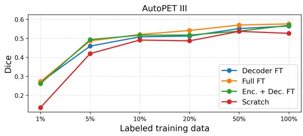
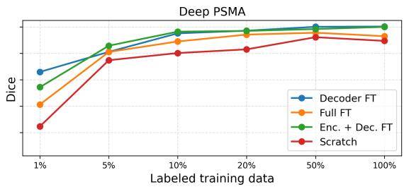
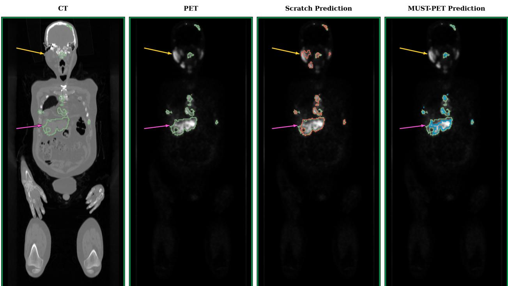

# MUST-PET: MULTIMODAL SELF-SUPERVISED LEARNING ACROSS TRACERS FOR WHOLE-BODY PET/CT-BASED LESION SEGMENTATION

## A PREPRINT

Bashirul Azam Biswas Department of Biomedical Data Science Geisel School of Medicine at Dartmouth Hanover, NH 03755, USA Bashirul.Azam.Biswas@dartmouth.edu

Biratal Raj Wagle   
Department of Biomedical Data Science   
Geisel School of Medicine at Dartmouth Hanover, NH 03755, USA   
Biratal.Raj.Wagle@dartmouth.edu

James B. Yu Radiation Oncology Dartmouth Hitchcock Medical Center Lebanon, NH 03766 , USA James.B.Yu@dartmouth.edu

Amartya Bhattacharya Department of Biomedical Data Science Geisel School of Medicine at Dartmouth Hanover, NH 03755, USA Amartya.Bhattacharya.GR@dartmouth.edu

Matthew E. Maeder Radiology   
Dartmouth Hitchcock Medical Center Lebanon, NH 03766 , USA   
Matthew.E.Maeder@dartmouth.edu

Indrani Bhattacharya Department of Biomedical Data Science Geisel School of Medicine at Dartmouth Hanover, NH 03755, USA Indrani.Bhattacharya@dartmouth.edu

## ABSTRACT

Deep learning–based automatic lesion segmentation in whole-body positron emission tomography/computed tomography (PET/CT) can help clinicians in staging, treatment planning, and response assessment. However, developing generalizable segmentation models remains challenging because of limited annotated data and domain shifts arising from differences in scanners, imaging protocols, institutions, and patient populations. Self-supervised learning (SSL) using large collections of unlabeled images has shown promise in addressing both label scarcity and domain generalization in medical imaging. Nevertheless, SSL remains underexplored in pan-cancer, multi-tracer, whole-body PET/CT, with existing approaches being limited to small and/or single-tracer datasets. In this work, we propose MUST-PET (MUltimodal Self-Supervised learning across Tracers), a multimodal, multi-tracer SSL framework for generalizable whole-body PET/CT lesion segmentation. MUST-PET is trained and validated with 5,910 pan-cancer, multi-tracer PET/CT scans from a diverse, multi-institutional dataset comprising public and institutional cohorts acquired with both [18F] fluorodeoxyglucose ([18F]FDG) and prostate-specific membrane antigen (PSMA)-targeted radiotracers. MUST-PET leverages a SwinUNETR with a multimodal context-aware masked reconstruction objective, where both modalities are used as inputs, one modality (PET or CT) is randomly selected per batch, masked with zero-mean imputation, and reconstructed, with the other modality remaining fully visible. This pretraining objective allows multimodal context-aware reconstruction. The pretrained model is subsequently fine-tuned with labeled samples from the AutoPET III dataset. We evaluate MUST-PET via reconstruction quality assessment through mean absolute error, lesion segmentation performance, label-efficiency curves, and generalizability on three independent heldout test sets (AutoPET III-test with N = 321, Deep-PSMA with N = 200, and an institutional Dartmouth Hitchcock Medical Center dataset with N = 100). MUST-PET reduces reconstruction error compared with the FDG-only baseline (for DHMC, Baseline vs. MUST-PET: 0.2970 vs.

0.2860) and substantially improves segmentation performance when compared with training from scratch (for AutoPET III, Baseline vs. MUST-PET: 0.526 vs. 0.576; for Deep-PSMA, Baseline vs. MUST-PET: 0.547 vs. 0.601). MUST-PET shows considerable performance gains with fine-tuning using limited labeled data and on unseen external datasets. These findings highlight the potential of multimodal, multi-tracer SSL to improve label efficiency and cross-domain generalization in whole body PET/CT lesion segmentation.

Keywords PET/CT, self-supervised learning, multi-tracer, medical image segmentation

## 1 Introduction

Automated pan-cancer, multi-tracer PET/CT-based lesion segmentation can assist clinicians in staging, treatment planning and response assessment, especially as PET/CT imaging volume grows exponentially without a corresponding increase in trained nuclear medicine specialists. However, accurate and generalizable models require large, labeled, multi-institutional datasets for supervised learning, and building such datasets is difficult, as annotation requires sub stantial clinician time and expertise. Self-supervised pretraining on large unlabeled multi-tracer datasets could yield generalizable representations for downstream segmentation, but existing methods are similarly limited to single tracers and small datasets. Notable examples include Yazdani et al. [1] (SwinUNETR for PSMA-PET/CT lesion segmentation) and Patel et al. [2] (anomaly detection from healthy tissue). Self-supervised pretraining models like C²MAOT [3] (cross-modal masked autoencoding for FDG PET/CT) and SegAnyPET [4] (a promptable model trained on 5,731 PET volumes) generalize well but are single-tracer or prompt-dependent, limiting full automation. More recent FDGbased foundation methods using masked autoencoding [5, 6] have not been evaluated for cross-tracer (e.g., PSMA), cross-disease, or unseen data generalizability. Drawing inspiration from the FDG-only foundation model [6], we present a self-supervised pretraining method to learn robust pan-cancer, multi-tracer PET/CT features from a large, diverse, multi-institutional, multi-tracer, pan-cancer dataset. Our proposed method, MUltimodal Self-supervised learning across Tracers for whole-body PET/CT segmentation (MUST-PET), uses context-aware, multimodal masked encoding using unlabeled paired PET/CT images to learn robust feature representations, which are then fine-tuned using a whole-body lesion-segmentation model. We assess the representation quality of learned features through unlabeled multi-tracer reconstruction quality, data-efficient segmentation model refinement, and generalizability on unseen datasets and both FDG and PSMA tracers. Our method shows improved generalizability across tracers and datasets over the FDG-only model [6].

## 2 Materials and Methods

## 2.1 Datasets

Our large and diverse dataset consists of 6,331 PET/CT scans to train and evaluate our MUST-PET (Table 1), consisting of four publicly available (AutoPET-III, DEEP-PSMA, SPADE, ViMED) and one internal Dartmouth Hitchcock Memorial Center (DHMC) datasets. AutoPET III [7, 8] contains whole-body, pan-cancer, multi-tracer (FDG and PSMA) PET/CT scans with expert-annotated lesion segmentations. The Deep-PSMA dataset [9] consists of expertannotated FDG and PSMA scans from metastatic prostate cancer patients acquired prior to LuPSMA therapy. The DHMC dataset includes de-identified, unlabeled PSMA-PET/CT scans from 1599 retrospective patients with or without prostate cancer who were seen at DHMC, Lebanon, NH. This retrospective study was approved by the Institutional Review Board (IRB) of Dartmouth College and Dartmouth Hitchcock Medical Centre, with patient consent waived. SPADE [10] is a Stanford FDG dataset spanning routine staging and restaging cases, stored as pre-normalised twochannel arrays. VI-MED [11] is a Vietnamese FDG dataset with demographic and technical variety from the North American and European sources. Its CT uses a non-standard integer range and its PET is stored as raw emission counts rather than SUV.

Self-supervised pretraining uses the training and validation splits of AutoPET-III, DHMC, SPADE, and VI-MED, whereas segmentation fine-tuning uses the AutoPET-III training and validation sets. Pretraining is evaluated using reconstruction quality on the AutoPET-III and DHMC test sets in an unlabeled setting, while fine-tuning is evaluated on the labeled AutoPET-III and unseen Deep-PSMA test sets. As a preprocessing step, we resample CT and PET volumes to a common voxel spacing $( x = 2 , y = 2 , z = 3 )$ , crop to the body region and perform instance normalization, similar to [6].

Table 1: Summary of datasets used. The FDG/PSMA row marks tracer availability (✓ present, ✗ absent). Lu=Lung, Ly=Lymphoma, Me=Melanoma, Pr=Prostate, Neg=Negative.
<table><tr><td>Properties</td><td>AutoPET-III</td><td>DeepPSMA</td><td>DHMC</td><td>SPADE</td><td>VI-MED</td></tr><tr><td>Disease dist.</td><td>Me/Lu/Ly/Pr/Neg 188/168/145/537/573</td><td>Pr</td><td>Pr</td><td></td><td></td></tr><tr><td>FDG/PSMA</td><td>√I√</td><td>√I√</td><td>x/√</td><td>√Ix</td><td>√Ix</td></tr><tr><td># lesions (per case)</td><td>17.47±46.12</td><td>69.99±60.04</td><td>10.13±16.27</td><td></td><td></td></tr><tr><td># slices (per vol)</td><td>135-963</td><td>195-1261 No</td><td>303-380 Yes</td><td>103-307</td><td>207-551</td></tr><tr><td>Pretraining</td><td>Yes Yes</td><td>Yes</td><td>No</td><td>Yes No</td><td>Yes</td></tr><tr><td>Segmentation Pretraining-train/val/test scans</td><td>1043/247/321</td><td>0/0/0</td><td>1350/149/100</td><td></td><td>No</td></tr><tr><td>Segmentation-train/val/test</td><td>1043/247/321</td><td></td><td></td><td>1013/113/0</td><td>1417/578/0</td></tr><tr><td></td><td></td><td>0/0/200</td><td>0/0/0</td><td>0/0/0</td><td>0/0/0</td></tr></table>

## 2.2 MUST-PET

We employ SwinUNETR [12] for both self-supervised pretraining with unlabeled PET/CT imaging and supervised fine-tuning with labeled AutoPET-III training and validation cases.

## 2.2.1 Self Supervised Pre-training

We extract two-channel PET/CT patches of size $9 6 \times 1 2 8 \times 1 2 8$ from each preprocessed PET/CT volume, yielding inputs $\mathbf { X } \ \in \ \mathbb { R } ^ { 2 \times 9 6 \times 1 2 8 \times 1 2 8 }$ . Each modality-specific patch is partitioned into non-overlapping masking blocks of size $1 2 \times 1 6 \times 1 6 .$ . For each training sample, either the CT or PET modality is selected with equal probability, and 50% of the blocks in the selected modality are randomly zero-masked while the complementary spatially aligned modality remains fully visible. The decoder reconstructs the masked voxels. This stochastic modality masking, together with cross-modal spatially aligned contextual information, encourages the model to learn anatomical and functional representations, as well as relationships between the two modalities. The network is trained for 200 epochs using a weighted global reconstruction loss with the AdamW optimizer and cosine annealing learning schedular with a batch size of 3, an initial learning rate of $1 \times 1 0 ^ { - 4 }$ , and a weight decay of $1 \times 1 0 ^ { - 2 }$

## 2.2.2 Finetuning

SwinUNETR consists of (1) a Swin Transformer backbone, (2) convolutional encoder blocks, and (3) decoder blocks. Using the pretrained SwinUNETR described above, we investigate three supervised fine-tuning strategies for wholebody lesion segmentation: (1) full-model fine-tuning (Full FT), (2) encoder and decoder fine-tuning (Enc. + Dec. FT), and (3) decoder-only fine-tuning (Dec. FT). Following the nnUNet-based whole-body lesion segmentation on AutoPET-III dataset from Rokuss et al. [13], the segmentation models are optimized using an equally weighted combination of cross-entropy and Dice losses. To assess the effectiveness of pretraining under varying labeled data budgets, we finetune using 1%, 5%, 10%, 20%, 50%, and 100% of the available labeled training data. We evaluate all models on two held-out test sets (1) an in-distribution AutoPET-III-test set and (2) an out-of-distribution Deep-PSMA dataset.

## 2.3 Evaluation Methods

We evaluate SSL reconstruction quality by mean absolute error (MAE) between the preprocessed and reconstructed whole-body volumes, and evaluate lesion segmentation performance with Dice similarity coefficient, false-positive volume (FPVol), false-negative volume (FNVol), lesion-level sensitivity and predictive value (PPV) [14].

## 2.4 Experimental Design and Results

## 2.4.1 Comparing FDG-only pretraining with multi-tracer pretraining

We compare the reconstruction MAE of our model with that of the FDG-only pretrained model proposed by Liu et al. [6]. The FDG-only model exhibits degraded reconstruction performance on PSMA scans (Table 2), indicating limited cross-tracer generalizability. Another point that limits a fair comparison between the two models on the FDG scans of AutoPET-III is that we do not know the AutoPET-III split used in Liu et al. [6], and some of our AutoPET-III test scans could have been in their training set, biasing the model to the FDG-reconstruction. However, the PSMA cases in AutoPET-III and the DHMC cases were not used for training by any of the models, enabling fair comparison.

Table 2: Reconstruction MAE of the FDG-only [6] and our proposed MUST-PET model. Lower is better.
<table><tr><td rowspan="2">Model</td><td>FDG</td><td colspan="2">PSMA</td></tr><tr><td>AutoPET (n = 199)</td><td>AutoPET (n = 122)</td><td>DHMC (n = 100)</td></tr><tr><td>FDG-only MAE</td><td>0.2431</td><td>0.2982</td><td>0.2970</td></tr><tr><td>MUST-PET (Ours)</td><td>0.2709</td><td>0.2908</td><td>0.2860</td></tr></table>

## 2.4.2 Label-efficient segmentation fine-tuning:

Self-supervised pretraining improves lesion detection across both datasets and all labeled-data budgets, with the largest gains observed under limited labeled-data settings (Figure 1), highlighting the utility of pretraining.

## 2.4.3 Lesion segmentation performance:

The MUST-PET models generally outperform scratch-trained SwinUNETR and nnUNet at both voxel and lesion levels (Table 3). On AutoPET III, Full FT achieves the best Dice (0.576) and FP volume (14.112 mL), while Decoder FT provides the highest lesion sensitivity (0.794). On Deep-PSMA, Decoder FT achieves the best Dice (0.601), FN volume (5.684 mL), and lesion sensitivity (0.801), whereas Enc.+Dec. FT yields the lowest FP volume (36.397 mL).

  
Figure 1: Label-Efficient Fine-Tuning Performance. Pretrained models provide substantial gains in low-label settings. Stronger generalisation is achieved in Deep PSMA dataset through the pretraining.

Table 3: Lesion segmentation performance on the test sets with 100% labeled AutoPET-III training data. FPVol and FNVol are reported in mL. ↑: higher is better; ↓: lower is better.
<table><tr><td rowspan="2">Dataset</td><td rowspan="2">Model</td><td rowspan="2">Training Strategy</td><td rowspan="2">Dice</td><td rowspan="2">FP Vol</td><td rowspan="2">FN Vol (↓)</td><td rowspan="2">Lesion Sensitivity (↑)</td><td rowspan="2">PPV (↑)</td></tr><tr><td>(1)</td></tr><tr><td rowspan="5">AutoPET III</td><td>SwinUNETR</td><td>Scratch</td><td>0.526</td><td>(4) 27.147</td><td>7.586</td><td>0.773</td><td>0.546</td></tr><tr><td>nnUNet</td><td>Scratch</td><td>0.566</td><td>17.283</td><td>9.472</td><td>0.773</td><td>0.733</td></tr><tr><td></td><td>Decoder FT</td><td>0.565</td><td>19.874</td><td>8.169</td><td>0.794</td><td>0.670</td></tr><tr><td>MUST-PET</td><td>Enc.+Dec. FT</td><td>0.569</td><td>20.954</td><td>8.457</td><td>0.775</td><td>0.685</td></tr><tr><td></td><td>Full FT</td><td>0.576</td><td>14.112</td><td>9.976</td><td>0.778</td><td>0.673</td></tr><tr><td rowspan="4">Deep PSMA</td><td>SwinUNETR</td><td>Scratch</td><td>0.547</td><td>74.315</td><td>9.785</td><td>0.711</td><td>0.732</td></tr><tr><td>nnUNet</td><td>Scratch</td><td>0.561</td><td>73.030</td><td>7.933</td><td>0.757</td><td>0.768</td></tr><tr><td></td><td>Decoder FT</td><td>0.601</td><td>47.959</td><td>5.684</td><td>0.801</td><td>0.715</td></tr><tr><td>MUST-PET</td><td>Enc.+Dec. FT</td><td>0.600</td><td>36.397</td><td>6.714</td><td>0.779</td><td>0.736</td></tr><tr><td></td><td></td><td>Full FT</td><td>0.565</td><td>60.386</td><td>8.230</td><td>0.751</td><td>0.746</td></tr></table>

## 2.4.4 Qualitative evaluation:

MUST-PET reduces false positives and false negatives, while better capturing lesions, compared to training from scratch (Figure 2).

  
Figure 2: Qualitative comparison of lesion segmentation by the scratch and MUST-PET models, both trained on 100% of the data. Green contours indicate GT, while red and blue contours show scratch and fine-tuned predictions, respectively. Yellow arrows indicate false positives from the scratch model, and pink arrows highlight improved lesion delineation with MUST-PET.

## 3 Discussion and Conclusion

In this work, we develop and test MUST-PET, the first context-aware, multimodal, multi-tracer self-supervised pretraining framework for whole-body PET/CT lesion segmentation using a large multi-institutional, pan-cancer dataset. MUST-PET achieves superior 3D whole-body reconstruction performance across both FDG and PSMA tracers, when compared to FDG-only foundation models, outperforms lesion segmentation from scratch, performs significantly bet ter in lesion segmentation under limited labeled data budgets, and is generalizable across tracers, institutions, and different cancer types. A direct lesion-segmentation comparison between MUST-PET and the FDG-only model [6] was not feasible because the FDG-only model’s training data overlap with our evaluation sets. Future work will include more extensive analysis of MUST-PET in other downstream tasks.

## Acknowledgements

Research reported in this publication was supported by an Institutional Development Award (IDeA) from the National Institute of General Medical Sciences of the National Institutes of Health under grant number 1P30GM149408. We also gratefully acknowledge support from the Munck-Pfefferkorn Fund, the American Cancer Society Institutional Research Grant, the Department of Biomedical Data Science at Dartmouth College and the Department of Radiology at Dartmouth Hitchcock Medical Center. All of this support was instrumental in making this work possible. Help from Claude Opus 4.8 was taken for correcting grammatical errors.

## References

[1] Yazdani, E., Karamzadeh-Ziarati, N., Cheshmi, S. S., Sadeghi, M., Geramifar, P., Vosoughi, H., Jahromi, M. K., and Kheradpisheh, S. R., “Automated segmentation of lesions and organs at risk on [68ga] ga-psma-11 pet/ct images using self-supervised learning with swin unetr,” Cancer Imaging 24(1), 30 (2024).

[2] Patel, A., Tudosiu, P.-D., Pinaya, W. H. L., Cook, G., Goh, V., Ourselin, S., and Cardoso, M. J., “Cross attention transformers for multi-modal unsupervised whole-body pet anomaly detection,” in [MICCAI Workshop on Deep Generative Models], 14–23, Springer (2022).

[3] Huang, J., Chen, S., Liang, X., Yang, X., Zhang, Z., Sun, Y., Wang, Y., and Tan, T., “C2maot: Cross-modal complementary masked autoencoder with optimal transport for cancer segmentation in pet-ct images,” in [International Conference on Medical Image Computing and Computer-Assisted Intervention], 87–97, Springer (2025).

[4] Zhang, Y., Xue, L., Zhang, W., Li, L., Liu, Y., Jiang, C., Cheng, Y., and Qi, Y., “SegAnyPET: Universal promptable segmentation from positron emission tomography images,” in [Proceedings of the IEEE/CVF International Conference on Computer Vision (ICCV)], (2025). arXiv:2502.14351.

[5] Oh, Y., Seifert, R., Cao, Y., et al., “Developing a PET/CT foundation model for cross-modal anatomical and functional imaging,” arXiv preprint arXiv:2503.02824 (2025).

[6] Liu, X., Zhang, Q., Marin, T., Xia, M., Liu, C., El Fakhri, G., and Ouyang, J., “An open multi-center whole-body FDG PET/CT foundation model for tumor segmentation,” arXiv preprint arXiv:2605.21835 (2026).

[7] Gatidis, S., Hepp, T., Fruh, M., La Foug ¨ ere, C., Nikolaou, K., Pfannenberg, C., Sch \` olkopf, B., K ¨ ustner, T., Cyran, ¨ C., and Rubin, D., “A whole-body FDG-PET/CT dataset with manually annotated tumor lesions,” Scientific Data 9(1), 601 (2022).

[8] Ingrisch, M., Dexl, J., Jeblick, K., Cyran, C., Gatidis, S., and Kustner, T., “Automated lesion segmentation in¨ whole-body PET/CT – multitracer multicenter generalization (autoPET III),” in [27th International Conference on Medical Image Computing and Computer Assisted Intervention (MICCAI)], Zenodo (2024).

[9] Jackson, P., Hofman, M., Buteau, J. P., McIntosh, L., and Sun, Y., “A repository of annotated psma and fdg pet/ct images for algorithm development in staging of mcrpc for treatment with 177Lu-psma therapy,” (2025).

[10] Eyuboglu, S., Angus, G., Patel, B. N., Pareek, A., Davidzon, G., Long, J., Dunnmon, J., and Lungren, M. P., “Multi-task weak supervision enables anatomically-resolved abnormality detection in whole-body FDG-PET/CT,” Nature Communications 12(1), 1880 (2021).

[11] Nguyen, H. T., Nguyen, D. T., Nguyen, T. M. D., Nguyen, T. T., Truong, T. N., Pham, H. H., Barthelemy, J., Tran, M. Q., Nguyen, T. T., Nguyen, Q. V. H., Chau, Q. A., Mai, H. S., Nguyen, T. T., and Nguyen, P. L., “Toward a vision-language foundation model for medical data: Multimodal dataset and benchmarks for vietnamese PET/CT report generation,” in [Advances in Neural Information Processing Systems (NeurIPS), Datasets and Benchmarks Track], (2025). arXiv:2509.24739.

[12] Hatamizadeh, A., Nath, V., Tang, Y., Yang, D., Roth, H. R., and Xu, D., “Swin UNETR: Swin transformers for semantic segmentation of brain tumors in MRI images,” in [International MICCAI Brainlesion Workshop], 272–284, Springer (2022).

[13] Rokuss, M., Kovacs, B., Kirchhoff, Y., Xiao, S., Ulrich, C., Maier-Hein, K. H., and Isensee, F., “From fdg to psma: A hitchhiker’s guide to multitracer, multicenter lesion segmentation in pet/ct imaging,” arXiv preprint arXiv:2409.09478 (2024).

[14] Wagle, B. R., Biswas, B. A., Chau, G., Maeder, M. E., Arshad, M. A., Leapman, M. S., Yu, J. B., and Bhattacharya, I., “Foundation model-enabled efficient data sampling (feeds): A label-efficient training strategy for pan-cancer, multi-tracer pet/ct datasets,” arXiv preprint arXiv:2608.11076 (2026).