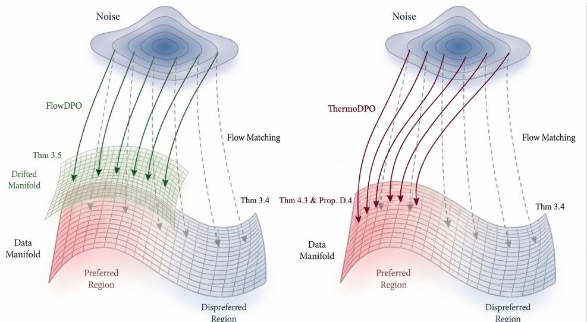
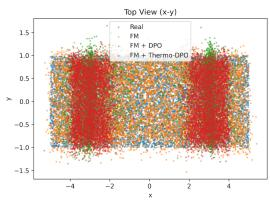
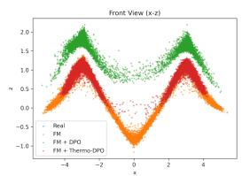
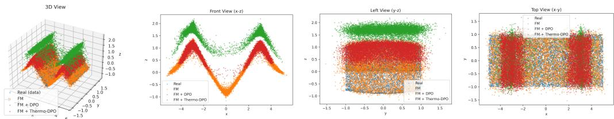
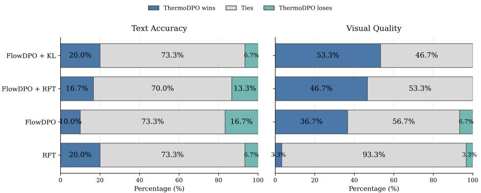
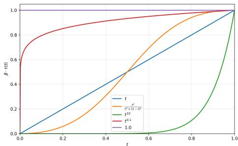
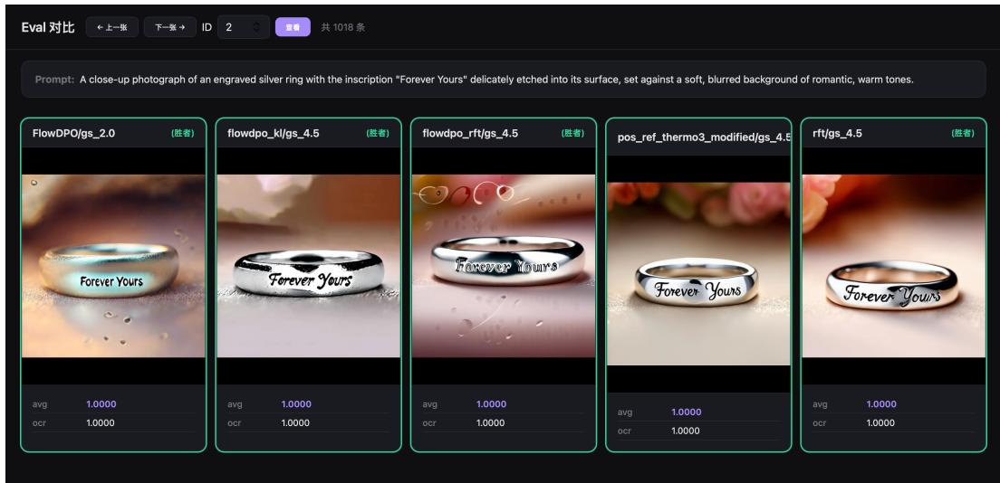

# Manifold Drift in Flow Preference Optimization: A Root Cause of Reward Hacking

Yansen Han1,2,\* Shengyi Liao3,\* Yuanxing Zhang3 Pengfei Wan3 Tao Lin1,†

\*Equal contribution †Corresponding author

1Westlake University 2Zhejiang University 3Kling Team, Kuaishou Technology

## Abstract

Preference optimization is a standard alignment method for generative models, yet extending it to continuous-time dynamics remains non-trivial. In flow matching, reward-driven updates modify transport trajectories without an inherent constraint to the pretrained data manifold and can move terminal samples off the pretrained support. We formalize this failure mode as manifold drift. Theoretically, we show that optimal flow matching recovers the terminal data distribution, whereas a preference update leaves the pretrained manifold whenever its induced terminal displacement has a nonzero normal component. As a remedy, we propose THERMoDPO, a temperature-controlled objective that anchors pairwise preference optimization on preferred samples. Across temperature regimes, this objective connects rejection sampling fine-tuning and FlowDPO and controls a pointwise reconstruction-based surrogate for manifold distance. To counteract diminished signals at low temperatures, we further introduce a weighted variant, THERMoDPO-weighted. On the main toy benchmark, THERMoDPO-weighted attains a StrictScore of 0.899, compared with 0.629 for FlowDPO and 0.857 for FlowDPO+RFT. On SD3.5-M at CFG = 4.5, it improves OCR by 47.5% and the average of four metrics by 16.0%.

<table><tr><td>GenEval ↑</td><td>OCR↑</td><td>HPSv3.0↑</td><td>UniRwd↑</td><td>Overall Gain ↑</td></tr><tr><td>0.49</td><td>0.93</td><td>7.18</td><td>2.97</td><td></td></tr><tr><td>(-22.2%)</td><td>(+57.6%)</td><td>(-17.3%)</td><td>(-2.0%)</td><td>+4.0%</td></tr></table>

  
GenEval ↑ OCR↑ HPSv3.0↑ UniRwd ↑ Overall Gain ↑ 0.65 0.87 9.46 3.16 +16.0% (+3.2%) (+47.5%) (+9.0%) (+4.3%)

  
Figure 1: Comparison of FlowDPO (left) and THERMoDPO-weighted (right). FlowDPO improves preference with manifold drift, whereas THERMoDPO-weighted improves preference while preserving quality.

  
Figure 2: Core intuition of THERMoDPO. Flow Matching (gray) transports noise to the pretrained data manifold. FlowDPO (green) may reach preferred regions through an off-manifold displacement, whereas THERMoDPO (red) adds a winner-side anchor intended to keep the redirected mass closer to the pretrained manifold. The formal statements and their assumptions are summarized in Tab. 1; the behavior is evaluated in the toy study (Fig. 3) and real-image study (Fig. 1).

## 1 Introduction

Direct Preference Optimization (DPO) has established itself as a simple and effective paradigm for aligning discrete generative models with human judgments [51, 47, 56, 58]. Motivated by this success, recent work has begun extending preference optimization to continuous generative models, including diffusion models [23, 54, 55, 60, 9] and flow-based models [2, 37, 57, 38]. This direction is crucial as these models now underpin state-of-the-art image and video generation, where preference alignment is essential for controllability.

However, transferring DPO to continuous generative models is not straightforward. Unlike discrete models that primarily reweight the probabilities of completed outputs, continuous models generate samples by transporting noise along learned trajectories toward the data manifold. Optimization in this setting therefore modifies not only output selection but also the transport dynamics themselves.

Although prior studies have noted empirical performance drops when applying DPO to continuous models [9, 39], these findings have remained largely experimental observations. In this paper, we argue that such degradation stems from a fundamental structural cause: reward-driven updates steer trajectories toward preferred regions only weakly supported by the pretrained data manifold, a failure mode we formalize as Manifold Drift. Beyond a simple geometric deviation, this drift damages the pretrained generative prior, leading to visibly degraded sample quality. We characterize this problem in Sec. 3 through theoretical analysis and supporting analytical evidence (see Fig. 3).

To address these challenges, we introduce THERMoDPO, which constrains trajectory endpoints to the pretrained manifold via a temperature-controlled anchor. Analytically, THERMoDPO unifies preference alignment and manifold preservation: it recovers rejection sampling fine-tuning (RFT) [65, 5] as $\tau \downarrow 0$ , while for $\tau > 0 .$ it decomposes into a temperature-scaled FlowDPO [39] objective and a nonnegative anchoring term. This decomposition reveals an explicit trade-off between reward maximization and manifold drift. To resolve practical weighting issues near t = 0, we also propose a reweighted variant, THERMODPO-weighted.

As shown in Fig. 2, THERMoDPO directs updates toward preferred regions while remaining anchored to the pretrained support, rather than treating alignment and preservation as conflicting goals. Our experiments on both synthetic and real-world image benchmarks confirm that THERMoDPO-weighted achieves a superior trade-off, significantly improving target metrics without compromising sample fidelity. Our main contributions are as follows:

• We identify and formalize manifold drift, a failure mode in continuous preference optimization where the terminal of fine-tuned trajectories is away from the pretrained terminal manifold.

• We propose THERMoDPO, a method that augments pairwise preference optimization with a winner-side manifold anchor, and introduce a reweighted implementation, THERMoDPO-weighted, to ensure robust preservation of the terminal manifold in practice.

• We provide theoretical guarantees for both the THERMODPO and the THERMoDPO-weighted, showing that it bridges rejection sampling fine-tuning and FlowDPO, while providing an upper bound on a reconstruction-based surrogate for manifold drift.

• We empirically demonstrate on a toy manifold and real-image benchmarks that THERMoDPOweighted achieves a superior trade-off between preference alignment and manifold preservation compared to FlowDPO variants, improving target metrics without sacrificing visual quality.

## 2 Preliminaries

## 2.1 Flow Matching

Flow Matching [37, 2] learns a time-dependent vector field that transports a simple prior distribution $p _ { 1 }$ to the data distribution $p _ { 0 }$ . Let $\mathbf { x } _ { 0 } \sim p _ { 0 }$ denote a data sample and $\mathbf { x } _ { 1 } \sim p _ { 1 }$ denote a noise sample. Under the linear interpolation used throughout this paper, $\mathbf { x } _ { 1 }$ is equivalently written as €. For $t \in [ 0 , 1 ]$ , define

$$
{ \bf x } _ { t } = ( 1 - t ) \cdot { \bf x } _ { 0 } + t \cdot { \bf x } _ { 1 } ,
$$

so generation proceeds from the noise endpoint $t = 1$ to the data endpoint $t = 0$ . The standard flow matching objective fits a vector field $v _ { \theta }$ to the conditional velocity along this path

$$
\begin{array} { r } { \mathcal { L } _ { \mathrm { F M } } ( \theta ) = \mathbb { E } _ { ( \mathbf { x } _ { 0 } , \mathbf { x } _ { 1 } , t ) } \left[ \Vert v _ { \theta } ( \mathbf { x } _ { t } , t ) - ( \mathbf { x } _ { 1 } - \mathbf { x } _ { 0 } ) \Vert ^ { 2 } \right] . } \end{array}
$$

Here $( { \bf x } _ { 0 } , { \bf x } _ { 1 } ) \sim \gamma$ for a coupling γ of $p _ { 0 }$ and $p _ { 1 }$ , and $t \sim \mathrm { U n i f } [ 0 , 1 ]$ . The learned vector field induces a flow map $\Phi _ { 1  t } ^ { \theta }$ by solving the ODE $\begin{array} { r } { \frac { d \mathbf { x } _ { s } } { d s } = v _ { \theta } ( \mathbf { x } _ { s } , s ) } \end{array}$ from $s = 1$ to $s = t$

## 2.2 Direct Preference Optimization (DPO) in Continuous-Time Models

For a preference dataset ${ \mathcal D } = \{ ( c , { \bf x } _ { 0 } ^ { w } , { \bf x } _ { 0 } ^ { l } ) \}$ , standard DPO [51] compares the log-likelihoods of winner $\mathbf { x } _ { 0 } ^ { w }$ and loser $\mathbf { x } _ { 0 } ^ { l }$ under the current model $\pi _ { \theta }$ against a frozen reference model $\pi _ { \mathrm { r e f } } .$

$$
\begin{array} { r } { \mathcal { L } _ { \mathrm { D P O } } ( \boldsymbol { \theta } ) = - \mathbb { E } _ { ( c , \mathbf { x } _ { 0 } ^ { w } , \mathbf { x } _ { 0 } ^ { l } ) \sim \mathcal { D } } \left[ \log \sigma \left( \beta \log \frac { \pi _ { \boldsymbol { \theta } } \left( \mathbf { x } _ { 0 } ^ { w } \mid c \right) } { \pi _ { \mathrm { r e f } } \left( \mathbf { x } _ { 0 } ^ { w } \mid c \right) } - \beta \log \frac { \pi _ { \boldsymbol { \theta } } \left( \mathbf { x } _ { 0 } ^ { l } \mid c \right) } { \pi _ { \mathrm { r e f } } \left( \mathbf { x } _ { 0 } ^ { l } \mid c \right) } \right) \right] . } \end{array}\tag{1}
$$

Since evaluating exact log-likelihoods is computationally prohibitive for continuous models during training, prior works [39, 38, 71, 60] replace log $\pi _ { \boldsymbol { \theta } } ( \mathbf { x } _ { 0 } \mid c )$ with timestep-wise surrogates $\| v _ { \theta } ( \mathbf { x } _ { t } , t ) -$ $( \mathbf { x } _ { 1 } - \mathbf { \bar { x } } _ { 0 } ) \| ^ { 2 }$ . DiffusionDPO [60] uses denoising error, while FlowDPO [39] applies DPO to the flow matching regression loss. To derive FlowDPO, we define the following notations with omitted shared condition c:

$$
\ell _ { \theta } ^ { w / l } : = \| v _ { \theta } ( \mathbf { x } _ { t } ^ { w / l } , t ) - ( \mathbf { x } _ { 1 } ^ { w / l } - \mathbf { x } _ { 0 } ^ { w / l } ) \| ^ { 2 } , ~ \ell _ { \mathrm { r e f } } ^ { w / l } : = \| v _ { \mathrm { r e f } } ( \mathbf { x } _ { t } ^ { w / l } , t ) - ( \mathbf { x } _ { 1 } ^ { w / l } - \mathbf { x } _ { 0 } ^ { w / l } ) \| ^ { 2 } ,\tag{2}
$$

$$
\Delta _ { \theta } ^ { w } : = \ell _ { \theta } ^ { w } - \ell _ { \mathrm { r e f } } ^ { w } ,
$$

$$
\Delta _ { \theta } ^ { l } : = \ell _ { \theta } ^ { l } - \ell _ { \mathrm { r e f } } ^ { l } .\tag{3}
$$

With $v _ { \theta }$ and $v _ { \mathrm { r e f } }$ as the corresponding vector fields, the FlowDPO objective is:

$$
\mathcal { L } _ { \mathrm { F l o w D P O } } ( \theta ) = \mathbb { E } \left[ - \log \sigma \big ( - \beta ( \Delta _ { \theta } ^ { w } - \Delta _ { \theta } ^ { l } ) \big ) \right] .
$$

## 3 Manifold Drift in Continuous Preference Optimization

Motivation: manifold support and the drift problem. Preference optimization typically starts from a pretrained reference model with vector field $v _ { \mathrm { r e f } }$ and flow map $\Phi _ { 1  t } ^ { \mathrm { r e f } }$ . Following the manifold hypothesis [14, 29], we assume natural data concentrate near a lower-dimensional set $\mathcal { M } _ { \mathrm { d a t a } } : =$ $\operatorname { s u p p } ( p _ { 0 } )$ . In practice, we use the pretrained terminal manifold as an operational proxy for this set:

$$
\mathcal { M } _ { 0 } : = \mathrm { s u p p } \big ( ( \Phi _ { 1  0 } ^ { \mathrm { r e f } } ) _ { \# } p _ { 1 } \big ) \ .
$$

For any learned model θ, we denote its terminal sample and distribution as $\mathbf { x } _ { 0 } : = \Phi _ { 1  0 } ^ { \theta } ( \mathbf { x } _ { 1 } )$ and $\mu _ { \theta } : = ( \Phi _ { 1  0 } ^ { \theta } ) _ { \# } p _ { 1 }$ . The problem of manifold drift arises when preference optimization steers µθ away from $\mathcal { M } _ { 0 }$ toward regions that lack generative support. To rigorously analyze this, we first establish formal characterizations of terminal on-manifold flows (Def. 3.1) and manifold drift (Def. 3.2).

Table 1: Theorems' roadmap. The analysis proceeds from characterizing manifold preservation and drift, through connecting THERMoDPO to RFT and FlowDPO, to controlling winner-side manifold drift.  
Result Main statement   
I. Manifold preservation and drift   
Thm. 3.4 FM can exactly recover $p _ { 0 }$ and its terminal support (gray path in Fig. 2).   
Thm. 3.5 A nonzero normal component in the induced endpoint update is sufficient for off-manifold   
drift (green path in Fig. 2).   
II. Connection to RFT and FlowDPO   
Thm. 4.1 As $\tau \downarrow 0 ,$ THERMoDPO conditionally reduces to the RFT objective.   
Thm. 4.2 For $\tau > 0 ,$ THERMODPO decomposes into FlowDPO and a winner-side anchor   
III. Manifold drift control   
Thm. 4.3 The pointwise loss upper-bounds the reconstructed winner's squared distance to $\mathcal { M } _ { \mathrm { d a t a } }$ (red   
path in Fig. 2); it is not a distribution-level guarantee.

Definition 3.1 (Terminal on-manifold flow). Let $\mathcal { M } _ { 0 } \subset \mathbb { R } ^ { d }$ denote the pretrained terminal manifold, and let

$$
\mu _ { \theta } : = ( \Phi _ { 1  0 } ^ { \theta } ) _ { \# } p _ { 1 }
$$

denote the terminal distribution induced by the fine-tuned flow map $\Phi _ { 1  0 } ^ { \theta }$ . We say that $\Phi _ { 1  0 } ^ { \theta }$ is terminally on-manifold $i f$

$$
\operatorname { s u p p } ( \mu _ { \theta } ) \subseteq { \mathcal { M } } _ { 0 } .
$$

Definition 3.2 (Manifold drift). Let $\mu _ { \theta } : = ( \Phi _ { 1  0 } ^ { \theta } ) _ { \# } p _ { 1 }$ denote the terminal distribution induced by the fine-tuned flow map $\Phi _ { 1  0 } ^ { \theta } .$ We say that $\Phi _ { 1  0 } ^ { \theta }$ exhibits manifold drift with respect to the pretrained terminal manifold $\mathcal { M } _ { 0 }$ if

$$
\operatorname { s u p p } ( \mu _ { \theta } ) \nsubseteq \mathcal { M } _ { 0 } .
$$

Remark 3.3 (Intuitive Interpretation). The manifold $\mathcal { M } _ { 0 }$ can be considered as the ground-truth image manifold by manifold hypothesis or the terminal manifold learned during pretraining. The intended role of preference optimization is to reweight probability mass toward preferred regions while preserving the semantic and perceptual structure learned during pretraining. Manifold drift refers to the failure of this preservation: the aligned flow may move terminal samples outside the pretrained terminal manifold, potentially causing visual artifacts, semantic distortions, or degradation in sample fdelity, which is typically considered as a result of reward hacking.

Preferred samples should not be outside the pretrained terminal manifold. We agree that moving beyond the pretrained manifold can be beneficial when fine-tuning a weak baseline. Our claim is that the manifold drift is theoretically illegal and can be practically risky.

• Theoretical interpretation: DPO [51] is derived from KL-regularized reward maximization: maxθ $\mathbb { E } _ { \pi _ { \theta } } \left[ r ( x ) \right] - \beta D _ { K L } ( \pi _ { \theta } | | \pi _ { \mathrm { r e f } } )$ , whose optimal solution is $\pi _ { \theta } \propto \pi _ { \mathrm { r e f } } \exp ( r ( x ) / \beta )$ This implies $s u p p ( \pi ^ { * } ) \subseteq s u p p ( \pi _ { \mathrm { r e f } } )$ , and thus the original goal of DPO objective is to condense the probability within the high-reward region of the support manifold. However, practical flow-based RL often removes this constraint and directly optimizes the vector field.

• Practical interpretation: we can categorize the reward function into two types: manifold-aware and manifold-unaware. (1) Manifold-unaware reward: OCR is in this type because it only considers the correctness of the text in the generated image rather than the validity of the whole image. Therefore, using this kind of reward function, we can easily notice the manifold drift. (2) Manifoldaware reward: Pickscore is in this type because it focuses on the quality of the whole image, and thus fine-tuning with this kind of reward can hardly notice the manifold drift (still can happen). Using this kind of reward, FlowDPO can achieve higher reward due to manifold drift, while the valid visual quality make us unconscious about manifold drift.

Even though we only test this problem in image generation, we think manifold drift is more dangerous in robotics, because manifold drift means out-of-distribution behavior, i.e., unexpected behavior.

  
Figure 3: Toy example of manifold drift under direct preference optimization. Starting from the same pretrained flow matching (FM) reference model, FlowDPO drives terminal samples toward preferred regions but also causes a deviation from the pretrained data manifold. In contrast, THERMoDPO variant preserves the overall manifold structure much better while still improving alignment with the preference signal.

Optimal flow matching preserves the terminal manifold. Thm. 3.4 states that, under exact optimization and the listed regularity assumptions, the induced FM flow recovers the data distribution at the terminal time.

Theorem 3.4 (Optimal Flow Matching reaches the data manifold). Let $\mathcal { M } _ { \mathrm { d a t a } } : = \operatorname { s u p p } ( p _ { 0 } )$ Under linear interpolation and standard regularity assumptions ensuring that $v ^ { \star }$ generates a unique flow map and that the associated continuity equation admits a unique weak solution, then an optimal Flow Matching vector field $v ^ { \star }$ transports the prior $p _ { 1 }$ exactly to the data distribution po:

$$
( { \Phi } _ { 1  0 } ^ { v ^ { \star } } ) _ { \# } p _ { 1 } = p _ { 0 } .
$$

Consequently,

$$
\mathrm { s u p p } \Big ( \big ( \Phi _ { 1  0 } ^ { v ^ { \star } } \big ) _ { \# } p _ { 1 } \Big ) = \mathrm { s u p p } ( p _ { 0 } ) = \mathcal { M } _ { \mathrm { d a t a } } .
$$

See App. C.1 for the proof, and Fig. 3 for the empirical toy example with setup details in App. E.1.

On the failure of FlowDPO. In contrast to the ideal FM benchmark, Thm. 3.5 gives a sufficient condition under which a preference update leaves the pretrained terminal manifold.

Theorem 3.5 (Manifold drift under a nonzero normal component assumption). Let $\mathcal { M } _ { 0 } : =$ supp $( ( \Phi _ { 1  0 } ^ { \mathrm { r e f } } ) _ { \# } p _ { 1 } )$ be the pretrained terminal manifold, assume $\mathcal { M } _ { 0 } \subset \mathbb { R } ^ { \hat { d } }$ is a twice continuously differentiable embedded submanifold, and fx $\mathbf { x } _ { 1 } \in \mathcal { M } _ { 1 }$ . Deine

$$
F ( \theta , \mathbf { x } _ { 1 } ) : = \Phi _ { 1  0 } ^ { \theta } ( \mathbf { x } _ { 1 } ) , \qquad \mathbf { x } _ { 0 } ^ { \star } : = F ( \theta _ { 0 } , \mathbf { x } _ { 1 } ) \in \mathcal { M } _ { 0 } ,
$$

where $\theta _ { 0 } = \theta _ { \mathrm { r e f } }$ and $F ( \boldsymbol { \theta } , \mathbf x _ { 1 } )$ is differentiable in θ at $\theta _ { 0 }$ Let $\Pi _ { { N _ { \mathbf { x } } } _ { 0 } ^ { \star } , { M _ { 0 } } }$ denote the orthogonal projection onto the normal space $N _ { \mathbf { x } _ { 0 } ^ { \star } } \mathcal { M } _ { 0 }$ and L be the loss function. Let $\theta _ { 1 } = \theta _ { 0 } - \alpha \nabla _ { \theta } \mathcal { L } ( \theta _ { 0 } )$ be one gradient step. If

$$
\Pi _ { N _ { \mathbf { x } _ { 0 } ^ { \star } } \mathcal { M } _ { 0 } } D _ { \theta } F ( \theta _ { 0 } , \mathbf { x } _ { 1 } ) \big [ \nabla _ { \theta } \mathcal { L } ( \theta _ { 0 } ) \big ] \neq 0 ,
$$

then there exists $\alpha _ { 0 } > 0$ such that for all $\alpha \in ( 0 , \alpha _ { 0 } ) , F ( \theta _ { 1 } , \mathbf { x } _ { 1 } ) \notin \mathcal { M } _ { 0 } .$

See App. C.2 for the proof. The result is loss-agnostic: it does not assert that every FlowDPO update drifts, but identifies a nonzero normal component as sufficient. Fig. 3 shows this behavior in our controlled toy instance.

Remark 3.6 (Why is FlowDPO prone to manifold drift?). At its optimum, FM regression $\mathbb { E } [ \| v _ { \theta } ( \mathbf { x } _ { t } , t ) - ( \mathbf { x } _ { 1 } - \mathbf { x } _ { 0 } ) \| ^ { 2 } ]$ preserves the target manifold under the assumptions of Thm. 3.4. The RFT term $\mathbb { E } [ \| v _ { \theta } ( \mathbf { x } _ { t } ^ { w } , i ) - ( \mathbf { x } _ { 1 } - \mathbf { x } _ { 0 } ^ { w } ) \| ^ { 2 } ]$ preserves the preferred region in the target manifold. FlowDPO can be simplied as $\mathbb { E } [ \| v _ { \theta } ( \mathbf { x } _ { t } ^ { \bar { w } } , t ) - ( \mathbf { x } _ { 1 } - \mathbf { x } _ { 0 } ^ { w } ) \| ^ { 2 } ] - \mathbb { E } [ \| v _ { \theta } ( \mathbf { x } _ { t } ^ { l } , t ) - ( \mathbf { x } _ { 1 } - \mathbf { x } _ { 0 } ^ { l } ) \| ^ { 2 } ]$ where the substraction of the loser error gives a force to drift away from the manifold.

## 4 THERMODPO: Preference Optimization with Terminal Manifold Control

The possibility of FlowDPO leaving the terminal manifold (Sec. 3) raises a practical question: can we improve preference alignment while explicitly controlling terminal displacement?

To resolve this tension, we introduce THERMoDPO, a method that explicitly bridges preference alignment and manifold preservation. Our approach is characterized by three key properties: a theoretical reduction to RFT (Sec. 4.2), an anchored-FlowDPO decomposition (Sec. 4.2), and a direct geometric bound on manifold drift (Sec. 4.3).

## 4.1 Temperature-Controlled Preference Optimization for Flow Models

We formulate THERMoDPO by viewing alignment as a thermodynamic balancing act, where a time-dependent temperature function $\tau ( t )$ governs the trade-off between maximizing reward and anchoring mass to the pretrained manifold. By varying $\tau ( t )$ , we can interpolate between the rigid constraints of rejection sampling (low temperature) and the flexible preference signal of FlowDPO (high temperature). This formulation is inspired by Boltzmann distributions over energy states [1] representing the competing goals of alignment and preservation.

Following the FlowDPO notations from Sec. 2, we define three energy-like components that represent the preferred, rejected, and reference states:

$$
E _ { w } = - \frac { \Delta _ { \theta } ^ { w } } { \tau ( t ) } , \qquad E _ { l } = - \frac { \Delta _ { \theta } ^ { l } } { \tau ( t ) } , \qquad E _ { b } = \frac { \ell _ { \mathrm { r e f } } ^ { w } } { \tau ( t ) } .\tag{4}
$$

The THERMoDPO objective then minimizes the negative log-probability of the preferred sample within this three-state system, effectively anchoring preference optimization:

$$
\mathcal { L } _ { \mathrm { T h e r m o D P O } } ( \theta ) = \mathbb { E } \left[ - \tau ( t ) \cdot t ^ { 2 } \cdot \log \frac { e ^ { E _ { w } } } { e ^ { E _ { w } } + e ^ { E _ { l } } + e ^ { E _ { b } } } \right] .\tag{5}
$$

For our theoretical analysis, we use this standard formulation. In practice, as the $t ^ { 2 }$ factor weakens the manifold anchor near the terminal endpoint $( t = 0 )$ , we propose and evaluate a reweighted variant, THERMoDPO-weighted, as detailed in Sec. 4.4.

## 4.2 Theoretical Relationship to Rejection Sampling Fine-Tuning and FlowDPO

For the brevity of theoretical analysis, we rewrite the loss (in equation 5) in terms of a single-sample integrand as follows:

$$
\mathcal { L } _ { \mathrm { T h e r m o D P O } } ( \theta ) = \mathbb { E } \big [ g _ { \tau } ( \theta ) \big ] , \quad g _ { \tau } ( \theta ) : = t ^ { 2 } \cdot \tau \cdot \log \left( 1 + \exp \left( \frac { \Delta _ { \theta } ^ { w } } { \tau } - \Delta _ { \theta } ^ { l } \right) + \exp \left( \frac { \ell _ { \theta } ^ { w } } { \tau } \right) \right)\tag{6}
$$

To analyze these properties pointwise, we fix a tuple $( \mathbf { x } _ { 0 } ^ { w } , \mathbf { x } _ { 0 } ^ { l } , t , \mathbf { x } _ { 1 } )$ with $t \in ( 0 , 1 ]$ , let $\tau : = \tau ( t )$ , and recall $\bar { \ell _ { \theta } ^ { w } } : = \| v _ { \theta } \bar { ( } \mathbf { x } _ { t } ^ { \bar { w } } , t ) - \bar { ( } \mathbf { x } _ { 1 } - \mathbf { x } _ { 0 } ^ { w } ) \| ^ { 2 }$ . We first demonstrate that THERMoDPO recovers rejection sampling fine-tuning (RFT) [65, 5] as the temperature vanishes.

Theorem 4.1 (THERMODPO reduces to RFT). For the integrand in equation 6,

$$
\operatorname* { l i m } _ { \tau \downarrow 0 } g _ { \tau } ( \theta ) = t ^ { 2 } \cdot \mathrm { m a x } \big \{ 0 , \Delta _ { \theta } ^ { w } - \Delta _ { \theta } ^ { l } , \ell _ { \theta } ^ { w } \big \} \ .\tag{7}
$$

Furthermore, $i f \Delta _ { \theta } ^ { w } - \Delta _ { \theta } ^ { l } \leq \ell _ { \theta } ^ { w }$ , the objective reduces to the weighted reconstruction error:

$$
\operatorname* { l i m } _ { \tau \downarrow 0 } g _ { \tau } ( \theta ) = \| \tilde { \mathbf { x } } _ { 0 } ^ { w } - \mathbf { x } _ { 0 } ^ { w } \| ^ { 2 } = t ^ { 2 } \ell _ { \theta } ^ { w } ,
$$

where $\tilde { \mathbf { x } } _ { 0 } ^ { w } : = \mathbf { x } _ { t } ^ { w } - t \cdot v _ { \theta } ( \mathbf { x } _ { t } ^ { w } , t )$ is the reconstructed preferred sample.

See App. C.3 for the proof. In the low-temperature regime, THERMoDPO effectively collapses to a time-weighted reconstruction objective whenever the preference signal is dominated by the manifold constraint. Beyond this limit, we can analytically relate THERMoDPO to the FlowDPO objective.

Theorem 4.2 (THERMODPO as anchored FlowDPO). For every $\tau > 0 ,$ the integrand $g _ { \tau } ( \theta )$ decomposes into a temperature-scaled FlowDPO objective and a nonnegative anchoring term:

$$
g _ { \tau } ( \theta ) = t ^ { 2 } \cdot \tau \cdot \log \left( 1 + \exp \left( \frac { \Delta _ { \theta } ^ { w } - \Delta _ { \theta } ^ { l } } { \tau } \right) \right) + r _ { \tau } ( \theta ) ,\tag{8}
$$

where the anchoring term $r _ { \tau } ( \theta ) \geq 0$ is defned as:

$$
r _ { \tau } ( \theta ) : = t ^ { 2 } \cdot \tau \cdot \log \left( \frac { 1 + \exp \left( \frac { \Delta _ { \theta } ^ { w } - \Delta _ { \theta } ^ { l } } { \tau } \right) + \exp \left( \frac { \ell _ { \theta } ^ { w } } { \tau } \right) } { 1 + \exp \left( \frac { \Delta _ { \theta } ^ { w } - \Delta _ { \theta } ^ { l } } { \tau } \right) } \right) ~ .\tag{9}
$$

The proof defers to $\operatorname { A p p . }$ C.4. Thm. 4.2 shows algebraically that THERMoDPO retains the pairwise FlowDPO term and adds the nonnegative winner-side penalty $r _ { \tau } ( \theta )$

## 4.3 THERMODPO Introduces Geometric Suppression of Manifold Drift

Beyond functional decomposition, THERMoDPO provides direct geometric control over the terminal manifold departure by bounding the winner-side deviation of the reconstructed preferred sample. This theoretical guarantee, formalized in Thm. 4.3, establishes the mathematical foundation for the anchored mass-redirection behavior (illustrated by the red line in Fig. 2). Specifically, under exact pretraining where $\mathcal { M } _ { \mathrm { 0 } } = \mathcal { M } _ { \mathrm { d a t a } }$ , this bound ensures that aligned mass remains anchored to the generative support even as the preference signal redirects it.

Theorem 4.3 (Manifold drift control of THERMODPO). Let $\mathcal { M } _ { \mathrm { d a t a } } : = \mathrm { s u p p } ( p _ { 0 } )$ For the integrand in equation $\delta ,$

$$
g _ { \tau } ( \theta ) \geq \mathrm { d i s t } \big ( \tilde { \mathbf { x } } _ { 0 } ^ { w } , \mathcal { M } _ { \mathrm { d a t a } } \big ) ^ { 2 } .\tag{10}
$$

$$
\begin{array} { r } { w h e r e ~ \tilde { \mathbf { x } } _ { 0 } ^ { w } = \mathbf { x } _ { t } ^ { w } - t \cdot v _ { \theta } ( \mathbf { x } _ { t } ^ { w } , t ) ~ a n d ~ \mathrm { d i s t } ( \tilde { \mathbf { x } } _ { 0 } ^ { w } , \mathcal { M } _ { \mathrm { d a t a } } ) = \operatorname* { i n f } _ { y \in \mathcal { M } _ { \mathrm { d a t a } } } \| \tilde { \mathbf { x } } _ { 0 } ^ { w } - y \| . } \end{array}
$$

See App. C.5 for the proof. Under exact FM pretraining, the same pointwise bound is relative to the pretrained terminal manifold $\mathcal { M } _ { 0 }$

## 4.4 From Theory to Practice: The Reweighted Variant of THERMODPO

While the theoretical objective equation 5 provides strong guarantees, its global $t ^ { 2 }$ coefficient causes the manifold anchor to vanish precisely near the terminal endpoint $\left( t \right) = \left. 0 \right)$ , where geometric preservation is most critical. To resolve this weighting deficiency, we introduce THERMoDPOweighted, which removes the global $t ^ { 2 }$ factor and instead activates the manifold anchor dynamically through a $( 1 - t ) ^ { 2 }$ term:

$$
{ \mathcal { L } } _ { \mathrm { T H E R M O D P 0 - w i g h t e d } } ( \theta ) = \mathbb { E } \left[ \tau ( t ) \cdot \log \left( 1 + \exp \left( { \frac { \Delta _ { \theta } ^ { w } - \Delta _ { \theta } ^ { l } } { \tau ( t ) } } \right) + \exp \left( { \frac { ( 1 - t ) ^ { 2 } \cdot \ell _ { \theta } ^ { w } } { \tau ( t ) } } \right) \right) \right]\tag{11}
$$

We evaluate THERMoDPO-weighted as the definitive practical realization of the core objective across all experiments. By substituting the vanishing $t ^ { 2 }$ weight with an endpoint-focused activation, this variant maintains a robust manifold anchor while inheriting all analytical guarantees of the core THERMoDPO objective (see App. D for detailed discussion).

## 5 Experiments

We evaluate THERMoDPO-weighted on both synthetic and real-world image benchmarks. Our synthetic experiments validate the core intuition (Fig. 2) and analyze the trade-offs between preference alignment and manifold preservation. On real-world tasks, we assess the performance of THERMoDPO-weighted against RFT and FlowDPO variants using comprehensive automated and human metrics.

Table 2: Toy results comparing RFT, FlowDPO variants, Diffusion-SDPO, Linear-DPO, $\chi { \bf P 0 , }$ and THERMoDPO-weighted. All methods start from the same pretrained flow-matching reference model and are fine-tuned for 10K steps. Win and Loss measure occupancy of the preferred and dispreferred regions regardless of manifold validity; StrictWin requires samples to be both preferred and on-manifold; OnManifold measures geometric validity; WinQuality is the fraction of preferred samples that remain on-manifold; and StrictScore := 0.5 · Strict Win + 0.5 · OnManifold summarizes the alignment-preservation trade-off. Best results are highlighted in bold; second-best results are underlined.
<table><tr><td>Method</td><td>Win (%) ↑</td><td>Loss (%) ↓</td><td>StrictWin (%) ↑</td><td>OnManifold (%) ↑</td><td>WinQuality ↑</td><td>StrictScore ↑</td></tr><tr><td>RFT</td><td>93.6</td><td>0.3</td><td>83.4</td><td>88.3</td><td>0.891</td><td>0.858</td></tr><tr><td>FlowDPO (β = 1)</td><td>92</td><td>0.8</td><td>0</td><td>0</td><td>0</td><td>0</td></tr><tr><td>FlowDPO (β = 10)</td><td>76.7</td><td>2.7</td><td>3.2</td><td>3.2</td><td>0.042</td><td>0.033</td></tr><tr><td>FlowDPO (β = 100)</td><td>43.4</td><td>17.5</td><td>37.7</td><td>88.2</td><td>0.868</td><td>0.629</td></tr><tr><td>FlowDPO (β = 500)</td><td>41.8</td><td>18.2</td><td>35.6</td><td>88.3</td><td>0.852</td><td>0.620</td></tr><tr><td>FlowDPO (β = 1) + RFT</td><td>91.7</td><td>0.3</td><td>82.9</td><td>88.5</td><td>0.903</td><td>0.857</td></tr><tr><td>FlowDPO (β = 10) + RFT</td><td>87.1</td><td>0.9</td><td>77.7</td><td>85.6</td><td>0.893</td><td>0.817</td></tr><tr><td>FlowDPO (β = 100) + RFT</td><td>53.9</td><td>11.7</td><td>47.6</td><td>87.5</td><td>0.884</td><td>0.676</td></tr><tr><td>FlowDPO (β = 500) + RFT</td><td>47.9</td><td>14.5</td><td>41.5</td><td>87.9</td><td>0.866</td><td>0.647</td></tr><tr><td>FlowDPO (β = 1) + KL</td><td>51.7</td><td>11.7</td><td>45.7</td><td>87.4</td><td>0.885</td><td>0.666</td></tr><tr><td>FlowDPO (β = 10) + KL</td><td>43.8</td><td>18</td><td>37.8</td><td>84.3</td><td>0.864</td><td>0.611</td></tr><tr><td>FlowDPO (β = 100) + KL</td><td>41.9</td><td>18.6</td><td>36.4</td><td>89.1</td><td>0.868</td><td>0.627</td></tr><tr><td>FlowDPO (β = 500) + KL</td><td>40.7</td><td>19.2</td><td>34.7</td><td>88.4</td><td>0.854</td><td>0.616</td></tr><tr><td>Diffusion-SDPO (β = 1, µ = 0.99)</td><td>66.1</td><td>5.5</td><td>21.5</td><td>21.6</td><td>0.325</td><td>0.215</td></tr><tr><td>Diffusion-SDPO (β = 10, µ = 0.99)</td><td>47.8</td><td>13.4</td><td>30.7</td><td>53.6</td><td>0.642</td><td>0.421</td></tr><tr><td>Diffusion-SDPO (β = 100, µ = 0.99)</td><td>42.2</td><td>17.5</td><td>37.5</td><td>91.3</td><td>0.888</td><td>0.644</td></tr><tr><td>Diffusion-SDPO (β = 500, µ = 0.99)</td><td>40.9</td><td>18.2</td><td>36.3</td><td>91.3</td><td>0.887</td><td>0.638</td></tr><tr><td>Linear-DPO (β = 1)</td><td>78.7</td><td>0.2</td><td>26.9</td><td>41.4</td><td>0.341</td><td>0.341</td></tr><tr><td>Linear-DPO (β = 10)</td><td>85.8</td><td>0.5</td><td>74.3</td><td>78.0</td><td>0.866</td><td>0.761</td></tr><tr><td>Linear-DPO (β = 100)</td><td>89.3</td><td>0.7</td><td>56.9</td><td>56.9</td><td>0.638</td><td>0.569</td></tr><tr><td>Linear-DPO (β = 500)</td><td>89.6</td><td>0.8</td><td>44.6</td><td>44.6</td><td>0.498</td><td>0.446</td></tr><tr><td>χPO (β = 1)</td><td>92.7</td><td>1</td><td>0</td><td>0</td><td>0</td><td>0</td></tr><tr><td>χPO (β = 10)</td><td>80.3</td><td>3.3</td><td>0.8</td><td>0.8</td><td>0.01</td><td>0.008</td></tr><tr><td>χPO (β = 100)</td><td>43</td><td>17.8</td><td>37.2</td><td>88.4</td><td>0.865</td><td>0.628</td></tr><tr><td>χPO (β = 500)</td><td>41.1</td><td>17.5</td><td>35</td><td>88.2</td><td>0.851</td><td>0.616</td></tr><tr><td>THERMODPO-weighted with  $\begin{array} { r } { \tau ( t ) = \frac { t } { \beta } } \end{array}$ </td><td></td><td></td><td></td><td></td><td></td><td></td></tr><tr><td>THERMODPO-weighted  $( t , \beta = 1 )$ </td><td>92.7</td><td>0.5</td><td>87.6</td><td>92.2</td><td>0.945</td><td>0.899</td></tr><tr><td>THERMoDPO-weighted (t, β = 10)</td><td>92.0</td><td>0.4</td><td>86.1</td><td>91.5</td><td>0.935</td><td>0.888</td></tr><tr><td>THERMODPO-weighted (t, β = 100)</td><td>91.2</td><td>0.4</td><td>85.9</td><td>92.1</td><td>0.941</td><td>0.89</td></tr><tr><td>THERMODPO-weighted (t, β = 500)</td><td>91.9</td><td>0.4</td><td>86.2</td><td>92.2</td><td>0.939</td><td>0.892</td></tr></table>

## 5.1 Toy Experiments

Experimental setup. We use the analytic surface $z = f ( x , y )$ in $\mathbb { R } ^ { 3 }$ shown in Fig. 3: the two bumps near $x = \pm 3$ are preferred, the central dip near x = 0 is dispreferred, and the remaining surface is neutral. All methods start from the same three-layer flow-matching MLP, use the same winner-loser pairs and 10,000-step fine-tuning budget, and are evaluated on 10,000 generated samples. A point is on-manifold when it lies in the surface domain and satisfies $| z - f ( x , y ) | \leq 0 . 1 5$ We compare RFT [65, 5], FlowDPO [39], χPO [25], FlowDPO+KL, FlowDPO+RFT, Diffusion-SDPO [15], Linear-DPO [34], and THERMoDPO-weighted; full architecture and optimizer details are in App. E.1.

Results. Tab. 2 shows a sharp trade-off between preference optimization and manifold preservation

• Vanilla FlowDPO and χPO fails to preserve terminal manifold: Vanilla FlowDPO and $\chi \mathrm { P O }$ can achieve high Winner Ratio, but often does so by leaving the manifold: for example, at $\beta = 1$ it reaches 92% Win while OnManifold drops to 0%, causing StrictWin and WinQuality to collapse. This is exactly the failure mode we call manifold drift.

• Adding explicit regularization term helps to preserve terminal manifold, while THERMoDPOweighted performs best: FlowDPO+RFT and THERMODPO-weighted both preserve high OnManifold scores while recovering strong preference performance. RFT is a strong baseline, but among pairwise preference objectives THERMoDPO-weighted achieves the best balance: with $\tau ( t ) = t ,$ it attains 92.7% Win, 87.6% StrictWin, and the best StrictScore of 0.899. KL regularization preserves the manifold more than vanilla FlowDPO, but improves preference less.

Table 4: Quantitative comparison on SD3.5-M. All compared methods are trained using the OCR preference pair dataset, while evaluation is conducted across GenEval, OCR, HPSv3.0, and UniRwd. For each metric, we report the absolute score at both CFG settings, and report the relative change (%) with respect to the SD3. 5-M baseline at the CFG= 4.5. The overall score is defined as the macro-average relative gain across these four metrics. Best results are highlighted in bold and the second-best results are underlined.
<table><tr><td>Model</td><td>CFG</td><td>GenEval [17] ↑</td><td>OCR↑</td><td>HPSv3.0 [45] ↑</td><td>UniRwd [62] ↑</td><td>Overall Gain ↑</td></tr><tr><td rowspan="2">SD3.5-M (Baseline)</td><td>2.0</td><td>0.53</td><td>0.36</td><td>5.38</td><td>2.78</td><td>一</td></tr><tr><td>4.5</td><td>0.63</td><td>0.59</td><td>8.68</td><td>3.03</td><td>一</td></tr><tr><td rowspan="2">RFT [65, 5]</td><td>2.0</td><td>0.68 (+7.9%)</td><td>0.67 (+13.6%)</td><td>8.98 (+3.5%)</td><td>3.11 (+2.6%)</td><td>+6.9%</td></tr><tr><td>4.5</td><td>0.70 (+11.1%)</td><td>0.74 (+25.4%)</td><td>9.59 (+10.5%)</td><td>3.19 (+5.3%)</td><td>+13.1%</td></tr><tr><td rowspan="2">FlowDPO [39] (β = 100)</td><td>2.0</td><td>0.49</td><td>0.93</td><td>7.18</td><td>2.97</td><td>+4.0%</td></tr><tr><td>4.5</td><td>(-22.2%) 0.46</td><td>(+57.6%) 0.70</td><td>(-17.3%) 6.83</td><td>(-2.0%) 2.89</td><td>-8.6%</td></tr><tr><td rowspan="2">FlowDPO + RFT (β = 100)</td><td></td><td>(-27.0%) 0.58</td><td>(+18.6%) 0.92</td><td>(-21.3%) 7.68</td><td>(-4.6%)</td><td></td></tr><tr><td>2.0</td><td>(-7.9%) 0.64</td><td>(+55.9%) 0.88</td><td>(-11.5%) 8.85</td><td>3.05 (+0.7%)</td><td>+9.3%</td></tr><tr><td rowspan="2">FlowDPO + KL (β = 100)</td><td>4.5</td><td>(+1.6%)</td><td>(+49.2%)</td><td>(+2.0%)</td><td>3.10 (+2.3%)</td><td>+13.8%</td></tr><tr><td>2.0</td><td>0.56 (-11.1%) 0.62</td><td>0.92 (+55.9%)</td><td>6.58 (-24.2%)</td><td>2.99 (-1.3%)</td><td>+4.8%</td></tr><tr><td rowspan="2"></td><td>4.5</td><td>(-1.6%)</td><td>0.92 (+55.9%)</td><td>8.58 (-1.2%)</td><td>3.09 (+2.0%)</td><td>+13.8%</td></tr><tr><td>2.0</td><td>0.59 (-6.3%)</td><td>0.84</td><td>7.29</td><td>2.99</td><td>+4.7%</td></tr><tr><td rowspan="2">THERMODPO-weighted (t, β = 100)</td><td></td><td>0.65</td><td>(+42.4%) 0.87</td><td>(-16.0%) 9.46</td><td>(-1.3%) 3.16</td><td></td></tr><tr><td>4.5</td><td>(+3.2%)</td><td>(+47.5%)</td><td>(+9.0%)</td><td>(+4.3%)</td><td>+16.0%</td></tr></table>

Sensitivity analysis. Across the four schedules in Tab. 3, StrictScore ranges from 0.893 to 0.900 at $\beta =$ 1. For the linear schedule in Tab. 2, the score ranges from 0.888 to 0.899 over $\beta ~ \in ~ \{ 1 , 1 0 , 1 0 0 , 5 0 0 \}$ These results support stability only within this toy grid; the complete sweep, including the more sensitive unweighted objective, appears in App. E.2.1.

Table 3: Temperature ablation at $\beta = 1$ . The full sweep is in Tab. 5.
<table><tr><td>βτ(t)</td><td colspan="3">Win ↑ OnM. ↑ Strict ↑</td></tr><tr><td>t</td><td>92.7</td><td>92.2</td><td>0.899</td></tr><tr><td> $\frac { t ^ { 2 } } { t ^ { 2 } + ( 1 - t ) ^ { 2 } }$ </td><td>92.5</td><td>91.9</td><td>0.895</td></tr><tr><td></td><td>91.8</td><td>92.2</td><td>0.893</td></tr><tr><td></td><td>93.1</td><td></td><td>0.900</td></tr><tr><td> $t ^ { 0 . 1 }$ </td><td></td><td>92.2</td><td></td></tr></table>

## 5.2 Real-Image Generation Experiments

In this section, we aim to test the practical consequence on real-image generation: can preference optimization improve reward without sacrificing prompt fidelity, perceptual quality, or agreement with human judgment?

Experimental setup. All real-image runs start from the Stable Diffusion 3.5-M checkpoint and use the same OCR preference-pair dataset. We evaluate the optimized OCR metric together with GenEval [17], HPSv3.0 [45], and UniReward [62]; full training and sampling details are in App. E.3.

Reward-model evaluation. We will report automatic scores from the training reward and held-out evaluators. The key question is whether a method improves OCR while retaining gains on metrics it was not directly optimized for. Improvements restricted to the optimized reward are more suggestive of reward hacking.

Quantitavely, we report experimental results in Tab. 4, and THERMoDPO-weighted achieves the strongest overall gain within the FlowDPO family and improves Geneval, OCR, HPSv3.0, and UniReward over the pretrained baseline. RFT remains a strong baseline on several held-out metrics.

Qualitatively, we report the generated images of all the compared methods in App. E.4. The qualitative results show that THERMODPO-weighted and RFT retain visual quality closer to the pretrained model, whereas FlowDPO, FlowDPO+RFT, and FlowDPO+KL exhibit noticeable quality degradation. Together, these results support our claim that THERMoDPO-weighted improves target metrics without visible quality degradation.

Human evaluation. Reward models cannot fully determine whether improved scores correspond to genuinely better images, so we also run pairwise human evaluation on 30 prompts following App. E.3.2. THERMoDPO-weighted remains competitive on text accuracy and is generally preferred on visual quality. The result of human evaluation is shown in Fig. 4.

  
Figure 4: Pairwise human evaluation of THERMoDPO-weighted against different baselines on text accuracy and visual quality over 30 prompts. Each stacked bar reports the percentage of prompts for which THERMoDPOweighted is preferred, tied, or dispreferred relative to the corresponding baseline. THERMoDPO-weighted shows consistently stronger performance on visual quality while remaining competitive on text accuracy.

## 6 Limitations

This paper studies flow-based preference optimization in the offline setting. All methods are trained from a fixed winner-loser dataset, so we do not address the additional exploration, reward-updating, and stability issues that appear in online RLHF. We also do not test whether the same idea transfers cleanly to other continuous-time or diffusion-based alignment algorithms. In addition, although THERMoDPO is motivated by thermodynamic energy functions and Boltzmann distributions, our analysis only establishes its optimization and manifold-control properties rather than a fully principled physical derivation; a better physically grounded objective may therefore exist. Besides, extending manifold-drift control to online RL algorithms for flow preference optimization is a natural next step.

## 7 Conclusion

This paper studies preference optimization for continuous-time generative models through the lens of manifold drift. We argue that, in flow-based models, preference optimization does not only change which outputs are favored, it also changes the transport dynamics that produce them. This creates a failure mode in which reward-based metrics improve while terminal samples move away from regions supported by the pretrained model. To make this issue explicit, we formalize manifold drift, show that optimal Flow Matching recovers the terminal data distribution, and give a first-order result showing that FlowDPO can admit off-manifold updates.

Motivated by this analysis, we introduce THERMoDPO, a temperature-controlled objective that adds a winner-side anchor to pairwise preference optimization. Our theory shows that the THER-MoDPO objective reduces to RFT in the low-temperature regime under a mild condition, decomposes into a temperature-scaled FlowDPO term plus a nonnegative anchoring term, and upper bounds a reconstruction-based manifold-distance surrogate on preferred samples. Because the THERMoDPO objective weakens the anchor near the terminal endpoint in practice, we evaluate a reweighted implementation, THERMoDPO-weighted, in all experiments.

Empirically, the toy experiment shows a clear trade-off between preference optimization and manifold preservation, and demonstrates that THERMoDPO-weighted achieves a substantially better balance than vanilla FlowDPO and its regularized variants. On real-image generation, THERMoDPOweighted improves OCR-oriented alignment while remaining competitive on held-out automatic metrics and human evaluation. Taken together, these results suggest that THERMoDPO-weighted is a practical and effective method for preference optimization in continuous-time generative models.

## References

[1] Rishal Aggarwal, Jacky Chen, Nicholas M Boffi, and David Ryan Koes. Boltznce: Learning likelihoods for boltzmann generation with stochastic interpolants and noise contrastive estimation. arXiv preprint arXiv:2507.00846, 2025.

[2] Michael S Albergo and Eric Vanden-Eijnden. Building normalizing flows with stochastic interpolants. arXiv preprint arXiv:2209.15571, 2022.

[3] Michael S. Albergo, Nicholas M. Boffi, and Eric Vanden-Eijnden. Stochastic interpolants: A unifying framework for flows and diffusions. Journal of Machine Learning Research, 26(209): 1–80, 2025. URL https://arxiv.org/abs/2303.08797.

[4] Kevin Black, Michael Janner, Yilun Du, Ilya Kostrikov, and Sergey Levine. Training diffusion models with reinforcement learning. In The Twelfth International Conference on Learning Representations, 2024. URL https://arxiv.org/abs/2305.13301.

[5] Huayu Chen, Kaiwen Zheng, Qinsheng Zhang, Ganqu Cui, Yin Cui, Haotian Ye, Tsung-Yi Lin, Ming-Yu Liu, Jun Zhu, and Haoxiang Wang. Nft: Bridging supervised learning and reinforcement learning in math reasoning. In International Conference on Learning Representations, volume 2026, pages 124025–124042, 2026.

[6] Ricky TQ Chen, Yulia Rubanova, Jesse Bettencourt, and David K Duvenaud. Neural ordinary differential equations. Advances in neural information processing systems, 31, 2018.

[7] Kevin Clark, Paul Vicol, Kevin Swersky, and David J. Fleet. Directly fine-tuning diffusion models on differentiable rewards. In The Twelfth International Conference on Learning Representations, 2024. URL https://arxiv.org/abs/2309.17400.

[8] Bowen Ding, Yuhan Chen, Jiayang Lyu, Jiyao Yuan, Qi Zhu, Shuangshuang Tian, Dantong Zhu, Futing Wang, Heyuan Deng, Fei Mi, Lifeng Shang, and Tao Lin. Rethinking expert trajectory utilization in LLM post-training for mathematical reasoning. In Proceedings of the 64th Annual Meeting of the Association for Computational Linguistics (Volume 1: Long Papers), pages 33081–33106. Association for Computational Linguistics, 2026. doi: 10.18653/v1/2026. acl-long.1528. URL https://aclanthology.org/2026.acl-1ong.1528/.

[9] Carles Domingo-Enrich, Michal Drozdzal, Brian Karrer, and Ricky TQ Chen. Adjoint matching: Fine-tuning flow and diffusion generative models with memoryless stochastic optimal control. In The Thirteenth International Conference on Learning Representations.

[10] Hanze Dong, Wei Xiong, Deepanshu Goyal, Yihan Zhang, Winnie Chow, Rui Pan, Shizhe Diao, Jipeng Zhang, Kashun Shum, and Tong Zhang. RAFT: Reward ranked finetuning for generative foundation model alignment. Transactions on Machine Learning Research, 2023. URL https://arxiv.org/abs/2304.06767.

[11] Patrick Esser, Sumith Kulal, Andreas Blattmann, Rahim Entezari, Jonas Müller, Harry Saini, Yam Levi, Dominik Lorenz, Axel Sauer, Frederic Boesel, et al. Scaling rectified flow transformers for high-resolution image synthesis. In Forty-frst international conference on machine learning, 2024.

[12] Ying Fan, Olivia Watkins, Yuqing Du, Hao Liu, Moonkyung Ryu, Craig Boutilier, Pieter Abbeel, Mohammad Ghavamzadeh, Kangwook Lee, and Kimin Lee. DPOK: Reinforcement learning for fine-tuning text-to-image diffusion models. In Advances in Neural Information Processing Systems, volume 36, 2023. URL https://arxiv.org/abs/2305.16381.

[13] Tyler Farghly, Peter Potaptchik, Samuel Howard, George Deligiannidis, and Jakiw Pidstrigach. Diffusion models and the manifold hypothesis: Log-domain smoothing is geometry adaptive arXiv preprint arXiv:2510.02305, 2025.

[14] Charles Fefferman, Sanjoy Mitter, and Hariharan Narayanan. Testing the manifold hypothesis. Journal of the American Mathematical Society, 29(4):983–1049, 2016.

[15] Minghao Fu, Guo-Hua Wang, Tianyu Cui, Qing-Guo Chen, Zhao Xu, Weihua Luo, and Kaifu Zhang. Diffusion-SDPO: Safeguarded direct preference optimization for diffusion models. arXiv preprint arXiv:2511.03317, 2025. URL https://arxiv.org/abs/2511.03317.

[16] Hiroki Furuta, Heiga Zen, Dale Schuurmans, Aleksandra Faust, Yutaka Matsuo, Percy Liang, and Sherry Yang. Improving dynamic object interactions in text-to-video generation with AI feedback. arXiv preprint arXiv:2412.02617, 2024. doi: 10.48550/arXiv.2412.02617. URL https://arxiv.org/abs/2412.02617.

[17] Dhruba Ghosh, Hannaneh Hajishirzi, and Ludwig Schmidt. Geneval: An object-focused framework for evaluating text-to-image alignment. Advances in Neural Information Processing Systems, 36:52132–52152, 2023.

[18] Xiefan Guo, Miaomiao Cui, Liefeng Bo, and Di Huang. ShortFT: Diffusion model alignment via shortcut-based fine-tuning. In Proceedings of the IEEE/CVF International Conference on Computer Vision, pages 678–687, 2025. doi: 10.1109/ICCV51701.2025.00071. URL https://arxiv.org/abs/2507.22604.

[19] Haoran He, Jiajun Liang, Xintao Wang, Pengfei Wan, Di Zhang, Kun Gai, and Ling Pan. Scaling image and video generation via test-time evolutionary search. arXiv preprint arXiv:2505.17618, 2025. doi: 10.48550/arXiv.2505.17618. URL https://arxiv.org/abs/2505.17618.

[20] Xiaoxuan He, Siming Fu, Yuke Zhao, Wanli Li, Jian Yang, Dacheng Yin, Fengyun Rao, and Bo Zhang. Tempflow-grpo: When timing matters for grpo in flow models. arXiv preprint arXiv:2508.04324, 2025.

[21] Xuan He, Dongfu Jiang, Ge Zhang, Max Ku, Achint Soni, Sherman Siu, Haonan Chen, Abhranil Chandra, Ziyan Jiang, Aaran Arulraj, Kai Wang, Quy Duc Do, Yuansheng Ni, Bohan Lyu, Yaswanth Narsupalli, Rongqi Fan, Zhiheng Lyu, Yuchen Lin, and Wenhu Chen. VideoScore: Building automatic metrics to simulate fine-grained human feedback for video generation. arXiv preprint arXiv:2406.15252, 2024. doi: 10.48550/arXiv.2406.15252. URL https: //arxiv.org/abs/2406.15252.

[22] Yutong He, Naoki Murata, Chieh-Hsin Lai, Yuhta Takida, Toshimitsu Uesaka, Dongjun Kim, Wei-Hsiang Liao, Yuki Mitsufuji, J. Zico Kolter, Ruslan Salakhutdinov, and Stefano Ermon. Manifold preserving guided diffusion. arXiv preprint arXiv:2311.16424, 2023. URL https: //arxiv.org/abs/2311.16424.

[23] Jonathan Ho, Ajay Jain, and Pieter Abbeel. Denoising diffusion probabilistic models. Advances in neural information processing systems, 33:6840–6851, 2020.

[24] Jiwoo Hong, Sayak Paul, Noah Lee, Kashif Rasul, James Thorne, and Jongheon Jeong. Marginaware preference optimization for aligning diffusion models without reference. Proceedings of the AAAI Conference on Artificial Intelligence, 40(6):4744–4752, 2026. doi: 10.1609/aaai. v40i6.42476. URL https://arxiv.org/abs/2406.06424.

[25] Audrey Huang, Wenhao Zhan, Tengyang Xie, Jason D Lee, Wen Sun, Akshay Krishnamurthy, and Dylan J Foster. Correcting the mythos of kl-regularization: Direct alignment without overoptimization via chi-squared preference optimization. arXiv preprint arXiv:2407.13399, 2024.

[26] Junyong Kang, Seohyun Lim, Kyungjune Baek, and Hyunjung Shim. Rethinking direct preference optimization in diffusion models. arXiv preprint arXiv:2505.18736, 2025. URL https://arxiv.org/abs/2505.18736.

[27] Black Forest Labs. FLUX.2: Frontier Visual Intelligence. https://bf1.ai/blog/flux-2, 2025.

[28] Kimin Lee, Hao Liu, Moonkyung Ryu, Olivia Watkins, Yuqing Du, Craig Boutilier, Pieter Abbeel, Mohammad Ghavamzadeh, and Shixiang Shane Gu. Aligning text-to-image models using human feedback. arXiv preprint arXiv:2302.12192, 2023. doi: 10.48550/arXiv.2302. 12192. URL https://arxiv.org/abs/2302.12192.

[29] Na Lei, Dongsheng An, Yang Guo, Kehua Su, Shixia Liu, Zhongxuan Luo, Shing-Tung Yau, and Xianfeng Gu. A geometric understanding of deep learning. Engineering, 6(3):361–374, 2020.

[30] Binxu Li, Minkai Xu, Jiaqi Han, Meihua Dang, and Stefano Ermon. Divergence minimization preference optimization for diffusion model alignment. arXiv preprint arXiv:2507.07510, 2025.

[31] Jiachen Li, Weixi Feng, Tsu-Jui Fu, Xinyi Wang, Sugato Basu, Wenhu Chen, and William Yang Wang. T2V-Turbo: Breaking the quality bottleneck of video consistency model with mixed reward feedback. arXiv preprint arXiv:2405.18750, 2024. doi: 10.48550/arXiv.2405.18750. URL https://arxiv.org/abs/2405.18750.

[32] Jiachen Li, Qian Long, Jian Zheng, Xiaofeng Gao, Robinson Piramuthu, Wenhu Chen, and William Yang Wang. T2V-Turbo-v2: Enhancing video model post-training through data, reward, and conditional guidance design. In The Thirteenth International Conference on Learning Representations, 2025. URL https://arxiv.org/abs/2410.05677.

[33] Junzhe Li, Yutao Cui, Tao Huang, Yinping Ma, Chun Fan, Miles Yang, and Zhao Zhong. Mixgrpo: Unlocking flow-based grpo efficiency with mixed ode-sde. arXiv preprint arXiv:2507.21802, 2025.

[34] Kesong Li, Yixuan Xu, Kuo-kun Tseng, Weiyi Lu, Kan Liu, and Tao Lan. Linear-DPO: Linear direct preference optimization for diffusion and flow-matching generative models. arXiv preprint arXiv:2605.21123, 2026. URL https://arxiv.org/abs/2605.21123.

[35] Shufan Li, Konstantinos Kallidromitis, Akash Gokul, Yusuke Kato, and Kazuki Kozuka. Aligning diffusion models by optimizing human utility. In Advances in Neural Information Processing Systems, volume 37, pages 24897–24925, 2024. doi: 10.52202/079017-0785. URL https://arxiv.org/abs/2404.04465.

[36] Zhanhao Liang, Yuhui Yuan, Shuyang Gu, Bohan Chen, Tiankai Hang, Mingxi Cheng, Ji Li, and Liang Zheng. Aesthetic post-training diffusion models from generic preferences with stepby-step preference optimization. In Proceedings of the IEEE/CVF Conference on Computer Vision and Pattern Recognition, pages 13199–13208, 2025. URL https://arxiv. org/abs/ 2406.04314.

[37] Yaron Lipman, Ricky TQ Chen, Heli Ben-Hamu, Maximilian Nickel, and Matt Le. Flow matching for generative modeling. arXiv preprint arXiv:2210.02747, 2022.

[38] Jie Liu, Gongye Liu, Jiajun Liang, Yangguang Li, Jiaheng Liu, Xintao Wang, Pengfei Wan, Di Zhang, and Wanli Ouyang. Flow-grpo: Training flow matching models via online rl. arXiv preprint arXiv:2505.05470, 2025.

[39] Jie Liu, Gongye Liu, Jiajun Liang, Ziyang Yuan, Xiaokun Liu, Mingwu Zheng, Xiele Wu, Qiulin Wang, Menghan Xia, Xintao Wang, et al. Improving video generation with human feedback. arXiv preprint arXiv:2501.13918, 2025.

[40] Runtao Liu, Haoyu Wu, Ziqiang Zheng, Chen Wei, Yingqing He, Renjie Pi, and Qifeng Chen. VideoDPO: Omni-preference alignment for video diffusion generation. In Proceedings of the IEEE/CVF Conference on Computer Vision and Pattern Recognition, pages 8009–8019, 2025. URL https://arxiv.org/abs/2412.14167.

[41] Xingchao Liu, Chengyue Gong, and Qiang Liu. Flow straight and fast: Learning to generate and transfer data with rectified flow. arXiv preprint arXiv:2209.03003, 2022.

[42] Yunhong Lu, Qichao Wang, Hengyuan Cao, Xiaoyin Xu, and Min Zhang. Smoothed preference optimization via ReNoise inversion for aligning diffusion models with varied human preferences. In Proceedings of the 42nd International Conference on Machine Learning, volume 267 of Proceedings of Machine Learning Research, pages 40709–40725. PMLR, 2025. URL https : //proceedings.mlr.press/v267/1u251.html.

[43] Yihong Luo, Tianyang Hu, and Jing Tang. Reinforcing diffusion models by direct group preference optimization. arXiv preprint arXiv:2510.08425, 2025. doi: 10.48550/arXiv.2510. 08425. URL https://arxiv.org/abs/2510.08425.

[44] Nanye Ma, Mark Goldstein, Michael S. Albergo, Nicholas M. Boffi, Eric Vanden-Eijnden, and Saining Xie. SiT: Exploring flow and diffusion-based generative models with scalable interpolant transformers. In European Conference on Computer Vision, 2024. URL https: //arxiv.org/abs/2401.08740.

[45] Yuhang Ma, Xiaoshi Wu, Keqiang Sun, and Hongsheng Li. Hpsv3: Towards wide-spectrum human preference score, 2025. URL https://arxiv.org/abs/2508.03789.

[46] Yuta Oshima, Masahiro Suzuki, Yutaka Matsuo, and Hiroki Furuta. Inference-time text-to-video alignment with diffusion latent beam search. arXiv preprint arXiv:2501.19252, 2025. doi: 10.48550/arXiv.2501.19252. URL https://arxiv.org/abs/2501.19252.

[47] Long Ouyang, Jeffrey Wu, Xu Jiang, Diogo Almeida, Carroll Wainwright, Pamela Mishkin, Chong Zhang, Sandhini Agarwal, Katarina Slama, Alex Ray, et al. Training language models to follow instructions with human feedback. Advances in neural information processing systems 35:27730–27744, 2022.

[48] Bowen Ping, Chengyou Jia, Minnan Luo, Hangwei Qian, and Ivor Tsang. Flow-Factory: A unified framework for reinforcement learning in flow-matching models. arXiv preprint arXiv:2602.12529, 2026. URL https://arxiv.org/abs/2602.12529.

[49] Mihir Prabhudesai, Anirudh Goyal, Deepak Pathak, and Katerina Fragkiadaki. Aligning text-toimage diffusion models with reward backpropagation. arXiv preprint arXiv:2310.03739, 2023. doi: 10.48550/arXiv.2310.03739. URL https://arxiv.org/abs/2310.03739.

[50] Mihir Prabhudesai, Russell Mendonca, Zheyang Qin, Katerina Fragkiadaki, and Deepak Pathak. Video diffusion alignment via reward gradients. arXiv preprint arXiv:2407.08737, 2024. doi: 10.48550/arXiv.2407.08737. URL https://arxiv.org/abs/2407.08737.

[51] Rafael Rafailov, Archit Sharma, Eric Mitchell, Christopher D Manning, Stefano Ermon, and Chelsea Finn. Direct preference optimization: Your language model is secretly a reward model. Advances in neural information processing systems, 36:53728–53741, 2023.

[52] Chitwan Saharia, William Chan, Saurabh Saxena, Lala Li, Jay Whang, Emily L Denton, Kamyar Ghasemipour, Raphael Gontijo Lopes, Burcu Karagol Ayan, Tim Salimans, et al. Photorealistic text-to-image diffusion models with deep language understanding. Advances in neural information processing systems, 35:36479–36494, 2022.

[53] Yawen Shao, Jie Xiao, Kai Zhu, Yu Liu, Wei Zhai, Yang Cao, and Zheng-Jun Zha. Anchoring values in temporal and group dimensions for flow matching model alignment. arXiv preprint arXiv:2512.12387, 2025. doi: 10.48550/arXiv.2512.12387. URL https://arxiv.org/abs/ 2512.12387.

[54] Jascha Sohl-Dickstein, Eric Weiss, Niru Maheswaranathan, and Surya Ganguli. Deep unsupervised learning using nonequilibrium thermodynamics. In International conference on machine learning, pages 2256–2265. pmlr, 2015.

[55] Yang Song, Jascha Sohl-Dickstein, Diederik P Kingma, Abhishek Kumar, Stefano Ermon, and Ben Poole. Score-based generative modeling through stochastic differential equations. arXiv preprint arXiv:2011.13456, 2020.

[56] Huashan Sun, Shengyi Liao, Yansen Han, Yu Bai, Yang Gao, Cheng Fu, Weizhou Shen, Fanqi Wan, Ming Yan, Ji Zhang, et al. Solopo: Unlocking long-context capabilities in llms via short-to-long preference optimization. arXiv preprint arXiv:2505.11166, 2025.

[57] Peng Sun, Yi Jiang, and Tao Lin. Unified continuous generative models. arXiv preprint arXiv:2505.07447, 2025.

[58] Yunhao Tang, Zhaohan Daniel Guo, Zeyu Zheng, Daniele Calandriello, Rémi Munos, Mark Rowland, Pierre Harvey Richemond, Michal Valko, Bernardo Àvila Pires, and Bilal Piot. Generalized preference optimization: A unified approach to offline alignment. arXiv preprint arXiv:2402.05749, 2024.

[59] Zhiwei Tang, Jiangweizhi Peng, Jiasheng Tang, Mingyi Hong, Fan Wang, and Tsung-Hui Chang. Inference-time alignment of diffusion models with direct noise optimization. arXiv preprint arXiv:2405.18881, 2024. doi: 10.48550/arXiv.2405.18881. URL https://arxiv.org/abs/ 2405.18881.

[60] Bram Wallace, Meihua Dang, Rafael Rafailov, Linqi Zhou, Aaron Lou, Senthil Purushwalkam, Stefano Ermon, Caiming Xiong, Shafiq Joty, and Nikhil Naik. Diffusion model alignment using direct preference optimization. In Proceedings of the IEEE/CVF Conference on Computer Vision and Pattern Recognition, pages 8228–8238, 2024.

[61] Yibin Wang, Zhiyu Tan, Junyan Wang, Xiaomeng Yang, Cheng Jin, and Hao Li. LiFT: Leveraging human feedback for text-to-video model alignment. arXiv preprint arXiv:2412.04814, 2024. doi: 10.48550/arXiv.2412.04814. URL https://arxiv.org/abs/2412.04814

[62] Yibin Wang, Yuhang Zang, Hao Li, Cheng Jin, and Jiaqi Wang. Unified reward model for multimodal understanding and generation. arXiv preprint arXiv:2503.05236, 2025.

[63] Yifan Wang, Yanyu Li, Gordon Guocheng Qian, Sergey Tulyakov, Yun Fu, and Anil Kag. Diffusion-DRF: Free, rich, and differentiable reward for video diffusion fine-tuning. arXiv preprint arXiv:2601.04153, 2026. doi: 10.48550/arXiv.2601.04153. URL https://arxiv. org/abs/2601.04153.

[64] Ziyi Wu, Anil Kag, Ivan Skorokhodov, Willi Menapace, Ashkan Mirzaei, Igor Gilitschenski Sergey Tulyakov, and Aliaksandr Siarohin. DenseDPO: Fine-grained temporal preference optimization for video diffusion models. In Advances in Neural Information Processing Systems, volume 38, 2025. URL https://arxiv.org/abs/2506.03517.

[65] Wei Xiong, Jiarui Yao, Yuhui Xu, Bo Pang, Lei Wang, Doyen Sahoo, Junnan Li, Nan Jiang, Tong Zhang, Caiming Xiong, et al. A minimalist approach to llm reasoning: from rejection sampling to reinforce. arXiv preprint arXiv:2504.11343, 2025.

[66] Jiazheng Xu, Yu Huang, Jiale Cheng, Yuanming Yang, Jiajun Xu, Yuan Wang, Wenbo Duan, Shen Yang, Qunlin Jin, Shurun Li, Jiayan Teng, Zhuoyi Yang, Wendi Zheng, Xiao Liu, Dan Zhang, Ming Ding, Xiaohan Zhang, Xiaotao Gu, Shiyu Huang, Minlie Huang, Jie Tang, and Yuxiao Dong. VisionReward: Fine-grained multi-dimensional human preference learning for image and video generation. arXiv preprint arXiv:2412.21059, 2024. doi: 10.48550/arXiv.2412. 21059. URL https://arxiv.org/abs/2412.21059.

[67] Zeyue Xue, Jie Wu, Yu Gao, Fangyuan Kong, Lingting Zhu, Mengzhao Chen, Zhiheng Liu, Wei Liu, Qiushan Guo, Weilin Huang, and Ping Luo. DanceGRPO: Unleashing GRPO on visual generation. arXiv preprint arXiv:2505.07818, 2025. doi: 10.48550/arXiv.2505.07818. URL https://arxiv.org/abs/2505.07818.

[68] Xiaomeng Yang, Mengping Yang, Jia Gong, Luozheng Qin, Zhiyu Tan, and Hao Li. Dual-IPO: Dual-iterative preference optimization for text-to-video generation. In The Fourteenth International Conference on Learning Representations, 2026. URL https://arxiv.org/ abs/2502.02088.

[69] Jiacheng Zhang, Jie Wu, Weifeng Chen, Yatai Ji, Xuefeng Xiao, Weilin Huang, and Kai Han. Align video diffusion model with online video-centric preference optimization. In Proceedings of the IEEE/CVF Winter Conference on Applications of Computer Vision, pages 6142–6152, 2026. doi: 10.1109/WACV61042.2026.00594. URL https://arxiv.org/abs/2412.15159.

[70] Tao Zhang, Cheng Da, Kun Ding, Huan Yang, Kun Jin, Yan Li, Tingting Gao, Di Zhang, Shiming Xiang, and Chunhong Pan. Diffusion model as a noise-aware latent reward model for step-level preference optimization. In Advances in Neural Information Processing Systems, volume 38, 2025. URL https://arxiv.org/abs/2502.01051.

[71] Kaiwen Zheng, Huayu Chen, Haotian Ye, Haoxiang Wang, Qinsheng Zhang, Kai Jiang, Hang Su, Stefano Ermon, Jun Zhu, and Ming-Yu Liu. Diffusionnft: Online diffusion reinforcement with forward process. arXiv preprint arXiv:2509.16117, 2025.

[72] Huaisheng Zhu, Teng Xiao, and Vasant Honavar. DSPO: Direct score preference optimization for diffusion model alignment. In The Thirteenth International Conference on Learning Representations, 2025. URL https://openreview.net/forum?id=xyfb9HHvMe.

## Contents

1 Introduction 2   
2  . mina Matching 2.2 Direct Preference Optimization (DPO) in Continuous-Time Models 333   
3 Manifold Drift in Continuous Preference Optimization 3   
4 THERMODPO: Preference Optimization with Terminal Manifold Control 6   
4.1 Temperature-Controlled Preference Optimization for Flow Models . 6   
4.2 Theoretical Relationship to Rejection Sampling Fine-Tuning and FlowDPO 6   
4.3 THERMoDPO Introduces Geometric Suppression of Manifold Drift 7   
4.4 From Theory to Practice: The Reweighted Variant of THERMoDPO 7   
5 Experiments 7   
5.1 Toy Experiments 8   
5.2 Real-Image Generation Experiments 9   
6 Limitations 10   
7 Conclusion 10   
A Broader Impacts 17   
B Related Work 17   
C Theoretical Results and Proof 18   
C.1 Proof of Theorem 3.4 18   
C.2 Proof of Theorem 3.5 19   
C.3 Proof of Theorem 4.1 20   
C.4 Proof of Theorem 4.2 21   
C.5 Proof of Theorem 4.3 21   
C.6 Extension of Theorem 4.3 to the ODE Endpoint 21   
D Additional Analysis of THERMODPO-weighted 22   
E Experiments Details 25   
E.1 Toy Experiment Setup Details 25   
E.2 Additional Toy Experiments Results 27   
E.2.1 Toy Results of THERMoDPO Variants . 27   
E.2.2 Additional Results of RFT 27   
E.2.3 Toy Results of Manifolds with Different Curvatures 27   
E.3 Real-Image Experimental Protocol on SD3.5-M 28   
E.3.1 Automatic Reward-Model Evaluation 29   
E.3.2 Human Evaluation Protocol 29   
E.4 Qualitative Results of Real-Image Experiments on SD3.5-M [11] 31   
E.5 Prompts of Fig. 1 . . 31   
E.6 Real-Image Experimental Results on FLUX.2-klein-base-4B [27] 31   
E.6.1 Experimental Results . 31

## A Broader Impacts

This work studies how to reduce reward hacking in preference optimization for continuous generative models, which could have positive impact by making aligned image generators more reliable and by encouraging evaluation beyond a single optimized reward. In particular, methods that better preserve the pretrained data manifold may reduce some forms of quality degradation.

At the same time, improving preference optimization for image generation can also strengthen systems that may be misused to produce deceptive or harmful synthetic media. Better alignment to OCR-oriented or human-preference rewards does not by itself guarantee fairness, safety, or robustness to adversarial prompts, and it could be used to improve misuse-oriented generation quality as well as benign applications. For this reason, we view the method as a technical contribution for controlled offline research settings rather than a claim that preference-tuned image generators are safe for unrestricted deployment.

## B Related Work

Continuous-Time Generative Modeling. Diffusion and score models learn iterative stochastic denoising [54, 23, 55], whereas Flow Matching (FM) and related transport formulations regress continuous velocity fields [37, 2, 6, 57]. Stochastic interpolants unify deterministic flows and diffusions, SiT scales this view, and Rectified Flow emphasizes straighter, efficient paths [3, 44, 41, 11]. We study not a new transport model, but whether preference updates preserve its pretrained terminal support.

Offline Preference Optimization. Offline methods learn from fixed preference data rather than collecting rewards during training. DPO provides the canonical alternative to RLHF [51, 47], while DiffusionDPO and FlowDPO replace likelihood ratios with denoising- or flow-matchingerror surrogates [60, 39]. Diffusion-KTO, MaPO, SPO, and latent preference optimization relax requirements on paired labels, reference models, or uniform timestep supervision [35, 24, 36, 70]; DSPO, SmPO-Diffusion, and Linear-DPO instead address score mismatch, heterogeneous preferences, or utility saturation [72, 42, 34]. VideoDPO extends sequence-level preference learning to clips, whereas DenseDPO introduces temporally aligned segment-level pairs [40, 64]. These methods improve offline objectives or supervision granularity, but do not directly characterize terminal-support preservation after the update.

Reward Models and Reward-Based Fine-Tuning. Reward-based methods first construct a scalar feedback signal and then optimize against it. VideoScore and VisionReward learn fine-grained, multidimensional video rewards [21, 66]; LiFT incorporates rationale-annotated human feedback, while AI feedback can target dynamic object interactions [61, 16]. Given such feedback, rewardweighted or reward-ranked fine-tuning and policy gradients optimize generated samples directly [28, 10, 4, 12]. DRaFT, AlignProp, and ShortFT instead backpropagate differentiable rewards through full, truncated, or shortened sampling chains [7, 49, 18]; T2V-Turbo variants inject rewards into consistency distillation [31, 32], while VADER and Diffusion-DRF propagate dense video-reward feedback [50, 63]. This line focuses on reward construction and credit propagation rather than fixed-pair preference objectives.

Online and Inference-Time Alignment. Online alignment refreshes preferences, rewards, or samples during optimization. Dual-IPO alternates reward-model and generator updates, whereas OnlineVPO constructs video-centric preferences online [68, 69]. Divergence objectives modify the alignment geometry [30], and Adjoint Matching, Flow-GRPO, TempFlow-GRPO, MixGRPO, DanceGRPO, and DiffusionNFT provide online updates for diffusion or flow models [9, 38, 20, 33, 67, 71]. DGPO learns from group preferences with deterministic ODE sampling, while VGPO addresses temporal credit and vanishing group-relative rewards [43, 53]. In contrast, Direct Noise Optimization, diffusion latent beam search, and EvoSearch steer trajectories at inference time without parameter updates [59, 46, 19]. Flow-Factory supplies modular infrastructure for these training regimes [48]. Both online adaptation and inference-time search are orthogonal to our fixed-dataset support-preservation question.

Manifold Preservation and Stabilization. Stabilization mechanisms address fine-tuning drift more directly. Reference regularization and timestep-aware training constrain deviations, while Diffusion-SDPO protects preferred reconstruction [26, 15]. Complementary evidence from LLM post-training suggests that a sufficiently trained SFT foundation can improve subsequent RL, whereas severe SFT overfitting reduces optimization plasticity [8]. MPGD instead imposes an autoencoder manifold during training-free guidance [22]. Motivated by the manifold hypothesis [14, 29] and geometryadaptive diffusion smoothing [13], THERMoDPO anchors the winner in an offline flow-preference objective and provides a pointwise, rather than distribution-level, guarantee.

## C Theoretical Results and Proof

## C.1 Proof of Theorem 3.4

Proof. Let $\mathcal { M } _ { \mathrm { d a t a } } : = \mathrm { s u p p } ( p _ { 0 } )$ . Fix a coupling $\gamma$ of $p _ { 0 }$ and $p _ { 1 }$ , which is the joint law used to sample $\left( \mathbf { x } _ { 0 } , \mathbf { x } _ { 1 } \right)$ in the Flow Matching objective. For the linear interpolation

$$
\begin{array} { r } { \psi _ { t } ( \mathbf { x } _ { 0 } , \mathbf { x } _ { 1 } ) = ( 1 - t ) \cdot \mathbf { x } _ { 0 } + t \cdot \mathbf { x } _ { 1 } , } \end{array}
$$

the path velocity is

$$
\begin{array} { r } { \partial _ { t } \psi _ { t } ( \mathbf { x } _ { 0 } , \mathbf { x } _ { 1 } ) = \mathbf { x } _ { 1 } - \mathbf { x } _ { 0 } . } \end{array}
$$

Define

$$
X _ { t } : = \psi _ { t } ( \mathbf { x } _ { 0 } , \mathbf { x } _ { 1 } ) , \quad U _ { t } : = \mathbf { x } _ { 1 } - \mathbf { x } _ { 0 } , \quad ( \mathbf { x } _ { 0 } , \mathbf { x } _ { 1 } ) \sim \gamma .
$$

Then the Flow Matching objective can be written as

$$
\mathcal { L } _ { \mathrm { F M } } ( v ) = \int _ { 0 } ^ { 1 } \mathbb { E } \big [ \| v ( X _ { t } , t ) - U _ { t } \| ^ { 2 } \big ] d t .
$$

By the standard $L ^ { 2 }$ projection argument, any global minimizer $v ^ { \star }$ satisfies

$$
v ^ { \star } ( x , t ) = \mathbb { E } [ U _ { t } \mid X _ { t } = x ] , \quad \rho _ { t ^ { - } } \mathrm { a . e . } \ x ,
$$

that is,

$$
v ^ { \star } ( \mathbf { x } , t ) = \mathbb { E } [ \mathbf { x } _ { 1 } - \mathbf { x } _ { 0 } \mid ( 1 - t ) \cdot \mathbf { x } _ { 0 } + t \cdot \mathbf { x } _ { 1 } = \mathbf { x } ] .
$$

This is exactly the conditional mean velocity field of the interpolating family, where $\rho _ { t }$ denotes the law of $X _ { t } .$ Since $X _ { t }$ is generated by the linear interpolation, the family $\{ \rho _ { t } \} _ { t \in [ 0 , 1 ] }$ satisfies the continuity equation

$$
\begin{array} { r } { \partial _ { t } \rho _ { t } + \nabla \cdot \left( \rho _ { t } \boldsymbol { v } _ { t } ^ { \star } \right) = 0 } \end{array}
$$

in the weak sense, where $v _ { t } ^ { \star } ( \cdot ) : = v ^ { \star } ( \cdot , t )$ . This equality is proved in the following. For any smooth compactly supported test function $\varphi ,$

$$
{ \frac { d } { d t } } \mathbb { E } [ \varphi ( X _ { t } ) ] = \mathbb { E } [ \nabla \varphi ( X _ { t } ) \cdot \partial _ { t } X _ { t } ] = \mathbb { E } [ \nabla \varphi ( X _ { t } ) \cdot U _ { t } ] .
$$

Using conditional expectation with respect to $X _ { t } ,$

$$
\mathbb { E } [ \nabla \varphi ( X _ { t } ) \cdot U _ { t } ] = \mathbb { E } [ \nabla \varphi ( X _ { t } ) \cdot \mathbb { E } [ U _ { t } \mid X _ { t } ] ] = \mathbb { E } [ \nabla \varphi ( X _ { t } ) \cdot \upsilon ^ { \star } ( X _ { t } , t ) ] .
$$

Hence

$$
\frac { d } { d t } \int _ { \mathbb { R } ^ { d } } \varphi ( x ) \rho _ { t } ( d x ) = \int _ { \mathbb { R } ^ { d } } \nabla \varphi ( x ) \cdot \upsilon ^ { \star } ( x , t ) \rho _ { t } ( d x ) ,
$$

which is the weak form of

$$
\begin{array} { r } { \partial _ { t } \rho _ { t } + \nabla \cdot \left( \rho _ { t } v _ { t } ^ { \star } \right) = 0 . } \end{array}
$$

On the other hand, if we let

$$
\mu _ { t } : = ( \Phi _ { 1  t } ^ { v ^ { \star } } ) _ { \# } p _ { 1 } ,
$$

then the curve $\{ \mu _ { t } \} _ { t \in [ 0 , 1 ] }$ also satisfies

$$
\partial _ { t } \mu _ { t } + \nabla \cdot \left( \mu _ { t } \boldsymbol { v } _ { t } ^ { \star } \right) = 0
$$

with initial condition

$$
\mu _ { 1 } = p _ { 1 } .
$$

But from the definition of the interpolation,

$$
\rho _ { 1 } = ( \psi _ { 1 } ) _ { \# } \gamma = ( x _ { 1 } ) _ { \# } \gamma = p _ { 1 } .
$$

Therefore both $\{ \rho _ { t } \}$ and $\left\{ \mu _ { t } \right\}$ solve the same continuity equation with the same initial condition at $t = 1$ . By uniqueness of weak solutions to this continuity equation under the stated regularity assumptions, the transported marginal must coincide with the interpolation marginal:

$$
\mu _ { t } = \rho _ { t } , \qquad \forall t \in [ 0 , 1 ] .
$$

That is,

$$
( \Phi _ { 1  t } ^ { v ^ { \star } } ) _ { \# } p _ { 1 } = \rho _ { t } .
$$

Evaluating at $t = 0$ gives

$$
( { \Phi } _ { 1  0 } ^ { v ^ { \star } } ) _ { \# } p _ { 1 } = \rho _ { 0 } .
$$

Since

$$
\rho _ { 0 } = ( \psi _ { 0 } ) _ { \# } \gamma = ( x _ { 0 } ) _ { \# } \gamma = p _ { 0 } ,
$$

we conclude

Therefore,

$$
( \boldsymbol { \Phi } _ { 1  0 } ^ { v ^ { \star } } ) _ { \# } p _ { 1 } = p _ { 0 } .
$$

$$
\mathrm { s u p p } \Big ( ( \Phi _ { 1  0 } ^ { v ^ { \star } } ) _ { \# } p _ { 1 } \Big ) = \mathrm { s u p p } ( p _ { 0 } ) = \mathcal { M } _ { \mathrm { d a t a } } .
$$

## C.2 Proof of Theorem 3.5

Lemma C.1 (On-manifold displacement has only second-order normal component). Let $\mathcal { M } \subset$ $\mathbb { R } ^ { d } b e a C ^ { 2 }$ embedded submanifold, and let $x \in { \mathcal { M } }$ Then there exist a neighborhood U of x and a constant $C > 0$ such that for every $y \in { \mathcal { M } } \cap U ,$

$$
\begin{array} { r } { \left\| \Pi _ { N _ { x } , \mathcal { M } } ( y - x ) \right\| \leq C \| y - x \| ^ { 2 } . } \end{array}
$$

Equivalently,

$$
\left\| \Pi _ { N _ { x } \mathcal { M } } ( y - x ) \right\| = O ( \left\| y - x \right\| ^ { 2 } ) \qquad \mathit { a s } y \to x , \ y \in \mathcal { M } .
$$

Proof. Since $\mathcal { M }$ is a $C ^ { 2 }$ embedded submanifold, after a translation and an orthogonal change of coordinates, we may assume

$$
\quad x = 0 , \qquad T _ { x } { \mathcal { M } } = \mathbb { R } ^ { m } \times \{ 0 \} \subset \mathbb { R } ^ { m } \times \mathbb { R } ^ { d - m } .
$$

Then, in a neighborhood of x, the manifold can be written as the graph

$$
{ \mathcal { M } } \cap U = \{ ( u , g ( u ) ) : u \in V \} ,
$$

where $g : V \subset \mathbb { R } ^ { m } \to \mathbb { R } ^ { d - m }$ is $C ^ { 2 }$ and satisfies

$$
g ( 0 ) = 0 , \qquad D g ( 0 ) = 0 .
$$

Hence, by Taylor's theorem,

$$
\| g ( u ) \| \leq C \| u \| ^ { 2 }
$$

for all u sufficiently close to 0.

Now let $y = ( u , g ( u ) ) \in \mathcal { M } \cap U$ . Since $N _ { x } { \mathcal { M } } = \{ 0 \} \times \mathbb { R } ^ { d - m }$ in these coordinates, we have

$$
\Pi _ { N _ { x } \mathcal { M } } ( y - x ) = \Pi _ { N _ { x } \mathcal { M } } ( u , g ( u ) ) = ( 0 , g ( u ) ) ,
$$

and therefore

$$
\left\| \Pi _ { N _ { x } , \mathcal { M } } ( y - x ) \right\| = \| g ( u ) \| \leq C \| u \| ^ { 2 } .
$$

Since

$$
\lVert y - x \rVert = \lVert ( u , g ( u ) ) \rVert \geq \lVert u \rVert ,
$$

it follows that

$$
\begin{array} { r } { \left\| \Pi _ { N _ { x } , \mathcal { M } } ( y - x ) \right\| \leq C \| y - x \| ^ { 2 } . } \end{array}
$$

This proves the claim.

In the following, we prove the Thm. 3.5.

Proof. Let

$$
\begin{array} { r } { g : = \nabla _ { \boldsymbol { \theta } } \mathcal { L } ( \boldsymbol { \theta } _ { 0 } ) , \qquad \boldsymbol { \theta } _ { 1 } = \boldsymbol { \theta } _ { 0 } - \alpha g , \qquad \boldsymbol { x } _ { 0 } ^ { \star } : = F ( \boldsymbol { \theta } _ { 0 } , \mathbf { x } _ { 1 } ) \in \mathcal { M } _ { 0 } . } \end{array}
$$

Since $F ( \boldsymbol { \theta } , \mathbf x _ { 1 } )$ is differentiable with respect to $\theta$ at $\theta _ { 0 }$

$$
F ( \theta _ { 1 } , { \bf x } _ { 1 } ) - x _ { 0 } ^ { \star } = - \alpha D _ { \theta } F ( \theta _ { 0 } , { \bf x } _ { 1 } ) [ g ] + o ( \alpha ) .
$$

Projecting onto the normal space $N _ { x _ { 0 } ^ { \star } } { \mathcal { M } } _ { 0 }$ yields

$$
\begin{array} { r } { \Pi _ { N _ { x _ { 0 } ^ { \star } } , M _ { 0 } } \big ( F ( \theta _ { 1 } , \mathbf { x } _ { 1 } ) - x _ { 0 } ^ { \star } \big ) = - \alpha \Pi _ { N _ { x _ { 0 } ^ { \star } } \mathcal { M } _ { 0 } } D _ { \theta } F ( \theta _ { 0 } , \mathbf { x } _ { 1 } ) [ g ] + o ( \alpha ) . } \end{array}
$$

By assumption,

$$
\Pi _ { N _ { x _ { 0 } ^ { \star } } \mathcal { M } _ { 0 } } D _ { \theta } F ( \theta _ { 0 } , \mathbf { x } _ { 1 } ) [ g ] \neq 0 ,
$$

so there exists $c > 0$ such that for all sufficiently small $\alpha > 0$

$$
\begin{array} { r } { \left\| \Pi _ { N _ { x _ { 0 } ^ { \star } } , \mathcal { M } _ { 0 } } \big ( F ( \theta _ { 1 } , \mathbf { x } _ { 1 } ) - x _ { 0 } ^ { \star } \big ) \right\| \geq c \alpha . } \end{array}
$$

Suppose, for contradiction, that there exists a sequence $\alpha _ { n } \downarrow 0$ such that

$$
F ( \theta _ { 0 } - \alpha _ { n } g , \mathbf { x } _ { 1 } ) \in \mathcal { M } _ { 0 } .
$$

Since $F ( \theta _ { 0 } - \alpha _ { n } g , \mathbf { x } _ { 1 } ) \to x _ { 0 } ^ { \star }$ , Lem. C.1 implies

$$
\begin{array} { r } { \left\| \Pi _ { N _ { x _ { 0 } ^ { \star } } , \mathcal { M } _ { 0 } } \big ( F ( \theta _ { 0 } - \alpha _ { n } g , \mathbf { x } _ { 1 } ) - x _ { 0 } ^ { \star } \big ) \right\| \leq C \big \| F ( \theta _ { 0 } - \alpha _ { n } g , \mathbf { x } _ { 1 } ) - x _ { 0 } ^ { \star } \big \| ^ { 2 } . } \end{array}
$$

But the differentiability of $F$ also gives

$$
\left\| F ( \theta _ { 0 } - \alpha _ { n } g , \mathbf { x } _ { 1 } ) - x _ { 0 } ^ { \star } \right\| = O ( \alpha _ { n } ) ,
$$

hence

$$
\begin{array} { r } { \left\| \Pi _ { N _ { x _ { 0 } ^ { \star } } \mathcal { M } _ { 0 } } \big ( F ( \theta _ { 0 } - \alpha _ { n } g , \mathbf { x } _ { 1 } ) - x _ { 0 } ^ { \star } \big ) \right\| = O ( \alpha _ { n } ^ { 2 } ) . } \end{array}
$$

This contradicts the lower bound

$$
\begin{array} { r } { \left\| \Pi _ { N _ { x _ { 0 } ^ { \star } } \mathcal { M } _ { 0 } } \big ( F ( \theta _ { 0 } - \alpha _ { n } g , \mathbf { x } _ { 1 } ) - x _ { 0 } ^ { \star } \big ) \right\| \geq c \alpha _ { n } } \end{array}
$$

for all sufficiently large n. Therefore, there exists $\alpha _ { 0 } > 0$ such that for all $\alpha \in ( 0 , \alpha _ { 0 } )$

$$
F ( \theta _ { 1 } , \mathbf { x } _ { 1 } ) \not \in \mathcal { M } _ { 0 } .
$$

## C.3 Proof of Theorem 4.1

Proof. Because

$$
\operatorname* { l i m } _ { \tau \downarrow 0 } \tau \cdot \log \left( 1 + \exp ( \frac { a } { \tau } ) + \exp ( \frac { b } { \tau } ) \right) = \operatorname* { m a x } \{ 0 , a , b \}\tag{12}
$$

, we have

$$
\operatorname* { l i m } _ { \tau \downarrow 0 } g _ { \tau } ( \theta ) = t ^ { 2 } \cdot \mathrm { m a x } \big \{ 0 , \Delta _ { \theta } ^ { w } - \Delta _ { \theta } ^ { l } , \ell _ { \theta } ^ { w } \big \} .\tag{13}
$$

If $\Delta _ { \theta } ^ { w } - \Delta _ { \theta } ^ { l } \leq \ell _ { \theta } ^ { w }$ , then

$$
\operatorname* { l i m } _ { \tau \downarrow 0 } g _ { \tau } ( \theta ) = t ^ { 2 } \cdot \ell _ { \theta } ^ { w }\tag{14}
$$

$$
= t ^ { 2 } \cdot \| v _ { \theta } ( \mathbf { x } _ { t } ^ { w } , t ) - ( \epsilon - \mathbf { x } _ { 0 } ^ { w } ) \| ^ { 2 }\tag{15}
$$

$$
= \| t \cdot v _ { \theta } ( \mathbf { x } _ { t } ^ { w } , t ) - t \cdot ( \epsilon - \mathbf { x } _ { 0 } ^ { w } ) \| ^ { 2 }\tag{16}
$$

$$
= \| ( ( 1 - t ) \cdot \mathbf { x } _ { 0 } ^ { w } + t \cdot \epsilon ) - t \cdot v _ { \theta } ( \mathbf { x } _ { t } ^ { w } , t ) - \mathbf { x } _ { 0 } ^ { w } \| ^ { 2 }\tag{17}
$$

$$
= \| \mathbf { x } _ { t } ^ { w } - t \cdot v _ { \theta } ( \mathbf { x } _ { t } ^ { w } , t ) - \mathbf { x } _ { 0 } ^ { w } \| ^ { 2 }\tag{18}
$$

$$
\begin{array} { r } { = \| \tilde { \mathbf { x } } _ { 0 } ^ { w } - \mathbf { x } _ { 0 } ^ { w } \| ^ { 2 } . } \end{array}\tag{19}
$$

## C.4 Proof of Theorem 4.2

Proof.

$$
\begin{array} { r l } & { g _ { \tau } ( \theta ) = t ^ { 2 } \cdot \tau \cdot \log \left( 1 + \exp \left( \frac { \Delta _ { \theta } ^ { w } - \Delta _ { \theta } ^ { l } } { \tau } \right) + \exp \left( \frac { \ell _ { \theta } ^ { w } } { \tau } \right) \right) } \\ & { \quad \quad \quad = t ^ { 2 } \cdot \tau \cdot \log \left( 1 + \exp \left( \frac { \Delta _ { \theta } ^ { w } - \Delta _ { \theta } ^ { l } } { \tau } \right) \right) } \\ & { \quad \quad \quad \quad + t ^ { 2 } \cdot \tau \cdot \log \left( \frac { 1 + \exp \left( \frac { \Delta _ { \theta } ^ { w } - \Delta _ { \theta } ^ { l } } { \tau } \right) + \exp \left( \frac { \ell _ { \theta } ^ { w } } { \tau } \right) } { 1 + \exp \left( \frac { \Delta _ { \theta } ^ { w } - \Delta _ { \theta } ^ { l } } { \tau } \right) } \right) . } \end{array}\tag{20}
$$

(21)

## C.5 Proof of Theorem 4.3

Proof. Let $\mathcal { M } _ { \mathrm { d a t a } } : = \mathrm { s u p p } ( p _ { 0 } )$ . Now, we prove the inequality:

$$
\begin{array} { r l } & { g _ { \tau } ( \theta ) = t ^ { 2 } \cdot \tau \cdot \log \left( 1 + \exp \left( \frac { \Delta _ { \theta } ^ { w } } { \tau } - \Delta _ { \theta } ^ { l } \right) + \exp \left( \frac { \ell _ { \theta } ^ { w } } { \tau } \right) \right) } \\ & { \qquad \geq t ^ { 2 } \cdot \tau \cdot \frac { \ell _ { \theta } ^ { w } } { \tau } } \\ & { \qquad = t ^ { 2 } \cdot \ell _ { \theta } ^ { w } } \\ & { \qquad = t ^ { 2 } \cdot \| v _ { \theta } ( \mathbf { x } _ { t } ^ { w } , t ) - ( \epsilon - \mathbf { x } _ { 0 } ^ { w } ) \| ^ { 2 } } \\ & { \qquad = \| ( \mathbf { x } _ { t } ^ { w } - t \cdot v _ { \theta } ( \mathbf { x } _ { t } ^ { w } , t ) ) - \mathbf { x } _ { 0 } ^ { w } \| ^ { 2 } \qquad \mathrm { ( w h e r e ~ } \mathbf { x } _ { t } ^ { w } = ( 1 - t ) \cdot \mathbf { x } _ { 0 } ^ { w } + t \cdot \epsilon \mathrm { ) } } \\ & { \qquad = \left\| \tilde { \mathbf { x } } _ { 0 } ^ { w } - \mathbf { x } _ { 0 } ^ { w } \right\| ^ { 2 } } \\ & { \qquad \geq \left( \underbrace { \operatorname* { i n f } \left\| \tilde { \mathbf { x } } _ { 0 } ^ { w } - y \right\| } _ { y \in \mathcal { M } _ { \mathrm { a b s u a } } } \right) ^ { 2 } } \end{array}
$$

By the definition of dist $\begin{array} { r } { ( \tilde { \mathbf { x } } _ { 0 } ^ { w } , \mathcal { M } _ { \mathrm { d a t a } } ) = \operatorname* { i n f } _ { y \in \mathcal { M } _ { \mathrm { d a t a } } } \| \tilde { \mathbf { x } } _ { 0 } ^ { w } - y \| } \end{array}$ , we prove the inequality.

## C.6 Extension of Theorem 4.3 to the ODE Endpoint

The one-step reconstruction in Thm. 4.3 approximates the endpoint obtained by integrating the learned velocity field. The following result transfers its manifold-distance guarantee to that endpoint.

Theorem C.2 (ODE endpoit drift control). Fix the pointwise setting of Thm. 4.3, and write $\mathcal { M } _ { \mathrm { d a t a } } : = \mathrm { s u p p } ( p _ { 0 } )$ . Let $\{ \mathbf { x } _ { s } ^ { \theta , w } \} _ { s \in [ 0 , t ] }$ solve

$$
\frac { \mathrm { d } } { \mathrm { d } s } \mathbf { x } _ { s } ^ { \theta , w } = v _ { \theta } ( \mathbf { x } _ { s } ^ { \theta , w } , s ) , \qquad \mathbf { x } _ { t } ^ { \theta , w } = \mathbf { x } _ { t } ^ { w } ,
$$

and define $\Phi _ { t  0 } ^ { \theta } ( \mathbf { x } _ { t } ^ { w } ) : = \mathbf { x } _ { 0 } ^ { \theta , w }$ . Suppose və is continuously differentiable near this trajectory and, for all $s \in [ 0 , t ] ,$

$$
\begin{array} { r } { \big \| D _ { \mathbf { x } } v _ { \theta } ( \mathbf { x } _ { s } ^ { \theta , w } , s ) \big \| _ { \mathrm { o p } } \leq L _ { x } , \qquad \big \| \partial _ { s } v _ { \theta } ( \mathbf { x } _ { s } ^ { \theta , w } , s ) \big \| \leq L _ { t } , \qquad \big \| v _ { \theta } ( \mathbf { x } _ { s } ^ { \theta , w } , s ) \big \| \leq V . } \end{array}\tag{22}
$$

Then

$$
\mathrm { d i s t } \big ( \Phi _ { t  0 } ^ { \theta } ( \mathbf { x } _ { t } ^ { w } ) , \mathcal { M } _ { \mathrm { d a t a } } \big ) \leq \sqrt { g _ { \tau } ( \theta ) } + \frac { L _ { t } + L _ { x } V } { 2 } t ^ { 2 } .\tag{23}
$$

Thus, the pointwise guarantee of Thm. 4.3 extends to the integrated ODE endpoint up to the $O ( t ^ { 2 } )$ local error of a one-step Euler estimate.

Proof. For brevity, write $\mathbf { x } _ { s } : = \mathbf { x } _ { s } ^ { \theta , w }$ and $M _ { v } : = L _ { t } + L _ { x } V$ . By the chain rule and equation 22

$$
\left\| \frac { \mathrm { d } } { \mathrm { d } s } v _ { \theta } ( \mathbf { x } _ { s } , s ) \right\| = \| \partial _ { s } v _ { \theta } ( \mathbf { x } _ { s } , s ) + D _ { \mathbf { x } } v _ { \theta } ( \mathbf { x } _ { s } , s ) v _ { \theta } ( \mathbf { x } _ { s } , s ) \| \leq M _ { v } .
$$

□

Let $\widetilde { \mathbf { x } } _ { 0 } ^ { w } : = \mathbf { x } _ { t } ^ { w } - t v _ { \theta } ( \mathbf { x } _ { t } ^ { w } , t )$ . Since $\begin{array} { r } { \Phi _ { t  0 } ^ { \theta } ( \mathbf { x } _ { t } ^ { w } ) = \mathbf { x } _ { t } ^ { w } - \int _ { 0 } ^ { t } v _ { \theta } ( \mathbf { x } _ { s } , s ) \mathrm { d } s } \end{array}$

$$
\begin{array} { r } { \| \Phi _ { t  0 } ^ { \theta } ( \mathbf { x } _ { t } ^ { w } ) - \widetilde { \mathbf { x } } _ { 0 } ^ { w } \| \leq \displaystyle \int _ { 0 } ^ { t } \| v _ { \theta } ( \mathbf { x } _ { t } , t ) - v _ { \theta } ( \mathbf { x } _ { s } , s ) \| \ \mathrm { d } s } \\ { \leq \displaystyle \int _ { 0 } ^ { t } M _ { v } ( t - s ) \mathrm { d } s = \frac { M _ { v } } { 2 } t ^ { 2 } . } \end{array}\tag{24}
$$

Moreover, equation 10 gives

$$
\mathrm { d i s t } ( \widetilde { \mathbf { x } } _ { 0 } ^ { w } , \mathcal { M } _ { \mathrm { d a t a } } ) \leq \sqrt { g _ { \tau } ( \theta ) } .
$$

The distance to a nonempty set is 1-Lipschitz. Combining this fact with equation 24 yields

$$
\mathrm { d i s t } \big ( \Phi _ { t  0 } ^ { \theta } ( \mathbf { x } _ { t } ^ { w } ) , \mathcal { M } _ { \mathrm { d a t a } } \big ) \leq \| \Phi _ { t  0 } ^ { \theta } ( \mathbf { x } _ { t } ^ { w } ) - \widetilde { \mathbf { x } } _ { 0 } ^ { w } \| + \mathrm { d i s t } ( \widetilde { \mathbf { x } } _ { 0 } ^ { w } , \mathcal { M } _ { \mathrm { d a t a } } ) ,
$$

which proves equation 23.

## D Additional Analysis of THERMODPO-weighted

In this section, we provide additional analysis of THERMoDPO-weighted:

• Prop. D.1 parallels Thm. 4.1 by establishing the connections to RFT for THERMoDPO-weighted.

• Prop. D.3 parallels Thm. 4.2 by giving the anchored-FlowDPO decomposition.

• Prop. D.4 parallels Thm. 4.3 by providing winner-side manifold drift control.

The THERMoDPO objective in the main text is chosen because it yields the cleanest winner-side manifold distance surrogate statement. Equivalently, the practical loss used in both toy and real-image experiments can be written as

$$
\mathcal { L } _ { \mathrm { T h e r m o D P O - w e i g h t e d } } ( \theta ) = \mathbb { E } \big [ g _ { \tau } ^ { \mathrm { w t } } ( \theta ) \big ] ,\tag{25}
$$

$$
g _ { \tau } ^ { \mathrm { w t } } ( \theta ) : = \tau \cdot \mathrm { l o g } \Bigg ( 1 + \mathrm { e x p } \bigg ( \frac { \Delta _ { \theta } ^ { w } - \Delta _ { \theta } ^ { l } } { \tau } \bigg ) + \mathrm { e x p } \bigg ( \frac { ( 1 - t ) ^ { 2 } \ell _ { \theta } ^ { w } } { \tau } \bigg ) \Bigg ) ,
$$

where, for the pointwise analysis below, we fix $( \mathbf { x } _ { 0 } ^ { w } , \mathbf { x } _ { 0 } ^ { l } , t , \epsilon )$ with $t \in ( 0 , 1 )$ and write $\tau : = \tau ( t ) > 0$ Relative to THERMoDPO, removing the global $t ^ { 2 }$ prefactor and replacing $\ell _ { \theta } ^ { w }  { \mathbf { b y } } ( 1 - t ) ^ { 2 } \ell _ { \theta } ^ { \dot { w } }$ shifts the winner-side anchor toward the terminal window $t \approx 0$

Proposition D.1 (Low-temperature limit of THERMODPO-weighted). Fix $( \mathbf { x } _ { 0 } ^ { w } , \mathbf { x } _ { 0 } ^ { l } , t , \epsilon )$ with $t \in ( 0 , 1 )$ . Then

$$
\operatorname* { l i m } _ { \tau \downarrow 0 } g _ { \tau } ^ { \mathrm { w t } } ( \theta ) = \operatorname* { m a x } \big \{ 0 , \Delta _ { \theta } ^ { w } - \Delta _ { \theta } ^ { l } , ( 1 - t ) ^ { 2 } \ell _ { \theta } ^ { w } \big \} .\tag{26}
$$

Moreover, $i f \Delta _ { \theta } ^ { w } - \Delta _ { \theta } ^ { l } \leq ( 1 - t ) ^ { 2 } \ell _ { \theta } ^ { w }$ , then

$$
\operatorname* { l i m } _ { \tau \downarrow 0 } g _ { \tau } ^ { \mathrm { w t } } ( \theta ) = ( 1 - t ) ^ { 2 } \ell _ { \theta } ^ { w } = \frac { ( 1 - t ) ^ { 2 } } { t ^ { 2 } } \| \tilde { \mathbf { x } } _ { 0 } ^ { w } - \mathbf { x } _ { 0 } ^ { w } \| ^ { 2 } ,\tag{27}
$$

where $\tilde { \mathbf { x } } _ { 0 } ^ { w } = \mathbf { x } _ { t } ^ { w } - t \cdot v _ { \theta } ( \mathbf { x } _ { t } ^ { w } , t )$

Proof. Because

$$
\operatorname* { l i m } _ { \tau \downarrow 0 } \tau \cdot \log \left( 1 + \exp \left( \frac { a } { \tau } \right) + \exp \left( \frac { b } { \tau } \right) \right) = \operatorname* { m a x } \{ 0 , a , b \} ,\tag{28}
$$

we obtain

$$
\operatorname* { l i m } _ { \tau \downarrow 0 } g _ { \tau } ^ { \mathrm { w t } } ( \theta ) = \operatorname* { m a x } \big \{ 0 , \Delta _ { \theta } ^ { w } - \Delta _ { \theta } ^ { l } , ( 1 - t ) ^ { 2 } \ell _ { \theta } ^ { w } \big \} .\tag{29}
$$

If $\Delta _ { \theta } ^ { w } - \Delta _ { \theta } ^ { l } \leq ( 1 - t ) ^ { 2 } \ell _ { \theta } ^ { w }$ , then

$$
\operatorname* { l i m } _ { \tau \downarrow 0 } g _ { \tau } ^ { \mathrm { w t } } ( \theta ) = ( 1 - t ) ^ { 2 } \ell _ { \theta } ^ { w }\tag{30}
$$

$$
= { \frac { ( 1 - t ) ^ { 2 } } { t ^ { 2 } } } \cdot t ^ { 2 } \ell _ { \theta } ^ { w }\tag{31}
$$

$$
\mathbf { \tau } = \frac { ( 1 - t ) ^ { 2 } } { t ^ { 2 } } \| \tilde { \mathbf { x } } _ { 0 } ^ { w } - \mathbf { x } _ { 0 } ^ { w } \| ^ { 2 } ,\tag{32}
$$

where the last identity follows from $t ^ { 2 } \ell _ { \theta } ^ { w } = \| \tilde { \mathbf { x } } _ { 0 } ^ { w } - \mathbf { x } _ { 0 } ^ { w } \| ^ { 2 }$ as in the proof of Thm. 4.1.

Remark D.2 (Interpretation). Compared with Thm. 4.1, the practical variant no longer reduces exactly to the terminal reconstruction error. Instead, it reduces to a reweighted winner-side anchor with factor $ ( 1 - t ) ^ { 2 } / t ^ { 2 }$ , which is largest near the terminal endpoint $t = 0 .$ This is precisely the regime where the practical implementation is intended to strengthen terminal manifold preservation.

Proposition D.3 (THERMODPO-weighted as anchored FlowDPO). For every $\tau > 0 ,$ the single-sample THERMoDPO-weighted integrand admits the decomposition

$$
g _ { \tau } ^ { \mathrm { w t } } ( \theta ) = \tau \cdot \mathrm { l o g } \bigg ( 1 + \mathrm { e x p } \bigg ( \frac { \Delta _ { \theta } ^ { w } - \Delta _ { \theta } ^ { l } } { \tau } \bigg ) \bigg ) + r _ { \tau } ^ { \mathrm { w t } } ( \theta ) ,\tag{33}
$$

where

$$
r _ { \tau } ^ { \mathrm { w t } } ( \theta ) : = \tau \cdot \log \left( \frac { 1 + \exp \left( \frac { \Delta _ { \theta } ^ { w } - \Delta _ { \theta } ^ { l } } { \tau } \right) + \exp \left( \frac { ( 1 - t ) ^ { 2 } \ell _ { \theta } ^ { w } } { \tau } \right) } { 1 + \exp \left( \frac { \Delta _ { \theta } ^ { w } - \Delta _ { \theta } ^ { l } } { \tau } \right) } \right) \geq 0 .\tag{34}
$$

Therefore, THERMoDPO-weighted remains a strict upper envelope of the corresponding temperature-scaled FlowDPO objective, with the excess term acting as a reweighted winner-side anchoring penalty.

Proof.

$$
\begin{array} { r l } & { g _ { \tau } ^ { \mathrm { w t } } ( \boldsymbol { \theta } ) = \tau \cdot \log \left( 1 + \exp \left( \frac { \Delta _ { \boldsymbol { \theta } } ^ { w } - \Delta _ { \boldsymbol { \theta } } ^ { l } } { \tau } \right) + \exp \left( \frac { ( 1 - t ) ^ { 2 } \ell _ { \boldsymbol { \theta } } ^ { w } } { \tau } \right) \right) } \\ & { \quad \quad \quad = \tau \cdot \log \left( 1 + \exp \left( \frac { \Delta _ { \boldsymbol { \theta } } ^ { w } - \Delta _ { \boldsymbol { \theta } } ^ { l } } { \tau } \right) \right) } \\ & { \quad \quad \quad \quad + \tau \cdot \log \left( \frac { 1 + \exp \left( \frac { \Delta _ { \boldsymbol { \theta } } ^ { w } - \Delta _ { \boldsymbol { \theta } } ^ { l } } { \tau } \right) + \exp \left( \frac { ( 1 - t ) ^ { 2 } \ell _ { \boldsymbol { \theta } } ^ { w } } { \tau } \right) } { 1 + \exp \left( \frac { \Delta _ { \boldsymbol { \theta } } ^ { w } - \Delta _ { \boldsymbol { \theta } } ^ { l } } { \tau } \right) } \right) . } \end{array}\tag{35}
$$

The numerator in the second logarithm is no smaller than the denominator, so $r _ { \tau } ^ { \mathrm { w t } } ( \theta ) \geq 0$ □

Proposition D.4 (Winner-side manifold drift control of THERMODPO-weighted). Let $\mathcal { M } _ { \mathrm { d a t a } } : = \operatorname { s u p p } ( p _ { 0 } )$ . For every $( \mathbf { x } _ { 0 } ^ { w } , \mathbf { x } _ { 0 } ^ { l } , t , \epsilon )$ with $t \in ( 0 , 1 )$ and $\tau > 0 _ { : }$

$$
\mathrm { { d i s t } } \big ( \tilde { \mathbf { x } } _ { 0 } ^ { w } , \mathcal { M } _ { \mathrm { { d a t a } } } \big ) ^ { 2 } \leq \frac { t ^ { 2 } } { ( 1 - t ) ^ { 2 } } g _ { \tau } ^ { \mathrm { w t } } ( \theta ) ,\tag{36}
$$

where $\tilde { \mathbf { x } } _ { 0 } ^ { w } = \mathbf { x } _ { t } ^ { w } - t \cdot v _ { \theta } ( \mathbf { x } _ { t } ^ { w } , t )$ . In particular, $\begin{array} { r } { i f t \leq \frac { 1 } { 2 } } \end{array}$ , then

$$
\mathrm { { d i s t } } ( \tilde { \mathbf { x } } _ { 0 } ^ { w } , \mathcal { M } _ { \mathrm { { d a t a } } } ) ^ { 2 } \leq g _ { \tau } ^ { \mathrm { w t } } ( \theta ) .\tag{37}
$$

Proof.

$$
\begin{array} { r l } & { g _ { \tau } ^ { \mathrm { w t } } ( \boldsymbol { \theta } ) = \tau \cdot \log \left( 1 + \exp \left( \frac { \Delta _ { \boldsymbol { \theta } } ^ { w } - \Delta _ { \boldsymbol { \theta } } ^ { l } } { \tau } \right) + \exp \left( \frac { ( 1 - t ) ^ { 2 } \ell _ { \boldsymbol { \theta } } ^ { w } } { \tau } \right) \right) } \\ & { \qquad \geq \tau \cdot \frac { ( 1 - t ) ^ { 2 } \ell _ { \boldsymbol { \theta } } ^ { w } } { \tau } } \\ & { \qquad = ( 1 - t ) ^ { 2 } \ell _ { \boldsymbol { \theta } } ^ { w } } \\ & { \qquad = \frac { ( 1 - t ) ^ { 2 } } { t ^ { 2 } } \| \widetilde { \mathbf { x } } _ { 0 } ^ { w } - \mathbf { x } _ { 0 } ^ { w } \| ^ { 2 } } \\ & { \qquad \geq \frac { ( 1 - t ) ^ { 2 } } { t ^ { 2 } } \mathrm { d i s t } ( \widetilde { \mathbf { x } } _ { 0 } ^ { w } , M _ { \mathrm { d a t a } } ) ^ { 2 } , } \end{array}\tag{38}
$$

because $\mathbf { x } _ { 0 } ^ { w } \in \mathcal { M } _ { \mathrm { d a t a } }$ . Rearranging gives

$$
\mathrm { { d i s t } } \big ( \tilde { \mathbf { x } } _ { 0 } ^ { w } , \mathcal { M } _ { \mathrm { { d a t a } } } \big ) ^ { 2 } \leq \frac { t ^ { 2 } } { ( 1 - t ) ^ { 2 } } g _ { \tau } ^ { \mathrm { w t } } ( \theta ) .\tag{39}
$$

$\mathrm { I f } ~ t \leq \bar { t } ,$ then

$$
\frac { t ^ { 2 } } { ( 1 - t ) ^ { 2 } } \leq \frac { \bar { t } ^ { 2 } } { ( 1 - \bar { t } ) ^ { 2 } } ,\tag{40}
$$

which proves the truncated-window bound. The case $\begin{array} { r } { t \leq \frac { 1 } { 2 } } \end{array}$ follows because $\frac { t ^ { 2 } } { ( 1 - t ) ^ { 2 } } \leq 1$

## E Experiments Details

## E.1 Toy Experiment Setup Details

Toy manifold. We construct a toy 3D data manifold to study how preference optimization affects terminal manifold preservation. Specifically, we define a curved surface in $\mathbb { R } ^ { 3 }$ by

$$
\mathcal { M } = \left\{ ( x , y , z ) \in \mathbb { R } ^ { 3 } : \ x \in [ - 5 , 5 ] , \ y \in [ - 1 , 1 ] , \ z = f ( x , y ) \right\} ,\tag{41}
$$

where

$$
f ( x , y ) = \left( 1 . 2 \times \exp \bigl ( - ( x - 3 ) ^ { 2 } \bigr ) + 1 . 2 \times \exp \bigl ( - ( x + 3 ) ^ { 2 } \bigr ) - 0 . 9 \times \exp \bigl ( - x ^ { 2 } \bigr ) \right) \cdot \bigl ( 1 - 0 . 1 5 y ^ { 2 } \bigr ) .\tag{42}
$$

This surface consists of two elevated bump regions centered around $x = \pm 3$ and one depressed dip region centered around $x = 0 .$ , with a mild modulation along the y-direction.

Preferred and dispreferred regions. To define synthetic preference labels, we partition the manifold according to the x-coordinate. Samples in the two bump regions are treated as preferred,

$$
\mathcal { M } _ { \mathrm { w i n } } = \{ ( x , y , z ) \in \mathcal { M } : | x - 3 | < 1 \mathrm { o r } | x + 3 | < 1 \} ,\tag{43}
$$

while samples in the central dip region are treated as dispreferred,

$$
\mathcal { M } _ { \mathrm { l o s e } } = \{ ( x , y , z ) \in \mathcal { M } : | x | < 1 \} .\tag{44}
$$

The remaining manifold points are regarded as neutral and are not assigned preference labels. This construction produces a simple but geometrically meaningful preference task: the model is encouraged to shift probability mass from the dip region toward the two bump regions.

Training pipeline. We first pretrain a reference model on samples from the toy surface using standard flow matching, so that the model learns to generate points lying on the underlying data manifold. In the current implementation, the toy vector field is a three-layer MLP with hidden size 128 and SiLU activations. We pretrain this model for 10,000 steps with batch size 512, Adam optimizer, and learning rate $1 0 ^ { - 3 }$ . Starting from this pretrained model, we then construct synthetic preference pairs by treating samples from the two bump regions as preferred and samples from the central dip region as dispreferred. Unless specified otherwise below, each second-stage method is fine-tuned for 10,000 update steps with batch size 512, Adam optimizer, learning rate $1 0 ^ { - 4 }$ , and gradient clipping at norm 1.0. We evaluate every trained model on 10,000 generated samples. All toy experiments are run on CPU only, and each toy configuration completes within roughly five minutes in our implementation. This controlled pipeline allows us to compare how different preference optimization methods improve preference alignment while affecting terminal manifold preservation.

Evaluation metrics. We evaluate both preference alignment and manifold preservation using the following manifold-aware metrics on generated samples:

• WINNER RATIO: The fraction of generated samples that lie in the preferred region. This measures how many samples are in the preferred region without considering the manifold drift.

• LOSER RATIO: The fraction of generated samples that lie in the dispreferred region. This measures how many samples remain in undesirable regions without considering the manifold drift.

• STRICT WINNER RATIO: The fraction of generated samples that are both on-manifold and lie in the preferred region. This measures how much valid probability mass is assigned to preferred samples.

• ON-MANIFOLD RATIO: The fraction of generated points that fall inside the valid $( x , y )$ domain and inside an ε-tube around the true toy surface, i.e., $| z - f ( x , y ) | \leq \varepsilon$ with $\varepsilon = 0 . 1 5$

• WINNER QUALITY: The fraction of preferred-region samples that are also on-manifold. This measures whether samples attracted toward the preferred region remain geometrically valid.

• STRICT PREFERENCE SCORE: The equally weighted combination

$$
\mathrm { { S t r i c t S c o r e } = 0 . 5 \cdot \mathrm { { S t r i c t W i n } + 0 . 5 \cdot \mathrm { { O n M a n i f o l d } , } } }
$$

which summarizes the trade-off between preference satisfaction and manifold preservation.

Compared methods. We compare the following methods in the toy experiment:

• RFT [65, 5]. Starting from the pretrained FM model, we fine-tune it with the standard RFT objective only on synthetic data constructed from the preferred bump regions.

• FlowDPO [39]. Starting from the pretrained FM model, we fine-tune it with the standard FlowDPO objective on synthetic preference pairs constructed from the preferred bump regions and the dispreferred dip region.

• Diffusion-SDPO [15]. We adapt its safeguarded DPO update to the squared flow-matching residuals. The forward preference margin is identical to that of FlowDPO, while the backward gradient through the loser residual is multiplied by a detached safeguard factor. Specifically, for the winner- and loser-side output gradients $g _ { w }$ and $g _ { l }$ , respectively, the factor is $s _ { \mu } = \mathrm { c l i p } ( ( 1 -$ $\mu ) \lVert g _ { w } \rVert ^ { 2 } / \langle g _ { w } , g _ { l } \rangle , 0 , 1 \rangle$ when $\langle g _ { w } , g _ { l } \rangle > 0 .$ and $s _ { \mu } = 1$ otherwise. We use a frozen pretrained reference model, set $\mu = 0 . 9 9$ , and sweep $\beta \in \{ 1 , \dot { 1 } 0 , 1 0 0 , 5 0 0 \}$

• Linear-DPO [34]. We adapt its linear preference objective to flow-matching residuals. With $\Delta _ { d } : = \quad$ $\Delta _ { \theta } ^ { w } - \Delta _ { \theta } ^ { l }$ , the implementation forms the detached utility weight $u = \mathrm { c l i p } \bar { ( 0 . 2 \beta \Delta _ { d } + 0 . 5 , 0 . 0 1 , 1 ) }$ and minimizes $\mathbb { E } [ u ( \ell _ { \theta } ^ { w } - \ell _ { \theta } ^ { l } ) ]$ . The reference model is updated after every optimizer step using an exponential moving average with decay 0.9999. Following the configuration in our implementation, we use learning rate $1 0 ^ { - 5 }$ and sweep $\dot { \beta } \in \{ 1 , 1 0 , 1 0 0 , 5 0 \bar { 0 } \}$

$\chi { \bf P 0 }$ [25]. Starting from the pretrained FM model, we fine-tune it with the standard $\chi \mathrm { P O }$ objective $\tilde { \mathbb { E } } [ - \mathrm { l o g } \boldsymbol { \bar { \sigma } } ( \beta \cdot [ ( \mathrm { e x p } ( - \Delta _ { \theta } ^ { w } ) - \dot { \Delta } _ { \theta } ^ { w } ) - ( \mathrm { e x p } ( - \Delta _ { \theta } ^ { l } ) - \Delta _ { \theta } ^ { l } ) ] ) ]$ on synthetic preference pairs constructed from the preferred bump regions and the dispreferred dip region.

• FlowDPO + KL. We augment FlowDPO with an additional KL-style regularization term $\lVert \boldsymbol { v } _ { \boldsymbol { \theta } } - \boldsymbol { v } _ { \mathrm { r e f } } \rVert$ that keeps the fine-tuned model close to the pretrained reference model. This baseline tests whether staying closer to the reference flow is sufficient to mitigate manifold drift.

• FlowDPO + RFT. We combine the FlowDPO objective with an additional flow-matching term on preferred samples. This baseline tests whether explicitly anchoring optimization toward preferred data can improve the trade-off between preference alignment and manifold preservation.

• THERMoDPO/ THERMoDPO-weighted. Starting from the same pretrained FM model, we finetune it with the prototype THERMODPO objective and with the practical THERMODPO-weighted variant on the same preference pairs. The main-text tables focus on THERMoDPO-weighted because it is the practical implementation used throughout the empirical study. We also test different τ scheduler (see Fig. 5) which means different weights of preference optimization and terminal manifold perservation.

  
Figure 5: Illustration of different temperature schedules $\tau ( t )$ used in THERMODPO, including the linear schedule $\tau ( t ) = t .$ , the SNR-style schedule $\begin{array} { r } { \beta \cdot \tau ( t ) = \frac { t ^ { 2 } } { t ^ { 2 } + ( 1 - t ) ^ { 2 } } } \end{array}$ , and the power schedules $\beta \cdot \tau ( t ) = t ^ { 1 0 }$ and $\beta \cdot \tau ( t ) = t ^ { 0 . 1 }$ . These schedules control the trade-off between terminal manifold preservation and preferencedriven trajectory deformation.

Comparison to $\chi \mathbf { P 0 }$ . We compare against $\chi \mathrm { P O }$ [25], a DPO variant designed to mitigate overoptimization by replacing the logarithmic link function in the standard DPO objective. On our toy benchmark, $\chi \mathrm { P O }$ performs comparably to DPO and does not yield a consistent advantage. We emphasize that this should be interpreted as a setting-specific observation rather than a contradiction of prior work: $\chi \mathrm { P O }$ is formulated for the conventional DPO objective over log-probability ratios, whereas our setting is for flow matching, so its benefits may not transfer directly.

## E.2 Additional Toy Experiments Results

## E.2.1 Toy Results of THERMODPO Variants

We summarizes the additional sweep results of THERMoDPO variants in Tab. 5.

Table 5: Toy experiment results comparing THERMoDPO variants and THERMODPO-weighted variants. Best results are in bold, and second-best results are underlined. For Loss, lower is better; for all other metrics, higher is better.
<table><tr><td>Method</td><td>Win (%) ↑</td><td>Loss (%) ↓</td><td>StrictWin (%) ↑</td><td>OnManifold (%) ↑</td><td>WinQuality ↑</td><td>StrictScore ↑</td></tr><tr><td>THERMODPO with τ(t) = tβ</td><td></td><td></td><td></td><td></td><td></td><td></td></tr><tr><td>THERMODPO  $( t , \beta = 1 )$ </td><td>81.7</td><td>1.0</td><td>63.5</td><td>72.4</td><td>0.778</td><td>0.68</td></tr><tr><td>THERMODPO (t, β = 10)</td><td>50.7</td><td>12.8</td><td>44</td><td>85.9</td><td>0.87</td><td>0.65</td></tr><tr><td>THERMODPO (t, β = 100)</td><td>42.5</td><td>17.1</td><td>36.4</td><td>88</td><td>0.856</td><td>0.622</td></tr><tr><td>THERMODPO (t, β = 500)</td><td>41.2</td><td>17.9</td><td>35</td><td>88</td><td>0.849</td><td>0.615</td></tr><tr><td>THERMODPO with  $\begin{array} { r } { \tau ( t ) = \frac { 1 } { \beta } \frac { t ^ { 2 } } { t ^ { 2 } + ( 1 - t ) ^ { 2 } } } \end{array}$ </td><td></td><td></td><td></td><td></td><td></td><td></td></tr><tr><td>THERMODPO  $\begin{array} { r } { ( \frac { t ^ { 2 } } { t ^ { 2 } + ( 1 - t ) ^ { 2 } } , \beta = 1 ) } \end{array}$ </td><td>79.4</td><td>1.1</td><td>61.6</td><td>72.1</td><td>0.777</td><td>0.669</td></tr><tr><td>THERMODPO  $( \frac { t ^ { 2 } } { t ^ { 2 } + ( 1 - t ) ^ { 2 } } , \beta = 1 0 )$ </td><td>50.7</td><td>12.8</td><td>44</td><td>86.3</td><td>0.868</td><td>0.651</td></tr><tr><td>THERMODPO  $( \frac { t ^ { 2 } } { t ^ { 2 } + ( 1 - t ) ^ { 2 } } , \beta = 1 0 0 )$ </td><td>43.1</td><td>17.2</td><td>37</td><td>87.9</td><td>0.857</td><td>0.625</td></tr><tr><td>THERMODPO  $\begin{array} { r } { ( \frac { t ^ { 2 } } { t ^ { 2 } + ( 1 - t ) ^ { 2 } } , \beta = 5 0 0 ) } \end{array}$ </td><td>41.4</td><td>17.6</td><td>35.3</td><td>88</td><td>0.853</td><td>0.616</td></tr><tr><td>THERMODPO  $\begin{array} { r } { w i t h \tau ( t ) = \frac { t ^ { 1 0 } } { \beta } } \end{array}$ </td><td></td><td></td><td></td><td></td><td></td><td></td></tr><tr><td>THERMODPO  $( t ^ { 1 0 } , \beta = 1 )$ </td><td>47.4</td><td>14.2</td><td>40.9</td><td>86.9</td><td>0.863</td><td></td></tr><tr><td>THERMODPO (  $t ^ { 1 0 } , \beta = 1 0 )$ </td><td>43.5</td><td>17.2</td><td>37.6</td><td>87.6</td><td>0.864</td><td>0.639</td></tr><tr><td>THERMODPO (  $t ^ { 1 0 } , \beta = 1 0 0 )$ </td><td>41.6</td><td>17.6</td><td>35.2</td><td>87.8</td><td>0.847</td><td>0.626</td></tr><tr><td>THERMODPO  $( t ^ { 1 0 } , \beta = 5 0 0 )$ </td><td>41.1</td><td>17.9</td><td>35.2</td><td>88.3</td><td>0.856</td><td>0.615 0.617</td></tr><tr><td>THERMODPO  $\begin{array} { r } { w i t h \tau ( t ) = \frac { t ^ { 0 . 1 } } { \beta } } \end{array}$ </td><td></td><td></td><td></td><td></td><td></td><td></td></tr><tr><td>THERMODPO  $( t ^ { 0 . 1 } , \beta = 1 )$ </td><td>92.0</td><td>0.4</td><td>65.5</td><td>69</td><td>0.712</td><td></td></tr><tr><td>THERMODPO  $( t ^ { 0 . 1 } , \beta = 1 0 )$ </td><td>54</td><td>10.3</td><td>46.6</td><td>81.3</td><td>0.863</td><td>0.673 0.64</td></tr><tr><td>THERMODPO  $\stackrel { \cdot } { ( { t ^ { 0 . 1 } } , \beta = 1 0 0 ) }$ </td><td>43.8</td><td>16.9</td><td>37.9</td><td>88.3</td><td>0.866</td><td>0.631</td></tr><tr><td>THERMODPO  ${ \mathfrak { i } } ( t ^ { 0 . 1 } , \beta = 5 0 0 )$ </td><td>41.2</td><td>18.3</td><td>35.2</td><td>87.8</td><td>0.854</td><td>0.615</td></tr><tr><td>THERMODPO-weighted with  $\begin{array} { r } { \tau ( t ) = \frac { t } { \beta } } \end{array}$ </td><td></td><td></td><td></td><td></td><td></td><td></td></tr><tr><td>THERMODPO-weighted (t  $, \beta = 1 )$ </td><td>92.7</td><td>0.5</td><td>87.6</td><td>92.2</td><td></td><td></td></tr><tr><td>THERMODPO-weighted (t,  $\beta = 1 0 )$ </td><td>92.0</td><td>0.4</td><td>86.1</td><td>91.5</td><td>0.945 0.935</td><td>0.899 0.888</td></tr><tr><td>THERMODPO-weighted (t,  $\beta = 1 0 0 )$ </td><td>91.2</td><td>0.4</td><td>85.9</td><td>92.1</td><td>0.941</td><td>0.89</td></tr><tr><td>THERMODPO-weighted (t,  $\beta = 5 0 0 )$ </td><td>91.9</td><td>0.4</td><td>86.2</td><td>92.2</td><td>0.939</td><td>0.892</td></tr><tr><td>THERMODPO-weighted with  $\begin{array} { r } { \tau ( t ) = \frac { 1 } { \beta } \frac { t ^ { 2 } } { t ^ { 2 } + ( 1 - t ) ^ { 2 } } } \end{array}$ </td><td></td><td></td><td></td><td></td><td></td><td></td></tr><tr><td>THERMODPO-weighted  $\begin{array} { r } { ( \frac { t ^ { 2 } } { t ^ { 2 } + ( 1 - t ) ^ { 2 } } , \beta = 1 ) } \end{array}$ </td><td>92.5</td><td>0.6</td><td>87.2</td><td>91.9</td><td>0.943</td><td></td></tr><tr><td>THERMODPO-weighted  $( \frac { t ^ { 2 } } { t ^ { 2 } + ( \underline { { { 1 } } } - t ) ^ { 2 } } , \beta = 1 0 )$ </td><td>91.6</td><td>0.4</td><td>85.7</td><td>91.8</td><td>0.936</td><td>0.895 0.887</td></tr><tr><td>THERMODPO-weighted  $( \frac { t ^ { 2 } } { t ^ { 2 } + ( 1 - t ) ^ { 2 } } , \beta = 1 0 0 )$ </td><td>91.4</td><td>0.3</td><td>85.6</td><td>91.6</td><td>0.936</td><td>0.886</td></tr><tr><td>THERMODPO-weighted  $\textstyle ( { \frac { t ^ { 2 } } { t ^ { 2 } + ( 1 - t ) ^ { 2 } } } , \beta = 5 0 0 )$ </td><td>91.2</td><td>0.4</td><td>85.7</td><td>92</td><td>0.94</td><td>0.888</td></tr><tr><td>THERMODPO-weighted  $\begin{array} { r } { w i t h \tau ( t ) = \frac { t ^ { 1 0 } } { \beta } } \end{array}$ </td><td></td><td></td><td></td><td></td><td></td><td></td></tr><tr><td>THERMODPO-weighted  $( t ^ { 1 0 } , \beta = 1 )$ </td><td>91.8</td><td>0.4</td><td>86.4</td><td></td><td></td><td></td></tr><tr><td>THERMODPO-weighted  $( t ^ { 1 0 } , \beta = 1 0 )$ </td><td>91.6</td><td>0.4</td><td>86.3</td><td>92.2 92.2</td><td>0.941 0.941</td><td>0.893 0.892</td></tr><tr><td>THERMODPO-weighted  $( t ^ { 1 0 } , \beta = 1 0 0 )$ </td><td>91.4</td><td>0.5</td><td>85.6</td><td>91.9</td><td>0.936</td><td>0.887</td></tr><tr><td>THERMODPO-weighted  $( t ^ { 1 0 } , \beta = 5 0 0 )$ </td><td>91.4</td><td>0.4</td><td>85.5</td><td>91.8</td><td>0.936</td><td>0.887</td></tr><tr><td></td><td></td><td></td><td></td><td></td><td></td><td></td></tr><tr><td>THERMODPO-weighted wi  $\begin{array} { r } { t h \tau ( t ) = \frac { t ^ { 0 . 1 } } { \beta } } \end{array}$ </td><td></td><td></td><td></td><td></td><td></td><td></td></tr><tr><td>THERMODPO-weighted  $( t ^ { 0 . 1 } , \beta = 1 )$ </td><td>93.1</td><td>0.5</td><td>87.9</td><td>92.2</td><td>0.944</td><td>0.9</td></tr><tr><td>THERMODPO-weighted  $( t ^ { 0 . 1 } , \beta = 1 0 )$ </td><td>91.9 92.1</td><td>0.4 0.4</td><td>86 86.4</td><td>92</td><td>0.936</td><td>0.89</td></tr><tr><td>THERMODPO-weighted  $( t ^ { 0 . 1 } , \beta = 1 0 0 )$ </td><td></td><td></td><td></td><td>92</td><td>0.939</td><td>0.892</td></tr><tr><td>THERMODPO-weighted  $\dot { ( t ^ { 0 . 1 } , \beta = 5 0 0 ) }$ </td><td>91.4</td><td>0.3</td><td>86.1</td><td>92.2</td><td>0.942</td><td>0.891</td></tr></table>

## E.2.2 Additional Results of RFT

Tab. 6 isolates the effect of longer RFT training on the toy surface. Increasing the budget from 10K to 100K steps raises OnManifold from 88.3% to 96.5% and StrictScore from 0.858 to 0.954, consistent with winner-only reconstruction fitting this synthetic preferred region. The result should not be transferred directly to real images: in Tab. 4, RFT is strong on held-out metrics but does not attain the largest four-metric macro-average gain.

## E.2.3 Toy Results of Manifolds with Different Curvatures

Tab. 7 repeats the controlled comparison on a plane, cylinder, sphere, and saddle. Within the reported β grid, THERMoDPO-weighted attains the highest StrictScore on each geometry (0.947, 0.976,

Table 6: Toy experiment results of RFT.
<table><tr><td>Method</td><td>Itr.</td><td>Win (%) ↑</td><td>Loss (%) ↓</td><td>StrictWin (%) ↑</td><td>OnManifold (%) ↑</td><td>WinQuality ↑</td><td>StrictScore ↑</td></tr><tr><td>RFT</td><td>1K</td><td>89.2</td><td>1.5</td><td>78.1</td><td>85.8</td><td>0.876</td><td>0.819</td></tr><tr><td>RFT</td><td>10K</td><td>93.6</td><td>0.3</td><td>83.4</td><td>88.3</td><td>0.891</td><td>0.858</td></tr><tr><td>RFT</td><td>50K</td><td>96.8</td><td>0.1</td><td>92.4</td><td>94.9</td><td>0.954</td><td>0.937</td></tr><tr><td>RFT</td><td>100K</td><td>97.5</td><td>0.0</td><td>94.3</td><td>96.5</td><td>0.967</td><td>0.954</td></tr></table>

0.986, and 0.961, respectively). The degree of FlowDPO drift varies with geometry and β, so these results support robustness across the tested surfaces rather than universal manifold preservation.

Table 7: Toy experiment results comparing FlowDPO and THERMoDPO-weighted variants across manifolds with different curvature. Best results are in bold for each geometry. II means the second fundamental form, and K means the Gaussian curvature.
<table><tr><td>Method</td><td>Win (%) ↑</td><td>Loss (%) ↓</td><td>StrictWin (%) ↑</td><td>OnManifold (%) ↑</td><td>WinQuality ↑</td><td>StrictScore ↑</td></tr><tr><td>Plane (II = 0, K = 0)</td><td></td><td></td><td></td><td></td><td></td><td></td></tr><tr><td>RFT</td><td>95.6</td><td>0</td><td>90.2</td><td>94.5</td><td>0.943</td><td>0.923</td></tr><tr><td>FlowDPO (β = 1)</td><td>85.1</td><td>0.1</td><td>47.6</td><td>59.1</td><td>0.56</td><td>0.534</td></tr><tr><td>FlowDPO (β = 10)</td><td>35.1</td><td>15.4</td><td>31.2</td><td>78.5</td><td>0.889</td><td>0.549</td></tr><tr><td>FlowDPO (β = 100)</td><td>30.3</td><td>19.1</td><td>27.8</td><td>94.3</td><td>0.918</td><td>0.611</td></tr><tr><td>FlowDPO (β = 500)</td><td>34.1</td><td>15.9</td><td>30.7</td><td>79.1</td><td>0.9</td><td>0.549</td></tr><tr><td>THERMODPO-weighted (linear,β = 1)</td><td>97.4</td><td>0</td><td>93.4</td><td>96</td><td>0.959</td><td>0.947</td></tr><tr><td>THERMoDPO-weighted (linear,β = 10)</td><td>97.3</td><td>0</td><td>93.3</td><td>95.9</td><td>0.959</td><td>0.946</td></tr><tr><td>THERMoDPO-weighted (linear,β = 100)</td><td>97.2</td><td>0</td><td>93</td><td>95.7</td><td>0.956</td><td>0.943</td></tr><tr><td>THERMODPO-weighted (linear,β = 500)</td><td>97.2</td><td>0</td><td>92.8</td><td>95.5</td><td>0.955</td><td>0.942</td></tr><tr><td>Cylinder (II ≠ 0, K = 0)</td><td></td><td></td><td></td><td></td><td></td><td></td></tr><tr><td>RFT</td><td>97.7</td><td>0</td><td>95.7</td><td>97.9</td><td>0.979</td><td>0.968</td></tr><tr><td>FlowDPO (β = 1)</td><td>90.8</td><td>0</td><td>20.4</td><td>28.1</td><td>0.225</td><td>0.243</td></tr><tr><td>FlowDPO (β = 10)</td><td>74.1</td><td>0.2</td><td>25.7</td><td>47.4</td><td>0.347</td><td>0.365</td></tr><tr><td>FlowDPO (β = 100)</td><td>32.6</td><td>16.4</td><td>31.4</td><td>93.4</td><td>0.966</td><td>0.624</td></tr><tr><td>FlowDPO (β = 500)</td><td>25.8</td><td>22.8</td><td>25</td><td>96.9</td><td>0.968</td><td>0.609</td></tr><tr><td>THERMoDPO-weighted (linear, β = 1)</td><td>97.8</td><td>0</td><td>96.5</td><td>98.7</td><td>0.987</td><td>0.976</td></tr><tr><td>THERMODPO-weighted (linear, β = 10)</td><td>97.8</td><td>0</td><td>96.1</td><td>98.2</td><td>0.982</td><td>0.971</td></tr><tr><td>THERMODPO-weighted (linear, β = 100)</td><td>97.7</td><td>0</td><td>96.1</td><td>98.4</td><td>0.984</td><td>0.972</td></tr><tr><td>THERMODPO-weighted (linear, β = 500)</td><td>97.9</td><td>0</td><td>96.2</td><td>98.3</td><td>0.983</td><td>0.972</td></tr><tr><td>Sphere (K &gt; 0)</td><td></td><td></td><td></td><td></td><td></td><td></td></tr><tr><td>RFT</td><td>96.7</td><td>0</td><td>96.6</td><td>99.9</td><td>0.999</td><td>0.982</td></tr><tr><td>FlowDPO (β = 1)</td><td>100</td><td>0</td><td>39.3</td><td>39.3</td><td>0.393</td><td>0.393</td></tr><tr><td>FlowDPO (β = 10)</td><td>66.2</td><td>2.5</td><td>65.1</td><td>84.5</td><td>0.983</td><td>0.748</td></tr><tr><td>FlowDPO (β = 100)</td><td>27.6</td><td>21.4</td><td>27.5</td><td>99.6</td><td>0.997</td><td>0.635</td></tr><tr><td>FlowDPO (β = 500)</td><td>26.6</td><td>23.2</td><td>26.5</td><td>99.6</td><td>0.996</td><td>0.631</td></tr><tr><td>THERMODPO-weighted (linear, β = 1)</td><td>97.2</td><td>0</td><td>97.2</td><td>99.9</td><td>1</td><td>0.985</td></tr><tr><td>THERMODPO-weighted (linear, β = 10)</td><td>96.9</td><td>0</td><td>96.9</td><td>99.9</td><td>0.999</td><td>0.984</td></tr><tr><td>THERMoDPO-weighted (linear, β = 100)</td><td>97.1</td><td>0</td><td>97.1</td><td>100</td><td>1</td><td>0.985</td></tr><tr><td>THERMoDPO-weighted (linear, β = 500)</td><td>97.1</td><td>0</td><td>97.1</td><td>100</td><td>1</td><td>0.986</td></tr><tr><td>Saddle (K &lt; 0)</td><td></td><td></td><td></td><td></td><td></td><td></td></tr><tr><td>RFT</td><td>97.9</td><td>0</td><td>94</td><td>96</td><td>0.96</td><td>0.95</td></tr><tr><td>FlowDPO (β = 1)</td><td>96.1</td><td>0</td><td>59</td><td>62.6</td><td>0.613</td><td>0.608</td></tr><tr><td>FlowDPO (β = 10)</td><td>71</td><td>2.3</td><td>66.4</td><td>88.7</td><td>0.936</td><td>0.775</td></tr><tr><td>FlowDPO (β = 100)</td><td>28.8</td><td>19.9</td><td>27.3</td><td>96</td><td>0.946</td><td>0.616</td></tr><tr><td>FlowDPO (β = 500)</td><td>27.3</td><td>21.9</td><td>25.9</td><td>96.2</td><td>0.948</td><td>0.611</td></tr><tr><td>THERMoDPO-weighted (linear, β = 1)</td><td>97.4</td><td>0</td><td>94.8</td><td>97.4</td><td>0.974</td><td>0.961</td></tr><tr><td>THERMODPO-weighted (linear, β = 10)</td><td>97.2</td><td>0</td><td>94.4</td><td>97.3</td><td>0.972</td><td>0.959</td></tr><tr><td>THERMODPO-weighted (linear, β = 100)</td><td>97.6</td><td>0</td><td>94.9</td><td>97.2</td><td>0.972</td><td>0.96</td></tr><tr><td>THERMoDPO-weighted (linear, β = 500)</td><td>97.8</td><td>0</td><td>95</td><td>97.2</td><td>0.971</td><td>0.961</td></tr></table>

## E.3 Real-Image Experimental Protocol on SD3.5-M

Prompt suites. For the real-image experiment, we use the OCR suitein which reward hacking is easier to observe. The prompt is the same as the OCR prompt of DiffusionNFT [71].

Backbone model and training setup. All methods are initialized from the Stable Diffusion 3.5-M checkpoint. To ensure a controlled comparison, we keep the architecture, tokenizer, text encoder, image resolution, inference sampler, and sampling budget fixed across methods. All real-image experiments are run at resolution 512 × 512 using the DPM2 sampler with 40 sampling steps. Unless otherwise stated, all preference fine-tuning runs use AdamW, a global batch size of 128, and 1200 update steps. Training is performed on 64 × H100 GPUs with 80GB memory per GPU. For each real-image method, we train for more than 24 hours on 64 GPUs, i.e. more than 24 × 64 = 1536 GPU-hours per full training sweep. The checkpoints reported in the main results correspond to approximately 711 GPU-hours for RFT, 509 GPU-hours for FlowDPO, 252 GPU-hours for FlowDPO + RFT, 364 GPU-hours for FlowDPO + KL, and 690 GPU-hours for THERMODPO-weighted.

Compared methods. We compare the following methods in the real-image setting:

• Base FM model. The pretrained flow-matching model before preference fine-tuning.

• RFT. Rejection sampling fine-tuning on preferred samples only.

• FlowDPO. Standard pairwise preference optimization for flow models.

• FlowDPO + KL. FlowDPO with an additional regularization term that keeps the updated vector field close to the pretrained reference model.

• FlowDPO + RFT. A hybrid baseline that combines pairwise preference optimization with a winner-side reconstruction anchor.

• THERMoDPO-weighted. Our proposed method with temperature schedules $\tau ( t ) = t / \beta$ used in the toy experiments.

Preference data construction. We construct preference pairs using the same prompt pool for all methods. Specifically, we use 1000 prompts taken directly from DrawBench [52]. For each prompt, we sample 64 candidate images from the pretrained model and rank them with the OCR-based training reward described below. We keep exactly one winner / loser pair per prompt, yielding an offline preference dataset for pairwise fine-tuning. This controlled offline setup matches the practical preference optimization in industrial usage and ensures that the comparison across methods is driven by the optimization objective rather than by differences in prompt pools or candidate generation.

## E.3.1 Automatic Reward-Model Evaluation

Training reward and held-out evaluators. To distinguish genuine alignment from reward hacking, we separate the training reward used to construct the preference data from the held-out evaluators used only at test time. The training reward is an OCR-based prompt-satisfaction metric implemented with PaddleOCR. For held-out evaluation, GenEval follows the same implementation used in Flow-GRPO [38] and DiffusionNFT [71], HPSv3.0 uses the authors’ open-source codebase [45], and UniReward follows the DiffusionNFT evaluation pipeline [71].

## E.3.2 Human Evaluation Protocol

We report pairwise human preferences in Fig. 4. The current study uses the first 30 prompts from the test dataset, each comparison is labeled by a single annotator, and a tie option is allowed. Because each comparison is labeled once, no inter-rater aggregation is required.

The annotator was one of the paper authors. No external crowd workers or paid participants were recruited, and no compensation was involved. The task consisted only of side-by-side judgments over generated images, and no personal or sensitive data were collected.

For each prompt, the annotation interface displayed the prompt text together with the candidate images under comparison and asked the annotator to make two separate judgments: one for text accuracy and one for visual quality. The exact instructions were as follows: “Given the prompt and the candidate generated images, judge text accuracy and visual quality separately. For text accuracy, choose the image that better matches the prompt, especially the requested visible text content. For visual quality, choose the image with better overall perceptual quality, including realism, coherence, and freedom from obvious artifacts. If the compared images are indistinguishable for a criterion, choose tie." An example screenshot of the interface is shown in Fig. 6.

Because the annotator was a paper author and the task only involved viewing model outputs and recording preference judgments, we regarded the study as minimal risk. To the best of our understanding of local requirements, this internal author-only evaluation did not require separate IRB or equivalent review.

  
Figure 6: Example screenshot of the human-evaluation interface used in our study. The interface displays the prompt together with the candidate images under comparison for the current example.

## E.4 Qualitative Results of Real-Image Experiments on SD3.5-M [11]

We provide qualitative results of the real-image experiments in Fig. 8, Fig. 9, Fig. 10, Fig. 11, Fig. 12 and Fig. 13. The prompts are seleted from the top 20 prompts in the OCR test set. The prompts from left to right from top to bottom are in Fig. 7. Clearly, the FlowDPO variants exhibit noticeable quality degradation, while THERMoDPO-weighted and RFT maintain visual quality closer to the original model.

Figure 7: Prompts in Appendix E.4 (from left to right from top to bottom)

1. A weathered cave explorer's journal page, with the phrase "Lost City Near" prominently written in faded ink, surrounded by sketches of ancient ruins and cryptic symbols, under a dim, mystical light.

2. A high-altitude mountain summit with a wooden signpost clearly marked "Elevation 8000 Feet", surrounded by rocky terrain and a backdrop of distant, snow-capped peaks under a clear blue sky.

3. A hiking trail with a wooden signpost clearly displaying "Private Property No Entry", surrounded by dense, green foliage and a winding dirt path leading into the forest.

4. A realistic photo of a tech campus courtyard at night, featuring a glowing "AI Training Zone" hologram floating in the center, surrounded by futuristic buildings and greenery, with soft ambient lighting enhancing the futuristic atmosphere.

5. A close-up photograph of an engraved silver ring with the inscription "Forever Yours" delicately etched into its surface, set against a soft, blurred background of romantic, warm tones.

6. A realistic photograph of a fast food drive-thru menu board at dusk, featuring a bold and colorful advertisement that reads "Try Our New Burger" with an appetizing image of the burger below, set against the backdrop of a busy suburban street.

7. A realistic photograph of a wrist tattoo in cursive script reading "Fearless", with the skin slightly tanned and a subtle shadow under the text, set against a neutral background.

8. A dark, decrepit haunted house with a menacing door knocker that reads "Abandon All Hope" in eerie, gothic lettering, set against a moonlit night with twisted, shadowy trees in the background.

9. A detailed ski resort trail map with a prominent marker labeled "Black Diamond Run", set against a snowy backdrop with pine trees and skiers in the distance, capturing the thrill and challenge of the advanced slope.

10. A medieval knight's castle with a grand drawbridge, the wooden sign above it boldly declaring "Trespassers Will Be Jousted", surrounded by a moat with water lilies and a cloudy sky.

11. A vintage postcard with a faded, nostalgic look, featuring elegant cursive text that reads "Wish You Were Here" against a backdrop of a serene, old-world seaside town with pastel buildings and a gentle, sunny sky.

## E.5 Prompts of Fig. 1

The prompts in Fig. 1 are shown in Fig. 14.

## E.6 Real-Image Experimental Results on FLUX.2-klein-base-4B [27]

## E.6.1 Experimental Results

On FLUX.2-klein-base-4B at CFG = 3.5, Tab. 8 shows THERMoDPO-weighted improving GenEval (0.7766 vs. 0.7347), UniReward (0.6663 vs. 0.6358), and HPSv3.0 (9.5420 vs. 9.0675) over the pretrained model while also improving OCR (0.7241 vs. 0.5475). FlowDPO reaches higher OCR

  
Figure 8: Qualitative results of FlowDPO (β = 100) on SD3.5-M.

(0.8349) but lower values on the other three metrics. This second model reproduces the alignment– quality trade-off observed on SD3.5-M; it does not establish model-independent behavior.

Table 8: Quantitative comparison on FLUX.2-klein-base-4B. All compared methods are trained using the OCR preference pair dataset, while evaluation is conducted across GenEval, OCR, UniRwd and HPSv3.0. For each metric, we report the absolute score at both CFG settings. Best results are highlighted in bold.
<table><tr><td>Model</td><td>CFG</td><td>GenEval [17] ↑</td><td>OCR↑</td><td>UniRwd [62] ↑</td><td>HPSv3.0 [45] ↑</td></tr><tr><td rowspan="2">FLUX.2-klein-base-4B (Baseline)</td><td>1.0</td><td>0.2951</td><td>0.1360</td><td>0.4327</td><td>0.6506</td></tr><tr><td>4</td><td>0.7347</td><td>0.5475</td><td>0.6358</td><td>9.0675</td></tr><tr><td rowspan="2">FlowDPO [39] (β = 100)</td><td>1.0</td><td>0.5426</td><td>0.8888</td><td>0.5703</td><td>6.6977</td></tr><tr><td>4</td><td>0.6649</td><td>0.8349</td><td>0.6165</td><td>7.8769</td></tr><tr><td rowspan="2">THERMoDPO-weighted (t, β = 100)</td><td>1.0</td><td>0.6857</td><td>0.5162</td><td>0.6230</td><td>8.3607</td></tr><tr><td>4</td><td>0.7766</td><td>0.7241</td><td>0.6663</td><td>9.5420</td></tr></table>

  
Figure 9: Qualitative results of THERMoDPO-weighted (β = 100) on SD3.5-M.

  
Figure 10: Qualitative results of FlowDPO + KL (β = 100) on SD3.5-M.

  
Figure 11: Qualitative results of FlowDPO + RFT (β = 100) on SD3.5-M.

  
Figure 12: Qualitative results of Original Stable Diffusion 3.5-M.

  
Figure 13: Qualitative results of RFT.

## Figure 14: Prompts in Fig. 1 (from left to right from top to bottom).

1. A weathered cave explorer's journal page, with the phrase "Lost City Near" prominently written in faded ink, surrounded by sketches of ancient ruins and cryptic symbols, under a dim, mystical light.

2. A high-altitude mountain summit with a wooden signpost clearly marked "Elevation 8000 Feet", surrounded by rocky terrain and a backdrop of distant, snow-capped peaks under a clear blue sky.

3. A hiking trail with a wooden signpost clearly displaying "Private Property No Entry", surrounded by dense, green foliage and a winding dirt path leading into the forest.

4. A close-up photograph of an engraved silver ring with the inscription "Forever Yours" delicately etched into its surface, set against a soft, blurred background of romantic, warm tones.

5. A realistic photograph of a fast food drive-thru menu board at dusk, featuring a bold and colorful advertisement that reads "Try Our New Burger" with an appetizing image of the burger below, set against the backdrop of a busy suburban street.

6. A realistic photograph of a wrist tattoo in cursive script reading "Fearless", with the skin slightly tanned and a subtle shadow under the text, set against a neutral background.