# PEA-DPO: Perception-Enhanced Alignment Direct Preference Optimization for MLLMs Alignment

Jiawei Feng jwf3ng@mail.ustc.edu.cn University of Science and Technology of China Hefei, China

Junkang Wu jkwu0909@mail.ustc.edu.cm University of Science and Technology of China Hefei, China

Jiancan Wu∗ wujcan@gmail.cn University of Science and Technology of China Hefei, China

Xiang Wang xiangwang@ustc.edu.cn University of Science and Technology of China Hefei, China

Xingyu Zhu∗ xingyu.zhu@nus.edu.sg National University of Singapore Kent Ridge, Singapore

Xiangnan He hexn@ustc.edu.cn University of Science and Technology of China Hefei, China

## Abstract

Direct Preference Optimization (DPO) has emerged as an efective approach for aligning large language models (LLMs) with human preferences. However, its adaptation to multimodal settings remains unexplored. Through representational analysis, we iden tify a key limitation in multimodal preference optimization, which we term visual insensitivity: models often fail to distinguish between images and those with critical visual context removed. Our theoretical analysis further uncovers two manifestations of this problem, namely Across-Image Insensitivity and Within-Image Insensitivity. To address these challenges, we propose Perception-Enhanced Alignment DPO (PEA-DPO), a framework for multimodal LLMs alignment, which explicitly leverages visual preference signals to overcome visual insensitivity. We further provide a theoretical analysis demonstrating that PEA-DPO provably mitigates both failure modes. Empirical results demonstrate that PEA-DPO enhances sensitivity to visual context while preserving the language modeling capacity of the base model. Evaluations across three hallucination benchmarks using MLLMs of varying scales show that PEA-DPO efectively mitigates visual insensitivity, achieves stronger multimodal alignment, and substantially reduces hallucinations.

## CCS Concepts

• Computing methodologies → Artificial intelligence.

## Keywords

Multimodal LLMs, Direct Preference Optimization, Alignment

## ACM Reference Format:

Jiawei Feng, Jiancan Wu, Xingyu Zhu, Junkang Wu, Xiang Wang, and Xiangnan He. 2026. PEA-DPO: Perception-Enhanced Alignment Direct Preference Optimization for MLLMs Alignment. In Proceedings of the 34th

ACM International Conference on Multimedia (MM ’26), November 10–14, 2026, Rio de Janeiro, Brazil. ACM, New York, NY, USA, 10 pages. https: //doi.org/10.1145/3767308.3836113

## 1 Introduction

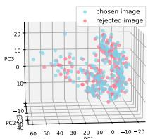  
(a) LLaVA

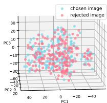  
(b) LLaVA+DPO

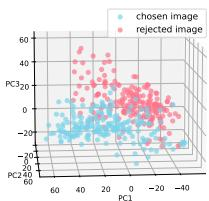  
(c) LLaVA+PEA-DPO  
Figure 1: Comparison of representation distributions for different models. Representations are constructed from 200 samples (original images and images with removed key visual context), using the embedding of the last token from the LLM to represent image semantics.

Aligning multimodal large language models (MLLMs) [15, 48, 49] with human values is crucial for building reliable AI systems that can understand and reason about visual-textual content while generating helpful responses [3, 18, 36]. The prevailing approaches in this field follow the advances established by text-only language model alignment [24, 28, 45, 47], applying Direct Preference Optimization (DPO) [26] and its variants [8, 20, 21, 35] to multimodal scenarios. They typically first construct multimodal preference datasets by pairing images with corresponding preferred and dispreferred textual responses, then apply standard DPO loss to align model outputs with human judgments [7, 16, 33, 37, 42, 43, 46, 50].

However, directly applying DPO to MLLMs implicitly treats the image as conditioning rather than a target of preference. As a result, the model can produce responses that are weakly grounded in the visual evidence. We term this failure visual insensitivity. Empirically, Figure 1 shows that the representation distributions of original images (i.e., chosen images) and their context-reduced counterparts (i.e., rejected images, with critical visual evidence removed) largely overlap for both a base LLaVA model and its DPOtuned version, indicating poor separation between informative and uninformative visual inputs.

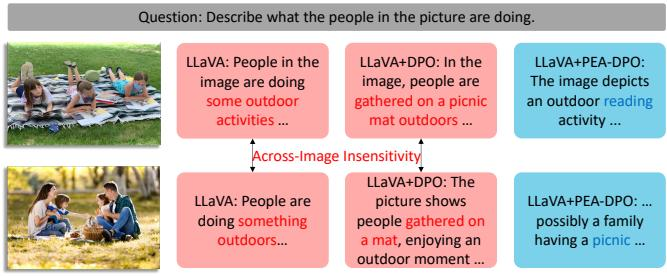

(a) Across-Image Insensitivity  
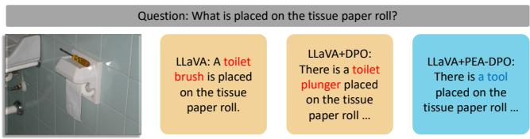  
(b) Within-Image Insensitivity  
Figure 2: Illustration of two manifestations of visual insensitivity in MLLM alignment. (a) Across-image insensitivity: the model assigns nearly identical preference across distinct images (e.g., outdoor reading vs. picnic), failing to capture discriminative visual context. (b) Within-image insensitivity: the model fails to discriminate semantically critical cues from irrelevant ones within the same image. (e.g., confusing a screwdriver with a toilet brush or a plunger), leading to visually ungrounded responses.

To provide a theoretical foundation for these observations, we formalize visual insensitivity by decomposing the model’s preference into textual and visual components. The analysis exposes two failure modes: (i) Across-Image Insensitivity, where the model assigns nearly identical preference across distinct images; and (ii) Within-Image Insensitivity, where the model fails to discriminate semantically critical cues from irrelevant ones within the same image. Figure 2 illustrates both phenomena: near-identical responses across diferent scenes (e.g., outdoor reading vs. picnic) and misrecognition of key objects (e.g., toilet brush vs. generic tool).

To address these limitations, we propose PEA-DPO, which fundamentally shifts from treating images as static conditioning context to jointly optimizing response quality preferences and visual context preferences. At its core is a dual preference learning framework that optimizes two complementary signals simultaneously: (1) response quality preference, where given the same text-image input, the model learns to distinguish high-quality responses from worse ones (standard multimodal DPO), and (2) visual context preferences, where given the same text but diferent visual contexts (original vs. context-reduced images), the model should favor responses that properly utilize complete visual evidence. We implement this dual optimization through two key components: (1) Construction of Perception-enhanced Preference Data, wherein we generate candidate images by applying random masks to original images, then leverage CLIP embeddings to identify masked variants that eliminate the most critical visual context, creating meaningful visual grounding preference pairs; and (2) Joint Optimization Objective, which combines both preference learning terms to simultaneously enhance response quality and visual sensitivity, promoting diferentiation between diferent visual contexts (cross-image sensitivity) while directing attention toward semantically critical visual elements within images (within-image sensitivity).

To evaluate the efectiveness of PEA-DPO, we conduct experiments using two sizes of LLaVA-v1.5 models [18], with 7B and 13B parameters. Evaluations on MMHal Bench [29], Object Hal-Bench [27], and AMBER [31] demonstrate that PEA-DPO significantly outperforms strong commercial multimodal models such as GPT-4V [1] in multimodal scenarios. Furthermore, for both 7B and 13B models, PEA-DPO achieves strong performance on all benchmarks, highlighting its efectiveness and scalability.

## 2 Related Work

In this section, we review prior work on multimodal LLMs preference optimization from two perspectives: loss function design and preference data construction.

Loss Function Design. Direct Preference Optimization (DPO) [26] was originally proposed for text-only LLMs and has since been extended to multimodal settings. SymPO [19] enforces theoretical consistency across modalities to ensure robustness under perturbations. AdPO [17] applies adversarial preference signals to strengthen multimodal models against input perturbations [51, 52]. DAMA [20] jointly considers data and model characteristics to adjust the opti mization objective adaptively. These methods primarily optimize over response-level preferences without explicitly modeling visual preference signals. mDPO [30] and V-DPO [34] take a step further by incorporating visual signals into the optimization objective.

Preference Data Construction. Another line of research focuses on how to construct high-quality preference data for multimodal alignment. From the text response perspective, LLaVA-RLHF [29] collects human-annotated preference labels on model responses, while RLAIF-V [38] replaces human annotators with open-source MLLMs to generate AI feedback at scale. RLHF-V [37] further introduces fine-grained correctional feedback to improve factual alignment. From the visual input perspective, several recent works construct rejected images to form image-level preference pairs. MFPO [12] and LPOI [41] generate rejected images through predefined transformations. mDPO [30] uses a completely uninformative image as the rejected counterpart. OPA-DPO [35] emphasizes the importance of on-policy data collection for preference pairs. CHiP [8] proposes a hierarchical cross-modal framework that constructs preference data capturing multi-level dependencies. However, these approaches either apply coarse-grained transformations that fail to precisely remove key visual context, or rely on heavyweight models for data construction.

## 3 Background

## 3.1 Background: Direct Preference Optimization in Multimodal Scenario

To further improve the performance of MLLMs, RLHF/RLAIF requires a reward model �(�, �, �) that evaluates human preference

over a response � given a prompt � and image �. The standard learning objective is:

$$
\operatorname* { m a x } _ { \pi _ { \theta } } \mathbb { E } _ { \mathcal { D } _ { y } } [ r ( x , y , m ) ] - \beta \mathbb { D } _ { \mathrm { K L } } [ \pi _ { \theta } ( \cdot \mid x , m ) \mid \mid \pi _ { \mathrm { r e f } } ( \cdot \mid x , m ) ] ,\tag{1}
$$

where D denotes the dataset, with prompts � and images � sampled from the reference policy $\pi _ { \mathrm { r e f } } .$ The term $\mathbb { D } _ { \mathrm { K I } }$ is the KL divergence, and $\beta$ controls the strength of regularization. DPO derives a closedform solution to Eq. 1, revealing that the reward function can be expressed as:

$$
r ( x , y , m ) = \beta \log \frac { \pi _ { \theta } ( y \mid x , m ) } { \pi _ { \mathrm { r e f } } ( y \mid x , m ) } + \beta \log Z ( x , m ) ,\tag{2}
$$

where $Z ( x , m )$ is a partition function depending only on the prompt � and image �. Incorporating this into the Bradley–Terry model [4], and given a dataset of preference pairs $( y _ { w } \succ y _ { l } )$ under the same (�, �), the optimization objective becomes:

$$
\begin{array} { r l } & { \mathcal { L } _ { \mathrm { D P O } } = - \mathbb { E } _ { \mathcal { D } } \left[ \log \sigma ( r ( x , y _ { w } , m ) - r ( x , y _ { l } , m ) ) \right] } \\ & { \qquad = - \mathbb { E } _ { \mathcal { D } } \Bigg [ \log \sigma \Bigg ( \beta \log \frac { \pi _ { \theta } ( y _ { w } \mid x , m ) } { \pi _ { \mathrm { r e f } } ( y _ { w } \mid x , m ) } - \beta \log \frac { \pi _ { \theta } ( y _ { l } \mid x , m ) } { \pi _ { \mathrm { r e f } } ( y _ { l } \mid x , m ) } \Bigg ) \Bigg ] , } \end{array}
$$

where �(·) denotes the sigmoid function.

(3)

## 3.2 Problem: Across-Image Insensitivity v.s. Within-Image Insensitivity

In this section, we provide a theoretical analysis of visual insensitivity in multimodal DPO, which manifests in two forms: (1) acrossimage insensitivity and (2) within-image insensitivity.

Definition 3.1 (image-based likelihood ratio). Inspired by [9, 22], we define the image-based likelihood ratio in log form:

$$
\ell _ { \theta } ( x , m ; y ) \triangleq \log { \frac { \pi _ { \theta } ( y \mid x , m ) } { \pi _ { \theta } ( y \mid x ) } } ,\tag{4}
$$

which quantifies the relative gain in the plausibility of response � when conditioning on the image � in addition to the prompt �.

Definition 3.2 (response-level margin). Given a preference data $( x , m , y _ { w } , y _ { l } )$ , the response-level margin is defined as follows:

$$
G _ { r } \triangleq \log \pi _ { \boldsymbol { \theta } } ( y _ { w } \vert x , m ) - \log \pi _ { \boldsymbol { \theta } } ( y _ { l } \vert x , m ) .\tag{5}
$$

�� quantifies the relative preference of the policy $\pi _ { \theta }$ between the preferred response $y _ { w }$ and the dispreferred response $y _ { l } . G _ { r }$ can be decomposed as:

$$
\begin{array} { c } { { G _ { r } = \underbrace { \left[ \log { \pi _ { \theta } ( y _ { w } \mid x ) } - \log { \pi _ { \theta } ( y _ { l } \mid x ) } \right] } _ { \Delta _ { \mathrm { t } } } } } \\ { { + \underbrace { \left[ \ell _ { \theta } ( x , m ; y _ { w } ) - \ell _ { \theta } ( x , m ; y _ { l } ) \right] } _ { \Delta _ { \mathrm { m } } } , } } \end{array}\tag{6}
$$

where $\Delta _ { \mathrm { m } }$ measures the extent to which image � reinforces the preference for the preferred response. Given a pair of images $m _ { w } , m _ { l }$ where $m _ { w }$ enables the prompt � to better align with the chosen response $y _ { w }$ than $m _ { l }$

Theorem 3.3 (Across-Image Insensitivity). Suppose there exist samples $\left( x , m _ { w } , m _ { l } , y _ { w } , y _ { l } \right)$ such that

$$
G _ { r } ( m _ { w } ) - G _ { r } ( m _ { l } ) \leq \delta \quad ( \delta \to 0 ) ,\tag{7}
$$

it implies the relation:

$$
\Delta _ { \mathrm { m } } ( m _ { w } ) - \Delta _ { \mathrm { m } } ( m _ { l } ) \leq \delta \quad ( \delta  0 ) .\tag{8}
$$

Intuitive explanation. The model cannot efectively distinguish the impact of $m _ { w }$ versus $m _ { l }$ on the responses, a phenomenon we term Across-Image Insensitivity.

Theorem 3.4 (Within-Image Insensitivity). Suppose there exist samples $( x , m _ { l } , y )$ such that

$$
| \ell _ { \theta } ( x , m _ { l } ; y ) | \leq \varepsilon \quad ( \varepsilon  0 ) ,\tag{9}
$$

and that the model exhibits Across-Image Insensitivity. Then the following holds for $m _ { w } { : }$

$$
\bigl | \ell _ { \theta } ( x , m _ { w } ; y _ { w } ) - \ell _ { \theta } ( x , m _ { w } ; y _ { l } ) \bigr | \leq \delta + 2 \varepsilon \quad ( \delta , \varepsilon \to 0 ) .\tag{10}
$$

Intuitive explanation. This observation suggests that the model is unable to reliably generate the correct response even when conditioned on $m _ { w } .$ . We refer to this phenomenon as Within-Image Insensitivity. Complete proofs are provided in Appendix ??.

## 4 Method

In summary, both types of issues arise from visual insensitivity. To address these limitations, we introduce PEA-DPO, as illustrated in Figure 3. It consists of two key components: (1) Construction of Perception-Enhanced Preference Data, where rejected images �� are generated by removing critical visual context using a CLIPbased approach; and (2) Joint Optimization Objective, which learns response quality preferences and visual sensitivity, simultaneously optimizing over response-level and image-level preferences, thereby aligning with human value preferences while enhancing visual sensitivity.

## 4.1 Construction of Perception-Enhanced Preference Data

We begin with the chosen image $m _ { w }$ (i.e., the original image) and apply a random mask of fixed proportion to generate a perturbed image $m _ { p } \colon$

$$
m _ { p } = m _ { w } \odot ( 1 - { \bf P } ) ,\tag{11}
$$

where P denotes a random binary mask and ⊙ represents the Hadamard product. Repeating this process � times yields a candidate set of perturbed images:

$$
\begin{array} { r } { M _ { p } = \{ { m } _ { p } ^ { k } \} _ { k = 1 } ^ { n } , } \end{array}\tag{12}
$$

where $m _ { p } ^ { k }$ denoting the �-th perturbed image. Since the perturbations are random, each perturbed image retains diferent portions of the original visual information. To quantify how much visual context is lost relative to the chosen image $m _ { w } .$ , we compute semantic similarity using CLIP [25] embeddings. Let ${ \bf v } _ { w } = f _ { \mathrm { C L I P } } ( m _ { w } )$ and $\mathbf { v } _ { p } ^ { k } = f _ { \mathrm { C L I P } } ( \operatorname* { m } _ { p } ^ { k } )$ denote the $\ell _ { 2 } \cdot$ -normalized embeddings from the CLIP image encoder $f _ { \mathrm { C L I P } } ( \cdot )$ . The similarity score is defined as:

$$
s _ { k } = \cos ( \mathbf { v } _ { w } , \mathbf { v } _ { p } ^ { k } ) = \frac { \mathbf { v } _ { w } ^ { \top } \mathbf { v } _ { p } ^ { k } } { \| \mathbf { v } _ { w } \| _ { 2 } \| \mathbf { v } _ { p } ^ { k } \| _ { 2 } } ,\tag{13}
$$

where $s _ { k } \in [ - 1 , 1 ]$ measures semantic similarity. Intuitively, given that all perturbations have equal mask size, a lower similarity score indicates that critical visual context has been removed. Finally, we

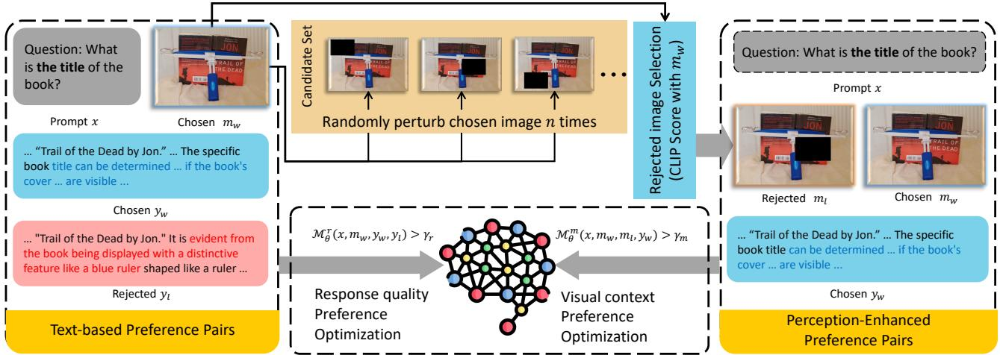  
Figure 3: Overview of PEA-DPO. Left: Original text-based preference pairs. Top: Construction process of perception-enhanced preference pairs, where critical key visual context is removed from images using a CLIP-based approach. Right: The resulting perception-enhanced preference pairs. Botom: Joint optimization text-based and perception-enhanced preferences.

select the perturbed image with the lowest similarity as the rejected image:

$$
m _ { l } = \arg \operatorname* { m i n } _ { m _ { p } ^ { k } \in \mathcal { M } _ { p } } s _ { k } ,\tag{14}
$$

where �� corresponds to the image with its key visual context removed. Optimizing over the perception-enhanced preference data $( x , m _ { l } , m _ { w } , y _ { w } )$ encourages the model to leverage critical visual cues, thereby improving its ability to generate preferred responses grounded in visual evidence.

## 4.2 Joint Optimization of Response quality and Visual context Preferences

After constructing the Perception-Enhanced Preference Data, we obtain a dataset ${ \mathcal D } _ { m } = ( x , m _ { w } , m _ { l } , y _ { w } )$ . Building upon the standard multimodal DPO, we replace the response quality preference data $\mathcal { D } = ( x , m _ { w } , y _ { w } , y _ { l } )$ with $\mathcal { D } _ { m }$ in Eq. 3. Let $h ( x , m , y ) =$ $\begin{array} { r } { \beta \log { \frac { \pi _ { \theta } ( y | x , m ) } { \pi _ { \mathrm { r e f } } ( y | x , m ) } } } \end{array}$ . This yields Visual context Preference Optimization (VPO) Objective, formulated as:

$$
\mathcal { L } _ { \mathrm { V P O } } = - \mathbb { E } _ { \mathcal { D } _ { m } } \left[ \log \sigma \big ( h ( x , m _ { w } , y _ { w } ) - h ( x , m _ { l } , y _ { w } ) \big ) \right] .\tag{15}
$$

Combining this with the standard multimodal DPO (i.e., Response quality Preference Optimization, RPO) in Eq. 3, we obtain the PEA-DPO objective:

$$
\begin{array} { r l } & { \mathcal { L } _ { \mathrm { P E A - D P O } } = \mathcal { L } _ { \mathrm { R P O } } + \alpha \cdot \mathcal { L } _ { \mathrm { V P O } } } \\ & { \qquad = - \mathbb { E } _ { \mathcal { D } } \Bigg [ \log \sigma \bigg ( h ( x , m _ { w } , y _ { w } ) - h ( x , m _ { w } , y _ { l } ) \bigg ) \Bigg ] } \\ & { \qquad - \mathbb { E } _ { \mathcal { D } _ { m } } \Bigg [ \log \sigma \bigg ( h ( x , m _ { w } , y _ { w } ) - h ( x , m _ { l } , y _ { w } ) \bigg ) \Bigg ] , } \end{array}\tag{16}
$$

where � is a weighting hyperparameter. This joint objective enables MLLMs to align with human preferences by simultaneously leveraging textual and critical visual modalities.

To further reduce computational overhead and enable control lable preference optimization, inspired by the design of RePO [32], we introduce three modifications to $\scriptstyle \mathcal { L } _ { \mathrm { P E A - D P O } } :$ (1) Replace logprobability ratios in Eq. 16 with length-normalized log-probabilities, thereby eliminating the need for a reference model; (2) Replace the sigmoid function with a ReLU activation, which filters out trivial data points and prevents overfitting; (3) Introduce target margin $\{ \gamma _ { r } , \gamma _ { m } \}$ and remove the temperature parameter $\beta ,$ enabling a controllable optimization process. Let $\begin{array} { r } { h _ { m } ( x , m , y ) = \frac { \log \pi _ { \theta } ( y | x , m ) } { | y | } } \end{array}$ . The modified PEA-DPO loss function is then given as:

$$
\begin{array} { r l } & { \mathcal { L } _ { \mathrm { m P E A - D P O } } = \mathcal { L } _ { \mathrm { m R P O } } + \alpha \cdot \mathcal { L } _ { \mathrm { m V P O } } } \\ & { = \mathbb { E } _ { \mathcal { D } } \bigg \{ \mathrm { R e L U } \bigg [ - \big ( h _ { m } ( x , m _ { w } , y _ { w } ) - h _ { m } ( x , m _ { w } , y _ { l } ) - \gamma _ { r } \big ) \bigg ] \bigg \} } \\ & { + \alpha \mathbb { E } _ { \mathcal { D } _ { m } } \bigg \{ \mathrm { R e L U } \bigg [ - \big ( h _ { m } ( x , m _ { w } , y _ { w } ) - h _ { m } ( x , m _ { l } , y _ { w } ) - \gamma _ { m } \big ) \bigg ] \bigg \} , } \end{array}\tag{17}
$$

where |�| denotes the number of tokens in response �, and $\{ \gamma _ { r } , \gamma _ { m } \}$ are the target reward margins, enforcing a minimum separation between preferred and rejected responses in both response-based preferences $\{ y _ { w } , y _ { l } \}$ and image-based preferences $\{ m _ { w } , m _ { l } \}$

## 5 Theoretical Analysis: How mPEA-DPO Mitigates Visual Insensitivity

We now establish the theoretical connection between the mPEA-DPO objective and the two forms of visual insensitivity identified in Section 3.2. Starting from definitions in Eq. 4 and Eq. 5, we show that each failure mode corresponds to a specific margin being small, and that mPEA-DPO is designed to directly enlarge both margins.

## 5.1 Image-Level Margin and Across-Image Insensitivity.

We define the image-level margin as:

$$
G _ { m } = \log \pi _ { \theta } ( y _ { w } \mid x , m _ { w } ) - \log \pi _ { \theta } ( y _ { w } \mid x , m _ { l } ) ,\tag{18}
$$

which measures how much the model’s confidence in the preferred response $y _ { w }$ increases when replacing the context-reduced image $m _ { l }$ with the correct image $m _ { w } .$ . According to the definition of $\Delta _ { \mathrm { m } }$ in $\operatorname { E q . }$ 6 and the image-based likelihood ratio in Eq. 4, we can derive (see Appendix ?? for full details):

$$
\begin{array} { r l } & { \quad \Delta _ { \mathrm { m } } ( x , m _ { w } ) - \Delta _ { \mathrm { m } } ( x , m _ { l } ) } \\ & { = \underbrace { \log \pi _ { \theta } ( y _ { w } \mid x , m _ { w } ) - \log \pi _ { \theta } ( y _ { w } \mid x , m _ { l } ) } _ { \mathrm { i m a g e - l e v e l ~ m a r g i n } G _ { m } } } \\ & { \quad + \underbrace { \log \pi _ { \theta } ( y _ { l } \mid x , m _ { l } ) - \log \pi _ { \theta } ( y _ { l } \mid x , m _ { w } ) } _ { \mathrm { s e c o n d a r y ~ t e r m } } . } \end{array}\tag{19}
$$

When the model exhibits Across-Image Insensitivity (Theorem 3.3), both sides are bounded by $\delta  0 .$ , implying that $G _ { m }$ is near zero. That is, the model’s confidence in the preferred response barely changes regardless of whether the correct or context-reduced image is provided. The secondary term captures how the dispreferred response shifts across images, but improving $G _ { m }$ has a more direct impact on performance as it explicitly boosts the probability of the correct output under the chosen image.

## 5.2 Response-Level Margin and Within-Image Insensitivity.

Similarly, expanding using the image-based likelihood ratio yields:

$$
\begin{array} { r l } & { \ \ell _ { \theta } ( x , m _ { w } ; y _ { w } ) - \ell _ { \theta } ( x , m _ { w } ; y _ { l } ) } \\ & { = \underbrace { \log \pi _ { \theta } ( y _ { w } \mid x , m _ { w } ) - \log \pi _ { \theta } ( y _ { l } \mid x , m _ { w } ) } _ { \mathrm { r e s p o n s e - l e v e l m a r g i n } G _ { r } } } \\ & { \ + \underbrace { \log \pi _ { \theta } ( y _ { l } \mid x ) - \log \pi _ { \theta } ( y _ { w } \mid x ) } _ { \mathrm { t e x t - o n l y b i a s } } . } \end{array}\tag{20}
$$

When the model exhibits Within-Image Insensitivity (Theorem 3.4), this quantity is bounded by $\eta = \delta + 2 \varepsilon  0$ , implying that $G _ { r }$ is near zero. The model fails to distinguish the preferred from the dispreferred response even with the correct visual evidence. The text-only bias term reflects inherent language priors without visual input; improving $G _ { r }$ is more critical as it directly enhances visual grounding.

## 5.3 mPEA-DPO Directly Enlarges Both Margins.

With the two failure modes characterized by small $G _ { m }$ and $G _ { r }$ respectively, we show that the mPEA-DPO objective is designed to directly enlarge both. Revisiting Eq. 17:

$$
\begin{array} { r l } & { \mathcal { L } _ { \mathrm { m P E A - D P O } } } \\ & { = \underbrace { { \mathbb E } _ { \mathcal { D } } \left\{ { \mathrm { R e L U } } \left[ - \left( h ( x , m _ { w } , y _ { w } ) - h ( x , m _ { w } , y _ { l } ) - \gamma _ { r } \right) \right] \right\} } _ { \mathcal { L } _ { \mathrm { m P O } } : \mathrm { i n c r e a s e } \ G _ { r } , \mathrm { m i t i g a t e s } \ \mathrm { W i t h i n - I m a g e } \ \mathrm { I n s e n s i t i v i t y } } } \\ & { \ + \alpha \cdot \underbrace { { \mathbb E } _ { \mathcal { D } _ { m } } \left\{ { \mathrm { R e L U } } \left[ - \left( h ( x , m _ { w } , y _ { w } ) - h ( x , m _ { l } , y _ { w } ) - \gamma _ { m } \right) \right] \right\} } _ { \mathcal { L } _ { \mathrm { m V P O } } : \mathrm { i n c r e a s e } \ G _ { m } , \mathrm { m i t i g a t e s } \ \mathrm { A c r o s s } \mathrm { - I m a g e } \ \mathrm { I n s e n s i t i v i t y } } . } \end{array}
$$

The $\mathcal { L } _ { \mathrm { m V P O } }$ term enforces $h ( x , m _ { w } , y _ { w } ) - h ( x , m _ { l } , y _ { w } ) > \gamma _ { m }$ , directly increasing the image-level margin $G _ { m }$ and enhancing the model’s discrimination between the correct and context-reduced images. The $\mathcal { L } _ { \mathrm { m R P O } }$ term enforces ℎ(�, $m _ { w } , y _ { w } ) - h ( x , m _ { w } , y _ { l } ) > \gamma _ { r }$ , directly increasing the response-level margin $G _ { r }$ and enhancing the model’s ability to favor the preferred response under the correct image. Since $\scriptstyle \mathcal { L } _ { \mathrm { m P E A - D P O } }$ is a linear combination of both terms, it provably addresses Across-Image and Within-Image Insensitivity simultaneously. Following SimPO [21], we normalize log-probabilities by response length to prevent length bias. Full derivations and an empirical validation showing how $G _ { m }$ and $G _ { r }$ shift before and after training are provided in Appendix ??.

## 6 Experiments

## 6.1 Experimental Setup

6.1.1 Models. We evaluate mPEA-DPO on two MLLMs with diferent parameter scales: LLaVA-v1.5-7B and LLaVA-v1.5-13B [18], both equipped with a CLIP ViT-L-336px vision encoder. The 7B model is built upon Vicuna-7B as its LLM backbone, while the 13B model utilizes Vicuna-13B as its LLM backbone. Both models are first pretrained on 558K image–text pairs datasets and then fine-tuned on 665K instruction-following instances.

6.1.2 Training Data. Following [20], we utilize the preference data of the LLaVA-1.5 model released by [38], where the languagebased preference is annotated by the open-source LLaVA-NeXT-34B model. Specifically, the dataset comprises 22K preference instances, with 13K images used for training. To construct perceptionenhanced preference data, we generate rejected images by masking informative regions in these 13K images.

6.1.3 Baselines. We report results across three categories of multimodal alignment approaches, while noting that direct comparison is non-trivial due to diferences in base models, preference data, and alignment strategies. Specifically: (1) Hallucination-specific baselines: including VCD [14], OPERA [10], HALC [11], and EOS [40], (2) RLHF/RLAIF-based baselines: including POVID [44], LLaVA-RLHF [29], HALVA [28], RLHF-V [37], HA-DPO [42], HSA-DPO [33], RLAIF-V [38], mDPO [30], OPA-DPO [35], and DAMA [20]. (3) Proprietary baseline: GPT-4V [1], which we use as a robust reference to compare the performance between open-source and proprietary commercial models. Gemini-2.5-Pro [6], which is also included in our comparison, given its status as a strong and up-to-date commercial baseline.

6.1.4 Benchmarks. (1) Object HalBench [27] is a widely adopted benchmark for evaluating object hallucination, focusing on detailed image descriptions of visual content. Following the protocol in [38], we evaluate on 300 instances and report hallucination rates at both the response-level (CHAIR�) and object-level(CHAIR�). (2) AMBER [31] provides a multi-dimensional evaluation of hallucination in MLLMs. Using its generative task with 1K samples, we report CHAIR scores, object coverage, hallucination rates, and alignment with human cognition. (3) MMHal-Bench [29] is a questionanswering benchmark comprising 96 image–question pairs across 12 object categories and 8 question types. Following the setup of [38], we assess both overall response quality (scored from zero to six) and hallucination rate, as judged by GPT-4.

6.1.5 Implementation Details. In our experiments, we construct perception-enhanced preference data by masking 9% of each image, repeated � = 30 times. We employ LLaVA-1.5-7B and LLaVA-1.5- 13B as backbone models, and perform full-parameter fine-tuning for 5,000 steps. Specifically, the batch size is set to 32 for the 7B model and 16 for the 13B model. In our objective Eq. 17, we set the hyperparameters as $\gamma _ { r } = 1 . 5 , \gamma _ { m } = 4 . 5$ and � = 0.2. All experiments are conducted using 4 NVIDIA A100 80GB GPUs.

Table 1: Main results of LLaVA-v1.5-7B and LLaVA-v1.5-13B trained with diferent preference optimization objectives. We report overall score (Score) and hallucination rate (Hal.) on MMHalBench, CHAIR scores at both response and object levels on Object HalBench, along with CHAIR scores (C.), object coverage (cover.), hallucination rate (Hal.), and cognition (Cog.) on AMBER. The best result for each metric in each group is in bold. We have carefully followed the publicly available code and released checkpoints to reproduce these results, aiming to provide a fair comparison. † indicates results obtained using the oficial API, ‡ indicates results reproduced using the authors’ released code, and ♯ indicates results produced from the authors provided checkpoints.
<table><tr><td rowspan="2"></td><td colspan="2">MMHalBench</td><td colspan="2">Object HalBench</td><td colspan="4">AMBER</td></tr><tr><td>Score ↑ Hal. ↓</td><td></td><td>CHAIRs↓</td><td>CHAIR↓</td><td>C. ↓</td><td></td><td>Cover. ↑ Hal.↓</td><td>Cog. ↓</td></tr><tr><td>GPT-4V [1]†</td><td>3.49</td><td>0.28</td><td>13.6</td><td>7.3</td><td>4.6</td><td>67.1</td><td>30.7</td><td>2.6</td></tr><tr><td> $\mathrm { G e m i n i - } 2 . 5 \mathrm { - p r o } \ [ 6 ] ^ { \dagger }$ </td><td>3.55</td><td>0.28</td><td>12.0</td><td>8.2</td><td>9.5</td><td>78.0</td><td>75.1</td><td>5.2</td></tr><tr><td colspan="9">7B MLLMs</td></tr><tr><td> $\mathrm { L L a V A – v 1 . 5 – 7 B } \ [ 1 8 ]$ </td><td>2.11</td><td>0.54</td><td>53.6</td><td>25.2</td><td>7.8</td><td>51.0</td><td>36.4</td><td>4.2</td></tr><tr><td> $+ { \mathrm { H A C L } } [ 1 1 ] ^ { \ddag }$ </td><td>2.13</td><td>0.50</td><td>-</td><td></td><td>-</td><td>-</td><td>-</td><td>-</td></tr><tr><td> $+ ~ \mathrm { O P E R A } [ 1 0 ] ^ { \ddag }$ </td><td>2.15</td><td>0.54</td><td>45.1</td><td>22.3</td><td>-</td><td>-</td><td>-</td><td>-</td></tr><tr><td> $+ \mathrm { V C D } [ 1 4 ] ^ { \ddagger }$ </td><td>2.12</td><td>0.54</td><td>48.8</td><td>24.3</td><td>-</td><td>一</td><td>1</td><td>-</td></tr><tr><td> $+ ~ \mathrm { E O S } ~ [ 4 0 ] ^ { \ddagger }$ </td><td>2.03</td><td>0.59</td><td>40.3</td><td>17.8</td><td>5.1</td><td>49.1</td><td>22.7</td><td>2.0</td></tr><tr><td> $+ \mathrm { P O V I D } [ 4 4 ] ^ { \ddagger }$ </td><td>2.08</td><td>0.56</td><td>48.1</td><td>24.4</td><td>-</td><td></td><td>一</td><td></td></tr><tr><td> $+ \ \mathrm { L L a V A – R L H F } \ [ 2 9 ] ^ { \sharp }$ </td><td>1.88</td><td>0.71</td><td>58.0</td><td>15.6</td><td>9.7</td><td>53.2</td><td>46.6</td><td>5.3</td></tr><tr><td> $+ \mathrm { H A - D P O } [ 4 2 ] ^ { \sharp }$ </td><td>1.97</td><td>0.60</td><td>39.9</td><td>19.9</td><td>6.7</td><td>49.8</td><td>30.9</td><td>3.3</td></tr><tr><td> $+ \mathrm { H A L V A } [ 2 8 ] ^ { \sharp }$ </td><td>2.25</td><td>0.54</td><td>-</td><td></td><td>6.6</td><td>53.0</td><td>32.2</td><td>3.4</td></tr><tr><td> $+ \mathrm { \ m D P O } [ 3 0 ] ^ { \ddag }$   $+ \mathrm { R L A I F - V } [ 3 8 ] ^ { \sharp }$ </td><td>2.39</td><td>0.54</td><td>35.7</td><td>9.8</td><td>4.4</td><td>52.4</td><td>24.5</td><td>2.4</td></tr><tr><td> $+ \mathrm { O P A - D P O } [ 3 5 ] ^ { \sharp }$ </td><td>3.00</td><td>0.38</td><td>16.0</td><td>3.7</td><td>3.0</td><td>50.4</td><td>16.2</td><td>1.0</td></tr><tr><td></td><td>2.83</td><td>0.45</td><td>13.0</td><td>4.3</td><td>2.2</td><td>47.9</td><td>11.6</td><td>0.9</td></tr><tr><td> $+ \mathrm { \ D A M A } \left[ 2 0 \right] ^ { \sharp }$   $\mathbf { \sigma } + \mathbf { m } \mathbf { P } \mathbf { E } \mathbf { A } { - } \mathbf { D } \mathbf { P } \mathbf { O }$ </td><td>2.76</td><td>0.41</td><td>10.3</td><td>5.9</td><td>3.0</td><td>48.3</td><td>14.8</td><td>1.2</td></tr><tr><td></td><td>3.02</td><td>0.36</td><td>4.3</td><td>3.2</td><td>1.9</td><td>46.7</td><td>10.3</td><td>0.6</td></tr><tr><td colspan="9">13B MLLMs</td></tr><tr><td>LLaVA-v1.5-13B [18]</td><td>2.42</td><td>-</td><td>46.3</td><td>22.6</td><td>7.8</td><td>51.0</td><td>36.4</td><td>4.2</td></tr><tr><td>十  $\cdot \mathrm { L L a V A - R L H F } [ 2 9 ] ^ { \sharp }$ </td><td>2.27</td><td>0.64</td><td>44.7</td><td>11.8</td><td>7.7</td><td>52.3</td><td>38.6</td><td>4.0</td></tr><tr><td> $\vdash \mathrm { R L H F - V } [ 3 7 ] ^ { \sharp }$  1</td><td>2.81</td><td>0.49</td><td>12.2</td><td>7.5</td><td>6.3</td><td>46.1</td><td>25.1</td><td>2.1</td></tr><tr><td>T  $\mathrm { \Delta \cdot \ H A L V A \left[ 2 8 \right] ^ { \sharp } }$ </td><td>2.58</td><td>0.45</td><td></td><td>-</td><td>6.4</td><td>52.6</td><td>30.4</td><td>3.2</td></tr><tr><td> $+ \mathrm { O P A - D P O } [ 3 5 ] ^ { \sharp }$ </td><td>3.07</td><td>0.39</td><td>16.33</td><td>5.5</td><td>2.4</td><td>48.3</td><td>12.8</td><td>0.8</td></tr><tr><td> $\cdot \mathrm { D A M A } [ 2 0 ] ^ { \sharp }$  十</td><td>2.89</td><td>0.43</td><td>7.7</td><td>4.9</td><td>3.0</td><td>50.5</td><td>14.1</td><td>0.9</td></tr><tr><td> $\mathbf { \sigma } + \mathbf { m } \mathbf { P } \mathbf { E } \mathbf { A } { - } \mathbf { D } \mathbf { P } \mathbf { O }$ </td><td>3.16</td><td>0.31</td><td>4.3</td><td>2.7</td><td>2.9</td><td>50.0</td><td>12.8</td><td>0.8</td></tr><tr><td></td><td></td><td></td><td></td><td></td><td></td><td></td><td></td><td></td></tr></table>

## 6.2 Main Results

The experimental results of applying mPEA-DPO to LLaVA-v1.5-7B and LLaVA-v1.5-13B across various hallucination benchmarks are presented in Table 1. The main findings are summarized as follows: (1) mPEA-DPO significantly reduces the hallucinations of the 7B and 13B models. Compared with the 7B (13B) base model, mPEA-DPO reduces the hallucination rate in MMHalBench by 33%, the response-level and object-level hallucination rates in Object Hal-Bench by 92% and 87% respectively, and the CHAIR, hallucination rate, and human cognition in AMBER by 76%, 72%, and 86% respectively. (2) Compared with existing MLLMs alignment methods, for LLaVA-v1.5-13B, mPEA-DPO achieves the best performance on 75.0% of the hallucination metrics, and for LLaVA-v1.5-7B, it increases to 87.5%. (3) However, these enhancements lead to a slight compromise in coverage metrics. This indicates that models trained with mPEA-DPO tend to adopt a slightly conservative strategy, avoiding uncertain assertions. Such a strategy enhances the credibility of the responses but may overlook some ambiguous details, which requires a trade-of.

## 6.3 Ablation

6.3.1 Impact ofComponent Combination. To evaluate the contribution of each component in mPEA-DPO and the efect of their combinations, we conducted a comprehensive ablation study on mPEA-DPO based on LLaVA. The experimental results are shown in Table 2. The main observations are as follows: (1) Both Response quality Preference Optimization (mRPO) and Visual context Preference Optimization (mVPO) are efective. On the MMHalBench and AMBER datasets, both mRPO (mPEA-DPO- $\mathcal { L } _ { \mathrm { m R P O } } )$ and mVPO $\left( \mathrm { m P E A - D P O - } \mathcal { L } _ { \mathrm { m V P O } } \right)$ outperform the base model. This suggests that: (a) during optimization process, Response quality Preference Optimization (RPO) enables the model to concentrate on more challenging data points and mitigates overfitting in DPO; (b) the introduction of Visual context Preference Optimization (mVPO) enhances the model’s alignment between the image and text. (2) The combination of visual context preference optimization and re sponse quality preference optimization strategies makes preference optimization the most powerful.

Table 2: The ablation results of mPEA-DPO based on LLaVA. Values in bold denote the best performance.
<table><tr><td rowspan="2">Model</td><td colspan="2">MMHalBench</td><td colspan="2">AMBER</td></tr><tr><td>Score↑</td><td>Hal.↓</td><td>C.↓</td><td> ${ \mathrm { C o g . } } \downarrow$ </td></tr><tr><td>LLaVA-v1.5-7B</td><td>2.11</td><td>0.54</td><td>7.8</td><td>4.2</td></tr><tr><td>mPEA-DPO</td><td>3.02</td><td>0.36</td><td>1.9</td><td>0.6</td></tr><tr><td> $- \mathcal { L } _ { \mathrm { m R P O } }$ </td><td>2.44</td><td>0.45</td><td>4.2</td><td>0.9</td></tr><tr><td> $- { \mathcal { L } } _ { \mathrm { m V P O } }$ </td><td>2.81</td><td>0.38</td><td>2.5</td><td>0.9</td></tr></table>

6.3.2 Impact ofVisual context Preference Optimization. Visual context Preference Optimization (mVPO) forces models to make preference judgements based on critical visual context. Here, we discuss the impact of its weight. We fully consider Response quality Preference Optimization (mRPO) since its global textual semantics by setting its parameter to 1 in Eq. 17. As for Visual context Preference Optimization, given its crucial role in enhancing MLLM’s attention to critical visual context, we fully explore the range of its weight � (as shown in Eq. 17). For the results of Figure 4, we observe that the best performance was achieved when � = 0.2 for LLaVA frameworks.

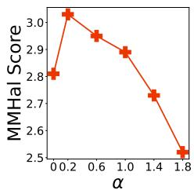  
(a) MMHal Score

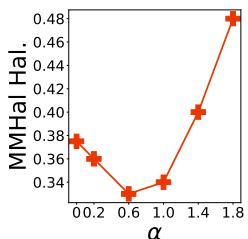  
(b) MMHal Hal.

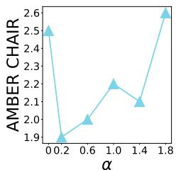  
(c) AMBER C.

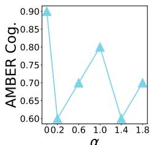  
(d) AMBER Cog.  
Figure 4: Results of mPEA-DPO evaluated on the MMHal-Bench and AMBER dataset with diferent choices of weight � to control the strength of Visual context Preference Optimization. Findings: when $\alpha = 0 . 2 ,$ , the best performance of the Score, CHAIR and Hallucination Rate metric is achieved on MMHal-Bench and AMBER based on LLaVA.

## 6.4 Impact of rejected image construction strategy

The quality of visual preference data depends on the rejected image quality and its gap from the chosen images. In this section, we compare the impact of our proposed strategy for constructing rejected images and various existing strategies on preference optimization.

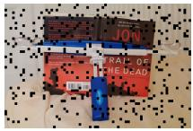  
(a) Chosen

  
(c) Rotation

(b) Blockwise  
  
(d) Crop

  
(e) Black

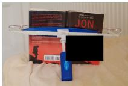  
(f) Ours  
Figure 5: Examples of rejected images constructed by diferent strategies. (a) is the chosen image.

6.4.1 Strategies. The existing rejected image construction strategies are listed below: (1) Blockwise: The chosen image is divided into blocks, with 30% of blocks randomly masked. (2) Rotation: The chosen image is randomly rotated between 10 to 80 degrees. (3) Crop: Random cropping strategy is applied to the chosen image. (4) Blackness: All RGB values in the chosen image are set to 0.

Table 3: Impact of rejected image construction strategy on mPEA-DPO. Bold indicates best.
<table><tr><td rowspan="2">Strategy</td><td colspan="2">MMHal Bench</td><td colspan="2">AMBER</td></tr><tr><td>Score↑</td><td>Hal.↓</td><td>CHAIR↓</td><td>HalRate↓</td></tr><tr><td>Ours</td><td>3.03</td><td>0.36</td><td>1.9</td><td>10.3</td></tr><tr><td>Blockwise</td><td>2.64</td><td>0.42</td><td>2.8</td><td>14.1</td></tr><tr><td>Rotation</td><td>2.47</td><td>0.46</td><td>2.6</td><td>12.5</td></tr><tr><td>Crop</td><td>2.69</td><td>0.42</td><td>2.1</td><td>11.3</td></tr><tr><td>Blackness</td><td>2.90</td><td>0.41</td><td>2.4</td><td>12.3</td></tr></table>

6.4.2 Results. The experimental results ofmPEA-DPO under diferent construction strategies of rejected images are shown in Table 3. We observe the rejected with removed key visual context can lead to better optimization results. The blockwise, rotation, and crop strategies retain a significant amount of the chosen image’s visual context, failing to efectively remove key visual context and thus leading to poorer performance. The blackness strategy, by completely masking the chosen image, virtually eliminates information about the chosen image, resulting in poorer performance. However, Perception-Enhanced Preference Data enhances the sensitivity of MLLMs to key visual information by removing the key visual context from the chosen images, thereby achieving the best performance.

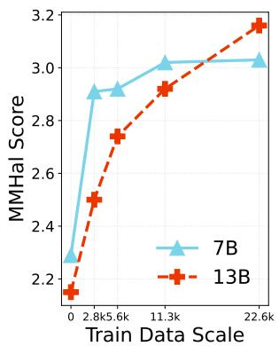

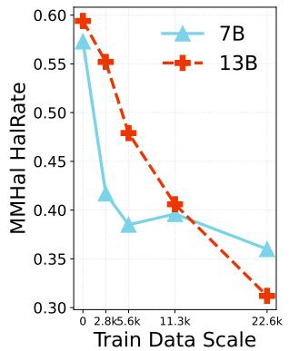

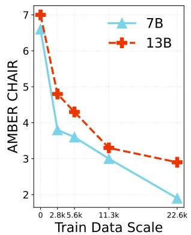

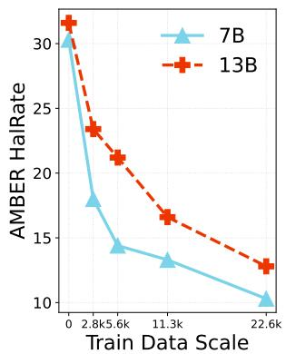  
Figure 6: Impact of data scale on the performance of mPEA-DPO, using LLaVA as the base model. We assess: (1) the overall score and hallucination rate on MMHalBench, and (2) CHAIR and hallucination on AMBER.

## 6.5 Impact of data scale

To investigate the impact of data scale on mPEA-DPO, we present its performance under varying amounts of training data in Figure 6. Even with only 2800 training instances, mPEA-DPO remains efective and outperforms the baseline. Additionally, we observe that the performance of mPEA-DPO consistently improves with increasing data scale, demonstrating significant performance gain.

## 6.6 Attribution of Hallucination Reduction

As discussed in [2], the CHAIR metric has a known limitation in that it does not penalize shorter responses, which may trivially reduce hallucination scores. To demonstrate that the reduction in CHAIR metrics is indeed driven by reduced hallucination rather than shorter or less informative outputs, we conducted a comparison on Object HalBench between our method and two of the strongest existing baselines, OPA-DPO [35] and DAMA [20]. We report three metrics: CHAIRs, CHAIRi, and Recall.

Table 4: Comparison of hallucination and recall performance on Object HalBench. Bold denote the best performance.
<table><tr><td>Model</td><td>CHAIRs</td><td>CHAIRi</td><td>Recall</td></tr><tr><td>OPA-DPO</td><td>13.3</td><td>4.3</td><td>43.29</td></tr><tr><td>DAMA</td><td>10.3</td><td>5.9</td><td>54.50</td></tr><tr><td>mPEA-DPO</td><td>4.3</td><td>3.2</td><td>52.30</td></tr></table>

As shown in Table 4, mPEA-DPO achieves clearly superior hal lucination metrics compared with both OPA-DPO and DAMA. Im portantly, mPEA-DPO attains recall performance comparable to DAMA while substantially outperforming OPA-DPO, indicating that the improvement in CHAIR metrics is not simply due to shorter responses but rather reflects a genuine reduction in hallucination.

## 6.7 Analysis of General Capability

Preference optimization may negatively afect the model’s generalization ability. In this section, we evaluate the general capabilities of MLLM enhanced with our mPEA-DPO on several widely used benchmarks, including MMStar [5], AI2D [13], LLaVA-Bench [18], and MMMU [39]. For LLaVA-Bench, we report the relative score judged by GPT-4o [23]. The results are presented in Table 5.

Table 5: The general capability evaluation results. Values in bold denote the best performance.
<table><tr><td>Model</td><td>MMStar</td><td>AI2D</td><td>LLaVA-Bench</td><td>MMMU(val)</td><td>MMMU(test)</td></tr><tr><td>LLaVA-v1.5-7B</td><td>30.3</td><td>49.1</td><td>82.3</td><td>32.1</td><td>35.3</td></tr><tr><td>+mPEA-DPO</td><td>32.8</td><td>51.9</td><td>86.5</td><td>30.8</td><td>33.4</td></tr></table>

We observe that LLaVA+mPEA-DPO outperforms LLaVA on MMStar, AI2D, and LLaVA-Bench, while maintaining comparable performance on MMMU. The results suggest that visual preference optimization not only reduces hallucinations but also enhances the model’s instruction-following capability. These results indicate that mPEA-DPO preserves and even slightly improves the general capabilities of the base model.

## 7 Limitation and Conclusion

Limitation. While mPEA-DPO yields notable gains in multimodal alignment and hallucination mitigation, several limitations remain. First, constructing perception-enhanced preference data incurs additional computation for generating and evaluating perturbed images. This overhead is manageable in our experiments. Second, due to limited computational capacity, we have not tested on the latest MLLMs (e.g., Mufin). Third, mPEA-DPO slightly reduces coverage metrics, likely reflecting a conservative generation strategy that avoids uncertain outputs.

Conclusion. In summary, our study uncovers two fundamental issues of Direct Preference Optimization (DPO) in multimodal settings: (1) Across-Image Insensitivity and (2) Within-Image Insensitivity. Through both theoretical analysis and empirical evaluation, we systematically characterize the inherent limitations of existing multimodal DPO methods in exhibiting visual insensitivity. To address these limitations, we propose Perception-Enhanced Alignment (PEA)-DPO, a framework for MLLM alignment that explicitly leverages visual preference signals in conjunction with standard multimodal DPO. Experiments on three widely-used benchmarks demonstrate that PEA-DPO substantially improves the performance of LLaVA-v1.5-7B and LLaVA-v1.5-13B, achieving strong results and surpassing other RLHF/RLAIF-based methods.

## References

[1] Josh Achiam, Steven Adler, Sandhini Agarwal, Lama Ahmad, Ilge Akkaya, Florencia Leoni Aleman, Diogo Almeida, Janko Altenschmidt, Sam Altman, Shyamal Anadkat, et al. 2023. Gpt-4 technical report. arXiv preprint arXiv:2303.08774 (2023).

[2] Elmira Amirloo, Jean-Philippe Fauconnier, Christoph Roesmann, Christian Kerl, Rinu Boney, Yusu Qian, Zirui Wang, Afshin Dehghan, Yinfei Yang, Zhe Gan, et al. 2024. Understanding alignment in multimodal llms: A comprehensive study. arXiv preprint arXiv:2407.02477 (2024).

[3] Shuai Bai, Keqin Chen, Xuejing Liu, Jialin Wang, Wenbin Ge, Sibo Song, Kai Dang, Peng Wang, Shijie Wang, Jun Tang, et al. 2025. Qwen2. 5-vl technical report. arXiv preprint arXiv:2502.13923 (2025).

[4] Ralph Allan Bradley and Milton E Terry. 1952. Rank analysis of incomplete block designs: I. the method of paired comparisons. Biometrika 39, 3/4 (1952), 324–345.

[5] Lin Chen, Jinsong Li, Xiaoyi Dong, Pan Zhang, Yuhang Zang, Zehui Chen, Haodong Duan, Jiaqi Wang, Yu Qiao, Dahua Lin, et al. 2024. Are we on the right way for evaluating large vision-language models? Advances in Neural Information Processing Systems 37 (2024), 27056–27087.

[6] Gheorghe Comanici, Eric Bieber, Mike Schaekermann, Ice Pasupat, Noveen Sachdeva, Inderjit Dhillon, Marcel Blistein, Ori Ram, Dan Zhang, Evan Rosen, et al. 2025. Gemini 2.5: Pushing the frontier with advanced reasoning, multi modality, long context, and next generation agentic capabilities. arXiv preprint arXiv:2507.06261 (2025).

[7] Yihe Deng, Pan Lu, Fan Yin, Ziniu Hu, Sheng Shen, Quanquan Gu, James Y Zou, Kai-Wei Chang, and Wei Wang. 2024. Enhancing large vision language models with self-training on image comprehension. Advances in Neural Information Processing Systems 37 (2024), 131369–131397.

[8] Jinlan Fu, Shenzhen Huangfu, Hao Fei, Xiaoyu Shen, Bryan Hooi, Xipeng Qiu, and See-Kiong Ng. 2025. CHiP: Cross-modal Hierarchical Direct Preference Optimization for Multimodal LLMs. arXiv preprint arXiv:2501.16629 (2025).

[9] Michael Gutmann and Aapo Hyvärinen. 2010. Noise-contrastive estimation: A new estimation principle for unnormalized statistical models. In Proceedings of the thirteenth international conference on artificial intelligence and statistics. JMLR Workshop and Conference Proceedings, 297–304.

[10] Qidong Huang, Xiaoyi Dong, Pan Zhang, Bin Wang, Conghui He, Jiaqi Wang, Dahua Lin, Weiming Zhang, and Nenghai Yu. 2024. Opera: Alleviating hal lucination in multi-modal large language models via over-trust penalty and retrospection-allocation. In Proceedings of the IEEE/CVF Conference on Computer Vision and Pattern Recognition. 13418–13427.

[11] Chaoya Jiang, Haiyang Xu, Mengfan Dong, Jiaxing Chen, Wei Ye, Ming Yan, Qinghao Ye, Ji Zhang, Fei Huang, and Shikun Zhang. 2024. Hallucination augmented contrastive learning for multimodal large language model. In Proceedings ofthe IEEE/CVF Conference on Computer Vision and Pattern Recognition. 27036–27046.

[12] Songtao Jiang, Yan Zhang, Ruizhe Chen, Tianxiang Hu, Yeying Jin, Qinglin He, Yang Feng,Jian Wu, and Zuozhu Liu. 2025. Modality-Fair Preference Optimization for Trustworthy MLLM Alignment. In Proceedings ofthe Thirty-Fourth International Joint Conference on Artificial Intelligence, IJCAI 2025, Montreal, Canada, August 16-22, 2025. ijcai.org, 403–411.

[13] Aniruddha Kembhavi, Mike Salvato, Eric Kolve, Minjoon Seo, Hannaneh Hajishirzi, and Ali Farhadi. 2016. A diagram is worth a dozen images. In European conference on computer vision. Springer, 235–251.

[14] Sicong Leng, Hang Zhang, Guanzheng Chen, Xin Li, Shijian Lu, Chunyan Miao, and Lidong Bing. 2024. Mitigating object hallucinations in large vision-language models through visual contrastive decoding. In Proceedings of the IEEE/CVF Conference on Computer Vision and Pattern Recognition. 13872–13882.

[15] Chenxu Li, Zhicai Wang, Yuan Sheng, Xingyu Zhu, Yanbin Hao, and Xiang Wang. 2025. Res-Bench: Benchmarking the Robustness of Multimodal Large Language Models to Dynamic Resolution Input. arXiv:2510.16926 [cs.CV] https: //arxiv.org/abs/2510.16926

[16] Lei Li, Zhihui Xie, Mukai Li, Shunian Chen, Peiyi Wang, Liang Chen, Yazheng Yang, Benyou Wang, and Lingpeng Kong. 2023. Silkie: Preference distillation for large visual language models. arXiv preprint arXiv:2312.10665 (2023).

[17] Chaohu Liu, Tianyi Gui, Yu Liu, and Linli Xu. 2025. AdPO: Enhancing the adver sarial robustness of large vision-language models with preference optimization. arXiv preprint arXiv:2504.01735 (2025).

[18] Haotian Liu, Chunyuan Li, Yuheng Li, and Yong Jae Lee. 2024. Improved baselines with visual instruction tuning. In Proceedings of the IEEE/CVF Conference on Computer Vision and Pattern Recognition. 26296–26306.

[19] Wenqi Liu, Xuemeng Song, Jiaxi Li, Yinwei Wei, Na Zheng, Jianhua Yin, and Liqiang Nie. 2025. Mitigating Hallucination Through Theory-Consistent Symmetric Multimodal Preference Optimization. arXiv preprint arXiv:2506.11712 (2025).

[20] Jinda Lu, Junkang Wu, Jinghan Li, Xiaojun Jia, Shuo Wang, YiFan Zhang, Junfeng Fang, Xiang Wang, and Xiangnan He. 2025. DAMO: Data-and Model-aware Alignment of Multi-modal LLMs. arXiv preprint arXiv:2502.01943 (2025).

[21] Yu Meng, Mengzhou Xia, and Danqi Chen. 2024. Simpo: Simple preference optimization with a reference-free reward. Advances in Neural Information

Processing Systems 37 (2024), 124198–124235.

[22] Aaron van den Oord, Yazhe Li, and Oriol Vinyals. 2018. Representation learning with contrastive predictive coding. arXiv preprint arXiv:1807.03748 (2018).

[23] OpenAI. 2024. GPT-4o System Card. CoRR abs/2410.21276 (2024). https://doi. org/10.48550/arXiv.2410.21276

[24] Renjie Pi, Tianyang Han, Wei Xiong, Jipeng Zhang, Runtao Liu, Rui Pan, and Tong Zhang. 2024. Strengthening multimodal large language model with bootstrapped preference optimization. In European Conference on Computer Vision. Springer, 382–398.

[25] Alec Radford, Jong Wook Kim, Chris Hallacy, Aditya Ramesh, Gabriel Goh, Sandhini Agarwal, Girish Sastry, Amanda Askell, Pamela Mishkin, Jack Clark, et al. 2021. Learning transferable visual models from natural language supervision. In International conference on machine learning. PmLR, 8748–8763.

[26] Rafael Rafailov, Archit Sharma, Eric Mitchell, Christopher D Manning, Stefano Ermon, and Chelsea Finn. 2023. Direct preference optimization: Your language model is secretly a reward model. Advances in neural information processing systems 36 (2023), 53728–53741.

[27] Anna Rohrbach, Lisa Anne Hendricks, Kaylee Burns, Trevor Darrell, and Kate Saenko. 2018. Object hallucination in image captioning. arXiv preprint arXiv:1809.02156 (2018).

[28] Pritam Sarkar, Sayna Ebrahimi, Ali Etemad, Ahmad Beirami, Sercan Ö Arik, and Tomas Pfister. 2024. Mitigating object hallucination via data augmented contrastive tuning. CoRR (2024).

[29] Zhiqing Sun, Sheng Shen, Shengcao Cao, Haotian Liu, Chunyuan Li, Yikang Shen, Chuang Gan, Liang-Yan Gui, Yu-Xiong Wang, Yiming Yang, et al. 2023. Aligning large multimodal models with factually augmented rlhf. arXiv preprint arXiv:2309.14525 (2023).

[30] Fei Wang, Wenxuan Zhou, James Y Huang, Nan Xu, Sheng Zhang, Hoifung Poon, and Muhao Chen. 2024. mdpo: Conditional preference optimization for multimodal large language models. arXiv preprint arXiv:2406.11839 (2024).

[31] Junyang Wang, Yuhang Wang, Guohai Xu, Jing Zhang, Yukai Gu, Haitao Jia, Jiaqi Wang, Haiyang Xu, Ming Yan, Ji Zhang, et al. 2023. Amber: An llm-free multi-dimensional benchmark for mllms hallucination evaluation. arXiv preprint arXiv:2311.07397 (2023).

[32] Junkang Wu, Kexin Huang, Xue Wang, Jinyang Gao, Bolin Ding, Jiancan Wu, Xiangnan He, and Xiang Wang. 2025. RePO: ReLU-based Preference Optimization. arXiv preprint arXiv:2503.07426 (2025).

[33] Wenyi Xiao, Ziwei Huang, Leilei Gan, Wanggui He, Haoyuan Li, Zhelun Yu, Hao Jiang, Fei Wu, and Linchao Zhu. 2024. Detecting and Mitigating Hallucination in Large Vision Language Models via Fine-Grained AI Feedback. arXiv preprint arXiv:2404.14233 (2024).

[34] Yuxi Xie, Guanzhen Li, Xiao Xu, and Min-Yen Kan. 2024. V-dpo: Mitigating hallucination in large vision language models via vision-guided direct preference optimization. arXiv preprint arXiv:2411.02712 (2024).

[35] Zhihe Yang, Xufang Luo, Dongqi Han, Yunjian Xu, and Dongsheng Li. 2025. Mitigating hallucinations in large vision-language models via dpo: On-policy data hold the key. In Proceedings ofthe Computer Vision and Pattern Recognition Conference. 10610–10620.

[36] Shukang Yin, Chaoyou Fu, Sirui Zhao, Ke Li, Xing Sun, Tong Xu, and Enhong Chen. 2024. A survey on multimodal large language models. National Science Review 11, 12 (2024), nwae403.

[37] Tianyu Yu, Yuan Yao, Haoye Zhang, Taiwen He, Yifeng Han, Ganqu Cui, Jinyi Hu, Zhiyuan Liu, Hai-Tao Zheng, Maosong Sun, et al. 2024. Rlhf-v: Towards trustworthy mllms via behavior alignment from fine-grained correctional human feedback. In Proceedings of the IEEE/CVF Conference on Computer Vision and Pattern Recognition. 13807–13816.

[38] Tianyu Yu, Haoye Zhang, Yuan Yao, Yunkai Dang, Da Chen, Xiaoman Lu, Ganqu Cui, Taiwen He, Zhiyuan Liu, Tat-Seng Chua, et al. 2024. Rlaif-v: Aligning mllms through open-source ai feedback for super gpt-4v trustworthiness. arXiv preprint arXiv:2405.17220 (2024).

[39] Xiang Yue, Yuansheng Ni, Kai Zhang, Tianyu Zheng, Ruoqi Liu, Ge Zhang, Samuel Stevens, Dongfu Jiang, Weiming Ren, Yuxuan Sun, et al. 2024. Mmmu: A massive multi-discipline multimodal understanding and reasoning benchmark for expert agi. In Proceedings of the IEEE/CVF Conference on Computer Vision and Pattern Recognition. 9556–9567.

[40] Zihao Yue, Liang Zhang, and Qin Jin. 2024. Less is More: Mitigating Multimodal Hallucination from an EOS Decision Perspective. arXiv preprint arXiv:2402.14545 (2024).

[41] Fatemeh Pesaran Zadeh, Yoojin Oh, and Gunhee Kim. 2025. LPOI: Listwise Preference Optimization for Vision Language Models. In Proceedings ofthe 63rd Annual Meeting of the Association for Computational Linguistics (Volume 1: Long Papers), ACL 2025, Vienna, Austria, July 27 - August 1, 2025. 26830–26844.

[42] Zhiyuan Zhao, Bin Wang, Linke Ouyang, Xiaoyi Dong, Jiaqi Wang, and Conghui He. 2023. Beyond hallucinations: Enhancing lvlms through hallucination-aware direct preference optimization. arXiv preprint arXiv:2311.16839 (2023).

[43] Wenxuan Zhou, Ravi Agrawal, Shujian Zhang, Sathish Reddy Indurthi, Sanqiang Zhao, Kaiqiang Song, Silei Xu, and Chenguang Zhu. 2024. Wpo: Enhancing rlhf with weighted preference optimization. arXiv preprint arXiv:2406.11827 (2024).

[44] Yiyang Zhou, Chenhang Cui, Rafael Rafailov, Chelsea Finn, and Huaxiu Yao. 2024. Aligning Modalities in Vision Large Language Models via Preference Fine-tuning. arXiv preprint arXiv:2402.11411 (2024).

[45] Xingyu Zhu, Junfeng Fang, Shuo Wang, Beier Zhu, Zhicai Wang, Yonghui Yang, and Xiangnan He. 2026. Mitigating Hallucinations in Large Vision-Language Models without Performance Degradation. In ACL (1). Association for Computa tional Linguistics, 1995–2009.

[46] Xingyu Zhu, Shuo Wang, Beier Zhu, Miaoge Li, Yunfan Li, Junfeng Fang, Zhicai Wang, Dongsheng Wang, and Hanwang Zhang. 2025. Dynamic multimodal prototype learning in vision-language models. In 2025 IEEE/CVF International Conference on Computer Vision (ICCV). IEEE, 2501–2511.

[47] Xingyu Zhu, Huanshen Wu, Shuo Wang, Beier Zhu, Jiannan Ge, Jiaheng Zhang, and Long Chen. 2026. Robustifying Vision-Language Models via Test-Time Prompt Adaptation. arXiv preprint arXiv:2607.09450 (2026).

[48] Xingyu Zhu, Kesen Zhao, Liang Yi, Shuo Wang, Zhicai Wang, Beier Zhu, Hanwang Zhang, and Xiangnan He. 2026. Look carefully: Adaptive visual reinforcements in multimodal large language models for hallucination mitigation. In

International Conference on Learning Representations, Vol. 2026. 81235–81256.

[49] Xingyu Zhu, Beier Zhu, Junfeng Fang, Shuo Wang, Yin Zhang, Xiang Wang, and Xiangnan He. 2026. Guardalign: Test-time safety alignment in multimodal large language models. arXiv preprint arXiv:2602.24027 (2026).

[50] Xingyu Zhu, Beier Zhu, Yi Tan, Shuo Wang, Yanbin Hao, and Hanwang Zhang. 2024. Enhancing zero-shot vision models by label-free prompt distribution learning and bias correcting. Advances in Neural Information Processing Systems 37 (2024), 2001–2025.

[51] Xingyu Zhu, Beier Zhu, Shuo Wang, Junfeng Fang, Kesen Zhao, Hanwang Zhang, and Xiangnan He. 2026. Principled steering via null-space projection for jailbreak defense in vision-language models. arXiv preprint arXiv:2603.22094 (2026).

[52] Xingyu Zhu, Beier Zhu, Shuo Wang, Kesen Zhao, and Hanwang Zhang. 2026. Enhancing clip robustness via cross-modality alignment. Advances in Neural Information Processing Systems 38 (2026), 17553–17576.