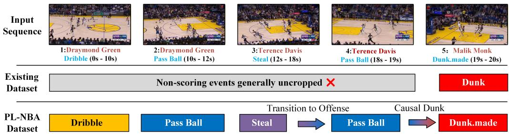
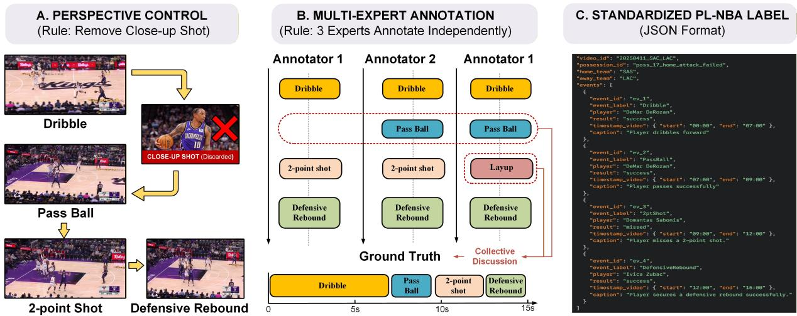
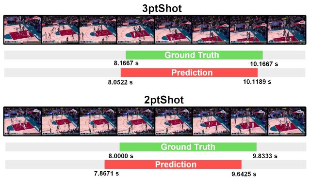
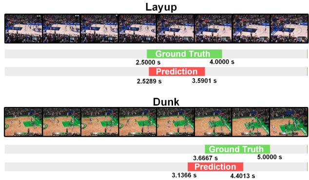

# PL-NBA: A Possession-level Universal Basketball Video Dataset Supporting Multiple Visual Understanding Tasks

Yunhao Zhao holhouse@emails.bjut.edu.cn Beijing University of Technology Beijing, China

Zhuming Wang wzm1030@126.com Beijing University of Technology Beijing, China

Haoying Sun sunhaoying97@163.com Beijing University of Technology Beijing, China

Ya Jing jingya@bjut.edu.cn Beijing University of Technology Beijing, China

Lifang Wu∗ lfwu@bjut.edu.cn Beijing University of Technology Beijing, China

Jiarui Li ljr2024@emails.bjut.edu.cn Beijing University of Technology Beijing, China

Xiangbo Shu Nanjing University of Science and Technology Nanjing, China

Changwen Chen changwen.chen@polyu.edu.hk Hong Kong Polytechnic University Hong Kong, China

  
Figure 1: Existing datasets (middle) primarily annotate isolated event clips, overlooking the inherent temporal dynamics of basketball games. In contrast, our proposed PL-NBA dataset (bottom) captures all constituent events within a complete ofensive possession. This provides unified, high-quality data support for various downstream tasks.

## Abstract

Visual understanding in sports has emerged as a hot topic in computer vision in recent years. Most existing basketball video datasets adopt single action or activity as sample, which can neither preserve the temporal continuity of game events nor support complex tasks such as action anticipation. To address this issue, this paper constructs the first possession-level basketball video dataset (PL-NBA), in which each sample is composed of a complete NBA ofensive possession. Collected from 60 NBA games, PL-NBA contains 11,000 valid ofensive possession clips and 31,567 annotated events with player names, captions, event types and timestamps. Each video clip includes multiple events and preserves the continuity of events, which is helpful for analysis of tactic. Experiment is conducted on multiple visual understanding tasks, including event recognition, video captioning, temporal action localization and action antici pation. Experimental results show that existing methods achieve limited performance on above four tasks, demonstrating that PL-NBA is a challenging benchmark for sports video understanding.

## Keywords

Basketball video dataset, Visual Understanding, Event recognition

## 1 Introduction

Visual understanding tasks in sports constitute a pivotal interdisciplinary research area integrating computer vision and sports science. In recent years, significant progress has been made in numerous sub-tasks, such as video captioning[24, 25, 28, 29], event recognition[5, 7, 18, 20], and group activity recognition[4, 9, 19, 22].

However, existing sports video understanding research is constrained by specific datasets—relevant tasks focus mainly on the action level with single-dimensional annotations. Such datasets can only support single sub-tasks and fail to reflect the contextual dependencies between actions, thus failing to support complex application scenarios like tactical analysis and intelligent broadcast.

Among various sports disciplines, basketball, characterized by its fast pace and diverse types of action, has become a key research hotspot for visual understanding. In a basketball game, an ofensive possession serves as the fundamental unit of tactical execution. It is widely adopted to calculate ofensive eficiency and defensive eficiency, acting as a critical benchmark to evaluate team performance. Meanwhile, it also serves as the basic unit for the audience to understand the progression of game and tactical logic. A possession may include a series of coherent actions, such as dribbling, passing, and shooting. As illustrated in Figure 1, there are clear logical connections between consecutive actions.

Table 1: Comparison between existing basketball video datasets and our PL-NBA dataset.
<table><tr><td>Name</td><td>FSN</td><td>NBA</td><td>NSVA</td><td>BH-Commentary</td><td>VC-2022</td><td>FineSports</td><td>PL-NBA</td></tr><tr><td>Year</td><td>2018</td><td>2020</td><td>2022</td><td>2024</td><td>2024</td><td>2024</td><td>2026</td></tr><tr><td>Sample Level</td><td>event</td><td>event</td><td>event</td><td>event</td><td>event</td><td>event</td><td>possession</td></tr><tr><td>Number of Samples</td><td>2,000</td><td>9,172</td><td>32,019</td><td>4,396</td><td>11,489</td><td>10,000</td><td>11,000</td></tr><tr><td>Data Source</td><td>NBA</td><td>NBA:18-19</td><td>NBA:18-19</td><td>NBA:20-23</td><td>NBA:22-23</td><td>NBA</td><td>NBA:22-25</td></tr><tr><td>Video Resolution</td><td>一</td><td>1080P</td><td>720p</td><td>720p</td><td>720p</td><td>一</td><td>1080P</td></tr><tr><td>Audio Track</td><td>x</td><td>x</td><td>x</td><td>x</td><td>x</td><td>x</td><td>√</td></tr><tr><td>Event Recognition</td><td>x</td><td>√</td><td>√</td><td>x</td><td>x</td><td>x</td><td>√</td></tr><tr><td>Temporal Action Localization</td><td>x</td><td>x</td><td>x</td><td>x</td><td>x</td><td>x</td><td>√</td></tr><tr><td>Spatiotemporal Action Localization</td><td>x</td><td>x</td><td>x</td><td>x</td><td>x</td><td>√</td><td>x</td></tr><tr><td>Video Captioning</td><td>√</td><td>x</td><td>√</td><td>√</td><td>√</td><td>x</td><td>√</td></tr><tr><td>Action Anticipation</td><td>x</td><td>X</td><td>x</td><td>X</td><td>x</td><td>X</td><td>√</td></tr></table>

In summary, a possession-level basketball video dataset can not only support a simple visual understanding task but also adapt to various complex research needs, promising to advance basketball video understanding toward a more practical direction. To this end, this study constructs a new basketball game video dataset named PL-NBA. Unlike traditional datasets centered on individual events, each sample in PL-NBA contains a complete ofensive possession, fully preserving the continuity of action sequences and the integrity of tactical scenarios.

## The contributions of this paper are as follows:

(1) We construct the first possession-level basketball video dataset, named PL-NBA. It includes 11,000 valid ofensive possessions with 31,567 events collected from 60 NBA games, and multiple labels including player names, captions, event types, and timestamps. It can provide comprehensive annotation support for various sports visual understanding tasks.

(2) We conduct benchmark experiments on event recognition, video captioning, and temporal action localization using PL-NBA, validating the efectiveness of our dataset.

(3) We propose the action anticipation task in basketball games based on the PL-NBA dataset and present a baseline method, which provides a novel task paradigm and a feasible baseline reference for the research on intelligent analysis of basketball events.

## 2 Related Work

This chapter will respectively introduce mainstream basketball video datasets and related visual understanding tasks.

## 2.1 Survey of Basketball Video Datasets

Researchers have developed several basketball video datasets, each equipped with specific annotations to support their corresponding downstream tasks. The FSN dataset[28] is designed for video cap tioning, consisting of 2,000 high-definition NBA videos and detailed descriptive paragraphs.The NBA dataset[27] targets group activity recognition, covering 9 categories of group actions, and adopts video-level labels to reduce annotation costs.The NSVA dataset[21] is the only existing multi-task sports video analysis dataset, supporting video captioning, action recognition, and player identification. It contains 32,019 NBA clips, 172 fine-grained action categories and the identity information of 184 players.The BH-Commentary dataset[30] is proposed for basketball highlight commentary generation, including 4,396 NBA highlight videos and corresponding professional commentaries.The VC-2022 dataset[23] is a player-aware video captioning dataset with 3,977 clips and associated visual and name knowledge of 286 players.The FineSports dataset[26] focuses on fine-grained spatiotemporal action localization and recognition, containing 10,000 NBA videos and 123,000 annotated spatiotemporal bounding boxes.

Among the mentioned basketball video datasets, except for the NSVA dataset[21] which contains rich annotation information to support more than one downstream task, all other datasets can only cater to a single visual understanding task. To address this issue, our proposed PL-NBA dataset can be adapted to diverse downstream tasks. Table 1 presents the comparison between PL-NBA and aforementioned datasets.

## 2.2 Visual Understanding Tasks

This section presents four typical visual understanding tasks in sports video analysis. It also introduces three novel tasks developed based on the PL-NB dataset.

Event Recognition (ER): This task aims to identify the specific event categories related to sports competitions from videos[14, 16]. It takes a video as input and outputs the corresponding event type. Temporal Action Localization (TAL): This task locates the temporal boundaries where actions occur[13, 15, 31].

Spatiotemporal Action Localization (SAL): This task extends TAL to recognize action categories and temporal boundaries while localizing players via bounding boxes [26]. PL-NBA provides no bounding box annotations, making it incompatible with SAL tasks. Video Captioning(VC): It aims to convert video content into human-understandable text[8, 10, 11, 17].

Action Anticipation: The proposed task takes pre-ofensive historical video clips to predict ofensive tendencies: perimeter ofense (2ptShot, 3ptShot) and inside ofense (Layup, Dunk). PL-NBA with complete possession videos is the first dataset supporting this task. Fine-grained Event Recognition: A novel task derived from PL-NBA, which aims to detect all contained events within a possession. Owing to page constraints, the preliminary experiment results are available at https://github.com/holhouse/PL-NBA-Dataset.

  
Figure 2: Overview of the PL-NBA annotation workflow. The pipeline ensures data quality through perspective control (retaining only overhead court shots and discarding close-up shots) and joint annotation by three experienced experts (who label independently first and reach a consensus through discussion for divergences). The resulting possession-level annotations are stored in a structured JSON format (right), providing precise video-time-anchored labels for visual understanding tasks.

Fine-grained Video Captioning: A novel task based on PL-NBA to generate textual descriptions for complete ofensive possessions. Preliminary results will be released via the above link.

## 3 Dataset Construction

This work constructs a possession-level basketball video dataset (PL-NBA). Centered on complete ofensive possessions from NBA games, the dataset provides high-quality data support for visual understanding tasks through multiple and refined annotations. The dataset construction pipeline is illustrated in Figure 2.

## 3.1 Data Collection

Considering the scenario complexity and authority of oficial NBA games, all samples are derived from 2022–2025 season replays, with 60 oficial matches selected to cover all 30 league teams.

Perspective control: Only overhead court shots are retained, as this perspective can fully present player positions, tactical movements, and ball possession transitions. Close-up shots, audience shots, and non-game-related content (e.g., post-game interviews, commercial breaks) are excluded to reduce irrelevant visual noise. Multi-expert annotation: Three basketball-dataset annotators label all samples independently. Discrepancies are discussed until a consensus is reached.

Possession Boundary Definition: A possession starts from the first overhead view when the ofensive team gains ball possession, typically with an inbound pass; it ends once the ball possession switches, such as after an ofensive score.

## 3.2 Data Annotation

A possession-level video sample contains multiple sub-events. Each sub-event is accompanied by comprehensive annotation, including event type, player name, event outcome, timestamp, and anonymized text description, as shown in the JSON example shown in Figure 2.

There are 13 categories of sub-event types, as illustrated in Table 2. Player names are cross-verified with textual game records from the oficial NBA website via jersey numbers, manually validated to ensure accuracy. Timestamp labels record the start and end time points of each sub-event in the original video file, with the unit of second:frame (sexagesimal). Event outcome labels are a newly introduced annotation type in the PL-NBA dataset, representing the final result of each sub-event. The corresponding outcomes for diferent event types are also presented in Table 2. Anonymized text descriptions fully depict the event content in textual form, generated by Gemini 3 large language model(LLM).

## 3.3 Dataset Statistics

PL-NBA contains 11,000 possession-level video samples (average 12.11 s) and 31,567 event-level sub-events, covering 13 sub-event categories and 22 corresponding event types with outcomes. All samples ofer synchronized 1080P visuals and 48 kHz audio, enabling commentary extraction and audio-related downstream tasks, like sound event detection. Detailed event distributions are presented in Table 2. The data follows real-game natural frequencies, forming a long-tailed distribution with frequent events such as PassBall.success and rare cases like Dribble.turnover. Corresponding strategies are adopted in subsequent experiments to tackle this long-tailed distribution problem.

## 3.4 Data Availability Statement

This dataset is released under the Creative Commons Attribution-NonCommercial 4.0 International License (CC BY-NC 4.0), which

Table 2: Distribution of Sub-Events in PL-NBA Dataset.
<table><tr><td>Sub-Event Type</td><td>Sub-Event Outcome</td><td>Count</td></tr><tr><td>Dribble</td><td>success</td><td>8429</td></tr><tr><td></td><td>fouled</td><td>566</td></tr><tr><td></td><td>turnover</td><td>292</td></tr><tr><td>PassBall</td><td>success</td><td>7037</td></tr><tr><td></td><td>turnover</td><td>471</td></tr><tr><td></td><td>outside</td><td>302</td></tr><tr><td>3ptShot</td><td>made</td><td>1005</td></tr><tr><td></td><td>missed</td><td>1641</td></tr><tr><td>2ptShot</td><td>made</td><td>425</td></tr><tr><td></td><td>missed</td><td>495</td></tr><tr><td>Layup</td><td>made</td><td>1131</td></tr><tr><td></td><td>missed</td><td>892</td></tr><tr><td></td><td>fouled</td><td>963</td></tr><tr><td>FreeThrow</td><td>made</td><td>568</td></tr><tr><td></td><td>missed</td><td>295</td></tr><tr><td>Dunk</td><td>made</td><td>614</td></tr><tr><td>Hold</td><td>success</td><td>1933</td></tr><tr><td>HandOff</td><td>success</td><td>800</td></tr><tr><td>InboundPass</td><td>success</td><td>656</td></tr><tr><td>Steal</td><td>success</td><td>685</td></tr><tr><td>DefensiveRebound</td><td>success</td><td>1867</td></tr><tr><td>OffensiveRebound</td><td>success</td><td>500</td></tr></table>

explicitly stipulates that the dataset is restricted to academic and research purposes and permits free use, modification, and distribution.

## 4 Baseline Methods

To thoroughly evaluate the efectiveness of the PL-NBA dataset, we conduct benchmark experiments on four visual understanding tasks: Event Recognition, Video Captioning, Temporal Action Localization, and a newly introduced Action Anticipation task.

## 4.1 Data Resampling Strategy

Basketball events exhibit a long-tailed distribution. For event recognition and video captioning tasks, we down-sample PassBall.success and Dribble.success to 2,000 samples each, and construct a balanced subset containing 20,101 sub-event samples. For temporal action localization and action anticipation, we focus on the localization and prediction of ofensive actions (regardless of whether the shot is made or missed), and build a specialized subset with 4,554 ofensive possessions that only covers four core ofensive categories: 2ptShot, 3ptShot, Layup, and Dunk.

## 4.2 Action Anticipation Baseline

Action anticipation requires the model to predict the forthcoming ofensive tendency (perimeter or inside ofense) in advance. To establish a baseline for this novel task, we propose a Transformerbased predictive framework.

The model takes video clips ofthree historical sub-events (balancing temporal context and computational eficiency) before the initiation of the ofensive action as input, and we first uniformly sample � = 90 frames to form the visual sequence $V = \{ v _ { 1 } , v _ { 2 } , \ldots \ldots , v _ { T } \}$ . A visual backbone extracts spatial features for each frame, generating the sequence of features � :

$$
F = \operatorname { B a c k b o n e } ( V ) = \{ f _ { 1 } , f _ { 2 } , . . . , f _ { T } \}\tag{1}
$$

To capture the complex temporal dynamics and dependencies within the historical context, � is fed into a Transformer encoderdecoder structure. The output sequence is then projected into the ofensive mode space, producing the predicted probability distribution �ˆ over two categories: perimeter ofense and inside ofense:

$$
\hat { y } = \operatorname { S o f t m a x } ( \operatorname { T r a n s f o r m e r } ( F ) )\tag{2}
$$

The model is optimized with the Cross-Entropy loss function between predicted probabilities �ˆ and ground-truth labels $y _ { c } { \mathrm { . } }$

$$
\mathcal { L } _ { C E } = - \sum _ { c = 1 } ^ { C } y _ { c } \log ( \hat { y } _ { c } )\tag{3}
$$

where $C = 2 .$ Specifically, perimeter ofense includes 2ptShot and 3ptShot, while inside ofense includes Layup and Dunk.

## 4.3 Baselines for Existing Tasks

For the three visual understanding tasks, we employ classic networks to build baselines and evaluate their performance on PL-NBA dataset. For event recognition, we use ResNet-18 as the backbone to extract visual features of 22 sub-events, and introduce the motion enhancement module from the Detector-Free model[6] to embed dynamic motion information of adjacent frames. The fused spatial-temporal features are then fed into a classification network to recognize the 22 sub-events. For video captioning, we build a baseline framework based on the CLIP4Caption model[17]. It extracts visual features of sub-events with CLIP[12] and converts the visual features into textual descriptions through an encoder-decoder structure. For temporal action localization, we adopt the TriDet model[13] to construct the baseline. We extract video features of full ofensive possessions using I3D[2], and output the ofensive action categories and their corresponding temporal boundaries via its network structure.

## 4.4 Experimental Settings

Data Partition: We adopt a 7:3 train-test split for all downstream tasks on PL-NBA. Event recognition and video captioning use 20,101 annotated sub-events as experimental data, which are clipped from full videos based on fine-grained timestamp annotations. Temporal action localization and action anticipation adopt 4,554 complete ofensive possessions as experimental data, preserving the complete temporal structure and continuous action context.

Evaluation Metrics: Event recognition employs Precision, Recall and F1-score. Video captioning adopts BLEU-4, CIDEr, ROUGE-L and METEOR. Temporal action localization adopts average precision under diferent IoU thresholds (0.3/0.4/0.5/0.6/0.7). Action anticipation adopts classification accuracy as the evaluation metric to measure the correctness of predicting the two high-level ofensive tendencies: perimeter ofense and inside ofense.

Table 3: The Performance of Event Recognition on the PL-NBA Dataset: Precision(%), Recall(%) and F1-score.
<table><tr><td>Sub-event</td><td>Precision</td><td>Recall</td><td>F1-score</td><td>Sub-event</td><td>Precision</td><td>Recall</td><td>F1-score</td></tr><tr><td>Dribble.success</td><td>83.11</td><td>53.06</td><td>0.6477</td><td>Dunk.made</td><td>92.31</td><td>66.06</td><td>0.7701</td></tr><tr><td>Hold.success</td><td>70.20</td><td>81.29</td><td>0.7534</td><td>FreeThrow.made</td><td>77.10</td><td>100.00</td><td>0.8707</td></tr><tr><td>DefensiveRebound.success</td><td>84.62</td><td>66.47</td><td>0.7445</td><td>Dribble.fouled</td><td>29.65</td><td>50.50</td><td>0.3738</td></tr><tr><td>PassBall.success</td><td>55.64</td><td>70.00</td><td>0.6200</td><td>OffensiveRebound.success</td><td>31.67</td><td>42.70</td><td>0.3636</td></tr><tr><td>3ptShot.missed</td><td>82.20</td><td>66.67</td><td>0.7362</td><td>2ptShot.missed</td><td>43.28</td><td>65.91</td><td>0.5225</td></tr><tr><td>Layup.made</td><td>67.66</td><td>67.66</td><td>0.6766</td><td>2ptShot.made</td><td>38.60</td><td>57.89</td><td>0.4632</td></tr><tr><td>3ptShot.made</td><td>66.18</td><td>76.97</td><td>0.7117</td><td>PassBall.outside</td><td>55.10</td><td>50.00</td><td>0.5243</td></tr><tr><td>Layup.fouled</td><td>70.59</td><td>74.27</td><td>0.7256</td><td>FreeThrow.missed</td><td>92.31</td><td>45.28</td><td>0.6076</td></tr><tr><td>Layup.missed</td><td>60.47</td><td>49.37</td><td>0.5436</td><td>Dribble.turnover</td><td>40.00</td><td>15.38</td><td>0.2222</td></tr><tr><td>HandOff.success</td><td>87.93</td><td>35.92</td><td>0.5100</td><td>PassBall.turnover</td><td>28.57</td><td>23.81</td><td>0.2597</td></tr><tr><td>Steal.success</td><td>42.86</td><td>49.18</td><td>0.4580</td><td>InboundPass.success</td><td>87.18</td><td>87.18</td><td>0.8718</td></tr></table>

Implementation Details: For fair comparison, all baseline models in Section 4.3 adopt the same hyperparameters and settings as documented in their original papers. The proposed action anticipation framework takes Timesformer[1] as backbones to obtain frame-level visual features, which are then fed into a unified Transformer-based encoder-decoder architecture (FANNTRA)[3] for context modeling, and outputs the final prediction through a linear classification head.

## 4.5 Experimental Result

Event Recognition: Table 3 shows the recognition results of each subcategory. Overall, several event categories achieve excellent recognition performance, including InboundPass.success (0.8718) and FreeThrow.made (0.8707), with F1-scores no less than 0.75. These events generally share common characteristics such as highly distinguishable visual features, standardized motion patterns, and strong scene constraints. Specifically, the FreeThrow.made category achieves a recall rate of 1.0, mainly due to the highly regular and fixed pattern of the free-throw scenario and the standardized shooting motion, which facilitates efective feature modeling by the model. Similarly, this also applies to InboundPass.success. In contrast, Hold.success and HandOf.success, as relatively static ball-control events, have limited motion amplitude but relatively stable duration and clear ball-possession relationships. Such temporal stability helps the model learn consistent sequential feature representations. However, some event categories still show poor recognition performance with F1-scores below 0.5. Through analysis, two main factors limiting event recognition performance can be summarized: first, visual feature homogeneity. For example, Steal.success (0.4580) and PassBall.turnover (0.2597) both appear visually as possession changes. Their core diference lies in the underlying causes (defensive interception versus ofensive mistakes) rather than observable motion patterns. Due to the lack of explicit discriminative visual cues and causal modeling, the model is prone to misclassification. Second, the lack of high-level semantic information. OfensiveRebound.success (0.3636) and DefensiveRebound.success exhibit highly similar motion patterns following missed shots. Their key distinction lies in the ball-possession context and ofensive/defensive roles. Since the current visual branch does not explicitly model contextual cues such as possession state or team identity, it remains challenging to distinguish diferent types of rebounds.

Table 4: The Performance of VC Task Using Clip4Caption.
<table><tr><td>CIDEr</td><td>METEOR</td><td>Rouge-L</td><td>BLEU-4</td></tr><tr><td>134.1</td><td>28.2</td><td>54.8</td><td>32.7</td></tr></table>

Video Captioning: Table 4 presents the quantitative results of video captioning on the Clip4Caption model. The evaluation is conducted using four standard metrics: BLEU-4, ROUGE-L, METEOR, and CIDEr. BLEU-4 measures n-gram precision, focusing on the fluency and lexical accuracy of the generated text. ROUGE-L evaluates the longest common subsequence, verifying the structural and content consistency. METEOR incorporates synonymy and stemming to assess semantic adequacy, while CIDEr, being consensus-based, is highly sensitive to fine-grained event semantics and measures the consistency with human references. The strong performance across all metrics indicates that the anonymized text description annotations provided by the PL-NBA dataset can supply strong supervisory signals for the Clip4Caption model and help the model generate textual descriptions. These results validate that the PL-NBA dataset can efectively support the video captioning task and generate coherent, information-rich natural language descriptions for basketball game videos.

Table 5: Average Precision (%) of TAL task Using TriDet.
<table><tr><td>Action / tIoU</td><td>0.3</td><td>0.4</td><td>0.5</td><td>0.6</td><td>0.7</td></tr><tr><td>3ptShot</td><td>91.19</td><td>91.13</td><td>89.33</td><td>85.54</td><td>79.40</td></tr><tr><td>2ptShot</td><td>51.32</td><td>50.95</td><td>50.73</td><td>44.33</td><td>35.55</td></tr><tr><td>Layup</td><td>72.67</td><td>71.37</td><td>65.93</td><td>55.63</td><td>41.37</td></tr><tr><td>Dunk</td><td>25.72</td><td>23.95</td><td>19.25</td><td>13.96</td><td>7.35</td></tr><tr><td>Average</td><td>60.23</td><td>59.35</td><td>56.31</td><td>49.87</td><td>40.92</td></tr></table>

Temporal Action Localization: As shown in Table 5, considerable performance diferences are observed among the four ofensive events in terms of temporal action localization under various tIoU thresholds using the Tridet model on the PL-NBA dataset. Specifically, 3ptShot achieves the best localization performance across all tIoU values from 0.3 to 0.7. This is because it occurs in the long-range outer area, with highly distinguishable visual features and clear temporal boundaries, enabling the model to stably capture its unique spatiotemporal characteristics. 2ptShot and Layup achieve moderate detection accuracy. Although they have certain scene recognition features, their performance decreases steadily as the tIoU threshold increases. The poor detection performance of Dunk is mainly attributed to two factors: first, it is highly similar to Layup visually, with the only critical diference lying in the detailed motion of pressing the ball into the rim at the final stage; second, players usually hang on the basket after completing a dunk, which seriously interferes with the determination of the temporal boundaries of this action. Figure 3 shows the qualitative visualization results of the four ofensive events at tIoU=0.5. Notably, the predicted intervals of 3ptShot, 2ptShot, and Layup are highly consistent with the ground truth, whereas the predicted results of Dunk show deviations, aligning with the previous analysis.

  
Figure 3: Qualitative temporal action localization results on PL-NBA using Tridet at tIoU=0.5, showing four basketball ofensive events: 3ptShot, 2ptShot, Layup, and Dunk. Green bars indicate ground-truth segments, and red bars show model predictions

Table 6: Accuracy(%) of action anticipation on PL-NBA.
<table><tr><td>Action</td><td>Fold 1</td><td>Fold 2</td><td>Fold 3</td><td>Mean ± Std</td></tr><tr><td>3ptShot</td><td>73.30</td><td>74.85</td><td>70.10</td><td> $\overline { { 7 2 . 7 5 \pm 2 . 3 8 } }$ </td></tr><tr><td>2ptShot</td><td>87.70</td><td>74.00</td><td>84.30</td><td> $8 2 . 0 0 \pm 7 . 2 0$ </td></tr><tr><td>Layup</td><td>50.30</td><td>58.20</td><td>45.70</td><td> $5 1 . 4 0 \pm 6 . 3 1$ </td></tr><tr><td>Dunk</td><td>63.60</td><td>69.50</td><td>57.30</td><td> $6 3 . 4 7 \pm 6 . 1 0$ </td></tr><tr><td>Average</td><td>66.20</td><td>68.72</td><td>61.17</td><td> ${ \bf 6 5 . 3 6 \pm 3 . 7 8 }$ </td></tr></table>

Action Anticipation: Table 6 reports the three-fold cross-validation results based on random fold splitting for the action anticipation task. This task takes video clips of three historical sub-events before the ofensive action as input, and predicts two high-level ofensive tendencies: perimeter ofense (including 3pt and 2pt shot) and inside ofense (including layup and dunk). The proposed baseline achieves an overall accuracy of 65.38±3.7The experimental results verify that predicting subsequent ofensive tendencies based on historical subevent video observations is feasible. Among the four fine-grained actions, 2ptShot achieves the highest and most stable accuracy of

82.00%, followed by 3ptShot. In contrast, the low accuracy of Layup degrades the overall prediction performance for inside ofense. The current baseline only adopts raw visual and temporal features for modeling, leaving considerable room for improvement. Future work can incorporate fine-grained auxiliary information, such as player bounding box coordinates, court prior knowledge including the three-point line and restricted area, as well as tactical positioning and motion trajectories, to further enhance the model’s ability to distinguish between perimeter and inside ofensive tendencies.

## 5 Conclusion

This paper constructs PL-NBA, the first possession-level basketball video dataset capable of supporting various visual understanding tasks. Collected from NBA matches, the PL-NBA dataset contains 11,000 complete ofensive possession samples and provides multiple annotations, covering diverse fine-grained events and preserving the contextual relevance among basketball game events. We verify the efectiveness of the dataset on three existing visual understanding tasks: event recognition, video captioning, and temporal action localization. In addition, we propose the action anticipation task for predicting upcoming ofensive tendencies with a Transformerbased baseline model. The results confirm the feasibility of conducting tactical prediction based on historical visual context. The fully open-source PL-NBA dataset is expected to ofer solid data support for future research in sports visual understanding.

## References

[1] Gedas Bertasius, Heng Wang, and Lorenzo Torresani. 2021. Is Space-Time Attention All You Need for Video Understanding?. In Proceedings of the 38th International Conference on Machine Learning (Proceedings ofMachine Learning Research, Vol. 139), Marina Meila and Tong Zhang (Eds.). PMLR, 813–824. https://proceedings.mlr.press/v139/bertasius21a.html

[2] João Carreira and Andrew Zisserman. 2017. Quo Vadis, Action Recognition? A New Model and the Kinetics Dataset. In 2017 IEEE Conference on Computer Vision and Pattern Recognition (CVPR). 4724–4733. doi:10.1109/CVPR.2017.502

[3] Mohamad Dalal, Artur Xarles, Anthony Cioppa, Silvio Giancola, Marc Van Droogenbroeck, Bernard Ghanem, Albert Clap’es, Sergio Escalera, and Thomas Baltzer Moeslund. 2025. Action Anticipation from Soccernet Football Video Broadcasts. 2025 IEEE/CVF Conference on Computer Vision and Pattern Recognition Workshops (CVPRW) (2025), 6070–6081. https://api.semanticscholar. org/CorpusID:277824228

[4] Xiaojing Ge, Rui Yan, Xiangbo Shu, Keke Chen, Wei Tian, and Guo-Sen Xie. 2025. Coarse-Fine Nested Network for Weakly Supervised Group Activity Recognition.

IEEE Transactions on Neural Networks and Learning Systems 36, 4 (2025), 7103– 7115. doi:10.1109/TNNLS.2024.3401608

[5] Zongshuai Hao, Xin Wang, Shoucun Zheng, Anand Paul, Simon K.S. Cheung, Chiung Ching Ho, and Sadia Din. 2021. Recognition of basketball players’ action detection based on visual image and Harris corner extraction algorithm. J. Intell. Fuzzy Syst. 40, 4 (Jan. 2021), 7589–7599. doi:10.3233/JIFS-189579

[6] Dongkeun Kim, Jinsung Lee, Minsu Cho, and Suha Kwak. 2022. Detector-Free Weakly Supervised Group Activity Recognition. In 2022 IEEE/CVF Conference on Computer Vision and Pattern Recognition (CVPR). 20051–20061. doi:10.1109/ CVPR52688.2022.01945

[7] Kun Luo. 2021. Elements and construction of sports visual image action recogni tion system based on visual attention analysis. In 2021 IEEE International Conference on Advances in Electrical Engineering and Computer Applications (AEECA). 411–414. doi:10.1109/AEECA52519.2021.9574383

[8] Hassan Mkhallati, Anthony Cioppa, Silvio Giancola, Bernard Ghanem, and Marc Van Droogenbroeck. 2023. SoccerNet-Caption: Dense Video Captioning for Soccer Broadcasts Commentaries. In 2023 IEEE/CVF Conference on Computer Vision and Pattern Recognition Workshops (CVPRW). 5074–5085. doi:10.1109/ CVPRW59228.2023.00536

[9] Muhammad Adi Nugroho, Sangmin Woo, Sumin Lee, Jinyoung Park, Yooseung Wang, Donguk Kim, and Changick Kim. 2024. Flow-Assisted Motion Learning Network for Weakly-Supervised Group Activity Recognition. In Computer Vision – ECCV2024: 18th European Conference, Milan, Italy, September 29–October 4, 2024, Proceedings, Part XLVIII (Milan, Italy). Springer-Verlag, Berlin, Heidelberg, 73–91. doi:10.1007/978-3-031-73195-2\_5

[10] Ji Qi, Jifan Yu, Teng Tu, Kunyu Gao, Yifan Xu, Xinyu Guan, Xiaozhi Wang, Bin Xu, Lei Hou, Juanzi Li, and Jie Tang. 2023. GOAL: A Challenging Knowledgegrounded Video Captioning Benchmark for Real-time Soccer Commentary Generation. In Proceedings of the 32nd ACM International Conference on Information and Knowledge Management (Birmingham, United Kingdom) (CIKM ’23). Association for Computing Machinery, New York, NY, USA, 5391–5395. doi:10.1145/3583780.3615120

[11] Mengshi Qi, Yunhong Wang, Annan Li, and Jiebo Luo. 2020. Sports Video Captioning via Attentive Motion Representation and Group Relationship Modeling. IEEE Transactions on Circuits and Systems for Video Technology 30, 8 (2020), 2617–2633. doi:10.1109/TCSVT.2019.2921655

[12] Alec Radford, Jong Wook Kim, Chris Hallacy, Aditya Ramesh, Gabriel Goh, Sandhini Agarwal, Girish Sastry, Amanda Askell, Pamela Mishkin, Jack Clark, Gretchen Krueger, and Ilya Sutskever. 2021. Learning Transferable Visual Models From Natural Language Supervision. In Proceedings ofthe 38th International Conference on Machine Learning (Proceedings of Machine Learning Research, Vol. 139), Marina Meila and Tong Zhang (Eds.). PMLR, 8748–8763. https://proceedings.mlr.press/v139/radford21a.html

[13] Ding Shi, Yujie Zhong, Qiong Cao, Lin Ma, Jia Li, and Dacheng Tao. 2023. TriDet: Temporal Action Detection with Relative Boundary Modeling. 2023 IEEE/CVF Conference on Computer Vision and Pattern Recognition (CVPR) (2023), 18857– 18866. https://api.semanticscholar.org/CorpusID:257495834

[14] Muhammad Shoaib and Ghassan Husnain. 2026. Deep learning-based spatiotemporal action recognition in football using I3D and TSN with pose estimation. Biomedical Signal Processing and Control 111 (2026), 108356. doi:10.1016/j.bspc. 2025.108356

[15] Zheng Shou, Dongang Wang, and Shih-Fu Chang. 2016. Temporal Action Localization in Untrimmed Videos via Multi-stage CNNs. In 2016 IEEE Conference on Computer Vision and Pattern Recognition (CVPR). 1049–1058. doi:10.1109/CVPR. 2016.119

[16] Khurram Soomro and Amir R. Zamir. 2014. Action Recognition in Realistic Sports Videos. Springer International Publishing, Cham, 181–208. doi:10.1007/978-3- 319-09396-3\_9

[17] Mingkang Tang, Zhanyu Wang, Zhenhua LIU, Fengyun Rao, Dian Li, and Xiu Li. 2021. CLIP4Caption: CLIP for Video Caption. In Proceedings of the 29th ACM International Conference on Multimedia (Virtual Event, China) (MM ’21). Association for Computing Machinery, New York, NY, USA, 4858–4862. doi:10. 1145/3474085.3479207

[18] Gangqiang Wang, Zhaokun Chen, and Wei Jiang. 2025. Spatio-Temporal Graph Convolutional Network for Action Recognition in Sports Training. In 2025 3rd International Conference on Data Science and Information System (ICDSIS). 1–6. doi:10.1109/ICDSIS65355.2025.11071075

[19] Zhuming Wang, Yihao Zheng, Jiarui Li, Yaofei Wu, Yan Huang, Zun Li, Lifang Wu, and Liang Wang. 2025. VicKAM: Visual Conceptual Knowledge Guided Action Map for Weakly Supervised Group Activity Recognition. In Proceedings ofthe 33rd ACM International Conference on Multimedia (Dublin, Ireland) (MM ’25). Association for Computing Machinery, New York, NY, USA, 4542–4551. doi:10.1145/3746027.3755496

[20] Jiangning Wei, Bo Yu, Hao Zhang, and Jun Liu. 2023. Skeleton Based Graph Convolutional Network Method for Action Recognition in Sports: A Review. In 2023 8th IEEE International Conference on Network Intelligence and Digital Content (IC-NIDC). 66–70. doi:10.1109/IC-NIDC59918.2023.10390711

[21] Dekun Wu, He Zhao, Xingce Bao, and Richard P. Wildes. 2022. Sports Video Analysis on Large-Scale Data. In Computer Vision – ECCV 2022, Shai Avidan, Gabriel Brostow, Moustapha Cissé, Giovanni Maria Farinella, and Tal Hassner (Eds.). Springer Nature Switzerland, Cham, 19–36.

[22] Lifang Wu, Meng Tian, Ye Xiang, Ke Gu, and Ge Shi. 2024. Learning Label Semantics for Weakly Supervised Group Activity Recognition. IEEE Transactions on Multimedia 26 (2024), 6386–6397. doi:10.1109/TMM.2024.3349923

[23] Zeyu Xi, Ge Shi, Xuefen Li, Junchi Yan, Zun Li, Lifang Wu, Zilin Liu, and Liang Wang. 2025. A simple yet efective knowledge guided method for entity-aware video captioning on a basketball benchmark. Neurocomputing 619 (2025), 129177.

[24] Zeyu Xi, Ge Shi, Haoying Sun, Bowen Zhang, Shuyi Li, and Lifang Wu. 2025. EIKA: Explicit & Implicit Knowledge-Augmented Network for entity-aware sports video captioning. Expert Systems with Applications 274 (2025), 126906.

[25] Zeyu Xi, Haoying Sun, Yaofei Wu, Junchi Yan, Haoran Zhang, Lifang Wu, Liang Wang, and Changwen Chen. 2025. Player-Centric Multimodal Prompt Generation for Large Language Model Based Identity-Aware Basketball Video Captioning. In Proceedings of the IEEE/CVF International Conference on Computer Vision. 24330– 24339.

[26] Jinglin Xu, Guohao Zhao, Sibo Yin, Wenhao Zhou, and Yuxin Peng. 2024. FineSports: A Multi-Person Hierarchical Sports Video Dataset for Fine-Grained Action Understanding. In 2024 IEEE/CVF Conference on Computer Vision and Pattern Recognition (CVPR). 21773–21782. doi:10.1109/CVPR52733.2024.02057

[27] Rui Yan, Lingxi Xie, Jinhui Tang, Xiangbo Shu, and Qi Tian. 2020. Social Adaptive Module for Weakly-Supervised Group Activity Recognition. In Computer Vision – ECCV2020, Andrea Vedaldi, Horst Bischof, Thomas Brox, and Jan-Michael Frahm (Eds.). Springer International Publishing, Cham, 208–224.

[28] Huanyu Yu, Shuo Cheng, Bingbing Ni, Minsi Wang, Jian Zhang, and Xiaokang Yang. 2018. Fine-Grained Video Captioning for Sports Narrative. In 2018 IEEE/CVF Conference on Computer Vision and Pattern Recognition. 6006–6015. doi:10.1109/ CVPR.2018.00629

[29] Benhui Zhang, Junyu Gao, and Yuan Yuan. 2024. A Descriptive Basketball Highlight Dataset for Automatic Commentary Generation. In Proceedings of the 32nd ACM International Conference on Multimedia (Melbourne VIC, Australia) (MM ’24). Association for Computing Machinery, New York, NY, USA, 10316–10325. doi:10.1145/3664647.3681178

[30] Benhui Zhang, Junyu Gao, and Yuan Yuan. 2024. A Descriptive Basketball Highlight Dataset for Automatic Commentary Generation. In Proceedings ofthe 32nd ACM International Conference on Multimedia (Melbourne VIC, Australia) (MM ’24). Association for Computing Machinery, New York, NY, USA, 10316–10325. doi:10.1145/3664647.3681178

[31] Chen-Lin Zhang, Jianxin Wu, and Yin Li. 2022. ActionFormer: Localizing Moments of Actions with Transformers. In Computer Vision – ECCV 2022, Shai Avidan, Gabriel Brostow, Moustapha Cissé, Giovanni Maria Farinella, and Tal Hassner (Eds.). Springer Nature Switzerland, Cham, 492–510.